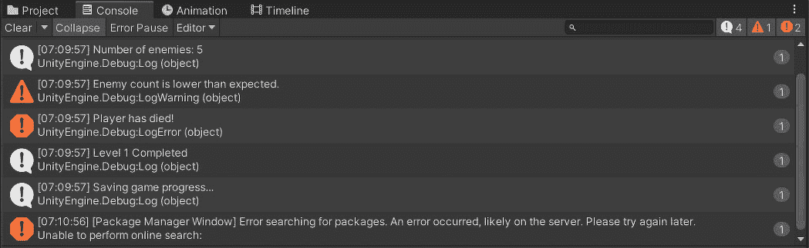

# 第三章：C# Fundamentals in Unity – Variables, Loops, and Troubleshooting Techniques

在本章中，您将通过探索使游戏栩栩如生的核心编程概念来加深对 Unity 和 C# 的理解。在设置 Unity 并掌握 C# 的基本知识后，我们将探索 C# 语法，以了解有效代码编写的结构。您将了解不同类型的数据存储以及如何在游戏中管理信息。

我们接着通过条件语句和循环来控制游戏流程，这允许对玩家动作和游戏事件进行动态响应。本章还涵盖了函数结构，以帮助组织和简化代码，使复杂任务变得可管理并可重用。此外，我们还将为您提供调试技术，以确保游戏运行顺畅。

通过在 Unity 和 C# 的初始知识基础上构建，本章旨在将您的技能从基础提升到实践，增强您创建互动和引人入胜的游戏体验的能力。

在本章中，我们将涵盖以下主要主题：

+   C# 语法简介

+   变量和数据类型

+   C# 中的控制结构

+   编写基本函数

+   探索 Unity 特定函数

+   调试 C# 脚本

# 技术要求

这里是本章的技术要求：

+   **Unity 编辑器（最新稳定版本）**：通过 Unity Hub 下载并安装最新稳定版本的 Unity 编辑器，以确保与所涵盖主题的兼容性。

+   **Unity Hub**：使用 Unity Hub 有效地管理 Unity 安装和项目版本。

+   **集成开发环境 (IDE)**：推荐使用 Visual Studio 或 Visual Studio Code 等 IDE，配置为 Unity 开发，用于编写、调试和管理 C# 脚本。

+   **互联网连接**：需要访问 Unity 文档和社区论坛以进行故障排除和支持。

您可以在此处找到与本章相关的示例/文件：[`github.com/PacktPublishing/Unity-6-Game-Development-with-C-Scripting/tree/main/Chapter03`](https://github.com/PacktPublishing/Unity-6-Game-Development-with-C-Scripting/tree/main/Chapter03)

# C# 语法简介

**C#（C Sharp）** 是由微软开发的一种现代、面向对象且类型安全的编程语言。它被广泛用于开发桌面应用程序、Web 应用程序以及使用 Unity 的游戏开发。理解 C# 编码的结构对于有效编程至关重要。以下是基本结构和 C# 中的某些关键元素的概述：

## C# 程序的基本结构

一个典型的 C# 程序包括以下内容：

+   `System` 是一个包含 `Console` 等类别的命名空间，这些类可用于输入和输出操作。例如，`using UnityEngine;` 通常出现在脚本顶部。

+   **类声明**：类是创建对象的蓝图。**类**封装了对象的数据以及操作这些数据的方法。

+   **主要方法**：这是 C# 程序的入口点，程序执行从这里开始。它必须声明在类或结构体内部。

+   **语句和表达式**：这些是在方法内可以执行的操作，例如声明变量、循环和条件语句。

+   `;` 字符用作语句终止符，表示单个语句或指令的结束，允许在代码中分离和阐明不同的操作。

+   `//`，多行注释在 `/*` 和 `*/` 之间。

C# 是微软开发的一种现代、面向对象的编程语言，对于开发桌面、Web 和 Unity 应用程序至关重要。理解其结构，包括命名空间、类声明、主方法、语句和注释，对于有效的编程至关重要。接下来，我们将探讨代码头部的预期功能和结构。

### 预期功能和结构 – 头文件

在 C# 中，头文件可能不会像在文件格式或协议规范中那样指向代码的特定部分。然而，C# 文件的顶部通常包含以下内容：

+   `using System;` 允许你使用 `System` 命名空间中的类，而无需完全限定它们的名称。

+   **命名空间声明**：如前所述，这组织了你的代码并避免了名称冲突。

在 C# 文件的顶部，你通常会找到用于命名空间的 `using` 指令和命名空间声明，以组织代码并避免名称冲突。接下来，我们将探讨 C# 中方法的结构和功能。

### 预期功能和结构 – 方法结构

C# 中的方法结构如下：

```cs
accessModifier returnType MethodName(parameterList)
{
    // Method body
}
```

让我们分解代码来理解这个例子：

+   `accessModifier`：这指定了变量或方法从另一个类中的可见性。它通常是 `private` 或 `public`。

+   `returnType`：方法返回的值的类型。如果方法不返回值，则返回类型为 `void`。

+   `MethodName`：方法名，遵循命名约定。

+   `parameterList`：括号内包含的是方法的输入，指定了它们的数据类型。

C# 中的方法结构包括访问修饰符（指定可见性）、返回类型（返回值的类型）、方法名和参数列表（带有数据类型的方法输入）。接下来，我们将讨论类级别变量和方法变量之间的区别。

## 类级别变量与方法变量对比

使用 `public` 访问修饰符；否则，为了封装，使用 `private` 或 `protected`。以下是一个示例：

```cs
Public class MyClass
{
  private int classLevelVariable;
  // Accessible by any method in MyClass
  Public void MyMethod()
  {
    //Method body can access classLevelVariable
  }
}
```

这段 C# 代码定义了一个名为 `MyClass` 的类，该类包含一个私有整数变量 `classLevelVariable`，该变量只能在类内部访问。该类还包括一个公共方法 `MyMethod`，它可以访问并操作 `classLevelVariable`。变量的私有作用域确保了其封装性，并防止外部修改，而 `MyMethod` 可以用它进行各种内部操作。

相反，**方法变量**（**局部变量**）是在方法内部声明的，并且只能在其中使用。它们不能被类中的其他方法访问。以下是一个示例：

```cs
  Public void MyMethod()
  {
    int methodVariable = 0; // Only accessible within MyMethod
  }
```

每种编程语言都有其结构和约定。C# 也不例外。通过学习这些，你可以编写清晰、可维护和高效的 C# 代码。

在本节中，我们探讨了 C# 程序的基本结构，包括命名空间声明、类声明、主方法和语句和表达式的使用等基本元素，强调了分号字符作为语句终止符的作用。我们强调了使用指令如 `using UnityEngine;` 的作用，它可以简化开发过程，通过消除完全限定类名的需要。我们区分了类级别变量，可以在整个类中访问，以及方法变量，仅限于它们各自的方法。理解这些基本结构和约定对于编写清晰、可维护和高效的 C# 代码至关重要。接下来，我们将更深入地了解 C# 数据类型和变量，这将提高你在这种多才多艺的语言中的编程效率。

# 变量和数据类型

在本节中，我们将深入研究 C# 中变量和数据类型的基本概念，这对于在应用程序中存储和操作数据至关重要。理解 C# 如何将数据分类到不同的类型以及这些类型如何与内存交互——特别是栈和堆——对于高效编程非常重要。

我们将探讨值类型和引用类型之间的区别，值类型直接存储数据，而引用类型存储对实际数据的引用，阐明它们各自在栈和堆内存中的用途。我们通过 C# 的数据景观之旅将涵盖从整数、浮点数、布尔值、字符和字节等原始类型，到更复杂的结构体和枚举等更复杂结构，这些结构允许更结构化的数据表示。

此外，我们还将探讨类，这是 C# 面向对象编程的支柱，以及字符串、数组和委托，它们分别提供处理文本、数据集合和方法引用的独特功能。这个全面的概述将使你具备扎实的 C# 数据处理机制理解，为更高级的编程技术和 C# 应用程序中的有效内存管理铺平道路。

## 理解变量和数据类型

在本节中，我们将深入了解 C# 中变量和数据类型的基础知识，这对于任何编程任务都是必不可少的。**变量**充当可以更改的数据的占位符，而理解 C# 的各种**数据类型**有助于你选择最有效的方式来存储和处理这些数据。这种知识对于编写有效且资源高效的 C# 代码至关重要，为更复杂的编程概念提供了坚实的基础。

在 C# 编程中，变量是必不可少的，因为它们充当代码中数据的命名存储位置。每个变量都定义了一个特定的数据类型，确定了它可以持有的数据的性质，例如整数、文本或更复杂的对象。这种清晰的声明对于静态类型语言（如 C#）至关重要，其中变量的数据类型在编译时确定，从而增强了代码的安全性和可读性。

C# 将数据类型分为两大类——值类型和引用类型。值类型（如 `int`），浮点数（如 `float` 和 `double`），以及布尔类型（`bool`）直接存储数据。引用类型（如 `string`），数组，和对象存储对实际数据的引用，这影响了信息在程序中的传递和管理。

对变量和数据类型的基本理解为 C# 中的所有编程任务奠定了基础，从简单的数据操作到复杂的应用逻辑。这是一个基石概念，确保了你的代码不仅功能性强，而且高效且有效，为更高级的 C# 编程技能铺平了道路。

### 为什么选择正确的数据类型很重要？

在 C# 中选择合适的数据类型对于优化内存使用和确保高效的数据操作至关重要。每种数据类型都有特定的内存占用和值范围，因此选择一个与你的需求紧密匹配的类型可以显著提高应用程序的性能。例如，对于小的数值，使用 `byte` 而不是 `int` 可以节省内存，这在大型数据集或内存受限的环境中尤为重要。

使用适当的数据类型，如字符串用于文本，整数或浮点数用于数值，可以使你的代码更易于理解，并通过确保数据被正确存储和处理来降低出错的可能性。例如，`enum` 可以清楚地传达固定值集，如一周中的日子，从而提高代码的可读性和可维护性。总之，谨慎选择数据类型是编写高效、清晰和健壮的 C# 代码的关键，它影响着应用程序的性能和开发者的体验。

理解 C# 中的变量和数据类型对于高效的数据存储和处理至关重要。这些概念构成了更复杂编程挑战和内存管理的基础。当我们深入研究堆栈和堆内存时，区分值类型和引用类型对于有效的数据处理和 C# 开发中的性能至关重要。

## C# 中的内存管理——堆栈与堆

随着我们深入到 C#编程的复杂性中，对变量和数据类型的牢固掌握将成为我们旅程的基石。这些基本概念对于任何开发者都是不可或缺的，因为它们决定了数据在程序中的存储、操作和访问方式。

理解值类型和引用类型之间的细微差别，以及它们在栈和堆内存中的相应存储机制，是必不可少的。这种基础知识不仅提高了代码的效率和清晰度，而且为掌握 C#内存管理的更复杂方面铺平了道路。

当我们转向探索栈与堆内存的动态性时，明智地选择数据类型的重要性变得越来越明显，这直接影响到应用程序的性能和可靠性。

下面的图示说明了计算机内存分为堆和栈部分。主要区别在于计算机如何使用每个部分。


图 3.1 – 栈和堆是计算机内存的部分

在 C#的背景下，栈和堆内存对于管理程序如何存储和访问数据起着关键作用。**栈**是一个**后进先出**（**LIFO**）结构，用于静态内存分配。这意味着最后添加的项目是第一个被移除的。**静态内存分配**指的是在编译时分配的内存，其大小和生命周期是固定的，与**动态内存分配**相对，后者在运行时发生。栈持有局部变量和函数调用，确保快速访问和高效管理作用域内变量。**作用域内变量**是指仅在特定函数或代码块上下文中存在的变量 – 例如，当函数被调用时，其局部变量被推入栈中，当函数返回时，这些变量被从栈中弹出。

相反，**堆**用于动态内存分配，其中存储了需要全局访问或较长时间生命周期的对象和数据结构。与栈不同，堆的组织性较差，允许变量大小和生命周期的灵活性，但代价是性能较慢。

理解栈和堆内存的独立功能和使用场景对于有效的 C#编程至关重要，它影响着内存使用、应用程序性能，甚至错误管理。

在 C#中，值类型和引用类型使用栈和堆内存的方式不同，反映了它们各自的特征和用法。值类型，如整数和布尔值，直接存储在栈上，其值以紧密管理的 LIFO 方式分配和释放。这种方法有利于快速和高效的访问，尤其是对于短期变量。

引用类型，包括对象、字符串和数组，存储在堆上，这是一个结构较松散的内存区域。虽然实际数据位于堆上，但栈持有对这些堆分配对象的引用或指针。这种分离允许引用类型在创建范围之外的不同程序部分中被访问和修改，从而促进动态内存管理，但可能会因为堆分配和垃圾回收的开销而对性能产生影响。

在对 C#编程的探索基础上，我们已经通过理解变量、数据类型及其在栈和堆内存中的管理为其奠定了基础。这个基础非常重要，因为它决定了数据的存储和访问方式，值类型在栈上用于快速访问，而引用类型在堆上用于动态分配。

随着我们向前迈进并深入研究诸如整数、浮点数、布尔值、字符和字节等原始类型，我们将应用这些内存分配的核心概念来理解它们在 C#中的特定角色、限制和应用。这种逐步推进对于提高我们的编码实践和理解至关重要，为我们准备在 C#中进行更高级的数据处理和高效的应用程序开发打下基础。

## 原始类型

随着我们进一步深入 C#编程的精髓，我们的下一个焦点是**原始类型**——这是编码的基础，支撑着我们如何表示和操作基本数据。这些类型包括具有定义用途和限制的整数；提供不同精度数学计算的浮点数；用于真/假逻辑的布尔值；用于文本数据的字符；以及用于高效数据存储和操作的字节。

这些数据类型中的每一个都在构建健壮和高效的 C#应用程序中扮演着关键角色，是更复杂的数据结构和算法的构建块。理解它们的特性和应用对于任何希望掌握 C#编程细微之处的开发者来说都是必不可少的。

### 原始类型 – 整数

在 C#编程中，**整数**作为表示整数的根本数据类型，对于计数、循环和需要精确到最接近整数的结果的算术运算等广泛的编程任务至关重要。C#提供了几个整数的子类型，以满足各种需求，每个子类型都有自己的范围和大小，从而确保开发者可以根据其特定需求选择最合适的数据类型。

在 C#中处理数值数据时，选择适当的整数数据类型对于确保效率和满足所需范围的需求至关重要。以下是一个列表，详细说明了 C#中的不同整数数据类型，每种类型都适合不同的数值范围和内存效率考虑：

+   `int` 或 `Int32`：最常用的整数类型，`int` 的范围从 -2,147,483,648 到 2,147,483,647。由于它在范围和内存效率之间的平衡，它是 C# 中数值操作的默认选择。

+   `long` 或 `Int64`：当你需要存储超出 `int` 容量的更大数字时，`long` 就派上用场，它具有更宽的范围，从 -9,223,372,036,854,775,808 到 9,223,372,036,854,775,807。它适用于需要大量数值数据的场景，如大量计数或高范围计算。

+   `short` 或 `Int16`：对于内存使用是关注点的较小数值数据，`short` 提供了一个更紧凑的范围，从 -32,768 到 32,767。它在受限环境中或处理有限数据集时很有用。

+   `byte`：`byte` 类型表示一个 8 位正整数，范围从 0 到 255。它在文件 I/O 操作、二进制数据处理以及数据范围本质上限制在字节大小的场景中特别有用。由于字节始终是正数，它们也被称为**无符号**。

选择合适的整数子类型对于优化内存使用和防止溢出错误至关重要。每个子类型都针对特定的数值范围和场景进行了定制，因此了解它们的限制和应用是高效且健壮的 C# 编程的关键方面。

### 原始类型 - 浮点数

`float` 和 `double`。

`float` 类型，或 `double`。

相反，`double` 类型，或者说是用于高精度计算、科学计算以及任何对浮点数精度至关重要的应用的“首选”类型。在某些情况下，它可以有更多的数字。

在 `float` 和 `double` 之间进行选择取决于你应用程序的具体要求——例如，在图形编程或简单的游戏机制中，出于性能原因，`float` 可能就足够了。

相比之下，金融应用或复杂的科学模拟可能需要 `double` 提供的精度。在 C# 中处理浮点数时，理解精度和性能之间的权衡至关重要。

### 原始类型 - 布尔值

在 C# 中，`bool` 类型是最简单的数据表示形式，它只包含两个可能的值——`true` 或 `false`，封装了二进制逻辑的本质。这种基本类型在程序的控制流和决策过程中至关重要，例如在 `if-else` 语句、循环中评估条件以及在应用程序中切换状态。

不论是检查用户输入是否有效、确定逻辑运算的结果，还是控制 UI 元素的可见性，布尔值作为二元决策的支柱，是 C# 编程工具箱中不可或缺的工具。它们直观的特性使得代码清晰简洁，提高了软件开发的可读性和可维护性。

### 原始类型 - 字符

在 C#编程中，文本操作的基础始于基本`char`类型，这对于需要检查或操作文本的字符级操作是必不可少的，为解析、分析和处理字符串的各个元素提供了构建块。

在扩展单个字符的概念的基础上，C#引入了`string`类型来表示字符序列作为统一实体。C#中的**字符串**是不可变的；一旦创建了一个字符串对象，其值就不能更改。这种不可变性增强了字符串数据在各种操作中的安全性和稳定性，确保字符串值在整个程序执行过程中保持一致。

然而，字符串的不可变性质也要求仔细考虑内存使用和性能，尤其是在涉及大量字符串操作的场景中。这是因为看似修改字符串的操作实际上会导致创建新的字符串实例——即在内存中创建一个重复的字符串。

理解`char`类型用于单个字符和`string`类型用于字符序列之间的相互作用对于在 C#中有效处理文本至关重要。这种知识使开发者能够精确地导航文本处理的复杂性，利用`char`和`string`类型充分发挥其潜力，适用于从简单的数据录入到复杂的文本分析和操作的各种应用。

### 基本类型 – 字节

在 C#编程中，`byte`类型对于读取和写入数据流、在不同数据表示之间转换以及与需要精确控制数据编码的外部系统接口是必不可少的。无论是解析来自网络服务的 JSON 有效负载还是处理多媒体文件，字节提供了进行详细和高效数据操作所需的粒度。

探索 C#中的基本类型使我们牢固地掌握了编程中必不可少的根本数据类型。每种数据类型，从整数和浮点数到布尔值、字符、字符串和字节，都服务于特定的目的，增强了逻辑操作和数据处理。

随着我们继续探索结构体，对这些基本类型的深入了解将非常有价值，它提供了清晰的角度，了解何时以及为什么用户定义的值类型可能比这些基本数据类型更受欢迎或与之一起使用。这种进展为理解结构体在 C#中的多功能性和实用性奠定了坚实的基础，增强了我们创建更高效和健壮应用程序的能力。

## 结构体 – 用户定义的值类型

在 C#编程领域，**结构体**作为用户定义的值类型脱颖而出，将相关变量捆绑在一起，为具有值类型行为的类提供了一个紧凑的替代品。本节将阐明结构体是什么，它们的实际用途以及它们与基本类型相比如何。

了解何时使用结构体而不是原始类型对于提高代码效率和清晰度至关重要，尤其是在表示轻量级数据结构时。随着我们探索结构体，我们将发现它们在优化 C#应用程序中的战略优势。

在 C#中，`struct`是一个关键字，用于定义用户定义的值类型，使开发者能够将一组相关变量封装在一个名称下。与作为引用类型的类不同，结构体是值类型，这意味着每个实例都持有自己的数据，并且每次赋值或方法调用都会创建一个副本。这种特性使得`struct`在定义轻量级数据结构（如坐标、颜色值或复数）时特别有益，可以避免引用类型带来的开销。

结构体使用`struct`关键字定义，它们的值类型特性有助于在需要高效处理小型不可变数据类型的场景中提高性能，减少垃圾回收的负担并提高内存利用率。对于 C#中的高性能计算任务，结构体提供了一种紧凑且高效的数据表示方式，尤其是在涉及大量实例时。

### 结构体与原始类型之间的区别

在 C#中，结构体与原始类型形成了鲜明的对比，因为它们允许将多个相关数据项封装成一个单一实体，与像`int`或`bool`这样的单值原始类型不同。虽然原始类型是基本数据表示的基础，但结构体通过捆绑相关字段扩展了这种能力，使其非常适合建模更复杂但仍然轻量级的数据结构。

使用结构体而不是原始类型的决定取决于对这种复合数据结构的需求，同时避免引用类型（如类）的开销。当需要值类型语义时，结构体特别有利，确保每个实例都是独立的副本，这在数学计算、几何运算或任何数据完整性和性能至关重要的场景中至关重要。

因此，在原始类型和结构体之间进行选择涉及评估你正在处理的数据的复杂性和在 C#应用程序中值类型与引用类型语义的性能影响。

在我们探索 C#编程的过程中，我们已经深入研究了结构体（struct）的重要作用，结构体是一种封装相关变量的用户定义值类型，它提供了结构化但轻量级的类替代品。通过`struct`关键字，C#允许你高效地组合数据，非常适合表示复杂但紧凑的数据结构，如坐标或颜色值，并且还增加了值类型语义，这有助于提高性能和内存效率。这种与原始类型和类的区别突出了结构体在数据完整性、性能和避免引用类型开销至关重要的场景中的实用性。

随着我们继续讨论枚举（enum），我们将在此基础上构建高效数据表示的基础，转向枚举通过提供有意义且类型安全的方式来处理相关常量集，从而使代码更易于阅读和维护，进一步丰富了有效 C#开发的工具集。

下图显示了颜色调色板选择屏幕：


图 3.2 – 枚举可以填充下拉菜单，玩家可以在其中选择游戏的配置。在此，玩家可以选择他们想要的颜色调色板

枚举填充弹出菜单并充当过滤器，减少了显示的颜色调色板数量。在先前的图中，颜色调色板的范围尚未更新以反映**战斗 - 秋季**的选择。当玩家从菜单中选择不同的枚举时，颜色调色板的显示将更新以反映该选择。

## 枚举（enum）

现在，我们将把注意力转向 C#中的另一个关键结构，即`enum`。枚举通过允许开发者定义一组命名的常量，从而是一种强大的工具，可以增强代码的可读性和可维护性，使程序更容易理解且更不容易出错。这个特性在变量只能取一小组可能值的情况下特别有用，例如一周中的日子、一年中的月份或命令状态。

在本节中，我们将深入研究枚举的基本原理，探讨如何在 C#中定义和利用枚举来创建更直观且不易出错的代码。枚举不仅有助于编写更干净的代码，还强制执行类型安全，确保变量遵守预定义的约束，从而进一步巩固其在构建健壮 C#应用程序中的角色。

在 C#中，枚举（enum）是一种独特的数据类型，它允许一个变量表示一组预定义的常量，这通过限制值到定义的集合中，提高了代码的清晰度并维护了类型安全。

枚举在 C#中发挥着关键作用，通过使用相关值集的符号名称来使代码更易于阅读和维护。通过定义一个枚举，开发者可以用描述性标识符替换晦涩的整数值，使代码一目了然。这不仅降低了出错的可能性，还简化了维护和更新过程，因为更改可以在一个集中的位置进行，无需在散布的数字字面量中筛选。

枚举的自我文档特性增强了开发者之间的协作，并为代码库的整体健壮性和清晰性做出了贡献，确立了枚举作为结构化和高效 C#编程的基本结构。

在 C#中，定义和使用枚举非常简单，并且增强了代码的语义清晰度。枚举通过使用`enum`关键字定义，后跟一个名称和一组用花括号括起来的命名常量。一旦定义，枚举就可以用作变量、参数或返回值的类型，允许您以类型安全的方式处理一组预定义的选项，如下所示：

```cs
  Enum Day {Monday, Tuesday, Wednesday, Thursday, Friday,
  Saturday, Sunday};
Day meetingDay = Day.Monday;
```

在这个片段中，`Day`是一个表示星期的枚举，而`meetingDay`是一个类型为`Day`的变量，被分配了`Day.Monday`的值。以这种方式使用枚举使代码更易于阅读和维护，因为它清楚地传达了意图和可能的值范围，而不必依赖于可能导致错误的数字字面量。

探索 C#中的枚举，可以发现它们通过使用命名常量而不是数字字面量来增强代码的可读性和可维护性。枚举代表固定的集合，例如星期几，使代码更直观且具有抗错误性。它们简单的语法和类型安全性提高了清晰性和健壮性，用描述性标识符替换了任意的数值，这有助于简化维护和更好的协作。从枚举过渡到类，我们进入了面向对象编程的领域，这是 C#中面向对象编程的基础，它允许创建复杂的数据结构，并为复杂的应用程序封装行为和状态。

## 类 – 用户定义的引用类型

在 C#编程的更深入领域，我们现在将注意力转向类，这是面向对象编程的典范元素，体现了语言建模现实世界复杂性的能力。在 C#中，`class`或**类**是用户定义的引用类型，它提供了一个框架，将数据和行为封装成一个单一的统一单元。

本节将深入探讨类的解剖结构，研究其在复杂数据结构和系统中的骨干作用。通过理解类如何通过方法封装数据和定义行为，我们揭示了 C#在促进复杂、可扩展和可维护的软件开发设计方面的力量，标志着我们在 C#编程之旅中的关键进步。

C#中的类在面向对象编程范式中至关重要，将数据和行为封装成一致的单元，并作为创建对象的蓝图。它们体现了封装的核心原则，允许将数据和方法捆绑在一起。

此外，C#类引入了**抽象类**的概念，这是一个关键特性，允许类声明方法而不提供其实施，迫使从它们继承的其它类实现这些抽象方法。这种机制对于定义一组相关类的契约至关重要，确保一致性同时提供灵活的实现方式。

通过将抽象类整合到我们的讨论中，我们更深入地理解了 C#如何促进复杂的数据结构和行为，强化了语言管理并移除复杂性的能力，这对于开发复杂和可扩展的软件系统至关重要。

### C#中类的目的

C#中的类在促进复杂数据结构方面发挥着关键作用，提供了一个强大的框架来模拟软件应用内部复杂的关系和行为。通过将数据字段和操作封装成一个单一的统一单元，类能够创建可以高保真地反映现实世界实体及其相互作用的复合类型。这种封装不仅有助于围绕相关功能组织代码，还通过访问修饰符限制对敏感信息的访问来增强数据完整性。

此外，类支持组合和继承，允许开发者以受控的方式构建复杂的层次结构并扩展功能。这种在类之间嵌套或创建类层次结构的能力意味着即使是最复杂的数据关系也可以高效地表示和处理，从而产生更易于维护和可扩展的代码库，能够适应不断变化的需求。

我们对 C#中类的探索突出了它们在面向对象设计中的主要作用。类作为对象的蓝图，能够创建复杂的数据结构和行为。抽象类通过确保一致性和灵活的实现进一步增强了 C#，为可扩展和可维护的应用程序奠定了坚实的基础。

当我们从类结构化的世界过渡到字符串的微妙领域时，我们将更深入地探讨它们的不可变性质，以及 C#中文本数据的有效处理和操作，基于我们对原始字符类型的初步讨论，我们将探索更复杂的字符串操作和方法。

## 字符串 – 字符序列

在 C#中深入文本数据领域，我们会遇到**字符串**，它们是字符的复杂序列，构成了语言中文本操作的基础。本节将探讨字符串的本质，特别是它们不可变的特性，这决定了一旦创建字符串，就无法对其进行修改。我们将研究这种不可变性如何影响 C#中字符串的高效处理，从内存管理到性能考虑。

此外，我们还将涵盖与字符串相关的常见操作和方法，例如连接、比较、搜索和格式化。理解这些字符串的方面对于任何希望掌握 C#中文本处理和操作的程序员来说都是基本的，它使得创建更动态、响应更快、数据更丰富的应用程序成为可能。

C#中的`string`是一个 Unicode 字符序列，用于在语言中表示和操作文本数据。

在 C#中，字符串是一种基本的数据类型，旨在处理文本信息。对字符串的探索揭示了它们的不可变性质，这意味着一旦创建字符串对象，其内容就无法更改。这种字符串的特性乍一看可能显得有限，但它是一种故意的工程设计选择，可以增强字符串操作的安全性并提高性能。当字符串被修改，如通过连接或替换时，C#会创建一个新的字符串对象而不是修改原始对象，确保线程安全并简化内存管理。

`StringBuilder`类专门设计用于需要重复修改字符串的场景，例如在循环或复杂的连接操作中。`StringBuilder`通过维护一个可变的字符缓冲区来工作，允许进行修改而无需为每次更改创建新的字符串对象。

下图显示了在屏幕上作为文本显示的字符串，**Hello World**！


图 3.3 – 在游戏屏幕上显示的消息，Hello World!

在前面的图中，一个 C#脚本将文本**Hello World!**发送到 Unity UI Text 游戏对象。Unity UI Text 游戏对象的唯一目的是在屏幕上显示文本。

此外，C# 提供了各种常见字符串操作的方法，例如搜索子字符串、根据分隔符拆分字符串以及格式化字符串以供显示。这些方法针对字符串的不可变特性进行了优化，为开发者提供了强大的文本处理工具，在性能和易用性之间取得了平衡。了解如何利用这些特性以及在何时使用 `StringBuilder` 以实现更有效的字符串处理是 C# 开发者有效处理文本数据的关键，确保应用程序保持响应和资源高效。以下代码演示了如何在 C# 中使用 `StringBuilder` 类来有效地将多个字符串连接成一个输出：

```cs
  StringBuilder sb = new StringBuilder();
  sb.Append("Hello");
  sb.Append(" ");
  sb.Append("World");
  sb.Append("!");
```

在此示例中，使用 `StringBuilder` 将多个字符串连接在一起。这种方法比使用 `+` 或 `String.Concat` 进行连接（如下一段所述）更有效，尤其是在涉及大量连接的场景中，因为它避免了创建多个中间字符串对象。

C# 中的字符串配备了广泛的方法和操作，便于全面的文本处理和分析，使它们在各种编程需求中非常灵活。常见的操作包括 **连接**，将多个字符串合并为一个；**比较**，评估字符串的词法或值相等性；以及 **搜索**，允许你在较大的字符串中找到子字符串或字符。

此外，字符串可以通过 `Replace` 方法修改以交换文本段，`Trim` 方法删除空白，以及 `Split` 方法根据分隔符字符将字符串拆分为数组。这些操作以及其他操作为开发者提供了有效处理和转换文本数据所需的工具，从简单的数据格式化到 C# 应用程序中的复杂文本处理任务。

我们对 C# 中字符串的探索揭示了它们在文本处理中的不可或缺的作用，其不可变特性增强了安全性和性能，但需要使用 `StringBuilder` 来避免创建新字符串的开销。此外，C# 提供了广泛的方法用于连接、比较、搜索和格式化，为开发者提供了一个强大的工具集，用于复杂的文本处理，这对于动态和数据处理丰富的应用程序至关重要。

随着我们关注点从字符串转向数组，我们将深入探讨一种结构化的方法来处理项目集合，这标志着在掌握 C# 数据结构和提高我们在软件开发中高效管理和组织数据的能力方面迈出的另一个重要步骤。

## 数组 – 单一类型项目的集合

离开字符串的微妙世界，我们将深入到 C# 中结构化的数组领域，这是一个用于管理单一类型项目集合的基本结构。

数组是组织数据成为索引序列的基础，允许高效地存储和检索固定大小的集合。对于任何 C#开发者来说，理解数组是至关重要的，因为它们提供了一种简单而强大的方式来集体处理多个数据项，从而增强构建更组织化、高效和可扩展代码的能力。

本节将介绍数组的概念，强调其在各种编程场景中的实用性，在这些场景中需要系统地存储和访问预定的元素数量。我们将探讨声明数组的语法、初始化它们的过程以及遍历其元素的方法。

C#中的数组是一种基础的数据结构，旨在以将每个项目紧挨着前一个项目的方式存储固定大小的元素集合，所有元素类型相同。它们提供了一种简单而强大的组织数据的方式，通过索引使其易于访问。数组在各个编程场景中的实用性广泛，从以受控方式处理变量列表到对数据集执行批量操作。

通过提供一个固定大小、有序的集合，数组使得排序、搜索和迭代等操作变得轻松高效。这一特性使得数组在软件开发中成为不可或缺的工具，尤其是在处理已知数量的元素且需要统一处理，以及性能考虑（如快速访问和修改数据）至关重要的场合。

在 C#中声明数组的语法直观且灵活，允许开发者明确指定数组的类型和大小。数组声明从它将存储的元素类型开始，然后是方括号表示数组，最后是数组名称。

例如，声明一个名为`numbers`的整数数组，它可以容纳五个元素，可以通过`int[] numbers = new int[5];`来完成。这种语法为初始化数组奠定了基础，无论是通过声明时预定义的值，例如`int[] numbers = {1, 2, 3, 4, 5};`，还是通过在声明后使用它们的索引分配值，例如`numbers[0] = 1;`。以下是在 C#中初始化数组和分配元素的示例：

```cs
  int[] numbers = new int[5];
  // After initializing, set the first element equal to 1
  numbers[0] = 1;
```

这段代码初始化了一个包含五个元素的整数数组，并将第一个元素设置为`1`。

`int[,] matrix;`.

`for`循环（在接下来的`for`循环部分中详细解释）是遍历数组的流行选择，因为它提供了对索引的控制，能够直接访问每个元素。一个遍历`numbers`数组的`for`循环可能看起来像`for(int i = 0; i < numbers.Length; i++) { Debug.Log(numbers[i]); }`，其中`numbers.Length`动态地指代数组的大小。

C# 还提供了 `foreach` 循环，它抽象了索引处理，使迭代更加简洁，例如 `foreach(int number in numbers) { Debug.Log(number); }`。这种方法特别适用于不需要操作数组结构或跟踪索引的操作。请注意，`Debug.Log` 用于将消息记录到 Unity 控制台，这是 Unity 开发中常见的调试实践。以下代码片段展示了 `for` 循环和 `foreach` 循环的示例：

```cs
  for(int i=0; i<numbers.Length; i++)
  {
      Debug.Log(numbers[i]);
  }
  foreach(int number in numbers){Debug.Log(number);};
```

上述代码片段使用 `for` 循环和 `foreach` 循环遍历数字数组，将每个元素打印到调试日志中。`for` 循环遍历数字数组中的每个元素，并在 Unity 控制台中显示结果。`foreach` 循环以单行完成同样的操作。

注意

C# 使用 `Length` 属性来提供数组可以容纳的元素数量，从而有效地指示其大小。

掌握 C# 中数组语法、声明和迭代技术的技巧，使开发者能够熟练地管理和操作数据集合，这是算法开发、数据集管理以及依赖于结构化数据访问的功能创建的基础技能。这种处理数组的熟练度是高效 C# 编程的关键组成部分，为更高级的概念如委托搭建了桥梁。

当我们从数组的结构化世界过渡到委托的动态领域时，我们将探讨委托作为方法引用在事件处理和回调中的角色，进一步扩展 C# 在创建响应式和交互式应用程序中的多功能性和强大功能。这一步将深入探讨委托的声明、实例化和使用方法，标志着对 C# 在管理数据、行为和软件系统内交互的细微能力进行更深入探索的标志。

## 委托 – 方法的引用

随着我们深入到 C# 编程的高级结构中，我们会遇到 **委托**，这是一个强大的功能，它封装了方法引用，使得方法调用变得灵活和动态。委托在事件驱动和回调机制的设计中扮演着核心角色，允许方法作为参数传递并存储为变量，从而促进可扩展和可维护的代码架构。

在本节中，我们将揭示委托的概念，探讨其在事件处理和实现回调方法中的重要性。我们还将深入探讨在 C# 中声明、实例化和使用委托的实用性，阐明它们在构建复杂和响应式应用程序中的灵活性和实用性。

C# 中的委托类似于其他编程语言中的函数指针，但它们是类型安全的，这意味着它们只持有与它们的签名匹配的方法的引用。这一特性允许开发者在委托对象内部封装对方法的引用，使委托能够动态地调用它引用的方法。这种能力在构建事件驱动程序和实现回调方法中尤为重要，在这些情况下，动作需要在运行时延迟或决定。

### 事件处理和实现回调方法

委托是事件处理的基础，将事件与其处理程序连接起来。当事件发生时，委托调用附加到其上的方法，使程序能够无缝地响应用户交互、系统信号或其他触发点。例如，在图形用户界面中，按钮点击事件可以链接到委托，进而调用指定响应点击的方法，抽象事件处理机制，提供清晰灵活的事件响应管理方式。

回调方法利用委托来指定在特定任务完成后应调用的方法，例如异步操作。在任务执行后需要执行特定代码的场景中，这种方法非常有价值，例如更新用户界面或处理结果。通过使用委托进行回调，C# 程序可以保持关注点的清晰分离，提高代码的可重用性，并增强应用程序架构的可扩展性。

理解委托及其在事件处理和回调方法中的作用，揭示了 C# 中方法调用的动态和灵活特性。这种机制不仅提高了方法调用的抽象级别，而且为设计响应式、解耦和可维护的应用程序提供了大量可能性。

### 声明、实例化和使用委托

`delegate` 关键字，后跟返回类型、委托的名称以及括号中的任何参数。例如，`delegate int MathOperation(int a, int b);` 定义了一个委托，它可以持有任何接受两个整数作为输入并返回整数的方法的引用。

`int Add(int x, int y) { return x + y; }` 方法，你可以使用这个方法实例化之前声明的 `MathOperation` 委托 – `MathOperation op = Add;`。这种实例化不会调用 `Add` 方法，而是创建一个引用 `Add` 的委托实例 `op`。

使用 `op` 委托实例，你可以调用 `int result = op(5, 3);`，这将通过委托调用 `Add` 方法，传递 `5` 和 `3` 作为参数，并将结果 `8` 存储在 `result` 中。委托还可以作为参数传递给方法，实现回调机制和事件处理系统，其中方法可以在运行时动态指定。

下面是一个简单示例，封装了上述概念：

```cs
using System;
using UnityEngine;
public class DelegateExample
{
  // Declare the delegate
  delegate int MathOperation(int a, int b);
  public static void Main()
  {
      // Instantiate the delegate with the Add method
      MathOperation op = Add;
      // Use the delegate to invoke the Add method;
      int result = op(10, 5);
      Debug.Log($"10 + 5 = {result}");
  }
  // Method matching the delegate signature
  static int Add( int x, int y)
  {
      return x + y;
  }
}
```

在这个例子中，`Debug.Log`用于将消息记录到 Unity 控制台。声明了`MathOperation`委托，用`Add`方法实例化，然后用于执行加法，展示了在 C#中声明、实例化和使用委托的模式。这种模式在 C#中是创建灵活、可重用和松耦合代码结构的基础。

当我们从这些基本构建块转向 C#中的控制结构时，我们将把重点转移到程序内的执行流程上，探索如何管理决策和迭代以创建动态和响应式的应用程序。

# C#中的控制结构

控制结构是 C#编程的骨架，协调执行流程并使应用程序内的动态决策成为可能。本节将全面探索控制结构，从基于特定条件的程序决策的基本条件语句开始，到促进集合和数据集上重复性任务的循环结构。

我们将深入研究`if`-`else`和`switch`语句的语法和实际应用，揭示`for`、`while`、`do-while`和`foreach`循环的迭代能力，并了解`break`、`continue`和`return`等跳转语句的实用性，以控制执行流程。

通过理解这些元素，你将能够构建更高效、易读和响应式的 C#应用程序。随着我们开始这段旅程，通过介绍控制结构，我们将为更深入地理解它们如何指导程序行为以及增强软件开发中复杂问题解决和交互的能力奠定基础。

## 控制结构的介绍

通过`if`语句管理循环。掌握控制结构对于开发者构建连贯、高效和适应性的 C#代码至关重要，它们是创建复杂软件解决方案的基础。

控制结构从根本上决定了程序的执行流程，通过确定哪些代码块被执行、执行顺序以及什么条件下执行。在 C#中，如`if`-`else`语句这样的结构允许程序做出决策，根据特定条件执行不同的路径。循环结构如`for`、`while`和`foreach`允许代码块的重复执行，直到满足特定条件。

控制结构提供的这种条件和重复执行框架允许程序执行复杂任务，从处理数据集合到响应用户交互，从而将静态代码转化为动态、响应式的应用程序，能够高效地解决现实世界的问题。

在确立了控制结构如何协调程序内的执行流程之后，我们现在将重点缩小到条件语句，这是一个关键的子集，它使 C#中的决策成为可能。

### 条件语句

深入到条件语句的领域，我们将探讨`if-else`和`switch`语句——这些是使 C#程序能够根据特定条件做出决策并引导程序沿着不同路径的关键组件。本节通过示例和比较解释了这些结构的语法和实际用途，强调了它们在提高代码可读性、效率和适应性方面的作用。我们还将深入了解 if-then 语句如何评估条件以执行代码块，根据特定标准指导执行流程，从而增加实际应用中代码的功能性和逻辑结构。

下图显示了游戏屏幕的得分部分。游戏已经结束，出现了一条信息，**玩家胜利**！


图 3.4 – 游戏屏幕的一部分，显示了玩家的得分和敌人的得分，以及游戏结束信息，玩家胜利！

在管理得分显示的 C#脚本中，当游戏结束时，会调用一个 if-then 语句。在这种情况下，玩家获胜，因此显示**玩家胜利**！如果玩家输了，将显示**玩家失败**！

`if-then`语句是编程中的基本控制结构，根据条件的评估执行特定的代码块。其在 C#中的基本语法涉及`if`关键字，后跟括号内的条件和一个花括号内的代码块。如果条件评估为`true`，则执行花括号内的代码；如果为`false`，则跳过代码块。

这种简单而强大的结构允许开发者在程序中引入决策，使动作如验证用户输入、根据动态数据进行计算或根据特定标准控制执行流程成为可能，从而为应用程序添加一层逻辑和适应性。以下代码检查一个变量是否大于`5`：

```cs
int number = 10;
if (number > 5)
{
  Debug.Log("The number is greater than 5.");
}
```

在这个例子中，`Debug.Log`用于将消息记录到 Unity 控制台，这是 Unity 开发中常见的调试实践。评估`number > 5`条件。由于`number`持有值`10`，确实大于`5`，因此条件为`true`，执行花括号内的代码，将`The number is greater than 5`打印到 Unity 日志。

`if-then`语句是 C#中进行条件执行的关键工具，使程序能够做出决策并对不同场景做出反应。这个基础概念为探索循环结构铺平了道路，我们将深入研究`for`、`while`和`foreach`循环如何促进代码的重复执行，允许在更复杂的编程任务中进行高效的数据处理和控制流管理。

## 循环结构

探索 C#中的**循环结构**领域，我们将研究那些使代码能够重复执行的多功能机制，这是编程的一个基本方面，它提高了效率和功能。

本节将涵盖`for`、`while`、`do-while`和`foreach`循环，每个循环都有其独特的语法，适用于不同的迭代场景。从适用于已知迭代次数的情况的`for`循环，如遍历数组，到适用于迭代次数不确定的条件`while`循环，以及确保至少执行一次的`do-while`循环，我们将通过实际示例剖析它们的应用。

此外，`foreach`循环在轻松遍历集合方面的优雅性将被突出显示，展示其在简化代码和增强可读性方面的作用。这些循环结构是开发者工具箱中不可或缺的工具，使创建更动态、响应更快、更高效的 C#程序成为可能。

### `for`循环

C#中的`for`语句用于重复执行代码块，指定次数，允许根据初始条件、结束条件和增量表达式精确控制迭代流程。 

深入了解 C#中的`for`语句，其语法为结构化、可重复的任务提供灯塔，尤其是在迭代次数预先确定的情况下。`for`循环由三个基本组件构成——初始化、条件和迭代语句，所有这些都被括号包围，并用分号分隔。这种结构提供了一种紧凑而强大的方式来管理循环执行。以下是一个典型`for`循环的示例结构：

```cs
for (initialization; condition; iteration);
{
  // Block of code to be executed
}
```

让我们了解这段代码的元素：

+   `初始化`：这是循环的起点，通常在这里声明和初始化变量。它只在开始时执行一次。

+   `条件`：只要这个条件评估为`true`，循环就会继续执行代码块。它在每个迭代之前进行检查，充当进一步执行的守门人。

+   `迭代`：在每次循环迭代之后，执行这个语句。它通常用于更新循环变量，引导循环向其结束条件前进。

注意，每个元素之间由`;`（分号）分隔。

`for`循环的一个经典用法是遍历数组。由于数组本质上具有固定的大小，因此`for`循环是遍历其元素的理想选择。例如，为了计算数组的元素总和，你可能使用一个`for`循环，其中初始化将计数器设置为`0`，条件检查计数器是否小于数组的长度，迭代增加计数器：

```cs
int[] numbers = {1,2,3,4,5};
int sum = 0;
for (int i = 0; i < numbers.Length; i++)
{
  sum += numbers[i]; // Adds each array element to sum
}
```

除了数组遍历之外，`for` 循环在需要重复执行且具有明确开始和结束点的场景中非常有用，例如生成一系列数字、处理列表中的项目或执行特定次数的任务。这个循环从开始到结束对迭代过程的精确控制，使其成为程序员工具箱中的一种多用途工具，能够适应广泛的算法挑战。

### `while` 循环

从 `for` 循环提供的结构化和基于计数的迭代转向，我们在 Unity3D 游戏开发背景下进入了一个更多基于条件的 `while` 循环的世界。C# 中的 `while` 语句擅长在指定的条件保持 `true` 的情况下重复执行代码块。这个特性在游戏开发场景中特别有价值，其中迭代的次数不是预先确定的，可能取决于动态的游戏事件或状态。

`while` 循环的语法保持简洁优雅，专注于控制循环的条件：

```cs
while (condition)
{
  // Block of code to be executed as long as the condition
     is true
}
```

在这个结构中，循环的条件在执行其主体之前进行检查。如果条件为 `true`，则执行循环内的代码。这个过程会重复，直到条件不再满足，此时循环停止，执行继续进行循环之后的代码。

这种循环机制在游戏开发中非常有用，用于诸如等待玩家动作、持续检查游戏状态变化或执行直到满足特定游戏条件等任务。

考虑一个 Unity3D 场景，你需要等待特定的玩家输入来触发游戏事件，利用 `while` 循环结合 Unity 的事件驱动架构。而不是直接的用户提示，你可能使用 `Debug.Log` 输出调试信息：

```cs
bool awaitingInput = true;
while (awaitingInput)
{
  // Debug.Log is used for logging messages to the Unity
     Console
  Debug.Log("Waiting for 'exit' input to proceed.");
  // Imagine this is a method that checks for specific
      player
  // input in Unity
  if (CheckForExitInput())
  {
      awaitingInput = false;
  }
  // It's vital to yield within a while loop to avoid
  // blocking the main thread in Unity
  yield return null;
}
```

在这个修改后的协程示例中，`Debug.Log` 用于将消息记录到 Unity 控制台，这是 Unity 开发中常见的调试实践。循环检查特定条件（在这种情况下，是模拟检查玩家输入的 `CheckForExitInput()` 方法）并继续迭代，直到条件满足。在循环中包含 `yield return null;` 是一个关键的 Unity 特定考虑，确保循环释放执行，防止阻塞主线程，这在 Unity3D 的基于帧的执行环境中尤为重要。这个例子强调了 `while` 循环在适应 Unity 游戏开发中动态、事件驱动特性的多用途性。

### `do-while` 循环

从 `while` 循环的条件优先方法转向，我们进入 `do-while` 循环的领域，它在 C# 中的循环结构中引入了一种微妙但影响深远的转折。

`do-while` 循环的显著特征是它至少执行一次循环体的保证，这使得它特别适合于循环代码需要在任何条件检查之前运行的场景。这个特性在需要初始执行而不论条件如何，后续迭代依赖于每次执行后评估的动态条件的情况下特别有用。

`do-while` 循环的语法强调了其先执行后检查的特性：

```cs
do
{
  // Block of code to be executed
} while (condition);
```

在这个结构中，`do` 部分内的代码块在第一次遍历时无条件执行。只有在这个初始执行之后，循环才会评估 `while` 部分中指定的 `condition`。如果条件为 `true`，则循环继续进行另一轮迭代，并在每次遍历后重新评估条件。当条件评估为 `false` 时，循环终止。

为了说明 `do-while` 循环的实际应用，让我们考虑一个与 Unity3D 游戏开发相关的例子。想象一个场景，玩家至少需要被提示一次做出选择，根据某些游戏条件（如玩家没有做出有效的选择）有重复提示的可能性：

```cs
bool validChoiceMade = false;
do
{
  // Debug.Log is used for logging messages to the Unity
     Console
  Debug.Log("Please make your choice. Enter 'Y' for yes
    or 'N' for no.");
  // Simulate checking for player's choice in Unity
  // This could be a method that returns true if a valid
  // choice is made
  validChoiceMade = CheckPlayerChoice();
  //Important to yield in Unity's do-while loop to prevent
  // blocking the main thread
  yield return null;
} while (!validChoiceMade);
```

在这个例子中，`do-while` 循环通过使用 `Debug.Log` 确保至少显示一次提示玩家做出选择的提示信息。然后循环检查是否通过 `CheckPlayerChoice()` 做出了有效的选择。循环中包含 `yield return null;` 是 Unity 特定的关键实践，确保循环将执行权交出，以保持游戏响应。这个例子展示了 `do-while` 循环在游戏开发上下文中的实用性，确保执行初始操作，后续操作取决于动态的游戏状态条件。

### foreach 循环

从 `do-while` 循环的保证初始执行来看，我们将注意力转向 `foreach` 循环，这是一个专为集合设计的结构。`foreach` 循环因其简单性和可读性而突出，尤其是在迭代数组、列表或任何可枚举集合中的元素时。这个循环抽象掉了索引和边界检查的复杂性，允许采用更直观且更不易出错的集合遍历方法。

`foreach` 循环遵循一种简单的语法，强调正在处理的元素而不是循环机制：

```cs
foreach (var item in collection)
{
  // Block of code to be executed for each item
}
```

在这个结构中，`item` 代表正在迭代的 `collection` 中的当前元素，而 `var` 是集合中实际元素类型的占位符。循环会自动遍历集合中的每个元素，为每个元素执行代码块，直到到达集合的末尾。

为了说明 `foreach` 循环在 Unity3D 上下文中的优雅性，考虑一个场景，其中你有一个需要逐个处理的游戏对象集合，例如重置它们的坐标或更新它们的状态：

```cs
List<GameObject> gameObjects = GetAllGameObjects();
// Assume this gets all relevant game objects
foreach (GameObject obj in gameObjects)
{
  // Debug.Log to output the name of each game object to
     the
  // Unity Console
  Debug.Log("Resetting position for: " + obj.name);
  // Reset the position of each game object, for example,
  // to the origin
  obj.transform.position = Vector3.zero;
}
```

在这个例子中，`foreach`循环遍历`gameObjects`列表中的每个`GameObject`，记录其名称并重置其位置。`foreach`循环的简洁性使得代码易于阅读和理解，清楚地表达了迭代所有对象并对其执行操作而不需要传统循环结构的样板代码。这个例子展示了`foreach`循环如何在游戏开发场景中增强代码的清晰性和可维护性，尤其是在处理对象集合时。

C#提供了多种灵活的循环结构，以满足不同的编程需求——`for`循环适用于固定迭代次数，如数组遍历所示；`while`循环适用于不确定迭代次数，如等待用户输入时所示；`do-while`循环保证至少执行一次，适用于初始动作，如玩家提示；而`foreach`循环简化了集合迭代，提高了代码的可读性，如在游戏对象处理中。

我们现在将转向控制流，探讨 C#中的跳转语句，如`break`、`continue`和`return`，如何在循环和函数中提供细微的执行管理，增强开发者的编程工具箱。

## 跳转语句

深入探讨 C#的控制流机制，我们将研究`break`语句，它用于停止循环或 switch case 的执行；`continue`语句用于跳转到下一个循环迭代；以及`return`语句，它用于提前退出方法或循环。此外，虽然不太受欢迎，但`goto`语句也将被探讨，因为它能够跳转到代码中的标记位置。

这些语句在管理执行流程中各司其职，增强了 C#程序的灵活性和决策能力。通过示例，我们将看到这些工具在实际应用中的运用，从终止循环到选择性地跳过迭代或返回值。

### `break`语句

C#中的`break`语句是一种强大的控制流机制，用于立即终止包围的循环或 switch case 的执行。在`for`、`while`或`do-while`等循环中，当满足特定条件时，`break`可以用来提前退出循环，跳过循环的正常终止条件。

这在迭代继续执行是不必要或不受欢迎的情况下特别有用，例如在搜索找到匹配项时。在 switch case 中，`break`语句结束一个 case 块，防止程序继续执行下一个 case。

为了说明`break`语句在循环中的使用，考虑一个游戏场景，你需要从物品集合中找到并处理一个特定的物品。一旦找到并处理了物品，继续循环就是多余的。在这里，`break`语句有效地停止了循环，节省了处理时间和资源：

```cs
List<string> items = new List<string> { "sword", "shield",
  "potion", "map" };
string targetItem = "potion";
foreach (string item in items)
{
  if (item == targetItem)
  {
      // Code to process the found item
      Debug.Log($"Item {item} found and processed.");
      break; // Exit the loop once the target item is found
  }
}
```

在这个例子中，`foreach`循环遍历游戏物品列表。当找到目标物品时，对其进行处理，并立即使用`break`语句终止循环。这防止了对剩余物品的不必要迭代，展示了`break`语句在增强循环效率和控制的效用。

### `continue`语句

从`break`语句提供的突然终止中跳出来，我们遇到了`continue`语句，它在循环控制中起着更微妙的作用。与完全退出循环的`break`不同，`continue`仅跳过当前迭代的剩余部分，并继续到循环的下一个迭代。这个语句在循环体内的某些条件使得剩余代码对于该迭代不必要或不相关的情况下特别有用，允许循环有效地进入下一个周期。

`continue`语句在仅需要执行特定迭代的某些代码，而其他迭代应跳过的情况下特别出色。例如，在处理数据集合的循环中，可能会有特定条件，如无效或不相关的数据点，需要跳到下一个迭代，而无需执行循环体内的剩余代码。

考虑一个游戏场景，其中游戏中的各种实体需要更新，但某些实体处于一种使其无法进行某些更新的状态。使用`continue`语句，循环可以跳过这些实体，而无需完全跳出循环：

```cs
List<GameEntity> entities = GetAllGameEntities();
// Assume this method retrieves all game entities
foreach (GameEntity entity in entities)
{
  if (!entity.IsEligibleForUpdate())
  {
      continue; // Skip the remaining code in this iteration
  }
  // Code to update the eligible entity
  entity.Update();
}
```

在这个例子中，循环遍历游戏实体列表，检查每个实体的更新资格。使用`continue`语句跳过任何不符合资格的实体，使循环能够直接移动到下一个实体，而无需执行更新代码。这种方法使循环对所有实体保持运行，同时高效地处理满足特定标准的那些实体，展示了`continue`语句在增强循环功能方面的应用。

### `return`语句

基于在循环中控制执行流程的主题，正如通过`continue`语句所看到的，我们继续探讨`return`语句，它引入了更广泛的作用域。与仅影响当前循环迭代的`continue`不同，`return`具有退出不仅循环而且放置它的整个方法的能力。这种能力使得`return`对于基于特定条件的早期退出方法特别有效，它也可以在方法内部嵌套的循环中使用，以提前终止方法的执行。

`return`语句非常灵活，允许它用来结束方法的执行，并且如果方法设计为产生输出，还可以选择性地返回一个值。这在某些情况下很有用，例如，当循环（或方法整体）中的某个结果或条件表明不需要进一步处理时，允许程序退出方法，并可能向调用者返回一个值。

例如，考虑一个负责在集合中搜索特定值的方法。一旦找到值，就没有必要继续搜索，方法可以立即返回，可能表示搜索成功或找到的值：

```cs
bool FindValue(List<int> values, int target)
{
  foreach (int value in values)
  {
      if (value == target)
      {
        Debug.Log($"Value {target} found.");
        return true; // Exit the method and return true
      }
  }
  return false; // Value not found after completing the loop
}
```

在这个例子中，`FindValue` 方法遍历一个整数列表以搜索目标值。一旦找到目标，该方法立即返回 `true`，表示成功。如果循环结束而没有找到目标，则方法返回 `false`，表示失败。`return` 语句能够在任何点退出方法，尤其是在循环内部，这突出了它在控制执行流程和提供高效且可读的代码解决方案中的重要性。

### `goto`语句

从`return`语句提供的结构化流程控制转向`goto`语句，这是 C#中更具争议性的特性之一。虽然`return`提供了干净且结构化的方式来退出循环和方法，但`goto`引入了一种灵活性，如果不谨慎使用，可能会导致复杂且难以维护的代码。`goto`语句允许在代码中无条件地跳转到标记位置，这可能会破坏执行的自然流程，使逻辑更难跟随。

尽管`goto`在方法内部进行直接和简单的跳转具有潜在的优势，但在现代编程实践中，其使用通常非常谨慎。主要担忧是它可能导致*意大利面代码*，这种代码的特点是错综复杂的控制结构，难以理解和维护。这在复杂的方法中尤其如此，多个`goto`语句可能会掩盖执行路径，使代码的可读性降低，更容易出错。

为了完整性，重要的是要承认在某些特定场景中，`goto` 可以是有用的，例如跳出嵌套循环或处理复杂的状态机时，使用其他构造可能不够高效或清晰。

然而，这些情况是例外而不是规则，通常建议使用循环控制语句（`break`和`continue`）、异常处理或重构为更小、更易于管理的函数来维护代码的清晰性和完整性。

例如，与其使用 `goto` 来退出嵌套循环，不如使用带有标志变量的 `break` 语句或从方法中返回一个值（如果适用），这通常可以达到相同的结果，并且具有更高的可读性：

```cs
bool found = false;
for (int i = 0; i < matrix.Length && !found; i++)
{
  for (int j = 0; j < matrix[i].Length; j++)
  {
      if (matrix[i][j] == target)
      {
        found = true;
        // Instead of using goto, we use a flag to exit
        // the outer loop
        break;
      }
  }
}
```

在这种改进的方法中，一个标志变量 `found` 控制从嵌套循环中退出，无需使用 `goto`，从而保留了代码的结构化和可理解性流程。这个例子强调了寻求 `goto` 的替代方案的建议，增强了代码的可读性和可维护性。

在 C# 中，控制流语句如 `break`、`continue`、`return` 和 `goto` 提供了管理执行路径的细微方式。`break` 语句用于提前退出循环或 `switch` 情况，在某些场景中提高了效率，例如在成功后终止搜索。

`continue` 语句跳过循环当前迭代的剩余部分，直接进入下一迭代，允许根据特定条件进行选择性处理。`return` 语句提供了一种提前退出方法的方式，可能带有值，通过在进一步处理不再必要时结束执行来简化函数。

最终，`goto` 语句虽然能够无条件跳转到标记位置，但由于其可能使代码结构复杂化，因此应谨慎使用，并且应该选择更结构化的替代方案以保持代码的清晰性和可维护性。

## 最佳实践

当我们从跳转语句的细微细节转向对 C# 中控制结构的更广泛视角时，认识到它们在构建动态和交互式应用程序中的关键作用是至关重要的。从条件语句到循环和跳转命令的控制结构构成了程序流程管理的骨架，使开发者能够指定其代码中的执行路径和决策过程。

本节将封装选择正确控制结构对于不同编程场景的重要性，确保每个选择都与应用程序的具体需求和逻辑相一致。强调最佳实践，我们将深入研究保持代码清洁和可理解的战略，例如最小化结构的深层嵌套，并优先考虑 `switch` 语句而不是多个 `if-else` 结构以提高清晰度和可读性。这些指南旨在为开发者提供利用控制结构有效所需的见解，促进高效、可维护和健壮的 C# 应用程序的开发。

在 C# 中为特定的编程需求选择合适的控制结构是一个关键决策，它直接影响代码的清晰度、效率和可维护性。手头任务的本质应指导这一选择：

+   对于具有已知迭代次数的任务，例如处理数组或列表中的每个元素，`for` 或 `foreach` 循环通常是最直接和可读的选项。

+   当处理需要重复执行直到某个条件改变的操作，而没有预定的迭代次数时，`while` 或 `do-while` 循环提供了必要的灵活性，其中 `do-while` 确保至少执行一次，无论条件如何。

+   C# 中的控制结构，如条件语句（`if-else` 和 `switch`）、循环结构（`for`、`while`、`do-while` 和 `foreach`）以及跳转语句（`break`、`continue` 和 `return`），对于指导程序流程和实现动态应用至关重要。对于多个条件，`switch` 语句比嵌套的 `if-else` 结构提高了可读性和组织性。最佳实践包括避免深层嵌套、将复杂函数简化为更小的方法，以及使用早期退出以保持代码的清晰和可维护性。有效使用这些结构确保了高效的动态 C# 代码。

+   在更复杂的场景中，当需要根据特定条件大幅度改变流程，例如提前退出循环或方法时，跳转语句如`break`、`continue`和`return`就派上用场，每个都有其独特的用途。

理解每个控制结构的细微差别和预期用途，使开发者能够做出明智的决定，从而编写出更清晰、更高效的代码，符合软件开发的最佳实践。

# 编写基本函数

在我们掌握 Unity3D 中 C# 编程的旅途中，本节揭示了函数的本质和机制，这对于构建结构化和健壮的代码至关重要。函数是编程的核心，它使代码重用、增强组织性并确保项目的可维护性。

从函数的解剖结构介绍开始——包括返回类型、名称、参数和作用域——我们将通过实际例子来探讨它们的应用。然后，我们将讨论 Unity 特定的实践，说明自定义函数如何在引擎的生命周期中集成，并进一步探讨递归、lambda 表达式以及委托和事件的微妙使用。

结合最佳实践和调试技巧，本探索旨在为您提供有效利用函数的知识，促进动态和交互式 Unity3D 应用程序的开发。

## C# 函数简介

在 C# 编程的领域中，函数作为基本构建块出现，使开发者能够封装可重用的代码片段，以执行特定任务。编程中的**函数**本质上是一系列定义好的语句，它们协同工作以执行特定的操作。通过将这些操作封装在函数中，程序员可以从代码的各个点调用这些预定义的任务，从而促进软件开发模块化和组织化。

函数的重要性超越了仅仅的代码执行；它们在将代码组织成逻辑上可管理段方面起着关键作用。这种组织对于个人开发者和在大型项目上工作的团队来说都是核心的，因为它提高了可读性和可维护性。函数允许隔离特定的功能，使得调试和测试代码库的离散部分变得更加容易。

此外，函数提供的**重用原则**不容小觑。通过一次定义函数，它可以在项目的不同部分或完全不同的项目中重用，而无需重写代码。这不仅节省了时间和精力，还减少了错误的可能性，因为经过充分测试的函数成为构建新应用的可靠构建块。

从本质上讲，函数是 C#结构化编程的骨架，使开发者能够创建更动态、高效和可维护的代码。它们在促进代码重用、增强组织和促进项目维护方面的作用在软件开发快速发展和不断变化的世界中是无价的。

### 函数的基本结构

在对 C#中函数的基础理解之上，我们现在转向剖析其基本结构，这是支撑其功能性和编程中实用性的关键方面。本节深入探讨 C#函数的解剖结构，探讨构成函数的语法元素，包括返回类型、函数名、参数和函数体。每个组件都在定义函数做什么、如何做以及执行后返回什么方面发挥着关键作用。

此外，我们还将解开函数内的作用域概念，这是一个决定变量及其自身可见性和生命周期的关键因素，进一步影响函数如何与程序的其他部分交互。理解这些结构元素是掌握如何在 C#中创建和使用函数的关键，为更高级的编程技术和概念铺平道路。

在 C#中，函数的语法包括四个主要组成部分：

+   `返回类型`表示函数将返回的数据类型，或者如果没有返回值，则为`void`。

+   **函数名**：函数名标识函数，并遵循命名约定以便于识别。

+   **参数**：参数列在括号内，允许函数接受输入，使其能够适应各种数据。

+   **函数体**：函数体被大括号包围，包含定义函数操作的可执行代码。

这些元素共同构成了函数的蓝图，为后续章节中更详细地讨论它们的作用和最佳实践奠定了基础。

函数内的**作用域**概念涉及到变量和函数本身在程序中的可见性和生命周期。在 C#中，定义在函数内部的变量，包括其参数，都是局部于该函数的。这意味着它们只能在函数体内部访问和修改，有效地将函数的内部状态与程序的其他部分隔离开来。

这种封装确保了函数的操作不会无意中影响代码的其他部分，促进了更干净、更模块化的编程实践。理解作用域对于在函数内管理数据、防止命名冲突和确保函数执行完整性是必不可少的。

在概述了 C#函数的基本结构之后，包括其返回类型、名称、参数和主体，我们现在将使用一个简单的函数示例来应用这些概念。这个实际示例将展示理论组件如何作为一个统一的整体结合在一起，从而更清楚地理解函数如何在现实世界的编程场景中被构建和执行。

### 一个简单的函数示例

要理解 C#在游戏开发中函数的实际应用，让我们考虑一个简单的例子——一个通过在游戏过程中收集到的分数来计算玩家得分的函数。这个例子说明了返回类型、函数名、参数和函数体如何共同工作以执行特定任务。通过探索这个基本操作，我们可以欣赏到函数在创建动态游戏功能、为更复杂的游戏机制奠定基础方面的强大功能和实用性。

一个典型的例子来说明 C#中函数的使用是一个将两个数字相加的函数。这个函数体现了 C#函数的基本结构和语法，展示了如何通过参数接收输入，进行处理，然后将结果作为返回值输出。考虑以下简单的函数：

```cs
bool WhoWinsBattle(int player, int enemy)
{
  if (player > enemy) return true;
  return false;
}
```

在这个例子中，`bool`在`WonWinsBattle`之前指定该函数将返回一个布尔值。`WonWinsBattle`是函数的名称，它清楚地描述了函数的目的。`int player`和`int enemy`参数是要比较的两个数字。在函数体内，`player`和`enemy`的比较被确定。如果`player`更大，则返回`true`；否则，返回`false`。这个简单的函数封装了 C#函数的精髓，展示了它们以干净、模块化的方式执行任务并返回结果的能力。

在简单加法函数的基础示例之上，我们将现在深入探讨函数参数和返回类型的复杂性，首先从对参数的更仔细检查开始。这次探索将增强我们对函数如何接收和使用输入值的理解，进一步展示了 C#函数在适应广泛的数据和场景方面的灵活性和强大功能。

## 函数参数和返回类型 - 参数的详细说明

在 C#函数的领域内，参数通过定义函数可以接受的输入起着至关重要的作用，从而使得函数的操作具有定制性和灵活性。

本节将详细探讨参数的细微差别，探索它们的定义方式、向函数传递参数的过程以及这样做的影响。我们还将探讨不同类型的参数 - 值、引用和输出 - 每种类型在函数交互中都有独特的作用，以及它们如何影响函数处理数据的行为。这个全面的概述将使你对函数参数及其在 C#编程中的关键作用有更深入的理解。

**参数**是函数与外部世界之间的桥梁，允许函数从外部来源接收数据并对其进行操作。在 C#中定义函数时，参数在函数名后面的括号内指定，每个参数由一个类型和一个名称定义。这种设置不仅让函数了解它应该期望的种类和数量的输入，而且还规定了调用代码需要提供的数据形式。

例如，在一个旨在确定玩家是否接触地面的函数（即玩家的鞋底与地面相等）中，此类函数定义的语法如下：

```cs
bool IsGrounded(float floorElevation, float
                  playerElevation)
{
  if (floorElevation == playerElevation) return true;
  return false;
}
```

向函数传递参数是在函数被调用时提供这些参数的实际值的行为。参数必须在类型和顺序上与参数匹配，以确保函数操作的数据与其定义兼容。例如，使用两个浮点数调用`IsGrounded`函数，如`IsGrounded(10, 20)`，将`10`和`20`作为参数分别传递给`floorElevation`和`playerElevation`参数。

注意，`IsGrounded`是游戏中的一个重要脚本，例如用于确定玩家是否可以跳跃。如果玩家不在地面上，他们要么在跳跃，要么在坠落。此外，玩家的海拔高度是从鞋底测量的。

参数与参数之间的关系是 C#中函数灵活性和可重用性的基础。通过抽象特定的值并关注数据类型，可以编写通用且可重用的函数形式，能够处理各种输入。这种机制强调了仔细定义和使用参数以增强函数的实用性和在更大软件系统中的集成的重要性。

在 C#中，根据它们如何将数据传递给函数，参数可以分为三种主要类型：值、引用和输出参数。每种类型都有其独特的行为和用例，影响数据在函数内部如何传输和处理。

### 值参数

在 C#中，参数默认情况下通常被视为值参数。这意味着当你调用一个函数时，实际参数的值会被传递给函数，函数在数据的副本上操作。在函数内部对参数所做的任何更改都不会影响函数外部的原始值。这种行为在你想让函数使用输入数据而不修改原始变量时很有用——例如，在一个更新玩家剩余星星数量的消息的函数中：

```cs
void UpdateStarMessage(int numberOfStars)
{
  starMessage = "Total Stars =" + numberOfStars;
}
```

玩家的星星数量被传递到`UpdateStarMessage`方法中。字符串变量`starMessage`被更改以反映当前的星星数量。

### 引用参数

当一个参数被定义为使用`ref`关键字引用参数时，这意味着函数接收原始数据的引用。在函数内部对参数所做的任何更改都会反映在函数外部的原始数据中。**引用参数**在需要修改输入数据或传递大型数据结构（如大型数组或对象）时非常有用，因为这些数据结构复制起来效率低下：

```cs
void UpdateScore(ref int score)
{
  score += 10;
  // Directly modifies the original variable passed
  // as an argument
}
```

整数变量`score`作为`UpdateScore`方法的焦点。当执行时，`UpdateScore`简单地将 10 加到变量`score`上。

### 输出参数

使用`out`关键字定义的**输出参数**与引用参数类似，但它们专门用于将数据返回给调用者。函数在完成之前预期将值分配给输出参数。输出参数通常在函数需要返回多个值时使用：

```cs
void CalculateStats(int[] numbers, out int sum, out float average)
{
  sum = numbers.Sum();;
  average = sum / (float)numbers.Length;
  // Assigns values to both output parameters
}
```

在前面的代码中，提供的函数`CalculateStats`接受一个整数数组`numbers`作为输入，以及两个输出参数`sum`和`average`。`sum`参数是通过使用`Sum`方法计算的，该方法是一个内置的`numbers`数组，将长度转换为`float`以确保浮点除法。

注意

Unity 的 C#中的 LINQ 是一组直接集成到语言中的查询功能，允许高效地操作和查询集合和数组。基本上，过去的先进程序员生成现有的 C#的扩展来解决经常需要的任务，如排序数组或简单地求和其值。这避免了重复他人的工作。

理解值、引用和输出参数的区别和适当的使用场景，可以让你更精确地控制 C#函数中的数据流，确保函数能够有效地满足各种编程需求。在 C#编程中，参数是函数的关键组成部分，它界定了函数可以接收的输入，并显著增强了其灵活性和适应性。

这次探索揭示了定义参数的复杂性、传递参数的机制以及它们对函数行为的影响。我们遍历了参数类型——值、引用和输出——每个都在函数内部的数据处理中扮演着独特的角色。

从确保原始数据不可变的基本值参数，到允许直接数据操作和多个返回值的引用和输出参数，理解这些类型至关重要。这种知识不仅强调了谨慎使用参数的重要性，而且为更高级的函数实现铺平了道路。

接下来，我们将把注意力转向学习更多关于返回类型的知识，进一步揭示函数如何结束操作并传达结果，无缝地将输入和输出连接起来，在 C#编程的功能范式之间。

## 解释返回类型

我们对返回类型的探索将阐明 C#函数的一个基本方面——决定它们的输出。这一部分将强调返回类型的重要性，从具体的数据类型到使用`void`来表示不返回值的函数，通过示例进行说明。理解返回类型对于定义函数的目的和输出至关重要，可以增强你 C#编程工作的精确性和有效性。

**返回类型**是 C#函数的核心组成部分，它声明了函数在完成时将向调用者返回的数据类型。这一特性是必需的，因为它不仅通知编译器预期的数据类型，而且指导开发者理解函数的功能以及如何利用其输出。本质上，返回类型在函数及其环境之间建立了一种契约，确保函数行为的连贯性和可预测性。

例如，一个声明为 `int` 返回类型的函数预期将计算并返回一个整数值。这种明确的声明防止了歧义，使得开发者可以无缝地将函数集成到依赖于整数结果的进一步计算或逻辑中。相反，具有 `void` 返回类型的函数表示它将执行其预期操作而不提供任何直接输出。这类函数通常用于其副作用，例如修改全局状态、处理输入/输出操作或触发事件。

返回类型的重要性不仅限于它们提供的直接值。它们是 C# 中类型安全的基础，确保应用程序中的数据流遵循定义的约束，从而减少错误。例如，尝试将 `void` 函数的输出分配给变量会导致编译时错误，从而防止潜在的运行时问题。这种明确定义和执行返回类型增强了用 C# 编写的代码的健壮性和可靠性。

为了说明 C# 中返回类型的多样性，让我们考虑几个示例，这些示例展示了函数可以提供不同类型的输出。每个示例都强调了返回类型如何影响函数的设计和实用性：

+   **返回简单值**：以下是一个输出示例：

    ```cs
    int GetPlayerScore()
    {
      return 100; // Returns an integer value
    }
    ```

    在这个简单的例子中，`GetPlayerScore` 函数被定义为具有 `int` 返回类型，表示它将返回一个整数值。当被调用时，它提供一个特定的分数值，可以直接在调用代码中使用，例如在比较或计算中。

+   **返回复杂类型**：以下是一个输出示例：

    ```cs
    Player GetPlayerDetails()
    {
      return new Player("Alex", 25);
      // Returns an instance of the Player class
    }
    ```

    在这里，`GetPlayerDetails` 函数返回一个自定义类型 `Player` 的对象。这展示了函数如何构建和返回复杂的数据类型，封装更详细的信息，这些信息可以被调用者访问。

+   **`void` 返回类型**：以下是一个输出示例：

    ```cs
    void LogPlayerEntry()
    {
      Debug.Log("A player has entered the game."); // No
        return value
    }
    ```

    `LogPlayerEntry` 函数具有 `void` 返回类型，表示它不返回任何值。这类函数执行是为了其副作用——在这种情况下，写入日志（可以在控制台中查看）——而不影响程序中的数据流。

+   **返回数组或集合**：以下是一个输出示例：

    ```cs
    string[] GetPlayerAbilities()
    {
      return new string[] { "Speed", "Agility",
        "Strength" };
      // Returns an array of strings
    }
    ```

    函数还可以返回数组或其他集合类型，如 `GetPlayerAbilities` 所示，它提供了一个表示玩家能力的字符串数组。这种能力对于返回多个相关值特别有用。

这些示例强调了 C#中返回类型的灵活性和强大功能，使得函数能够传达广泛的信息——从简单的数据类型到复杂对象和集合。通过仔细选择合适的返回类型，开发者可以设计出精确满足程序要求的函数，增强清晰度并促进有效的数据处理。

在 C#函数中，返回类型的选择非常重要，因为它定义了函数的输出并决定了它在应用程序中的用途。从简单的数据类型到`void`和复杂对象，返回类型确保函数能够有效地传达结果，遵守类型安全，并保持一致的行为。从基本整数到复杂类型和集合的例子展示了返回类型在 C#编程中的适应性和精确性，增强了代码的健壮性和可靠性。

当我们从返回类型的具体细节过渡到理解函数重载这一概念时，我们将进一步了解 C#中函数的多样性和能力。函数重载允许具有相同名称的多个函数共存，通过它们的参数列表来区分，使得函数的实现更加细致和灵活。

## 函数重载

**函数重载**在 C#中引入了在相同作用域内拥有多个同名函数的能力，这些函数通过它们的参数列表来区分。这一强大功能允许开发者创建多个函数版本，每个版本都针对处理不同类型和数量的参数而定制，从而增强了程序的灵活性和可读性。重载功能使得与函数的交互更加直观，因为根据提供的参数，最合适的版本会自动被调用，从而简化了代码执行并简化了函数的使用。

函数重载的优势在于它提供了一种更直观和上下文相关的函数使用方法。例如，考虑一个`Print`函数，它被设计用来将不同类型的数据输出到控制台。而不是为每种数据类型创建具有独特名称的函数，例如`PrintString`和`PrintInt`，重载允许你拥有多个`Print`函数，每个函数都设计用来处理特定的数据类型或场景。这不仅通过提供通用接口简化了函数的使用，也使得代码更加可读和易于维护。即将出现的示例可能看起来像是一个错误，因为相同的脚本重复了三次，但在这个例子中，C#会根据参数确定执行哪个函数：

```cs
void Print(int value)
{
   Debug.Log(value);
}
void Print(string value)
{
   Debug.Log(value);
}
void Print(double value)
{
   Debug.Log(value);
}
```

在前面的例子中，每个 `Print` 函数都进行了重载，以处理不同的数据类型——一个整数、一个字符串和一个双精度浮点数。当 `Print` 使用整数参数调用时，第一个函数被调用；当使用字符串调用时，第二个；依此类推。这种无缝的选择过程由编译器管理，简化了代码，并增强了其适应不同数据类型和需求的能力，展示了 C# 中函数重载的强大和实用性。

C# 中的函数重载通过允许具有相同名称但不同参数列表的多个函数，增强了语言的灵活性。这使得可以为各种数据类型和参数数量定制函数版本，从而促进更直观和上下文相关的函数交互。通过 `重载`，函数可以设计为适应不同的数据类型，简化代码使用并提高可维护性。编译器根据提供的参数选择适当的函数版本，简化了执行并强调了 C# 对不同编程需求的适应性。

随着我们从函数重载的一般原则过渡，我们将转向探索 Unity3D 中的 Unity 特定函数，在那里重载的概念在开发动态和响应性游戏元素中继续发挥着决定性作用。

# 探索 Unity 特定函数

在 Unity3D 中，`Start()` 和 `Update()` 等函数超越了标准的 C# 实践，作为重要的生命周期入口点。`Start()` 初始化设置，而 `Update()` 在每一帧执行代码，与游戏的运行时行为紧密一致，并精确可靠地编排执行流程。

`Start()` 函数在脚本的生命周期中只调用一次，在第一帧更新之前和所有对象初始化之后。这个函数是设置初始条件、收集组件引用和执行对脚本在游戏中的角色至关重要的设置操作的理想位置。由于 `Start()` 只执行一次，它对于需要在游戏或场景开始时运行的任务来说效率很高，确保在游戏进入主循环之前有一个平稳的设置。

相反，`Update()` 函数每帧调用一次，是 Unity 中大多数脚本的核心。在这里，游戏从处理用户输入和更新动画到管理物理计算和游戏状态转换的逻辑大部分发生。`Update()` 调用的频率使其适合需要定期检查或改变的操作，从而有助于游戏动态和响应性的特性。

这些函数无缝地融入 Unity 的生命周期，这是一个贯穿游戏或应用程序整个生命周期的事件和过程循环。`Start()`通过执行初始设置启动生命周期，然后是`Update()`维护每帧所需的持续活动和逻辑。它们共同构成了一个强大的脚本框架，用于编写游戏行为，允许开发者挂钩到 Unity 的生命周期，并确保他们的代码在正确的时刻执行，保持游戏开发中的秩序和效率。

### 创建 Unity 中的自定义函数

在 Unity 脚本中创建自定义函数是一种基本实践，它允许开发者模块化代码，使其更加有序、可读和可重用。这些自定义函数可以从 Unity 特有的函数，如`Start()`和`Update()`中调用，从而实现一种结构化的游戏开发方法，将复杂任务分解为可管理的、自包含的逻辑单元。

要定义一个自定义函数，你首先需要在 Unity 脚本中声明它，遵循与标准 C#函数相同的语法。这包括指定返回类型、命名函数、定义它所需的任何参数，然后在函数体中实现逻辑。例如，一个更新玩家健康的函数可能看起来像这样：

```cs
void UpdatePlayerHealth(int damage)
{
  playerHealth -= damage;
  if (playerHealth <= 0)
  {
      Debug.Log("Player defeated");
  }
}
```

一旦定义，这个自定义函数就可以从任何 Unity 特有的函数中调用。例如，你可能会在`Update()`函数中调用`UpdatePlayerHealth()`，以持续检查并应用玩家收到的任何伤害：

```cs
void Update()
{
  if (playerHit)
  {
      UpdatePlayerHealth(damageReceived);
  }
}
```

这种方法允许开发者将特定的行为和操作封装在自定义函数中，使核心 Unity 函数如`Update()`保持干净和专注于游戏的主要循环逻辑。通过在`Start()`、`Update()`或其他生命周期函数中调用自定义函数，开发者可以确保他们的游戏逻辑在适当的时间执行，从而有助于游戏的整体结构和功能。

此外，以这种方式利用自定义函数可以增强 Unity 项目的可扩展性，因为开发者可以轻松地添加、修改或删除功能，而不会显著干扰主游戏循环。它还通过隔离功能，使识别和解决游戏逻辑特定部分的问题变得更加容易，从而促进协作和调试。

Unity 特有的函数，如`Start()`和`Update()`，构成了 Unity 中游戏脚本的骨架，协调游戏循环中的初始设置和持续动作。将这些自定义函数集成到这些关键的生命周期方法中，可以创建出结构化、有序的代码，从而增强游戏功能。

转到访问修饰符的话题，我们将探讨它们如何控制这些函数和变量的可见性和可访问性，确保在 Unity 脚本环境中进行受控交互和安全。

### 访问修饰符

在 Unity 脚本中，`public`和`private`是管理函数和变量如何被访问和修改的关键。它们是 C#中的基本工具，用于封装脚本数据，确保只在脚本内部和脚本之间发生预期的交互。本节将探讨这些修饰符对脚本安全性和结构的影响，强调它们在保持 Unity 项目中代码整洁和安全方面的作用。

Unity 脚本中的访问修饰符，如`public`、`private`、`protected`和`internal`，定义了函数、变量和其他成员在脚本中的可访问范围。这些修饰符是 C#编程的基础，在封装数据和确保类或脚本的内部实现细节被隐藏并防止意外访问方面发挥着关键作用。

`public`修饰符使函数或变量可以从 Unity 项目中的任何其他脚本或类中访问。这种开放程度对于需要在 Unity 检查器中公开的变量或必须从其他脚本中调用的函数（如事件处理程序或 API 方法）非常有用。例如，玩家角色脚本中的`public`函数可能被敌人脚本调用以施加伤害。

相反，`private`修饰符将函数或变量的访问限制在声明它的类中。这是 C#中类成员的默认访问级别，用于封装类的内部工作，仅在必要时才通过公共方法允许访问。这种封装原则是面向对象设计的关键，促进了模块化并减少了代码库不同部分之间的依赖性。

其他修饰符，如`protected`，允许从类本身及其任何继承自该类的子类中访问。`internal`修饰符限制访问范围在程序集内，在 Unity 中通常意味着整个项目，在`public`和`private`之间提供了一个平衡。

正确理解和应用这些访问修饰符对于 Unity 脚本编写非常重要，以确保组件以受控和预期的方式相互交互。它们有助于在类的外部交互意图和内部应保持不变的部分之间保持清晰的边界，从而有助于游戏代码的整体健壮性和可维护性。

Unity 中的访问修饰符，如`public`和`private`，在定义脚本元素的可访问性方面发挥着核心作用，确保在游戏代码中实现受控的交互和数据保护。通过有效地使用这些修饰符，开发者可以保护脚本的内逻辑，仅公开必要的内容，保持整洁和安全的架构。

我们将从一个结构化的访问修饰符的使用转向递归的概念——这是一种强大但复杂的编程技术，允许函数调用自身，为在 Unity 脚本中的问题解决和算法实现开辟新的维度。

### 高级函数概念——递归

递归是一种强大的编程技术，它涉及一个函数通过调用自身来处理问题，通过将其分解为更小、更易于管理的子任务来实现。这种方法特别适合于可以用类似、更小的子问题来定义的问题，例如遍历分层数据结构或解决复杂的数学方程。通过反复调用自身来解决这些子问题，函数可以系统地、高效地找到原始、更大问题的解决方案。

考虑以下示例——列出游戏对象的子对象：

```cs
void TraverseTransformHierarchy(Transform currentTransform)
{
    // Print the current transform's name
    Debug.Log(currentTransform.name);
  // Recursively call the function for each child transform
    foreach (Transform child in currentTransform)
    {
        TraverseTransformHierarchy(child);
    }
}
```

以下是一个示例，`TraverseTransformHierarchy` 函数打印父游戏对象的名字。然后，它引用子游戏对象。每个子对象都会递归地调用 `TraverseTransformHierarchy`。我们将在后面的章节中了解更多关于游戏对象及其变换组件的内容。

递归，以其优雅的自引用函数调用，是分解复杂问题为更简单、可管理任务的强大工具，在 Unity 脚本中特别有用。在游戏开发中，递归对于诸如导航分层数据结构（如游戏对象层次结构）、实现搜索算法（用于路径查找）或管理游戏状态等任务特别有用。例如，使用递归遍历游戏对象树可以简化需要应用于嵌套游戏对象的变换或收集数据的代码。同样，递归算法可以通过将搜索过程分解为更小、重复的任务来简化路径查找。通过利用递归，开发者可以为自然适合递归解决方案的游戏相关问题创建更高效、更易读的代码。

从结构化的递归方法转向，我们将深入 lambda 表达式和匿名方法的领域，这些是现代 C# 功能，提供了简洁、灵活的方式来定义内联函数，进一步扩展了 Unity 开发中问题解决和事件处理的工具集。

### Lambda 表达式和匿名方法

C# 中的 Lambda 表达式和匿名方法提供了复杂的手段来定义和内联执行函数，使得代码简洁且灵活。这些高级概念允许你创建快速、一次性的类似函数实体，无需显式命名，简化了 Unity 脚本中的事件处理和自定义逻辑实现。本节将探讨这些结构如何增强代码的可读性和效率，特别是在需要简洁、即时功能的情况下。

C#中的**lambda 表达式**和**匿名方法**提供了定义内联函数的流畅且强大的替代方案，无需正式声明。这些结构特别适用于作为方法参数传递的短代码片段，尤其是那些接受代表或表达式树作为参数的方法。

以`=>`运算符表示的 lambda 表达式提供了一种简洁的方式来编写包含多个语句的内联表达式。例如，一个用于平方数字的 lambda 表达式可以写成如下所示：

```cs
int square = x => x * x;
```

此表达式定义了一个函数，它接受一个整数`x`并返回其平方，展示了 lambda 表达式在直接操作中的简洁和优雅。

匿名方法提供了类似的内联功能级别，允许定义没有名称的代码块，通常用于期望代表类型的场合。尽管由于它们的简洁性，lambda 表达式在流行度和使用上已经很大程度上取代了匿名方法，但两者都服务于使 C#代码更加简洁和可读性的目的，尤其是在处理 Unity 脚本中的事件处理或 LINQ 查询时。它们能够以简洁、表达性强的方式封装功能，使这些高级概念成为 C#程序员工具箱中的宝贵工具。

C#的 lambda 表达式和匿名方法简化了函数的定义和执行，使内联代码块更加简洁。这些功能简化了事件处理和 LINQ 查询，提高了可读性和可维护性。简洁的语法允许您即时定义功能，为高级事件驱动编程铺平了道路。

从这些内联方法继续前进，我们将深入探讨代表和事件的领域，这些在 C#中强大的结构有助于构建健壮的事件处理系统，使对象能够有效地进行通信而无需紧密耦合，这是开发响应性和交互式 Unity 应用程序的基础。

### 代表和事件

**事件**和**代表**在 Unity3D 中充当灵活且解耦的事件处理机制的骨架，允许游戏中的对象和系统无缝地交互和响应动作及变化。

Unity 中的事件提供了一种结构化的方法来广播消息并在不同的组件之间触发响应。事件作为可以由多个监听器订阅的特殊类型的多播代表。当事件被触发时，所有已订阅的方法都会被调用，这使得它成为实现发布-订阅模式的理想工具。这解耦了事件发送者与接收者，因为发送者不需要知道哪些对象监听事件，从而增强了模块化和可扩展性。

相反，委托是类型安全的函数指针，允许开发者定义符合特定签名的回调方法。这种能力对于设计回调系统至关重要，其中委托可以指向任何匹配其签名的函数，提供在编译时不知道确切方法的情况下，在适当的时间调用这些函数的方法。通过使用委托，开发者可以创建一个通信通道，其中对象可以订阅并响应事件，而无需直接引用彼此。这个系统不仅增强了代码的模块化和可重用性，而且使开发者能够构建具有复杂响应行为的动态和交互式游戏元素，同时保持代码结构的整洁和可维护性。

例如，考虑一个简单的游戏事件，当玩家的健康值发生变化时，它会通知多个系统：

```cs
public class Player
{
  public delegate void HealthChangedDelegate(int
    currentHealth);
  public event HealthChangedDelegate OnHealthChanged;
  private int health;
  public void TakeDamage(int damageAmount)
  {
      health -= damageAmount;
      OnHealthChanged?.Invoke(health); // Raise the event
  }
}
```

在这个例子中，`OnHealthChanged`是一个基于`HealthChangedDelegate`委托的事件。游戏的其他部分，如 UI 或成就系统，可以订阅此事件并相应地响应健康值的变化，例如更新健康条或解锁一个*生存*成就。这种结构实现了一个灵活且解耦的系统，其中组件可以高效地通信，这对于在 Unity3D 中构建复杂和交互式环境至关重要。

Unity3D 中的委托和事件提供了一个强大的框架，用于游戏组件之间的解耦通信，实现了高效的事件处理和回调机制。通过利用这些结构，开发者可以设计系统，其中对象可以无缝地订阅并响应事件，促进游戏环境中的模块化和交互性。

现在，让我们从委托和事件的复杂技术细节转向 Unity3D 开发的最佳实践，重点关注确保代码效率、可维护性和最佳性能的策略，为构建结构良好和可扩展的 Unity 应用程序奠定基础。

## 最佳实践

遵循函数设计的最佳实践对于构建高效、可读和可维护的 Unity3D 应用程序至关重要。通过关注如函数的单职责原则、遵循命名约定和详尽的注释等原则，开发者可以确保代码的清晰性和易于维护。此外，采用模块化设计可以增强测试和调试过程。

本节还将探讨函数编程中的常见陷阱，如无限递归和作用域问题，并提供必要的调试技巧，包括利用 Unity 控制台和断点。最后，我们将总结讨论的最佳实践和常见挑战，鼓励开发者通过实验函数来提升他们 Unity3D 项目的交互性和动态性。

在 Unity3D 应用程序的开发中，遵循函数设计的最佳实践不仅有益，而且对于创建长期有效和可持续的代码至关重要。以下是一些你在开发 Unity3D 应用程序时应记住的最佳实践：

+   一个基本的原则是**函数的单责任原则**——每个函数应该承担一个单一、明确的目的。这种专注不仅使函数更容易理解和重用，而且通过隔离功能简化了调试和测试。

+   同样重要的是命名约定和注释。描述性和一致的命名有助于快速传达函数的目的，使代码库更易于导航和直观。

+   详细的注释可以揭示代码背后的逻辑，特别是在复杂或非直观的实现中，有助于维护和未来的修改。

+   模块化设计将这些概念进一步发展，通过将代码组织成独立、松散耦合的模块，每个模块负责应用的一个特定方面。这种模块化对于扩展项目、实现并行开发和简化测试过程至关重要，因为每个模块都可以在集成前独立测试。

然而，即使有最佳实践，开发者可能会遇到常见的陷阱，如**无限递归**，即函数在没有退出条件的情况下反复调用自身，导致堆栈溢出错误。"**偏移量错误**"，当循环迭代次数过多或过少时发生，以及作用域问题也可能导致难以诊断的 bug。为了应对这些挑战，Unity 提供了强大的调试工具。Unity 控制台对于记录消息和错误非常有价值，而断点允许开发者暂停执行并检查应用程序的当前状态，更有效地识别问题的根本原因。

总之，通过采用函数设计的最佳实践，并意识到常见的陷阱，开发者可以提高他们 Unity3D 应用程序的质量和可维护性。对函数的实验，结合对 Unity 调试工具的扎实理解，可以带来更动态、互动和吸引人的游戏体验，推动 Unity 引擎内可能性的边界。

本节涵盖了在 Unity3D 中编写 C#函数的基础知识，包括函数定义、参数和返回类型，以及递归、lambda 表达式和匿名方法等高级概念。我们还简要介绍了 Unity 特定的函数、访问修饰符以及在创建灵活的事件处理系统中的委托和事件的作用。提供了实际示例和最佳实践，以帮助开发者创建高效且易于维护的函数，从而增强他们的 Unity3D 项目。现在，让我们继续探讨调试 C#脚本的技术，以确保你的代码运行顺畅且高效。

# 调试 C#脚本

掌握基本的调试和故障排除技术对于任何希望创建健壮且无错误的游戏的 Unity 开发者来说至关重要。本介绍为深入探讨 Unity 调试的关键方面奠定了基础，从概述为什么调试是游戏开发的基础开始。

我们将探索 Unity 的`Debug.Log()`功能和断点的功能，本节旨在为你提供高效解决问题的基础知识。此外，我们还将讨论可以预先减少错误并简化调试过程的最佳实践。

这份概述不仅让你能够立即应对 bug，还为你构建了一个坚实的基础，以便在书中稍后讨论的高级调试策略，确保你的 Unity 开发之旅尽可能顺畅和高效。

## Unity 调试简介

**调试**是游戏开发不可或缺的一部分，它作为识别、诊断和纠正游戏代码中错误或 bug 的关键过程，以确保最佳的功能性和性能。在 Unity 的背景下，理解和利用提供的调试工具套件对于开发者来说至关重要。



图 3.5 – 显示 Unity 和程序员生成消息的控制台窗口

在这些工具中，Unity 控制台作为一个中心枢纽脱颖而出，用于监控运行时行为、记录信息性消息以及捕获错误和警告。本节将强调熟练的调试实践在制作无缝游戏体验中的重要性，并使开发者熟悉 Unity 的调试环境，强调控制台在维护和提升游戏项目质量中的作用。

## 理解 Unity 的控制台窗口

Unity 的**控制台**窗口是 Unity 编辑器中的一个强大功能，它作为一个诊断工具，为开发者提供了对游戏运行时行为的实时洞察。它编译了一个包含信息文本、警告和错误报告的综合性日志，这对于调试至关重要。了解如何导航控制台、解释它显示的各种消息以及有效地使用其过滤选项来隔离相关数据，对于高效的故障排除是基本的。

本节深入探讨了控制台的关键功能，指导开发者如何解读错误消息和警告以定位问题，以及探索如何通过专注于特定类型的消息或日志条目来增强过滤功能，从而简化无错误游戏的开发路径。

Unity 的**控制台**窗口是 Unity 编辑器中的一个基本工具，为开发者提供了一个对运行时日志的集中视图，包括错误、警告和信息消息。它具有错误堆栈跟踪等功能，允许开发者将问题追溯到其源代码，以及可定制的过滤器，以便专注于特定问题或消息类型。了解控制台的功能使开发者能够有效地监控游戏的行为，识别有问题的代码，并简化调试过程，使其成为游戏开发中不可或缺的资产。

在 Unity 中阅读和解释错误消息和警告涉及分析文本以获取关键细节，例如错误类型、受影响的脚本或资产以及问题发生时的行号。这些消息通常提供了对问题的简洁描述，指导开发者找到错误的源头。通过密切关注这些信息并理解代码中的上下文，开发者可以更准确地诊断问题并采取适当的纠正措施，从而有效地减少调试时间并提高代码的整体质量。


图 3.6 – 控制台窗口右上角的一个扩展视图，显示了过滤选项 – 日志、警告和错误

Unity 的控制台提供了过滤选项，通过允许开发者隔离特定类型的消息，如错误、警告或日志，显著简化了调试过程。这些过滤器可以与搜索功能结合使用，根据关键词或短语缩小输出范围，使开发者能够快速关注可能令人不知所措的大量日志数据中的相关问题。通过有效地利用这些过滤能力，开发者可以提高他们在 Unity 项目中识别和解决问题的效率，从而实现更专注和高效的调试工作流程。

Unity 控制台是开发者的重要工具，它提供了对运行时日志、错误和警告的全面概述，具有高级过滤功能，可以定位问题。掌握控制台的功能可以有效地在 Unity 项目中调试和解决问题。接下来，我们将探讨常见的脚本错误、其原因和症状，以及解决策略，进一步帮助开发者维护平稳、无错误的游戏。

## Unity 脚本中的常见错误

在 Unity 脚本中，开发者经常遇到各种错误，这些错误可能会打断开发流程和游戏体验。这些错误包括语法错误，通常由拼写错误或语言结构的误用导致，这会阻止脚本编译。运行时错误，如`null`引用异常和索引越界问题，在游戏运行时发生，通常源于不适当的数据处理或访问超出其边界的元素。相反，逻辑错误更为隐蔽，因为它们涉及游戏预期逻辑中的缺陷，即使在编译无错误的情况下，也会导致意外的或不正确的行为。理解和解决这些常见陷阱对于开发健壮且无错误的 Unity 游戏至关重要。

### 语法错误

**语法错误**在 Unity 脚本中是最容易识别和解决的直接问题之一，但它们也是最常见的问题。这些错误通常源于拼写错误、C#运算符使用不当、缺少分号、括号不匹配或其他违反语言语法规则的情况。

Unity 编辑器非常擅长标记这些问题，通常会在脚本编辑器中直接突出显示，并带有描述性的错误消息，指出错误所在的行和错误性质。纠正语法错误通常涉及仔细审查指示的代码行，确保它们符合 C#期望的正确语法。

纠正这些错误对于允许脚本按预期编译和运行至关重要，这是朝着功能性的 Unity 应用程序迈出的第一步。

### 运行时错误

**运行时错误**在 Unity 游戏运行时发生，通常表现为中断执行或导致意外行为的问题。两种常见的运行时错误是 null 引用异常和索引越界错误。

`null`表示它尚未实例化或以其他方式不可用。**索引越界错误**发生在尝试使用超出集合边界的索引访问数组或列表的元素时，例如在一个五个元素的数组中请求第六个元素。

这两种类型的错误都表明脚本中数据处理或逻辑流程存在问题，需要开发者仔细检查代码，以避免对对象可用性或集合大小的错误假设，并实施检查或安全措施以防止这些错误。

### 逻辑错误

Unity 脚本中的**逻辑错误**代表了游戏预期行为与其实际执行之间的差异，通常会导致意外的结果，而不会导致程序崩溃。这些错误通常是推理错误、错误的假设或游戏逻辑流程中的疏忽的结果，例如条件判断错误、不正确的循环配置或游戏机制应用不当。

与语法错误或运行时错误不同，逻辑错误不会产生明确的错误消息，这使得它们更难以诊断。识别这些错误需要彻底了解游戏的预期功能，通常涉及广泛的测试和调试来观察行为差异，需要一种系统的方法来隔离和纠正有缺陷的逻辑。

Unity 脚本中常见的错误，从语法错误和运行时问题到难以捉摸的逻辑错误，都可能严重阻碍游戏开发和玩家体验。解决这些挑战需要敏锐的细节观察力，以识别语法和运行时错误，通常由 Unity 的错误消息提供帮助，以及一种批判性的方法来通过测试和分析游戏行为来揭示逻辑错误。

让我们超越识别这些常见陷阱，深入到调试技术的领域，为开发者提供实用的策略和工具，以有效地诊断、隔离和纠正问题，确保更流畅的开发工作流程和更健壮的游戏功能。

## 调试技术

有效的调试技术对于在 Unity 脚本中导航和解决问题至关重要。利用`Debug.Log()`方法允许开发者将诊断消息和变量值打印到 Unity 控制台，提供对游戏状态和行为的实时洞察。

利用断点，尤其是在与 Visual Studio 等 IDE 结合使用时，可以使你在关键点暂停执行，从而深入了解程序在特定时间点的状态。逐步执行，或逐行执行代码，通过允许对代码执行流程进行细粒度检查，进一步补充了这一点，使得定位错误的确切位置和原因变得更加容易。

这些技术共同构成了 Unity 开发者高效诊断和解决项目内问题的强大工具包。

### 使用 Debug.Log()方法

Unity 中的`Debug.Log()`方法是一个简单但强大的工具，用于监控游戏的执行流程并了解其运行时状态。通过直接将消息和变量值打印到 Unity 控制台，开发者可以立即了解他们游戏的不同部分是如何运行的。

这对于验证代码的某些部分是否已被执行或追踪游戏过程中特定点的变量值非常有用。能够在不中断游戏执行的情况下动态输出这些信息，使`Debug.Log()`成为调试和优化游戏逻辑的无价资源，帮助开发者迅速识别和纠正脚本中的问题。

### 利用 IDE 中的断点

通过 IDE（如 Visual Studio）利用 Unity 中的断点是一种不可或缺的调试策略，允许开发者暂停游戏在特定代码行的执行。通过设置断点，开发者可以在关键点停止运行的游戏，从而彻底检查当前状态，包括变量值、调用堆栈和执行流程。

这种**暂停并检查**的方法有助于更深入地理解游戏逻辑在实时中的展开方式，使其更容易定位差异和错误。Unity 与强大 IDE 的集成增强了这一调试过程，为开发者提供了一个无缝的环境，以便有效地分解和调试游戏代码，从而确保更平稳的开发周期和更稳定的游戏发布。

### 逐步执行

**逐步执行**，也称为**单步执行代码**，是一种系统性的调试方法，允许开发者逐行前进他们的 Unity 脚本。这种技术提供了一个机会，可以在显微镜下观察游戏代码的精确行为，揭示变量如何变化以及函数是如何按顺序调用的。

通过这种方式仔细分析执行流程，开发者可以揭示错误的根源并了解导致它们的条件。逐步执行在隔离和诊断可能不会立即显现的复杂问题方面特别有效，使其成为确保游戏开发中准确性和功能性的调试工具库中不可或缺的工具。

调试技术涉及识别和修复软件代码中的错误，通常通过逐步代码执行、使用调试工具和记录日志等方法。过渡到最佳实践涉及采用系统性的方法，例如编写整洁和模块化的代码、进行彻底的测试、利用版本控制系统以及进行代码审查。采用这些实践不仅增强了调试过程，还提高了整体软件质量和开发效率。

## 最佳实践

有效的调试需要纪律和知识。保持你的脚本整洁和模块化，以便更容易地识别错误。定期扫描控制台以查找新问题。记住，调试是一个迭代的过程。从这些基础知识开始，制定一个系统性的方法，并在以后深入掌握高级技术。

为了更顺畅的调试，请保持你的脚本精简且井然有序。将复杂任务分解成更小、独立的模块。这使得定位问题变得更容易，例如识别单个故障开关而不是重新布线整个房屋。模块化代码意味着更快的修复和更少的调试挫折。

将警觉性融入你的开发常规！在测试和代码更改后定期检查 Unity 控制台成为你的早期预警系统。把它想象成一个友好的声音在问题成为主要障碍之前低声提醒潜在的问题。那些错误信息和警告包含了宝贵的线索，使你的调试之旅更加顺畅和快速。快速扫描变成了一种习惯，而有益的习惯变成了一种调试超级能力。

Unity 提供了丰富的资源来照亮你的道路。深入官方文档([`docs.unity3d.com/Manual/index.html`](https://docs.unity3d.com/Manual/index.html))，你的可靠伴侣，其中充满了教程和常见挑战的解决方案。探索充满活力的 Unity 论坛([`forum.unity.com/`](https://forum.unity.com/))，经验丰富的开发者在这里分享他们的智慧和见解。最好从*入门*论坛开始，然后导航到你正在研究的特定主题论坛。提出你的问题，深入研究类似案例，并利用集体智慧。

记住，无数的开发者在你的之前都面临过类似的挑战，Unity 社区可以成为你解锁创意解决方案和提升调试技能到新高度的关键。

# 摘要

你已经掌握了 Unity 开发旅程所需的 C#基础技能。本章为你提供了必要的构建块——理解 C#语法和结构，使用各种数据类型来存储信息，掌握循环和条件语句来控制流程，构建可重用函数以组织代码，最后，通过基本的调试来修复你的 C#脚本。记住，实践是掌握的关键。通过实验应用这些技能，你将建立一个坚实的 C#基础，以在 Unity 中创建令人惊叹的游戏。在下一节中，我们将学习更多关于 Unity 提供的方法以及如何使用它们来制作游戏。
