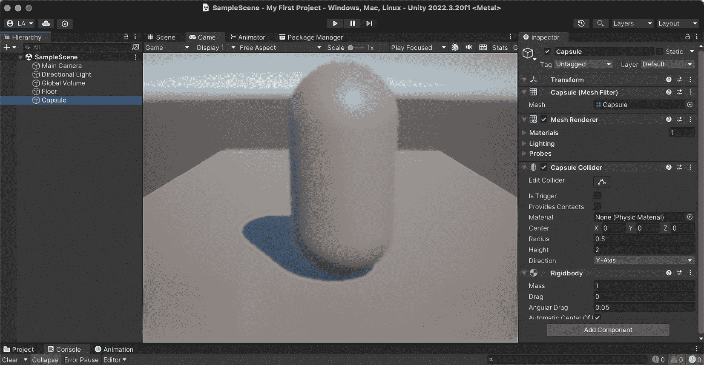
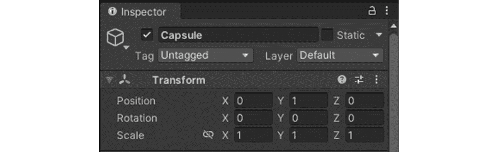
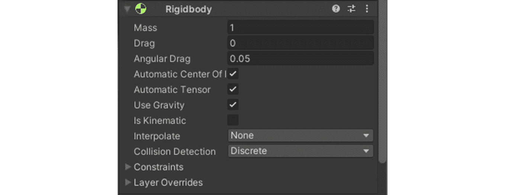
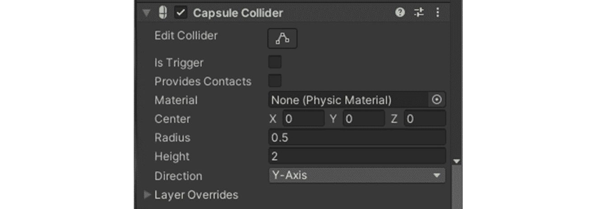
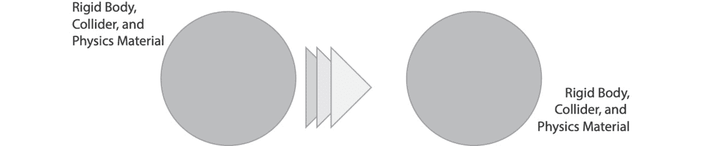

# 掌握 Unity 的 API - 物理学、碰撞和环境交互技术

在 Unity 脚本的基础之上，我们探索了 Unity 的**应用程序编程接口（API**）的广泛功能（它是一组协议和工具，允许不同的软件应用程序相互通信和交互），解锁高级功能以增强游戏的功能。本章涵盖了访问和操作游戏组件——这对于动态开发至关重要。您将学习基于物理的交互以实现逼真的游戏玩法，管理沉浸式环境中的过渡和设置，并使用高级 API 函数实现复杂机制。

关键技术包括转换 GameObject 和使用**射线投射**进行对象交互。实际示例和最佳实践提供了关于高效、安全 API 使用的见解，使您的游戏开发模块化和可重用。这种简化的方法使您为创建引人入胜、响应迅速的游戏环境做好准备，为复杂游戏开发铺平道路。

在本章中，我们将涵盖以下主要主题：

+   访问游戏组件

+   利用物理和碰撞

+   管理游戏场景和环境

+   高级 API 功能

# 技术要求

为了有效地跟随本章，请确保您已安装以下内容：

+   **Unity Hub**：用于管理 Unity 安装和项目版本。

+   **Unity 编辑器**：开发并构建您的 Unity 项目的平台。

+   **集成开发环境（IDE）**：用于编辑和管理 C#代码。推荐的 IDE 包括 Microsoft Visual Studio 或 JetBrains Rider，它们都与 Unity 集成良好，用于全面的编码和调试。

您可以在此处找到与本章相关的示例/文件：[`github.com/PacktPublishing/Unity-6-Game-Development-with-C-Scripting/tree/main/Chapter05`](https://github.com/PacktPublishing/Unity-6-Game-Development-with-C-Scripting/tree/main/Chapter05)

# 访问游戏组件

本节介绍了 Unity API 的核心概念，这对于操作游戏组件至关重要。我们将从与 GameObject 及其变换交互和修改开始。通过示例，您将学习如何调整位置、旋转和缩放，使您的游戏世界动态动画化。我们强调最佳实践以确保您的 API 交互高效、安全且模块化。这本基础指南使您能够自信地操作游戏元素并创建引人入胜的体验。

注意事项

在 C#中，`NullReferenceException`会在尝试访问空对象的成员时发生。这可以通过使用`if`语句，例如`if (obj != null)`，来确保在访问其属性或方法之前对象不是空的。此外，C# 6.0 引入了空条件运算符`?.`，它通过安全地访问成员（只有当对象不是空时）来允许更简洁和可读的空检查。

## Unity API 和组件系统的简介

探索 Unity 的 API 揭示了一个对游戏开发至关重要的强大系统。它为开发者提供了一个桥梁，使他们能够细致地控制和操作游戏元素。Unity 的基于组件的架构是其核心，它允许开发者通过简单、可重用的组件构建复杂的行为，从而实现模块化和直观的方法。`Transform`、`Rigidbody` 和 `Collider` 等关键元素是 Unity 设计中的基本构建块，允许构建多样化的游戏对象和交互：

+   `Transform` 组件控制游戏世界中对象的位置、旋转和缩放，是任何空间操作的基础。

+   `Rigidbody` 为对象添加物理属性，使它们能够响应重力和力，使您的游戏感觉更加动态和真实。

+   另一方面，`Collider` 定义了对象的形状以进行碰撞检测，使对象能够通过物理接触或接近来相互交互。

在 *图 5*.1 中，`Capsule` 在 Unity 编辑器的 **层次结构** 窗口中被选中。该游戏对象的信息显示在 **检查器** 窗口中。有五个附加组件：**Transform**、**Capsule (Mesh Filter)**、**Mesh Renderer**、**Capsule Collider** 和 **Rigidbody**。



图 5.1 – 在 Unity 编辑器的层次结构窗口中选中的胶囊

Unity 的 API 和其基于组件的架构对于游戏开发至关重要，它提供了一个框架来操作游戏对象。`Transform`、`Rigidbody` 和 `Collider` 等关键组件允许开发者控制对象的行为和物理属性。这种方法简化了开发并增强了创造力。我们将重点介绍使用 `Transform` 组件来调整位置、旋转和缩放，并通过示例展示如何有效地动画化对象。这为您在游戏世界中的进一步定制和交互奠定了基础。

## 与 Transform 和 Renderer 组件一起工作

本节重点介绍使用 `Transform` 组件来操作 GameObjects，这是开发者的一项关键技能。我们将通过逐步示例指导您修改对象的位置、旋转和缩放。此外，我们还将探索动态更改组件，如材质和纹理。这种全面的方法可以增强您的技术技能并丰富您的游戏环境。

在 *图 5*.2 中，`Transform` 组件在 **检查器** 窗口中可见。它显示了 **位置**、**旋转** 和 **缩放** 的 3D 值。这些值可以在 **检查器** 窗口中或通过 C# 编程进行更改。需要注意的是，如果给定的游戏对象是另一个游戏对象的子对象，那么这些值是相对于游戏对象父对象的。



图 5.2 – 检查器窗口中可见的 Transform 组件

深入了解 Unity 的变换能力，我们开始理解 GameObject 的 `Transform` 组件的基本作用。这个组件是操纵游戏世界中对象物理存在的关键。通过 `Transform` 组件，开发者可以编程地调整对象的位置、旋转和缩放，从而控制其在 3D 空间中的位置、朝向和大小。

首先，让我们考虑移动 GameObject 的任务。通过在脚本中访问 `Transform` 组件的 `position` 属性，我们可以改变对象在游戏世界中的位置。例如，要使对象向前移动一个单位（在 Unity 中，一个单位是一米），我们可以使用以下 C# 代码片段：

```cs
gameObject.transform.position += new Vector3(0, 0, 1);
```

旋转是对象操作中的另一个关键方面。Unity 允许开发者围绕对象的轴旋转 GameObject。例如，要围绕对象的 y 轴旋转 90 度，我们可能会编写以下代码：

```cs
gameObject.transform.Rotate(0, 90, 0);
```

最后，调整对象的缩放可以显著影响游戏的视觉动态。要使 GameObject 的尺寸加倍，可以使用以下代码行：

```cs
gameObject.transform.localScale *= 2;
```

这些示例说明了如何以编程方式调整 GameObject 的变换属性，使开发者能够创建动态的游戏环境，其中对象可以与游戏逻辑同步移动、旋转和缩放。

在这些基础知识的基础上，开发者还可以通过更改材质和纹理来改变视觉属性。在 Unity 中，材质决定了对象的外观——颜色、光泽度和透明度——并且可以修改以对游戏事件或玩家动作做出反应。例如，要将对象的材质颜色更改为红色，你可能使用以下 C# 代码：

```cs
Renderer renderer = gameObject.GetComponent<Renderer>();
renderer.material.color = Color.red;
```

纹理为对象的表面增添了细节，使它们看起来更加逼真或具有风格化。Unity 允许你动态地将纹理应用于对象，实现诸如更改角色的服装或更新游戏中的广告牌广告等场景。要更改 GameObject 的纹理，你首先需要一个对新纹理的引用，然后将它应用到对象的材质上，如下所示：

```cs
Texture newTexture = ...;
     // Assume this is obtained or loaded elsewhere
Renderer renderer = gameObject.GetComponent<Renderer>();
renderer.material.mainTexture = newTexture;
```

我们还可以操纵组件属性以产生各种效果，例如调整 `Light` 组件的强度来模拟昼夜循环，或者改变粒子系统的发射率以提供玩家反馈。将这些与 `Transform` 操作结合使用可以增强游戏世界中的交互性和动态性。Unity 在运行时能够以编程方式更改属性的能力促进了创造性和沉浸感。

Unity 的 API 功能从简单的位置调整到动态视觉修改，如材质和纹理，增强了视觉吸引力和现实感。高效和安全地实施这些更改至关重要，专注于开发模块化和可重用的代码。这种方法确保了最佳性能和可扩展性，为可扩展的游戏开发提供了坚实的基础。

## API 使用的最佳实践

探索 Unity 的 API 强调了高效和安全使用最佳实践的重要性，这对于游戏的平稳运行和未来的可扩展性至关重要。本节重点介绍增强代码模块化和可重用性的策略，例如制作通用脚本。我们解决常见的陷阱，提供有关维护性能和确保项目可扩展性的见解。导航 Unity 的 API 涉及潜在挑战，需要纪律性的开发，而关注高效和安全的 API 使用对于游戏当前性能和未来增长至关重要。强调最佳实践对于任何 Unity 项目的长期成功至关重要。

让我们来看看一些最推荐的最佳实践：

+   **代码模块化和可重用性强调**：一个关键实践是关注代码的模块化和可重用性。通过编写通用脚本，它们可以在各种组件和项目中重复使用，节省时间并减少错误。例如，一个角色的移动脚本可以适应其他角色，而环境交互脚本可以用于多个具有独特响应的对象。这种方法利用了经过良好测试的代码并提高了效率。

    此外，追求模块化自然地导致采用如**模型-视图-控制器**（**MVC**）或**实体组件系统**（**ECS**）等设计模式，这进一步增强了代码库的组织和灵活性。这些模式促进了游戏逻辑与展示和数据的分离，使得代码库更容易导航、调试和扩展。

+   `Update()`函数可能导致性能瓶颈。意识到并避免这些陷阱对于保持游戏的平稳运行至关重要。

+   **遵循可扩展性原则**：最后，可扩展性原则必须从一开始就融入每个 Unity 项目的结构中。可扩展性指的是游戏处理增长的能力，无论是内容、功能还是玩家基础的增长，而无需进行全面的重构。这不仅仅涉及编写可扩展的代码，还包括做出能够预测未来扩展的架构决策。可扩展的代码是指设计和编写方式使其能够轻松适应未来增长和变化的代码。无论是计划额外的关卡、角色或功能，无需全面重构就能扩展游戏的能力是无价的。

通过遵循这些最佳实践，开发者可以确保他们的 Unity 项目不仅在短期内有效和高效，而且在长期内也做好了增长和创新的准备。这种整体开发方法为稳健、动态和可扩展的游戏开发奠定了坚实的基础，确保你的 Unity 项目经得起时间的考验。

我们通过 Unity 的 API 之旅已经打下了一个坚实的基础，从介绍游戏对象和组件如何交互以塑造游戏玩法开始。我们深入研究了修改对象的空间属性——位置、旋转和缩放——的复杂性，并扩展了我们的技能，以动态地改变视觉属性，如材质和纹理。在这些实用技能的基础上，我们强调了在 API 使用中最佳实践的重要性，强调了需要模块化、可重用代码和策略来规避常见陷阱，确保最佳性能和项目可扩展性。随着我们继续前进，我们将通过探索物理引擎、参与基于物理的交互和掌握碰撞检测技术来增强游戏交互性和响应性，同时保持对确保无缝和沉浸式游戏体验的原则的承诺。

# 利用物理和碰撞

探索 Unity 的物理引擎通过模拟现实世界的物理，为环境增添了现实感。我们首先理解`Rigidbody`、`Collider`和**Physics Material**，它们共同模拟重力和摩擦。然后，我们专注于基于物理的交互，如跳跃和推动物体以改善游戏玩法。此外，我们引入了光线投射以进行高级碰撞检测和交互。最后，我们讨论了管理物理和碰撞的最佳实践，以确保游戏真实且运行流畅，为玩家提供无缝体验。

## Unity 物理引擎简介

探索 Unity 的`Rigidbody`、`Collider`和`Physic Material`可以复制重力和摩擦，使物体在现实物理中稳固。**物理层**概念优化了游戏环境中的这些模拟。

Unity 为了提高引擎的速度，与伊利诺伊大学的数学家 Stephen Wolfram 合作，提高了其效率和功能。

在其核心，Unity 的物理引擎使用复杂的算法和数学模型来动画虚拟环境，使物体以现实的方式移动和交互。这个引擎在创建沉浸式和交互式游戏体验方面至关重要。

### Rigidbody、Collider 和 Physics Material

Unity 的物理模拟的核心是三个关键组件：`Rigidbody`、`Collider`和 Physics Material。让我们详细看看每个组件：

+   `Rigidbody`组件对于游戏对象中的动力学至关重要，允许它们对重力等力做出反应，并实现逼真的运动。它使动态动作成为可能，从角色在平台上跳跃到车辆在轨道上高速行驶。



图 5.3 – 在检查器窗口中可见的 Rigidbody 组件

+   `Collider`组件定义了对象的形状以进行碰撞检测。它作为一个不可见的边界，在与其他碰撞体接触时触发响应，从防止玩家穿过墙壁到模拟投射物的撞击。碰撞体在形状和大小上有所不同，以匹配它们的对象，从而提高碰撞的准确性。



图 5.4 – 在检查器窗口中可见的 Collider 组件

+   **物理材质**：物理材质通过定义表面属性（如摩擦和弹性）进一步细化了碰撞对象的交互。通过调整这些属性，开发者可以控制对象如何滑动、滚动或相互弹跳，为游戏环境增加另一层现实感。例如，可以通过减少物理材质上的摩擦来模拟光滑的冰面，而通过增加弹性参数可以复制弹跳球的动作。

Unity 的物理引擎考虑了游戏对象的`Rigidbody`、`Collider`和物理材质，以确定它将如何对其他游戏对象和重力做出反应。如图*图 5.5*所示，一个圆正朝着另一个圆飞驰，当它们相撞时，Unity 计算作用在两个圆上的物理力，就像它们存在于现实世界中一样。



图 5.5 – 考虑到游戏对象的 Rigidbody、Collider 和物理材质，与另一个对象和重力的交互

接下来，让我们探索 Unity 的物理引擎如何通过物理层功能管理对象之间的交互。

### 物理层

Unity 的物理引擎引入了**物理层**功能，允许开发者将对象分类到不同的层并定义它们的交互，优化物理计算和游戏性能。例如，不与玩家交互的装饰性对象可以放置在单独的一层中，以排除它们从物理计算中。

此引擎提供了一套强大的工具集，用于模拟现实世界的物理，通过`Rigidbody`、`Collider`和物理材质等组件增强游戏交互性和现实感。物理层功能通过管理不同对象层之间的交互进一步优化性能。

探索 Unity 的物理引擎揭示了其准确模拟物理现象和优化游戏机制的能力。随着我们不断进步，我们将关注这些原则在游戏交互中的实际应用，例如操纵重力和理解碰撞动力学，以创建响应式和引人入胜的游戏环境。

## 基于物理的交互

在 Unity 中，掌握基于物理的机制对于创造引人入胜的游戏体验至关重要。这始于基础概念，例如应用力量和使用重力来动画化游戏世界，进而导致复杂的交互。实际例子包括跳跃动力学、推动机制和抛射运动，为动画虚拟环境提供了见解。此外，强调碰撞检测的关键作用，包括触发和非触发碰撞体，突出其在创建交互式和响应式环境中的重要性，其中动作显著增强了游戏玩法。

精通 Unity 的物理涉及通过力量和重力的操作来模拟现实世界的物理，这对于动画化游戏对象至关重要。例如，将角色抛入跳跃或将物体移动到场景中涉及对 `Rigidbody` 组件应用力量，使动作感觉真实和有形。以下是一个简单的 C# 脚本示例，用于 `jump` 命令：

```cs
using UnityEngine;
public class PlayerJump : MonoBehaviour
{
    public float jumpForce = 5f;
    private Rigidbody2D rb;
    private bool isGrounded;
```

之前的代码块设置了 `jumpForce`（跳跃时应用的力量），`rb`（`Rigidbody` 组件），以及 `isGrounded`（一个记录玩家是否站在地面的布尔值）变量。

```cs
    void Start()
    {
        rb = GetComponent<Rigidbody2D>();
    }
```

在 `Start` 方法中，`rb` 变量被分配给玩家的 `Rigidbody`：

```cs
    void Update()
    {
        if (Input.GetKeyDown(KeyCode.Space) && isGrounded)
        {
            rb.AddForce(new Vector2(0, jumpForce),
            ForceMode2D.Impulse);
        }
    }
```

在 `Update` 方法期间，脚本检查空格键是否被按下且玩家是否站在地面上。如果这两个条件都为真，则应用向上的力量使玩家跳跃。力量以冲量的形式应用，即突然和立即的推动：

```cs
    // Check if the player is touching the ground
    void OnCollisionEnter2D(Collision2D collision)
    {
        if (collision.gameObject.tag == "Ground")
        {
            isGrounded = true;
        }
    }
    void OnCollisionExit2D(Collision2D collision)
    {
        if (collision.gameObject.tag == "Ground")
        {
            isGrounded = false;
        }
    }
}
```

在前面的脚本中，`isGrounded` 变量用于确保玩家只能在站在地面上时跳跃，防止他们在空中跳跃。`OnCollisionEnter2D` 和 `OnCollisionExit2D` 方法用于检测玩家是否接触地面。

**抛射运动**是另一种常见的游戏机制，其中物理起着关键作用。通过在角度上应用初始力量，可以使物体沿着抛物线轨迹运动，模拟抛出或发射物体的运动。以下是一个可能用于发射抛射体的代码片段：

```cs
using UnityEngine;
public class LaunchProjectile : MonoBehaviour
{
    public Rigidbody2D projectile;
    public float launchAngle = 45f;
    public float launchForce = 10f;
    void Start()
    {
        Vector2 launchDirection = Quaternion.Euler(0, 0, launchAngle)
              * Vector2.right;
        projectile.AddForce(launchDirection * launchForce,
              ForceMode2D.Impulse);
    }
}
```

前面的脚本根据指定的角度计算发射方向，并在此方向上对抛射体应用力量。

此外，碰撞检测对于基于物理的游戏至关重要，它允许对象以可信的方式进行交互。Unity 提供了两种主要的碰撞体类型：**触发碰撞体**和**非触发**（或**固体**）**碰撞体**。触发碰撞体不会物理上阻挡对象，而是在对象进入、停留在或离开碰撞体区域时触发事件，非常适合检测玩家与感兴趣区域或可收集物品的交互。另一方面，非触发碰撞体用于物理交互，例如在平台上行走或撞到墙上。

使用 `OnTriggerEnter`、`OnTriggerStay`、`OnTriggerExit`、`OnCollisionEnter`、`OnCollisionStay` 和 `OnCollisionExit` 方法在 Unity 中处理碰撞事件非常简单。例如，为了检测玩家捡起带有触发碰撞体的可收集物品时，可能会使用以下脚本：

```cs
void OnTriggerEnter2D(Collider2D other)
{
    if (other.gameObject.CompareTag("Collectible"))
    {
        Destroy(other.gameObject);
        // Remove the collectible from the scene
        // Increment the player's score or perform
        // other actions
    }
}
```

在前面的脚本中，使用 `OnTriggerEnter2D` 方法来检测玩家的碰撞体是否与可收集物品的触发碰撞体相交，允许游戏通过移除可收集物品并可能更新玩家的分数来做出响应。

理解并利用 Unity 的物理原理使开发者能够创建丰富的交互式游戏环境。通过应用力和操纵重力，跳跃和推动物体等动作变得生动，增强了游戏玩法的真实感。通过触发和非触发碰撞体有效地管理碰撞对于响应式交互至关重要。在下一节中，我们将探讨使用光线投射的不同碰撞检测方法。

## 使用光线投射的高级碰撞检测

`BoxCollider`、`SphereCollider`、`CapsuleCollider` 和 `MeshCollider`。此方法支持在游戏环境中进行精确的对象检测，并启用多种交互。它通过启用精确的视线检测来增强游戏玩法，这对于潜行和策略至关重要，并改进了射击机制，使其对战斗反应灵敏。此外，光线投射的实用性还扩展到创建交互式 3D UI 元素，展示了它在游戏玩法和 UI/UX 设计中的多功能性。

注意

除了光线投射，Unity 还提供了**线投射**。Unity 中的线投射检测两点之间的线上的对象，这对于检查视线或障碍物非常有用。`Physics.Linecast(startPoint, endPoint, out RaycastHit hit)` 方法用于确定是否有任何碰撞体与线相交，这有助于**人工智能**（**AI**）的可见性、子弹轨迹和碰撞检测。

在实践中，射线投射从源点沿指定方向发射射线，与不同类型的碰撞体交互，以实现各种功能。例如，在潜行游戏中，它用于视线检测，以确定障碍物是否阻挡了敌人对玩家的视线。在射击机制中，它有助于确定子弹的击中点，实现逼真的物理和伤害计算。此外，在 3D 用户界面中，射线投射可以检测与 UI 元素的交点，增强游戏环境中的交互。以下是 Unity 中射击机制中通常实现的射线投射方法：

```cs
void Update() {
    if (Input.GetButtonDown("Fire1")) {
        // Assuming "Fire1" is your input for firing
        RaycastHit hit;
        Ray ray =
        Camera.main.ScreenPointToRay(Input.mousePosition);
        if (Physics.Raycast(ray, out hit, 100.0f)) {
            // 100.0f is the max distance of the ray
            Debug.Log("Hit: " + hit.collider.name);
            // Optionally, apply damage to the hit object
            // if it has a health component
            Health health =
            hit.collider.GetComponent<Health>();
            if (health != null) {
                health.TakeDamage(10);
                // Assuming TakeDamage is a method in
                // your Health script
            }
        }
   }
}
```

随着开发者为了性能和逼真度优化游戏物理，采用物理学管理的最佳实践变得至关重要。这包括使用物理层来简化计算，调整物理时间步长以实现一致的结果，以及考虑某些交互的非物理方法以保持性能，确保流畅且吸引人的玩家体验。

## 物理学和碰撞管理的最佳实践

在 Unity 游戏开发中，优化物理和碰撞管理对于平衡性能与逼真度至关重要。最佳实践包括使用物理层来减少不必要的计算，微调物理时间步长以实现稳定和一致的模拟，以及结合特定的非物理技术以保持性能。这些策略旨在将物理模拟的保真度与游戏流畅性相协调，确保流畅且沉浸式的玩家体验。遵循这些实践有助于通过防止性能问题而不牺牲物理交互提供的逼真度，从而创建技术合理且令人愉悦的游戏。

让我们了解一些：

+   **高效使用物理层**：Unity 允许开发者将游戏对象分配到不同的物理层，这些层可以相互选择性地交互。通过明智地将对象组织到这些层中，可以显著减少不必要的物理计算。例如，不需要与玩家或其他游戏对象交互的装饰元素可以放置在单独的层上，该层不计算碰撞，从而节省处理能力。

+   **调整物理时间步长**：Unity 中的物理时间步长决定了物理引擎更新的频率。虽然较小的步长可以提高模拟的准确性，但它也要求更多的处理能力。找到平衡点，以保持稳定和逼真的物理交互，同时不过度负担 CPU，至关重要。在 Unity 的时间设置中调整时间步长可以帮助实现更平滑的模拟，尤其是在物理密集型游戏中。

+   **使用基于非物理方法的特定交互**：并非游戏中所有的交互都需要依赖于物理引擎。在某些情况下，使用基于非物理方法的交互，例如在特定场景中进行简单的距离检查以进行碰撞检测，可以更友好地提高性能，同时仍然提供令人满意的结果。这种方法在对象和交互数量可能导致通过物理引擎管理时产生显著性能开销的游戏中尤其有用。

+   **平衡物理精度与游戏玩法**：虽然追求逼真的物理模拟可以增强游戏的沉浸感和感觉，但重要的是要记住，游戏玩法始终应该是首要的。在某些情况下，过于精确的物理模拟可能会损害游戏的乐趣和可玩性。开发者必须平衡物理现实主义与游戏机制，以确保游戏对玩家来说既吸引人又易于接触。

通过遵循物理管理的最佳实践，开发者可以在 Unity 中有效地平衡性能与真实交互，创建既高效又沉浸式的游戏。这种平衡确保了流畅且引人入胜的玩家体验。Unity 的物理引擎提供了广泛的可能性，可以通过现实物理效果增强游戏玩法，例如重力、碰撞检测以及通过光线投射进行精确的对象交互。

这种基础理解为掌握场景管理铺平了道路，这对于控制场景转换和调整环境设置以改善游戏流程和氛围至关重要，同时保持优化并提升整体玩家体验。

# 管理游戏场景和环境

在 Unity 游戏开发错综复杂的织锦中，掌握场景管理和环境调整的艺术是构建引人入胜的故事和无缝游戏体验的基石。这包括对如何巧妙地管理场景转换的全面理解，包括加载和卸载场景的细微差别，以及战略性地操纵环境设置以唤起所需的心情并增强游戏动态。通过逐步探索和实际示例，开发者可以掌握有效场景和环境管理的精髓。遵循该领域的最佳实践不仅确保了最佳性能，还提升了玩家与游戏世界的沉浸感和互动性，这对于任何 Unity 开发者来说都是不可或缺的技能集。

## Unity 中场景管理的简介

Unity 的**场景管理**系统对于组织游戏元素（如关卡、菜单和 UI 屏幕）至关重要，确保高效的玩法流程和资源管理。该系统允许开发者将游戏划分为独立的、可管理的场景，每个场景都专注于游戏的一个特定部分。这种分割有助于专注于单个部分，而不必处理整个游戏的复杂性，从而提高工作效率，并通过仅加载必要的资源来优化性能。

将逻辑分割成场景有助于保持清晰度，并促进不同游戏状态之间的平滑过渡，从而提高整体游戏结构和质量。展望未来，我们将深入探讨使用 Unity 的`SceneManager`实现无缝场景过渡，包括动态加载和卸载、带有加载界面的平滑过渡、异步加载以提升性能，以及跨场景保持游戏状态和玩家进度的策略。

## 控制场景过渡

在游戏开发领域，掌握控制`SceneManager`以动态管理场景的加载和卸载的艺术，确保流畅的游戏玩法流程至关重要。本节涵盖了从使用加载界面创建场景间平滑过渡的详细、分步指南，到实现异步加载以优化性能的所有方面。它还深入探讨了在场景间传递数据的有效方法，这对于保持游戏状态和玩家进度至关重要，从而在整个游戏过程中保持连贯性和沉浸感。

在 Unity 中控制场景过渡是游戏开发的关键组成部分，直接影响玩家的流畅性和体验质量。Unity 的`SceneManager`是一个强大的工具，它促进了场景的动态加载和卸载，使过渡变得平滑且几乎无缝。这种功能对于具有多个关卡、菜单和需要频繁场景变化的游戏内容至关重要。Unity 还提供了`asyncLoad.progress`，它以百分比的形式报告场景过渡的进度。这可以捕获以渲染进度条。在大多数情况下，场景加载如此之快，以至于这不是一个有用的功能。

首先，让我们讨论如何使用 Unity 的`SceneManager`来加载新场景。`SceneManager.LoadScene`方法简单直接，可以用来通过在`"GameLevel"`中指定的名称或索引加载场景：

```cs
using UnityEngine;
using UnityEngine.SceneManagement;
public class SceneLoader : MonoBehaviour
{
    public void LoadGameLevel()
    {
        SceneManager.LoadScene("GameLevel");
    }
}
```

对于需要平滑过渡且无突兀剪辑的游戏，实现加载界面是一种常见做法。加载界面可以在加载过程中提供视觉反馈，从而提升整体用户体验。这可以通过首先加载包含加载界面的**加载**场景，然后异步在后台加载**目标**场景来实现。

使用`SceneManager.LoadSceneAsync`方法来实现这一目的，允许在后台加载下一个场景。以下是实现异步场景加载的示例：

```cs
IEnumerator LoadYourAsyncScene(string sceneName)
{
    AsyncOperation asyncLoad =
         SceneManager.LoadSceneAsync(sceneName);
    // While the asynchronous operation to load the new
    // scene is not yet complete, continue waiting until
    // it's done.
    while (!asyncLoad.isDone)
    {
        // Here, you can also update the loading screen
        // progress bar or any loading indicators you have.
        yield return null;
    }
}
```

通过场景转换维护游戏状态和玩家进度是另一个关键方面。这可以通过在加载新场景时不会销毁的持久对象中存储数据来实现，使用 Unity 的`DontDestroyOnLoad`方法，或者通过利用存储在单例管理类中的全局变量。玩家得分、库存物品或游戏进度等数据可以通过这些方法在场景之间传递，以确保连续性。以下是实现`DontDestroyOnLoad`方法的示例：

```cs
public class GameManager : MonoBehaviour
{
    public static GameManager Instance;
    void Awake()
    {
        if (Instance == null)
        {
            Instance = this;
            DontDestroyOnLoad(gameObject);
        }
        else if (Instance != this)
        {
            Destroy(gameObject);
        }
    }
    // Your game state data and methods here
}
```

总之，掌握 Unity 中的场景转换需要结合使用`SceneManager`进行动态场景加载、实现加载屏幕以获得更好的用户体验、利用异步加载来提高性能以及采用数据管理技术以保持场景间的连续性。通过遵循这些指南并使用提供的 C#示例，开发者可以创建平滑且引人入胜的转换，这对游戏体验的整体质量有重大贡献。

在探索了 Unity 中控制场景转换的复杂性之后，从动态加载和卸载场景到确保通过加载屏幕和异步加载实现平滑转换，我们现在已经准备好进一步增强玩家对游戏世界的沉浸感。在制作引人入胜的游戏体验的下一步中，关键在于调整环境设置。我们将深入研究操控光照、天空盒和地形编辑器这一艺术，这些可以影响氛围和游戏动态。此外，我们还将探讨如何动态地编写环境元素脚本，使其能够根据游戏事件进行演变，例如，通过改变光照的色调来象征时间的流逝，从而加深叙事影响，无缝地将场景管理的技术实力与环境设计的创意艺术结合在一起。

## 调整环境设置

在 Unity 中调整环境设置允许开发者创建沉浸式和动态的游戏世界。修改光照、集成天空盒和使用地形编辑器等技术显著影响游戏的情绪和动态，增强玩家的沉浸感。本节将探讨环境元素不仅设定了舞台，而且还能动态地响应游戏事件，如昼夜转换，增加真实感和互动性。

照明是打造沉浸式环境的关键，它设定了情感基调并突出了重要的游戏区域。Unity 的**照明**系统支持动态变化，例如模拟日光过渡或增强戏剧性效果，以丰富游戏体验。例如，一个脚本可能会调整方向光的强度和颜色来模拟太阳的运动，从而创建一个逼真的时间变化效果：

```cs
using UnityEngine;
public class DayNightCycle : MonoBehaviour
{
    public Light directionalLight;
    public float dayLength;
    private float timeCounter = 0;
    void Update()
    {
        timeCounter += Time.deltaTime / dayLength;
        // Change light intensity and color based on
           timeCounter
        directionalLight.intensity = Mathf.Lerp(0.1f, 1f,
            Mathf.Abs(Mathf.Cos(timeCounter * Mathf.PI *
            2f)));
        directionalLight.color = Color.Lerp(new Color(0.3f,
        0.4f, 0.6f), Color.white,
        directionalLight.intensity);
    }
}
```

`Skybox`组件可以动态更改，以反映不同的环境或一天中的不同时间，从而增加游戏的真实性和多样性。

Unity 的**地形编辑器**是环境工具包中的另一个强大工具，它能够创建广阔、开阔且细节丰富的景观。通过雕刻、绘画和添加植被，地形编辑器允许对游戏世界进行定制，以完美匹配预想的场景。除了静态景观之外，你还可以编写脚本以实现环境元素，如随风摇曳的树木或实时交互性地形变形，这些元素可以响应玩家的动作或事件。

例如，为了创建一个简单的交互，在地形上玩家位置处变形，你可能需要考虑将脚本附加到玩家上，以修改玩家位置的地形高度：

```cs
using UnityEngine;
public class TerrainDeformer : MonoBehaviour
{
    public Terrain terrain;
    private TerrainData terrainData;
    private float[,] originalHeightMap;
```

此脚本的前部分定义了将要使用的变量：`terrain`（游戏中实际使用的地形）、`terrainData`（一个 Unity 数据类型，用于描述地形）和`originalHeightMap`（一个浮点数组，将存储地形的各种高度）。

```cs
    void Start()
    {
        terrainData = terrain.terrainData;
        originalHeightMap = terrainData.GetHeights(0, 0,
           terrainData.heightmapResolution,
           terrainData.heightmapResolution);
    }
```

`Start()`方法从游戏的地形中获取`terrainData`。然后，它在游戏开始时检索并存储整个地形的高度图。

```cs
    void Update()
    {
        Vector3 playerPosition = transform.position;
        Vector3Int terrainPosition = new Vector3Int(
            Mathf.RoundToInt(playerPosition.x),
            Mathf.RoundToInt(playerPosition.y),
            Mathf.RoundToInt(playerPosition.z)
        );
        // Deform terrain under player
        // Note: This is a simplified example. In practice,
        // you'll need to convert the player's position to
        // terrain's local space and modify a range of
        // heights around the player.
        terrainData.SetHeights(terrainPosition.x,
            terrainPosition.z,
            new float[,] { { 0.5f } });
    }
```

`Update()`方法在每一帧中持续跟踪玩家的位置，并将其转换为整数坐标，这些坐标对应于地形网格上的一个位置。然后，它通过将该点的海拔高度设置为新的值（在这个例子中是`0.5`），在玩家当前所在位置下方直接修改地形。

```cs
    void OnDestroy()
    {
        // Restore the original terrain heights when the
        // script is destroyed
        terrainData.SetHeights(0, 0, originalHeightMap);
    }
}
```

这个 Unity 脚本`Terrain Deformer`在游戏过程中根据玩家的位置动态改变地形的高度。启动时，它捕获原始的地形高度以供后续恢复。在每一帧更新期间，它直接调整玩家所在位置下方的地形高度，模拟实时地形变形。该脚本确保当它不再活跃时，地形返回到初始状态，保持原始景观的完整性。

在 Unity 中调整环境设置对于制作能够对玩家交互和游戏事件（如一天中的时间）做出反应的沉浸式世界至关重要。通过巧妙地操作光照、天空盒和地形，开发者可以创建出反映游戏叙事的动态环境。对这些元素进行脚本编写可以增强现实感，并使每位玩家的体验都独一无二。当我们从制作转向优化时，采用场景管理的最佳实践至关重要。例如，使用遮挡剔除、调整**细节级别**（**LOD**）设置以及平衡静态和动态对象等技术对于确保跨设备流畅的性能、实现视觉质量和效率的最佳组合至关重要。

## 场景和环境优化的最佳实践

在优化游戏环境以提高性能时，关注高效的场景管理和优化技术的战略使用至关重要。这包括使用遮挡剔除来减少不必要的渲染、调整 LOD 设置以实现更好的资源管理，以及区分静态和动态游戏对象以优化性能。这些实践对于平衡高视觉质量和流畅性能至关重要，确保在各种设备上提供最佳的游戏体验。

优化游戏环境是开发过程中的关键步骤，以确保玩家在各种设备上都能体验到流畅的游戏体验，同时不牺牲视觉质量。实施高效的场景和环境管理实践可以显著提高性能，同时保持游戏世界的沉浸感。以下是一些最佳实践：

+   **遮挡剔除**：遮挡剔除通过不渲染摄像机看不到的对象来提高性能，显著减少绘制调用并提高帧率。Unity 内置系统允许开发者配置项目设置中的遮挡剔除，以适应他们游戏的需求。

+   **LOD 设置**：LOD 根据与摄像机的距离减少 3D 模型的复杂性，减轻处理负担的同时保持视觉质量。在 Unity 中，LOD 组自动切换模型以优化性能，而不会影响美观。

+   **使用静态和动态游戏对象**：了解何时使用静态对象与动态对象对于优化至关重要。静态对象，如建筑、树木和街道家具，在游戏过程中不会移动或改变，可以被 Unity 批处理以减少绘制调用，从而提高性能。相反，动态对象，如角色、车辆和动画道具，由于会发生变化，因此引擎会以不同的方式处理。在 Unity 编辑器中战略性地标记对象为静态可以带来显著的性能提升，尤其是在具有大量静止元素的场景中。请注意，此设置通常可以在游戏对象的**检查器**窗口中找到。

平衡优化技术对于创建外观出色且在各种硬件上表现良好的游戏至关重要。开发者需要持续测试和调整设置，以实现视觉质量和性能的最佳组合。在 Unity 中管理游戏场景和环境对于确保无缝游戏体验和沉浸式氛围至关重要，包括优化环境设置以适应情绪和动态。

未来，我们将探索 Unity 的高级 API 功能，包括网络、AI 和复杂游戏机制。这将使开发者能够高效地实现复杂功能，同时保持性能和可扩展性。

# 高级 API 功能

探索 Unity 的高级 API 功能可以扩大游戏开发的范围，让创作者能够通过复杂的网络、AI 和高级机制等功能来增强他们的游戏。这包括实施这些功能的实际示例和最佳实践，同时优化性能并确保项目可扩展性。这次旅程不仅提升了开发者的技术技能，还提高了他们游戏的交互性和沉浸感。

## 探索 Unity 的高级 API 功能

深入研究 Unity 的高级 API 功能为开发者提供了大量机会来增强游戏体验。这些功能允许创建复杂的多人网络、逼真的**非玩家角色**（NPC）AI 以及通过高级脚本实现的复杂游戏机制。本介绍预览了这些功能为改变游戏设计和丰富玩家交互提供的广泛潜力。

对于旨在制作吸引玩家、沉浸式且复杂的游戏的开发者来说，Unity 的高级 API 至关重要。这其中包括连接全球玩家的网络功能和使角色栩栩如生的 AI。例如，基本的网络玩家移动可能从一个像这样的脚本开始：

```cs
using UnityEngine;
using UnityEngine.Netcode;
public class PlayerMovement : NetworkBehaviour
{
    public float speed = 10f;
    void Update()
    {
        if (!isLocalPlayer) return;
        float x = Input.GetAxis("Horizontal") * speed *
            Time.deltaTime;
        float z = Input.GetAxis("Vertical") * speed *
            Time.deltaTime;
        transform.Translate(x, 0, z);
    }
}
```

前面的代码片段利用 Unity 的`NetworkBehaviour`来区分网络游戏中本地玩家和其他玩家，确保每个玩家只能控制自己的角色。

AI 是 Unity API 大放异彩的另一个领域，它允许创建具有从简单巡逻到复杂决策过程行为的 NPC。使用 Unity 的 AI 工具，例如`NavMesh`系统，开发者可以为 NPC 编写脚本，使其在游戏世界中智能导航。以下是一个基本敌人 AI 的示例，该 AI 会跟随玩家：

```cs
using UnityEngine;
using UnityEngine.AI;
public class EnemyAI : MonoBehaviour
{
    public NavMeshAgent agent;
    public Transform player;
    void Update()
    {
        agent.SetDestination(player.position);
    }
}
```

前面的代码片段使用 Unity 的`NavMeshAgent`使 NPC 能够追逐玩家，展示了创建引人入胜的敌人行为潜力。

此外，高级脚本打开了一扇通往复杂游戏机制的大门，这些机制可以显著增强游戏体验。无论是复杂的库存系统、制作机制，还是交互式对话系统，Unity 的 API 提供了将这些想法实现为现实所需的工具。例如，一个基本的库存系统可能包括一个添加物品的脚本：

```cs
using System.Collections.Generic;
using UnityEngine;
public class Inventory : MonoBehaviour
{
    public List<Item> items = new List<Item>();
    public void AddItem(Item item)
    {
        items.Add(item);
    }
}
```

上述示例演示了如何实现一个简单的库存系统，允许玩家在游戏中收集和存储物品。

Unity 的高级 API 功能为游戏开发者提供了广阔的可能性，从多人游戏体验的网络到 NPC 的 AI 以及更多。这些功能不仅拓宽了高级脚本可以实现的范围，而且强调了创建动态和吸引人的游戏体验的重要性，这些体验能够与玩家产生共鸣。随着我们深入游戏开发领域，下一节将详细探讨如何利用这些高级功能。通过深入示例和逐步指南，开发者将学习如何实现复杂的游戏功能，如多人游戏框架、智能 NPC 行为和逼真的物理交互，将之前讨论的高级概念应用于丰富他们的游戏开发项目，增加复杂和吸引人的游戏元素。

## 实现复杂的游戏功能

使用 Unity 的高级 API 探索复杂的游戏功能，使开发者能够创建复杂、细腻的游戏体验。本节提供了详细的示例和指南，涵盖了高级功能，从设置多人游戏框架到使用 AI 驱动的 NPC 和沉浸式物理动画游戏世界。通过应用这些概念，开发者可以提升游戏的技术质量和互动吸引力，使游戏更加令人难忘。

使用 Unity 的高级 API，开发者可以通过创建沉浸式、交互式的体验超越传统的游戏设计限制。一个关键特性是多人游戏功能，通过 Unity 的网络层启用。例如，建立基本的多人设置涉及初始化网络管理器并创建用于在共享环境中交互的网络化玩家对象：

```cs
using UnityEngine;
using UnityEngine.Netcode;
public class MyNetworkManager : NetworkManager
{
    public override void
    OnServerAddPlayer(NetworkConnection conn,
        short playerControllerId)
    {
        GameObject player = Instantiate(playerPrefab,
            Vector3.zero,
            Quaternion.identity);
        NetworkServer.AddPlayerForConnection(conn, player,
            playerControllerId);
    }
}
```

上述脚本示例演示了如何在服务器上实例化玩家对象，允许玩家加入游戏并在相同的环境中移动。

在 AI 领域进一步深入，智能敌人行为可以显著增强游戏的挑战性和深度。使用 Unity 的 AI 算法，例如用于路径查找的`NavMesh`系统，开发者可以编写脚本，使敌人能够追逐玩家或巡逻指定区域：

```cs
using UnityEngine;
using UnityEngine.AI;
public class EnemyPatrolController : MonoBehaviour
{
    public NavMeshAgent agent;
    public Transform[] patrolPoints;
    private int currentPatrolIndex;
    void Start()
    {
        // Start patrolling from the first point
        if (patrolPoints.Length > 0)
        {
            agent.SetDestination(patrolPoints[0].position);
            currentPatrolIndex = 0;
        }
    }
    void Update()
    {
        // If the agent reaches the current patrol point,
        // move to the next one
        if (!agent.pathPending && agent.remainingDistance
             < 0.5f)
        {
            currentPatrolIndex = (currentPatrolIndex + 1)
                 % patrolPoints.Length;
            agent.SetDestination(patrolPoints
                 [currentPatrolIndex].position);
        }
    }
}
```

上述示例说明了基本 AI 敌人设置，其中敌人角色使用`NavMeshAgent`在多个点之间巡逻。`Start`方法通过设置第一个巡逻点为目标来初始化巡逻。`Update`方法检查敌人是否到达了当前的巡逻点，并将下一个巡逻点设置为新的目标，从而创建了一种可预测但引人入胜的巡逻行为。

将高级物理模拟引入游戏可以增加额外的现实感和交互性。Unity 的物理引擎允许模拟复杂的环境交互，例如物体受到力的作用或相互碰撞得令人信服：

```cs
using UnityEngine;
public class ApplyForce : MonoBehaviour
{
    public Rigidbody rb;
    public Vector3 forceDirection;
    public float forceMagnitude;
    void Start()
    {
        rb.AddForce(forceDirection.normalized *
          forceMagnitude);
    }
}
```

上述脚本向`Rigidbody`组件施加力，模拟物理力对游戏对象的影响。这种基于物理的交互可以显著提高游戏的真实感，使世界感觉更加生动并对玩家的动作做出反应。

通过这些示例，可以清楚地看到 Unity 的高级 API 如何被利用来实现复杂游戏功能，从多人设置和 AI 行为到复杂的物理交互。当这些元素巧妙地整合到游戏中时，可以极大地提升游戏体验，使游戏对玩家来说更加吸引人和动态。

深入 Unity 的高级 API 以实现复杂的游戏功能，如多人设置、AI 行为和物理模拟，展示了创建动态和吸引人的游戏的可能性。随着我们转向掌握 Unity 的高级开发，我们将强调利用这些复杂功能的最佳实践。关键考虑因素包括优化性能、确保高效的网络和 AI 操作，以及管理高级物理交互，同时保持模块化和可维护的游戏架构以支持未来的开发和可扩展性。

## 高级开发的最佳实践

在 Unity 中掌握高级开发需要遵循最佳实践，以优化 Unity API 功能的利用并确保项目可扩展性。关键领域包括优化网络通信以减少多人游戏延迟，以及通过使用高效的路径寻找和决策过程来增强 NPC 的 AI，而不会因性能问题而受到影响。管理复杂的物理交互也非常关键，特别是对于需要现实感的游戏，通过明智地应用物理计算和使用简化的碰撞器来处理复杂对象。这些实践确保高级功能可以提升游戏性能并支持未来的开发。考虑以下方面：

+   **模块化设计**：以允许单独部分更新或替换而不影响整个系统的方式构建游戏组件。

+   **高效资源管理**：在处理高分辨率纹理、复杂模型和广泛的游戏世界时，注意内存和处理能力。

+   **可扩展的游戏架构**：规划游戏架构以轻松适应未来的扩展、更新和优化。

+   **持续测试和性能分析**：定期测试游戏在不同设备上的性能，并使用性能分析工具来识别和解决瓶颈。

遵循这些最佳实践不仅提高了游戏的质量和性能，还确保了游戏能够适应和扩展，随时准备随着玩家期望和技术进步而发展。

# 摘要

在本章中，我们深入掌握了 Unity 的 API，呈现了一条通过访问和操作游戏组件的机制的基本旅程，这对于任何希望将动态和交互元素融入游戏的开发者来说是一项关键技能。本章详细介绍了基于物理的交互的实现，提供了创建与物理世界真实性和沉浸感相匹配的游戏玩法的方法。此外，它还探讨了场景管理和环境调整的复杂性，这对于制作吸引玩家的游戏环境至关重要。专注于高级 API 功能，本指南为开发者铺平了道路，使他们能够将复杂的功能和机制引入他们的游戏，扩大在 Unity 引擎内所能实现的范围。

随着我们从全面探索 Unity 的 API 及其革命性游戏功能潜力的阶段过渡到下一章，我们将焦点转向 Unity 中数据结构的力量。即将到来的章节承诺将解锁游戏开发的新维度，突出使用数组、列表、字典和 HashSets 来高效组织和操作游戏数据。它强调战略性地选择和应用这些结构来管理复杂的游戏元素和机制，为高级和高效的游戏设计打下坚实基础。通过实际示例和最佳实践，开发者将学会利用这些数据结构来精炼和增强游戏机制，标志着游戏开发掌握之旅的又一步前进。
