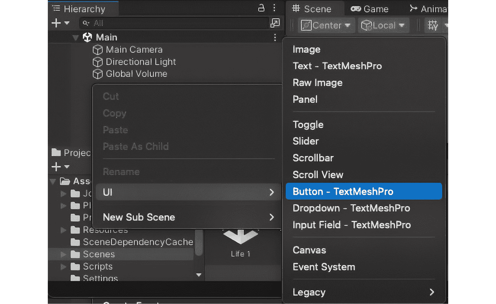
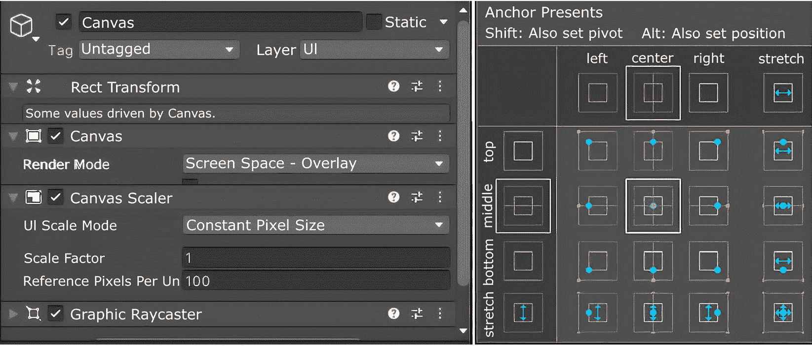
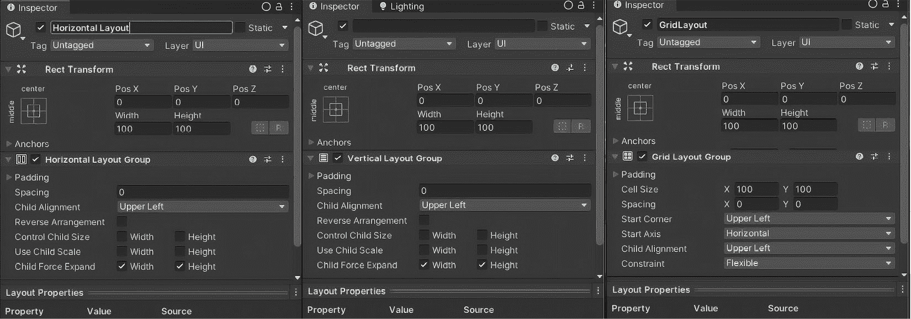

# 设计交互式 UI 元素 – Unity 中的菜单和玩家交互

在上一章中深入探讨了 Unity 中不同的数据结构，其中我们揭示了高效组织和管理游戏数据的复杂性，本章将进入同样关键且富有创造性的领域——**用户界面**（**UI**）。在这里，我们将探索菜单和其他玩家交互，使它们能够响应用户的操作。本章将重点从游戏开发的底层复杂性转移到用户体验的前沿，展示如何制作吸引人且直观的 UI，让玩家直接与之交互。随着我们深入 UI 设计和 Unity 中的玩家交互的艺术，使用多才多艺的 C# 编程语言，您将学习如何将功能与创造力相结合，提升整体游戏体验。从构建引导玩家通过游戏的动态菜单到编写自定义交互行为，如颜色变化或大小变化，为您的 GameObjects 呼吸生命。本章提供了一套全面的工具集，用于使您的游戏视觉和交互元素生动起来。

在本章中，我们将涵盖以下主题：

+   在 Unity 中设计 UI 元素

+   编写玩家输入脚本

+   构建动态菜单

+   与 GameObjects 的自定义交互

# 技术要求

为了有效地跟随本章内容，请确保您已安装以下内容：

+   **Unity Hub**：管理 Unity 安装和项目版本。

+   **Unity 编辑器**：开发并构建您的 Unity 项目的平台。

+   **集成开发环境 (IDE)**: 用于编辑和管理 C# 代码。推荐的 IDE 包括 Microsoft Visual Studio 或 JetBrains Rider，它们都与 Unity 集成良好，适用于全面的编码和调试。

您可以在此处找到与本章节相关的示例/文件：[`github.com/PacktPublishing/Unity-6-Game-Development-with-C-Scripting/tree/main/Chapter07`](https://github.com/PacktPublishing/Unity-6-Game-Development-with-C-Scripting/tree/main/Chapter07)

# 在 Unity 中设计 UI 元素

从游戏逻辑中数据结构的复杂性转向，我们开始新的旅程，深入 Unity 中设计 UI 元素，探索游戏开发的视觉领域。本节阐明了 Unity UI 系统的基础支柱，引导您通过组装必要的 UI 组件，如 **按钮**、**文本**、**图像**和 **滑块**。**RectTransform** 组件对于通过 **检查器** 窗口和 C# 脚本定位、缩放和旋转 UI 元素至关重要。我们将探索如何为您的界面注入风格和主题，确保与游戏美学的视觉一致性。此外，我们将解决响应式设计的挑战，确保您的 UI 能够在各种设备和分辨率上优雅地适应。

## UI 组件基础

Unity 的 UI 系统是一个强大的工具集，用于在游戏中创建交互性和视觉吸引力元素。无论你是制作一个简单的按钮还是一个复杂的游戏菜单，理解 Unity UI 组件的基本原理至关重要。这些元素是游戏与玩家之间的桥梁，使玩家能够在游戏过程中导航菜单、与游戏世界互动并接收关键反馈。

Unity 的 UI 系统核心是一个功能多样的组件集合，每个组件都旨在在你的 UI 中扮演特定的角色：

+   **按钮**: 按钮是典型的用户界面元素，在 Unity 中，按钮功能极其灵活，允许玩家通过点击或轻触与游戏互动。按钮的外观和功能均可自定义，可以触发任何动作，从开始新游戏到选择游戏内的物品。

+   **文本**: **文本**组件对于向玩家传达信息至关重要。从对话和指令到得分板和 UI 标签，**文本**组件用于在游戏中显示可读内容。

+   **图像**: 图像为你的 UI 添加了一层视觉元素，增强了游戏的审美吸引力。它们可以用于各种目的，如图标、背景图像或装饰元素，有助于营造游戏的整体氛围和主题。

+   **滑块**: 滑块为玩家提供了一个视觉和交互式的方式，可以在预定义的范围内调整值。它们通常用于音量控制或调整图形选项等设置。

Unity UI 组件的一个基本方面是**RectTransform**，这是一个强大的定位和调整 UI 元素大小的工具。与用于 3D 对象的传统**Transform**组件不同，**RectTransform**专门针对 UI 设计，提供了对锚点、旋转点和缩放的控制。这使得它在布局 UI 元素时非常高效，确保它们在各种屏幕尺寸和分辨率上看起来都很棒。

要完全掌握 Unity UI 组件的灵活性，让我们对 Unity 编辑器进行一次视觉之旅。

Unity 的 UI 系统提供了一个强大的框架，用于设计交互性和视觉吸引的 UI。通过掌握 UI 组件并利用**RectTransform**进行精确布局控制，你可以创建不仅外观专业，而且为玩家提供直观和愉悦体验的 UI。随着你继续探索 Unity 的 UI 功能，请记住，这些元素是构建引人入胜和用户友好界面的基石，将你的游戏提升到新的高度。



图 7.1 – 向层次结构窗口添加按钮 - TextMeshPro 元素

在层次结构窗口中右键单击会弹出 GameObject 菜单（这也可以通过选择**GameObject**菜单来访问）。要做到这一点，在右键单击后，向下滚动到**UI**，然后向右，会出现一个列表，列出了 Unity 编辑器中当前可用的所有 UI 元素。

注意

TextMeshPro 是 Unity 中一个强大的文本渲染工具，它为文本元素提供了高级格式化和视觉效果。

为了展示如何将 UI 元素与游戏逻辑连接起来，以下脚本展示了如何在 Unity 游戏中使用按钮来装备剑：

```cs
using UnityEngine;
using UnityEngine.UI;
public class Player : MonoBehaviour
{
    [SerializeField] private Button equipButton;
    void Start()
    {
        if (equipButton != null)
        {
            equipButton.onClick.AddListener(EquipSword);
        }
    }
    private void EquipSword()
    {
        Debug.Log("Sword equipped!");
        // Add logic for equipping the sword
    }
}
```

这个`Player`脚本演示了如何使用 Unity 的事件系统来响应按钮点击。`equipButton`字段被序列化，允许在`equipButton`被分配后添加监听器到按钮的`onClick`事件，该事件调用`EquipSword`方法。当`EquipSword`方法被调用时，会记录一条消息，表明剑已被装备。要在 Unity 中使用此脚本，将其附加到`Player`GameObject 上。在`equipButton`中，通过点击旁边带有点的圆圈并从列表中选择适当的按钮来完成分配。

Unity 的事件系统提供了比`onClick`更多的选项。这包括`onMouseEnter`和`onMouseExit`，分别触发鼠标光标进入或离开 UI 元素时。`onMouseDown`和`onMouseUp`检测鼠标按钮在元素上按下或释放。此外，`onValueChanged`用于如滑块和下拉菜单等 UI 组件，当组件的值发生变化时激活。这些事件提供了灵活的方式与 UI 元素交互，增强游戏中的用户交互。

Unity 在 Unity 编辑器的**Inspector**窗口中提供了一个更复杂的方法来手动将动作分配给按钮。按照以下步骤操作：

1.  首先，确保您的按钮在层次结构中已被选中。

1.  在`On Click()`部分，点击**+**图标以添加一个新的事件。

1.  将包含您想要附加的脚本的 GameObject 从层次结构拖动到标记为`None (Object)`的空槽中。

1.  接下来，使用下拉菜单选择脚本，然后选择当按钮被点击时要执行的具体方法。

接下来，让我们看看样式和主题。

## 样式和主题

从我们对 Unity 核心 UI 组件的探索过渡，我们现在深入探讨 UI 开发的同样关键方面：样式和主题。本节致力于提升 UI 的视觉一致性和吸引力，确保它们不仅功能无缝，而且与游戏的整体美学相呼应。

您 UI 元素的视觉设计在玩家的体验中起着至关重要的作用，影响着游戏的可使用性和沉浸感。Unity 的 UI 系统提供了一个灵活的框架，用于在各种 UI 组件上应用一致的样式和主题，从而实现统一的视觉和触觉体验。

几种可以提高功能性和提升游戏美学吸引力的关键设计策略包括以下内容：

+   **使用 Unity 的 UI 图像组件**：**UI Image**组件是一个多功能的工具，用于将图形元素应用到 UI 上。它可以用来设置面板和按钮的背景，创建图标，甚至显示装饰性艺术作品。通过仔细选择与游戏主题相符的图像，你可以增强 UI 的视觉一致性和主题一致性。

+   **文本风格**：UI 中文字的可读性和外观至关重要。Unity 提供了一系列文本风格选项，包括字体选择、大小、颜色和对齐方式。选择合适的字体可以显著影响 UI 的可读性和与游戏主题的契合度。考虑使用与游戏类型和背景相匹配的自定义字体，同时确保文字对比度突出，以便在背景元素上清晰可见。

+   **元素间的一致性**：为了实现统一的 UI，在所有 UI 元素上应用一致的样式规则至关重要。这包括统一使用色彩方案、字体样式和按钮形状。一致性有助于创建无缝的用户体验，使 UI 对玩家来说直观且可预测。

+   **主题整合**：你的 UI 应该感觉像是游戏世界的有机组成部分。这意味着你的 UI 元素的风格应该反映游戏的背景和氛围。无论你是在创建未来科幻游戏还是中世纪幻想冒险游戏，UI 都应该呼应游戏的主题元素，从色彩搭配到纹理选择。

良好的 UI 设计对于创造引人入胜且直观的玩家体验至关重要。它不仅使游戏更易于访问，而且显著提升了其视觉吸引力，将玩家吸引到游戏的世界中。一个设计良好的 UI 可以引导玩家顺利地从一项任务过渡到另一项任务，最小化挫败感，最大化乐趣。它作为玩家和游戏机制之间的桥梁，因此 UI 的清晰、吸引力和与游戏整体主题的统一性至关重要。

随着我们继续前进，响应式设计的概念将变得至关重要，确保我们精心设计的 UI 在不同设备和屏幕分辨率上完美适应，为所有玩家提供最佳体验。

## 响应式设计

Unity 中响应式 UI 设计的基石是**Canvas Scaler**组件。这个强大的工具会自动调整 UI 元素的缩放和大小，以适应各种屏幕尺寸，确保在不同设备上保持预期的布局和设计：

+   **画布缩放器**：附加到 UI 画布上的**画布缩放器**组件提供了多种缩放选项，包括**固定像素大小**、**根据屏幕大小缩放**和**固定物理大小**。对于大多数响应式设计，**根据屏幕大小缩放**是首选选择，因为它根据屏幕的宽度和高度调整 UI，同时保持宽高比不变。

+   **锚点和中心点**：在**RectTransform**组件中使用锚点和中心点对于响应式设计至关重要。锚点定义了 UI 元素相对于其父画布或容器的位置，允许元素保持位置或随着屏幕尺寸的变化动态移动。中心点确定 UI 元素缩放或旋转的点，为 UI 添加了另一层适应性。



图 7.2 – 从画布 GameObject 的检查器窗口中选择了锚点预设。弹出窗口显示了 24 个可用选项

从使用 UI 元素锚点点的使用过渡到 Unity，提供了几个布局组组件来增强 UI 的适应性。

### 利用布局组

为了进一步增强 UI 的适应性，Unity 提供了几个布局组组件，这些组件可以自动化容器内 UI 元素的组织。让我们来看看不同的布局组：

+   **水平和垂直布局组**：这些布局组将 UI 元素排列成一行，无论是水平还是垂直。它们非常适合菜单或列表，其中元素需要沿单一方向对齐。

+   **网格布局组**：对于更复杂的 UI 结构，网格布局组将元素组织成网格格式。这对于库存屏幕、技能快捷栏或任何从网格排列中受益的 UI 组件特别有用。

这些布局组中的每一个都提供了一系列设置来控制间距、对齐和子元素分布，进一步赋予开发者创建动态和灵活 UI 的能力。



图 7.3 – 三种不同 UI 元素的截图，每个元素属于不同的布局组：水平、垂直和网格

响应式设计是 Unity 中 UI 开发的基本方面，确保你的游戏界面在任何设备上看起来都很棒，并且功能良好。通过掌握 Canvas Scaler，利用锚点和枢轴，以及使用布局组，你可以构建不仅在外观上吸引人，而且在可用性和可访问性方面也表现出色的 UI。从使用 UI 元素锚点点的使用过渡到 Unity，提供了几个布局组组件来增强 UI 的适应性。这些工具自动化了容器内 UI 元素的组织，允许以水平、垂直或网格格式进行流畅的排列——非常适合从菜单到库存屏幕的各种界面组件。每个布局组都提供设置来微调间距、对齐和分布，使开发者能够高效地创建动态和灵活的 UI。随着我们继续在 Unity 中探索多方面的 UI 设计世界，本节中讨论的技能和技术将为创建多才多艺且玩家友好的界面提供一个坚实的基础。

现在，让我们将重点转向这些元素与玩家之间的动态互动，深入探讨脚本化玩家输入的艺术，以创建引人入胜和互动的用户体验。

# 脚本玩家输入

在 Unity 中 UI 元素的多才多艺世界中继续我们的旅程后，我们现在过渡到一个新的阶段，深入探讨这些元素与用户之间的动态互动。本节致力于揭示创建引人入胜和互动用户体验的复杂性，这是游戏设计艺术的基础。随着我们从 UI 组件的基础方面转向，我们将探索用户交互领域，在这里，设计原则与实施的实用性相遇，为更丰富、更沉浸式的游戏体验奠定基础。

## 输入方法概述

Unity 中可用的输入方法多样性允许游戏类型和玩家体验范围广泛。传统的键盘和鼠标设置提供了精确性和广泛的输入，非常适合需要复杂交互的游戏，如策略游戏或第一人称射击游戏。另一方面，触摸输入为直观和直接的交互打开了大门，使它们非常适合移动游戏和面向更广泛受众的应用程序，包括休闲玩家。

这里有一些输入方法：

+   **键盘**：PC 游戏的基础，键盘输入允许复杂的控制方案和快速访问众多游戏功能，对于需要复杂交互的游戏类型来说是不可或缺的。

+   **鼠标**：提供精确的指针定位和点击，鼠标不仅是键盘功能的扩展，还为玩家提供了一个与游戏世界自然互动的方式，尤其是在点按冒险、RTS 游戏等方面。

+   **触摸**：触摸界面已经彻底改变了移动平台的游戏设计，提供了一种直接和触觉化的方式来与游戏互动。它支持手势和多点触摸，使创新的游戏机制和控制成为可能。

理解每种输入方法的细微差别对于设计既吸引人又易于访问的游戏至关重要。通过根据游戏类型和目标受众调整输入方案，开发者可以增强玩家体验，使游戏玩法更加直观和愉悦。随着我们继续前进，下一节将深入探讨在 Unity 中捕获和响应这些多样化的玩家输入的技术细节，为交互式和动态游戏环境奠定基础。

### 捕获玩家输入

Unity 的强大输入系统提供了一个全面的框架，用于捕获玩家交互，无论是简单的触摸屏幕还是复杂的键盘命令组合。事件系统通过提供一种更结构化的方式来管理输入事件，进一步补充了这一点，这在 UI 交互中特别有用。

这里有一些 Unity 提供的、从玩家接收输入的各种组件：

+   **Unity 输入系统**：在核心上，该系统允许检测按键、鼠标点击和摇杆移动，并将它们转换为游戏内的动作。它足够灵活，可以适应各种输入设备和方法。

+   **事件系统**：主要用于 UI 交互，事件系统与输入系统协同工作，确保输入事件得到有效处理，在浏览菜单或与游戏内对象交互时提供无缝体验。

+   **触摸输入**：处理触摸输入涉及识别屏幕上的手势和触摸，这对于移动游戏至关重要。Unity 提供了特定的功能来捕获此类交互，允许开发触摸友好的界面和游戏玩法。

从检测简单的按钮按下到处理复杂的触摸输入，这些组件对于创建响应式游戏玩法至关重要。让我们通过一个实际示例深入了解这些概念。接下来，你将找到一个示例 C# 代码片段，演示如何实现这些输入系统之一，即键盘输入。

这里有一个简单的 C# 脚本示例，演示了如何在 Unity 中捕获键盘输入以移动 GameObject：

```cs
using UnityEngine;
public class PlayerController : MonoBehaviour
{
    public float speed = 5.0f;
    void Update()
    {
        float moveHorizontal = Input.GetAxis("Horizontal");
        float moveVertical = Input.GetAxis("Vertical");
        Vector3 movement = new Vector3(moveHorizontal, 0.0f,
             moveVertical);
        transform.Translate(movement * speed * Time.deltaTime);
    }
}
```

此脚本允许 GameObject 根据玩家的键盘输入进行移动，利用 Unity 输入管理器中定义的水平轴和垂直轴。

准确捕捉和处理玩家输入的能力对于制作引人入胜且动态的游戏至关重要。通过 Unity 的输入和事件系统，开发者拥有了创建对每个玩家动作做出反应的响应式游戏所需的工具。随着我们进入下一节，我们将探讨如何有效地响应这些输入，将它们转化为丰富玩家体验的有意义的游戏内动作。

### 响应玩家操作

游戏交互的本质在于游戏对玩家输入的响应性。Unity 凭借其 C#脚本的多功能性，提供了一个广阔的画布来生动地描绘这些互动。

以下是一些玩家输入在游戏中最为重要的例子：

+   **角色移动**：对玩家输入的最基本响应之一是角色移动。通过将输入命令映射到角色动作，玩家可以控制游戏的主角，更深入地沉浸在游戏的叙事中。

+   **菜单导航**：响应式 UI 元素，如菜单和按钮，依赖于输入检测来工作。将这些元素脚本化以对玩家的选择做出反应，增强了游戏界面的可用性和可访问性。

+   **游戏内操作**：除了导航之外，玩家输入可以触发各种游戏内操作，从简单的对象交互到复杂的游戏机制。脚本这些响应为游戏体验增添了深度和丰富性。

以有意义的方式响应玩家操作是赋予游戏生命力的关键，将静态场景转变为沉浸式体验。通过 Unity 的 C#脚本，开发者可以创建玩家与游戏之间的动态互动，确保每个输入都得到相应的、连贯的反应。随着我们继续前进，我们将继续构建这些概念，进一步探索 Unity 和 C#在使游戏世界栩栩如生方面的巨大潜力。

# 构建动态菜单

从脚本玩家输入的基础方面过渡，我们现在将注意力转向在 Unity 中构建动态菜单的艺术。本节致力于通过精心设计和直观的菜单系统提升玩家的导航体验。在这里，我们将探讨菜单设计的核心原则，深入探讨布局、流程和美学和谐，使菜单不仅功能性强，而且成为游戏本身的无缝延伸。从构建菜单屏幕的基础到脚本交互元素的复杂性，本节将指导您创建丰富玩家与游戏互动的菜单，确保每个菜单都是游戏体验不可或缺的一部分。

## 菜单设计原则

当我们深入到构建动态菜单的领域时，从基础开始：菜单设计原则至关重要。让我们揭开支撑创建用户友好且直观菜单的关键考虑因素。有效菜单设计的精髓在于其引导玩家顺畅地通过选项和选择的能力，增强他们的整体游戏体验，而不会让他们感到不知所措或困惑。

下面是菜单设计的关键考虑因素：

+   **布局**：周到的布局是任何有效菜单的骨架。它应该以逻辑性和易于导航的方式构建，最重要的或最常使用的选项应易于访问。布局应适应目标受众的自然阅读模式，对于大多数语言来说通常是自上而下和从左到右。

+   **导航流程**：您菜单内的导航流程应该是直观的，允许玩家轻松地在选项之间移动。应尽可能避免复杂的嵌套菜单，或者设计得让玩家可以轻松地回溯，而不会在选择的迷宫中迷失。

+   **美学一致性**：您菜单的视觉设计应与游戏的整体主题和美学相协调。一致地使用颜色、字体和艺术风格不仅能够加强您游戏的品牌形象，而且有助于提升玩家的沉浸式体验。看起来像是游戏世界一部分的菜单可以增强沉浸感和参与感。

菜单设计的原则是创建既实用又成为玩家游戏旅程不可或缺部分的界面的指南星。通过优先考虑布局的清晰度、导航的简洁性和美学的和谐性，开发者可以打造提升游戏体验的菜单。随着我们继续前进，这些基础原则将指导实现菜单功能和技术方面的更多细节，确保菜单不仅完成其功能，还能让玩家感到愉悦。

## 实现菜单功能

在菜单设计的基础原则之上，我们现在进入 Unity 中菜单功能实现的实际操作。在本节中，我们将了解使菜单栩栩如生的技术层次，从概念设计过渡到简单和复杂菜单系统的实际创建。通过 Unity 和 C#的视角，我们将探讨如何编写核心交互和过渡脚本，使菜单成为玩家互动的门户。

Unity 灵活的环境，结合 C#强大的编程能力，为开发动态菜单系统提供了一个强大的框架，从简单的启动屏幕到复杂的嵌套菜单。

下面是创建这些交互式菜单结构的分步指南：

1.  **设置基本菜单屏幕**：首先建立基础菜单结构，如主菜单、暂停菜单和设置面板。利用 Unity 的 UI 组件，如**画布**、**面板**和**按钮**，为玩家创建基本的导航界面。

1.  **编写交互脚本**：任何菜单的核心是其交互性。使用 C#编写菜单内的交互脚本。定义玩家点击按钮或选择选项时发生的动作，无论是开始新游戏、调整设置还是退出到主菜单。每个选择都应触发特定的响应，通过定义良好的代码使菜单生动起来。

1.  **菜单之间的过渡**：通过在不同菜单屏幕之间实现平滑过渡，确保无缝的导航体验。这可能包括编写动画脚本或在不同菜单之间切换屏幕。有效的过渡增强了视觉反馈和菜单系统的整体可用性，使玩家操作直观且引人入胜。

考虑以下 C#脚本示例，它演示了加载新游戏场景的基本菜单交互：

```cs
using UnityEngine;
using UnityEngine.SceneManagement;
public class MainMenu : MonoBehaviour
{
    public void StartGame()
    {
        // Load the game scene
        SceneManager.LoadScene("GameScene");
    }
    public void QuitGame()
    {
        // Exit the game
        Application.Quit();
    }
}
```

在此脚本中，`StartGame`函数加载新游戏场景，而`QuitGame`函数关闭游戏应用，展示了基本的菜单功能。

将菜单功能实现是静态设计转变为交互式体验的关键步骤。通过 Unity 和 C#，开发者可以轻松地创建响应式菜单，吸引玩家并引导他们顺畅地浏览游戏界面。随着我们进入下一个主题，我们将更深入地探讨这些菜单中交互式 UI 组件的集成，例如**滑块**、**开关**和**下拉菜单**，进一步丰富玩家与游戏的互动。

## 菜单中的交互元素

从实现菜单功能的基本方面过渡到菜单中交互元素的动态世界。本节强调在游戏菜单中嵌入交互式 UI 组件（如**按钮**、**滑块**、**开关**和**下拉菜单**）的重要性。这些元素不仅丰富了玩家的导航体验，还为他们提供了根据个人喜好调整游戏设置的控制权，从而增强了玩家与游戏的整体互动。

### 在菜单中添加交互元素

交互组件是灵活且用户友好的菜单系统的构建块。每个元素都扮演着独特的角色：

+   **按钮**：菜单中玩家交互的主要工具，按钮可以编程执行从开始游戏到访问设置菜单的广泛操作。

+   **滑块**：适用于调整范围值设置，如音量或图形质量，滑块为玩家提供了一个直观的视觉方式来微调游戏体验。

+   **开关**：用于二进制设置，例如启用/禁用音效或在不同游戏模式之间切换，开关在用户界面中提供了一个简单的切换机制。

+   **下拉菜单**：当有多个选项可用但空间有限时，下拉菜单是屏幕分辨率或语言选择等选项的紧凑解决方案。

在 Unity 中编写这些组件的脚本不仅涉及视觉放置，还包括定义它们的行为以及与游戏设置之间的交互。例如，滑块可能调整背景音乐的音量，而开关可能激活游戏的夜间模式。

考虑这个简单的 C#脚本示例，它使用滑块调整游戏音量：

```cs
using UnityEngine;
using UnityEngine.UI; // Include the UI namespace
public class SettingsMenu : MonoBehaviour
{
    public Slider volumeSlider; // Reference to the volume slider
    void Start()
    {
        // Initialize the slider's value to the current game volume
        volumeSlider.value = AudioListener.volume;
    }
    public void SetVolume(float volume)
    {
        // Adjust the game's volume based on the slider's value
        AudioListener.volume = volume;
    }
}
```

此脚本演示了滑块值（代表玩家的输入）如何直接影响游戏音量设置，展示了菜单内的交互性。

将交互式 UI 组件集成到菜单中不仅使它们更具吸引力，还通过让玩家控制他们的游戏环境来赋予他们权力。通过精心设计和 Unity 中的精确脚本编写，开发者可以创建不仅是一系列选项，而且是玩家旅程关键部分的菜单。随着我们继续探索游戏开发的深度，交互式菜单在创造沉浸式体验中的作用变得越来越明显，它弥合了玩家偏好和游戏功能之间的差距。

在这里，我们涵盖了构建直观菜单的基本要素，从设计原则和功能到融入交互元素。展望未来，我们将探讨使用 GameObject 创建自定义交互，重点关注创造独特的游戏机制和动态，以增强玩家参与度和深化游戏体验。

# 与 GameObject 的自定义交互

在本节中，我们将探讨创建独特的游戏元素，这些元素可以提升玩家参与度并丰富游戏的深度。通过定义自定义交互并深入研究使用 Unity 中的 C#编写的交互机制脚本，我们解锁了游戏的新维度。从复杂的谜题机制到沉浸式的叙事元素和动态战斗系统，本节提供了实现这些自定义交互的实用示例和指南，展示了它们对游戏体验的变革性影响。

## 定义自定义交互

探索游戏开发中的自定义交互可以增强玩家的参与度，并增加复杂性，创造一个更具沉浸感的体验，邀请玩家更深入地探索游戏世界。这些独特的元素，从新颖的谜题解决方案到互动的故事转折和创新性的战斗机制，都是难忘游戏时刻的基石。通过打破标准游戏的单调性，挑战玩家进行创造性思考，这些交互丰富了叙事，并为游戏注入了独特的个性，确保每一次游戏体验都感觉新鲜且引人入胜。

因此，本质上，定义和集成自定义交互到游戏中对于创造引人入胜和沉浸式的体验至关重要。这样的交互丰富了游戏玩法，使其更具吸引力和动态性，并最终有助于游戏的深度和可玩性。

## 编写交互机制脚本

深入研究交互机制脚本编写是游戏开发的关键阶段，通过在 Unity 的灵活环境中使用 C#编码将理论设计转化为动态游戏玩法。这个过程的核心是熟练使用方法和事件处理器，这允许 GameObject 与玩家进行有意义的互动，增强响应性和沉浸感。例如，事件处理器可以在按键时触发角色的跳跃或在与特定对象交互时激活谜题机制。

因此，编写交互机制脚本是将生命注入游戏设计的基本步骤，将静态元素转化为与玩家互动的动态实体。通过仔细的脚本编写和 Unity 的 C#能力的战略使用，开发者可以创建丰富的交互体验，提升游戏体验。

## 自定义交互的例子

探索自定义交互的例子揭示了游戏开发中的多样性可能性，展示了独特的机制如何显著增强游戏体验。从复杂的谜题和叙事驱动的选择到创新的战斗系统，这些元素鼓励玩家更深入地沉浸和互动：

+   考虑一个谜题机制，玩家必须对齐符号来解锁一扇门，通过简单的旋转交互实现：

    ```cs
    public class RotateSymbol : MonoBehaviour
    {
        public void Rotate(float angle)
        {
            transform.Rotate(0, 0, angle);
        }
    }
    ```

    这是一个将被附加到场景中象征性 GameObject 上的脚本。玩家脚本会监听分配的输入，例如按下*R*键，然后与这个象征性脚本接触。此外，它还会跟踪旋转并报告符号是否处于正确的位置。

+   对于一个交互式叙事，玩家的选择可能会影响故事的方向，脚本会根据这些选择管理叙事流程：

    ```cs
    public class NarrativeController : MonoBehaviour
    {
        public void MakeChoice(int choice)
        {
            switch (choice)
            {
                case 1:
                    // Trigger one storyline
                    break;
                case 2:
                    // Trigger an alternative storyline
                    break;
            }
        }
    }
    ```

    这个脚本将被放置在 NPC 上。它是一个需要完成以实现预期交互的骨架结构。一个例子可能是选择红色药丸或蓝色药丸。

+   在一个独特的战斗系统中，当玩家执行特定的组合时可能会激活特殊攻击：

    ```cs
    public class CombatController : MonoBehaviour
    {
        private int comboSequence = 0;
        public void Attack()
        {
            comboSequence++;
            if (comboSequence == 3)
            {
                // Perform special attack
                comboSequence = 0;
            }
        }
    }
    ```

    我们所查看的脚本将被放置在 NPC 上。每次 NPC 战斗时，它都会检查这个脚本。如果是第三次战斗，NPC 将会有不同的战斗方式。

这些例子展示了在 Unity 中可以实现的定制交互的广度。通过创造性的脚本编写和 C#的灵活使用，开发者可以创造出以新颖方式吸引和挑战玩家的体验。

因此，自定义交互代表了创新游戏设计的核心，为玩家参与提供了新的途径。无论是通过谜题、叙事选择还是战斗，这些交互加深了游戏体验，展示了你的创造力如何利用 Unity 中的全面机制来创造无限的游戏可能性。

# 摘要

在本章中，我们探索了构建动态菜单和编写自定义交互的复杂性，揭示了 Unity 和 C#在创建引人入胜的 UI 元素和独特游戏机制方面的潜力。从设计直观的菜单到实现新颖的谜题机制和交互式叙事，我们为打造沉浸式游戏体验奠定了基础。

随着我们过渡到下一章，我们的焦点从 UI 和交互设计的抽象领域转向 Unity 中物理和动画的实体世界，我们将探讨如何为我们的游戏世界注入生命和现实感，使每一个动作和交互都显得真实。
