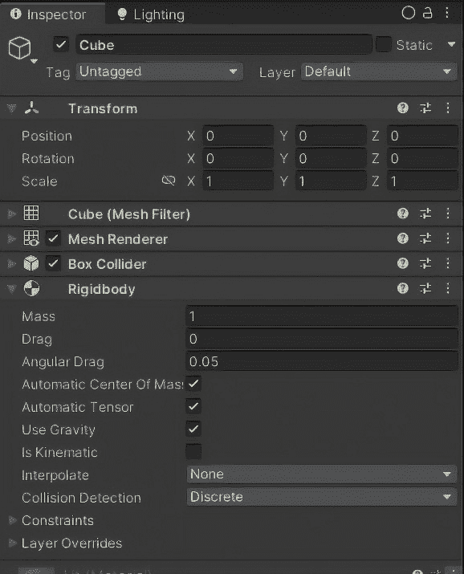
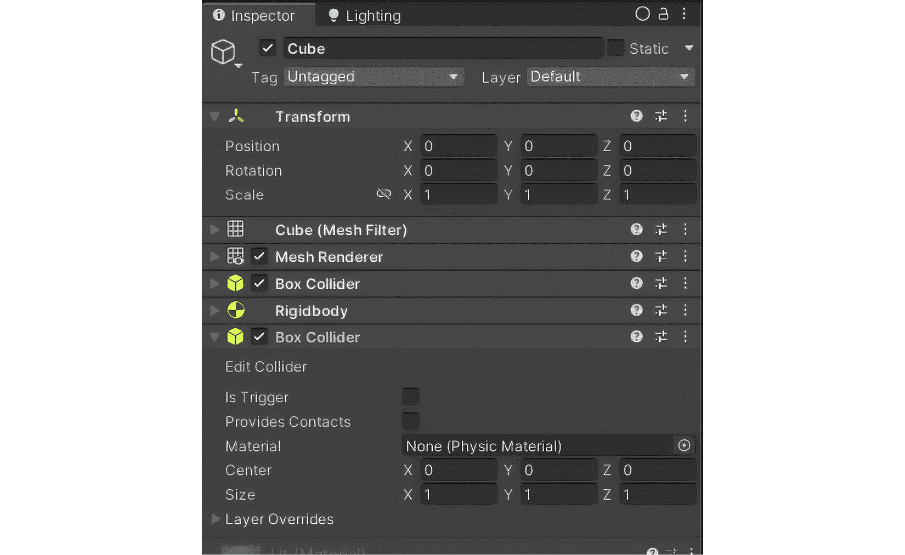
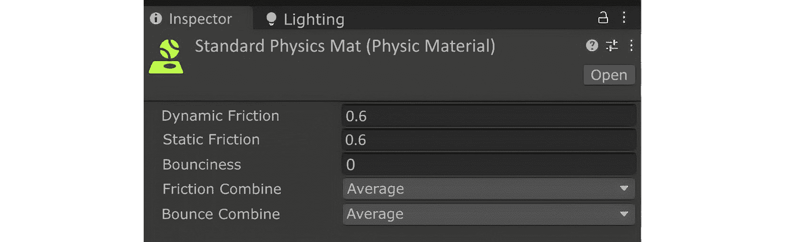
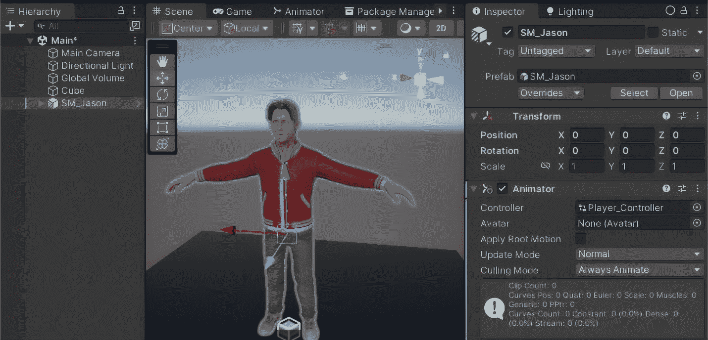
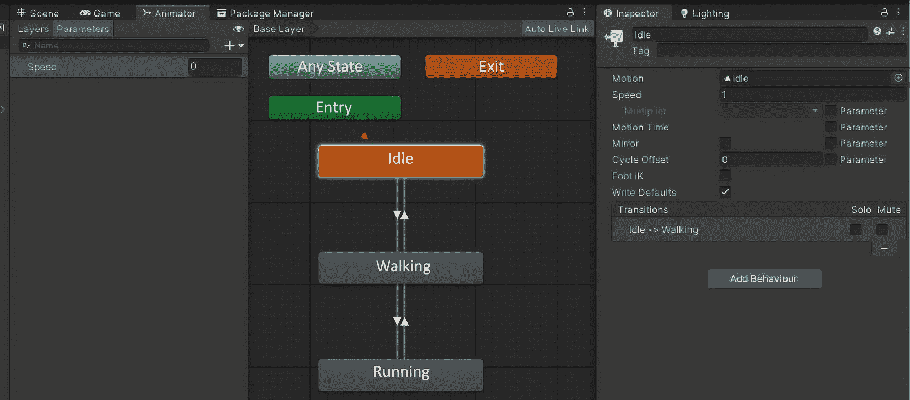
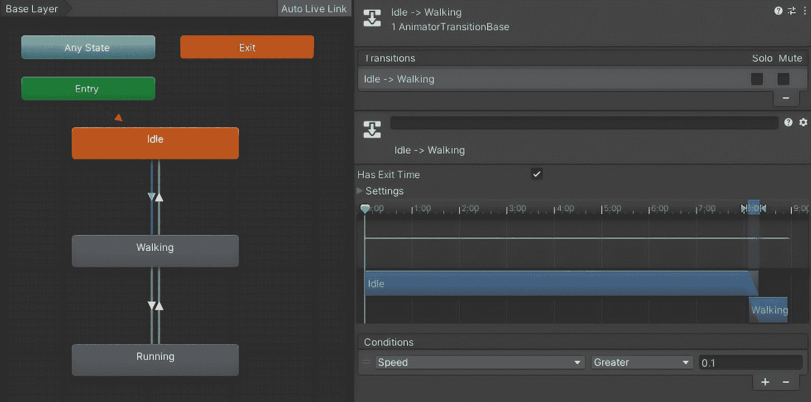
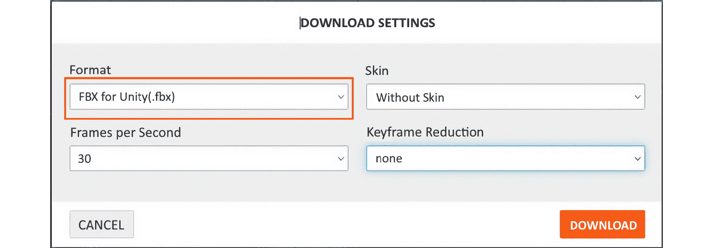
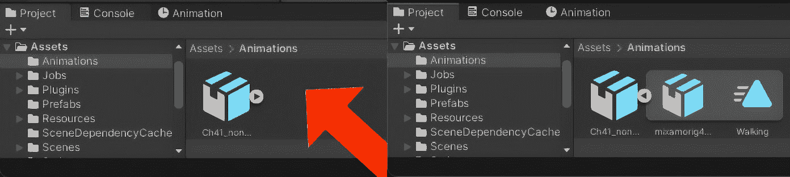
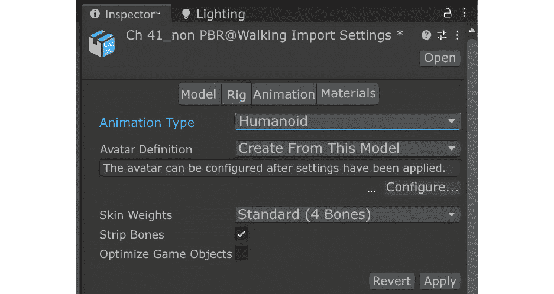
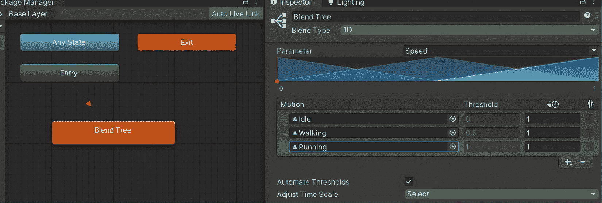

# 8

# 掌握 Unity 游戏开发中的物理和动画

本章深入探讨物理和动画领域，这两个领域对于确保你的游戏充满真实感和动态性至关重要。我们将探讨 Unity 物理学的根本原理，从刚体动力学和碰撞体到物理材料，然后过渡到游戏角色的动画制作，分析`Animator`组件和动画状态，以及集成外部动画。随着我们的进展，重点将转向脚本化环境交互和高级动画技术，如**逆运动学**（**IK**）和混合树，解决同步动画与物理以实现逼真运动的问题。本全面指南在 Unity 中为物理和动画奠定了坚实的基础，为更吸引人和互动的游戏体验铺平了道路。

在本章中，我们将涵盖以下主题：

+   Unity 物理学的核心概念

+   创建和控制角色动画

+   与环境交互的脚本

+   使用高级动画功能实现复杂视觉体验

# 技术要求

在开始之前，请确保你的开发环境已按照*第一章*中描述的方式进行设置。这包括在你的系统上安装最新推荐的 Unity 版本和合适的代码编辑器。

## 硬件要求

确保你的计算机满足 Unity 的最低硬件规格，特别是至少支持 DX10（着色器模型 4.0）的显卡和至少 8 GB 的 RAM 以实现最佳性能。

## 软件要求

在开始开发之前，请确保你已经准备好了以下工具：

+   **Unity 编辑器**：使用从*第一章*安装的 Unity 编辑器版本，理想情况下是最新**长期支持**（**LTS**）版本。

+   **代码编辑器**：使用带有 Unity 开发工具的 Visual Studio 或 Visual Studio Code；这些工具应已根据初始设置集成。

你可以在此处找到与本章相关的示例/文件：[`github.com/PacktPublishing/Unity-6-Game-Development-with-C-Scripting/tree/main/Chapter08`](https://github.com/PacktPublishing/Unity-6-Game-Development-with-C-Scripting/tree/main/Chapter08)

# Unity 物理学的核心概念

开始探索 Unity 的物理引擎标志着你在理解游戏开发复杂性的旅程中的一个关键章节。这一基础部分是你掌握赋予静态物体生命力的元素，将它们转变为受物理定律支配的虚拟世界中的动态参与者的门户。在这里，我们将深入研究构成 Unity 物理引擎的核心组件——刚体、碰撞体和物理材质。每个组件都在模拟现实物体交互中扮演着至关重要的角色，这些交互是沉浸式游戏体验的基础。通过一系列专注的教程，我们将导航重力、摩擦和碰撞检测的原则，为你提供应用力、操纵冲量和构建简单但引人入胜的基于物理的谜题的知识。准备好揭开游戏对象运动和交互背后的机制，为创建更具吸引力和互动性的游戏环境奠定基础。

## 理解物理组件

在 Unity 游戏开发领域，掌握物理组件的复杂性不仅增强了游戏世界的真实性，也丰富了玩家在其中的交互。这些交互的核心是两个基本组件：刚体和碰撞体。每个组件都在将物理定律从理论结构转化为可触摸的游戏体验中扮演着关键角色。

### 刚体

`RigidBody`组件是 Unity 中物理模拟的基石。通过将刚体附加到游戏对象上，你赋予它与力交互的能力，使其能够表现出逼真的运动和旋转。这种从静态实体到动态实体的转变为游戏机制提供了无限可能。刚体的关键属性包括**质量**、**阻力**和**角阻力**。

质量决定了物体的重量，影响它对力和碰撞的反应。质量越大，物体移动或停止所需的力就越大。阻力充当空气阻力，减慢物体的运动，并在没有其他力作用的情况下最终将其停止。这对于模拟物体在流体环境中移动或为空中物体增加阻力至关重要。角阻力与阻力类似，但针对旋转运动，影响物体停止旋转的速度。角阻力越低，物体旋转的时间就越长。

Unity 编辑器的`RigidBody`组件。



图 8.1 – 在检查器窗口中显示的刚体组件

在 Unity 编辑器的`RigidBody`组件中添加到 GameObject。通常，你只需要为静态且不移动的物体选择**isKinematic**选项。将 RigidBody 添加到静态物体并将它们设置为 kinematic 确保 Unity 的物理系统能够正确检测与其他物体的碰撞，即使静态物体本身不使用重力。**Use Gravity**选项通常启用，除非在特殊场景中，如太空主题游戏。

`Box 碰撞体`组件是在 Unity 编辑器的**检查器**窗口中添加和配置的。



图 8.2 – Box 碰撞体组件在检查器窗口中的外观

就像 RigidBodies 一样，碰撞体是在**检查器**窗口中添加到 GameObject 的。碰撞体提供了几种不同的形状。你通常会对角色使用胶囊碰撞体。注意**isTrigger**选项；如果选中，碰撞体会报告当另一个具有碰撞体的 GameObject 与其空间相交时。

通过整合这些属性，开发者可以微调物体的物理行为，确保它们在各种场景中表现出预期的行为。例如，设置正确的质量和阻力可以区分羽毛的缓慢下降和岩石的快速坠落。

### 碰撞体

碰撞体作为定义物体碰撞检测边界的无形力场。没有碰撞体，物体将相互穿过，破坏游戏世界的沉浸感和现实感。主要有两种类型的碰撞体：原始碰撞体和网格碰撞体：

+   原始碰撞体是简单的形状（盒形、球体、胶囊），计算效率高，通常用于近似更复杂物体的碰撞边界。它们的简单性使它们成为大多数碰撞检测场景的理想选择。

+   另一方面，当物体的形状过于复杂，无法用原始碰撞体来近似时，就会使用网格碰撞体。它们符合物体的精确形状，允许进行精确的碰撞检测，但计算成本更高。

之间选择原始碰撞体和网格碰撞体取决于对精度和节省计算资源的需求。对于参与频繁碰撞的动态物体，通常首选原始碰撞体。另一方面，网格碰撞体可能被保留用于环境中静态元素，在这些环境中精确的碰撞边界至关重要。

理解并有效地利用 Rigidbodies 和碰撞体对于构建逼真和交互式的游戏环境至关重要。通过操纵质量、阻力和选择适当的碰撞体类型，开发者可以模拟广泛的物理行为和交互。当我们从静态过渡到动态，从不可移动过渡到动态时，我们的下一个关注点将是作用于这些实体的力。下一小节将深入探讨如何应用那些引导和动画化我们游戏世界中物体的无形之手，使它们有目的地被推动并具有方向性。

## 探索力、重力和冲量

在我们用 Unity 构建的虚拟领域中物体之间的迷人舞蹈中，编排是由力和重力这一基本原理决定的。我们探索 Unity 物理引擎的这一部分深入探讨了应用力和操纵重力和冲量的艺术。这些元素不仅仅是方程式中的变量，而是赋予静态物体生命，使它们成为我们游戏世界舞台上的动态演员的精髓。

### 力

在 Unity 中的动态运动的核心是向 `Rigidbody` 组件应用力，推动物体在空间中移动，并赋予它们速度和方向。`AddForce` 对物体施加连续的力，使其在指定方向上移动，类似于风推动帆船或玩家踢球。这种力可以瞬间施加，也可以在一段时间内连续施加，从而产生广泛的运动效果。另一方面，`AddTorque` 施加旋转力，使物体旋转。这对于模拟滚动球或转动汽车等动作非常有用。

操作这些力允许开发者模拟现实或奇幻的运动，从树叶的轻柔飘动到火箭的强大推力。

这里有一个简单的 C# 脚本，用于 Unity，演示了如何使用 `AddForce` 和 `AddTorque` 方法将力和旋转力（扭矩）应用于 GameObject 上附加的 `Rigidbody` 组件。此脚本假设你有一个带有 `Rigidbody` 组件的 3D GameObject，并且此脚本附加到该 GameObject 上：

```cs
using UnityEngine;
public class ForceAndTorqueDemo : MonoBehaviour
{
    public float forceMagnitude = 10f;
    public float torqueMagnitude = 5f;
    private Rigidbody rb;
    void Start()
    {
        // Get the Rigidbody component attached to this GameObject
        rb = GetComponent<Rigidbody>();
    }
    void Update()
    {
        // Check for user input to apply force
        if (Input.GetKeyDown(KeyCode.Space))
        {
            // Apply an upward force to the Rigidbody
            rb.AddForce(Vector3.up * forceMagnitude,
              ForceMode.Impulse);
        }
        // Check for user input to apply torque
        if (Input.GetKeyDown(KeyCode.T))
        {
            // Apply a rotational force (torque) around the Z-axis
            rb.AddTorque(Vector3.forward * torqueMagnitude,
              ForceMode.Impulse);
        }
    }
}
```

让我们看看它是如何工作的：

+   `forceMagnitude`：这个公共变量允许你在按下 *空格键* 时设置施加的力的强度。你可以在 Unity 检查器中调整这个值。

+   `torqueMagnitude`：这与 `forceMagnitude` 类似，但用于按下 *T* 键时施加的旋转力。

+   `rb`：这是一个私有变量，用于保存对 `RigidBody` 组件的引用。

+   `Start`：使用此方法，脚本获取与同一 GameObject 附加的 `RigidBody` 组件。

+   `Update`：使用此方法，脚本监听按键操作：

    +   按下 *空格键* 将对 GameObject 施加向上的力，使其跳跃。

    +   按下 *T* 键将在 GameObject 的 *z* 轴上施加旋转力，使其旋转。

实现这一点的步骤如下：

1.  在 Unity 场景中创建一个新的 3D GameObject（例如立方体或球体）。

1.  如果 GameObject 还没有，请为其添加`RigidBody`组件。

1.  将前面的脚本附加到 GameObject 上。

1.  播放场景。按*空格键*可以看到物体跳跃，按*T 键*可以看到物体旋转。

总结来说，Unity 中的动态运动是通过向 Rigidbody 组件应用力来实现的，使用如`AddForce`等方法将物体推向特定方向，以及使用`AddTorque`来赋予旋转运动。这些方法能够实现广泛的现实运动效果，从线性推进到旋转。接下来，我们将探讨重力和冲量的概念，深入了解这些力量如何进一步影响游戏世界中的物体行为和交互。

### 重力和冲量

重力，一种看不见的力量，它使我们的脚保持在地面上，也在我们的游戏世界中锚定物体，为我们提供了一个基准，从这里我们可以将它们推向运动或让它们回到静止状态。Unity 允许开发者自定义全局重力设置以适应他们游戏世界的需求，无论是模拟太空的失重还是外星行星的重力。调整重力可以极大地改变游戏体验。冲量提供了一种给物体施加突然、强大力量的方法。它们通常用于跳跃或快速方向改变等动作。通过施加冲量，你可以瞬间改变物体的速度，模拟能量的爆发或力量的增强。

理解和掌握重力和冲量之间的相互作用是创建吸引人和响应迅速的游戏机制的关键，这些机制会让玩家感觉自然。

以下 C#脚本演示了如何在`RigidBody`上使用 Unity 的重力设置以及如何施加冲量力来模拟跳跃或突然移动。此脚本应附加到具有`RigidBody`组件的 GameObject 上：

```cs
using UnityEngine;
using UnityEngine.UI;
public class GravityAndImpulseDemo : MonoBehaviour
{
    public float jumpForce = 5f;
    public Slider gravitySlider;
    private Rigidbody rb;
    void Start()
    {
        // Get the Rigidbody component attached to the GameObject
        rb = GetComponent<Rigidbody>();
        // Set the initial value of the gravity slider
        if (gravitySlider != null)
        {
            gravitySlider.value = Physics.gravity.y;
            gravitySlider.onValueChanged.AddListener
                          (OnGravityChanged);
        }
    }
    void Update()
    {
        // Check for user input to apply an impulse force
        if (Input.GetKeyDown(KeyCode.Space))
        {
            // Apply an impulse force upwards to simulate a jump
            rb.AddForce(Vector3.up * jumpForce,
              ForceMode.Impulse);
        }
    }
    // Method to handle gravity changes via the slider
    void OnGravityChanged(float newGravity)
    {
        Physics.gravity = new Vector3(0, newGravity, 0);
    }
}
```

前面的代码演示了如何在 Unity 中调整重力设置并给物体施加冲量。

下面是代码功能的分解：

+   `jumpForce`：这个公共变量设置了按下*空格键*时施加的冲量力的幅度。它可以在 Unity 检查器中调整以修改跳跃高度。

+   `gravitySlider`：这是一个公共变量，它引用了一个`UI Slider`组件，用于在运行时调整重力。

+   `rb`：这是一个私有变量，它持有 Rigidbody 组件的引用。

现在我们将探索`Start`方法：

+   获取附加的`Rigidbody`组件。

+   初始化重力滑块，并在滑块值改变时调用`OnGravityChanged`。

让我们看看`Update`方法：

+   监听*空格键*，并对`Rigidbody`施加向上的冲量力，模拟跳跃。

最后，`OnGravityChanged`方法根据重力滑块的值更新全局重力设置，允许实时调整重力。

注意

默认情况下，`RigidBody`组件受 Unity 的物理设置中定义的重力影响（**编辑** | **项目设置** | **物理**）。你不需要手动在每一帧应用重力；Unity 的物理引擎处理这一点。

如果你想要为特定对象自定义重力，你可以调整 Rigidbody 的`useGravity`属性，并在需要时手动应用自定义的重力力。然而，在大多数情况下，使用全局重力设置是足够且逼真的。

要将`GravityAndImpulseDemo`代码应用到 Unity 中的游戏对象，请按照以下步骤操作：

1.  在你的 Unity 场景中，创建一个新的 3D 游戏对象（例如一个立方体或球体）。

1.  确保游戏对象具有`RigidBody`组件。如果没有，请在**检查器**窗口中点击**添加组件** | **物理** | **RigidBody**来添加一个。

1.  将`GravityAndImpulseDemo`脚本附加到游戏对象上。

1.  在你的 Unity UI 中，添加一个`Slider`元素来调整重力。将其命名为`gravitySlider`。

1.  在`GravityAndImpulseDemo`脚本的`gravitySlider`字段中分配`gravitySlider`。

1.  进入播放模式并按*空格键*来应用冲量力并看到物体跳跃。

此脚本有效地展示了使用冲量力与 Unity 内置重力结合以创建逼真的跳跃行为或游戏对象中的突然移动的概念。

力量的操控，加上基础的重力吸引，为我们在游戏中的物体动态芭蕾舞奠定了基础。通过仔细应用力和冲量，我们可以创建一个对玩家动作和环境条件做出可信反应的世界。随着我们进入本章，我们将从移动物体的虚幻力过渡到它们与之交互的有形材料。在接下来的部分中，我们将探讨物体表面如何相互作用，为我们的游戏物理增加另一层真实性和复杂性。

## 物理材料和摩擦

在 Unity 的游戏开发框架的广阔画布上，物体之间的微妙舞蹈通常由看不见的力所控制，其中物理材料促进的交互在其中扮演着关键角色。本节深入探讨物理材料领域，这是 Unity 中的一个强大功能，允许开发者定义对象在其表面上的交互方式，影响从球的弹跳到角色在不同地形上滑动的各个方面。与此同时，我们将导航摩擦的复杂性，这是一种固有的力，为我们的游戏环境中的物理交互增添了深度和真实性。

以下是一个名为**Standard Physics Mat**的物理材料的截图，如图所示在**检查器**窗口中。



图 8.3 – 在检查器窗口中看到的物理材料

在**检查器**窗口中，您可以调整物理材质属性，如**动态摩擦**、**静态摩擦**和**弹性**。这些属性可以组合起来进一步影响游戏对象的行为。现在，让我们探索如何在项目中创建和应用这些材质。

### 创建和使用物理材质

Unity 中的物理材质是封装了与摩擦和弹性相关属性的资产，允许开发者制作各种物理行为。创建物理材质很简单：在**项目**面板中右键单击，导航到**创建** | **物理材质**，并给它命名。创建后，您可以调整如**动态摩擦**（运动时的阻力）、**静态** **摩擦**（静止时的阻力）和**弹性**（物体碰撞后反弹的程度）等属性，以达到期望的交互效果。将物理材质应用到对象上就像将材质拖放到游戏对象的碰撞组件上一样简单。这种即时应用允许快速测试和迭代，为虚拟世界提供触觉感，其中每个表面都可以通过交互讲述自己的故事。

### 摩擦考虑

Unity 中的摩擦通过在碰撞体上管理物理材质进行精细调整，精细地调节对象与表面之间的交互，平衡真实性和游戏玩法。调整动态和静态摩擦参数会影响物体的移动方式，这对于创建可信或奇幻的游戏环境至关重要。随着我们对摩擦的讨论结束，我们将转向探索碰撞检测和响应，深入了解 Unity 如何处理对象交互和编写反应脚本来丰富游戏动态。

## 碰撞检测和响应

随着我们深入 Unity 的物理原理，我们达到了一个关键转折点，即运动和物质性的抽象原理在碰撞检测和响应的实体领域中显现出来。游戏物理的这部分基本组件为虚拟世界注入了生命，使对象不仅能识别它们何时接触，还能以多种可定制的方 式做出反应。通过 Unity 强大的碰撞检测系统和它提供的灵活脚本能力，开发者可以构建一个沉浸式环境，其中每个接触都讲述一个故事，无论是简单的触摸、强烈的碰撞还是表面的微妙擦过。

### 检测碰撞

在 Unity 中，碰撞检测是交互式游戏环境的基础，允许对象感知并响应与其他对象的接触。Unity 提供了一套碰撞检测事件，对于脚本交互至关重要：

+   `OnCollisionEnter`: 当一个碰撞体首次与其他碰撞体接触时，会触发此事件。它是许多交互脚本的起点，标志着碰撞的初始时刻。

+   `OnCollisionStay`：只要碰撞体保持接触，此事件就会持续触发，允许脚本化持续的交互，例如物体相互推挤。

+   `OnCollisionExit`：当接触的碰撞体分离时触发，此事件可用于脚本化一旦对象不再与另一个对象接触就发生的效果或行为。

这些事件依赖于至少一个碰撞物体上存在一个 `RigidBody` 组件，该组件可以是运动学或动态的，确保在 Unity 的物理引擎中碰撞检测既高效又准确。

#### 碰撞响应脚本

真正的魔法在于我们如何响应这些碰撞。Unity 允许开发者编写对碰撞事件的响应脚本，使物体表现出逼真的行为或触发游戏机制：

+   开发者可以将 `AudioSource` 组件附加到对象上，并在 `OnCollisionEnter` 方法中对其进行脚本化，以播放声音，为碰撞创建音频反馈，增强游戏的感觉体验。

+   `OnCollisionExit` 用于在碰撞结束时重置属性。

以下代码片段展示了典型的 `OnCollisionEnter` 编码：

```cs
void OnCollisionEnter(Collision collision)
{
    // Play sound
    AudioSource audio = GetComponent<AudioSource>();
    audio.Play();
    // Change color to indicate damage
    Renderer renderer = GetComponent<Renderer>();
    renderer.material.color = Color.red;
}
```

当发生碰撞时，此代码片段会被触发。它检索游戏对象的 `AudioSource` 组件来播放声音，指示如击打等交互。此外，它访问 `Renderer` 组件来改变物体的材质颜色为红色，视觉上表示伤害或冲击。这种即时的音频-视觉反馈增强了游戏的真实感和玩家的参与度。

通过碰撞检测的复杂舞蹈和碰撞响应的创造性脚本编写，Unity 开发者拥有一个强大的工具集，可以制作引人入胜且动态的游戏环境。无论是剑的铿锵声、球的砰然声，还是玻璃的破碎声，每个碰撞都可以赋予意义和后果，推动故事向前发展并加深玩家的沉浸感。随着我们结束这次探索，我们被提醒，在游戏开发领域，即使是微小的接触也可能产生深远的影响，在我们的虚拟世界中回响。

在深入探讨 Unity 物理基础的过程中，我们已经了解了 `RigidBody` 动力学、碰撞体交互和物理材料的微妙之处。我们探讨了力、重力和冲量如何使物体运动，以及摩擦和碰撞如何为它们的交互增添深度和真实感。从塑造游戏环境的物理过渡到下一部分，我们将通过动画使角色栩栩如生，将它们的动作与我们所构建的基于物理的丰富世界联系起来。下一部分承诺将进一步提高我们的游戏开发技能，将物理与表现力相结合。

# 游戏角色动画

深入 Unity 中角色动画的艺术，探索核心概念，如动画组件、动画状态和过渡。学习如何导入外部动画并制作基本动作，为角色增添逼真的动态。本节提供了一个结构化的指南，从介绍动画组件到将动画与玩家输入链接。这对于确保角色能够以响应和逼真的方式移动和反应至关重要。

## 介绍动画组件

Unity 的动画组件对于动画角色至关重要，通过**动画控制器**管理*空闲*和*跑步*等状态，实现流畅的过渡。作为角色和动画之间的桥梁，它通过解释控制器的指令，确保动态、响应式的动作，实现无缝的动画播放。

下面的图示演示了在 Unity 编辑器中为游戏角色设置动画组件的过程。它显示了动画组件如何附加到角色模型上，并链接到负责管理动画的`Player_Controller`。这种设置对于在游戏环境中启用复杂的动画和交互至关重要。



图 8.4 – 在 Unity 编辑器中为游戏角色设置动画组件

在**层次结构**窗口中选择角色后，在**检查器**窗口中添加**动画组件**。**动画组件**用于控制角色的动画。**控制器**字段链接到**动画控制器**，其中包含动画逻辑。此处还出现了一些额外的设置，如**Avatar**、**应用根运动**和**剔除模式**，以帮助管理动画。

**动画组件**和**动画控制器**协作在 Unity 中为角色动画，控制器包含动画状态、过渡和参数。在为*空闲*或*跑步*等状态创建动画剪辑后，它们被添加到控制器中，允许对每个动画在角色模型上的播放进行详细的自定义和控制。

下面的截图显示了 Unity 中的**动画窗口**，展示了为角色设置动画状态和过渡，包括**空闲**、**行走**和**跑步**状态，以及它们各自的参数和过渡。



图 8.5 – 显示 Unity 中角色动画状态和过渡的动画窗口

**动画器**窗口在左侧列显示可用的参数，其中已添加了一个名为**速度**的浮点参数。右侧列显示了**动画器**控制器的各种状态，包括**进入**、**空闲**、**行走**和**奔跑**，以及连接这些状态的过渡。图中的右侧**检查器**窗口显示了**空闲**状态的配置，详细说明了其运动设置和过渡条件。

在每个动画状态内，您可以调整各种参数来控制动画的播放，例如动画剪辑的速度、循环行为和混合设置。这确保了动画之间能够无缝过渡，为您的角色创造自然且逼真的动作。

以下截图展示了**动画器**窗口中不同状态之间的动画过渡设置，特别是从**空闲**到**行走**的过渡以及相关的参数和条件。



图 8.6 – 动画器窗口显示从空闲到行走状态的动画过渡及其相关参数和条件

在**动画器**窗口中选择一个过渡后，**检查器**窗口将显示其配置。**速度**参数控制过渡，当它达到**0.1**时，**动画器**控制器开始播放**行走**动画。过渡长度，它决定了动画从一个状态平滑过渡到另一个状态的程度，可以在时间轴中进行调整。

**动画器**控制器还允许您定义在不同动画状态之间过渡的规则。您可以根据各种参数创建状态之间的过渡，例如角色的速度、玩家的输入或其他游戏特定条件。通过精心设计这些过渡，您可以创建平滑、响应迅速且视觉上吸引人的角色动画，这些动画能够动态地响应玩家的动作和游戏事件。

在**动画器**控制器中设置动画状态至关重要。您将学习如何创建和配置诸如**空闲**、**行走**、**奔跑**和**跳跃**等状态，并自定义它们的属性以实现平滑过渡。这为下一节关于动画过渡和参数的讨论奠定了基础。

## 动画过渡和参数

我们将深入探讨在 Unity 中细化角色动作，重点关注行走和跳跃等状态之间的无缝过渡，这些过渡由**速度**等参数控制。本节还将涵盖使用 C# 编写脚本以动态调整这些参数，以响应玩家输入或游戏场景，从而通过流畅、响应迅速的动画丰富游戏体验。

在 Unity3D 中创建逼真的动画涉及使用**Animator**控制器实现状态之间的平滑过渡，例如从空闲到行走或从跑步到跳跃。基于玩家输入或游戏条件的参数确保了动态、响应式的角色动作。

在跑步到跳跃的`isJumping`中，启用无缝和沉浸式的动画，这些动画对游戏玩法做出响应。

下面的脚本片段演示了根据玩家输入（按下*空格键*）来触发跳跃动画，修改`Animator`参数`isJumping`：

```cs
using UnityEngine;
public class PlayerController : MonoBehaviour
{
    Animator animator;
    void Start()
    {
        animator = GetComponent<Animator>();
    }
    void Update()
    {
        if (Input.GetKeyDown(KeyCode.Space))
        {
            // Set the 'isJumping' parameter to true when the space bar is pressed
            animator.SetBool("isJumping", true);
        }
    }
}
```

在提供的代码中，从一个 GameObject 中访问了`Animator`组件，可能旨在表示玩家角色。该脚本在`Update`方法中监听特定的玩家输入（*空格键*按下），该方法每帧都会被调用。检测到按下后，它将`Animator`参数`isJumping`设置为`true`，可能是为了触发跳跃动画。这展示了基于玩家动作的动态动画控制。

在这里，我们通过使用参数如`speed`和`isJumping`设置动画状态之间的细微过渡，并通过 C#脚本对游戏玩法动态做出响应，探讨了在 Unity 中制作流畅动作。接下来，我们将通过外部资源扩展我们的动画工具包。

## 导入和使用外部动画

将动画导入 Unity 是增强游戏角色动态性和真实感的关键步骤。本节将指导您通过导入外部动画的过程，涵盖文件格式和设置导入动画在**Animator Controller**中的基本方面。一个高质量动画的流行资源是**Mixamo**，这是一个在线平台，提供了大量的角色动画库。接下来的截图显示了 Mixamo（Adobe）界面，您可以在其中浏览、自定义并下载用于游戏角色的动画。通过利用像 Mixamo 这样的平台，您可以显著简化动画过程，并用多样化和专业制作的动作丰富您的 Unity 项目。

下一个图示展示了 Mixamo 的主界面，该界面允许您浏览可用的动画，查看演示所选动画的模型，进行调整，并下载动画。

![图 8.7 – Mixamo [Adobe] 界面显示角色动画库和自定义选项](img/B22128_08_07.jpg)

图 8.7 – Mixamo [Adobe] 界面显示角色动画库和自定义选项

Mixamo 是角色动画的一个流行来源。左侧部分显示了一个庞大的动画集合。选择一个选项，例如**行走**，它将在右侧窗口中显示。使用滑块调整动画以满足您的需求。如果您计划使用**变换**来移动角色，请勾选**就地**框；如果您将使用**角色控制器**等工具，请取消勾选。一旦您对设置满意，请点击**下载**。

在本节中，您将学习如何将外部动画导入 Unity，详细说明确保无缝集成的流程。Unity 支持**Filmbox**（**FBX**）文件格式，这是最稳健且推荐用于动画的格式。虽然**COLLAborative Design Activity**（**COLLADA**）也受到支持，但它的可靠性较低，通常应避免使用。**Biovision Hierarchical Data**（**BVH**）文件格式需要第三方工具才能有效使用。我们将指导您完成导入这些文件、在**动画器**中设置它们以及确保它们在您的游戏环境中正确运行的步骤。了解这些文件格式及其导入流程对于将高质量动画融入您的 Unity 项目至关重要。

一旦您的动画被导入，我们将深入探讨**动画器**组件内的设置过程。这包括配置动画状态、过渡和参数，以创建一个连贯的动画流程。我们将探讨如何将这些动画链接到您的角色模型上，确保动画播放正确且看起来自然。在**动画器**中正确设置对于实现平滑且逼真的角色动作至关重要，从而提升整体游戏体验。

此外，我们还将介绍将外部动画与您的角色模型合并的最佳实践。这包括确保动画与您的模型之间的绑定兼容性，调整动画设置以实现最佳性能，并使用动画层无缝混合多个动画。通过遵循这些最佳实践，您可以确保平滑且兼容的动画播放，从而实现精致且专业的游戏体验。这些指南将帮助您避免常见陷阱，并在动画中实现更高的质量水平。

在 Mixamo 主屏幕上选择**下载**后，将出现以下屏幕：



图 8.8 – Mixamo 动画下载设置

在**下载设置**中，选择**格式**下的**FBX for Unity(.fbx**)非常重要，以确保 Unity 能够识别该文件。选择**无皮肤**意味着 Mixamo 不会包含显示的角色。将**每秒帧数**设置为**30**最佳，因为较大的数字会产生更大的文件。

下图显示了将动画文件拖入 Unity 编辑器**项目**窗口的过程。图例的右侧显示了最近添加的动画，其中显示了其内容。



图 8.9 – Unity 编辑器的项目窗口

要将动画添加到 Unity 项目，只需将文件拖入 Unity 编辑器的**项目**窗口。Unity 将处理文件并将动画添加到项目中。在右侧，选中的处理后的 FBX 文件显示。它显示它包含两个文件。三角形图标表示动画。在这里，动画被命名为**Walking**。

下图显示了在**项目**窗口中选择 FBX 文件后的**检查器**窗口；动画文件可以在此处进一步配置。



图 8.10 – 动画文件在检查器窗口中显示的绑定部分

在**项目**窗口中选择 FBX 文件后，查看**检查器**窗口。对于角色动画，选择**绑定**，然后在**动画类型**下选择**人类**。最后，点击**应用**。确保绑定的动画类型与角色的类型相匹配非常重要。

将动画导入 Unity 中最常见的文件格式是 FBX 格式。FBX 是一个广泛采用的标准，它保留了动画数据，包括关键帧、骨骼变换和其他动画特定信息。当导入包含动画的 FBX 文件时，Unity 将自动创建必要的动画剪辑，您可以在**动画控制器**中使用这些剪辑。

除了 FBX 之外，Unity 还支持导入其他动画文件格式，如 Alembic 和 USD，具体取决于您使用的 Unity 版本。确保动画数据从原始 3D 软件正确导出，并且文件格式与 Unity 的要求兼容非常重要。

## 创建基本动画并将其链接到玩家输入

本节介绍了在 Unity 中制作基本动画并将其链接到玩家交互的过程。它涵盖了使用**动画**窗口进行简单动画和编写输入驱动的动画，例如通过按键启动行走循环，从而通过响应式角色动作增强游戏玩法。

Unity 中的**动画**窗口对于制作基本动画（如眨眼或手势）非常重要。它涉及选择一个 GameObject，记录关键帧以捕获所需的动作，并编辑这些动画以调整时间和插值，从而实现对动画的精细调整以实现预期的视觉效果。

输入驱动的动画，如通过移动按键触发的角色行走循环，将脚本与 Animator 组件参数相结合，以反映玩家动作，增强游戏交互性。例如，按下跳跃或攻击按钮可以启动相应的动画，使角色的动作更加动态并对玩家输入做出响应。

本节深入探讨了动画游戏角色的方法，涉及 Unity 的 Animator 组件、动画状态和过渡，以及外部动画的集成，通过如行走循环和输入驱动的动态角色控制等实际示例进行丰富。当我们过渡到下一节时，我们将探讨这些动画角色如何在周围环境中交互，进一步将玩家沉浸到游戏世界中。

# 环境交互

本节深入探讨了角色在 Unity 中如何与环境互动，重点关注脚本驱动的物理反应和动画交互元素（如门和平台），以提供更沉浸式的体验。它提供了脚本示例，以动态地根据玩家动作改变游戏环境，使虚拟世界感觉生动且具有响应性。

在动画和脚本的基础之上，我们现在将注意力转向基于物理的角色交互。本节将介绍角色如何通过物理与周围环境交互，重点关注如 `OnCollisionEnter` 事件以创建响应性和沉浸式的游戏体验。

## 基于物理的角色交互

创建基于物理的角色交互的一种方法是为各种物理事件（如碰撞或触发器）编写角色反应的脚本。例如，当角色与障碍物碰撞或遇到地形坡度变化时，它们可能会绊倒或调整姿势。为了实现这一点，你可以使用 Unity 内置的物理事件回调，如 `OnCollisionEnter` 或 `OnTriggerEnter`。这些回调允许你检测角色的碰撞器何时与另一个对象交互，然后触发相应的动画或效果。`OnCollision` 和 `OnTrigger` 事件之间的主要区别在于，`OnCollision` 用于检测物理碰撞，其中碰撞器会以物理方式响应，而 `OnTrigger` 用于检测定义的触发区域内的交互，而不应用物理力，从而实现更抽象或游戏特定的交互。

下面是一个示例 C# 脚本，演示了如何使用 `OnCollisionEnter` 触发当角色与障碍物碰撞时的绊倒动画：

```cs
using UnityEngine;
public class CharacterPhysicsReactions : MonoBehaviour
{
    public Animator animator;
    public float stumbleForce = 5f;
    private void OnCollisionEnter(Collision collision)
    {
        // Check if the collision was with an obstacle
        if (collision.gameObject.tag == "Obstacle")
        {
            // Play the "stumble" animation
            animator.SetTrigger("Stumble");
            // Apply a force to the character to make them stumble
            GetComponent<Rigidbody>().AddForce(-
              collision.contacts[0].normal * stumbleForce,
              ForceMode.Impulse);
        }
    }
}
```

在这个例子中，`CharacterPhysicsReactions` 脚本被附加到角色 GameObject 上。当角色与一个 `Obstacle` 对象发生碰撞时，会调用 `OnCollisionEnter` 方法。然后脚本使用 `Animator` 组件播放绊倒动画，并施加一个力到角色的 RigidBody 上，使其向后绊倒。

从基于物理的交互过渡到交互式环境元素，我们将现在探讨动态功能的实现，如移动平台和开门，增强游戏世界的交互性。通过编写这些元素的脚本，我们可以为玩家创造更加吸引人和沉浸式的体验，使环境感觉生动并对他们的动作做出响应。

## 交互式环境元素

环境动画的一个常见例子是创建基于玩家交互移动或改变状态的门或平台。例如，你可以有一个当玩家靠近时打开的门，或者一个当玩家踏上时上下移动的平台。为了实现这一点，你首先需要在 **Animation** 窗口中为环境元素创建必要的动画。这可能包括为对象的移动或变换设置关键帧，例如门旋转打开或平台上升下降。

一旦设置了动画，你就可以编写脚本以控制这些环境元素的交互性。这通常涉及检测玩家是否接近对象或触发特定动作，然后使用这些信息来播放适当的动画。例如，让我们考虑一个当玩家靠近时打开的门的脚本：

```cs
using UnityEngine;
public class InteractiveDoor : MonoBehaviour
{
    public Animator doorAnimator;
    public float interactionRange = 2f;
    private void Update()
    {
        // Check if the player is within the interaction range
        if (Vector3.Distance(transform.position,
            PlayerController.instance.transform.position)
            <= interactionRange)
        {
            // Play the "Open" animation
            doorAnimator.SetTrigger("Open");
        }
        else
        {
            // Play the "Close" animation
            doorAnimator.SetTrigger("Close");
        }
    }
}
```

在这个例子中，`InteractiveDoor` 脚本被附加到了门 GameObject 上。该脚本在 `Update` 方法中检查门与玩家位置之间的距离。如果玩家位于指定的交互范围内，脚本会在门的 `Animator` 组件上触发 *Open* 动画。如果玩家离开，脚本则会触发 *Close* 动画。

## 动态环境响应

除了创建交互式环境元素外，Unity 还允许你通过使游戏环境动态适应玩家的动作来更进一步。这可以创建一个更加沉浸和响应的游戏世界，其中环境感觉是活生生的，并以有意义的方式对玩家的存在做出反应。

动态环境适应的一个例子可能是一座在玩家角色重量下坍塌的桥梁。当玩家踏上桥梁时，结构可能会开始下沉，最终屈服，迫使玩家找到另一条路线。另一个例子可能是当玩家角色穿过时移动和摇曳的植被。这可以通过使用基于物理的模拟或脚本动画来实现，以创建更加真实和响应的环境。

要实现这些动态环境响应，您需要利用物理、脚本和动画技术的组合。这可能涉及使用 Unity 内置的物理系统来检测碰撞或触发器，然后触发适当的动画或视觉效果以创建所需的环境响应。例如，让我们考虑一个可以用来使桥梁在玩家重量下坍塌的脚本：

```cs
using UnityEngine;
public class BridgeCollapse : MonoBehaviour
{
    public float maxWeight = 500f;
    public float collapseSpeed = 2f;
    public Animator bridgeAnimator;
    private bool isCollapsing = false;
    private void OnTriggerEnter(Collider other)
    {
        // Check if the colliding object is the player
        if (other.CompareTag("Player"))
        {
         // Get the total weight of the player and any carried objects
            float totalWeight =
              other.GetComponent<Rigidbody>().mass +
              other.GetComponent<PlayerInventory>()
              .totalWeight;
            // If the total weight exceeds the bridge's capacity,
            //start the collapse
            if (totalWeight > maxWeight)
            {
                isCollapsing = true;
                bridgeAnimator.SetTrigger("Collapse");
            }
        }
    }
    private void Update()
    {
        // Gradually lower the bridge as it collapses
        if (isCollapsing)
        {
            transform.Translate(Vector3.down *
              collapseSpeed * Time.deltaTime);
        }
    }
}
```

在这个例子中，`BridgeCollapse` 脚本被附加到桥梁 GameObject 上。当玩家的碰撞器进入桥梁的触发区域时，脚本会检查玩家及其携带物体的总重量。如果重量超过桥梁的最大承载能力，脚本会将布尔变量设置为 `true`，并在桥梁的 `Animator` 组件上触发 *Collapse* 动画，并随着时间的推移逐渐降低桥梁的位置。然后 `Update` 方法会检查这个布尔变量，如果它是 `true`，则会随着时间的推移逐渐降低桥梁的位置。

总结来说，本节深入探讨了角色与其周围环境之间细微的交互，重点关注物理和动画以增强游戏沉浸感。这包括角色对环境元素的响应以及环境对玩家动作的动态适应。下一节将探讨逆运动学（IK）和混合树（Blend Trees）等复杂的动画功能，以增强 Unity 中的角色动作和逼真度。

# 高级动画技术

本节介绍了 Unity 中用于制作复杂角色动作和行为的先进功能，例如逆运动学（IK）和混合树（Blend Trees）。它涵盖了将这些高级动画与物理结合以实现逼真运动的方法，并提供了关于最佳实践和动态角色与环境交互案例研究的见解。首先，让我们看看逆运动学（IK）。

## 掌握逆运动学

本小节深入探讨了逆运动学（IK）的概念及其在 Unity 中为角色关节创建逼真动作中的关键作用。它涵盖了逆运动学在诸如伸手和行走等任务中的基本知识，并指导您使用 Unity 内置求解器实现逆运动学，以动态控制肢体运动。

反向运动学（IK）特别适用于角色需要以自然和响应的方式与环境交互的任务，例如伸手取物或调整脚步以适应不平坦的地形。通过使用 IK，你可以确保角色的肢体和关节以更逼真和可信的方式移动，而不是完全依赖于预定义的动画。Unity 提供了几个内置工具和功能，帮助你将 IK 集成到你的项目中。例如，**Animator** 组件包括 IK 功能，允许你动态地控制角色肢体的位置和方向。要在 Unity 中使用 IK，你通常需要首先为角色的肢体设置 IK 目标，如手或脚。然后，这些目标可以在场景中定位，IK 求解器会自动调整角色的关节旋转以匹配目标位置。此外，Unity 的 Cinemachine 包含一个强大的 IK 系统，可用于控制角色的头部和眼部运动，从而创建更自然和响应灵敏的摄像机行为。

## 利用 Blend Trees 实现流畅动画

本节介绍了 Unity 中 Blend Trees 的基础知识，强调了它们根据参数促进动画之间平滑过渡的能力，从而增强角色动作的流畅性。它包括一个实际指南，说明如何在 **Animator** 控制器中设置和配置 Blend Trees，展示了如何根据 **速度** 参数无缝混合不同的动画，如行走和跑步。

Blend Trees 是一种基于一个或多个参数（如角色的速度或方向）在多个动画之间进行混合的方法。这允许你创建不同动画之间的平滑过渡，而不是有突兀的变化，这可能会破坏角色动作的整体流畅性。例如，你可能有一个基于角色速度在行走动画和跑步动画之间进行混合的 Blend Tree。随着角色加速，Blend Tree 会逐渐从行走动画过渡到跑步动画，创建出自然且响应灵敏的动作。

### 创建和配置 Blend Trees

要在 Unity 中设置 Blend Tree，你首先需要创建你想要混合的单独动画。一旦你有了动画，你就可以在你的 **Animator** 控制器中创建一个新的 Blend Tree 状态并配置混合参数。以下是如何为角色的行走和跑步动画创建和配置 Blend Tree 的分步指南：

1.  在 **Animator** 窗口中，创建一个新的 **Blend Tree** 状态。

1.  将你的行走和跑步动画拖放到 Blend Tree 中。

1.  在 Blend Tree 设置中，创建一个新的参数（例如，`速度`）来控制动画之间的混合。

1.  调整 Blend Tree 的设置以定义动画应根据**速度**参数如何混合。例如，你可能将行走动画设置为当速度低于两米/秒时使用，将跑步动画设置为当速度高于四米/秒时使用，并在两者之间实现平滑过渡。



图 8.11 – Blend Tree 的示例

在图 8.11 中所示示例中，Blend Tree 被添加到**Animator**窗口中，然后在**Inspector**窗口中进行配置。

在探讨了使用 Blend Trees 创建平滑和动态动画之后，我们现在转向动画层的概念。本节将深入探讨如何利用动画层同时管理多个动画，从而在角色动作和行为上实现更大的灵活性和复杂性。

## 利用动画层实现复杂行为

本小节深入探讨了 Unity 中动画层如何管理多个动画，以实现细腻的角色行为，例如将上半身动作与下半身运动分离。它讨论了如何设置这些层以及使用角色面具来隔离和混合动画部分，以实现动态的角色表情。

Unity 中的动画层允许你在多个动画之上堆叠和混合，使你能够创建单动画难以实现的复杂动画行为。这在需要独立控制角色身体不同部分的情况下特别有用，例如上半身执行射击动画，而下半身继续跑步循环。通过将动画组织到单独的层中，你可以为每个层应用不同的混合模式和权重值，从而精细调整各种动画之间的交互，并创建更自然和响应灵敏的角色表现。

要在 Unity 中设置动画层，你首先需要在你的**Animator**控制器中创建额外的层。然后，每个层都可以分配自己的动画集，你可以使用层的权重值来控制该层对最终动画输出的影响。除了层之外，你还可以利用角色面具来进一步细化动画的混合。角色面具允许你隔离角色的特定身体部位，如上半身或腿部，并对这些特定区域应用不同的动画或混合设置。例如，你可能在基础层上有一个跑步动画，然后在上半身层上叠加一个射击动画。通过使用角色面具将射击动画限制在上半身，你可以创建跑步和射击动作之间的无缝混合，从而实现更动态和吸引人的角色表现。

## 将动画与物理同步

本节将探讨将动画与物理对齐以实现逼真效果的复杂任务，探讨常见的同步挑战，并提供最佳实践以确保跳跃或坠落等动作能够令人信服地与物理力量和交互匹配。其中主要挑战之一是两个系统之间的固有脱节，预定义的动画和基于物理的运动可能会变得不同步，导致不自然或令人不适的过渡。

为了有效地同步动画与物理，您需要采用一系列技术。Unity 的 Mecanim 系统，这是一个强大的工具，允许进行复杂的动画混合、状态机和事件处理，可以用于此目的。通过利用 Mecanim，您可以在动画状态之间创建动态响应游戏物理变化的过渡。

另一种技术涉及使用基于物理的动画，例如 ragdoll 物理。ragdoll 物理允许角色的骨骼由物理引擎控制，从而对冲击和力量产生逼真的反应。这对于模拟坠落或冲击的自然反应特别有用。

实现自然的集成需要仔细的调整和测试。调整动画曲线、微调碰撞检测以及为特定交互创建自定义脚本可以帮助解决同步问题。通过严格测试这些元素，您可以确保角色动作看起来平滑且逼真。

在 Unity 中将动画与物理对齐需要一种深思熟虑的方法，这种方法结合了 Mecanim 系统的优势、ragdoll 物理的逼真效果以及细致的调整和测试。这确保了动画和物理能够无缝协作，从而创造更加沉浸式的游戏体验。

# 摘要

本章为您提供了通过物理和动画将现实主义融入 Unity 游戏中的技能，涵盖了从物理实现到角色动画、环境交互和高级动画技术的各个方面。掌握这些概念对于创建沉浸式和逼真的游戏世界至关重要，因为逼真的动画和物理交互极大地增强了玩家的参与度和整体游戏体验。通过了解如何无缝集成动画与物理，您可以确保角色动作自然，并以令人信服的方式与环境交互。这就是为什么我们在本章中涵盖了这些主题。这些课程还为更复杂的游戏机制奠定了基础，让您能够构建复杂和响应灵敏的游戏系统。

随着我们过渡到下一章节，我们将进一步提升您的 C#脚本编写能力，深入探讨异步编程、云集成、事件系统和脚本优化以提高游戏性能。

# 加入我们的 Discord 社区

加入我们社区的 Discord 空间，与作者和其他读者进行讨论：[`packt.link/gamedevelopment`](https://discord.com/invite/NnJesrUJbu?link_from_packtlink=yes)


# 第三部分：高级游戏开发

在本部分，你将掌握 Unity 和 C#编程的高级概念。你将学习如何使用协程进行非阻塞代码执行，管理和操作复杂的数据结构，设计自定义事件系统，并优化脚本以提高性能和效率。你将深入研究**人工智能**（**AI**），应用路径查找算法，构建决策逻辑，并创建复杂的 NPC 行为。还将涵盖网络基础知识，包括开发多人匹配系统，确保游戏状态的一致性，以及管理网络延迟和安全。此外，你将使用性能分析工具来分析游戏性能，管理内存使用，优化图形资源和渲染过程，并编写高效、优化的代码以提升整体游戏性能。

本部分包括以下章节：

+   *第九章*, *Unity 中的高级脚本技术* *–* *异步、云集成、事件和优化*

+   *第十章*, *在 Unity 中实现人工智能*

+   *第十一章*, *多人游戏和网络* *–* *匹配、安全和交互式游戏*

+   *第十二章*, *在 Unity 中优化游戏性能* *–* *性能分析和技术*
