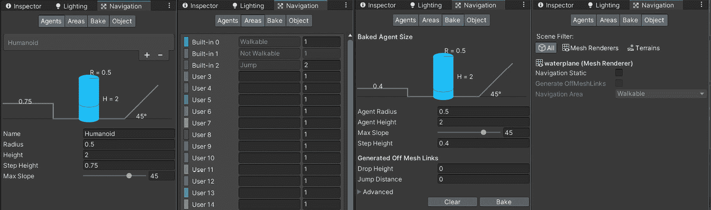
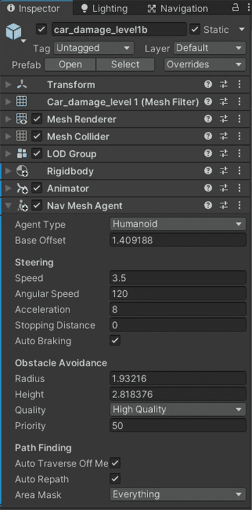
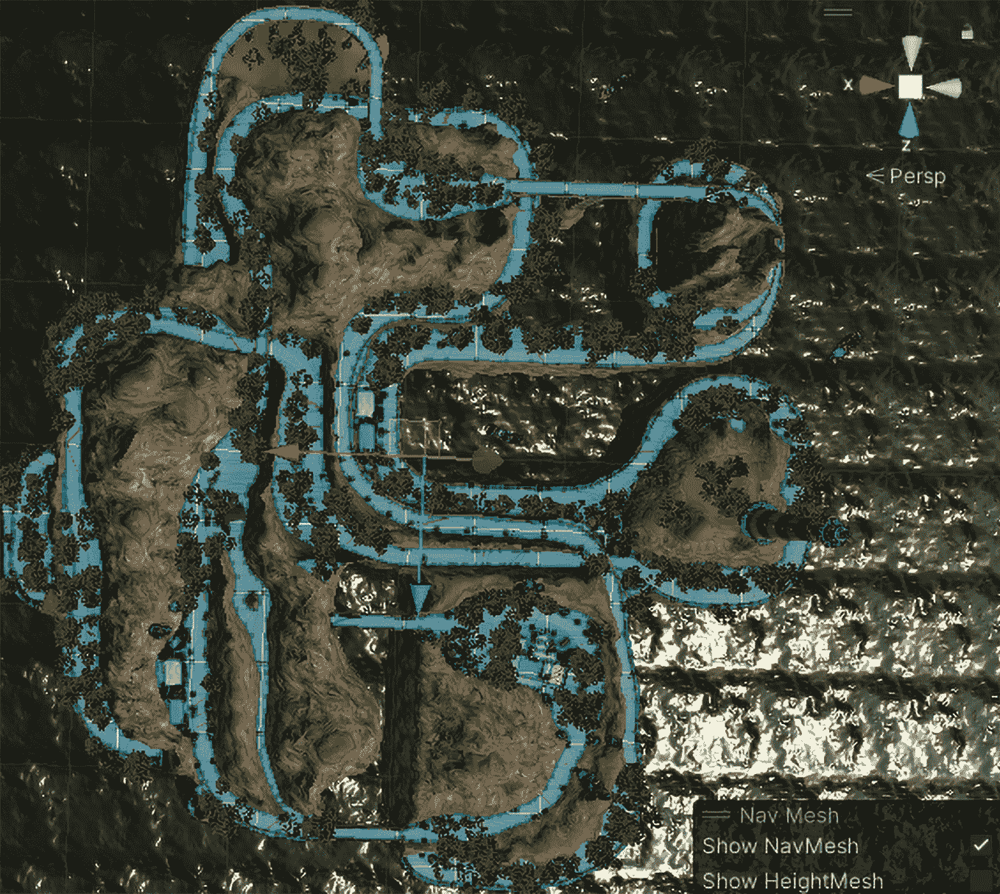
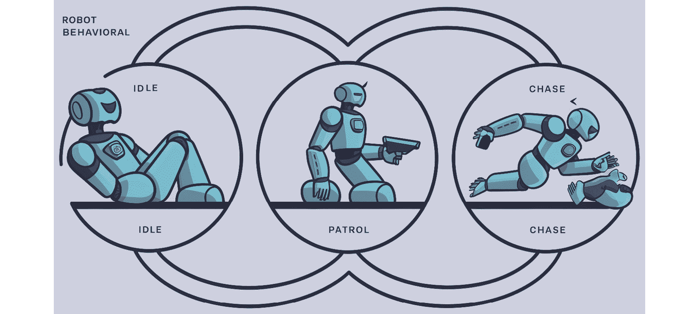
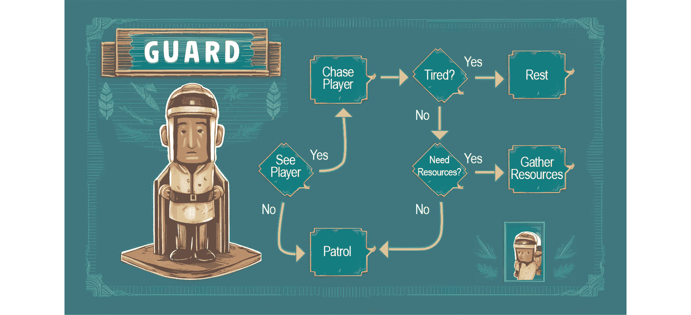

# 在 Unity 中实现人工智能

在本章中，我们将探讨 Unity 中人工智能（**AI**）的集成，从 AI 的基础知识开始，逐步深入到复杂的路径查找和行为树应用。你将学习路径查找算法如何使智能角色在多变的环境中实现智能移动和导航。我们还将介绍 AI 决策过程，这些过程允许非玩家角色（NPC）对动态游戏场景做出反应和适应。到本章结束时，你将获得使用高级 AI 技术制作复杂 NPC 行为的实际见解，增强游戏深度、真实性和玩家参与度。

在本章中，我们将涵盖以下主题：

+   游戏中 AI 作用的概述

+   在 Unity 环境中理解 AI 的基础知识

+   应用路径查找算法进行角色移动

+   构建决策过程的 AI 逻辑

+   使用 AI 创建复杂的 NPC 行为

# 技术要求

你可以在此处找到与本章节相关的示例/文件：[`github.com/PacktPublishing/Unity-6-Game-Development-with-C-Scripting/tree/main/Chapter10`](https://github.com/PacktPublishing/Unity-6-Game-Development-with-C-Scripting/tree/main/Chapter10)

# 游戏中 AI 作用的概述

在本节中，我们将回顾 AI 在游戏中的发展历程，从其原始的起点到现在的复杂程度，突出关键里程碑。从简单的脚本行为到复杂的学习驱动代理，AI 重塑了游戏玩法、角色行为和叙事。理解这些转变有助于深入了解 AI 在现代游戏中的关键作用，为探索其对互动娱乐持续影响提供背景。

## 比较游戏开发中的大型语言模型和行为树

在快速发展的 AI 领域，**大型语言模型**（**LLMs**）如**GPT-3**因其基于大量数据集生成连贯且上下文适当的文本的能力而受到广泛关注。这些模型以其庞大的规模为特征，通常包含数十亿个参数，需要大量的存储空间和强大的计算能力才能有效运行。因此，LLMs 需要强大的硬件能力，通常需要使用专用服务器或基于云的平台才能高效运行。

相比之下，视频游戏开发通常需要更敏捷且资源消耗更少的 AI 解决方案，这使得**行为树**成为首选。行为树是模块化、可扩展的，与计算密集型 LLMs 相比，执行速度明显更快。它们为游戏 AI 提供了一个清晰的架构，允许开发者编写由简单、可重复使用的节点组成的复杂行为脚本。这种架构不仅优化了性能，还简化了调试和迭代设计，这些是游戏开发周期中的关键因素。

虽然大型语言模型（LLMs）在自然语言理解和生成方面提供了非凡的能力，但它们在实时游戏场景中的实际应用目前受到资源需求的限制。相反，行为树（Behavior Trees）由于其效率和较低的操作开销，仍然是创建响应性和智能 NPC 行为的标准，无需大量计算资源。

这种区别强调了为什么，尽管大型语言模型（LLMs）具有令人印象深刻的性能，但行为树（Behavior Trees）在游戏人工智能开发中仍然至关重要，确保游戏可以在各种硬件平台上平稳运行，从高端游戏机到移动设备。

人工智能深刻地改变了电子游戏领域，标志着游戏设计和体验的重大演变。最初用于简单街机游戏来指导基本的敌人行为，人工智能的复杂性已经增长，影响了游戏的各个方面——从增强游戏机制到丰富叙事和角色行为。

人工智能的关键里程碑已经改变了游戏玩法，实现了具有挑战性的交互。现代游戏展示了具有多种情绪的复杂人工智能角色，增加了深度。人工智能还通过适应性叙事重塑了叙事，如在《底特律：成为人类》等游戏中所见。这种演变增加了沉浸感和重玩价值，并为游戏现实主义的未来创新铺平了道路。

## 使用人工智能增强游戏玩法

在理解了 LLMs 和行为树之间的区别之后，我们现在将深入探讨人工智能在游戏设计中的实际意义。人工智能不仅仅是自动化任务；它还改变了游戏玩法，使其动态且引人入胜。通过适应性敌人行为和人工智能驱动的剧情进展等例子，我们将展示人工智能如何深刻影响游戏。将人工智能集成到 Unity 项目中提升了游戏体验，为玩家提供了不断发展和独特反应的沉浸式世界。

人工智能正在改变游戏，将智能和活力注入其中。由人工智能驱动的适应性敌人行为，根据玩家技能调整难度，确保玩家的参与度。复杂的 NPC 互动丰富了叙事，角色根据玩家的选择而发展。人工智能驱动的剧情进展提供了个性化的旅程，基于行动的分支叙事。这些人工智能特性使游戏更具互动性和独特性，提升了 Unity 项目的质量和吸引力。

人工智能通过动态元素增强了游戏，调整难度并丰富叙事。人工智能驱动的剧情进展确保了独特的体验。人工智能极大地改变了电子游戏，从早期街机游戏中的简单模式发展到增强游戏玩法、角色互动和叙事深度的复杂系统。关键的 AI 发展现在允许角色根据玩家的行动和叙事进行适应和演变，基于选择，极大地丰富了游戏体验。

这种演变彻底改变了游戏设计，并为在 Unity 中实现高级人工智能应用奠定了基础。下一节将讨论 Unity 对人工智能开发的支撑，包括用于路径查找的 NavMesh 工具、用于状态管理的 Animator 以及 ML-Agents Toolkit，使开发者能够将复杂的 AI 功能集成到他们的游戏中。

# Unity 人工智能支持的简介

随着人工智能重塑游戏产业，了解其在 Unity 中的集成对于开发者来说至关重要。Unity 强大的 AI 工具和功能集赋予开发者使用复杂 AI 提升游戏的能力。本节概述了人工智能在游戏中的演变，突出了影响游戏玩法、角色行为和叙事的关键发展。我们将探讨 Unity 的 AI 工具，如用于路径查找的 NavMesh、用于控制角色状态的 Animator 以及**机器学习代理工具包**，每个工具都旨在增强由 AI 驱动的游戏元素。这些功能不仅简化了复杂 AI 任务的实现，还增强了游戏的交互动态，使开发者能够制作出引人入胜且智能的游戏体验。

我们还将讨论 AI 集成如何增强游戏玩法，使其更加动态和具有挑战性，并强调 AI 在 Unity 游戏设计和开发中的关键作用。

Unity 为 AI 开发提供了一个全面的工具包，便于创建复杂的、响应式的游戏环境。在这里，我们将探讨 Unity 为游戏开发者提供的某些基本工具和功能。

+   **NavMesh**：Unity 中的 NavMesh 通过定义可通行区域和计算角色的有效路径来简化路径查找。对于 NPC 在复杂地形中导航、避开障碍物和在实时中优化路线来说至关重要。与 Unity 的物理引擎集成，NavMesh 确保了智能和逼真的角色移动。

+   **Animator**：Unity 的 Animator 对于逼真的游戏体验至关重要，它使用状态机根据游戏动态管理角色动画。例如，角色根据游戏逻辑在行走和跑步或站立和跳跃之间转换。这个工具使开发者能够创建详细的动画流程，增强角色的反应性和动态性。

+   **ML-Agents**：Unity 的 ML-Agents Toolkit 是一个开创性的功能，它使机器学习能够提升游戏 AI。它提供了一个框架，在游戏环境中使用深度强化学习或其他方法训练智能代理。这些代理随着时间的推移学习和适应，非常适合开发随着经验增长而改进的复杂行为。这种能力对于需要 NPC 处理传统 AI 编码过于复杂的任务的游戏来说非常宝贵，例如根据玩家行为调整策略。

这些工具共同构成了一个稳健的框架，以在 Unity 中实现高级人工智能。通过利用 NavMesh 进行导航、Animator 进行动画控制以及 ML-Agents 进行自适应行为，开发者可以创建丰富、沉浸式和智能的游戏体验，推动传统游戏界限。

Unity 的人工智能工具增强了开发者创建高级游戏体验的能力。通过 NavMesh 进行路径查找、Animator 进行动画以及 ML-Agents 进行复杂行为，Unity 提升了游戏水平。这些工具简化了开发流程，并通过智能行为丰富了游戏体验。在我们讨论人工智能的重要性时，我们将探讨这些工具如何有助于动态游戏，增强 Unity 项目。

接下来，我们将探讨路径查找在游戏开发中的重要性，讨论如**A***和 NavMesh 等算法及其在 Unity 中实现智能敌人导航的应用。

# 实现路径查找

有效的*路径查找*对于使角色能够以智能和高效的方式在游戏环境中移动至关重要。本节探讨了各种算法，如 A*（这是一种流行的路径查找算法）和 NavMesh（通过定义可通行区域并在这些区域内计算路径来简化路径查找），强调了它们的 Unity 实现、对性能的影响以及实际示例，例如构建避障敌人人工智能。通过将内容分解为从基本原理到实际应用的专注子部分，你将获得对 Unity 项目中有效导航解决方案的理论理解和实践技能。

## 路径查找算法的基本原理

在游戏中导航复杂环境高度依赖于稳健的路径查找算法。它利用图将游戏地图抽象为节点和边，通过 A*和迪杰斯特拉算法等确定最有效的路线。以最大精确度著称，迪杰斯特拉算法计算从起始节点到所有其他节点的最短路径。

这些算法对于开发能够动态适应障碍和变化条件的响应式人工智能至关重要。本节将深入探讨这些路径查找算法的基本原理及其在游戏开发中的关键作用。

非玩家角色（NPC）依赖于高效的路径查找技术，在游戏世界中无缝移动，A*算法因其效率和精确度的平衡而受到青睐。它能够动态调整地形变化。同时，迪杰斯特拉算法提供最大精确度，但在大地图上速度较慢。这两种算法都增强了游戏人工智能，使游戏体验更加动态和真实。

例如，A*和迪杰斯特拉算法在引导角色穿越复杂的游戏环境中发挥着至关重要的作用。这些算法不仅确保了 NPC 行为的真实性，而且通过实现平滑的导航来增强游戏体验。Unity 支持使用 NavMesh 等工具进行路径查找，简化了可通行区域的创建和障碍物规避。下一节将探讨 Unity 的路径查找工具和设置 NavMesh 的实用步骤，以增强 Unity 项目中高效的路径查找。

## Unity 的路径查找工具 – NavMesh 及其他

Unity 的 NavMesh 系统通过管理空间复杂性、简化可通行区域的创建和障碍物规避来简化路径查找。本节将探讨 NavMesh 的具体细节以及 Unity 生态系统和第三方提供商中的其他重要工具，这些工具有助于路径查找。让我们从 NavMesh 系统开始。

Unity 的 NavMesh 代理是一个用于游戏环境中路径查找和导航的组件，允许**NPC**智能地绕过障碍物并在不同地形上导航。要使用它，必须在场景中创建一个**导航网格**（**NavMesh**）来定义可通行区域。你可以在 Unity 编辑器中选择 NPC，通过点击**添加组件**按钮添加 NavMesh 代理组件，并配置如速度和停止距离等属性以适应 NPC 的行为。然后，可以通过脚本动态设置代理的目的地，使 NPC 能够高效地向目标自主移动。

Unity 的**导航**窗口是 Unity 编辑器中的一个专用界面，用于配置和管理导航网格，这对于游戏环境中的 AI 路径查找至关重要。它由四个主要面板组成——**代理**，在这里你可以定义不同导航器的特征，如半径、高度和行走速度；**区域**，允许你为不同表面类型分配成本，影响路径查找决策；**烘焙**，用于根据场景几何和代理设置生成导航网格；以及**对象**，允许你指定哪些对象应包含或排除在 NavMesh 烘焙过程中。这种结构化方法简化了复杂导航系统的创建和管理，使得开发与游戏世界有效交互的复杂 AI 行为变得更加容易。

下面是**导航**窗口的样貌：



图 10.1 – 带有四个面板的导航窗口（NavMesh）– 代理、区域、烘焙和对象

通过将 NavMesh 代理附加到 NPC，你可以调整单个 NPC 的速度、加速度、停止距离等。NPC 还具有`Animator`、`Collider`和`Rigidbody`组件。



图 10.2 – 附属于 NPC 的 NavMesh 代理

接下来，让我们一步一步地了解如何在 Unity 场景中设置基本的 NavMesh，以确保角色导航的流畅和智能。

## 在 Unity 场景中设置基本的 NavMesh

在 Unity 场景中设置基本的 NavMesh 是一个简单的过程，可以大大增强游戏角色的导航能力。

这里有一个逐步指南，帮助你配置 Unity 项目中的 NavMesh：

1.  **准备** **你的场景**：

    确保你的场景有一个你希望角色在其中导航的地形或环境。这个环境应该有各种障碍物和可通行区域清晰定义。

1.  **标记导航区域**：

    1.  选择你的场景中将作为可通行区域或障碍物的 GameObject。

    1.  调整 **导航静态**：

        1.  在选择 GameObject 后，转到 **Inspector** 窗口。

        1.  在 **Navigation** 选项卡下，点击 **Object** 子选项（见 *图 10**.1*）。

        1.  为所有应在 NavMesh 生成中考虑的对象勾选 **导航静态** 复选框。这告诉 Unity 这些对象应被烘焙到 NavMesh 中。

1.  **创建** **NavMesh**：

    1.  通过转到 **Window** | **AI** | **Navigation** 打开 **Navigation** 窗口。这打开 **Navigation** 面板。

    1.  设置 **导航区域**：

        1.  在 **导航** 窗口中，转到 **Bake** 选项卡（见 *图 10**.1*）。

        1.  在这里，你可以调整如 **Agent 半径**、**Agent 高度** 和 **最大坡度** 等设置，以适应角色的导航需求。这些设置决定了代理可以行走、攀爬或跳跃的位置。

        1.  烘焙 NavMesh。

        1.  要这样做，请点击 **导航** 窗口底部的 **Bake** 按钮。Unity 将根据设置和标记的对象计算 NavMesh，并将其叠加到场景上，蓝色调的网格表示可通行区域。

1.  将 `NavMesh Agent` 组件添加到需要使用 NavMesh 导航的角色或对象。你可以通过在层次结构中选择角色，然后转到 **Inspector** | **Add Component** | **NavMesh Agent**（见 *图 10**.2*）来实现。

1.  配置 NavMesh 代理设置，如速度、角速度和停止距离，以确定角色如何通过 NavMesh 移动。

+   **实现** **导航逻辑**：

    为 NavMesh 代理编写或附加脚本以控制其寻找目的地的方式。以下是一个简单的 C# 示例：

    ```cs
    using UnityEngine;
    using UnityEngine.AI;
    public class SimpleNavAgent : MonoBehaviour
    {
        public Transform target; // Drag your target in
                                    the Inspector
        private NavMeshAgent agent;
        void Start()
        {
            agent = GetComponent<NavMeshAgent>();
        }
        void Update()
        {
            if(target != null)
                agent.SetDestination(target.position);
        }
    }
    ```

    上述脚本使用 `UnityEngine.AI` 命名空间将 `NavMeshAgent` 附加到 `GameObject`，使其能够动态地导航到在 Unity 编辑器中设置的指定 `Transform target`，同时在每一帧更新时使用路径查找智能避开障碍物。

    +   **最终化**：

    一切设置完成后，在 Unity 中进入 **Play** 模式，可以看到你的角色会自动沿着 NavMesh 计算出的最短路径绕过障碍物向目标移动。

    根据你的游戏设计需求，调整 **导航** 设置以细化路径和行为。

Unity 的 NavMesh 系统通过管理可通行区域和避障来简化游戏导航。本节探讨了 NavMesh 的具体细节和额外的工具，如第三方插件。接下来，让我们看看一些实际的路径查找示例，这些示例展示了真实游戏场景，包括敌人行为脚本和不同游戏类型和规模的性能考虑。

## 实际的路径查找示例和性能考虑

本节深入探讨了游戏开发中的实际路径查找示例和关键性能考虑。探讨了现实世界的应用，例如通过脚本智能追逐玩家的敌人角色。我们还将讨论路径查找方法如何影响游戏性能，并提供不同游戏类型（从开放世界环境到具有动态障碍物的环境）的优化策略。这种实用见解使开发者能够有效地优化 AI 导航，确保响应迅速的游戏体验。

NavMesh 将以蓝色轮廓的形式出现在**场景**窗口中，表示 NPC 可以旅行的区域。由于**场景**窗口提供了从摄像机视角的 3D 视图，因此靠近摄像机的项目将出现在 NavMesh 之上。



图 10.3 – 一款赛车游戏的场景窗口，显示了 NavMesh

路径查找是游戏开发中角色导航的基石，增强了真实感和参与感。例如，通过脚本动态追逐玩家的敌人角色展示了人工智能如何适应。然而，这种实现需要仔细考虑性能，尤其是在资源密集型场景中，如大型开放世界游戏。优化路径查找，特别是使用 Unity 的 NavMesh，涉及到平衡网格精度与性能，简化代理路径，以及高效管理 NavMesh 更新。这些优化确保了即使在复杂环境中也能实现流畅和响应迅速的游戏体验。

在实现路径查找时，平衡精度与性能至关重要。在不太关键的区域内优先考虑较低的精度可以显著提高性能，而不会影响玩家的体验。例如，在繁忙的城镇中，如果 AI 村民不在玩家的视线范围内，可以使用较低的精度路径查找和更宽的航点，从而减少系统的计算负载。相反，对于直接与玩家交互的 AI 角色，如引导玩家穿越繁忙市场的同伴，需要较高的精度以确保准确导航并确保沉浸式体验。通过根据 AI 的角色和可见性应用不同级别的精度，开发者可以在保持引人入胜和真实游戏世界的同时优化性能，确保关键交互详细，背景活动高效。

在视频游戏中，以下是一些你可能使用 NavMesh 的场景：

+   **城市环境中的群体移动**：展示如何使用 NavMesh 在都市环境中模拟真实的群体动态。NPC 可以在繁忙的街道上导航，避开静态和动态障碍物，如车辆和其他行人，并遵循复杂的路线。

+   **潜行游戏中的敌人巡逻**：展示潜行游戏中的敌人如何使用 NavMesh 巡逻预定义的路径。此外，说明它们如何动态改变路径以调查噪音或玩家的发现，使用 NavMesh 在障碍物周围和通过门道导航。

+   **自然景观中的野生动物行为**：使用 NavMesh 在自然环境中模拟动物的运动，例如森林。动物可以在地形中穿行，避开自然障碍物，如岩石和树木，并根据它们的 AI 行为追逐或逃离其他生物。

+   **动态战场导航**：提供一个例子，说明军事 NPC 在战斗模拟器中使用 NavMesh 进行战略移动。他们可以找到掩护，包抄敌人，并在环境因破坏而变化时导航复杂的地面，如废墟城市或崎岖景观，并调整他们的路径。

+   **救援机器人模拟**：NavMesh 可用于救援场景，其中自主机器人必须穿越充满杂物的环境以定位和到达受害者。强调 NavMesh 如何帮助规划最有效的路线，同时考虑各种障碍。

基于不同游戏环境中 NavMesh 使用的实际场景，考虑针对每个场景定制的性能优化策略同样至关重要。对于广阔的开放世界游戏，优化 NavMesh 涉及将地图分割成可管理的区域，并在玩家周围动态更新 NavMesh，从而节省系统资源。在密集交互场景和动态障碍物游戏中，采用分层 NavMesh 方法或为小障碍物简化碰撞模型可以显著降低计算需求。通过根据游戏重要性调整路径查找精度——在不太关键的区域优先使用较低的精度——可以在不牺牲游戏质量的情况下优化性能。这些有针对性的策略确保 NavMesh 高效运行，从而提升玩家体验和整体游戏性能。

在本节中，我们探讨了实用的路径查找技术，展示了例如敌人角色动态追逐玩家的例子，并展示了 AI 在避开障碍物的同时导航复杂环境的能力。我们还讨论了各种路径查找策略的性能影响，并为不同类型的游戏提供了优化建议，例如在大型开放世界设置中增强 NavMesh 效率或在密集交互场景中管理动态障碍。这些见解对于保持最佳游戏性能和真实感至关重要。

接下来，我们将深入探讨 AI 决策过程，研究如何利用**有限状态机**（FSM）、行为树和基于效用系统等技术，在 Unity 中赋予 NPC 基于游戏状态智能决策的能力。本节将提供实用见解和示例实现，帮助构建复杂的决策系统，使 NPC 在游戏中的交互生动起来。

# AI 决策

随着我们进一步探索 Unity 中的 AI，NPC 的决策对于制作沉浸式游戏玩法变得至关重要。本节探讨了基本的 AI 决策框架，如 FSM、行为树和基于效用系统。这些是可能在一开始阅读时难以掌握的高级主题。我们鼓励您花时间仔细阅读，以理解它们。每种方法都根据游戏状态结构化 NPC 的行为，增强交互动态性和真实性。我们以 Unity 实现为重点，提供详细见解和示例，以开发健壮的 NPC 决策系统。此指导使开发者能够创建能够智能适应玩家行为的复杂 AI，丰富游戏角色的逼真品质和参与度。

## AI 决策框架简介

在游戏开发中，NPC 的智能很大程度上依赖于决策。本节介绍了 AI 框架，如 FSM、**行为树**和**基于效用系统**等关键模型。每个模型都提供了独特的 NPC 行为方法，从 FSM 的结构化简单性到行为树的灵活层次结构和基于效用系统的动态优先级。理解这些框架使开发者能够有效地管理复杂的 AI 行为，增强 Unity 环境中的真实感和交互性。

AI 决策对于动态游戏玩法至关重要，FSM（有限状态机）等框架提供了直接的解决方案。FSM 非常适合管理简单场景，具有有限的状态、转换和动作。例如，一个敌人角色可以使用 FSM 根据特定的触发器或条件在巡逻、追逐和攻击之间循环。

*图 10.4* 展示了一个简单的决策流程图。角色大部分时间都在巡逻。偶尔，角色会休息一下。如果角色检测到玩家，它将追逐他们。



图 10.4 – 一个简单的决策流程图

行为树为 AI 决策提供了一个模块化和层次化的方法，其根节点分支到内部节点（决策）和叶节点（动作）。这种结构将任务分解为可管理的子任务，允许复杂的决策过程。行为树在 NPC 必须适应各种游戏状态的游戏中表现出色，例如根据玩家动作调整策略。其层次化设计也便于维护和可扩展性，对具有复杂 AI 需求的游戏有益。



图 10.5 – 一个具有多个选项的复杂行为树，每个选项都有更多选项。注意，相同的动作“攻击”可以通过多种方式触发。

基于效用系统的 AI 会根据与潜在结果关联的效用或价值来评估决策，使非玩家角色（NPCs）能够动态选择最有利的行为。这种方法在不可预测或竞争环境中非常有效，允许 AI 行为具有细微和适应性。例如，在策略游戏中，基于效用系统的 AI 对手能够做出平衡风险和回报的战略决策，如根据敌方力量的强弱和成功的概率选择攻击、防御或撤退。

每个框架——FSMs 用于简单的决策树，行为树用于细粒度控制和可扩展性，基于效用系统用于适应性决策——都提供了独特的优势和使用案例。掌握它们在 Unity 中的应用可以显著丰富游戏中的 NPC 行为，培养一个丰富和沉浸式的游戏体验，吸引玩家并使他们沉浸在游戏世界中。

视频游戏中的 AI 决策领域丰富多彩，拥有诸如有限状态机（FSMs）、行为树和行为基于的系统等框架，为 AI 提供了结构化的方法。FSMs 结构简单，非常适合简单的决策路径，而行为树则提供了灵活性和可扩展性，适用于更复杂的场景。基于效用系统的 AI 行为会根据其计算出的效益动态调整，以适应不可预测的游戏条件。理解这些框架为在 Unity 中实际应用奠定了基础，其中将提供详细的指南和示例。即将到来的部分将包括代码片段和伪代码，展示 AI 的动态决策，以增强游戏角色的交互性和真实性。

## 在 Unity 中实现决策模型

本节深入探讨了在 Unity 中实现 AI 决策框架。我们将探讨将有限状态机（FSMs）、行为树和效用系统集成到 Unity 项目中，详细说明可用的工具和资源。对于 FSMs，我们将使用 Unity 的 Animator 进行状态管理，而对于行为树和效用系统，外部资源将增强功能。代码片段和伪代码示例将展示如何编写复杂的 AI 行为脚本，例如敌人根据玩家的动作动态反应。本实践指南增强了 Unity 中 AI 开发的了解。

在 Unity 中实现 AI 决策框架允许创建更动态和响应的游戏角色。每种决策模型都有其优点，适用于特定类型的游戏挑战。以下是你在 Unity 中设置和使用 FSMs、行为树和效用系统的步骤：

+   `巡逻`、`追击`、`攻击`和`撤退`。你可以在 Animator 中设置每个状态，并使用触发器或条件根据游戏变量（如玩家的接近度或敌人的健康值）在它们之间进行转换。以下脚本将放置在敌人 NPC 上。当敌人探测到玩家时，它开始表现出不同的行为：

    ```cs
    public class EnemyController : MonoBehaviour
    {
        private Animator animator;
        private Transform player;
        private float detectionRange = 10.0f;
        void Start()
        {
            animator = GetComponent<Animator>();
            player =
               GameObject.FindWithTag("Player").transform;
        }
        void Update()
        {
            float distanceToPlayer =
                Vector3.Distance(transform.position,
                player.position);
            if (distanceToPlayer < detectionRange)
                animator.SetTrigger("Chase");
            else
                animator.SetTrigger("Patrol");
        }
    }
    ```

    Unity 中的`EnemyController`脚本根据玩家的接近度调整 NPC 的行为。它通过获取`Animator`组件和定位玩家的`Transform`来初始化。在每一帧中，它计算与玩家的距离。如果距离在 10 单位内，它触发`"Chase"`动画；否则，它激活`"Patrol"`动画。这种设置使 NPC 在追逐和巡逻之间动态转换，增强游戏互动。

+   `行为树`允许创建更细粒度和层次化的决策结构。虽然 Unity 没有原生支持行为树，但有一些第三方工具和资源可供集成。这些行为树可以设置来检查条件并执行适当的行为，例如在健康值低时寻找掩护或被探测到时追击玩家。以下伪代码概述了一个简单的行为树节点，`AttackOrRetreatNode`，它根据 NPC 对玩家的可见性和其健康状况来决定 NPC 是攻击还是撤退：

    ```cs
    // Pseudocode for a behavior tree node
    public class AttackOrRetreatNode : Node
    {
        public override NodeState Evaluate()
        {
            if (CanSeePlayer() && EnoughHealth())
                return NodeState.SUCCESS; // Proceed to
                                             attack
            else
                return NodeState.FAILURE; // Retreat or
                                             take cover
        }
    }
    ```

    伪代码中的`AttackOrRetreatNode`作为行为树中的决策节点，评估 NPC 是否可以看到玩家并且有足够的健康值。如果两个条件都满足，NPC 就会攻击；否则，它就会撤退。这种逻辑使 NPC 能够动态地对其环境做出反应，增强游戏的真实感。

+   `UtilityDecider`演示了一个基于效用的决策系统，其中 NPC 根据最高的效用值在攻击、防御或使用特殊能力之间进行选择：

    ```cs
    public class UtilityDecider : MonoBehaviour
    {
        public float attackUtility;
        public float defendUtility;
        public float specialAbilityUtility;
        void DecideAction()
        {
            float maxUtility = Mathf.Max(attackUtility,
                defendUtility,
                specialAbilityUtility);
            if (maxUtility == attackUtility)
                PerformAttack();
            else if (maxUtility == defendUtility)
                PerformDefend();
            else
                PerformSpecialAbility();
        }
        void PerformAttack()
        {
            /* Implementation here */
        }
        void PerformDefend()
        {
            /* Implementation here */
        }
        void PerformSpecialAbility()
        {
            /* Implementation here */
        }
    }
    ```

    提供的代码中的`UtilityDecider`类利用基于效用的 AI 决策框架来确定游戏中 NPC 的最佳行动。它维护三个效用值，分别代表攻击、防御和使用特殊能力的吸引力。在`DecideAction`方法中，它通过比较这三个效用值来计算在特定时刻哪个行动的效用最高。然后 NPC 执行效用最高的行动——如果`attackUtility`最高，它执行攻击；如果`defendUtility`最高，它进行防御；如果`specialAbilityUtility`最高，它使用特殊能力。这种方法允许 NPC 根据不同的游戏情况动态和情境敏感地做出反应。

每个这些脚本都提供了一个将复杂 AI 行为集成到 Unity 中的基础方法，使你的游戏角色能够动态和智能地做出决策。通过利用 FSM、行为树或效用系统，你可以显著增强游戏 NPC 的交互性和深度。

在本节中，我们探讨了在 Unity 中实现各种 AI 决策框架，详细介绍了有限状态机（FSM）、行为树和行为系统的高效使用。通过 Unity 的 Animator 集成的 FSM 提供简单的状态转换，而行为树和行为系统则提供细致的控制，利用外部资源和复杂逻辑来实现动态响应。通过代码片段，我们展示了敌人角色如何根据玩家输入决定行动，展示了系统的灵活性。

接下来，我们将讨论在 Unity 中设计和实现这些 AI 系统的最佳实践和优化，确保可扩展性、性能和高效的决策过程，同时避免常见陷阱。

## 设计和实现 Unity 中 AI 的最佳实践和优化策略

随着我们结束对 Unity 中 AI 决策的探索，关注高效和有效的 AI 系统的最佳实践和优化策略至关重要。本节将深入探讨设计可维护、可扩展和性能优异的 AI 系统所需的基本技术。我们将讨论平衡决策复杂性与游戏性能，并提供简化 AI 行为的实用技巧。此外，我们将识别 AI 开发中的常见陷阱，并提供提高游戏体验的指导。遵循这些最佳实践使开发者能够创建强大、响应迅速的 AI 系统，从而提升游戏体验。

在 Unity 中设计人工智能决策系统时，遵循最佳实践对于创建可扩展和可维护的人工智能系统至关重要，这些系统能够增强游戏体验而不牺牲性能。模块化设计——即根据游戏复杂性的增长对 AI 组件进行结构化，以便于调整和扩展——是基础。这种方法简化了更新和调试，并确保人工智能系统可以随着游戏环境的变得更加复杂而扩展。

例如，考虑将决策逻辑封装在独立的脚本中，并通过定义良好的接口进行通信。这不仅使你的 AI 更容易管理，而且更能适应游戏设计的变更。以下是一个展示这一原则的代码片段：

```cs
public interface IEnemyState {
    void EnterState(EnemyController controller);
    void UpdateState();
}
public class PatrolState : IEnemyState {
    public void EnterState(EnemyController controller) {
        controller.SetPatrolBehavior();
    }
    public void UpdateState() {
        // Patrol logic here
    }
}
public class AttackState : IEnemyState {
    public void EnterState(EnemyController controller) {
        controller.SetAttackBehavior();
    }
    public void UpdateState() {
        // Attack logic here
    }
}
public class EnemyController : MonoBehaviour {
    private IEnemyState currentState;
    public void SetState(IEnemyState newState) {
        currentState = newState;
        currentState.EnterState(this);
    }
    void Update() {
        currentState.UpdateState();
    }
    public void SetPatrolBehavior() {
        // Specific patrol settings
    }
    public void SetAttackBehavior() {
        // Specific attack settings
    }
}
```

在复杂性和性能之间取得平衡是另一个关键领域。使用 Unity 的 Profiler 工具可以帮助识别人工智能例程中的性能瓶颈。例如，可以通过减少路径更新的频率或简化 NavMesh 来优化路径计算：

```cs
public void UpdatePathfinding() {
    if (Time.time - lastPathUpdate > pathUpdateInterval) {
        navMeshAgent.CalculatePath(target.position, path);
        navMeshAgent.SetPath(path);
        lastPathUpdate = Time.time;
    }
}
```

前面的代码片段减少了路径重新计算的频率，从而在精确、响应性的人工智能导航需求与保持高游戏性能的必要性之间取得平衡。

最后，人工智能设计中一个常见的陷阱是每帧给 AI 加载过多的决策或检查，这可能导致性能问题。实施决策节流或将决策分散到多个帧中可以减轻这一问题：

```cs
private float decisionCooldown = 1.0f;
private float lastDecisionTime = 0.0f;
void Update() {
    if (Time.time > lastDecisionTime + decisionCooldown) {
        MakeDecision();
        lastDecisionTime = Time.time;
    }
}
void MakeDecision() {
    // Complex decision-making logic here
}
```

在人工智能中实施决策节流确保决策以可管理的速率进行，平衡及时响应的需求与计算资源的节约。这种策略可以防止在复杂的决策过程中性能下降。这种技术可以显著提高基于 Unity 的游戏中人工智能的性能和质量，并强调了深思熟虑的设计和优化的重要性。

在本节中，我们探讨了在 Unity 中设计和实现人工智能决策系统的最佳实践和策略，这些策略既有效又高效。这些过程的关键是确保通过模块化结构组件和使用接口进行管理，以构建可维护和可扩展的人工智能行为。我们还强调了复杂性和性能之间的关键平衡，引入了如决策节流等技术来优化人工智能的响应性，同时不损害游戏质量。讨论了常见的陷阱，例如每帧给 AI 加载过多的计算，并提供了解决方案，以帮助开发者避免这些陷阱并确保人工智能系统的流畅运行。

在继续前进的过程中，下一节将基于这些主题进行扩展。我们将探讨如何使用高级人工智能技术，如行为树和机器学习，来创建复杂的行为，同时保持复杂性和性能之间的平衡，以增强具有真实 NPC 的游戏体验。

# NPC 的行为人工智能

在本节的最后部分，我们将探讨在 Unity 中制作引人入胜的 NPC 行为的高级技术。在之前的基本知识基础上，我们将深入研究行为树和机器学习以实现动态 NPC 行为。我们还将讨论平衡 AI 复杂性与游戏性能，确保这些行为能够增强游戏体验。本节旨在提供创建智能 NPC 行为以丰富游戏环境的见解。

## 使用行为树开发复杂行为

在本节中，我们将探讨行为树，这是在 Unity 中结构化 NPC 行为的强大工具。行为树将决策组织成一个节点的层次结构，提供清晰性和灵活性。我们将通过设计一个用于巡逻守卫角色的行为树来展示其实际应用，展示如巡逻和调查噪音等状态。这说明了行为树如何使游戏开发中的 NPC 行为变得复杂和自适应。

行为树对于在游戏中创建细微的 AI 行为至关重要。它们的结构类似于流程图，节点代表决策或行动。组件包括包含任务或条件的节点、执行行动的终端叶子和基于标准的分支来控制流程。

一个巡逻守卫的示例行为树可能包括一个根节点分支到叶子节点，例如 `Patrol`（巡逻）、`Chase`（追击）和 `Investigate`（调查）。`Patrol` 叶子节点循环一条路线，`Chase` 在检测到玩家时激活，而 `Investigate` 在听到或看到干扰时触发。

下面是一个简单的 C# 示例，使用伪代码来说明一个巡逻守卫如何使用行为树来决定其行动：

```cs
public class PatrolGuardAI : MonoBehaviour
{
    private BehaviorTree tree;
    void Start()
    {
        tree = new BehaviorTree();
        Node root = new SelectorNode();
        Node patrolNode = new SequenceNode(new List<Node>
        {
            new CheckPatrolAreaNode(),
            new MoveToNode(patrolPath),
        });
        Node chaseNode = new SequenceNode(new List<Node>
        {
            new CanSeePlayerNode(),
            new ChasePlayerNode(),
        });
        Node investigateNode =
            new SequenceNode(new List<Node>
        {
            new HeardNoiseNode(),
            new InvestigateNoiseNode(),
        });
        root.AddChild(patrolNode);
        root.AddChild(chaseNode);
        root.AddChild(investigateNode);
        tree.SetRoot(root);
    }
    void Update()
    {
        tree.Tick(); // Process the behavior tree
    }
}
```

在前面的代码中，`SelectorNode` 作为决策中心，根据守卫的情况选择采取哪种行动——是继续巡逻、追击玩家还是调查噪音。每个行动都是一个任务序列，例如检查守卫是否可以看到玩家或是否有噪音需要调查，然后是相应的响应行动。

行为树提供了一种模块化方法，简化了复杂的决策，并使行为添加或修改具有灵活性。这种结构化框架促进了动态 AI 角色的开发，增强了游戏参与度和不可预测性。利用行为树确保了多样化和情境适当的 NPC 行动，丰富了游戏体验。

行为树为在游戏中构建动态 NPC 行为提供了一个模块化框架，将行动组织成节点、叶子和分支。这种结构使开发者能够在有组织且可扩展的系统中定义一系列行为，从基本的巡逻到复杂的反应，如追击或调查干扰。例如，巡逻守卫的行为树可以有效地管理巡逻、追击玩家和调查噪音等状态。

随着我们不断前进，我们将探索高级人工智能技术，例如机器学习和程序化内容生成，利用 Unity 的 ML-Agents 等工具。这些方法使非玩家角色（NPC）能够学习和适应行为，根据玩家的互动增强真实感和响应性。我们将讨论将这些技术集成到现有的 AI 框架中，并在 Unity 中管理增加的复杂性，以实现最佳性能和游戏体验。

## 结合高级人工智能技术

随着我们深入研究高级游戏 AI，集成机器学习和程序化内容生成等技术对于动态 NPC 行为变得至关重要。本节探讨了 Unity 的 ML-Agents 工具包，它使 NPC 能够根据玩家的互动进化。我们将讨论在 Unity 中集成这些技术，同时管理复杂性以实现无缝体验。

高级人工智能技术，如机器学习和程序化内容生成，的集成，彻底改变了 NPC 的行为。Unity 的 ML-Agents 工具包使 NPC 能够根据玩家的动作学习和适应，增强交互的真实性和动态性。

例如，通过使用 Unity 的 ML-Agents，开发者可以训练一个 NPC 在复杂游戏环境中优化其策略。这是通过在 Unity 中设置一个环境来实现的，其中代理可以执行动作，根据奖励接收反馈，并相应地调整其策略。以下是在 Unity 中使用 C#设置训练场景的简化示例：

```cs
using Unity.MLAgents;
using Unity.MLAgents.Sensors;
using Unity.MLAgents.Actuators;
public class NPCAgent : Agent
{
    public override void OnEpisodeBegin()
    {
        // Reset the NPC state for new episode
    }
    public override void CollectObservations(VectorSensor
    sensor)
    {
        // Add NPC's observations of the environment
           for decision making
    }
    public override void OnActionReceived(ActionBuffers
    actionBuffers)
    {
        // Actions received from the model
        int action = actionBuffers.DiscreteActions[0];
        if (action == 1)
        {
            // Perform the action, e.g., move towards a
               target
        }
    }
    public override void Heuristic(in ActionBuffers
    actionsOut)
    {
        // Provide manual control as fallback
        actionsOut.DiscreteActions.Array[0] =
            Convert.ToInt32(Input.GetKey(KeyCode.Space));
    }
}
```

以下代码片段概述了一个基本代理设置，其中 NPC 可以在游戏环境中从其动作中学习。`OnEpisodeBegin`用于在每个学习阶段开始时重置 NPC 的状态，`CollectObservations`用于从环境中收集数据，`OnActionReceived`用于接收和执行动作，以及`Heuristic`在必要时提供手动覆盖。

程序化内容生成是另一种补充机器学习的技术，它根据游戏状态或玩家的动作动态创建游戏内容，这可以进一步增强游戏体验。这种方法可以在游戏环境中生成无限的变化，确保 NPC 不断面临新的挑战和场景，促进更深入的学习和适应性。

虽然这些技术有益，但它们增加了游戏开发的复杂性，需要强大的架构和对机器学习原理的掌握。监控性能影响，如计算成本和训练过程，至关重要，例如调整学习率或神经网络复杂性的优化。Unity 的剖析工具有助于识别性能瓶颈，确保即使在高级 AI 集成的情况下也能实现流畅的游戏体验。

通过深思熟虑的实施和持续的优化，这些先进的 AI 技术可以显著提升 NPC 的能力，使他们更加响应和吸引玩家，从而极大地丰富整体游戏体验。

在本节中，我们探讨了将先进的 AI 技术如机器学习和程序内容生成集成到 Unity 中，以丰富 NPC 的行为。我们讨论了使用 Unity 的 ML-Agents 工具包训练 NPC，以改善他们随时间对玩家交互的响应。虽然这些技术承诺了更高的现实感，但它们增加了 Unity 中集成和性能管理的复杂性。规划学习阶段和优化计算资源等策略对于高效的工作流程至关重要。接下来，我们将介绍性能和沉浸感的最佳实践，重点关注确保高级 AI 系统增强游戏体验丰富性的策略，同时保持性能效率。这包括优化决策周期、使用高效的数据结构，以及严格测试 AI 行为以吸引玩家参与，而不影响性能。

## 性能和沉浸感的最佳实践

随着我们结束对游戏开发中人工智能的探讨，确保人工智能系统在高效运行的同时丰富游戏体验是至关重要的。本节将重点关注通过优化决策周期、使用高效的数据结构以及实施严格的测试和改进流程来平衡人工智能的复杂性与游戏性能。遵循这些策略使开发者能够创建平滑且复杂的人工智能行为，确保在整个游戏体验中玩家的高沉浸感和参与度。

在游戏开发中，优化 AI 系统以实现性能和沉浸感至关重要。一种策略是精炼 AI 决策周期，在不牺牲复杂性和参与度的同时提高效率。这防止 AI 过程超过游戏的处理能力，确保玩家体验的流畅性。

### 限制决策检查的频率

在 Unity 中，你可以通过限制游戏循环中决策检查的频率来优化决策过程。考虑一个场景，其中 NPC 需要根据玩家的行为决定是隐藏还是寻找。而不是每帧处理这个决策，这会消耗大量的计算资源，你可以减少检查的频率：

```cs
public class DecisionThrottlingAI : MonoBehaviour
{
  public Transform player;
  private float decisionCooldown = 1.0f; // Time between
                                            decisions
  private float lastDecisionTime = 0f;
  void Update()
  {
    if (Time.time > lastDecisionTime + decisionCooldown
    {
      MakeDecision();
      lastDecisionTime = Time.time;
    }
  }
  void MakeDecision()
  {
    if (Vector3.Distance(transform.position,
    player.position) < 10f)
    {
      // Logic to hide because the player is too close
      Debug.Log("Hiding");
    }
    else
    {
      // Logic to seek the player
      Debug.Log("Seeking");
    }
  }
}
```

以下代码片段展示了通过减少决策频率可以显著降低计算负载，从而在不牺牲人工智能有效性的情况下实现更平滑的游戏体验。

### 持续测试和改进 AI 行为

持续测试和优化 AI 行为对于保持游戏中的沉浸感和参与度至关重要。严格的测试可以识别出不一致性或性能问题，而迭代优化则增强了 NPC 行为的可信度和响应性。这一循环确保 AI 不仅表现最优，而且丰富了游戏体验，使玩家保持沉浸和参与。

本节强调了在游戏开发中提高 AI 系统性能和沉浸感的关键最佳实践。例如，通过优化决策周期和高效的数据结构平衡 AI 复杂性与性能的策略被突出强调。此外，我们还强调了持续测试和优化 AI 行为以保持参与感和现实感，增强玩家的沉浸感。通过采用这些实践，开发者可以实施一个能够丰富游戏体验同时在游戏环境中高效运行的 AI 系统，确保无缝和沉浸式的游戏体验。

# 摘要

在本章中，我们介绍了 Unity 中 AI 的要点，提供了对其在游戏开发中作用的理解。我们探讨了智能角色导航的路径查找算法，深入探讨了 AI 决策逻辑以实现动态 NPC 行为。此外，我们还讨论了增强 NPC 现实感的先进 AI 技术。

下一章将进入多人游戏，深入探讨 Unity 中的核心概念，如网络和匹配。你将学习如何设计和实现匹配系统，确保客户端之间的游戏状态一致性，并解决网络延迟和安全等挑战，为玩家提供流畅和安全的多人游戏体验。

# 加入我们的 Discord 社区

加入我们的社区 Discord 空间，与作者和其他读者进行讨论：[`packt.link/gamedevelopment`](https://discord.com/invite/NnJesrUJbu?link_from_packtlink=yes)


