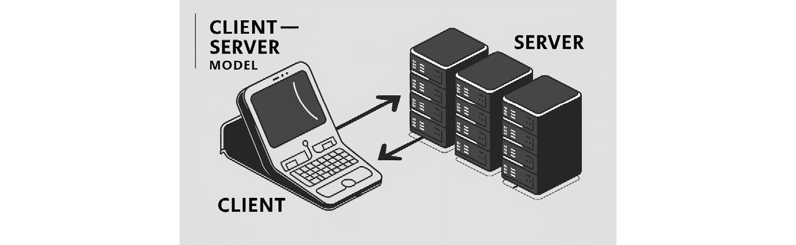
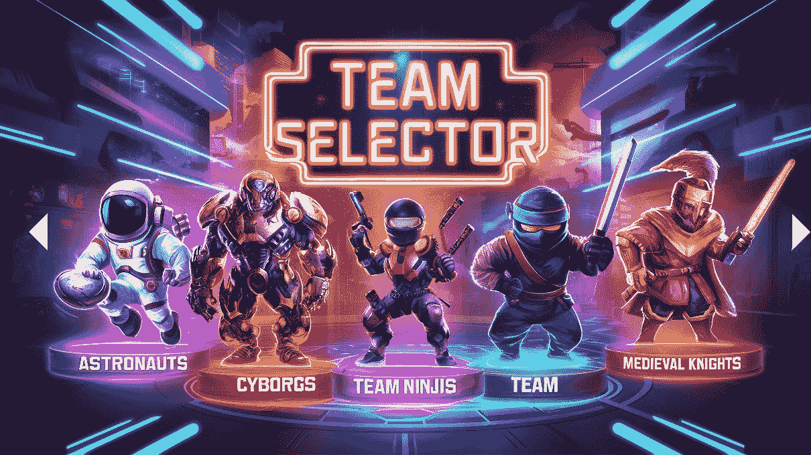

# 多玩家和网络 - 匹配、安全和交互式游戏

本章是您通往掌握 Unity 中创建引人入胜的多玩家体验的复杂性的大门。在这里，您将首先建立一个对网络原则的基础理解，这对于任何多玩家游戏开发者来说都是至关重要的。有了这些知识，您将探索如何构建健壮的系统来进行匹配，使玩家能够轻松连接。随着我们的进展，您将学习有效同步不同客户端之间游戏状态的方法，确保公平和一致的游戏体验。此外，本章还探讨了网络延迟带来的挑战，并介绍了必要的安全措施来保护您的游戏。通过这次旅程的结束，您将具备设计和实现引人入胜、安全的多人游戏环境所需的技能。

在本章中，我们将涵盖以下主题：

+   理解 Unity 中网络的基础知识

+   开发多玩家匹配系统

+   确保在不同客户端之间保持一致的游戏状态

+   管理网络延迟并实施安全措施

# 技术要求

您可以在此处找到与本章相关的示例/文件：[`github.com/PacktPublishing/Unity-6-Game-Development-with-C-Scripting/tree/main/Chapter11`](https://github.com/PacktPublishing/Unity-6-Game-Development-with-C-Scripting/tree/main/Chapter11)

# Unity 中网络的基础

在多玩家游戏开发的动态领域中，理解 Unity 中网络的基础知识是至关重要的。本节通过探索 Unity 提供的全面网络功能，为创建交互式多玩家环境奠定基础。您将了解 Unity 网络堆栈。这包括低级 API，如传输层，它便于自定义网络协议，以及高级 API，如 Unity **Netgame for GameObjects**（**NGO**）、Mirror 或 Photon，它们简化了复杂网络游戏的创建。此外，本节介绍了多玩家游戏的基本架构，重点关注客户端-服务器和点对点模型之间的差异及其实际应用，为深入了解高效游戏设计和网络管理奠定基础。

## Unity 网络简介

开始探索 Unity 的网络功能，这对于创建引人入胜的多玩家体验至关重要。本节介绍了 Unity 的网络功能，提供了高阶和低阶 API 以满足多样化的开发需求。高阶 API 如 Mirror 或 Photon 简化了如同步玩家动作等复杂任务，而低阶 API 如传输层则提供了对网络流量的详细控制，允许根据特定游戏需求进行定制。理解这些工具对于有效地实施支持各种模型（包括客户端-服务器和点对点系统）的动态玩家交互的网络操作至关重要。这些架构在管理游戏状态和玩家数据、确保完整性和减少延迟以实现无缝游戏体验方面发挥着关键作用。

下面的图示说明了客户端-服务器模型，这是网络中的基本概念，其中客户端设备与服务器系统通信以访问资源和服务，服务器能够同时处理与多个客户端的通信。



图 11.1 – 客户端-服务器模型

除了客户端-服务器模型之外，游戏开发中使用的另一个基本网络设置是点对点模型。虽然客户端-服务器模型涉及客户端与中央服务器通信，但点对点模型允许设备之间进行直接通信。


图 11.2 – 点对点模型

对于刚开始使用 Unity 网络开发的开发者来说，理解这些模型至关重要，因为它们直接影响游戏设计和玩家体验。选择正确的架构取决于游戏的具体需求，例如它支持的玩家数量、其延迟要求以及所需的网络安全级别。

正如我们所探讨的，Unity 的网络功能对于开发提供动态和互动玩家体验的多玩家游戏至关重要。通过理解网络游戏的基础以及常见的网络模型，如客户端-服务器和点对点模型，开发者可以更好地利用 Unity 网络工具的潜力。

这种基础知识对于我们深入了解 Unity 提供的特定网络 API 和工具至关重要，这些工具使得这些概念的实际应用成为可能。这些工具和 API 促进了强大多玩家环境的创建，确保在各种网络条件下游戏流畅且响应迅速。

现在，让我们更详细地检查 Unity 中可用的特定网络工具，探讨如何有效地利用它们来增强您的多玩家游戏开发项目。

## Unity 网络 API 和工具

在深入研究 Unity 的多玩家功能的技术方面，我们现在将检查 Unity 提供的网络 API 系列，这些 API 满足广泛的开发需求。从允许创建自定义网络协议的传输层复杂性，到更全面的、高级的框架，如 Unity、Mirror 或 Photon，这次探索涵盖了开发者可用的所有选项。每个工具都提供独特的功能和功能，旨在简化不同类型游戏的网络过程。了解这些工具的关键功能、用例以及它们在 Unity 生态系统中的集成对于旨在为特定项目选择最有效网络解决方案的开发者至关重要。这种知识将使您能够构建不仅强大而且针对现代多人游戏交互需求进行优化的网络体验。

在 Unity 的网络生态系统中，开发者可以访问从提供对网络操作细粒度控制的低级选项到简化常见网络任务的高级框架的广泛 API。这种多样性确保了无论您是在构建简单的多人益智游戏还是复杂的开放世界冒险，都有一个适合您需求的工具。

### 低级 API

从传输层开始，Unity 为开发者提供了实现和管理自定义网络协议的能力。这一层对于需要优化网络流量管理的游戏至关重要，例如对实时性能有高要求的游戏。它允许对通过网络发送和接收的数据包进行精确控制，使开发者能够微调网络以减少延迟并提高可靠性。

让我们看看一个传输层代码的例子：

```cs
using Unity.Netcode;
using UnityEngine;
public class NetworkManagerExample : MonoBehaviour
{
    void Start()
    {
        // Start as server or client
        if (IsServer)
        {
            NetworkManager.Singleton.StartServer();
        }
        else
        {
           NetworkManager.Singleton.StartClient();
        }
    }
```

此代码块根据`IsServer`条件启动服务器或客户端来初始化网络：

```cs
    // Send a message to the server
    public void SendMessageToServer()
    {
        if (NetworkManager.Singleton.IsClient)
        {
           var buffer = Encoding.UTF8.GetBytes("Hello
             Server!");
           using (var writer = new
           FastBufferWriter(buffer.Length, Allocator.Temp))
            {
                writer.WriteBytes(buffer);
              NetworkManager.Singleton.
              CustomMessagingManager.
              SendNamedMessage("ReceiveMessage",
              NetworkManager.Singleton.
              ServerClientId, writer);
            }
        }
    }
```

此代码块使用 Unity 的 Netcode 系统从客户端向服务器发送消息，确保消息被正确编码和传输：

```cs
    // Receive a message from a client
    public void OnEnable()
    {
       NetworkManager.Singleton.
       CustomMessagingManager.
       RegisterNamedMessageHandler("ReceiveMessage",
       (senderClientId, reader) =>
        {
            var buffer = new byte[reader.Length];
            reader.ReadBytes(buffer, reader.Length);
            string message = Encoding.
            UTF8.GetString(buffer);
            Debug.Log("Received message: " + message);
        });
    }
}
```

此代码块设置了一个处理程序，用于接收和记录客户端通过 Unity 的 Netcode 系统发送给服务器的消息。

注意

实际 API 调用可能因所使用的服务或框架而略有不同。

低级 API 最适合需要针对特定性能要求定制网络解决方案的游戏。

### 高级框架

对于寻求更抽象功能的开发者，Unity 集成了多个高级网络框架，如 Mirror 和 Photon。这些框架处理了许多网络管理的复杂性，例如玩家状态的自动同步和**远程过程调用**（**RPCs**）的简单处理。这种抽象化使得开发者可以更多地关注游戏机制，而不是网络代码的复杂性。

下面是一个高级 API 使用示例（Mirror）：

```cs
// Command function called by the client but executed on the server
[Command]
void CmdFire() {
    // Instantiate projectile
    GameObject projectile = Instantiate(projectilePrefab, position, rotation);
    NetworkServer.Spawn(projectile);
    // Trigger some behavior on all clients
    RpcShowFireEffects();
}
// RPC function to update clients
[ClientRpc]
void RpcShowFireEffects() {
    // Show effects here
    Instantiate(fireEffect, transform.position, Quaternion.identity);
}
```

此 C#脚本包括一个在服务器上执行的命令函数，用于实例化和生成一个投射物，随后是一个 RPC 函数，用于更新所有客户端的火焰效果。

注意

此示例演示了 Mirror 的命令和 RPC 语法如何简化客户端-服务器交互。如`[Command]`用于服务器逻辑和`[ClientRpc]`用于客户端更新的属性，使得指定代码运行的位置变得简单，减少了复杂性，并允许开发者专注于游戏机制。

高级框架是那些需要稳健、现成解决方案的开发者的理想选择，这些解决方案可以轻松集成和扩展。了解这些工具的功能以及它们如何在 Unity 生态系统中集成，对于做出关于哪个最适合你项目特定需求的有根据的选择至关重要。

通过比较这些不同网络层和框架的功能、优势和潜在缺点，你可以更好地理解如何利用 Unity 的网络堆栈构建稳定、可扩展且引人入胜的多人体验。

我们现在已经探索了 Unity 网络 API 和工具的多样化范围，突出了低级 API（如传输层）和高级框架（如 Mirror 和 Photon）之间的区别。这些工具不仅促进了定制网络协议的开发，还简化了复杂多人系统的创建和管理。通过对 Unity 网络堆栈中可用工具的全面理解，以及它们各自的功能和理想用例，开发者可以为他们的特定项目需求选择合适的工具。

随着我们继续前进，我们将应用这些基础网络知识，深入探讨多人游戏的架构设计，探索这些技术是如何实际实施以构建稳健且可扩展的多人环境的。

## 多人游戏架构

随着我们从理解 Unity 网络框架中的工具和 API 转向，我们将注意力转向多人游戏架构的结构基础。本节探讨了在多人游戏设计中使用的两种主要模型：客户端-服务器和点对点模型。每种模型在游戏状态同步、处理延迟和 Unity 环境中的可扩展性方面都提供了独特的优势和挑战。通过研究这些模型，开发者可以深入了解如何最佳地构建他们的多人游戏，确保稳健的性能和玩家参与度。这种探索对于做出明智的决定至关重要，即哪种架构方法将最适合你项目的特定需求，充分利用 Unity 的网络功能。

在使用 Unity 进行多人游戏开发领域，选择合适的架构对于创建流畅且吸引人的玩家体验至关重要。目前使用的两种主要模型是客户端-服务器模型和对等模型，每种模型都有其独特的优势和考虑因素：

+   **客户端-服务器模型**：这种架构的特点是有一个中央服务器，所有客户端都连接到这个服务器。服务器管理游戏状态，处理来自所有客户端的输入，并将更新发送回他们。这种模型在一致性权威至关重要的游戏中特别有利，例如竞技射击游戏或策略游戏。服务器作为权威源，有助于防止作弊并确保所有玩家对游戏世界的视图保持同步。然而，这种模型可能会引入延迟，尤其是如果服务器地理位置远离玩家。此外，它还需要更强大、通常更昂贵的基础设施来处理服务器的处理和带宽需求。

+   **对等模型**：对等模型将单个服务器处理的责任分散到所有参与客户端之间。每个客户端直接与其他客户端通信，这可以通过消除服务器作为中间人而减少延迟。这种模型非常适合小型或合作游戏，在这些游戏中，作弊的风险较低，对可扩展性和绝对权威的要求也不那么严格。然而，对等架构可能会遇到诸如**网络地址转换**（NAT）穿越（通过使用 NAT 的路由器建立和维护连接的过程）等问题，并且在没有中央权威的情况下同步游戏状态可能会更具挑战性。

对于 Unity 开发者来说，在这两种架构之间进行选择需要考虑游戏规模、预期的玩家基础以及正在创建的游戏体验类型等因素。Unity 的网络工具支持这两种架构，允许开发者实施针对其特定需求的定制解决方案。在 Unity 中有效使用这些模型还涉及利用由高级 API（如 Mirror 或 Photon）提供的网络管理功能，这些 API 提供了内置支持，用于处理网络环境的复杂性，例如延迟管理和数据同步。

理解这些架构及其影响有助于 Unity 开发者设计更健壮的多玩家体验。通过仔细选择适当的模型，开发者可以确保他们的游戏架构与他们的游戏目标性能要求相一致。

在深入研究了多人游戏的基础架构——即客户端-服务器和点对点模型——之后，我们发现每种模型在 Unity 框架内都各有其独特的优势和挑战。客户端-服务器模型以其强大的控制和同步能力而闻名，非常适合大型、竞争激烈的环境，但需要大量的基础设施和仔细处理延迟问题。相反，点对点模型提供了较低的延迟，非常适合小型或合作环境，尽管它可能在同步和安全问题上遇到挑战。这些见解对于任何希望实现有效多人功能的 Unity 开发者来说是一个关键的基础。

随着我们不断前进，我们将通过探索实际应用来构建这一知识，首先从创建和管理多人游戏大厅开始，在这些架构决策将开始实质性地塑造玩家的体验。

# 构建多人游戏大厅

在 Unity 中开发多人游戏大厅是构建引人入胜的多人游戏体验的关键步骤，它作为匹配和游戏会话管理的操作核心。本节概述了如何设计和实现一个健壮的大厅系统，该系统不仅能够促进玩家之间的顺畅互动，还能通过直观的**用户界面**（**UI**）设计和有效的房间管理来增强用户参与度。通过关注游戏模式选择、玩家准备状态指示器和动态房间列表等基本功能的集成，本指南为开发者提供了一个全面的框架，以创建功能齐全且用户友好的多人游戏大厅。这种基础知识的掌握对于确保玩家能够无缝地浏览游戏选项、与他人连接并准备游戏至关重要，为本章后续的详细技术实现奠定了基础。

## 大厅设计原则

设计一个有效的多人游戏大厅对于培养引人入胜且用户友好的游戏体验至关重要。本节深入探讨了大厅设计的基础原则，强调了清晰直观的用户界面的重要性。通过确保玩家能够轻松地浏览游戏选项、加入房间或启动新的游戏会话，开发者可以显著提高玩家的满意度和留存率。游戏模式选择、玩家数量限制和隐私设置等关键元素是每个大厅都应该包含的组成部分。这些功能不仅改善了用户体验，还为大厅实现的技术方面奠定了基础。通过深思熟虑的设计方法，本节旨在为开发者提供必要的工具，以构建一个欢迎且高效的、满足所有玩家需求的大厅。

+   **简化并增强玩家与游戏的互动**：在设计多人游戏大厅的 UI 时，主要目标是简化并增强玩家从登录那一刻起与游戏的互动。一个设计良好的大厅是玩家的中心枢纽，为他们提供快速便捷地访问所有必要功能的方式。这包括一个直观的导航系统，引导玩家通过各种游戏选项，使他们能够轻松加入房间、开始新的游戏会话或调整设置。UI 的清晰度和直观性至关重要，因为它们直接影响玩家对游戏的最初印象和持续参与度。

+   **融入关键元素以使界面用户友好**：为确保大厅用户友好，开发者必须融入几个关键元素，以满足玩家的需求和期望：

    +   游戏模式选择应突出显示，为玩家提供一种无烦恼的方式来选择他们偏好的游戏风格，无论是竞技、合作还是单人游戏。

    +   此外，实施调整玩家数量限制的控制也是必不可少的，使玩家能够根据他们的偏好设置游戏小组的大小。

    +   隐私设置是另一个关键特性，允许玩家决定他们是否希望他们的游戏会话是公开的，任何人都可以加入，或者私有的，只有受邀玩家可以参与。

+   **考虑可访问性的设计元素**：每个关键元素都应考虑到可访问性，确保所有玩家，无论他们对游戏界面的经验水平如何，都能导航并使用大厅的功能。设计还应适应各种设备格式，从桌面到移动电话，为所有平台提供一致的用户体验。

通过关注这些方面，开发者可以创建一个多人游戏大厅，不仅满足游戏的职能需求，还能提升玩家的满意度和留存率。在 UI 设计原则上的坚实基础至关重要，因为它为大厅实现的更技术性方面奠定了基础，确保了开发过程的顺利过渡。



图 11.3 – 示例大厅设计，玩家可以选择加入现有的团队

在确立了构建有效多人游戏大厅的关键设计原则后，我们现在理解了清晰直观的 UI 对于简化游戏选项、房间加入和会话创建的重要性。包含诸如游戏模式选择、玩家数量限制和隐私设置等基本元素，确保大厅满足玩家的多样化需求，提升他们的整体体验。

在大厅设计原则的坚实基础之上，下一步合乎逻辑的步骤是深入探讨实际构建和实现这些功能的技术方面。通过将这些设计原则转化为具体的编程和系统配置，开发者可以创建一个功能齐全且引人入胜的多玩家大厅，作为玩家游戏体验的门户。

## 实现大厅功能

从多人游戏大厅的设计原则过渡到其技术实现，本节深入探讨了在 Unity 中构建稳健大厅系统的过程。我们将探讨设置房间管理所涉及的必要步骤，这使玩家能够无缝地创建、列出和加入游戏房间。利用 Unity 强大的网络工具，如 Mirror 和 Photon，我们将研究这些框架如何帮助管理连接并在会话之间同步玩家数据。将通过代码片段和伪代码提供实际示例，突出关键功能，如房间列出、加入机制和玩家准备状态管理。这些见解将使开发者具备实施这些关键功能所需的工具，确保大厅系统平稳高效。

在 Unity 中构建功能齐全的大厅系统涉及几个关键步骤，这些步骤将 Unity 的网络工具集成到管理房间和玩家交互中，以有效地进行。这个过程包括创建、列出和加入游戏房间，这对于多人环境至关重要。

在这里，我们将通过使用流行的网络框架，如 Mirror 或 Photon，来介绍技术设置，这些框架通过其全面的 API 和工具简化了这些任务：

1.  **创建房间**：大厅功能的第一步是允许玩家创建游戏房间。这涉及到设置一个简单的用户界面，玩家可以在其中输入房间名称和游戏设置，然后使用网络工具在网络上实例化这些房间：

    ```cs
    // Using Mirror for room creation
    public void CreateRoom(string roomName) {
        NetworkManager.singleton.StartHost(); // Start a host instance
        NetworkRoomManager.roomName = roomName; // Set the room name
    }
    ```

1.  **房间列出和加入**：一旦创建了房间，它们就需要被列出，以便其他玩家可以找到并加入它们。这通常涉及到从网络中检索房间数据并在大厅 UI 中显示：

    ```cs
    // Pseudocode for listing and joining rooms using Photon
    void ListRooms() {
        var rooms = PhotonNetwork.GetRoomList(); // Get list of rooms
        foreach(var room in rooms) {
            UI.AddRoomToList(room.name, room.playerCount); // Update UI with room details
        }
    }
    public void JoinRoom(string roomName) {
        PhotonNetwork.JoinRoom(roomName); // Join a specific room
    }
    ```

1.  **管理玩家准备状态**：大厅系统的一个重要方面是管理玩家准备状态，确保所有玩家在开始游戏之前都已准备好。这可以通过跟踪玩家状态并在状态发生变化时更新所有客户端来实现：

    ```cs
    // Using Mirror to handle player readiness
    [Command]
    public void CmdSetReady(bool isReady) {
        this.isReady = isReady; // Set player readiness
        RpcUpdateReadyStatus(this.isReady); // Notify all clients
    }
    [ClientRpc]
    void RpcUpdateReadyStatus(bool isReady) {
        UI.UpdatePlayerReadiness(playerId, isReady); // Update UI on all clients
    }
    ```

这些代码片段提供了一个在 Unity 中设置大厅系统必要组件的基本框架。通过利用网络框架如 Mirror 或 Photon，开发者可以高效地处理多人房间的创建、列出和管理，以及同步客户端之间的玩家数据和准备状态。这一功能不仅改善了多人体验，还确保了游戏会话管理平稳高效。

我们现在已经概述了在 Unity 中实现大厅功能的基础步骤，详细说明了通过使用 Unity 的网络工具（如 Mirror 或 Photon）创建、列出和加入游戏房间。本节提供了管理连接和同步玩家数据的必要见解，这对于确保玩家可以在大厅中无缝交互至关重要。示例和伪代码展示了实际实现，为开发者建立稳健的大厅系统提供了清晰的路径。

随着我们继续前进，重点将转向通过将高级功能集成到大厅的 UI 中，丰富这些基本功能，从而增强多人游戏大厅的美学吸引力和功能性深度。这一步将深入探讨集成复杂的元素，如聊天系统、好友列表和可自定义的比赛设置，这些对于构建一个功能齐全且引人入胜的多玩家环境至关重要。

## 高级大厅功能和用户界面集成

本节通过集成先进的 UI 功能增强了 Unity 中多人游戏大厅的功能，这些功能显著提高了玩家的互动和参与度。如聊天功能、好友列表和可自定义的比赛设置（如地图选择和游戏规则）等特性无缝集成到大厅的 UI 中。这种集成确保了玩家拥有连贯且引人入胜的体验，得益于针对可访问性和响应式设计的最佳 UI 设计实践。

聊天功能丰富了社区互动，允许玩家在大厅内直接沟通，这对于游戏前的协调和策略至关重要。同样，一个良好集成的好友列表使玩家能够快速连接、查看在线好友并一起加入游戏，而无需离开大厅。自定义比赛设置让玩家能够控制他们的游戏环境，增强个性化和参与度。

为了使用户界面既实用又包容，设计强调了可访问性功能，如可调节的文本大小、高对比度配色方案和屏幕阅读器支持，确保所有玩家，无论他们可能有什么残疾，都能有效地导航和使用大厅。这些增强不仅提高了游戏的功能性和美学吸引力，而且通过促进关键的游戏状态同步，确保了公平和一致的游戏体验。

# 同步游戏状态

在各种客户端之间同步游戏状态是多人游戏开发中的一个基石挑战，需要深入研究高级技术和最佳实践。本节将彻底探讨在异构网络环境中保持游戏状态一致性的稳健方法。从状态同步方法的基本原理到处理用户输入的复杂性以及通过预测和插值技术减少延迟，我们将涵盖确保无缝多人体验的基本策略。此外，本讨论还将包括使用 Unity 的联网工具，如 NetworkVariables 和 RPC 调用，的实际示例和指导，为开发者提供实施高效和响应的游戏状态同步的知识。

## 状态同步方法

在各种客户端之间同步游戏状态是多人游戏开发的一个基本方面，确保所有玩家都能一致地体验游戏。本节介绍了在多样化的客户端体验中保持一致性的关键技术，讨论了可靠和不可靠状态更新之间的细微差别以及每种情况适用的场景。可靠的更新，通过 TCP 确保数据完整性，对于关键游戏数据来说是理想的，但可能会引入延迟。可靠的更新保证数据准确无误地按顺序传递。相反，不可靠的更新使用 UDP 进行更快地传输。这对于不太关键的数据，如玩家位置，是合适的，它提供了速度但冒着数据包丢失的风险。不可靠的更新不保证数据的传递或顺序，优先考虑速度而非准确性。

在状态同步和基于命令或事件同步之间的选择也起着至关重要的作用。状态同步定期从服务器更新所有游戏对象到客户端，确保每个人都能获得最新的数据，尽管这可能需要大量的带宽。相比之下，基于命令或事件的同步仅传输游戏状态的变化，如移动命令或游戏事件，这可以显著减少数据传输。

开发者必须根据他们游戏的需求仔细选择合适的同步方法。高精度游戏可能更倾向于可靠的更新和定期的状态同步，而快节奏的游戏可能从不可靠的更新和基于命令的同步中受益。这些策略构成了多人游戏架构的基石，通过允许所有玩家几乎实时地看到相同的游戏世界，确保了公平性和参与度。同步方法的选取是一个关键决策，它影响着游戏性能和玩家体验，需要在网络效率和游戏准确性之间取得平衡。

在这次讨论中，我们探讨了在多人环境中同步游戏状态的关键技术，重点关注了可靠和不可靠更新之间的权衡以及状态与命令或基于事件的同步的战略使用。可靠的更新确保了关键元素的数据完整性，适用于基本游戏数据，而不可靠的更新提供了更快但不太安全的快速变化元素（如玩家位置）的数据传输。展望未来，我们将探讨这些基础同步策略对于管理网络实时用户输入的重要性，确保每位玩家的动作无缝集成并反映在游戏世界中，而不影响性能或一致性。这种方法对于保持流畅和吸引人的多人游戏体验至关重要。

## 在网络中处理用户输入

在网络多人游戏中，高效管理客户端和服务器之间的用户输入对于保持响应和公平的游戏环境至关重要。本节深入探讨了捕捉、传输和处理这些输入的复杂性。输入缓冲、命令队列和协调等技术对于解决网络延迟挑战至关重要。这些策略确保所有玩家的动作在游戏中得到准确表示，无论网络条件如何，都能提供一致的游戏体验。

输入收集涉及实时捕捉每位玩家的动作，例如按键或触摸屏交互。这些输入随后会通过 UDP 等协议快速传输，UDP 因其低延迟优势而闻名，但因其不可靠性需要谨慎管理。输入缓冲有助于平滑由网络抖动引起的输入差异，确保动作按一致顺序处理。这在事件的时间和顺序对游戏玩法有重大影响时至关重要。

命令队列有助于管理和排序用户动作，即使在网络问题导致消息顺序错乱或延迟的情况下，也能保持逻辑和公平的游戏玩法。协调技术调整客户端预测状态与服务器实际状态之间的差异，回滚到最后确认的服务器状态，并重新应用任何中间输入。这确保了所有客户端的游戏状态同步，避免了在不同屏幕上出现不同的结果。

这些输入管理技术是减少延迟影响和保持游戏公平性与响应性的基础。通过将这些技术与移动预测和插值策略相结合，开发者可以进一步减少延迟感知，即使在网络条件不佳的情况下也能确保流畅、响应迅速的游戏体验。这种集成方法是提供卓越多人游戏体验的关键。

## 移动预测和插值

在网络游戏中，即使在网络延迟的情况下确保角色移动的平滑和连续性也是一个重大挑战。本节将深入探讨运动预测和插值技术，这些技术对于增强玩家体验至关重要。预测算法预测未来的玩家移动，使游戏保持响应性并最小化延迟效应，即使在意外的网络延迟期间也是如此。同时，插值技术有助于平滑过渡，并在服务器更新到达时避免角色位置上的突然跳跃。这些策略共同有助于使游戏感觉更加流畅和响应，显著减少延迟感知并提高游戏交互。

在网络多人游戏中，确保角色移动即使在网络通信不可避免地引入的延迟下仍然保持平滑和一致，是一个基本挑战。预测算法在这里发挥着关键作用，通过根据玩家的当前方向和速度估计他们下一步将移动的位置。这使得游戏能够在接收到下一个网络更新之前显示一个接近玩家实际位置的位置。这一预测步骤有助于创建无缝的体验，减少网络延迟带来的冲击感。

此外，插值还用于平滑由服务器接收的新数据引起的任何位置上的突然变化。通过在最后已知位置和新位置之间逐渐过渡，插值减轻了由于网络延迟导致的突然位置更新时可能出现的视觉卡顿或瞬移效果。这种平滑技术是保持流畅视觉体验的关键，从而增强游戏的整体响应性并减少玩家响应延迟。这些综合方法确保即使在不太理想的网络条件下，游戏体验仍然引人入胜且看起来一致。

在本节中，我们深入探讨了如何通过预测和插值技术来解决网络游戏中角色移动的固有挑战，旨在即使在网络延迟的情况下也能提高平滑性和连续性。通过采用预测算法，开发者可以预测玩家的移动，而插值方法有助于平滑由网络更新引起的突然位置变化。这些技术对于最小化延迟感知和增强游戏的响应性至关重要，为玩家提供无缝的体验。

随着我们继续前进，我们将探讨如何有效地应用 Unity 的特定状态同步工具来利用这些策略，确保游戏状态在所有客户端上保持一致，从而进一步提高游戏流畅性和公平性。

## Unity 状态同步工具

随着你深入 Unity 的多人游戏开发世界，掌握状态同步对于创建无缝的交互体验至关重要。本节提供了使用 Unity 的网络工具（包括网络变量、RPC 和 SyncVars）实现强大状态同步的实用指南。这些工具提供了一个确保游戏状态在所有客户端上保持一致的框架，这对于维护游戏完整性和公平性至关重要。我们将探讨每个工具如何在现实场景中应用，包括示例和代码片段，以说明它们在有效同步游戏状态中的实际用途，从而增强开发者的工具集和玩家的体验。

Unity 提供了几个专门用于管理多人游戏中状态同步的工具，每个工具都有其独特的用途和场景。让我们来探讨这些工具——网络变量、RPC 和 SyncVars——如何有效地同步游戏状态：

+   **Networked Variables**：网络变量是确保特定游戏状态变量在所有客户端和服务器上保持同步的强大功能。这些变量自动处理网络更新，非常适合必须对所有玩家保持一致性的关键游戏数据。以下是一个示例：

    ```cs
    using Unity.Netcode;
    public class PlayerHealth : NetworkBehaviour {
        public NetworkVariable<int> health = 
            new NetworkVariable<int>(100, 
                NetworkVariableReadPermission.Everyone, 
                NetworkVariableWritePermission.Server);
        [ServerRpc]
        public void TakeDamage(int damage) {
            health.Value -= damage;
        }
    }
    NetworkVariable that automatically synchronizes its value across the network. When damage is taken, only the server adjusts the health value, which then propagates to all clients.
    ```

+   **RPCs**：RPCs 允许在网络中执行函数。当需要触发多个客户端的效果，但动作是由单个用户的交互或特定的游戏事件发起时，会使用 RPC。以下是一个示例：

    ```cs
    using Unity.Netcode;
    public class GameActions : NetworkBehaviour {
        [ServerRpc]
        public void FireProjectileServerRpc()
        {
            PerformFire();
            FireProjectileClientRpc();
        }
        [ClientRpc]
        private void FireProjectileClientRpc() {
            // This method will be called on all clients
            if (!IsServer) // Avoid double execution on the server
            {
                PerformFire();
            }
        }
        void PerformFire(){
            // Code to instantiate and fire a projectile
        }
    ```

    在这里，`FireProjectileServerRpc` 由发射投射物的玩家调用。然后服务器调用 `FireProjectileClientRpc` 来确保所有客户端执行发射动作。

+   **SyncVars**：SyncVars 是当它们在服务器上的值发生变化时，会自动将新值同步到所有客户端的变量。它们特别适用于更新频率较低但重要的游戏状态数据，如玩家分数或团队状态：

    ```cs
    using Unity.Netcode;
    using UnityEngine;

       public class PlayerScore : NetworkBehaviour {
           public NetworkVariable<int> score = 
               new NetworkVariable<int>(0, 
                   NetworkVariableReadPermission.Everyone, 
                   NetworkVariableWritePermission.Server);
           [ServerRpc] 
           public void AddScore(int points) {
               score.Value += points;
           }
       }
    ```

    在前面的代码中，`score` 是一个 SyncVar。当在服务器上调用 `AddScore` 并更改分数时，新的分数值会自动同步到所有客户端。

这些工具各自简化了网络状态管理的不同方面，使开发者能够更多地关注游戏机制，而不是网络通信的复杂性。根据您游戏的具体需求和上下文选择合适的同步技术，可以确保多人游戏体验的流畅和响应。

在详细探索跨多个客户端同步游戏状态的过程中，我们探讨了确保多人游戏一致性和响应性的各种方法。我们研究了状态同步、管理网络中的用户输入以及应用移动预测和插值等技术，以减少延迟感知并增强玩家互动。通过利用 Unity 的强大工具，如网络变量和 RPC 调用，开发者可以实施有效的同步策略，以维护所有参与者之间的游戏状态完整性。

从状态同步的挑战过渡，现在的重点转向解决多人游戏的两个关键方面：网络延迟和安全。接下来的讨论将概述最小化和补偿延迟的战略方法，包括延迟补偿和客户端预测。此外，它将强调为防范作弊和**分布式拒绝服务**（**DDoS**）攻击（通过流量淹没服务器以中断服务）所需的必要安全措施。这不仅确保了更平滑的玩家体验，也维护了游戏环境的安全和完整性，这对于在多人环境中保持信任和参与至关重要。

# 处理网络延迟和安全问题

我们对多人游戏开发的探索达到高潮，解决了两个关键挑战：网络延迟和安全问题。本节深入探讨了旨在最小化和补偿可能导致玩家体验下降的延迟问题的复杂策略，例如采用延迟补偿技术和客户端预测。此外，它强调了采取强大安全措施的重要性，以防范作弊和 DDoS 攻击等常见威胁。通过涵盖这些关键方面，我们旨在为开发者提供必要的知识和工具，以维护一个平稳和安全的环境，确保游戏完整性和为玩家提供最佳体验。

## 最小化和补偿延迟

网络延迟是多人游戏中的一个普遍挑战，能够显著影响玩家体验。本节重点介绍通过战略措施和技术创新来最小化和补偿这一问题的方法。最初，我们将探讨通过高效的网络架构和最佳服务器选择来减少延迟的策略，旨在增强玩家交互的即时性。随后，我们将深入研究各种旨在补偿不可避免延迟的技术，如延迟补偿、客户端预测和实体插值。这些方法通过实时预测和调整网络行为，有助于保持流畅的游戏体验。将提供示例和伪代码来说明如何在 Unity 中有效地实现这些技术，从而提供增强游戏性能和玩家满意度的实用见解。

为了有效地管理多人游戏中的网络延迟，开发者必须优先考虑最小化和补偿这种延迟，以确保无缝的玩家体验。最初，重点是建立一个高效的网络架构。这包括根据玩家的地理分布选择正确的服务器位置，优化服务器硬件和软件，并采用高效的网络协议，以减少数据在客户端和服务器之间传输所需的时间。

这里有一个例子：

```cs
// Example of choosing a server based on lowest ping
void SelectBestServer(List<Server> servers) {
    Server bestServer = null;
    float lowestPing = float.MaxValue;
    foreach (Server server in servers) {
        float ping = PingServer(server);
        if (ping < lowestPing) {
            bestServer = server;
            lowestPing = ping;
        }
    }
    ConnectToServer(bestServer);
}
```

上述代码通过循环测量和比较服务器列表的 ping 时间，以识别和选择 ping 最低的服务器，从而优化网络性能。

一旦网络架构被优化，处理不可避免的延迟的技术，如延迟补偿、客户端预测和实体插值，变得至关重要。延迟补偿涉及根据延迟调整游戏状态，确保用户动作从他们的视角准确反映。客户端预测预测其他玩家的动作，以便在没有等待最新服务器更新的情况下渲染他们，而实体插值则平滑接收状态之间的对象移动，以防止动作突然。

这里有一个例子：

```cs
// Example of client-side prediction for player movement
void UpdatePlayerPosition(PlayerInput input) {
    if (isLocalPlayer) {
        // Predict local player's position
        PredictPosition(input);
    } else {
        // Interpolate position for remote players
        InterpolatePosition();
    }
}
void PredictPosition(PlayerInput input) {
    // Apply input to predict the next position
    transform.position += input.direction * speed * Time.deltaTime;
}
void InterpolatePosition() {
    // Smoothly interpolate to the server-reported position
    transform.position = Vector3.Lerp(transform.position, 
      serverReportedPosition, Time.deltaTime * smoothingFactor);
}
```

上述代码通过预测本地玩家的动作并根据输入调整，以及通过插值远程玩家的位置来平滑过渡到服务器报告的位置，在网络游戏环境中调整玩家位置。

当在 Unity 中实现这些技术时，有助于构建一个响应式的游戏环境，其中延迟的影响得到显著缓解，保持游戏的可玩性和竞争性。每种方法都在确保所有玩家都能获得公平和愉快的体验中发挥着至关重要的作用，无论他们的互联网速度或与服务器之间的物理距离如何。

在解决网络延迟——多人游戏中的关键挑战——本节概述了通过优化网络架构、服务器选择和特定的延迟处理技术（如延迟补偿、客户端预测和实体插值）来最小化和补偿延迟的有效策略。这些方法对于通过确保在不同网络条件下感觉一致的流畅、响应式游戏体验来增强玩家体验至关重要。通过实际示例和伪代码进行说明，这些策略为开发者提供了在基于 Unity 的游戏中实施强大解决方案所需的工具。随着我们关注点从最小化延迟转向增强安全性，考虑网络管理的更广泛影响至关重要，特别是它与保护游戏完整性和玩家数据免受潜在威胁的交集，为维护安全的多人环境奠定了基础。

## 多人游戏的安全措施

安全性是多人游戏开发中的关键组成部分。它对于维护游戏完整性和玩家信任至关重要。本节深入探讨了开发者面临的常见安全挑战，包括作弊、游戏机制利用以及对 DDoS 等攻击的易受攻击性。我们将探讨一系列 Unity 特定和通用安全最佳实践，例如实施安全的通信协议、确保服务器端验证玩家操作以及采用缓解 DDoS 攻击的策略。此外，我们还将提供关于有效检测和预防作弊的工具和技术见解，旨在为开发者提供所需的知识和方法，以保护他们的游戏免受各种安全威胁。

在多人游戏领域，维护强大的安全措施对于防止中断并确保公平竞争至关重要。这包括解决诸如作弊等问题，玩家可能会利用软件漏洞来获得不公平的优势，以及利用游戏机制，这可能会破坏预期的游戏体验。以下是一些应对这些挑战的方法：

+   开发者可以采用安全的通信协议来加密数据传输，从而防止窃听和篡改。

+   服务器端验证是必不可少的。通过在服务器上验证所有玩家操作，而不是依赖于客户端检查，开发者可以防止许多常见的作弊行为。

+   缓解 DDoS 攻击的策略，如速率限制和采用专业的 DDoS 保护服务，对于防御旨在破坏服务的外部威胁也是至关重要的。

+   如反作弊软件等工具可以进一步帮助检测和预防作弊，确保游戏完整性得到维护，玩家拥有公平且愉快的游戏环境。

在本节中，我们讨论了多人游戏所面临的重大安全挑战，例如作弊、利用游戏机制以及易受 DDoS 攻击的漏洞。强调安全性对于维护游戏完整性和玩家信任至关重要。随着我们转向探索如何确保一个安全且响应迅速的网络游戏环境，这些基础安全措施将在构建一个支持所有网络条件下安全且吸引人的玩家体验的强大框架中发挥关键作用。

下一次讨论将基于这些原则，重点关注创建一个全面的网络和游戏安全方法，以适应不断发展的威胁并保持最佳性能。

## 确保一个安全且响应迅速的网络游戏环境

在现代多人游戏领域，创建一个安全且响应迅速的网络游戏环境至关重要。这一探索强调了在实施强大的安全协议和保持流畅、响应迅速的游戏之间所需的临界平衡。这种平衡对于最佳的玩家体验至关重要，强调了持续监控、严格测试和频繁更新的必要性。这些做法不仅对于适应新的威胁和不断发展的性能挑战至关重要，而且对于维护安全措施和游戏流畅性之间的微妙平衡也至关重要。强大的安全协议可以防止恶意威胁并确保公平竞争，但它们必须不会干扰游戏的响应性或因过度延迟而使玩家感到疏远。这种持续的警惕性和适应性强调了管理延迟和安全是一个持续的过程，对于多人游戏的持续成功和可靠性至关重要，确保它们对所有用户来说既具有竞争力又令人愉快。

在本节的最后部分，我们强调了在管理网络延迟和安全方面采取全面方法的重要性，以确保多人游戏环境的成功。在强大的安全协议与流畅、响应迅速的游戏需求之间取得平衡是至关重要的；过于严格的安保措施可能会阻碍游戏体验，而安保不足则可能使游戏面临漏洞。建议的策略包括持续的监控、测试和及时更新。这些做法使开发者能够迅速适应新的安全威胁并优化性能，确保游戏体验对所有玩家来说既安全又愉快。对不断改进和确保游戏网络的持续承诺是多人游戏平台持久成功和可靠性的基础。

# 摘要

本章提供了在 Unity 中建立和管理多人游戏系统的全面指南，涵盖了从基本的网络原理到复杂的安保和同步挑战的所有内容。我们探讨了如何创建和管理多人游戏大厅，确保客户端之间的游戏状态一致性，以及解决网络延迟和安保问题——这些都是维护多人游戏环境中的完整性和流畅游戏体验的关键组成部分。通过理解这些要素，开发者能够更好地提供引人入胜、安全且公平的多人游戏体验。

随着我们继续前进，重点将转向优化游戏性能以提升效率和游戏质量。在下一章中，我们将深入探讨性能分析技术和性能分析，这对于识别瓶颈和优化资源使用至关重要。这种转变强调了持续平衡游戏功能与性能的必要性，确保游戏不仅在网络上运行良好，而且在不同的硬件上也能高效运行，为玩家提供最佳的游戏体验。
