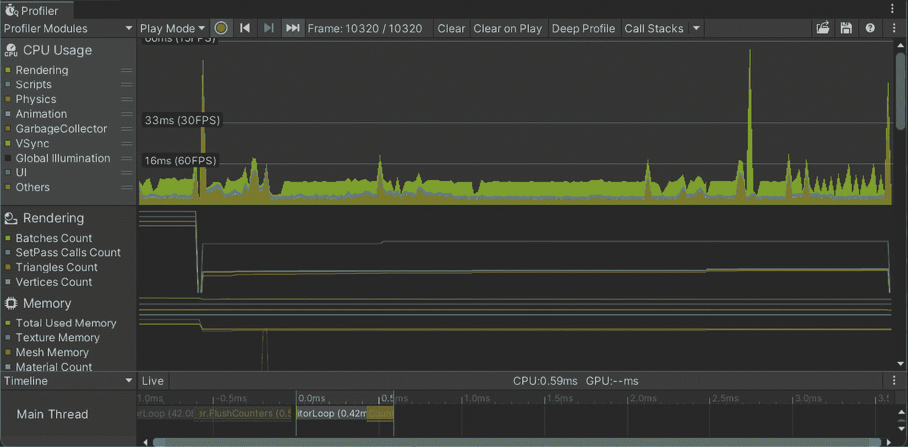
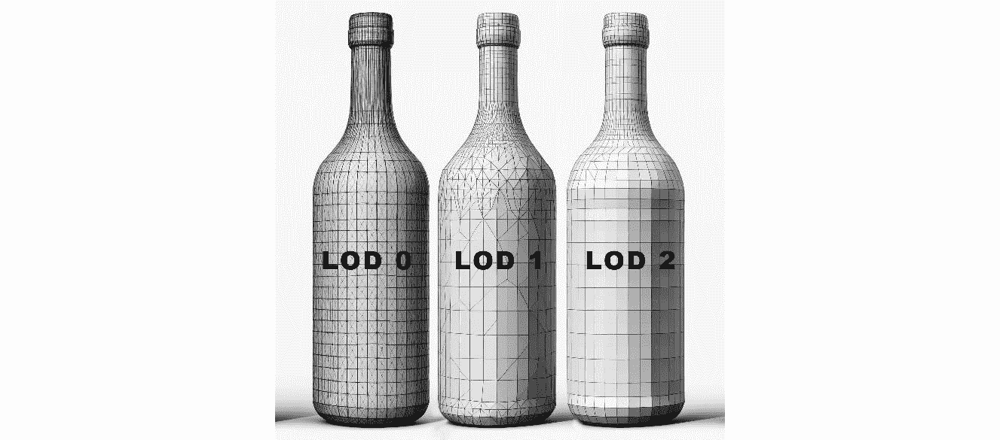

# Unity 中优化游戏性能 – 剖析和分析技术

本章深入探讨了在 Unity 中优化游戏性能，这是游戏开发中一个关键方面，它结合了技术实力和效率。本章为您提供了熟练使用 Unity 剖析工具的技能，使您能够彻底分析游戏性能问题，如瓶颈和低效的代码路径。您将学习如何有效地管理内存使用，理解垃圾回收的细微差别，并优化图形资产和渲染过程，以保持高质量的视觉效果而不牺牲性能。此外，本章还提供了编写高效代码的指导，采用最佳实践，如实现 LOD 系统，并在视觉保真度和性能之间取得平衡。这些技术和见解将为构建高性能游戏奠定基础，这些游戏在各种平台上都进行了良好的优化。

在本章中，我们将涵盖以下主题：

+   利用剖析工具分析游戏性能

+   管理内存使用和垃圾回收

+   优化图形资产和渲染过程

+   编写高效和优化的代码以获得更好的性能

# 技术要求

您可以在此处找到与本章相关的示例/文件：[`github.com/PacktPublishing/Unity-6-Game-Development-with-C-Scripting/tree/main/Chapter12`](https://github.com/PacktPublishing/Unity-6-Game-Development-with-C-Scripting/tree/main/Chapter12)

# 剖析和识别瓶颈

剖析是有效游戏优化的基石，提供了对可能阻碍游戏顺畅运行的性能问题的基本见解。本节介绍了 Unity 剖析工具的力量，引导您通过剖析游戏来定位 CPU、GPU 和内存使用等关键领域的瓶颈。您将学习如何导航剖析领域，不仅识别问题发生的地方，而且理解剖析数据的影响。通过案例研究和现实世界的例子，本部分说明了常见的性能陷阱和剖析在解决这些挑战中的战略应用，确保您的游戏在各种条件下都能表现最佳。

## Unity 的剖析工具简介

Unity 的 Profiler 是游戏开发中的一个关键工具，它提供了对游戏性能的全面见解。本介绍概述了其监控 CPU、GPU 和内存使用等指标的能 力，为识别和分析性能瓶颈提供了坚实的基础。

Profiler 提供了对各种子系统的实时洞察，帮助开发者定位资源密集区域。其直观的界面以层次结构、时间线和原始层次结构等视图显示数据，每个视图都提供独特的分析视角。例如，时间线视图显示了随时间推移的过程，有助于识别偶发的资源使用峰值。

除了通用指标之外，Profiler 还包括分析网络性能、音频播放和渲染统计的工具。这种粒度对于微调游戏性能的每个方面都非常有价值。详细的报告使优化决策更加明智，确保游戏运行顺畅并提供最佳玩家体验。

本节介绍了 Unity 的 Profiler 及其在监控和优化游戏性能中的基本作用。通过了解其主要功能，你将准备好理解高级分析技术，以便你可以识别和解决性能瓶颈，确保跨平台的高性能。

## 探索分析技术并识别瓶颈

在介绍基本概念的基础上，本节深入探讨了如何使用 Unity 的 Profiler 有效地识别和解决游戏中的性能问题。我们将探讨如何正确设置和进行分析会话，捕获和分析关键性能数据，以确定常见的开发瓶颈，如渲染效率低下、脚本执行延迟、资源加载时间和网络延迟。通过详细的分步示例和实际案例研究，你将了解可以使用 Unity 的 Profiler 检测这些问题的具体方法，为你提供提高游戏项目性能和流畅度的实用技能。

为了有效地利用 Unity 的 Profiler 来识别和解决性能瓶颈，了解如何设置和运行分析会话至关重要。首先，配置 Profiler 设置以捕获你关心的特定区域，例如 CPU 使用率、GPU 负载、内存使用或网络活动。这种有针对性的方法有助于将你的精力集中在潜在的问题区域，并简化分析过程。

以下图是游戏进行时 Profiler 窗口的快照。活动图将向左滚动，最新信息出现在最右侧。一般来说，大的峰值是需要解决的关注区域：



图 12.1 – 显示游戏性能实时数据的 Profiler 窗口

一旦分析会话开始运行，监控游戏执行典型任务或已知会导致性能问题的任务。捕获足够的数据以识别模式或异常，并使用分析器的视图，如**时间线**视图，以确定瓶颈，例如过度的资源加载时间或脚本执行延迟。分析性能数据通常揭示常见问题，如由于过多的绘制调用或未优化脚本导致的帧率下降。Unity 的分析器允许您深入这些具体细节并优先优化。

一旦您熟悉了 Unity 分析器的基础知识，了解如何有效地导航和利用此工具来优化游戏性能至关重要。以下部分提供了关于分析导航的实用技巧和技术，帮助您更有效地定位和解决性能瓶颈。

### 分析导航提示

使用以下指南简化 Unity 分析器的导航：

+   **使用过滤器**：

    +   利用**分析器**窗口中的过滤器专注于特定区域，例如 CPU、GPU 或内存使用。

    +   过滤器可以在左侧面板上切换，以隔离与您的分析最相关的性能指标。

+   **切换视图**：

    分析器提供多个视图，例如**层次结构**、**时间线**和**原始层次结构**。

    +   **层次结构**：以层次结构格式显示性能数据，有助于深入特定过程。

    +   **时间线**：显示随时间推移的过程，突出显示间歇性资源使用峰值。

    +   **原始层次结构**：提供详细分析的原数据格式。

+   **启用深度分析**：

    +   深度分析在方法级别捕获详细的性能数据。

    +   要启用深度分析，请在运行游戏之前在**分析器**窗口中选择**深度分析**选项。

    +   请谨慎使用，因为深度分析可能会显著减慢游戏速度，因此请选择性使用。

+   **记录和分析数据**：

    +   使用**分析器**窗口中的记录按钮开始和停止分析会话。

    +   在典型的游戏玩法场景中捕获数据，以识别性能瓶颈。

    +   分析捕获的数据以了解不同过程对整体性能的影响。

深度分析允许开发者捕获到方法级别的详细性能数据，有助于识别导致性能问题的特定代码段。要启用深度分析，请在运行游戏之前进入**分析器**窗口并选择**深度分析**选项。此模式捕获全面的数据，但可能会显著减慢游戏速度，因此最好选择性使用。一旦启用，您可以在**时间线**视图中检查深度分析数据，以识别特定方法中的性能瓶颈并相应地进行优化。

例如，一位开发者注意到了不规则的帧时间峰值，并使用 Profiler 追踪问题到间歇性的网络数据爆发和不恰当的资产加载。通过将资产加载移至后台线程并改进网络数据处理，他们解决了这个问题。使用 Unity 的 Profiler 有助于识别瓶颈并指导有效的解决方案，从而提升游戏性能和用户体验。

在本节中，我们介绍了使用 Unity 的 Profiler 通过捕获和分析性能数据来诊断性能瓶颈。接下来，我们将深入探讨解读 Profiler 数据并采取进一步优化游戏性能的措施。

## 解读 Profiler 数据和采取行动

通过 Unity 的 Profiler 收集大量数据后，下一步关键步骤是解读这些信息以驱动有效的游戏优化。本节重点介绍如何分析 Profiler 数据，使您能够根据对游戏玩法和玩家体验的影响来理解和优先处理性能问题。我们将讨论将复杂数据转化为可操作见解的方法，并介绍解决和解决已识别瓶颈的策略。这种方法使开发者不仅能够识别需要改进的领域，还能够设计和实施实际解决方案，确保优化提升游戏的整体性能并保持或改善用户体验。

解读从 Unity 的 Profiler 收集的大量数据需要一种系统性的方法来确保每条信息都得到有效利用，以增强游戏性能。最初，开发者必须学会区分表示关键性能问题的数据和表示轻微低效的数据。这种优先级排序至关重要，因为它允许开发者专注于对玩家体验和整体游戏流畅性影响最大的修改。

例如，如果 Profiler 在特定游戏事件期间指示高 CPU 使用率，开发者应该检查相应的脚本和进程以识别低效的代码。通过重构或优化这些区域，开发者可以减少 CPU 负载，从而实现更流畅的游戏体验。同样，如果检测到内存使用率峰值，可能需要检查资产管理策略，例如调整游戏过程中资产加载或卸载的方式和时间。

为了便于持续监控和立即识别性能问题，将简单的帧率指示器集成到游戏的 UI 中可以非常有用。以下是在 Unity 中使用 C#创建基本帧率显示的示例。这需要在 UI 中创建一个**Text**字段来显示帧率数据：

```cs
using UnityEngine;
using UnityEngine.UI;
public class FrameRateCounter : MonoBehaviour
{
    public Text frameRateText; // Reference to UI Text
    private float deltaTime = 0.0f; // Time between frames
    void Update()
    {
        // Calculate the time taken for the last frame
        deltaTime += (Time.unscaledDeltaTime - deltaTime) *
            0.1f;
        // Calculate frames per second
        float fps = 1.0f / deltaTime;
        // Update the UI Text element with the FPS value
        frameRateText.text = Mathf.Ceil(fps).ToString() + "
            FPS";
    }
}
```

在此脚本中，`frameRateText`是一个 UI 文本元素，需要在 Unity 编辑器中链接，用于显示当前每秒帧数。`FrameRateCounter`脚本通过在`Update`方法中实时更新帧率来工作。`deltaTime`变量，它跟踪帧之间的时间，使用指数移动平均来平滑计算。然后，帧率（FPS）通过`deltaTime`的倒数来计算，提供了一个每秒帧数的准确度量。最后，使用`Mathf.Ceil`将计算出的 FPS 值四舍五入到最接近的整数，并更新`frameRateText.text`属性。这些实时数据有助于开发人员和测试人员立即直观地验证他们优化的影响，从而允许快速调整和改进游戏性能。

通过使用这些策略，开发者不仅可以根据性能数据识别和优先处理问题，还可以开始制定有效的解决方案。这种持续评估和调整的过程确保游戏不仅运行高效，而且为玩家提供引人入胜的体验。

本节已为您提供了解读 Unity Profiler 中性能数据并采取实际步骤优化游戏的技能。接下来，我们将重点关注内存管理，通过解决已识别的瓶颈来进一步提高游戏性能。

# Unity 中的内存管理

在 Unity 游戏开发中，有效的内存管理至关重要，尤其是确保流畅性能和防止诸如卡顿或崩溃等问题，尤其是在资源受限的平台。本节深入探讨了您可以在 Unity 中使用的各种优化内存使用的策略，包括对垃圾回收的深入了解，这是自动释放未使用内存的过程。我们还将讨论为什么最小化垃圾回收的影响很重要，因为过多的垃圾回收可能导致性能问题，如帧率下降和卡顿。我们将探讨诸如对象池和谨慎管理`Update()`等频繁调用的方法中的内存分配等实际技术。此外，实用的技巧和真实世界的案例将说明如何有效地实施内存优化，帮助您在不同设备上保持高效和稳定的游戏性能。但在开始之前，让我们更好地了解 Unity 中的内存使用情况。

## 理解 Unity 中的内存使用

作为之前讨论的复习（参见*第三章*），理解 Unity 中的内存使用对于优化游戏性能和稳定性至关重要。本简要概述回顾了 Unity 中使用的不同类型的内存——堆、栈、托管和非托管——以及.NET 垃圾回收的作用。有效管理这些内存类型和垃圾回收对于防止性能下降和确保流畅的游戏体验至关重要。本复习强调了在游戏开发过程中进行谨慎的内存管理实践的重要性。

下图显示了 Unity Profiler 的内存模块。在测试游戏时跟踪这些数据将显示您的游戏如何有效地使用内存资源：


图 12.2 – Unity 的 Profiler 内存模块

理解内存使用至关重要，因为它直接影响游戏性能，并且对于在 Unity 中有效管理资源是基本的。随着我们从基础知识过渡到下一步，下一个重点将是具体策略，以最小化垃圾回收对游戏性能的影响。

## 最小化垃圾回收的影响

减少垃圾回收的影响是提高 Unity 游戏中性能的关键优化策略。尽管垃圾回收对于管理内存是必要的，但过度的垃圾回收可能导致严重的性能问题，例如帧率下降和卡顿。这些问题发生的原因是垃圾回收会暂时停止游戏的执行以回收未使用的内存，这可能会打断游戏流畅的流程。垃圾回收器的频繁中断会导致明显的暂停，从而让玩家体验到响应速度慢且令人沮丧的游戏体验。

本节探讨了各种技术以最小化垃圾回收的频率和影响，从识别常见的内存浪费来源开始。在频繁执行的方法，如`Update()`中进行的非必要分配往往是性能问题的罪魁祸首。我们将深入研究避免这些不想要的分配的最佳实践，并强调对象池的作用。对象池对于管理频繁创建和销毁的对象特别有效，例如游戏中的子弹或动态 UI 元素。通过重用对象而不是不断生成新的对象，开发者可以显著减少垃圾回收的负担，从而实现更流畅的游戏体验和改进的资源管理。

Unity 中的垃圾回收是一个自动过程，通过移除不再使用的对象来释放内存。然而，频繁的垃圾回收可能会导致性能问题。为了最小化其影响，避免在频繁调用的方法，如`Update()`中创建临时对象。相反，可以通过对象池等技术重用对象。例如，而不是实例化新的弹射物，可以在游戏开始阶段创建一个可重用的弹射物池，并在需要时激活它们，从而减少垃圾回收器的开销并提高性能。

在 Unity 中，有效地管理垃圾回收对于保持流畅的游戏性能至关重要，尤其是在实时交互和流体动力学是关键的项目中。性能退化的一个常见原因是频繁在频繁调用的方法中创建临时对象，如`Update()`。在这些方法中每次创建新对象时，都会添加到堆中，增加垃圾回收器的工作量，这可能导致帧率问题和游戏卡顿。

为了解决这个问题，开发者首先应该通过分析他们的游戏来识别这些热点区域，看看最多分配发生在哪里。Unity 的 Profiler 工具在这里非常有价值，它允许你逐帧监控内存分配。例如，你可能会注意到在`Update()`方法中的每一帧创建新的向量或字符串会导致显著的垃圾回收。

下面是一些最小化分配的步骤：

1.  **分析你的游戏**：使用 Unity 的 Profiler 追踪频繁分配内存的方法。

1.  **优化代码**：修改代码以减少或消除这些分配。例如，而不是每帧创建一个新的 Vector3 对象来调整对象的位置，修改现有的位置或使用一个可重用的临时静态变量。

1.  **实现缓存**：将频繁使用的对象，如计算中的临时数据，存储在私有字段中，以便重用而不是重新实例化。

此外，对象池是另一种可以显著减少频繁分配和释放需求的有效技术。这对于经常创建和销毁对象的游戏特别有用，例如弹射物或 UI 元素。

下面是对象池实现的步骤：

1.  **创建池管理器**：开发一个管理对象池的脚本或使用 Unity 内置的解决方案。这个池在游戏启动阶段预先实例化了一定数量的每种对象类型。

1.  **重用对象**：当需要对象时，而不是实例化一个新的对象，池管理器会检查池中是否有不活动的对象，并重新激活它；如果池为空，则创建一个新的对象。

1.  **回收对象**：当对象不再需要时，而不是销毁它，将其停用并返回到池中。

通过实施这些策略，你可以显著减少分配的数量，从而降低垃圾回收的频率和影响，并确保游戏体验更加流畅。对象池化不仅优化了内存使用，还减少了 CPU 开销，因为激活和停用对象通常比创建和销毁它们成本低。

本节探讨了在 Unity 中减少垃圾回收的策略，重点关注减少频繁调用的方法中的内存分配和使用对象池化。接下来，我们将提供基于这里建立的基础知识的实用技巧和工具，以实现更有效的内存管理。

## 实用的内存管理技巧和工具

本节直接基于 Unity 的 Profiler 提供的洞察，提供了实用的技巧来增强 Unity 项目中内存管理的效率。我们将专注于将你在分析会话中学到的知识应用于有效地识别和解决内存问题。

讨论的主题将包括使用内存分析器包进行深入分析、使用语句高效管理`IDisposable`对象、优化资产大小以及明智地管理资产包和场景转换。到这次讨论结束时，你将具备可操作的策略，确保你的项目不仅性能优化，而且在高效处理内存方面也很稳健。

一旦你使用 Unity 的 Profiler 收集了数据，将那些洞察转化为可操作的提升就是下一步的关键步骤。这涉及到实施有效管理和优化内存使用的策略，从而提高游戏性能并减少如卡顿和崩溃等问题。让我们来看看一些这些策略：

+   **识别和管理内存泄漏和过度分配**：Profiler 识别的一个常见问题是内存泄漏，即对象没有被正确释放，导致它们持续消耗内存。内存分析器包在定位这些泄漏方面至关重要。一旦识别出泄漏，你可以通过确保所有对象都正确释放，并在不再需要时清除引用来处理这些泄漏。对于过度分配，仔细审查 Profiler 确定的分配模式，并简化实例化过程。例如，如果一个在每一帧调用的方法正在创建新对象，考虑修改这种方法。

+   在.NET 中，`IDisposable`对象用于管理持有非托管资源（如文件句柄或数据库连接）的对象的内存。这些对象不由垃圾回收器管理，必须手动释放以释放其资源。C#中的`using`语句是处理`IDisposable`对象的强大工具，因为它确保了`Dispose`方法会自动调用，这对于释放资源至关重要：

    ```cs
    using (var resource = new Resource())
    {
        // Use the resource
    }
    // The resource is automatically disposed of here
    ```

+   **优化资源大小和使用资源包**：为了优化资源大小，可以降低大纹理的分辨率或在不显著影响视觉效果的情况下压缩它们。明智地使用资源包也可以大幅减少内存使用。仅加载当前场景所需的资源，并在不再需要时卸载它们，尤其是在场景转换期间。这有助于保持运行时内存占用低，避免加载不必要的资源。

+   使用 `LoadSceneAsync` 平滑加载时间并更有效地在转换期间管理内存。确保从先前场景卸载资源，以防止积累导致崩溃。

通过应用这些策略，开发者可以将 Unity 的 Profiler 中的原始数据转换为项目中的实际改进。这种方法不仅提升了性能，还改善了游戏的整体稳定性和用户体验。

有效的内存管理确保游戏运行顺畅，不会出现崩溃或卡顿。利用 Unity 的内存分析器来识别内存泄漏和过度分配。在处理 `IDisposable` 对象时，使用 `using` 语句确保资源能够及时释放。此外，通过使用适当的压缩和仅在场景转换期间加载必要的资源来优化资源大小。最后，通过使用 `LoadSceneAsync` 实现异步加载，更有效地管理内存，防止内存峰值，确保稳定的游戏体验。

本节为您提供了 Unity 项目中有效内存管理的实用策略和工具，重点关注通过使用内存分析器包识别内存泄漏以及通过使用语句高效管理 `IDisposable` 对象等技术来优化内存使用。我们还探讨了优化资源大小、战略性地使用资源包以及有效管理场景转换如何显著减少内存负载并提升游戏性能。随着我们转向进一步优化的重点，下一节将在此基础上扩展，涉及优化图形和渲染过程。这将涉及在不影响性能的情况下微调视觉元素，确保游戏不仅运行高效，而且保持美学吸引力。

# 优化图形和渲染

图形通常占游戏性能预算的很大一部分。本节涵盖了在 Unity 中优化图形资源和渲染管道的方法，讨论了诸如 **细节级别**（**LOD**）、剔除、批处理以及使用性能优化的着色器和材质等技术。例如，实现 LOD 系统的实例提供了宝贵的见解。

## LOD 和资源优化

LOD 是一种技术，用于在 3D 模型远离相机时减少其复杂性，从而在近距离保持视觉保真度的同时节省资源。这种方法对于优化游戏中的性能至关重要，尤其是在大型、开放世界环境中。

下图显示了由不同数量三角形组成的同一瓶子的三个版本（LOD0、LOD1 和 LOD2）：



图 12.3 – 每个逐步 LOD 模型都有更少的三角形

在前面的图中，左边的瓶子（**LOD0**）具有最多的三角形，代表了最高的细节级别。当你向右移动时，瓶子具有更少的三角形，中间的瓶子是**LOD1**，而右边的瓶子（**LOD2**）具有最少的细节。这种方法通过减少远离对象的计算负载，同时保持近距离对象的视觉质量，有助于保持平滑的性能。

在 Unity 中向模型添加 LOD 需要几个步骤。

下面是如何在 Unity 中设置 LOD 组：

1.  **创建** **LOD 模型**：

    首先在一个程序如 Blender 中打开你的 3D 模型。使用**减少**工具减少模型中的三角形数量。将简化的模型保存为 LOD1。重复减少过程以创建一个更低细节的版本，并将其保存为 LOD2。根据需要继续此过程，确保每个后续版本都有更少的三角形，使其适合在更远的距离上渲染。

1.  `Character_LOD0`、`Character_LOD1`和`Character_LOD2`。

1.  **创建一个 LOD 组** **组件**：

    在 Unity 中选择你的高细节模型，通过导航到**检查器**窗口并点击**添加组件** | **渲染** | **LOD 组**来添加 LOD 组组件。

1.  **分配** **LOD 模型**：

    在 LOD 组组件中，定义不同的 LOD 级别并将相应的模型分配给每个级别。例如，最高细节模型分配给 LOD0，稍微简化的版本分配给 LOD1，依此类推。

1.  **调整** **LOD 设置**：

    配置屏幕相对过渡距离以确定每个 LOD 模型在哪个距离变得活跃。调整这些设置以平衡视觉细节和性能，确保 LOD 级别之间的平滑过渡，避免视觉跳跃。

1.  **优化纹理** **和材质**：

    为每个 LOD 级别使用适当的纹理和材质。低细节模型可以使用低分辨率纹理以进一步减少资源使用。

现在，让我们谈谈 LOD 模型的最佳实践：

+   逐步简化几何形状以适应远距离 LOD 级别，以保持性能而不会出现明显的质量损失。

+   通过仔细调整过渡阈值并保持材质的一致性，确保 LOD 级别之间的平滑过渡。

+   定期在游戏环境中测试 LOD 系统，以确保其满足性能和视觉质量标准。

实现 LOD 和优化图形资产对于在视觉质量和性能之间取得平衡至关重要。通过调整模型复杂度、优化纹理和动画，开发者可以创建视觉上吸引人的游戏，同时运行流畅。在讨论了 LOD 和资产优化之后，下一节将专注于剔除技术，以进一步优化渲染性能。

## 剔除技术

剔除是 Unity 中一个关键的优化技术，通过限制渲染过程只渲染相机可见的内容来提高渲染效率。这减少了需要处理的对象和多边形数量，从而提高了整体性能。

让我们来看看不同的剔除技术：

+   **视锥体剔除**：视锥体剔除自动从渲染管线中移除相机视锥体外的对象。在 Unity 中默认启用，确保只有可见区域内的对象被处理。

+   **遮挡剔除**：遮挡剔除通过排除被其他对象遮挡的对象，将其从渲染中排除，从而更进一步。要启用遮挡剔除，请导航到 **窗口** | **渲染** | **遮挡剔除** 并烘焙遮挡数据。这在具有许多重叠对象的复杂场景中特别有用。

+   **背面剔除**：背面剔除跳过渲染多边形的背面，因为背面对于相机是不可见的。这通常在着色器中默认启用，可以显著减少具有许多多边形的模型的渲染负载。

剔除技术对于通过关注可见对象和减少不必要的处理来优化渲染性能至关重要。通过有效地使用视锥体、遮挡和背面剔除，可以显著提高游戏性能。现在我们了解了剔除技术，我们将探讨批处理方法，这些方法可以进一步提高渲染效率。

## 批处理技术

批处理是 Unity 中的一种优化技术，通过将多个对象合并到一个绘制调用中，减少了绘制调用次数。这可以显著提高渲染性能，尤其是在具有许多小对象的场景中。

让我们来看看不同的批处理技术：

+   **静态批处理**：这通过将静态（非移动）对象合并到一个绘制调用中来实现。要启用静态批处理，请在 **检查器** 窗口中将对象标记为静态。

+   **动态批处理**：这通过将动态（移动）对象合并到一个绘制调用中来实现。这由 Unity 自动处理，但需要对象满足特定标准，例如具有少于 900 个顶点属性。

批处理是有益的，因为减少绘制调用可以降低 CPU 的负载，从而实现更平滑的性能和更高的帧率。批处理在具有许多对象的复杂场景中尤其有益。

### 批处理设置和常见陷阱

要设置批处理，确保对象共享相同的材质，以便它们可以一起批处理。

批处理有一些常见的陷阱。在使用静态批处理时要小心，过度使用可能导致内存使用增加，并确保动态对象满足批处理的条件。

通过有效地使用静态和动态批处理，您可以减少绘制调用次数并显著提高渲染性能。在讨论了批处理技术之后，我们将继续探讨着色器和材质优化，以便您进一步提高游戏的可视性能。

## 着色器和材质优化

在 Unity 中优化着色器和材质对于提高渲染性能至关重要。高效的着色器和材质使用可以显著影响游戏的整体性能和视觉效果。

为了开始深入了解提高渲染性能，让我们探索着色器优化。

### 着色器优化

下面是一些优化 Unity 中着色器的关键提示：

+   **使用 Shader Graph**：利用 Unity 的 Shader Graph 创建高效的定制着色器。这个可视化工具允许您高效地构建着色器，而无需编写复杂的代码。

+   **避免过于复杂的着色器**：简化着色器以避免不必要的计算，这可能会减慢渲染速度。关注基本视觉效果以保持性能。

接下来，我们需要了解渲染管线选择如何影响整体游戏性能。

### 渲染管线

Unity 提供了几个图形系统：

+   **通用渲染管线（URP）**：实施 URP 以在各种设备上获得更好的性能。URP 优化渲染过程，使其非常适合针对从移动设备到高端 PC 的多个平台的项目。它提供了视觉质量和性能之间的良好平衡。

+   **高清晰度渲染管线（HDRP）**：HDRP 非常适合需要高端图形并针对游戏 PC 和游戏机等强大硬件的项目。它提供了先进的照明、阴影和后期处理效果，以实现惊人的视觉效果，但需要更高的性能，因此对于低端设备或高帧率项目不太适合。

+   **内置渲染管线**：Unity 的默认内置渲染管线灵活且广泛使用。虽然提供了许多功能，但它缺乏 URP 的性能优化。它适用于需要支持与 URP 或 HDRP 不兼容的各种自定义着色器和资产的项目。

由于其广泛的设备兼容性和性能，URP 被推荐用于大多数项目。作为 Unity 最有效的渲染管线，URP 提供了最优的渲染效果，同时牺牲很少的视觉效果。它适合跨平台优化游戏的开发者，同时使用现代渲染功能。根据您项目的具体需求和目标设备选择您的渲染管线。

### 材质优化

最后，以下是提高渲染性能的关键优化：

+   **最小化材质数量**：减少独特材质的数量以降低绘制调用次数并提高性能。

+   **使用纹理图集**：将多个纹理合并到一个图集中，以减少纹理查找次数并提高渲染速度。

通过使用如 Shader Graph 等工具优化着色器和材质，使用轻量级渲染管线和高效材质管理，对于提高游戏性能至关重要。在着色器和材质优化完成后，我们将关注高效的脚本和代码优化技术，以进一步增强游戏性能。

# 高效的脚本和代码优化

当你接近优化 Unity 项目最终阶段时，采用 Unity 的 DOTS 和**Burst 编译器**对于推动游戏性能的边界至关重要。Unity 的**面向数据的技术堆栈**（**DOTS**）是一个通过优化内存布局和并行处理来编写高性能代码的框架。**Burst 编译器**将 C#作业转换为高度优化的机器代码，显著提高执行速度。

本节深入探讨了利用这些工具的最佳实践和高级技术，改变你在 Unity 中的编码方法。我们将探讨 DOTS 如何使你能够编写高度高效的、多线程的代码，以及 Burst 编译器如何通过将你的 C#代码转换为高度优化的原生代码来补充这一点。从重新结构化数据以最大化并行执行到利用复杂的编译技术，本指南旨在为你提供知识，以显著提高游戏性能和可扩展性。

以下是一个 DOTS 编码可能出现的示例：

```cs
using Unity.Entities;
using Unity.Jobs;
using Unity.Transforms;
using Unity.Mathematics;
using Unity.Burst;
public struct MoveSpeed : IComponentData
{
    public float Value;
}
public class MoveForwardSystem : JobComponentSystem
{
    [BurstCompile]
    struct MoveForwardJob : IJobForEach<Translation,
        MoveSpeed>
    {
        public float deltaTime;
        public void Execute(ref Translation translation,
         [ReadOnly] ref MoveSpeed moveSpeed)
        {
            translation.Value.z += moveSpeed.Value *
         deltaTime;
        }
    }
    protected override JobHandle OnUpdate(JobHandle
        inputDeps)
    {
        var job = new MoveForwardJob
        {
            deltaTime = Time.DeltaTime
        };
        return job.Schedule(this, inputDeps);
    }
}
```

本示例演示了使用 Unity 的 DOTS 进行性能优化。`MoveSpeed`组件存储实体的速度，`MoveForwardSystem`在每个帧调度一个`MoveForwardJob`组件以使实体前进。作业使用实体的速度和 delta 时间更新`Translation`组件的*Z*值。`[BurstCompile]`属性优化了作业，使其非常高效。这种方法允许并行处理多个实体，显著提高性能。

## 使用 DOTS 进行脚本优化的最佳实践

优化脚本对于在 Unity 游戏中保持性能至关重要。DOTS 提供了编写高效、多线程代码的高级工具。DOTS 最近已退出测试版，Unity 根据开发者反馈持续对其进行优化。在使用 DOTS 进行长期生产时请谨慎，因为未来的更改可能会影响兼容性。然而，性能提升可能是显著的。保持对 DOTS 发展的了解，以有效地利用这些进步是有益的。

以下是一些一般最佳实践：

+   `Update()`。

+   **利用 DOTS**：使用 DOTS 构建解决方案以减少垃圾回收并提高数据管理。

+   **利用 DOTS 的多线程能力**：结构化数据和操作以利用 DOTS 的多线程功能，提高性能。

+   **实现性能分析**：使用 Unity 的 Profiler 通过面向数据的设计来识别和解决瓶颈。

通过遵循最佳实践和利用 DOTS，开发者可以编写高效的脚本，从而提升游戏性能。接下来，我们将探讨高级数据管理和访问模式，以便您进一步优化您的 Unity 项目。

## 高级数据管理和访问模式

优化数据结构和算法对于在 Unity 游戏中实现高性能至关重要。本节深入探讨了使数据缓存友好和最小化访问时间的技巧，利用 DOTS 高效处理大数据集。

让我们学习如何优化数据结构：

+   **确保缓存友好的数据**：组织数据以确保其在内存中连续，减少缓存未命中并加快访问时间。使用 DOTS 提供的结构，如数组或 NativeArrays，这些结构按顺序存储数据，使 CPU 获取和处理数据更加高效。

+   **使用高效的算法**：使用针对性能优化的算法，通过关注降低计算复杂度和提高数据局部性。优先选择最小化内存访问并最大化 CPU 缓存内数据重用的算法，以避免不必要的数据处理。

接下来，我们将深入探讨使用 DOTS 的高级数据管理技术以提高性能。

## 利用 DOTS 的高级数据管理提高性能

让我们深入探讨使用 DOTS 优化性能的方法，包括面向数据的方法、高效的循环迭代和并行操作：

+   **面向数据的方法**：DOTS 促进以最大化性能的方式处理数据，尤其是在快速处理大数据集时。它强调数据和行为分离，从而实现更高效的数据处理和更好地利用现代 CPU 架构。

+   `IJob`和`IJobParallelFor`接口用于并行化循环，将工作负载高效地分配到多个核心。

+   **并行操作**：利用 DOTS 高效处理并行操作，将任务分配到多个线程。使用作业系统将任务分解为更小的作业，以便并行运行，并利用**实体组件系统（ECS**）以支持并行处理的方式管理数据。

通过优化数据管理和访问模式，开发者可以显著提升游戏性能，尤其是在处理大量数据处理任务时。接下来，我们将探讨利用爆发编译器来最大化性能，进一步提高您 Unity 项目的效率。

## 利用爆发编译器最大化性能

爆发编译器将 C#代码转换为高度优化的机器代码，显著提升性能。它与 DOTS 和 Unity 的作业系统无缝集成，以优化多线程代码，使其成为 Unity DOTS 框架中最稳定和可靠的工具之一。

### 使用爆发编译器

要使用 Burst 编译器，您的代码必须与作业系统兼容并遵守特定限制。这包括避免使用托管对象，例如使用垃圾回收的类，并使用可拷贝类型，这些是可以在内存中直接复制而无需转换的简单数据类型。这些要求确保代码可以有效地转换为低级机器代码。与 DOTS 集成后，Burst 编译器通过将任务分解为可以并发运行的小单元来优化作业的执行。这种方法充分利用了现代 CPU 架构，利用多个核心来提高性能，并显著减少复杂计算的执行时间。

### 实践实施

在 Unity 游戏项目中使用 Burst 编译器可以通过将高级 C# 代码转换为高度优化的机器代码来显著提高性能。这对于计算密集型任务，如物理计算、AI 路径查找和过程生成特别有益。通过确保您的代码符合 Burst 的要求——例如使用可拷贝类型并避免使用托管对象——您可以充分利用现代 CPU 架构。这导致帧率和游戏响应性的提升。

利用 Burst 编译器是优化游戏性能的强大方式，对于大多数项目来说是一个合理的选择。它在 DOTS 生态系统中的稳定性确保了执行速度的可靠提升。

# 摘要

本章涵盖了在 Unity 中优化游戏性能的关键方面。您学习了如何使用分析工具来分析游戏性能、管理内存使用和处理垃圾回收以实现流畅的游戏体验。然后，我们探讨了优化图形资源、渲染过程和实现 LOD 系统以平衡视觉保真度和性能。还提供了编写高效代码的最佳实践。这些技能将帮助您为各种平台优化和简化游戏。在下一章中，您将应用这些技术来构建一个在多个平台上运行流畅的完整游戏。

# 加入我们的 Discord 社区

加入我们社区的 Discord 空间，与作者和其他读者进行讨论：[`packt.link/gamedevelopment`](https://discord.com/invite/NnJesrUJbu?link_from_packtlink=yes)


# 第四部分：现实世界应用和案例研究

在这部分，你将应用你的 Unity 和 C#技能到实际应用和案例研究中。你将学习如何构思和规划游戏项目，设计和实现核心游戏机制，以及管理和整合各种游戏资源，以确保玩家体验流畅。此外，你将探索**虚拟现实**（**VR**）和**增强现实**（**AR**）原理，实现功能，设计交互元素，并针对不同设备优化应用程序。你将解决跨平台开发挑战，优化游戏以适应移动性能，设计自适应用户界面，并进行有效测试。最后，你将了解游戏发布平台，采用营销技巧，实施货币化模式，并建立和维护玩家社区，为你成功将游戏推向市场做好准备。

本部分包括以下章节：

+   *第十三章*, *在 Unity 中构建完整游戏* *–* *核心机制、测试和提升玩家体验*

+   *第十四章*, *探索 Unity 中的 XR* *–* *开发虚拟和增强现实体验*

+   *第十五章*, *Unity 中的跨平台游戏开发* *–* *移动、桌面和游戏机*

+   *第十六章*, *在 Unity 中发布、货币化和营销你的游戏* *–* *广告和社区建设策略*
