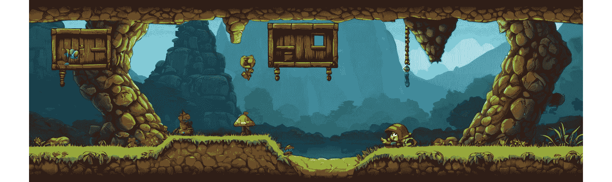
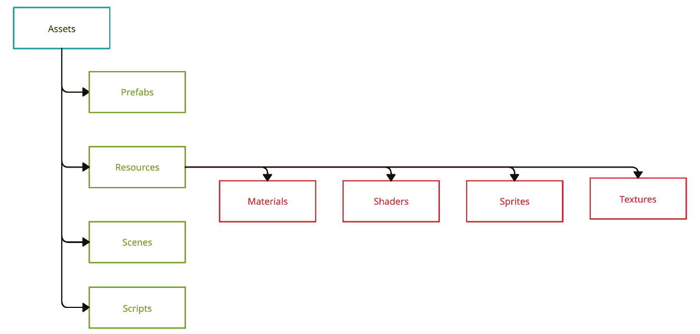
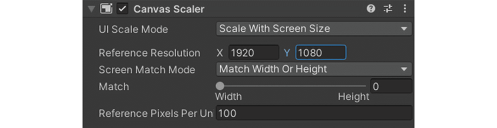
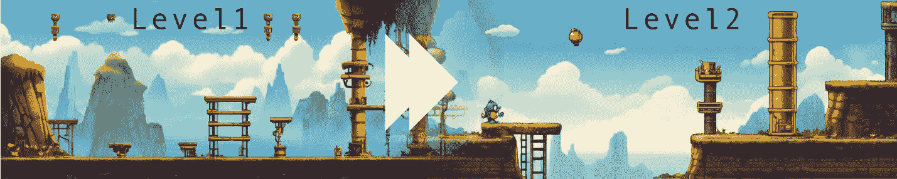

# 在 Unity 中构建完整游戏 – 核心机制、测试和提升玩家体验

我们将踏上从概念到可玩原型的激动人心的旅程，使用 Unity 将游戏从概念变为现实。目标是为您提供对游戏开发过程的全面理解，重点关注核心游戏机制的设计和实现、有效的资源整合以及彻底的测试，以确保引人入胜的玩家体验。

为了保持一致性和清晰性，我们将开发一个简单而具有说明性的示例：一个 2D 平台游戏。这个项目将作为讨论的关键概念和技术的一个实际演示。到结束时，您将拥有游戏开发原则的坚实基础，并具备创建基本平台游戏的实践经验。让我们深入探讨将我们的平台游戏冒险变为现实的过程！

在本章中，我们将探讨游戏开发的各个方面。我们将从规划和构思想法开始，然后是游戏机制的设计和实现。接下来，我们将整合资源并构建关卡，确保它们与我们的设计目标一致。最后，我们将专注于打磨游戏并进行彻底的测试，以确保提供流畅且引人入胜的玩家体验。

在本章中，我们将涵盖以下主题：

+   构想和规划游戏项目

+   设计和实现核心游戏机制

+   管理和整合各种游戏资源

+   完成并测试游戏以确保玩家体验流畅

# 技术要求

在您开始之前，请确保您的开发环境已按照*第一章*中描述的设置。这包括在您的系统上安装最新推荐的 Unity 版本和合适的代码编辑器。本书中出现的 C#代码也可以在[`github.com/PacktPublishing/Unity-6-Game-Development-with-C-Scripting`](https://github.com/PacktPublishing/Unity-6-Game-Development-with-C-Scripting)上找到。

您可以在此处找到与本章相关的示例/文件：[`github.com/PacktPublishing/Unity-6-Game-Development-with-C-Scripting/tree/main/Chapter13`](https://github.com/PacktPublishing/Unity-6-Game-Development-with-C-Scripting/tree/main/Chapter13)

# 游戏概念和规划

在深入游戏开发之前，通过仔细规划和概念化来建立一个坚实的基础至关重要。本节重点在于定义您的游戏想法、范围和开发里程碑。我们将讨论创建关键设计文档、故事板，以及选择游戏类型和目标平台。

我们将介绍我们 2D 平台游戏的核心概念，概述其主要目标和机制。然后，我们将涵盖规划阶段，包括创建一个简单的游戏设计文档和绘制初始关卡设计。这些步骤为将我们的游戏概念付诸实践提供了一个清晰的愿景和结构化的方法。

## 构想您的游戏想法

开始游戏开发的第一步是：构思你的游戏想法。这个过程涉及头脑风暴和巩固初始概念，专注于为你的游戏创造一个清晰而吸引人的愿景。一个强大的游戏概念包括选择一个吸引人的主题、背景和核心游戏机制，这些将定义玩家的体验。这个基础将指导整个开发过程，并帮助你的游戏在竞争激烈的市场中脱颖而出。

以下图像是典型的 2D 平台游戏场景。这里有一个地面层、升高层和需要玩家奔跑和跳跃才能移动的坑洞。



图 13.1 – 平台游戏的示例场景

首先，通过头脑风暴来构思想法，考虑是什么使你的游戏独一无二。思考主题和背景——是奇幻的幻想世界、后末日荒野，还是充满活力的城市景观。接下来，关注核心游戏机制：玩家将做什么？他们将如何与游戏世界互动？对于我们这个 2D 平台游戏，核心机制可能包括奔跑、跳跃和收集物品。

一个清晰的愿景至关重要。为此，用概念摘要或电梯演讲来记录你的想法。概念摘要是对你的游戏想法的简要而全面的描述，突出核心游戏机制、目标和独特功能，提供对游戏内容的快照，并在几句话中说明玩家可以期待什么。电梯演讲是对你的游戏想法的简洁、有说服力的概述，可以在电梯行程的时间内传达，通常是 30 秒到 1 分钟。

让我们分别看看概念摘要和电梯演讲的例子：

+   **概念摘要**：*平台冒险之旅是一个 2D 冒险游戏，玩家在充满挑战的关卡中穿梭，收集宝藏并避开敌人，在一个五彩斑斓、* *充满活力的世界* *中游戏*。

+   **电梯演讲**：*想象一个马里奥与现代物理谜题相遇的游戏——平台冒险之旅提供了经典平台游戏和创新* *关卡设计* *的吸引人融合体*。

一旦你有一个稳固的想法，就要对其进行细化。创建一个简短的游戏设计文档，概述主要功能和独特之处。这份文档会不断演变，但拥有一个初始版本有助于保持焦点和方向。

构思你的游戏想法是游戏开发的基本步骤。通过建立清晰的愿景和核心机制，你为成功项目奠定了基础。记住，吸引人的主题和独特的游戏元素是市场上脱颖而出的关键。有了稳固的游戏概念，现在是时候定义范围和设定开发里程碑，确保以结构化的方式将你的愿景变为现实。

## 定义范围和开发里程碑

在构思你的游戏想法之后，下一步至关重要的步骤是定义范围并设定开发里程碑。这涉及到将你的项目与可用资源、时间框架和团队能力相匹配。通过将游戏概念分解为可管理的组件并设定现实的目标，你可以确保一个结构化和高效的开发过程。

为了有效地管理你的游戏开发过程，考虑以下关键步骤：

+   **确定** **项目范围**

    首先，评估你的资源和时间框架。考虑你的开发团队的大小和技能组合，以及任何预算限制。这将帮助你确定项目范围。将游戏概念分解为核心组件，如机制、功能、故事元素和艺术资产。对于我们的 2D 平台游戏，这些组件可能包括玩家移动、关卡设计、敌人行为和可收集物品。

+   **设定** **开发里程碑**

    为每个开发阶段设定明确和可实现的里程碑。这些里程碑作为检查点，帮助你跟踪进度并根据需要做出调整。例如，早期里程碑可能包括创建基本原型、实现核心机制和设计初始关卡。后期里程碑可能包括集成声音和图形、进行游戏测试和打磨游戏。

+   **创建详细的** **游戏设计文档** （GDD）

    一个全面的**游戏设计文档**（GDD）对于在整个开发过程中保持清晰的愿景和路线图非常重要。GDD 应概述游戏的功能、机制、故事和艺术风格。它作为整个团队的参考，确保一致性和专注。包括游戏机制、关卡设计、角色设计、用户界面和视听元素的部分。

+   **管理范围和防止** **功能蔓延**

    为了防止功能蔓延——即在新功能超出原始范围的情况下添加到项目中——并保持专注，定期审查和调整项目范围。优先考虑核心游戏元素，并愿意削减或推迟非关键功能。这确保了开发保持正轨，游戏保持统一和有趣。

定义范围和设定开发里程碑是将你的游戏概念变为现实的关键步骤。通过将项目分解为可管理的组件并创建详细的 GDD，你为你的团队提供了一个清晰的路线图。定期审查范围以保持专注并防止功能蔓延，确保开发过程顺利。有了明确定义的范围和清晰的里程碑，下一步就是选择适合你游戏的适当类型和平台，与你的愿景和目标受众保持一致。

## 选择类型和平台

为你的游戏选择正确的类型和平台是一个至关重要的步骤，它影响着游戏设计和开发的许多方面。类型将塑造你的游戏机制、叙事和整体吸引力，而平台则决定了技术要求、分发渠道和潜在的市场覆盖范围。在这些领域做出明智的决定，确保你的游戏与你的愿景和资源相匹配。

在规划你的游戏时，考虑类型和平台将如何影响你的设计和开发过程：

+   **类型选择的影响**

    你选择的游戏类型直接影响着游戏的核心机制和叙事结构。例如，2D 平台游戏侧重于精确的控制、关卡设计和玩家通过跳跃和障碍物导航的进步。相比之下，**角色扮演游戏（RPG**）强调角色发展、故事深度和战略游戏。考虑你的游戏在其类型中的独特之处以及它将如何吸引你的目标受众。对于我们的游戏*Platformer Quest*，选择平台游戏类型意味着我们优先考虑创建响应式控制和设计引人入胜的关卡。

+   **选择正确的平台**

    选择合适的平台同样重要。每个平台（PC、游戏机、移动设备）都有其自身的技术要求、分发渠道和目标用户群体。PC 游戏提供了广泛的硬件能力和分发选项，如 Steam 和 Epic Games Store。游戏机提供更受控的环境，具有特定的开发工具和认证流程，但可以接触到专门的玩家群体。移动平台强调易用性和触摸控制，通过应用商店进行分发。评估你的资源和目标受众，以确定最适合你游戏的平台。

+   **将类型和平台与你的概念相匹配**

    你对类型和平台的选择应反映你的游戏概念和开发目标。确保你选择平台的技术能力可以支持你类型所需的机制和图形。对于*Platformer Quest*这款 2D 平台游戏，PC 和移动平台都是合适的，允许简单的控制和广泛的受众分发。

选择正确的类型和平台是游戏开发中的一个关键决策。类型塑造了你的游戏机制和叙事，而平台影响技术要求和市场覆盖范围。通过将这些选择与你的游戏概念和资源相匹配，你可以创建一个统一且吸引人的游戏。在确定了类型和平台后，下一步是深入设计将使你的游戏栩栩如生的游戏机制。

# 设计游戏机制

设计游戏机制是游戏开发的基本方面，它是游戏互动性和吸引力的基础。本节深入研究了制作、实施和细化定义玩家体验的核心规则、目标和交互元素。通过探索适合不同类型（如平台游戏、射击游戏和益智游戏）的多种机制，我们将揭示在 Unity 中原型设计和测试这些机制的过程。通过实际案例，包括简单平台游戏机制的开发，本节将展示运动、碰撞检测、可收集物品和敌人逻辑的关键概念。无论你是实现角色移动还是设计敌人行为，理解游戏机制对于创造引人入胜和交互式的游戏体验是基本的。

深入研究制作、实施和细化定义玩家体验的核心规则、目标和交互元素是至关重要的。通过探索适合不同类型（如平台游戏、射击游戏和益智游戏）的多种机制，我们将揭示在 Unity 中原型设计和测试这些机制的过程。理解游戏循环、反馈系统以及挑战与技能之间的平衡对于创造引人入胜的游戏体验至关重要。通过实际案例，包括简单平台游戏机制的开发，本节将展示运动、碰撞检测、可收集物品和敌人逻辑的关键概念。无论你是实现角色移动还是设计敌人行为，掌握游戏机制对于创造引人入胜和交互式的游戏体验是必不可少的。

理解游戏机制的基础对于任何游戏开发者都至关重要。这些机制塑造了玩家与游戏互动的方式，提供了结构和反馈，增强了整体体验。有了这个基础，我们可以探索如何为不同类型开发机制，确保对游戏设计的广泛和灵活理解。

## 开发不同类型的游戏机制

**设计游戏机制在各个类型中差异很大，每种类型都需要独特的策略来创造引人入胜和沉浸式的游戏体验**。通过理解核心机制如何定义平台游戏、射击游戏、益智游戏和策略游戏等类型，开发者可以创造满足玩家期望并与游戏主题相符的体验。

不同的游戏类型强调创建引人入胜游戏体验的核心机制的基本要素：

+   **平台游戏**

    平台游戏是一种视频游戏类型，玩家通过奔跑和跳跃来导航充满障碍和敌人的关卡。

    这里是平台游戏的核心机制：

    +   角色移动（跳跃、奔跑）

    +   碰撞检测

    +   关卡进度

    **使用示例**：实现精确的跳跃机制以在平台上导航并避开障碍。

+   **射击游戏**

    射击游戏是一种以战斗为重点的视频游戏类型，玩家使用各种武器击败敌人，强调准确性和战略性地使用武器库。

    下面是射击游戏的核心机制：

    +   射击精度

    +   武器多样性

    +   敌人 AI

    *使用示例*：设计响应式控件和多样化的武器，以增强玩家的战斗体验。

+   **解谜**

    解谜游戏是一种挑战玩家使用逻辑和问题解决技能解决问题和完成任务的视频游戏类型，通常涉及难度逐渐增加的关卡。

    下面是解谜游戏的核心机制：

    +   问题解决

    +   逻辑挑战

    +   等级设计

    *使用示例*：创建直观的谜题，随着复杂性的增加以保持玩家的兴趣。

+   **策略游戏**

    策略游戏是一种强调规划、资源管理和战术决策以实现长期目标和战胜对手的视频游戏类型。

    下面是策略游戏的核心机制：

    +   资源管理

    +   单位控制

    +   战术决策

    *使用示例*：开发资源分配和战略规划系统，以吸引玩家参与长期游戏。

开发针对特定游戏类型的机制确保游戏玩法既吸引人又符合玩家的期望。通过关注定义每个类型的核心机制，开发者可以创造独特且愉快的体验。接下来，我们将探讨如何在 Unity 中原型设计和实现这些机制，通过实际应用将我们的游戏想法变为现实。

## 在 Unity 中原型设计和实现机制

在 Unity 中原型设计和实现游戏机制是游戏开发的关键步骤，它允许开发者将他们的想法变为现实。本节侧重于这一过程的实际方面，从最初的纸面原型到完全功能性的数字版本。我们将探讨 Unity 的工具和功能，例如物理引擎、输入系统和动画，并提供一个在平台游戏中开发基本跳跃机制的分步示例。

## 开发核心机制

设计和实现游戏机制是游戏开发的重要一步，它是玩家互动和参与的基础。在本节中，我们将探讨使用 Unity 原型设计游戏机制的过程，包括帮助将您的想法变为现实的各种工具和技术。通过关注 2D 平台游戏，我们将展示如何实现和细化核心机制。

从简单的纸面原型开始，以概念化机制并测试基本想法。过渡到 Unity 中的数字原型，以可玩格式精炼和测试机制。使用 Unity 的工具，您可以快速迭代您的游戏机制，确保它们按预期工作。

### 使用 Unity 的工具进行原型设计

Unity 提供了一系列用于高效原型设计游戏机制的工具。这些工具允许你模拟和测试游戏的各种方面，确保开发过程顺利：

+   **物理引擎**：利用 Unity 的物理引擎来处理碰撞检测和物理交互。

+   **输入系统**：实现 Unity 的输入系统以捕获玩家动作，如移动和跳跃。

+   **动画**：使用 Unity 的动画工具创建平滑且响应灵敏的角色移动。

通过利用这些工具，你可以创建一个能够准确反映游戏机制的功能原型，并允许进行彻底的测试和迭代。

以下是一些示例 C# 脚本，它们实现了刚才讨论的原型设计策略。

### 样本平台脚本

以下是一些示例脚本，对于原型设计 2D 平台游戏至关重要。这些脚本涵盖了核心机制，如玩家移动、可收集物品、敌人行为和 UI 管理，帮助您在 Unity 中理解和实现这些功能：

+   `PlayerMovement` 脚本，对于控制游戏中的角色动作和交互非常重要：

    ```cs
    // PlayerMovement.cs
    using UnityEngine;
    public class PlayerMovement : MonoBehaviour
    {
        public float speed = 5f;
        public float jumpForce = 7f;
        private Rigidbody2D rb;
        private bool isGrounded;
        void Start()
        {
            rb = GetComponent<Rigidbody2D>();
        }
        void Update()
        {
            float moveInput = Input.GetAxis("Horizontal");
            rb.velocity = new Vector2(moveInput * speed,
                          rb.velocity.y);
            if (isGrounded && Input.GetKeyDown(KeyCode.Space))
            {
                rb.velocity = Vector2.up * jumpForce;
            }
        }
        private void OnCollisionEnter2D(Collision2D collision)
        {
            if (collision.gameObject.CompareTag("Ground"))
            {
                isGrounded = true;
            }
        }
        private void OnCollisionExit2D(Collision2D collision)
        {
            if (collision.gameObject.CompareTag("Ground"))
            {
                isGrounded = false;
            }
        }
    }
    ```

    此脚本处理基本的玩家移动和跳跃。`PlayerMovement` 脚本使用 Unity 的 `Rigidbody2D` 组件应用基于物理的运动。`Update` 方法捕获水平输入并应用到玩家角色。当玩家在地面上按下空格键时，会触发跳跃机制。在 Unity 编辑器中将 `PlayerMovement` 脚本附加到玩家角色。确保玩家具有 `Rigidbody2D` 组件和 2D 碰撞器以与地面交互。

+   `Collectibles` 脚本，对于添加增强游戏玩法和玩家参与度的交互式项目至关重要：

    ```cs
    // Collectibles.cs
    using UnityEngine;
    public class Collectibles : MonoBehaviour
    {
        void OnTriggerEnter2D(Collider2D other)
        {
            if (other.CompareTag("Player"))
            {
                // Logic for collecting the item
                Destroy(gameObject);
            }
        }
    }
    ```

    此脚本管理游戏中的可收集物品。当玩家角色与可收集物品碰撞时，物品将被销毁，模拟收集过程。将 `Collectibles` 脚本附加到游戏中的可收集物品。确保物品具有具有 `Enemy` 脚本的碰撞器，这对于在游戏中创建动态挑战和交互至关重要：

    ```cs
    // Enemy.cs
    using UnityEngine;
    public class Enemy : MonoBehaviour
    {
        public float speed = 2f;
        private bool movingRight = true;
        public Transform groundDetection;// Child object of the 
          enemy for ground detection
        void Update()
        {
            transform.Translate(Vector2.right * speed * Time
              .deltaTime);
            RaycastHit2D groundInfo =
            Physics2D.Raycast(groundDetection.position, Vector2
              .down, 2f);
            if (groundInfo.collider == false)
            {
                if (movingRight)
                {
                    transform.eulerAngles = new Vector3(0, -180, 0);
                    movingRight = false;
                }
                else
                {
                    transform.eulerAngles = new Vector3(0, 0, 0);
                    movingRight = true;
                }
            }
        }
    }
    ```

    此脚本控制基本敌人的移动，使敌人来回巡逻。当敌人到达平台边缘时，它会改变方向。将 `Enemy` 脚本附加到游戏中的敌人角色。确保敌人具有 2D 碰撞器和 `Rigidbody2D` 组件。

+   `UIManager` 脚本，对于管理和显示游戏信息（如玩家的得分）至关重要：

    ```cs
    // UIManager.cs
    using UnityEngine;
    using TMPro;
    public class UIManager : MonoBehaviour
    {
        public TextMeshProUGUI scoreText;
        private int score = 0;
        void Start()
        {
            UpdateScoreText();
        }
        public void IncrementScore(int amount)
        {
            score += amount;
            UpdateScoreText();
        }
        void UpdateScoreText()
        {
            scoreText.text = "Score: " + score.ToString();
        }
    }
    ```

    此脚本管理游戏的用户界面，特别是得分显示。每当得分变化时，它会更新得分文本。将 `UIManager` 脚本附加到游戏中的 UI 管理器对象。在 Unity 编辑器中将 `scoreText` 字段链接到适当的 UI Text 游戏对象。

让我们从脚本编写阶段过渡到将这些机制集成到您的 Unity 项目中。

下面是逐步实现的步骤：

1.  `PlatformerPrototype`。

1.  为了组织项目，在`脚本`、`预制体`和`UI`中。

1.  要创建 UI 画布，请执行以下操作：

    1.  在`Canvas`对象上右键单击。

    1.  将**Canvas**设置为**Screen Space -** **Overlay**。

+   `玩家`对象：

    1.  在`玩家`上右键单击。

    1.  将`Sprite Renderer`组件添加到`玩家`对象中并分配一个精灵。*   附加`PlayerMovement`脚本：

    1.  将`PlayerMovement.cs`脚本移动到`PlayerMovement`脚本。

    1.  将`Rigidbody2D`组件和`BoxCollider2D`组件添加到`玩家`对象中。*   `可收集`对象：

    1.  在`可收集`上右键单击。

    1.  设置精灵并调整可收集物品的大小。*   附加`Collectibles`脚本：

    1.  将`Collectibles.cs`脚本移动到`可收集`对象中，点击`Collectibles`脚本。

    1.  添加`BoxCollider2D`组件并勾选`Is` `Trigger`选项。*   复制可收集物品：

复制`可收集`对象以创建多个实例并将它们放置在场景中。

+   `敌人`对象：

    1.  在`敌人`上右键单击。

    1.  将`Sprite Renderer`组件添加到`敌人`对象中并分配一个精灵。*   附加`敌人`脚本：

    1.  将`Enemy.cs`脚本移动到`敌人`对象中，点击`敌人`脚本。

    1.  将`Rigidbody2D`组件和`BoxCollider2D`组件添加到`敌人`对象中。*   设置地面检测：

    1.  在`敌人`对象下创建一个作为子对象的`empty GameObject`并将其命名为`GroundDetection`。

    1.  将其放置在`敌人`对象下方以检测地面。将此对象分配给`敌人`脚本中的`groundDetection`字段。*   复制敌人：

复制`敌人`对象以创建多个实例并将它们放置在场景中。

+   `得分文本`。*   自定义文本（字体、大小、颜色）并将其放置在期望的位置。*   附加`UIManager`脚本：

    1.  将`UIManager.cs`脚本移动到`UIManager`并附加`UIManager`脚本。

    1.  将`得分文本`对象拖入`UIManager`脚本中。

上述实现提供了一个开发 2D 平台游戏简单片段的逐步指南。确保在继续开发游戏的过程中测试和改进这些机制。

在 Unity 中原型设计和实现游戏机制涉及使用各种工具和功能来使你的想法变为现实。通过遵循这些示例并了解如何利用 Unity 的功能，你可以创建功能性和吸引人的游戏机制。接下来，我们将讨论将资产和关卡集成到你的游戏中以构建一个统一和沉浸式的世界。

# 集成资产和关卡

将资产和层级整合是让你的游戏栩栩如生的重要步骤，因为它涉及到在游戏世界中填充视觉、听觉和交互元素，以增强游戏体验。本节将指导你如何在 Unity 中管理和整合图形资产、动画、音频和 UI 元素。我们将深入探讨游戏层级的创建和设计，利用 Unity 的场景编辑器和资产商店来构建沉浸式环境。此外，我们还将提供关于如何组织项目以高效处理多个资产和层级的见解，并通过一个展示全面资产整合的示例项目进行说明。从导入 2D 精灵到添加音效和设计关卡，本节将为你提供创建一个连贯且引人入胜的游戏世界的知识。

## 管理和整合图形资产

有效管理和整合图形资产对于创建视觉吸引力和高性能的游戏至关重要。本节将涵盖将精灵、纹理和模型导入 Unity 的最佳实践，优化性能和视觉保真度。我们还将探索 Unity 资产商店和其他资源以获取资产，并提供在 Unity 编辑器中组织资产以保持整洁和可管理项目结构的技巧。

## 导入资产

当将资产导入 Unity 时，遵循最佳实践至关重要，以确保它们正确的大小和格式。例如，使用 PNG 格式为精灵和 JPEG 格式为纹理以保持质量和性能。此外，应应用适当的导入设置以优化性能和视觉保真度。这包括调整纹理和精灵的分辨率、压缩和米柏设置，以实现质量和效率之间的理想平衡。

将资产导入 Unity 的过程很简单：将它们拖放到 Unity 项目窗口中。使用检查器面板对每种资产类型进行精细调整导入设置，以确保最佳性能和视觉效果。这允许你自定义每个资产的处理和渲染方式，确保它们在游戏中表现最佳。

现在，为了确保在将资产导入 Unity 时获得最佳性能和视觉效果，遵循最佳实践非常重要。

下面是 Unity 中导入资产的步骤：

+   首先开始，将它们拖放到 Unity 项目窗口中。这个过程简单直接，允许你快速将各种类型的资产添加到你的项目中。

+   一旦资产被添加到项目中，就非常重要在检查器面板中调整每种资产类型的导入设置。这一步骤确保每个资产都针对性能和视觉质量进行了优化，这对游戏的整体效率和外观有显著影响。微调这些设置，如分辨率、压缩和米柏映射，有助于在性能和视觉保真度之间达到理想的平衡，确保游戏运行流畅且视觉效果最佳。

下面是导入资产的最佳实践：

+   首先，确保资产大小和格式正确，例如使用 PNG 格式为精灵，JPEG 格式为纹理。

+   接下来，应用适当的导入设置以优化性能和视觉保真度。这涉及到调整纹理和精灵的分辨率、压缩和米柏映射等设置，以达到质量和效率之间的理想平衡。

接下来，让我们看看如何在 Unity 中组织资产。

## 在 Unity 中组织资产

在 Unity 中保持资产组织有序且易于访问的核心是创建清晰的文件夹结构。为文件夹和文件使用描述性名称有助于避免混淆，并确保所有团队成员都能快速找到和管理必要的资产。这种做法不仅简化了开发过程，还提高了整体项目的效率和可维护性。

下面是一个 Unity 项目文件夹结构的示例：



图 13.2 – Unity 资产文件夹布局

上述图表显示了包含四个子文件夹“预制体”、“资源”、“场景”和“脚本”的“资产”文件夹。在“资源”下，我们看到更多子文件夹，如“材质”、“着色器”、“精灵”和“纹理”。虽然可以创建多层子文件夹，但这是不被推荐的。

正确管理和集成图形资产对于保持游戏中的性能和视觉保真度至关重要。通过遵循导入资产的最佳实践，利用 Unity 资产商店和其他资产库等资源，以及有效地组织项目，您可以创建一个流畅且高效的开发流程。接下来，我们将探讨如何集成动画和音频，以进一步增强游戏的沉浸式体验。

# 集成动画和音频

集成动画和音频对于使游戏世界栩栩如生，为玩家创造沉浸和动态体验至关重要。本节将探讨如何使用 Unity 的工具来动画化角色和对象，以及如何添加与游戏机制和叙事相辅相成的音效和音乐。

在 Unity 中为角色和对象创建动画，您将使用**Animator**和**Animation**组件。**Animator**组件允许您控制动画的流程，通过转换和条件连接不同的动画状态。例如，您可以为角色创建空闲、行走和跳跃动画，并使用 Animator 根据玩家输入在这些状态之间切换。另一方面，**Animation**组件用于简单的动画，例如沿路径移动对象或上下缩放对象。通过结合这些工具，您可以创建流畅且响应迅速的动画，从而增强游戏的视觉吸引力。

对于音频，Unity 提供了**Audio Source**和**Audio Listener**组件。**Audio Source**组件用于播放音效和音乐，而**Audio Listener**组件作为游戏的“耳朵”，通常附加到主摄像机或玩家角色上。为跳跃、收集物品或敌人交互等动作添加音效可以极大地增强玩家的体验，通过提供即时反馈并使游戏世界感觉更加生动。背景音乐设定了氛围和基调，帮助玩家沉浸在游戏的叙事和氛围中。

创建沉浸式的视听体验不仅仅是添加动画和声音。它需要仔细的同步和平衡，以确保这两个元素相互补充，并增强整体游戏体验。动画应该流畅且响应迅速，与音效的节奏和强度相匹配。同样，音频级别应该调整以避免压倒视觉效果或游戏玩法，保持和谐平衡，从而增强玩家的参与度。

有效地融入动画和音频对于创建生动和吸引人的游戏世界至关重要。通过利用 Unity 的**Animator**和**Animation**组件进行动画，以及**Audio Source**和**Audio Listener**组件进行音频，您可以制作出动态和沉浸式的体验，与游戏机制和叙事相得益彰。接下来，我们将讨论设计**用户界面**（**UIs**）以进一步增强玩家交互和可用性。

## 设计用户界面

创建和集成 UI 元素，如菜单、HUD 和交互式组件，对于增强玩家交互和可用性至关重要。本节将深入探讨使用 Unity 的 UI 系统（uGUI）进行布局管理、UI 动画和事件处理。我们还将讨论设计响应式和直观的 UI 的重要性，这些 UI 能够适应不同的屏幕尺寸和分辨率，确保在各种设备上提供一致的游戏体验。

设计有效的 UI 始于深思熟虑的布局管理。决定每个屏幕上需要显示哪些元素，例如生命值条、得分显示和导航菜单。以视觉上吸引人且易于玩家理解的方式组织这些元素。Unity 的`Canvas`组件允许你管理整体布局，而`RectTransform`组件有助于根据屏幕定位和调整 UI 元素的大小。将相关元素分组，并使用对齐工具确保整洁有序的外观。

UI 动画为用户界面增添了动态层次，使交互更加吸引人。利用 Unity 的 Animator 组件创建不同 UI 状态之间的平滑过渡，例如打开和关闭菜单或突出显示选定的项目。这些动画应增强用户体验，而不会分散注意力或造成负担。例如，微妙的淡入效果可以使菜单出现得更加平滑，而弹跳动画可以在按钮被点击时提供反馈。

事件处理是 UI 设计的关键方面之一。Unity 的**事件系统**以及**按钮**、**切换**和**滑块**等组件允许你创建对玩家输入做出响应的交互式元素。实现事件监听器来处理用户操作，例如点击按钮或拖动滑块，确保界面响应灵敏且直观。彻底测试这些交互有助于识别任何问题，并确保 UI 按预期行为。



图 13.3 – Canvas Scaler 组件

确保你的 UI 能够适应不同的屏幕尺寸和分辨率，这对于在多种设备上保持一致的玩家体验至关重要。使用 Unity 的`Canvas Scaler`组件根据屏幕分辨率自动调整 UI 元素的大小。设计具有灵活布局的 UI，以便适应横屏和竖屏方向，并在多台设备上进行测试以确保兼容性。考虑移动设备的触摸输入，并确保元素足够大，以便容易点击。

有效的 UI 设计涉及对布局、动画和事件处理的仔细考虑，以创建响应灵敏且直观的界面。通过利用 Unity 的 UI 系统（uGUI）并确保在不同屏幕尺寸和分辨率上的适应性，你可以增强玩家体验并保持各种设备的一致性。接下来，我们将探讨创建和组织游戏关卡的过程，以进一步发展你的游戏世界和结构。

## 创建和组织游戏关卡

设计和组织游戏关卡是游戏开发中的一个关键方面，它极大地影响了玩家的体验和参与度。虽然关卡设计可能是一个复杂的领域，通常需要广泛的培训和协作，但本节提供了在 Unity 中创建游戏关卡的基本概念和实践的概述。我们将探讨使用场景编辑器来构建游戏环境、放置对象和设置关卡特定机制，以及高效的场景管理以加载和过渡到不同关卡。

以下图像显示了平台游戏中两个不同关卡的一个示例，中间标明了过渡。



图 13.4 – 从关卡 1 过渡到关卡 2

平台游戏只包含一个关卡的情况很少见。设计过程中的一部分是预测如何让玩家从一个关卡过渡到下一个关卡。上面的例子展示了从关卡 1 到关卡 2 的简单流程。其他过渡可能包括梯子或楼梯、洞穴或气球。

在 Unity 中创建游戏关卡始于场景编辑器，这是一个用于构建和排列游戏环境的强大工具。在场景编辑器中，你可以放置对象、设置照明并设计每个关卡的设计布局。首先导入你的图形资产并将它们排列以创建所需的环境。使用预制件来管理可重复使用的元素，如平台、障碍物和装饰，确保你在关卡设计中的一致性和效率。

放置对象和设置关卡特定机制不仅涉及资产的位置。考虑游戏流程以及玩家如何与环境互动。实现触发器、碰撞体和脚本以创建交互元素，例如当开关被激活时打开的门或巡逻特定区域的敌人。可以利用 Unity 的物理和 NavMesh 系统来处理移动和碰撞检测，增强关卡的真实性和功能性。

场景管理对于处理加载和关卡之间的过渡至关重要。Unity 的`SceneManager`类允许你异步加载场景，提供平滑的过渡而不会打断游戏。在 Unity 项目中通过创建清晰的文件夹结构、将相关场景分组并赋予描述性名称来组织你的关卡。这种组织不仅简化了导航，还有助于管理场景之间的依赖和引用。

为了说明有效的关卡设计和场景组织，让我们考察一个名为*JumpQuest*的简单平台游戏的特定案例研究。在*JumpQuest*中，我们首先创建主菜单场景，然后创建几个难度逐渐增加的关卡。

下面是 JumpQuest 案例研究的详细情况：

+   **主菜单场景**：首先设计一个包含开始游戏、查看说明和调整设置选项的主菜单。这个场景为游戏设定了基调，并为玩家提供了一个导航中心。

+   **关卡设计**：在 *JumpQuest* 的每个关卡场景中，都包含平台、可收集物品和敌人，它们被安排成逐渐挑战玩家的形式。例如，第 1 级引入了基本的跳跃机制和简单的敌人，而第 2 级则增加了移动平台和更复杂的敌人行为。

+   **与预制体的兼容性**：使用预制体来保持关卡之间的统一性。例如，为标准平台、可收集的硬币和基本敌人创建预制体。这确保了常见元素在每一级的表现一致，并且可以轻松更新。

+   `场景管理器`。当玩家到达关卡末尾时，`场景管理器`会加载下一个场景，提供无缝的游戏体验。例如，完成第 1 级后，玩家会平稳过渡到第 2 级。

通过遵循 *JumpQuest* 案例研究中的先前结构化方法，您可以有效地设计和组织游戏关卡，确保玩家体验连贯且引人入胜。

在 Unity 中创建和组织游戏关卡涉及使用场景编辑器构建环境、放置对象和设置关卡特定的机制。有效的场景管理确保了关卡之间的平滑过渡，提升了整体玩家体验。虽然本节提供了一个概述，但关卡设计是一个广泛且复杂的领域，通常需要大量的培训和团队合作。接下来，我们将讨论如何精炼和测试您的游戏，以确保它达到最高的质量标准，并为玩家提供愉快的体验。

# 精炼和测试

游戏开发的最后阶段是精炼和测试，这对于完善游戏和提升玩家体验是必要的。本节将深入探讨测试、修复错误和精炼游戏元素的迭代过程，以确保最终产品的高质量。我们将探讨各种测试技术，如游戏测试和用户测试，并讨论 Unity 中可以帮助这一过程的工具，包括用于性能测试的 Unity Profiler。在精炼阶段，将强调反馈的重要性，以及将反馈融入以改善游戏玩法、控制和游戏整体感觉的策略。将特别关注实现基本用户界面、进行彻底的游戏测试，以及添加最终细节，如粒子效果和屏幕过渡，以创造一个精炼且愉悦的游戏体验。

## 实施测试策略

有效的测试策略对于游戏开发过程至关重要，确保游戏功能正常、引人入胜且无重大问题。本节将概述各种测试策略，包括单元测试、集成测试和试玩测试。我们将讨论每种类型的作用和好处，特别关注试玩测试和用户测试作为收集关于游戏体验可操作反馈的重要方法。您将学习如何组织和进行有效的试玩测试，包括选择多样化的玩家群体、准备测试环境和收集反馈。

在游戏开发中，不同的测试策略用于在生产的不同阶段识别和解决问题。

单元测试涉及在隔离状态下测试单个组件或系统，以确保它们正确运行。这种测试形式对于验证游戏的基本构建块是否稳定和可靠是必要的。

以下是一个示例单元测试，以说明这一概念：

```cs
[Test]
public void SaveLoadTest()
{
    GameData originalData = new GameData();
    originalData.Score = 100;
    SaveSystem.SaveGame(originalData);
    GameData loadedData = SaveSystem.LoadGame();
    Assert.AreEqual(originalData.Score, loadedData.Score);
}
```

这个单元测试验证了游戏保存和加载功能正确地保留了玩家的分数。

集成测试检查不同组件之间的交互，确保它们按预期协同工作。这一步骤对于识别可能由多个系统的集成引起的问题至关重要。

试玩测试和用户测试可能是完善游戏体验最重要的方法。试玩测试涉及让玩家与游戏互动，以识别错误、可用性问题以及改进领域。这个过程可以发现开发者可能忽略的问题，为玩家如何体验游戏提供宝贵的见解。

用户测试通过关注游戏的具体方面，如用户界面或特定机制，来收集关于其有效性和娱乐性的详细反馈。

组织有效的试玩测试需要周密计划。首先，选择一个多样化的玩家群体，以确保广泛的视角。这个群体应包括经验丰富的游戏玩家和初学者，以提供对游戏可访问性和吸引力的全面看法。准备一个尽可能模拟真实世界游戏条件的测试环境，确保硬件和软件配置代表目标受众使用的配置。

在游玩测试会议期间，观察玩家如何与游戏互动，注意他们遇到的问题以及他们的整体反应。鼓励玩家在游玩时表达他们的想法和感受，而不要干预，以收集无偏见的反馈，因为这可以提供更深入的了解他们的体验。系统地收集反馈，使用调查或访谈来收集有关游戏特定方面的详细信息。这些反馈对于确定需要改进的领域和做出明智的变更决策至关重要。

实施各种测试策略，从单元测试和集成测试到全面的游玩测试和用户测试，对于确保游戏精致且令人愉悦至关重要。通过组织有效的游玩测试会议并收集多样化的反馈，开发者可以识别并解决影响游戏体验的问题。接下来，我们将探讨如何利用 Unity 工具进行测试和调试，提高测试流程的效率和效果。

## 利用 Unity 工具进行测试和调试

Unity 提供了一套强大的工具集，旨在在整个游戏开发过程中促进高效的测试和调试。本节将深入探讨这些工具和功能，例如 Unity Profiler、Unity 测试框架和控制台窗口，这些对于跟踪运行时错误和警告至关重要。我们将讨论如何利用这些工具来识别和诊断游戏中的性能问题、错误和其他问题。此外，还将提供一些实用技巧，介绍如何有效地使用这些工具来简化测试和调试过程。

Unity 提供了多个强大的工具，以帮助开发者测试和调试他们的游戏。

让我们更深入地了解这些工具：

+   Unity Profiler 是性能分析的关键工具，允许开发者实时监控游戏的各个方面。它提供了关于 CPU 和 GPU 使用、内存分配、渲染等方面的详细信息。通过分析这些数据，开发者可以确定性能瓶颈，并优化他们的代码和资源，以确保流畅的游戏体验。

+   Unity 测试框架是另一个非常有价值的工具，它支持为您的游戏创建自动化测试。此框架允许开发者编写和运行单元测试和集成测试，确保各个组件及其交互按预期工作。自动化测试有助于在开发早期阶段捕捉问题，减少手动测试所需的时间和精力。编写全面的测试用例并定期运行它们可以显著提高游戏的可稳定性和可靠性。

+   Unity 中的控制台窗口是跟踪运行时错误和警告的不可或缺的功能。它提供了在游戏过程中出现的问题的实时反馈，显示错误消息、堆栈跟踪和其他相关信息。通过监控控制台，开发者可以快速识别并解决影响游戏功能的问题。此外，使用`Debug.Log`、`Debug.Warning`和`Debug.Error`方法允许开发者将自定义消息输出到控制台，有助于诊断特定问题。

利用 Unity 的测试和调试工具，如 Profiler、测试框架和控制台，对于识别和解决游戏中的性能问题、错误和其他问题至关重要。为了充分利用这些工具，采用高效的做法很重要。在开发过程中定期对游戏进行性能分析有助于保持最佳性能，而设置自动测试确保新更改不会引入回归。将控制台定制以过滤特定类型的消息可以帮助开发者专注于关键问题，而不会被不那么重要的警告所淹没。此外，将这些工具集成到开发工作流程中，例如使用版本控制钩子自动运行测试，可以简化测试和调试过程，确保游戏经过精心打磨且质量上乘。接下来，我们将探讨如何将反馈融入游戏并进行润色，重点关注改进游戏元素和提升整体玩家体验。

## 将反馈融入游戏并对其进行润色

游戏开发的最后步骤将一款好游戏转变为一款伟大的游戏。将反馈融入游戏并对其进行润色确保了游戏引人入胜且令人愉悦。本节涵盖了反馈的重要性、如何分析它以及改进游戏玩法机制、视觉效果、音效和 UI/UX 的迭代过程。反馈在游戏开发中至关重要。从测试玩家、公测玩家和团队那里收集意见可以提供关于游戏如何被感知以及需要改进之处的见解。分析反馈涉及按紧急性、可行性和影响对其进行分类，使开发者能够优先调整。

一旦分析完反馈，润色阶段就开始了。这包括微调游戏玩法机制以确保平衡和乐趣，增强视觉效果以实现统一的美学，以及优化音效和 UI/UX 以提供愉悦的体验。测试和改进的迭代过程确保了直到最终发布前的持续改进。将反馈融入游戏并对其进行润色是游戏开发中的关键步骤。通过分析和优先处理反馈，开发者可以提升游戏玩法、视觉效果、音效和 UI/UX，确保游戏达到或超过玩家的期望。

# 摘要

在本章中，我们开始了在 Unity 中构建完整游戏之旅，从最初的概念到可玩的原型。我们首先从构思和规划游戏项目的基础步骤开始，确保为成功开发打下坚实的基础。随后，我们深入设计和实现核心游戏机制，这对于创造引人入胜和互动的游戏体验至关重要。本章还涵盖了有效管理并整合各种游戏资产的有效策略，包括图形、音频和 UI 元素，以构建一个统一且沉浸式的游戏环境。我们通过聚焦于游戏抛光和测试的必要阶段，强调了迭代开发和彻底测试的重要性，以提升玩家体验并确保流畅的游戏体验。通过开发简单平台游戏等实际示例和最佳实践，本章为在 Unity 中创建完整游戏提供了全面的指南。接下来，我们将探索 Unity 中**扩展现实**（**XR**）的激动人心的可能性，深入探讨使用尖端技术创建沉浸式体验。

# 进一步阅读

+   **Itch.io**：这里托管了众多独立开发者提供的免费和付费资产和游戏

    URL: [`itch.io/`](https://itch.io/)

+   **Kenney**：这里提供了各种免费游戏资产，包括精灵、瓦片集和 3D 模型

    URL: [`www.kenney.nl/`](https://www.kenney.nl/)

+   **OpenGameArt**：这是一个由社区驱动的网站，为各种游戏类型提供免费资产

    URL: [`opengameart.org/`](https://opengameart.org/)

+   **Unity Documentation**：Unity 的官方文档

    URL: [`docs.unity3d.com/Manual/index.html`](https://docs.unity3d.com/Manual/index.html)

+   **Unity Learn**：Unity 的官方培训网站

    URL: [`learn.unity.com/`](https://learn.unity.com/)
