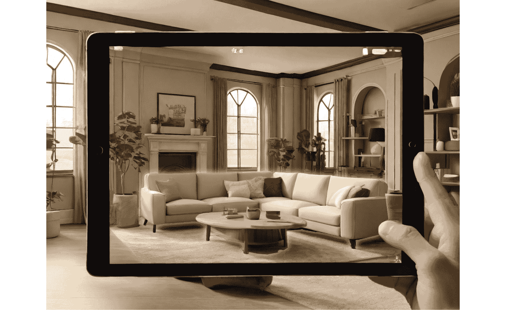

# 14

# 探索 Unity 中的 XR – 开发虚拟和增强现实体验

与 Unity 一起踏上激动人心的**扩展现实**（**XR**）之旅，您将学习如何创建 VR 和 AR 体验。本章将为您奠定 VR 的基本原则，指导您完成构建沉浸式 VR 环境所需的设置和配置。然后，您将进入实现 AR 功能、理解跟踪机制以及将数字增强集成到物理世界中的阶段。您将发现如何设计专为 VR/AR 量身定制的交互元素，增强用户参与度和沉浸感。本章以优化 VR/AR 应用程序的策略结束，以确保在各种设备上实现流畅的性能。本章中的示例将包括开发交互式 VR 体验和创建具有真实世界物体交互的 AR 应用程序。最佳实践和用例将强调用户舒适度、可访问性和沉浸式体验性能优化的重要性。

本章我们将涵盖以下主题：

+   理解 Unity 中的 VR 原则和设置

+   实现 AR 功能和跟踪

+   为 VR/AR 设计交互元素

+   优化 VR/AR 应用程序以适应不同设备

# 技术要求

在开始之前，请确保您的开发环境已按照*第一章*中描述的设置完成。这包括在您的系统上安装最新推荐的 Unity 版本和合适的代码编辑器。

## 硬件要求：

+   台式计算机：

    +   支持至少 DX10（着色器模型 4.0）的显卡

    +   至少 8 GB RAM 以实现最佳性能

+   AR 设备：

    +   iPhone（支持 ARKit）

    +   与 ARCore 兼容的其他智能手机和平板电脑（例如，选择 Android 设备）

+   VR 设备：

    +   Oculus Quest 3 VR 头戴式设备

    +   HTC Vive VR 头戴式设备

    +   微软 HoloLens 混合现实设备

## 软件要求：

+   **Unity 编辑器**：使用从*第一章*安装的 Unity 编辑器版本，理想情况下是最新**长期支持**（**LTS**）版本

+   **代码编辑器**：Visual Studio 或 Visual Studio Code，应已根据初始设置集成 Unity 开发工具

您可以在此处找到与本章相关的示例/文件：[`github.com/PacktPublishing/Unity-6-Game-Development-with-C-Scripting/tree/main/Chapter14`](https://github.com/PacktPublishing/Unity-6-Game-Development-with-C-Scripting/tree/main/Chapter14)

# Unity 中 VR 的基础知识

开始你的虚拟现实开发之旅，通过全面介绍 VR，涵盖基本概念、硬件要求和 Unity 环境设置。本节将指导你通过 Unity 配置 VR 设备，探索可用的 VR SDKs，并设置一个简单的 VR 场景。理解 VR 的沉浸性至关重要，因此我们将深入探讨空间感知、移动和基本交互原则。到本节结束时，你将在 Unity 中的 VR 领域拥有坚实的基础，准备好创建引人入胜和交互式的 VR 体验。

**虚拟现实**（**VR**）是一种变革性技术，它将用户沉浸在计算机生成的环境中，提供从游戏到模拟和教育工具的各种体验。本小节提供了一个关于 VR 的基础概述，包括其历史、关键概念和主要组件，为在 Unity 中更深入地讨论 VR 开发奠定基础。

VR 拥有丰富的历史，从 20 世纪 60 年代的早期实验系统发展到我们今天看到的复杂头戴设备和应用程序。其核心目标是创造一种沉浸式体验，使用户感觉仿佛他们真的身处一个数字世界中，以现实生活中的方式与环境及物体互动。VR 系统的关键组件包括**头戴式显示器**（**HMDs**）、控制器和跟踪系统。HMDs，如 Oculus Rift 和 HTC Vive，提供立体显示和宽阔的视野，这对于沉浸感至关重要。控制器和跟踪系统使虚拟世界的交互成为可能，捕捉手部动作并将它们转换为 VR 环境。

下面的截图显示了**XR Origin**组件，展示了其在 VR 环境中配置相机和控制器输入的设置。


图 14.1 – 附着于游戏对象的 XR Origin 组件

**XR Origin**组件是配置 Rig Base 游戏对象的地方，该对象作为 VR 环境的中心。你还可以设置地板偏移和相机。通常，**跟踪原点模式**设置为**设备**。最后，**相机 Y 偏移**表示从地板到平均眼高的距离，大约为**1.36144**米。

VR 的沉浸式特性使其区别于其他技术。通过调动多个感官并提供交互式体验，VR 可以将用户带入全新的世界。这不仅对游戏领域有深远的应用，还涉及教育、医疗和房地产等领域。例如，VR 可以用于模拟手术过程以培训医生，或为潜在买家创建虚拟房产游览。在佛罗里达州坦帕市，一位房地产开发商甚至为潜在客户生成了一个城市的数字孪生（[`www.unrealengine.com/en-US/spotlights/transforming-real-estate-visualization-with-an-xr-based-digital-twin-of-tampa`](https://www.unrealengine.com/en-US/spotlights/transforming-real-estate-visualization-with-an-xr-based-digital-twin-of-tampa)）。该项目在 Unreal Engine 网站上详细介绍了基于 XR 的数字孪生如何改变房地产可视化。尽管这个特定的例子使用了 Unreal Engine，但类似的项目也可以在 Unity 中构建，通常采用结合两种引擎优势的混合方法。

理解 VR 的基础概念，包括其历史、关键组件和沉浸式特性，对于任何涉足 VR 开发的人来说都是至关重要的。本概述为在 Unity 中设置 VR 环境的实际步骤奠定了基础。接下来，我们将深入探讨在 Unity 中设置 VR 环境，我们将配置必要的工具和设置以开始构建 VR 应用程序。

## 在 Unity 中设置 VR 环境

为 VR 开发配置 Unity 项目涉及几个技术步骤，以确保流畅和高效的工作流程。本节将指导您完成初始设置，包括选择适当的构建设置和平台特定考虑。我们将讨论集成和配置**虚拟现实软件开发工具包**（**VR SDKs**）如 Oculus、SteamVR 和 Unity 的 XR 交互工具包，并提供设置基本 VR 场景的教程。

首先，让我们看看初始设置：

1.  要开始在 Unity 中设置 VR 环境，首先创建一个新的 Unity 项目。打开 Unity 并选择**新建项目**，然后选择一个合适的模板，例如**3D 模板**。

1.  创建项目后，前往**文件** > **构建设置**并选择目标平台。对于 VR 开发，PC、Android（适用于 Oculus Quest）或其他平台可能相关。如果需要，请通过 Unity Hub 安装所需的平台支持。

接下来，让我们集成必要的 VR SDKs：

1.  Unity 的 XR 插件管理系统简化了这一过程。前往**编辑** > **项目设置** > **XR 插件管理**，为您的 VR 设备安装适当的插件，例如 Oculus 或 OpenVR。

1.  安装后，启用所需的插件，它将自动为 VR 开发配置您的项目。

1.  对于这个初始设置，我们将使用 Unity 的 XR 交互工具包，它提供了一套组件以简化 VR 开发。首先，导入 XR 交互工具包包。转到**窗口** > **包管理器**，搜索**XR 交互工具包**，然后点击**安装**。此外，请确保您已安装并启用了**XR 插件管理**和**输入系统**包。

设置基本 VR 场景涉及配置相机装置和导入必要的资源：

1.  首先创建一个新的场景或打开现有的场景。

1.  删除默认的**主相机**，通过转到**游戏对象** > **XR** > **XR 起点**来替换为**XR 起点**。这个装置包括一个针对 VR 优化的相机设置。根据需要调整装置的位置和设置以适应您的场景。确保您的 VR 世界有一个定义的中心或起点，它作为在场景中定位对象和交互的参考点。XR 起点通常提供此功能，否则可以使用**游戏对象** > **XR** > **XR 起点**。

1.  导入任何必要的资源，例如 3D 模型、纹理和预制体，以填充您的 VR 环境。您可以使用 Unity 资源商店中的资源或导入自定义模型。确保这些资源已适当地缩放和定位以适应 VR。

    在 Unity 中配置 VR 环境需要一段简单的脚本以初始化和管理 XR 设置。以下是为此目的的示例脚本：

    ```cs
    using UnityEngine;
    using UnityEngine.XR.Management;
    public class VRSetup : MonoBehaviour
    {
        void Start()
        {
            if (XRGeneralSettings.Instance == null)
            {
                Debug.LogError("XRGeneralSettings instance is
                    null.");
                return;
            }
            if (XRGeneralSettings.Instance.Manager == null)
            {
                Debug.LogError("XR Manager is null.");
                return;
            }
            XRGeneralSettings.Instance.Manager.
                 InitializeLoaderSync();
            if (XRGeneralSettings.Instance.Manager.activeLoader ==
                 null)
            {
                Debug.LogError("Initializing XR failed.");
            }
            else
            {
                XRGeneralSettings.Instance.Manager
                  .StartSubsystems(); 
                Debug.Log("XR Initialized.");
            }
        }
        void OnDisable()
        {
            if (XRGeneralSettings.Instance == null ||
                XRGeneralSettings.Instance.Manager == null)
            {
                Debug.LogError("Cannot stop XR subsystems:
                    XRGeneralSettings or XR Manager is null.");
                return;
            }
            XRGeneralSettings.Instance.Manager.StopSubsystems();
            XRGeneralSettings.Instance.Manager.DeinitializeLoader();
        }
    }
    ```

    此脚本在应用程序启动时初始化 XR 环境，并在应用程序禁用时正确关闭。

在 Unity 中设置 VR 环境涉及选择合适的构建设置、集成 VR SDK 和配置基本 VR 场景。

通过遵循这些步骤，您可以高效地为 Unity 项目准备 VR 开发。接下来，我们将探讨基本 VR 交互和运动原理，我们将深入探讨创建交互式和沉浸式 VR 体验。

## 基本 VR 交互和运动原理

VR 环境中的交互和运动对于创建沉浸式和吸引人的体验至关重要。在本节中，我们探讨空间感知、用户舒适度以及各种移动方法，如传送和平滑移动。这些方面对用户体验有重大影响，需要仔细考虑。此外，我们还将介绍实现 VR 控制器输入以与场景中的对象进行交互（如抓取、投掷或推动）的基本知识，并提供设计直观和舒适的 VR 交互的最佳实践，以减轻如晕动症等问题。

首先，让我们看看核心交互原则：

+   **空间感知**和**用户舒适度**：

    +   **空间感知**：在 VR 中理解和实现空间感知至关重要。这涉及到设计符合现实世界物理和用户期望的环境。

    +   **用户舒适度**：确保用户舒适度至关重要，因为 VR 体验很容易引起运动病。设计考虑因素包括通过避免快速或不自然的运动来最小化运动病，并为用户提供调整运动敏感度的选项。

+   **运动方式**:

    +   **传送**：在 VR 中防止运动病的一种常见方法。它涉及将用户瞬间从一处移动到另一处，减少与持续运动相关的不适。

    +   **平滑运动**：虽然更沉浸，但如果实现不当，平滑运动可能会引起运动病。例如，*暗角*（屏幕边缘变暗）等技术可以帮助减轻这种情况。暗角减少了外围视觉刺激，从而降低了运动病的发生概率。

在理解了 VR 交互和运动的核心原则之后，我们现在可以在此基础上继续构建。下一节将深入探讨实际应用，重点关注 Unity 中 VR 交互和控制器输入的附加技术。这包括抓取、抛掷和推动对象，以及设计直观和舒适的 VR 体验的最佳实践，

## 控制器输入和交互

让我们深入了解在 Unity 中使用 VR 控制器实现直观交互的过程。这包括检测控制器输入并创建响应式交互，例如在虚拟环境中抓取和操作对象，以增强用户的沉浸式体验：

+   **抓取对象**：使用 VR 控制器抓取对象是一种直观的交互方法。实现这一方法涉及检测控制器输入并将对象附加到控制器上：

    ```cs
    using UnityEngine;
    using UnityEngine.XR.Interaction.Toolkit;
    public class GrabObject : MonoBehaviour
    {
        public XRBaseInteractable interactable;
        void Start()
        {
            if (interactable == null)
            {
                Debug.LogError("Interactable is null. Please assign
                    an XRBaseInteractable.");
                return;
            }
            interactable.onSelectEntered.AddListener(OnGrab);
        }
        void OnGrab(XRBaseInteractor interactor)
        {
            Debug.Log("Object grabbed!");
        }
    }
    ```

    此脚本演示了如何在 Unity 中使用 XR Interaction Toolkit 设置基本交互。`GrabObject`类允许使用 VR 控制器抓取对象。它使用`XRBaseInteractable`组件，该组件监听`onSelectEntered`事件。当此事件被触发时，`OnGrab`方法被调用，并在控制台记录消息`"Object grabbed!"`。

+   **抛掷和推动对象**：这些交互基于抓取机制，通过在释放对象时施加力，允许更动态的交互。

这里是 VR 交互设计的最佳实践：

+   **直观控制**：设计感觉自然的控制方式至关重要。这包括考虑 VR 控制器的物理布局和交互的预期行为。

+   **防止运动病**：通过减少加速度、提供静止参考点和使用传送等方法可以帮助防止运动病。

通过理解和实施这些核心原则，您可以创建引人入胜且舒适的 VR 体验。这些基础概念为更高级的 VR 开发奠定了基础，例如在 Unity 中设置一个强大的 VR 环境。接下来，我们将深入探讨构建 AR 体验，其中我们将涵盖配置 Unity 项目以进行 AR 开发并集成 AR SDKs 的技术步骤。

# 构建 AR 体验

**增强现实**（**AR**）提供了将数字内容叠加到现实世界中的独特机会，与虚拟现实相比，需要采取不同的方法。在本节中，我们将介绍在 Unity 中进行的 AR 开发，重点关注包括 AR Foundation 在内的基本 AR SDKs，如图像、平面和面部跟踪等不同的跟踪方法，以及 AR 场景的创建。我们将探讨如何管理现实世界的交互并在物理空间内增强数字对象。为了说明这些概念，我们将包括一个示例项目，指导您创建一个简单的 AR 应用程序，该程序可以与现实世界中的对象进行交互。到本节结束时，您将具备开始构建引人入胜的 AR 体验的知识。

下图是平板电脑上增强现实应用程序的模拟，展示了一个带有发光绿色轮廓的沙发部分，以说明 AR 如何增强家居装饰可视化。



图 14.2 – AR 显示虚拟家具放置的示例

图像显示了在客厅中放置家具的模拟。AR 软件使用地板、墙壁和天花板的视觉线索来准确确定放置虚拟沙发部分的位置。沙发的三维渲染在平板电脑屏幕上看起来逼真，为用户提供沉浸式体验。

Unity 在 AR 开发中发挥着关键作用，通过提供强大的工具和框架。AR Foundation 框架是一个关键组件，它提供了一个统一的 API，用于构建在不同平台（包括 iOS 和 Android）上无缝工作的 AR 应用程序。AR Foundation 通过集成多个 AR SDKs（如 ARKit（iOS）和 ARCore（Android））简化了开发过程，允许开发者编写一次代码并在多个设备上部署。

Unity 支持的 AR SDKs 功能强大。**ARKit**和**ARCore**提供了诸如平面检测、图像跟踪、面部跟踪和环境理解等高级功能。这些功能使开发者能够创建复杂的 AR 体验，能够识别并与物理世界进行交互。例如，ARKit 可以检测平面以将虚拟对象以逼真的方式放置，而 ARCore 可以理解环境以提供上下文交互。

下面的简单 C#脚本演示了 AR Foundation 的初始化：

```cs
using UnityEngine;
using UnityEngine.XR.ARFoundation;
using UnityEngine.XR.ARSubsystems;
public class ARSetup : MonoBehaviour
{
    private ARSession arSession;
    private XROrigin xrOrigin;
    void Start()
    {
        arSession = GetComponent<ARSession>();
        xrOrigin = GetComponent<XROrigin>();
        if (arSession == null)
        {
            Debug.LogError("ARSession component is missing.");
            return;
        }
        if (xrOrigin == null)
        {
            Debug.LogError("XROrigin component is missing.");
            return;
        }
        if (ARSession.state == ARSessionState.None)
        {
            arSession.enabled = true;
        }
    }
}
```

此脚本初始化增强现实会话和增强现实会话原点。在**Start**方法中，脚本检索同一 GameObject 上附加的**ARSession**和**XR Origin**组件。**ARSession**组件管理增强现实会话的生命周期，而**XR Origin**组件控制增强现实内容相对于真实世界的位置、旋转和缩放。脚本随后检查增强现实会话状态是否为**None**，表示当前没有活跃的增强现实会话。如果是这种情况，它将启用**ARSession**以启动增强现实体验。

理解增强现实的基本原理及其应用，以及 Unity 和 AR Foundation 的作用，为增强现实开发提供了坚实的基础。通过利用 Unity 的工具和支持的 AR SDK，开发者可以创建多功能的交互式增强现实体验。接下来，我们将探讨追踪方法和增强现实场景创建，深入探讨开发有效增强现实应用的技术。

## 追踪方法和增强现实场景创建

增强现实开发的核心在于有效的追踪方法，这些方法使得数字内容与物理世界能够无缝集成。本节探讨了各种追踪方法，如图像识别、平面检测和面部追踪，这些方法构成了交互式增强现实体验的基础。随后，我们提供了一步一步在 Unity 中设置增强现实场景的指南，包括配置增强现实会话、添加增强现实会话原点以及利用增强现实特定的游戏对象。还包括了优化增强现实场景性能和确保稳定准确追踪的实际技巧。

### 追踪方法

常见的增强现实追踪方法包括以下几种：

+   **图像识别**：这种方法涉及在物理世界中检测和追踪 2D 图像，使得数字内容能够锚定到这些图像上。图像识别对于增强现实增强的海报、书籍和营销材料等应用非常有用。Unity 的 AR Foundation 通过 ARKit 和 ARCore 支持图像追踪。

+   **平面检测**：平面检测识别环境中的平坦表面，如地板和桌子，使得虚拟对象能够真实地放置在物理空间中。这种方法对于创建与真实世界交互的增强现实体验至关重要，例如家具摆放应用或交互式游戏。

+   **面部追踪**：面部追踪利用设备的摄像头来检测和追踪人类面部，允许应用如虚拟试穿、面部动画和交互式滤镜。这种追踪方法由 ARKit 和 ARCore 支持，并提供了高度吸引人的用户体验。

在了解常见的增强现实追踪方法之后，让我们深入探讨在 Unity 中设置增强现实场景的实际步骤。

### 在 Unity 中设置增强现实场景

下面是在 Unity 中设置增强现实场景所涉及步骤的概述：

1.  将`AR Session`组件添加到其中。此组件管理增强现实会话的生命周期。

+   `AR Session Origin`组件。此组件负责将可跟踪特征（如平面和图像）转换为会话的坐标空间。*   将 AR Camera 附加到`AR Session Origin`GameObject。这个相机将作为 AR 体验的视点。*   `AR Session Origin`GameObject。这些管理器处理平面检测和光线投射，使与检测到的平面进行交互成为可能。

    这里是一个基本的 C#脚本，用于配置 AR 会话和管理平面检测：

    ```cs
    using UnityEngine;
    using UnityEngine.XR.ARFoundation;
    using UnityEngine.XR.ARSubsystems;
    public class ARSceneSetup : MonoBehaviour
    {
        private ARSession arSession;
        private XROrigin xrOrigin;
        private ARPlaneManager arPlaneManager;
        void Start()
        {
            arSession = FindObjectOfType<ARSession>();
            xrOrigin = FindObjectOfType<XROrigin>();
            if (arSession == null)
            {
                Debug.LogError("ARSession component not found.");
                return;
            }
            if (xrOrigin == null)
            {
                Debug.LogError("XROrigin component not found.");
                return;
            }
            arPlaneManager = xrOrigin
              .GetComponent<ARPlaneManager>();
            if (arPlaneManager == null)
            {
                Debug.LogError("ARPlaneManager component not found on XROrigin.");
            }
        }
        void Update()
        {
            if (arPlaneManager != null &&
                    arPlaneManager.trackables.count > 0)
            {
                Debug.Log("Planes detected.");
            }
        }
    }
    ```

此脚本在 Unity 中设置**ARSession**和**ARPlaneManager**以检测和记录场景中找到的平面。

在设置好 AR 场景后，让我们继续探讨优化其性能的实用技巧。

### 优化 AR 场景性能的实用技巧

以下是一些优化 AR 场景性能的实用技巧：

+   **高效资产管理**：使用优化的 3D 模型和纹理以减少处理负载。这确保了在移动设备上更流畅的性能。

+   **稳定跟踪**：通过最小化突然移动并确保物理环境照明良好且具有明显纹理，在虚拟环境中保持稳定的跟踪。

+   **用户体验**：设计直观的交互，易于理解和使用，从而提升整体用户体验。

有效的跟踪方法包括图像识别、平面检测和面部跟踪，对于创建交互式 AR 体验至关重要。在 Unity 中设置 AR 场景涉及配置 AR 会话、添加 AR 会话原点和利用 AR 特定的游戏对象。通过遵循这些步骤并优化性能，开发者可以创建引人入胜且稳定的 AR 应用程序。接下来，我们将探讨数字内容如何与真实世界互动并增强它，深入探讨在虚拟和物理元素之间创建无缝集成。

## 现实世界交互和数字增强

在 AR 中实现交互元素允许用户无缝地与体验的数字和物理组件进行互动。本节讨论了处理 AR 中用户输入的技术，例如触摸手势和空间交互，以操纵叠加到现实世界中的数字对象。我们将提供一个示例项目来阐述这些概念，展示如何在 Unity 中实现 AR 交互。

### 处理 AR 中的用户输入

AR 中的用户输入可以通过多种方法进行管理，例如触摸手势和空间交互。触摸手势在移动设备上很常见，包括点击、滑动和捏合等动作。这些手势可以用来与 AR 场景中的数字对象进行交互和操作。例如，点击一个对象可以选中它，滑动可以移动它，捏合可以缩放它。

空间交互涉及使用设备的传感器来识别和响应用户在物理空间中的移动和位置。这可能包括识别用户的手势或头部运动以与数字元素交互。实现这些交互需要了解设备的功能并有效地利用 Unity 的 AR Foundation 来捕获和解释这些输入。

#### 示例项目

考虑一个允许用户在真实环境中放置和与 3D 模型交互的 AR 应用程序。以下是如何在 Unity 中设置此项目的基版：

1.  创建一个新的 Unity 项目，并导入 AR Foundation、ARCore XR 插件和 ARKit XR 插件包。

1.  按照前几节所述设置 AR 会话和 AR 会话原点。

以下是添加交互组件的方法：

1.  将 AR 射线投射管理器添加到 AR 会话原点，以处理触摸输入和射线投射。

1.  创建一个脚本以处理放置和与 3D 模型交互：

    ```cs
    using UnityEngine;
    using UnityEngine.XR.ARFoundation;
    using UnityEngine.XR.ARSubsystems;
    using System.Collections.Generic;
    public class ARInteraction : MonoBehaviour
    {
        public GameObject objectToPlace;
        private ARRaycastManager arRaycastManager;
        private List<ARRaycastHit> hits = new List<ARRaycastHit>();
        void Start()
        {
            arRaycastManager = FindObjectOfType<ARRaycastManager>();
            if (arRaycastManager == null)
            {
                Debug.LogError("ARRaycastManager component not
                    found.");
            }
        }
        void Update()
        {
            if (arRaycastManager == null)
            {
                return; // Exit if arRaycastManager is not found
            }
            if (Input.touchCount > 0)
            {
                Touch touch = Input.GetTouch(0);
                if (touch.phase == TouchPhase.Began)
                {
                    if (arRaycastManager.Raycast(touch.position,
                           hits, TrackableType.PlaneWithinPolygon))
                    {
                        Pose hitPose = hits[0].pose;
                        Instantiate(objectToPlace, hitPose.position,
                            hitPose.rotation);
                    }
                }
            }
        }
    }
    ```

    此脚本通过射线投射来检测平面，处理用户触摸输入，将 3D 对象放置在 AR 环境中。

完成 AR 交互设置后，确保您的 AR 体验既吸引人又高效至关重要。为了实现这一点，请考虑以下优化用户体验的技巧：

+   **稳定性和准确性**：通过在多种环境中测试并优化 AR 场景以处理不同的光照和表面条件，确保稳定的跟踪。

+   **直观交互**：设计自然且易于理解的用户交互。使用视觉和音频反馈来确认用户操作。

+   **性能优化**：优化 3D 模型和资源，确保它们在移动设备上流畅渲染。

在 AR 中引入交互元素涉及通过触摸手势和空间交互管理用户输入。遵循最佳实践并使用 Unity 的 AR Foundation，开发者可以创建吸引人的 AR 应用程序。接下来，我们将深入探讨 VR/AR 中的用户交互，探索创建沉浸式和交互式体验的更高级技术。

# VR/AR 中的用户交互

设计 VR 和 AR 的交互元素非常重要，因为它有助于增强用户参与度和创造沉浸式体验。本节深入探讨这些环境中用户交互的原则，涵盖各种输入方法，如控制器、手势和语音命令。我们将探讨为 XR 设计直观的 UI/UX，确保界面用户友好且响应迅速。此外，我们将讨论创建交互式和响应式的游戏对象，这些对象能够无缝响应用户输入。本节还将解决 XR 交互设计中的挑战，并通过案例研究和展示有效交互模式的示例项目来分享克服这些挑战的见解。通过理解这些原则，您将能够设计出吸引人和直观的 VR 和 AR 应用程序用户交互。

## 输入方法和交互技术

VR 和 AR 中的各种输入方法，如手柄控制器、手势、语音命令和眼动追踪，使用户能够在沉浸式环境中自然直观地交互。本节概述了这些输入方法，讨论了它们的优缺点。我们还将探讨常见的交互技术，如抓取、投掷和菜单选择，以及如何在 Unity 中实现这些技术。

### 输入方法概述

**手柄控制器**是 VR 中最常见的输入设备，为抓取和投掷等动作提供精确的控制和反馈，尽管对于新用户来说可能难以掌握。**手势识别**使用手部动作与虚拟对象进行交互，提供自然的控制，但需要强大的跟踪以确保精度。**语音命令**通过免手操作增强用户交互，对无障碍性很有用，但可能难以应对环境噪音和不同的口音。**眼动追踪**允许基于用户视线位置进行交互，提供直观的免手输入方法，适用于菜单导航，但需要仔细实现以确保准确性。

这些不同输入方法的优缺点如下：

+   **手柄控制器**：提供精确性和反馈，但新用户需要一定的学习曲线。

+   **手势**：提供自然的交互方式，但面临跟踪精度和可靠性的挑战。

+   **语音命令**：实现免手操作，但受环境噪音和语音识别精度的影响。

+   **眼动追踪**：提供直观的交互方式，但需要精确的实现。

有效的交互技术对于创建沉浸式 VR 和 AR 体验至关重要。这些技术决定了用户如何与虚拟环境及其中的对象进行交互，对可用性和娱乐性有重大影响。理解和选择合适的交互技术对于提升整体体验至关重要。接下来，我们将探讨 VR 和 AR 中常用的交互技术，讨论其应用和最佳实践，以确保直观和有效的用户交互。

### 常见的交互技术

让我们探索一些基本的 VR 和 AR 交互，如抓取、投掷和菜单选择，以增强我们在沉浸式环境中的用户参与度：

+   **抓取和投掷**：这些交互在 VR 和 AR 中是基本的。要在 Unity 中实现抓取，开发者通常使用基于物理的交互，其中用户的双手或控制器与对象碰撞以拾取它。这可以通过使用 Unity 的**Rigidbody**和**Collider**组件来实现。投掷涉及在释放时对对象施加力，模拟真实的物理。微调投掷机制对于使交互感觉自然和响应至关重要。此外，触觉反馈可以通过在抓取或投掷对象时提供触觉感觉来增强沉浸感。

+   **菜单选择**：在 VR 中实现菜单选择可能涉及基于注视或控制器交互。例如，使用眼动追踪，你可以通过聚焦在它们上来突出和选择菜单项。或者，基于控制器的交互允许用户使用他们的手控制器指向和点击菜单项。确保菜单项在用户的视野内易于阅读和访问对于流畅的体验至关重要。

理解 VR 和 AR 中的各种输入方法和交互技术对于创建自然直观的用户体验至关重要。通过利用手控制器、手势、语音命令和眼动追踪，开发者可以增强沉浸式环境中的用户参与度。接下来，我们将讨论设计直观的 XR UI/UX，重点是创建易于导航和交互的用户界面。

## 设计直观的 XR UI/UX

VR/AR 中的用户交互在很大程度上依赖于 3D 空间内的有效 UI 元素。创建引人入胜的用户界面需要仔细考虑大小、位置和可读性。

下面是设计直观的 XR UI/UX 的最佳实践：

+   **大小** **和位置**：

    +   UI 元素应该足够大，以便在不遮挡玩家视野的情况下可见和交互。

    +   将元素放置在自然视线范围内，以最大限度地减少头部和眼部的移动，减少疲劳。

+   **可读性**：

    使用高对比度颜色并避免过于复杂的字体，以确保从各种距离处都能阅读文本。

+   **用户反馈**：

    结合触觉反馈和视觉提示，如高亮、动画和音效，以确认动作并引导用户。

+   **可访问性和舒适性**：

    +   设计能够适应不同用户身高和伸手能力的界面。

    +   提供调整 UI 元素大小和位置以适应个人偏好的选项。

    +   最小化所需的物理动作，并提供休息时间，以防止不适和疲劳。

通过关注这些方面，开发者可以增强用户交互，并确保在 VR 和 AR 环境中提供无缝和舒适的用户体验。接下来，我们将探讨 XR 交互设计中的挑战和解决方案，解决常见问题以进一步改善用户体验。

### XR 交互设计中的挑战和解决方案

设计 VR 和 AR 的交互方式面临独特的挑战，例如减轻运动病、确保用户安全以及处理 AR 中的遮挡。本节将解决这些常见挑战，并讨论克服它们的策略。我们还将通过案例研究或示例项目突出成功的交互模型，这些项目展示了创新解决方案，以应对 XR 交互设计挑战：

+   **减轻运动病**：运动病是 VR 中的一个重大挑战，通常是由于视觉运动与缺乏相应物理运动之间的脱节造成的。为了减轻这种症状，开发者可以实施传送作为移动方法。传送允许用户指向一个位置并立即移动到那里，减少由连续运动引起的迷失方向感。另一种策略是使用平滑的移动，例如使用晕影技术，在移动时屏幕边缘变暗以减少运动感。

+   **确保用户安全**：在 XR 环境中，用户安全至关重要。在 VR 中，用户可能会感到迷失方向，对周围物理环境失去意识，导致潜在危险。实施守护系统或虚拟边界可以帮助确保用户保持在安全区域内。这些系统会在用户接近游戏空间边缘时提醒用户，防止与真实世界物体的碰撞。在 AR 中，安全担忧包括确保虚拟物体不会遮挡重要的真实世界信息，例如交通信号或其他危险。

+   **处理 AR 中的遮挡**：AR 中的遮挡发生在虚拟物体错误地出现在真实世界物体前面时，破坏了沉浸感。为了处理遮挡，开发者可以使用空间锚点，将虚拟物体固定在特定的真实世界位置。这有助于保持虚拟物体相对于物理环境的正确定位和分层。高级 AR 系统使用深度传感器来检测和考虑真实世界物体，从而实现更准确的遮挡处理。

这里有一些案例研究和示例项目：

+   **VR 中的传送**：传送是解决 VR 中运动病的一个常见方法，如 Valve 的 VR 游戏*The Lab*中所示，在那里传送被用来在虚拟环境中导航而不会引起不适。

+   **守护系统**：Oculus 的*守护系统*创建了一个虚拟边界，当用户接近游戏区域边缘时会提醒他们，确保安全。

+   **AR 中的空间锚点**：Microsoft 的*HoloLens*使用空间锚点来保持虚拟物体在真实世界中的位置，增强了 AR 体验的稳定性和真实性。

解决 XR 交互设计挑战需要深思熟虑的策略和创新解决方案。通过实施包括 VR 移动中的传送技术、使用守护系统确保安全以及在 AR 中使用空间锚点处理遮挡等方法，开发者可以创造更加沉浸和舒适的体验。接下来，我们将探讨沉浸技术的性能优化，重点关注确保 XR 应用流畅和响应的技术。

# 沉浸技术的性能优化

由于 VR 和 AR 应用对资源的高强度需求，优化性能对于保持流畅和沉浸式的用户体验至关重要。本节重点介绍 XR 特有的性能优化技术，包括渲染优化、高效的资产管理以及最小化延迟的策略。我们将介绍最佳实践，以确保 VR 和 AR 应用在各种设备上高效运行，从高端 VR 头戴式设备到移动 AR 平台。通过掌握这些优化技术，开发者可以提供无缝且引人入胜的 XR 体验，满足各种硬件的多样化能力。

## 渲染优化

在 VR 和 AR 中优化渲染至关重要，因为 VR 需要双渲染以实现立体视觉，而 AR 则需要将数字内容叠加到现实世界。本节将讨论遮挡剔除、LOD 系统和高效使用着色器和材料等技术。保持高且稳定的帧率对于舒适和沉浸式的体验至关重要，我们将提供针对 Unity 渲染设置和工具的具体技巧，以帮助实现这一点。

以下是一些关键优化技术，用于提高 VR 和 AR 应用的性能和视觉质量：

+   **遮挡剔除**：遮挡剔除是一种技术，可以防止渲染摄像机当前不可见对象，从而节省宝贵的处理能力。在 Unity 中，这可以通过在**光照**窗口中的**遮挡剔除**设置中启用来实现。通过确保只渲染可见对象，开发者可以显著减少渲染负载，尤其是在包含许多对象的复杂场景中。

+   **细节级别（LOD）系统**：LOD 系统根据 3D 模型与摄像机的距离动态调整其复杂度。靠近摄像机的对象以高细节渲染，而远离摄像机的对象则以较少的多边形渲染。这种技术有助于在不牺牲视觉质量的情况下保持性能。Unity 的**LOD 组**组件允许开发者为其模型设置 LOD 级别，确保在不同距离下都能获得最佳性能。

+   **高效使用着色器和材质**：着色器和材质对渲染性能有很大影响。使用更简单的着色器和更少的材质可以帮助保持高帧率。在 Unity 中，开发者可以通过使用**Shader Graph**创建高效、定制的着色器来优化着色器，以满足他们的特定需求。此外，将多个纹理合并到单个纹理图集中可以减少材质切换和绘制调用次数，从而进一步提高性能。

+   **保持高且稳定的帧率**：高且稳定的帧率对于 VR 和 AR 体验的舒适性至关重要。减少模型的多边形数量、使用烘焙光照而非实时光照以及优化物理计算等技术都可以有助于提高性能。Unity 的 Profiler 和 Frame Debugger 工具对于识别性能瓶颈和优化渲染设置非常有价值。

下面是实现这些技术的一些方法：

+   在光照窗口中启用遮挡剔除。

+   尽可能使用烘焙光照以减少实时光照计算。

+   使用**LOD 组**组件为模型设置 LOD 级别。

+   使用 Shader Graph 优化着色器，并将纹理合并到纹理图集中。

+   利用 Unity 的 Profiler 和 Frame Debugger 来识别和解决性能问题。

遮挡剔除、LOD 系统以及高效使用着色器和材质等渲染优化技术对于在 VR 和 AR 中保持高且稳定的帧率至关重要。这些技术确保用户获得舒适和沉浸式的体验。接下来，我们将探讨资产管理与优化技术，以确保在 VR 和 AR 应用中高效使用资源并保持高性能。

## 资产管理和优化

有效的资产管理与优化是减少系统负载的关键因素，尤其是在硬件能力有限的移动 AR 应用中。本节涵盖了如纹理压缩、网格简化以及使用资源包动态加载和卸载内容等策略。我们将讨论 Unity 对这些特性的支持以及如何在 XR 项目中有效实现它们。

下面是一些额外的优化 VR 和 AR 应用的技术：

+   **纹理压缩**：纹理压缩通过减小纹理文件的大小来减少内存占用并提高性能，同时不会显著牺牲质量。Unity 支持多种纹理压缩格式，如 ASTC 和 ETC2，这些格式适用于不同的平台和用例。要在 Unity 中实现纹理压缩，请在纹理导入设置中选择合适的格式。

+   **网格简化**：网格简化涉及在保留 3D 模型整体形状和外观的同时减少其多边形数量。这项技术在优化移动 AR 应用程序的性能中至关重要。Unity 提供了工具和第三方资源，如 Simplygon，以有效地简化网格。简化的网格减少了处理负载，从而提高了性能并降低了功耗。

+   **资源包**：资源包允许开发者动态地在运行时加载和卸载内容，这有助于管理内存使用并提高性能。通过将资源打包成包，您可以在需要时仅加载必要的内容，从而减少初始加载时间和内存占用。Unity 的 AssetBundle 系统为在 XR 项目中实现此功能提供了一种强大的方法。

下面是一个在 Unity 中加载资源包的示例：

```cs
using UnityEngine;
using System.Collections;
using UnityEngine.Networking;
public class AssetBundleLoader : MonoBehaviour
{
    public string bundleURL;
    public string assetName;
    void Start()
    {
        if (string.IsNullOrEmpty(bundleURL) || string
          .IsNullOrEmpty(assetName))
        {
            Debug.LogError("Bundle URL or Asset Name is not set.");
            return;
        }
        StartCoroutine(LoadAssetBundle());
    }
    IEnumerator LoadAssetBundle()
    {
        using (UnityWebRequest www =
                 UnityWebRequestAssetBundle.GetAssetBundle(bundleURL))
        {
            yield return www.SendWebRequest();
            if (www.result == UnityWebRequest.Result.Success)
            {
                AssetBundle bundle =
                    DownloadHandlerAssetBundle.GetContent(www);
                if (bundle != null)
                {
                    Object asset = bundle.LoadAsset(assetName);
                    if (asset != null)
                    {
                        Instantiate(asset);
                    }
                    else
                    {
                        Debug.LogError($"Error loading asset:
                            {assetName}");
                    }
                    bundle.Unload(false);
                }
                else
                {
                    Debug.LogError($"Error loading AssetBundle:
                        {www.error}");
                }
            }
            else
            {
                Debug.LogError($"Error downloading AssetBundle:
                    {www.error}");
            }
        }
    }
}
```

此脚本在运行时从指定的 URL 下载资源包，并在 Unity 场景中实例化包中的指定资源。

通过包括纹理压缩、网格简化以及资源包等技术来管理和优化资产对于保持 XR 项目的性能至关重要，尤其是在移动设备上。通过在 Unity 中实施这些策略，开发者可以确保用户获得流畅且高效的使用体验。接下来，我们将讨论如何最小化延迟并提高响应性，以进一步增强沉浸式应用程序的性能。

## 最小化延迟和提高响应性

最小化延迟和提高响应性对于创建平滑且沉浸式的 XR 应用程序至关重要。本节将重点介绍降低延迟和增强 VR 和 AR 的响应性的技术，这对于防止 VR 中的运动病和确保 AR 中的即时交互至关重要。我们将讨论 VR 中的预测跟踪、**异步时间扭曲**（**ATW**）和**异步空间扭曲**（**ASW**）等方法，以及减少输入延迟和提高 AR 跟踪精度的策略。此外，我们还将提供在 Unity 中分析测试 XR 应用程序的指导，以识别和解决延迟问题。

首先，让我们看看预测跟踪。**预测跟踪**预测用户的移动并相应地调整渲染场景以减少延迟。例如，通过预测用户下一步将看向哪里或移动虚拟手臂，系统可以预先渲染帧，使交互感觉更加即时。这项技术在 VR 中至关重要，因为即使是轻微的延迟也可能导致不适或运动病。通过确保虚拟手臂运动和其他交互没有明显的延迟，预测跟踪增强了整体用户体验和沉浸感。

### 异步时间扭曲（ATW）和异步空间扭曲（ASW）：

考虑以下高级技术以进一步增强您的 VR 和 AR 性能：

+   **ATW**根据用户的当前头部位置重新投影最后渲染的帧。这种技术有助于即使在帧率下降的情况下也能保持流畅的体验，通过调整视角以匹配最新的头部跟踪数据。

+   **ASW**生成合成帧以保持一致的帧率。如果应用无法以目标帧率渲染，ASW 将使用先前渲染帧的运动矢量插值新帧，减少感知延迟并提高响应性。

让我们探讨如何最小化输入延迟，以提供无缝且响应灵敏的 AR 体验。

### 在 AR 中减少输入延迟

为了确保 AR 交互感觉即时，最小化输入延迟至关重要。这些技术包括优化图像和对象识别算法的性能、减少场景理解任务的复杂性，并确保 AR 应用以高且一致的帧率运行。此外，使用硬件加速和高效的编码实践可以进一步减少输入延迟。

为了提高 AR 应用中的跟踪精度，你可以使用以下技术：

+   **校准传感器**：定期校准设备的传感器以确保准确测量。

+   **使用高质量的摄像头和传感器**：具有高级摄像头和传感器的设备可以捕获更详细的信息，提高跟踪精度。

+   **实现传感器融合**：结合来自多个传感器（如摄像头、陀螺仪和加速度计）的数据，以增强整体跟踪精度。

在 XR 应用中减少延迟并提高响应性对于提供舒适和沉浸式的用户体验至关重要。在 VR 中，预测跟踪、ATW 和 ASW 等技术，以及减少输入延迟和提高 AR 跟踪精度的方法，都是基础。在 Unity 中进行配置文件和测试有助于开发者识别和解决延迟问题，确保他们的 XR 应用性能最优。

# 摘要

在本章中，我们使用 Unity 探索了 VR 和 AR 的前沿世界，重点在于创建沉浸式和交互式体验。我们首先从 VR 的原则入手，包括在 Unity 中的设置和配置，以开发引人入胜的 VR 环境。旅程继续，我们实现了 AR 功能，涵盖了跟踪方法和如何将数字增强集成到物理世界。我们深入研究了专门为 VR/AR 设计的交互元素，以增强用户参与度和沉浸感。最后，我们讨论了优化 VR/AR 应用以确保跨多种设备流畅性能的重要策略。通过实际示例、最佳实践和相关用例，本章为我们提供了理解 VR 原则、实现 AR 功能、设计交互元素以及为各种设备优化 XR 应用的技能。接下来，我们将过渡到令人兴奋的跨平台游戏领域，我们将探索开发无缝运行在多个平台上的游戏。

# 加入我们的 Discord 社区

加入我们社区的 Discord 空间，与作者和其他读者进行讨论：[`packt.link/gamedevelopment`](https://discord.com/invite/NnJesrUJbu?link_from_packtlink=yes)


