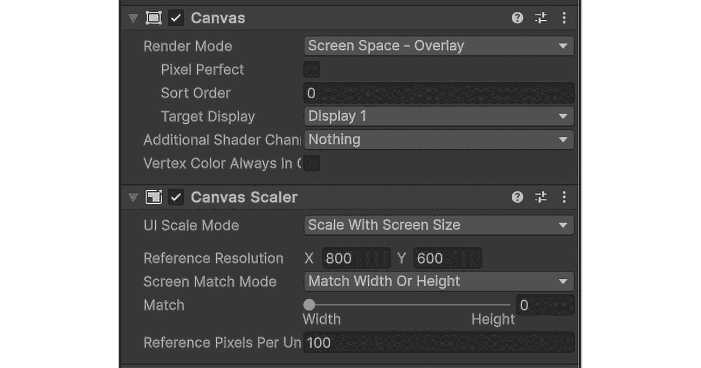
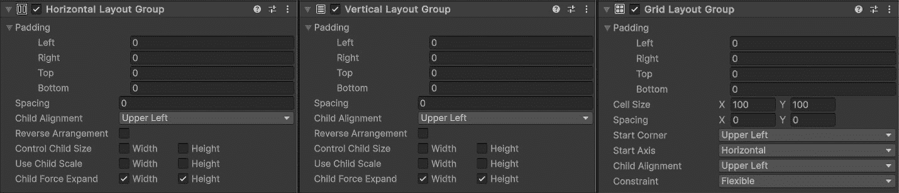
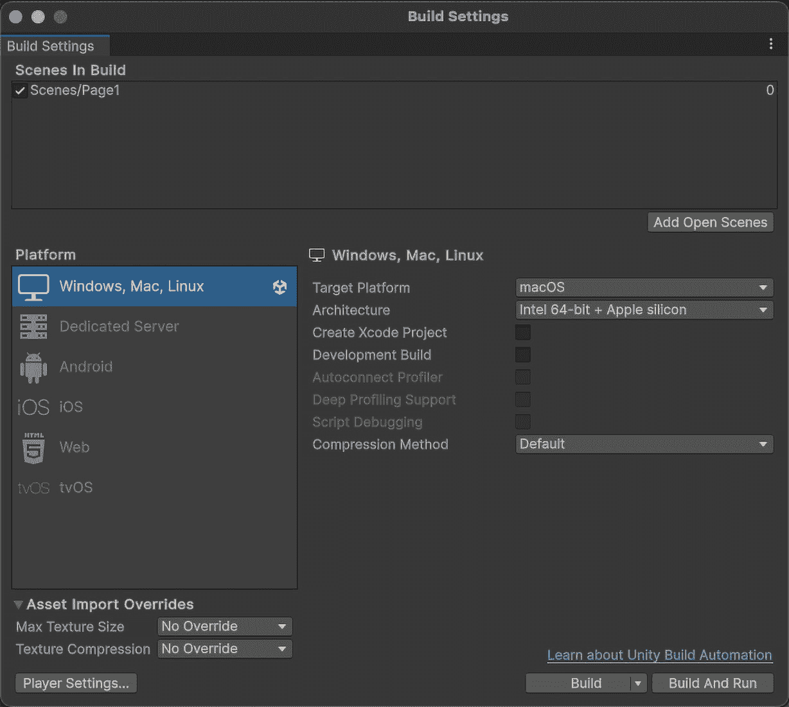

# 15

# Unity 中的跨平台游戏开发 – 移动、桌面和游戏机

Unity 中的跨平台游戏开发具有独特的挑战和机遇。随着游戏行业的扩张，掌握在移动、桌面和游戏机上创建出色游戏的技艺至关重要。本章将引导您了解跨平台开发的复杂性，提供优化游戏性能、设计多功能的 UI 和管理资源的策略。我们将探讨处理特定平台限制的最佳实践，并在各个平台上进行全面的测试。通过例如为 PC 和移动设备适配游戏和处理不同输入方法等示例，您将获得创建可扩展和高性能游戏的实际知识。

在本章中，我们将涵盖以下主题：

+   识别和解决跨平台开发挑战

+   优化游戏以适应移动性能和控制

+   设计适应不同屏幕的用户界面

+   在各种平台上进行有效的测试

# 技术要求

在开始之前，请确保您的开发环境已按照*第一章*中描述的方式进行设置。这包括在您的系统上安装最新推荐的 Unity 版本和合适的代码编辑器。

## 硬件要求

确保您的设置满足以下硬件要求：

+   **桌面计算机**：

    +   至少支持 DX10（着色器模型 4.0）的显卡

    +   至少 8 GB RAM 以实现最佳性能

+   **一个替代** **游戏平台**：

    +   这可能包括 iPhone、Android 设备、Xbox 等，这些设备都需要进行测试

## 软件要求

确保您已安装以下软件：

+   **Unity 编辑器**：使用从*第一章*安装的 Unity 编辑器版本，理想情况下是最新**长期支持**（**LTS**）版本

+   **代码编辑器**：Visual Studio 或 Visual Studio Code，根据初始设置，应已集成 Unity 开发工具

您可以在此处找到与本章相关的示例/文件：[`github.com/PacktPublishing/Unity-6-Game-Development-with-C-Scripting/tree/main/Chapter15`](https://github.com/PacktPublishing/Unity-6-Game-Development-with-C-Scripting/tree/main/Chapter15)

# 理解特定平台的挑战

为多个平台开发游戏面临着许多挑战，开发者必须克服这些挑战，以确保所有用户都能获得无缝且愉悦的体验。本节将概述在跨平台游戏开发中遇到的常见障碍，例如不同的硬件能力、多样的输入方法和不同的用户界面考虑因素。我们将概述 Unity 中的跨平台开发格局，强调 Unity 的强大工具和功能如何帮助解决这些挑战。包括性能优化、可适应的输入处理和响应式 UI 设计在内的关键考虑因素将被突出，以指导你创建在广泛设备上表现良好的游戏。

## 硬件能力与性能优化

在跨平台游戏开发的领域，一个主要挑战是在各种设备之间导航不同的硬件能力。本节探讨了不同平台之间存在的处理能力、内存、存储和图形能力的差异，例如高端 PC 和手机。了解这些差异如何影响游戏性能对于旨在在所有设备上提供流畅和愉悦游戏体验的开发者至关重要。

设备的硬件能力显著影响游戏性能，与手机相比，高端 PC 可以处理更复杂的游戏。开发者必须针对不同平台优化他们的游戏，使用如 Unity 中的质量设置和资源包等技术。这些功能允许你调整图形保真度并打包必要的资源，以减少内存使用并提高加载时间。此外，通过**细节级别**（**LOD**）调整、纹理压缩和有效的内存管理来优化代码和资源，有助于保持性能。Unity 的剖析器和诊断工具对于识别和解决性能瓶颈至关重要，确保设备间的一致体验。

总结来说，了解跨平台之间的不同硬件能力并采用性能优化技术对于创建在所有设备上都能流畅运行的跨平台游戏至关重要。通过利用 Unity 的功能，如质量设置和资源包，开发者可以确保他们的游戏在高端 PC 或手机上都能表现良好。随着我们继续探索跨平台开发的复杂性，下一个需要考虑的关键方面是如何不同的输入方法和控制方案影响各种设备上的游戏玩法。

## 输入方法和控制方案

支持各种输入方法是跨平台游戏开发中的一个重大挑战。从触摸屏和移动传感器到游戏手柄和键盘/鼠标设置，开发者必须设计灵活的控制方案，以无缝适应不同的设备。确保跨平台平滑的玩家体验需要仔细考虑这些不同的输入方法。

跨平台输入方法的多样性需要灵活且适应性强的控制方案设计。移动设备使用触摸屏和传感器，如加速度计和陀螺仪，需要直观的触摸手势和响应式控制。桌面和游戏机使用游戏手柄、键盘和鼠标，每个都需要不同的控制方案。

Unity 的输入系统通过抽象输入控制和处理设备特定配置来帮助管理这些挑战。开发者可以定义映射到不同设备的输入动作，确保跨平台的一致性。例如，跳跃动作可以在移动设备上通过屏幕点击触发，在游戏手柄上通过按钮按下触发，或在键盘上通过按键触发。在多种设备上进行测试确保直观且响应式控制，允许根据用户反馈进行迭代优化，以满足玩家期望。

总结来说，支持各种输入方法需要设计灵活的控制方案，以适应不同的设备，确保跨平台无缝的玩家体验。Unity 的输入系统简化了设备特定输入配置的管理，实现了一致且响应的控制。随着我们向前发展，考虑用户界面和用户体验设计的影响至关重要，它在增强跨平台整体游戏体验中发挥着关键作用。

## 用户界面和用户体验考虑因素

设计一个**用户界面**（**UI**）和**用户体验**（**UX**）以适应不同的屏幕尺寸、分辨率和纵横比对于跨平台游戏开发至关重要。确保你的游戏在各种设备上提供一致且愉悦的体验需要深思熟虑的策略和工具。本节重点介绍在 Unity 中创建响应式 UI 以及考虑特定平台的 UX 约定。

适应不同屏幕尺寸和分辨率的 UI 是跨平台开发中的一个基本挑战。从智能手机到桌面和游戏机，不同的设备具有独特的显示特性，必须进行适配。Unity 提供了几个工具来帮助开发者创建响应式 UI，这些 UI 可以动态地适应这些变化。

以下是一个`Canvas` GameObject，突出显示了`Canvas`和`CanvasScaler`组件。



图 15.1 – 检查器视图显示 Canvas GameObject 的 Canvas 和 CanvasScaler 组件

Unity 中的`CanvasScaler`组件特别适用于管理不同分辨率下的 UI 缩放。通过将`CanvasScaler`设置为随屏幕大小缩放，开发者可以确保 UI 元素在所有设备上保持比例和可读性。此外，将 UI 元素锚定到屏幕上的特定点，允许它们在屏幕大小变化时动态调整。这确保了关键 UI 组件无论设备的分辨率或纵横比如何，都保持可访问和正确定位。

在 Unity 中设置 UI 属性时，你可以使用**检查器**窗口进行精确调整。直接输入值可以精确控制位置、大小和其他属性。**锚点预设**菜单提供了快速设置锚点的选项，确保 UI 元素适应不同的屏幕尺寸。使用*Alt* + *点击*锚点预设可以调整位置而不改变大小，而*Shift* + *点击*则将轴心移动以匹配锚点。结合这些命令可以方便且准确地放置 UI。

响应式设计还涉及创建能够灵活适应各种屏幕方向和大小的布局。诸如弹性网格和自适应布局等技术使开发者能够设计出在大屏幕和小屏幕上都能良好显示和工作的 UI。Unity 的布局组件，如**网格布局组**、**垂直布局组**和**水平布局组**，提供了构建这些自适应界面的所需工具。



图 15.2 – 水平布局组、垂直布局组和网格布局组组件

考虑平台特定的用户体验惯例同样重要。不同的平台已经建立了用户期望和交互模式。例如，移动用户习惯于触摸手势，而控制台用户期望通过游戏手柄进行导航。遵循这些惯例可以提升用户体验，并使游戏感觉更加直观。Unity 能够为不同平台定制输入处理和 UI 元素的能力，帮助开发者创建跨所有设备的统一用户体验。

总结来说，为各种屏幕尺寸和分辨率设计可适应的 UI 和 UX 对于成功跨平台游戏至关重要。Unity 的工具，如`CanvasScaler`和布局组件，有助于创建响应式和动态的界面。通过考虑平台特定的用户体验惯例，开发者可以确保所有用户都能获得一致且愉快的体验。随着我们继续前进，我们将探讨适应移动设备游戏所涉及的具体挑战和策略。

# 适配移动设备上的游戏

移动平台在游戏开发过程中呈现出独特的约束和机遇，这需要我们在开发过程中仔细考虑。本节深入探讨了在移动设备上优化游戏性能的具体挑战，包括管理资源、处理不同分辨率和节省电池寿命。此外，它还探讨了从桌面和游戏机控制方案到触摸和陀螺仪输入的适应。通过实际案例，我们将展示确保您的游戏不仅运行流畅，而且为移动用户提供吸引人和直观体验的有效策略。

## 优化移动设备的性能

由于移动平台固有的限制，如有限的处理能力、内存和图形能力，性能优化对移动游戏开发至关重要。确保您的游戏在各种移动设备上高效运行需要战略性的资源管理、分辨率处理和电池消耗考虑。本节讨论了在移动平台上实现最佳性能的技术和最佳实践。

移动设备的硬件能力差异很大，这使得性能优化对开发者来说至关重要。高效管理资源以适应较低的处理能力和内存是一个主要挑战。使用低分辨率纹理和优化的 3D 模型可以显著减少设备 GPU 和 CPU 的负载。Unity 支持纹理压缩和米帕图（mipmaps），这是纹理的预计算、低分辨率版本，有助于根据设备的性能动态管理纹理质量。高效的资源管理还涉及减少绘制调用和最小化着色器复杂性。利用 Unity 的优化工具，如 Profiler 和 Frame Debugger，有助于识别性能瓶颈并简化渲染过程。此外，使用资源包允许您按需加载资源，确保在任何给定时间内存中只有必要的资源。

分辨率处理是移动优化另一个关键方面。移动屏幕大小和分辨率各不相同，确保您的游戏在所有设备上看起来都很好且表现良好是至关重要的。Unity 的`CanvasScaler`组件有助于管理 UI 缩放，而自适应分辨率技术可以根据设备的性能动态调整游戏分辨率。在多台设备上进行测试对于确保一致的性能和视觉质量至关重要。电池寿命也是移动游戏玩家关注的重大问题。减少电池消耗可以通过允许更长的游戏时间来提升用户体验。Unity 提供了一些功能，如设置适当的帧率和使用移动质量设置来平衡性能和能源效率。减少不必要的后台进程和优化代码效率也有助于降低电池使用。

总结来说，为移动设备优化性能涉及高效的资源管理、分辨率处理和电池消耗考虑。使用 Unity 的工具和最佳实践，开发者可以确保他们的游戏在各种移动设备上运行顺畅。随着我们继续前进，我们将探讨触摸和动作输入控制方案的适应，进一步丰富移动游戏体验。

## 适应触摸和动作输入的控制方案

将游戏控制从传统的输入方式适应到触摸屏和移动设备上的动作传感器，既带来了独特的挑战，也提供了机遇。本节探讨了直观触摸界面的设计以及将加速度计和陀螺仪等动作输入集成，以创造引人入胜的游戏玩法机制。我们将讨论策略并提供成功控制方案适应的例子，展示 Unity 如何促进这些过渡。

从传统的输入方式，如键盘、鼠标和游戏手柄，过渡到触摸屏需要精心设计，以确保直观和响应灵敏的用户体验。其中一个主要考虑因素是虚拟按钮的位置和设计。这些按钮应该放置在玩家可以轻松访问的位置，而不会阻挡他们的视线。这些按钮的大小和间距必须优化，以防止意外按下，同时确保使用舒适。

滑动控制和手势识别也是触摸界面的重要组成部分。滑动控制可用于导航菜单或执行游戏中的动作，如躲避或攻击。Unity 的`Input`类可以用来检测触摸手势并实现相应的游戏玩法机制。例如，可以使用以下脚本实现简单的滑动检测：

```cs
using UnityEngine;
public class SwipeControl : MonoBehaviour
{
    private Vector2 startTouchPosition, endTouchPosition;
    public float minSwipeDistance = 50f;
    void Update()
    {
        if (Input.touchCount > 0)
        {
            Touch touch = Input.GetTouch(0);
            if (touch.phase == TouchPhase.Began)
            {
                startTouchPosition = touch.position;
            }
            else if (touch.phase == TouchPhase.Ended)
            {
                endTouchPosition = touch.position;
                DetectSwipe();
            }
        }
    }
    void DetectSwipe()
    {
        if (Vector2.Distance(startTouchPosition, endTouchPosition) >=
            minSwipeDistance)
        {
            Vector2 swipeDirection = endTouchPosition -
                    startTouchPosition;
            // Implement your swipe action based on swipeDirection
        }
    }
}
```

此脚本通过记录触摸的开始和结束位置来检测触摸屏上的滑动手势，如果滑动距离达到最小阈值，则确定滑动方向。`startTouchPosition`和`endTouchPosition`存储触摸位置，而`minSwipeDistance`定义了最小滑动距离。`Update`方法检查触摸输入并处理第一个检测到的触摸。如果触摸开始，它记录开始位置；如果触摸结束，它记录结束位置并调用`DetectSwipe`。`DetectSwipe`方法计算滑动的距离和方向，允许您根据滑动方向实现特定的动作。

动作输入，如加速度计和陀螺仪，通过允许玩家通过设备移动来控制游戏，增加了另一层交互。例如，倾斜设备可以在赛车游戏中用来控制车辆的方向。Unity 的`Input.acceleration`提供了访问设备加速度计数据的功能，使开发者能够创建基于动作的控制。

以下脚本允许使用设备的加速度计来控制游戏对象：

```cs
using UnityEngine;
public class MotionControl : MonoBehaviour
{
    public float sensitivity = 1.0f;
    void Update()
    {
        Vector3 tilt = Input.acceleration * sensitivity;
        // Use tilt.x to control horizontal movement and tilt.y to
        //      control forward/backward movement
        // Mapping tilt.y to the z argument of transform.Translate for
        //      forward/backward movement in a 3D space
        transform.Translate(tilt.x, 0, tilt.y);
    }
}
```

此脚本使用设备的加速度计来检测倾斜并根据倾斜方向和灵敏度移动游戏对象。`sensitivity`变量允许调整运动对设备倾斜的响应程度。在`Update`方法中，`Input.acceleration`捕获设备的倾斜并将其乘以灵敏度。然后，使用`tilt`向量在`transform.Translate`中移动游戏对象，根据倾斜的*x*和*y*值在水平和垂直方向上移动。这通过设备的物理倾斜实现了游戏对象的实时运动控制。

游戏如 *Asphalt 9: Legends* 和 *Temple Run* 的案例研究展示了控制方案在移动设备上的成功适配。*Asphalt 9* 使用倾斜控制进行转向，而 *Temple Run* 则采用滑动和倾斜控制进行角色导航，展示了触摸和运动输入的有效整合。

为移动设备适配控制方案涉及设计直观的触摸界面并利用运动传感器来增强游戏体验。Unity 提供了强大的工具和功能来促进这些适配，确保玩家体验的流畅性。随着我们继续前进，我们将深入探讨移动 UI 和 UX 考虑因素，重点关注创建能够适应各种屏幕尺寸和分辨率的界面，同时保持可用性和美观性。

## 移动 UI 和 UX 考虑因素

由于屏幕尺寸较小且基于触摸的交互，为移动设备设计 UI 和 UX 带来了独特的挑战。本节探讨了创建易于交互和阅读的移动友好型 UI 的策略，我们还将讨论优化 UX 以增强玩家在移动平台上的参与度和留存率的重要性。

当为移动设备设计 UI 时，考虑“安全区域”至关重要，以确保交互元素位于可触及和可交互的显示部分。现代移动设备通常具有刘海、圆角和其他界面元素，可能会遮挡屏幕的一部分。通过遵循安全区域指南，开发者可以防止关键 UI 组件被隐藏或难以访问，为所有设备提供无缝且用户友好的体验。

移动 UI 设计的主要挑战之一是在确保 UI 元素易于交互和阅读的同时，适应较小的屏幕尺寸。设计按钮、图标和文本时，必须足够大且间距适中，以避免触摸输入错误并提高可读性。Unity 的 UI 系统提供了灵活的工具来解决这些挑战，允许开发者创建在不同设备上适当缩放的界面。

使用 Unity 的`CanvasScaler`组件，开发者可以确保 UI 元素在各种屏幕尺寸和分辨率上保持比例。此组件允许你设置参考分辨率并根据实际屏幕大小动态缩放 UI 元素，确保外观和可用性的一致性。以下脚本旨在附加到`Canvas`GameObject 上；Unity 已经添加了`CanvasScaler`组件以确保一致的缩放：

```cs
using UnityEngine;
using UnityEngine.UI;
public class UIManager : MonoBehaviour
{
    public CanvasScaler canvasScaler;
    void Start()
    {
        // Set the reference resolution to ensure consistent UI
           scaling
        canvasScaler.referenceResolution = new Vector2(1920, 1080);
        canvasScaler.uiScaleMode =
           CanvasScaler.ScaleMode.ScaleWithScreenSize;
    }
}
```

此脚本配置`CanvasScaler`以确保通过设置参考分辨率和调整 UI 缩放模式来实现一致的 UI 缩放。`canvasScaler`变量引用了`Canvas`GameObject 上的`CanvasScaler`组件。在`Start`方法中，`referenceResolution`被设置为`1920x1080`，这使得它成为缩放 UI 元素的基准分辨率。然后`uiScaleMode`被设置为`CanvasScaler.ScaleMode.ScaleWithScreenSize`，这确保了 UI 按屏幕大小成比例缩放，在不同设备分辨率上保持一致的外观。

菜单导航应直观且针对触摸交互进行优化。这包括设计大而易于触摸的按钮，并确保导航流程合理。利用如滑动等触摸手势进行导航可以增强 UX，使其更加流畅和自然。

有效的 UX 设计也考虑了移动设备的限制，如有限的处理能力和电池寿命。确保游戏在没有过度消耗电池的情况下运行顺畅对于保持玩家参与度至关重要。优化帧率和减少后台进程等技术可以帮助实现这种平衡。

总之，为移动设备设计 UI 和 UX 需要仔细考虑屏幕尺寸、触摸交互和性能限制。通过利用 Unity 灵活的 UI 系统并实施移动 UX 的最佳实践，开发者可以创建引人入胜且易于访问的界面，从而提升整体玩家体验。随着我们的深入，我们将探讨创建能够无缝适应各种屏幕尺寸和宽高比的响应式 UI 设计的技巧，确保所有平台都能提供一致且愉快的体验。

# 响应式 UI 设计

设计能够直观适应各种屏幕尺寸和分辨率的 UI 对于跨平台游戏至关重要。响应式 UI 确保你的游戏在所有设备上提供一致且愉快的 UX，从手机到高分辨率桌面。本节重点介绍在 Unity 中创建响应式 UI 的最佳实践，使用 Unity 的 UI 系统（uGUI）。我们将探讨如锚定、动态布局组件和可缩放 UI 元素等技术，提供关于在不同平台上使 UI 元素可读和可访问的见解。各种设备的 UI 适应示例将说明如何有效地实施这些策略。

## Unity 中响应式 UI 设计的原理

响应式 UI 设计对于创建能够无缝适应各种屏幕尺寸和分辨率的 UI 至关重要。本节概述了 Unity 环境中响应式 UI 设计的核心原则。我们将介绍 Unity 的 UI 系统（uGUI）及其核心组件，如**画布**、**RectTransform**以及按钮、文本和图像等 UI 元素。理解分辨率无关性和纵横比对于确保您的 UI 在不同设备上保持一致性和功能性至关重要。

uGUI 提供了一个强大的框架来构建响应式界面。任何 Unity 中的 UI 的基础都是 Canvas，它充当所有 UI 元素的容器。Canvas 确保 UI 元素以正确的顺序渲染，并能够响应屏幕尺寸和分辨率的变化。Canvas 中的每个 UI 元素都由一个**RectTransform**组件管理，该组件定义了元素的位置、大小和锚点。

为了说明，让我们创建一个简单的 UI，其中包含一个根据屏幕分辨率调整大小和位置的按钮：

```cs
using UnityEngine;
using UnityEngine.UI;
public class ResponsiveButton : MonoBehaviour
{
    public CanvasScaler canvasScaler;
    public Button myButton;
    void Start()
    {
        // Configure the CanvasScaler for resolution independence
        canvasScaler.uiScaleMode =
             CanvasScaler.ScaleMode.ScaleWithScreenSize;
        canvasScaler.referenceResolution = new Vector2(1920, 1080);
        // Set up the button's Rect Transform to anchor to the bottom-
           right corner
        RectTransform buttonRectTransform =
            myButton.GetComponent<RectTransform>();
        buttonRectTransform.anchorMin = new Vector2(1, 0);
        buttonRectTransform.anchorMax = new Vector2(1, 0);
        buttonRectTransform.pivot = new Vector2(1, 0);
        buttonRectTransform.anchoredPosition = new Vector2(-50, 50);
        // Add an onClick listener to provide haptic feedback
        myButton.onClick.AddListener(TriggerHapticFeedback);
    }
    void TriggerHapticFeedback()
    {
        if (SystemInfo.supportsVibration)
        {
            Handheld.Vibrate();
        }
    }
}
```

在此示例中，我们设置了`CanvasScaler`以确保分辨率无关性，允许 UI 在不同屏幕尺寸上适当缩放。按钮锚定在右下角，使其能够响应屏幕尺寸的变化。此外，我们为按钮的`onClick`事件添加了触觉反馈，以增强用户体验。

分辨率无关性和纵横比是响应式 UI 设计的基本概念。确保您的 UI 元素在各种设备上正确缩放和定位，需要理解和运用这些原则。`CanvasScaler`组件在实现这一点中扮演着至关重要的角色，因为它允许您指定一个参考分辨率，并自动调整 UI 元素的缩放以匹配实际屏幕尺寸。

总结来说，理解 Unity 中响应式 UI 设计的基本原理涉及掌握 uGUI 的核心组件，如`CanvasScaler`，开发者可以创建适用于各种屏幕尺寸和分辨率的适应性和一致的 UI。随着我们的深入，我们将探讨使用锚点和动态布局来进一步增强 UI 设计的响应性和灵活性。

## 利用锚点和动态布局

在 Unity 中实现响应式 UI 设计涉及有效地使用锚点和动态布局组件。锚点允许 UI 元素相对于其父容器进行定位，从而在不同屏幕尺寸上提供灵活性。动态布局组件，如**水平布局组**、**垂直布局组**和**网格布局组**，能够根据屏幕尺寸和方向自动调整 UI 元素。本节将深入探讨这些技术，提供设置响应式布局的实用示例，适用于横屏和竖屏模式。

Unity 中的锚点是一个强大的工具，可以使 UI 元素响应。通过设置锚点，你可以定义当屏幕尺寸变化时 UI 元素相对于其父容器应该如何行为。锚点特别适用于在不同设备上保持 UI 元素的定位和大小的一致性。

例如，要创建一个始终位于屏幕中心的 UI 元素，你可以将其锚点设置为中央：

```cs
using UnityEngine;
using UnityEngine.UI;
public class CenteredUI : MonoBehaviour
{
    public RectTransform uiElement;
    void Start()
    {
        // Set the anchor points to the center
        uiElement.anchorMin = new Vector2(0.5f, 0.5f);
        uiElement.anchorMax = new Vector2(0.5f, 0.5f);
        uiElement.pivot = new Vector2(0.5f, 0.5f);
        uiElement.anchoredPosition = Vector2.zero;
    }
}
```

此脚本通过设置其锚点、枢轴和位置到其父容器的中心来居中一个 UI 元素。`uiElement's RectTransform`被调整，使得锚点和枢轴都设置为`(0.5, 0.5)`，即 UI 元素的精确中心，其`anchoredPosition`值设置为零。这使 UI 元素的枢轴居中，这是任何未来移动、旋转或缩放的参考点。

利用布局组可以自动根据屏幕尺寸和方向调整 UI 元素，通过根据可用空间和布局设置定位和调整子元素的大小。这确保了灵活且自适应的 UI 设计。

**水平布局组**组件将其子元素排列成一行，动态调整它们的定位和大小。同样，**垂直布局组**组件垂直排列其子元素。**网格布局组**组件将子元素组织成网格，非常适合创建响应式 UI 元素网格。

在视频游戏中，一个常见的需求是创建一列按钮。以下脚本生成了这一列：

```cs
using UnityEngine;
using UnityEngine.UI;
public class VerticalList : MonoBehaviour
{
    public GameObject itemPrefab;
    public Transform contentPanel;
    void Start()
    {
        PopulateList();
    }
    void PopulateList()
    {
        for (int i = 0; i < 10; i++)
        {
            GameObject newItem = Instantiate(itemPrefab, 
              contentPanel);
            // Ensure the prefab contains a Text component
            Text itemText = newItem.GetComponentInChildren<Text>();
            if (itemText != null)
            {
                itemText.text = "Item " + i;
            }
            else
            {
                Debug.LogError("Item prefab does not contain a Text component.");
            }
        }
    }
}
```

此脚本创建一列按钮并将它们添加到父容器中。`buttonPrefab`引用按钮模板，`contentParent`是按钮将被添加的位置。在`Start`方法中，循环实例化`10`个按钮，将它们的父级设置为`contentParent`，并更新它们的文本为`Button`，后跟它们的索引号。这种方法有效地生成了一组按钮，用于菜单或界面。

为了适应横幅和纵向模式，你可以结合使用锚点和布局组。例如，一个根据屏幕方向调整布局的 UI 面板可以设置如下：

```cs
using UnityEngine;
using UnityEngine.UI;
public class ResponsivePanel : MonoBehaviour
{
    public RectTransform panel;
    void Update()
    {
        if (Screen.width > Screen.height) // Landscape mode
        {
            panel.anchorMin = new Vector2(0.25f, 0.25f);
            panel.anchorMax = new Vector2(0.75f, 0.75f);
        }
        else // Portrait mode
        {
            panel.anchorMin = new Vector2(0.1f, 0.1f);
            panel.anchorMax = new Vector2(0.9f, 0.9f);
        }
    }
}
```

此脚本根据屏幕方向调整面板的锚点。`panel`变量引用面板的 RectTransform。在`Update`方法中，如果屏幕处于横幅模式，则锚点设置为`(0.25, 0.25)`和`(0.75, 0.75)`。如果屏幕处于纵向模式，则锚点设置为`(0.1, 0.1)`和`(0.9, 0.9)`。这确保了面板在两种方向上都得到了适当的缩放和定位。

通过有效地利用锚点和动态布局组件，你可以确保你的 UI 元素在不同屏幕尺寸和方向上保持响应性和适应性。

总结来说，使用 Unity 中的锚点和动态布局组件可以创建响应式 UI 设计，这些设计可以适应各种屏幕尺寸和方向。这些工具使 UI 元素的定位灵活，并能自动调整，确保跨设备的一致用户体验。随着我们继续前进，我们将探讨可扩展性和可访问性考虑，重点关注设计既可扩展又对所有用户可访问的 UI，从而进一步增强游戏的总体可用性和包容性。

## **可扩展性和可访问性考虑**

确保 UI 不仅响应式，而且可扩展和可访问对于创建包容性和用户友好的游戏至关重要。本节重点介绍缩放 UI 组件的策略，以及使用 Unity 的`CanvasScaler`保持视觉质量和可读性。我们还将讨论设计可访问 UI 的最佳实践，包括足够的对比度、可读的字体大小和适应各种输入方法。在多个设备上测试 UI 设计对于确保所有平台上一致和用户友好的体验至关重要。

**可扩展性**是响应式 UI 设计的关键方面，确保 UI 元素在所有尺寸的屏幕上保持清晰和功能。Unity 的`CanvasScaler`组件在实现这一点上起着至关重要的作用。通过配置`CanvasScaler`以适应屏幕尺寸并定义一个参考分辨率，你可以确保 UI 元素在不同设备上保持其比例和可读性。

在 UI 设计中，可访问性同样重要，确保所有用户，包括有残疾的用户，都能有效地与游戏互动。

实施可访问性设计实践涉及几个关键策略：

+   **足够的对比度**：通过使用对比颜色确保文本和重要的 UI 元素与背景形成鲜明对比，并避免色盲用户难以区分的颜色组合。

+   **可读的字体大小**：使用在小屏幕上易于阅读的字体大小。避免使用过小的文本，并在可能的情况下提供用户调整文本大小的选项。

+   **适应各种输入方法**：设计可通过不同输入方法访问的 UI 元素，例如触摸、键盘和游戏手柄。这包括确保按钮足够大，以便在触摸屏上轻松点击，并在使用键盘或游戏手柄控制时可导航。

在多个设备上测试 UI 设计对于确保它们既可扩展又可访问至关重要。这包括检查不同屏幕尺寸和分辨率的 UI，以及使用不同的输入方法来验证可用性。Unity 的远程设备测试和 Unity 编辑器的模拟视图可以帮助识别和解决潜在问题。

总结来说，在 UI 设计中考虑可扩展性和可访问性，确保您的界面不仅响应迅速，而且在所有设备上都是可读的且易于使用。通过使用 Unity 的`CanvasScaler`并遵循可访问设计的最佳实践，您可以创建包容性和用户友好的 UI。

随着我们继续前进，我们将深入探讨在多个平台上进行测试和调试，强调彻底测试的重要性，以确保在所有目标设备上保持一致的游戏体验。

# 在多个平台上进行测试和调试

确保在所有目标平台上保持一致的游戏体验需要彻底的测试和调试。本节强调了在跨平台游戏开发中全面测试的关键作用。我们将介绍为不同平台设置 Unity 构建设置的方法，利用模拟器和实际设备进行测试，以及识别和解决特定平台问题的策略。此外，我们还将探讨在可行的情况下自动化测试流程的技巧，并讨论如何利用 Unity 的云构建和分析服务收集有价值的表现数据和玩家反馈。这些做法对于在所有设备上提供精致且令人愉悦的游戏至关重要。

## 为跨平台测试做准备

为跨平台测试配置 Unity 项目是确保您的游戏在所有目标设备上表现良好的关键步骤。本节概述了为在不同平台上进行测试设置 Unity 项目的必要步骤。我们将讨论调整 Unity 构建设置以满足每个平台特定要求和限制的重要性，以及强调使用平台模拟器和模拟器进行初始测试的必要性，同时强调在实际硬件设备上进行测试的必要性。

当为多个平台开发你的视频游戏项目时，调整 Unity 的构建设置以适应每个目标平台的独特需求是至关重要的。这包括配置分辨率设置、纹理压缩和平台特定功能，以确保最佳性能和兼容性。不同的平台具有不同的屏幕尺寸和分辨率，因此配置适当的分辨率设置确保你的游戏在所有设备上正确显示并保持视觉质量。有效的纹理压缩对于管理内存使用和确保在资源受限的设备（如手机）上平滑性能至关重要。Unity 为不同的平台提供了各种纹理压缩格式，例如 ASTC，一种在 Android 设备上提供高质量图形和高效内存使用的纹理压缩格式，用于 Android 和 PVRTC，一种针对 iOS 设备上高质量图形和高效内存使用进行优化的纹理压缩格式。此外，每个平台都有其独特的功能和限制，例如移动设备的触摸输入支持和电池优化，或控制台特定的控制器配置和更高的图形保真度。

使用平台模拟器和仿真器对初步测试有益，允许开发者测试他们的游戏在模仿不同设备和操作系统的虚拟环境中。这些工具有助于识别与屏幕分辨率、输入方法和基本性能指标相关的问题，而无需大量物理硬件。然而，模拟器和仿真器无法完全复制在真实硬件上运行游戏的经验。在实际设备上进行测试对于识别与硬件相关的问题至关重要，例如性能瓶颈、输入延迟和可能在仿真环境中不明显的平台特定错误。测试代表目标受众硬件多样性的各种实际设备对于你的游戏来说非常重要。

下图是 Unity **构建设置**窗口的截图，您可以在其中配置项目的构建选项：



图 15.3 – Unity 的构建设置窗口，您可以在其中选择目标构建平台、配置平台选项并指定最终构建中包含的场景

总结来说，为跨平台测试设置 Unity 项目涉及配置构建设置以解决每个平台的具体需求，利用模拟器和仿真器进行初步测试，并确保在实际硬件设备上进行彻底测试。这种全面的方法有助于识别和解决潜在问题，确保所有平台上的游戏体验流畅且一致。随着我们继续前进，我们将深入了解识别和解决平台特定错误，这是完善和精炼游戏以发布的关键方面。

## 识别和解决平台特定错误

识别和解决平台特定错误对于确保所有设备上的无缝游戏体验至关重要。本节深入探讨了从性能瓶颈到输入方法不一致性的故障排除策略。Unity 的调试工具、日志文件和性能分析器对于定位错误源至关重要。此外，利用测试社区和用户反馈可以帮助识别在内部测试中未发现的问题。

平台特定错误通常源于硬件、操作系统和输入方法之间的差异。有效的故障排除从 Unity 内置的调试工具开始。**控制台**窗口有助于监控日志文件和错误消息，而**性能分析器**则识别性能瓶颈，提供详细的 CPU、GPU 和内存使用信息。对于 Android，**Android 调试桥接器（ADB**）和**日志猫（Logcat**）等工具对于收集设备信息非常有价值。对于 iOS，Xcode 的**设备和模拟器**窗口起到类似的作用。

在真实设备上进行测试对于识别硬件特定问题至关重要，例如性能瓶颈、输入延迟和平台特定错误。模拟器和仿真器可以提供有用的见解，但它们往往无法完全复制实际硬件的行为。例如，一个游戏可能在模拟器上运行流畅，但在真实设备上可能会出现显著的帧率下降或输入延迟。通过在多种物理设备上进行测试，开发者可以发现并解决这些问题，确保所有用户都能获得一致和优化的体验。

实施结构化的测试计划对于全面发现和解决错误至关重要。这个计划应包括各种类型的测试：

+   **单元测试**：专注于游戏的单个组件，确保每个部分在独立情况下都能正确运行。

+   **集成测试**：检查不同组件之间的交互，确保它们能够无缝协作。

+   **用户验收测试（UAT）**：这涉及到真实用户测试游戏，以确保它符合他们的期望和需求。

测试社区和用户反馈提供了不同的硬件和用法场景，揭示了可能被忽视的性能、可用性和兼容性问题。与社区互动并鼓励详细的反馈有助于有效地解决平台特定问题。

总结来说，识别和解决平台特定错误需要使用 Unity 的调试工具、日志文件和性能分析器，以及如 ADB、Logcat 和 Xcode 的**设备和模拟器**窗口等工具。实施结构化测试计划并利用测试社区和用户反馈确保全面覆盖和有效问题解决。

接下来，我们将探讨自动化测试流程并利用分析来增强游戏开发和优化。

## 自动化测试和利用分析

自动化测试提高了游戏开发的效率和可靠性。本节将探讨使用 Unity 的测试框架来自动化测试并将其与 CI 工具集成到开发流程中。我们还将突出 Unity Cloud Build 来自动化平台构建和 Unity Analytics 来收集游戏性能和玩家行为的实时数据。

自动化测试确保了开发过程中的持续测试，及早发现问题并减少手动测试时间。Unity 的测试框架允许您创建和运行自动化单元和集成测试，对新代码引入的任何问题提供即时反馈。这些测试可以作为构建过程的一部分自动执行，验证代码在每次更改后是否按预期工作。

CI 工具，如 Jenkins、Travis CI 或 GitHub Actions，可以将自动化测试集成到开发流程中，维护代码质量和稳定性。Unity Cloud Build 自动化不同平台的构建，确保游戏始终准备好测试并及早发现平台特定问题。Unity Analytics 收集游戏性能和玩家行为的实时数据，帮助开发者识别问题并根据实际使用模式优化游戏。

总结来说，自动化测试过程和利用分析是现代游戏开发中的关键步骤。利用 Unity 的测试框架和 CI 工具进行自动化测试，以及 Unity Cloud Build 进行自动化构建，显著提高了效率和可靠性。此外，Unity Analytics 提供了游戏性能和玩家行为的实时数据，根据实际使用指导游戏的优化。这些实践确保了开发流程的流畅和最终产品的优质。

# 摘要

在 Unity 中进行跨平台游戏开发涉及处理一系列复杂性，以创建在移动、桌面和游戏机平台上无缝运行的游戏。本章深入探讨了开发者面临独特挑战，并提供了克服这些挑战的策略。我们探讨了优化移动设备游戏性能的技术，包括针对触摸屏的定制控制，并学习了如何设计适应不同屏幕尺寸和分辨率的通用用户界面。最后，我们深入探讨了在各个平台上进行全面测试的重要性，以确保所有用户都能获得一致且愉快的游戏体验。凭借这些见解和工具，你已准备好应对 Unity 中的跨平台开发。随着我们继续前进，下一步是探索有效的发布和盈利策略，确保你的游戏能够触及目标受众并取得商业成功，这将在下一章中讨论。
