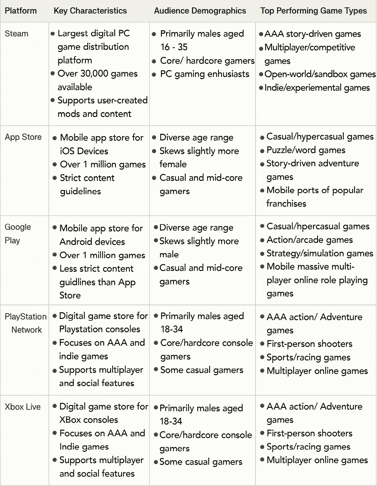
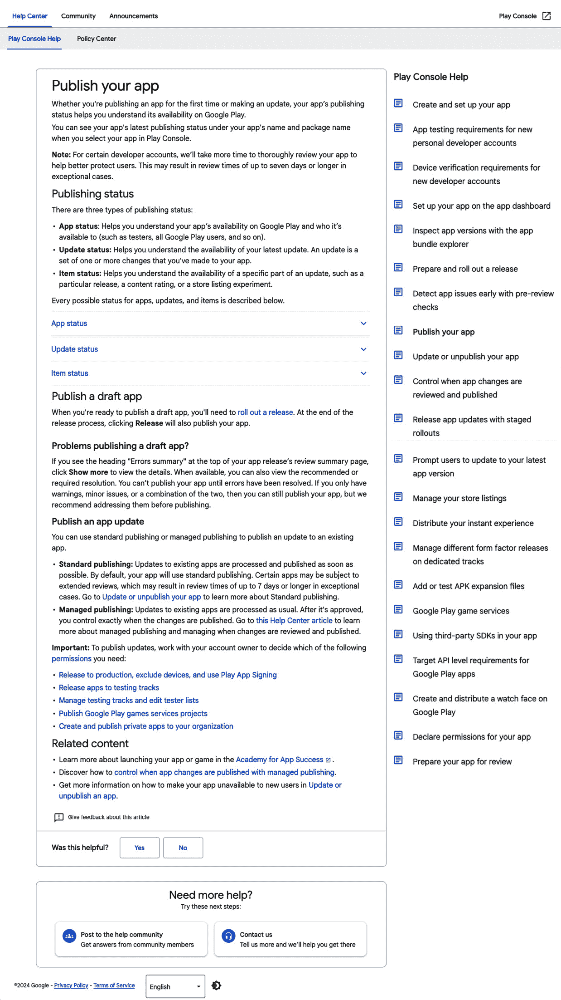
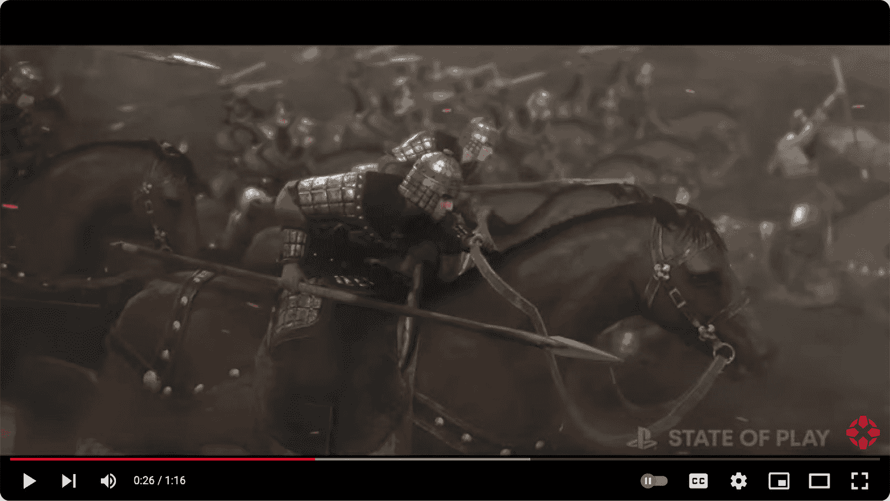
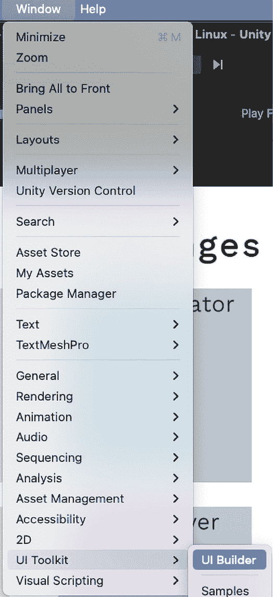
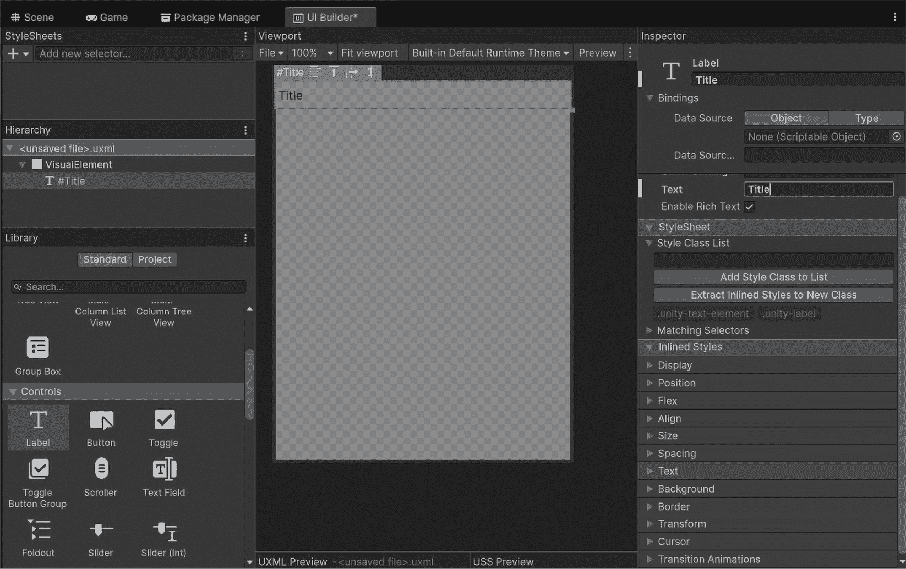
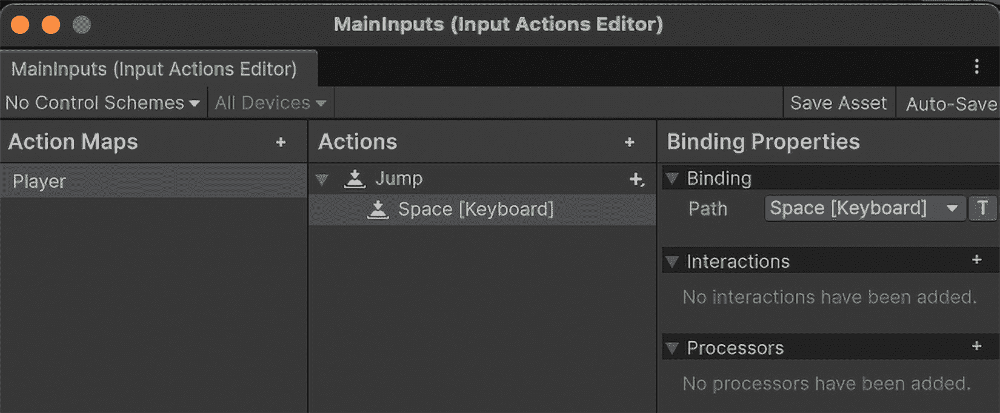

# 在 Unity 中发布、盈利和营销你的游戏 - 广告和社区建设策略

让我们一起踏上游戏开发旅程的关键最后阶段，使用 Unity 深入探讨发布、盈利和营销你的游戏。本章提供了一本全面的指南，用于导航各种游戏发布平台，并为你提供选择适合你游戏渠道的见解。你还将发现有效的营销技巧来推广你的游戏并吸引目标受众的注意，同时学习实施各种盈利模式，使它们与你的游戏设计相匹配，以实现可持续的收入流。此外，你还将了解建立和维护一个充满活力的玩家社区的战略，这对于长期参与和成功至关重要。到本章结束时，你将具备在 Steam 或 App Store 等平台上发布你的游戏、集成游戏内购买以及平衡盈利与玩家体验的技能。让我们探索这些策略和最佳实践，以确保你的游戏成功发布并持续增长。

在本章中，我们将涵盖以下主题：

+   操纵各种游戏发布平台

+   采用营销技巧推广游戏

+   实施有效的盈利模式

+   建立和维护玩家社区

# 游戏发布平台

在将你的游戏推向市场的过程中，导航多样化的游戏发布平台是一个关键步骤。本节探讨了主要平台，包括 Steam、App Store、Google Play 以及特定于控制台的市场，如 PlayStation Network、Nintendo 的 eShop 和 Xbox Live。了解每个平台的独特要求、提交流程和最佳实践，将为你提供所需的知识，以便做出明智的决定。通过了解每个平台的优势和挑战，你可以为你的游戏类型、目标受众和开发目标选择最佳匹配的平台，确保顺利且成功发布。

## 主要发布平台的概述

理解和选择正确的游戏发布平台对于确保游戏成功发布至关重要。本节提供了对最突出的游戏发布平台的广泛概述，包括 PC 的 Steam、独立游戏的 itch.io、iOS 设备的 App Store、Android 的 Google Play 以及特定于控制台的市场，如 PlayStation Network、Nintendo 的 eShop 和 Xbox Live。了解每个平台的一般特征、受众和表现良好的游戏类型将帮助开发者做出关于在哪里发布他们的游戏的明智决定。

这里概述了一些（但不是全部）流行的发布平台：

+   **Steam (PC)**：Steam 是最大的 PC 游戏数字分发平台之一。它服务于广泛的受众，支持从独立游戏到 AAA 游戏的各种游戏类型。Steam 以其社区功能而闻名，包括用户评论、论坛和成就，这些功能有助于吸引玩家并推广游戏。

+   **App Store (iOS)**：App Store 是 iOS 设备的主要市场，为包括休闲玩家、儿童和专业的移动游戏玩家在内的多元化受众提供大量游戏。它具有高度精选的特点，有严格的质量和内容指南。在 App Store 上表现良好的游戏通常利用了适合移动设备的控制、快速的游戏会话和高品质的图形。App Store 上的受众欣赏精致、用户友好的体验，可以在短时间内或长时间内享受，吸引休闲和严肃的玩家。

+   **Google Play (Android)**: Google Play 是 Android 设备的主要分发平台。它支持广泛的各类游戏，类似于 App Store，但提交过程相对更为开放。在 Google Play 上表现优异的游戏通常注重可访问性、免费增值模式和广泛的国际受众。

+   **PlayStation Network (PSN) 和 Xbox Live**：这些针对特定游戏机的市场为 PlayStation 和 Xbox 平台上的专业玩家提供服务。它们非常适合提供高质量、沉浸式的游戏体验，包括独立和大型游戏。在这些平台上取得成功通常需要精美的展示、稳健的游戏功能，有时还需要独家内容或限时发布来吸引和留住玩家。这些平台上的受众倾向于寻求深入、吸引人的，通常是多人游戏体验。

下表概述了主要游戏发布平台的关键特性、受众人口统计和表现最好的游戏类型，有助于您选择适合您游戏发布的正确平台。



图 16.1 – 游戏发布平台表

理解每个主要发布平台的特点和受众对于做出关于游戏发布地点的明智决策至关重要。这种基础知识为下一节奠定了基础，我们将深入探讨每个平台的具体要求和提交流程。

接下来，我们将探讨在各个平台上成功发布游戏所需的具体要求和提交流程。

### 平台特定要求和提交流程

理解和掌握每个主要平台的具体要求和提交流程对于成功发布游戏至关重要。本节将深入探讨适用于 Steam、App Store、Google Play 和游戏机市场的合规指南、技术要求和质量标准。我们还将涵盖提交流程，包括费用、审查周期和所需材料。让我们开始吧：

+   **Steam (PC)**：Steam 要求遵守内容指南，包括对成人内容的限制和技术兼容性要求。具体的技术要求包括支持 Windows、macOS 和 Linux，确保适当的控制器支持，以及集成 Steamworks API 以实现成就和云存档。提交流程包括支付提交费、准备促销材料（如图片和描述），并将游戏提交进行审查。审查周期可能有所不同，但确保您的游戏符合所有技术和内容标准可以加快审批流程。

+   **The App Store (iOS)**：App Store 对质量和内容指南要求严格。开发者必须遵守技术要求，包括应用性能、安全标准和与最新 iOS 版本的兼容性。具体要求包括支持各种屏幕尺寸和分辨率、确保应用响应性，并遵守苹果的人机界面指南。提交流程包括开发者计划费用、创建详细的应用描述、提供促销图片和视频，以及提交隐私政策。审查周期可能非常严格，因此彻底测试和合规性至关重要。

+   **Google Play (Android)**：Google Play 同样要求遵守内容和技术指南，但其提交流程相对灵活。开发者需要支付一次性注册费，准备促销材料，并将应用提交进行审查。具体的技术要求包括与多个 Android 版本的兼容性、遵守谷歌的 Material Design 指南，并确保应用性能和安全性。确保您的应用符合 Google Play 在性能、安全和内容方面的指南将有助于简化审查过程。

+   **PlayStation Network (PSN) 和 Xbox Live**：PlayStation Network 和 Xbox Live 都要求遵守严格的内容和技术指南。开发者必须遵守平台特定的认证要求，支付相关费用，准备详细的促销材料，并将游戏提交进行严格审查。关键的技术要求包括与相应游戏机硬件的兼容性、遵守用户界面指南，并确保游戏性能和安全性。遵守这些指南可以确保审查过程更加顺畅，并在 PlayStation Network 和 Xbox Live 上成功发布游戏。

了解并遵守各个平台的提交流程和要求对于成功发布游戏至关重要。通过理解和遵守每个平台的指南，您可以确保提交体验更加顺畅。

以下截图是您在每个托管平台上遇到的一些示例。这是专门针对 Google Play 的：



图 16.2 – Google Play 控制台提交屏幕

接下来，我们将讨论如何选择适合您游戏的最佳平台，以及最佳实践以最大化您成功的机会。

### 选择正确的平台和最佳实践

选择最适合您游戏的最合适的平台是一个重要的决定，它可以显著影响您游戏的成功。本节指导开发者如何根据游戏类型、目标受众和可用资源等因素选择正确的平台。我们还将讨论独家与多平台发布的战略考虑，并强调每个平台发布的最佳实践，确保您的游戏达到目标受众，并最大限度地发挥其成功潜力。

以下列表提供了一些关键考虑因素，以确保您的成功：

+   选择最适合您游戏的平台可以极大地影响其成功，并且很大程度上取决于游戏类型和目标受众。例如，休闲和移动游戏通常在 App Store 和 Google Play 上表现非常出色。这些平台迎合了广泛用户群体，他们更喜欢快速、易于访问的游戏体验。像*Candy Crush Saga*和*Clash of Clans*这样的游戏由于它们引人入胜、小巧的游戏玩法，在移动平台上取得了巨大成功。相反，更沉浸式和复杂的游戏可能在 Steam 或游戏机平台上取得更大的成功。例如，*巫师 3：狂猎*和*黑暗之魂*在这些平台上蓬勃发展，因为它们提供了深入、复杂的游戏玩法，吸引了核心玩家。

+   在选择平台时，评估您的资源，包括预算和开发时间至关重要。为多个平台开发您的游戏可能需要大量资源，因此确定您是否能够支持多平台发布，或者专注于一个平台是否更可行是至关重要的。例如，资源有限的独立开发者可能会优先考虑在 Steam 等单一平台上发布他们的游戏，以确保在考虑多平台发布之前提供完善的游戏体验。

+   在独家发布和多平台发布之间做出决定也需要仔细考虑。独家发布可以创造稀缺感并吸引平台特定的激励措施，例如促销支持。例如，*Bloodborne* 和 *Uncharted 4* 作为 PlayStation 独家游戏，从索尼那里获得了大量的营销和支持，受益匪浅。然而，多平台发布可以触及更广泛的受众并最大化收入潜力。根据你的游戏目标和目标市场权衡每种方法的利弊，将帮助你做出符合你开发策略的明智决定。

为了在各个平台上最大化你游戏的成功，请考虑以下最佳实践：

+   **优化商店列表**：确保你的游戏商店列表引人入胜且信息丰富。使用高质量图片、引人入胜的描述和相关的关键词来吸引潜在的玩家。

+   **与用户评论互动**：积极监控并回应用户评论。积极的互动可以建立忠诚的社区，而解决负面反馈可以提高你游戏的声誉。

+   **利用平台特定功能**：利用平台特定功能来提高可见性和互动性。例如，在 Steam 上使用成就和排行榜，或在 App Store 上集成 ARKit 用于 AR 游戏。

选择正确的平台并遵循发布最佳实践是确保你游戏成功的关键步骤。通过战略性地选择平台并优化你游戏的曝光度，你可以最大化可见性和玩家互动。

接下来，我们将深入探讨如何营销和推广你的游戏以吸引目标受众的注意并推动对发布内容的兴趣。

# 营销和推广你的游戏

营销对于确保你的游戏达到潜在受众至关重要。在本节中，我们将介绍基本的营销策略，包括创建引人入胜的游戏预告片、利用社交媒体、与游戏社区互动以及利用新闻稿和游戏评论网站。我们还将讨论为你的游戏建立强大的在线存在感和品牌的重要性，例如开发游戏网站和使用 YouTube 和 Twitch 等平台进行推广。在游戏开发过程中就开始营销你的游戏，通过分享更新和预告内容。发布一个简短、精良的演示可以吸引早期兴趣并提供宝贵的反馈，帮助你在大规模发布前完善你的游戏。通过实施这些策略，你可以有效地吸引目标受众的注意并推动对游戏的兴趣。

## 创建引人入胜的营销材料

创建高质量的营销材料对于捕捉游戏精髓和吸引目标受众至关重要。本节重点介绍引人入胜的游戏预告片、促销图像和新闻资料包的关键要素，这些要素可以有效地激发对您游戏的兴趣和兴奋感。

为了有效地推广您的游戏并吸引目标受众的兴趣，考虑创建以下引人入胜的营销材料：

+   **游戏预告片**：为了制作引人入胜的游戏预告片，关注引人入胜的游戏画面、吸引人的音乐和明确的行动号召。突出您游戏中最激动人心和独特的方面以吸引观众。确保预告片编辑得很好，提供了玩家可以期待的内容的简洁概述，并以一个强烈、难忘的印象结束。

+   **促销图像和动画 GIF**：制作引人注目的促销图像和动画 GIF，有效地展示您游戏的图形和关键特性。使用高质量的视觉元素以吸引注意力并激发兴趣。这些资产应设计得灵活多样，适用于社交媒体、商店列表和促销网站。

+   **新闻资料包**：准备一个完善的新闻资料包，这对于媒体接触至关重要。包括详细的游戏描述、关键特性、开发者信息和联系详情。提供高分辨率的图像、标志和视频，以便记者和影响者更容易报道您的游戏。确保所有材料都专业呈现且易于访问。

+   **制作社交媒体内容**：创建针对不同平台的吸引人的社交媒体内容以最大化您的覆盖范围。设计包含您的游戏预告片、促销图像和动画 GIF 的帖子。撰写引人入胜的标题并使用相关标签以增加可见度。定期发布关于您游戏开发的更新，分享幕后内容，并通过回复评论和消息与您的受众互动。使用分析工具跟踪帖子的表现，并相应地调整您的策略。

创建高质量的营销材料不仅展示了您的游戏，还能够在潜在玩家中建立期待和参与度。通过投入时间和精力制作引人入胜的预告片、引人注目的图像和精心准备的新闻资料包，您可以确保您的游戏在竞争激烈的市场中脱颖而出。这些材料是您游戏的第一印象，因此精心策划和战略性地制作它们对于最大化其影响至关重要。

接下来，我们将探讨如何利用社交媒体和内容平台进一步推广您的游戏并建立强大的在线影响力。

## 利用社交媒体和内容平台

有效使用社交媒体和内容平台对于推广你的游戏和建立强大的在线存在至关重要。本节深入探讨了如何利用 X（前身为 Twitter）、Facebook、Instagram、YouTube 和 Twitch 等平台与潜在玩家互动并围绕你的游戏建立一个充满活力的社区。

为了有效地构建和吸引围绕你的游戏的社区，请考虑以下策略：

+   **构建社区**：社交媒体平台是围绕你的游戏构建社区的有力工具。使用 X、Facebook 和 Instagram 分享更新和幕后内容，并与你的观众互动。定期发布吸引人的内容以保持社区活跃和兴趣。

+   **分享更新和内容**：一致的品牌和定期的更新是保持可见性的关键。在 YouTube 和 Instagram 上分享游戏视频、开发进度和公告。利用互动内容，如投票、测验和竞赛来鼓励社区参与。

+   **与玩家互动**：通过在 Twitch 和 YouTube 等平台上举办直播、问答会和开发者聊天来鼓励互动。利用这些机会展示你的游戏、回答问题并收集反馈。与影响者和内容创作者合作也可以帮助你扩大影响力并吸引新玩家。

+   **利用标签和合作**：利用标签来增加你在社交媒体上帖子的可见性。与影响者和内容创作者合作，以触及更广泛的受众。他们的推荐可以为你的游戏增添可信度，并吸引他们的粉丝的兴趣。

有效利用社交媒体和内容平台可以极大地提高你游戏的可见性和玩家参与度。通过培养社区、提供一致的更新和积极与观众互动，你可以建立一个强大的在线存在感。

以下截图是有效使用游戏预告片的例子：



图 16.3 – YouTube 上 PlayStation 游戏《State of Play》预告片的截图

《State of Play》预告片之所以有效，是因为它将高质量的视觉效果与动态叙事相结合，立即吸引观众的注意力。它展示了关键的游戏机制，并突出了游戏的独特之处，创造了兴奋和期待。预告片还配有一首精心挑选的配乐，与视觉效果相得益彰，增强了整体影响。通过战略性地揭示游戏世界的片段、角色和情节，它成功地建立了神秘感，并鼓励观众了解更多关于游戏的信息。

接下来，我们将探讨如何与游戏社区和媒体互动，以进一步推广你的游戏并扩大其影响力。

## 与游戏社区和媒体互动

直接与游戏社区和媒体互动是推广您的游戏和建立支持性玩家群的关键策略。本节强调了参与在线论坛、游戏社区和行业活动的好处，以及确保媒体覆盖的策略。

为了进一步提高您游戏的可见度并建立强大的存在感，请考虑以下附加策略：

+   **参与在线论坛和社区**：与 Reddit、Discord 和专门的游戏论坛等平台互动，您可以与充满热情的游戏玩家建立联系，他们可以提供宝贵的反馈并产生口碑推广。积极参与讨论、分享更新并回应玩家询问，以建立一个忠实的社区。

+   **参加行业活动**：在虚拟和现场的行业活动中展示您的游戏可以显著提高其可见度。游戏展销会、开发者会议和贸易展等活动为您提供了展示游戏、与行业专业人士建立联系以及从潜在玩家那里获取直接反馈的机会。

+   **联系游戏记者和评论网站**：从游戏记者、博客作者和评论网站获得报道可以极大地提升您游戏的名气。制定一份相关媒体联系人名单，并针对个性化提案进行联系。突出您游戏独特之处以及它为何会吸引他们的受众。

+   **撰写新闻稿和提出故事**：有效的新闻稿对于吸引媒体关注至关重要。撰写清晰而有吸引力的新闻稿，概述您游戏的关键功能、发布日期以及任何显著的成就或认可。保持媒体机构对游戏开发的了解，并确保您的游戏始终出现在他们的雷达上。

与游戏社区互动和确保媒体覆盖是推广您的游戏和建立忠实玩家群的基本策略。通过积极参与论坛、参加行业活动以及联系媒体，您可以制造轰动效应并吸引更广泛的游戏受众的关注。

接下来，我们将探讨各种货币化策略，以确保您的游戏在财务上可持续并取得成功。

# 有效的游戏货币化策略

有效地货币化游戏对于财务可持续性至关重要。本节探讨了适用于 Unity 游戏的多种货币化模式，包括应用内购买、广告、高级定价和订阅模式。我们将讨论 Unity Ads 和 Unity **IAP**的集成，提供如何实现这些功能的实用见解。重点将放在平衡货币化与积极的玩家体验上，以确保玩家保持参与感，而不会感到被排斥。通过理解和应用这些策略，您可以在保持忠实玩家群的同时创造可持续的收入流。

## 货币化模式的概述

了解游戏可用的各种货币化模型对于财务可持续性至关重要。本节提供了不同货币化选项的全面概述，包括内购、广告、高级（付费下载）定价和订阅服务。通过分析每种模式的优缺点，开发者可以确定哪些方法最适合他们的游戏类型。

这里有一些值得考虑的流行货币化策略：

+   **内购**：内购允许玩家在游戏中购买虚拟商品或高级内容。这种模式在免费游玩的游戏中很受欢迎，并且提供了持续收入生成的优势。然而，它需要仔细平衡，以避免通过激进的货币化策略使玩家感到疏远。“糖果传奇”是一款使用内购来销售额外生命和助推器的游戏的例子。

+   **广告**：将广告整合到游戏中可以从免费游玩的游戏中产生收入。横幅广告、插屏广告和奖励视频是常见的格式。虽然广告可以提供稳定的收入，但它们需要谨慎实施，以避免干扰玩家体验。“愤怒的小鸟”是一款包含插屏广告和奖励视频广告的游戏的例子。

+   **高级定价**：这种模式涉及向玩家收取一次性费用以下载游戏。它可能适合高质量、内容丰富的游戏。主要优势是前期收入，但与内购或广告的免费游玩模式相比，它限制了持续收入的可能性。“我的世界”是一款收取一次性费用以访问其游戏的游戏的例子。

+   **订阅服务**：订阅为玩家提供以定期费用获取独家内容或福利的途径。这种模式可以创造稳定的收入流并提高玩家留存率。然而，它需要持续的内容更新和改进，以证明定期费用的合理性。“苹果 Arcade”是一款提供订阅服务，可访问独家游戏库的游戏的例子。

这里是每个模型的优缺点：

+   **内购**：持续收入但存在过度货币化的风险

+   **广告**：稳定的收入但有可能干扰游戏体验

+   **高级定价**：前期收入但没有持续收入

+   **订阅服务**：稳定的收入但需要持续的内容更新

了解各种货币化模型的优缺点有助于开发者选择最适合他们游戏的方案。这种基本知识为有效实施这些模型奠定了基础。

接下来，我们将深入了解实施内购和广告的具体细节，以在保持积极玩家体验的同时最大化收入。

### 实施内购和广告

将 IAPs 和广告整合到您的 Unity 游戏中可以创造显著的收入来源。本节深入探讨使用 Unity IAP 和 Unity Ads 的细节，提供将这些货币化策略融入游戏的最佳实践，以确保玩家体验保持积极。

首先，让我们深入了解**Unity IAP**。这是一个强大的工具，用于管理游戏内的商店和微交易。它支持可消耗物品，这些物品可以重复购买（例如，游戏货币），以及一次性购买并提供永久性利益的非消耗性物品（例如，解锁关卡）。设置 Unity IAP 涉及将您的游戏配置为连接到适当的商店，创建游戏内产品，并处理购买事件以向玩家交付物品。确保您的游戏内经济平衡，以鼓励购买而不让玩家感到压力。

接下来，让我们谈谈**Unity Ads**。这允许开发者将广告集成到他们的游戏中。一种有效的方法是使用奖励视频广告，玩家可以选择观看广告以换取游戏内奖励。这种方法最小化了游戏中断，同时为玩家提供了激励。实施 Unity Ads 涉及集成**软件开发工具包**（**SDK**），设置广告位置，并配置奖励。SDK 是一组软件工具和库的集合，开发者使用它们为特定平台创建应用程序。战略性地放置广告很重要，以确保它们增强而不是削弱玩家体验。

这里是 Unity IAPs 和 Ads 的最佳实践：

+   **对于 IAPs**：提供可消耗和非消耗性物品的混合。确保定价合理且与感知价值相符。定期更新商店以保持兴趣。

+   **对于 Ads**：谨慎使用奖励视频广告，并在适当的时候使用，例如在完成关卡或提供额外生命时。避免使用侵入性广告打断游戏。

有效地实施 IAPs 和广告可以显著提高您游戏的收入，同时保持积极的玩家体验。通过使用 Unity IAP 进行微交易和 Unity Ads 进行非侵入性广告，您可以创建一个平衡的货币化策略。接下来，我们将讨论如何平衡这些货币化努力与玩家体验，以确保长期参与和满意度。

## 平衡货币化与玩家体验

在保持积极和吸引人的玩家体验的同时平衡货币化努力对于您游戏的长远成功至关重要。本节重点介绍将货币化元素无缝集成到游戏中的策略，确保它们增强而不是削弱核心游戏体验。

这里有一些将货币化元素无缝集成到您的游戏中的最佳实践：

+   **自然整合货币化元素**：设计货币化功能，使其感觉像是游戏的一个有机部分，而不是侵入性或破坏性的补充。例如，提供与游戏主题相符的、可以增强玩家体验的游戏内购买，如外观物品或额外关卡。

+   **逐步引入可货币化元素**：逐步引入可货币化元素，以避免让玩家感到不知所措。从基本游戏玩法开始，逐步引入内购或广告的机会。这种节奏有助于在玩家遇到货币化之前让他们对游戏产生兴趣。

+   **游戏内购买的公平价值**：确保游戏内购买为玩家提供公平的价值。价格应反映物品的感知效益和稀有度。避免通过使购买可选和非必需来损害玩家利益的“付费获胜”机制。

+   **非侵入性广告**：以最小化干扰的方式整合广告。使用玩家可以选择观看以获得游戏奖励的奖励视频广告，并在游戏玩法中的自然休息点放置广告，例如关卡之间或完成挑战后。

+   **玩家反馈**：积极寻求并整合玩家反馈，以完善货币化策略。定期监控玩家对内购和广告的反应，并根据他们的偏好和期望调整方法，以保持良好的体验。

平衡货币化与玩家体验对于保持玩家参与度和满意度至关重要。通过自然地整合货币化元素，合理安排引入节奏，提供公平的价值，并确保广告不具侵入性，你可以创造一个和谐且愉快的游戏体验。

接下来，我们将探讨社区参与和支持策略，以进一步提升玩家满意度并建立一个忠诚的玩家基础。

# 社区参与和支持

一个充满活力的玩家社区可以显著促进游戏的长远成功。本节重点介绍构建和维护一个积极参与的社区的策略，例如创建和监管在线论坛，利用社交媒体渠道，实施游戏内社区功能，以及提供一致的游戏更新和支持。我们将强调社区反馈在塑造游戏更新和培养玩家忠诚度方面的重要性。通过积极与玩家互动并创造一个支持性的环境，你可以提升整体玩家体验并确保游戏的持久性。

## 构建和培养游戏社区

在你的游戏中建立一个强大的社区对于其长期成功至关重要。本节讨论了培养一个忠诚玩家社区的重要性，并探讨了各种平台和工具以促进这种参与。

要培养一个强大且积极参与的社区，请考虑以下策略：

+   **创建专门的互动空间**：设立官方游戏论坛、Discord 服务器和社交媒体群组，让玩家可以互动、分享体验并提供反馈。这些专门的空间允许开发团队和玩家基础之间进行直接沟通，培养归属感和忠诚度。

+   **鼓励积极互动**：举办社区活动、竞赛和与开发团队的问答会，以保持玩家对游戏的兴趣和热情。这些活动不仅能够激发兴趣，还能鼓励玩家在社区中积极参与和正面互动。

+   **保持欢迎的氛围**：有效的管理是确保积极和包容环境的关键。建立明确的社区指南并始终如一地执行，以防止有毒行为。营造一个让所有玩家都感到受重视和尊重的欢迎氛围。

+   **工具和平台**：利用 Discord 进行实时互动、Reddit 进行更广泛的讨论，以及 X 和 Facebook 等社交媒体平台进行更新和公告。每个平台都提供了独特的优势，以构建和培养社区。

构建和培养游戏社区涉及创建专门的互动空间、鼓励积极互动，并保持欢迎的氛围。通过积极培养一个支持和包容的社区，您可以提高玩家的满意度和忠诚度。

接下来，我们将探讨如何利用社区反馈来改进游戏，确保游戏根据玩家的输入和体验不断进化。

## 利用社区反馈改进游戏

社区反馈在游戏的持续开发和改进中起着关键作用。本节深入探讨了有效收集和分析玩家反馈的方法，并强调了在利用这些反馈来指导游戏更新和新内容时透明度和参与度的重要性。

以下是您如何利用社区反馈来改进游戏的方法：

1.  **收集玩家反馈**：利用各种方法收集社区反馈，包括调查、论坛讨论和直接支持渠道。鼓励玩家分享他们的体验、建议和担忧，以获得他们对游戏看法的宝贵见解。

1.  **分析反馈**：仔细分析收集到的反馈，以识别共同的主题和改进领域。根据对玩家体验的影响以及实施的可行性，优先处理可操作的项目。使用数据驱动的方法来了解玩家的偏好和痛点。

    然后，向您的社区透明地说明如何使用他们的反馈。定期沟通基于玩家建议的更新和变化，并解释决策背后的原因。这种开放性培养了信任，并表明玩家的意见受到重视。

1.  **做出可执行的决策**：评估玩家建议的可行性和影响。评估哪些反馈可以在游戏开发限制内实际实施，以及哪些变化将最显著地增强玩家体验。这种评估确保资源得到有效分配，以实施有意义的改进。

积极参与社区并采纳他们的建议可以导致游戏在有意义方面的改进。例如，解决经常提到的错误、添加高度请求的功能或根据玩家反馈调整游戏平衡可以增强整体体验。这些行动表明了对社区的承诺，并可以增加玩家的忠诚度和满意度。

利用社区反馈对于持续改进游戏和培养强大的玩家基础至关重要。通过有效地收集、分析和采取玩家反馈，并与社区保持透明度，您可以创造一个更具吸引力和响应性的游戏体验。

这标志着我们对在 Unity 中发布、货币化和营销游戏的探索结束。有了这些策略，您已经准备好推出、推广和维持一个成功的游戏。

# 摘要

在本章中，我们探讨了游戏开发旅程的关键最后阶段，重点关注发布、货币化和营销您的 Unity 游戏。通过导航各种游戏发布平台，您可以选择最佳渠道发布您的游戏。有效的营销技巧有助于吸引目标受众的注意并激发兴趣。实施各种货币化模式确保可持续的收入流，同时保持积极的玩家体验。此外，建立和培养一个充满活力的玩家社区可以促进长期参与和成功。装备了这些策略，您现在已准备好在竞争激烈的市场中推出、推广和维持您的游戏。本书提供的大量信息使您为应对游戏开发的挑战和取得成功做好了充分准备。

# 加入我们的 Discord 社区

加入我们社区的 Discord 空间，与作者和其他读者进行讨论：[`packt.link/gamedevelopment`](https://discord.com/invite/NnJesrUJbu?link_from_packtlink=yes)


# 补充说明：解锁 Unity 6 - 高级功能和性能提升

随着游戏开发的不断发展，Unity 始终处于前沿，为开发者提供尖端工具和增强功能。Unity 6 引入了一系列新功能，旨在提升性能、简化工作流程并开辟新的创意可能性。本章重点介绍这些进步，详细探讨了 Unity 6 的创新如何将您的项目提升到下一个水平。

从最新的**输入系统**到强大的**UI 工具包**，Unity 6 简化了复杂任务同时增强了灵活性。开发者现在可以更轻松、更高效地处理来自多个设备的输入，使跨平台开发比以往任何时候都更加流畅。此外，Unity 6 中增强的配置文件工具提供了对性能瓶颈的更深入洞察，使得对游戏性能进行微调以实现更平滑的游戏体验成为可能。

除了输入和配置文件之外，Unity 6 带来了显著的性能提升，包括改进的内存管理和优化的脚本执行，这有助于开发者实现更好的运行时性能。**Burst 编译器**增强功能的加入确保了即使是 CPU 密集型任务也能以高效的方式处理，减少开销并提高整体游戏响应速度。同时，Unity 6 中的图形增强推动了实时渲染的边界，使得在不牺牲性能的情况下创建视觉上令人惊叹的游戏变得更加容易。

在本章中，我们将涵盖以下主题：

+   利用 UI 工具包的力量——在 Unity 6 中实现流畅的 UI 开发

+   掌握新的输入系统——高效的多设备输入处理

+   专业级性能监控——Unity 6 增强的性能监控

+   性能提升和优化——提升游戏效率

+   图形及其他

# 技术要求

下面是 Unity 6 在各个平台上的技术要求：

+   Unity 编辑器：

    +   Windows：

        +   **操作系统**: Windows 10（版本 21H1）或更高版本

        +   **CPU**: 支持 SSE2 指令集的 x86、x64 架构，ARM64

        +   **图形 API**: 支持 DX10、DX11、DX12 或 Vulkan 的 GPU

        +   **附加**: Visual Studio 2019 或更高版本，带有 C++工具的 IL2CPP 脚本后端

    +   macOS：

        +   **操作系统**: macOS Big Sur（11.0）或更高版本

        +   **CPU**: 苹果硅或 x64 架构支持 SSE2

        +   **图形 API**: 支持 Metal 的 Intel 和 AMD GPU

        +   **附加**: IL2CPP 脚本后端需要 Xcode

    +   Linux：

        +   **操作系统**: Ubuntu 22.04 或 Ubuntu 24.04

        +   **CPU**: 支持 SSE2 指令集的 x64 架构

        +   **图形 API**: OpenGL 3.2+或支持 Vulkan 的 GPU

        +   **附加**: GNOME 桌面环境与 X11 窗口系统、Nvidia 或 AMD 专有驱动程序

+   Unity 播放器：

    +   移动设备：

        +   **Android**: 版本 6.0（API 23）或更高版本，ARMv7 或 ARM64，OpenGL ES 3.0+或 Vulkan

        +   **iOS/iPadOS**: 版本 13+，A8 SoC 或更高版本，Metal API

    +   桌面：

        +   Windows、macOS 和 Linux（符合 Unity 编辑器要求）。

        +   对于游戏机、XR 和 Web 平台，要求根据具体平台和开发工具而有所不同。有关完整列表和详细信息，您可以访问 Unity 的官方文档：https://docs.unity3d.com/6000.0/Documentation/Manual/WhatsNewUnity6.html。

您可以在此处找到与附录相关的示例/文件：[`github.com/PacktPublishing/Unity-6-Game-Development-with-C-Scripting/tree/main/Addendum`](https://github.com/PacktPublishing/Unity-6-Game-Development-with-C-Scripting/tree/main/Addendum)

# UI Toolkit – 在 Unity 6 中简化开发

我们从 Unity 工作流程中最具影响力的新增功能之一开始：**UI Toolkit**。这个强大的工具集使开发者能够以最小的努力创建动态、响应式的 UI，并与现有的 Unity 工作流程无缝集成。

随着游戏界面变得越来越复杂，Unity 的 UI 系统适应了现代游戏开发的需求，从基本组件发展到强大的工具集。Unity 6 现在推广 UI Toolkit——这是这一发展的顶峰——通过引入新的、灵活的工具，使构建和定制用户界面比以往任何时候都更高效。

## Unity UI 开发简史

Unity 的**UI**系统在多年中经历了显著的发展，以满足游戏开发者日益增长的需求。每一次迭代都引入了新的功能，既解决了开发者的反馈，也满足了现代游戏的技术需求。理解这一发展过程为欣赏在**Unity 6**中引入的 UI Toolkit 功能提供了宝贵的背景知识。

### OnGUI – 开端

Unity 最初的 OnGUI 系统是 Unity 中创建 UI 的最早方法之一。这个即时模式的 GUI 系统虽然功能齐全，但有几个显著的缺点。OnGUI 基本上是一个每次重绘 UI 的系统，无论界面是否改变。虽然这种方法适用于小型、简单的项目，但对于更复杂的游戏来说，它并不具有可扩展性。

OnGUI 的关键痛点包括以下方面：

+   **性能开销**：为每一帧重绘整个 UI 是资源密集型的，对于具有大型和动态 UI 的游戏来说，效率低下。

+   **代码复杂性**：由于 UI 代码直接嵌入到游戏逻辑中，维护和更新 UI 变得繁琐。

+   **缺乏灵活性**：OnGUI 有限的设计能力意味着创建视觉上吸引人的自定义界面需要大量的努力和自定义脚本。

### uGUI – 改变游戏规则的工具

为了解决这些问题，Unity 在**Unity 4.6**中引入了**Unity GUI**（**uGUI**）。这个事件驱动的保留模式 UI 系统彻底改变了开发者如何在 Unity 中创建 UI。uGUI 不再在每一帧重绘整个 UI，只有在有变化时才会更新，大大提高了性能。

uGUI 的优势是显而易见的：

+   **拖放界面**：Unity 的编辑器允许开发者使用 Canvas 系统直观地设计界面，这提供了更多的灵活性和简单性

+   **模块化组件**：按钮、滑块和文本字段等 UI 元素现在被管理为 GameObject，这使得自定义和扩展 UI 变得更加容易

+   **可扩展性**：uGUI 支持复杂的 UI，包括嵌套布局和动画，使其更适合大型项目

然而，uGUI 并非没有局限性。虽然它对许多开发者来说效果良好，但一些开发者发现，在具有广泛 UI 或高度动态内容的项目中，性能问题令人头疼。此外，创建复杂的自定义控件需要大量的编码工作，并且在运行时 UI 和编辑器 UI 设计之间架起桥梁也存在挑战。

### UI Toolkit – 现代化 Unity 的 UI

在 Unity 6 中，UI Toolkit 作为运行时和编辑器 UI 的现代解决方案被引入。UI Toolkit 基于从 OnGUI 和 uGUI 中学到的经验，结合了网络开发中的最佳实践（如 HTML 和 CSS），为开发者提供了更高效、灵活和可扩展的工具来创建 UI。



图表补充.1 – 通过窗口菜单访问 UI Builder | UI Toolkit | UI Builder

UI Toolkit 解决的关键痛点包括以下内容：

+   **性能**：UI Toolkit 通过利用保留模式系统，仅更新更改的元素，类似于 uGUI，但进行了进一步的优化，从而降低了性能开销。

+   **关注点分离**：使用**UXML**（类似于 HTML）进行布局和**USS**（代表**Unity Style Sheets**，类似于 CSS）进行样式化，允许开发者将 UI 逻辑与展示分离，使其更容易管理和维护。

+   **定制化**：使用 UI Toolkit，创建自定义 UI 元素和控制件更加流畅，系统高度可扩展，适合复杂的应用程序和编辑器扩展。

+   **跨平台兼容性**：考虑到未来的需求，UI Toolkit 在不同平台间提供了更一致的行为，并能处理运行时和编辑器 UI 的创建。

随着 Unity 持续成长并适应现代游戏开发的需求，UI Toolkit 代表了开发者设计和实现 UI 方式的一次重大飞跃。它提供了创建视觉丰富、动态 UI 所需的所有工具，同时解决了历史上一直困扰 Unity 早期 UI 系统的可扩展性和性能问题。



图表补充.2 – UI Toolkit 的 UI Builder 展示其五个组件：样式表（StyleSheets）、层次结构（Hierarchy）、库（Library）、视口（Viewport）和检查器（Inspector）

Unity 的 UI 系统经历了多个阶段的发展，始于受性能问题和即时模式方法复杂性限制的 OnGUI 系统。Unity 4.6 中引入的 uGUI 通过其事件驱动、保留模式系统彻底改变了 UI 设计，为开发者提供了创建可扩展 UI 的灵活和高效方式。然而，uGUI 仍面临一些挑战，尤其是在管理大型、复杂界面时。

为了解决这些问题，Unity 6 引入了 UI 工具包，它结合了先前系统的最佳特性，同时提供了受网页开发启发的现代工具。这使得 UI 工具包成为创建运行时和编辑器 UI 的强大且灵活的解决方案，提供了改进的性能和定制能力。

建立在 Unity 不断发展的 UI 系统基础之上，UI 工具包为现代游戏开发带来了实质性的优势。在下一节中，我们将探讨在 Unity 6 中使用 UI 工具包的关键好处，包括其对性能、灵活性和工作流程效率的影响，以及它是如何增强整体开发过程的。

## Unity 6 中 UI 工具包的优势

在本小节中，我们将探讨在 Unity 6 中使用 UI 工具包的核心优势，突出它相对于先前系统的显著改进。UI 工具包的一个关键好处是它能够降低性能开销，在处理复杂和动态 UI 元素时比 uGUI 更高效。这种优化转化为更流畅的游戏体验和更快的渲染时间，尤其是在具有大规模界面的项目中。

此外，UI 工具包提供了更大的灵活性和可扩展性，允许开发者轻松定制和扩展 UI 元素以满足他们项目的特定需求。UXML 用于结构，USS 用于样式的集成简化了创建响应式、视觉上吸引人的界面的过程。此外，它无缝集成到运行时和编辑器工作流程中，增强了整体开发体验，使 UI 工具包成为 Unity 项目中未来 UI 设计的强大工具。

Unity 6 中的 UI 工具包带来了众多优势，解决了早期系统如 OnGUI 和 uGUI 中存在的性能和灵活性限制。这些优势使其成为现代游戏和应用开发的强大工具，在性能、灵活性、可扩展性和无缝集成到运行时和编辑器工作流程等关键领域提供了显著改进：

+   **性能：** **降低开销**

    UI 工具包的一个突出特点是它能够显著降低性能开销。与 uGUI 不同，uGUI 在复杂 UI 中可能会因为 UI 元素的频繁更新和重绘而出现性能瓶颈，UI 工具包采用了一种更优化的保留模式系统。它仅在必要时更新 UI 元素，减少了不必要的渲染计算，提高了帧率，尤其是在具有动态 UI 组件的大型项目中。

    例如，UI 工具包高效地处理特定 UI 组件的更新，减轻了 CPU 和 GPU 的负担。这导致游戏体验更流畅，加载时间更快，尤其是在资源密集型 UI 的游戏中。

+   **灵活性：** **更易定制**

    UI Toolkit 允许开发者使用 UXML 定义和自定义 UI 元素的结构，使用 USS 进行样式设计。这种将内容与设计分离的做法使得独立维护和更新 UI 布局和样式变得更加容易，从而在开发过程中实现更快的迭代和灵活性。

    UI Toolkit 还增强了创建自定义 UI 元素的能力，使开发者能够以最小的努力制作可重用、高度灵活的组件。例如，创建一个根据用户交互改变外观的自定义按钮可以通过 UXML 和 USS 的组合来实现，这使得设计过程更快、更直观。

+   **可扩展性：更适合** **复杂 UI**

    UI Toolkit 被设计用来处理简单和复杂的 UI 系统，使其具有高度的可扩展性。无论是为移动游戏构建简约的 UI，还是为 PC 或控制台游戏构建复杂的多层界面，UI Toolkit 都能轻松管理不断增长的复杂性。保留模式渲染系统确保即使在 UI 增长时，性能也保持稳定，允许开发者构建大规模界面而无需担心性能下降。

    此外，UI Toolkit 对数据绑定和动态内容的支持进一步增强了可扩展性，因为开发者可以轻松地将 UI 元素链接到游戏数据，确保游戏世界中的变化在 UI 中得到反映，无需手动更新。

+   **集成：运行时** **和编辑器** **的无缝工作流程**

    UI Toolkit 的另一个主要优势是其与运行时和编辑器工作流的无缝集成。与更专注于运行时 UI 的 uGUI 不同，UI Toolkit 还可以用于创建复杂的编辑器界面。这使得开发者可以使用单个 UI 框架来创建游戏内界面和自定义编辑器工具，简化了开发过程并降低了学习曲线。

例如，开发者可以使用 UI Builder，一个可视化创作工具，在 Unity 编辑器中直接设计 UI 布局，实时预览更改，而无需编写代码。这种集成简化了工作流程，减少了在设计与代码之间切换的时间。

这里有一个示例 C# 代码片段，展示了如何有效地使用 Unity 的 UI Toolkit 以灵活的方式创建和自定义 UI 元素。

```cs
using UnityEngine; 
using UnityEngine.UIElements;
public class UIToolkitExample : MonoBehaviour
{
  private void OnEnable()
  {
    // Get the root visual element from the current UI document
    var root = GetComponent<UIDocument>()
      .rootVisualElement;
    // Create a new button
    Button myButton = new Button();
    myButton.text = "Click Me!";
    // Register a click event
    myButton.clicked += () => Debug.Log("Button Clicked!");
    // Add the button to the root element
    root.Add(myButton);
  }
}
```

在本例中，以下情况发生：

+   创建并添加到根视觉元素的`Button`元素

+   `clicked`事件用于处理交互，例如当按钮被按下时，将消息记录到控制台。

+   在播放模式期间，当按钮被点击时，它将生成一条日志消息，`"Button Clicked!"`

Unity 6 中引入的 UI Toolkit，相较于之前的 UI 系统带来了显著的改进，为开发者提供了更好的性能、灵活性和可扩展性。通过减少性能开销，将结构从样式分离，并支持更复杂的 UI 系统，UI Toolkit 简化了交互式和视觉丰富的界面的开发。它无缝集成到运行时和编辑器工作流中，允许开发者为游戏和工具创建一致的 UI。

现在，我们已经探讨了使用 UI Toolkit 的好处，让我们继续了解如何在 Unity 6 中设置它。以下部分将指导你完成开始构建 UI 的步骤，从安装必要的包到使用 UI Builder 进行高效的工作流。

## 在 Unity 6 中设置 UI Toolkit

在 Unity 6 中开始使用 UI Toolkit 是一个简单直接的过程，它允许开发者快速开始创建动态 UI。在本节中，我们将逐步介绍设置 UI Toolkit 和开始高效构建 UI 的基本步骤。我们将涵盖如何安装必要的包、启用 UI Builder 以及创建一个简单的 UI 结构以帮助你快速上手。

利用 Unity 6 直观的工具和简化的设置，你可以快速开始利用 UI Toolkit 的力量为你的游戏或应用程序开发。无论你是 UI 开发的新手还是从 uGUI 过渡过来，本指南将帮助你轻松开始构建既灵活又高效的界面。

在 Unity 6 中开始使用 UI Toolkit 是一个简单且流程化的过程，它既适合新手也适合经验丰富的开发者。本节将指导你完成安装和配置必要工具的基本步骤，让你能够迅速开始制作交互式和高效的 UI。

1.  **安装 UI** **Toolkit 包**

    在大多数情况下，UI Toolkit 作为默认包的一部分预安装在 Unity 6 中。然而，如果你发现它未包含在你的项目中或想要确保你有最新版本，你可以通过 Unity 的包管理器添加该包。为此，请执行以下步骤：

    1.  导航到**窗口** | **包管理器**。

    1.  在包管理器中搜索**UI Toolkit**。

    1.  如果它未列出，请选择**从注册表中添加包**，然后从列表中选择**UI Toolkit**。

    1.  安装完成后，UI Builder 和其他 UI Toolkit 功能将准备好使用。

1.  **启用** **UI Builder**

    UI Builder 是 UI Toolkit 生态系统的重要组成部分，提供了一个用于设计和构建 UI 布局的视觉界面。要启用 UI Builder，请执行以下步骤：

    1.  前往**窗口** | **UI Toolkit** | **UI Builder**。

    1.  这将打开**UI Builder**面板，在这里你可以直观地设计 UI 布局，无需手动编码每个元素。UI Builder 允许你直接将按钮、滑块和文本字段等组件拖放到布局中。

    1.  使用**UI Builder**通过提供界面在项目中的实时预览，简化了 UI 创建过程。

1.  `VisualElement`，它是 UI Toolkit 中所有 UI 元素的基本容器。为此，请执行以下操作：

    1.  在**UI Builder**面板中，点击**层次结构**选项卡，然后选择**创建** | **可视元素**。此元素充当其他 UI 元素的容器，允许您有效地对它们进行分组和组织。

    1.  通过在**UI Builder**面板中选择**+ 添加元素**按钮并选择所需的元素类型，可以添加子元素，如按钮、标签或滑块。

    1.  使用**检查器**面板调整大小、位置和样式等属性。UI Toolkit 使用**USS**来控制元素的外观，类似于 Web 开发中 CSS 的工作方式。在这里，您可以应用预定义的样式或为您的 UI 元素创建自定义样式。

通过使用 UI Builder，您可以专注于 UI 设计的视觉方面，而 UI Toolkit 则处理底层结构。这种设计和功能的分离使得快速迭代和创建响应式、动态 UI 变得更容易。

一旦设置了基本的 UI 结构，您可以通过添加更多复杂元素和功能来进一步细化它。使用 UI Builder，您可以在不手动编写每个细节的代码的情况下，尝试布局、样式和交互。UI Toolkit 使您能够在 Unity 6 中轻松开发强大且可扩展的 UI，节省时间并提高您的工作流程。

在下一节中，我们将更详细地探讨 UI Toolkit 的特性，突出使其成为 Unity 生态系统如此宝贵一部分的工具和技术。

### UI Toolkit 特性

Unity 6 中的 UI Toolkit 提供了几个关键特性，这些特性极大地增强了 UI 开发过程。这些包括 UI Builder，一个无需大量编码即可构建 UI 的视觉工具，**UXML**，一个用于定义布局的标记语言，以及 USS，它在 Web 开发中类似于 CSS 来管理样式。此外，**数据绑定**允许开发者轻松地将 UI 组件链接到游戏数据，简化了动态、响应式界面的创建。这些特性共同使 UI 开发更加高效和可扩展，允许在运行时和编辑器工作流程中具有更大的灵活性。

Unity 6 中的 UI Toolkit 配备了几个核心特性，这些特性显著简化并改善了 UI 开发过程。每个特性都提供了受 Web 开发实践启发的现代解决方案，使开发者能够以最小的努力创建动态、灵活和可扩展的 UI：

+   **UI Builder：构建 UI 的视觉界面**

    UI Builder 是 UI 工具包视觉设计能力的基石。它提供了 Unity 编辑器内的拖放界面，允许开发者无需编写大量代码即可交互式地构建 UI 元素。使用 UI Builder，用户可以轻松创建布局、修改属性，并在实时预览更改，这加快了开发过程。该工具支持添加各种 UI 元素，如按钮、滑块和标签，同时允许开发者立即在编辑器中看到他们的更改。这种视觉方法使得在设计上进行迭代和快速优化 UI 变得更加容易。

+   **UXML：用于定义** **UI 布局** **的类似 XML 的格式**

    UI 工具包布局结构的核心是 UXML。UXML 允许开发者声明式地定义 UI 组件的层次结构和结构。UI 中的每个元素都由 UXML 文件中的标签表示，这使得在不同 UI 屏幕或项目中轻松阅读、修改和重用。这种结构化方法将布局逻辑与游戏代码分离，使得在不影响底层功能的情况下更容易维护和更新界面。

+   **USS：用于样式化** **UI 元素** **的 Unity 样式表**

    USS 用于定义 UI 元素的外观，类似于 Web 开发中 CSS 的工作方式。使用 USS，开发者可以将颜色、字体、边框和大小等样式应用于 UI 组件，确保界面的一致性。它允许创建可在整个项目中重用的自定义样式，使 UI 设计更高效和模块化。通过将样式与 UXML 结构分离，开发者可以轻松调整视觉元素，而不会影响 UI 布局或功能。

+   **数据绑定：将数据与** **UI 元素** **链接**

    数据绑定是 UI 工具包最强大的功能之一，允许开发者直接将游戏数据链接到 UI 组件。使用数据绑定，游戏数据的动态变化会自动反映在 UI 中，无需手动更新。此功能特别适用于创建动态界面，如玩家统计数据、库存系统或实时更新的游戏内通知。通过减少同步数据和 UI 所需的代码量，数据绑定简化了开发并减少了处理动态内容时的潜在错误。

### UXML 和 USS 集成的示例

以下是一个使用 UXML 定义按钮和 USS 为其添加样式的简单示例：

下面是一个非常基本的 UXML 文件，显示单个项目，一个按钮。此按钮使用了以下 CSS 样式。

```cs
<!-- UXML: Defining the Button -->
<ui:Button text="Click Me!" class="myButton"/>
```

下面是一个用于样式化项目的非常基本的 CSS 文件。这个特别命名为`myButton`，但它可以应用于任何图形项目。

```cs
/* USS: Styling the Button */
.myButton {
  width: 200px; height: 50px;
  background-color: #4CAF50; font-size: 18px;
}
```

这种方法将按钮的结构（在 UXML 中定义）与其外观（在 USS 中定义）分离，提供了灵活性，并使 UI 更容易管理和更新。

UI Builder、UXML、USS 和数据绑定的组合在 Unity 6 中创建了一个强大且灵活的系统，用于构建 UI。这些功能简化了设计过程，提高了工作流程效率，并使实时应用程序中的动态内容管理变得更加容易。使用 UI Toolkit，开发者可以快速构建和维护既高效又美观的复杂 UI，使其成为现代游戏和应用开发在 Unity 中的关键资产。

### 带有 UI Toolkit 的 C# 编码示例

Unity 6 中的 UI Toolkit 使得使用 C# 编程方式创建和管理 UI 元素变得简单。在本节中，我们将通过几个简单的示例来展示如何创建基本的 UI、处理输入事件以及使用 USS 样式元素。

#### 示例 1 – 创建按钮并将其添加到 UI 中

在这个例子中，我们将通过编程方式创建一个按钮并将其添加到 `VisualElement` 根元素中。这展示了在 C# 中使用 UI Toolkit 的基本结构：

```cs
using UnityEngine; 
using UnityEngine.UIElements;
public class UIToolkitExample : MonoBehaviour
{
  private void OnEnable()
  {
    // Get the root visual element from the current UI document
     var root = GetComponent<UIDocument>()
      .rootVisualElement;
    // Create a new Button
    Button myButton = new Button();
    myButton.text = "Click Me!";
    // Add the button to the root element
```

在这个例子中，请注意以下内容：

+   我们从 UI 文档中获取 `rootVisualElement`，它作为所有 UI 元素的容器。

+   创建了一个新的按钮，并设置了其文本属性。

+   然后将按钮添加到 UI 中，通过将其附加到根元素，使其在场景中可见。

+   此代码在屏幕上生成一个按钮，按钮上方显示文本 `"Click Me!"`。

#### 示例 2 – 处理输入和按钮点击

在这个例子中，我们扩展了之前的代码，通过向按钮添加点击事件监听器来处理输入事件：

```cs
using UnityEngine;
using UnityEngine.UIElements;
public class UIToolkitExample : MonoBehaviour
{
    private void OnEnable()
    {
        var root = GetComponent<UIDocument>().rootVisualElement;
        // Create a button
        Button myButton = new Button();
        myButton.text = "Click Me!";
        // Register a click event handler
        myButton.clicked += () => Debug.Log("Button clicked!");
        // Add the button to the root element
        root.Add(myButton);
    }
}
```

在这个例子中，请注意以下内容：

+   `clicked` 事件被附加到按钮上，每当按钮被点击时，都会触发一个 `Debug.Log` 消息。

+   这演示了如何处理用户与 UI 元素的交互，使界面动态且对输入做出响应。

+   此脚本在屏幕上放置了一个 `"Click Me!"` 按钮。在播放模式下点击时，会生成 `"Button Clicked!"` 日志消息。

#### 示例 3 – 使用 USS 样式 UI 元素

现在，让我们使用 USS 为按钮添加样式以改变其外观。在 UI Toolkit 中，样式与逻辑是分开定义的，类似于网页开发中的 CSS。以下是使用 USS 为按钮添加样式的步骤。

首先，创建一个 USS 文件（例如，`buttonStyle.uss`）：

```cs
/* USS: Styling the button */
.myButton {
  width: 150px; height: 40px;
  background-color: #3498db; color: white;
  font-size: 16px; border-radius: 5px;
}
```

上面的 USS 文件是 `myButton` 样式的文件。这种样式可以应用于任何图形元素。它将样式更改为 150x40 大小，亮蓝色，带有 16 像素白色文本。形状将具有 5 像素圆角。

接下来，在 C# 脚本中将 USS 文件链接到按钮：

```cs
using UnityEngine;
using UnityEngine.UIElements;
public class UIToolkitExample : MonoBehaviour
{
  private void OnEnable()
  {
    var root = GetComponent<UIDocument>()
      .rootVisualElement;
    // Create a button and assign a class name for USS styling
     Button myButton = new Button();
    myButton.text = "Styled Button";
    myButton.AddToClassList("myButton");
    // Add the button to the root element
     root.Add(myButton);
    // Load the USS file
    var styleSheet = Resources
          .Load<StyleSheet>("buttonStyle");
    root.styleSheets.Add(styleSheet);
  }
}
```

在这个例子中，以下情况发生：

+   按钮被分配了一个类（`myButton`），这与 USS 文件中的类选择器相对应。

+   USS 文件被加载为资源并应用于 UI 元素，根据定义的样式修改按钮的外观。

+   此脚本捕获场景的基本 UI Toolkit 文档，也称为根。它创建一个按钮并将其添加到根文档中。

这些示例展示了 UI 工具包如何简化 Unity 6 中的 UI 创建、事件处理和样式。通过将 C# 逻辑与 UXML 和 USS 结合，开发者可以以最小的努力构建动态的、交互式的和视觉上吸引人的界面。

在本节中，我们探讨了 Unity 6 中引入的 UI 工具包的关键元素及其对 UI 开发的变革性影响。从 Unity 中 UI 系统的简要历史开始，我们讨论了 UI 工具包如何通过提供性能、灵活性、可扩展性和无缝集成到运行时和编辑器工作流程等方面的显著优势来改进先前的方法。

我们接着讲解了如何在 Unity 6 中设置 UI 工具包，并强调了使用如 UI Builder 等功能是多么容易上手。此外，我们还探讨了核心功能，如用于定义 UI 结构的 UXML、用于样式的 USS 以及用于将 UI 元素链接到游戏数据的数据绑定，提供了如何增强 UI 开发的示例。

最后，我们展示了 C# 如何与 UI 工具包集成，以动态地创建、交互和样式化 UI 元素，展示了其构建响应式和视觉上吸引人的 UI 的易用性。通过利用这些强大的工具，开发者可以创建更高效和可扩展的 UI 系统，将 UI 工具包定位为现代游戏和应用开发的关键资产。

在 UI 设计的坚实基础之上，我们现在转向 Unity 的输入系统，以探索处理玩家在不同设备上交互的高级技术。

# 掌握新的输入系统

Unity 6 中的 Unity 输入系统在开发者处理各种设备输入的方式上实现了重大升级。无论是管理来自键盘、游戏手柄还是触摸屏的输入，该系统简化了复杂输入动作的配置，提供了灵活性和效率。在本节中，我们将探讨输入系统如何简化设置动作、同时处理多个设备以及动态响应玩家输入的过程。通过涵盖输入映射和事件处理等关键方面，我们将展示该现代系统如何增强跨平台的游戏交互。

## Unity 6 中 Unity 输入系统的介绍

Unity 6 中的 Unity 输入系统提供了一种现代化的方法来管理来自各种设备的输入，取代了旧输入系统的限制。与依赖于与特定设备（如键盘或游戏手柄）相关联的硬编码输入的旧系统不同，新的输入系统允许开发者以更加灵活和可扩展的方式处理输入。该系统将“输入操作”的概念与物理设备分离，使开发者能够将“跳跃”或“移动”等操作映射到任何控制方法，包括游戏手柄、触摸屏或自定义控制器。

最显著的改进之一是能够同时处理多个设备而无需额外的复杂性。这使得开发者更容易构建跨平台游戏，无缝支持广泛的输入设备。此外，该系统支持复杂的交互，如多点触控手势或游戏手柄输入，而无需进行大量设置。

Unity 输入系统对于现代游戏至关重要，因为它能够高效地管理复杂的输入场景，这使得它非常适合需要跨平台强大控制方案的游戏。通过提高灵活性和效率，这个新系统将自己定位为开发者寻求增强游戏响应性和交互性的必备工具。



图表补充.3 – 显示动作映射、动作和绑定的 UI 输入系统

在 Unity 6 中，新的输入动作资产系统为开发者提供了一种强大且灵活的方式来配置输入动作并将它们映射到不同的设备。该系统将输入分为不同的动作，这使得管理并自定义各种平台（无论是键盘、游戏手柄还是触摸屏）的控制方案变得更加容易。

## 设置输入动作

该过程从创建一个输入动作资产开始。这个资产用作存放你游戏中所有输入动作的容器。要创建一个，请转到你的 Unity 项目中的 **Assets** 文件夹，右键单击，然后选择 **Create** | **Input Actions**。这将生成一个新资产，可以用来定义各种输入动作。在输入动作资产中，你可以定义单个动作，如 *移动*、*跳跃* 或 *攻击*。每个动作代表一个特定的输入，它将在游戏中触发响应。例如，*跳跃* 可能对应于按下键盘上的空格键或游戏手柄上的按钮，或在移动设备上轻触屏幕。每个动作可以有多个绑定，允许它对不同输入设备做出响应，而无需为每个控制方案编写单独的脚本。

### 将动作绑定到设备

一旦你创建了你的动作，下一步就是将它们绑定到设备上。Unity 6 的输入系统自动识别连接的输入设备（例如，键盘、游戏手柄、鼠标或触摸屏）。在输入动作资产中，你可以通过选择动作并选择它应该响应的设备来为特定动作分配绑定。

例如，你可能将 *移动* 动作绑定到键盘上的 WASD 键、游戏手柄的左侧摇杆，以及触摸屏上的滑动手势。Unity 允许进行设备特定的绑定（例如，将特定键分配给动作）和抽象绑定（例如，将相同动作分配给具有不同输入的多个设备）。这种灵活性确保你的游戏在所有平台上都能保持响应。

### 配置输入映射

输入动作资产系统允许创建输入映射，这些映射将相关的动作组合在一起。例如，一个游戏可能为玩家移动、战斗和菜单导航分别有单独的输入映射。通过将动作组织到映射中，开发者可以轻松地根据游戏状态启用或禁用特定的输入组。例如，当菜单打开时，你可能禁用移动输入映射，以确保玩家移动不会干扰菜单导航。

要配置输入映射，请执行以下操作：

1.  在**检查器**中打开**输入动作资产**。

1.  创建一个新的动作映射，并在该映射中添加将在该映射下激活的输入动作。

1.  根据需要将相关动作绑定到设备上。

#### 示例 - 使用游戏手柄和键盘配置移动

下面是一个基本示例，说明如何为键盘和游戏手柄输入配置移动动作：

1.  打开你的`移动`。

1.  在**绑定**部分，为**移动**动作添加一个新的绑定：

    +   将它绑定到键盘的 WASD 键

    +   为游戏手柄上的左侧摇杆添加另一个绑定

1.  保存动作，现在你的游戏可以无缝地处理来自键盘和游戏手柄的玩家移动输入。

## 同时处理多个设备

Unity 6 中的新输入系统旨在同时处理来自多个设备的输入，提供了一种灵活且统一的处理来自各种来源（如键盘、游戏手柄和移动控制）输入的方法。这个特性对于跨平台游戏特别有用，因为在游戏过程中，玩家可能会在不同输入设备之间切换。

该系统允许设备无关的输入处理，这意味着开发者可以定义如*移动*或*跳跃*等输入动作，并将它们绑定到各种设备上，无需为每个设备编写单独的代码。Unity 会自动检测连接的设备，并根据需要路由输入。例如，如果玩家同时使用键盘和游戏手柄，两个输入源可以同时激活，系统会根据预定义的设置管理冲突并优先处理输入。

Unity 的输入动作资产系统还支持设备特定的绑定，允许开发者为每个设备定义不同的控制方案。例如，移动控制布局可能使用触摸手势，而游戏机的游戏版本可以处理游戏手柄输入，所有这些都在同一个项目中完成。该系统确保了设备之间的无缝过渡，为玩家提供灵活性，并在将游戏扩展到新平台时减轻开发者的负担。

这个统一的输入系统对于现代游戏环境至关重要，因为在现代游戏中，玩家可能会流畅地在设备之间切换。通过同时处理来自多个设备的输入，Unity 6 确保了无论使用何种控制方案，玩家都能获得一致且响应灵敏的体验。

## 使用输入系统进行事件处理

Unity 6 中的新输入系统允许强大的灵活事件处理，使得跨多个设备检测和响应用户输入变得容易。在本节中，我们将通过一个简单的输入映射和事件处理示例，展示如何使用 Unity 6 的输入动作资产系统来检测输入事件——例如按钮按下或摇杆移动——并触发相应的动作，如移动角色或发射武器。

### 检测输入并采取行动响应

一旦配置了输入映射，您可以编写一个脚本来检测这些输入并相应地做出反应。以下是一个 C# 示例，展示了如何监听 `Move` 动作并根据玩家输入移动角色：

```cs
using UnityEngine;
using UnityEngine.InputSystem;
public class PlayerController : MonoBehaviour
{
  private Vector2 moveInput;
  public float speed = 5f;
  private CharacterController controller;
  private void Start()
    {
      controller = GetComponent<CharacterController>();
    }
  }
  // Input System event handler for the Move action
  public void OnMove(InputAction.CallbackContext context)
  {
    moveInput = context.ReadValue<Vector2>();
  }
  private void Update()
  {
    // Convert the input vector into movement and apply it
    Vector3 move = new Vector3(moveInput.x, 0, moveInput.y);
    controller.Move(move * speed * Time.deltaTime);
  }
}
```

在本例中，请注意以下事项：

+   `OnMove` 方法通过读取 **Move** 动作的价值（表示水平和垂直输入的两个维度的向量）来处理来自键盘和游戏手柄的输入。

+   `moveInput` 用于计算玩家的移动向量，然后将其传递给 `CharacterController` 以在游戏世界中实现平滑移动

+   此配置允许无缝地从多个设备接收输入，这意味着玩家可以使用游戏手柄的摇杆或键盘输入来移动角色

当摇杆或键盘被按下时，脚本会在目标方向上对角色进行小幅度移动。由于此动作每秒可以重复约六十次，因此这种小幅度移动可能会变得非常快。

### 处理其他动作的输入事件

要处理其他输入事件，例如跳跃或发射武器，您可以在输入动作资产中定义额外的动作并将它们绑定到特定设备。例如，您可能创建一个映射到空格键（键盘）和 *A* 按钮（游戏手柄）的 *Jump* 动作。以下是添加跳跃事件处理的示例：

```cs
public void OnJump(InputAction.CallbackContext context)
{
  if (context.performed)
  {
    // Perform the jump action
    Debug.Log("Player jumped!");
  }
}
```

此方法检查是否执行了 `Jump` 动作，并通过将 `"Player jumped!"` 写入日志文件来响应。

使用 Unity 6 的输入系统，事件处理变得简单和灵活。通过在输入动作资产中定义输入动作并将它们绑定到各种设备，您可以轻松检测玩家输入并触发相应的动作。无论是移动角色、跳跃还是发射武器，Unity 的基于事件的系统简化了跨多种控制方案响应用户输入的过程，确保您的游戏在任何平台上都能保持响应和动态。

Unity 6 中的 Unity 输入系统提供了一种简化和灵活的方法来管理来自多个设备的输入，允许开发者高效地配置键盘、游戏手柄和触摸屏上的复杂输入操作。本节探讨了如何设置输入映射、同时处理多个设备以及使用事件驱动操作响应用户输入，从而增强整体游戏体验。现在，让我们将重点转向 Unity 6 中的性能监控，其中增强的剖析工具提供了更深入的游戏性能优化见解。

# Unity 6 的增强性能监控

Unity 6 对其剖析工具引入了一套强大的增强功能，为开发者提供了更深入的游戏性能见解。通过利用这些工具，开发者可以有效地监控关键性能指标，识别瓶颈，并优化资源使用，以确保流畅和响应灵敏的游戏体验。无论是解决帧率下降问题还是处理内存泄漏，Unity 6 中增强的剖析能力提供了对游戏每个方面进行微调所需的先进监控功能。

### Unity 6 Profiler 的增强功能

Unity 6 对其 Profiler 引入了几项强大的增强功能，为开发者提供了他们所需的工具，以更精确和控制的方式监控和优化游戏性能。

+   **高级指标和详细** **性能跟踪**

    Unity 6 的 Profiler 提供了全面、实时的指标，涵盖了广泛的性能方面。这些指标帮助开发者实时跟踪 CPU、GPU、内存、渲染和物理性能，使他们能够精确地定位瓶颈所在。通过 Unity 6 中引入的新、更深入的指标，开发者不仅可以分析整体系统负载，还可以深入到更细致的细节，例如单个帧和特定进程。这种详细程度使得跟踪游戏中的每个元素如何影响性能变得更加容易。

+   **实时** **性能监控**

    Unity 6 增强型 Profiler 的一个突出特点是其实时跟踪能力。开发者现在可以观察在游戏过程中或 Unity 编辑器内发生的性能指标。这允许快速识别性能的峰值或低谷，使得现场诊断问题成为可能。通过使用实时监控，开发者可以积极解决帧率下降、缓慢的物理计算或现实场景中的低效渲染等问题。

+   **优化** **垃圾回收**

    Unity 6 在垃圾回收监控方面也取得了显著的改进。在早期版本中，过多的或不及时进行的垃圾回收可能导致卡顿和性能问题。Unity 6 通过 Profiler 中的优化垃圾回收跟踪来解决这一问题，使开发者能够更有效地监控内存分配和回收周期。这种增强的可见性有助于防止内存泄漏并确保垃圾回收高效进行，从而减少对游戏性能的影响。

### 示例 - 故障排除帧率下降

这里有一个快速示例，说明你如何使用 Unity 增强的 Profiler 来故障排除一个常见问题，例如帧率下降：

1.  **启动 Profiler**：从**窗口** | **分析** | **Profiler**打开 Profiler 窗口。

1.  **玩游戏**：在 Profiler 记录的同时，在编辑器或连接的设备上运行你的游戏。观察 CPU 和渲染指标，因为这些是帧率问题常见的区域。

1.  **分析峰值**：如果帧率下降，你可能会看到这些指标中的一个出现峰值。点击峰值以深入了解导致问题的特定函数或进程（例如，效率低下的脚本、重量级的绘制调用或长时间的物理计算）。

1.  **调整和优化**：一旦确定了问题区域，你可以调整你的代码，优化渲染路径，或减少 CPU 的计算负载。重新运行 Profiler 以确认更改是否提高了性能。

Unity 6 增强的 Profiler 工具为开发者提供了优化游戏以实现最大性能所需的先进洞察力。通过实时跟踪、详细指标和更好的垃圾回收监控，Unity 6 帮助开发者比以往任何时候都更有效地识别和解决性能瓶颈。这些工具对于保持流畅的游戏体验和确保游戏在所有平台上高效运行至关重要。

除了这些高级的 Profiler 工具之外，Unity 6 还在开发环境中引入了重大的性能提升。

# 性能提升和优化

Unity 6 带来了多项性能提升，有助于优化运行时和编辑器性能，使开发者能够创建更高效、响应更快的游戏。这些增强影响了游戏开发的各个方面，如垃圾回收、脚本执行、场景管理和内存管理，使开发过程更加顺畅，并在游戏过程中减少开销。无论你是在制作一个小型独立项目还是资源密集型的 AAA 游戏，Unity 6 的优化确保了全面更好的性能。

这些性能升级的关键组成部分是 Unity 6 改进的垃圾回收和内存管理。

## 优化的垃圾回收和内存管理

Unity 6 的一个重要改进是其优化的垃圾回收。在之前的版本中，低效的垃圾回收经常导致性能瓶颈，尤其是在内存频繁分配和释放的大游戏中。Unity 6 引入了一个增强的垃圾回收器，减少了内存碎片化，并确保垃圾回收周期更加可预测，从而最小化游戏过程中的卡顿。

此外，内存管理已被进一步优化，以避免内存泄漏并确保资源的高效使用，这在大型项目中尤其有益。垃圾回收器跟踪内存分配的能力更有效，使得开发者能够构建即使在资源密集型环境中也能保持高性能的游戏。

## 更快的场景加载和管理

在 Unity 6 中，场景加载时间也得到了显著改善，尤其是在具有复杂环境的游戏中。Unity 6 优化的场景管理系统通过实施更好的异步加载技术来减少加载时间。这允许在后台加载场景，使得场景之间的过渡更加平滑，不会在运行时造成长时间的延迟或明显的性能下降。

例如，开发者可以使用 Addressables 和`SceneManager.LoadSceneAsync`在后台加载新环境，同时保持游戏流畅。以下是一个简单的示例：

```cs
using UnityEngine;
using UnityEngine.SceneManagement;
public class SceneLoader : MonoBehaviour
{
  public void LoadNewScene(string sceneName)
  {
   // Asynchronously load the scene in the background
    SceneManager.LoadSceneAsync(sceneName);
  }
}
```

使用`SceneManager.LoadSceneAsync`在后台加载新场景，允许当前游戏继续不间断。一旦完全加载，新场景将无缝过渡，为大型环境中的玩家提供更平滑的体验。

## 改进的脚本执行

Unity 6 在脚本执行优化方面也有显著优势。Unity 6 具有更高效的脚本运行时执行，减少了复杂计算和逻辑循环的开销。这些改进有助于简化 CPU 密集型任务，这对于需要频繁更新的游戏（例如 AI、物理和粒子系统）尤其重要。

Unity 6 的增强型 Burst 编译器和 C#的作业系统有助于更好的多线程处理，允许脚本在多个线程上并发执行。这导致 CPU 利用率更高，可以显著提升在系统密集型游戏中的性能。

以下是一个使用 C#作业系统在 Unity 中优化简单任务的示例：

```cs
using Unity.Jobs;
using UnityEngine;
public class JobExample : MonoBehaviour
{
  private struct SimpleJob : IJob
  {
    public void Execute()
    {
      // Perform heavy computation here
      Debug.Log("Job executed!");
    }
  }
  void Start()
  {
    // Schedule the job to run on a worker thread
    SimpleJob job = new SimpleJob();
    JobHandle jobHandle = job.Schedule();
    jobHandle.Complete(); // Ensure the job is finished before proceeding
  }
}
```

在这个示例中，C#作业系统允许重计算并行运行，例如移动数千个 NPC。这个重要的计算过程被卸载到多个线程上执行。大任务被分解并分配到可用的资源中，以加快完成速度。

## 对小型和大型项目的影响

Unity 6 中的性能增强对小型和大型项目都有积极影响。对于小型游戏，改进的垃圾回收和脚本执行带来了更流畅的游戏体验和更好的资源管理，而对于大型、资源密集型游戏，优化的场景加载和内存管理系统确保了更快的加载时间并减少了与内存相关的性能问题。

开发者现在可以更高效地微调运行时和编辑器环境，确保他们的游戏针对广泛的设备和平台进行了优化。Unity 6 的性能提升允许进行可扩展的游戏开发，既满足独立开发者，也满足大型工作室的需求，为他们提供交付无缝游戏体验所需的工具。

总结来说，Unity 6 带来了一系列的性能提升和优化，这些优化提升了游戏开发的效率。从优化的垃圾回收和改进的内存管理，到更快的场景加载和脚本执行，这些变化使得开发者更容易构建高性能的游戏。无论你是管理复杂的场景还是优化代码执行，Unity 6 的增强功能确保了你的游戏无论规模或复杂度如何都能流畅运行。

除了增加改进的计算能力之外，Unity 6 还对其处理图形的方式进行了多次更新。

# 图形及其他

Unity 6 对图形渲染管线和 Burst 编译器都进行了重大升级，为开发者提供了强大的工具来提升游戏性能，尤其是在 CPU 密集型任务方面。这些改进旨在最大化资源效率的同时提高视觉质量，使 Unity 6 成为开发者追求游戏性能极限的突出平台。

在速度提升方面，Unity 通过提供更高效的执行来处理脚本。从文本文件到可执行文件的过程现在有众多变化，以使最终产品更快。

## 针对 CPU 密集型任务的 Burst 编译器增强

Unity 6 中的 Burst 编译器是一个高度优化的编译器，它将 C#代码转换为高效的本地代码。它特别有利于需要大量计算的 CPU 密集型任务，如物理计算、AI 处理和大规模模拟。通过使用 Burst 编译器，开发者可以实现显著的性能提升，尤其是在与 Unity 的 C#作业系统结合使用时，这有助于将工作卸载到多个核心。

这里有一个使用 Burst 编译器结合作业的简单示例：

```cs
using Unity.Burst;
using Unity.Jobs;
using UnityEngine;
public class BurstExample : MonoBehaviour
{
  [BurstCompile]
  struct ComplexCalculationJob : IJob
  {
    public void Execute()
    {
      // Perform complex calculations here
    }
  }
  void Start()
  {
    ComplexCalculationJob job = new ComplexCalculationJob();
    JobHandle jobHandle = job.Schedule();
    jobHandle.Complete(); // Ensures the job completes before proceeding
   }
}
```

在这个例子中，`BurstCompile` 属性被用来确保 `ComplexCalculationJob` 使用 Burst 编译器进行编译。标记为 `Burst` 的代码将使用新技术进行处理，以生成更快的可执行代码。

### 对 SRP、URP 和 HDRP 的改进

Unity 6 继续增强其 **可脚本渲染管道**（**SRP**），允许开发者对渲染过程有更大的控制权。这个框架使开发者能够自定义渲染管道，例如用于跨平台优化的 **通用渲染管道**（**URP**）和用于提供高保真图形的 **高清渲染管道**（**HDRP**）。

+   **URP**：针对广泛设备性能优化，URP 提高了移动、控制台和桌面平台上的渲染效率。在 Unity 6 中改进的渲染技术使得开发者能够在不牺牲视觉质量的情况下实现更好的性能，这使得 URP 成为需要在多个平台上运行的项目理想选择。

+   **HDRP**：另一方面，HDRP 是为高端硬件设计的，专注于实现最高级别的视觉保真度。Unity 6 对 HDRP 进行了进一步的增强，包括改进的光照系统、实时光线追踪支持和更逼真的后期处理效果，使开发者能够创建沉浸式环境。

### 示例 - 使用 URP 优化渲染

在 Unity 6 中使用 URP 可以在保持图形质量的同时减少渲染开销。以下是如何将您的项目切换到 URP 的示例：

1.  从包管理器中安装 URP。

1.  前往 **项目设置** | **图形** 并将 URP 资产分配给 SRP 设置。

1.  URP 现在将处理所有场景的渲染，为每个平台优化性能。

Unity 6 对 Burst 编译器和渲染管道的改进为开发者提供了最大化性能和渲染质量的工具。Burst 编译器提供了一种高效处理 CPU 密集型任务的方法，而 URP 和 HDRP 的更新则增强了不同平台上的渲染性能。通过利用这些工具，开发者可以创建视觉震撼、性能卓越的游戏。

# 摘要

本章探讨了 Unity 6 的重要进展，突出了增强游戏开发的强大工具和功能。我们首先讨论了 UI Toolkit，它通过提供灵活且可扩展的解决方案来构建 UI，从而简化了 UI 开发。

之后，我们深入探讨了新的输入系统，它简化了跨多个设备的输入处理，使开发者能够更高效地配置复杂动作。然后我们介绍了性能分析工具，它们提供了详细的性能监控洞察，使开发者能够有效地识别和解决瓶颈。这之后是对性能提升和优化的探索，包括垃圾收集、脚本执行和内存管理的改进，确保小型和大型项目都能高效运行。

最后，我们探讨了图形和渲染增强功能，重点关注 Burst 编译器和如 URP 和 HDRP 等渲染管线，这些功能在 Unity 6 中提升了性能和视觉保真度。这些特性共同使得 Unity 6 成为一个构建高性能、视觉丰富的游戏平台的强大平台。
