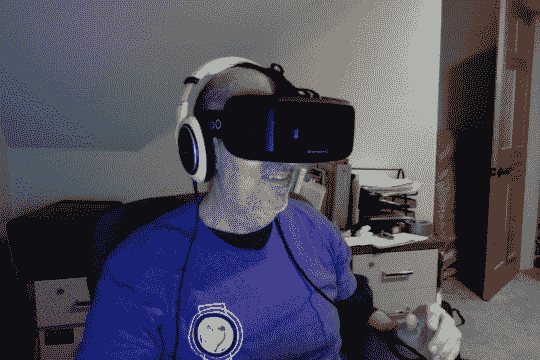
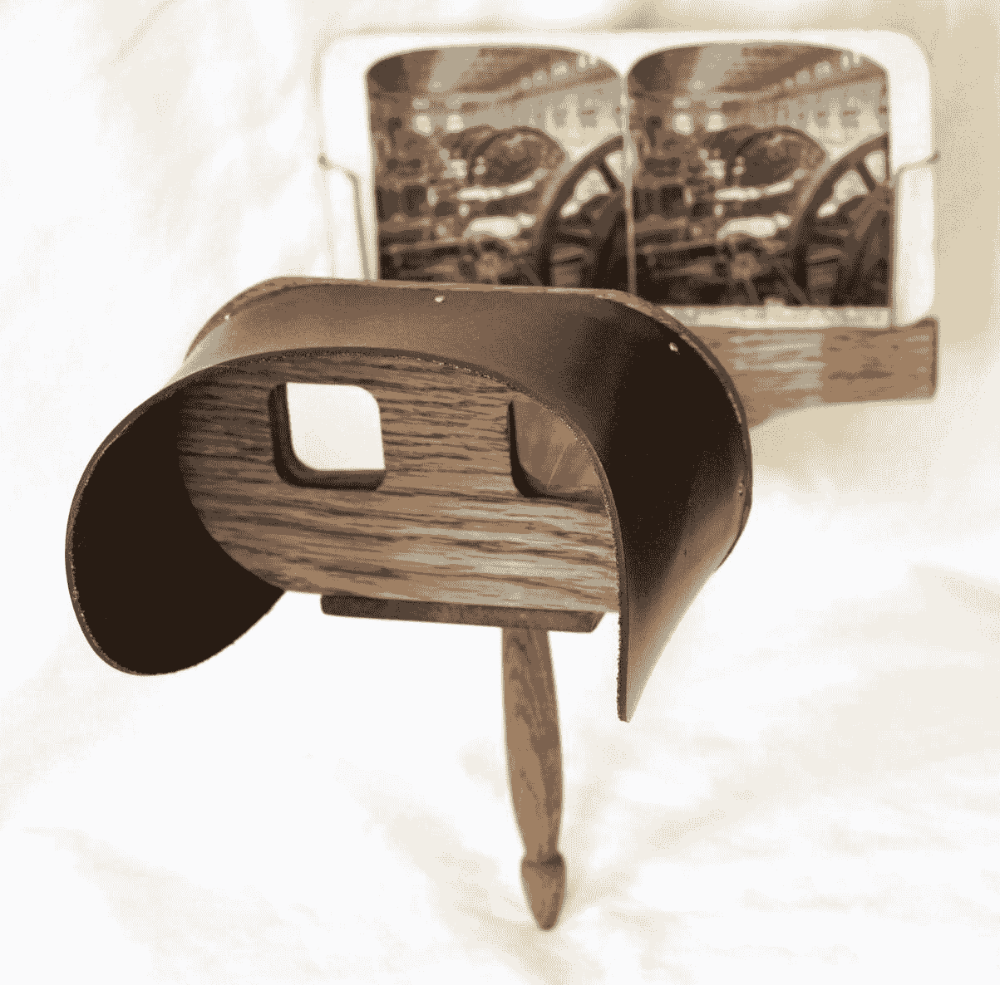

# 为每个人提供几乎一切

这种虚拟现实事物引发了一个问题，那就是“存在”意味着什么？

“在哪里？”

在手机出现之前，你会打电话给某人，这显然是没有意义的

说，“嘿，你在哪里？”你知道他们在哪里，你打电话到他们的家，

他们就在那里。

那么手机出现了，你开始听到人们说，“你好。哦，我在星巴克，”因为对方不一定知道你在哪里，因为你已经从家庭语音通信中解脱出来。

所以当我看到一款虚拟现实演示时，我脑海中浮现出这样的画面：回到家，我妻子已经把孩子们安顿好，她有几分钟的空闲时间，她正坐在沙发上，脸上戴着护目镜。我走过去轻轻拍她的肩膀，然后说：“嘿，你在哪里？”

这太奇怪了。那个人就坐在你面前，但你不知道他们在哪里。

-移动专家和播客主持人乔纳森·斯塔克

欢迎来到**虚拟现实**（**VR**）！在这本书中，我们将探讨如何自己创建虚拟现实体验。我们将通过一系列动手项目、逐步教程和深入讨论来探索，使用 Unity 3D 游戏引擎和其他免费或开源软件。尽管虚拟现实技术正在快速发展，但我们将尝试捕捉到你可以用来制作你的 VR 游戏和应用的基本原理和技术，使它们感觉沉浸且舒适。

在第一章中，我们将定义虚拟现实，并说明它不仅适用于游戏，还适用于许多其他感兴趣和富有成效的领域。本章讨论以下主题：

+   什么是虚拟现实？

+   虚拟现实与增强现实之间的区别

+   虚拟现实应用可能与虚拟现实游戏有何不同

+   虚拟现实体验的类型

+   开发 VR 所需的技术技能

# 虚拟现实对你来说意味着什么？

今天，我们是消费级虚拟现实蓬勃发展的见证者，这是一项令人兴奋的技术，它承诺从根本上改变我们与信息、朋友和整个世界互动的方式。

什么是虚拟现实？一般来说，VR 是计算机生成的 3D 环境模拟，对体验者来说，它看起来非常真实，使用特殊的电子设备。目标是实现强烈的沉浸感，让人感觉仿佛置身于虚拟环境中。

当前的消费级虚拟现实技术涉及佩戴 HMD（头戴式显示器护目镜）来观看立体 3D 场景。你可以通过移动头部来四处张望，通过使用手控或动作传感器来四处走动。你正参与一个完全沉浸式的体验。仿佛你真的在另一个虚拟世界中。以下图片展示了我在 2015 年体验的**Oculus Rift 开发套件 2**（**DK2**）：

虚拟现实并不新鲜。它已经存在了几十年，尽管它隐藏在学术研究实验室和高端工业和军事设施中。它体积庞大、笨重且昂贵。Ivan Sutherland 在 1965 年发明了第一个 HMD（见[`amturing.acm.org/photo/sutherland_3467412.cfm`](https://amturing.acm.org/photo/sutherland_3467412.cfm)）。它被固定在天花板上！在过去，已经尝试过几次将消费级虚拟现实产品推向市场，但都失败了。

2012 年，Oculus VR LLC 的创始人 Palmer Luckey 向著名游戏开发者 John Carmack 展示了一个临时制作的头戴式 VR 显示器。他们一起成功运行了一个**Kickstarter**活动，并向一个热情的社区发布了名为**Oculus Rift 开发套件 1**（**DK1**）的开发者套件。这引起了投资者以及马克·扎克伯格的注意，2014 年 3 月，Facebook 以 20 亿美元的价格收购了该公司。在没有产品、没有客户和无限前景的情况下，它吸引的资金和关注帮助推动了新型消费产品的诞生。

同时，其他人也在开发自己的产品，这些产品很快就被推向市场，包括 Steam 的 HTC VIVE、Google Daydream、索尼 PlayStation VR、三星 Gear VR、微软的沉浸式混合现实等。不断有新的创新和设备被引入，以增强 VR 体验。

大部分基础研究已经完成，技术现在也因为移动技术的广泛应用而变得可负担。有一个庞大的开发者社区，他们有制作 3D 游戏和移动应用的经验。创意内容制作者也加入了进来，媒体也在大肆宣传。最后，虚拟现实真的实现了！

什么？*虚拟现实真的实现了？*哈哈！如果它是虚拟的，那它怎么能……哦，算了。

最终，我们将超越对新兴硬件设备的关注，认识到*内容为王*。当前一代 3D 开发软件（商业的、免费的和开源的），催生了大量的独立游戏开发者，也可以用来构建非游戏 VR 应用。

虽然 VR 的主要爱好者在游戏社区，但其潜在的应用范围远不止于此。任何现在使用 3D 建模和计算机图形的业务，如果使用 VR 技术将会更加有效。VR 提供的沉浸式存在感可以增强今天所有常见的在线体验，包括工程、社交网络、购物、营销、娱乐和商业发展。在不久的将来，用 VR 头戴设备浏览 3D 网站可能和今天访问普通平面网站一样普遍。

# 头戴式显示器的类型

目前，虚拟现实头盔（HMD）主要有两大类——**桌面 VR**和**移动 VR**，尽管这些区别正变得越来越模糊。最终，我们可能就像谈论传统计算平台一样，按照操作系统来谈论它们——Windows、Android 或控制台 VR。

# 桌面 VR

在桌面 VR（和控制台 VR）中，您的头戴式设备是一个连接到更强大电脑的外部设备，该电脑处理重图形。电脑可能是一台 Windows PC、Mac、Linux 或游戏机，尽管 Windows 在 PC 中最为突出，而 PS4 在控制台 VR 方面是畅销产品。

很可能，头戴式设备通过有线连接到电脑。游戏在远程机器上运行，而 HMD 是一个带有运动感应输入的外部显示设备。术语*桌面*是一个不幸的错误名称，因为它同样可能被放置在客厅或书房。

**Oculus Rift**([`www.oculus.com/`](https://www.oculus.com/))是一个例子，其眼镜具有集成显示屏和传感器。游戏在单独的 PC 上运行。其他桌面头戴式设备包括**HTC VIVE**、索尼的**PlayStation VR**和**Microsoft immersive Mixed Reality**。

桌面 VR 设备依赖于桌面电脑（通常通过视频和 USB 线缆）的 CPU 和**图形处理单元**(**GPU**)功率，越多越好。请参考您特定设备的推荐规格要求。

然而，为了这本书的目的，我们的项目中不会有任何重渲染，你可以用最低的系统规格来应对。

# 移动 VR

移动 VR 起源于**Google Cardboard**([`vr.google.com/cardboard/`](https://vr.google.com/cardboard/))，这是一个简单的用于两个镜头和手机插槽的包装设备。手机的显示屏用于显示双立体视图。它具有旋转头部跟踪，但没有位置跟踪。Cardboard 还允许用户点击或*轻触*其侧面来在游戏中进行选择。图像的复杂性有限，因为它使用手机的处理器在手机显示屏上渲染视图。

Google Daydream 和 Samsung GearVR 通过要求更高的最低性能规格来改进平台，包括在手机中更大的处理能力。GearVR 的头戴式设备包括运动传感器以辅助手机设备。这些设备还引入了三**自由度**(**DOF**)手控制器，可以在 VR 体验中像激光笔一样使用。

新一代移动 VR 设备包括一体式头戴式设备，如 Oculus Go，内置显示屏和处理器，消除了对单独手机的需求。新机型可能包括深度传感器和空间映射处理器，以跟踪用户在 3D 空间中的位置。

重要的是，本书中的项目将探索从高端到低端消费级 VR 设备范围内的功能。但一般来说，我们的项目不需要太多的处理能力，也不需要高端 VR 功能，因此你可以在任何这些类型的设备上开始开发 VR，包括 Google Cardboard 和普通手机。

如果你感兴趣的是在 Android 上直接使用 Java 而不是通过 Unity 游戏引擎开发 Google Daydream 的 VR 应用程序，请参阅作者的另一本书，Packt Publishing 出版的《Cardboard VR Projects for Android》（[`www.packtpub.com/application-development/cardboard-vr-projects-android`](https://www.packtpub.com/application-development/cardboard-vr-projects-android)）。

# 虚拟现实与增强现实的区别

可能有必要澄清虚拟现实不是什么。

与 VR 相类似的一种技术是**增强现实**（**AR**），它将计算机生成的图像（CGI）与真实世界的视图相结合。随着苹果的 ARKit 和谷歌的 ARCore 的推出，智能手机上的 AR 最近引起了广泛关注。此外，Vuforia AR 工具包现在直接集成到 Unity 游戏引擎中，有助于推动该技术的进一步采用。移动设备上的 AR 将 CGI 叠加在来自摄像头的实时视频之上。

增强现实（AR）的最新创新是可穿戴的 AR 头戴设备，例如微软的**HoloLens**和**Magic Leap**，它们直接在你的视野中显示计算机图形。图形不会混合到视频图像中。如果 VR 头戴设备像封闭的眼镜，那么 AR 头戴设备就像半透明的太阳镜，将现实世界的光线与 CGI 结合在一起。AR 的一个挑战是确保 CGI 始终与真实世界空间中的对象对齐并映射，同时在移动过程中消除延迟，以便它们（CGI 和真实世界空间中的对象）保持对齐。

AR 在未来的应用方面与 VR 一样有潜力，但它有所不同。尽管 AR 旨在让用户在当前环境中参与其中，但虚拟现实是全沉浸式的。在 AR 中，你可能会打开手，看到一个小木屋就放在你的手掌上，但在 VR 中，你会直接被传送到小木屋内部，你可以在里面四处走动。

我们也开始看到结合了 VR 和 AR 功能的混合设备，并允许你在模式之间切换。

如果你感兴趣的是开发 AR 应用程序，请参阅作者由 Packt Publishing 出版的《Augmented Reality for Developers》（[`www.packtpub.com/web-development/augmented-reality-developers`](https://www.packtpub.com/web-development/augmented-reality-developers)）一书。

# 应用程序与游戏

消费级虚拟现实始于游戏。视频游戏玩家已经习惯了在高度互动的超真实 3D 环境中参与其中。VR 只是提高了门槛。

游戏玩家是高端图形技术的早期采用者。数千万台游戏主机和基于 PC 的组件的大规模生产和供应商之间的竞争导致价格降低和性能提升。游戏开发者也效仿这一做法，经常推动技术前沿，从硬件和软件中榨取每一分性能。玩家们对游戏的要求非常高，市场也一直努力满足他们的需求。因此，许多甚至可以说是大多数当前波次的 VR 硬件和软件公司，首先将目标定位在视频游戏行业。例如，Oculus Store 上的大多数 VR 应用，如 Rift([`www.oculus.com/experiences/rift/`](https://www.oculus.com/experiences/rift/))、GearVR([`www.oculus.com/experiences/gear-vr/`](https://www.oculus.com/experiences/gear-vr/))和 Google Play for Daydream([`play.google.com/store/search?q=daydream&c=apps&hl=en`](https://play.google.com/store/search?q=daydream&c=apps&hl=en))，都是游戏。当然，Steam VR 平台([`store.steampowered.com/steamvr`](http://store.steampowered.com/steamvr))几乎全部是关于游戏的。玩家是 VR 最热情的倡导者，并且非常重视其潜力。

游戏开发者知道，游戏的核心是**游戏机制**，即规则，这些规则在很大程度上独立于**皮肤**，即游戏的主题。游戏玩法机制可以包括谜题、运气、策略、时机或肌肉记忆。VR 游戏可以拥有相同的机制元素，但可能需要根据虚拟环境进行调整。例如，在控制台视频游戏中，一个第一人称角色行走可能比现实生活中的实际步伐快 1.5 倍。如果不是这样，玩家会感觉游戏太慢、太无聊。将同样的角色放入 VR 场景中，他们会觉得太快；如果玩家真的身处战区，这可能会让他们感到恶心。在 VR 中，你希望你的角色以正常的、地球上的步伐行走。并非所有视频游戏都能很好地映射到 VR 中；当你真的身处战区时，体验其中可能并不有趣。

话虽如此，虚拟现实也正在应用于游戏以外的领域。尽管游戏仍然很重要，但非游戏应用最终将超越它们。这些应用可能在许多方面与游戏不同，其中最显著的是对游戏机制的强调较少，而对体验本身或特定应用目标的强调较多。当然，这并不排除某些游戏机制。例如，应用可能专门设计来训练用户掌握特定技能。有时，将商业或个人应用**游戏化**可以使它更有趣，更有效地通过竞争驱动期望的行为。

通常来说，非游戏 VR 应用更注重的是体验本身，而非胜利。

这里有一些人们正在努力开发的非游戏应用的例子：

+   **旅游与观光**: 不必离开家就能游览远方的地方。在一个下午内参观巴黎、纽约和东京的艺术博物馆。在火星上散步。你甚至可以在佛蒙特州的冬日小屋中享受印度的春天色彩节——霍利节。

+   **机械工程与工业设计**: 计算机辅助设计软件，如 AutoCAD 和 SOLIDWORKS，开创了三维建模、仿真和可视化的先河。有了 VR，工程师和设计师可以在产品实际建造之前直接体验最终产品，并以极低的成本玩转各种假设情景。考虑迭代一个新汽车设计。它看起来如何？它的性能如何？坐在驾驶座上时它看起来如何？

+   **建筑与土木工程**: 建筑师和工程师总是构建他们设计的比例模型，无论是为了向客户和投资者推销想法，还是更重要的是，为了验证关于设计的许多假设。目前，建模和渲染软件通常用于从建筑平面图构建虚拟模型。有了 VR，与利益相关者的对话可以更加自信。其他人员，如室内设计师、暖通空调工程师和电气工程师，可以更早地参与到这个过程中。

+   **房地产**: 房地产经纪人一直是互联网和可视化技术的快速采用者，以吸引买家并完成销售。房地产搜索网站是互联网上最早的成功应用之一。今天，出售房产的在线全景视频浏览已成为常态。有了 VR，我可以在纽约，并找到在洛杉矶的住处。

+   **医学**: 虚拟现实在健康和医学方面的潜力可能真的是生死攸关的问题。每天，医院使用 MRI 和其他扫描设备来产生我们骨骼和器官的模型，这些模型用于医疗诊断和可能的术前规划。使用 VR 来增强可视化和测量将提供更直观的分析。虚拟现实还被用于手术模拟，以训练医学生。

+   **心理健康**: 虚拟现实体验已被证明在治疗环境中对治疗**创伤后应激障碍**（PTSD）非常有效，这被称为**暴露疗法**，在这种疗法中，患者在经过培训的治疗师指导下，通过重述经历来面对他们的创伤记忆。同样，VR 也被用于治疗蜘蛛恐惧症（对蜘蛛的恐惧）和对飞行的恐惧。

+   **教育**: 虚拟现实（VR）的教育机会几乎不言而喻。第一个成功的 VR 体验之一是**《太空巨兽》**，它让你能够亲身体验太阳系。在科学、历史、艺术和数学等领域，VR 将帮助所有年龄段的学生，因为正如他们所说，实地考察比教科书更有效。

+   **培训**：丰田展示了驾驶员教育的 VR 模拟，以教育青少年关于分心驾驶的风险。在另一个项目中，职业学生有机会体验操作起重机和其他重型建筑设备。通过展示高风险情况和替代虚拟场景，VR 可以增强对紧急响应人员、警察、消防和救援人员的培训。**国家橄榄球联盟**（**NFL**）和大学球队正在寻求 VR 进行运动训练。

+   **娱乐与新闻**：虚拟参加摇滚音乐会和体育赛事。观看音乐视频情色内容。仿佛亲自在场重新体验新闻事件。享受 360 度电影体验。虚拟现实将改变叙事艺术。

哇，这真是一个相当长的列表！这只是低垂的果实。

这本书的目的不是深入探讨这些应用中的任何一个。相反，我希望这次调查能激发你的思考，并为你提供一个关于虚拟现实如何为每个人提供几乎任何可能的潜在想法。

# 虚拟现实真正的工作原理

那么，是什么让每个人都对 VR 如此兴奋呢？戴上你的头戴式设备，你将体验到合成场景。它看起来是 3D 的，感觉是 3D 的，甚至你可能有一种实际上在虚拟世界中的感觉。显而易见的事情是：VR 看起来和感觉真的很酷！但为什么呢？

*沉浸感*和*临场感*是描述 VR 体验质量的两个词。终极目标就是将两者提升到极致，以至于你感觉如此真实，以至于你忘记了你在虚拟世界中。*沉浸感*是通过模拟你身体接收到的感官输入（视觉、听觉、运动等）而产生的。这可以从技术上解释。*临场感*是你被带到那里的直观感觉——一种深刻的情感或直觉感觉。你可以这样说，沉浸感是 VR 的科学，而临场感是艺术。而且，我的朋友，这很酷。

不同的技术和技巧结合在一起，使 VR 体验成为可能，这可以分为两个基本领域：

+   3D 观看

+   头部姿态跟踪

换句话说，显示屏和传感器，就像今天内置在移动设备中的那些，是 VR 今天可行且价格合理的主要原因。

假设 VR 系统知道在任何给定时刻你的头部位置。假设它可以立即渲染并立体显示这个精确视角的 3D 场景。那么，无论何时何地移动，你都会看到虚拟场景正如你应看到的那样。你将拥有几乎完美的视觉 VR 体验。这就是全部。*哇！*

嗯，慢一点。字面上的意思。

# 立体 3D 观看

分屏立体摄影是在摄影发明不久后发现的，就像下面图片中展示的 1876 年流行的立体照片观看器（B.W. Kilborn & Co，新罕布什尔州利特尔顿；参见[`en.wikipedia.org/wiki/Benjamin_W._Kilburn`](http://en.wikipedia.org/wiki/Benjamin_W._Kilburn)）。立体照片为左右眼睛提供了单独的视图，这些视图略微偏移以产生视差。这会让大脑误以为它是一个真正的三维视图。该设备包含为每只眼睛单独设计的镜头，让你可以轻松地近距离聚焦在照片上：

类似地，在 Unity 中，VR 功能相机的首要任务是渲染这些并排的立体视图。

假设你戴着 VR 头盔，并且你的头部保持非常静止，使得图像看起来像是冻结的。它仍然比简单的立体照片要好。为什么？

传统的立体照片具有相对较小的双图像，呈矩形装订。当你的眼睛聚焦在视图的中心时，3D 效果令人信服，但你仍会看到视图的边界。移动你的视线（即使头部不动），任何剩余的沉浸感都会完全消失。你只是一个在外的观察者，透过一个场景模型窥视。

现在，考虑一下没有头戴式设备时的 VR 屏幕是什么样的（参见下面的截图）：

你首先会注意到，每只眼睛都有一个桶形视野。为什么会这样？头戴式眼镜的镜头是一个非常广角镜头。所以，当你通过它看时，你会有一个很宽的视野。事实上，它如此之宽（且高），以至于扭曲了图像（**枕形效应**）。图形软件 SDK 执行这种扭曲的逆操作（**桶形扭曲**），使得通过镜头看起来是正确的。这被称为**眼动扭曲校正**。结果是，一个明显的**视野**（**FOV**）足够宽，可以包括更多的你的周边视野。例如，Oculus Rift 的 FOV 大约为 100 度。（我们在第十章中更多地讨论了 FOV，*使用所有 360 度*。）

当然，每只眼睛的视角也略微偏移，相当于你眼睛之间的距离或**瞳距**（**IPD**）。瞳距用于计算视差，并且人与人之间可能不同。（Oculus 配置实用程序附带了一个测量和配置你的 IPD 的实用程序。或者，你可以向眼科医生询问一个准确的测量值。）

这可能不太明显，但如果你仔细观察 VR 屏幕，你会看到颜色分离，就像从打印头没有正确对齐的彩色打印机中得到的那样。这是故意的。光线通过透镜时，根据光线的波长以不同的角度折射。再次强调，渲染软件执行了颜色分离的逆操作，以便对我们看起来是正确的。这被称为**色差校正**。它有助于使图像看起来非常清晰。

屏幕的分辨率也很重要，以获得令人信服的视觉效果。如果分辨率太低，你会看到像素，或者有些人称之为**屏幕门效应**。显示器的像素宽度和高度是在比较 HMD 时经常引用的规格，但**每英寸像素数**（**PPI**）可能更重要。显示技术方面的其他创新，如**像素模糊**和**视场渲染**（在眼球注视的地方显示更高分辨率的细节），也将有助于减少屏幕门效应。

在 VR 中体验 3D 场景时，你还必须考虑**每秒帧数**（**FPS**）。如果 FPS 太慢，动画看起来会不流畅。影响 FPS 的因素包括 GPU 性能和 Unity 场景的复杂性（多边形数量和光照计算），以及其他因素。在 VR 中，这个问题会加剧，因为你需要为每只眼睛绘制场景一次。技术创新，如针对 VR 优化的 GPU、帧插值和其他技术，将提高帧率。对我们开发者来说，Unity 中的性能调优技术，例如移动游戏开发者使用的那些技术，也可以应用于 VR。（我们将在第十三章优化性能和舒适度中更多讨论性能优化。）这些技术和光学有助于使 3D 场景看起来更真实。

声音也非常重要——比许多人意识到的更重要。VR 应该戴着立体声耳机来体验。事实上，当音频做得很好但图形相当糟糕时，你仍然可以有一个很好的体验。我们在电视和电影中经常看到这种情况。在 VR 中也是如此。双耳音频为每个耳朵提供了一个声音源的立体声**视图**，这样你的大脑就会想象它在 3D 空间中的位置。不需要特殊的听力设备。普通耳机就可以（扬声器不行）。例如，戴上你的耳机，访问[`www.youtube.com/watch?v=IUDTlvagjJA`](http://www.youtube.com/watch?v=IUDTlvagjJA)上的*虚拟理发店*。真正的 3D 音频提供了一种更逼真的空间音频渲染，其中声音会从附近的墙壁上反弹，并且可以被场景中的障碍物遮挡，以增强第一人称体验和现实感。

最后，VR 头盔应该舒适地贴合你的头部和面部，这样你很容易忘记你戴着它，并且应该阻挡来自你周围真实环境的灯光。

# 头部追踪

因此，我们有一个舒适的 3D 画面，可以在具有宽阔视野的 VR 头盔中观看。如果这就是全部，当你移动头部时，你会感觉好像有一个模型盒子粘在你的脸上。移动你的头部，盒子也会随之移动，这就像拿着古老的立体照片装置或童年的**观景大师**。幸运的是，VR 要好得多。

VR 头盔内部有一个运动传感器（IMU），它可以检测所有三个轴上的空间加速度和旋转速率，提供所谓的**六自由度**。这是在手机和一些游戏控制器中常见的技术。当你移动头部时，头盔上的传感器会计算当前视角，并在绘制下一帧图像时使用。这被称为**运动检测**。

上一代移动运动传感器足够我们用手机玩移动游戏，但对于 VR 来说，它的精度还不够。这些不准确（舍入误差）会随着时间的推移而累积，因为传感器每秒采样数千次，最终可能会失去在现实世界中的位置。这种*漂移*是老式的基于手机的 Google Cardboard VR 的一个主要缺陷。它能够感知你的头部运动，但失去了你头部方向的信息。当前一代的手机，如符合 Daydream 规范的 Google Pixel 和 Samsung Galaxy，已经升级了传感器。

高端 HMD 通过一个单独的*位置追踪*机制来处理漂移。Oculus Rift 使用*内向外位置追踪*，其中 HMD 上的红外 LED 阵列（不可见）由外部光学传感器（红外摄像头）读取，以确定你的位置。你需要保持在摄像头的*视野*内，头部追踪才能工作。

或者，Steam VR VIVE Lighthouse 技术使用*外向内位置追踪*，在房间内放置两个或多个简单的激光发射器（就像在杂货店结账处的条形码扫描仪中的激光一样），头盔上的光学传感器读取这些光线以确定你的位置。

Windows MR 头盔不使用外部传感器或摄像头。相反，它集成了摄像头和传感器，以执行你周围局部环境的空间映射，以便在现实世界的 3D 空间中定位和追踪你的位置。

无论哪种方式，主要目的是准确找到你的头部和其他类似装备的设备，如手持控制器。

位置、倾斜和头部的前进方向，或者说是*头部姿态*，由图形软件用来从这个视角重新绘制 3D 场景。Unity 等图形引擎在这方面做得非常好。

现在，假设屏幕以 90 FPS 的速度更新，而你正在移动你的头部。软件确定头部姿态，渲染 3D 视图，并将其绘制在 HMD 屏幕上。然而，你仍然在移动头部。所以，当它显示出来时，图像相对于你的当前位置有点过时。这被称为**延迟**，这可能会让你感到恶心。

由于 VR 中的延迟造成的运动病发生在你移动头部而你的大脑期望你周围的世界会精确同步变化的时候。任何可感知的延迟都可能让你感到不舒服，至少可以说。

延迟可以测量为从读取运动传感器到渲染相应图像的时间，或者称为*传感器到像素*的延迟。根据 Oculus 的 John Carmack 的说法：

总延迟为 50 毫秒会感觉响应迅速，但仍然有明显的延迟。20 毫秒或更少将提供被认为可接受的最低延迟水平。

有许多非常聪明的策略可以用来实现延迟补偿。这些细节超出了本书的范围，并且随着设备制造商对技术的改进，这些细节不可避免地会发生变化。其中一种策略是 Oculus 所说的**时间扭曲**，它试图通过渲染完成时猜测你的头部位置，并使用那个未来的头部姿态而不是实际检测到的姿态。所有这些都在 SDK 中处理，所以作为一个 Unity 开发者，你不需要直接处理它。

同时，作为 VR 开发者，我们需要意识到延迟以及其他导致运动病的原因。通过加快每帧的渲染（保持推荐的 FPS）可以减少延迟。这可以通过阻止你的头部移动得太快和使用其他技术让你感到稳定和舒适来实现。

另一件事是 Rift 为了改善头部跟踪和现实感所做的是，它使用颈部骨骼表示，以便所有接收到的旋转都能更准确地映射到头部旋转。例如，低头看你的膝盖会产生一个小小的向前平移，因为它知道在原地旋转头部向下是不可能的。

除了头部跟踪、立体摄影和 3D 音频之外，虚拟现实体验可以通过身体跟踪、手部跟踪（以及手势识别）、运动跟踪（例如，VR 跑步机）和带有触觉反馈的控制器来增强。所有这些的目标都是为了增强你在虚拟世界中的沉浸感和存在感。

# VR 体验类型

虚拟现实体验不仅仅是一种。实际上，有很多种。考虑以下类型的虚拟现实体验：

+   **场景**：在最简单的情况下，我们构建一个 3D 场景。你从第三人称视角观察。你的眼睛是相机。实际上，每只眼睛都是一个独立的相机，为你提供立体视图。你可以四处张望。

+   **第一人称体验**：这次，你将作为一个自由移动的虚拟形象沉浸在场景中。使用输入控制器（键盘、游戏控制器或某些其他技术），你可以四处走动并探索虚拟场景。

+   **交互式虚拟环境**：这就像第一人称体验，但它有一个额外的功能——当你处于场景中时，你可以与之交互的对象。物理在其中发挥作用。对象可能会对你做出反应。你可能会被赋予特定的目标去实现和与游戏机制相关的挑战。你甚至可能会获得分数并保持得分。

+   **3D 内容创作**：在 VR 中，创建可以在 VR 中体验的内容。"Google Tilt Brush"是第一批轰动一时的体验之一，"Oculus Medium"和"Google Blocks"以及其他也是如此。Unity 正在为 Unity 开发者开发**EditorXR**，以便他们可以直接在 VR 场景中工作在自己的项目上。

+   **轨道上骑行**：在这种体验中，你将坐着并通过环境（或环境围绕你变化）被运输。例如，你可以通过这种虚拟现实体验乘坐过山车。然而，这不一定是一个极端刺激的过山车。它可能是一个简单的房地产浏览体验，甚至是一个缓慢、轻松和冥想的体验。

+   **360 度媒体**：想象一下使用**GoPro**拍摄的强化全景图像，这些图像被投射在球体的内部。你位于球体的中心，可以四处环顾。一些纯粹主义者不认为这是**真正的**虚拟现实，因为你在看到的是一个投影而不是模型渲染。然而，它可以提供一种有效的存在感。

+   **社交 VR**：当多个玩家进入同一个 VR 空间并可以看到彼此的虚拟形象并与之交谈时，它成为一种显著的社会体验。

在本书中，我们将实施一系列项目，展示如何构建这些类型的 VR 体验。为了简洁，我们需要保持其纯粹和简单，并提供进一步研究的建议区域。

# 对 VR 重要的技术技能

书的每一章都介绍了如果你想要构建自己的虚拟现实应用，那么重要的新技术技能和概念。你将在本书中学到以下内容：

+   **世界规模**：在为 VR 体验构建时，注意 3D 空间和规模很重要。在 Unity 中，一个单位通常等于虚拟世界中的一米。

+   **第一人称控制**：有各种技术可以用来控制你的虚拟形象（第一人称摄像头）的运动、基于注视的选择、跟踪手输入控制器和头部动作。

+   **用户界面控制**：与传统的视频（和移动）游戏不同，在 VR 中，所有用户界面组件都在世界坐标中，而不是屏幕坐标中。我们将探讨如何向用户展示通知、按钮、选择器和其他**用户界面**（**UI**）控制，以便他们可以交互和做出选择。

+   **物理和重力**：在 VR 中的存在感和沉浸感至关重要的是世界的物理和重力。我们将利用 Unity 物理引擎的优势。

+   **动画**：在场景中移动对象被称为*动画*——当然！它可以是沿着预定义的路径，或者可能使用 AI（人工智能）脚本，该脚本根据环境中的事件遵循逻辑算法。

+   **多用户服务**：实时网络和多用户游戏不易实现，但在线服务使得实现变得容易，无需你是计算机工程师。

+   **构建**、**运行和优化**：不同的 HMD 使用不同的开发者工具包 SDK 和资产来构建针对特定设备的应用程序。我们将考虑让你可以使用单一界面针对多个设备的技术。理解渲染管线以及如何优化性能是 VR 开发的关键技能。

我们将使用 C#语言编写脚本，并在需要时使用 Unity 的功能来完成工作。

然而，有一些技术领域我们不会涉及，例如真实渲染、着色器、材质和照明。我们不会深入建模技术、地形或人形动画。我们也不会讨论游戏机制、动力学和策略。所有这些都是非常重要的主题，你可能需要学习（或你的团队成员需要学习），除了这本书之外，以构建完整、成功且沉浸式的 VR 应用程序。

那么，让我们看看这本书实际上涵盖了什么内容，以及它面向哪些读者。

# 这本书涵盖的内容

这本书采用了一种实用、基于项目的教学方法，通过使用 Unity 3D 游戏开发引擎来教授虚拟现实开发的细节。你将学习如何使用 Unity 2018 开发 VR 应用程序，这些应用程序可以通过 Oculus Rift 或 Google Cardboard 等设备以及各种介于两者之间的设备来体验。

然而，这里我们有一个小问题——技术正在非常快速地发展。当然，这是一个好问题。实际上，这是一个很棒的问题，除非你是项目中的开发者或这本书的作者！如何写一本书，使得它在出版当天就不会有过时的内容？

在整本书中，我试图提炼出一些超越任何短期虚拟现实技术进步的通用原则，以下是一些：

+   不同类型 VR 体验的分类以及示例项目

+   重要的技术思想和技能，尤其是与构建 VR 应用程序相关的内容

+   对 VR 设备和软件工作原理的一般解释

+   确保用户舒适并避免 VR 运动病的策略

+   使用 Unity 游戏引擎构建 VR 体验的说明

一旦 VR 变得主流，许多这些课程可能将变得显而易见而不是过时，就像 20 世纪 80 年代关于*如何使用鼠标*的解释在今天看起来很愚蠢一样。

# 你是谁？

如果你对虚拟现实感兴趣，想了解它是如何工作的，或者想自己创建 VR 体验，这本书就是为你准备的。我们将通过一系列动手项目、逐步教程和深入讨论，使用 Unity 3D 游戏引擎带你了解。

无论你是非程序员，对 3D 计算机图形不熟悉，还是既有经验但又是虚拟现实的新手，你都会从这本书中受益。这可能将是你的 Unity 初探，或者你可能有一些经验，但也不需要成为专家。然而，如果你是 Unity 的新手，只要你意识到你需要适应这本书的节奏，你就可以选择这本书。

游戏开发者可能已经熟悉书中的一些概念，这些概念被应用到 VR 项目中，以及许多特定于 VR 的其他想法。工程师和 3D 设计师可能理解许多 3D 概念，但他们可能希望学习如何使用游戏引擎进行 VR 开发。应用开发者可能会欣赏 VR 在非游戏领域的潜力，并想学习实现这一目标的工具。

无论你是谁，我们将把你变成一个*3D 软件 VR 忍者*。好吧，好吧，这可能对这个小书来说有点过分，但我们会尽力让你走上这条路。

# 摘要

在本章中，我们探讨了虚拟现实，并意识到它对不同的人意味着很多不同的事情，可以有不同的应用。没有单一的定义，它是一个不断变化的目标。我们并不孤单，因为每个人都在努力弄清楚。事实上，虚拟现实是一种新的媒介，可能需要数年，甚至数十年才能达到其潜力。

VR 不仅仅是游戏；它可以是许多不同应用的变革者。我们确定了十几个。有不同类型的 VR 体验，我们将在本书的项目中探讨。

VR 头戴式设备可以分为需要独立处理单元（如运行强大 GPU 的台式 PC 或游戏机）的，以及使用你的移动技术进行处理的。

我们都是生活在激动人心的时代的先驱。因为你正在阅读这本书，你也是其中之一。接下来发生的一切实际上取决于你。*预测未来的最佳方式就是创造它*。

那么，让我们开始吧！

在下一章中，我们将直接进入 Unity，创建我们的第一个 3D 场景，并了解世界坐标、缩放和导入 3D 资产。然后，在第三章，*VR 构建和运行*中，我们将在 VR 头戴式设备上构建和运行它，并讨论虚拟现实实际上是如何工作的。
