# 内容、对象和比例

你可能还记得小时候用鞋盒制作学校项目模型。今天，我们将使用 Unity 来完成这个项目。让我们组装我们的第一个场景，它由简单的几何物体组成。在这个过程中，我们会大量讨论**世界尺度**。然后我们将探索开发者和艺术家用于将资产导入 Unity 的各种 3D 内容创建工具。在本章中，我们将讨论以下主题：

+   Unity 3D 游戏引擎的简要介绍

+   在 Unity 中创建一个简单的模型

+   制作一些测量工具，包括单位立方体和网格投影仪

+   使用**Blender**创建一个带有纹理贴图的立方体并将其导入 Unity

+   使用 Google Tilt Brush 创建 3D 草图并通过 Google Poly 将其导入 Unity

+   使用实验性的 Unity EditorXR 工具直接在 VR 中编辑场景

# 开始使用 Unity

如果你还没有在 PC 上安装 Unity 3D 游戏引擎应用程序，现在就安装它！功能齐全的**个人版**是免费的，并且可以在 Windows 和 Mac 上运行。要获取 Unity，请访问[`store.unity.com/`](https://store.unity.com/)，选择你想要的版本，点击“下载安装程序”，然后继续按照说明操作。本书假设你拥有 Unity 2017.2 或更高版本。

对于那些初学者，我们将以缓慢而细致的方式处理这个第一部分，比书中后面的部分提供更多的指导。此外，即使你已经熟悉 Unity 并开发了你的游戏，回顾基本概念也可能是有价值的，因为在为虚拟现实设计时，规则有时是不同的。

# 创建一个新的 Unity 项目

让我们创建一个名为`VR_is_Awesome`的新 Unity 项目，或者你可以取你喜欢的任何名字。

要创建一个新的 Unity 项目，从你的操作系统启动 Unity，将出现打开对话框。从这个对话框中，选择“新建”，这将打开一个“新建项目”对话框，如下面的截图所示：

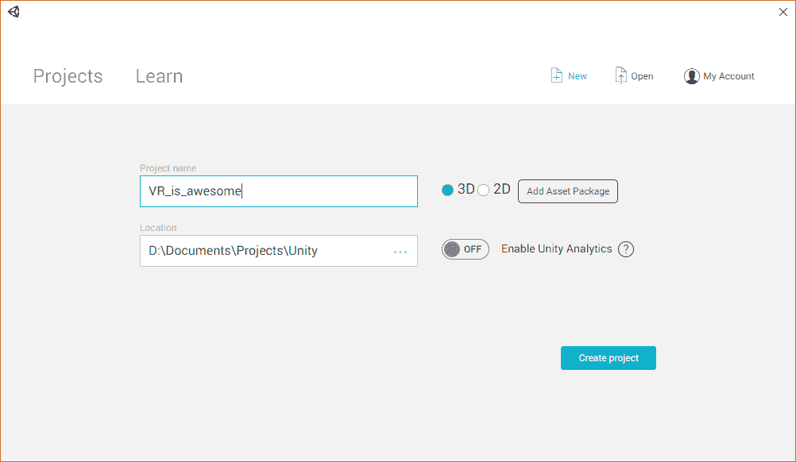

填写你的项目名称，并确认文件夹位置是你想要的。确保 3D 被选中（在右侧）。目前不需要添加任何额外的资产包，因为我们稍后如果需要会引入它们。点击“创建项目”。

Unity 2018 引入了 Unity Hub 工具，用于管理多个 Unity 版本和项目。如果你使用 Unity Hub，你可以为你的项目选择“3D”模板，或者选择较新的 VR 渲染管道模板。

# Unity 编辑器

你的新项目将在 Unity 编辑器中打开，如下面的截图所示（我在这里自定义了窗口面板布局以方便讨论，并标记了可见的面板）：

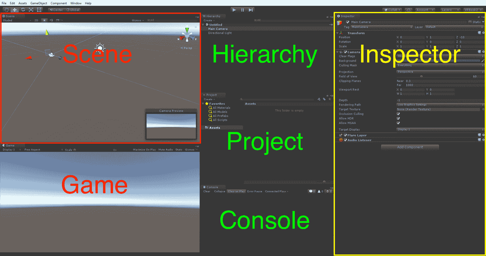

Unity 编辑器由多个非重叠窗口或*面板*组成，这些面板可以进一步细分为*窗格*。以下是前面布局图像中显示的每个面板的简要说明（您的布局可能不同）：

+   在左上角（已突出显示）的场景面板是您可以直观地组合当前场景的 3D 空间的地方，包括对象的放置。

+   在场景面板下方是游戏视图（左下角），它显示实际的摄像机视图（目前，它是空的，有一个环境天空）。在**播放模式**下，您的游戏将在该面板中运行。

+   在中间，我们安排了层次结构、项目和控制台面板（从上到下依次排列）。

+   层次结构面板提供当前场景中所有*对象*的树形视图。

+   项目面板包含项目中所有可重用的资源，包括导入的以及您在过程中创建的。

+   控制台面板显示 Unity 的消息，包括代码脚本中的*警告和错误*。

+   在右侧是检查器面板（已突出显示），其中包含当前选中对象的属性。（通过在场景、层次结构或项目面板中单击对象来选择对象）。检查器面板为对象的每个组件提供单独的窗格。

+   在顶部是主菜单栏（在 Mac 上，这将在屏幕顶部，而不是 Unity 窗口的顶部）。有一个工具栏区域，其中包含我们稍后将要使用的各种控件，包括**播放**（三角形图标）按钮，该按钮启动播放模式。

从主菜单栏的“窗口”菜单中，您可以根据需要打开额外的面板。编辑器的用户界面是可配置的。每个面板都可以通过抓住其中一个面板标签并拖动它来重新排列、调整大小和分页。试试看！在上右角有一个布局选择器，让您可以选择各种默认布局或保存自己的首选项。

# 默认世界空间

默认的空 Unity 场景包含一个主摄像机对象和一个单独的方向光对象，如层次结构面板中列出并在场景面板中所示。场景面板还显示一个无限参考地面平面网格的透视，就像一张没有任何东西的图表纸。网格跨越*x*（红色）和*z*（蓝色）轴。*y*轴（绿色）向上。

记住 Gizmo 轴颜色的简单方法是记住 R-G-B 对应于*X-Y-Z*。

检查器面板显示了当前选中项的详细信息。使用鼠标选择方向光，无论是从层次列表中还是场景本身，然后查看检查器面板中与对象关联的每个属性和组件，包括其变换。对象的变换指定了其在 3D 世界空间中的位置、旋转和缩放。例如，位置 (0, 3, 0) 是在地面平面中心（*X* = `0`, *Z* = `0`）上方 3 个单位（在 *Y* 方向上）。旋转 (`50`, `330`, `0`) 意味着它在 *x* 轴上旋转了 50 度，在 *y* 轴上旋转了 330 度。正如你将看到的，你可以在这里以数值方式更改对象的变换，或者直接在场景面板中使用鼠标。

类似地，如果你点击主相机，它可能位于 (`0`, `1`, `-10`) 位置，并且没有旋转。也就是说，它正对着前方，指向正 *Z* 方向。

当你选择主相机，如前一个编辑器截图所示，在场景面板中添加了一个相机预览嵌入，显示了相机当前看到的视图。（如果游戏标签页是打开的，你也会在那里看到相同的视图）。目前，视图是空的，参考网格没有渲染，但可以辨认出模糊的地平线，下面是灰色地面平面，上面是蓝色的默认环境 Skybox。

# 创建一个简单的微缩景观

现在，我们将向场景中添加一些对象来设置环境，包括一个单位立方体、一个平面、一个红色球体和一个摄影背景。以下是我们在 VR 中将要构建的微缩景观的实物模型照片：

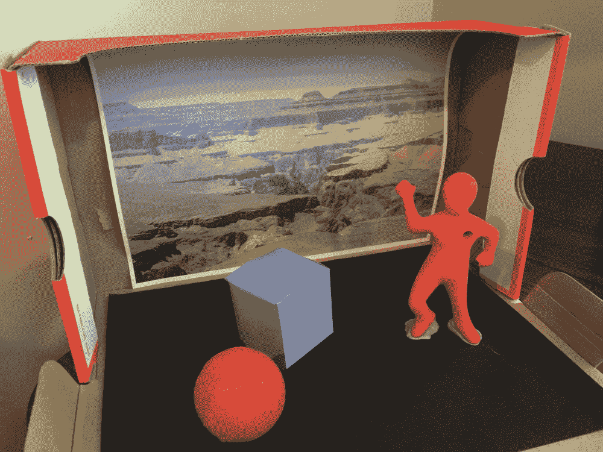

# 添加立方体

让我们向场景中添加第一个对象：一个单位大小的立方体。

在层次面板中，使用创建菜单并选择 3D Object | Cube。同样的选择也可以在主菜单栏的 GameObject 下拉菜单中找到。

场景中添加了一个默认的白色立方体，位于地面平面上（0, 0, 0）的位置，没有旋转，缩放为 1，正如你在检查器面板中所见。这是重置设置，可以在检查器面板的对象变换组件中找到。

变换组件的重置值是位置 (`0`, `0`, `0`), 旋转 (`0`, `0`, `0`), 和缩放 (`1`, `1`, `1`)。

如果由于某种原因你的立方体有其他的变换值，请在检查器面板中设置这些值，或者定位检查器面板右上角的的小 *齿轮* 图标，点击它，并选择重置。

这个立方体的每一边都是一单位。正如我们稍后将会看到的，Unity 中的一个单位对应于世界坐标中的一米。它的局部中心是立方体的中心。

# 添加平面

现在，让我们向场景中添加一个地面平面对象。

在层次面板中，点击创建菜单（或主 GameObject 菜单）并选择 3D Object | Plane。

场景中添加了一个默认的白色平面，位于地面平面上，位置为(`0`, `0`, `0`)。如果需要，可以从检查器面板的变换组件的*齿轮*图标中选择重置。将其重命名为`GroundPlane`。

注意，在`1`, `1`, `1`的比例下，Unity 的平面对象实际上在 X 和 Z 方向上测量 10x10 个单位。换句话说，`GroundPlane`的大小是 10x10 个单位，其变换的缩放比例是 1。

立方体位于位置(`0`, `0`, `0`)的中心，就像地面平面一样。然而，可能在你看来并不如此。场景面板可能显示透视投影，将 3D 场景渲染到 2D 图像上。透视畸变使得立方体看起来没有在地面平面上居中，但实际上它是。数一数立方体两侧的网格线。正如你所看到的，当你在 VR 中查看时，你实际上站在场景中，它看起来根本不会扭曲。以下是一个截图：

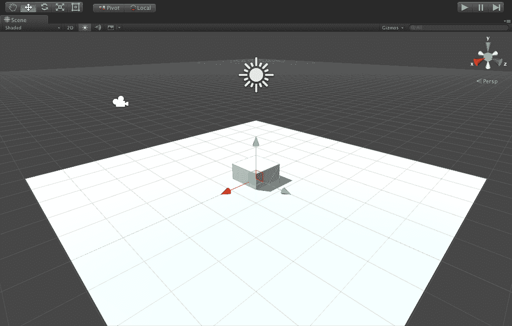

立方体被埋在地面平面上，因为它的局部原点位于其几何中心——它的大小为 1x1x1，其中心点为(0.5, 0.5, 0.5)。这听起来可能很显然，但模型的原点可能不是其几何中心（例如其一个角）。变换组件的位置是物体的局部原点在世界空间中的位置。让我们按照以下方式移动立方体：

1.  将立方体移动到地面平面的表面上——在检查器面板中，将其 Y 位置设置为 0.5：位置(`0`, `0.5`, `0`)。

1.  让我们在*y*轴周围稍微旋转一下立方体。将其 Y 旋转输入为 20：旋转(`0`, `0.5`, `0`)。

注意它旋转的方向。那是顺时针 20 度。用你的左手做一个点赞的手势。看看你的手指指向的方向？Unity 使用的是左手坐标系。（坐标系的手性没有标准。一些软件使用左手性，而另一些则使用右手性）。

Unity 使用的是左手坐标系。而且*y*轴是向上的。

# 添加球体和一些材质

接下来，让我们添加一个球体。从菜单中选择 GameObject | 3D Object | Sphere。

与立方体一样，球体的半径为 1.0，其原点位于中心。（如果需要，可以从检查器面板变换组件的*齿轮*图标中选择重置）。由于它被嵌入在立方体中，很难看到球体。我们需要移动球体的位置。

这次，让我们使用场景面板的**Gizmos**组件来移动对象。在场景视图中，你可以选择图形控件，或 Gizmos，来操纵对象的变换，如以下 Unity 文档截图所示([`docs.unity3d.com/Manual/PositioningGameObjects.html`](http://docs.unity3d.com/Manual/PositioningGameObjects.html))：

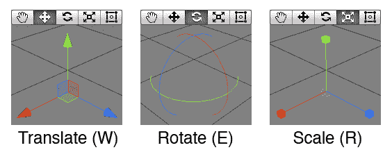

在场景面板中，选择球体后，确保翻译工具处于激活状态（位于左上角图标工具栏的第二个图标）并使用*x*、*y*和*z*轴的箭头来定位它。我将其留在了位置（`1.6`，`0.75`，`-1.75`）。

**Gizmo**是一种图形控件，允许你操纵对象或视图的参数。Gizmos 有可以点击并拖动的抓点或把手。

在我们进一步操作之前，让我们按照以下方式保存我们的工作：

1.  从主菜单栏选择文件 | 保存场景为...并将其命名为`Diorama`。

1.  此外，导航到文件 | 保存项目以备不时之需。注意，在项目面板中，新的场景对象被保存在顶级 Assets 文件夹中。

让我们通过制作一些彩色材质并将它们应用到我们的对象上来给场景添加一些颜色。按照以下步骤操作：

1.  在项目面板中，选择顶级 Assets 文件夹，然后选择创建 | 文件夹。将文件夹重命名为`Materials`。

1.  在选择`Materials`文件夹后，选择创建 | 材质，并将其重命名为`Red Material`。

1.  在检查器面板中，点击 Albedo 右侧的白色矩形，这将打开颜色面板。选择一个鲜艳的红色。

1.  重复前面的步骤以创建一个`Blue Material`。

1.  从层次结构（或场景）面板中选择球体。

1.  将`Red Material`从项目面板拖动到球体的检查器面板中。球体现在应该看起来是红色的。

1.  从场景（或层次结构）面板中选择立方体。

1.  这次，将`Blue Material`从项目面板拖动到场景中，并将其放在立方体上。现在它应该看起来是蓝色的。

保存你的场景和项目。这是我现在的场景样子（你的可能略有不同，但没关系）：

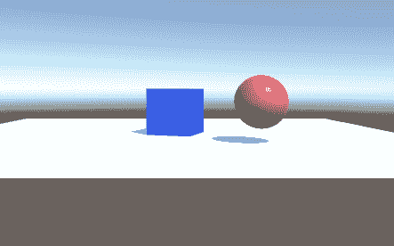

注意，我们正在使用项目面板中`/Assets/`目录下的文件夹来组织我们的内容。

# 改变场景视图

你可以通过多种方式随时更改场景视图，这取决于你是否有三按钮鼠标、双按钮鼠标，或者只有一个按钮的 Mac。在 Unity 手册中查找相关信息，手册可以在[`docs.unity3d.com/Manual/SceneViewNavigation.html`](http://docs.unity3d.com/Manual/PositioningGameObjects.html)找到，以了解哪些操作适合你。

通常，左/右鼠标点击与*Shift* + *Ctrl* + *Alt*键的组合可以执行以下操作：

+   在场景中拖动相机。

+   围绕当前旋转点旋转相机。

+   缩放。

+   按下*Alt*并右击，可以向上、向下、向左和向右摆动当前眼球的旋转。

+   当**手**工具被选中（在上左图标栏中）时，右鼠标按钮移动眼球。鼠标的中击也做类似的事情。

在场景面板右上角，你有 **场景视图** Gizmo，它如以下屏幕截图所示描绘了当前场景视图方向。例如，它可能指示透视视图，其中 x 向左延伸，z 向右延伸：

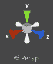

你可以通过点击以下屏幕截图所示的相应彩色锥体来将视图直接沿任意三个轴之一查看。点击中心的小立方体将透视视图更改为正交（非扭曲）视图：

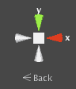

在继续之前，让我们首先将场景视图与主相机方向对齐。你可能记得我提到默认相机方向（`0`，`0`，`0`）是朝向正 z 方向（从后向前）。按照以下步骤操作：

1.  点击场景视图 Gizmo 上的白色 z 锥体，从背面（背面方向）调整视图，向前看。

1.  此外，使用手柄工具（或中间鼠标按钮）稍微向上滑动视图。

现在，当你选择主相机组件（从层次面板中），你会看到场景视图大致与相机预览相似，朝向相同方向。（参见下一节中显示的屏幕截图，了解添加照片后此视图方向下的场景和预览看起来如何。）

要查看 Unity 快捷键的完整列表，请参阅 [`docs.unity3d.com/Manual/UnityHotkeys.html`](https://docs.unity3d.com/Manual/UnityHotkeys.html)。

# 添加照片

现在，让我们为我们的展品大屏幕背景添加一张照片。

在计算机图形学中，映射到对象上的图像称为 **纹理**。虽然对象以 x、y 和 z 世界坐标表示，但纹理被认为是在 U、V 坐标（如像素）中。我们将看到纹理和 UV 映射可能有自己的缩放问题。按照以下步骤操作：

1.  通过导航到 GameObject | 3D Object | Plane 创建一个平面，并将其重命名为 `PhotoPlane`。

1.  重置平面的变换。在检查器面板中，找到变换面板右上角的 *齿轮* 图标。点击此图标并选择重置。

1.  接下来，围绕 *z* 轴旋转 90 度（将其变换组件的旋转值 z 设置为 -90）。那就是 *负 90 度*。所以，它现在是垂直于地面的站立状态。

1.  围绕 *y* 轴旋转 90 度，使其正面朝向我们。

1.  将其移动到地面平面的末端，位置值为 *z* = `5` 以上，位置值为 y = `5`（你可能记得地面平面是 10 x 10 单位）。

1.  从你的电脑中选择任何照片，使用 Windows 资源管理器或 Mac Finder 粘贴到这张照片平面上。（或者，你可以使用本书附带的自带的 `GrandCanyon.jpg` 图像）。

1.  在项目面板中，选择顶级资产文件夹，导航到创建 | 文件夹。将文件夹重命名为 `Textures`。

1.  将照片文件拖入`Assets/Textures`文件夹。它应该会自动导入为纹理对象。或者，你可以在资产文件夹上右键单击，选择“导入新资产...”，然后导入图片。

在项目面板中选择新的图像纹理，并在检查器面板中查看其设置。对于 Unity 的渲染目的，即使原始照片是矩形的，纹理现在是正方形（例如，2048 x 2048）并且看起来有点挤压。当你将其映射到正方形面上时，它也会在那里挤压。让我们执行以下步骤：

1.  将照片纹理从项目面板拖动到照片平面（在场景面板中）。

哎呀！在我的情况下，图片是侧着旋转的——你的也是吗？

1.  选择`PhotoPlane`（照片平面）并设置变换组件的 X 旋转值为`90`度。

好了，它现在是垂直的，但仍然有点挤压。让我们来修复这个问题。检查你照片的原始分辨率并确定其纵横比。我的`Grand Canyon`图像是 2576 x 1932。当你将其宽度除以高度时，你会得到 0.75 的比率。

1.  在 Unity 中，将`PhotoPlane`平面的变换组件的 Z 缩放值设置为`0.75`。

因为它的缩放原点是中心，我们还得把它向下移动一点。

1.  将 y 的位置值设置为`3.75`。

为什么是 3.75？高度从 10 开始。所以，我们将其缩放到 7.5。对象的缩放是相对于它们的原点。所以现在，高度的一半是 3.75。我们想要将背景的中心定位在地面平面上方 3.5 个单位处。

我们已经设置了大小和位置，但照片看起来有点褪色。这是因为场景中的环境光照影响了它。你可能想保持这种状态，尤其是在你构建更复杂的照明模型和材质时。但现在，我们将取消照明。

在选择`PhotoPlane`后，注意在检查器面板中，照片的纹理组件的默认着色器组件设置为标准。将其更改为 Unlit | Texture。

这是我看起来像的；你的应该类似：

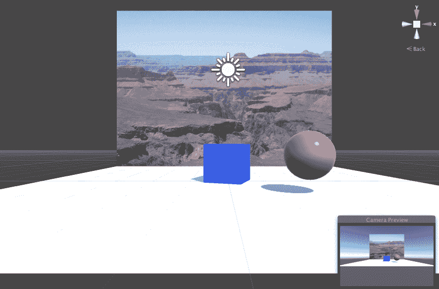

好了！看起来相当不错。保存你的场景和项目。

你可能会注意到，飞机只能从前方看到。计算机图形中的所有表面都有一个面向前方的方向（法向量）。视图相机必须朝向前方，否则对象将不会被渲染。这是一个性能优化。如果你需要一个**平面**两面都有面，可以使用一个薄薄的立方体，或者两个相互远离的单独平面。

注意，如果你现在检查你的材质文件夹，你会发现在 Unity 已经为你自动创建了一个名为`GrandCanyon.mat`的材质，它使用了`GrandCanyon.jpg`纹理。

# 着色地面平面

如果你想要更改地面平面的颜色，创建一个新的材质（在项目面板中），命名为`Ground`，并将其拖动到地面平面上。然后，更改其 Albedo 颜色。我建议使用滴管（图标）从你的照片平面的图像中选择一种土色调。

# 测量工具

我们已经创建了一个 Unity 场景，添加了一些原始的 3D 对象，并创建了一些基本的纹理，包括一张照片。在这个过程中，我们学习了如何在 Unity 的 3D 世界空间中定位和变换对象。问题是场景中实际物体的尺寸并不总是显而易见。你可能已经放大了视图，或者你可能正在使用透视或正交视图，或者其他影响可见尺寸的功能。让我们看看如何处理比例问题。

# 保持单位立方体在手边

我建议在层次面板中保持一个单位立方体在手边。当它不再需要时，只需禁用它（在检查器面板的左上角取消勾选复选框）。当需要时，它可以像尺子一样使用，或者更确切地说，像测量块一样使用。我使用它来估计物体的实际世界尺寸、物体之间的距离、高度和海拔等等。现在让我们来做这件事。

创建一个单位立方体，命名为`Unit Cube`，并将其放置在某个不易见到的位置，例如位置(`-2`, `0.5`, `-2`)。

目前先保持启用状态。

# 使用网格投影仪

我想向大家介绍**网格投影仪**，这是一个方便的工具，用于在任意 Unity 场景中可视化比例。它是效果包中的标准资源之一。因此，你可能需要将其导入到你的项目中。导入时，请执行以下步骤：

1.  在主菜单栏中选择“资产”，然后导航到“导入包”|“效果”。

1.  导入对话框弹出，包含可以导入的所有内容的列表。然后选择“导入”。

如果你找不到导入的`Effects`包，那么在你安装 Unity 时可能没有安装`Standard Assets`。要获取它们，你需要再次运行`UnityDownloadAssistant`，如本章开头所述（它可能已经在你`下载`文件夹中）。

现在，我们将按照以下步骤将投影仪添加到场景中：

1.  通过导航到`Assets/Standard Assets/Effects/Projectors/Prefabs`文件夹，在项目面板中找到网格投影仪预制体。

1.  将网格投影仪的一个副本拖动到你的场景中。将位置`y`值设置为`5`，使其位于地面平面之上。

默认的网格投影仪朝下（x 旋转值为 90），这通常是我们的需求。在场景视图中，你可以看到正交投影的射线。Unity 文档([`docs.unity3d.com/Manual/class-Projector.html`](http://docs.unity3d.com/Manual/class-Projector.html))对投影仪的描述如下：

投影仪允许你将材质投影到与其视锥体相交的所有对象上。

这意味着被投影射线相交的物体将接收到投影的材质。

在这种情况下，正如你所期望的，投影器材质（也称为 `GridProjector`）有一个 *网格* 纹理，看起来就像一个十字准星。（你自己看看，在 `Assets/.../Projectors/Textures/Grid` 对象中）。

默认情况下，投影器将网格图案作为光投射到它照亮的表面上。在我们的场景中，`GroundPlane` 平面是浅色。因此，网格可能不会显示出来。现在，按照以下步骤操作：

在层次结构面板中选择 Grid Projector，在检查器面板中找到 `GridProjector` 材质组件，并将其着色器从投影器/光更改为投影器/乘法。

现在它将白色网格线画成黑色。为了更好地了解正在发生的事情，将场景视图更改为俯视图方向，如下所示：

1.  点击视图面板右上角的场景视图 Gizmo 上的绿色 y 球锥。

1.  此外，点击 Gizmo 中心的立方体，从透视视图更改为正交（平坦）视图。

你现在应该正对着地面平面直视。选择 Grid Projector（确保翻译工具是激活的，这是左上角图标工具栏中的第二个图标），你可以抓住附加到投影器的平移 Gizmo 并将其从一侧移动到另一侧。网格线会相应地移动。你可能将其留在位置（`-2.5`，`5`，`-0.5`）并避免投影器 Gizmo 阻挡方向光。

到目前为止，内置视图参考网格可能有些令人困惑。因此，按照以下方式将其关闭：

1.  在场景视图面板中，点击 Gizmos（这个名称的菜单，其中包含控制你的 Gizmos 的选项）并取消勾选显示网格。

好的，这能给我们带来什么？我们可以看到默认的网格大小是单位立方体边长的一半。在检查器中，投影器组件的正交大小值是 `0.25`。

1.  将投影器的正交大小值从 `0.25` 更改为 `0.5`。

1.  保存场景和项目。

现在我们有一个单位网格，可以在需要时随时打开并投射到场景中。

现在先让它保持，因为它看起来有点酷，如下面的截图所示：

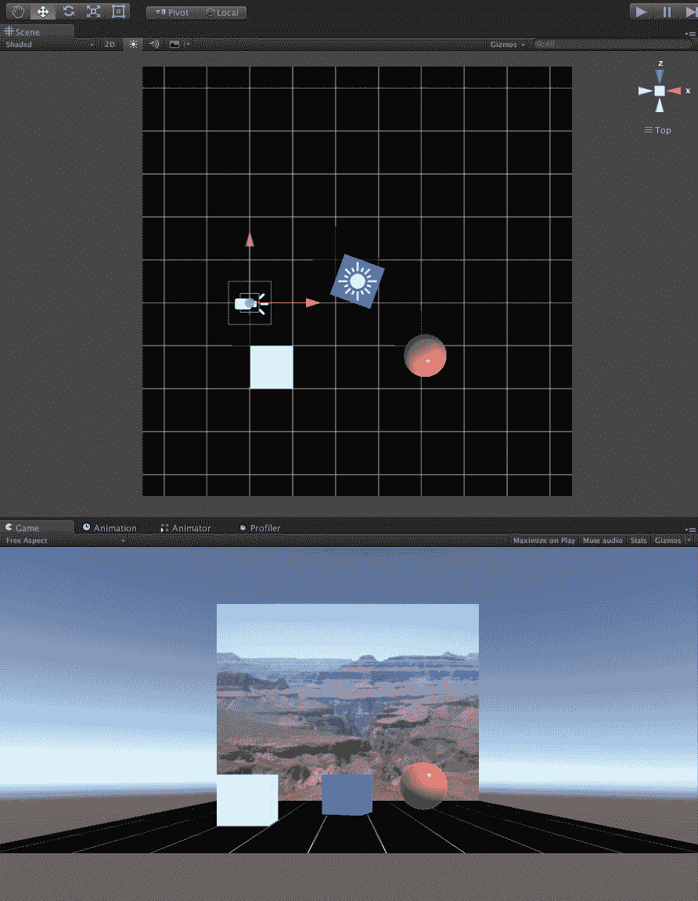

# 测量 Ethan 角色尺寸

一个化身有多大？Unity 随附一个名为 `Ethan` 的第三人称角色。让我们将其添加到我们的场景中。他是 `Characters` 包中的 `Standard Assets` 之一。因此，你可能需要将其导入到你的项目中。

要导入，请执行以下步骤：

1.  在主菜单栏中选择 Assets，然后导航到导入包 | 角色。

1.  导入对话框弹出，包含可以导入的所有内容的列表。点击全部，然后导入。`ThirdPersonController` 是位于项目面板中的预制件（预构建资产）。可以通过导航到 `Assets/Standard Assets/Characters/ThirdPersonCharacter/Prefabs` 文件夹找到它。

1.  将`ThirdPersonController`的副本拖入你的场景中。确切的 x 和 z 位置不重要，但将 y 设置为`0`，以便名为`Ethan`的角色站在`GroundPlane`上。我的是在(`2.2`, `0`, `0.75`)。

让我们试试看：

1.  点击 Unity 窗口中央顶部的*播放*图标，开始你的游戏。使用*W*, *A*, *S*, 和 *D* 键移动他。*跑，Ethan！跑！*

1.  再次点击*播放*图标停止游戏并返回编辑模式。

那么，Ethan 有多高呢？根据谷歌搜索，人类男性的平均身高是 5 英尺 6 英寸，或 1.68 米（在美国，成年男性的平均身高更像是 5 英尺 10 英寸或 1.77 米）。让我们看看 Ethan 与这些数值相比有多高：

+   使用平移工具将单位立方体移至 Ethan 旁边

好的，他大约是立方体高度的 1.6 倍

+   将单位立方体的高度（y）缩放至 1.6，并将 y 位置居中至 0.8

再看一眼。如图所示，他并不完全是 1.6 倍。所以，Ethan 比平均男性略矮（除非你包括他的尖头发型）。我调整视角，正对着 Ethan 的脸，通过进一步调整立方体，眼睛水平大约是 1.4 米。记下这个：

1.  恢复单位立方体的缩放（`1`,`1`,`1`）和位置（`-2`, `0.5`, `-2`）

1.  保存场景和项目

以下截图显示了单位立方体和 Ethan 的比较：

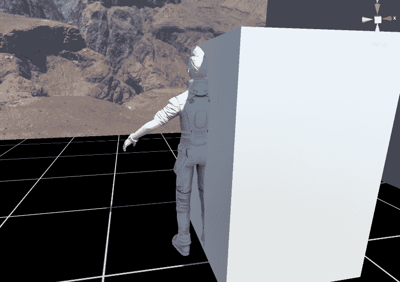

# 使用第三方内容

到目前为止，我们已经向你展示了如何使用 Unity 创建场景并提高效率，但内容相当简单。本质上，Unity 不是一个 3D 建模或资产创建工具。相反（正如名称*Unity*所暗示的），它是一个统一平台，用于从各种来源收集内容，以组装和编程涉及动画、物理、渲染效果等的游戏或体验。如果你是 3D 艺术家，你可能知道如何在 Blender、3D Studio Max 或 Maya 等程序中创建内容。如果不是，你可以在网上找到大量的模型。

一个极好的来源是**Unity Asset Store**([`www.assetstore.unity3d.com/en/`](https://www.assetstore.unity3d.com/en/))。许多资产包是免费的，特别是入门级套件，如果你想要更多，可能需要付费升级。如果你正在寻找一些东西来启动你的学习和实验项目，以下是我的一些免费精选：

+   自然入门套件 1 和 2([`assetstore.unity.com/packages/3d/environments/nature-starter-kit-1-49962`](https://assetstore.unity.com/packages/3d/environments/nature-starter-kit-1-49962))

+   薄雾天空盒([`assetstore.unity.com/packages/2d/textures-materials/sky/wispy-skybox-21737`](https://assetstore.unity.com/packages/2d/textures-materials/sky/wispy-skybox-21737))

+   地球行星免费版([`assetstore.unity.com/packages/3d/environments/sci-fi/planet-earth-free-23399`](https://assetstore.unity.com/packages/3d/environments/sci-fi/planet-earth-free-23399))

+   无缝纹理包 ([`assetstore.unity.com/packages/2d/textures-materials/seamless-texture-pack-21934`](https://assetstore.unity.com/packages/2d/textures-materials/seamless-texture-pack-21934))

+   当然，还有可爱的雪人 ([`assetstore.unity.com/packages/3d/props/cute-snowman-12477`](https://assetstore.unity.com/packages/3d/props/cute-snowman-12477))

除了 3D 模型之外，资产商店还包含了一个令人惊叹的开发工具、插件、音频等的混合体。资产商店、其活跃的开发者社区以及其庞大的内容量是 Unity 成功的原因之一。

资产商店可以直接在 Unity 编辑器中访问。要访问它，选择**窗口** | **资产商店**并开始探索。

要使用资产商店将资产添加到你的项目中，例如，只需找到它并选择下载，然后选择导入以将其添加到你的`项目资产`文件夹。资产包通常包含你可以打开以探索其外观和功能的示例场景。之后，找到其`预制体`文件夹，只需将任何预制体拖入你自己的场景即可。这里有一个示例：

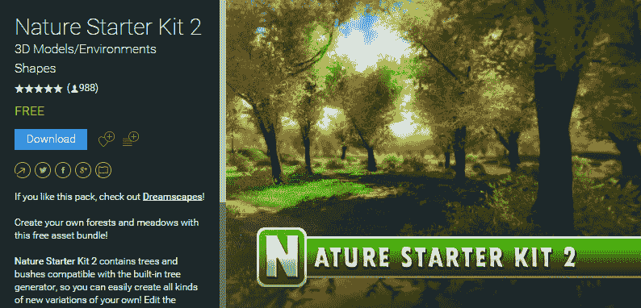

此外，还有许多用于分享 3D 模型的网站，既有免费的也有付费的。有些针对工程师的高端 3D CAD。其他则迎合 3D 打印爱好者。无论哪种情况，请确保寻找模型的 FBX 或 OBJ 文件格式，以便它们可以被导入到 Unity 中。一些更受欢迎的资源网站包括：

+   3D CAD 浏览器: [`www.3dcadbrowser.com/`](https://www.3dcadbrowser.com/)

+   BlenderSwap: [`www.blendswap.com/`](http://www.blendswap.com/)

+   CG Trader: [`www.cgtrader.com/`](https://www.cgtrader.com/)

+   Free3D: [`free3d.com/`](https://free3d.com/)

+   Google Poly: [`poly.google.com/`](https://poly.google.com/)

+   Microsoft Remix 3D: [`www.remix3d.com`](https://www.remix3d.com)

+   Sketchfab: [`sketchfab.com`](https://sketchfab.com/)

+   TurboSquid: [`www.turbosquid.com/`](http://www.turbosquid.com/)

我们将在本章后面使用 *Google Poly*。

# 使用 Blender 创建 3D 内容

Unity 提供了一些基本的几何形状，但当我们谈到更复杂的模型时，你需要超越 Unity。正如我们讨论的那样，Unity 资产商店和许多网站上有大量的惊人模型。它们从哪里来？你在导入到 Unity 时会遇到问题吗？

我知道这本书是关于 Unity 的，但现在我们将进行一次短暂的侧翼冒险。我们将使用 Blender（版本 2.7x），这是一个免费的开源 3D 动画套件([`www.blender.org/`](http://www.blender.org/))，来制作一个模型，然后将其导入到 Unity 中。来杯咖啡，系好安全带吧！

目前计划不是构建任何非常复杂的东西。我们只是制作一个立方体和一个简单的纹理贴图。这个练习的目的是了解在 Blender 中，一个单位立方体以相同的比例和方向导入 Unity 的效果如何。

随意跳过这一节，或者尝试使用你喜欢的建模软件进行类似的实验（[`en.wikipedia.org/wiki/List_of_3D_modeling_software`](https://en.wikipedia.org/wiki/List_of_3D_modeling_software)）。如果你不想跟随或遇到问题，本主题中创建的完成文件的副本可在本书的下载包中找到。

# Blender 简介

打开 Blender 应用程序。关闭启动屏幕。你将进入 Blender 编辑器，它类似于以下截图所示：

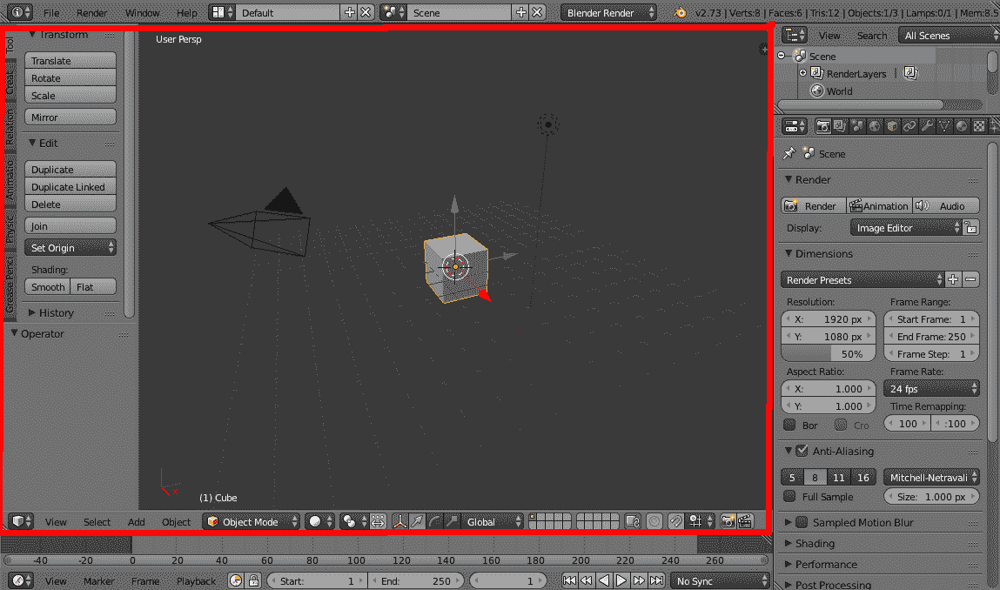

与 Unity 类似，Blender 由多个非重叠窗口组成，它们的布局可以根据你的需求进行自定义。然而，Blender 界面可能更令人畏惧，部分原因是因为它集成了多个可以同时打开的不同编辑器，它们各自有自己的面板。

有助于意识到，默认视图，如前述截图所示，包含五个不同的编辑器！

最明显的编辑器是大的**3D 视图**，我用一个（红色）矩形标出了它。这里你可以查看、移动和组织 Blender 场景中的对象。

以下是要打开的其他编辑器：

+   信息编辑器，位于应用程序顶部边缘，包含全局菜单和应用程序信息。

+   时间轴编辑器，位于应用程序底部边缘，用于动画。

+   在右上角的场景大纲编辑器，有一个对象的分层视图。

+   属性编辑器，位于大纲视图右侧下方，是一个强大的面板，让你可以看到并修改场景中对象的许多属性。

每个编辑器可以有多个面板。让我们考虑 3D 视图编辑器：

+   中间的大区域是**3D 视图窗口**，在这里你可以查看、移动和组织 Blender 场景中的对象。

+   在 3D 视图窗口下方是编辑器**标题栏**，尽管它在这个情况下位于底部，但被称为标题栏。标题栏是一行菜单和工具，提供了对编辑器的强大控制，包括视图选择器、编辑模式、变换操纵器和图层管理。

+   在左侧是工具架，包含可以应用于当前选中对象的多种编辑工具，这些工具可以组织成标签组。可以通过抓住并滑动其边缘或按*T*键来切换工具架的开启或关闭。

+   3D 视图窗口还有一个**属性**面板，默认可能隐藏，可以通过按*N*键切换开启或关闭。它提供了当前选中对象的属性设置。

在接下来的说明中，我们将要求你更改 3D 视图编辑器的**交互模式**，例如在编辑模式和纹理绘制模式之间切换。这可以在标题栏中找到，如下面的截图所示：

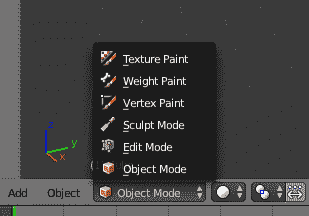

其他编辑器也有标题栏。信息编辑器（在应用顶部）只是一个标题栏！大纲和属性编辑器（在右侧）的标题栏位于面板顶部而不是底部。

一旦您熟悉了这个布局，它看起来就不会那么拥挤和混乱。

属性编辑器标题栏有一系列图标，它们的作用类似于标签，用于选择面板中显示的属性组。将鼠标悬停在图标上（就像这里的任何 UI 小部件一样）将显示一个工具提示，提供有关其用途的更好提示。以下图像（在几页中）展示了我们使用它时的样子。

Blender 布局非常灵活。您甚至可以更改一个面板从一个编辑器到另一个编辑器。每个标题栏的最左侧是编辑器类型选择器。当您点击它时，您可以看到所有选项。

除了在 Blender 界面中可以点击的众多事物外，您还可以使用几乎任何命令的快捷键。如果您忘记了查找选择的位置，请按空格键并输入您对要查找的命令名称的最佳猜测。它可能会突然出现！

下面的截图显示了 Blender 中可用的编辑器类型选择器：

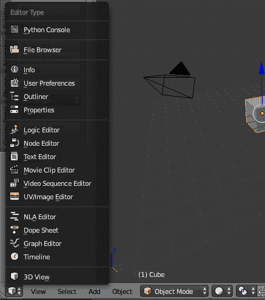

# 一个单位立方体

现在，让我们在 Blender 中构建一个单位立方体。

默认场景可能已经包含对象，包括一个立方体、相机和光源，如前面在默认 Blender 窗口中所示。（由于可以配置，您的启动设置可能不同。）

如果你的启动场景不包含单位立方体，请按照以下步骤创建一个：

1.  确保场景为空，通过删除其中的所有内容（右键选择，按键盘上的*X*键删除）。

1.  使用*Shift* + *S*（打开捕捉选项列表）| 光标到中心将 3D 光标设置到原点（`0`，`0`，`0`）。

1.  在左侧工具栏面板中，选择创建选项卡，在网格下选择立方体以添加一个立方体。

好的，现在我们都在同一页面上。

注意，在 Blender 中，参考网格沿*x*和*y*轴延伸，而*z*轴向上（与 Unity 不同，在 Unity 中*y*轴向上）。

此外，请注意，Blender 中的默认立方体大小为（`2`，`2`，`2`）。我们想要一个单位立方体位于原点处的地面平面上。为此，请按照以下步骤操作：

1.  使用键盘*N*键打开属性面板

1.  导航到变换 | 缩放并将 X、Y、Z 设置为（`0.5`，`0.5`，`0.5`）

1.  导航到变换 | 位置并将 Z 设置为`0.5`

1.  再次按*N*键隐藏面板

1.  您可以使用鼠标滚轮进行缩放

对于我们的目的，还要确保当前渲染器是 Blender 渲染（在信息编辑器的下拉选择器中——在应用窗口顶部的中央）。

# UV 纹理图像

让我们为我们的立方体上色。在 Unity 中的 3D 计算机模型由**网格**定义——一组通过边连接的 Vector3 点，形成三角形面的集合。当在 Blender 中构建模型时，你可以将网格展开成平面的 2D 配置，以定义纹理像素到网格表面的相应区域的映射（UV 坐标）。结果是称为 UV 纹理图像。

我们将为我们的立方体创建一个**UV 纹理图像**，如下所示：

1.  使用底部标题栏中的交互模式选择器进入编辑模式。

1.  选择**所有**（在键盘上按两次*A*键）以确保所有面都被选中。

1.  在左侧工具架面板中，选择着色/UV 选项卡。

1.  在 UV 映射下，点击展开，从下拉列表中选择智能 UV 投影，接受默认值，然后点击确定（以下截图所示的结果也显示了展开的立方体外观）。

1.  现在，再次使用底部标题栏中的交互模式选择器进入纹理绘制模式。

1.  我们需要为我们的材质定义一个**绘制槽**。点击添加绘制槽，选择漫反射颜色，命名为`CubeFaces`，然后按确定。

我们现在可以直接在立方体上绘制。首先绘制前面，如下所示：

1.  使用更小的画笔。在左侧工具架面板中，在工具选项卡下，导航到画笔 | 半径并输入`8 px`。

1.  在正交视图中工作可能更容易。从底部菜单栏中，导航到视图 | 视图透视/正交。

1.  然后，导航到视图 | 前视图。

1.  如果需要，可以使用鼠标滚轮进行缩放或缩小。

1.  用你最好的书法，用鼠标左键点击并写下单词`Front`。

1.  现在，背面。

1.  从底部菜单栏中，导航到视图 | 后视图，并右键单击选择此面。

1.  用你最好的书法，用鼠标左键点击并写下`Back`。

对左、右、上、下面重复上述过程。如果在某个时刻无法绘制，请确保已选择当前面。尝试右键单击面以重新选择它。结果应该看起来像这样（在正交视角的 3D 视图编辑器和 UV/图像编辑器中并排显示）：

现在，我们需要保存纹理图像并设置其属性，如下所示：

1.  使用 3D 视图编辑器底部标题栏最左侧的选择器将当前编辑类型更改为 UV/图像编辑器。

1.  点击浏览要链接的图像选择器图标（位于+图标左侧），从列表中选择`CubeFaces`。

1.  底部菜单栏上的图像菜单项现在有一个带星号的（图像*），表示有一个未保存的图像。点击它，选择另存为图像，并将其保存为`CubeFaces.png`。使用 Unity 项目外的文件夹。

1.  在右侧的属性编辑器面板中，在其标题中找到长排图标并选择纹理图标（倒数第三个）。如果面板不够宽，它可能被隐藏；您可以用鼠标向下滚动以显示它，如下面的截图所示：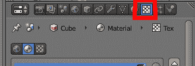

1.  在纹理属性中，将类型更改为图像或电影。

1.  然后，在属性中的图像组中，点击浏览要链接的图像选择器图标（如下面的截图所示）并选择`CubeFaces`：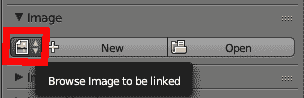

1.  您应该在预览窗口中看到标记的面纹理图像。

好的！让我们按照以下方式保存 Blender 模型：

1.  在信息编辑器顶部主菜单栏中选择文件，然后点击保存（或按*Ctrl* + *S*）。

1.  使用与保存纹理图像相同的文件夹。

1.  将其命名为`UprightCube.blend`并点击保存 Blender 文件。

现在我们应该有一个文件夹中的两个文件，`UprightCube.blend`和`CubeFaces.png`。我在 Unity 项目的根目录下使用名为`Models/`的文件夹。

我们建议您然后以 FBX 格式导出模型。这是 Unity 的标准格式。（Unity 可以导入 Blend 文件，但可能需要在同一系统上安装 Blender）。使用**文件** | **导出** | **FBX**来保存`.fbx`版本。

哇，这太多了。如果您没有全部理解，不要担心。Blender 可能有点令人畏惧。然而，Unity 需要模型。您可以从 Unity 资产商店和其他 3D 模型共享网站下载他人的模型，或者您可以学习制作自己的模型。哈哈！说真的，开始学习是个好主意。实际上，随着 VR 的发展，它已经变得容易多了，我们将在本章后面向您展示。

# 导入到 Unity 中

在 Unity 中，我们现在想逐个导入两个文件，`UprightCube.fbx`和`CubeFaces.png`，如下所示：

1.  在项目面板中，选择顶级 Assets 文件夹，导航到创建 | 文件夹，并将文件夹重命名为`Models`。

1.  将文件导入 Unity 的一个简单方法是将`.fbx`（或`.blend`）文件从 Windows 资源管理器（或 Mac Finder）窗口拖放到项目面板 Assets/Models 文件夹中，并将`.png`文件拖放到 Assets/Textures 文件夹中（或者您也可以从主菜单栏选择 Assets | Import New Asset...）。

1.  将`UprightCube`从刚刚导入到 Assets/Models 文件夹中拖动到场景视图中。

1.  设置其位置，使其远离其他对象。我将其设置为位置（`2.6`，`2.2`，`-3`）。

1.  将`CubeFaces`纹理从 Assets/Textures 文件夹拖动到场景视图中，悬停在刚刚添加的`UprightCube`上，使其接收纹理，并将纹理拖放到立方体上。

场景现在应该看起来像这样：

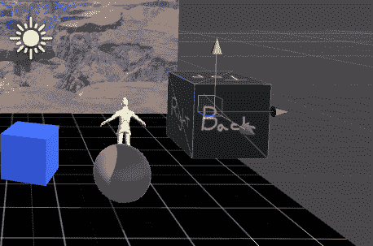

# 一些观察结果

立方体的背面朝向我们。这是错误吗？实际上，由于当前视角是向前看的，所以这是有道理的。因此，我们应该看到立方体的背面。如果你还没有注意到，对 Ethan 来说也是同样的情况。立方体似乎也有一个单位的维度。

然而，在仔细检查后，在立方体的检查器面板中，你会看到它以我们在 Blender 中给出的比例导入（`0.5`，`0.5`，`0.5`）。它还有一个-90 度的 X 旋转（负 90 度）。因此，如果我们重置变换，即比例到（`1`，`1`，`1`），它将在我们的世界空间中是 2 个单位，并且倾斜（所以不要重置它）。

在不回到 Blender 的情况下，我们无法做太多来补偿旋转调整。但在模型的导入设置（在检查器中）中可以调整比例。

Blender 的默认向上方向是 Z，而 Unity 的是 Y。导入时使用-90 度的 X 旋转来调整这一点。导入的比例可以在对象的检查器面板的导入设置中调整。

在从 Blender 导出 FBX 时，我们有更多的控制权。如图所示，在导出过程中，你可以自定义设置，例如，将 Y 设置为向上轴，Z 设置为向前轴，并设置导入的比例因子：

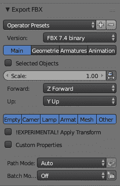

在结束前面的过程之前，从层次结构面板中选择`UprightCube`并将其拖入项目面板的资产文件夹中。（你可能考虑创建一个 Assets/Prefabs 子文件夹并将其放入其中。）这使得它成为一个可重用的预制件，包括纹理图像。

在这个练习中（除了学习了一点关于 Blender 的知识之外）还有一些重要的经验教训，这些经验教训适用于任何 3D Unity 项目，包括 VR 项目。通常，你将导入比立方体复杂得多的模型。你可能会遇到与数据转换、比例、方向和可能令人困惑的 UV 纹理图像相关的问题。如果发生这种情况，尝试将问题分解成更小、更独立的场景。进行一些小测试，以了解应用程序如何交换数据，并帮助你理解哪些参数调整可能是必要的。

# 在 VR 中创建 3D 内容

除了像 Blender（以及 ZBrush、3D Studio Max、Maya 等等）这样的传统 3D 建模软件之外，还有新一代的 3D 设计应用程序，允许你直接在 VR 中创建内容。毕竟，用本质上 2D 的桌面屏幕和 2D 鼠标来形成、雕刻、组装和操作 3D 模型是很尴尬的。如果它能够更像现实生活中的雕塑和建筑会怎样？所以，为什么不直接在 3D 中做呢？在 VR 中！

就像其他数字平台一样，我们可以将 VR 应用分为三类：一类是提供体验的应用，一类是让你与环境互动以参与其中的应用，还有一类是实际创建内容的应用，无论是为自己还是为了分享。后者是一个成功的例子，也是最早广泛成功的一个，那就是谷歌倾斜画笔（[`www.tiltbrush.com/`](https://www.tiltbrush.com/)），在那里你可以进行 3D 绘画。这是我在向家人和朋友介绍 VR 时最喜欢使用的应用之一。倾斜画笔让你能够在虚拟现实中进行 3D 绘画。

其他具有雕塑和绘画工具的 VR 3D 应用，仅举几个例子，包括：

+   **Google Blocks**：低多边形建模（[`vr.google.com/blocks/`](https://vr.google.com/blocks/)）

+   **Oculus Medium**：在 VR 中进行雕塑、建模和绘画（[`www.oculus.com/medium/`](https://www.oculus.com/medium/)）

+   **Oculus Quill**：VR 插画工具（[`www.facebook.com/QuillApp/`](https://www.facebook.com/QuillApp/)）

+   **Kudon**：表面和体积雕塑（[`store.steampowered.com/app/479010/Kodon/`](http://store.steampowered.com/app/479010/Kodon/)）

+   **MasterpieceVR**：VR 雕塑和绘画（[`www.masterpiecevr.com/`](https://www.masterpiecevr.com/)）

+   **Microsoft Paint 3D**：与 Windows 捆绑的简单 3D 雕塑和绘画（[`www.microsoft.com/en-us/store/p/paint-3d/9nblggh5fv99`](https://www.microsoft.com/en-us/store/p/paint-3d/9nblggh5fv99)）

在 VR 中制作和玩耍是创造性和有趣的，但要变得有用和高效，你需要能够将你的作品分享到应用程序之外。大多数 VR 雕塑工具允许你将模型导出以在互联网上分享，例如导出为 FBX 文件格式，并将它们导入到 Unity 中。有两种不同的工作流程来完成这项任务：

+   **导出/导入**：在第一个工作流程中，你创建一个模型并将其导出为兼容格式，如 FBX。这类似于我们用 Blender 使用的传统 3D 软件。

+   **发布/导入**：第二种工作流程是将它上传到共享服务，然后下载并安装到你的 Unity 项目中。

在本节中，我们将以倾斜画笔为例。假设你拥有谷歌倾斜画笔和兼容的 VR 设备。进一步假设你有一个想要与 Unity VR 应用集成的作品。让我们逐一了解每个工作流程过程。

我在 VR 中打开了倾斜画笔，并使用纸带笔刷创作了一幅杰作。我称之为*TiltBox*，与本章中使用的立方体主题一致。我知道，它很美。

这里（在撰写本文时）展示的倾斜画笔功能和用户界面，谷歌认为它们处于测试或实验阶段，并在你阅读本文时可能发生变化。

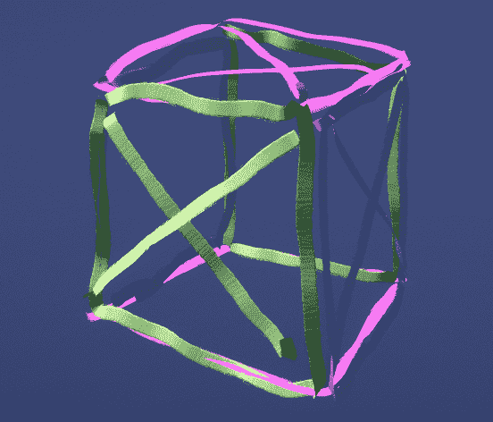

# 导出和导入倾斜画笔模型

我们将导出我们的模型为 FBX，然后将其导入到 Unity 中。这是一个高级主题，如果您是 Unity 新手，您可能现在想跳过这个主题，转而查看 *使用 Google Poly 发布和导入* 部分。

在 Tilt Brush 中，要导出，请转到“保存”面板并选择“更多选项… | 实验室 | 导出”菜单。（注意，导出选项的位置可能在未来的版本中发生变化。）

在 Windows 中，您的文件默认保存在 `Documents/Tilt Brush/Exports/[DrawingName]/` 文件夹中。如果您将右手控制器旋转一下，您会发现后面有一个信息面板，这是一个消息控制台，它会报告您系统上绘图的实际路径名，如图所示：

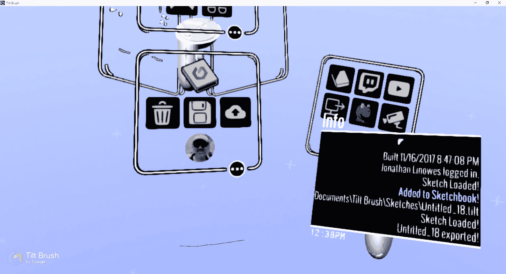

该文件夹将包含多个文件，包括模型的 `.fbx` 文件和笔刷纹理的 `.png` 文件（未使用，因为 Tilt Brush Toolkit 也提供了它们）。

要导入到 Unity，您需要 Tilt Brush Toolkit Unity 包。Google Poly 包包含工具包（如下一主题所述，从资产商店安装）。或者您可以直接从 GitHub 安装，如下所示：

1.  前往 [`github.com/googlevr/tilt-brush-toolkit`](https://github.com/googlevr/tilt-brush-toolkit) 并使用 `tiltbrush-UnitySDK-vNN.N.N.unitypackage` 的下载链接（通过 [`github.com/googlevr/tilt-brush-toolkit/releases`](https://github.com/googlevr/tilt-brush-toolkit/releases)）

1.  使用“资产 | 导入包 | 自定义包…”在 Unity 中导入工具包，然后按导入。

您会发现工具包包括用于渲染笔刷的资产。

在“导出”文件夹中还有一个 `README` 文件，其中包含有关您的 Tilt Brush 版本和导出功能的信息，包括如何使用 `CFG` 文件为高级用户调整各种选项。

现在我们可以导入绘制的 FBX：

1.  将 FBX 文件拖放到您的项目资产中（或使用“资产 | 导入新资产…”）。

1.  忽略由导入创建的任何材质；我们将使用工具包中提供的材质。您可以在模型的导入设置中禁用此功能，在“材质 **|** 导入 **材质**”处取消选中，然后点击应用。

1.  您现在可以将模型拖放到场景中。

1.  在 `Assets/TiltBrush/Assets/Brushes/` 中找到您草图使用的笔刷材质。在我们的例子中，草图使用的是纸笔刷笔触，位于 `Basic/Paper/` 子文件夹中。

1.  根据需要将材质拖放到您的草图笔触上。

您的场景现在包含您的 Tilt Brush 草图。有关更多高级功能，包括音频响应功能、动画和 VR 传送，请参阅 Tilt Brush 文档和示例场景。

虽然有点繁琐，但这并不太难。其他 3D 建模应用程序也需要类似的过程来导出模型并将其导入到 Unity 中。

# 使用 Google Poly 发布和导入

幸运的是，Google 通过引入 Google Poly ([`poly.google.com/`](https://poly.google.com/))作为一个发布、浏览和下载使用 Google Tilt Brush 和 Google Blocks（以及其他创建带有材质的 OBJ 文件的 APP）创建的免费 3D 对象的地方，使事情变得容易得多。

我并不是要听起来像是一个 Google 粉丝，但让我们继续 Tilt Brush 的主题。在 Tilt Brush 中，通过点击按钮很容易将您的草图发布到 Google Poly。并且使用资产商店中可用的 Poly Toolkit Unity 包，将 Poly 模型导入 Unity 同样简单。让我们来了解一下：

Poly 不仅仅是为 Unity 开发者准备的。Google 为多个平台提供了 SDK 以进行访问。请参阅[`developers.google.com/poly/`](https://developers.google.com/poly/)。

1.  在 Tilt Brush 中，首先，确保您已登录到您的 Google 账户（我的资料）。

1.  在“保存”菜单面板上，选择如图所示的云上传选项。这将把您的草图上传到 Poly。

1.  然后在浏览器（非 VR）中完成发布步骤，并按“发布”。

注意，Poly Toolkit 包括 Tilt Brush Toolkit。如果您已经在上一节将 Tilt Brush toolkit 导入到您的项目中，我们建议您在导入 Poly 之前先删除它（以及第三方文件夹），以避免冲突。

在 Unity 中：

1.  打开资产商店面板（窗口 | 资产商店）。

1.  搜索`Poly Toolkit`，然后下载并将 Poly Toolkit 资产包导入到您的项目中（[`assetstore.unity.com/packages/templates/systems/poly-toolkit-104464`](https://assetstore.unity.com/packages/templates/systems/poly-toolkit-104464)）。

1.  注意，工具包在 Unity 菜单栏中安装了一个新的 Poly 菜单。选择 Poly | 浏览资产…以打开 Poly 浏览器面板，如图所示：

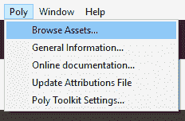

1.  您可以通过拖动其标签将其面板停靠在 Unity 编辑器中。

1.  在您浏览自己的上传内容之前，您必须使用右上角的“登录”按钮进行登录。

1.  然后，在 Poly Toolkit 面板的“显示选择”中，选择“您的上传”。

1.  定位您希望导入的模型。其页面包括多个导入选项，包括缩放和重新定位模型变换。

1.  选择“导入到项目”。

1.  默认情况下，它将模型导入到`Project Assets/Poly/Assets/`文件夹中作为一个预制件。

1.  将模型的预制件从文件夹拖到您的场景中。

就这样。现在您手边就有了一个 3D 模型的世界：您在 Poly 上创建并发布的模型，以及您在 Poly、Unity 资产商店或您能探索的众多其他 3D 模型网站上发现的模型。

# 使用 EditorXR 在 VR 中编辑 Unity

在本章中，我们学习了 Unity 编辑器——一个在 2D 计算机屏幕上创建 3D 场景和项目的工具。我们还了解了一些关于 Blender 的知识——一个在 2D 计算机屏幕上创建 3D 资源的工具。然后我们进入了虚拟现实中的新一代 3D 资源创建工具，包括 Tilt Brush 和 Poly。现在我们还将探索如何在虚拟现实中直接创建 VR 场景！

**Unity 编辑器 XR**（**EXR**）是 Unity（截至撰写时）的一个新实验性功能，您可以在 VR 中直接编辑您的 3D 场景，而不是在您的 2D 监视器上。在本节中，我们可能在多个方面都走在了前面。这是一个高级话题，也是一个实验性话题。如果您刚开始接触 VR，或者刚开始使用 Unity，您可能现在想跳过这个话题，稍后再回来。

EXR 是一个高级话题，因为它假设您熟悉使用 Unity 编辑器窗口，习惯于 3D 思维，并且在处理 3D 资源方面有一些经验。它还假设您有一个配备跟踪手控器的 VR 设备，如 Oculus Rift 和 HTC Vive。如果您希望获得流畅、舒适的体验，您需要一个配备高端显卡的强大 PC。最后但同样重要的是，EXR 的一些用户交互约定需要学习和适应。

尽管如此，EXR 是一个相当不错的项目，您可以从今天开始使用以提高生产力。特别是如果您不害怕使用实验性软件。这也意味着我们在这本书中描述的 UI 一定会发生变化。（例如，在这个时候，该包正在从 EditorVR 重命名为 EditorXR 和 EXR）。当前的信息链接包括：

+   入门演示文稿：[`docs.google.com/presentation/d/1THBAjLV267NVvZop9VLuUSNx1R2hyp8USgOc8110Nv8/edit#slide=id.g1e97811ad3_2_17`](https://docs.google.com/presentation/d/1THBAjLV267NVvZop9VLuUSNx1R2hyp8USgOc8110Nv8/edit#slide=id.g1e97811ad3_2_17)

+   入门文档：[`docs.google.com/document/d/1xWunGC3NJoDRBBz44gxpMUAh3SmedtNK12LqACyy2L0/edit#heading=h.9hlhay6ebu98`](https://docs.google.com/document/d/1xWunGC3NJoDRBBz44gxpMUAh3SmedtNK12LqACyy2L0/edit#heading=h.9hlhay6ebu98)

+   EditorXR 社区论坛：[`forum.unity3d.com/forums/editorvr.126/`](https://forum.unity3d.com/forums/editorvr.126/)

+   GitHub 仓库：[`github.com/Unity-Technologies/EditorVR`](https://github.com/Unity-Technologies/EditorVR)

另一个原因是在本书的早期就讨论 EXR 是一个高级话题，是因为我们需要在我们的项目中启用 VR，这是一个我们直到下一章才涉及的话题。但我们会快速带您了解，而不进行过多解释。

# 设置 EditorXR

要开始在项目中使用 EXR，请下载并安装 Unity 包。到您阅读此内容时，它可能已经包含在 Unity 下载助手或资产商店中：

1.  下载 EditorXR Unity 包（[`github.com/Unity-Technologies/EditorXR/releases`](https://github.com/Unity-Technologies/EditorXR/releases)）。

1.  将其导入到你的项目中（资源 | 导入包 | 自定义包…）。

1.  如果你使用的是 Unity 2018 之前的版本，请从资源商店下载并导入 Text Mesh Pro（[`assetstore.unity.com/packages/essentials/beta-projects/textmesh-pro-84126`](https://assetstore.unity3d.com/packages/essentials/beta-projects/textmesh-pro-84126)），这是 Unity Technologies 提供的一个免费资源。

1.  如果你使用的是 VIVE，请从资源商店下载并导入 SteamVR 插件（[`www.assetstore.unity3d.com/en/#!/content/32647`](https://www.assetstore.unity3d.com/en/#!/content/32647)）。

1.  如果你使用的是带有触摸控制器的 Oculus Rift，请下载并导入 Oculus Utilities for Unity（[`developer3.oculus.com/downloads/`](https://developer3.oculus.com/downloads/)）。

1.  在玩家设置中设置你的默认 VR 平台（编辑 | 项目设置 | 玩家）。找到 XR 设置部分（检查器面板底部），并勾选虚拟现实支持复选框。

1.  添加 Oculus 和/或 OpenVR 的虚拟现实 SDK。

1.  如果你使用带有触摸控制器的 Oculus Rift，请确保 Oculus 的版本排在第一位，如图所示：

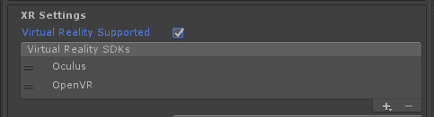

当你准备好进入 EXR 时：

1.  选择“Windows”|“EditorXR”

1.  如有必要，按“切换设备视图”以使 VR 视图生效

1.  然后戴上你的头戴式设备

现在，你可以在 VR 中访问在 Unity 编辑器中找到的许多相同的编辑功能。

# 使用 EditorXR

EXR 中的用户交互类似于 Google Tilt Brush。一只手握住你的菜单调色板，另一只手从中选择功能。就像一只方形的手套，你可以通过拇指的轻扫来切换菜单，旋转菜单框面。这是起点，但 EXR 更加复杂，因为它需要在你的虚拟工作空间中提供丰富的 Unity 编辑器功能，同时还需要导航场景、组织编辑器面板，当然还有编辑场景游戏对象。我们鼓励你在深入之前先观看一些演示视频。

手控制器选择器实现了激光指针选择远程对象和抓取（通过*选择锥体*）的创新、同时组合，如图所示：

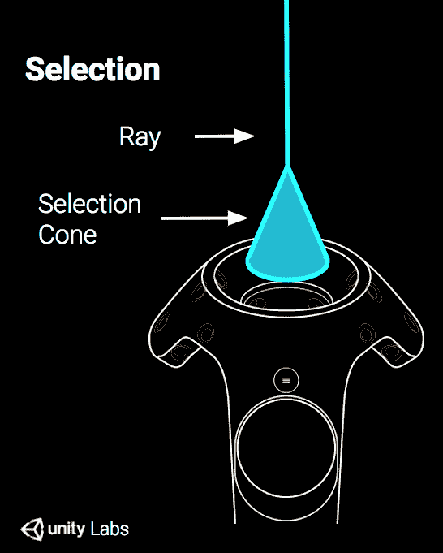

要操纵对象，EXR 在 2D 编辑器中实现了熟悉的场景编辑器小部件的强大 3D 版本。它们真的非常强大且易于使用。

不深入细节，以下是 EXR 编辑器中的关键功能：

+   **选择**：手控制器拇指垫/杆、按钮、扳机和抓取的稳健使用

+   **菜单**：方形容器菜单面板、径向菜单、快捷键以及用于在 3D 中组织面板的工具

+   **导航**：在工作过程中在场景中移动，飞行和眨眼模式，原地旋转，缩放世界，使用迷你世界视图

+   **工作空间**：对应于 2D 编辑器中的窗口，如项目、层次结构、检查器、控制台、配置文件等，可以在 VR 工作区中打开和放置。

+   其他功能包括锁定对象、吸附等。

下图显示了如何使用操纵器 Gizmo 与控制器上的径向菜单一起直接操作当前选定的对象，以切换工具：

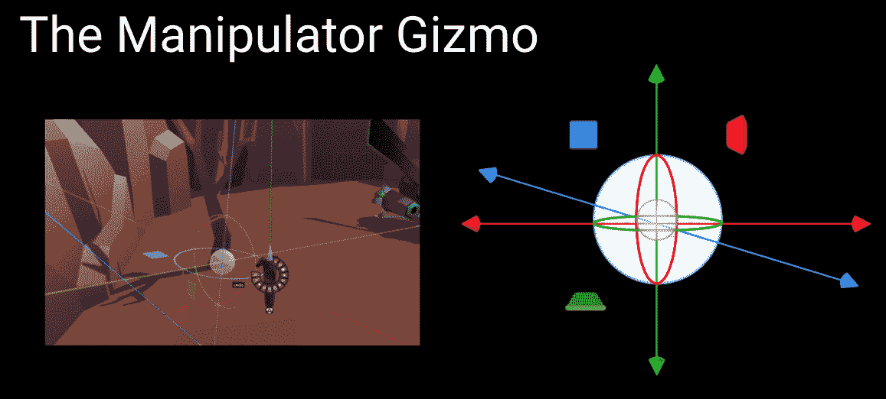

在 EXR 中学习更具挑战性的事情之一可能是了解每个手控在切换意义时在当前上下文中的具体作用。以下图显示了 VIVE 的控制器指南：

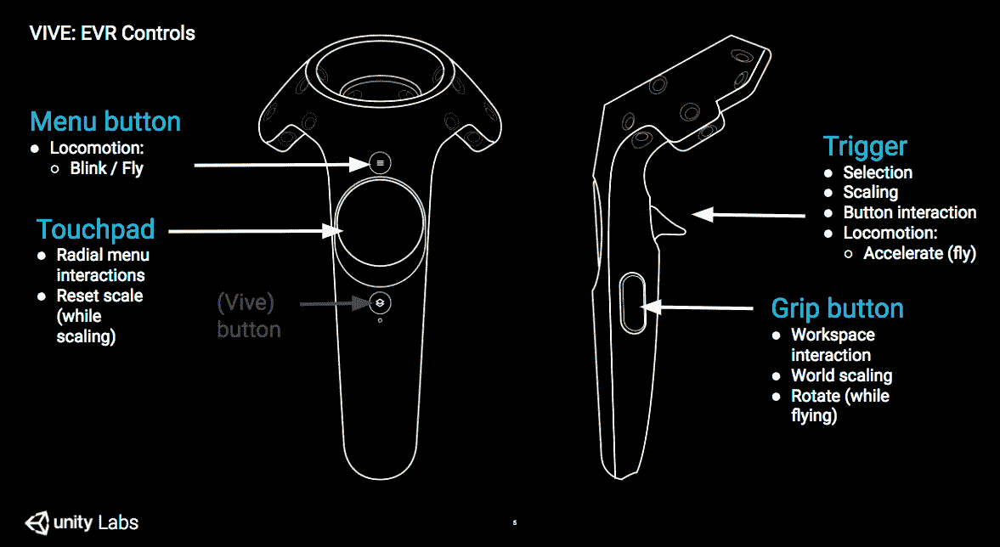

下面展示了 Oculus Touch 控制器的操作指南：

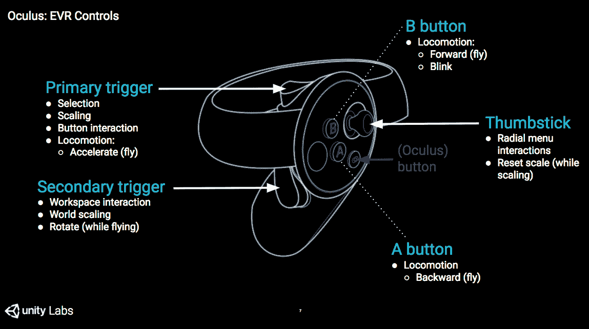

为了总结这个话题，你甚至可以使用 Google Poly 查找对象并将它们插入到你的 VR 场景中。这是 EditorXR 接口和 API 的第三方扩展 Poly 工作空间的示例，它可在 VR 中使用。如果你已经安装了 Poly Toolkit（如前所述）并且正在使用 EditorXR，那么 Poly 就是可用的工作空间之一。打开它来浏览并将云中的 3D 模型添加到你的场景中，如图所示：

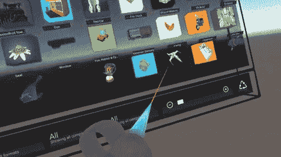

要了解更多关于 EditorXR 和 Google Poly 的信息，请参阅 Unity Labs 的 Matt Schoen 的这篇首篇博客文章：[`blogs.unity3d.com/2017/11/30/learn-how-googles-poly-works-with-unity-editorxr/`](https://blogs.unity3d.com/2017/11/30/learn-how-googles-poly-works-with-unity-editorxr/)。作为旁注，Schoen 是我的朋友，也是 Packt 另一本书的合著者，《Cardboard VR Projects for Android》（2016）：[`www.packtpub.com/application-development/cardboard-vr-projects-android`](https://www.packtpub.com/application-development/cardboard-vr-projects-android)。

# 摘要

在本章中，我们构建了一个简单的场景模型，更熟悉了 Unity 编辑器，并了解了在设计场景时世界尺度的重要性，包括一些游戏内工具帮助我们处理缩放和定位。

我们随后强调，Unity 并不仅仅是一个资产创建工具。开发者通常使用 Unity 以外的工具创建模型，然后将它们导入。我们向您介绍了免费的开源建模应用 Blender 以及 Google Tilt Brush，并展示了如何导出资产并将其导入 Unity，包括像 Google Poly 这样的云服务。

在为 VR 开发时，真正酷的一件事是事物变化之快。这是一个新兴的行业、一种新的媒体，以及随着 VR 的成熟，每年都会有新的范式演变。每个季度都会推出新的设备。Unity 每月都会更新。每周都会发布新的软件工具。每天都有新事物要做和学习。当然，这也可能非常令人沮丧。我的建议是不要让它影响到你，而是要接受它。

这个问题的关键在于不断尝试新事物。这正是我们在本章中试图引导你的内容。想出一个点子，然后看看你能否让它运作起来。尝试新的软件。学习新的 Unity 功能。一次只做一件事，这样你就不会感到不知所措。当然，这正是本书的主题。这是一段持续且充满冒险的旅程。

在下一章中，我们将设置你的开发系统和 Unity 设置，以便构建和运行项目，在你的 VR 头盔中玩游戏。
