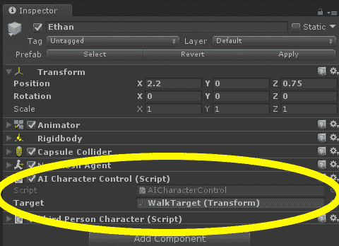
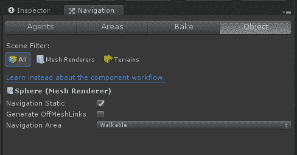
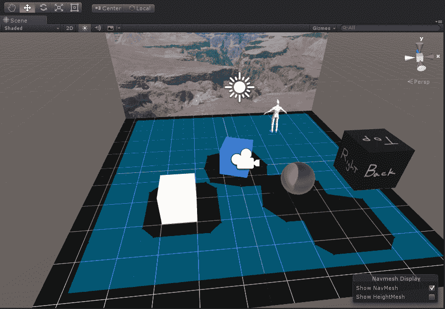
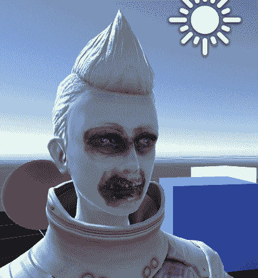
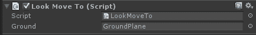
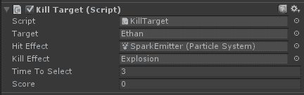
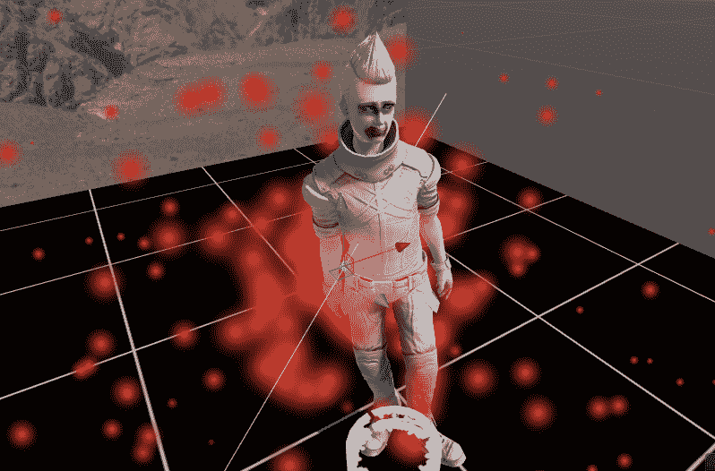

# 基于目光的控制

目前，我们的场景是一个第三人称虚拟现实体验。当你进入其中时，你就像一个观察者或第三人称摄像机。当然，你可以四处张望，并添加控制来移动摄像机的视角。然而，场景中的任何动作都是从第三人称视角出发的。

在本章中，我们将主要保持第三人称模式，但我们会更加个人化地参与其中。我们将探讨通过观察和凝视来控制虚拟世界中物体的一些技术。我们的角色，伊森，将受你控制，响应你的视线。此外，我们还将开始编写 Unity 脚本。在这个过程中，我们将讨论以下主题：

+   将**AI**（人工智能的缩写）和**NavMesh**添加到我们的第三人称角色，伊森

+   Unity 编程使用 C#

+   使用我们的目光移动 3D 光标

+   以好的效果射击和杀死僵尸伊森

大多数 Unity 开发的入门教程都会让你从简单的东西开始，也许永远不会触及更有趣、更复杂的东西。在本章中，我们将混合事物，带你进入几个不同的 3D 图形话题，其中一些相对高级。如果你是新手，可以把这看作是一个调查教程。尽管如此，我们一步一步地讲解，所以你应该能够跟上，也能有很多乐趣！

# 伊森，行走者

游戏是虚拟现实的一个常见应用。因此，我们不妨从这里开始，也给我们的角色，伊森，一个自己的生活。好吧，有点（或不）像，因为他将成为一个僵尸！

我们在伊森闲逛的展览中停下来。如果你有一个带有摇杆或触摸板的控制器，你可以让他绕场景跑来跑去，但并非所有 VR 设备都能保证这一点。事实上，如果你用 Google Cardboard 观看场景，你不太可能有一个手持控制器（尽管有蓝牙游戏控制器）。在下一章第五章《便捷交互》中，我们将讨论手持输入控制器。现在，我们将考虑另一种让他移动的方法，即使用你佩戴 VR 头盔时的目光方向。

在我们尝试这个之前，我们首先将伊森变成一个僵尸，让他毫无目的地四处游荡，没有任何用户控制。我们将通过给他一些 AI 并编写一个脚本，将他发送到随机目标位置来实现这一点。

*AI 控制器*和*NavMesh*是 Unity 中相对高级的话题，但为了好玩，我们将带你进入这个领域。此外，它并不像僵尸那样可怕。

# 智能化的伊森

首先，我们想要用 Unity 的 AI 角色`AIThirdPersonController`替换我们最初使用的`ThirdPersonController`预制体，以下是步骤。Unity 使用“人工智能”这个词比较宽松，指的是“脚本驱动”。执行以下步骤：

1.  打开上一章中的 Unity 项目，使用`Diorama`场景，并将`Characters`包从`Standard Assets`导入。

1.  在项目面板中，打开`Standard Assets/Characters/ThirdPersonCharacter/Prefabs`文件夹，将`AIThirdPersonController`拖拽到场景中。将其命名为`Ethan`。

1.  在层次结构面板（或场景中），选择之前的`ThirdPersonController`（旧的 Ethan）。然后，在检查器面板的变换面板中，选择变换面板右上角的*齿轮*图标，并选择复制组件。

1.  选择新的`Ethan`对象（从层次结构面板或场景中）。然后，在检查器面板的变换面板中，选择*齿轮*图标并选择粘贴组件值。

1.  现在，你可以通过从层次结构面板中选择旧`Ethan`对象，右键点击打开选项，然后点击删除来删除它。

如果你找不到导入的`Characters`包，你可能没有在安装 Unity 时安装`Standard Assets`。要获取它们，你现在需要再次运行`UnityDownloadAssistant`，如第二章开头所述的*内容、对象和比例*（它可能已经在你的下载文件夹中）。

注意，这个控制器有一个`NavMesh Agent`组件和一个`AICharacterControl`脚本。`NavMesh Agent`有参数用于控制 Ethan 在场景中的移动方式。`AICharacterControl`脚本需要一个目标对象，Ethan 将走向该对象。让我们按照以下方式填充它：

1.  在层次结构面板中添加一个空的游戏对象，并将其重命名为`WalkTarget`。

1.  将其变换值重置为位置(`0`,`0`,`0`)（使用变换面板右上角的齿轮图标）。

1.  选择 Ethan，将`WalkTarget`拖拽到检查器面板的 AI 角色控制面板中的目标属性，如图所示：



到目前为止，我们在场景中有一个 AI 角色（Ethan），一个空的游戏对象，它最初将用作导航目标（`WalkTarget`），位于场景中心，并且我们告诉 AI 角色控制器使用这个目标对象。当我们运行游戏时，无论`WalkTarget`在哪里，Ethan 都会去那里。但还不是时候。

# NavMesh 烘焙

Ethan 不能在没有被告知可以自由漫步的地方随意行走！我们需要定义一个*NavMesh*——一个简化的几何平面，使角色能够绕过障碍物规划路径。

在我们的场景中，Ethan 是一个代理。他可以行走的地方是*navmesh*。注意，他有一个**NavMesh Agent**组件和一个`AICharacterControl`脚本。`NavMesh Agent`有参数用于控制 Ethan 在场景中的移动方式。

通过首先识别场景中影响导航的对象，将其标记为导航静态，然后烘焙 NavMesh，如下所示：

1.  选择导航面板。如果它不是你的编辑器中的一个标签，请通过导航到主菜单中的窗口 | 导航来打开导航窗口。

1.  选择其**对象**选项卡。

1.  在层次结构中选择地面平面，然后在导航窗口的对象面板中，勾选导航静态复选框。（或者，您可以使用对象的检查器窗口静态下拉列表。）

1.  对应该挡住他的每个对象（立方体和球体）重复步骤 3。以下是对球体的示例。

1.  在导航窗口中，选择烘焙选项卡，然后点击面板底部的烘焙按钮：



场景视图现在应该显示一个蓝色覆盖层，其中定义了导航网格，如下面的截图所示：



让我们测试一下。确保游戏面板的“播放时最大化”未选中。点击顶部的*播放*模式按钮（编辑器顶部的三角形）。在层次结构面板中，选择`WalkTarget`对象，并确保场景面板中的平移操纵杆处于活动状态（按键盘上的 W 键）。现在，将`WalkTarget`对象上的红色（x）和/或蓝色（z）箭头操纵杆拖动到地板平面上。当你这样做的时候，Ethan 应该会跟随！再次点击*播放*以停止播放模式。

# 城市中的随机漫步者

现在，我们将编写一个脚本，将`WalkTarget`对象移动到随机位置。

编写脚本是使用 Unity 开发的重要组成部分。如果你已经做了更多的事情，比如只是摆弄 Unity，你可能已经编写了一些脚本。我们将使用 C#编程语言。

如果你是编程新手，不要慌张！我们将在本章末尾提供对 Unity 脚本编写的更详细介绍。你现在可以跳到那里，然后再回来，或者只是跟着做。

对于这个第一个脚本，我们将放慢速度。我们将把脚本附加到`WalkTarget`对象上，如下所示：

1.  在层次结构面板或场景视图中选择`WalkTarget`对象。

1.  在其检查器面板中，点击添加组件按钮。

1.  选择新脚本（您可能需要向下滚动以找到它）。

1.  将其命名为`RandomPosition`。

1.  确保已选择 C Sharp 语言。

1.  点击创建并添加。

1.  这应该在`WalkTarget`对象上创建一个脚本组件。在检查器面板中脚本右侧的槽中双击`RandomPosition`脚本以在代码编辑器中打开它。

# RandomPosition 脚本

我们希望将`WalkTarget`对象移动到随机位置，这样 Ethan 就会朝那个方向前进，等待几秒钟，然后再次移动`WalkTarget`对象。这样，他看起来就像是无目的地四处游荡。我们可以通过脚本来实现这一点。而不是逐步开发脚本，我首先展示完成版本，然后我们将逐行分析。`RandomPosition.cs`脚本看起来像这样：

```cs
using UnityEngine; 
using System.Collections; 

public class RandomPosition : MonoBehaviour { 

  void Start () { 
    StartCoroutine (RePositionWithDelay()); 
  } 

  IEnumerator RePositionWithDelay() { 
    while (true) { 
      SetRandomPosition(); 
      yield return new WaitForSeconds (5); 
    } 
  } 

  void SetRandomPosition() { 
    float x = Random.Range (-5.0f, 5.0f); 
    float z = Random.Range (-5.0f, 5.0f); 
    Debug.Log ("X,Z: " + x.ToString("F2") + ", " + 
       z.ToString("F2")); 
    transform.position = new Vector3 (x, 0.0f, z); 
  } 
} 
```

此脚本定义了一个名为 `RandomPosition` 的 `MonoBehaviour` 子类。在定义类时，我们首先声明我们将要使用的任何变量。变量是值的占位符。值可以在这里初始化或在其他地方分配，只要在脚本使用它之前它有一个值。

脚本的主体部分在更下面，名为 `SetRandomPosition()` 的函数。让我们看看它做了什么。

如果你还记得，`GroundPlane` 平面是一个 10 单位平方的平面，原点位于中间。因此，平面上任何 (x, z) 位置将在每个轴上 `-5` 到 `5` 的范围内。这行代码 `float x = Random.Range (-5.0f, 5.0f)` 在给定的范围内选择一个随机值并将其分配给一个新的 `float x` 变量。我们以同样的方式获取一个随机的 *z* 值。（通常，我劝阻使用这种硬编码的常量值而不是使用变量，但为了说明目的，我保持事情简单。）

这行代码 `Debug.Log ("X,Z: " + x.ToString("F2") + ", " + z.ToString("F2"))` 在游戏运行时会在控制台面板中打印出 `x` 和 `z` 的值。它将输出类似 `X, Z: 2.33, -4.02` 的内容，因为 `ToString("F2")` 表示四舍五入到两位小数。请注意，我们使用加号将输出字符串的各个部分组合在一起。

我们实际上使用这行代码 `transform.position = new Vector3 (x, 0.0f, z);` 将目标移动到给定位置。我们正在设置此脚本附加到的对象的变换位置。在 Unity 中，具有 X、Y 和 Z 值的值由 `Vector3` 对象表示。因此，我们创建一个新的对象，其中包含我们生成的 `x` 和 `z` 值。我们给 `y=0`，这样它就会坐在 `GroundPlane` 上。

每个 `MonoBehaviour` 类都有一个内置变量叫做 `this`，它指向脚本附加到的对象。也就是说，当脚本成为对象的组件并出现在其检查器面板中时，脚本可以将其对象称为 `this`。实际上，`this` 是如此明显，如果你想在 `this` 对象上调用函数，甚至不需要说出来。我们本可以说 `this.transform.position = ...`，但 `this` 对象是隐含的，通常省略。另一方面，如果你有其他对象的变量（例如，`GameObject that;`），那么在设置其位置时，你需要明确指出，就像 `that.transform.position = ...`。

最后一个神秘的部分是如何在 Unity 中处理时间延迟，使用协程。这是一种相对高级的编程技术，但非常实用。在我们的例子中，变换位置应该每五秒改变一次。它分为几个部分来解决：

1.  在 `Start()` 函数中，有这行代码 `StartCoroutine (RePositionWithDelay());`。**协程** 是一段独立于调用它的函数运行的代码。因此，这行代码在协程中启动了 `RePositionWithDelay()` 函数。

1.  在其中，有一个 `while (true)` 循环，正如你可能猜到的，它会永远运行（只要游戏在运行）。

1.  它调用 `SetRandomPosition()` 函数，实际上重新定位了对象。

1.  然后，在这个循环的底部，我们执行一个 `yield return new WaitForSeconds (5);` 语句，这基本上是告诉 Unity，“嘿，去做你想做的，五秒钟后再回来，这样我就可以再次通过我的循环了”。

1.  为了使所有这些功能正常工作，`RePositionWithDelay` 协程必须声明为 `IEnumerator` 类型（因为文档中是这样说的）。

这种协程/yield 机制，虽然是一个高级编程主题，但在像 Unity 这样的时间切片程序中是一个常见的模式。

我们的脚本应该保存到一个名为 `RandomPosition.cs` 的文件中。

我们现在可以开始了。在 Unity 编辑器中，点击“播放”。Ethan 正像疯子一样从一个地方跑到另一个地方！

# “僵尸化” Ethan！

好吧，这相当随机。让我们调整导航网格驱动参数，让他以一个不错的僵尸步伐慢下来。为此，执行以下步骤：

1.  在层次面板中选择 `Ethan`。

1.  导航到检查器 | 导航网格代理 | 驱动并设置以下内容：

    +   速度：`0.3`

    +   角速度：`60`

    +   加速度：`2`

再玩一次。他慢了下来。这样更好。

再来一个细节处理：让我们把他变成一个僵尸。我有一个名为 `EthanZombie.png` 的纹理图像，这会有所帮助（包含在这本书中）。执行以下步骤：

1.  从主菜单的“资产”选项卡中选择“导入新资产...”。导航到与这本书一起提供的资产文件文件夹。

1.  选择 `EthanZombie.png` 文件。

1.  点击导入。为了整洁，确保它位于 `Assets/Textures` 文件夹中。（或者，你只需从 Windows 资源管理器中将文件拖放到项目面板的 Assets/Textures 文件夹中。）

1.  在层次面板中，展开 `Ethan` 对象（点击三角形）并选择 `EthanBody`。

1.  在“检查器”面板中，通过点击 Shader 左侧的三角形图标来展开 `EthanGray` 着色器。

1.  从 `Project Assets/Textures` 文件夹中选择 `EthanZombie` 纹理。

1.  将其拖放到 Albedo 纹理贴图上。它是一个位于主贴图标签左侧的小方块。

1.  在层次面板中，选择 `EthanGlasses` 并取消选中它，以在检查器面板中禁用眼镜。毕竟，僵尸不需要眼镜！

他的肖像如下所示。*你说了什么？这还不够恐怖的僵尸吗？？* 好吧，也许他刚刚变成僵尸。你可以继续自己制作一个更好的僵尸。使用 Blender、Gimp 或 Photoshop 画一个自己的（甚至可以导入一个完全不同的僵尸人形模型来替换 `EthanBody`）：



现在，构建项目并在 VR 中尝试。

我们从第三人称视角观察。你可以四处看看，看看发生了什么。这有点有趣，而且相当有趣。而且它是被动的。让我们变得更活跃一些。

# 看着我所指的方向走

在这个下一个脚本中，我们将不再随机发送 Ethan 到我们看的地方。在 Unity 中，这是通过使用 **射线投射** 来实现的。这就像从相机发射射线并查看它击中了什么（更多信息，请访问 [`docs.unity3d.com/Manual/CameraRays.html`](http://docs.unity3d.com/Manual/CameraRays.html)）。

我们将创建一个新的脚本，它将像之前一样附加到 `WalkTarget` 上，如下所示：

1.  在层次结构面板或场景视图中选择 `WalkTarget` 对象。

1.  在其检查器面板中，点击添加组件按钮。

1.  选择新建脚本。

1.  命名它为 `LookMoveTo`。

1.  确保已选择 C# 语言。

1.  点击创建并添加。

这应该在 `WalkTarget` 对象上创建一个脚本组件。双击它以在您的代码编辑器中打开它。

这个 `LookMoveTo` 脚本替换了我们之前创建的 `RandomPosition` 脚本。在继续之前，请禁用 `WalkTarget` 的 `RandomPosition` 组件。

# LookMoveTo 脚本

在我们的脚本中，每次调用 `Update()` 时，我们将读取相机指向的位置（通过使用其变换位置和旋转），在该方向发射射线，并让 Unity 告诉我们它击中了地面平面。然后，我们将使用此位置来设置 `WalkTarget` 对象的位置。

这是完整的 `LookMoveTo.cs` 脚本：

```cs
using UnityEngine; 
using System.Collections; 

public class LookMoveTo : MonoBehaviour { 
  public GameObject ground; 

  void Update () { 
    Transform camera = Camera.main.transform; 
    Ray ray; 
    RaycastHit hit; 
    GameObject hitObject; 

    Debug.DrawRay (camera.position, 
      camera.rotation * Vector3.forward * 100.0f); 

    ray = new Ray (camera.position, 
      camera.rotation * Vector3.forward); 
    if (Physics.Raycast (ray, out hit)) { 
      hitObject = hit.collider.gameObject; 
      if (hitObject == ground) { 
        Debug.Log ("Hit (x,y,z): " + hit.point.ToString("F2")); 
        transform.position = hit.point; 
      } 
    } 
  } 

} 
```

让我们逐行分析脚本。

```cs
public GameObject ground; 
```

脚本的第一件事是声明一个用于 `GroundPlane` 对象的变量。

由于它是 `public` 的，我们可以使用 Unity 编辑器来分配实际的对象：

```cs
  void Update () { 
    Transform camera = Camera.main.transform; 
    Ray ray; 
    RaycastHit hit; 
    GameObject hitObject; 
```

在 `Update()` 内部，我们定义了一些局部变量，`camera`、`ray`、`hit` 和 `hitObject`，这些变量类型是我们将要使用的 Unity 函数所必需的。

`Camera.main` 是当前活动的相机对象（即标记为 `MainCamera`）。我们获取其当前变换，并将其分配给相机变量：

```cs
    ray = new Ray (camera.position, 
      camera.rotation * Vector3.forward); 
```

忽略一下方便的 `Debug` 语句，我们首先使用 `new Ray()` 确定从相机发出的射线。

一个 **射线** 可以由 x、y 和 z 空间中的起始位置和一个方向向量定义。一个 **方向向量** 可以定义为从 3D 起始点到空间中某个其他点的相对偏移。正方向，其中 z 为正，是 (`0`, `0`, `1`)。Unity 会为我们做数学运算。因此，如果我们取一个单位向量 (`Vector3.forward`)，将其乘以一个三轴旋转 (`camera.rotation`)，并按长度 (`100.0f`) 缩放，我们将得到一个指向与相机相同方向的射线，长度为 100 个单位：

```cs
if (Physics.Raycast (ray, out hit)) {
```

然后，我们发射射线并查看是否击中了任何东西。如果是这样，`hit` 变量将

现在包含更多关于被击中的信息，包括具体的对象在

`hit.collider.gameObject`。（`out` 关键字表示 `hit` 变量的值由 `Physics.Raycast()` 函数填充。）

```cs
      if (hitObject == ground) { 
        transform.position = hit.point; 
      } 
```

我们检查射线是否击中了 `GroundPlane` 对象，如果是，我们将将其分配为移动 `WalkTarget` 对象到 `hit` 位置的位置。

`==` 比较运算符不应与 `=` 混淆，后者是赋值运算符。

此脚本包含两个 `Debug` 语句，这是在 Play 模式下运行脚本时监控正在发生情况的有用方法。`Debug.DrawRay()` 将在场景视图中绘制给定的射线，以便您实际上可以看到它，而 `Debug.Log()` 将在发生碰撞时将当前碰撞位置输出到控制台。

保存脚本，切换到 Unity 编辑器，并执行以下步骤：

1.  在选择 `WalkTarget` 后，在 `Inspector` 面板中，`LookMoveTo` 脚本组件现在有一个用于 `GroundPlane` 对象的字段。

1.  从 Hierarchy 面板中选择并拖动 `GroundPlane` 游戏对象到 Ground 字段。

保存场景。脚本面板看起来像这样：



然后，点击 *Play* 按钮。Ethan 应该跟随我们的目光（以他自己的速度）。

在具有多个具有碰撞器的对象的项目中，为了优化射线投射的性能，建议将对象放置在特定的层（例如，命名为 "Raycast"）上，然后将该层掩码添加到射线投射调用中。例如，如果 "Raycast" 是层 5，则 `int layerMask = 1 << 5`，然后 `Physics.Raycast(ray, out hit, maxDistance, layerMask);`。有关详细信息和方法，请参阅 [`docs.unity3d.com/ScriptReference/Physics.Raycast.html`](https://docs.unity3d.com/ScriptReference/Physics.Raycast.html) 和 [`docs.unity3d.com/Manual/Layers.html`](https://docs.unity3d.com/Manual/Layers.html)。

# 添加反馈光标

由于您的目光击中地面平面的位置并不总是显而易见，我们现在将在场景中添加一个光标。这非常简单，因为我们一直在围绕一个不可见的空 `WalkTarget` 对象移动。如果我们使用以下步骤给它一个网格，它就会变得可见：

1.  在 Hierarchy 面板中，选择 `WalkTarget` 对象。

1.  右键单击鼠标，导航到 3D Object | Cylinder。这将创建一个由 `WalkTarget` 作为父对象的圆柱形对象。（或者，您也可以使用主菜单栏上的 GameObject 选项卡，然后将对象拖放到 `WalkTarget` 上。）

1.  通过在 Transform 窗格中的 *gear* 图标菜单中点击 Reset，确保我们以 transform 的重置值开始。

1.  选择新的圆柱体，并在其 Inspector 面板中，将缩放修改为 (`0.4`, `0.05`, `0.4`)。这将创建一个直径为 `0.4` 的扁平圆盘。

1.  通过取消勾选复选框来禁用其 Capsule Collider。

1.  作为性能优化，在 Mesh Renderer 中，您还可以禁用 Cast Shadows、Receive Shadows、Use Light Probes 和 Reflection Probes。

现在，再次尝试播放。光标圆盘跟随我们的目光。

如果你愿意，可以用彩色材质更好地装饰这个圆盘。更好的是，找到一个合适的纹理。例如，我们在 第二章，*内容、对象和比例*中使用了网格纹理 `Chapter 2`，用于 `GridProjector` 文件（`Standard Assets/Effects/Projectors/Textures/Grid.psd`）。`CircleCrossHair.png` 文件与本书的文件一起提供。将纹理拖放到圆柱形光标上。当你这样做时，将其 Shader 设置为 Standard。

# 通过障碍物观察

在这个项目中，我们让 Ethan 跟随我们的视线移动，通过从摄像机进行射线投射到地面平面上，并查看它与该平面的交点来确定 `WalkTarget` 对象的位置。

你可能已经注意到，当我们把目光滑过立方体和球体时，光标似乎会 *卡住*。这是因为 **物理引擎** 已经确定了哪个对象首先被击中，从未到达地面平面。在我们的脚本中，我们在移动 `WalkTarget` 之前有条件语句 `if (hitObject == ground)`。如果没有它，光标会漂浮在 3D 空间中任何被投射射线击中的对象上。有时，那很有趣，但在这个情况下，它不是。我们希望光标保持在地面。然而现在，如果射线击中的不是地面，它就不会重新定位，看起来 *卡住*。你能想到一种绕过它的方法吗？这里有一个提示：查看 `Physics.RaycastAll`。好吧，我会给你展示。用以下代码替换 `Update()` 的主体：

```cs
    Transform camera = Camera.main.transform; 
    Ray ray; 
    RaycastHit[] hits; 
    GameObject hitObject; 

    Debug.DrawRay (camera.position, camera.rotation * 
       Vector3.forward * 100.0f);
    ray = new Ray (camera.position, camera.rotation * 
       Vector3.forward); 
    hits = Physics.RaycastAll (ray); 
    for (int i = 0; i < hits.Length; i++) { 
      RaycastHit hit = hits [i]; 
      hitObject = hit.collider.gameObject; 
      if (hitObject == ground) { 
        Debug.Log ("Hit (x,y,z): " + 
           hit.point.ToString("F2")); 
        transform.position = hit.point; 
      } 
    } 
```

在调用 `RaycastAll` 时，我们得到一个列表或数组，其中包含击中项。然后，我们循环

通过每个对象，沿着射线路径寻找任何地方的地面击中

向量。现在我们的光标将沿着地面移动，无论中间是否有其他对象。

**额外挑战**：另一个更有效率的解决方案是使用 *层系统*。创建一个新的层，将其分配给平面，并将其作为参数传递给 `Physics.raycast()`。你能看出为什么这要高效得多吗？

# 如果眼神可以杀人

我们已经走到这一步了。我们不妨试试杀死 Ethan（哈哈！）以下是这个新特性的规格说明：

+   通过观察 Ethan，我们的视线射线枪会击中他

+   当枪击中目标时，会发出火花

+   被击中 3 秒后，Ethan 被杀死

+   当他被杀死时，Ethan 会爆炸（我们得到一分）然后他在新位置重生

# 杀死目标的脚本

这次，我们将通过以下步骤将脚本附加到一个新的空 `GameController` 对象上：

1.  创建一个空的游戏对象，并将其命名为 `GameController`。

1.  使用“添加组件”将其附加一个新的 C# 脚本，命名为 `KillTarget`。

1.  在 MonoDevelop 中打开脚本。

这是完成后的 `KillTarget.cs` 脚本：

```cs
using UnityEngine; 
using System.Collections; 

public class KillTarget : MonoBehaviour { 
  public GameObject target; 
  public ParticleSystem hitEffect; 
  public GameObject killEffect; 
  public float timeToSelect = 3.0f; 
  public int score; 

  private float countDown; 

  void Start () { 
    score = 0; 
    countDown = timeToSelect; 
  } 
```

```cs
void Update () { 
    Transform camera = Camera.main.transform; 
    Ray ray = new Ray (camera.position, camera.rotation * 
       Vector3.forward); 
    RaycastHit hit; 
    if (Physics.Raycast (ray, out hit) && (hit.collider.gameObject 
       == target)) { 
      if (countDown > 0.0f) { 
        // on target 
        countDown -= Time.deltaTime; 
        // print (countDown); 
        hitEffect.transform.position = hit.point; 
        hitEffect.Play(); 
      } else { 
        // killed 
        Instantiate( killEffect, target.transform.position, 
           target.transform.rotation ); 
        score += 1; 
        countDown = timeToSelect; 
        SetRandomPosition(); 
      } 
    } else { 
      // reset 
      countDown = timeToSelect; 
      hitEffect.Stop(); 
    } 
  } 

  void SetRandomPosition() { 
    float x = Random.Range (-5.0f, 5.0f); 
    float z = Random.Range (-5.0f, 5.0f); 
    target.transform.position = new Vector3 (x, 0.0f, z); 
  } 
} 
```

让我们来看一下。首先，我们声明了一些公共变量，如下所示：

```cs
  public GameObject target; 
  public ParticleSystem hitEffect; 
  public GameObject killEffect; 
  public float timeToSelect = 3.0f; 
  public int score; 
```

就像我们在之前的`LookMoveTo`脚本中所做的那样，我们的目标是 Ethan。我们还添加了一个`hitEffect`粒子发射器、一个`killEffect`爆炸效果，以及倒计时计时器的起始值`timeToSelect`。最后，我们将在`score`变量中跟踪我们的击杀数。

`Start()`方法在游戏开始时被调用，将分数初始化为零并将`countDown`计时器设置为起始值。

然后，在`Update()`方法中，就像在`LookMoveTo`脚本中一样，我们从相机发射一条射线并检查它是否击中我们的目标 Ethan。当它击中时，我们检查`countDown`计时器。

如果计时器仍在计数，我们将使用`Time.deltaTime`减去自上次调用`Update()`以来经过的时间量，并确保`hitEffect`在击中点发射。

如果射线仍在目标上且计时器已计数完成，Ethan 将被杀死。我们将爆炸，将分数增加一分，重置计时器到起始值，并将 Ethan 移动（重生）到随机的新位置。

对于爆炸效果，我们将使用 Unity 的`ParticleSystems`包中找到的标准资产之一。要激活它，`killEffect`应设置为名为`Explosion`的预制件。然后，脚本会*实例化*它。换句话说，它使其成为场景中的一个对象（在指定的变换处），从而启动其惊人的脚本和效果。

最后，如果射线没有击中 Ethan，我们重置计数器并关闭粒子。

保存脚本并进入 Unity 编辑器。

**额外挑战**：重构脚本以使用协程来管理延迟时间，就像我们在本章开头`RandomPosition`脚本中所做的那样。

# 添加粒子效果

现在，为了填充`public`变量，我们将执行以下步骤：

1.  首先，我们需要 Unity 标准资产中包含的`ParticleSystems`包。如果您没有它们，请导航到资产 | 导入包 | 粒子系统，选择全部，然后点击导入。

1.  从层级面板中选择`GameController`并转到检查器面板中的击杀目标（脚本）面板。

1.  从层级面板中将`Ethan`对象拖动到目标字段。

1.  从主菜单栏中，导航到 GameObject | Effects | 粒子系统并将其命名为`SparkEmitter`。

1.  重新选择`GameController`并将`SparkEmitter`拖动到击杀效果字段。

1.  在项目面板中，找到`Assets/Standard Assets/ParticleSystems/Prefabs`中的`Explosion`预制件，并将其拖动到击杀效果字段。

脚本面板看起来如下截图所示：



我们创建了一个默认的粒子系统，它将用作火花发射器。我们需要将其设置为我们喜欢的样子。我会帮你开始，然后你可以按需进行操作，如下所示：

1.  从层级面板中选择`SparkEmitter`。

1.  在其检查器面板中，在粒子系统下设置以下值：

    +   开始大小：`0.15`

    +   开始颜色：选择红色/橙色

    +   开始寿命：`0.3`

    +   最大粒子数：`50`

1.  在发射下，设置随时间变化的速率：`100`

1.  在形状下，设置形状：球体和半径：`0.01`

这是我运行播放模式并击中伊森胸部的场景视图的样子：



当伊森被射击时，`hitEffect` 粒子系统被激活。在 3 秒（或你在 `TimeToSelect` 变量中设置的任何值）后，他的 *健康值* 被耗尽，爆炸效果被实例化，分数增加，并在新位置重生。在 第六章*，世界空间 UI* 中，我们将看到如何向玩家显示当前分数。

# 清理

在我们完成之前，还有最后一件事：让我们清理一下 `Assets` 文件夹，并将所有脚本移动到 `Assets/Scripts/` 子文件夹中。在项目中选择项目资产文件夹，创建一个文件夹，命名为 Scripts，并将所有脚本拖放到其中。

# Unity C# 编程简介

正如我们刚才看到的，Unity 做了很多事情：它管理对象、渲染它们、动画化它们、计算这些对象的物理属性，等等。Unity 本身是一个程序。它由代码组成。可能是由一些非常聪明的人编写的大量优质代码。作为游戏开发者，你可以通过我们之前已经使用过的 Unity 编辑器点选界面来访问这些内部 Unity 代码。在 Unity 编辑器中，脚本表现为可配置的组件。然而，它也通过 Unity 脚本 API 直接为你提供了更直接的访问方式。

**API**（即 **应用程序编程接口**），指的是你可以从自己的脚本中访问的已发布软件功能。Unity 的 API 非常丰富且设计良好。这也是人们为 Unity 编写了许多惊人的应用程序和插件的原因之一。

世界上有许多编程语言。Unity 选择支持来自微软的 C# 语言。计算机语言有特定的语法必须遵守。否则，计算机将无法理解你的脚本。在 Unity 中，脚本错误（和警告）会在编辑器的控制面板以及应用程序窗口的底部页脚中显示。

Unity 的默认脚本编辑器是一个集成开发环境，或 IDE，称为 **MonoDevelop**。如果你想配置不同的编辑器或 IDE，比如微软的 Visual Studio，你也可以。MonoDevelop 有一些很好的功能，如自动完成和弹出帮助，这些功能理解 Unity 文档。C# 脚本是带有 `.cs` 扩展名的文本文件。

在 Unity C# 脚本中，一些单词和符号是 C# 语言本身的一部分，一些来自微软的 .NET 框架，还有一些是由 Unity API 提供的。然后还有你编写的代码。

一个空的默认 Unity C# 脚本看起来像这样：

```cs
using UnityEngine; 
using System.Collections; 

public class RandomPosition : MonoBehaviour { 

  // Use this for initialization 
  void Start () { 

  } 

  // Update is called once per frame 
  void Update () { 

  } 
}
```

让我们分解一下。

前两行表明这个脚本需要一些其他东西才能运行。`using`关键字属于 C#语言。`using UnityEngine`这一行表示我们将使用`UnityEngine`API。`using System.Collections`这一行表示我们可能还会使用名为`Collections`的函数库来访问对象列表。

在 C#中，每行代码都以分号结束。双斜杠`//`表示代码中的注释，从那里到行尾的内容将被忽略。

这个 Unity 脚本定义了一个名为`RandomPosition`的类。**类**就像带有自己属性（变量）和行为（函数）的代码模板。从`MonoBehaviour`基类派生的类会被 Unity 识别并在游戏运行时使用。例如，在本章顶部编写的第一个脚本中，`public class RandomPosition : MonoBehaviour`这一行基本上表示“我们正在定义一个名为`RandomPosition`的新公共类”，它继承自`MonoBehaviour`Unity 基类，包括`Start()`和`Update()`函数的能力。类的主体被一对花括号`{}`包围。

当某个东西是`public`时，它可以从这个特定脚本文件外的其他代码中看到。当它是`private`时，它只能在这个文件内被引用。我们希望 Unity 能看到`RandomPosition`类。

类定义变量和函数。一个**变量**持有特定类型的数据值，例如`float`、`int`、`boolean`、`GameObject`、`Vector3`等。**函数**实现逻辑（逐步指令）。函数可以接收**参数**——代码中括号内的变量，并在完成后返回新的值。

在 C#中，例如`5.0f`这样的数值`float`常量需要在末尾加上`f`以确保

数据类型是一个**简单**的浮点值，而不是一个**双精度**浮点值。

如果你定义了特殊函数，Unity 会自动调用一些。`Start()`和`Update()`是两个例子。默认的 C#脚本提供了这些函数的空版本。函数前面的数据类型表示返回值的类型。`Start()`和`Update()`不返回值，所以它们是`void`。

在游戏开始之前，所有`MonoBehaviour`脚本中的`Start()`函数都会被调用。这是一个初始化数据的好地方。所有的`Update()`函数在游戏运行期间的每个时间片或帧中都会被调用。这是大多数动作发生的地方。

一旦你在 MonoDevelop 或 Visual Studio 编辑器中编写或修改了一个脚本，请保存它。然后，切换到 Unity 编辑器窗口。Unity 会自动识别脚本已更改并将重新导入它。如果发现错误，它将在`Console`面板中立即报告。

这只是对 Unity 编程的简要介绍。随着我们在本书的项目中工作，我会介绍更多的内容。

# 摘要

在本章中，我们探讨了 VR 相机与场景中物体之间的关系。我们首先让 Ethan（僵尸）在场景中随机行走，并使用 NavMesh 使他能够移动，但随后我们通过在 x、z 地面平面上使用 3D 光标来引导他的漫步。这个光标随着我们在虚拟现实中环顾四周而跟随我们的视线。最后，我们还使用我们的视线向 Ethan 发射一束光线，导致他失去健康并最终爆炸。

这些基于外观的技术可以用于非 VR 游戏，但在 VR 中，它们非常常见，几乎是必需的。我们也会在本书的后续章节中更多地使用它们。

在下一章中，我们将使用我们的手与虚拟场景进行交互。我们将学习 Unity 输入事件，以及 SteamVR、Oculus 和 Windows Mixed Reality 等输入系统。由于这可能会变得复杂，我们将编写我们自己的 VR 输入事件系统，以保持我们的应用程序独立于特定的 VR 设备。
