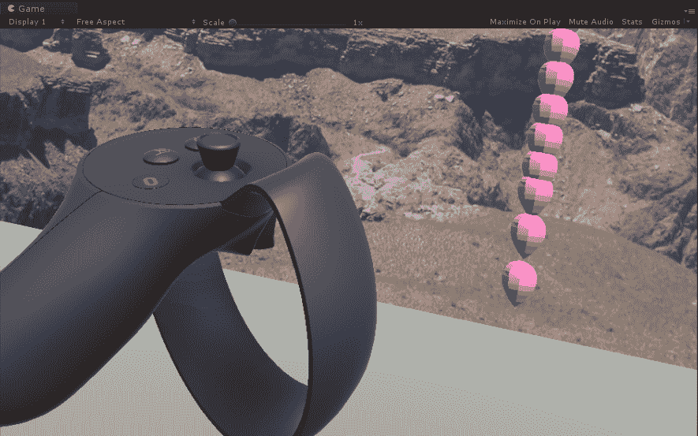

# 第五章：方便的交互式组件

你身处一个充满这些酷炫东西的虚拟世界；我们的天性就是试图伸手触摸某物。正如我们在上一章中看到的，基于注视的选择是交互虚拟场景的一个良好开端，但大多数人直观地想要用手操作。大多数 VR 设备都提供手柄控制器来选择、抓取和与场景中的虚拟对象交互。

在本章中，我们将介绍在 Unity 中捕获用户输入的实践，说明如何在简单的 VR 场景中使用它们。每个人都喜欢气球，所以在这个项目中我们将制作气球。我们甚至可能会弄爆几个。我们将从上一章继续，使用 C#编程进行基本脚本编写，并探讨几个软件设计模式用于用户输入。我们将讨论以下主题：

+   轮询输入设备数据

+   使用可脚本数据对象存储和检索输入状态

+   调用和订阅输入事件

+   使用设备特定 Unity 包提供的交互式组件

在本章中，我们将学习的一个重要教训是，处理 VR 应用程序的用户输入并不只有一种方式。甚至没有一种*最佳方式*。Unity 包括处理用户输入和对象之间一般消息传递的几种机制。VR 设备制造商为其 SDK 提供自己的输入控制器对象和脚本。

此外，VR 制造商和其他人提供了方便的框架工具包，包含高级组件和预制件。我们建议你熟悉为你目标设备提供的工具包。研究演示场景，看看组件是如何工作的以及它们的推荐实践，就像我们在本章末尾将要做的那样。

话虽如此，在本章中，我们将从非常简单的按钮按下输入开始，并由此展开，展示各种设计模式。你并不总是想自己从头开始，但你应该了解事物是如何工作的。

# 设置场景

为了开始我们对于输入机制的探索，让我们设置我们的场景。计划是让玩家创建气球。每个人都喜欢气球！

对于这个场景，你可以从一个新场景（文件 | 新场景）开始，然后添加我们在上一章中构建的 MyMyselfEye 预制件。相反，我决定从上一章中创建的“展览馆”场景开始，并移除除了地面平面和照片平面之外的所有对象，如下所示：

1.  打开“展览馆”场景

1.  移除所有对象，除了 MyMyselfEye、方向光、地面平面和照片平面

1.  将 MeMyselfEye 放置在场景原点，位置(0, 0, 0)

1.  选择文件 | 保存场景为，并给它起一个名字，例如“气球”

# 创建气球

对于气球，如果你选择，可以简单地使用标准的 Unity 球体 3D 原语。或者你可以在 Unity 资产商店或其他地方找到一个对象。我们使用了一个在 Google Poly 上找到的低多边形气球对象（[`poly.google.com/view/a01Rp51l-L3`](https://poly.google.com/view/a01Rp51l-L3)），并且它提供了本章的下载文件。

无论哪种方式，请将对象设置为父对象，使其原点（旋转点）位于底部，如下所示：

1.  在层次结构中创建一个空对象（创建 | 创建空对象）并将其命名为“气球”。

1.  重置其变换（变换 | 齿轮图标 | 重置），然后将其定位在（0，1，1）。

1.  将气球预制件拖入层次结构，作为气球（我的位于`Assets/Poly/Assets/`文件夹）的子对象。

1.  如果你没有气球模型，请使用球体（创建 | 3D 对象 | 球体）。并添加一个材质，如我们在上一章中创建的“蓝色材质”。

1.  将子对象的“位置”设置为（0，0.5，0），使其原点（旋转点）在从父对象引用时位于底部。

场景应该看起来像这样：


# 使其成为预制件

我们的目的是在玩家按下控制器上的按钮时从预制件实例化新的气球。当按钮释放时，气球被释放并飘走。

让我们在场景中调整气球的大小和位置，使其在起始大小和工作距离内。我们还将通过添加`RigidBody`组件来给它一些物理属性：

我们在第八章中更详细地讨论了刚体和 Unity 物理。

1.  在层次结构中选择你的气球对象

1.  在检查器中，将其“变换缩放”设置为（0.1，0.1，0.1）

1.  将其位置设置为（0，1，1）

1.  使用“添加组件”添加一个刚体

1.  取消选中“使用重力”复选框

我的气球对象现在有以下属性：


按以下方式将其设置为预制件：

1.  将气球对象拖入你的`Prefabs/`文件夹以使其成为预制件对象

1.  从你的层次结构中删除原始气球对象

好的。现在让我们来玩控制器按钮。

如果你想要修改一个预制件，将其实例拖回场景中。进行你想要的更改。然后，使用应用按钮将更改保存回对象的预制件。如果场景中不再需要临时实例，请从层次结构中删除它。

# 基本按钮输入

Unity 包括一个标准的输入管理器，用于访问传统的游戏控制器、键盘、鼠标和移动触摸屏输入。这可以包括特定的按钮按下、摇杆轴和设备加速度计等。它还支持来自 VR 和 AR 系统的输入。

输入管理器在物理输入设备之上提供了一个抽象层。例如，您可以引用逻辑输入，例如映射到物理按钮的 `Fire1` 按钮。您可以在编辑 | 项目设置 | 输入中设置和修改项目的映射。

要了解 Unity 输入管理器的概述和详细信息，请参阅 [`docs.unity3d.com/Manual/ConventionalGameInput.html`](https://docs.unity3d.com/Manual/ConventionalGameInput.html)。有关输入类的脚本编写，请参阅 [`docs.unity3d.com/ScriptReference/Input.html`](https://docs.unity3d.com/ScriptReference/Input.html)。各种 VR 设备的输入映射可以在 [`docs.unity3d.com/Manual/vr-input.html`](https://docs.unity3d.com/Manual/vr-input.html) 找到。

让我们看看。首先，我们将编写一个测试脚本以获取特定按钮状态并查看 Unity 输入类的工作方式。一个常见的逻辑按钮是名为 "Fire1" 的按钮。让我们看看您的输入设备为 "Fire1" 使用哪个按钮。

# 使用 Fire1 按钮

我们现在将编写一个名为 `MyInputController` 的脚本，以检测用户是否按下了 `Fire1` 按钮。按照以下方式将脚本添加到您的 `MeMyselfEye` 对象中：

1.  在 Hierarchy 中选择 MyMyselfEye 对象

1.  在 Inspector 中点击添加组件，然后新建脚本

1.  将其命名为 `MyInputController` 并按创建和添加

1.  双击 `MyInputController` 脚本以打开它进行编辑

按照以下方式编辑脚本：

```cs
public class MyInputController : MonoBehaviour 
{
  void Update () 
  {
    ButtonTest();
  }

  private void ButtonTest()
  {
    string msg = null;

    if (Input.GetButtonDown("Fire1"))
      msg = "Fire1 down";

    if (Input.GetButtonUp("Fire1"))
       msg = "Fire1 up";

    if (msg != null)
      Debug.Log("Input: " + msg);
  }
}
```

在此脚本中，在每一帧的 Update 中，我们调用一个私有函数 `ButtonTest`。此函数构建一个名为 `msg` 的消息字符串，报告 `Fire1` 按钮是否刚刚被按下或释放。例如，调用 `Input.GetButtonDown("Fire1")` 将返回一个布尔值（true 或 false），我们在 `if` 语句中检查它。当这些情况中的任何一个为真时，`msg` 字符串不为空（null）并将其打印到 Unity 控制台窗口：

1.  在 Unity 编辑器中按播放键以运行场景

1.  当您按下输入控制器上的 Fire1 按钮时，您将看到输出消息 Input: Fire1 down

1.  当您释放 Fire1 按钮时，您将看到 Input: Fire1 up 消息，如下所示：


您甚至可以使用此脚本来识别您的输入控制器上的哪个物理按钮映射到逻辑 `Fire1` 按钮。例如，使用 OpenVR，`Fire1` 按钮是通过 Vive 控制器的菜单按钮或 Oculus Touch 控制器的 **B** 按钮触发的 ("Button.Two")，如 Unity 输入系统映射部分所示，该部分位于 Unity 手册的 OpenVR 控制器输入页面中 ([`docs.unity3d.com/Manual/OpenVRControllers.html`](https://docs.unity3d.com/Manual/OpenVRControllers.html))。您可以自由地尝试使用其他逻辑输入名称，以及/或通过输入项目设置（编辑 | 项目设置 | 输入）修改映射。

除了使用 Unity 逻辑输入外，通过 SDK 组件直接访问设备也是常见的。让我们在下一节中探讨这一点。

# OpenVR 触发按钮

如果你有一个由 OpenVR 支持的 VR 设备（HTC Vive、Oculus Rift 或 Windows MR），让我们修改`ButtonTest`函数以检查触发按钮的拉动和释放。

要实现这一点，我们需要为我们想要查询的特定输入组件提供我们的脚本。在 OpenVR 中，这由`SteamVR_TrackedObject`组件表示，如下面的脚本变体所示：

```cs
public class MyInputController : MonoBehaviour 
{
  public SteamVR_TrackedObject rightHand;

  private SteamVR_Controller.Device device;

  void Update () 
  {
    ButtonTest();
  }

  private void ButtonTest()
  {
    string msg = null;

    // SteamVR
    device = SteamVR_Controller.Input((int)rightHand.index);
    if (device != null &&  
      device.GetPressDown(SteamVR_Controller.ButtonMask.Trigger))
    {
      msg = "Trigger press";
      device.TriggerHapticPulse(700);
    }
    if (device != null &&  
      device.GetPressUp(SteamVR_Controller.ButtonMask.Trigger)) 
    {
      msg = "Trigger release";
    }

    if (msg != null)
      Debug.Log("Input: " + msg);
  }
}
```

保存此脚本后，我们需要填充`rightHand`变量：

1.  在 Unity 中，选择 MeMyselfEye 以便可以在检查器中看到 My Input Controller

1.  在层次结构中展开[CameraRig]对象

1.  点击控制器（右侧）子对象并将其拖动到检查器中 My Input Controller 的右手槽位

给定`rightHand`对象，我们直接引用其`SteamVR_TrackedObject`组件。在`ButtonTest`函数中，我们使用右手设备的设备 ID（`rightHand.index`）获取*设备*数据，并检查特定于触发器的按下状态。作为额外的好处，我已经向你展示了如何在按下触发器时在设备上提供触觉蜂鸣脉冲。

现在当你按下播放时，拉动控制器触发器将被识别。

使用这样的 SDK 组件，你可以访问 Unity 输入管理器不支持的其他特定于设备的输入。一些控制器上的触发器不仅仅是按下/未按下，还可以返回一个百分比，表示为介于 0.0 和 1.0 之间的值。另一个例子是 Oculus Touch 控制器和其他控制器上的触控敏感握把、按钮和拇指盘。

尝试修改脚本以识别控制器`Grip`按钮或其他输入。提示：尝试*SteamVR_Controller.ButtonMask.Grip*。

# Daydream 控制器点击

Google Daydream VR 在 Android 上默认可能不会对`Fire1`事件做出响应。以下代码显示了如何直接访问控制器点击：

```cs
  private void ButtonTest()
  {
    string msg = null;

    if (GvrControllerInput.ClickButtonDown)
      msg = "Button down";
    if (GvrControllerInput.ClickButtonUp)
      msg = "Button up";

    if (msg != null)
      Debug.Log("Input: " + msg);
  }
}
```

在这种情况下，我们调用`GvrControllerInput`类的静态函数`ClickButtonDown`和`ClickButtonUp`。没有必要识别特定的控制器对象，因为`GvrControllerInput`是一个*单例*。这就是为什么我们可以保证在场景中只有一个实例，因此我们可以直接引用其数据。这在 Daydream 中是有意义的，因为那里只有一个手柄控制器，而在 OpenVR 中则有两个。

# 检测点击

获取用户输入的最简单方法就是从输入组件中*获取*当前数据。我们已经使用 Input 类和 VR SDK 看到了这一点。目前，我们将编写自己的输入组件，将 Unity（或 SDK）输入映射到我们自己的简单 API `MyInputController`中。然后，我们将编写一个`BalloonController`来轮询输入，如图所示：


# 我们自己的按钮接口函数

你可能还记得`MeMyselfEye`玩家装置可能具有特定 VR SDK 的设备特定工具箱子对象。例如，OpenVR 的版本有他们的[CameraRig]预制件。Daydream 的版本有 Daydream Player 预制件。将我们的`MyInputController`组件添加到`MeMyselfEye`中是有意义的，因为它可能需要执行设备特定的 SDK 调用。这样，如果你想要维护适用于各种平台的相机装置预制件，并在为不同的 VR 目标构建项目时进行交换，那么公开给应用程序其余部分的 API 将是统一的，并且独立于特定的设备工具箱。

我们输入控制器将公开两个自定义 API 函数，`ButtonDown`和`ButtonUp`。这些函数的实现将隐藏在调用它们的组件中。例如，我们可以将其编写为首先处理`Fire1`按钮按下，但稍后将其更改为使用触发器按下，或者为 Daydream 创建一个不使用`Fire1`的版本。让我们通过添加以下代码来更新`MyInputController`：

```cs
public bool ButtonDown()
{
  return Input.GetButtonDown("Fire1");
}

public bool ButtonUp()
{
  return Input.GetButtonUp("Fire1");
}
```

或者，你可以修改前面的代码以使用适合你的按钮界面。例如，对于 Daydream，你可能可以使用以下代码代替：

```cs
public bool ButtonDown()
{
  return GvrControllerInput.ClickButtonDown;
}

public bool ButtonUp()
{
  return GvrControllerInput.ClickButtonUp;
}
```

现在，我们将使用我们的`ButtonUp`/`ButtonDown`输入 API。

# 创建和释放气球

让我们现在创建一个`BalloonController`，它将是创建和控制气球的程序组件。它将引用我们的`MyInputController`。按照以下步骤操作：

1.  在层次结构中创建一个空的游戏对象，重置其变换，并将其命名为`BalloonController`

1.  在名为`BalloonController`的对象上创建一个新的脚本，并按以下方式打开它进行编辑：

```cs
public class BalloonController : MonoBehaviour 
{
  public GameObject meMyselfEye;

  private MyInputController inputController;

  void Start () 
  {
    inputController = meMyselfEye.GetComponent<MyInputController>();
  }

  void Update () 
  {
    if (inputController.ButtonDown())
    {
      NewBalloon()
    }
    else if (inputController.ButtonUp())
    {
      ReleaseBalloon();
    }
    // else while button is still pressed, grow it
 }
```

这是控制器的骨架。给定`MeMyselfEye`对象的引用，`Start()`函数获取其`MyInputController`组件并将其分配给`inputController`变量。

`Update()`在游戏运行时每帧被调用。它将调用`inputController.ButtonDown`或`ButtonUp`以查看用户是否更改了输入，并根据响应创建或释放气球。我们将在下面编写这些函数。

注意，我们还在注释中包含了一个占位符，我们将在这里添加`GrowBalloon`函数。

给定气球预制件，`BalloonController`可以通过调用 Unity 的`Instantiate`函数在我们的场景中创建它的新实例。在你的控制器类顶部添加以下`public`变量声明以用于气球预制件：

```cs
 public GameObject balloonPrefab;
```

然后添加一个`private`变量来保存当前气球的实例：

```cs
 private GameObject balloon;
```

现在，当玩家按下按钮时调用的`NewBalloon`函数引用预制件，并按以下方式实例化：

```cs
 private void NewBalloon()
 {
   balloon = Instantiate(balloonPrefab);
 }
```

当玩家释放按钮时，会调用`ReleaseBalloon`函数。它将对气球施加一个轻微的向上力，使其向天空飘浮。我们将定义一个`floatStrength`变量并将其应用于对象的 RigidBody（Unity 物理引擎和 RigidBodies 将在后面的章节中解释）：

```cs
 public float floatStrength = 20f;
```

然后，

```cs
private void ReleaseBalloon()
{
  balloon.GetComponent<Rigidbody>().AddForce(Vector3.up * floatStrength);
  balloon = null;
}
```

注意，我们还清除了气球变量（将其设置为 null），为下一次按钮按下做好准备。

保存文件并在 Unity 中：

1.  将 Hierarchy 中的 MeMyselfEye 对象拖动到 Inspector 中 BalloonController 的 Me Myself Eye 插槽

1.  将 Balloon 预制件从项目的 `Assets` 文件夹拖动到 Inspector 中 BalloonController 的 Balloon Prefab 插槽

当你准备好时，按 Play。在 VR 中，当你按下 `Fire1` 按钮（或你编程的任意按钮）时，会实例化一个新的气球。当你释放它时，气球会向上漂浮。在下面的游戏窗口中，我已经连续多次按下按钮，创建了一系列气球：



这是相同游戏状态的 Hierarchy，显示了 Hierarchy 中的克隆气球（我的预制件名称为 `Balloon-poly`）：


# 按下时充气气球

下一步，我们想在按下按钮的同时充气气球。我们可以通过检查是否有来自按钮按下的当前气球实例，并在每次更新时通过指定的增长率修改其缩放来实现。让我们首先定义它，以便在按钮按下的每秒增长 150%（1.5 倍）：

```cs
public float growRate = 1.5f;
```

现在，修改 Update 函数，添加一个第三层的 `else if` 条件，如下所示：

```cs
  else if (balloon != null)
  {
    GrowBalloon();
  }
```

并像这样添加 `GrowBalloon` 函数：

```cs
 private void GrowBalloon()
 {
   balloon.transform.localScale += balloon.transform.localScale * growRate * Time.deltaTime;
 }
```

`GrowBalloon` 函数将通过当前大小的百分比修改气球的本地区域缩放。`growRate` 是每秒的增长率。因此，我们将其乘以当前帧中的当前分数秒（`Time.deltaTime`）。

在 Unity 中按 Play。当你按下控制器按钮时，你会创建一个气球，气球会继续充气，直到你释放按钮。然后气球会漂浮起来。哇，这实际上很有趣！

接下来，我们将重构我们的代码，使用不同的软件模式来获取用户输入，使用可脚本化对象。

没有人编写代码而不期望对其进行更改。编程是一种动态的艺术，因为你需要重新思考如何做事，随着需求增长和问题解决，这些更改并不一定是为了添加新功能或修复错误，而是为了使代码更干净、更易于使用和维护。这被称为 **重构**，当你更改或重写程序的一部分，但并不一定改变玩家视角中的功能工作方式时。

# 使用可脚本化对象进行输入

在这个例子中，我们将使用一种称为 **可脚本化** **对象** 的技术进一步解耦我们的应用程序与底层输入设备。这些是用于存储信息的数据对象，例如游戏状态、玩家偏好或任何其他非图形数据。可脚本化对象在运行时实例化，就像 MonoBehaviour 一样，但它们不位于 Hierarchy 中，没有 Transform，也没有其他物理和渲染行为。

将可脚本化对象视为项目中的*数据容器*是有用的。

在之前的实现中，`BalloonController`需要一个对`MeMyselfEye`对象的引用来使用其`MyInputController`组件。尽管输入控制器组件可以让你与底层的 SDK 调用分离，但如果你要修改应用程序以使用不同的`MeMyselfEye`（例如，从 OpenVR 到 Daydream），你需要找到并替换场景中所有对`MeMyselfEye`的引用，并将它们替换为新的对象。这里将输入控制器填充到一个可脚本化对象中，然后我们的`BalloonController`引用该对象的数据，如图所示：


实现脚本化对象的过程比具有组件的游戏对象稍微复杂一些。但并不多。让我们开始吧！

请记住，这只是一个如何使用可脚本化对象的例子，同时也是 Unity 中这种强大设计模式的入门介绍。更多信息，请参阅 Unity 教程 *Introduction to* s*criptable* obj*ects* 在[`unity3d.com/learn/tutorials/modules/beginner/live-training-archive/scriptable-objects`](https://unity3d.com/learn/tutorials/modules/beginner/live-training-archive/scriptable-objects)。另外，参见第九章，探索交互空间，了解另一个在项目中使用可脚本化对象进行数据管理的例子。

# 创建脚本化对象

在这个例子中，我们的对象将只有一个变量，用于当前按钮动作。我们将说按钮可以有三个可能的值：`PressedDown`、`ReleasedUp`或`None`。我们将动作定义为在当前`Update`期间发生，然后清除为`None`。也就是说，我们不是记录当前按钮状态（例如，是否按下），而是捕获当前按钮动作（刚刚按下），以与其他章节中的示例保持一致。

将可脚本化对象保存在项目`Assets`中的单独文件夹中是有用的：

1.  在**项目**窗口中，在*Assets*下创建一个名为`ScriptableObjects`的新文件夹

1.  在新文件夹中，右键单击并选择创建 | C# 脚本

1.  将脚本命名为`MyInputAction`

1.  然后，打开`MyInputAction.cs`脚本进行编辑

按照以下方式编辑`MyInputAction.cs`脚本：

```cs
[CreateAssetMenu(menuName = "My Objects/Input Action")]
public class MyInputAction : ScriptableObject {
  public enum ButtonAction { None, PressedDown, ReleasedUp };
  public ButtonAction buttonAction;
}
```

我们不会从`MonoBehaviour`继承，而是将类定义为`ScriptableObject`。我们使用枚举来表示动作，以限制其可能的值到选择列表。

“`enum`关键字用于声明枚举，这是一个由称为枚举列表的命名常量集合组成的独特类型。” - [`docs.microsoft.com/en-us/dotnet/csharp/language-reference/keywords/enum`](https://docs.microsoft.com/en-us/dotnet/csharp/language-reference/keywords/enum)

注意前面脚本的第一行。我们提供了一个*属性属性*，它会在 Unity 编辑器中为我们的对象生成一个菜单项。由于脚本化对象不会被添加到场景层次结构中，我们需要一种在项目中创建它们的方法。使用此属性使其变得容易，如下所示：

1.  保存脚本并返回 Unity。

1.  在 Unity 编辑器主菜单中，导航到资产 | 创建。

1.  你将看到一个名为 My Objects 的新项目，其中包含一个子菜单，有一个名为 Input Action 的项目，正如我们在脚本中的`CreateAssetsMenu`属性属性中指定的那样。菜单如下所示。

1.  选择输入动作以创建一个实例。默认情况下，它将在当前选定的项目资产文件夹中创建。所以如果你打开了`ScriptableObjects`文件夹，它将在那里创建。

1.  将对象重命名为`My Input Action Data`。


如果你选择`ScriptableObjects/`文件夹中的新`My Input Action Data`对象，你可以在检查器中看到其属性。在下面的屏幕截图中，我已点击**按钮动作**下拉列表以显示我们在代码中指定的可能枚举值：


# 填充输入动作对象

下一步是将`MyInputController.cs`更改为填充输入数据对象，使用对对象的引用，如下所示：

```cs
public MyInputAction myInput;

void Update () 
{
  if (ButtonDown())
  {
    myInput.buttonAction = MyInputAction.ButtonAction.PressedDown;
  } else if (ButtonUp())
  {
    myInput.buttonAction = MyInputAction.ButtonAction.ReleasedUp;
  } else
  {
    myInput.buttonAction = MyInputAction.ButtonAction.None;
  }
}
```

脚本使用自己的`ButtonDown`和`ButtonUp`函数来设置`buttonAction`为适当的值。这些甚至可以从*公共*更改为*私有*以进一步封装。

保存脚本。然后在 Unity 中：

1.  在层次结构中选择**MeMyselfEye**对象

1.  在你的`ScriptableObjects`文件夹中找到 My Input Action Data 对象

1.  将它拖放到 My Input Controller (Script)组件的 My Input 槽中，如下所示，这是我 Steam 版本的`MeMyselfEye`：


# 访问输入动作对象

现在`BalloonController`可以访问输入数据对象，而不是`MeMyselfEye`。否则非常相似，只是一个简单的重构。按照以下方式修改`BalloonController.cs`。

首先，我们可以从`BalloonController`中移除对`MeMyselfEye`的所有引用，包括公共变量和整个`Start()`函数（我们不需要`GetComponent<MyInputController>`）。

为输入数据对象添加一个变量：

```cs
public MyInputAction myInput;
```

并在`Update`条件中引用它：

```cs
void Update()
{
  if (myInput.buttonAction == MyInputAction.ButtonAction.PressedDown)
  {
    NewBalloon();
  }
  else if (myInput.buttonAction == MyInputAction.ButtonAction.ReleasedUp)
  {
    ReleaseBalloon();
  }
  else if (balloon != null)
  {
   GrowBalloon();
  }
}
```

保存脚本。然后在 Unity 中，就像我们之前对`MyInputController`所做的那样：

1.  在层次结构中选择 BalloonController 对象

1.  在你的`ScriptableObjects`文件夹中找到 My Input Action Data 对象

1.  将它拖放到 Balloon Controller 组件的 My Input 槽中

按**播放**。应用应该和之前一样工作。按按钮创建气球，按住按钮使其膨胀，释放按钮释放气球。

# 使用可脚本化对象进行模拟测试

这种架构的一个有趣的优势是它如何促进测试。由于我们的应用程序对象与输入设备完全解耦，我们可以模拟输入动作而不实际使用物理输入控制器。例如，尝试这样做：

1.  在层次结构中选择 MeMyselfEye。然后在检查器中，通过取消选中复选框暂时禁用**My Input Controller**组件。

1.  在项目`ScriptableObjects/`文件夹中选择 My Input Action Data 对象

1.  按**Play**。

1.  当游戏运行时，在检查器中，将按钮动作从 None 更改为 PressedDown。

1.  BalloonController 认为发生了 PressedDown 动作。它创建了一个新的气球并开始充气。

1.  在检查器中，将输入动作更改为 PressedUp。

1.  BalloonController 检测到发生了**PressedUp**动作，并释放了当前气球。

测试完成后，别忘了重新启用输入控制器组件！

这种为开发和测试手动设置对象状态的方法可以非常有帮助，尤其是在你的项目增长并变得更加复杂时。

# 使用 Unity 事件进行输入

我们将使用 Unity 事件探索的第三个软件模式。事件允许将事件源与事件消费者解耦。基本上，事件是一个消息系统，其中一个对象触发事件。项目中的任何其他对象都可以监听该事件。它可以为事件发生时调用的特定函数进行订阅。

你可以通过 Unity 检查器使用拖放来设置此功能。或者你可以在脚本中订阅监听函数。在这个例子中，我们将最小化脚本的使用，并使用 Unity 编辑器来订阅事件。

事件是一个非常丰富的主题，我们只能在这里简要介绍。有关使用 Unity 事件的更多信息，网上有很多很好的参考资料，包括 Unity 教程[`unity3d.com/learn/tutorials/topics/scripting/events`](https://unity3d.com/learn/tutorials/topics/scripting/events)和[`unity3d.com/learn/tutorials/topics/scripting/events-creating-simple-messaging-system`](https://unity3d.com/learn/tutorials/topics/scripting/events-creating-simple-messaging-system)。

以下图表说明了我们的输入控制器（调用事件）和气球控制器（订阅事件）之间的关系：


重要的是要注意，与普通事件不同，这些事件不需要取消订阅。

如果你是一名开发者并且熟悉.NET，了解 Unity 事件是委托可能会有所帮助。正如 Unity 手册中解释的，“UnityEvents 可以添加到任何 MonoBehaviour 中，并且可以从代码中以标准.NET 委托的方式执行。当 UnityEvent 添加到 MonoBehaviour 时，它会在检查器中显示，并且可以添加持久回调。”

# 调用我们的输入动作事件

为了使用事件实现我们的示例，我们首先让`MyInputController`在按钮按下时触发一个事件，在按钮释放时触发另一个事件。

首先，在脚本的顶部，我们需要声明我们正在使用 Unity 事件 API。然后，我们声明将要调用的两个 UnityEvents。`Update()`函数只需要在事件发生时调用其中一个事件即可。

整个`MyInputController.cs`如下所示：

```cs
using UnityEngine;
using UnityEngine.Events;

public class MyInputController : MonoBehaviour 
{
 public UnityEvent ButtonDownEvent;
 public UnityEvent ButtonUpEvent;

 void Update()
 {
   if (ButtonDown())
     ButtonDownEvent.Invoke();
   else if (ButtonUp())
     ButtonUpEvent.Invoke();
 }

 private bool ButtonDown()
 {
   return Input.GetButtonDown("Fire1");
 }

 private bool ButtonUp()
 {
   return Input.GetButtonUp("Fire1");
 }
}
```

这就是等式这一边的全部内容。

# 订阅输入事件

使用事件，`BalloonController`不需要在每一帧更新时检查输入动作。所有这些条件逻辑都可以绕过。相反，我们将拖放组件以将它们订阅到事件。现在`Update`函数只需要在实例化后增长气球。

整个`BalloonController.cs`现在看起来像这样。除了代码更少之外，请注意，我们将`NewBalloon`和`ReleaseBalloon`函数从`private`更改为`public`，这样我们就可以在检查器中引用它们：

```cs
public class BalloonController : MonoBehaviour
{
  public GameObject balloonPrefab;
  public float floatStrength = 20f;
  public float growRate = 1.5f;

  private GameObject balloon;

 void Update()
 {
   if (balloon != null)
     GrowBalloon();
 }

 public void NewBalloon()
 {
   balloon = Instantiate(balloonPrefab);
 }

 public void ReleaseBalloon()
 {
   balloon.GetComponent<Rigidbody>().AddForce(Vector3.up * floatStrength);
   balloon = null;
 }

 private void GrowBalloon()
 {
   balloon.transform.localScale += balloon.transform.localScale * growRate * Time.deltaTime;
 }
}
```

将输入事件连接到我们的气球控制器：

1.  选择 MeMyselfEye 并查看其检查器窗口

1.  你会看到 My Input Controller 组件现在有两个事件列表，正如我们在其脚本中声明的。

1.  在按钮按下事件列表中，按右下角的+号创建一个新项目。

1.  将 BalloonController 从层次结构拖到空对象槽中

1.  在函数选择列表中，选择**BalloonController** | **NewBalloon**

重复执行以下按钮按下事件的流程：

1.  在按钮按下事件列表中，按右下角的+号创建一个新项目

1.  将 BalloonController 从层次结构拖到空对象槽中

1.  在函数选择列表中，选择**BalloonController** | **ReleaseBalloon**

现在组件应该看起来像这样：


现在当你按下播放并按下一个按钮时，输入控制器会调用一个事件。*NewBalloon*函数正在监听这些事件并被调用。同样对于按钮抬起事件。

此连接也可以完全通过脚本完成。我们在这里不会深入讨论。作为开发者，我们更经常是其他人设置的事件系统的“用户”。随着你的经验增长，你可能会发现自己正在实现自己的自定义事件。

对于使用 Unity 事件进行用户界面的另一个详细示例，请考虑由本书作者 Jonathan Linowes 和 Krystian Babilinski 合著的 Packt Publishing 出版的 Unity 项目书籍《Augmented Reality for Developers》。

# 真正地使用你的双手

本章我们将探讨的最后几件事情涉及让你更深入地体验虚拟现实。除了按钮和触摸板之外，VR 手控制器可以与你的头部一起在 3D 空间中跟踪。基于 PC 和控制台的游戏，如 Rift、Vive、MR 和 PSVR，在这方面做得非常好，为左右手提供了完全位置跟踪的手控制器。低端移动 VR，如 Daydream，有一个单手控制器，跟踪有限，但总比没有好。

首先，我们将利用位置跟踪的优势，简单地将气球绑定到你的手模型上。在 VR 中，如果没有实际的位置跟踪，例如 Daydream，你的手控制器位置将由 SDK 软件近似，但足够有用。

# 将气球绑定到手中

假设当你按下按钮时，而不是在空间中的固定位置创建新的气球，它从你的手位置生成并生长。实现这一目标的一种方法是将气球实例作为你的手控制器对象的子对象。

`BalloonController` 需要知道哪个手按下了按钮，并将气球绑定到该控制器对象。具体来说，我们将按如下方式将手游戏对象传递给 `NewBalloon` 函数：

```cs
public void NewBalloon(GameObject parentHand)
{
  if (balloon == null)
  {
    balloon = Instantiate(balloonPrefab);
    balloon.transform.SetParent(parentHand.transform);
    balloon.transform.localPosition = Vector3.zero;
  }
}
```

注意，在这个函数中，我们添加了一个额外的测试 (`balloon == null`)，只是为了确保我们没有在未释放第一个气球的情况下连续两次调用 `NewBalloon`。

如前所述，我们从预制体实例化一个新的气球。

然后，我们将它的父对象设置为 `parentHand` 对象。这相当于在层次结构中将一个对象拖动以成为另一个对象的子对象。游戏对象之间的父子关系由内置的 *Transform* 组件处理，因此 API 函数位于 transform 上。

最后，我们重置气球的局部位置。如果你还记得，预制体位于 (0, 1, 1) 或类似的位置。作为手的一个子对象，我们希望它直接连接到手模型的旋转中心点。（或者，根据需要，你可以将气球的原点偏移到不同的连接点。）

值得注意的是，`Instantiate` 函数有几种变体，允许你在一次调用中指定父对象和变换。请参阅 [`docs.unity3d.com/ScriptReference/Object.Instantiate.html`](https://docs.unity3d.com/ScriptReference/Object.Instantiate.html)。

同样，`ReleaseBalloon` 在发送气球之前将其从手中分离，如下所示：

```cs
 public void ReleaseBalloon()
 {
   if (balloon != null)
   {
     balloon.transform.parent = null;
     balloon.GetComponent<Rigidbody>().AddForce(Vector3.up * floatStrength);
   }
   balloon = null;
 }
```

我们如何将手游戏对象传递给 `NewBalloon`？假设你的项目目前正在使用我们在上一主题中设置的 Unity 事件，这非常简单。在检查器中，我们需要更新“按钮按下事件”函数，因为它现在需要游戏对象参数：

1.  在 Unity 编辑器中，选择 MeMyselfEye 对象

1.  在“按钮按下事件”列表中，函数现在可能显示类似 `Missing BalloonController.NewBalloon` 的内容。

1.  选择函数下拉菜单，选择 BalloonController | NewBalloon(GameObject)

1.  在层次结构中展开 MeMyselfEye 对象，寻找手模型，然后将它拖放到空的游戏对象槽中

1.  如果你使用 OpenVR，手将被称为 Controller（右手）

1.  如果你使用 Daydream，手将被称为 GvrControllerPointer

这是我生成的一堆气球飞越大峡谷的截图，很有趣！


# 气球弹出

说实话，很难想到创造气球而不想戳破它们！为了好玩，让我们快速实现一下。你可以想出自己的想法来改进它。

Unity 物理引擎可以检测两个对象何时发生碰撞。为此，每个对象都必须附加一个*碰撞器*组件。然后你可以让碰撞触发一个事件。我们可以订阅该事件，使其执行其他操作，例如播放爆炸效果。这将在气球预制体上设置。所以当两个气球相撞时，它们会爆炸。让我们这样做：

1.  将你的气球预制体的副本从项目`Assets prefabs`文件夹拖动到场景层次结构中**。**

1.  选择添加组件 | 物理 | 球形碰撞器。

1.  要缩放并定位碰撞器，请在其组件中点击编辑碰撞器图标。

1.  在**场景**窗口中，绿色的碰撞器轮廓上有你可以点击来编辑的小锚点。注意，按住*Alt*键可以固定中心位置，而*Shift*键可以锁定缩放比例。

1.  或者，你可以直接编辑**中心**和半径值。我喜欢我的气球使用半径 0.25 和中心(0, 0.25, 0)。

现在，我们将添加一个脚本来处理碰撞事件。

1.  添加组件以创建一个新的 C#脚本，

1.  命名为`Poppable`

1.  并打开它进行编辑

`Poppable`脚本将为`OnCollisionEnter`事件提供一个回调函数。当另一个具有碰撞器的对象进入这个对象的碰撞器时，我们的函数将被调用。在那个时刻，我们将调用`PopBalloon`来实例化爆炸并销毁气球：

```cs
public class Poppable : MonoBehaviour
{
 public GameObject popEffect;

 void OnCollisionEnter(Collision collision)
 {
   PopBalloon();
 }

 private void PopBalloon()
 {
   Instantiate(popEffect, transform.position, transform.rotation);
   Destroy(gameObject);
 }
}
```

你可以看到`OnCollisionEnter`接收一个包含碰撞信息的`Collision`参数，包括与之碰撞的游戏对象。我们在这里将忽略它，但你可能想进一步探索它：[`docs.unity3d.com/ScriptReference/Collision.html`](https://docs.unity3d.com/ScriptReference/Collision.html)。

保存脚本。现在，回到 Unity 中：

1.  从**项目**资源中选择一个粒子系统预制体，例如`Assets/Standard Assets/ParticleSystems/Prefabs/Explosion`（这是我们用来在第四章，*基于注视的控制*中杀死伊森的预制体）

1.  将效果预制体拖放到 Poppable 的`Pop Effect`槽中

1.  通过按 Apply 保存这些更改到预制体

1.  你现在可以从层次结构中删除**气球**

好的，让我们试试。按 Play。创建一个气球。然后，伸手再次按下按钮，让一个新的气球与它相撞。它会爆炸吗？哎呀！

# 可交互物品

直接在 VR 中与对象交互，例如抓取物品并使用它们执行其他操作，要复杂一些。而且，正确做到这一点可能有点棘手。所以，特别是在这本书中，自己构建交互系统是没有意义的。不幸的是，也没有一个单一的标准化工具包。但是，有超过几个非常好的工具包可以使用，尽管大多数都是针对特定目标平台的。

通常，这些解决方案的架构是相似的：

+   提供玩家相机装置的预制件

+   相机装置包括用于您手部的对象，包括输入控制器组件

+   手对象包括在交互发生时触发事件的组件

+   任何可以交互的对象都会添加一个交互组件，使用输入事件进行交互

+   额外组件和选项扩展了可交互行为

工具包将包括一些演示场景，提供丰富的示例，说明如何使用特定的工具包。通常，研究演示比实际文档更有信息量。

在本节中，我们介绍了一种使用两个工具包（*SteamVR InteractionSystem*和*Daydream VR Elements*）的抓取和投掷机制。对于其他平台，技术是类似的。

对于 Oculus SDK（无 OpenVR），您需要集成 Oculus Avatar SDK（有关 Oculus Avatars 的详细信息，请参阅第十二章，*Social VR Metaverse*），这里还有一个快速视频，展示如何将`OVR Grabber`组件添加到您的`OVRCameraRig`控制器中：[`www.youtube.com/watch?v=sxvKGVDmYfY`](https://www.youtube.com/watch?v=sxvKGVDmYfY)。

# 使用 SteamVR Interaction System 进行交互

SteamVR Unity 包包括一个交互系统，最初是为 Steam 令人印象深刻的演示 VR 应用程序*The Lab*（[`store.steampowered.com/app/450390/The_Lab/`](http://store.steampowered.com/app/450390/The_Lab/)）中的迷你游戏和场景开发的。它可以在`Assets/SteamVR/InteractionSystem/`文件夹中找到。我们建议您探索示例场景、预制件和脚本。

交互系统包括它自己的玩家相机装置，它替换了我们一直在使用的默认[CameraRig]。玩家层次结构如下所示：


它包括一个*VRCamera*，两个手（*Hand1*和*Hand2*），以及其他有用的对象。每个手都包括一个附加点（*Attach_ControllerTip*），一个悬停高亮（*ControllerHoverHighlight*），以及一个工具提示对象（*ControllerButtonHints*）。

1.  在`SteamVR/InteractionSystem/Core/Prefabs `中定位**Player**预制件，并将其拖动到场景层次结构中的 MyMyselfEye 作为子对象

1.  删除或禁用[CameraRig]对象

为了与当前场景兼容，我们还需要更新**Button Down Event**中的**NewBalloon**参数：

1.  在层次结构中展开玩家对象，以便您可以看到 Hand1 和 Hand2 对象

1.  在层次结构中选择 MeMyselfEye

1.  将 Hand2（或 Hand1）从 **层次结构** 拖动到 My Input Controller 组件的 Button Down Event 中的 GameObject 参数槽。

接下来，对于交互式对象，有一大堆组件可供选择。查看 `SteamVR/InteractionSystem/Core/Scripts` 文件夹的内容。我们将使用 *可投掷* 的一个。

首先，让我们在一个基本的立方体上尝试这个操作。然后，我们将使气球可抓取并可投掷：

1.  在层次结构中创建一个立方体（创建 | 3D 对象 | 立方体）。

1.  在玩家可触及的距离内调整其大小和位置。例如，大小 (0.3, 0.3, 0.3) 和 **位置** (-0.25, 1.3, -0.25) 可能适用。

1.  选择立方体，从交互系统添加 `Throwable` 组件。

1.  注意这将自动添加其他所需组件，包括基本交互式对象和刚体。

1.  在刚体组件上，取消选中使用重力复选框，这样它就会悬挂在空中而不是掉到地上。

现在当您按下播放时，伸手到立方体上，以便您的控制器穿透（碰撞）它。然后，使用控制器上的扳机，抓住立方体并将其扔出去！

要使气球可投掷，我们修改预制件：

1.  从项目窗口中将气球预制件的副本拖动到场景层次结构中。

1.  添加组件 Steam Throwable。

1.  按 **应用** 保存预制件。

1.  并从层次结构中删除气球。

按 Play。按 Fire1 按钮创建并充气一个气球。释放它。然后，用扳机抓住它。投掷气球。如果您之前实现了 *可爆裂* 爆炸，当它撞击到某个物体时，它甚至像投射物一样爆炸，比如地面或照片平面！

# 使用 Daydream VR 元素进行交互。

基础 GoogleVR 包不包含交互式对象，但您可以在 Daydream Elements 包中找到它们。这个包是谷歌工程师用于使用 Daydream VR 的示例场景、组件和预制件的集合。要获取该包：

1.  访问 Daydream Elements 的 Github 发布页面 [`github.com/googlevr/daydream-elements/releases`](https://github.com/googlevr/daydream-elements/releases)。

1.  下载 `DaydreamElements.unitypackage`。

1.  使用 **资产** | **导入包** | **自定义包...** 将其导入到您的项目中。

该包包含一个名为 `ObjectManipulationPointer` 的预制件，它是我们一直在使用的 `GvrControllerPointer` 的直接替代品：

1.  在层次结构中，展开 MeMyselfEye 并钻到 Player 对象。

1.  选择 GvrControllerPointer 并在检查器中禁用它。

1.  在项目窗口中，导航到 `Assets/DaydreamElements/Elements/ObjectManipulationDemo/Prefabs/UI/` 文件夹。

1.  将 ObjectManipulationPointer 预制件拖动到层次结构中，作为 GvrControllerPointer 的同级。

为了与当前场景兼容，我们还需要更新 Button Down Event 中的 NewBalloon 参数。

1.  在层次结构中选择 MeMyselfEye。

1.  将 ObjectManipulationPointer 从层级拖到 My Input Controller 组件的“按钮按下事件”中的 GameObject 参数槽。

接下来，对于交互式对象，我们在`Assets/DaydreamElements/Elements/ObjectManipulationDemo/Scripts/`中添加一个`MoveablePhysicsObject`组件。

在[`developers.google.com/vr/elements/object-manipulation`](https://developers.google.com/vr/elements/object-manipulation)可以找到关于 Daydream Elements 对象操作的相关附加信息。

首先，让我们在一个基本的立方体上尝试这个。然后，我们将使气球可抓取和可投掷：

1.  在层级中创建一个立方体（创建 | 3D 对象 | 立方体）。

1.  在玩家可触及的距离内调整其大小和位置。例如，缩放（0.25，0.25，0.25）和位置（-0.4，0.75，-0.3）可能适用。

1.  选择立方体后，添加组件`MoveablePhysicsObject`。

1.  注意，如果不存在，这将自动添加一个`RigidBody`组件。

1.  在`RigidBody`组件上，取消选中“使用重力”复选框，这样它就会悬挂在空中，而不是在播放时掉到地上。

现在，当你按“播放”时，使用你的控制器，使其激光束击中立方体。然后，按控制器上的点击按钮来抓住它。移动它，然后再次按下来释放它。

由于应用程序目前使用相同的按钮来创建新的气球和操作激光指针，因此每次我们使用按钮时都会得到一个气球。请考虑这是你应用程序中的一个错误。我们将把这个逻辑实现留给你自己去完成，例如，告诉*MyInputController*如果*MoveablePhysicsObject*正在移动某个对象，则不要调用事件。

提示：你可以在 Cube 上添加一个脚本组件，该组件检查 MoveablePhysicsObject 状态，并在对象被选中时禁用 MyInputController 动作。这没有很好地记录，但请查看 MoveablePhysicsObjects.cs 及其基类 BaseInteractiveObjects.cs 的源代码。

要使气球可投掷，我们修改预制件：

1.  将 Balloon 预制件的副本从项目窗口拖到场景的层级中。

1.  添加组件**MoveablePhysicsObject**

1.  点击“应用”以保存预制件

1.  并从层级中删除气球

按“播放”。按按钮创建并充气气球。释放它。然后，尝试用激光指针抓住它。如果你之前实现了*Poppable*爆炸，当它撞击到某物时，它甚至会像投射物一样爆炸！

# 摘要

在本章中，我们探讨了处理 VR 项目用户输入的各种软件模式。玩家使用控制器按钮在场景中创建、充气和释放气球。首先，我们尝试使用标准 Input 类来检测逻辑按钮点击，例如“Fire1”按钮，然后学习了如何访问特定于设备的 SDK 输入，例如具有触觉反馈的 OpenVR 扳机按钮。

在我们的场景中，我们实现了一个简单的输入组件来轮询按钮动作。然后，我们对代码进行了重构，使用可脚本化的对象来存储输入动作数据。在第三次实现中，我们使用了 Unity 事件将输入动作消息传递给监听组件。我们还增强了场景，将气球附着到你的虚拟手部位置，并添加了弹出气球作为爆炸性投射物的能力！最后，我们使用了一个交互框架（用于 SteamVR 和 Daydream）来实现抓取和投掷机制，使用给定工具包中提供的组件，而不是尝试编写自己的代码。

在下一章中，我们将进一步探讨用户交互，使用 Unity UI（用户界面）系统来实现信息画布、按钮和其他 UI 控件。
