# 世界空间 UI

在上一章中，我们发现了如何在世界空间场景中与游戏对象交互。这些对象不仅可以是球类玩具，或工具和武器，还可以是你可以与之交互的按钮和其他用户界面小部件。此外，Unity 还包括一个用户界面画布系统，用于构建菜单和其他 UI。

**图形用户界面（GUI）**或简称 UI，通常指的是屏幕上的二维图形，它覆盖了主要游戏玩法，并通过状态消息、仪表和输入控件（如菜单、按钮、滑块等）向用户展示信息。

在 Unity 中，UI 元素始终位于一个**画布**上。Unity 手册将`canvas`组件描述如下：

`canvas`组件代表 UI 布局和渲染的抽象空间。所有 UI 元素都必须是具有附加`canvas`组件的`GameObject`的子元素。

在传统视频游戏中，UI 对象通常在**屏幕空间**画布上作为叠加进行渲染。屏幕空间 UI 类似于贴在你电视或显示器上的一个纸板，覆盖在它后面的游戏动作上。

然而，在 VR 中这并不适用。如果你尝试在虚拟现实中使用屏幕空间进行 UI，你会遇到问题。由于存在两个立体投影相机，你需要为每只眼睛提供不同的视图。虽然传统游戏可能会利用屏幕边缘来显示 UI，但**虚拟现实没有屏幕边缘**！

相反，在 VR 中，我们使用各种方法将用户界面元素放置在**世界空间**而不是屏幕空间中。在本章中，我将介绍这些类型中的许多。我们将在本章中详细定义这些类型，并展示它们的示例： 

+   **护目镜式抬头显示（HUD）**：在护目镜式抬头显示中，用户界面画布出现在你眼睛前方相同的位置，无论你的头部如何移动

+   **准星光标**：类似于护目镜式 HUD，使用交叉线或指针光标在场景中选择事物

+   **挡风玻璃式抬头显示（HUD）**：这是一个像驾驶舱中的挡风玻璃一样漂浮在三维空间中的弹出面板

+   **游戏元素 UI**：画布作为游戏玩法的一部分位于场景中，就像体育场中的计分板

+   **信息气泡**：这是一种附着在场景中对象上的 UI 消息，就像漂浮在角色头顶上的思维气泡

+   **游戏内仪表盘**：这是一个游戏玩法的一部分的控制面板，通常位于腰部或桌面高度

+   **基于手腕的菜单调色板**：使用双手输入控制器，一只手可以握住菜单调色板，而另一只手进行选择并使用选定的工具

这些 UI 技术的差异基本上归结于你在哪里以及何时显示画布，以及用户如何与之交互。在本章中，我们将逐一尝试这些方法。在这个过程中，我们还将继续探索使用头部移动和手势以及按钮点击进行用户输入。

注意，本章中的一些练习使用了第四章中完成的场景，*基于注视的控制*，但这些练习是独立的，并不直接依赖于本书其他章节。如果你决定跳过其中任何部分或未保存你的工作，那也是可以的。

# 学习 VR 设计原则

在我们深入实施细节之前，我想介绍设计 3D 用户界面和 VR 体验的主题。在过去几十年里，尤其是最近几年，已经做了很多工作。

随着消费级 VR 设备的普及，以及像 Unity 这样的强大开发工具，许多人发明和尝试新事物，不断创新，并创造出真正优秀的 VR 体验，这并不令人惊讶。你可能就是其中之一。但今天 VR 的背景并非真空。它有着研究和发展的历史，这些历史为当前的工作提供了养分。例如，由 Bowman 等人撰写的《3D 用户界面：理论与实践》一书，是对消费、工业和科学应用及研究的 3D 用户交互的经典学术综述。该书最初于 2004 年出版，第二版于 2017 年（LaViola 等人）出版，是对学术理论和实践原则的最新回顾。

当前关于 VR 设计的写作更加易于理解。Adrienne Hunter 撰写的 Medium 文章《开始 VR：用户体验设计》（[`medium.com/vrinflux-dot-com/get-started-with-vr-user-experience-design-974486cf9d18`](https://medium.com/vrinflux-dot-com/get-started-with-vr-user-experience-design-974486cf9d18)）是一篇易于阅读但实用的 VR 用户体验设计入门文章，她是流行的 VR 物理包 NewtonVR 的联合创作者。她确定了几个重要的核心原则，包括像圆形剧场一样，通过物体、灯光和音频提示来吸引注意力，以及为高度和可访问性设计空间。

另一篇优秀的文章是《实用 VR：设计速查表》（[`virtualrealitypop.com/practical-vr-ce80427e8e9d`](https://virtualrealitypop.com/practical-vr-ce80427e8e9d)）。这是一本旨在持续维护和更新的活页手册，包含了 VR 设计指南、流程、工具和其他资源。

我最喜欢的 VR 设计研究之一是 Mike Algers 作为 2015 年研究生制作的《VR 界面设计预可视化方法》。他在[`vimeo.com/141330081`](https://vimeo.com/141330081)上的鼓舞人心的视频提出了一种易于消化的设计原则论点，特别是对于坐姿 VR 体验，基于工作空间和视觉感知的既定人体工程学。我们将在本章中运用这些想法。Algers 还探讨了 VR 的按钮设计、原型工作流程和 VR 操作系统设计概念。（Algers 目前供职于谷歌 VR 开发团队。）

在他的论文中，Algers 建立了一套围绕用户第一人称位置的舒适区域，如下所示：


任何距离小于 0.5 米的都太近，不舒服；你可能不得不眯眼才能聚焦并跟随那个范围内的物体。超过 20 米太远，以至于无法进行有意义的互动，并且对于视差深度感知来说也太远了。你的周边区域（77–102 度）不应包含主要内容和交互，但可以包含次要内容。在你身后，他称之为好奇心区域，你需要伸展（或旋转椅子或转身）才能看到那里的情况，所以它最好很重要但不是强制性的。主要内容区域是你的正常工作空间。然后，考虑到手臂的伸展（向前、向上和向下）以及工作空间中的其他正常人类运动，Algers 定义了坐着 VR 体验的最佳虚拟工作区域，如下所示：

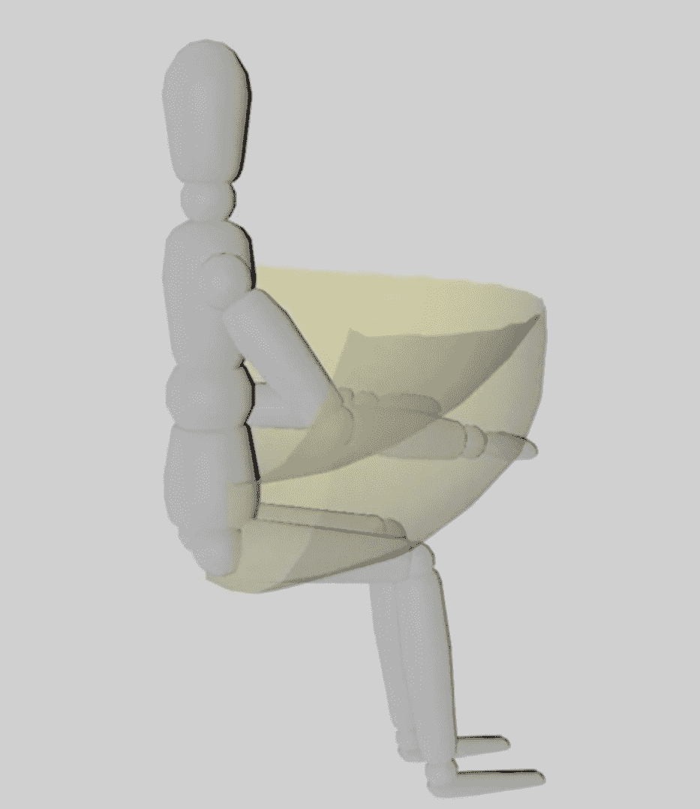

对于站立和房间规模 VR，工作空间是不同的。站立时，可能更容易（也是预期的）能够转身来获取你周围的所有东西。在房间规模 VR 中，你可以四处走动（并且跳跃、蹲下和匍匐，等等）。Owlchemy Labs 的 Alex Schwartz 和 Devin Reimer（已被谷歌收购）在 Oculus Connect 2 会议（[`www.youtube.com/watch?v=hjc7AJwZ4DI`](https://www.youtube.com/watch?v=hjc7AJwZ4DI)）上讨论了为他们的热门游戏 Job Simulator 设计站立 VR 体验的挑战，包括适应现实世界的人体工程学和不同高度体验。

一些关于为虚拟现实设计的其他优秀资源包括：

+   Oculus 的一系列关于 VR 设计最佳实践的文章，包括用户输入（[`developer.oculus.com/design/latest/concepts/bp-userinput/`](https://developer.oculus.com/design/latest/concepts/bp-userinput/）），其中包括关于移动、按钮映射、菜单以及在 VR 中使用双手的建议。

+   Leap Motion（我们在这本书中不涵盖其手部识别技术）在 VR 设计方面有一些优秀的作品，可以在[https://developer.leapmotion.com/explorations](https://developer.leapmotion.com/explorations)找到，包括关于交互设计的优秀文章（[`blog.leapmotion.com/building-blocks-deep-dive-leap-motion-interactive-design/`](http://blog.leapmotion.com/building-blocks-deep-dive-leap-motion-interactive-design/)）和用户界面设计（[`blog.leapmotion.com/beyond-flatland-user-interface-design-vr/`](http://blog.leapmotion.com/beyond-flatland-user-interface-design-vr/)）。

+   谷歌产生了一系列开创性的例子，包括*Daydream Labs: 从 VR 原型中学习到的经验 - Google I/O 2016*（[`www.youtube.com/watch?v=lGUmTQgbiAY`](https://www.youtube.com/watch?v=lGUmTQgbiAY)）和 Daydream Elements（[`developers.google.com/vr/elements/overview`](https://developers.google.com/vr/elements/overview)）。

当然，这仅仅触及了表面；每天都有更多内容被发布。谷歌搜索一下。关于虚拟现实用户界面设计和用户体验的资源列表，可以在 The UX of VR 网站上找到（[`www.uxofvr.com/`](https://www.uxofvr.com/))。

享受阅读和观看视频的乐趣。同时，让我们回到工作中。是时候我们自己实现一些 VR UI 了。

# 一个可重用的默认画布

Unity 的 UI 画布提供了许多选项和参数，以适应我们在游戏、网页和移动应用中期望的图形布局灵活性。这种灵活性带来了额外的复杂性。为了使本章的示例更容易理解，我们首先将构建一个可重用的预制画布，它具有我们首选的默认设置。

创建一个新的画布，并将其渲染模式更改为如下所示：

1.  导航到 GameObject | UI | Canvas

1.  将画布重命名为`DefaultCanvas`

1.  设置渲染模式为世界空间

Rect Transform 组件定义了画布本身的网格系统，就像一张图表纸上的线条。它用于在画布上放置 UI 元素。将其设置为方便的`640 x 480`，具有`0.75`的纵横比。`Rect Transform`组件的宽度和高度与场景中画布的世界空间大小不同。让我们按照以下步骤配置`Rect Transform`组件：

1.  在`Rect Transform`中，将宽度设置为`640`，高度设置为`480`。

1.  在缩放中，将 X、Y、Z 设置为(`0.00135`、`0.00135`、`0.00135`)。这是我们在世界空间单位中一个像素的大小。

1.  现在，将画布定位在地面平面上方一个单位处，使其居中

    (`0.325`是`0.75`的一半)。在 Rect Transform 中，将 Pos X、Pos Y、Pos Z 设置为(`0`、`1.325`、`0`)。

接下来，我们将添加一个空的`Image`元素（具有白色背景），以帮助我们可视化其他情况下透明的画布，并在需要时为画布提供一个不透明的背景（我们还可以使用`Panel` UI 元素）：

1.  选择`DefaultCanvas`后，导航到 GameObject | UI | Image（确保它作为`DefaultCanvas`的子项创建；如果不是，将其移动到`DefaultCanvas`下）。

1.  选择 Image 后，在其 Rect Transform 面板的右上角有一个锚点预设按钮（如下面的截图所示）。选择它将打开锚点预设对话框。按住*Alt*键以查看拉伸和位置选项，并选择右下角的选项（拉伸-拉伸）。现在，（空白）图像被拉伸以填充画布：

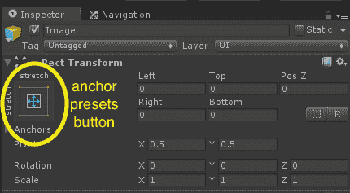

1.  根据以下截图所示的`DefaultCanvas`的`Image`子项的默认属性，双重检查您的图像设置：

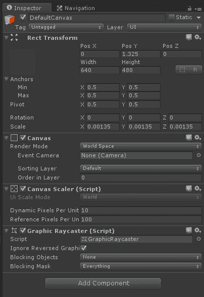

添加一个具有有用默认设置的`Text`元素，如下所示：

1.  选中`DefaultCanvas`后，导航到 GameObject | UI | Text（确保它作为`DefaultCanvas`的子组件创建，如果不是，将其移动到`DefaultCanvas`下）。应该在画布上出现`New Text`字样。

1.  选中文本后，设置对齐为居中对齐和中间对齐，并将垂直溢出设置为溢出。将缩放设置为（`4`，`4`，`4`）。

1.  使用其矩形变换面板左上角的控件，将它的锚点预设按钮设置为（拉伸 - 拉伸）。

1.  根据以下截图所示的`DefaultCanvas`的`Text`子组件的默认属性，仔细检查你的文本设置：

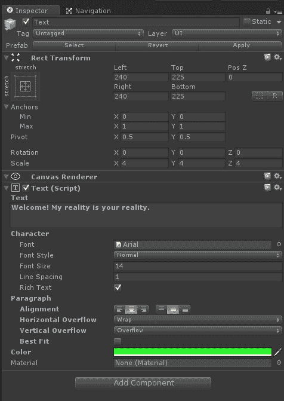

通过保持`DefaultCanvas`选中状态并设置 Canvas Scaler | Dynamic Pixels Per Unit 为`10`来提高像素分辨率，以获得更清晰的文字字体。

最后，将你的工作保存为一个预制体资产，你可以在本章中以以下方式重复使用：

1.  如果需要，在项目资产中创建一个名为`Prefabs`的新文件夹。

1.  将`DefaultCanvas`对象拖动到`Project Assets/Prefabs`文件夹中，以创建一个预制体。

1.  现在请在层级面板中删除`DefaultCanvas`实例。

好的，很高兴我们已经解决了这个问题！现在我们可以使用`DefaultCanvas`预制体，配合不同的 VR 用户界面。

一个画布有一个`Rect Transform`组件，它定义了画布本身的网格系统，就像一张图表纸上的线条。它用于在画布上放置 UI 元素。这与画布对象在世界空间中的大小和位置不同。

# 视窗 HUD

头戴式显示器，或称 HUD，是你视野中一个浮动的画布，覆盖在游戏场景之上。在 VR 术语中，有两种 HUD 变体。我将把这些变体称为*视窗 HUD*和*挡风玻璃 HUD*。本节将探讨第一种。

在视窗 HUD 中，UI 画布连接到相机上。它似乎不会对你的头部运动做出反应。当你移动头部时，它看起来像是*粘在你的脸上*。让我们看看一种更直观的展示方式。假设你戴着一顶带有视窗的头盔，UI 看起来像是投射在那个视窗的表面上。在虚拟现实中，可能有些情况下这是可以接受的，但它很可能会破坏沉浸感。因此，通常只有在视窗是游戏的一部分，或者意图是将你从场景中移出时（例如硬件或系统的实用程序菜单），才应该使用它。

让我们创建一个带有欢迎信息的视窗 HUD，如下所示，并亲自感受一下它的感觉：

1.  在层级面板中，展开`MeMyselfEye`对象，然后深入到`Main Camera`对象（对于 OpenVR 可能是`[CameraRig]/Camera (head)`；对于 Daydream，可能是`Player/Main Camera/`）。

1.  从项目面板中，将`DefaultCanvas`预制体拖动到相机对象上，使其成为其子对象。

1.  在层级面板中，选择画布后，将其重命名为`VisorCanvas`。

1.  在画布的检查器面板中，将矩形变换组件的 Pos X、Pos Y、Pos Z 更改为（`0`，`0`，`1`）。

1.  展开视场显示器画布并选择其子`Text`对象。

1.  在检查器面板中，将文本从默认文本更改为欢迎！我的现实是你的现实。（你可以在输入文本区域中输入换行符。）

1.  将文本颜色更改为鲜艳的颜色，例如绿色。

1.  禁用`Image`对象，通过在检查器中取消选中其启用复选框，使仅显示文本。

1.  保存场景，并在 VR 中尝试。

这是带有`VisorCanvas`的 Rift 屏幕截图：

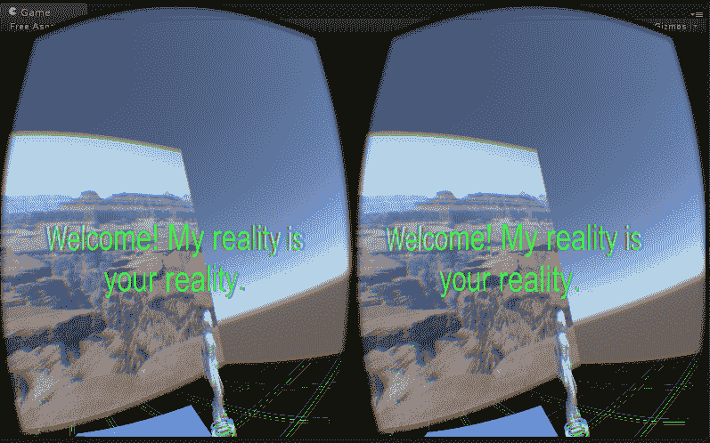

在 VR 中，当你四处移动头部时，文本会跟随移动，就像它被附着在你脸前的视场显示器上一样。

视场显示器（HUD）画布和瞄准十字准星光标画布被设置为相机的子对象。

现在，继续禁用`VisorCanvas`或直接删除它（在层次结构面板中，右键单击它并单击删除），因为我们将在稍后的部分以不同的方式显示欢迎信息。接下来，我们将查看这种技术的另一种应用。

# 瞄准十字准星光标

在第一人称射击游戏中至关重要的视场显示器（HUD）变体是*瞄准十字准星*或交叉线光标。这里的类比是你通过枪口或目镜（而不是视场显示器）观察，你的头部移动与枪或炮塔本身同步。你可以使用一个常规游戏对象（例如，四边形+纹理图像）来做这件事，但本章是关于用户界面（UI）。所以，让我们使用我们的画布，如下所示：

1.  在层次结构面板中找到我们之前提到的主相机对象。

1.  从项目面板中，将`DefaultCanvas`预制件拖放到相机对象上，使其成为相机的子对象。将其命名为`ReticleCursor`。

1.  将矩形变换组件的 Pos X、Pos Y、Pos Z 设置为（`0`，`0`，`1`）。

1.  删除其子对象：`Image`和`Text`。这将*破坏*预制件关联；这是可以的。

1.  通过从主菜单栏中选择它，通过 GameObject | UI | Raw Image 导航，并确保它是`ReticleCursor`的子对象，添加一个原始图像子对象。

1.  在原始图像面板的矩形变换中，将 Pos X、Pos Y、Pos Z 设置为（`0`，`0`，`0`）并将宽度和高度设置为（`22`，`22`）。然后，在原始图像（脚本）属性中选择一个明显的颜色，例如红色。

1.  保存场景并在 VR 中尝试。

如果你想要一个看起来更好的瞄准十字准星，在原始图像（脚本）属性中，将纹理字段填充为光标图像。例如，点击纹理字段最右侧的微小*圆形*图标。这会打开选择纹理对话框。找到并选择一个合适的图像，例如`Crosshair`图像。（本书附带`Crosshair.gif`的副本。）只需确保将宽度和高度更改为你的图像大小（`Crosshair.gif`的大小为 22 x 22）并确保锚点设置为中间中心。

我们将画布位置 Pos Z 设置为`1.0`，这样十字准线就会在你前方 1 米处浮动。在许多 UI 场景中，固定距离的光标就足够了，比如当你从距离你固定的平面上选择某个东西时。

然而，这是世界空间。如果你和十字准线之间有另一个对象，十字准线将被遮挡。

此外，如果你看得很远的东西，你会重新聚焦你的眼睛，同时看清楚光标会有困难。为了强调这个问题，尝试将光标移近。例如，如果你将`ReticleCursor`的 Pos Z 改为`0.5`或更小，你可能需要眯着眼睛才能看到它！为了补偿这些问题，我们可以进行射线投射并将光标移动到你所看对象的实际距离，相应地调整光标大小，使其看起来保持相同的大小。这是这个想法的一个简单版本：

1.  选择`ReticleCursor`后，点击添加组件 | 新脚本，将其命名为`CursorPositioner`，然后点击创建并添加。

1.  通过双击名称在 MonoDevelop 中打开脚本。

这是`CursorPositioner.cs`脚本：

```cs
using UnityEngine; 
using UnityEngine.EventSystems; 
using System.Collections; 

public class CursorPositioner : MonoBehaviour { 
  private float defaultPosZ; 

  void Start () { 
    defaultPosZ = transform.localPosition.z; 
  } 

  void Update () { 
    Transform camera = Camera.main.transform; 
    Ray ray = new Ray (camera.position, camera.rotation * 
       Vector3.forward); 
    RaycastHit hit; 
    if (Physics.Raycast (ray, out hit)) { 
      if (hit.distance <= defaultPosZ) { 
        transform.localPosition = new Vector3(0, 0, hit.distance); 
      } else { 
        transform.localPosition = new Vector3(0, 0, defaultPosZ); 
      } 
    } 
  } 
} 
```

矩形变换组件的 Pos Z 在脚本中的`transform.localPosition`中找到。如果它小于给定的 Pos Z，则该脚本将其更改为`hit.distance`。现在，你也可以将十字准线移动到一个更舒适的距离，例如 Pos Z = `2`。

由`@eVRydayVR`编写的一个优秀的教程展示了如何实现距离和尺寸补偿的世界空间十字准线。您可以访问[`www.youtube.com/watch?v=LLKYbwNnKDg`](https://www.youtube.com/watch?v=LLKYbwNnKDg)，这是一个名为 Oculus Rift DK2 - Unity 教程：十字准线的视频。

我们刚刚实现了自己的光标十字准线，但现在许多 VR SDK 也提供了光标。例如，在 Google VR 中，`GvrReticlePointer.cs`脚本是一个更全面的实现。另一个例子，Oculus OVR 包包括一个`Cursor_Timer`预制件，你可以将其用作加载...指示光标。

# 挡风玻璃 HUD

术语*抬头显示*（HUD）起源于其在飞机上的使用，飞行员能够以头部向前而不是向下看仪表板的方式查看信息。由于这种用法，我将它称为*挡风玻璃 HUD*。像头盔 HUD 一样，信息面板覆盖了游戏玩法，但它并没有附着在你的头上。相反，你可以将其视为在你坐在驾驶舱或牙医椅上时附着在你的座位上。

头盔 HUD 就像 UI 画布一样——它附着在你的头上。挡风玻璃 HUD 就像它附着在你周围的玻璃穹顶上。

让我们通过以下步骤创建一个简单的挡风玻璃 HUD：

1.  从项目面板中，将`DefaultCanvas`预制件拖动到层次结构面板中的`MeMyselfEye`对象上，使其成为`MeMyselfEye`的直接子对象（这次不在相机下）。

1.  将其重命名为`WindshieldCanvas`。

1.  在选择`WindshieldCanvas`后，将 Rect Transform 组件的 Pos X、Pos Y、Pos Z 设置为（`0`，`1.4`，`1`）。

1.  现在，我们将设置文本组件。在`WindshieldCanvas`下选择`Text`，将文本改为“欢迎！我的现实即是你的现实。”同时，将颜色改为鲜艳的颜色，例如绿色。

1.  这次，我们将使面板半透明。从`WindshieldCanvas`下的图像中选择图像，并选择其颜色样本。然后在颜色对话框中，将`Alpha ("A")`通道从`255`修改到大约`115`。

这非常直接。当你通过 VR 查看时，画布最初就在你面前，但随着你四处张望，它的位置似乎保持静止，并相对于场景中的其他对象，如以下截图所示：

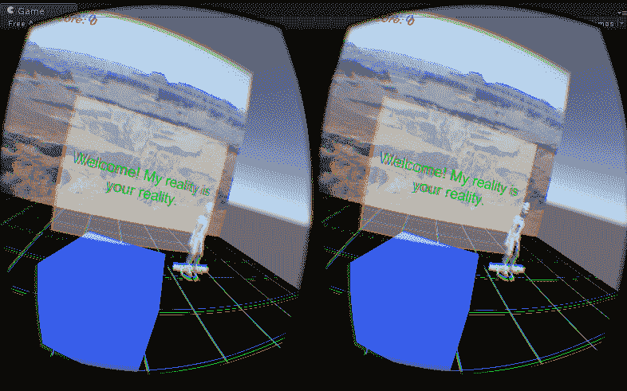

正如我们在下一章（第七章）第七章中将要看到的，*运动与舒适*，当一个第一人称角色在场景中移动时，HUD 画布将保持在你的面前，相对于你的身体对象`MeMyselfEye`的相同相对位置。你现在可以在编辑器中尝试它：

1.  在层次结构中选择`MeMyselfEye`。

1.  按下播放。

1.  然后在场景窗口中，使用移动工具，移动`MeMyselfEye`的位置。在 VR 中，你会看到 HUD（抬头显示）就像是你身体的一部分或宇宙飞船的驾驶舱一样跟随移动。

你可能已经意识到场景中的对象可能会遮挡 HUD 面板，因为它们都占据了相同的世界空间。如果你需要防止这种情况，你必须确保画布总是最后渲染，这样它就会出现在任何其他对象的前面，无论其在 3D 空间中的位置如何。在一个传统的单视角游戏中，你可以通过添加第二个用于 UI 的相机并更改其渲染优先级来实现这一点。在立体 VR 中，你必须以不同的方式完成这项任务，可能需要为你的 UI 对象编写自定义着色器或进行每层遮挡剔除。这是一个高级话题；有关详细信息，请参阅*World Space canvas on top of everything*？讨论线程：[`answers.unity.com/questions/878667/world-space-canvas-on-top-of-everything.html`](https://answers.unity.com/questions/878667/world-space-canvas-on-top-of-everything.html)。

这种 HUD 的一个变体是将画布旋转，使其始终面向你，同时其 3D 空间中的位置保持固定。参见本章的*信息气泡*部分，了解如何编写此代码。

为了好玩，让我们编写一个脚本，在 15 秒后移除欢迎信息画布，如下所示：

1.  在选择`WindshieldCanvas`后，点击添加组件 | 新脚本，将脚本命名为`DestroyTimeout`，然后点击创建并添加。

1.  在 MonoDevelop 中打开脚本。

这是`DestroyTimeout.cs`脚本：

```cs
using UnityEngine; 

public class DestroyTimeout : MonoBehaviour 
{ 
  public float timer = 15f; 

  void Start () 
  { 
    Destroy (gameObject, timer); 
  } 
} 
```

当游戏启动时，计时器结束后`WindshieldCanvas`将消失。

风挡 HUD 画布被设置为第一人称角色的子对象，相机的同级对象。

在这个例子中，我们开始向第一人称体验迈进。想象一下坐在一辆车或飞机的驾驶舱里。你的抬头显示（HUD）投影在你前面的挡风玻璃上，但你可以自由地转动你的头四处张望。在场景的层次结构面板中，有一个第一人称对象（`MeMyselfEye`），其中包含相机装置，可能是你的角色身体，以及你周围的其它装饰。当车辆在游戏中移动时，整个驾驶舱会一起移动，包括相机装置和挡风玻璃。我们将在本章和第七章第七章，*玩转物理和火焰*中进一步探讨这一点。

# 游戏元素 UI

当埃森在第四章的迪奥拉玛场景中被杀时，第四章，*基于注视的控制*，`GameController` 对象的 `KillTarget` 脚本中的分数值被更新，但我们没有向玩家（在第四章中设置）显示当前分数。我们现在将这样做，在背景图像 `PhotoPlane` 的右上角添加一个记分板：

1.  从项目面板中，将 `DefaultCanvas` 预制体直接拖放到场景视图中

1.  将其重命名为 `ScoreBoard`

1.  选择 `ScoreBoard`，将矩形变换组件的 Pos X、Pos Y、Pos Z 设置为（`-2.8`、`7`、`4.9`），并将 Width 和 Height 设置为（`3000`、`480`）

1.  选择 `ScoreBoard` 下的 Text，将字体大小设置为 `100` 并选择一个醒目的颜色，如红色

1.  在文本中输入分数：0 示例字符串

1.  通过取消选中启用复选框或删除它来禁用 `ScoreBoard` 下的图像

我们在场景中添加了另一个画布，将其大小和位置设置为我们想要的位置，并格式化文本以进行显示。它应该看起来像这样：

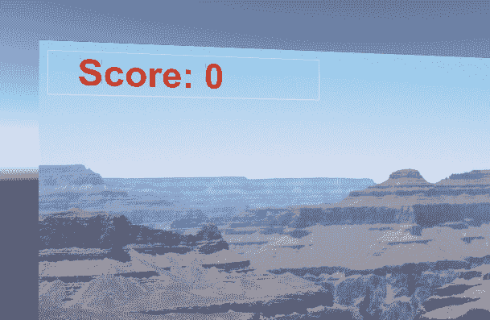

现在，我们需要更新 `KillTarget.cs` 脚本，如下所示：

+   我们可能正在使用 UnityEngine UI 类：

```cs
using UnityEngine.UI; 
```

+   为 `scoreText` 添加一个公共变量：

```cs
  public Text scoreText; 
```

+   在 `Start()` 中添加一行代码以初始化分数文本：

```cs
scoreText.text = "Score: 0"; 
```

+   在 `Update()` 方法中添加一行代码以更改分数文本，当分数变化时：

```cs
score += 1; 
scoreText.text = "Score: " + score; 
```

保存脚本文件后，返回到 Unity 编辑器，在层次结构面板中选择 `GameController`，然后将层次结构中的 `ScoreBoard` 下的 Text 对象拖放到 `Kill Target (Script)` 中的分数文本字段。

在 VR 中运行场景。每次你通过注视埃森（通过注视他）杀死他时，你的分数都会在 `PhotoPlane` 上方的 `ScoreBoard` 上更新。

游戏元素 UI 画布就像任何其他游戏对象一样是场景的一部分。

这是一个使用场景中物体作为信息显示的例子。我们的例子相当简单。你可能想要制作一个更漂亮的模型记分板，就像你在体育场或类似的地方看到的那样。关键是，它是场景的一部分，要看到信息，你可能实际上需要转动你的头，然后，嗯，看看它。

# 使用 TextMeshPro

要使广告牌像霓虹灯一样发光，你可以使用 TextMesh Pro，它目前免费包含在 Unity 中。例如：

1.  在层次结构中选择`ScoreBoard`，创建一个新的`TextMesh`文本元素（右键点击 UI | TextMeshPro - Text）。

1.  这将替换我们的标准 UI 文本元素，因此请禁用`Text`对象。

1.  在 TMP 文本上，将其字体资产设置为 Bangers SDF。

1.  对于其材质预设，请使用 Bangers SDF Glow。

1.  滚动到发光设置以调整颜色和其他设置，如你所愿。

你甚至可以编写一个脚本，循环修改发光设置，制作一个闪烁的发光标志！

如果你选择尝试这个，请确保更新 GameController 的`KillTarget`脚本来使用 TMP 对象而不是 UI 对象。`Modify KillTarget.cs`如下：

我们可能会使用 UnityEngine TextMesh Pro 类：

```cs
using TMP; 
```

将`scoreText`变量的数据类型替换为`TMP_Text`：

```cs
  public TMP_Text scoreText; 
```

将 TMP 文本项拖放到检查器中的槽位。脚本的其他部分保持不变，因为`TMP_Text`具有与 UI 文本相同的`text`属性。

**TextMesh Pro**是 Unity 中用于文本格式化和布局的强大工具。它是 Unity UI Text 的替代品，增加了高级文本渲染、自定义着色器、排版控制（如段落间距和字距调整）等。它最初是一个第三方插件，现在免费包含在 Unity 中。文档可以在以下位置找到：[`digitalnativestudios.com/textmeshpro/docs/`](http://digitalnativestudios.com/textmeshpro/docs/)

这是使用 TextMesh Pro 和其检查器设置应用发光效果的分数板文本的截图：

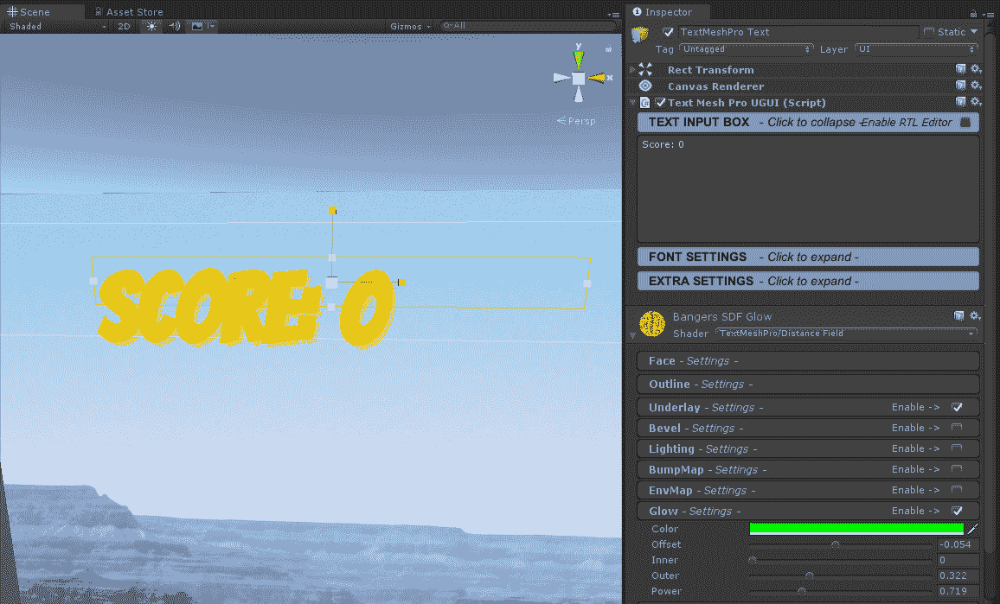

# 信息气泡

在漫画书中，当一个角色说话时，它会在一个*话泡*中显示。在许多在线社交 VR 世界中，参与者由头像表示，并且他们的名字会显示在某个人的头像上方。我将这种类型用户界面称为*信息气泡*。

信息气泡位于世界空间中的特定 3D 位置，但画布应始终面向相机。我们可以通过脚本确保这一点。

在此示例中，我们将显示由`LookMoveTo.cs`脚本控制的`WalkTarget`对象的 X、Z 位置（在第四章，*基于注视的控制*中设置），添加信息气泡的步骤如下：

1.  从项目窗口，将`DefaultCanvas`预制体直接拖放到层次结构窗口，使其成为`WalkTarget`的子项。

1.  将其重命名为`InfoBubble`。

1.  选择`InfoBubble`后，将 Rect Transform 组件的 Pos X、Pos Y、Pos Z 设置为(`0`, `0.2`, `0`)。

1.  选择`InfoBubble`下的文本，将 Rect Transform 组件的 Pos X、Pos Y、Pos Z 设置为(`0`, `0`, `0`)，并将 Right 和 Bottom 设置为`0`, `0`。

1.  在`InfoBubble`下选择 Image，将缩放设置为(`0.7`, `0.2`, `1`)。

1.  为文本输入`X:00.00`, `Z:00.00`样本字符串。

确认画布和文本的大小和位置大致正确，并按需调整文本。（在我的场景中，原点处有一个立方体，所以我暂时禁用它以查看也位于原点的 WalkTarget。）

现在，我们将修改`LookMoveTo.cs`脚本以显示当前的`WalkTarget` X, Z 位置。在 MonoDevelop 编辑器中打开脚本，并添加以下代码：

```cs
using UnityEngine; 
using UnityEngine.UI; 

public class LookMoveTo : MonoBehaviour 
{ 
  public GameObject ground; 
  public Transform infoBubble; 

  private Text infoText; 

  void Start () 
  { 
    if (infoBubble != null) 
    { 
      infoText = infoBubble.Find ("Text").GetComponent<Text> (); 
    } 
  } 

  void Update () 
  { 
    Transform camera = Camera.main.transform; 
    Ray ray; 
    RaycastHit[] hits; 
    GameObject hitObject; 

    ray = new Ray (camera.position, camera.rotation * Vector3.forward); 
    hits = Physics.RaycastAll (ray); 
    for (int i=0; i < hits.Length; i++) 
    { 
      RaycastHit hit = hits [i]; 
      hitObject = hit.collider.gameObject; 
      if (hitObject == ground) 
      { 
        if (infoBubble != null) 
        { 
          infoText.text = "X: " + hit.point.x.ToString("F2") + 
                          "Z: " + hit.point.z.ToString("F2"); 

          infoBubble.LookAt(camera.position); 
          infoBubble.Rotate (0, 180f, 0); 
        } 
        transform.position = hit.point; 
      } 
    } 
  }
} 
```

行`using UnityEngine.UI;`表示此脚本将需要访问 Unity UI API。我们定义了一个`public Transform infoBubble`变量，它将被设置为`WalkTarget/InfoBubble`对象。我们还定义了一个`private Text infoText`变量，它被设置为`InfoBubble`对象的 Text 对象。脚本假设给定的`InfoBubble`有一个子 Text UI 对象。

不幸的是，过度使用单词*text*可能会造成混淆。`infoText` *text*对象有一个*text*组件，该组件有一个*text*字符串属性！你可以在 Unity 编辑器中看到这一点。如果你在`InfoBubble/Text`被选中时检查检查器面板，你会看到它包含一个 Text（Script）组件，该组件有一个文本字段。这个文本字段是我们写入消息的地方。因此，在`Setup()`中，我们找到`WalkTarget/InfoBubble/Text`对象，将 Text 对象分配给`infoText`，然后在`Update()`中，我们设置`infoText.text`的字符串值，以便在气泡画布上显示分数。

此外，在`Update()`中，我们通过使用`infoBubble.LookAt()`并将相机位置传递给它来变换`infoBubble`画布，使其始终面向我们。`LookAt()`的结果是画布面向我们。因此，我们还需要围绕*y 轴旋转 180 度。

保存脚本，并将`InfoBubble`对象从层次结构拖到 Look Move To（脚本）组件中的信息气泡槽中。如果你没有分配`InfoBubble`画布，脚本仍然会运行，因为我们在我们引用它们之前测试了`null`对象。

信息气泡 UI 画布附加到其他游戏对象上，随着它们的移动而移动，并且始终面向相机（就像一个广告牌）。

在 VR 中运行场景，你会看到`WalkTarget`有一个小信息气泡告诉我们它的 X, Z 位置。

额外挑战：想要尝试其他东西吗？为 Ethan 实现一个生命值条。使用`KillTarget`脚本中的`countDown`变量来确定他的健康百分比，并在健康值不为 100%时在其头顶上方显示一个生命值条（水平条）。

信息气泡在需要显示属于场景中特定对象的 UI 消息时很有用，并且可能随对象一起移动。

# 游戏中的仪表盘包含输入事件

游戏中的仪表盘或控制面板是集成到游戏本身中的 UI 显示。一个典型的场景是汽车或宇宙飞船，你坐在驾驶舱内。在腰部水平（桌面水平）有一个面板，上面有一套控制装置、仪表、信息显示等。仪表盘在坐姿 VR 体验中感觉更自然。

在几页之前，我们讨论了挡风玻璃 HUD。仪表盘基本上是同一件事。一个区别是，仪表盘可能更明显地是关卡环境的一部分，而不仅仅是辅助信息显示或菜单。

实际上，仪表盘可以是一个非常有效的控制 VR 运动病感的机制。研究人员发现，当 VR 用户有更好的接地感和一致的*地平线*在视野中时，他在虚拟空间中移动时不太可能感到恶心。相比之下，成为一个没有自我或接地感的一维眼球，无疑是自找麻烦！（有关此内容和其他优秀提示，请参阅[Oculus 最佳实践](https://developer.oculus.com/documentation/intro-vr/latest/concepts/bp_intro/)）

在这个例子中，我们将制作一个简单的带有开始/停止按钮的仪表盘。目前，按钮将操作场景中的水管以帮助抵御僵尸。（为什么不呢？）像本章中的其他示例一样，此项目使用第四章中创建的场景，*基于注视的控制*。

这个项目可能比你想象的要复杂一些。然而，如果你曾经在任何 Minecraft 中构建过东西，你就知道即使是简单的事情也可能需要组装多个部件。以下是我们将要做的：

+   创建一个包含两个功能按钮的仪表盘画布——开始和停止

+   在场景中添加一个水管并将其连接到按钮

+   编写一个简单的脚本，用于激活按钮

+   通过注视按钮来突出显示按钮

+   改进脚本，以便仅在按钮被突出显示时激活按钮

那么，让我们开始吧。

# 创建带有按钮的仪表盘

首先，让我们创建一个带有开始和停止按钮的仪表盘，如下所示：

1.  从项目窗口，将`DefaultCanvas`预制体拖动到层次结构面板中的`MeMyselfEye`对象，使其成为子对象。

1.  将其重命名为`Dashboard`。

1.  在选择`Dashboard`后，将 Rect Transform 组件的 Pos X、Pos Y、Pos Z 设置为(`0`, `0.6`, `0.6`)，并将旋转设置为(`60`, `0`, `0`)。请随意调整位置以适应您偏好的舒适区域和您特定的 VR 设备相机支架。

1.  如果需要，禁用或删除`Dashboard`的 Text 子对象。

这样就将仪表盘放置在您的眼睛下方 1 米处，并稍微向前。

如果您想要一个*工作进度*的外观，我已包括一个车辆仪表盘的草图图像，您可以使用，如下所示：

1.  将`DashboardSketch.png`文件导入到您的项目（例如`Assets/Textures`文件夹）中。

1.  将一个新的 GameObject | UI | Raw Image 作为`Dashboard`的子对象添加。

1.  将`DashboardSketch`纹理从项目面板拖动到 Raw Image 组件的纹理字段。

1.  将其 Rect Transform 组件的 Pos X、Pos Y、Pos Z 设置为(`0`,`0`,`0`)，宽度为`140`，高度为`105`。

1.  它应该在 X、Y 和 Pivot 的中间中心(`0.5`,`0.5`)锚定，旋转(`0`,`0`,`0`)。

1.  将比例设置为 (`4.5`,`4.5`,`4.5`).

接下来，我们将添加启动和停止按钮。它们可以放在画布上的任何位置，但草图已经为它们预留了两个很好的空间：

1.  在 `Dashboard` 下添加一个新的 GameObject | UI | Button 作为新的子对象。命名为 `StartButton`。

1.  将其 Rect Transform 组件的 X、Y、Z 设置为 (`-48`, `117`, `0`), 宽度和高度设置为 (`60`, `60`), 并锚定到中心中间 (`0.5`)。无旋转和比例 `1`。

1.  在按钮的 Image (Script) 组件面板中，对于源图像，点击最右侧的小圆圈以打开选择精灵选择器，并选择 `ButtonAcceleratorUpSprite`（你可能已将其导入到 `Assets/Standard Assets/CrossPlatformInput/Sprites` 文件夹）。

1.  在按钮的 Button (Script) 组件面板中，对于正常颜色，我使用了 RGB (`89`,`154`,`43`) 并将高亮颜色设置为 (`105`, `255`, `0`)。

1.  类似地，创建另一个名为 `StopButton` 的按钮，其 Rect Transform 组件的 X、Y、Z 为 (`52`, `118`, `0`)，并将宽度和高度设置为 (`60`, `60`)。对于源图像，选择 `ButtonBrakeOverSprite`，然后选择正常颜色 (`236`, `141`, `141`) 和高亮颜色 (`235`, `45`, `0`)。

结果应该看起来像这样：

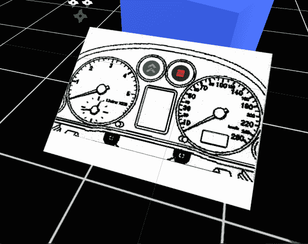

最后一件事情。如果你正在使用本章早期创建的 `ReticleCursor`，该 `ReticleCursor` 与 `CursorPositioner.cs` 脚本一起创建，我们希望仪表板本身具有碰撞器以供脚本使用。我们可以通过以下步骤实现这一点：

1.  选择 `Dashboard`，右键单击以获取选项，并导航到

    3D 对象 | 平面。

1.  将其位置设置为 (`0`,`0`,`0`), 旋转设置为 (`270`,`0`,`0`), 比例设置为 (`64`,`1`,`48`)。

1.  禁用其 Mesh Renderer（但保留其 Mesh Collider 启用）。

现在仪表板上有一个未渲染的平面子对象，但当 `CursorPositioner` 执行射线投射时，其碰撞器将被检测到。我们这样做是为了让你在即使不直接看按钮的情况下，也能看到这个仪表板面板上的注视点。

拥有一个具有按下和释放状态的单独切换按钮可能比单独的启动和停止按钮更好。当你完成这一章后，继续找出如何实现它！

我们刚刚创建了一个应该在 VR 中出现在腰部或桌面高度的宇宙空间画布。我们用仪表板草图进行了装饰，并添加了两个 UI 按钮。现在，我们将为按钮连接到特定的事件。

# 将水管链接到按钮

让我们先给按钮分配一些功能，比如打开水管的动作。如果我们有策略地瞄准，甚至可能击退流氓僵尸。巧合的是，我们之前导入的 Unity 粒子系统标准资产中有一个水管，我们可以使用它。按照以下步骤将其添加到场景中：

1.  如果你还没有这样做，请通过导航到 Assets | Import Package | ParticleSystems 从主菜单栏导入粒子系统标准资产。

1.  在项目窗口中，找到`Assets/Standard Assets/Particle Systems/Prefabs/Hose`预制件，并将其拖动到层次窗口中。

1.  将其 Transform 组件的 X、Y、Z 设置为（`-3`、`0`、`1.5`），并将旋转设置为（`340`、`87`、`0`）。

1.  确保 Hose 已启用（勾选其启用复选框）。

1.  在层次窗口中展开 Hose，以便可以看到其子 WaterShower 粒子系统。选择它。

1.  在检查器中，在粒子系统属性面板中，查找“唤醒时播放”并取消勾选。

注意，在层次窗口中，Hose 对象有一个`WaterShower`子对象。这是我们将通过按钮控制的实际粒子系统。它应该以*关闭*的状态开始。

Hose 预制件本身带有鼠标驱动的脚本，我们不想使用，

因此，按照以下方式禁用它：

1.  选择 Hose 后，禁用（取消勾选）其 Hose（脚本）。

1.  还要禁用（取消勾选）简单鼠标旋转（脚本）组件。

现在我们将通过告诉按钮监听`OnClick()`事件，将`StartButton`连接到 WaterShower 粒子系统，如下所示：

1.  在层次窗口中再次展开 Hose，以便可以看到其子 WaterShower 粒子系统。

1.  在层次窗口中，选择`StartButton`（位于`MeMyselfEye/Dashboard`下）。

1.  注意，在检查器中，`Button`组件的`OnClick()`面板是空的。点击该面板右下角的*加号*（+）图标以显示一个新字段，标签为 None（对象）。

1.  将 WaterShower 粒子系统从层次窗口拖动到 None（对象）字段。

1.  其功能选择器，默认值是“无功能”。将其更改为 ParticleSystem | Play()。

好的。对于`StopButton`，步骤类似，如下所示：

1.  在层次窗口中，选择`StopButton`。

1.  点击其`OnClick()`面板右下角的*加号*（+）图标。

1.  将 WaterShower 从层次窗口拖动到 None（对象）字段。

1.  其功能选择器，默认值是“无功能”。将其更改为 ParticleSystem | Stop()。

开始和停止按钮*监听*`OnClick()`*事件*，当其中一个事件发生时，

分别调用 WaterShower 粒子系统的`Play()`和`Stop()`函数。为了使其工作，我们需要按下按钮。

# 通过脚本激活按钮

在我们为用户提供按按钮的方法之前，让我们看看我们如何从脚本中做到这一点。在`GameController`上创建一个新的脚本，如下所示：

1.  在层次窗口中选择`GameController`后，按“添加组件”|“新脚本”以创建一个名为`ButtonExecuteTest`的脚本。

1.  在 MonoDevelop 中打开脚本。

在以下脚本中，我们每隔五秒切换水龙带的开关，如下所示：

```cs
using UnityEngine; 
using UnityEngine.UI; 

public class ButtonExecuteTest : MonoBehaviour 
{ 
  public Button startButton;
  public Button stopButton;

  private bool isOn = false; 
  private float timer = 5.0f; 

  void Update () 
  { 
    timer -= Time.deltaTime; 
    if (timer < 0.0f) 
    { 
      isOn = !isOn; 
      timer = 5.0f; 

      if (isOn) 
      { 
        stopButton.onClick.Invoke(); 
      } else 
      { 
        startButton.onClick.Invoke(); 
      } 
    } 
  } 
} 
```

该脚本管理一个布尔值`isOn`，表示水龙带是开启还是关闭。并且它有一个计时器，每次更新时从 5 秒开始倒计时。我们使用`private`关键字为只在此脚本中使用的变量，而`public`的变量可以通过 Unity 编辑器和其他脚本查看和修改。对于`startButton`和`stopButton`，你将在 Unity 编辑器中将它们拖放进去。

在此脚本中，我们使用`UnityEngine.UI`。正如我们在上一章中看到的，*事件*是不同组件之间通信的一种方式。当发生事件时，例如按钮按下，另一个脚本中的函数可能会被调用。在我们的情况下，我们将触发与开始按钮按下相对应的事件，以及与停止按钮按下相对应的事件，正如我们在检查器中设置的那样。

保存脚本并点击播放。喷嘴应该每五秒开关一次。

现在我们已经测试了按钮点击和喷嘴之间的事件系统连接，我们可以在继续下一个脚本之前禁用此脚本：

1.  选择`GameController`，

1.  通过取消选中其`Enable`复选框禁用`ButtonExecuteTest`组件，或删除该组件。

将复杂功能分解成小块并单独测试是一种优秀的实现策略。

# 瞄准以高亮按钮

同时，让我们检测用户是否在查看按钮并高亮它。尽管按钮是 Unity UI 对象，但需要通过射线投射来检测。可能还有其他方法可以完成这项任务，如本章后面所述，但在这里我们将为每个按钮添加一个游戏对象球体并发射一条射线来检测它。首先，通过以下步骤添加球体：

1.  在层次结构面板中，选择`StartButton`（位于`MeMyselfEye/Dashboard`下），右键单击以获取选项，并导航到 3D 对象 | 球体。

1.  将其变换组件的缩放设置为(`52`, `52`, `52`)，以便它适合

    按钮大小。

1.  通过取消选中 Mesh Renderer 复选框禁用球体的 Mesh Renderer。

同样，为`StopButton`重复这些步骤。一个快捷方法是复制球体，如下所示：

1.  右键单击 Sphere 并选择复制。

1.  将复制的项目（`Sphere (1)`）拖入`StopButton`。

1.  将其位置重置为(`0`,`0`,`0`)。

现在，在`StartButton`上创建一个新的脚本，如下所示：

1.  选择`StartButton`，导航到添加组件 | 新脚本以创建一个名为`RespondToGaze`的脚本。

1.  打开脚本进行编辑。

在下面的`RespondToGaze.cs`脚本中，我们告诉按钮在你看向它时变得高亮，使用子对象 Sphere 的碰撞器：

```cs
using UnityEngine; 
using UnityEngine.UI; 

public class RespondtoGaze : MonoBehaviour 
{ 
  public bool highlight = true;
  private Button button; 
  private bool isSelected;

  void Start ()
  {
    button = GetComponent<Button>();
  }

  void Update () 
  { 
    isSelected = false;
    Transform camera = Camera.main.transform; 
    Ray ray = new Ray(camera.position, camera.rotation * Vector3.forward); 
    RaycastHit hit; 
    if (Physics.Raycast (ray, out hit) &&
        (hit.transform.parent != null) &&
        (hit.transform.parent.gameObject == gameObject) 
    { 
      isSelected = true;
    } 

    if (isSelected)
    {
      if (highlight)
        button.Select();
    }
    else {
      UnityEngine.EventSystems.EventSystem.current.SetSelectedGameObject(null);
    }
  } 
}
```

在此脚本中，在每次更新时，我们从相机发射一条射线。如果它击中按钮的球体碰撞器，那么击中对象的父对象应该是这个按钮。所以（在检查击中对象有父对象之后），我们将父 GameObject 与此按钮的 GameObject 进行比较。

如果注视已经选择了这个按钮，我们触发按钮的 Select 来使其高亮。高亮是在 Unity 的`EventSystem`中完成的。虽然 EventSystem 已经为鼠标点击和屏幕触摸实现了所有这些功能，但我们必须手动通过调用`button.Select()`来告诉按钮它已被选中。

取消按钮的高亮并不明显。EventSystem 在运行时场景中维护一个当前选中的对象。我们通过将 null 传递给`SetSelectedGameObject()`来清除它。

保存脚本并*播放*。当你注视一个按钮时，它应该突出显示，当你从它移开目光时，它应该移除突出显示。

这也是一个可重用组件脚本的例子。我们只为 StartButton 编写并测试了它。我们可以为 StopButton 使用相同的脚本：

1.  从层次结构中选择 StopButton。

1.  将 RespondToGaze 脚本从项目资产拖到按钮上，或

1.  选择添加组件 | 脚本 | 响应注视。

再测试一下项目。当你注视按钮时，两个按钮都应该突出显示。

如果你使用 Google VR for Cardboard 或 Daydream，你可以在场景中包含`GvrEventSystem`预制件。然后这个`RespondToGaze`脚本就变得不必要且冗余了。`Daydream`组件已经支持基于注视的选择、突出显示和输入控制器进行点击。但我鼓励你跟随这个项目，体验一下这种功能是如何实现的。如果是这样，暂时在你的场景中禁用`GvrEventSystem`。

# 观看并点击以选择

```cs
Input.GetButtonDown("Fire1").
```

需要更改的`RespondToGaze.cs`脚本更改相当简单。在类的顶部添加以下公共变量：

```cs
public bool clicker = true;
public string inputButton = "Fire1";
```

在`Update()`的底部进行以下更改：

```cs
  ... 
  if (isSelected)
  {
    if (highlight)
        button.Select();
    if (clicker && InputGetButtonDown("Fire1"))
        button.onClick.Invoke();
  }
```

当控制器`"Fire1"`按钮被按下时，它将触发 UI 按钮的点击。

该组件提供了启用高亮显示和/或使用输入控制器进行点击的选项。您还可以选择将触发点击事件的逻辑输入按钮。

现在我们有一个游戏中的仪表板，带有响应用户输入的按钮，它控制场景中对象（水管）的行为。

# 观看并开始选择

我们可以使用基于时间的选择而不是点击器来点击按钮。为了使这起作用，我们将在注视按钮时保持倒计时计时器，就像我们在上一章中用来杀死 Ethan 的那个一样。

修改`RespondToGaze.cs`脚本。在类的顶部添加以下变量：

```cs
public bool timedClick = true;
public float delay = 2.0f;

private float timer = 0f;
```

在`Update()`中，进行以下更改：

```cs
... 
  if (isSelected)
  {
    if (highlight)
        button.Select();
    if (clicker && Input.GetButtonDown("Fire1"))
        button.onClick.Invoke();
    if (timedClick) 
    {
      timer += Time.deltaTime;
      if (timer >= delay)
        button.onClick.Invoke();
  }
  else {
    UnityEngine.EventSystems.EventSystem.current.SetSelectedGameObject(null);
    timer = 0f;
  }
```

现在，不仅按钮点击会在`Input.GetButtonDown`上涉及，而且如果你长时间注视按钮（当`timedClick`为`true`时），也会涉及。当按钮被选中（突出显示）时，我们开始计时并计数。当计时器到期时，将调用点击事件。如果在那时之前取消选中按钮，计时器将重置为零。

*它对你有效吗？太棒了！*

所以这是一个相对复杂的项目。目标是创建一个带有开关水管的按钮仪表板。我们将它分解成离散的步骤，一次添加一个对象和组件，并在继续之前测试每个步骤以确保其按预期工作。如果你试图一次性实现所有这些，或者在没有测试的情况下快速完成，事情可能会（并且将会）出错，这将使找出问题所在变得更加困难。

额外挑战：此功能可以根据不同目的进一步增强。例如，它可以用来向用户显示倒计时正在运行，可能通过动画旋转光标来实现。此外，在执行点击事件时还可以提供进一步的反馈。例如，按钮 UI 对象有一个名为动画的过渡选项，这可能很有帮助。同时，考虑音频提示。

# 使用 VR 组件进行指向和点击

正如我们所见，虽然 Unity 提供了专门针对传统屏幕空间 UI 和移动应用的 UI 元素，如画布文本、按钮和其他控件，但在世界空间中使用它们并与 VR 用户输入相结合可能会相当复杂。世界空间交互假设一些物理、碰撞体和射线投射来检测交互事件。

幸运的是，VR 设备特定的工具包可能提供一些组件，可以处理一些这项工作。正如我们在前面的章节中看到的，设备制造商提供了基于他们 Unity SDK 的工具包，其中包含方便的脚本、预制体和演示场景，说明了如何使用它们。

在这种情况下，我们正在寻找允许您使用 Unity UI 元素在画布上设计场景的组件，利用所有它们的 EventSystem 交互功能，使用世界空间 3D 模型，以及输入控制器或激光指针的组件。例如，考虑以下内容：

+   Oculus Rift 和 GearVR: OVRInputModule；请参阅[`developer.oculus.com/blog/unitys-ui-system-in-vr/`](https://developer.oculus.com/blog/unitys-ui-system-in-vr/)

+   SteamVR：Steam InteractionSystem；安装 SteamVR 包后，请参阅`/Assets/SteamVR/InteractionSystem/`文件夹

+   Daydream：

+   VRTK 开源工具包：[`github.com/thestonefox/VRTK`](https://github.com/thestonefox/VRTK)

最后，你可能考虑从 Unity Asset Store 购买一个包。例如，Curved UI 包（$25）允许你创建 VR 准备好的弯曲画布，并支持 Vive、Oculus Touch、Daydream 控制器和注视输入，如图所示：

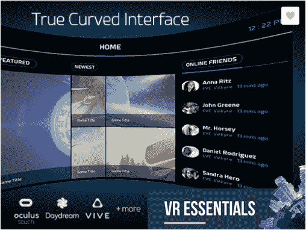

# 使用 Unity UI 和 SteamVR

我们在第五章“实用交互对象”中介绍了 SteamVR InteractionSystem。它旨在作为一个如何使用 SteamVR SDK 的示例，但包括一些非常有用的组件和演示场景。使用交互系统，将仪表板转换为可以直接使用位置跟踪手控制器操作的控制面板变得非常简单。

交互系统包括它自己的`Player`相机装置，它替换了我们一直在使用的默认`[CameraRig]`。它包括一个 VRCamera、两个手（Hand1 和 Hand2）和其他有用的对象。

1.  在项目窗口中定位`Assets/SteamVR/InteractionSystem/Core/Prefabs`文件夹

1.  将`Player`预制体作为`MyMyselfEye`的子对象拖入场景层次结构

1.  删除或禁用`[CameraRig]`对象

要使`StartButton`和`StopButton`可交互，请添加`Interactable`组件。还要添加 UI `Element`组件来处理 OnHandClick 事件，如下所示：

1.  在层次结构中选择`StartButton`对象（`Dashboard`的子对象）。

1.  在检查器中，选择添加组件 | 脚本 | Valve.VR.InteractionSystem | Interactable（提示：使用搜索字段搜索“Interactable”）。

1.  选择添加组件 | 脚本 | Valve.VR.InteractionSystem | UI Element。

1.  在 UI 元素组件的检查器中，按“+”键添加一个“On Hand Click”处理程序。

1.  将`WaterShower`粒子系统（`Hose`对象的子对象）从层次结构拖到 GameObject 字段，就像我们为标准按钮 OnClick 事件所做的那样。

1.  选择 ParticleSystem | Play()函数。

1.  可选地，禁用`RespondToGaze`组件。

类似地，为`StopButton`重复这些步骤，但选择 ParticleSystem | Stop()函数。

您可能还需要将“仪表板”移近一些，以便在 VR 中按钮在舒适范围内。当您按下播放时，现在您可以伸手触摸按钮；它会被高亮显示。拉动扳机按它，如图所示，水龙头就会打开：

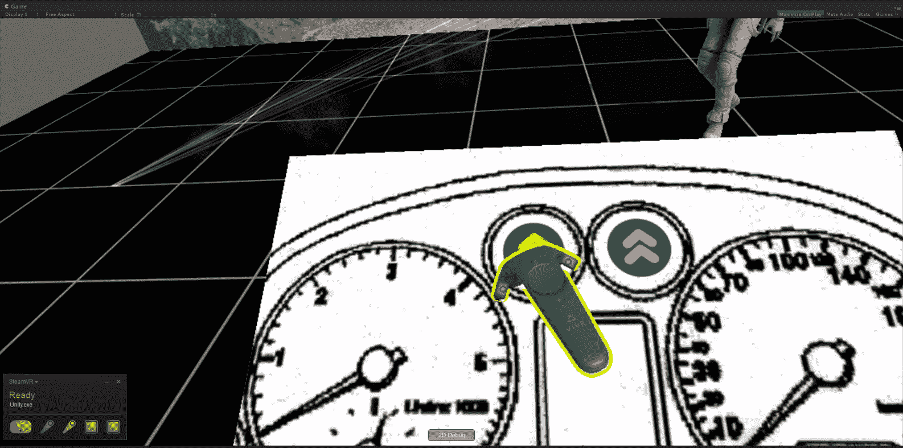

# 使用 Unity UI 和 Daydream

现在我们来看看如何在移动 VR 设备上使用 Google Daydream 来实现这一功能。在这种情况下，我们实际上不会伸手去按按钮，而是使用 3DOF 手柄控制器激光指针。解决方案就像将`GvrReticlePointer`（如果您使用过它）替换为`GvrControllerPointer`一样简单。

1.  在您的 MeMyselfEye `GVR Camera Rig/ Player / Main Camera /`下，如果有 GvrReticlePointer，请禁用它。

1.  在`GoogleVR/Prefabs/Controller/`文件夹中找到 GvrControllerPointer。

1.  将 Player（作为主相机的兄弟）下的预制件拖动。

然后设置仪表板画布以接受射线投射：

1.  在层次结构中选择仪表板对象。

1.  添加 GvrPointerGraphicRaycaster 组件。

按下播放。现在您可以使用 Daydream 控制器来按按钮。

探索 GvrControllerPointer、其子 Laser 对象和包中提供的其他 Gvr 对象组件选项。有一些相当有趣和有用的配置可用，包括激光颜色、结束颜色和最大距离的设置。甚至还有一个复选框，可以在播放模式下的编辑器场景窗口中绘制调试射线。

# 构建基于手腕的菜单调色板

一些 VR 应用程序，如 Oculus Rift、HTC Vive 和 Windows MR，为双手设置设计，在一侧手腕上提供虚拟菜单调色板，而另一只手则从中选择按钮或项目。让我们看看这是如何实现的。*此场景假设您有一个双手控制器 VR 系统。*我们将使用 SteamVR 相机架来描述，涉及将控制绑定到您的左手，并用右手选择它们。

将我们的仪表板控制面板转换为手腕调色板并不太难。我们只需要适当地缩放并将其附加到手控制器上。

由于你已经将场景构建到上一节中描述的点，包括 SteamVR `Player`装置（而不是`[CameraRig]`），我们将复制并重新使用`Dashboard`，以便在你的左手腕上使用：

1.  在层级中，右键点击仪表板并复制。

1.  将新名称重命名为“调色板”。

1.  禁用旧仪表板。

1.  将调色板作为 Player/Hand1 对象的子对象拖动。

现在我们将修改调色板图形如下。请随意更改以适应你的需求：

1.  在调色板本身上，将其 Pos X，Y，Z 设置为（0，0.1，-0.1）；旋转设置为（90，-150，-115）；缩放（X，Y，Z）设置为 0.0005；

1.  展开调色板并禁用或删除原始图像对象。

1.  启用图像子对象（如果缺失，创建一个新的图像并使用锚点预设进行拉伸拉伸）。

1.  将图像缩放（X，Y，Z）设置为 0.5。

1.  将图像颜色 Alpha 设置为 75，使其半透明。

1.  启用文本子对象。将其矩形变换顶部设置为 100，字体大小设置为 18，文本设置为“软管”。

1.  将启动按钮的 Pos Y 移动到 0。

1.  将停止按钮的 Pos Y 移动到 0。

就这样！我们为仪表板设置的点击连接都正常工作。这里展示的是使用左手持控制器附加的调色板，并用右手控制器选择其上的启动按钮的截图：

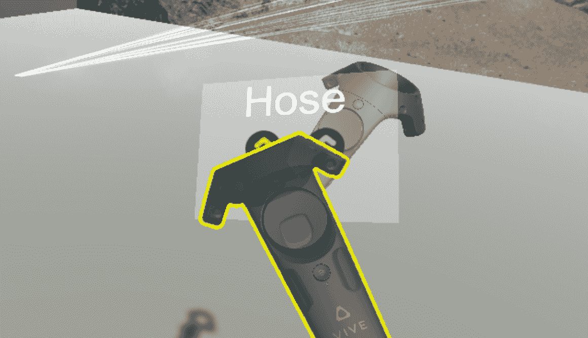

自然地，调色板可以通过其他按钮和输入控件进行扩展。如果你有多个面板排列成立方体的侧面（如 TiltBrush 菜单），你可以使用拇指盘在各个菜单之间滚动或旋转。就是这样做的。

# 摘要

在 Unity 中，基于画布对象和事件系统的用户界面包括按钮、文本、图像、滑块和输入字段，它们可以组装并连接到场景中的对象。

在本章中，我们仔细研究了各种世界空间 UI 技术及其在虚拟现实项目中的应用。我们考虑了 VR 用户界面与传统视频游戏和桌面应用程序用户界面不同的方式。我们还实现了其中的一些，展示了如何在你的项目中构建、编码和使用它们。我们的 C#脚本编写变得更加高级，深入探讨了 Unity 引擎 API 和模块化编码技术。

现在，你有了更广泛的词汇来处理你的 VR 项目中的用户界面。本章中的一些示例可以直接应用于你的工作。然而，并非所有都需要从头开始。VR UI 工具越来越多地提供在 VR 头戴式设备 SDK、开源 VR 中间件项目和第三方 Unity 资产商店包中。

在下一章中，我们将为我们的场景添加一个第一人称角色控制器。我们将了解化身以及控制 VR 中导航的方法，以便我们可以在虚拟世界中舒适地移动。此外，我们还将了解管理虚拟现实体验的负面方面之一——VR 运动病。
