# 第七章：移动和舒适度

到目前为止，本书中玩家的视角摄像头一直是静止的。在本章中，我们将开始移动，考虑各种移动和传送技术。首先，我们将深入了解 Unity 标准角色组件，然后我们将自己变成一个可控制的第一人称角色，并探索在虚拟世界中移动的技术。我们还将讨论管理 VR 中的运动病感和自我意识的方法。

在本章中，我们将讨论以下主题：

+   Unity 的角色对象和组件

+   滑行移动

+   舒适模式移动

+   传送

+   VR 运动病问题

注意，本章中的项目是独立的，并不直接需要本书其他章节。如果你决定跳过其中任何部分或未保存你的工作，那没有问题。

# 理解 Unity 角色

第一人称角色在 VR 项目中是一个关键资产，我们真的应该彻底了解其组件。因此，在我们为项目构建一个角色之前，仔细查看 Unity 提供的内置组件和标准资产是个好主意。

# Unity 组件

如你所知，每个 Unity 游戏对象都包含一组相关联的**组件**。Unity 包含许多内置组件类型，你可以在主菜单栏中的组件菜单中浏览它们。每个组件都会为其所属对象添加属性和行为。组件的属性可以通过 Unity 编辑器的检查器面板和脚本访问。附加到游戏对象上的脚本也是一种组件，你可以在检查器面板中设置其属性。

用于实现第一人称角色的组件类型包括**摄像头**、**角色控制器**和/或**刚体**，以及各种脚本。让我们回顾一下这些标准组件。

# 摄像头组件

摄像头组件指定了用于在每一帧更新时渲染场景的视图参数。任何具有摄像头组件的对象都被视为一个`摄像头`对象。自然地，自从我们开始使用场景以来，我们一直在脚本中访问它。

立体声 VR 摄像头对象渲染两个视图，每个眼睛一个。在 VR 中，摄像头控制器脚本从头戴式设备的运动传感器和位置跟踪中读取数据，以确定当前的头姿（位置、方向和旋转）并适当地设置摄像机的变换。

# 刚体组件

当你将刚体组件添加到任何 Unity 游戏对象时，它将受益于**物理引擎**执行的运算。刚体组件具有重力、质量和阻力等参数。在游戏过程中，物理引擎计算每个刚体对象的*动量*（质量、速度和方向）。

刚性物体与其他刚性物体相互作用。例如，如果它们发生碰撞，它们会相互弹开，并且可以通过具有摩擦和弹跳系数等属性的**物理材质**来控制交互参数。

Rigidbodies 可以被标记为**运动学**，这通常只在对象由动画或脚本驱动时使用。碰撞不会影响运动学对象，但它们仍然会影响其他刚性物体的运动。它主要用于将对象通过**关节**连接在一起，例如连接人类骨骼或摆动的摆锤。

任何刚性物体，一旦赋予子相机对象，就变成了一个刚性的第一人称角色。然后，你可以添加脚本以处理用户输入，实现移动、跳跃、环顾四周等功能。

# Character Controller 组件

与 Rigidbody 一样，**Character Controller**（**CC**）用于**碰撞检测**和**角色移动**。它也需要脚本来处理用户输入以实现移动、跳跃和环顾四周。然而，它并没有内置物理特性。

CC 组件专门为角色对象设计，因为在游戏中，角色通常并不期望与其他基于物理的对象表现出相同的动作。它可以替代 Rigidbody，或者与 Rigidbody 一起使用。

CC 组件内置了**胶囊碰撞器**行为以检测碰撞。然而，它不会自动使用物理引擎来**响应**碰撞。

例如，如果一个 CC 对象撞击到一个刚性物体，如墙壁，它将只是停止，而不会弹跳。如果一个刚性物体，如飞行的砖块，撞击到一个 CC 对象，砖块将根据其自身属性被弹开（弹跳），但 CC 对象将不受影响。当然，如果你想在 CC 对象上包含这种行为，你可以在自己的脚本中编程实现。

CC 组件在其脚本 API 中特别支持一种力——**重力**。内置参数专门与保持对象脚部在地面上有关。例如，步进偏移参数定义了角色可以跳上的步子的高度，而不是成为阻碍其前进的障碍物。同样，斜率限制参数说明了多大的斜率是过于陡峭的，以及它是否应该被视为墙壁。在你的脚本中，你可以使用`Move()`方法和`IsGrounded`变量来实现角色行为。

除非你编写脚本，否则 CC 对象没有动量，可以立即停止。这感觉非常精确，但也可能导致动作生硬。而对于 Rigidbody 对象来说，情况正好相反，它们感觉更流畅，因为它们具有动量、加速度/减速度，并遵循物理定律。在 VR 中，如果我们使用它的话，我们理想情况下希望两者结合。

使用物理在 VR 场景中移动并不总是最佳选择。正如我们将看到的，替代的移动技术可能根本不使用物理，例如**传送**。

# Unity 标准资产

Unity 标准资产中的 Characters 包含了许多第三人称和第一人称角色预制件。以下表格中比较了这些预制件：

| 预制件 | 组件 |
| --- | --- |
| 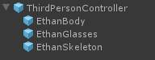 | 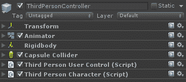 |
| 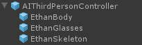 | 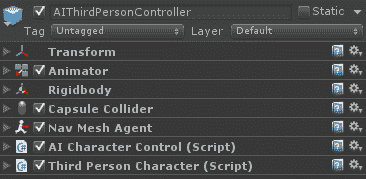 |
|  | 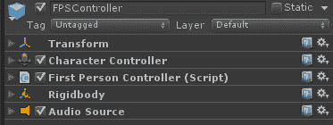 |
| 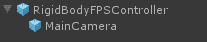 | 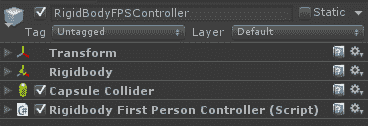 |

让我们更详细地讨论这个问题。

# ThirdPersonController

我们已经在第二章 内容、对象和缩放 和第四章 基于注视的控制 中分别使用了这两个第三人称预制件，`ThirdPersonController` 和 `AIThirdPersonController`。

`ThirdPersonController` 预制件有子对象定义角色的身体，即我们的朋友伊森。他是一个绑定了骨骼的化身（来自 `.fbx` 文件），这意味着可以应用类人动画使他行走、奔跑、跳跃等。

`ThirdPersonController` 预制件使用 Rigidbody 进行物理运算，并使用 Capsule Collider 进行碰撞检测。

它有两个脚本。一个 `ThirdPersonUserControl` 脚本接收用户输入，例如摇杆按下，并告诉角色移动、跳跃等。一个 `ThirdPersonCharacter` 脚本实现物理运动并调用所需的动画，例如跑步、蹲下等。

# AIThirdPersonController

`AIThirdPersonController` 预制件与 `ThirdPersonController` 预制件相同，但前者添加了 `NavMeshAgent` 和 `AICharacterControl` 脚本，这限制了角色在场景中的移动位置和方式。如果您还记得，在第四章 基于注视的控制 中，我们使用了 `AICharacterController` 使伊森在场景中行走并避免碰撞到物体。

# 第一人称 FPSController

`FPSController` 预制件是一个第一人称控制器，它使用 CC 组件和 Rigidbody。它附有一个子相机。当角色移动时，相机也会随之移动。

第三人称控制器预制件和第一人称控制器预制件之间的核心区别是 **子对象**。第三人称控制器预制件有一个绑定了骨骼的类人子对象，而第一人称控制器预制件有一个子相机对象。

它的身体质量设置为低值（`1`），并且启用了 `IsKinematic`。这意味着它将具有有限的动量，不会对其他刚体对象做出反应，但它可以被动画驱动。

它的 `FirstPersonController` 脚本提供了大量参数，用于跑步、跳跃、音频脚步声等。脚本还包括用于 *头部晃动* 的参数和动画，当角色移动时，相机会以自然的方式弹跳。如果你在你的 VR 项目中使用 `FPSController` 脚本，**务必禁用任何头部晃动功能*，否则你可能需要清理键盘上的呕吐物！

# RigidBodyFPSController

`RigidBodyFPSController` 预制体是一个带有 Rigidbody 但没有 CC 组件的第一人称控制器。像 `FPSController` 一样，它有一个子相机对象。当角色移动时，相机也会随之移动。

`RigidBodyFPSController` 预制体的质量更重，设置为 10，并且是非运动学（kinematic）的。这意味着当它与其它物体碰撞时，它**可以**被弹来弹去。它有一个独立的胶囊碰撞器组件，并使用 `ZeroFriction` 物理材质。`RigidBodyFirstPersonController` 脚本与 `FPSController` 脚本不同，但前者有很多相似的参数。

**为什么我要在这里详细说明这些内容？** 如果你曾在 Unity 中构建过任何非 VR 项目，那么你很可能使用过这些预制体。然而，你可能没有太多关注它们是如何组装的。虚拟现实是从第一人称视角体验的。我们的实现工具箱是 Unity。理解 Unity 中管理和控制这种第一人称体验的工具非常重要。

# 使用滑行运动

对于本章中的运动功能，让我们采取一种 *敏捷* 的开发方法。这意味着（部分）我们将首先定义我们的新功能或故事，并附带一系列需求。然后，我们将通过迭代和细化我们的工作，逐步构建和测试这个功能，一次处理一个需求。实验不仅被允许，而且被鼓励。

**敏捷软件开发** 是一个广泛的术语，指的是那些鼓励以易于应对变化和细化需求的方式，进行小幅度增量迭代开发的方法。请参阅 [敏捷宣言](http://agilemanifesto.org/)。

我们想要实现的功能是：作为一个第一人称角色，当我开始行走时，我将朝着我注视的方向在场景中移动，直到我指示停止行走。以下是实现此功能的需求：

+   向你注视的方向移动

+   请将双脚稳稳地放在地上

+   不要穿过固体物体

+   不要从世界的边缘掉下去

+   跨过小物体并处理不平坦的地形

+   通过点击输入按钮开始和停止移动

这听起来是合理的。

首先，如果你有从 第四章 “基于注视的控制” 保存的场景版本，你可以从那里开始。或者，构建一个类似的简单新场景，包含地面平面、一些作为障碍物的 3D 对象，以及你的 `MeMyselfEye` 预制体的副本。

# 向你注视的方向移动

我们已经有一个包含相机装置的 `MeMyselfEye` 对象。我们将将其转换为一个第一人称控制器。我们的第一个要求是在你注视的方向上移动场景。添加一个名为 `GlideLocomotion` 的脚本。保持简单，让我们先执行以下步骤：

1.  在层次结构面板中选择 `MeMyselfEye` 对象

1.  在检查器面板中，选择添加组件 | 新脚本，并将其命名为 `GlideLocomotion`

然后，打开脚本并按照以下方式编写代码：

```cs
using UnityEngine; 

public class GlideLocomotion : MonoBehaviour 
{ 
  public float velocity = 0.4f; 

  void Update () 
  { 
    Vector3 moveDirection = Camera.main.transform.forward; 
    moveDirection *= velocity * Time.deltaTime; 
    transform.position += moveDirection; 
  } 
} 
```

人类正常的行走速度大约是每秒 1.4 米。在 VR 中，这可能会让你感到恶心。让我们以比这慢得多，0.4 m/s 的速度移动。在 `Update()` 中，我们检查玩家当前注视的方向（`camera.transform.forward`）并以此方向和当前速度移动 `MeMyselfEye` 的变换位置。

注意变量自我修改的编码快捷键（`*=` 和 `+=`）。前述代码的最后两行可以写成如下：

```cs
moveDirection = moveDirection * velocity * Time.deltaTime; 
transform.position = transform.position  + moveDirection; 
```

在这里，我使用了 `*=` 和 `+=` 运算符。保存脚本和场景，并在 VR 中尝试。

当你向前看时，你就向前移动。向左看，就向左移动。向右看，就向右移动。它工作得很好！

向上看... *哇！！你期待这个吗？！我们简直在飞!* 你可以向上、向下以及全方位移动，就像超人或者操控无人机一样。目前，`MeMyselfEye` 没有质量，没有物理属性，也不受重力影响。尽管如此，它满足了你在注视的方向上移动的要求。所以，让我们继续。

# 保持脚在地面

下一个要求是让你保持脚在地面。我们知道 `GroundPlane` 是平的，位置在 Y = `0`。所以，让我们只给 `GlideLocomotion` 脚本添加这个简单的约束，如下所示：

```cs
  void Update () 
  { 
    Vector3 moveDirection = Camera.main.transform.forward; 
    moveDirection *= velocity * Time.deltaTime; 
 moveDirection.y = 0f; 
    transform.position += moveDirection; 
  } 
```

保存脚本并在 VR 中尝试。

还不错。现在，我们可以在 Y = `0` 平面上移动。

另一方面，你就像一个鬼魂，可以轻易地穿过立方体、球体和其他物体。

# 不要穿过固体物体

第三项要求是*不要穿过固体物体*。这里有一个想法。给它添加一个刚体组件、一个碰撞体，让物理引擎来处理。按照以下步骤操作：

1.  在层次结构面板中选择 `MeMyselfEye` 对象

1.  在检查器面板中，导航到添加组件 | 物理 | 刚体

1.  然后添加组件 | 物理 | 胶囊碰撞体

1.  将胶囊碰撞体高度设置为 2

1.  如果你的角色控制器胶囊碰撞体（场景窗口中的绿色网格）延伸到地面平面，请调整其 Center Y 到 `1`

在 VR 中尝试。

*哇！！这是怎么了...？* 它刚才还一切正常，但一碰到立方体，你就失去了控制，像电影 *重力* 中糟糕的太空行走一样在各个方向上旋转。嗯，这就是刚体的作用。力被应用到所有方向和轴上。让我们添加以下约束。

在检查器面板的 Rigidbody 面板中，勾选冻结位置：Y 和冻结旋转：X 和 Z 的复选框。

在 VR 中尝试。

现在真是太好了！你能够通过看向某个方向来移动，你不会飞（Y 位置受约束），而且你不会穿过固体物体。相反，你会在它们旁边滑行，因为只允许 Y 旋转。

如果你的`KillTarget`脚本仍在运行（来自第二章，*内容、对象和缩放*），你应该能够盯着 Ethan 直到他爆炸。做吧，让 Ethan 爆炸... *哇!* 我们被爆炸冲击波吹出了这里，再次在疯狂的方向上失去控制。也许我们还没有准备好使用这个强大的物理引擎。我们可能在脚本中解决这个问题，但暂时让我们放弃 Rigidbody 的想法。我们将在下一章回到它。

你可能还记得，CC 包括胶囊碰撞体，并支持受碰撞约束的运动。我们将尝试使用它，如下所示：

1.  在检查器面板中，点击 Rigidbody 面板的*齿轮*图标并选择移除组件

1.  此外，移除其胶囊碰撞体组件

1.  在检查器面板中，导航到添加组件 | 物理 | Character Controller

1.  如果你的 Character Controller 的胶囊碰撞体（场景窗口中的绿色网格）延伸到地面平面，调整其中心 Y 到`1`

修改`GlideLocomotion`脚本，如下所示：

```cs
using UnityEngine; 

public class GlideLocomotion : MonoBehaviour 
{ 
  public float velocity = 0.4f; 

 private CharacterController character; void Start () 
  { character = GetComponent<CharacterController>(); } 

  void Update () 
  { 
    Vector3 moveDirection = Camera.main.transform.forward; 
    moveDirection *= velocity * Time.deltaTime; 
    moveDirection.y = 0.0f; 
 character.Move(moveDirection); 
  } 
}
```

代替直接更新`transform.position`，我们调用了内置的`CharacterController.Move()`函数，让它为我们完成。它知道角色应该以某些约束行为。

保存脚本并在 VR 中尝试。

这次，当我们撞到物体（一个立方体或球体）时，我们有点翻过它，然后停留在空中。`Move()`函数不会为我们应用场景中的重力。我们需要在脚本中添加这一点，这并不难（参见 Unity API 文档[`docs.unity3d.com/ScriptReference/CharacterController.Move.html`](http://docs.unity3d.com/ScriptReference/CharacterController.Move.html))。

然而，有一个更简单的方法。`CharacterController.SimpleMove()`函数为我们应用重力。只需用以下单行替换整个`Update()`函数：

```cs
      void Update () 
      {
        character.SimpleMove(Camera.main.transform.forward * velocity);
      }

```

`SimpleMove()`函数负责处理重力和`Time.deltaTime`。所以，我们只需要给它一个移动方向向量。此外，由于它引入了重力，我们也不需要 Y = `0`的约束。简单多了。

保存脚本并在 VR 中尝试。

太棒了！我认为我们已经满足了所有的要求。*只是不要走得太远...*

本节中的练习假设您正在使用坐姿或站立模式的 VR，而不是房间规模。随着玩家移动，我们正在修改整个 MyMyselfEye 装置。在房间规模中，这意味着移动游戏区域边界。由于我们将碰撞器附加到 MyMyselfEye 位置，如果您从游戏区域中心物理移动，碰撞器将不会与您的实际身体位置对齐。稍后，我们将解决房间规模 VR 中的运动问题。

# 不要从世界边缘掉落

现在我们有了重力，如果我们从地面平面的边缘走开，你会掉入虚无。解决这个问题并不是第一人称角色的事情。只需在场景中添加一些栏杆即可。

使用立方体，将它们缩放到所需的厚度和长度，并将它们移动到位置。去做吧。我不会给你一步一步的指导。例如，我使用了这些变换：

+   比例：`0.1`，`0.1`，`10.0`

+   栏杆 1：位置：`-5`，`1`，`0`

+   栏杆 2：位置：`5`，`1`，`0`

+   栏杆 3：位置：`0`，`1`，`-5`；旋转：`0`，`90`，`0`

+   栏杆 4：位置：`0`，`1`，`5`；旋转：`0`，`90`，`0`

在 VR 中试试。尝试穿过栏杆。哇！这更安全。

# 跨越小物体和处理不平坦地形

当我们做到这一点时，添加一些可以走和跨越的东西，比如斜坡和其他障碍物。结果将看起来像这样：

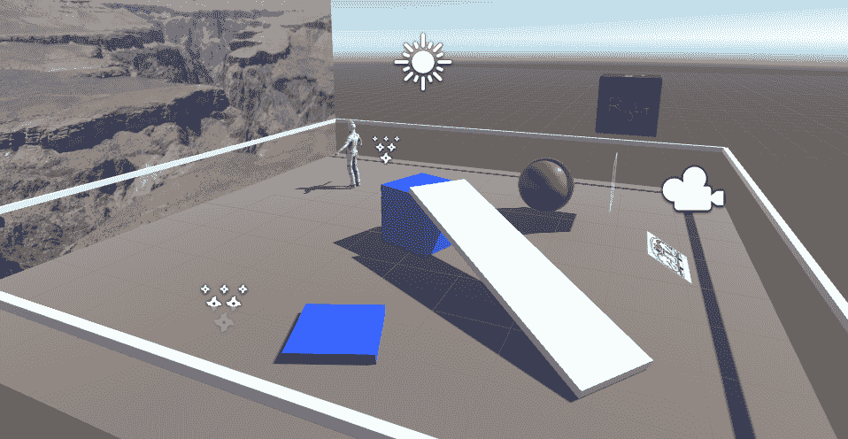

在 VR 中试试。走上斜坡，然后从立方体上跳下来。嘿，这很有趣！

CC 组件正在处理跨越小物体和处理不平坦地形的要求。您可能想要调整其斜率限制和步偏移设置。

**注意**：滑行运动可能导致晕动症，特别是对于易感玩家。请在您的应用程序中谨慎使用。这可能会在您沿着斜坡滑行然后跳到地面平面上时变得特别明显。另一方面，有些人喜欢过山车 VR！此外，通过简单的按钮按下机制让玩家控制运动，可以在很大程度上帮助减少恶心和晕动症，我们将在下一部分添加。

# 开始和停止运动

下一个要求是*通过点击输入按钮来开始和停止移动*。我们将寻找使用逻辑`"Fire1"`按钮的按钮按下。如果您想使用不同的按钮，或者如果您正在针对没有`"Fire1"`映射的平台，请参阅第五章，*实用交互项*，在*基本按钮输入*主题下。

按照以下方式修改`GlideLocomotion`脚本：

```cs
using UnityEngine; 

public class GlideLocomotion : MonoBehaviour 
{ 
  public float velocity = 0.7f; 

  private CharacterController controller; 
  private bool isWalking = false; 

  void Start() 
  { 
    controller = GetComponent<CharacterController> (); 
  } 

  void Update () { 
 if (Input.GetButtonDown("Fire1")) 
        isWalking = true;
    else if (Input.GetButtonUp("Fire1"))
        isWalking = false;  if (isWalking) {      controller.SimpleMove (Camera.main.transform.forward * velocity);
    }
  } 
} 
```

在 Daydream 上，您可以使用`GvrControllerInput.ClickButtonDown`和`ClickButtonUp`。

通过添加布尔`isWalking`标志，我们可以开关前进运动，这可以通过按键来信号。

# 添加舒适模式运动

我们已经在本章中多次提到运动病感的可能性，以及在这本书的早期。一般来说，你给予玩家在 VR 中移动的更多控制，她就会过得更好，并降低感到不适的风险。提供开始/停止运动的按钮是一步，正如我们刚才看到的。另一步是通常所说的 *舒适模式*。

已经发现，在曲线周围使用滑动移动比简单地直线行走要差。因此，在 VR 场景中移动的一种技术是只允许向前移动，无论玩家朝哪个方向看，然后使用摇杆来改变方向。此外，我们限制摇杆连续改变方向角度，例如，将其限制为固定的 30 度步长。我们将此添加到我们的 `GlideLocomotion` 脚本中，如下所示。

在类的顶部添加以下变量：

```cs
 public float comfortAngle = 30f;
 private bool hasRotated = true;
```

然后在 `Update()` 函数中添加以下语句：

```cs
  void Update()
  {
    if (Input.GetButtonDown("Fire1"))
      isWalking = true;
    else if (Input.GetButtonUp("Fire1"))
      isWalking = false;

    if (isWalking)
      character.SimpleMove(transform.forward * velocity);

    float axis = Input.GetAxis("Horizontal"); 
    if (axis > 0.5f)
    {
      if (!hasRotated)
        transform.Rotate(0, comfortAngle, 0);
      hasRotated = true;
    }
    else if (axis < -0.5f)
    {
      if (!hasRotated)
        transform.Rotate(0, -comfortAngle, 0);
      hasRotated = true;
    } 
    else
    {
      hasRotated = false;
    }
  }
```

现在，当按下 `"Fire1"` 按钮且 `isWalking` 为真时，我们将 `MeMyselfEye` 向其变换指示的方向移动，而不是 `Camera` 的观察方向，将行更改为 `character.SimpleMove(transform.forward * velocity)`。

当用户将摇杆推向右侧时，即逻辑上的 `"Horizontal"` 轴为正，我们将以顺时针方向旋转装置 30 度（`comfortAngle`）。当摇杆向左按下时，我们逆时针旋转。我们检查大于 0.5 而不是正好 1.0，这样玩家就不需要将摇杆推到边缘。

我们不希望每次摇杆被按下时都重复旋转，因此我们设置一个标志 `hasRotated`，然后忽略该轴，直到它静止在零位置。然后，我们将允许玩家再次按下它。

结果是一个舒适的导航机制，一个按钮让你向前移动，另一个按钮让你以大步改变方向。

供你参考，此机制中使用的某些按钮映射如下：

+   在 HTC VIVE 上的 OpenVR 中，`"Fire1"` 是一个控制器的菜单按钮，`"Horizontal"` 是另一个控制器触摸板的触摸。

+   在 Oculus 上的 OpenVR 中，`"Fire1"` 是右侧控制器的 B 按钮，`"Horizontal"` 是左侧控制器的摇杆。

+   在 Daydream 上，你应该修改代码以使用 `GvrControllerInput`。为了检测触摸板上的水平点击，调用 `GvrControllerInput.TouchPosCentered`，它返回一个 `Vector2`，并检查 `x` 的值是否在 `-1` 和 `1` 之间。例如，将调用 GetAxis 替换为以下内容：

```cs
    Vector2 touchPos = GvrControllerInput.TouchPosCentered;
    float axis = touchPos.x;
    if (axis > 0.5f) ...
```

鼓励你扩展 第五章 开头使用的 `ButtonTest()` 函数，即 *Handy Interactables*，以确定哪些按钮映射、轴和 SDK 函数最适合你的目标 VR 设备。

我们刚刚实现了滑行移动功能，其中你可以朝着你所看的方向平滑前进，或者使用舒适模式，朝着你身体面向的方向前进，同时你的头部可以四处张望。舒适模式通过让你以 30 度角跳跃改变面向的方向来减少运动病的发生。但即使这样可能还不够舒适，一些开发者（和玩家）甚至更倾向于完全不使用滑行，而是让你能够从一处直接*传送*到另一处。

# 其他移动考虑因素

如果你想为你的玩家提供 VR 骑行体验，你可以定义一个预定义的*轨道*来滑行，就像建筑或艺术画廊的导览一样。轨道可以是 3D 的，不仅上下移动，还有重力，例如 VR 过山车，或者没有重力，例如太空之旅。我们不推荐这种机制，除非是最狂热的寻求刺激者，因为它有很高的可能性引起运动病。

另一种在移动过程中的舒适技术是**隧道模式**。在移动过程中，摄像头被剪裁，并在玩家的周边视野中显示一个简单的背景，如网格，这样用户就只能看到直接在他们面前的东西。在移动时消除周边视野可以减少运动病的发生。

对于垂直移动，应用程序已经实现了攀爬机制，使用你的手去够、抓和拉自己向上。登山模拟游戏如 The Climb（[`www.theclimbgame.com/`](http://www.theclimbgame.com/））将这一想法提升到了新的水平（字面意思上），提供了多种不同的够取机制和握持类型来抓住。

其他应用程序也尝试使用你的手，不是为了攀爬，而是为了行走。例如，像拉绳子一样伸手和拉扯，或者像跑步者一样摆动手臂，甚至像操作轮椅一样进行圆形拉扯动作。

当然，还有硬件设备，例如使用你的脚走路和跑步来实现移动机制的设备。例如：

+   VR 跑步机如 Virtuix Omni（[http://www.virtuix.com/](http://www.virtuix.com/））和 VR Virtualizer（[https://www.cyberith.com/](https://www.cyberith.com/）），你可以在 VR 中用脚和腿原地行走和跑步。

+   例如 VirZoom（[https://www.virzoom.com/](https://www.virzoom.com/））这样的健身自行车，你可以在 VR 中骑自行车甚至进行滑翔。

+   身体追踪传感器不仅可以用于玩家移动，还可以用于捕捉动作以创建角色动画。这些设备包括 Optitrack（[http://optitrack.com/motion-capture-virtual-reality/](http://optitrack.com/motion-capture-virtual-reality/））、Perception Neuron（[https://neuronmocap.com/](https://neuronmocap.com/））、ProVR（[http://www.vrs.org.uk/virtual-reality-gear/motion-tracking/priovr.html](http://www.vrs.org.uk/virtual-reality-gear/motion-tracking/priovr.html））和其他设备。

您可能需要为该设备编写特定的应用程序，因为这些身体跟踪设备没有标准，但它们确实非常有趣。

# 传送技巧

**指针传送**是一种机制，您指向您想要去的位置，然后跳转到那里。没有滑动。您只是传送到新位置。可能绘制一条激光束或弧线，以及一个传送位置接收器，以指示您可以前往的位置。

正如我们在前面的章节中看到的，我们可以编写自己的脚本。但鉴于这是 VR 应用程序的核心功能，传送组件通常包含在设备 SDK 工具包中。我们将编写自己的，并在之后考虑一些提供的组件。

首先，如果您有 第四章 中保存的场景版本，*基于注视的控制*，您可以从中开始。您可以禁用一些我们不需要的对象，包括 `Ethan` 和 `WalkTarget`。或者，构建一个类似的简单新场景，包含地面平面、一些作为障碍物的 3D 对象，以及您的 `MeMyselfEye` 预制件的副本。

# 准备传送

我们将实现的自定义传送机制将适用于任何 VR 平台，使用基于注视的指向。类似于我们在 第四章，*基于注视的控制* 中控制僵尸 Ethan 的方式，我们将从玩家的摄像机视图中发射一条射线到地面平面以选择移动到的位置。

在我们的脚本中，我们将使用按钮按下以开始传送，并在选择了一个有效位置后释放以跳转到那里。或者，您可以考虑其他输入，例如使用 `Input.GetAxis`(v*ertical*) 的拇指杆向前推。

首先，让我们创建一个传送标记（类似于 WalkTarget 的一个），如下所示：

1.  在层次结构面板中添加一个空的游戏对象，并将其重命名为 `TeleportMarker`。

1.  将其变换值重置为位置 (`0`,`0`,`0`)（使用变换面板右上角的齿轮图标）。

1.  右键点击鼠标，导航到 3D 对象 | 圆柱。这将创建一个由 `TeleportMarker` 作为父对象的圆柱形对象。

1.  重置其变换并更改缩放为 (`0.4`, `0.05`, `0.4`)。这将创建一个直径为 `0.4` 的扁平圆盘。

1.  禁用或删除其胶囊碰撞器。

目前，我们将使用默认材质。或者，您可以用另一种材质装饰您的标记。（例如，如果您安装了 Steam `InteractionSystem`，请尝试 `TeleportPointVisible` 材质。如果您安装了 Daydream Elements，请尝试 `TeleportGlow` 材质。）

现在，让我们编写脚本：

1.  在层次结构面板中选择 `MeMyselfEye` 对象

1.  如果存在，禁用或删除 `GlideLocomotion` 组件

1.  选择添加组件 | 新脚本，并将其命名为 `LookTeleport`

编写以下脚本：

```cs
using UnityEngine;

public class LookTeleport : MonoBehaviour
{
    public GameObject target;
    public GameObject ground;

    void Update()
    {
        Transform camera = Camera.main.transform;
        Ray ray;
        RaycastHit hit;

        if (Input.GetButtonDown("Fire1"))
        {
          // start searching
          target.SetActive(true);
        }
        else if (Input.GetButtonUp("Fire1")) 
        {
          // done searching, teleport player
          target.SetActive(false);
          transform.position = target.transform.position;
        }
        else if (target.activeSelf)
        {
          ray = new Ray(camera.position, camera.rotation * Vector3.forward);
          if (Physics.Raycast(ray, out hit) && 
              (hit.collider.gameObject == ground))
          {
            // move target to look-at position
            target.transform.position = hit.point;
          }
          else
          {
            // not looking a ground, reset target to player position
            target.transform.position = transform.position;
          }
       }
    }
}
```

脚本的工作原理如下：

+   当玩家点击时，开始定位，并将目标标记设置为可见 (`SetActive(true)`).

+   在瞄准时，我们识别玩家正在看什么（`Raycast`）。如果是地面，我们将目标定位在那里（`hit.point`）。否则，目标将重置到玩家的位置。

+   当玩家停止按按钮时，目标将被隐藏。我们将玩家定位到目标当前位置，从而完成传送。

注意，我们正在使用 `TeleportMarker` 目标来存储在瞄准模式下的传送机制的状态。当目标处于活动状态时，我们正在瞄准。当我们退出瞄准时，我们使用目标的位置作为新的玩家位置。

保存脚本并在 Unity 中：

1.  将 `GroundPlane` 对象拖放到地面槽中

1.  将 `TeleportMarker` 对象拖放到目标槽中

按下播放。按下输入按钮将激活目标标记，它随着你的视线移动。在释放按钮时，你将传送到该位置。你可以通过看向地面以外的其他东西并释放按钮来取消传送。

# 在表面之间传送

在之前的脚本中，我们使用普通的 Raycast 来确定放置 `TeleportMarker` 的位置。这仅在平面对象上有效。对于任何其他 3D 对象，击中点可能是任何表面，而不仅仅是可通行的顶部表面。

另一种方法是使用 NavMesh 识别场景内可以传送到的表面。第四章中的“基于注视的控制”，我们为 Ethan 的 `AIThirdPersonController` 生成了一个 NavMesh，以控制他可以自由游荡的地方。这次，我们也使用 NavMesh 来确定我们（MeMyselfEye）可以去的地方。请随意回顾我们关于 NavMesh 的对话。

这种方法的优点是可用的传送位置可以是地面平面的子集。可以有多个其他对象表面，甚至复杂的地面。传送位置将限制在有效的平坦或略微倾斜的表面上。

如果您跳过了该部分，或者自那时起您已经重新排列了场景中的对象，我们现在将重新生成 NavMesh：

1.  选择 Navigation 面板。如果它还不是您编辑器中的一个选项卡，请从主菜单打开导航窗口，导航到 Window | Navigation。

1.  选择其 Object 选项卡。

1.  在 Hierarchy 中选择地面平面，然后在导航窗口的对象面板中，勾选导航静态复选框。（或者，您也可以使用对象的检查器窗口中的静态下拉列表。）

1.  对应于应该阻止你可能的传送位置的对象（如立方体、球体等）重复步骤 3。

为了演示，我们现在还将添加一个第二层平台：

1.  在 Hierarchy 中创建一个新的 3D 立方体，并将其命名为 Overlook

1.  将其缩放设置为 (`2.5`, `0.1`, `5`)，并将其位置设置为 (`4`, `2.5`, `0.5`)

1.  在导航窗口中，选择对象选项卡，然后为 overlook 勾选导航静态。

1.  选择烘焙选项卡，然后单击面板底部的 Bake 按钮

注意，平台的高度（Y 轴）在导航烘焙设置中大于代理高度（2）。这将确保玩家可以进入平台下方并在其上方行走。在场景窗口中，你可以看到由 NavMesh 定义的蓝色区域，如下所示，包括二楼平台上的一个不错的观景区：

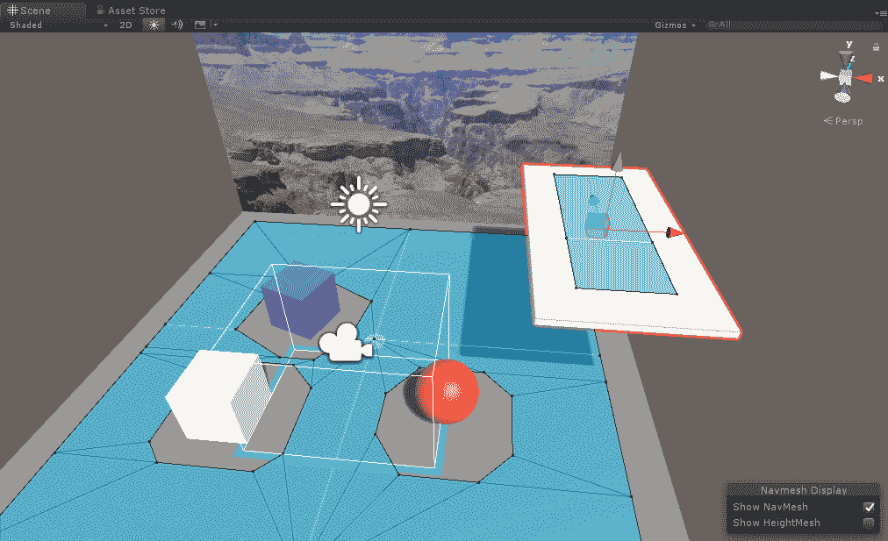

我们现在可以修改脚本，以便在 NavMesh 上而不是在地面上找到我们的传送目标位置。不幸的是，Unity 并没有提供用于直接在 NavMesh 上找到击中点的 `Raycast` 函数。相反，我们像往常一样使用物理碰撞体（可能位于对象的侧面或底部，而不仅仅是可通行表面）来找到击中点，然后调用 `NavMesh.SamplePosition` 来找到 NavMesh 上的击中点位置。按照以下方式修改 `LookTeleport` 脚本。

在脚本顶部添加以下行以访问 NavMesh API：

```cs
using UnityEngine.AI;
```

现在，按照以下方式修改 `Update()`：

```cs
  if (Physics.Raycast(ray, out hit))
  {
    NavMeshHit navHit;
    if (NavMesh.SamplePosition(hit.point, out navHit, 1.0f, NavMesh.AllAreas))
      target.transform.position = navHit.position;
  }
```

`NavMesh.SamplePosition` 的调用使用 `hit.point` 并在给定的半径内找到 NavMesh 上的最近点（我们给出了 1.0）。

按下播放。现在，你可以在 `GroundPlane` 的可通行表面上设置 `TeleportMarker`，甚至可以在观景台上方设置！

还有一件事。执行 `Physics.Raycast` 可能相当昂贵，尤其是在有很多对象的场景中。你可以通过提供层掩码来限制 Raycast 的搜索。例如，创建一个名为 `Teleport` 的层，并将此层设置为 `GroundPlane` 和 Overlook 游戏对象。然后，按照以下方式修改 Raycast 调用：

```cs
  if (Physics.Raycast(ray, out hit, LayerMask.GetMask("Teleport")))
```

这将限制我们的 Raycast 只在 NavMesh 上叠加的表面，即地面平面和观景台。

我们接下来要考虑的下一个场景是完全不允许自由漫游，而是设置一组有限的传送位置。

# 传送出生点

在 VR 应用程序中，限制传送只限于场景中的特定预定义位置是非常常见的。在这种情况下，你不需要任何自由漫游的滑行移动或任意的传送目标。相反，你可以定义特定的传送出生点。让我们看看如何做到这一点。

首先，让我们创建一个 `TeleportSpawn` 预制件来标记我们的位置：

1.  在层次结构中，创建一个 3D 球体并将其命名为 `TeleportSpawn`

1.  重置其变换（齿轮图标 | 重置）

1.  将其缩放设置为 `0.4`，`0.4`，`0.4`

1.  将其位置设置为类似（`2`，`0`，`3`）

1.  从检查器 | 层 | 添加层创建一个新的层命名为 `TeleportSpawn` 并在空槽中填写名称

1.  再次在层次结构中选择 `TeleportSpawn` 对象，并将它的层（层 | TeleportSpawn）设置为刚刚定义的那个

让我们快速创建一个材质：

1.  在你的材质文件夹中，右键单击以创建一个新的材质并命名为 `Teleport Material`

1.  将其渲染模式设置为透明

1.  设置其 Albedo 颜色并给予一个低 alpha 值（例如 30）以便它是半透明的，例如我们的浅绿色（`70`，`230`，`70`，`30`）

1.  将材质拖放到 `TeleportSpawn` 对象上

对于这个练习，我们将用新的 `LookSpawnTeleport` 替换 `MeMyselfEye` 上的 `LookTeleport` 组件：

1.  在层级中选择 `MeMyselfEye`

1.  如果存在，禁用 `LookTeleport` 组件

1.  添加组件 | 新脚本，并将其命名为 `LookSpawnTeleport`

按照以下方式编写新脚本：

```cs
using UnityEngine;

public class LookSpawnTeleport : MonoBehaviour 
{
  private Color saveColor;
  private GameObject currentTarget;

    void Update()
    {
        Transform camera = Camera.main.transform;
        Ray ray;
        RaycastHit hit;
        GameObject hitTarget;

        ray = new Ray(camera.position, camera.rotation * 
        Vector3.forward);
        if (Physics.Raycast(ray, out hit, 10f, 
              LayerMask.GetMask("TeleportSpawn")))
        {
            hitTarget = hit.collider.gameObject;
            if (hitTarget != currentTarget) 
            {
                Unhighlight();
                Highlight(hitTarget);
            }

            if (Input.GetButtonDown("Fire1"))
            {
                transform.position = hitTarget.transform.position;
            }
        }
        else if (currentTarget != null)
        {
            Unhighlight();
        }
    }
}
```

`Update()` 函数执行一次 Raycast 来查看是否有任何出生点对象被选中。如果是这样，该对象将被突出显示（取消突出显示任何之前的对象）。然后，如果按下 `Fire1` 按钮，它将玩家传送到那个位置。

我们添加了几个私有辅助函数，`Highlight()` 和 `Unhighlight()`。第一个通过修改材质颜色使其更不透明（alpha 0.8）来突出显示一个对象，使其更不透明。当你看开时，`Unhighlight` 恢复原始颜色：

```cs
    private void Highlight(GameObject target)
    {
        Material material = target.GetComponent<Renderer>().material;
        saveColor = material.color;
        Color hiColor = material.color;
        hiColor.a = 0.8f; // more opaque
        material.color = hiColor;
        currentTarget = target;
    }

    private void Unhighlight()
    {
        if (currentTarget != null)
        {
          Material material = currentTarget.GetComponent<Renderer>().material;
          material.color = saveColor;
          currentTarget = null;
        }
    }
```

好的，现在让我们在场景周围放置一些标记：

1.  将 `TeleportSpawn` 对象从层级拖放到项目资产中的 `Prefabs` 文件夹

1.  将 `TeleportSpawn` 复制三次

1.  将其中一个放置在 (`0`, `0`, `-1.5`)（默认的 `MeMyselfEye` 位置）

1.  将其他对象移动到合适的位置，例如 (`2`, `0`, `3`), (`-4`, `0`, `1`)，如果你有 Overlook，则 (`3.5`, `2.5`, `0`)

好的！按 Play。当你看向一个出生点时，它会突出显示。当你按下 `Fire1` 按钮时，你会传送到那个位置。

在 第六章 “世界空间 UI” 主题下的 *The reticle cursor* 部分中，我们像这样做了一个小光标（小光标），在摄像机视图中添加一个光标（小光标）可能很有用，以帮助玩家集中注意力在传送对象上：

虽然传送是有效的，但如果它还设置你的视图方向会更好。一种方法是仔细放置 `TeleportSpawn` 对象，使其面向我们希望玩家面对的方向，并设置玩家的变换旋转，以及位置。

为了给出生点指向的方向提供一个视觉提示，我们将添加一个图形。我们在这本书中包含了一个图像文件，`flip-flops.png`。否则，使用任何表示前进方向的标志。执行以下步骤：

1.  通过将其拖放到你的 `Project Textures` 文件夹（或导航到 Import New Asset...）导入 `flip-flops.png` 纹理。

1.  在材质文件夹中创建一个新的材质，并将其命名为 `FlipFlops`。

1.  将 `flip-flops` 纹理拖放到 `FlipFlops` 材质的 Albedo 映射上，并将渲染模式选择为 Cutout。

1.  在层级中选择 `TeleportSpawn` 对象。

1.  创建一个子 Quad 对象（右键单击创建 | 3D 对象 | Quad）。

1.  将 `FlipFlops` 材质拖放到 `Quad` 上

1.  将 Quad 的 Transform Position 设置为 (`0`, `.01`, `0`)，并将其 Rotation 设置为 (`90`, `0`, `0`)，使其平躺在地面平面上。

1.  选择父级 `TeleportSpawn` 对象，并在检查器中按 Apply 保存这些更改到预制体。现在所有出生点都将有脚

1.  注意，对于位于 Overlook 之上的对象，你可以调整其 Quad，使其从下方可见，例如位置(`0`, `-0.2`, `0`)和旋转(`-90`, `0`, `180`)

我们脚本中应用旋转的修改是微不足道的：

```cs
            if (Input.GetButtonDown("Fire1"))
            {
                transform.position = hitTarget.transform.position;
                transform.rotation = hitTarget.transform.rotation;
            }
```

就这样，这是一个基于目光的、具有预定义出生点的传送系统，如图所示在场景窗口中：

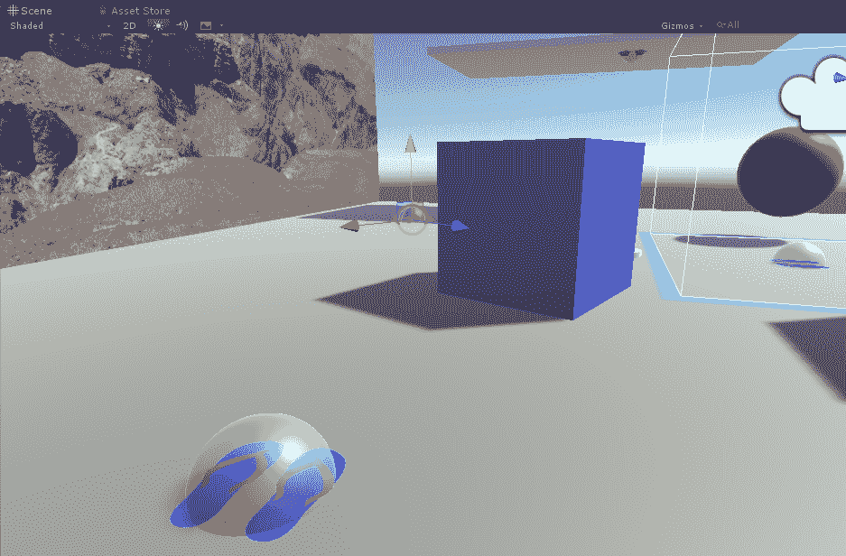

# 其他传送考虑因素

关于传送，还有很多可以说的和可以做的。你可能更喜欢使用手柄控制器而不是目光选择位置。通常使用弧形激光束（使用贝塞尔曲线）来显示传送指针。传送出生点通常使用发光或火焰效果。许多这些功能已经通过高级 VR 工具包构建并提供了（见下一主题）。

闪烁传送是一种在玩家位置变化之间进行淡出淡入的技术。据说这提供了一种额外的舒适度。我们这里不会展示代码，但有一些实现 VR 中淡入淡出的技术，例如创建一个覆盖整个相机的屏幕空间画布，使用黑色面板，并在淡入淡出时 lerping 其 alpha 通道（见[`docs.unity3d.com/ScriptReference/Mathf.Lerp.html`](https://docs.unity3d.com/ScriptReference/Mathf.Lerp.html)）。有些人甚至发现使用真实的眨眼效果进行淡入淡出非常自然，其中你从上到下快速淡出，然后从下到上淡入，就像眼睑的闭合和打开。

另一种技术是从上方提供场景的第三人称视角，有时称为**迷你地图**、**上帝视角**或**玩具屋视角**。从这个视角，玩家可以指向一个新位置进行传送。这个场景的迷你版本可以是玩家在主场景中用作工具的对象，或者你在传送选择过程中切换到这种视图模式。

你也可以传送到不同的场景。结合闪烁淡入淡出，你调用`SceneManager.LoadScene("OtherSceneName")`而不是简单地改变变换位置。注意，你必须将其他场景添加到构建设置场景的构建列表中（见[`docs.unity3d.com/ScriptReference/SceneManagement.SceneManager.LoadScene.html`](https://github.com/thestonefox/VRTK)）。

聪明地使用传送和玩家的方向可以有效地利用有限的游玩空间，并给人一种 VR 空间比现实中更大的感知。例如，在房间规模 VR 中，如果你让玩家走向游玩空间的边缘并进入电梯（传送），她可能会面对电梯的背面进入，并在新级别的门打开时必须转身，此时可以物理地向前行走。实际上，可以通过这种方式实现无限走廊和相连的房间，同时保持玩家的沉浸感。

# 传送工具包

我们已经探索了多种不同的移动和传送机制。它们都使用你的注视方向进行选择。这有时是最佳选择。有时则不是。这无疑是各种 VR 设备之间最低的共同点，从高端的 HTC VIVE 和 Oculus Rift 到低端 Google Cardboard，基于注视的简单点击选择始终可用。

很可能你更喜欢使用手柄控制器进行选择。高端系统包括两个位置跟踪控制器，每个手一个。低端设备，如 Google Daydream，包括一个单一的 3DOF“激光指针”控制器。我们之前避免使用控制器实现的原因之一是代码在不同设备之间差异很大。此外，特定设备的工具包通常附带实现此机制所需的组件和预制体，针对特定平台进行了优化，包括用于渲染弧形激光束和传送标记的高性能着色器。

在本节中，我们将展示如何使用这些高级组件实现传送，使用 SteamVR 交互系统和 Google Daydream Elements。如果你没有使用这些工具之一，请查看你的目标设备的工具包项目，或者考虑使用通用的工具包，如开源的 VRTK ([`github.com/thestonefox/VRTK`](https://github.com/thestonefox/VRTK))。

# 使用 SteamVR 交互系统进行传送

我们在第五章中首次介绍的 SteamVR 交互系统，*Handy Interactables*，包括易于使用的传送组件。如果你使用 SteamVR SDK，它可以在`Assets/SteamVR/InteractionSystem/Teleport/`文件夹中找到。传送工具包括许多我们没有机会自己实现的额外功能，包括材质、模型、预制体、脚本、着色器、声音、纹理、触觉等！

具体来说，传送工具包包括：

+   `Teleporting`预制体：传送控制器，每个场景添加一个

+   `TeleportPoint`预制体：你想要传送到的位置，每个位置添加一个

+   `TeleportArea`组件：添加到游戏对象，例如一个平面，以允许在该区域内任意位置进行传送

交互系统包括其自带的`Player`相机装置，它取代了我们一直使用的默认`[CameraRig]`，如下所示：

1.  在`SteamVR/InteractionSystem/Core/Prefabs`中定位`Player`预制体

1.  将其拖动为场景`Hierarchy`中`MeMyselfEye`的子对象

1.  删除或禁用`[CameraRig]`对象

1.  从项目`Assets/SteamVR/InteractionSystem/Teleport/Prefabs`中拖动`Teleporting`预制体的副本作为`MeMyselfEye`的子对象（这个控制器实际上可以在场景中的任何地方移动）

1.  在`Hierarchy`中选择玩家，并将它的父对象`MeMyselfEye`拖动到其跟踪原点变换槽中

这最后一步很重要。工具包的传送组件默认会改变 `Player` 对象的位置。当我们传送时，我们希望传送 `Player` 的父对象 `MeMyselfEye`。如果在你的游戏中，例如，玩家坐在车辆的驾驶舱中，而你打算传送整个车辆，而不仅仅是玩家本身，这也可能被使用。

如果你遵循了本章前面的项目，请禁用我们在这里不会使用的东西：

1.  在 `MyMyselfEye` 上禁用或移除 Look Teleport 和 Look Spawn Teleport 组件

1.  禁用或删除每个 `TeleportSpawn` 对象

现在，对于每个传送位置：

1.  将 `TeleportPoint` 预制件的副本从项目 `Assets/SteamVR/InteractionSystem/Teleport/Prefabs` 拖到层次结构中

1.  将其放置在场景中的任何位置。如前所述，我们使用了 (`0`, `0`, `-1.5`), (`2`, `0`, `3`), (`-4`, `0`, `1`), 以及在 Overlook 位置 (`3.5`, `2.5`, `0`)

就这样！按下播放。传送点不会显示，直到你按下控制器上的按钮，然后它们会发光，一条虚线激光弧让你选择一个，然后你就可以到达那里。在此处显示的游戏窗口中，我正在传送至 Overlook 位置：

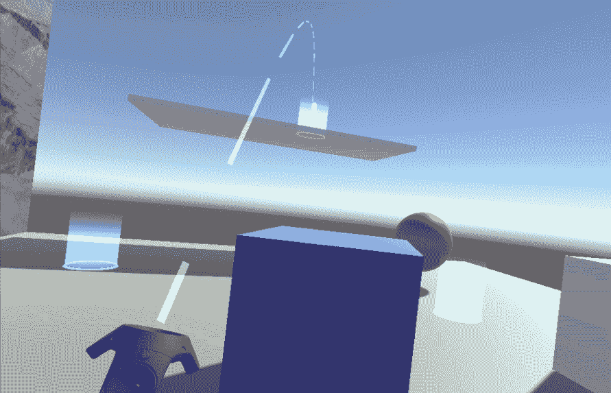

请查看 Teleport 组件上的许多选项。您可以修改或替换用于突出显示传送点的材质、声音和其他效果。Teleport Arc 组件提供了渲染激光弧的选项，而 `TeleportPoints` 本身也可以分别进行修改。

# 使用 Daydream Elements 进行传送

我们在第五章中首次介绍的 Google Daydream Elements 包，*Handy Interactables* 包含一些传送组件。如果你针对 Google Daydream，你可以从 GitHub 安装单独的 Daydream Elements 下载（[`github.com/googlevr/daydream-elements/releases`](https://github.com/googlevr/daydream-elements/releases)）。相关文档可以在 Elements 网站上找到（[`developers.google.com/vr/elements/teleportation`](https://developers.google.com/vr/elements/teleportation)）。

一旦导入到你的项目中，它可以在 `Assets/DaydreamElements/Elements/Teleport/` 文件夹中找到。这里有一个演示场景，Teleport，以及相关的材质、模型、预制件、脚本、着色器和纹理。

默认情况下，这些工具相当通用且可高度自定义。主要的预制件是 `TeleportController`，它负责所有工作。用于触发传送行为的用户输入可以通过在 Unity 编辑器中填充组件槽进行配置，如下所示：

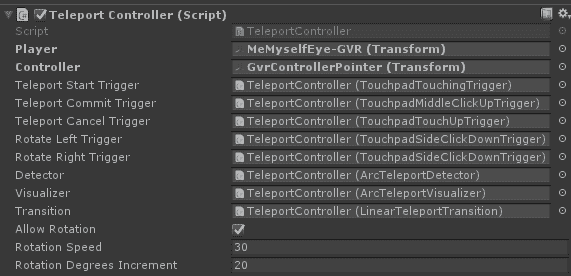

你可以通过更改其 *探测器*、*可视化器* 和 *过渡* 类来扩展传送器。

+   **探测器**：例如，`ArcTeleportDetector` 会进行曲线弧形射程以在场景中找到对象，并将击中限制在具有足够空间“适合”玩家的水平表面上，这样你就不会传送到墙壁中。

+   **可视化器**：例如`ArcTeleportVisualizer`，在触发传送时渲染弧线。

+   **过渡**：例如`LinearTeleportTransition`，将玩家动画移动到新位置。这可以修改以实现眨眼效果，例如。

要将其添加到您的场景中：

1.  将`TeleportController`预制件拖放到您的层次结构中，作为 Player 的子对象（对我们来说就是`MeMyselfEye` | GVRCameraRig | Player）。

1.  如有必要，重置其变换。

1.  将`MeMyselfEye`对象拖放到`TeleportController`组件的 Player 变换槽中。

1.  将`GvrControllerPointer`（或您正在使用的任何控制器游戏对象）拖放到控制器变换槽中。

按下播放，您可以在场景的任何地方传送。不需要放置特定的传送目标。

默认情况下，`TeleportController`将通过让您在任何具有碰撞器的场景对象上着陆来工作。您可以通过指定层来限制检测器 Raycast 考虑的对象。此外，如果您想在场景中添加任意形状的目标区域，这些区域不一定是游戏对象，您可以添加仅具有碰撞器而没有渲染器的对象集。这就是在 Daydream Elements 传送演示中实现岛屿上的传送区域的方式。

# 重置中心和位置。

有时在 VR 中，头戴式设备中呈现的视图与您的身体方向不完全同步。设备 SDK 提供函数以重置头戴式设备相对于真实世界空间的方向。这通常被称为视图的**居中**。

Unity 提供了一个 API 调用，它映射到底层设备 SDK 以重新居中设备，`UnityEngine.VR.InputTracking.Recenter()`。此函数将跟踪中心定位到 HMD 的当前位置和方向。它仅适用于坐姿和站姿体验。房间规模体验不受影响。

在撰写本文时，Recenter 在 SteamVR 中不起作用，即使是坐姿配置。解决方案是调用以下代码：

```cs
Valve.VR.OpenVR.System.ResetSeatedZeroPose();
Valve.VR.OpenVR.Compositor.SetTrackingSpace(Valve.VR.ETrackingUniverseOrigin.TrackingUniverseSeated);
```

Daydream 控制器在底层系统中集成了重置功能（按住系统按钮）。这是因为在不想要的漂移在移动 VR 设备上非常常见。此外，对于 Cardboard（以及没有控制器的 Daydream 用户），您应该在玩家装置中包含一个标准的地面画布菜单，该菜单应包括重置和居中按钮（正如我们在第三章，*VR 构建和运行*）中做的那样）。

在其他系统上，您可以根据需要选择一个触发调用`Recenter`的按钮。

# 支持房间规模传送。

如前所述，Unity Recenter 功能对房间规模设置没有任何影响。我们假设房间规模玩家是站立并活跃的，因此他们可以在 VR 场景中自行转身面对“前方”。

然而，当我们传送时，我们正在将玩家移动到新的位置，可能是一个完全不同的场景。当我们重新定位 MyMyselfEye 或任何位置跟踪摄像机的父对象时，玩家不必位于该装置的原点。如果玩家传送到新位置，他的整个游戏空间应该被传送，并且玩家最终应该站在他特别选择的虚拟位置上。

以下函数将补偿传送变换，使玩家在游戏空间中的相对姿态。按照编写方式，它假定它是一个位于 MeMyselfEye 玩家根对象上的组件：

```cs
private void TeleportRoomscale( Vector3 targetPosition )
{
    Transform camera = Camera.main.transform;
    float cameraAngle = camera.eulerAngles.y;
    transform.Rotate( 0f, -cameraAngle, 0f);
    Vector3 offsetPos = camera.position - transform.position;
    transform.position = targetPosition.position - offsetPos;
}
```

在我们之前的传送脚本示例中使用它时，将`transform.position = target.transform.position;`行替换为对`TeleportRoomscale(target.transform.position)`的调用。

# 管理 VR 运动病

VR 运动病，或称模拟器病，是虚拟现实中的一个真实症状和关注点。研究人员、心理学家和技术人员，拥有广泛的专长和博士学位，正在研究这个问题，以更好地理解潜在的原因并找到解决方案。

VR 运动病的一个原因是，当你移动头部时，屏幕更新滞后，或者延迟。你的大脑期望你周围的世界会精确同步地改变。任何可感知的延迟都可能让你感到不舒服，至少可以说。

通过更快地渲染每一帧，保持推荐的每秒帧数，可以减少延迟。设备制造商将其视为他们需要解决的问题，无论是硬件还是设备驱动程序软件。GPU 和芯片制造商将其视为处理器性能和吞吐量问题。我们无疑将在未来几年看到显著的改进。

同时，作为 VR 开发者，我们需要意识到延迟和 VR 运动病的其他原因。开发者需要将其视为我们自己的问题，因为最终，这取决于性能和人体工程学。在移动 VR 与桌面 VR 持续的二分法中，玩家将使用的设备性能始终会有上限。在第十三章优化性能和舒适度中，我们深入探讨了渲染管道和性能的技术细节。

但问题不仅仅是技术。我乘坐现实世界的过山车也会感到恶心。那么，为什么 VR 过山车不会有类似的效果呢？以下是一些有助于提高玩家舒适度和安全性的考虑因素，包括以下游戏机制和用户体验设计：

+   **不要快速移动**：当移动或动画化第一人称角色时，不要移动得太快。在游戏机和个人电脑上运行的高速第一人称射击游戏在 VR 中可能效果不佳。

+   **向前看**：当你穿过一个场景时，如果你向侧面看而不是直视前方，你更有可能感到恶心。

+   **不要快速转动头部**：使用 VR 头盔时，不要鼓励用户快速转动头部。在小的时片内视口的大幅变化加剧了更新 HMD 屏幕的延迟。

+   **提供舒适模式**：当场景需要你快速多次转身时，提供一种旋转机制，也称为舒适模式，允许你以更大的增量改变观察方向。

+   **在传送和场景转换期间使用淡入或闪烁剪辑**。在淡入时，过渡到深色，因为白色可能会令人震惊。

+   **在移动过程中使用隧道或其他技术**。通过遮挡相机除了你正前方之外的所有可见内容，减少视野中的可见内容。

+   **使用第三人称摄像机**：如果你有高速动作，但并不一定打算给用户带来刺激的体验，可以使用第三人称摄像机视角。

+   **保持脚踏实地**：提供有助于用户保持平衡的视觉提示，例如地平线线、视野中的附近物体以及相对固定的位置物体，如仪表盘和身体部位。

+   **提供重新居中视图的选项**：特别是移动 VR 设备容易发生漂移，有时需要重新居中。对于有线 VR 设备，这有助于你避免被 HMD 线缠住。作为一个安全问题，将你的视图相对于现实世界重新居中可能有助于你在物理空间中避免撞到家具和墙壁。

+   **不要使用剪辑场景**：在传统游戏（和电影）中，用于在关卡之间切换的技术是显示一个 2D 剪辑电影。如果禁用了头部运动检测，这在 VR 中是不起作用的。它会破坏沉浸感并可能导致恶心。一种替代方法是简单地淡入黑色，然后打开新场景。

+   **优化渲染性能**：所有 VR 开发者都应该了解延迟的根本原因——特别是渲染性能——以及你可以做什么来优化它，例如降低多边形数量和仔细选择光照模型。学会使用性能监控工具，以保持每秒帧数在预期和可接受的范围内。更多内容将在第十章中讨论，*使用所有 360 度*。

+   **鼓励用户休息**：或者，你可能只是提供一款游戏呕吐袋！或者不提供。

# 摘要

在本章中，我们探讨了在虚拟环境中移动的许多不同方式。我们首先检查了 Unity 支持的传统第三人称和第一人称角色的组件，并很快意识到这些功能在 VR 中并不太有用。例如，我们不希望应用程序在我们行走时上下晃动头部，我们也不一定想从建筑物上跳下来。移动很重要，但玩家的舒适度更为重要。你不想引起运动病。

机动性是平滑且线性地在场景中移动，类似于行走。我们利用基于注视的机制实现了朝你注视的方向移动，并使用输入按钮来开始和停止。然后，我们将机动性与头部方向分离，始终朝“前方”移动，并使用单独的输入（拇指盘）来改变身体面向的角度。在这种*舒适模式*下，你可以移动的同时四处张望。

跳到新位置被称为传送。我们再次从基于注视的机制开始，让你选择一个你注视的传送位置。我们实现了几种限制你允许传送位置的方法，包括使用导航网格和使用传送出生点。然后，我们研究了几个传送工具包，如 SteamVR 和 Google Daydream，它们提供了一套丰富的功能，以及一个丰富的用户体验，这些功能从零开始实现并不简单。如果你针对的是不同的平台，例如 Oculus，也有类似的工具。

在下一章中，我们将更深入地探索 Unity 物理引擎并实现一些交互式游戏。
