# 与物理和火焰玩耍

在本章中，我们将使用物理和其他 Unity 功能来构建交互式球类游戏的变体。在这个过程中，我们将探讨管理对象、Rigidbody 物理以及增加虚拟体验的交互性。您将看到如何将基于物理的属性和材料添加到对象中，以及更多关于 C# 脚本、粒子效果和音乐的内容。

在本章中，您将学习以下主题：

+   Unity 物理引擎、Unity Rigidbody 组件和物理材料

+   使用速度和重力

+   管理对象生命周期和对象池

+   使用头部和双手在 VR 中与对象交互

+   使用粒子效果构建火球

+   与音乐同步

注意，本章中的项目是独立的，并不直接需要本书其他章节中的其他章节。如果您决定跳过其中任何部分或未保存您的作品，那都是可以的。

# Unity 物理引擎

在 Unity 中，基于物理的对象的行为与其网格（形状）、材质（UV 纹理）和渲染器属性是分开定义的。影响物理的项包括以下内容：

+   **Rigidbody**：使对象能够在物理引擎的控制下行动，接收力矩以实现现实的方式移动

+   **Collider**：定义了用于计算与其他对象碰撞的简化、近似形状的对象

+   **Physic Material**：定义了碰撞对象的摩擦和弹跳效果

+   **Physics Manager**：为您的项目应用 3D 物理的全局设置

基本上，物理（在此上下文中）是由影响对象变换的位置和旋转力定义的，例如重力、摩擦、动量和与其他对象的碰撞。它并不一定是现实世界中物理的完美模拟，因为它针对性能和关注点的分离进行了优化，以促进动画。此外，虚拟世界可能只需要它们自己的物理定律，而这些定律在我们的宇宙中是找不到的！

Unity 集成了 **NVIDIA PhysX** 引擎，这是一种实时物理计算中间件，为游戏和 3D 应用实现了经典牛顿力学。此多平台软件在存在时针对快速硬件处理器进行了优化。它可以通过 Unity 脚本 API 访问。

物理的关键是添加到对象中的 Rigidbody 组件。Rigidbody 具有重力、质量、阻力等参数。Rigidbody 可以自动对重力和其他对象的碰撞做出反应。无需额外的脚本编写。在游戏过程中，引擎计算每个刚体对象的动量并更新其变换位置和旋转。

有关 Rigidbody 的详细信息可以在 [`docs.unity3d.com/ScriptReference/Rigidbody.html`](http://docs.unity3d.com/ScriptReference/Rigidbody.html) 找到。

Unity 项目有一个全局重力设置，可以在项目设置中的物理管理器中找到，方法是导航到 Edit | Project Settings | Physics。正如您所期望的，默认的重力设置是一个具有值的 Vector3 (`0`, `-9.81`, `0`)，它对所有 Rigidbody 应用向下的力。重力以每秒平方米计算。

刚体可以自动对重力和其他物体的碰撞做出反应。不需要额外的脚本编写。

为了检测碰撞，碰撞的物体都必须具有 `Collider` 组件。有内置的具有基本几何形状的碰撞器，例如立方体、球体、圆柱体和胶囊。网格碰撞器可以假设任意形状。如果可能的话，最好使用一个或多个基本碰撞器形状，这些形状大致适合实际物体，而不是使用网格碰撞器，以减少游戏过程中实际碰撞计算的消耗。Unity 要求，如果您的对象将用于物理并且具有 Rigidbody，则其网格碰撞器必须标记为凸形，并且限制为 255 个三角形。

当刚性物体碰撞时，碰撞中每个物体的相关力会作用于其他物体。这些力的值是根据物体的当前速度和体重计算的。还会考虑其他因素，例如重力（即阻力）。此外，您可以选择添加约束来冻结给定物体在任何 *x*、*y* 和 *z* 轴上的位置或旋转。

当将物理材料分配给对象的碰撞器时，计算可以进一步受到影响，这会调整碰撞物体的摩擦和弹性效果。这些属性仅适用于拥有物理材料的对象。（注意，由于历史原因，它实际上拼写为 *Physic Material* 而不是 *Physics Material*。）

因此，假设对象 A（球）击中对象 B（砖块）。如果对象 A 有弹性而对象 B 没有，则在碰撞中对象 A 将会有一个冲量，但对象 B 不会有。然而，您可以选择确定它们的摩擦和弹性的组合方式，正如我们接下来将要看到的。这并不一定是一个真实世界物理的准确模拟。这是一个游戏引擎，而不是计算机辅助工程模型器。

从脚本的角度来看，Unity 会在物体碰撞时触发事件（`OnTriggerEnter`），在物体碰撞的每一帧触发（`OnTriggerStay`），以及当它们停止碰撞时（`OnTriggerExit`）。

如果这听起来令人畏惧，请继续阅读。本章的其余部分将将其分解成可理解的部分。

# 弹性球

我们在这里要实现的功能是，当一个球从空中落下并击中地面时，它会弹起并上下跳动，然后再次弹起，随着时间的推移逐渐减弱。

我们将从一个新的场景开始，该场景由地面平面和球体组成。然后，我们将逐步添加物理效果，如下所示：

1.  通过导航到 File | New Scene 创建一个新的场景。

1.  然后，导航到文件 | 保存场景为... 并将其命名为 `BallsFromHeaven`。

1.  通过导航到 GameObject | 3D Object | Plane 创建一个新的平面，并使用 `Transform` 组件的 *齿轮* 图标重置其变换。

1.  通过导航到 GameObject | 3D Object | Sphere 创建一个新的球体，并将其重命名为 `BouncyBall`。

1.  将其缩放设置为 (`0.5`, `0.5`, `0.5`) 并将其位置设置为 (`0`, `5`,`0`)，使其位于平面的中心上方。

1.  将项目资产中的红色材质拖到它上面，使其看起来像一个弹跳球。

新的 Unity 场景默认包含方向光和主摄像机。暂时使用这个主摄像机是可以的。

点击 *播放* 按钮。没有任何事情发生。球就停在空中，不动。

现在，让我们给它一个 Rigidbody，如下所示：

1.  在 `BouncyBall` 选择的情况下，在检查器中，导航到添加组件 | 物理 | Rigidbody。

1.  点击 *播放* 按钮。它像铅球一样掉落。

让它弹跳，如下所示：

1.  在项目面板中，选择顶级资产文件夹，导航到创建 | 文件夹，并将其重命名为 `Physics`

1.  在 `Physics` 文件夹中选择，通过导航到 Assets | 创建 | 物理材质 （或在该文件夹内右键单击）创建一个材质。

1.  将其命名为 `Bouncy`

1.  将其弹跳性值设置为 `1`

1.  在层次结构中选择 `BouncyBall` 球体，将 `Bouncy` 资产从项目拖到检查器中球体的碰撞器材质字段。

点击 *播放* 按钮。球弹跳了，但并没有跳得很高。我们使用了最大值 `1.0` 作为弹跳性。是什么让它减速？不是摩擦设置。而是弹跳组合设置为平均，这决定了球（1）的弹跳性与平面（0）的弹跳性混合的程度。因此，它随时间迅速减弱。我们希望球保持所有的弹跳性。我们将按以下方式实现：

1.  将 `Bouncy` 对象的弹跳组合改为最大。

1.  点击 *播放* 按钮。

好多了。实际上，好得太多了。球一直弹跳回到原来的高度，忽略了重力。现在，将弹跳性改为 `0.8`。弹跳减弱，球最终会停下来。

让我们在 VR 中检查它，如下所示：

1.  从层次结构根删除默认的主摄像机。

1.  将 `MeMyselfEye` 预制件从项目资产拖到场景中。将其位置设置为 (`0`, `0`, `-4`)。

在 VR 中运行它。非常酷！即使在 VR 中最简单的东西看起来也很令人印象深刻。

Unity 的标准资产包包括一些示例物理材质，包括 Bouncy、Ice、Meta、Rubber 和 Wood。

好的，让我们来点乐趣。让它下起弹跳球雨！为此，我们将球体制作成预制件，并编写一个脚本，实例化新的球体，从随机位置掉落，如下所示：

1.  将 `BouncyBall` 对象从层次结构拖到 `Project Assets/Prefabs` 文件夹中，使其成为一个预制件。

1.  从层次结构中删除 `BouncyBall` 对象，因为我们将通过脚本实例化它。

1.  通过导航到 GameObject | 创建空对象来创建一个空的游戏控制器对象，并将其命名为 `GameController`。

1.  在检查器中，导航到添加组件 | 新脚本，将其命名为 `BallsFromHeaven`，并打开脚本进行编辑。

编辑脚本，使其看起来像这样：

```cs
using UnityEngine; 

public class BallsFromHeaven : MonoBehaviour 
{ 
  public GameObject ballPrefab; 
  public float startHeight = 10f; 
  public float interval = 0.5f; 

  private float nextBallTime = 0f; 

  void Update () 
  { 
    if (Time.time > nextBallTime) 
    { 
      nextBallTime = Time.time + interval; 
      Vector3 position = new Vector3( Random.Range (-4f, 4f), 
         startHeight, Random.Range (-4f, 4f) ); 
      Instantiate( ballPrefab, position, Quaternion.identity ); 
    } 
  } 
} 
```

脚本以每 `interval` 秒的速率从 `startHeight` 位置掉落一个新的球体（0.5 的间隔意味着每半秒掉落一个新的球体）。新球的位置在 `-4` 和 `4` 之间的随机 X-Z 坐标。`Instantiate()` 函数将一个新的球体添加到场景层次结构中。

保存脚本。我们现在需要用 `BouncyBall` 预制件填充 Ball 字段，如下所示：

1.  在层次结构中选择 `GameController`，将 `BouncyBall` 预制件从 `Project Assets/Prefabs` 文件夹拖到检查器中 Balls From Heaven（脚本）面板的 Ball 预制件槽中。

1.  请确保使用来自项目资源的 `BouncyBall` 预制件，以便可以实例化。

1.  保存场景。在 VR 中运行它。很有趣！

这是我得到的结果：

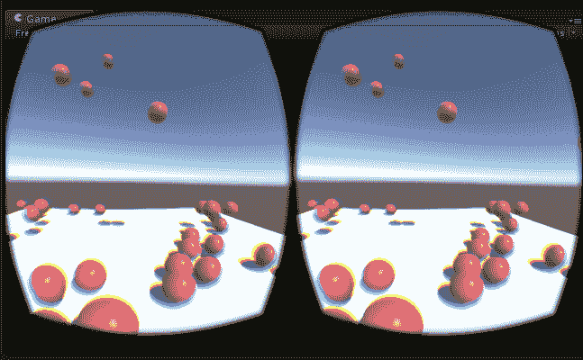

总结来说，我们创建了一个带有 Rigidbody 的球体，并添加了一个具有 `0.8` 弹性系数和最大弹跳组合的物理材质。然后，我们将 `BouncyBall` 保存为预制件，并编写了一个脚本以实例化从上方掉落的新的球体。

# 管理游戏对象

每当你有一个实例化对象的脚本时，你必须意识到对象的生命周期，并可能安排在不再需要时销毁它。例如，你可以销毁游戏对象，在它不再在场景中可见后，或者在特定的生命周期后，或者限制场景中球体的最大数量。

# 销毁掉落的对象

在我们的场景中，我们有一个有限大小的地面平面，当球体相互碰撞时，一些球体会掉落到平面之外。在那个时刻，我们可以从场景中移除掉落的球体。观察层次结构面板，注意新球体的实例化。注意，一些球体最终会从平面平台上弹跳出来，但仍然留在层次结构面板中。我们需要通过添加一个脚本来清理这些球体，如下所示：

1.  在 `Project Assets/Prefabs` 中选择 `BouncyBall` 预制件

1.  导航到添加组件 | 新脚本，并将其命名为 `DestroyBall`

这里有一个 `DestroyBall.cs` 脚本，如果对象的 Y 位置低于地面平面很多（Y = `0`），则会销毁该对象：

```cs
using UnityEngine; 
using System.Collections; 

public class DestroyBall : MonoBehaviour 
{ 
  void Update () 
  { 
    if (transform.position.y < -5f) 
    {
      Destroy (gameObject);  
    }  
  } 
} 
```

# 设置有限的生命周期

管理对象生命周期的一种策略是限制它们的持续时间。这对于像弹射物（子弹、箭矢、弹跳球）或其他玩家在实例化时最关心的对象，在游戏进行时不再关注的情况尤其有效。

为了实现，你可以在对象预制件本身上设置一个计时器，当时间耗尽时销毁它。

修改`DestroyBall.cs`脚本，在`delay`秒后销毁对象：

```cs
  public float timer = 15f; 

  void Start () 
  { 
    Destroy (gameObject, timer); 
  } 
```

当你玩游戏时，注意地面平面比以前少得多。每个 BouncyBall 将在 15 秒后或当它从平面上掉落时被销毁，以先发生者为准。

# 实现对象池

如果你的`GameController`间隔是 0.5 秒，销毁计时器是 15 秒，那么（进行计算）一次最多有 30 个球在游戏中。如果有些球掉落边缘，则更少。在这种情况下，我们不需要让我们的应用程序持续分配新的内存来创建新的 BouncyBall 实例，只为了在 15 秒后删除该对象。过多的实例化和销毁对象会导致内存碎片化。Unity 将定期进行清理，这是一个计算成本高昂的过程，称为**垃圾回收**（**GC**），最好尽可能避免。

对象池是在游戏中创建一个可重复使用的对象列表，而不是持续实例化新的对象。您将激活/停用对象，而不是实例化/销毁。

为了实现这一点，我们将编写一个通用的对象池器并将其添加到场景中的`GameController`。

因此，我们还向您介绍了 C#中的列表概念。正如其名所示，列表是有序对象集合，类似于数组。列表可以进行搜索、排序和其他操作（请参阅此处文档：[`msdn.microsoft.com/en-us/library/6sh2ey19.aspx`](https://msdn.microsoft.com/en-us/library/6sh2ey19.aspx)）。我们将简单地使用它们来存储预先实例化的对象。让我们将脚本命名为`ObjectPooler`：

1.  在层次结构中选择`GameController`

1.  导航到“添加组件”|“新建脚本”，并将其命名为`ObjectPooler`。

打开进行编辑。让我们首先在顶部声明几个变量：

```cs
using System.Collections.Generic;
using UnityEngine;

public class ObjectPooler : MonoBehaviour 
{
    public GameObject prefab;
    public int pooledAmount = 20;

    private List<GameObject> pooledObjects;

}
```

公共的`prefab`将获取我们想要实例化的预制体对象，即`BouncyBall`。而`pooledAmount`表示初始实例化的对象数量。实际列表存储在`pooledObjects`中。

现在，当场景开始时，我们初始化列表如下：

```cs
    void Start () {
        pooledObjects = new List<GameObject>();
        for (int i = 0; i < pooledAmount; i++)
        {
            GameObject obj = (GameObject)Instantiate(prefab);
            obj.SetActive(false);
            pooledObjects.Add(obj);
        }
  }
```

我们在`for`循环中分配一个新的列表，并通过实例化我们的预制体来填充它，最初使其不活动，并将其添加到列表中。

现在我们想要一个新对象时，我们将调用`GetPooledObject`，它将在列表中寻找当前不活动的对象。如果所有对象都处于活动状态且没有可重复使用的对象，则返回`null`：

```cs
    public GameObject GetPooledObject()
    {
        for (int i = 0; i < pooledObjects.Count; i++)
        {
            if (!pooledObjects[i].activeInHierarchy)
            {
                return pooledObjects[i];
            }
        }

        return null;
    }
```

就这样。

我们还可以增强脚本，使其可选地扩展列表，使其永远不会返回 null。在顶部添加选项：

```cs
    public bool willGrow = true;
```

在`for`循环之后向`GetPooledObject`添加以下语句：

```cs
        ...
        if (willGrow)
        {
            GameObject obj = (GameObject)Instantiate(prefab);
            pooledObjects.Add(obj);
            return obj;
        }

        return null;
    }
```

保存脚本，将其附加到`GameController`，并将`BouncyBall`预制体拖放到组件的预制体槽中。

现在我们需要修改我们的`BallsFromHeaven`脚本，使其从`ObjectPooler`调用`GetPooledObject`而不是`Instantiate`。更新的`BallsFromHeaven`脚本如下：

```cs
using UnityEngine;

[RequireComponent(typeof(ObjectPooler))]
public class BallsFromHeaven : MonoBehaviour
{
    public float startHeight = 10f;
    public float interval = 0.5f;

    private float nextBallTime = 0f;
    private ObjectPooler pool;

    void Start()
    {
        pool = GetComponent<ObjectPooler>();
        if (pool == null) 
        {
            Debug.LogError("BallsFromHeaven requires ObjectPooler component");
        }
    }

    void Update()
    {
        if (Time.time > nextBallTime)
        {
            nextBallTime = Time.time + interval;
            Vector3 position = new Vector3(Random.Range(-4f, 4f), startHeight, Random.Range(-4f, 4f));
            GameObject ball = pool.GetPooledObject();
            ball.transform.position = position;
            ball.transform.rotation = Quaternion.identity;
            ball.GetComponent<RigidBody>().velocity = Vector3.zero;
            ball.SetActive(true);
        }
    }
}
```

注意，我们添加了一个指令`[RequireComponent(typeof(ObjectPooler))]`，以确保对象具有`ObjectPooler`组件（我们还在`Start`函数中进行了双重检查）。

重要的是要注意，由于我们不是实例化新对象而是重用它们，你可能需要将任何对象属性重置为其起始值。在这种情况下，我们不仅重置了变换，还将 RigidBody 的速度重置为零。

最后的部分是我们修改`DestroyBall`，使其只是禁用（非激活）对象而不是真正销毁它。最初，处理*掉落在地面平面之外*的情况如下：

```cs
using UnityEngine;

public class DestroyBall : MonoBehaviour {

    void Update () {
        if (transform.position.y < -5f)
        {
            DisableMe();
        }
    }

    private void DisableMe()
    {
        gameObject.SetActive(false);
    }
}

```

我们没有调用`Destroy`，而是将`Update`改为调用一个新的函数`DisableMe`，该函数简单地禁用对象，将其返回到可用对象池中。

对于定时销毁，有几种不同的实现方式。之前，我们从`Start()`中调用了`Destroy(gameObject, timer)`。我们可以做类似的事情，使用`OnEnable`而不是`Start`，因为这是这个实例开始的时候。它调用`Invoke()`而不是直接销毁：

```cs
    void OnEnable()
    {
        Invoke("DisableMe", timer);
    }

    void OnDisable()
    {
        CancelInvoke();
    }
```

我们还提供了一个`OnDisable`来取消`Invoke`，因为如果球在计时器完成之前掉落边缘，对象可能会被禁用并可能重新启用，我们应该确保它不会同时被调用两次。

现在当你按下播放时，你可以在检查器中看到，新的 BouncyBalls 在开始时被实例化以初始化列表，然后随着游戏的进行，对象被禁用并在返回池中重新激活，如图所示（禁用的 BouncyBall(Clone)对象比激活的对象暗淡）：

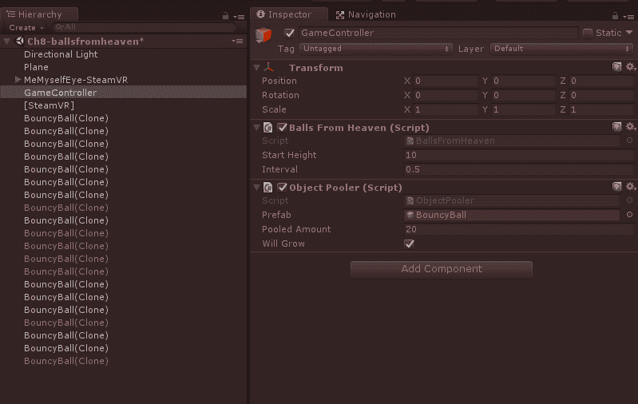

# 头部瞄准游戏

实际上玩这些弹跳球会很有趣吗？让我们制作一个游戏，你可以用头部瞄准目标。在这个游戏中，球一个接一个地从上方落下，弹在你的额头（脸部）上，瞄准目标。

我们在这里要实现的功能是，当球从你头顶上方落下时，你将其弹回你的脸部，并瞄准目标。

为了实现这一点，创建一个作为相机对象子对象的立方体（就像我们在第六章中为瞄准十字准星所做的），*世界空间 UI*。这提供了一个由 VR 相机父化的碰撞器，因此我们的头部姿态会移动立方体的面。我决定立方体形状的碰撞器比球体或胶囊体更适合这个游戏，因为它提供了一个平坦的面，这将使弹跳方向更加可预测。球将从天空中落下。我们将使用一个压扁的圆柱体作为目标。我们将添加音频提示，以指示何时释放新球以及何时球击中目标。

创建一个新的场景，或者更简单地说，通过执行“另存为”操作从这里开始，并按照以下方式实现头部动作：

1.  导航到“文件”|“另存场景为”，并将其命名为`BallGame`

1.  使用*齿轮*图标删除附加到`GameController`的`BallsFromHeaven`脚本组件。我们不需要它

1.  在层次结构中展开`MeMyselfEye`，钻到`Camera`对象并选择它（对于 OpenVR 可能是`[CameraRig]/Camera (head)`；对于 Daydream，可能是`Player/Main Camera/`）

1.  创建一个新的 3D 对象 | 立方体

1.  在选择`GameController`后，导航到添加组件 | 音频 | 音频源

1.  点击音频源音频剪辑字段最右侧的小*圆形*图标以打开选择音频剪辑对话框，并选择名为`Jump`的剪辑

1.  在选择`GameController`后，导航到添加组件 | 新脚本，将其命名为`BallGame`，并打开它进行编辑

你可以选择禁用立方体的网格渲染器，但我觉得在场景窗口中观看它很酷。由于摄像机在立方体内部，玩家将看不到它（因为游戏视图中只渲染面向外部的表面）。

我们将播放“跳跃”声音剪辑（Unity 标准资产包中的“角色”包提供），以指示新球被放下。你可能尝试另一个，可能更有趣的效果。

这是`BallGame.cs`脚本。它看起来与`BallsFromHeaven`非常相似，只是有一些不同：

```cs
using UnityEngine;

public class BallGame : MonoBehaviour 
{
    public Transform dropPoint;
    public float startHeight = 10f;
    public float interval = 3f;

    private float nextBallTime = 0f;
    private ObjectPooler pool;
    private GameObject activeBall;
    private AudioSource soundEffect;

    void Start()
    {
        if (dropPoint == null)
        {
            dropPoint = Camera.main.transform;
        }
        soundEffect = GetComponent<AudioSource>();
        pool = GetComponent<ObjectPooler>();
    }

    void Update()
    {
        if (Time.time > nextBallTime)
        {
            nextBallTime = Time.time + interval;
            soundEffect.Play();
            Vector3 position = new Vector3(
                dropPoint.position.x, 
                startHeight, 
                dropPoint.position.z);

            activeBall = pool.GetPooledObject();
            activeBall.transform.position = position;
            activeBall.transform.rotation = Quaternion.identity;
            activeBall.GetComponent<RigidBody>().velocity = Vector3.zero;
            activeBall.SetActive(true);
        }
    }
} 
```

我们每 3 秒（`interval`）从当前头部位置上方的`startHeight`位置实例化一个新的球。

放下点默认直接位于玩家头部位置的正上方，如 VR 摄像机定义。这可能会让你的脖子感到不舒服，所以让我们稍微向前延伸，0.2 个单位：

1.  作为`MeMyselfEye`（或作为你的头部或主摄像机对象的孩子），创建一个空的游戏对象，并将其命名为`Drop Point`

1.  将其位置设置为（`0`, `0`, `0.2`）

1.  将此`Drop Point`拖动到`GameController`的球游戏放下点槽中

在位置跟踪的 VR 设备上，如果你的放下点相对于摄像机，它将跟随玩家移动。如果它相对于`MeMyselfEye`，它将相对于你的游戏空间，而玩家可以四处移动。

在 VR 中尝试一下。

当你听到球的声音时，抬头并调整你脸的角度以引导球的弹跳。*酷！*

现在，我们需要目标。执行以下步骤：

1.  为目标创建一个平面圆柱体，导航到游戏对象 | 3D 对象 | 圆柱体，并将其命名为`Target`。

1.  将其缩放设置为（`3`, `0.1`, `3`）并将位置设置为（`1`, `0.2`, `2.5`），使其位于你前面的地面上。

1.  从“项目资产/材质”文件夹（在第二章，*内容、对象和比例*中创建）拖动“蓝色”材质到它上面，或者创建一个新的材质。

1.  注意，它的默认胶囊碰撞体是圆顶形的，这实际上并不合适。在胶囊碰撞体上，选择其*齿轮*图标 | 删除组件。

1.  然后，导航到添加组件 | 物理 | 网格碰撞体。

1.  在新的网格碰撞体中，启用凸多边形复选框和触发器复选框。

1.  通过导航到添加组件 | 音频 | 音频源来添加音频源。

1.  在选择`Target`的情况下，点击音频剪辑字段右侧的小*圆圈*图标以打开选择音频剪辑对话框，并选择名为`Land`的剪辑（位于标准资产中）。

1.  取消选中“唤醒时播放”复选框。

1.  然后创建一个新的脚本，导航到添加组件 | 新脚本，将其命名为`TriggerSound`，并在 MonoDevelop 中打开它。

由于我们启用了 Is Trigger，当某物撞击碰撞器时，如果目标对象上存在，`OnTriggerEnter`和其他事件处理程序将得到调用。以下`TriggerSound.cs`脚本将在你用球击中目标时播放声音：

```cs
using UnityEngine; 
using System.Collections; 

public class TriggerSound : MonoBehaviour { 
  public AudioSource hitSound; 

  void Start() { 
    hitSound = GetComponent<AudioSource> (); 
  } 

  void OnTriggerEnter(Collider other) { 
    hitSound.Play (); 
  } 
} 
```

球进入目标的碰撞器，物理引擎调用触发进入事件。脚本使用`OnTriggerEnter()`处理程序来播放音频剪辑。

要获取完整的碰撞器属性和触发事件列表，包括`OnTriggerEnter`和`OnTriggerExit`，请参阅[`docs.unity3d.com/ScriptReference/Collider.html`](https://docs.unity3d.com/ScriptReference/Collider.html)中的文档。

在 VR 中尝试。这是一个 VR 游戏！以下图像显示了带有第一人称碰撞器和球从立方体碰撞器弹跳向目标的场景：

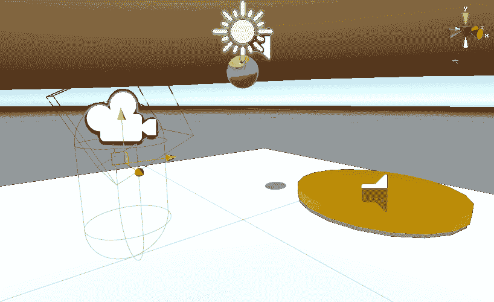**额外挑战**：记录得分。提供一个瞄准十字线。添加篮板。添加其他功能使游戏更具挑战性。例如，你可以改变射击间隔或增加初始球的速度。

到目前为止，我们通过附加到球体对象的物理材料来分配弹跳性。当球与另一个对象碰撞时，Unity 物理引擎考虑这种弹跳性来确定球的新速度和方向。在下一节中，我们将探讨如何将弹跳力从一个对象传递到另一个对象。

# 拍球游戏

接下来，我们将添加由手控制器控制的拍子来击打球。为了保持一定的通用性，我们的游戏拍子将是作为你相机装置中手控制器父级的一些简单对象。我们将目标移动到墙上而不是地板上，并将球发到你前方稍远的位置，以便可以触及

为了设置场景，你可以另存为新的名称，然后从这里开始工作。我会将我的命名为`PaddleBallGame`。

1.  选择文件 | 保存场景为，并将其命名为`PaddleBallGame`

1.  如果存在，禁用之前作为相机子元素的头部立方体

首先，让我们创建一个拍子。我们将使用圆柱体构建一个非常简单的模型。你可以在网上找到更好的，形状和纹理的模型。

1.  在层次结构根目录下，创建 | 创建空对象，并将其命名为`Paddle`，然后重置其变换

1.  添加一个子圆柱体对象（创建 | 3D 对象 | 圆柱体），并将其命名为`Handle`

1.  将“Handle”的缩放设置为(`0.02`, `0.1`, `0.02`)

1.  在“Handle”旁边添加另一个圆柱体作为其兄弟元素，并将其命名为`Pad`

1.  将垫的缩放设置为(`0.2`, `0.005`, `0.2`), 旋转(`90`, `0`, `0`), 和位置(`0`, `0.2`, `0`)

1.  在你的项目材质文件夹中，创建一个新的材质（创建 | 材质）并命名为 `Paddle` `Material`

1.  给材料 Albedo 一个木色，例如 (`107`, `79`, `54`, `255`), 然后将材料拖到把手和垫子对象上

现在修改碰撞体：

1.  选择把手，并删除其胶囊碰撞体

1.  选择垫子，并删除其胶囊碰撞体

1.  选择垫子，添加一个网格碰撞体（添加组件 | 物理 | 网格碰撞体）

1.  选择凸多边形复选框

将桨保存为预制件：

1.  将桨拖到你的项目预制件文件夹中

1.  从你的层级中删除桨

我们希望将桨作为你的手的父对象。这是平台特定的。例如，如果你使用 OpenVR，那可能就是 `MeMyselfEye / [CameraRig] / Controller` *(right)*。在 Daydream 上，那可能就是 `MeMyselfEye / Player / GvrControllerPointer`。

1.  在层级中，选择 `MeMyselfEye` 内的手控制器（例如 Controller (right) 或 `GvrControllerPointer`)

1.  创建空的子游戏对象并命名为 `Hand`（如果需要，重置其变换）

1.  在手下面创建另一个空的子对象，并命名为 `Attach Point`（如果需要，重置其变换）

1.  将桨预制件从项目拖到层级中，作为 Attach Point 的子对象

现在，我们可以调整桨的相对位置和旋转，使其握感自然。以下值对我来说似乎有效：

+   在 OpenVR 中，使用附加点旋转 (`20`, `90`, `90`)

+   在 Daydream 中，使用位置 (`0`, `0`, `0`, `05`) 和旋转 (`0`, `90`, `90`)

在 Daydream 上，`GvrControllerPointer` 包含一个 `GvrArmModel` 组件，该组件可以配置为使用简单的 3 自由度控制器模拟手臂、肘部和手腕的运动。自己设置可能会很复杂。幸运的是，Daydream Elements 包中的 ArmModelDemo 场景提供了一系列示例（在 `DaydreamElements/Elements/ArmModels/D*emo/*` 文件夹中），包括一些预配置的手臂模型预制件。让我们添加一个。如果你在 Daydream 上：

1.  在项目资产中找到 `Elements/ArmModels/Prefabs` 文件夹

1.  将 `SwingArm` 预制件拖到 `MeMyselfEye / Player` 中，作为 `GvrControllerPointer` 的同级

1.  将 `GvrControllerPointer` 移动为 SwingArm 的子对象

这将为使用桨提供更多的手臂延伸。你可以根据需要进一步调整设置，包括尝试将 SwingArm 变换的位置向前移动更多 (`0`, `0`, `0.3`).

最后，你可能还想将球体下落的位置稍微向前延伸，使其更容易触及手。在项目的早期版本中，我们定义了一个下落点；根据需要修改其位置（例如，z = `0.6`）。

这里展示了使用 HTC Vive 时使用的桨：

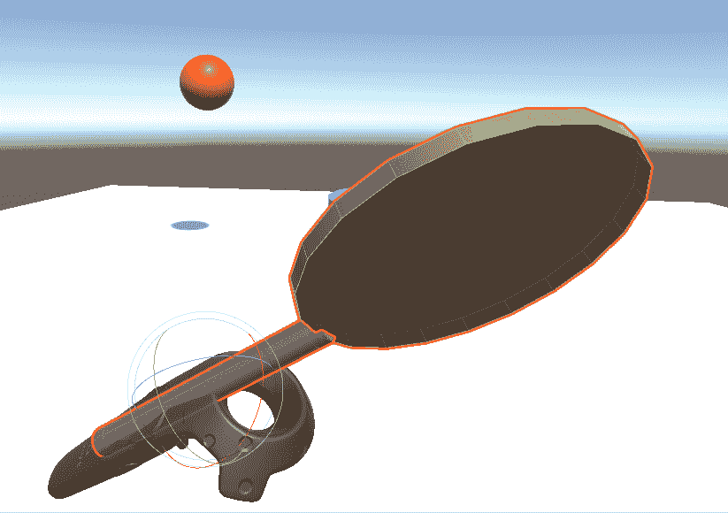

# 反射器与桨

如此实现，我们的桨更像是一个防御盾牌而不是桨。球会根据垫子的表面法线方向从桨的垫子弹跳出去。但如果你击打球，则不会传递任何物理效果。我们可以通过向垫子添加一个刚体来改变这一点，如下所示：

1.  选择你的桨的垫子

1.  添加组件 | 物理 | 刚体

1.  取消选中使用重力复选框

1.  选中 Is Kinematic 复选框

1.  点击 Inspector 顶部的 Apply 按钮以保存对预制体的更改

通过使其成为运动学，我们的垫子将对与之碰撞的对象应用物理效果，但不会对碰撞做出反应。这是好的，否则当球击中时，桨会破碎。

在这个项目中，一个重要的教训是使用附加点来定义特定行为的相对位置。我们使用了一个 Drop Point 来标记球从哪里掉落的 X、Z 位置。我们使用了一个 Attach Point 来标记你手中的桨的相对位置和旋转。我们可以在桨本身添加一个 Grip Point 来指定其相对原点。等等。

# 射击球游戏

对于这个项目的下一个迭代，我们将向玩家射击球，你必须击中墙上的目标。这个版本没有太多创新，但它展示了你可以如何将现有的机制翻转过来（字面和比喻意义上）。

首先，让我们制作一面墙并将目标放在上面：

1.  在 Hierarchy 根目录下创建一个名为 `TargetWall` 的空游戏对象，并

1.  将其放置在 (`0`, `0`, `5`)

1.  创建一个子对象立方体并将其命名为 `Wall`

1.  将墙的缩放设置为 (`10`, `5`, `0.1`) 和位置 (`0`, `2.5`, `0`)

1.  创建一个新的材质名为 `Wall Material`

1.  将其渲染模式设置为透明，并将其 Albedo 颜色设置为 (`85`, `60`, `20`, `75`) 以使其成为半透明的玻璃色

1.  将目标移动到 `TargetWall` 的子对象

1.  修改目标变换的缩放为 (`1.5`, `0.1`, `1.5`)、旋转 (`90`, `0`, `0`) 和位置 (`0`, `2.5`, `-0.25`)，使其更小，正好在墙的前面

接下来，我们不再是从空中抛球并依赖重力来服务球，而是从墙上的一个源头向你射击球：

1.  创建一个名为 `Shooter` 的球体游戏对象，作为 `TargetWall` 的子对象

1.  设置其缩放为 (`0.5`, `0.5`, `0.5`) 和位置 (`4`, `2.5`, `-0.25`)

1.  禁用或移除其球体碰撞器组件

1.  创建一个新的材质名为 `Shooter Material`，其 Albedo 颜色为 (`45`, `22`, `12`, `255`)

我们将在射击器上添加一个枪管：

1.  创建另一个名为 `Barrel` 的球体对象，作为 `Shooter` 的子对象

1.  设置其缩放 (`0.1`, `0.1`, `0.1`)、旋转 (`90`, `0`, `0`) 和位置 (`0`, `0`, `-0.25`)

复制 `Shooter` 并将第二个的 `Position` 设置为 (`-4`, `2.5`, `-0.25`), 这样目标的两边就有一个。以下是 `TargetWall` 的场景视图截图，其中包含其性感的射击器：

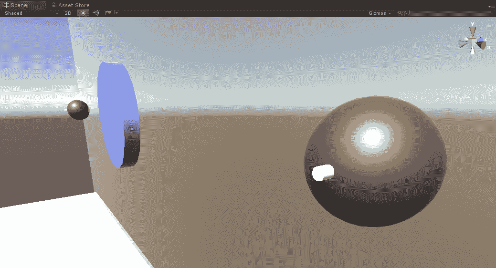

游戏控制器脚本与我们的 BallGame 脚本类似，但足够不同，我们应该创建一个新的：

1.  在层次结构中，选择 `GameController` 并禁用或删除 `BallGame` 组件

1.  创建一个名为 `ShooterBallGame` 的新 C# 脚本并打开它进行编辑

将 `ShooterBallGame` 脚本编写如下。我们给它两个发射器，脚本在它们之间交替以向 `shootAt` 位置射击球体。每次发射球体时都会播放音效。首先，让我们定义我们将需要的公共和私有变量：

```cs
using UnityEngine;

[RequireComponent(typeof(ObjectPooler))]
public class ShooterBallGame : MonoBehaviour
{
    public Transform shootAt;
    public Transform shooter0;
    public Transform shooter1;
    public float speed = 5.0f;
    public float interval = 3f;

    private float nextBallTime = 0f;
    private ObjectPooler pool;
    private GameObject activeBall;
    private int shooterId = 0;
    private Transform shooter;

    private AudioSource soundEffect;
}
```

`Start` 函数初始化我们在运行时获取的变量：

```cs
   void Start()
    {
        if (shootAt == null)
        {
            shootAt = Camera.main.transform;
        }
        soundEffect = GetComponent<AudioSource>();
        pool = GetComponent<ObjectPooler>();
        if (pool == null)
        {
            Debug.LogError("BallGame requires ObjectPooler component");
        }
    }
```

并且 `Update` 函数会在指定的时间间隔内射击球体，在两个发射器位置之间交替：

```cs
    void Update()
    {
        if (Time.time > nextBallTime)
        {
            if (shooterId == 0)
            {
                shooterId = 1;
                shooter = shooter1;
            }
            else
            {
                shooterId = 0;
                shooter = shooter0;
            }

            nextBallTime = Time.time + interval;
            ShootBall();
        } 
    }
```

最后，这是我们提取到其自身函数中的 `ShootBall()` 代码：

```cs
    private void ShootBall()
    {
        soundEffect.Play();
        activeBall = pool.GetPooledObject();
        activeBall.transform.position = shooter.position;
        activeBall.transform.rotation = Quaternion.identity;
        shooter.transform.LookAt(shootAt);
        activeBall.GetComponent<Rigidbody>().velocity = shooter.forward * speed;
        activeBall.GetComponent<Rigidbody>().angularVelocity = Vector3.zero;
        activeBall.SetActive(true);
    }
```

`ShootBall` 从对象池中获取一个新的球体，并根据发射器位置初始化其位置。然后，它将发射器旋转到指向 `shootAt` 位置（使用 `transform.LookAt`），并使用其前向向量定义球体的 RigidBody 速度向量。

在 Unity 中，我们需要填充公共变量槽位：

1.  将 `Shooter` 对象（`TargetWall` 的子对象）拖到 `Shooter 0` 槽位上

1.  将另一个 `Shooter` 对象拖到 `Shooter 1` 槽位上

目前先保留 `Shoot At` 槽位为空，这样它将默认为玩家的实时头部位置。

按下播放。*还不错*。球太大太重了。让我们创建具有不同属性的新的球体预制件：

1.  将 `BouncyBall` 预制件从 `Project` 文件夹拖到层次结构中

1.  将其重命名为 `ShooterBall`

1.  将其缩放设置为 (`0.25`, `0.25`, `0.25`)

1.  取消选中使用重力复选框（或者，你可以玩一下它的 RigidBody 质量属性）

1.  将 `ShooterBall` 从层次结构拖到你的 `Prefabs` 文件夹中，为它创建一个新的预制件

1.  从层次结构中删除 `ShooterBall`

1.  在层次结构中选择 `GameController`，并将 ShooterBall 拖到其 Object Pooler 预制件槽位上

现在，对象池将实例化一组新的预制对象。

按下播放。*哦，是的!* 现在游戏变得更加具有挑战性。同时，尝试修改间隔和速度设置。

球体总是朝向你的头部射击，尤其是在 Daydream 上，你只有有限的手部控制，这可能会有些尴尬。你可以调整场景，例如，将 `ShootAt` 空游戏对象定位为 `MeMyselfEye` 的子对象，位置为 (`0`, `0.9`, `0.6`), 并将其设置到 `GameController` 的 `ShootAt` 槽位中。

一些明显的游戏玩法改进想法应该会浮现在脑海中。你可以制作一个移动的目标，可能是可预测的振荡运动，或者完全随机。你可以在球体速度方向和速度或射击间隔之间引入一些随机变化。你可以使用 `OnTriggerEnter` 在目标上记分。你可以取消资格在地板上首先弹跳的银行球（使用地面平面的 `OnTriggerEnter`）。

# 增强场景效果

实现了基本机制后，我们现在可以给它添加活力！我最喜欢的 VR 游戏之一是流行的音频盾牌([`audio-shield.com/`](http://audio-shield.com/))。我们几乎完成了自己的构建，我们只需要添加火焰球、引人入胜的环境场景，以及将火焰球射击与音乐同步！

游戏设计中的术语*juice it*由 Jonasson 和 Purho 在 2012 年的演讲中普及，演讲主题为*Juice it or lose it - Martin Jonasson & Petri Purho 的演讲*([`www.youtube.com/watch?v=Fy0aCDmgnxg`](https://www.youtube.com/watch?v=Fy0aCDmgnxg))。 <q class="calibre65">一个充满活力的游戏感觉充满生机，对你的每一个动作都做出反应，有大量的连锁动作和反应，而用户输入却很少。</q>

# 火球

在上一节中，我们禁用了射击球上的重力使用。我们这样做是为了预期将球从弹跳球变为火焰球。现在让我们实现这个魔法。我们将使用粒子系统来渲染它，而不是网格几何体。

将粒子效果添加到 Unity 项目中有许多方法。如果你还记得，在第四章“基于注视的控制”中，我们从`Unity 标准资产`包中添加了水龙带、火花发射器和爆炸效果。在这里，我们将构建自己的，但使用包中提供的材料之一，`ParticleFireCloud`。在 Unity 资产商店中，你还可以找到许多粒子效果和系统增强的提供。

首先，创建一个新的从 ShooterBall 派生的预制件，命名为`FireBall`，如下所示：

1.  从“项目”文件夹中将`ShooterBall`预制件的副本拖动到层次结构中

1.  将其重命名为 FireBall

1.  将 FireBall 拖动到“项目”*预制件*文件夹中创建一个新的预制件

1.  从层次结构中选择`GameController`

1.  从“项目”*预制件*文件夹中将`FireBall`预制件拖动到对象池器预制件槽中

好的，现在我们可以添加粒子系统：

1.  从层次结构中选择 FireBall

1.  禁用其网格渲染器，因为我们将以粒子形式渲染它

1.  右键单击 FireBall 并选择创建 | 效果 | 粒子系统

1.  将其重命名为 Fireball Particle System

在处理粒子时有很多细节，很多选项和配置参数。随着我们逐步实现火焰球的快速实现，注意我们逐个更改时每个更改的效果。请注意，你可以在场景窗口中预览粒子效果。请随意进行实验。

1.  首先，在粒子系统检查器的底部，找到渲染器面板。在其材质槽中，点击甜甜圈图标并选择 ParticleFireCloud 材质（位于`Standard Assets/Particle Systems/Materials`。如果不存在，你可能需要使用“资产 | 导入包 | 粒子系统”导入它）。

1.  在粒子系统检查器的顶部附近，找到形状面板。选择形状：球体，并将其半径设置为`0.1`。

1.  在发射面板中，将时间速率设置为`15`。

1.  在检查器的顶部，设置持续时间：`2.00`。

1.  起始生命周期：`1`。

1.  起始速度：`0`。

1.  起始大小：`0.5`。

1.  对于起始旋转，点击右侧的选择器图标，并选择“在两个曲线之间随机”。然后点击槽位，滚动到检查器底部的曲线编辑器。如果你不熟悉，编辑器可能需要一些时间来适应。选择从`180`（图表顶部）到`-180`（图表底部）的全范围值，如图所示：

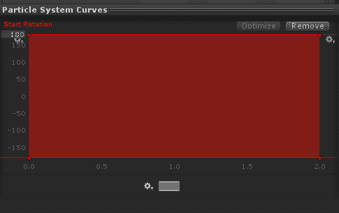

1.  启用生命周期内颜色，并点击槽位以打开其渐变编辑器。我们想要调整 Alpha 曲线，使其在位置`0%`时 Alpha 为`0`，然后在`10%`时变为 Alpha `255`，然后随着时间的推移逐渐淡出到`100%`的 Alpha `0`。编辑器如图所示：

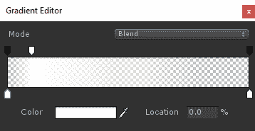

1.  设置起始颜色，作为渐变（右侧选择器），然后选择一系列颜色，如黄色到红色，如图所示：

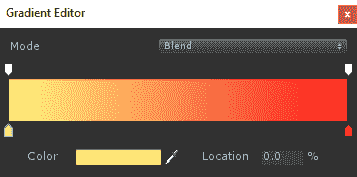

1.  接下来，设置生命周期内的速度，使用“在两个曲线之间随机”。对于每个 X、Y、Z，使用曲线编辑器设置最大和最小值分别为`0.05`和`-0.05`。（你可以通过点击轴标签并输入数字来修改图表的垂直轴；例如，你可以通过右键点击 Z 槽位，选择复制，然后右键点击 Y 槽位并选择粘贴来复制曲线。）

在这一点上，我们应该调整火球，使其大小大约与我们的原始 BouncyBall 相同。检查方法如下：

1.  重新启用火球的网格渲染器。通过更改渲染器的最大粒子大小到`0.1`，或使用变换缩放来调整粒子系统。

1.  通过在检查器顶部选择应用来保存你的工作，以更新你的预制件。

现在当你按下播放时，射手将发射火球。*哇！*

如果你想在火球上添加一些闪光效果，我们可以通过轨迹面板来实现：

1.  启用轨迹面板

1.  可能会弹出警告提示你向渲染器添加轨迹材质。

1.  在渲染器面板中，选择轨迹材质槽位上的甜甜圈图标，并选择我们用于主火球的 ParticleFireCloud。

说到轨迹，如果你也想在火球上实现轨迹效果，也有几种方法可以做到。一个快速的解决方案是复制我们的火球粒子系统，并将其修改为使用圆锥形状而不是球体，如下所示：

1.  在层次结构中选择火球粒子系统。

1.  右键点击以复制，将复制品移动为火球粒子系统的子项，并命名为轨迹粒子系统。

1.  将其形状更改为圆锥。

1.  改变其生命周期内的速度。Z 曲线需要更高的值范围，例如`0.75`到`0.25`。

1.  X 和 Y 速度曲线应该更小，以产生一些变化，例如`0.2`到`-0.2`。

1.  设置生命周期内大小范围到`1.0`到`0.5`。

1.  在其变换中，将位置设置为(`0`, `0`, `0.5`)以给它一个额外的尾巴。

这里是游戏窗口中击打即将到来的火球的截图！

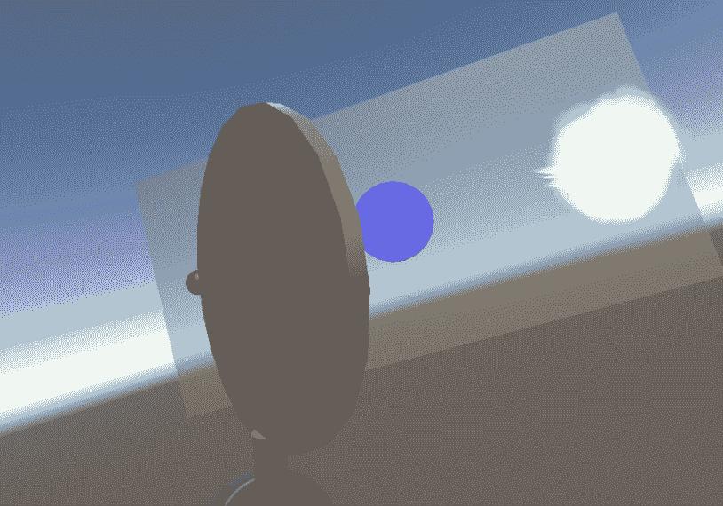

特别感谢 Tyler Wissler 的教学视频 *How To: Basic Fireballs in Unity*（2014 年 6 月），这对开发这个主题非常有帮助 ([`www.youtube.com/watch?v=OWShSR6Tr50`](https://www.youtube.com/watch?v=OWShSR6Tr50))。

# 骷髅环境

为了让我们的游戏更加精彩，我们应该找到一个令人兴奋的环境和场景。在资产商店中搜索，我发现了一个免费的资产 *Skull Platform* ([`assetstore.unity.com/packages/3d/props/skull-platform-105664`](https://assetstore.unity.com/packages/3d/props/skull-platform-105664))。你也可以使用它，或者寻找其他的东西。

假设你已经找到了并安装了 Skull Platform 资产，我们将将其添加到我们的场景中。首先，让我们将目标渲染成骷髅：

1.  将 Platform_Skull_o1 作为目标（在 `TargetWall` 下）的子对象。

1.  设置其变换旋转 (`0`, `0`, `180`) 和缩放 (`0.3`, `0.3`, `0.3`)。

1.  选择目标并禁用其网格渲染器。

1.  此外，创建一个新的聚光灯（创建 | 光 | 聚光灯），使其照在骷髅上。作为目标的子对象，我使用了以下设置：位置 (`-1`, `-30`, `-0.6`), 旋转 (`-60`, `60`, `0`), 范围：`10`，聚光灯角度：`30`，颜色：`#FFE5D4FF`，强度：`3`。

接下来，让我们将大平台作为墙壁背后的背景添加。最快的方法是合并他们提供的 Demoscene：

1.  在层次结构根目录下创建一个空的游戏对象，命名为 SkullPlatform，重置其变换。

1.  将 Skull Platform 的演示场景副本 Platform（`Assets/Skull Platform/Demo/` 文件夹）拖动到层次结构中。

1.  选择演示的场景、照明和粒子对象，并将它们拖动到 SkullPlatform 的子对象。

1.  现在我们已经拥有了想要的资产，在层次结构中右键单击平台场景，选择移除场景。当提示时，选择不保存。

1.  将 SkullPlatform 位置设置为 (`0`, `-1.5`, `0`)，使其刚好在地面平面下方。

1.  选择 GroundPlane 并禁用其网格渲染器。

现在，我们将设置场景环境照明：

1.  从场景层次结构中删除方向光。

1.  打开照明窗口。如果它还不是你的编辑器中的一个标签，请使用窗口 | 照明 | 设置并将其停靠在检查器旁边。

1.  将其天空盒材质设置为 Sky（在 Skull Platform 包中提供）。

1.  在环境照明部分，将源：颜色设置为 `#141415`。

1.  检查雾选项（在其他设置中），颜色为 `#8194A1FF`，模式：指数，密度为 0.`03`。

这里是带有骷髅平台环境和照明的场景截图。*太棒了*！

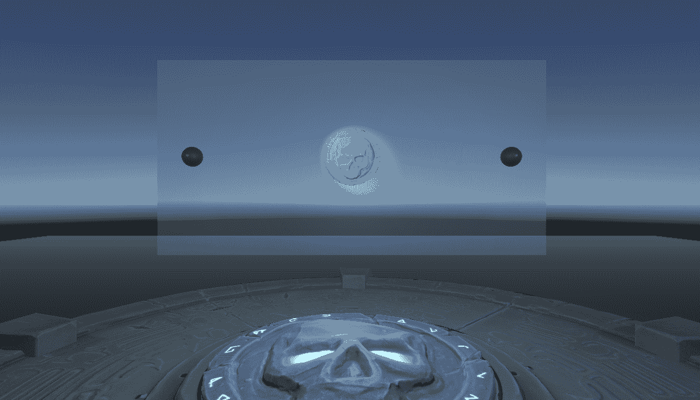

# 音频同步

我们几乎完成了构建我们自己的音频盾版本，我们只需要添加同步火球射击与音乐！

Unity 提供了一个 API 用于采样音频源数据，包括`AudioSource.GetSpectrumData`和`GetOutputData`。从这些数据中提取音乐的实际节拍并不简单，需要大量的数学知识和对音乐编码工作方式的一些理解。

幸运的是，我们找到了一个开源脚本，名为 Unity-Beat-Detection ([`github.com/allanpichardo/Unity-Beat-Detection`](https://github.com/allanpichardo/Unity-Beat-Detection))，它可以为我们完成这项工作。它方便地提供了`onBeat`的 Unity 事件，我们将使用它。（它还提供了`onSpectrum`事件，每帧提供音乐频率带，你也可以使用它，例如，根据频率带改变火球或其他东西的颜色。）

1.  从 GitHub 下载`AudioProcessor.cs`脚本（我们已提供与本书文件一起的副本，以方便您使用）

1.  将文件拖入你的`Scripts`文件夹（或使用 Assets | Import New Asset）

对于你的音乐，找到任何有良好节拍的 MP3 或 WAV 文件，并将其导入到你的项目中。我们在 SoundCloud NoCopyrightSounds 轨道 ([`soundcloud.com/nocopyrightsounds/tracks`](https://soundcloud.com/nocopyrightsounds/tracks)) 中找到了一个名为*Third Prototype - Dancefloor* ([`ncs.io/DancefloorNS`](http://ncs.io/DancefloorNS))。

1.  在项目窗口中，创建一个名为 Audio 的文件夹

1.  将你的音乐文件拖到音频文件夹中（或使用 Assets | Import New Asset）

要实现这个功能，我们将创建一个 MusicController，然后修改`ShooterBallGame`脚本以使用其节拍发射火球。在 Unity 中，执行以下操作：

1.  在层次结构中，创建一个空的游戏对象并命名为 MusicController

1.  将 AudioProcessor 脚本作为组件添加

1.  注意它还会自动添加一个 Audio Source 组件

1.  将你导入的音乐文件拖到 AudioClip 槽中

1.  将 MusicController 本身拖到 Audio Source 槽中

注意音频处理中的 G Threshold 参数。你可以使用它来调整节拍识别算法的灵敏度。

现在，按照以下方式更新`GameController`上的`ShooterBallGame`脚本：

```cs
    void Start()
    {
        if (shootAt == null)
            shootAt = Camera.main.transform;
        pool = GetComponent<ObjectPooler>();

        AudioProcessor processor = FindObjectOfType<AudioProcessor>();
        processor.onBeat.AddListener(onBeatDetected);
    }

    void onBeatDetected()
    {
        if (Random.value > 0.5f)
        {
            shooterId = 1;
            shooter = shooter1;
        } else
        {
            shooterId = 0;
            shooter = shooter0;
        }
        ShootBall();
    }
```

它与上一个版本非常相似，但不是从`Update`中调用`ShootBall`，而是根据时间间隔从`onBeatDetected`中调用它。在`Start`中，我们将`onBeatDetected`添加为`onBeat`事件监听器。

此外，我们决定随机选择使用哪种射击方式，而不是简单地来回交替。

按下播放并开始游戏！*哇哦，*我们有了自己的音频盾牌版本！以下是活跃游戏截图：

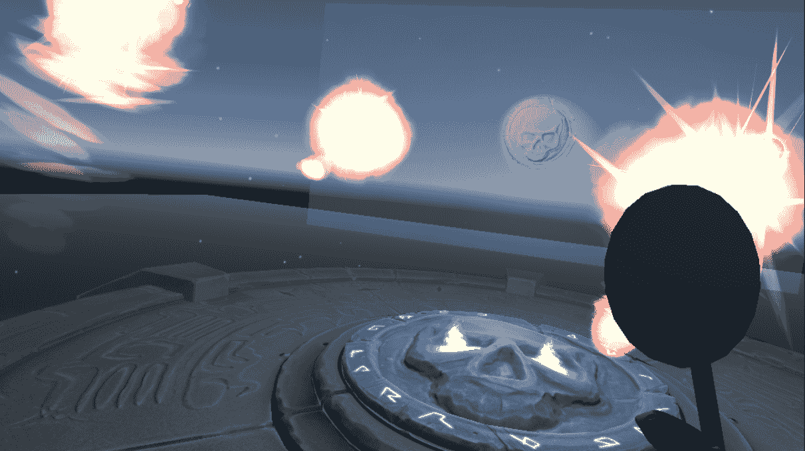

# 摘要

在本章中，我们构建了一个使用 Unity 物理引擎和其他一些功能的游戏。首先，我们用通俗易懂的语言解释了 Rigidbody、Collider 和 Physic Materials 之间的关系，并探讨了物理引擎如何使用这些来决定场景中物体的速度和碰撞。

然后，我们考虑了游戏对象的整个生命周期，并实现了一个对象池器，它有助于避免内存碎片化和垃圾回收，这些问题可能导致性能问题和 VR 体验不适。

利用我们所学的知识，我们实现了几个球类游戏的变体，首先是用头部瞄准目标，然后使用手柄。我们修改了游戏，使其不是从上方使用重力来发球，而是从前面发射并应用一个速度向量。最后，我们增强了我们的游戏，将弹跳球变成了火球，添加了一个酷炫的关卡环境，并将火球与音乐节拍同步。最终，我们为制作我们自己的音频盾 VR 游戏版本迈出了良好的开端。

在下一章中，我们将看到另一个更实用的虚拟交互空间示例。我们将构建一个互动艺术画廊空间，你可以在其中移动并查询艺术品的详细信息。
