# 探索交互式空间

在本章中，我们将更深入地探讨关卡设计、建模、渲染、传送和动画；实现一个可以在 VR 中体验的交互式空间。场景是一个照片画廊，你设计一个简单的平面图，并使用 Blender 将其垂直拉伸成墙壁。使用你自己的照片。你可以通过传送或动画乘坐来在空间中移动。

在本章中，我们将讨论以下主题：

+   使用 Blender 和 Unity 构建简单的艺术画廊

+   与对象和元数据交互

+   数据结构、列表和可脚本化对象

+   使用传送

+   创建动画导览

注意，本章中的项目是独立的，并不直接依赖于本书其他章节的项目。如果你决定跳过其中任何部分或未保存你的工作，那都是可以的。

# 使用 Blender 进行关卡设计

对于这个项目，我们将设计一个艺术画廊布局。我们只需要一个简单的布局，一个大约 24 英尺乘以 36 英尺的小型艺术画廊展览室。这个房间非常简单，实际上，它很容易在 Unity 中使用 3D 立方体原语构建，但我们将利用这个机会更多地使用 Blender，因为我们已经在第二章，*内容、对象和比例*中介绍了它，保持其最小化和指导性。如果你愿意，你可以跳过这一部分，使用 Unity 立方体构建地板和墙壁。或者，使用本章提供的`Gallery.blend`文件。

# 定义墙壁

首先，在一张纸上绘制一个简单的平面图或使用绘图应用程序。我的只是一个开阔的空间，有两个入口和内部墙壁来展示艺术品（`Gallery-floorplan.jpg`），如下面的图像所示：

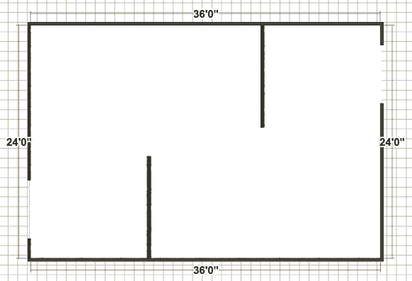

现在，打开 Blender。我们将使用从简单对象（平面）开始，然后拉伸它以制作每个墙壁段落的常用技术。为了完成这个任务，请执行以下步骤：

1.  从一个空场景开始，按 A 键选择所有对象，然后按 X 键删除。

1.  通过按 N 键打开属性面板来添加平面图图像作为参考。在背景图像面板中，选择添加图像，点击打开并选择你的图像（`Gallery-floorplan.jpg`）。

    根据你的平面图参考图像的大小和比例，你需要选择一个比例因子，以确保它在 Blender 世界坐标空间中是正确的。对我来说，`6.25`的比例是合适的。实际上，最重要的是图上特征的相对比例，因为我们总可以在 Unity 的导入设置中调整比例，甚至在场景视图中直接调整。

1.  在背景图像面板中，将大小设置为`6.25`。这个面板中大小字段被高亮显示，如下面的截图所示：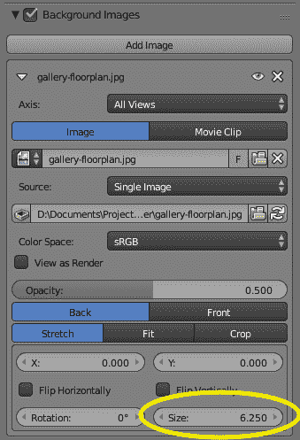

1.  通过按数字键盘上的 7（或导航到视图|顶部）进入从上到下的正交视图，并通过按 5（或导航到视图|透视/正交）进入正交视图。请注意，只有当它在顶部正交视图中时，背景图像才会被绘制。

1.  现在，我们在房间的角落处制作一个小正方形，将其拉伸成墙壁。按*Shift* + *A*添加一个面板，并选择平面。然后，按*Tab*进入编辑模式。按*Z*在实体视图和线框视图之间切换。按*G*将其拖入角落，点击*Enter*确认。按*S*将其缩放到适合墙角的宽度，如图所示（你可能还记得，你可以使用鼠标滚轮来缩放，*Shift*和点击中间鼠标按钮来平移）：

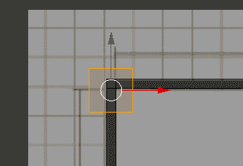

1.  将角落拉伸以形成外墙。进入边缘选择模式（通过以下截图中的图标），按*A*取消选择所有内容，然后右键单击要拉伸的边缘。按*E*开始拉伸，按 X 或 Y 将其约束到该轴，然后按*Enter*完成拉伸到所需位置：

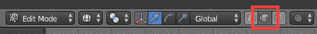

1.  对每面外墙重复之前的步骤。在角落处创建一个小正方形，以便可以沿垂直方向拉伸。为门留出空隙。（你可能还记得，如果你需要修改现有的边缘，右键单击选择它，使用*Shift*和右键单击来选择多个，然后使用*G*移动。你也可以复制选定的项目。）此外，你还可以使用*Shift* + *D*在对象模式下进行复制。

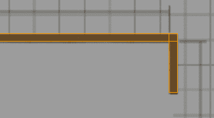

1.  要从中间拉伸出一个面，我们需要添加一个*边缘环*。将鼠标移到面上，按*Ctrl* + *R*并左键单击创建切割。滑动鼠标定位它，然后再次左键单击确认。重复这些步骤以墙宽为宽度（在外墙上做一个正方形切割）。选择边缘段并按*E*将其拉伸到房间内：

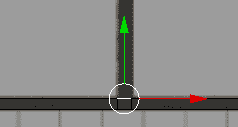

1.  一旦完成平面图，我们就可以沿*z*轴拉伸以创建墙壁。按*5*从正交视图切换到透视视图。使用中间鼠标点击并倾斜。按*A*选择所有内容。使用*E*拉伸。开始使用鼠标拉伸，按*Z*约束，然后左键单击确认。

1.  将模型保存为名为`gallery.blend`的文件：

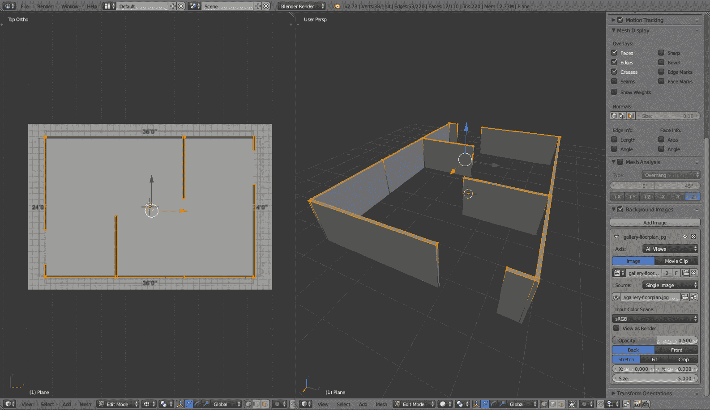

# 添加天花板

现在，添加一个带有两个天窗的天花板。天花板将只是一个由单个立方体构建的平板。让我们看看添加天花板的步骤：

1.  使用*Tab*返回对象模式

1.  使用*Shift* + *A*添加一个立方体，并选择立方体

1.  使用*G*和鼠标（*Alt* + *G*重置所有变换）将其定位在中心

1.  沿*x*和*y*轴缩放，使其大小与房间相同，使用*S* + *X*和*S* + *Y*）

1.  使用*1*切换到前视图，使用*S* + *Z*将其缩放以使其变平，并使用*G* + *Z*将其移动到墙的顶部）

天窗将通过使用另一个立方体作为修饰符从天花板上切割出孔，如图所示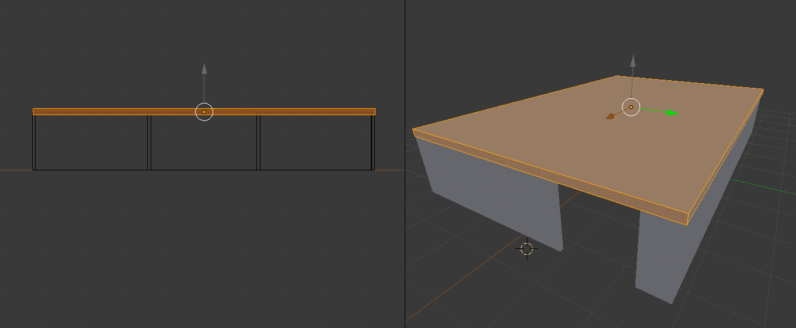


1.  使用*Shift* + *A*添加一个立方体，将其缩放到所需的大小，并将其移动到你想放置天窗的位置。

1.  将立方体的*z*轴定位，使其穿过天花板板。

1.  通过按*Shift* + *D*来复制立方体，并将其移动到另一个天窗的位置，如图所示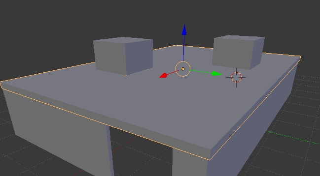

1.  右键单击以选择天花板板。

1.  在最右侧的属性编辑器面板中，选择扳手图标。

1.  然后，导航到“添加修饰符”|“布尔”并对于操作选项，选择“差集”。对于对象选项，选择第一个立方体（`Cube.001`）：

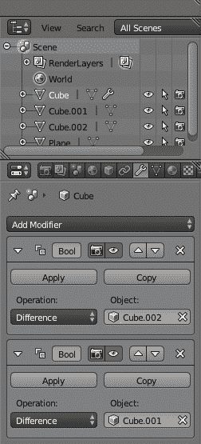

1.  点击应用以使操作永久。然后，删除立方体（选择它并按 X）。

1.  重复此过程，为第二个立方体添加另一个布尔修饰符。

如果遇到困难，我已经包括了这个书的完成模型的副本。这个模型很简单。你可以仅使用 Unity 立方体来构建它。当然，还可以做更多的事情来使这个模型更加逼真的建筑模型，但我们将继续前进：

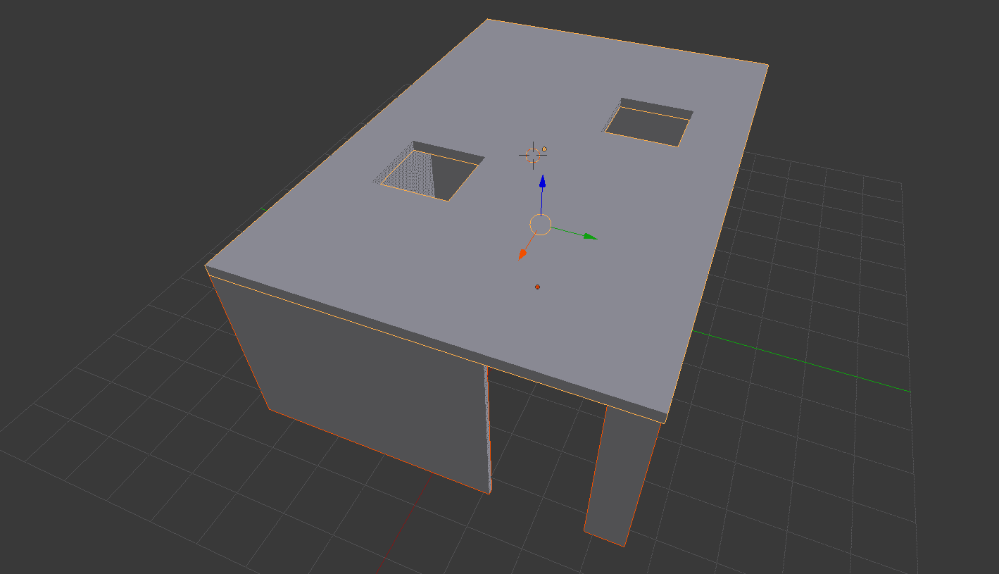

# 在 Unity 中组装场景

现在，我们可以在 Unity 中使用画廊房间模型，并添加带有天窗的地板和天花板。我们将给墙壁应用纹理并添加照明。

我们可以按照以下方式启动一个新的 Unity 场景：

1.  通过导航到“文件”|“新建场景”来创建一个新的场景。然后，选择“另存为场景”并将其命名为`Gallery`。

1.  将`MeMyselfEye`预制体的副本拖动到层次结构中。

1.  从层次结构中删除默认的主摄像机。

# 画廊房间级别

首先，我们将通过以下步骤构建艺术画廊的房间结构：

1.  通过导航到“游戏对象”|“3D 对象”|“平面”创建一个地板平面。重置其变换选项并将其重命名为`Floor`。

1.  为地板创建材质并将其染成棕色。创建 | 材质，重命名它，设置其 Albedo（`70`, `25`, `5`），并将材质拖到`Floor`上。

1.  我们的房间大小为 24 英尺乘以 36 英尺，换算成米大约是 7.3 乘以 11。Unity 平面是 10 单位平方。因此，将其缩放为(`0.73`, `2`, `1.1`)。

1.  导入画廊模型（例如，`Gallery.blend`）。从项目资产中拖动一个副本到场景中。重置其变换选项。

1.  根据需要手动旋转和/或缩放它以适应地板，例如（我的适合，但它的旋转 Y 值需要设置为`90`）。如果首先将场景视图更改为顶等距视图，可能会有所帮助。

1.  在墙上添加一个碰撞器是个好主意，这样角色就不会直接穿过了。为了实现这一点，导航到“添加组件”|“物理”|“网格碰撞器”。

注意，当我们从 Blender 导入时，正如我们定义的那样，画廊中的墙壁和天花板是分开的对象。创建了一个材质（可能命名为“未命名”），它有一个中性的灰色 Albedo（`204`，`204`，`204`）。我喜欢这种颜色用于墙壁，但我为天花板制作了一个新的材质，全部为白色（`255`，`255`，`255`）。

对于一个好的默认 Skybox，我们推荐**Wispy Skybox**，这是资源商店上的一个免费包（[`assetstore.unity.com/packages/2d/textures-materials/sky/wispy-skybox-21737`](https://assetstore.unity.com/packages/2d/textures-materials/sky/wispy-skybox-21737)）。如果您想使用它，请现在就下载并导入到您的项目中。

接下来，添加一些天空和阳光，如下所示：

1.  如果在你的 Unity 编辑器中看不到“照明”选项卡，请导航到窗口 | 照明 | 设置

1.  在照明面板中，选择场景选项卡

1.  对于阳光，在照明场景面板中，在太阳输入处，从层次结构中选择（默认）方向光并将其拖放到太阳光源槽中

1.  对于天空，如果您导入了 Wispy Skybox（见前文），则在照明场景选项卡中，选择 Skybox 材质槽上的甜甜圈图标并选择名为`WispySkyboxMat`的材质

由于我们选择了“方向光”作为光源，你可以通过选择方向光并修改其旋转来调整角度，在场景窗口中的 gizmo 或直接在检查器中，可能是一个与您选择的 Skybox 一致的旋转（例如旋转`60`，`175`，`0`）。

你可以考虑为地板和其他表面使用纹理材质。例如，在资源商店中搜索“地板材质”。这里有免费的包和付费的包。

# 艺术品装置

现在，我们可以规划艺术展览。我们将创建一个带有画框、照明、定位、艺术家信息和传送观看位置的重复使用艺术品装置预制件。然后，我们将艺术挂在画廊的墙上。稍后，我们将应用实际图像。艺术品装置将包括一个画框（立方体）、一个照片平面（四边形）和一盏聚光灯，所有这些都相对于艺术品在墙上的放置。我们将在场景内创建第一个，将其保存为`Prefab`，然后在画廊的墙上放置副本。我建议在场景视图中这样做。让我们开始吧：

1.  通过导航到 GameObject | 创建空对象来创建一个容器对象。将其命名为`ArtworkRig`。

1.  创建框架。选择`ArtworkRig`后，右键单击并导航到 GameObject | 3D Object | Cube。将其命名为`ArtFrame`。在检查器中，将其 Scale Z 设置为`0.05`。假设一个`3:4`的宽高比。因此，将其 Scale Y 值设置为`0.75`。

1.  将支架定位在墙上（原始楼层平面右上角面向入口的那面墙）。隐藏`Gallery`对象的子对象天花板（取消勾选其启用复选框选项）可能会有所帮助。然后，使用场景面板右上角的场景视图工具将场景视图更改为顶视图和等轴视图。点击绿色 Y 图标进行顶视图，点击中间的方块图标进行等轴视图。

1.  选择`ArtworkRig`，确保翻译工具是激活的（位于左上角图标工具栏中的第二个图标），并使用*x*和*z*轴箭头定位它。务必选择并移动`ArtworkRig`。将框架位置保持在(`0`,`0`,`0`)。将高度设置为眼睛水平(`Y=1.4`)。对我有效的是变换位置值(`2`, `1.4`, `-1.82`)，并且没有旋转(`0`,`0`,`0`)，如图所示。

1.  将框架设置为黑色。导航到资产 | 创建 | 材质，将其命名为`FrameMaterial`，并将其 Albedo 颜色设置为黑色。然后在层次结构中选择框架选项，并将`FrameMaterial`材质拖放到`ArtFrame`上。

1.  创建图像占位符。在层次结构中选择`ArtFrame`，右键单击并导航到 3D 对象 | 四边形。将其命名为`Image`。将其定位在框架前方，使其可见；将位置设置为(`0`, `0`, `-0.8`)，并调整缩放使其略小于框架，将缩放设置为(`0.9`, `0.9`, `1`)。

1.  为了更好地欣赏当前的缩放和眼睛水平，尝试在场景中插入 Ethan 的一个副本：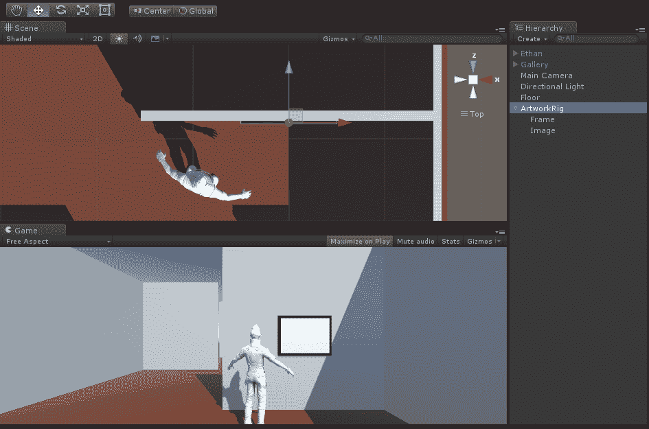

接下来，我们将向支架添加一个聚光灯，如下所示：

1.  首先，通过勾选画廊子对象的启用复选框选项来将天花板放回。

1.  在层次结构中选择`ArtworkRig`，右键单击，导航到光 | 聚光灯，并将其定位在离墙 1.5 米远（Z=`-1.5`）且靠近天花板的位置。确切的高度并不重要，因为我们实际上没有灯具。我们只有一个 Vector3 位置作为光源。我将位置设置为(`0`, `1.5`, `-1`)。

1.  现在，调整`Spotlight`值，使其适当地照亮艺术品。我将旋转 X 设置为`2`，并根据您的喜好调整光参数，例如将范围设置为`5`，聚光灯角度设置为`45`，强度设置为`3`。结果如图所示：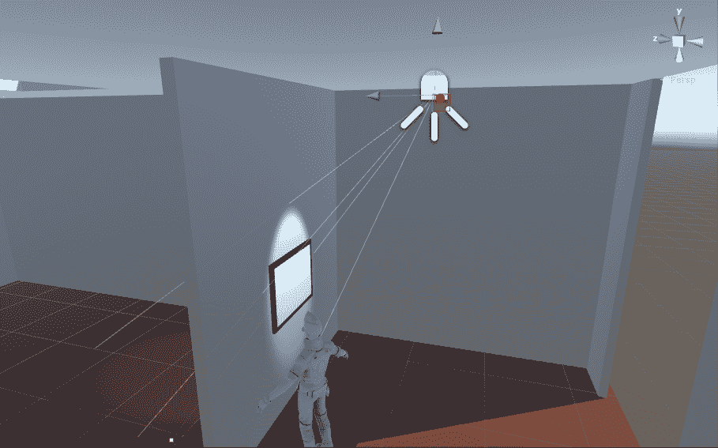

1.  注意聚光灯正在穿过墙壁，照亮另一侧的地面。我们不想这样。选择聚光灯，通过阴影类型：软阴影启用阴影。

1.  要将支架作为预制件保存，请在层次结构中选择`ArtworkRig`，并将其拖动到您的项目资产预制件文件夹中。

了解您的照明设置可能很重要。例如，如果您看到物体中的孔或阴影，尝试将方向光的法线偏差滑到`0`并将偏差设置为低值，如`0.1`。有关阴影和偏差属性的更多信息，请参阅[`docs.unity3d.com/Manual/ShadowOverview.html`](https://docs.unity3d.com/Manual/ShadowOverview.html)。

# 展览计划

下一步是在我们想要显示图像的每面墙上复制`ArtworkRig`。根据需要定位和旋转。如果您遵循以下图中所示的计划，您的展览将显示十个图像，用星号表示：

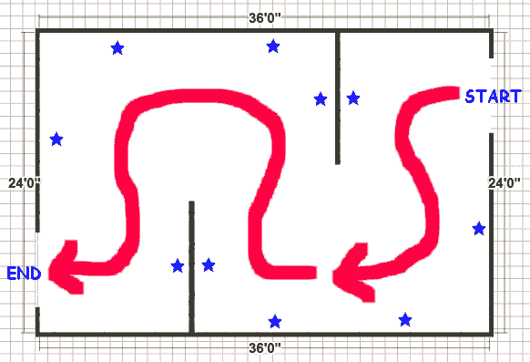

以下是在每面墙上复制`ArtworkRig`的步骤：

1.  如前所述，隐藏天花板并更改场景视图面板到顶视图和等距视图可能更容易。

1.  在场景视图面板的左上角，更改`Transform Gizmo`切换，以便工具句柄放置在轴点而不是中心。

1.  创建一个新的空游戏对象，重置其变换，并将其命名为`Artworks`。

1.  将现有的`ArtworkRig`移动，使其成为`Artworks`的子对象。

对于每个位置，按照以下方式在画廊中放置一件艺术品：

1.  在层次结构中选择现有的`ArtworkRig`

1.  通过右键单击复制或按*Ctrl* + *D*来复制`Artworkrig`。

1.  通过将旋转 Y 设置为`0`、`90`、`180`或`-90`来旋转装置，使其朝向正确的方向。

1.  将装置放置在墙上

以下表格提供了适用于我的画廊的设置（并假设您的`Artworks`变换已重置到原点）：

|  | 位置 X | 位置 Z | 旋转 Y |
| --- | --- | --- | --- |
| 0 | 2 | -1.8 | 0 |
| 1 | -1.25 | -5.28 | -180 |
| 2 | -3.45 | -3.5 | -90 |
| 3 | -3.45 | -0.7 | -90 |
| 4 | -2 | 1.6 | 0 |
| 5 | 2 | -1.7 | 180 |
| 6 | 3.5 | 0 | 90 |
| 7 | 3.5 | 3.5 | 90 |
| 8 | 1.25 | 5.15 | 0 |
| 9 | -2 | 1.7 | 180 |

注意，对象列表的顺序与我们将在场景动画中穿过的顺序相同。将它们作为`Artworks`的子对象，按照此顺序在层次结构中放置。

# 向画廊添加图片

请从您的照片库中找到 10 张您最喜欢的照片以供使用，并将它们添加到名为`Photos`的新项目资产文件夹中。我们将编写一个脚本，该脚本将根据图像列表将它们添加到场景中的每个`ArtworkRigs`：

1.  要创建照片文件夹，导航到资产 | 创建 | 文件夹，并将其命名为`Photos`。

1.  通过从文件资源管理器拖放 10 张照片到您刚刚创建的`Photos`文件夹（或导航到资产 | 导入新资产...）来导入 10 张照片。

现在，我们将编写一个脚本来填充`Artworks Images`：

1.  在层次结构中，选择`Artworks`。然后在检查器中，导航到添加组件 | 新脚本，并将其命名为`PopulateArtFrames`。

1.  打开新脚本进行编辑。

按照以下方式编写`PopulateArtFrames.cs`的代码：

```cs
using UnityEngine;

public class PopulateArtFrames : MonoBehaviour
{
    public Texture[] images;

    void Start()
    {
        int imageIndex = 0;
        foreach (Transform artwork in transform)
        {
            GameObject art = artwork.Find("ArtFrame/Image").gameObject;
            Renderer rend = art.GetComponent<Renderer>();
            Material material = rend.material;
            material.mainTexture = images[imageIndex];
            imageIndex++;
            if (imageIndex == images.Length)
                break;
        }
    }
}
```

这里发生了什么？首先，我们声明一个名为`images`的公共`Textures`数组。您将看到，这将出现在检查器中，我们可以指定要包含在场景中的哪些照片。

此脚本附加到 Artworks 容器对象上，该对象作为子对象包含 ArtworkRigs。当应用启动时，在`Start()`中，我们遍历所有`theArtworkRigs`，找到图像对象。对于每个图像，我们获取其渲染器组件的材质，并分配一个新的纹理，即列表中的下一张图像。我们使用`imageIndex`变量遍历列表，并在用完图像或 ArtworkRigs 时停止：

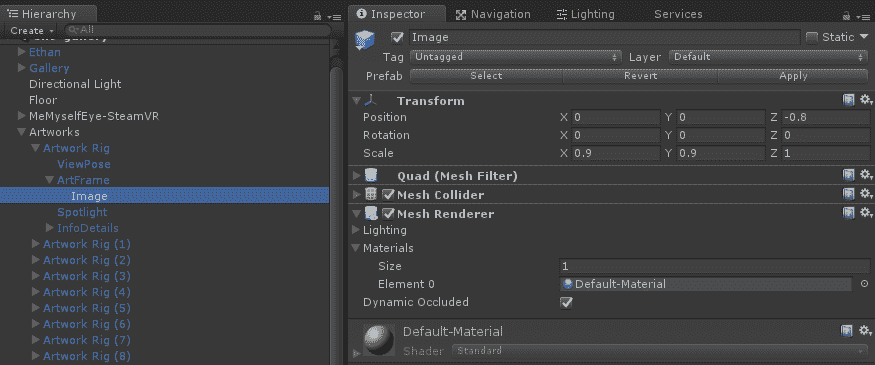

聪明的读者可能会想，既然所有的 ArtworkRigs 都使用相同的材质，即默认材质，那么为什么改变任何 ArtworkRig 图像上的材质不会改变所有图像呢？实际上，当你在运行时修改其纹理（或其他属性）时，Unity 会通过克隆材质到一个新的唯一材质来处理这个问题。因此，每个 ArtworkRig 的图像都获得自己的材质和自己的纹理，因此，我们画廊中的每幅画都是不同的。

为了完成这个任务，让我们执行以下步骤：

1.  保存脚本并返回 Unity 编辑器

1.  在层次结构中选择`Artworks`，在检查器中展开 Populate Art Frames 脚本组件，并展开 Images 参数

1.  将图像大小值设置为`10`

1.  在项目资源下的`Photos`文件夹中找到您导入的图像，并将它们逐个拖放到图像槽中，作为元素 0 到元素 9

当您点击播放模式时，场景中的艺术作品将按照您指定的顺序填充图像：

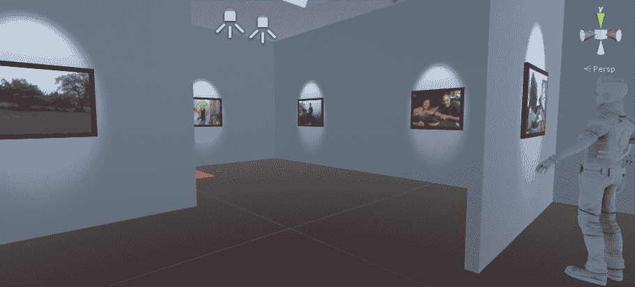

要在 VR 中查看场景，我们可以将 MeMyselfEye 定位在第一个 ArtworkRig 的前面：

1.  在层次结构中选择`MeMyselfEye`相机装置

1.  将其位置设置为(`2`, `0`, `-2.82`)

这真是太好了！

# 管理艺术信息数据

我们可以到此为止，但假设我们想要跟踪比每个艺术作品图像更多的数据，例如艺术家、标题、描述等。首先，我们将考虑几种软件设计模式来管理数据，包括单独的列表、数据结构和可脚本化的对象。稍后，我们将更新我们的 ArtworkRig 以显示每个框架艺术作品的信息。

前两个场景仅用于说明。我们将最后实现`ScriptableObjects`。

# 使用列表

一种方法是在`PopulateArtFrames`脚本中为每个数据字段添加更多的列表。例如，如果脚本有如下所示：

```cs
 public Texture[] images;
 public string[] titles;
 public string[] artists;
 public string[] descriptions;
```

检查器将显示以下内容（为了简洁，我限制了列表为四项）：

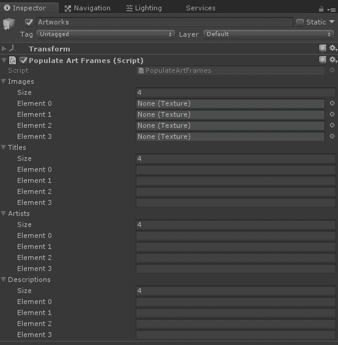

如您所想象，这可能会变得非常难以管理。例如，要更改元素 3，您必须访问所有列表，这很容易出错；事情可能会致命地失去同步。

# 使用数据结构

一个更好的方法可能是编写一个 C# `struct`（或 `class`），作为包含我们想要的每个字段的 数据结构，然后在 `PopulateArtFrames` 中的列表为此类型。例如，脚本可能如下所示：

```cs
[System.Serializable]
public struct ArtInfo
{
    public Texture image;
    public string title;
    public string artist;
    public string description;
}

public class PopulateArtFrames : MonoBehaviour
{
    public List<ArtInfo> artInfos = new List<ArtInfo>();
ArtInfo defining our data fields. Then, in PopulateArtFrames we declare it as a List (which must be initialized with the new List<ArtInfo>() call). In the script, we'd then reference the textures as artInfos[i].image. Likewise, you'd get its size using artInfos.Count  rather than Length. Also, we need to say it's System.Serializable so the list appears in the editor Inspector, as follows:
```

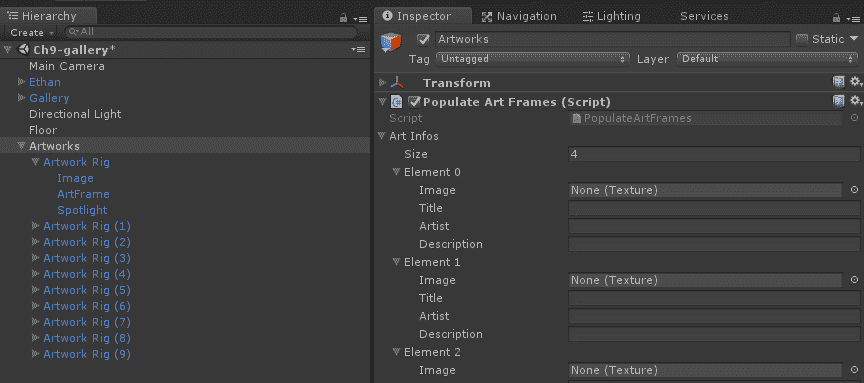

现在我们有一个可以填充的 `ArtInfo` 元素列表，每个元素的数据都分组在一起。

这种结构的另一个好处是它可以从外部数据源更容易地填充，例如基于云的 JSON 数据或 CSV（逗号分隔值）数据文件。

如果你感兴趣从数据库加载数据，这里有一些方法，但超出了本章的范围。但简要来说，如果你确实找到了 CSV 数据的来源，这个方便的 CSV 解析器 ([`github.com/frozax/fgCSVReader`](https://github.com/frozax/fgCSVReader)) 基本上但能完成任务。如果你需要 JSON 解析器，例如从基于 Web 的 REST API，可以考虑 JSON .NET For Unity 包 ([`assetstore.unity.com/packages/tools/input-management/json-net-for-unity-11347`](https://assetstore.unity.com/packages/tools/input-management/json-net-for-unity-11347)) 或其他类似的包。

# 使用可脚本化对象

在之前的示例中，艺术信息数据是在场景层次结构中的 `GameObject` 上维护的。从软件设计的角度来看，这并不是数据真正所属的地方。数据对象不是游戏对象，应该单独管理。

在场景层次结构中，我们定义了关卡设计和游戏行为。ArtworkRigs 有空间坐标（Transform）和渲染器（以及可能需要的其他运行时组件，如碰撞器和刚体用于物理）。但其他数据，尽管是项目资产，可以存在于场景层次结构之外。为此，Unity 提供了 *ScriptableObjects*。我们首次在 第五章，*实用交互对象* 中介绍了 ScriptableObjects，作为在游戏对象之间共享输入数据的一种方式。我们在这里再次使用它们：

1.  在 **项目** 窗口中，如果尚未存在，则在 *Assets* 下创建一个名为 `ScriptableObjects` 的新文件夹

1.  在新文件夹中，右键单击并选择 **创建** | **C# 脚本**

1.  将脚本命名为 `ArtInfo`

1.  然后，打开 `ArtInfo.cs` 脚本进行编辑

按如下方式创建 `ArtInfo.cs` 脚本：

```cs
using UnityEngine;

[CreateAssetMenu(menuName = "My Objects/Art Info")]
public class ArtInfo : ScriptableObject
{
    public Texture image;
    public string title;
    public string artist;
    [Multiline]
    public string description;
}
```

我们不是从 `MonoBehaviour` 继承，而是将类定义为 `ScriptableObject`。我们添加了一个 `Multiline` 属性用于描述，这样在检查器中的输入字段就会是一个文本区域。

如果你正在将 JSON 数据导入到你的项目中，并希望生成与 JSON 对象属性匹配的 ScriptableObject 类，请查看这个工具：[`app.quicktype.io/#r=json2csharp`](https://app.quicktype.io/#r=json2csharp)。

在顶部，我们提供了一个`CreateAssetMenu`属性，它会在 Unity 编辑器中为我们的对象生成一个菜单项。由于可脚本化对象不会被添加到场景层次结构中，我们需要一种在项目中创建它们的方法。使用此属性会使操作变得简单，如下所示：

1.  保存脚本并返回 Unity。

1.  在项目窗口中，选择您导入图像纹理的相册文件夹。我们将在同一文件夹中创建艺术信息对象。

1.  在 Unity 编辑器主菜单中，导航到“资产”|“创建”。

1.  您将看到一个名为“我的对象”的新项，其中包含一个子菜单，其中有一个名为“艺术信息”的项，正如我们在脚本中的`CreateAssetsMenu`属性所指示的那样。

1.  选择“艺术信息”以创建一个实例。默认情况下，它将在定义脚本所在的同一文件夹中创建（这可以在属性属性选项中更改）。

1.  可能会有助于将对象重命名为与您的图像类似。例如，如果您有 PictureA，将其命名为`PictureA Info`。

1.  将图像纹理拖放到脚本化对象的图像槽中。

1.  为标题、艺术家和描述添加信息。

这里是一个已填写数据的`ArtInfo`对象的截图：

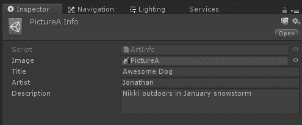

对所有图片重复这些步骤。完成时，您的艺术数据将成为项目资产。

要在项目中使用脚本化对象资产，我们可以修改`PopulateArtFrames`，就像我们之前对`struct`版本的代码所做的那样。我们将进行一些重构，在`ArtworkRig`上创建一个新的组件，以使用 ArtInfo 对象填充它，如下所示：

1.  在层次结构中选择一个`ArtworkRig`。

1.  添加组件|新建脚本，命名为`ArtworkController`

打开它进行编辑，并按照以下内容编写：

```cs
using UnityEngine;

public class ArtworkController : MonoBehaviour {
    public GameObject image;

    public void SetArtInfo(ArtInfo info)
    {
        Renderer rend = image.GetComponent<Renderer>();
        Material material = rend.material;
        material.mainTexture = info.image;
    }
}
```

保存脚本并返回 Unity，在刚刚添加此组件的`ArtworkRig`上：

1.  将图像子项拖放到图像槽中。

1.  点击“应用”以保存`ArtworkRig`预制体

现在，更新`PopulateArtFrames`以迭代`ArtInfo`列表并将对象发送到`ArtworkRig`，如下所示：

```cs
using System.Collections.Generic;
using UnityEngine;

public class PopulateArtFrames : MonoBehaviour
{
    public List<ArtInfo> artInfos = new List<ArtInfo>();

    void Start()
    {
        int index = 0;
        foreach (Transform artwork in transform)
        {
            artwork.GetComponent<ArtworkController>().SetArtInfo(artInfos[index]);

            index++;
            if (index == artInfos.Count || artInfos[index]==null)
                break;
        }
    }
}
```

现在，检查器界面更加整洁且易于操作。艺术作品的`PopulateArtFrames`组件维护一个艺术信息对象的列表，如下所示。我们只需要填充列表并使用它。列表引用的数据作为`ScriptableObjects`单独维护：

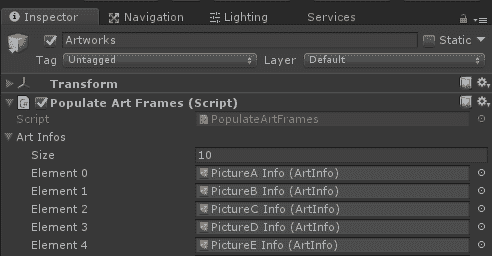

按下播放。艺术图像应该在启动时加载，就像之前一样，尽管我们已经大大改进了底层实现，现在可以扩展我们的应用程序以包含有关每幅艺术图片的更多信息。

在这种情况中使用 ScriptableObject 的另一个优点是，一旦您有一个可分发的应用程序，您可以将这些资产打包到 AssetBundle 中。这将允许，例如，在实时版本中更换画廊图片以及所有艺术信息。

# 显示艺术信息

现在我们对每件艺术品都有更多信息，我们可以将其纳入我们的项目。我们将在`ArtworkRig`中添加一个 UI 画布。首先，我们将包括每张图片的信息牌匾。然后我们将使其交互式。如果你想要 Unity 的画布和 UI 元素的提醒介绍，请查看第六章，*世界空间 UI*。

# 创建标题牌匾

标题牌匾将是一个位于每张图片旁边的小画布，包含标题文本 UI 元素：

1.  在层次结构中选择一个`ArtworkRig`对象。

1.  添加一个子画布，创建 UI | 画布，命名为 InfoPlaque。

1.  将其渲染模式设置为世界空间。

1.  初始重置其位置位置为（`0`，`0`，`0`）。

1.  设置画布宽度：`640`，高度：`480`。

1.  如果你记得，在世界上缩放的画布将是 640 米宽！将缩放设置为`0.0006`。

1.  现在你可以使用移动捕捉工具直观地调整位置，我们发现以下值有效：位置（`0.8`，`-0.1`，`-0.01`）。

1.  接下来，创建一个子面板，创建 UI | 面板。

1.  然后在面板的子面板中，创建一个子文本元素，创建 UI | 文本，将其重命名为 Title。

1.  设置一些默认文本，如 Title title title title。

1.  对于锚点预设（变换面板左上角的复杂图标），选择拉伸/拉伸，点击并也 Alt 点击它。这将使文本填充面板区域。

1.  字体大小：`80`。

1.  对齐：中间，中心。

1.  设置其水平溢出：`Wrap`，垂直溢出：`Truncate`。

现在，我们可以修改`ArtworkController`脚本以添加一个新的`public Text title`变量，并将其`text`属性设置为`info.title`，如下所示：

```cs
using UnityEngine;
using UnityEngine.UI;

public class ArtworkController : MonoBehaviour {

    public GameObject image;
 public Text title;

    public void SetArtInfo(ArtInfo info)
    {
        Renderer rend = image.GetComponent<Renderer>();
        Material material = rend.material;
        material.mainTexture = info.image;

 title.text = info.title;
    }
}
```

那很简单。保存脚本，然后：

1.  将 Title 元素拖放到文本槽中

1.  要保存预制体，请确保在层次结构中选择`ArtworkRig`本身，然后按应用。

现在当你按播放时，图片图像和标题文本将在每个艺术品 rig 的`Start`时初始化。这是我的一张带有标题牌匾的照片：

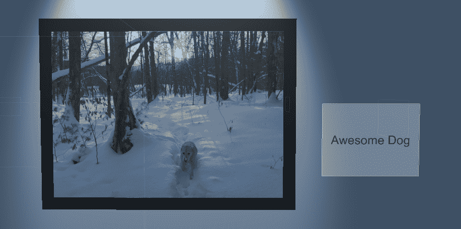

# 交互式信息详情

我们对每张适合在牌匾上放置的图片都有更多信息，因此我们将允许玩家点击输入控制器按钮以打开详细信息信息框。让我们首先创建那个画布，包括艺术家和描述的文本：

1.  作为快捷方式，复制 InfoPlaque 并将其命名为`DetailsCanvas`。

1.  缩放并定位它，可能在前方并稍微倾斜。以下值对我有效：位置（`0.7`，`0`，`-0.2`），宽高（`1200`，`900`），旋转（`0`，`15`，`0`）。

1.  将标题文本元素重命名为`Description`。

1.  复制 Description，重命名为`Artist`，设置为顶部对齐。

1.  点击应用以保存预制体。

`ArtworkController`现在也可以填充详细信息字段：

```cs
 public Text artist;
 public Text description;
 public GameObject detailsCanvas;
```

在`SetArtInfo`函数中：

```cs
     artist.text = info.artist;
     description.text = info.description;
```

然后，我们将添加一个`Update`处理程序来检查用户输入并显示（或隐藏）细节画布。并确保在`Start`时画布处于禁用状态。

```cs
    void Start()
    {
        detailsCanvas.SetActive(false);
    }

    void Update()
    {
        if (Input.GetButtonDown("Fire1"))
        {
            detailsCanvas.SetActive(true);
        }
        if (Input.GetButtonUp("Fire1"))
        {
            detailsCanvas.SetActive(false);
        }
    }
```

对于 Android 上的 Daydream，你会调用`GvrControllerInput.ClickButtonDown`和`ClickButtonUp`。

保存脚本。

1.  将艺术家和描述元素拖动到相应的槽中

1.  将 InfoDetails 画布拖动到细节画布槽中

1.  在 ArtworkRig 上按下“应用”以保存预制体更改

现在，当您播放并按下输入控制器上的 Fire1 按钮时，细节画布将显示如下：

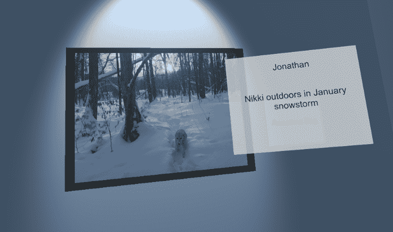

如果您想实现不同的按钮，例如手指触发器，或者使用没有 Fire1 映射（Daydream）的设备，请参考第五章，*实用交互项*，以获取实现选项和处理输入事件。

如此实现，当您按下按钮时，所有细节画布都会出现。如果您想一次控制一个画布，可以在 InfoPlaque 上添加一个 UI 按钮，例如，然后使用该按钮的点击事件来触发画布的可见性，使用基于注视的查看和点击，或激光指针和点击交互。参考第六章，*世界空间 UI*，以获取实现想法。

# 调整图像的宽高比

您可能已经注意到，由于我们的框架图像以固定大小和宽高比显示，一些图片看起来被压扁了。我们真正希望的是框架和图像根据图像的尺寸进行调整。

当 Unity 导入纹理时，它将其（默认情况下）准备为 GPU 渲染的对象材质纹理，这包括将其调整到平方的 2 的幂（例如，1024 x 1024，2048 x 2048 等）。如果您将项目调整为在运行时读取图像，例如从 Resources 目录、设备的照片流或通过网络，那么您将能够访问图像文件的元数据标题，其中包含其像素宽度和高度。由于我们使用的是导入的纹理，我们可以更改我们使用的图像的高级导入设置：

1.  从您的“资产照片”文件夹中选择一个图像纹理

1.  在检查器中，在“高级”选项下，将“非 2 的幂”更改为“无”

1.  按下“应用”

对项目中的每个图像重复此操作。请注意，这也将解压缩图像，因此原本可能是一个 400k 的`.jpg`文件，在项目中变成了 3MB，24 位的图像，所以请谨慎选择要使用的源图像的宽度和高度。

不将纹理缩放到 2 的幂次方对性能非常不利。如果您有超过几个图像，您应该避免这样做。一种方法是将图像宽高比作为 ArtInfo 的另一个字段，并在相应的脚本对象中手动设置该值。然后，将 ArtworkController 更改为使用此值而不是计算它。

在 `ArtworkController.cs` 中添加以下辅助函数，该函数返回纹理的归一化缩放。较大的一边将是 1.0，较小的一边将是分数。例如，一个 1024w x 768h 的图像将获得缩放 (1.0, 0.75)。它还使用 Z 缩放值保持图片的当前相对缩放，因为 Z 缩放值不会因我们的宽高比计算而改变，但会被缩放工具改变！

首先修改 `ArtworkController`，添加一个私有函数 `TextureToScale`，该函数将图像缩放归一化到宽度或高度较大的 1.0，并将另一维设置为宽高比，如下所示：

```cs
    private Vector3 TextureToScale(Texture texture, float depth)
    {
        Vector3 scale = Vector3.one;
        scale.z = depth;
        if (texture.width > texture.height)
        {
            scale.y = (float)texture.height / (float)texture.width;
        } else
        {
            scale.x = (float)texture.width / (float)texture.height;
        }
        return scale;
    }
```

该函数还保留了返回的缩放向量中的帧深度。现在，我们可以在 `SetArtInfo` 函数中使用它。为 `frame` 添加一个新的公共变量：

```cs
public Transform frame;
```

然后，添加以下行以设置帧的缩放：

```cs
frame.localScale = TextureToScale(info.image, frame.localScale.z);
```

保存更新脚本。然后，在 Unity 中：

1.  将 ArtFrame 拖动到组件中的 Frame 槽

1.  按下 Apply 以保存预制体

现在当你玩游戏时，框定的图像会以正确的宽高比缩放，就像这里显示的：

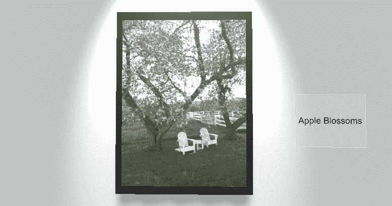

# 在画廊中移动

我们已经做了很多，但还没有讨论在画廊级别移动。在第七章 Chapter 7，*Locomotion and Comfort*（移动和舒适度）中，我们探讨了实现移动和传送的多种方法。现在，让我们考虑设置特定的传送出生点，为画廊中每幅艺术作品的图片提供最佳的观看姿势。

# 在图片之间传送

我认为一个良好的观看位置大约在图片后一米处。我们可以在 ArtworkRig 中添加一个 ViewPose 对象，并将其原点放在地板上。现在让我们添加它：

1.  在 Hierarchy 中选择 ArtworkRig

1.  创建一个空的子游戏对象，命名为 `ViewPose`

1.  重置 ViewPose 变换

1.  将其位置设置为 (`0`, `-1.4`, `-1.5`)

在第七章 Chapter 7，*Locomotion and Comfort*（移动和舒适度）中，我们探讨了实现移动和传送的多种方法，包括我们自己的脚本以及更高级的工具包。在这里，我们将使用 SteamVR 和 Daydream 的传送工具包。有关这些工具包的更一般介绍或替代解决方案，请参阅该章节。

# 使用 SteamVR 交互系统传送

要使用 SteamVR 交互系统，我们首先从他们的 Player 预制体开始，并添加我们想要使用的组件：

1.  在 `SteamVR/InteractionSystem/Core/Prefabs` 中定位 Player 预制体

1.  在你的场景 Hierarchy 中将其作为 `MeMyselfEye` 的子对象拖动

1.  删除或禁用 `[CameraRig]` 对象

1.  从项目 `Assets/SteamVR/InteractionSystem/Teleport/Prefabs` 中拖动 Teleporting 预制体的一个副本作为 MeMyselfEye（此控制器实际上可以在场景中的任何地方移动）的子对象

1.  在 Hierarchy 中选择 Player，并将其父对象 `MeMyselfEye` 拖动到其 Tracking Origin Transform 槽

1.  在“ArtworkRig”中选择“ViewPose”对象

1.  从项目`Assets/SteamVR/InteractionSystem/Teleport/Prefabs`中将“TeleportPoint”预制件的副本拖放到层次结构中作为“ViewPose”的子对象

1.  选择“ArtworkRig”并应用以保存预制件更改

就这样！按播放。传送点不会显示，直到你按下控制器上的按钮，然后它们会发光，一个虚线激光弧让你选择一个，然后你就能到达那里。以下是激活传送点时的场景视图截图：

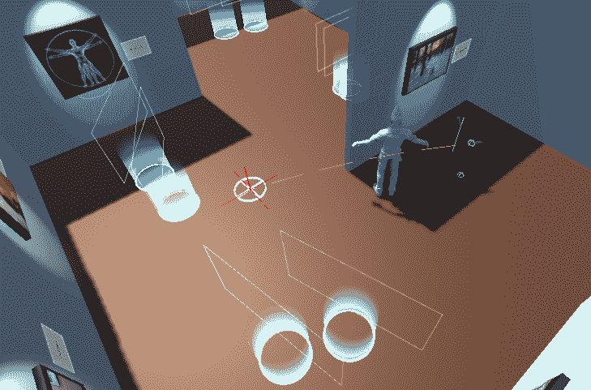

# 使用“Daydream Elements”传送

“Daydream Elements”工具包更细致，因此需要更多时间才能使其工作。默认情况下，“TeleportController”允许你传送到场景中任何水平表面（前提是有碰撞器）。为了限制它只传送到我们的传送站，我们将搜索限制在特定层，命名为`Teleport`。

1.  在层次结构中的“ArtworkRig”中，选择其“ViewPose”对象，并创建一个子圆柱体（创建 | 3D 对象 | 圆柱体），并将其命名为`TeleportPod`。

1.  将其缩放设置为（`0.5`，`0.5`，`0.01`）。你可以选择装饰其材质，例如，使用透明度。

1.  将其放在层“`Teleport`”上（如果没有名为`"Teleport"`的层，首先从层选择列表中选择添加层...）。

1.  选择父级“ArtworkRig”并应用以保存预制件更改。

现在，我们添加“Daydream Elements”的传送控制器：

1.  将“TeleportController”预制件拖放到你的层次结构中作为“Player”的子对象（对我们来说，`MeMyselfEye / GVRCameraRig / Player`）

1.  如果需要，重置其变换

1.  将`MeMyselfEye`对象拖放到`TeleportController`组件的“Player”变换槽中

1.  将“GvrControllerPointer”（或你正在使用的任何控制器游戏对象）拖放到“Controller”变换槽中

1.  在“TeleportController”的“Valid Teleport Layers”中，选择“Teleport”（这样“Default”和“Teleport”都被选中）

1.  在“Raycast Mask”中，我们只想选择“Teleport”，因此选择“Nothing”（取消选择所有选项），然后选择“Teleport”。层设置在此处的屏幕截图中显示：

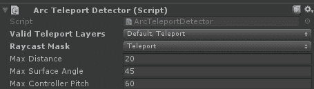

按播放。当控制器指针的弧线接触到传送舱时，它会发光高亮。如果你点击，你将被传送到那个位置。

# 房间规模考虑事项

我们设计的画廊级别布局在坐着、站着或非位置跟踪 VR 中效果最好。例如，我们使用的之字形隔断在房间规模 VR 中不是一个好主意，除非你小心不要让玩家的游戏空间（守护者边界）穿过这些墙壁。这是可以做到的，但你可能需要使整体空间更大，可能适应实际的播放空间大小，并添加条件到我们在本章后面实现的传送功能中，这会使我们的示例复杂化。有关房间规模考虑事项的更多信息，请参阅第七章，*移动和舒适*。

以下图像展示了 MeMyselfEye 在房间规模 OpenVR 相机装置中的初始位置，显示守护边界完美地适合第一个 ArtworkRig 的画廊观看空间。在其他观看情况下可能不太容易适应，因此你可能需要调整以阻止玩家穿过墙壁（或穿过 Ethan！）。此外，虽然这是默认的长度和宽度，但玩家的实际空间将根据其配置要求而变化。为了完全适应这些可能性，可能需要前往一个程序生成的关卡布局，其中墙壁的位置和缩放在运行时根据玩家设置确定。

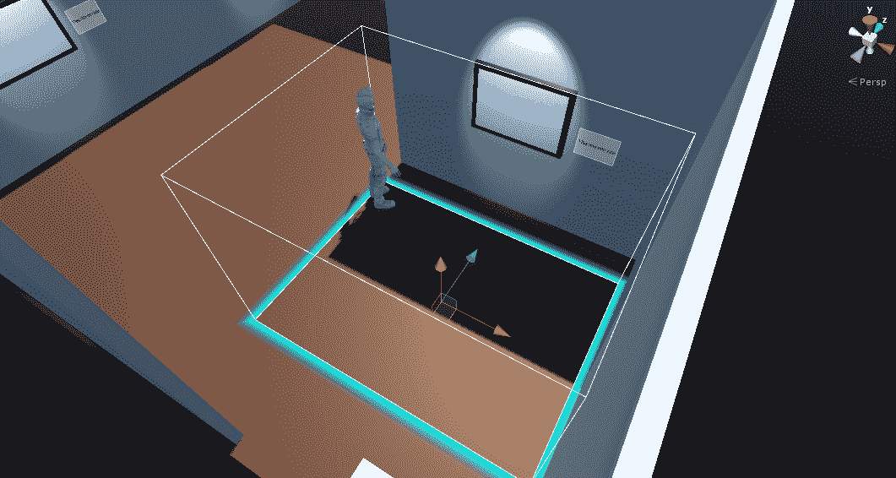

# 动画化浏览体验

如果你能够确定玩家将坐着或至少站在一个地方，他们可能会喜欢画廊的浏览体验导览。

在传统游戏中，通常使用第一人称动画来制作过场动画，即从一个关卡到另一个关卡的预录飞行动画。在 VR 中，情况有所不同。浏览体验可以真正成为 VR 体验本身。头部跟踪仍然处于活动状态。因此，这不仅仅是一个预录制的视频。你可以四处张望并体验它，这更像是游乐园的游乐设施。这通常被称为轨道式 VR 体验。

在你的 VR 应用中使用浏览动画时要小心。它可能会引起晕动症。如果你这样做，尽可能给玩家提供更多控制权。例如，我们正在动画化`MeMyselfEye`装置，允许用户继续四处张望。将用户置于一个有固定表面的驾驶舱或车辆中，也可以减少晕动症的倾向。另一方面，如果你是寻求刺激的人，可以使用这里类似的技术在三维移动轨道上制作过山车之旅！

在这个主题中，我们正在自己编写动画脚本。在后面的章节中，我们将更深入地探讨其他 Unity 动画和电影工具。我们创建了一个`RidethroughController`控制器，用于动画化第一人称角色（`MeMyselfEye`）的变换位置和随时间旋转。它通过定义关键帧变换，使用 Unity 的`AnimationCurve`类（[`docs.unity3d.com/ScriptReference/AnimationCurve.html`](https://docs.unity3d.com/ScriptReference/AnimationCurve.html)）来实现。正如其名所示，对于关键帧动画，我们在骑行中定义玩家在特定关键时间点的位置。中间帧会自动计算。

1.  在层次结构的根目录下创建一个新的空游戏对象，并将其命名为`RidethroughController`

1.  添加一个新的 C#脚本组件，并将其命名为`RidethroughController`

1.  打开脚本进行编辑

首先，我们将定义一些我们将需要的变量：

```cs
 public Transform playerRoot;
 public GameObject artWorks;
 public float startDelay = 3f;
 public float transitionTime = 5f;

 private AnimationCurve xCurve, zCurve, rCurve;
```

`playerRoot`是我们将要动画化的玩家变换（`MeMyselfEye`）。`artWorks`是艺术品装置的容器。我们包括了一个指定初始延迟和图片之间过渡时间的选项。设置函数将生成三个曲线，用于位置（*x*和*z*）和旋转（关于*y*轴）。

接下来，我们编写一个`SetupCurves`函数，生成动画曲线，使用每个 ArtworkRig 的 ViewPose 作为曲线中的节点。我们同时为*x*、z 和旋转曲线这样做如下：

```cs
    private void SetupCurves()
    {
        int count = artWorks.transform.childCount + 1;
        Keyframe[] xKeys = new Keyframe[count];
        Keyframe[] zKeys = new Keyframe[count];
        Keyframe[] rKeys = new Keyframe[count];

        int i = 0;
        float time = startDelay;
        xKeys[0] = new Keyframe(time, playerRoot.position.x);
        zKeys[0] = new Keyframe(time, playerRoot.position.z);
        rKeys[0] = new Keyframe(time, playerRoot.rotation.y);

        foreach (Transform artwork in artWorks.transform)
        {
            i++;
            time += transitionTime;
            Transform pose = artwork.Find("ViewPose");
            xKeys[i] = new Keyframe(time, pose.position.x);
            zKeys[i] = new Keyframe(time, pose.position.z);
            rKeys[i] = new Keyframe(time, pose.rotation.y);
        }
        xCurve = new AnimationCurve(xKeys);
        zCurve = new AnimationCurve(zKeys);
        rCurve = new AnimationCurve(rKeys);
    }
```

我们将定义`RidethroughController`，当游戏对象被启用时开始动画：

```cs
    void OnEnable()
    {
        SetupCurves();
    }
```

在每次更新中，我们评估 X 和 Z 曲线来设置玩家的当前位置。同时，我们评估旋转曲线来设置玩家的当前旋转。我们使用原生的`Quaternion`表示旋转，因为我们正在在两个我们不想使用欧拉坐标的角度之间进行插值：

```cs
    void Update()
    {
        playerRoot.position = new Vector3(
                xCurve.Evaluate(Time.time), 
                playerRoot.position.y, 
                zCurve.Evaluate(Time.time));

        Quaternion rot = playerRoot.rotation;
        rot.y = rCurve.Evaluate(Time.time);
        playerRoot.rotation = rot;

        // done?
        if (Time.time >= xCurve[xCurve.length - 1].time)
            gameObject.SetActive(false);
    }
```

最后，我们通过比较当前时间与曲线中最后一个节点的时时间来检查我们是否完成了动画。如果是这样，我们将禁用游戏对象。

在这个脚本中，我直接使用了`transform.rotation`的 Quaternion y 值。通常不建议直接操作 Quaternion 的值，但由于我们一致地只改变一个轴，这是安全的。有关 Quaternion 与欧拉角度的更多信息，请参阅[`docs.unity3d.com/Manual/QuaternionAndEulerRotationsInUnity.html`](https://docs.unity3d.com/Manual/QuaternionAndEulerRotationsInUnity.html)。

如所写，如果/当 RidethroughController 游戏对象被启用时，动画将播放。你可以保存启用它的场景，当应用开始时它将播放。我们将把它留给你来修改，使其可以通过玩家选项触发，例如应用内的*开始骑行*按钮！

保存脚本，然后执行以下步骤：

1.  从层次结构中，将`MeMyselfEye`拖放到玩家根槽中

1.  将`Artworks`（包含所有`ArtworkRigs`）拖放到 Artworks 槽中

当你播放场景时，你将获得一次轻松愉快的艺术画廊之旅，每张照片会有短暂的暂停来观看。这真的很棒！希望你能挑选出可以展示给你的所有朋友和家人的图片！

# 摘要

在本章中，我们从零开始构建了一个艺术画廊场景，首先从一张 2D 平面图开始，然后在 Blender 中构建一个 3D 建筑结构。我们将模型导入 Unity，并添加了一些环境照明。接着，我们构建了一个由图像、画框和聚光灯组成的艺术品装置，并在画廊的各个墙上放置了装置的实例。然后，我们导入了一大批个人照片，并编写了一个在运行时填充艺术画框的脚本。添加了关于每件艺术品的更详细数据后，我们探索了管理非图形数据列表的几种方法。最后，我们添加了在艺术画廊级别内移动的能力，通过传送和自动的第一人称场景浏览来实现。

在下一章中，我们将探讨一种使用预先录制的 360 度媒体的不同类型的 VR 体验。你将构建并了解球形照片、等经纬投影和图表信息。
