# 使用所有 360 度

360 度照片和视频是消费者今天可以体验、制作和发布的一种虚拟现实的不同方式。观看预先录制的图像所需的计算能力远低于渲染完整的 3D 场景，尤其是在基于手机的 VR 中效果非常好。在本章中，我们将探讨以下主题：

+   理解 360 度媒体和格式

+   使用纹理查看地球仪、全景照片和天空盒

+   将 360 度视频添加到您的 Unity 项目中

+   编写和使用自定义着色器

+   在您的 Unity 应用程序中捕获 360 度图像和视频

注意，本章中的项目是独立的，并不直接需要本书中其他章节的项目。如果你决定跳过其中任何部分或没有保存你的工作，那没问题。

# 360 度媒体

最近，360 度和*虚拟现实*这两个术语被频繁使用，经常出现在同一句话中。消费者可能会被误导，认为这一切都是相同的，一切都已解决，制作起来非常简单，而实际上并非如此简单。

通常，360 度一词指的是以允许你旋转视图方向以揭示视野之外内容的方式查看预先录制的照片或视频。

非 VR 360 度媒体已经变得相对常见。例如，许多房地产列表网站提供基于网页的播放器，允许你交互式地平移查看空间的全景预览。同样，Facebook 和 YouTube 支持上传和播放 360 度视频，并提供具有交互式控制功能的播放器，在播放过程中可以四处查看。Google Maps 允许你上传 360 度静态球面图像，就像你可以使用 Android 或 iOS 应用程序或消费级相机创建的街景一样（更多信息，请访问[`www.google.com/maps/about/contribute/photosphere/`](https://www.google.com/maps/about/contribute/photosphere/))。互联网上充满了 360 度媒体！

使用 VR 头盔观看 360 度媒体非常令人沉浸，即使是静态照片也是如此。你站在一个球体的中心，图像投射到内部表面，但你感觉你真的在捕捉的场景中。只需转动你的头四处查看。这是那些第一次看到就会让人对 VR 产生兴趣的事情之一，并且它是 Google Cardboard 和 Gear VR 的流行应用，为许多人启动了消费级 VR 革命。

# 等角投影

自从发现地球是圆的以来，制图员和航海家一直在努力将球形地球投影到二维图表上。变化多种多样，历史非常迷人（如果你对这类事情感兴趣的话！）结果是地球某些区域的不可避免扭曲。

想了解更多关于地图投影和球形畸变的信息，请访问 [`en.wikipedia.org/wiki/Map_projection`](http://en.wikipedia.org/wiki/Map_projection)。

作为一名计算机图形设计师，这可能比古代航海家所面临的神秘性要小一些，因为我们了解 *UV 纹理映射*。

在 Unity 中的 3D 计算机模型由 *网格* 定义 - 一组通过边连接的 Vector3 点，形成三角形面。你可以将网格（例如在 Blender 中）展开成扁平的 2D 配置，以定义纹理像素到网格表面的相应区域的映射（UV 坐标）。地球仪展开后将会扭曲，正如展开的网格所定义的那样。生成的图像称为 **UV 纹理图像**。

在计算机图形建模中，这种 UV 映射可以是任意的，并且取决于手头的艺术要求。然而，对于 360 度媒体，这通常使用 *等角*（或子午线）投影（更多信息，请访问 [`en.wikipedia.org/wiki/Equirectangular_projection`](http://en.wikipedia.org/wiki/Equirectangular_projection)）来完成，其中球体被展开成圆柱投影，当你向南北极前进时拉伸纹理，同时保持子午线作为等距的垂直直线。以下 *Tissot's indicatrix*（更多信息请访问 [`en.wikipedia.org/wiki/Tissot%27s_indicatrix`](http://en.wikipedia.org/wiki/Tissot%27s_indicatrix)）显示了一个地球仪，其中战略性地排列了相同的圆圈（Stefan Kühn 绘制）：

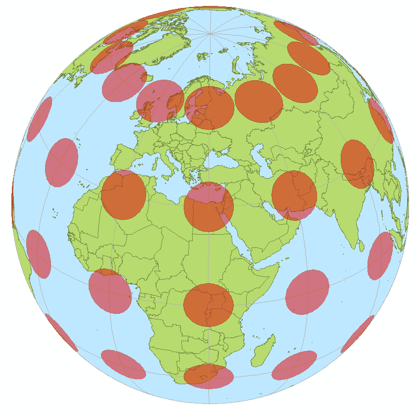

以下图像显示了使用等角投影展开的地球仪：

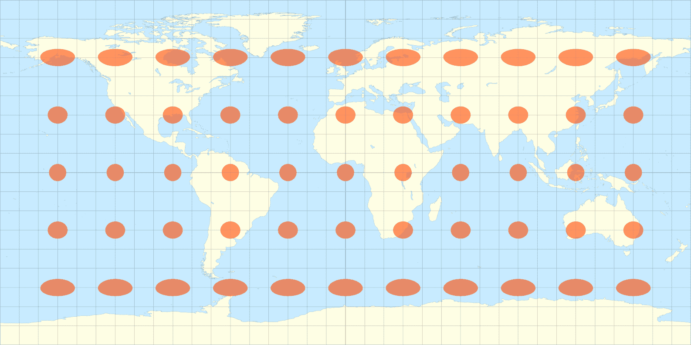

由 Eric Gaba 绘制 - 维基媒体 Commons 用户：Sting

我们将为我们的照片球体使用等角网格，并为它的纹理图使用适当的投影（扭曲）图像。

# 虚拟现实正在黑客攻击你的视野

好吧，但为什么虚拟现实中的 360 度媒体如此吸引人？我们在平屏幕上观看 360 度视频和在 VR 头盔内观看时的体验有巨大的差异。例如，IMAX 电影院比传统电影院拥有更大的屏幕，它包含了更多的你的周边视野，并且有更宽的 **视野**（**FOV**）。在自然观看距离下，手机或电脑显示器大约是 26 度的 FOV；电影院是 54 度（IMAX 是 70 度）。Oculus Rift 和 HTC VIVE 大约是 120 度。在人类视觉中，一只眼睛大约是 160 度，两只眼睛结合提供大约 200 度的水平视野。

想了解更多关于传统视频游戏中视野调整的信息，请阅读优秀的文章 *关于视野的一切*（2014 年 7 月 18 日）并访问 [`steamcommunity.com/sharedfiles/filedetails/?id=287241027`](http://steamcommunity.com/sharedfiles/filedetails/?id=287241027)。

在 VR 中，你不会那么明显地受到 FOV（视场）和屏幕物理尺寸的限制，因为你可以轻松地移动头部来改变你的观看方向。这提供了完全沉浸式的视角，水平 360 度，当你左右和上下看时，可以由 180 度实现。在 VR 中，当你头部不动时，视场只与你的外围视野和眼球运动有关。但当你移动头部（颈部和/或全身）时，软件会检测头部姿势（观看方向）的变化并更新显示。结果是，你相信自己有一个不间断的 360 度图像视角。

# 180 度媒体

我有时开玩笑说，用我的消费级 360 度相机拍照和录视频就像同时拍摄风景照和自拍！尤其是当你拍照时手持相机，你总是出现在照片中。但事实上，当你拍照时，你很可能已经面对着动作，所以当查看照片时，用户也在面对着动作。所以可能你只需要 180 度。此外，向后看可能会很麻烦。正如其名所示，180 度图像是 360 度图像的一半，投影到一个半球上。

2017 年，谷歌为 VR 引入了 180 度媒体的标准（[`vr.google.com/vr180/`](https://vr.google.com/vr180/)）。除了提供等角投影外，这些相机有两个镜头用于捕捉立体图像，每个眼睛一个。对于 180 度视角来说，效果相当不错，因为虽然你可以左右移动来环顾四周，但实际上需要的移动相对较小（人类的水平外围视野大约是 200 度）。立体 360 度更具挑战性。

# 立体 180 度媒体

要捕捉单视角 360 度媒体，你可以使用消费级 360 度相机。这些相机通常有几个背对背的超广角镜头和相应的图像传感器。通过巧妙算法将捕获的图像拼接在一起，避免接缝，然后将结果处理成等角投影。在 VR 中观看，每只眼睛看到相同的 360 度照片。对于风景，如山景或其他大区域，如果主题距离你的观看位置超过 20 米，那就没问题，因为没有视差。每只眼睛几乎从相同的观看角度看到。但如果照片包括离你更近的物体，它看起来可能不正确，或者至少是人为地扁平，因为你会期望有视差，而每只眼睛有略微不同的视角。

那么，真正的 360 度立体是什么样的呢？难道每只眼睛不应该有自己的从另一只眼睛位置偏移的球面照片吗？

要捕获*立体*360 度媒体，不能简单地由两个从两个视点拍摄的 360 度摄像机拍摄，而可以通过拼接旋转立体对中的图像来构建。摄像机图像捕获之间的距离模拟了人类眼睛之间的分离（IPD，瞳距）。有一代新的消费级摄像机（如*Fuze Camera*，[`vuze.camera/`](https://vuze.camera/)，拥有八个摄像头），以及高端专业摄像机装置，如*Google Jump* ([`vr.google.com/jump/`](https://vr.google.com/jump/))，它在一个圆柱阵列中排列了十六个独立的摄像头。然后，先进的图像处理软件构建立体视图。

谷歌推出了一种用于立体 360 度视频的高级文件格式：*全向立体*，或 ODS。它是一种传统的等经线投影的变体，具有避免不良接缝或死区的优点，它预先渲染以实现更快的播放，视频使用传统的编码，因此您可以使用传统的工具进行编辑。Unity 支持其在全景天空盒着色器中的 ODS（见本章后面的主题）。

对于立体 360 度媒体捕获的挑战和几何形状的更详细解释，请参阅谷歌白皮书《渲染全向立体内容》（[`developers.google.com/vr/jump/rendering-ods-content.pdf`](https://developers.google.com/vr/jump/rendering-ods-content.pdf)）。此外，通过访问[`paulbourke.net/stereographics/stereopanoramic/`](http://paulbourke.net/stereographics/stereopanoramic/)，您可以查看保罗·博克（2002 年 5 月）撰写的文章《立体 3D 全景图像》。

# 玩转照片球

要开始探索这些概念，让我们在将普通（矩形）图像作为纹理应用到球体上时玩点小乐趣，看看它会做什么以及看起来有多糟糕。然后，我们将使用正确扭曲的等经线球面纹理。

# 水晶球

在《绿野仙踪》中，多萝西对着水晶球寻求邪恶女巫的帮助时，她喊道：“阿姨！阿姨！”让我们考虑使用 Unity 制作一个水晶球，*我的小宝贝！*

首先，通过以下步骤为这一章设置一个新的场景：

1.  通过导航到文件 | 新场景创建一个新的场景。然后，通过导航到文件 | 保存场景为...并将它命名为`360Degrees`。

1.  通过导航到 GameObject | 3D Object | Plane 创建一个新的平面，并使用变换组件的*齿轮*图标重置其变换 | 重置。

1.  将主摄像机位置设置为（`0`，`0`，`-1`）

您可以选择使用我们在整本书中使用的 MeMyselfEye 摄像机装置，但在这个项目中不是必需的。主摄像机将实现基于您在玩家设置中选择的 SDK 的 VR 摄像机。我们将不会使用特定于设备的输入或其他功能。

现在，在创建第一个球体时，同时编写一个旋转脚本。我正在使用这本书提供的 `EthanSkull.png` 图片（将其拖放到您的 Project Assets Textures 文件夹中）。

然后，执行以下步骤：

1.  通过导航到 GameObject | 3D Object | Sphere 创建一个新的球体，使用变换组件的 *齿轮* 图标重置其变换 | 重置，并将其命名为 `CrystalBall`。

1.  将其位置设置为（`0`，`1.5`，`0`）。

1.  将名为 `EthanSkull` 的纹理（你可以使用任何照片）拖放到球体上。

1.  通过导航到添加组件 | 新脚本并命名为 `Rotator` 来创建一个新的脚本。

注意，将纹理拖放到游戏对象上会自动在您的 `Materials/` 文件夹中创建一个名为 `EthanSkull.mat` 的相应材质，并在 Albedo 纹理贴图槽中使用此纹理。

打开 `rotator.cs` 脚本并编写如下：

```cs
using UnityEngine;

public class Rotator : MonoBehaviour
{
    [Tooltip("Rotation rate in degrees per second")]
    public Vector3 rate;

    void Update()
    {
        transform.Rotate(rate * Time.deltaTime);
    }
}
```

注意，我们为 Unity 编辑器添加了一个 `Tooltip` 属性，为开发者提供了更多关于如何使用 `rate` 值的详细信息。

然后，设置旋转速率，使其围绕 *y* 轴每秒旋转 20 度，如下所示：

1.  在旋转脚本组件上，将 X、Y、Z 的速率设置为（`0`，`20`，`0`）。

1.  保存场景。在 VR 中尝试它。

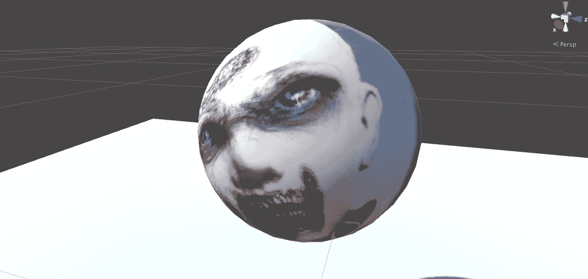

*这是不是有点吓人？* 别担心。投影的图像可能会扭曲，但它看起来很酷。对于某些应用，一点扭曲是艺术意图，你不必担心。

仔细编辑，如模糊照片的边缘，可以帮助避免纹理贴图中的接缝。

当我们在这里时，让我们尝试通过调整着色器属性来使球体看起来更像水晶玻璃：

1.  在检查器中选择 `CrystalBall`

1.  将其金属值设置为 `0.75`

1.  将其光滑度值设置为 `0.75`

1.  打开 Albedo 颜色（点击颜色块），并将 Alpha（A）值调整为 `100`

这样看起来更好。将更多具有不同纹理的对象添加到场景中，以可视化透明度和镜面高光。

如果您对水晶球的更逼真的玻璃模拟感兴趣，这里有一些建议：

+   考虑向场景中添加一个反射探针（[`docs.unity3d.com/Manual/class-ReflectionProbe.html`](https://docs.unity3d.com/Manual/class-ReflectionProbe.html))，以便表面看起来像在反射场景中的其他对象。

+   对于透明度和折射，Standard Assets Effects 包中提供了一个 `GlassRefractive` 材质。

+   在您的材质中尝试一个自定义着色器。Unity ShaderLab 文档中给出了一个简单玻璃着色器的示例（[`docs.unity3d.com/Manual/SL-CullAndDepth.html`](https://docs.unity3d.com/Manual/SL-CullAndDepth.html))。

+   还可以考虑第三方材质和着色器，它们可以模拟具有折射、扭曲、玻璃表面图案和颜色的玻璃（在 Asset Store 中搜索，[`assetstore.unity.com/search?q=category%3A121&q=glass`](https://assetstore.unity.com/search?q=category%3A121&q=glass))。

+   注意，在 VR 应用程序中应谨慎使用透明度，因为它需要每个像素额外的渲染过程，可能会减慢帧生成并造成不希望的延迟。

# 球体

接下来，我们将制作另一个球体并添加一个纹理，就像我们刚才做的那样，但这次使用具有等经线（球面）畸变的纹理。

将包含在此书中的`Tissot_euirectangular.png`图像（可在维基百科上找到，[`en.wikipedia.org/wiki/Tissot%27s_indicatrix#/media/File:Tissot_behrmann.png`](https://en.wikipedia.org/wiki/Tissot%27s_indicatrix#/media/File:Tissot_behrmann.png)）导入到你的纹理文件夹中，并执行以下步骤：

1.  创建一个新的球体并命名为`Globe`。如果你想的话，可以添加`Rotator`脚本。

1.  将名为`Tissot_equirectangular`的纹理拖放到球体上。

1.  在 VR 中尝试一下。仔细观察球体，如图所示：

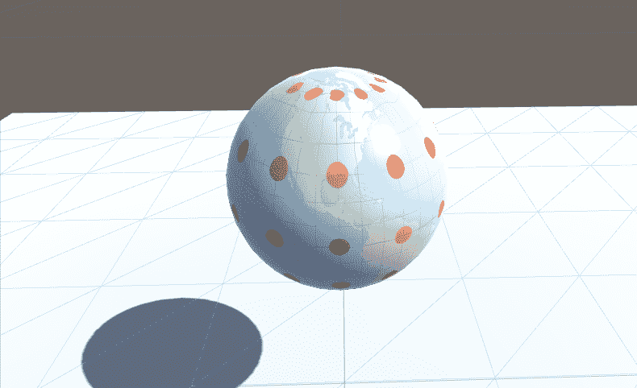

注意，不幸的是，Tissot 圆圈是椭圆形的，而不是圆形，除了赤道沿线。结果发现，Unity 中提供的默认球体不适合等经线纹理图。相反，我提供了一个专门为此目的设计的，`PhotoSphere.fbx`（这恰好是 3D Studio Max 中的默认球体模型）。让我们试试：

1.  通过将`PhotoSphere.fbx`文件拖动到你的项目资产模型文件夹中（或通过菜单：资产 | 导入新资产...）来导入它。

1.  通过将`PhotoSphere`模型从“项目资产”拖动到场景中，创建一个新的等经线球体。

1.  设置其位置并命名为`Globe2`。如果你想的话，可以添加`Rotator`脚本。

1.  将名为`Tissot_equirectangular`的纹理拖放到球体上。

在 VR 中尝试一下。*效果更佳*。现在你可以看到纹理已经正确映射；圆圈是圆的（并且底层的网格更规则）：

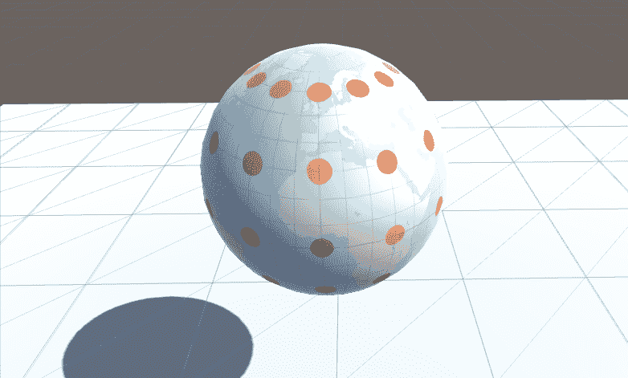

现在你可以将任何 360 度照片应用到球体上，创建你自己的*照片球体*或虚拟圣诞树饰品！

在这个话题上进一步扩展，你可以构建一个漂亮的太阳系模型。每个行星和卫星的等经线纹理图都可以从太阳系视界免费下载（[`www.solarsystemscope.com/`](https://www.solarsystemscope.com/)）。有关自转（昼夜）和轨道（绕太阳）的数据可以在 NASA 网站上找到（[`nssdc.gsfc.nasa.gov/planetary/factsheet/index.html`](https://nssdc.gsfc.nasa.gov/planetary/factsheet/index.html)）。完整的 Unity 教程项目可以在《开发者增强现实》一书中找到（[`www.amazon.com/Augmented-Reality-Developers-Jonathan-Linowes/dp/1787286436`](https://www.amazon.com/Augmented-Reality-Developers-Jonathan-Linowes/dp/1787286436)）。

另一个想法是，照片球体在 VR 游戏中已被用作传送机制——作为玩家，你抓住描绘另一个场景的球体，把它放在你的脸上，你就会被传送到那个世界。有关如何捕获 Unity 场景的 360 度照片，请参阅*捕获 360 度媒体*这一主题。

# 渲染全景球

地球的倒数是全景球。地球将等经线纹理映射到球体的外表面，而全景球会将纹理映射到内部表面，并且你从内部观看，这样它就包围了你。

对于我们的示例，我正在使用本书提供的`Farmhouse.png`图像，如下所示。您可以使用自己的 360 度照片，无论您是否有理光 Theta 这样的 360 度相机，还是使用 Android 或 iOS 的图片拼接应用，或者从网络上的任何数量照片源下载。

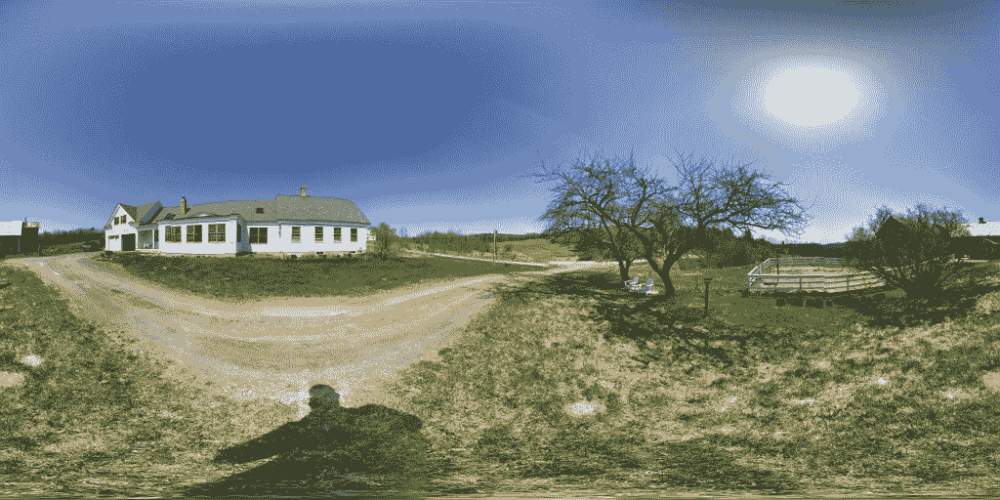

正如我们所见，Unity 通常只渲染物体的外表面。这在数学上由其表面网格每个面的**法线**方向向量决定。平面是最简单的例子。在第二章“内容、对象和比例”中，我们创建了一个带有大峡谷的大屏幕图像平面。当你面对平面时，你会看到图像。但是如果你在平面后面移动，它不会被渲染，就像它根本不在场景中一样。同样，假设你面前有一个立方体或球体；你会看到它被渲染、照明和着色。但是如果你把头伸进物体里面，它似乎消失了，因为你现在正在看物体的内部面。这一切都是由着色器处理的。而且由于我们想要改变它，我们需要使用不同的着色器。

# 编写自定义内着色器

我们将编写一个自定义着色器来在球体网格的内部渲染我们的纹理。

着色器是 Unity 渲染管道的关键部分，也是计算机图形学和虚拟现实中的许多魔法实际发生的地方。Unity 提供了一套令人印象深刻的内置着色器，正如您可能通过在检查器中打开任何对象的 Shader 选择列表所注意到的。您导入的许多资产包也可能包括实现自定义效果的着色器，包括我们在前几章中已经使用的一些，如 TextMeshPro 和 TiltBrush。Oculus、Google Daydream 和 SteamVR 的 VR 工具包也包括提供额外性能和渲染管道优化的着色器。

编写着色器是计算机图形和 Unity 开发的高级主题。尽管如此，Unity 提供了工具来简化着色器的编程（请参阅[`docs.unity3d.com/Manual/SL-Reference.html`](https://docs.unity3d.com/Manual/SL-Reference.html)），包括名为*ShaderLab*的声明性语言、大量文档和教程以及可从中工作的示例着色器。我们不会深入探讨，但许多人发现这是一项非常有趣且宝贵的技能。

要创建一个新的着色器，开始如下：

1.  导航到创建 | 着色器 | Unlit Shader，并将其命名为`MyInwardShader`

1.  双击新的着色器文件以打开它进行编辑

要将着色器转换为内部着色器，你只需要添加一行`Cull Front`，例如，紧接在`Tags`行之后，如下所示：

```cs
    ...
    Tags { "RenderType"="Opaque" }
    Cull Front
    ...
```

`Cull`命令告诉着色器是否忽略正面或背面朝向的表面。默认是背面；我们将将其更改为裁剪正面并渲染背面。（有关详细信息，请参阅[`docs.unity3d.com/Manual/SL-CullAndDepth.html`](https://docs.unity3d.com/Manual/SL-CullAndDepth.html)。）

保存文件。现在我们可以在我们的项目中使用它。

注意着色器文件的第一行将其命名为`Shader "Unlit/MyInwardShader"`，这意味着你可以在选择 Shader | Unlit 子菜单中找到它，或者你可以不使用子菜单将其修改为`Shader "MyInwardShader"`。

由于我们正在反转纹理，它可能看起来是反向镜像的。我们将通过将其 X 平铺设置为`-1`来修复它，正如我们将看到的。

另一种方法是着色器内反转顶点法线。我们在本书的第一版中使用了该技术，这里展示了它：

```cs
Shader "MyInwardNormalsShader" {
    Properties {
        _MainTex ("Base (RGB)", 2D) = "white" {}
    }
    SubShader {
        Tags { "RenderType" = "Opaque" }
        Cull Off

        CGPROGRAM
        #pragma surface surf Lambert vertex:vert
        sampler2D _MainTex;

        struct Input {
            float2 uv_MainTex;
            float4 color : COLOR;
        };

        void vert(inout appdata_full v) {
            v.normal.xyz = v.normal * -1;
        }

        void surf (Input IN, inout SurfaceOutput o) {
             fixed3 result = tex2D(_MainTex, IN.uv_MainTex);
             o.Albedo = result.rgb;
             o.Alpha = 1;
        }
        ENDCG
    }
      Fallback "Diffuse"
}
```

简而言之，这个着色器脚本声明了以下内容：

+   允许你提供纹理和颜色属性

+   不进行表面裁剪（纹理将在内部和外部都可见）

+   使用简单的 Lambert 漫反射光照算法（与未照明或标准 Unity 物理光照相比）

+   `vert`函数通过乘以法向量`-1`来反转网格顶点

+   `surf`渲染器复制纹理像素，并允许你使用 Albedo 颜色对其进行着色（但强制 Alpha 为不透明）

你可以使用这个着色器代替我们之前写的快速着色器。

考虑一下，如果你在着色器设置中使用了 Alpha 通道并设置了一个裁剪遮罩会发生什么。这将允许照片球体的一些区域完全透明。这为在场景内嵌套多个照片球体以创建 360 度活动视觉层提供了可能性！

# 魔法球体

在我们进行完整的 360 度照片查看之前，为了好玩，让我们首先考虑一个特殊情况，*魔法球体*。对于这个例子，我们将从内部查看球体，将 360 度图像映射到其内部表面。然后，我们将在外部放置一个实色*壳体*。所以，你真的需要把头伸进球体里才能看到里面的东西，或者抓起球体，“戴”在眼睛上！

要构建它，请按照以下步骤操作：

1.  通过导航到资产 | 创建 | 材质创建一个新的材质，并将其命名为`FarmhouseInward`。

1.  在检查器中，使用着色器选择器并选择 Unlit | MyInwardShader，这是我们刚刚创建的。

1.  定位到`Farmhouse`纹理图像，并将其拖拽到着色器组件的 Albedo 纹理上。如果需要，将 Tiling X 设置为`-1`以补偿镜像。

1.  将一个新的球体添加到场景中，将之前介绍的`PhotoSphere.fbx`从你的*模型*文件夹中拖拽出来，并将其命名为"MagicOrb"。

1.  将`FarmhouseInward`材质拖拽到球体上。

通过以下步骤，我们将将其封装在一个单色球体中：

1.  在层次结构中选择`MagicOrb`对象，右键单击，导航到 3D 对象 | 球体，以便新的球体成为子对象。

1.  将其缩放设置为略大于内球体的大小，例如（`1.02`, `1.02`, `1.02`）

1.  通过取消勾选禁用其球体碰撞器组件。

1.  找到一个实色材质，例如我们在前一章中制作的名为`RedMaterial`的材质，并将其拖拽到新的球体上。

在 VR 中尝试。从外面看，它像一个实心球，但靠近它，里面有一个全新的小世界！以下图片是我看到的截图。就像透过鸡蛋壳看进去一样！

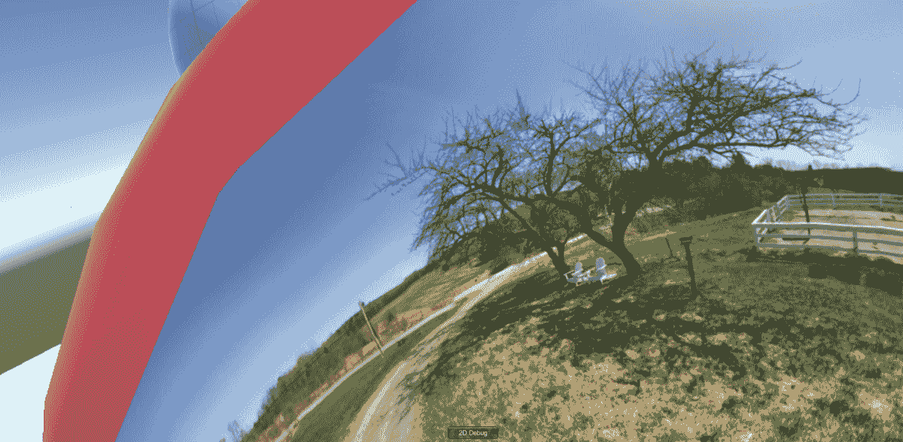

对于非位置跟踪的移动 VR 设备，你可能无法在 VR 中完成此操作，但可以在编辑器中播放场景的同时，在场景视图中手动拖拽相机装置。或者，添加一些如第七章所述的移动，*移动和舒适度*。或者，使球体可抓取，这样玩家就可以拿起它并将其移动到非常接近他们脸部的位置，使用第五章中描述的技术，*便捷交互对象*。

如果你想要深入了解着色器，作为一个练习，尝试看看你如何修改 InwardShader 以接受一个额外的颜色参数，该参数用于渲染外表面，而纹理用于渲染内表面。

# 光晕层

*是的，先生，这现在是热门话题。它比全景图好。它比自拍好。它甚至可能比 Snapchat 更好！我们终于到了你一直等待的时刻！这是 360 度光晕层！*

在本章中，我们涵盖了众多主题，这将使得讨论 360 度光晕层变得相对容易。要构建一个，我们只需使用`MyInwardShader`着色器制作一个非常大的球体。

开始一个新的空场景：

1.  通过导航到文件 | 新场景创建一个新的场景。然后，文件 | 保存场景并将其命名为`PhotoSphere`。删除默认的主相机。

1.  添加`MyMyselfEye`预制件，并将其变换位置重置为（`0`, `0`, `0`）。

1.  通过从`Project Models`文件夹中将`PhotoSphere`模型拖拽到场景中（如前一个示例中从`PhotoSphere.fbx`导入），创建一个等经线球体。

1.  重置其变换（*齿轮图标* | 重置）并将其缩放设置为（`10`, `10`, `10`）。

1.  创建一个材质（创建 | 材质）并将其命名为`PhotoSphere Material`。

1.  导航到着色器 | 无光照 | MyInwardShader（如本章前面创建）。

1.  将`Photosphere`材质拖放到`Photosphere`游戏对象上。

1.  如果场景中将有其他对象，您可能需要禁用阴影。在球面游戏对象上，在其 Mesh Renderer 组件中取消选中接收阴影复选框。

现在，要添加照片：

1.  导入您想要使用的照片；我们的照片命名为`FarmHouse.jpg`。

1.  选择`PhotoSphere`（或`PhotoSphere Material`本身），将`FarmHouse`纹理拖放到 Albedo 纹理图块上。

1.  如果需要，将 Tiling X 值设置为`-1`以补偿镜像反转。

按下播放。现在您应该能在场景中看到环绕您的球面照片。

如果您使用的是带有位置跟踪的设备，例如 Oculus Rift，我们需要禁用它。在`MemMyselfEye`上创建一个新的脚本如下：

```cs
public class DisablePositionalTracking : MonoBehaviour
{
    void Start()
    {
        UnityEngine.XR.InputTracking.disablePositionalTracking = true;
    }
} 
```

您可能会发现默认的纹理分辨率和/或压缩质量不足以满足您的需求。要修改分辨率，请按照以下步骤操作：

1.  选择纹理（Farmhouse.png）

1.  在检查器中，将最大尺寸更改为`4096`或`8192`

1.  按下应用以重新导入纹理

注意文件大小（检查器底部）可能会呈指数级增长，影响您应用程序的最终大小、加载时间和运行时性能。还可以尝试其他压缩设置，包括新的 Crunch 压缩（[`blogs.unity3d.com/2017/11/15/updated-crunch-texture-compression-library/`](https://blogs.unity3d.com/2017/11/15/updated-crunch-texture-compression-library/)）。您可以根据每个平台配置这些设置。

要切换图像，重复最后两个步骤：导入资产并将其分配给`Photosphere Mataterial`的 Albedo 纹理。如果您想在游戏中这样做，可以在脚本中完成（例如，使用`Material.mainTexture()`）。

# 播放 360 度视频

添加 360 度视频的步骤与将常规矩形视频添加到项目中的步骤大致相同（见[`docs.unity3d.com/Manual/class-MovieTexture.html`](https://docs.unity3d.com/Manual/class-MovieTexture.html)）。要播放 360 度视频，您使用`Video Player`在`Render Texture`上渲染视频。如果您没有现成的 360 度视频，可以在网上搜索免费下载，并选择一个不太长且文件大小有限的一个。

根据您视频的格式，您可能需要首先在系统上安装 QuickTime，然后才能将视频导入 Unity 进行转换编解码器。

如果您愿意，开始一个新的场景并将 MyMyselfEye 变换重置到原点。然后，将 360 度视频导入到您的项目资产中。注意其尺寸（例如，4K 视频是 4096 x 2048）。如果您不确定，可以在检查器中查看。

按照以下方式将视频播放器添加到您的项目中：

1.  创建一个名为`"VideoPlayer"`的空对象

1.  添加组件 | 视频播放器

1.  将您的视频文件拖放到其视频剪辑槽中

1.  选择“唤醒时播放”和“循环”复选框

1.  确保渲染模式设置为渲染纹理

现在，我们将创建一个 `Render Texture`，这是 Unity 的一个特殊纹理，将在运行时由视频播放器渲染：

1.  在你的项目资源中，创建 | 渲染纹理，命名为 `"Video Render Texture"`

1.  将大小设置为视频的确切大小，(例如 4096 x 2048)。

1.  建议将抗锯齿设置为 2 个样本。

1.  你可以将深度缓冲区设置为无深度缓冲区

1.  在层次结构中选择视频播放器，并将视频渲染纹理拖放到其目标纹理槽中

现在，创建你的全景照片：

1.  创建一个新的 3D 球体并命名为 "VideoSphere"

1.  重置其变换，使其位置为 (`0`, `0`, `0`), 然后将缩放设置为 (`10`, `10`, `10`)

1.  将视频渲染纹理拖放到球体上并创建一个新的材质（或者你可以在创建材质之前先创建这个材质）

1.  将材质着色器更改为 MyInwardShader

这里显示了 Inspector 中的结果视频播放器：


按下播放。你现在已经使用 Unity 构建了一个基本的 360 度视频播放器。

为了复习，球体使用的是向内着色器的材质。着色器在球体的内部渲染一个等角纹理。视频播放器在每个更新中都会用下一个视频帧修改那个纹理。

当为 Android 和 iOS 构建时，你必须将你的视频文件（例如 MP4）放入项目资源中的名为 *StreamingAssets* 的文件夹中。有关此信息和视频播放器和编解码器的其他考虑因素，请参阅 Unity 文档[`docs.unity3d.com/ScriptReference/Video.VideoPlayer.html`](https://docs.unity3d.com/ScriptReference/Video.VideoPlayer.html)。

如果视频有音频，我们可以将视频作为音频源如下设置：

+   选择视频播放器并添加组件 | 音频源

+   将 `VideoPlayer` 本身拖放到其视频播放器组件的音频源槽中

与所有 Unity 组件一样，视频播放器有一个 API，可以通过脚本进行控制。例如，要简单地通过按钮点击暂停视频，你可以在 `VideoPlayer` 上添加此脚本：

```cs
using UnityEngine;
using UnityEngine.Video;

public class PlayPause : MonoBehaviour {
    private VideoPlayer player;

    void Start() {
        player = GetComponent<VideoPlayer>();
    }

    void Update() {
        if (Input.GetButtonDown("Fire1"))
        {
            if (player.isPlaying)
            {
                player.Pause();
            }
            else
            {
                player.Play();
            }
        }
    }
}
```

对于额外的提示，还可以查看 Unity 的教程 *交互式 360 视频入门：下载我们的示例项目* [`blogs.unity3d.com/2018/01/19/getting-started-in-interactive-360-video-download-our-sample-project/`](https://blogs.unity3d.com/2018/01/19/getting-started-in-interactive-360-video-download-our-sample-project/)。

# 使用 Unity skyboxes

在古代，或者至少在 360 度照片之前，我们简单地称 *skyboxes* 为在计算机图形中创建背景图像的方式。Skyboxes 描绘了地平线上的远处，可能有助于场景的环境光照，用于在物体表面上渲染反射，并且不可交互。Unity 支持每个场景的照明环境中的 skyboxes。我们已经在之前几章的项目中使用了 skyboxes（包括 Wispy Sky 和 Skull Platform 项目）。

天空盒的常见来源包括圆柱形全景、球形全景（360 度图像）和六面体。我们不会考虑圆柱形，因为它在 VR 中不太有用。

# 六面体或立方体贴图天空盒

天空盒可以表示为一个立方体的六个面，每个面都类似于一个摄像头捕捉其六个方向之一的视图，如图所示：

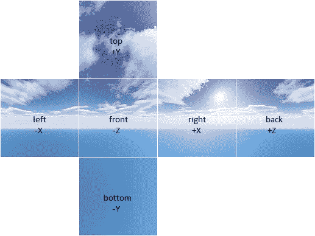

给定这六张图片，作为纹理，你会创建一个如 WispySky 立方体贴图所示的下**六面体**天空盒材质。然后，在灯光窗口中将其设置为场景的天空盒材质：

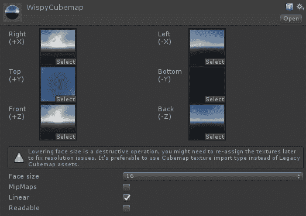

或者，你也可以将六张图片合并成一张单独的**立方体贴图**图像，布局类似。

立方体贴图的优势在于，等经纬度纹理在球形投影的顶部和底部极点拉伸图像时浪费了像素。另一方面，必须仔细设计图像，以确保它们可以平滑拼接，不会产生接缝或其他视觉伪影。

传统的立方体贴图的一个变体是**等角立方体贴图**（**EAC**）。EAC 力求拥有更加均匀的像素大小和“在 3D 空间中均匀的像素角度分布”。（参见[`blog.google/products/google-vr/bringing-pixels-front-and-center-vr-video/`](https://blog.google/products/google-vr/bringing-pixels-front-and-center-vr-video/)。）

但如今大多数 360 度媒体，尤其是来自消费级相机的媒体，都使用等经纬度投影，也就是球形全景。

# 球形全景天空盒

使用 360 度照片作为天空盒被称为**球形全景**。在本章的早期，我们使用球形游戏对象渲染等经纬度纹理，并将玩家摄像头放置在其中的正中央。现在，我们将使用相同的图像在天空盒中。 （注意，这同样适用于 180 度内容。）

从一个新的空场景开始：

1.  通过导航到文件 | 新场景来创建一个新的场景。然后，文件 | 保存场景并将它命名为`Skybox`。将`Main Camera`替换为`MyMyselfEye`预制体。

1.  假设你正在使用`Farmhouse.jpg`图像，如之前所述，创建一个新的`Material`并将其命名为`Farmhouse Skybox`。

1.  对于材质的着色器，选择天空盒 | 全景。

1.  将你的 360 度图像（`Farmhouse.jpg`）拖放到球形纹理区域。

1.  将映射设置为经纬度布局。

1.  将图像类型设置为 360 度。

材料设置如下所示：

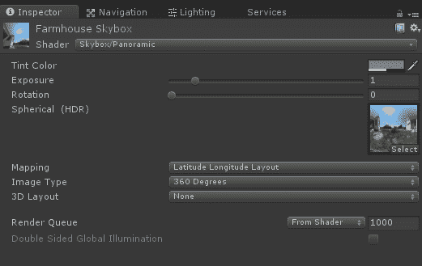

现在要在场景中使用它：

1.  打开灯光窗口标签（如果不在你的编辑器中，请导航到窗口 | 灯光）

1.  将你的`Farmhouse Skybox`材质拖放到天空盒材质槽中。

灯光环境设置如下所示：

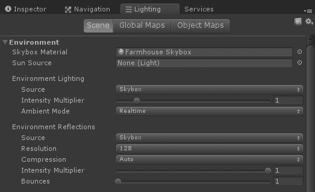

按下播放。*哇！*你现在应该能在场景中看到围绕你的照片球体。这几乎太简单了。谢天谢地！

有趣的一点是，由于天空盒始终以非常远的距离渲染，因此相机将始终位于球面的中心。因此，我们不需要在原点设置相机装置，也不需要禁用位置跟踪，就像我们在本项目的球形游戏对象版本中做的那样。无论您走到哪里，天空盒都会围绕您。如果您的 360 度图像包含相对较近的内容（人或物体），这可能会感觉非常不自然，就像物体被投影或压扁在球形投影上（它们确实是！）这就是为什么天空盒通常用于风景和开阔空间。（稍后，我们将看到如何使用 *立体* 天空盒来解决这个问题。）

到目前为止，您可以为场景添加更多内容。毕竟，我们在 Unity 中，而不仅仅是制作一个通用的 360 度照片查看器。通过添加下雪或落叶（例如，参见 *Falling Leaves* 粒子包，[`assetstore.unity.com/packages/3d/falling-leaves-54725`](https://assetstore.unity.com/packages/3d/falling-leaves-54725)）来增强您可爱的户外场景。

常见的应用是在大厅场景中使用 360 度图像，并添加一个交互式菜单面板来启动其他应用或场景。例如，谷歌 Daydream 大厅。

另一个应用是通过添加 UI 画布来标注照片中的内容，使 360 度图像更具交互性。这可能需要一些深思熟虑的工作来将标签与球面相匹配。然后，使用相机射线投射，您可以动态突出显示玩家正在查看的内容（参见第四章，*基于注视的控制*，获取编码技巧）。

# 360 度视频天空盒

将您的天空盒转换为 360 度视频播放器几乎与之前为球形游戏对象版本概述的步骤相同。我们不会重复所有内容，但简要来说如下：

1.  设置一个 `Video Player` 来播放视频源到 `Render Texture`

1.  设置一个 `Skybox Material` 以接收 `Render Texture`

1.  将场景设置为使用 `Skybox Material`

注意，根据 Unity，等角圆柱体视频的天空盒着色器应具有精确的 2:1 宽高比（或对于 180 度内容，1:1）。此外，许多桌面硬件视频解码器限制在 4K 分辨率，而移动硬件视频解码器通常限制在 2K 或更低，这限制了在这些平台上可以实时播放的分辨率。

# 3D 立体天空盒

如果您有一个带有立体视图的 360 度图像或视频，Unity 现在可以为左右眼使用这些图像。截至 Unity 2017.3，全景天空盒材质支持具有 3D 布局的 3D 纹理。您可以选择并排或上下，如图所示：

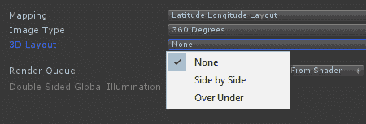

在下一主题中给出了一个示例 3D 立体等角圆柱体上下图像，我们将讨论在您的 Unity 项目中捕捉 360 度媒体。

# 在 Unity 中捕捉 360 度

我们已经讨论了使用 360 度相机捕获的 360 度媒体。但如果你想在 Unity 应用内捕获 360 度图像或视频并在互联网上分享呢？这可以用于市场营销和推广你的 VR 应用，或者仅仅是将 Unity 作为一个内容生成工具，但使用 360 度视频作为最终的分发媒介。

# 捕获立方体贴图和反射探针

Unity 包括支持将其照明引擎的一部分捕获场景视图。调用`camera.RenderToCubemap()`将烘焙场景的静态立方体贴图，使用相机的当前位置和其他设置。

Unity 文档中给出的示例脚本，[`docs.unity3d.com/Documentation/ScriptReference/Camera.RenderToCubemap.html`](https://docs.unity3d.com/Documentation/ScriptReference/Camera.RenderToCubemap.html)，实现了一个编辑器向导，可以直接在编辑器中捕获场景的立方体贴图，并包含在此处：

```cs
using UnityEngine;
using UnityEditor;
using System.Collections;

public class RenderCubemapWizard : ScriptableWizard
{
    public Transform renderFromPosition;
    public Cubemap cubemap;

    void OnWizardUpdate()
    {
        string helpString = "Select transform to render from and cubemap to render into";
        bool isValid = (renderFromPosition != null) && (cubemap != null);
    }

    void OnWizardCreate()
    {
        // create temporary camera for rendering
        GameObject go = new GameObject("CubemapCamera");
        go.AddComponent<Camera>();
        // place it on the object
        go.transform.position = renderFromPosition.position;
        go.transform.rotation = Quaternion.identity;
        // render into cubemap
        go.GetComponent<Camera>().RenderToCubemap(cubemap);

        // destroy temporary camera
        DestroyImmediate(go);
    }

    [MenuItem("GameObject/Render into Cubemap")]
    static void RenderCubemap()
    {
        ScriptableWizard.DisplayWizard<RenderCubemapWizard>(
            "Render cubemap", "Render!");
    }
}
```

要运行向导：

1.  创建一个空的游戏对象作为捕获位置

1.  创建一个用于渲染的立方体贴图（Assets | Create | Legacy | Cubemap）

1.  将面大小设置为高分辨率，例如`2048`

1.  选择可读复选框

1.  运行向导（GameObject | Render into Cubemap）

1.  将位置对象拖入 Render From Position 槽

1.  将立方体贴图拖入 Cubemap 槽

1.  按下渲染！

现在，这个`.cubemap`文件可以用于 Skybox Cubemap 材质。

另一种类似但不同的方法是使用反射探针。它们通常用于具有反射材质的对象，以渲染逼真的表面反射（见[`docs.unity3d.com/Manual/class-ReflectionProbe.html`](https://docs.unity3d.com/Manual/class-ReflectionProbe.html)）。反射探针捕获其周围环境的球形视图，然后存储为立方体贴图。场景设计师会策略性地在场景中放置多个反射探针，以提供更逼真的渲染。你可以将反射探针作为场景的 360 度图像捕获！由于它们旨在用于反射照明，通常分辨率较低。

Unity 根据你的照明设置选择存储反射探针光照贴图文件（`.exr`）的位置。要将它保存在你的*Assets*文件夹下（而不是 GI 缓存），转到照明选项卡，禁用实时全局照明，并禁用自动生成。这将生成与场景同名的文件夹中的反射探针`.exr`文件。

通过导航到 GameObject | Light | Reflection Probe 尝试在你的场景中添加一个。将分辨率设置为高值，如`2048`。然后，按烘焙。然后你可以将这个`.exr`文件分配给 Skybox Cubemap 材质，快速轻松地制作 360 度场景快照。

# 使用第三方包进行 360 度图像捕获

有许多包提供了在 Unity 中捕获 360 度图像和视频的能力，包括：

+   eVRydayVR 的 360 Panorama Capture (免费) ([`assetstore.unity.com/packages/tools/camera/360-panorama-capture-38755`](https://assetstore.unity.com/packages/tools/camera/360-panorama-capture-38755))

+   OliVR 的 VR Panorama 360 PRO ($49) ([`assetstore.unity.com/packages/tools/video/vr-panorama-360-pro-renderer-35102`](https://assetstore.unity.com/packages/tools/video/vr-panorama-360-pro-renderer-35102))

+   Oculus 360-Capture-SDK (免费)，包含一个示例 Unity 项目 ([`github.com/facebook/360-Capture-SDK`](https://github.com/facebook/360-Capture-SDK))

这些软件包都支持单眼和立体捕获，序列化捕获用于视频编码，以及可能的其他功能，如颜色转换、抗锯齿、相机图像效果和 3D 空间化音频。

使用 eVRydayVR 的 360 Panorama Capture 脚本，例如，要捕获单个 360 图像，打开您想要捕获的场景，然后：

1.  创建一个空的游戏对象，命名为 `CapturePanorama`，放置在您想要进行捕获的位置

1.  添加 Capture Panorama 脚本作为组件

1.  按下播放，然后按键盘上的 *P* 键

屏幕将变为黑色，并将捕获的图像保存到您的项目根目录。组件选项如下所示：

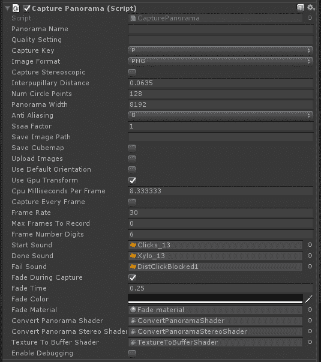

要捕获视频，您需要启用 Capture Every Frame 复选框。它推荐使用开源的 *ffmpeg* 工具 ([`www.ffmpeg.org/`](https://www.ffmpeg.org/)) 来组装帧并编码视频。有关详细信息，请参阅 README 文件。

当然，此组件也可以通过脚本进行控制，并可以构建到您的运行时游戏中，而不仅仅是用于编辑器。

# Unity 内置的立体 360 图像和视频捕获

截至 Unity 2018.1，Unity 包含了集成的立体 360 图像和视频捕获功能。该功能基于 Google 的全向立体 (ODS)，如本章开头所述。本节中的详细信息总结了 2018 年 1 月的 Unity 博客文章 ([`blogs.unity3d.com/2018/01/26/stereo-360-image-and-video-capture/`](https://blogs.unity3d.com/2018/01/26/stereo-360-image-and-video-capture/))，该文章解释了如何捕获 ODS 立体立方体贴图并将它们转换为立体等角纹理。

要在编辑器或独立播放器中捕获场景，每次对每个眼睛调用一次 `camera.RenderToCubemap()`。我们之前使用过此函数；有一个接受 `stereoEye` 参数的变体，例如：

```cs
camera.stereoSeparation = 0.064; // Eye separation (IPD) of 64mm.
camera.RenderToCubemap(cubemapLeftEye, 63, 
        Camera.MonoOrStereoscopicEye.Left);
camera.RenderToCubemap(cubemapRightEye, 63,
        Camera.MonoOrStereoscopicEye.Right);
```

要将立方体贴图转换为立体等角贴图，按照以下方式调用 `RenderTexture.ConvertToEquirect()`：

```cs
cubemapLeftEye.ConvertToEquirect(equirect, 
        Camera.MonoOrStereoscopicEye.Left);
cubemapRightEye.ConvertToEquirect(equirect, 
        Camera.MonoOrStereoscopicEye.Right);
```

使用 Unity 帧记录器 ([`github.com/Unity-Technologies/GenericFrameRecorder`](https://github.com/Unity-Technologies/GenericFrameRecorder))，可以将这些图像作为立体 360 视频的帧序列捕获。

要在 PC 独立构建中捕获，您需要在构建设置中启用 360 Stereo Capture，如图所示，这样 Unity 就会生成此功能所需的着色器变体：

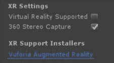

这里是一个立体等经纬度视频捕获结果的示例（来自 Unity 博客，[`blogs.unity3d.com/wp-content/uploads/2018/01/image5-2.gif`](https://blogs.unity3d.com/wp-content/uploads/2018/01/image5-2.gif))：

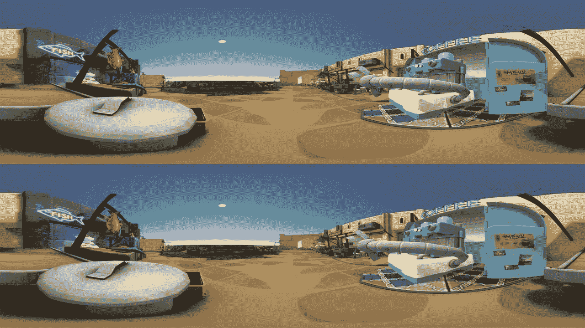

# 摘要

360 度媒体令人着迷，因为 VR 技术改变了你的视野（FOV）。当你移动头部时，你所看到的视图会实时更新，使其看起来没有边缘。我们本章一开始就描述了 360 度图像是什么，以及球面的表面是如何被压扁（投影）成二维图像的，特别是等经纬度投影。立体 3D 媒体包括为左右眼分别提供的等经纬度视图。

我们在 Unity 中开始探索这一概念，通过简单地将常规图像映射到球体的外部，并可能因此对产生的扭曲感到惊讶。然后，我们看到了等经纬度纹理是如何均匀地覆盖球体的。接下来，我们使用自定义着色器反转球体，将图像映射到球体内部，使其成为一个 360 度全景照片查看器。然后，我们添加了视频。

然后，我们探讨了使用天空盒而不是游戏对象来渲染 360 度媒体的方法。我们看到了 Unity 如何支持立方体贴图和球形全景，视频天空盒以及 3D 立体天空盒。最后，我们探讨了使用第三方包和 Unity 内置 API 从 Unity 场景中捕获 360 度媒体的方法。

在下一章中，我们将探讨虚拟现实的一个重要应用，即叙事。利用 Unity 的动画和电影剪辑功能，我们构建了一个简短的 VR 电影体验。
