# 动画和 VR 叙事

我们讲述的故事以及我们讲述故事的方式，在很大程度上反映了我们是谁以及我们将成为什么样的人。人类之间的叙事与任何人类活动一样原始，是人际交流、神话、历史记录、娱乐以及所有艺术的基础。VR 正在成为最新且可能最深刻的叙事媒体格式之一。

在上一章中，我们探讨了 360 度媒体，它本身正在成为 VR 叙事的一种新形式，尤其是对于非虚构纪录片，能够传递人类经验并为人道主义危机创造沉浸式同理心。我们在这章中涵盖的许多工具和课程也可以用于 360 度媒体，但我们将重点关注 3D 计算机图形和动画。

对于这个项目，我们将创建一个简单的 VR 体验，一个关于一只鸟获得翅膀并学会飞翔的简单故事。

在本章中，我们将学习以下主题：

+   导入和使用外部模型和动画

+   使用 Unity 时间线激活和动画化对象

+   使用动画编辑器窗口编辑属性关键帧

+   使用动画控制器控制动画片段

+   使故事互动

# 编写我们的故事

*你开始在一个黑暗的场景中，注意到你面前地上有一棵小树苗。它开始长成一棵树。随着黎明的到来，一个鸟巢出现在我们面前，我们注意到里面有一个蛋。蛋开始晃动，然后孵化。一只小鸟破壳而出，四处跳跃，成长，并测试它的翅膀。最后，在白天，它飞向自由。*

我们的故事是关于出生、成长、展开翅膀（字面和比喻意义上的），以及前进。我们将从一个音乐配乐开始，并根据其部分来动画化我们的图形。

我们正在使用免费现成的资产。当然，你可以使用你自己的音乐和图形，但我们将假设你正在跟随我们选择的资产进行操作，这些资产都可以在网络上免费获得（链接将在下面提供）。作为一个教学项目，它简约而不加装饰，没有添加一个精良产品可能期望的效果。但如果你 9 岁的表亲或侄子制作了这个项目，你一定会感到非常自豪！

我们将使用的配乐是披头士乐队和保罗·麦卡特尼的歌曲《黑鸟》的演绎版本。（下载链接将在下一节中提供，并且为了方便，本章文件中包含了一份副本。）基于我们对这首歌的 mp3 录音，我们在图表上草拟了我们的 VR 体验的大致时间线计划，如下所示：

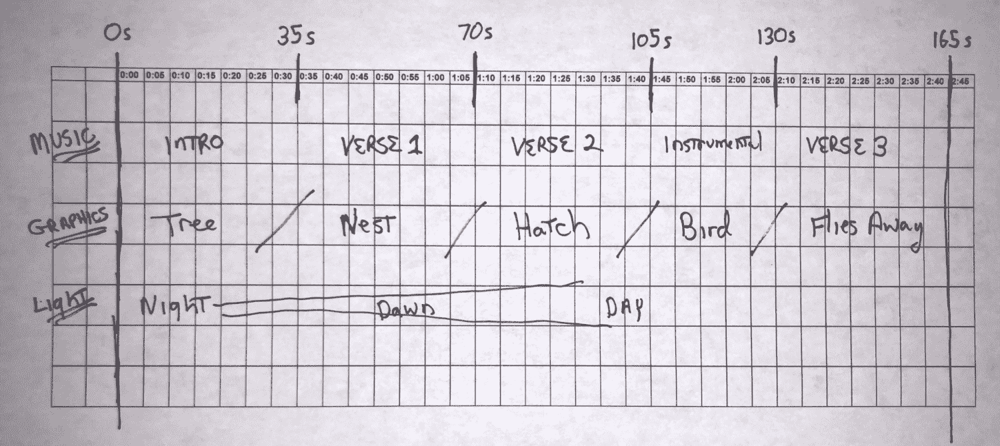

如所示，整首歌时长为 165 秒（2 分 45 秒）。它以 35 秒的器乐前奏开始，然后是第一段和第二段（也是 35 秒），接着是一个 25 秒的器乐部分，然后第三段是 35 秒。我们将利用这一点将我们的故事分为五个部分。

还应该计划出许多其他功能。例如，场景照明将从夜晚的黑暗逐渐变亮，直到黎明和白天。

# 收集资源

如前所述，我们将从各种免费和简单的资源中构建我们的故事。我建议你现在下载并安装每个资源（或你自己的替代品），以便我们在工作时可以访问它们：

+   音乐：由吉他手 Salvatore Manalo 演奏的披头士乐队和保罗·麦卡特尼的歌曲 "Blackbird"。MP3 下载：[`mp3freeget4.online/play/the-beatles-paul-mccartney-blackbird-cover/chSrubUUdwc.html`](http://mp3freeget4.online/play/the-beatles-paul-mccartney-blackbird-cover/chSrubUUdwc.html)

+   场景和树木：自然入门套件，[`assetstore.unity.com/packages/3d/environments/nature-starter-kit-1-49962`](https://assetstore.unity.com/packages/3d/environments/nature-starter-kit-1-49962)

+   鸟巢和鸡蛋：使用本书提供的 `NestAndEgg` 预制件文件（来源：使用 Cinema 4D 的教程：[`www.youtube.com/watch?v=jzoNZslTQfI`](https://www.youtube.com/watch?v=jzoNZslTQfI)，.c4d 文件下载，[`yadi.sk/d/ZQep-K-AMKAc8`](https://yadi.sk/d/ZQep-K-AMKAc8)）

+   生活鸟类：[`assetstore.unity.com/packages/3d/characters/animals/living-birds-15649`](https://assetstore.unity.com/packages/3d/characters/animals/living-birds-15649)

+   薄雾天空盒：[`assetstore.unity.com/packages/2d/textures-materials/sky/wispy-skybox-21737`](https://assetstore.unity.com/packages/2d/textures-materials/sky/wispy-skybox-21737)

注意，我们使用的鸟巢和鸡蛋对象是从网上找到的修改版本。它原本是 `.c4d` 格式，我们将其转换为 `.fbx`，打包成预制件，并做了一些其他修改。

# 创建初始场景

我们将使用一个飞机作为地面和一些来自《Nature Starter Kit》的自然岩石，一个带有鸡蛋的鸟巢和一只鸟来制作一个简单、极简的场景：

1.  创建一个新的场景（文件 | 新场景）并将其命名为 "Blackbird"（文件 | 保存场景为）

1.  创建一个名为 `GroundPlane` 的 3D 平面，重置其变换，然后将其缩放到 (`10, 10, 10`)

1.  创建一个新的材质 `GroundMaterial`，将其 Albedo 颜色设置为土色棕色（例如 `#251906ff`），并将材质拖放到平面上

1.  设置主摄像机位置为 (`0, 2, -3`)

你可以用我们全书一直在使用的 `MeMyselfEye` 摄像机装置替换 `Main Camera`，但在这个项目中不是必需的，因为我们不会使用特定设备的输入或其他功能。`Main Camera` 将根据你在玩家设置中选择的 SDK 提供足够的 VR 摄像机。

我们正在使用一个简单的地面平面，因为它给出了我们想要的美学效果。但这可能是一个探索 Unity 地形系统的良好机会。这是一个另一个丰富且非常强大的主题，你可以用树木和草地“绘制”复杂的景观。请参阅手册[`docs.unity3d.com/Manual/script-Terrain.html`](https://docs.unity3d.com/Manual/script-Terrain.html)。

现在，添加一棵树和一些石头：

1.  从 `Assets/NatureStarterKit/Models/` 文件夹中，将树拖入场景。重置其变换，使其位于原点。

1.  在树附近添加几块石头，将它们移动到部分埋在地下。你可能将这些石头放在名为 `Environment` 的空游戏对象下。

1.  添加一个风区（创建 | 3D 对象 | WindZone），使树对象对风做出反应并使树叶沙沙作响。

我场景中的石头放置如下（所有都在缩放 `100`）：

| 预制体 | 位置 |
| --- | --- |
| `rock03` | `(2.9, -0.6, -0.26)` |
| `rock03` | `(2.6, -0.7, -3.6)` |
| `rock04` | `(2.1, -0.65, -3.1)` |
| `rock01` | `(-6, -3.4, -0.6)` |
| `rock04` | `(-5, -0.7, 3.8)` |

接下来，我们将添加巢：

1.  将 NestAndEgg 模型的副本拖入场景中。

1.  在地面上将其缩放和定位，使其易于观看，靠近树，不要太小。我们选择了位置 (`0.5, 0.36, -1.2`) 和缩放 (`0.2, 0.2, 0.2`)。

然后添加一只鸟。Living Birds 包含包中没有乌鸦，但它确实有蓝松鸦，这已经足够接近了：

1.  从项目 `Assets/living birds/resources/` 文件夹中，将 `lb_blueJayHQ` 预制体拖入层次结构。为了方便，将其重命名为 `Bluejay`。

1.  缩放和定位它，使其看起来成熟并栖息在巢的边缘。我们选择了缩放 (`8, 8, 8`)、位置 (`0.75, 0.4, -1.25`) 和旋转 (`0, 0, 0`)。

鸟以 T 形插入场景。它附加了动画，我们将在本项目的稍后部分控制它们。像大多数角色动画一样，它最初运行一个 `Idle` 动画。（注意，不要旋转鸟对象，这会搞乱飞行动画。）

记得按播放键并检查它在 VR 中的外观。在 VR 中的外观总是与你在平面屏幕上看到的外观有很大不同。我们的场景和层次结构如下屏幕截图所示。你现在可能也想调整主相机的位置：

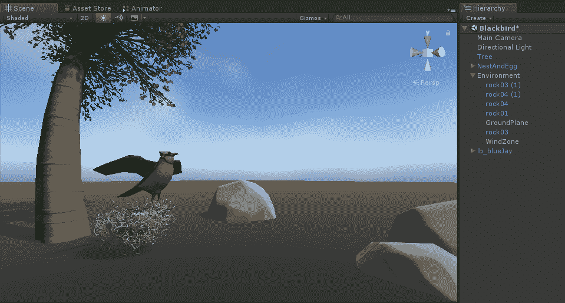

# 时间线和音频轨道

之前，我们使用坐标纸时间线规划了我们的电影。Unity 提供了几乎可以直接实现这些工具。这个时间线功能是在 Unity 2017 中引入的。

时间线由一个或多个随时间播放的轨道组成。它就像一个动画（它控制单个游戏对象的属性），但时间线与许多不同的对象和不同类型的轨道一起工作。正如我们稍后将要看到和解释的，时间线可以有音频轨道、激活轨道、动画轨道和控制轨道。

时间轴是一种 Unity *可播放* 对象。可播放对象是运行时对象，它们随时间“播放”，根据其预定的行为更新每一帧。动画也是可播放对象。有关更多详细信息，请参阅 [`docs.unity3d.com/ScriptReference/Playables.Playable.html`](https://docs.unity3d.com/ScriptReference/Playables.Playable.html)。

现在我们将在项目中添加一个时间轴并添加一个音频轨道。要创建时间轴对象并在时间轴编辑器窗口中打开它，请按照以下步骤操作：

1.  在层次结构中，创建一个空的游戏对象并命名为 `BlackbirdDirector`。

1.  打开时间轴编辑器（窗口 | 时间轴）。

1.  在窗口中，您将看到一个消息 "*要开始使用 BlackbirdTimeline 的新时间轴，请创建一个 Director 组件和一个时间轴资产*"，并附带一个创建按钮。

1.  按下创建按钮。

1.  然后，您将被提示在项目 *资源* 文件夹中保存一个新的可播放资产。命名为 `BlackbirdTimeline`。按保存。

到目前为止，您可能已经注意到了一些重要的事情刚刚发生：

+   `BlackbirdTimeline` 资产已创建在您指定的 `Asset` 文件夹中

+   已将 `Playable Director` 组件添加到 `BlackbirdDirector` 游戏对象中，并将其与 `BlackbirdTimeline` 关联

+   时间轴编辑器窗口已打开，用于 `BlackbirdTimeline`

下一个截图显示了 `BlackbirdDirector` 检查器及其 `Playable Director` 组件。`Playable Director` 组件控制时间轴实例何时以及如何播放，包括是否在唤醒时播放，以及包装模式（当时间轴播放完毕时做什么：保持、循环或无）：

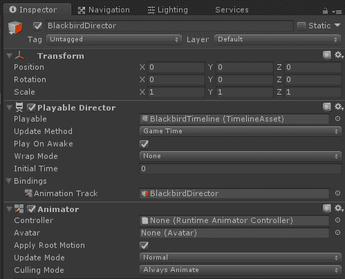

这是 `BlackbirdTimeline` 的时间轴编辑器窗口：

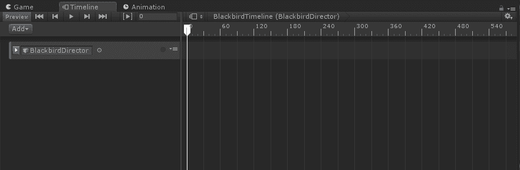

现在让我们向时间轴添加一个音频轨道，使用我们的披头士乐队歌曲：

1.  在你的项目资源中定位 mp3 文件，并将其直接拖动到时间轴编辑器中

1.  按下播放以正常播放场景，此时音乐也应该开始播放。

现在的时间轴编辑器中包含音频轨道：

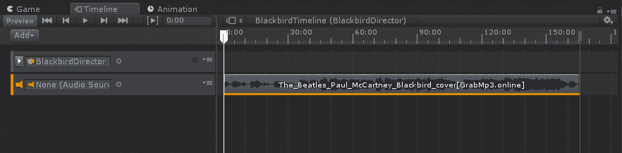

白色的垂直光标，或 *播放头*，指示当前的时间框架。默认的比例是帧，但在上一个截图我们已经将其更改为秒（使用右上角的齿轮图标）。您可以看到此剪辑从 `0` 开始，并持续到大约 165 秒。

您可以使用鼠标滚轮缩放视图。按键盘上的 "A" 键可查看所有内容。当时间轴包含多个轨道时，您可以通过按键盘上的 "F" 键来聚焦于特定的剪辑。

您可能会注意到时间轴编辑器左上角有一些预览控件。这些控件允许您播放时间轴的预览，而不是使用常规的编辑器播放按钮来播放整个场景。

不幸的是，在撰写本文时，时间轴预览播放模式无法播放音频剪辑。您需要使用编辑器播放模式来播放音频。

在这个场景中，我们决定制作环境音乐。如果没有选择音频源，音频将在 2D 模式下播放。如果你想将其作为空间音频播放，从场景中的特定位置发出，你应该创建一个音频源并将其放入时间轴轨道中。

# 使用时间轴激活对象

我们刚刚向时间轴添加了一个音频轨道。另一种类型的时间轴轨道是激活轨道。与特定的游戏对象相关联，激活轨道可以在指定的时间启用或禁用该游戏对象。

根据我们的计划，当时间轴开始时，鸟的巢将被隐藏（`NestAndEgg`对象）。在 35 秒时，它变为启用状态。此外，当巢首次启用时，它应该有`WholeEgg`。然后在 80 秒时，它被隐藏，`HatchedEgg`被启用代替。

如此，`NestAndEgg`游戏对象层级包含巢本身、一个`WholeEgg`对象和一个`HatchedEgg`（它有两个蛋壳半部分）：

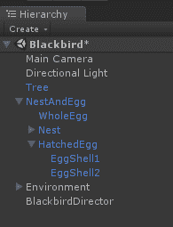

现在我们将激活序列添加到时间轴上：

1.  在层级中选择`BlackbirdDirector`，将`NestAndEgg`对象从层级拖动到时间轴编辑器窗口中。

1.  弹出一个菜单，询问要添加哪种类型的轨道；选择激活轨道。

1.  在轨道上添加了一个小矩形轨道标记。点击并拖动到合适的位置。

1.  将轨道定位和大小调整到从`35:00`开始到`165:00`结束。

现在来处理鸡蛋。尽管鸡蛋模型是`NestAndEgg`的子对象，但它们可以独立于父对象（当然，前提是父对象本身已经启用）被激活：

1.  将`WholeEgg`对象从层级拖动到时间轴上作为激活轨道。

1.  将其定位为从`35:00`开始到`60:00`结束。

1.  将`HatchedEgg`对象从层级拖动到时间轴上作为激活轨道。

1.  将其定位为从`60:00`开始到`165:00`结束。

类似地，当鸡蛋在 60 秒时孵化，激活鸟：

1.  将`Bluejay`对象从层级拖动到时间轴上作为激活轨道。

1.  将其定位为从`35:00`开始到`60:00`结束。

1.  将`HatchedEgg`对象从层级拖动到时间轴上作为激活轨道。

1.  将其定位为从`60:00`开始到`165:00`结束。

现在带有激活轨道的时间轴看起来如下。你可以看到，在左侧，每个轨道都有一个对象槽，包含由轨道控制的游戏对象。

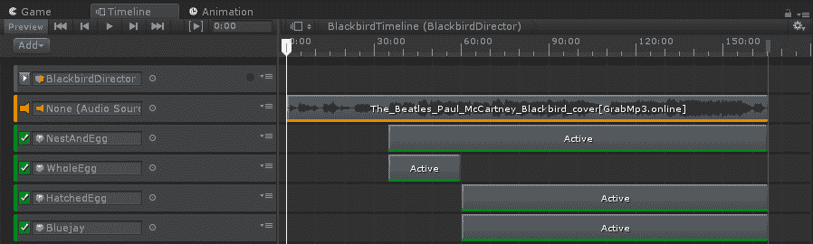

使用预览播放（时间轴编辑器左上角的控制图标）可以播放和预览这些轨道。你可以通过拖动白色的播放头光标来浏览时间框架。你会看到巢、鸡蛋和鸟按照指定的时间激活和停用。

# 记录动画轨道

如你所预期，除了音频和激活轨道外，时间线还可以包括动画轨道。Unity 的动画功能在过去几年中不断发展，时间线大大简化了 Unity 中的基本动画功能。你可以在时间线内直接创建和编辑动画，而无需创建单独的动画剪辑和动画控制器。这些内容我们将在本章的后面部分介绍。现在，我们将从简单开始，仅对树和巢的几个变换参数进行动画处理。

# 一棵生长的树

我们想在时间线中添加一个动画，使树从小（缩放 `0.1`）生长到全尺寸，从 `0` 秒到 `30` 秒。我们通过为树添加一个动画轨道，并在每个关键帧时间记录参数值来实现这一点：

1.  确保在层次结构中选择 `BlackbirdDirector` 并打开时间线编辑器窗口

1.  将 `Tree` 从层次结构拖到时间线窗口中

1.  选择动画轨道作为我们添加的轨道类型

现在，我们可以开始记录关键帧：

1.  确保播放头光标设置为 `0:00`

1.  在时间线中，按 `Tree` 轨道上的红色录制按钮开始录制

1.  在层次结构中选择 `Tree`

1.  将其缩放设置为 (`0.1, 0.1, 0.1`)

1.  将播放头滑到 30 秒标记

1.  在层次结构中仍然选择 `Tree`，将其缩放设置为 (`1, 1, 1`)

1.  再次按下闪烁的红色录制按钮以停止录制

1.  点击小图表图标以显示动画曲线，如图所示：

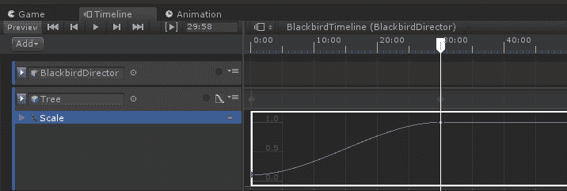

你可以看到，我们的时间线现在有一个引用 `Tree` 游戏对象的动画轨道。它有两个关键帧，从 `0` 秒开始，到 `30` 秒结束。Unity 为这两个关键值之间的过渡添加了一个温和的曲线，以平滑过渡。

当你抓住并拖动播放头光标在时间线曲线上时，你可以在场景窗口中看到树的大小变化。如果你按下预览播放图标，你可以播放动画。

# 一只生长的鸟

重复之前的练习，这次是培养蓝松鸦。将其从幼鸟（缩放 = `1`）生长到全尺寸（缩放 = `8`），在 `60` 秒和 `70` 秒标记之间持续 10 秒。

# 使用动画编辑器

接下来，我们将创建另一个动画轨道，以动画化巢，使其从生长的树中开始定位，然后缓慢飘落到地面，像落叶一样飘动。我们希望它表现出轻微的摇摆动作。这比我们刚才做的简单两个关键帧动画要复杂一些，所以我们将在一个单独的动画窗口中工作，而不是在时间线编辑器的狭窄轨道带上。它将从 0:35 动画到 0:45。

动画基于关键帧。要动画化一个属性，你需要创建一个关键帧，并定义该帧在时间上的属性值。在上一个例子中，我们只有两个关键帧，对应于起始和结束的缩放值。Unity 在两者之间填充了漂亮的曲线。你可以插入额外的关键帧，并编辑曲线形状。

# 一堆飘动的巢

假设您的场景已经将巢穴定位在地面，这是我们想要它最终到达的位置，以下步骤：

1.  将`NestAndEgg`对象从层级结构拖动到时间轴窗口中。

1.  选择动画轨道作为轨道类型。

1.  将播放头光标设置到`35:00`。

1.  注意，当对象处于非活动状态时，录制图标将不可用。播放头必须在对象的激活轨道的激活范围内。

1.  按下`NestAndEgg`动画轨道的录制图标开始录制。

1.  在层级结构中选择`NestAndEgg`对象。

1.  将当前变换值复制到剪贴板（在检查器中，选择变换组件上的齿轮图标，并复制组件）。

1.  在场景窗口中，确保当前选中的是移动操纵杆。

1.  在树中重新定位巢穴。Y 位置 = `5`对我来说适用。

1.  将播放头滑动到`45:00`。

1.  在`NestAndEgg`检查器中，点击变换的齿轮图标并粘贴组件值。

1.  再次按下闪烁的红色录制按钮以停止录制。

在定义了初始动画录制后，我们可以在动画编辑器窗口中开始工作：

1.  在轨道上，点击其右上角的小菜单图标

1.  选择在动画窗口中编辑，如图所示：

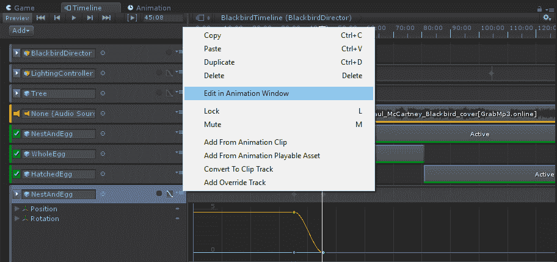

动画窗口有两种视图模式：Dopesheet 和 Curves。Dopesheet 视图允许您专注于每个属性的键帧。Curves 视图允许您专注于键帧之间的过渡。

目标是制作一个微妙的浮动动作，巢穴在 X 和 Z 轴上从一侧摇到另一侧，并在每个轴上轻微旋转。为此，我们首先将在落下的开始、中间和结束时“锚定”巢穴。（我们已经有开始和结束位置。）然后，我们将添加几个具有任意值的关键帧来实现柔和的运动。

使用 Dopesheet 视图，我们首先确保在开始和结束时间以及中间都有一个关键帧。按照以下方式在 35 秒、40 秒和 45 秒处添加关键帧：

1.  如果没有，添加旋转属性（添加属性 | 变换 | 旋转 | “+”）

1.  将播放头放置在动画的开始（`35:00`）

1.  在属性列表上方的控制栏中点击添加关键帧图标（如图下屏幕截图所示）

1.  将播放头移动到大约一半的位置，到`40`秒标记

1.  点击添加关键帧图标

1.  再次确认，确保在结尾处有关键帧标记（`45:00`）

您可以使用快捷键在关键帧之间切换。按“Alt+.”（Alt+句号）跳转到下一个关键帧。按“Alt+,”（Alt+逗号）跳转到上一个关键帧，按“Shift+,”（Shift+逗号）跳转到第一个关键帧。

现在，我们在`37.5`处添加一个关键帧：

1.  将播放头移动到 37.5

1.  点击添加关键帧图标

1.  点击左上角的红色录制图标以捕获新值

1.  在层级结构中选择`NestAndEgg`对象

1.  在场景视图中，使用移动工具操纵杆，将巢穴在 X 和 Z 轴上稍微移动一点（大约 0.4 个单位）

1.  使用旋转工具，在任意轴组合上轻轻旋转巢（最多 10 度）

1.  将播放头移动到`42.5`并重复步骤 2-6

在 Dopesheet 视图中，显示的动画窗口，包括其位置和旋转属性值，如下所示，在关键帧 37.5 处。为读者标识了添加关键帧图标：

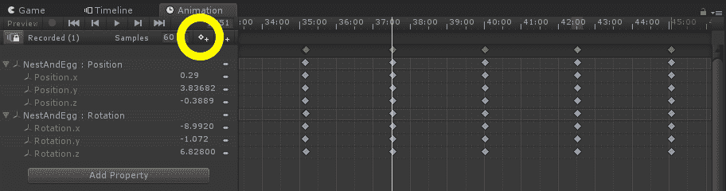

曲线视图让您专注于关键帧之间的过渡，并提供调整值和塑造曲线样条的能力。我的当前曲线视图如下所示：

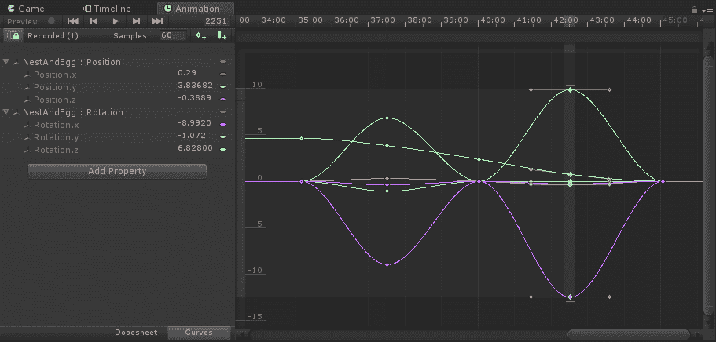

动画窗口中滚动条的长度表示当前缩放视图。每个滚动条的椭圆形末端是可以抓取的控制，让您可以直接调整缩放以及视图的位置。

返回到时间轴编辑器窗口。您可以通过滑动播放头光标在场景窗口中查看动画，或按预览播放图标播放它们。

# 动画其他属性

在我们的故事中，我们希望灯光从夜晚开始，逐渐过渡到黎明再到白天。我们将通过操作方向光、天空盒材质和聚光灯来实现这一点。

# 动画灯光

为了达到戏剧效果，让我们让场景从夜晚慢慢淡入白天。我们将从开始关闭方向光，并逐渐增加其强度：

1.  在层级中选择`BlackbirdController`并打开时间轴编辑器窗口

1.  将`方向光`对象从层级拖到时间轴上

1.  按下其`记录`按钮

1.  确保播放头在`0:00`

1.  在层级中选择`方向光`并更改其`强度`参数为`0`

1.  将播放头移动到`40:00`秒标记

1.  将强度设置为`1`

这里显示了方向光的动画轨迹，其强度参数曲线如下：

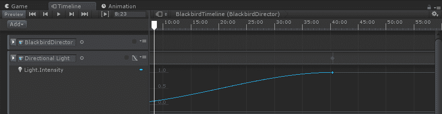

光照的其他参数也可以进行动画处理，包括其颜色和变换旋转角度。只需想象一下可能性！

让我们再添加一个点光源。为了达到戏剧效果，将其放置在巢的休息位置。这将首先照亮小树，一旦巢落在地面上，就会将用户的注意力集中在巢中的蛋上：

1.  创建 | 光 | 点光源

1.  在场景视图中，使用移动工具操纵杆将其定位在巢内，位于巢的地面位置

1.  选择`BlackbirdDirector`并打开时间轴编辑器

1.  将`点光源`拖到时间轴编辑器

1.  选择激活轨道

1.  从`0`到大约`95`启用灯光，在鸡蛋孵化后的一段时间内

看起来相当不错！

我们的 时间轴 开始变得有些拥挤。让我们将灯光移动到 轨道组：

1.  在时间轴中，选择添加 | 轨道组

1.  点击其标签并将其命名为“灯光”

1.  将每个灯光轨迹拖入组中

使用组轨道以嵌套树结构组织时间轴

# 动画脚本组件属性

正如我们所看到的，你可以动画化任何你可以在检查器中修改的 GameObject 属性。这包括你自己的 C#脚本组件的序列化属性。

我们想要将环境光照从夜晚渐变到白天。有几种方法可以实现这一点（参见前一章中关于球面照明的讨论）。我们决定通过修改 Skybox 材质的曝光值来实现（0 是关闭，1 是完全开启）。但是时间轴只能动画化 GameObject 属性，而这不是其中一个。所以我们将创建一个空的 LightingController GameObject 并编写一个控制 Skybox 材质的脚本。

让我们为场景添加自己的 Skybox 材质。你可以使用你喜欢的任何天空盒纹理。我们将从之前导入的 WispySkybox 包中获取一个，名为`WispyCubemap2`：

1.  创建一个新的材质（资产 | 创建 | 材质），并将其命名为`BlackbirdSkyMaterial`

1.  在检查器中，为其着色器选择 Skybox/Cubemap

1.  点击选择其 Cubemap 纹理芯片，并选择`WispyCubemap2`

1.  打开光照窗口（如果不在编辑器中，请选择窗口 | 光照 | 设置）

1.  将`BlackbirdSkyMaterial`从项目资产拖动到天空盒材质槽位

1.  取消选中“混合光照烘焙全局光照”复选框

我们不想烘焙任何环境光照，因为我们将在运行时修改其设置。

再次选择`BlackbirdSkyMaterial`，看看当你滑动曝光值在`1`和`0`之间时会发生什么。它将渐变天空盒的亮度。我们将动画化这个值来修改场景中的环境光。但是动画只能修改 GameObject 参数，所以我们将编写一个脚本：

1.  创建一个新的 C#脚本，并将其命名为`SkyboxMaterialExposureControl`。

1.  打开脚本并按照以下方式编写：

```cs
public class SkyboxMaterialExposureControl : MonoBehaviour
{
    public Material skyboxMaterial;
    public float exp = 1.0f;

    private void Update()
    {
        SetExposure(exp);
    }

    public void SetExposure(float value)
    {
        skyboxMaterial.SetFloat("_Exposure", value);
    }
}
```

保存文件。在 Unity 中，让我们创建一个使用该脚本的 LightingController 对象，如下所示：

1.  在层级面板中创建一个空对象，命名为"LightingController"

1.  将`SkyboxMaterialExposureControl`添加到该对象

1.  将`BlackbirdSkyMaterial`拖动到其 Skybox 材质槽位

现在，让我们为这个参数添加动画：

1.  在层级面板中选择`BlackbirdController`并打开时间轴编辑器窗口

1.  从层级面板中将`LightingController`对象拖动到时间轴上

1.  按下它的录音按钮

1.  确保播放头在`0:00`

1.  在层级面板中选择`LightingController`，并将其 Exp 参数更改为`0`

1.  将播放头移动到`100:00`秒标记

1.  将 Exp 设置为`1`

这里显示了带有 SkyboxMaterialExposureControl 轨道的时间轴编辑器窗口：

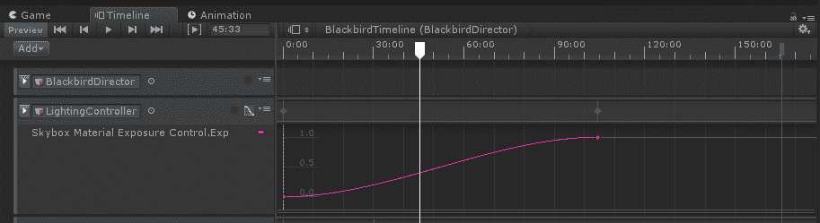

按下播放，随着天空盒材质的曝光从 0 到 1 变化，场景光照将从夜晚渐变到白天。（注意，在时间轴预览播放中不可用，仅在编辑器播放中可用）。以下是场景在约 45 秒时的截图：

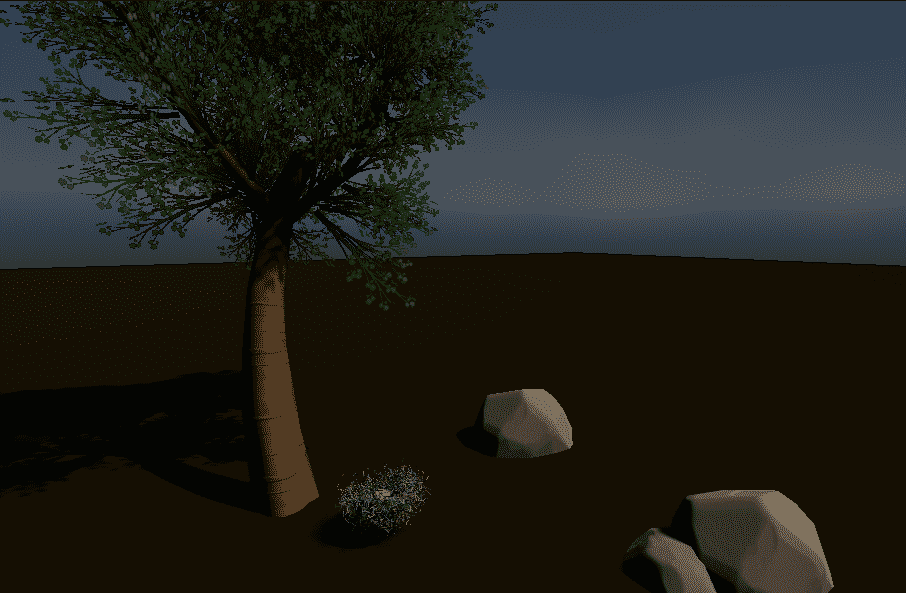

# 控制粒子系统

你可以使用其他效果继续改进场景。我们希望包括落叶效果，这可以通过粒子系统实现，并使用控制轨道播放。

很抱歉，我们无法推荐一个特定的免费“落叶”资产，因为我们找到的所有 Asset Store 中的都是付费的。有一个过时的免费 Sky FX 包（[`assetstore.unity.com/packages/vfx/particles/environment/sky-fx-pack-19242`](https://assetstore.unity.com/packages/vfx/particles/environment/sky-fx-pack-19242)），我们从其中借用了纹理并制作了自己的粒子系统预制件，包含在这本书中。

假设你有一个 FallingLeaves 粒子系统，现在我们可以将其添加到项目中：

1.  将`FallingLeaves`预制件的副本拖入场景中。

1.  在时间轴编辑器窗口（选择`BlackbirdDirector`），点击添加并选择控制轨道。

1.  在控制轨道的菜单图标中，选择添加控制可播放资产剪辑。

1.  这在轨道上为剪辑创建了一个小矩形。选择它。

1.  在检查器中，将`FallingLeaves`游戏对象从层次结构拖到源游戏对象槽中。

1.  返回到时间轴窗口，抓住并滑动矩形到 120 秒的位置，然后将其右边缘拉伸到时间轴的末端（165 秒）。

这里显示了可播放资产的检查器：

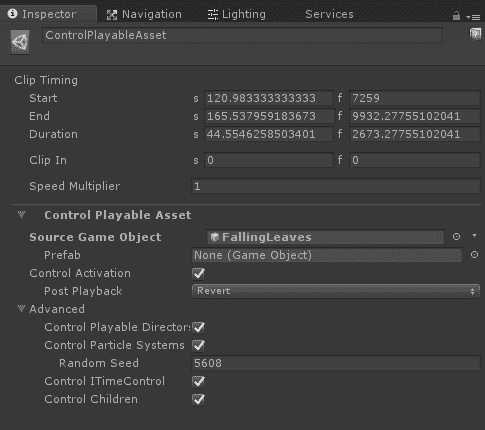

以及这个控制轨道的时间轴如下：

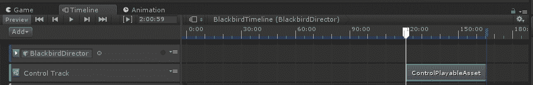

同样，如果你在场景中有多个时间轴，你可以使用控制轨道（通过具有`PlayableDirector`组件的游戏对象）从另一个时间轴控制它们。在我们的应用程序中，我们使用一个单独的时间轴，带有在唤醒时播放，因此它从应用程序的开始播放到结束。然而，在场景中有多个时间轴时，你可以按需播放它们。

你也可以编写自己的自定义时间轴轨道类。例如，使用控制轨道播放粒子系统是有限的。这里（[`github.com/keijiro/TimelineParticleControl`](https://github.com/keijiro/TimelineParticleControl)）是一个自定义轨道类，`ParticleSystemControlTrack`，它提供了控制发射率、速度和其他功能。如果你查看它们的`.cs`代码，它提供了一个编写自定义轨道类的良好示例。

分离的动画剪辑是另一种可添加并按顺序排列在时间轴轨道中的可播放资产。我们接下来看看这一点。

# 使用动画剪辑

对于下一个动画示例，我们将让鸡蛋在孵化前摇动和震动。我们将创建一个简单的动画，并使其在整个过程中循环。为了说明，我们将创建一个 WholeEgg 摇动的动画剪辑，并将其添加到动画剪辑轨道上的时间轴中。

# 摇晃鸡蛋

要在 WholeEgg 对象上创建一个新的动画剪辑，请按照以下步骤操作：

1.  在层次结构中，选择 WholeEgg 对象（NestAndEgg 的子对象）

1.  打开动画窗口（窗口 | 动画）

1.  您应该看到一个消息，要开始动画 WhileEgg，请创建一个动画剪辑并一个创建按钮。

1.  按下创建。

1.  当提示文件名时，将其保存为`EggShaker.anim`。

我们在本章的早期部分看到了动画窗口。我们将制作一个非常短的 2 秒动画，通过操作动画曲线来旋转鸡蛋在 X 轴和 Z 轴上：

1.  使用窗口底部的曲线按钮显示曲线视图。

1.  按下添加属性和 WholeEgg | 变换 | 旋转 | +以添加旋转属性。

1.  在左侧选择 WholeEgg：旋转属性组。

1.  按键盘上的*A*键以全屏缩放；您应该看到三条平行的线，每条线代表一个 X、Y、Z 旋转轴。

1.  点击控制栏右上角的添加关键帧图标。

1.  默认情况下，可能已经有一个关键帧在 1 秒（1:00）处。如果没有，移动播放头并单击添加关键帧。

1.  滚出（鼠标中间滚轮或使用水平滚动条的椭圆形端点手柄）以便您可以看到 2 秒标记。

1.  将播放头移动到 2 秒并添加关键帧。

1.  将播放头移动到 1 秒标记处。

现在，我们将编辑动画样条曲线。如果您熟悉样条编辑，每个节点上有一条线表示该点的曲线切线，以及线的两端用于编辑曲线的手柄。（您也可以通过右键单击节点来修改此工具的操作。）

1.  点击 Rotation.X 属性 1:00s 节点，然后抓住一个手柄来制作一个平滑的 S 曲线。不要太陡峭，介于 30 度和 45 度之间。

1.  重复此操作，对 Y 轴和 Z 轴进行一些变化，如下所示：

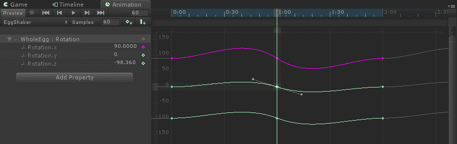

对于一个或两个轴，添加一个额外的关键帧，使曲线看起来更随机。我的最终曲线如下所示。

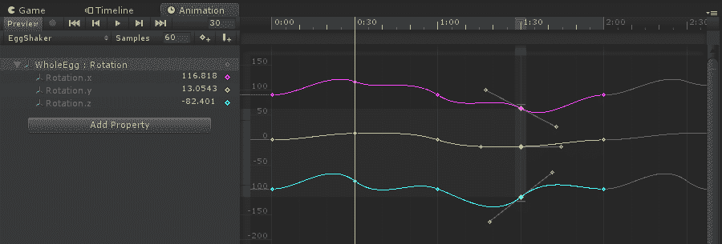

完成这些操作后（曲线可以在稍后编辑和细化），选择 BlackbirdDirector，打开时间轴窗口，并执行以下步骤：

1.  选择添加并选择动画轨道。

1.  将`WholeEgg`对象从层次结构拖到时间轴上。

1.  选择动画轨道。

这次，我们不会录制，而是使用我们刚刚创建的，并使其来回动画如下：

1.  使用轨道上的菜单图标选择从动画剪辑添加。

1.  在轨道上添加一个小矩形。将其滑动到大约 50 秒处，此时巢穴在地面，但小鸡尚未孵化。

1.  在检查器中，我们现在有更多的剪辑选项。在动画外推下，选择后外推：ping pong。

带有时间轴的动画剪辑相当灵活。您可以将多个动画剪辑添加到动画轨道中，并通过将它们滑动到彼此之间来混合它们。如果您需要更多的控制，则可以使用 Animator Controller。

# 使用 Animator Controllers。

虽然将动画作为时间轴轨道记录非常方便，但它确实有限制。这些动画“存在于”时间轴中。但有时你希望将动画视为独立的资产。例如，如果你想使动画重复循环，或在不同动画之间切换，或混合动作，或将相同的动画曲线应用到其他对象上，你会使用动画片段。

我们将查看一些现有的动画师示例，然后使用现有的鸟类示例来让我们的蓝松鸦飞翔。

# 动画和动画师的定义

**动画师**是管理 Unity 中*动画片段*的标准方式，在时间轴出现之前。它使用动画组件、动画控制器和动画片段。幸运的是，如果你在对象上创建一个新的动画片段，Unity 会为你创建这些项目中的每一个。但了解它们如何协同工作是很重要的。

简单来说，根据 Unity 手册([`docs.unity3d.com/Manual/animeditor-CreatingANewAnimationClip.html`](https://docs.unity3d.com/Manual/animeditor-CreatingANewAnimationClip.html))：

“在 Unity 中动画化 GameObject，对象或对象需要附加一个**动画组件**。这个动画组件必须引用一个**动画控制器**，而动画控制器反过来又包含对一个或多个**动画片段**的引用。”

这些对象起源于 Unity 中折叠的 Mecanim 动画系统，这个系统在几个版本之前就被整合进来了（你可能在 Unity 手册和网络搜索中仍然看到对 Mecanim 的引用）。这个动画系统特别适合用于人形角色动画（参见[`docs.unity3d.com/Manual/AnimationOverview.html`](https://docs.unity3d.com/Manual/AnimationOverview.html)）。术语可能看起来冗余且令人困惑。以下定义可能有所帮助（也可能不会！）。请特别注意“动画师”与“动画”的使用：

+   *动画片段*：描述了对象属性随时间的变化。

+   *动画控制器*：在状态机流程图中组织片段，跟踪当前应该播放哪个片段，何时动画应该改变或混合。引用它所使用的片段。

+   *动画组件*：将动画片段、动画控制器和（如果使用）Avatar 结合在一起。

+   不要使用*旧版动画组件*：动画组件是旧版的，但动画窗口不是！

+   *动画窗口*：用于创建/编辑单个动画片段，可以动画化你在检查器中可以编辑的任何属性。显示时间轴，但与时间轴窗口不同。提供 Dopesheet 与曲线视图。

+   *动画师窗口*：将现有的动画片段资产组织成类似流程图的有限状态机图。

实际上，时间轴动画记录也使用动画片段，只是你不需要明确创建它们。时间轴中的每个记录的动画轨道在你的资产文件夹中都有一个对应的可播放的动画文件（命名为“Recorded (n)”）。

# 第三人称控制器动画师

我们在前面章节中为伊森使用的`ThirdPersonController`角色预制件使用动画控制器来管理绑定模型上的人形动画剪辑。出于好奇，我们现在来检查它（尽管我们不会在这个场景中使用它）：

1.  暂时将`ThirdPersonController`预制件的副本从你的项目`Assets/Standard Assets/Characters/ThirdPersonCharacter/Prefabs/`文件夹拖到场景中。

1.  在检查器中注意，它有一个动画组件，并且控制器槽引用了`ThirPersonAnimatorController`。点击它。

1.  这将突出显示控制器资产（在`Assets/.../ThirdPersonCharacter/Animator`）。

1.  双击`ThirdPersonAnimatorController`以在动画器窗口中打开它。

以下是伊森的动画图。你可以看到当角色被激活（`Entry`）时，它初始化到`Grounded`状态。椭圆形框是状态；它们之间的线条是转换。左侧是动画器可以使用的状态属性列表。例如，当`Crouch`为真时，动画转换到`Crouching`，播放该动画，然后转换回（并清除`Crouch`状态标志）：

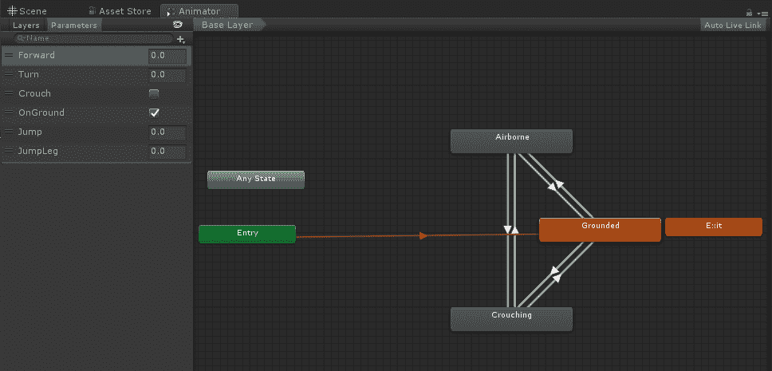

如果你打开`Grounded`状态（双击），你可以看到一个包含令人印象深刻的站立空闲、行走、转向等动画剪辑的 Blend Tree。这些将根据用户输入被激活和组合（混合）。

接下来，让我们看看另一个例子，我们`Bluejay`使用的`BirdAnimatorController`。

你现在可以从场景中删除`ThirdPersonController`对象。

# Living Birds 动画器

Living Birds 包附带了很多动画剪辑。你实际上可以在 Blender 或其他动画应用程序中打开 FBX 模型，检查模型和动画是如何定义的。这些已经被组合成一个`BirdAnimationController`。使用以下步骤检查动画器：

1.  在层次结构中选择`Bluejay`。

1.  在检查器中注意，它有一个动画组件，并且控制器槽引用了`BirdAnimatorController`。点击它。

1.  在项目资产中，双击`ThirdPersonAnimatorController`以在动画器窗口中打开它。

这里显示了动画图：

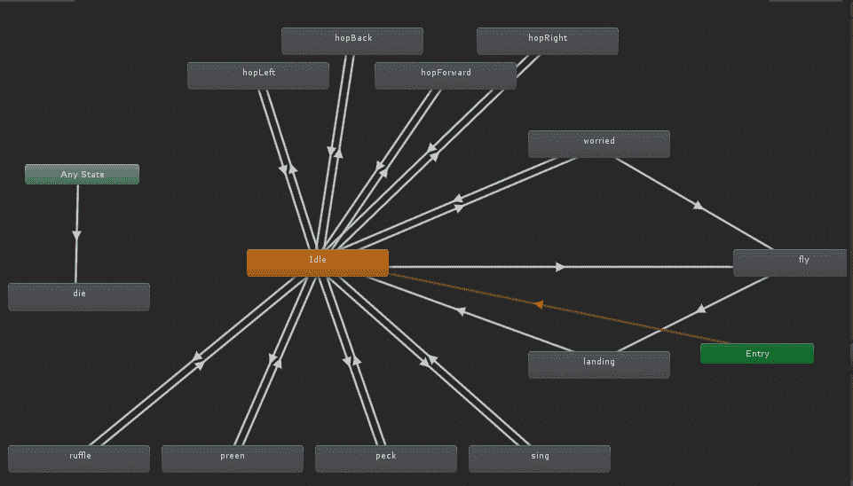

你可以看到几乎所有的动画都可以轻松地转换到和从空闲状态，无论是 Preen、Peck、Sing 还是 HopLeft、HopRight、HopForward 等。此外，注意 Idle -> Fly -> Landing -> Idle 循环，因为我们将要使用它。

蓝松鸦还有一个 C#脚本，`lb_Bird`，它调用动画器行为。这不是最干净的代码，但很有用。最相关的函数是`OnGroundBehaviors`和`FlyToTarget`：

+   `OnGroundBehaviors`每 3 秒随机选择并播放一个空闲动画

+   `FlyToTarget`将使鸟飞到指定位置，包括起飞和降落以及随机振翅；看起来相当自然

因此，在我们的项目中，我们不会像记录下落巢穴的关键帧位置细节那样记录鸟儿动画路径的关键帧位置，而是定义特定的目标，并让 `lb_Bird` 脚本实际控制鸟儿的变换。这就像我们在第四章 *基于注视的控制* 中使用 Navmesh 指导 Ethan 的移动一样。我们将使用时间轴在一段时间内选择一个目标位置到下一个位置。

# 学习飞翔

首先，让我们创建一个 `BirdController` 并指定鸟儿应该飞越的位置列表。然后，我们将将其添加到时间轴中：

1.  在层次结构中创建一个名为 `BirdController` 的空游戏对象并重置其变换。

1.  创建一个子空对象，命名为 `Location1`。将其移动到 Nest 最近的岩石顶部。

1.  创建另一个空对象，命名为 `Location2`，这次将其定位在巢穴附近但不在巢穴内。

1.  继续创建位置标记。我使用的值基于我的场景和岩石位置，如下表所示。

1.  最后一个位置应该很远。鸟儿将在视频结束时飞向那里。

| 名称 | 位置 | 描述 |
| --- | --- | --- |
| `Location0` | `(0.75, 0.4, -1.25)` | Bluejay 的起始位置 |
| `Location1` | `(3, 0.8, 0)` | 在最近的岩石顶部 |
| `Location2` | `(1.2, 0.2, -1.7)` | 地面靠近巢穴但不在巢穴内 |
| `Location3` | `(2.5, 0.8, -3.4)` | 在下一个最近的岩石顶部 |
| `Location4` | `(-5.85, 0.8, -0.3)` | 下一个岩石 |
| `Location5` | `(-5, 0.33, 3.5)` | 最后一个岩石 |
| `Location6` | `(45, 11, 45)` | 在远处 |

在 `BirdController` 上创建一个新的 C# 脚本，命名为 `BirdController`，并编写如下：

```cs
using System.Collections;
using System.Collections.Generic;
using UnityEngine;
```

```cs

public class BirdController : MonoBehaviour
{
    public GameObject bird;
    public List<GameObject> targets = new List<GameObject>();
    public int animIndex;

    public bool collideWithObjects = false;
    public float birdScale = 1.0f;

    private int prevIndex;

    void Start()
    {
        prevIndex = 0;
    }

    void Update()
    {
        if (animIndex != prevIndex && 
            index > 0 && 
            index < targets.Count)
        {
            prevIndex = animIndex;
            bird.gameObject.SendMessage("FlyToTarget", targets[index].transform.position);
        }
    }
}
}
```

这里发生了很多事情。我们将进行解释。

`BirdController` 有对 `bird` 的引用，以及一个位置 `targets` 列表。我们将在 Unity 编辑器中填充这个列表。每个位置由一个介于 `0` 和列表大小之间的索引值标识。一个整数 `animIndex` 将是时间轴控制的参数，告诉控制器鸟儿应该飞向哪个位置。

在每个更新中，我们检查 `animIndex` 是否已更改。如果是，并且它在我们的列表范围内，它将在鸟儿上调用 `FlyToTarget`。（我们使用 `SendMessage`，这不是触发另一个对象中函数的最佳实践方式，但鉴于提供的现有脚本，这是最不具破坏性的方法。）

额外的两个变量 `collideWithObjects` 和 `birdScale` 在 `lb_Bird.cs` 脚本中未使用，但需要在 Bluejay 上使用。

保存脚本。现在，在 Unity 中：

1.  将 `BirdController` 脚本拖动到 `BirdController` 对象上作为组件

1.  将 `Bluejay` 拖动到鸟类槽位

1.  展开目标列表并将大小设置为 `7`

1.  将 `Location0` 拖动到元素 0，`Location1` 拖动到元素 1，依此类推

这里展示了带有 BirdController 组件的层次结构：

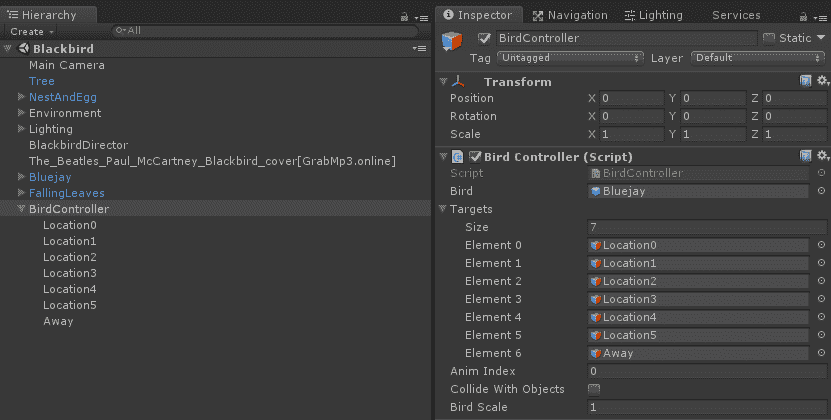

# 鸟类黑客技术

不幸的是，就像您在网上找到的很多代码一样，Living Birds 代码仅适用于其自身目的，但不一定适用于我们的目的。在这种情况下，该包是为生成一群随机飞翔和着陆的鸟而设计的，可以避免碰撞，甚至可以被杀死。我们只有一只鸟，并希望对着陆地点有更多的控制权，因此我们将使用我们的`BirdController`而不是包中的`lb_BirdController`。

打开`lb_Bird.cs`文件（附加到`Bluejay`）并按以下方式修改：

将`controller`的定义替换为我们的`BirdController`：

```cs
// lb_BirdController controller; // removed
public BirdController controller; // added
```

注释掉或删除`SetController`函数：

```cs
// remove this
// void SetController(lb_BirdController cont){
//     controller = cont;
// }
```

保存它。在 Unity 中，将`BirdController`对象拖动到 Bluejay 的 LB_Bird Controller 槽中。

# 飞走吧！

现在，我们将 BirdController 添加到我们的时间轴中作为动画轨道。AnimIndex 参数是一个整数值，其值将在时间轴上逐步增加。我们希望 Bluejay 在大约 80 秒开始学习飞翔，每隔大约 10 秒从一个地点跳到另一个地点（80, 90, 100, 110, 120，并在 130 秒时飞走）。

1.  打开`BlackbirdDirector`的时间轴编辑器窗口。

1.  将`BirdController`对象从层级拖动到时间轴上，添加一个新的动画轨道。

1.  按下它的红色录音按钮。

1.  在层级中选择`BirdController`。

1.  将播放头移动到`80`，在检查器中设置动画索引为`1`。

1.  将播放头移动到`90`，并将动画索引设置为`2`。

1.  对其他索引`3`到`6`重复此操作。

1.  再次按下红色录音按钮以停止录音。

1.  预览曲线。如果它不在 0（80 秒之前）开始，请使用动画窗口中的编辑，并添加另一个值为`0`的关键帧。

这里显示了动画索引参数的动画轨道曲线，每个关键帧简单地递增一次：

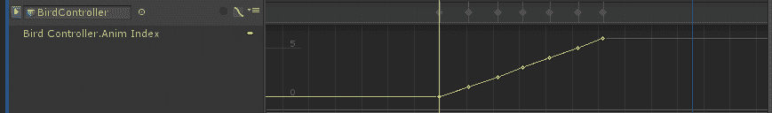

播放它。哇！鸟从一块石头飞到另一块石头，最终飞走了！

您可以通过移动位置对象和动画曲线关键帧来调整鸟的路径和着陆之间的时间。您还可以尝试动画化 BirdController 的 Bird Scale 参数，使鸟在学习飞翔的过程中变得越来越勇敢和强壮。这里提供了一个屏幕截图，展示了鸟在飞翔和树叶飘落：

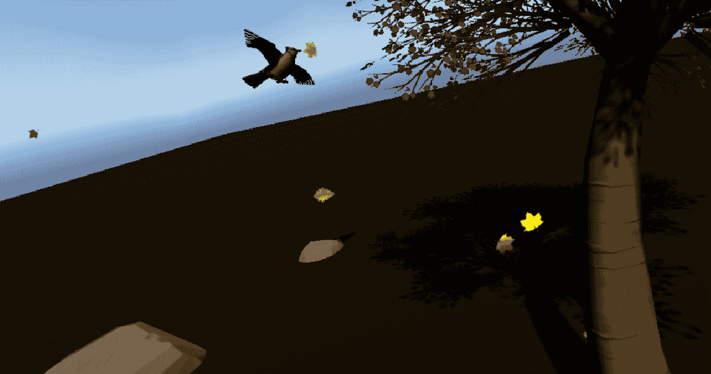

我们已经完成了一个故事。为了结束这个话题，让我们添加一点交互性，以便玩家可以控制故事何时开始播放。

# 制作交互式故事

到目前为止，我们使用了时间线从开始到结束驱动我们的整个 VR 故事体验。但事实上，时间线就像 Unity 中的其他可播放资产一样。例如，如果你选择 BlackbirdDirector 对象并在检查器中查看其 Playable Director，你会看到它有一个 Play On Awake 复选框，并且目前是勾选的。我们现在要做的不是在唤醒时播放，而是在用户事件上开始播放，即直接看几秒钟的小树。当故事结束时，它会自动重置。

# 看看如何播放

首先，我们将添加一个包围小树的 LookAtTarget，然后使用它来触发播放时间线：

1.  选择 `BlackbirdDirector` 并取消勾选 `Play On Awake` 复选框

1.  为了参考，将树游戏对象的缩放设置为它的起始关键帧缩放 (`0.1, 0.1, 0.1`)

1.  在 `Hierarchy` 中创建一个立方体（创建 | 3D 对象 | 立方体）并将其命名为 `LookAtTarget`

1.  缩放并放置它以包围小树，缩放 (`0.4, 0.5, 0.4`)，位置 (`0, 0.3, 0`)

1.  禁用其 `Mesh Renderer`，但保留其 `Box Collider`

1.  在立方体上创建一个新的 C# 脚本，命名为 `LookAtToStart`，并按照以下内容编写：

```cs
using System.Collections;
using System.Collections.Generic;
using UnityEngine;
using UnityEngine.Playables;

public class LookAtToStart : MonoBehaviour
{
    public PlayableDirector timeline;
    public float timeToSelect = 2f;
    private float countDown;

    void Start()
    {
        countDown = timeToSelect;
    }
```

```cs

    void Update()
    {
        // Do nothing if already playing
        if (timeline.state == PlayState.Playing)
            return;

        // Is user looking here?
        Transform camera = Camera.main.transform;
        Ray ray = new Ray(camera.position, camera.rotation * Vector3.forward);
        RaycastHit hit;
        if (Physics.Raycast(ray, out hit) && 
            (hit.collider.gameObject == gameObject))
        {
            if (countDown > 0f)
            {
                countDown -= Time.deltaTime;
            }
            else
            {
                // go!
                timeline.Play();
            }
        }
        else
        {
            // reset timer
            countDown = timeToSelect;
        }
    }
}
```

脚本与我们在第四章中编写的类似。我们使用主摄像机并确定它所看的方向。使用物理引擎，我们调用 `Physics.Raycast` 来在视图方向上发射一条射线并确定是否击中这个对象。如果是这样，我们开始或继续倒计时计时器并播放时间线。同时，如果你看向别处，我们重置计时器。

现在试试。时间线不会开始播放，直到你看了几秒钟的立方体。

# 重置初始场景设置

很可能你已经注意到了，不幸的是，默认的起始场景并不一定是时间线开始时的相同状态。你可以通过手动确保场景层次结构中的每个对象都具有时间线开始时的相同初始状态来修复这个问题。相反，我们将添加一个小技巧，让时间线播放短短的 0.1 秒来重置对象。

我们将使用协程来实现这一点。修改 `LookAtToStart` 脚本，添加一个新变量 `resetSetup` 并将其初始化为 true：

```cs
private bool resetSetup;

void Start()
{
    countDown = timeToSelect;
    resetSetup = true;
}
```

添加一个 `PlayToSetup` 函数，它将作为一个协程运行。协程是一种运行函数的方式，让 Unity 短暂地做其他事情，然后从上次停止的地方继续（通过 `yield` 语句）。在这里，我们开始播放时间线，离开 0.1 秒，然后告诉它停止播放：

```cs
IEnumerator PlayToSetup()
{
    timeline.Play();
    yield return new WaitForSeconds(0.1f);
    timeline.Stop();
}
```

当我们想要重置设置时，从 `Update` 中调用协程：

```cs
    void Update()
    {
        if (timeline.state == PlayState.Playing)
        {
            return;
        }
        if (resetSetup)
        {
            StartCoroutine("PlayToSetup");
            resetSetup = false;
        }
```

我们还希望时间线播放完毕后场景能够重置，因此我们一启动时间线就设置 `resetSetup`。它将在 `timeline.state` 不再播放时被识别：

```cs
        ...
            // go!
            timeline.Play();
            resetSetup = true;
        }
```

按下播放。看向树木。享受体验。当它结束时，你会重置到开始位置，可以再次看向树木以重新播放。

# 更多交互性想法

我们现在将停止开发。以下是一些改进交互性和用户体验的建议：

+   在树周围添加粒子效果，以表明它是触发器

+   当你看着树时，将其突出显示作为反馈

+   显示倒计时光标，以指示计时器已开始，以及故事何时开始播放

这里有一些其他建议，你可以将这些可交互对象添加到故事中：

+   看巢中的蛋会导致它比默认时间提前孵化

+   当你看着闲置的鸟时，它会转身回看你

+   如果你用你的手控制器戳鸟，它会跳开

+   你可以捡起一块石头扔向鸟（nooo，只是开玩笑！）

# 摘要

在本章中，我们构建了一个动画 VR 故事。我们首先决定我们要做什么，规划时间表、音乐曲目、图形资产、动画序列和照明。我们导入了我们的资产并将它们放置在场景中，然后创建了一个时间轴，并使用激活轨道草拟了特定对象何时启用和禁用。接下来，我们为几个对象进行了动画处理，包括让树生长、让巢漂浮和让蛋震动。我们还对照明进行了动画处理，学习了如何动画化除了变换之外的游戏对象参数。

我们还使用了动画剪辑和动画控制器，使用从第三方包导入的动画。我们审查了一个调用动画器的脚本，并在其上编写了一个控制器，以使鸟从地点飞到地点。最后，我们通过基于注视的控制来启动和重播体验，添加了故事中的交互。

在下一章中，我们将探讨如何将多人网络添加到 Unity VR 项目中，以及如何将场景添加到新兴的元宇宙中。多人游戏对我们大多数人来说都很熟悉，但与虚拟现实结合时，它提供了一种其他任何技术都无法比拟的社会体验。我们将通过使用 Unity 网络功能来学习网络技术。
