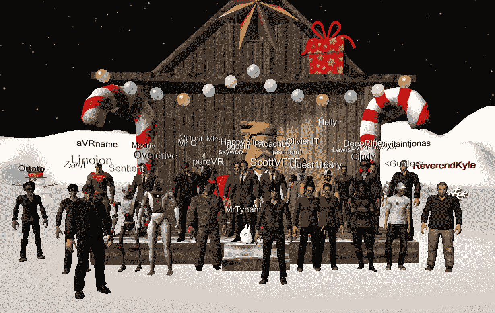
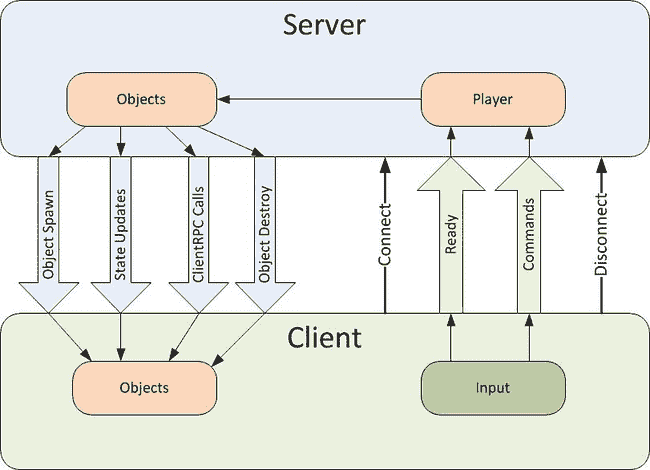
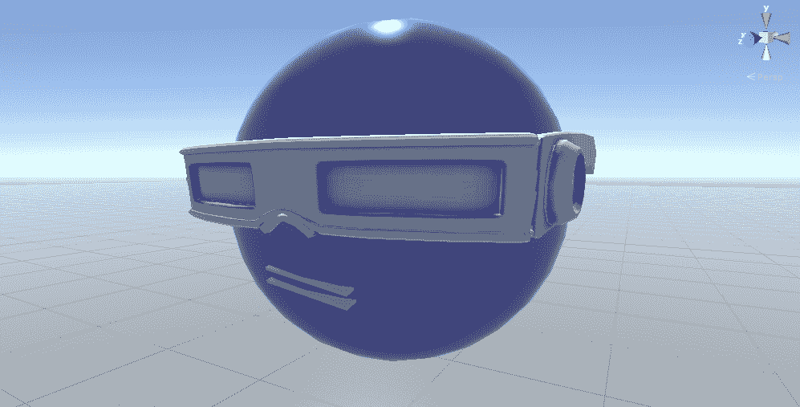
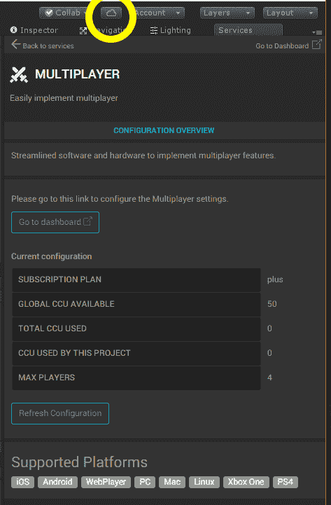
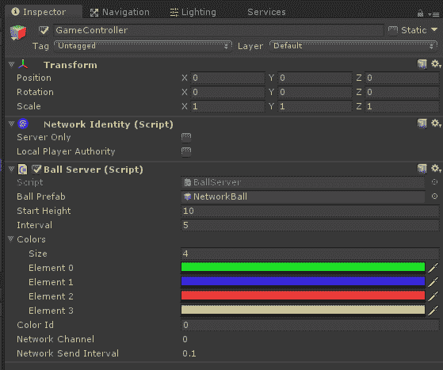
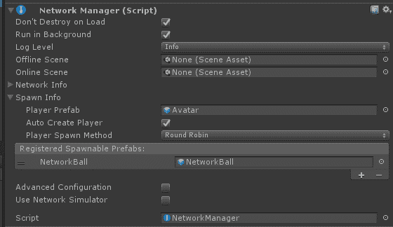
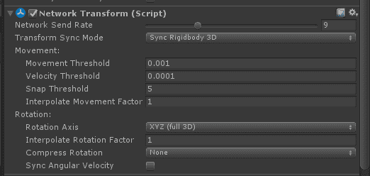
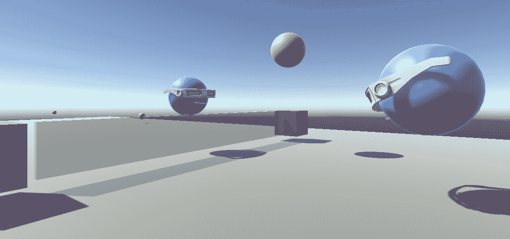
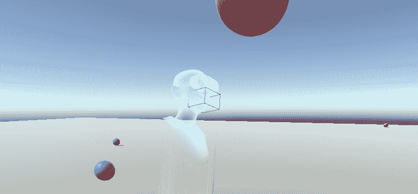
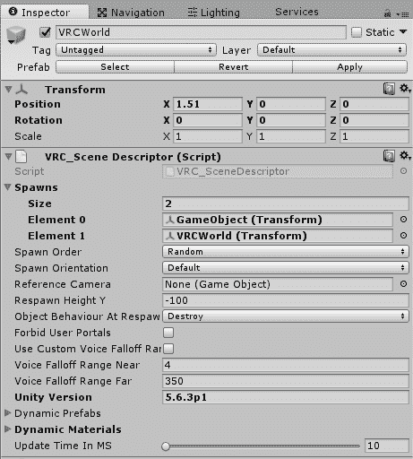

# 社交 VR 元宇宙

*那是我，Linojon，前面戴棒球帽的家伙!* 重要的是，以下照片是在 2014 年 12 月 21 日元宇宙前夕，在一场现场 VRChat 会议期间捕捉到的。我建立了一个季节性的世界名为 GingerLand，并邀请我的聊天室朋友在每周聚会期间参观。然后，有人建议，“嘿，让我们拍一张集体照！”于是，我们都聚集在我的冬日小屋前门，说“Cheese！”其余的就是历史：



对于许多人来说，在 VR 中与其他人实时社交互动的直观体验至少与使用 Facebook 浏览静态网站或分享 Snapchats 查看在线相册之间的差异一样戏剧性。这非常个人化和生动。如果你亲自尝试过，你就知道我是什么意思。我们现在将探讨如何使用 Unity 实现社交 VR 体验。有许多方法，从从头开始构建到连接到现有的社交 VR 平台。在本章中，我们将讨论以下主题：

+   多玩家网络工作原理简介

+   使用 Unity 网络引擎在 VR 中实现多玩家场景

+   使用 Oculus 个性化化身

+   构建和分享自定义 VRChat 房间

注意，本章中的项目是独立的，并不直接需要本书其他章节中的其他章节。如果你决定跳过其中任何部分或没有保存你的工作，那没问题。

# 多玩家网络

在我们开始任何实现之前，让我们先了解一下多玩家网络是什么，并定义一些术语。

# 网络服务

考虑一种情况，你正在运行一个 VR 应用程序，该应用程序通过互联网连接到其他玩家，这些玩家同时在自己的 VR 设备上运行相同的应用程序。当你移动你的第一人称视角在游戏中，射击东西，或以其他方式与虚拟环境互动时，你希望其他玩家也能看到。他们的游戏版本与你的保持同步，反之亦然。这是如何工作的？

运行中的游戏的一个实例充当主机或服务器。其他玩家同时连接到同一个实例。当你移动时，你的角色的新位置会与每个其他连接共享，然后它们在自己的视图中更新你的化身位置。同样，当你游戏接收到另一个角色的位置变化时，它会在你的视图中更新。越快越好。也就是说，发送和接收消息以及相应屏幕更新的延迟（延迟）越短，交互感觉就越真实，或越实时。

多玩家服务应该帮助你管理所有活跃客户端之间游戏状态的共享，新玩家和对象的生成，安全考虑，以及低级网络连接、协议和服务质量（如数据速率和性能）的管理。

网络被构建为一系列 API 层，其中低级函数处理数据传输的细节，并且对数据内容一无所知。中间和高级层提供越来越聚合的功能，也可能更直接地有助于网络应用程序。在我们的案例中，这是多玩家游戏和社交 VR。理想情况下，高级层将提供你将多玩家功能集成到游戏中的所有所需，同时通过干净的 API 提供对其他层的访问，以防你有特殊要求。

可用的多玩家服务有很多，包括 Exit Games 的 Photon 和来自 Google、Facebook/Oculus、Apple、Microsoft、Amazon 等平台的平台。

+   可以通过 Unity Asset Store 中的免费 **Photon Unity Networking**（**PUN**）包轻松添加流行的 Photon Cloud 服务（更多信息，请访问 [`www.assetstore.unity3d.com/#/content/1786`](https://www.assetstore.unity3d.com/#/content/1786)）。如果你对在 Unity 中尝试 Photon 感兴趣，请查看他们的文档和教程页面（[`doc.photonengine.com/en-us/pun/current/demos-and-tutorials/photon-unity-and-networking-links`](https://doc.photonengine.com/en-us/pun/current/demos-and-tutorials/photon-unity-and-networking-links)）。

+   Unity 拥有自带的内置网络系统，称为 **Unity Networking**（**UNet**），这减少了自定义脚本的需求，并提供了一套功能丰富的组件和 API，这些组件和 API 与 Unity 紧密集成。Unity 网站上有一整套关于多玩家网络教程（[`unity3d.com/learn/tutorials/s/multiplayer-networking`](https://unity3d.com/learn/tutorials/s/multiplayer-networking)），这是我们本章项目中将使用的内容。

# 网络架构

网络的关键是客户端-服务器系统架构。我们在当今世界的各个方面都能看到这一点；你的网页浏览器是一个客户端，而网站托管在服务器上。你最喜欢的音乐收听应用是一个客户端，它的流媒体服务是服务器。同样，当你的游戏实例连接到网络时，它也是一个客户端。它与服务器通信，传递所有其他游戏客户端之间的状态和控制信息。

我说的是 **服务器**，但并不一定需要是一个位于某处的独立物理计算机。它可以是，但可能不是。最好将客户端和服务器视为 **进程**：程序或应用程序的实例在某处运行。一个 **云服务器** 是一个可以通过互联网作为服务访问的虚拟进程。

一个应用程序有时可以同时充当客户端和服务器。这种服务器和客户端合为一体的运行方式被称为作为主机运行。使用 Unity 网络，游戏可以作为客户端、服务器和/或作为主机运行。

即使如此，游戏实例之间进行通信需要公共**IP**（**互联网协议**）地址。一个轻量级的中继服务器可以用最少的资源提供这项服务。

# 本地与服务器

在 Unity 中，你可以在游戏过程中使用脚本创建或实例化新对象。在多人游戏中，这些对象需要在本地以及网络上激活或生成，以便所有客户端都能了解它。一个生成系统管理所有客户端的对象。

区分本地玩家对象和网络对象非常重要。本地玩家对象由你在游戏版本中的操作控制，在你的客户端上，而不是远程控制。

例如，在第一人称体验中，你是摄像头，而其他玩家将你视为你的化身，你希望有安全预防措施；例如，防止他人黑客攻击游戏并更改你的化身。

本地玩家对象具有本地权限，也就是说玩家对象负责控制自身，例如其自身的移动。否则，当对象的创建、移动和销毁不由任何玩家控制时，权限应位于服务器上。当个别玩家在驱动游戏玩法时，需要本地权限。

另一方面，当游戏逻辑和随机事件驱动游戏玩法时，需要服务器权限。例如，当游戏在随机位置创建敌人时，你希望所有客户端都能获得相同的随机位置。当新玩家加入正在进行的游戏时，服务器帮助创建和设置当前游戏玩法中活跃的对象。你不想对象出现在默认位置，然后在与其他客户端同步时跳转到不同的当前位置。

以下来自 Unity 文档的图片显示了在网络中执行操作的方式。服务器对客户端进行**远程过程调用**（RPC）以生成或更新对象。客户端向服务器发送**命令**并影响动作，然后这些动作被传达给所有远程客户端：



图片来源：[`docs.unity3d.com/Manual/class-NetworkBehaviour.html`](https://docs.unity3d.com/Manual/class-NetworkBehaviour.html)

实时网络是一个工程学科。分层网络架构旨在简化并保护你免受残酷的神秘细节。

所有这些都归结于性能、安全和可靠性。如果你需要在你的多人游戏中调试或优化这些方面中的任何一个，你可能需要站稳脚跟，更好地理解底层发生了什么。请参考下一章，第十三章，*优化性能和舒适度*，以获取建议。

# Unity 网络系统

**Unity 网络**引擎（**UNet**）包括一套强大的高级组件脚本，使得将多人游戏功能添加到你的游戏中变得容易。其中一些更重要的组件包括*网络身份*、*网络行为*、*网络变换*和*网络管理器*。

Unity 网络概念和概念的概述可以在 Unity 网络概念文档中找到（[`docs.unity3d.com/Manual/UNetConcepts.html`](http://docs.unity3d.com/Manual/UNetConcepts.html)）。

每个可能在客户端被实例化（创建）的游戏对象预制件都需要**网络身份**组件。内部，它提供了一个通用的唯一资产 ID 和其他参数，以便对象可以在网络中被明确识别和实例化。

`NetworkBehaviour`类是从`MonoBehaviour`派生出来的，为脚本提供网络功能。我们将在本章的示例中使用它。详细信息请参阅[`docs.unity3d.com/Manual/class-NetworkBehaviour.html`](http://docs.unity3d.com/Manual/class-NetworkBehaviour.html)。

当你想同步对象的运动和物理时，添加一个**网络变换**组件。它类似于更通用的`SyncVar`变量同步的快捷方式，并具有额外的智能插值，以在更新之间实现更平滑的运动。

**网络管理器**组件是将其全部粘合在一起的关键。它处理连接管理、跨网络的对象实例化以及配置。

当新的玩家对象被实例化时，你可以在网络管理器组件中指定一个实例化位置。或者，你可以在场景中添加游戏对象并给它们一个*网络起始位置*组件，该组件可以被实例化系统使用。

可以被实例化的非玩家对象也可以在网络管理器的实例列表中设置。此外，网络管理器组件处理场景变化并提供调试信息。

与网络管理器组件相关的是匹配功能，使用 Unity 云服务，可以配置以匹配玩家，使他们能够同时聚集并开始游戏——一个多人游戏大厅管理器，玩家可以在其中设置自己已准备好开始游戏，以及其他有用功能。

# 设置简单场景

让我们直接开始制作自己的多人演示项目。出于教学目的，我们将从一个非常简单的场景开始，其中包含标准的单人第一人称摄像头，并实现网络功能。然后，我们将通过网络同步多个玩家的头像。然后，我们将共享一个游戏对象，一个弹跳球，让玩家玩游戏。

# 创建场景环境

为了设置环境，我们将创建一个带有地面平面和立方体的新场景，并创建一个基本的单人第一人称角色。执行以下步骤：

1.  通过导航到文件 | 新场景创建一个新的场景。然后，文件 | 另存为...并将场景命名为`MultiPlayer`。

1.  删除`Main Camera`并插入你的`MeMyselfEye`预制件的副本。重置其变换，使其位于原点。

1.  通过导航到游戏对象 | 3D 对象 | 平面创建一个新的平面，将其重命名为`GroundPlane`，并使用变换组件的*齿轮*图标 | 重置来重置其变换。通过设置缩放为(`10, 1, 10`)来使平面更大。

1.  使`GroundPlane`看起来更舒服。将你的`Ground Material`拖到平面上。如果你需要创建一个，导航到资产 | 创建 | 材质，命名为`Ground Material`，点击其 Albedo 颜色芯片，并选择一个中性颜色。

1.  为了提供一些上下文和方向，我们只需添加一个立方体。导航到游戏对象 | 3D 对象 | 立方体，重置其变换，并将其位置设置为侧面，例如(`-2, 0.75, 1`)。

1.  给立方体添加一些颜色。将你的`Red Material`拖到立方体上。如果你需要创建一个，导航到资产 | 创建 | 材质，命名为`Red Material`，点击其 Albedo 颜色芯片，并选择一个漂亮的红色，例如 RGB (`240, 115, 115`)。

# 创建头像头部

接下来，你需要一个头像来代表你自己和你的朋友。同样，我会保持这个非常简单，这样我们就可以专注于基础知识。现在先不考虑身体。只需制作一个带有脸的漂浮头部。这是我做的。你的效果可能会有所不同。只需确保它面向前方（正 Z 方向）：

1.  创建一个头像容器。导航到游戏对象 | 创建空对象，重命名为`Avatar`，重置其变换，并将其`位置`设置为眼睛水平，例如(`0, 1.4, 0`)。

1.  在`Avatar`下创建一个球体作为头部（3D 对象 | 球体），重命名为`Head`，重置其变换，并将缩放设置为(`0.5, 0.5, 0.5`)。

1.  给头部添加一些颜色。导航到资产 | 创建 | 材质，命名为`Avatar Head Material`，点击其 Albedo 颜色芯片，并选择一个漂亮的红色，例如 RGB (`115, 115, 240`)。将`Avatar Head Material`拖到`Head`上。

1.  这家伙必须很酷（并且秃头）。我们将借用一副伊森的眼镜并戴在头上。导航到游戏对象 | 创建空对象，作为`Avatar`的子对象，重命名为`Glasses`，重置其变换，并将其位置设置为(`0, -5.6, 0.1`)和缩放(`4, 4, 4`)。

1.  然后，当 `Glasses` 被选中时，转到 `项目` 选项卡，深入到 `Assets/Standard Assets/Characters/ThirdPersonCharacter/Models` 文件夹，展开 `Ethan` 预制体，找到 `EthanGlasses.fbx` 文件（网格文件），并将其拖入检查器面板*.* 请确保选择 `EthanGlasses` 的 fbx 版本，而不是预制体。

1.  它有一个网格，但需要一个材质。当 `Glasses` 被选中时，转到项目面板，找到 `Assets/Standard Assets/Characters/ThirdPersonCharacter/Materials/` 文件夹，找到  ` EthanWhite`，并将其拖入检查器。

以下截图显示了 mine 的一个版本（其中也包括了嘴巴）：



当以多人游戏运行时，将为每个连接的玩家实例化一个头像实例。因此，我们必须首先将对象保存为预制体并将其从场景中删除，如下所示：

1.  在层次结构中选择 `Avatar` 并将其拖入您的  项目 `Assets/Prefabs` 文件夹

1.  再次从层次结构中选择 `Avatar` 并删除它

1.  保存场景

好的，现在我们应该准备好添加多人网络。

# 添加多人网络

要使场景以多人游戏运行，我们至少需要一个网络管理器组件，并且需要使用网络身份组件识别任何将被实例化的对象。

# 网络管理器和 HUD

首先，我们将添加网络管理器组件，如下所示：

1.  创建一个空的游戏对象并将其命名为 `NetworkController`

1.  选择 添加组件 | 网络 | 网络管理器

1.  选择 添加组件 | 网络 | 网络管理器 HUD

我们添加了一个网络控制器 HUD，它显示了一个 Unity 提供的简单默认菜单，在屏幕空间中，可以选择运行时网络选项（您可以在随后的图像中看到它）。它是用于开发的。在实际项目中，您可能会用更有趣的东西替换默认的 HUD。对于 VR，您希望在自己的世界中创建它。

# 网络身份和同步变换

接下来，向 `Avatar` 预制体添加一个网络身份。我们还将添加一个网络变换，指示网络系统将玩家的变换值同步到每个客户端上的头像实例，如下所示：

1.  在项目资产中，选择 `Avatar` 预制体

1.  导航到添加组件 | 网络 | 网络身份

1.  确保已勾选“本地玩家权限”复选框

我们现在将告诉 `Avatar` 通过添加 `Network Transform` 组件与所有其他玩家通过网络同步其变换属性：

1.  导航到添加组件 | 网络 | 网络变换

1.  确保变换同步模式设置为同步变换

1.  并且旋转轴设置为 XYZ（完整 3D）

网络变换组件被配置为与其他玩家实例的此对象的实际变换值共享，包括完整的 XYZ 旋转。

现在，告诉 `网络管理器` 我们的 `Avatar` 预制体代表玩家：

1.  在层次结构中，选择 `NetworkController`

1.  在检查器中，展开网络管理器出生信息参数，以便可以看到玩家预制件槽位

1.  将 `Avatar` 预制件从项目资源拖放到玩家预制件槽位

1.  保存场景

# 作为主机运行

点击播放模式。如图所示，屏幕出现 HUD 启动菜单，允许你选择是否运行并连接此游戏：


选择 LAN 主机（按键盘上的 *H* 键）。这将启动一个服务器（默认端口 `7777` 在 `localhost` 上）并生成一个 `Avatar`。该头像位于默认位置（`0, 0, 0`）。此外，它没有连接到相机。因此，它更像是第三人称视角。如上所述，对于 VR，你最终可能希望修改此默认 HUD 以在 World Space 中运行。

下一步要做的是运行第二个游戏实例，并在场景中看到两个生成的头像。然而，我们不想让它们重叠，因为它们都位于原点，所以首先我们定义几个出生位置。

# 添加出生位置

要添加出生位置，你只需要一个具有网络起始位置组件的游戏对象：

1.  导航到游戏对象 | 创建空对象，将其重命名为 `Spawn1`，并设置其位置为 (`0, 1.4, 1`)

1.  导航到添加组件 | 网络 | 网络起始位置

1.  复制对象（Ctrl-D），重命名为 `Spawn2`，并设置其位置为 (`0, 1.4, -1`)

1.  在层次结构中，选择 `NetworkController`。在检查器中，网络管理器 | 出生信息 | 玩家出生方法，选择循环

现在我们有两个不同的出生位置。网络管理器将在新玩家加入游戏时选择其中一个或另一个。

# 运行两个游戏实例

在同一台机器（`localhost`）上运行两个游戏副本的合理方法是构建并运行一个实例作为独立的可执行文件，另一个实例从 Unity 编辑器（播放模式）运行。不幸的是，我们无法在 VR 中同时运行它们。（通常，你一次只能在 PC 上运行一个 VR 设备，并在该设备上运行一个 VR 应用程序）。因此，我们将构建一个不带 VR 的版本，使用非 VR 第一人称控制器，并启用 VR 运行编辑器版本。

将标准第一人称角色添加到场景中，如下所示：

1.  如果你没有加载标准的 Characters 资产包，导航到 Assets | 导入包 | Characters 并选择导入

1.  在项目 `Assets /Standard Assets/Characters/FirstPersonCharacter/Prefabs/` 文件夹中找到 `FPSController` 并将其拖入场景

1.  重置其 Transform，并使其朝向物体的前方。设置 Position 为眼睛水平，(`0, 1.4, 0`)

1.  选择 `FPSController`，在检查器中，在第一人称控制器组件上，将行走速度设置为 `1`

1.  禁用`MeMyselfEye`

还可以通过在玩家设置中修改 XR 设置来有所帮助，通过将名为 `None` 的 SDK 添加到列表的顶部。这将导致项目在没有 VR 硬件的情况下构建和运行，即使你忘记取消勾选虚拟现实支持复选框。

按照常规构建可执行文件。对于独立 Windows：

1.  导航到“文件”|“构建设置…”

1.  确保当前场景在“构建中的场景”中是唯一被勾选的。如果它不存在，点击“添加打开场景”。

1.  打开玩家设置...

1.  在“XR 设置”下，取消勾选“虚拟现实支持”复选框。

1.  在“分辨率和显示”下，将“在后台运行”复选框勾选为真。

1.  选择“构建和运行”，给它起个名字。随后，你可以通过双击构建后的文件来启动游戏。

启用“在后台运行”将允许在运行可执行文件时在每个窗口中输入用户控制（键盘和鼠标）。

要在 Unity 编辑器中运行游戏，我们需要反转一些设置：

1.  在层次结构中，禁用`FPSController`并启用`MeMyselfEye`

1.  在玩家设置中，勾选“虚拟现实支持”复选框，并将你的 SDK 移动到列表的顶部

在你的游戏窗口之一中，点击播放模式并选择 LAN 主机（H），就像我们之前做的那样。然后在另一个窗口中，选择 LAN 客户端（C）。在每个游戏中，你现在应该看到两个头像实例，每个玩家一个，如下面的截图所示：


如果你想在另一台机器上运行游戏实例，将主机机的 IP 地址输入到客户端输入字段中（例如，我的 LAN 上的`10.0.1.14`），而不是`localhost`。如果每台机器都有自己的 VR 设备，它们可以分别运行相应的 MeMyselfEye prefab。

如果你在一台机器上运行多个项目实例，只需将 LAN 客户端地址设置为`localhost`。如果你想在你的网络上的其他机器（包括移动设备）上运行，注意 LAN 主机机的 IP 地址，并在客户端连接中输入该值（例如，我的 LAN 上的`10.0.1.14`）。甚至可以将此默认值添加到你的项目网络管理器组件的“网络信息 | 网络地址”参数中。

# 将 Avatar 与第一人称角色关联

如果头像不移动，那就没有多大意思。这是这个谜题的下一部分。

你可能会认为我们应该将头像对象放在玩家相机下（`MeMyselfEye`或`FPSController`），并将其保存为 Prefab，然后告诉网络管理器使用它进行生成。但那样的话，场景中会有多个相机和控制脚本监听用户输入，这并不好。

场景中必须只有一个活动的玩家。其他玩家的头像会被生成，但在这里不会被控制。换句话说，当本地玩家（只有本地玩家）被生成时，其头像应该成为相机的子对象。为了实现这一点，我们将编写一个脚本：

1.  在项目资产中，选择`Avatar`，导航到添加组件 | 新脚本，并将其命名为`AvatarMultiplayer`

1.  打开并编辑`AvatarMultiplayer.cs`脚本，如下所示：

```cs
using UnityEngine; 
using UnityEngine.Networking; 

public class AvatarMultiplayer : NetworkBehaviour 
{ 
  public override void OnStartLocalPlayer () 
  { 
    GameObject camera = Camera.main.gameObject; 
    transform.parent = camera.transform; 
    transform.localPosition = Vector3.zero; 
  } 
} 
```

您首先会注意到，我们需要包含`using UnityEngine.Networking`命名空间以访问网络 API。然后，`AvatarMultiplayer`类从`NetworkBehaviour`派生，而`NetworkBehaviour`内部是从`MonoBehaviour`派生的。

`NetworkBehaviour`提供了额外的回调函数。我们将使用`OnStartLocalPlayer`，该函数在本地玩家对象被实例化时被调用。然而，当远程玩家对象被实例化时，它不会被调用。其声明需要`override`关键字。

`OnStartLocalPlayer`正是我们想要的，因为只有当本地玩家被实例化时，我们才希望将其与摄像头关联。我们访问当前主摄像头对象并将其设置为角色的父对象（`transform.parent = camera.transform`）。我们还重置了角色的变换，使其位于摄像头的位置。

考虑改进脚本以指定您想要将角色作为父对象的实际游戏对象。

运行两个游戏实例：一个用于构建和运行，另一个使用游戏模式。在一个窗口中控制玩家，它将在另一个窗口中移动角色。哇！您甚至可以启动更多可执行文件并举办派对！

根据您的角色的大小和本地位置，其模型对象（如眼镜）可能从第一人称摄像头中可见并遮挡视线。您可以通过禁用子图形来隐藏它们。但这样，例如，您将看不到自己的影子（我喜欢）。另一个选项是将角色图形向后移动，以确保它们不会遮挡摄像头的视线。无论哪种方式，这都可以在`AvatarMultiplayer`脚本中完成。同样，如果您的游戏为每个角色提供了身体、椅子或其他东西，当前玩家的实例可能不需要或想要所有这些图形细节跟随他们。

# 添加匹配大厅

到目前为止，通过网络连接两个或更多玩家需要您知道正在运行的游戏主实例的 IP 地址，或者如果它们都在同一台机器上运行，则简单地使用`localhost`。

Unity 网络和云服务包括一个内置的网络大厅管理器，用于在线玩家之间的匹配。它允许您创建和加入在线“房间”，玩家数量有限。使用大厅功能与在应用程序中的网络 HUD 中选择“启用匹配器”一样简单。但首先，您必须订阅 Unity 多人云服务（免费，基于您的 Unity 许可证，对并发用户数量有限制）。

要使用它，首先为您的应用程序启用 Unity Cloud Services：

1.  在检查器上方，选择云图标（如下截图所示）以打开服务窗口

1.  为此项目创建或选择一个 Unity 项目 ID。要创建 ID，请点击“选择组织”并选择您的组织，然后点击“创建”。

1.  选择多人游戏以打开多人服务面板

1.  从那里，打开基于 Web 的仪表板，你将被要求指定每间房的最大玩家数。输入`4`并按保存

这里显示了一个配置好的多人服务面板，云服务图标突出显示以供参考：



在你的项目中启用服务后，你可能需要重新构建可执行文件（文件 | 构建和运行），然后在游戏的第一个实例中：

1.  从 HUD 菜单中选择启用匹配器（M）

1.  输入你的房间名称

1.  选择创建互联网匹配

在游戏的第二个实例中：

1.  从 HUD 菜单中，还可以选择查找互联网匹配

1.  你的房间应作为一个新按钮出现

1.  选择你的房间的“加入”按钮

你现在可以在互联网上运行多人游戏，让 Unity 服务协商 IP 地址和每间房的最大连接数。

这将帮助你开始。当然，你对网络大厅匹配制作有完全的控制权，就像其他 Unity 网络服务一样。你很可能想制作自己的 GUI。有关文档，请参阅 NetworkManager API（[`docs.unity3d.com/ScriptReference/Networking.NetworkManager.html`](https://docs.unity3d.com/ScriptReference/Networking.NetworkManager.html)）。

可以从 Unity 的示例网络大厅免费资产开始（[`assetstore.unity.com/packages/essentials/network-lobby-41836`](https://assetstore.unity.com/packages/essentials/network-lobby-41836)）。不幸的是，这个资产已经过时并且有 bug，但你可以使它工作（阅读评论）。或者至少，在编写自己的 UI 时将其作为示例参考。此外，它是一个屏幕空间 UI；对于 VR，你需要修改它以成为世界空间画布。

在这个论坛评论中可以找到一个看起来最新的 HUD 代码示例：[`forum.unity.com/threads/networkmanagerhud-source.333482/#post-3308400`](https://forum.unity.com/threads/networkmanagerhud-source.333482/#post-3308400)

# 同步对象和属性

让我们开始玩球！在第八章，“与物理和火焰玩耍”中，我们实现了各种 VR 球类游戏。现在，我们有制作多人游戏的方法。我们将制作一个类似于*Headshot*的游戏，该游戏使用你的头部作为桨。但在这次练习之后，你可以自由地构建*Paddle Ball*和/或*Shooter Ball*游戏的多人版本，这些游戏使用手柄控制器来握住和移动桨来击打或反弹球。

此外，由于这里的目的是专注于多人网络考虑因素，我们将省略早期章节中的一些细节，例如音效、粒子效果和对象池。

# 设置头像球游戏

首先，我们将把立方体桨添加到 Avatar 头部，作为 Avatar 上的唯一 Collider：

1.  将`Avatar`预制体的副本拖动到你的层次结构中进行编辑

1.  对于它的每个子项（`Head, Glasses`），如果存在则禁用 Collider

1.  创建一个名为`CubePaddle`的新立方体子对象（创建 | 3D 对象 | 立方体），并将其命名为`CubePaddle`

1.  重置其变换并设置其缩放为（`0.5, 0.5, 0.5`）

1.  禁用立方体的 Mesh Renderer

1.  将 Avatar 更改应用到其预制件上（在检查器中点击应用）

1.  从层次结构中删除它

现在，我们将添加一个`GameController`对象和一个以固定间隔向角色提供球体的脚本：

1.  在层次结构根处创建一个名为`GameController`的空游戏对象，并重置其变换

1.  添加组件 | 新脚本并将其命名为`BallServer`

打开脚本并按照以下内容编写：

```cs
using System.Collections;
using System.Collections.Generic;
using UnityEngine;

public class BallServer : MonoBehaviour
{
    public GameObject ballPrefab;
    public float startHeight = 10f;
    public float interval = 5f;
    public List<Color> colors = new List<Color>();

    [SerializeField] private int colorId;
    private Transform player;

    void Start()
    {
        colorId = Random.Range(0, colors.Count);
        player = Camera.main.transform;
        StartCoroutine("DropBall");
    }

    IEnumerator DropBall()
    {
        while (true)
        {
            Vector3 position = new Vector3(player.position.x, 
                                   startHeight, player.position.z);
            GameObject ball = Instantiate(ballPrefab, position, 
                                   Quaternion.identity);
            ball.GetComponent<Renderer>().material.color = 
                                                 colors[colorId];
            // (network spawn will go here)

            Destroy(ball, interval * 5);

            yield return new WaitForSeconds(interval);
        }
    }
}
```

在此脚本中，我们每 5 秒播放一个新的球。每个球在场景中保持 25 秒（`interval * 5`）。我们使用协程，通过`yield return new WaitForSeconds(interval)`在每个间隔中实例化一个新的球。

我们还创建了一个`colors`列表，并在游戏开始时为该玩家随机选择一个颜色。该玩家实例化的所有球都将为此颜色。创建一个可供选择的颜色列表：

1.  在球服务器组件中，展开颜色参数

1.  设置大小为`4`或更高

1.  为每个元素的颜色槽定义独特的颜色

GameController 组件在检查器中的外观将类似于以下内容：



创建一个弹跳球。我们将它命名为`NetworkBall`，因为在下一节中我们将在网络上共享它：

1.  创建 3D 对象 | 球体，将其命名为`NetworkBall`，并缩放（`0.5, 0.5, 0.5`）

1.  在其球体碰撞器上，将`Bouncy`物理材质分配到材质槽

1.  添加一个`Rigidbody`组件（添加组件 | 物理 | Rigidbody）

1.  将`NetworkBall`拖动到你的项目资源*预制件*文件夹中创建一个预制件，并从层次结构中删除该对象

1.  将`NetworkBall`从*预制件*拖动到 GameController 的 BallServer 的球预制件槽中

按下播放。本地，你将从上方获得球，你可以用你的头将其反弹，就像我们在第八章，*玩物理和火*中所做的那样。

# 在网络上生成球

我们网络游戏中其他玩家需要看到与你相同的球。要实现这一点，需要几个步骤：

+   首先，当我们本地实例化一个球时，我们需要告诉网络为所有玩家也生成它

+   当球移动、弹跳或被击中时，其变换必须对所有玩家进行更新

+   当球的寿命结束时，它必须对所有玩家进行销毁

在我们目前单玩家版本的游戏中，我们在`BallServer`脚本中实例化新的球。让我们使其网络化：

1.  打开`BallServer`脚本进行编辑

1.  在顶部添加`using UnityEngine.Networking;`命名空间

1.  在创建实例后，添加对`NetworkServer.Spawn(ball);`的调用

然后，我们必须将`NetworkBall`预制件注册到`NetworkManager`中，以通知它预制件是可生成的：

1.  在层次结构中选择`NetworkController`

1.  在检查器中，展开 Spawn Info 参数

1.  在注册的可生成预制件列表中点击+

1.  将`NetworkBall`的副本拖动到可生成预制件游戏对象槽中

网络管理组件现在看起来如下：



还有另一件事我们还没有处理：销毁球实例。在独立版本中，我们调用`Destroy(ball, interval*5)`在给定时间后销毁球。对于网络生成的对象，您将调用`Network.Destroy(ball)`代替。然而，没有带有计时器参数的等效版本。您可以在 BallServer 中为其编写倒计时计时器，或者使用其他策略来确定其生命周期何时完成并且可以被销毁（例如，在球预制件本身上的 DestroySelf 脚本）。

# 同步球变换

Unity Networking 有一个组件可以在玩家之间共享此数据，即`Network Transform`，我们之前用它来同步 Avatar 头部。现在，我们将用它来同步球：

1.  在项目资源中选择`NetworkBall`预制件。

1.  添加组件 | 网络变换。

1.  确保变换同步模式设置为同步 Rigidbody/3D。

1.  添加网络变换将为您添加一个网络身份。勾选其本地玩家权限复选框。

`NetworkBall`的网络变换参数如下所示：



现在运行您项目的两个副本。*哇!* 当您在网络中将游戏连接起来时，玩家的球将对所有其他玩家可见（*nsfw？保持干净，伙计们*）。本地游戏中每个球的移动将控制其他所有游戏实例中的变换。

注意，Unity 正在提供优化，以限制数据量和更新的频率，同时确保每个玩家继续看到相同的内容。例如，在网络变换中，虽然您可以在每次更新时同步对象的变换位置和旋转，但您还可以指定移动和速度阈值，以指示何时需要同步。也许更重要的是，您可以选择要同步的内容。您不必同步变换值本身，可以同步 Rigidbody 物理（速度、角速度等）的变化，这些变化发生得较少，并让每个玩家的本地游戏计算相应的新变换。这就是我们为 NetworkBall 选择的选项。

# 状态变量同步

当我们在网络上生成对象时，它使用与网络管理器注册的预制件对象。因此，生成的球都具有默认颜色，而不是我们在 BallServer 中实例化对象时在本地设置的颜色。我们将利用这个机会来展示如何同步其他属性。

这个例子有点牵强，但让我们假设我们想要对象颜色成为一个状态变量。（您也可以添加其他变量，例如功率、健康、魔法等。）我们将编写一个脚本，告诉网络在值更改时同步网络上的属性。

编译器`[SyncVar]`属性标识了我们想要同步的属性，并设置了一个*观察者*。如果我们包含一个`hook`，那么当值发生变化时，观察者将调用该函数。

在`NetworkBall`预制体上，创建一个新的脚本名为`StateVariables`，并编写如下：

```cs
using UnityEngine;
using UnityEngine.Networking;

public class StateVariables : NetworkBehaviour
{
    [SyncVar(hook = "OnColorChanged")]
    public Color color;

    public void SetColor(Color changedColor)
    {
        color = changedColor;
        GetComponent<Renderer>().material.color = color;
    }

    void OnColorChanged(Color networkColor)
    {
        GetComponent<Renderer>().material.color = networkColor;
    }
}
```

该类从`NetworkBehaviour`派生。我们使用`SyncVar`属性声明`color`。我们提供了一个公共设置函数`SetColor`，可以从其他游戏对象中正常调用。同样，当`color`变量发生变化时，它将通过网络同步。运行你的游戏的远程副本将调用`OnColorChanged`来更改该实例的对象。

现在，我们只需要修改`BallServer`，使用这个接口来设置颜色，而不是直接修改材质颜色。修改`DropBall`函数中的循环，使其如下所示：

```cs
IEnumerator DropBall()
{
    while (true)
    {
        Vector3 position = new Vector3(player.position.x, startHeight, player.position.z);
        GameObject ball = Instantiate(ballPrefab, position, Quaternion.identity);
        NetworkServer.Spawn(ball);
 ball.GetComponent<StateVariables>().SetColor( colors[colorId] );
        Destroy(ball, interval * 5);

        yield return new WaitForSeconds(interval);
    }
}
```

现在服务器不仅会在客户端生成球，还会发送其颜色属性设置。

下面是我们临时游戏场的实时双人 HeadShot 游戏截图：



使用这个基本模式，你可以扩展这个脚本以设置和同步表示单个对象状态（健康、力量等）或游戏本身（得分、轮到谁发球等）的其他变量。

# 高级网络主题

我们只是触及了你可以用网络做到的事情的表面。如果你对此感兴趣，我建议你仔细阅读 Unity 手册，并完成他们的教程。正如我们在本章开头提到的，一个好的开始是 Unity 网络概念文档（[`docs.unity3d.com/Manual/UNetConcepts.html`](http://docs.unity3d.com/Manual/UNetConcepts.html)）。

理解对等网络与客户端-服务器与专用服务器网络架构之间的区别非常重要。正如我们所见，默认情况下 Unity 网络是客户端-服务器，玩家作为主机服务器（玩家也是自己的客户端）。你还可以选择设置一个专用服务器，运行 Unity 作为独立玩家在无头模式下。

一些其他的网络主题和问题包括：

+   同步其他可序列化状态变量（[`docs.unity3d.com/Manual/UNetStateSync.html`](https://docs.unity3d.com/Manual/UNetStateSync.html)）

+   客户端自定义生成函数（[`docs.unity3d.com/Manual/UNetCustomSpawning.html`](https://docs.unity3d.com/Manual/UNetCustomSpawning.html)）

+   从服务器生成和控制非玩家角色（NPC）

+   进一步了解何时使用本地玩家权限与服务器权限（[`answers.unity.com/questions/1440902/unet-local-player-authority.html`](https://answers.unity.com/questions/1440902/unet-local-player-authority.html)）

+   调用命令（客户端到服务器）与远程过程调用（RPC）（服务器到客户端）对比（[`docs.unity3d.com/Manual/UNetActions.html`](https://docs.unity3d.com/Manual/UNetActions.html)）

+   构建自己的多人游戏大厅 ([`docs.unity3d.com/Manual/UNetLobby.html`](https://docs.unity3d.com/Manual/UNetLobby.html))

+   测试、调试和模拟网络条件 ([`docs.unity3d.com/Manual/UNetManager.html`](https://docs.unity3d.com/Manual/UNetManager.html))

网络不是专门针对 VR 的主题，但如果你决定构建一个多人网络 VR 应用程序，你应该花时间了解客户端和服务器之间数据、消息和命令是如何交换的。VR 包括其独特的网络挑战。VR 的即时、沉浸式体验可能会放大延迟、同步和现实感的问题。我们将在下一章中讨论一些这些问题。

# 语音聊天的选项

当有两个人或更多人同时在同一个 VR 空间时，自然想要相互交谈。几乎所有的 VR 设备都配备了耳机和麦克风，因此硬件支持无处不在。

目前，Unity Networking 不支持语音聊天 (VoIP)。但还有其他解决方案：

+   第三方包，如 *Dissonance Voice Chat* ([`assetstore.unity.com/packages/tools/audio/dissonance-voice-chat-70078`](https://assetstore.unity.com/packages/tools/audio/dissonance-voice-chat-70078))，可以在你的现有网络连接上添加语音聊天功能。

+   *Photon Voice* ([`assetstore.unity.com/packages/tools/audio/photon-voice-45848`](https://assetstore.unity.com/packages/tools/audio/photon-voice-45848))。如果你已经在使用 **Photon Unity Networking** (**PUN**)，那么这个包是首选。如果你使用的是 Unity Network (UNet)，那么 Photon Voice 可能不是最佳选择，或者至少你需要从你的其他网络中为 Photon 网络上的语音建立单独的连接。

+   *Oculus VoIP* ([`developer.oculus.com/documentation/platform/latest/concepts/dg-cc-voip/`](https://developer.oculus.com/documentation/platform/latest/concepts/dg-cc-voip/))。如果你使用的是 Oculus OVR Utilities for Unity（见下一主题），你可以添加 Oculus VoIP SDK 及其姐妹包 Oculus Lipsync。

# 使用 Oculus 平台和头像

在这一点上提及 Oculus 为其 VR 设备提供的丰富平台网络工具是值得的，也是有趣的。作为一个 Facebook 组织，Oculus 显然对使 VR 成为一个引人入胜的社会体验有着浓厚的兴趣。通过 Oculus 平台 SDK ([`developer.oculus.com/documentation/platform/latest/concepts/book-plat-sdk-intro/`](https://developer.oculus.com/documentation/platform/latest/concepts/book-plat-sdk-intro/))，每个用户都可以在 Oculus 游戏 和应用中创建和使用个性化的身份和头像，并找到并连接朋友，这一切都拥有可尊敬的安全性和认证度。

+   Oculus 平台 SDK 简介 ([`developer.oculus.com/documentation/platform/latest/concepts/book-plat-sdk-intro/`](https://developer.oculus.com/documentation/platform/latest/concepts/book-plat-sdk-intro/))

+   Oculus 平台入门指南 ([`developer.oculus.com/documentation/platform/latest/concepts/book-pgsg/`](https://developer.oculus.com/documentation/platform/latest/concepts/book-pgsg/))

+   Oculus Avatar 入门指南 ([`developer.oculus.com/documentation/avatarsdk/latest/concepts/avatars-gsg-intro/`](https://developer.oculus.com/documentation/avatarsdk/latest/concepts/avatars-gsg-intro/))

除了基本的 Unity 集成 SDK 之外，Oculus 开发生态系统还包括带有匹配功能的 Oculus Rooms、3D 球面声、语音聊天、唇同步以及他们集成的 Oculus Avatar 系统。

在 第三章，“VR 构建和运行”中，我们包括了一个关于 *为 Oculus Rift 构建* 的部分，您可能已经设置了场景以包含以下内容：

+   将 `Oculus` SDK 添加到玩家设置中的虚拟现实 SDK

+   从资产商店导入 *Oculus 集成包*，这将安装一个 OVR 文件夹到您的项目资产中 ([`assetstore.unity.com/packages/tools/integration/oculus-integration-82022`](https://assetstore.unity.com/packages/tools/integration/oculus-integration-82022))

+   在`MeMyselfEye`中，使用 `OVRCameraRig` 预制件而不是 `Main Camera`

# Oculus 平台权限检查

要使用 Oculus 平台和云服务，您的应用需要在 Oculus 上注册。

在开发者中心注册您的应用以获取 App ID，如下所示：

1.  在您的浏览器中，访问 [`dashboard.oculus.com/`](https://dashboard.oculus.com/)

1.  选择“创建新应用”并选择设备，GearVR 或 Oculus Rift

1.  记下 App ID（复制到您的剪贴板），这是初始化平台 SDK 所必需的（如果您需要再次访问此页面，它位于“管理”|“您的组织”|“您的应用”|“入门 API”）

1.  通过导航到“管理”|“您的组织”|“设置”|“测试用户”，创建一个测试用户并添加测试用户

现在，在 Unity 中，我们需要配置您的设置，以便它可以通过权限检查：

1.  从主菜单选择“Oculus 平台”|“编辑设置”

1.  将您的 App ID 粘贴到检查器中的相应槽位

1.  在 Unity 编辑器设置下，勾选“使用独立平台”复选框，并输入之前通过“添加测试用户”生成的测试用户电子邮件和密码

设置“使用独立平台”将在 Unity 编辑器运行时绕过您的凭证权限检查在 Oculus 服务器上的检查。但否则，您需要将此代码添加到您的项目中，如下所示：

1.  在您的层次结构中的对象上创建一个名为 `OculusEntitlementCheck` 的脚本，例如 `GameController`

1.  按照以下方式编写（源自 Oculus 文档）：

```cs
using UnityEngine;
using Oculus.Platform;

public class OculusEntitlementCheck : MonoBehaviour
{
    void Awake()
    {
        try
        {
            Core.AsyncInitialize();
            Entitlements.IsUserEntitledToApplication().OnComplete(EntitlementCallback);
        }
        catch (UnityException e)
        {
            Debug.LogError("Oculus Platform failed to initialize due to 
                                                     exception.");
            Debug.LogException(e);
            // Immediately quit the application
            UnityEngine.Application.Quit();
        }
    }

    void EntitlementCallback(Message msg)
    {
        if (msg.IsError)
        {
            Debug.LogError("Oculus entitlement check FAILED.");
            UnityEngine.Application.Quit();
        }
        else
        {
            Debug.Log("Oculus entitlement passed.");
        }
    }
}
```

# 添加本地头像

现在，我们将为本地玩家将 Oculus Avatar 添加到场景中。在项目`Assets/OvrAvatar`文件夹中有两个头像预制件：一个用于本地用户，在第一人称视图中可能只显示玩家的手，另一个用于远程玩家。请注意，Oculus 头像将在您按下播放之前不会出现在您的 Unity 场景窗口中，因为它们是程序生成的，并且（通常）需要连接到 Oculus 云服务器：

1.  在“层次”中，找到并展开您的`OVRCameraRig`。注意它包含一个子项`TrackingSpace`

1.  从“项目资源”`OvrAvatar/Content/Prefabs/`文件夹中，将`LocalAvatar`拖到层次中的`TrackingSpace`作为子项

1.  在检查器中，勾选“使用控制器开始”复选框

1.  勾选“显示第一人称”复选框

按下播放。现在您可以看到您的手和控制器。

# 添加远程头像

Avatar SDK 还使用 Oculus 云服务来获取特定玩家的头像设置和偏好。按照以下方式设置 Avatar SDK 的 App ID：

1.  从主菜单中选择“Oculus 头像”|“编辑设置”

1.  将您的 App ID 粘贴到检查器中相应的槽位

如果您对默认的“蓝色”头像感到满意，现在可能并不真正需要它，但我们在多人联网时将需要它。根据 Oculus 文档：

注意：在开发过程中，您可能可以忽略任何**“无 Oculus Rift App ID”**警告。虽然需要 App ID 才能为特定用户检索 Oculus 头像，但您可以使用默认的蓝色头像来原型设计和测试使用 Touch 和头像的体验。

要添加其他玩家的头像，我们将使用 Oculus RemoteAvatar 预制件。我们需要像之前为我们手工制作的预制件那样设置它以用于 Unity Networking，包括网络身份和网络变换。

1.  在“项目资源”`OvrAvatar/Content/Prefabs/`文件夹中，选择`RemoteAvatar`预制件

1.  选择“添加组件”|“网络”|“网络身份”

1.  确保已勾选“本地玩家权限”复选框

1.  选择“添加组件”|“网络”|“网络变换”

1.  将“Transform 同步模式”设置为“同步变换”

1.  将“旋转轴”设置为 XYZ（完整 3D）

1.  在层次中选择`Network Manager`

1.  将`RemoteAvatar`拖到网络管理器的玩家预制件槽中

我们还可以修改我们之前编写的`AvatarMultiplayer`脚本，该脚本将本地玩家的头像移动到玩家相机下。在这种情况下，我们并不真的想渲染远程头像，但我们确实想使其他玩家的变换值同步，因此我们将禁用渲染如下：

```cs
using UnityEngine;
using UnityEngine.Networking;

public class AvatarMultiplayer : NetworkBehaviour 
{
    public override void OnStartLocalPlayer()
    {
        GameObject camera = Camera.main.gameObject;
        transform.parent = camera.transform;
        transform.localPosition = Vector3.zero;

 GetComponent<OvrAvatar>().enabled = false;
    }
}
```

现在，当两个或更多玩家加入同一个房间时，玩家应该通过网络进行跟踪和同步。以下是 Oculus Avatar 在我们的场景中玩球的屏幕截图：



# 构建和共享自定义 VRChat 房间

如果你的目标更简单，即构建一个虚拟现实世界并与他人共享作为共享社交体验，你可以使用许多现有的社交 VR 平台之一，这些平台提供基础设施并允许定制。在最好的平台中，VRChat 是唯一一个让你可以使用 Unity 创建自定义世界和个性化角色装备的平台。

VRChat 是使用 Unity 构建的，你可以使用 Unity 来创建自定义的世界和角色。如果你还没有尝试过，请从 Steam（[`store.steampowered.com/app/438100/VRChat/`](http://store.steampowered.com/app/438100/VRChat/））下载客户端并尝试一下。

就本文所述，VRChat 需要旧的 Unity 5.6.3p1 版本。（在 [https://unity3d.com/unity/qa/patch-releases/5.6.3p1](https://unity3d.com/unity/qa/patch-releases/5.6.3p1) 下载。）在尝试在旧版本的 Unity 中打开之前，将你的项目复制到一个新文件夹中。你可能会收到警告，但请继续。它们大多与脚本有关，而我们不会将脚本导出到 VRChat。

要为 VRChat 开发，你需要在他们网站上有一个账户（不同于你的 Steam 账户）。前往 [`www.vrchat.net/register`](https://www.vrchat.net/register) 进行注册。

# 准备和构建世界

在我们开始之前，决定在 VRChat 中使用哪个场景。选择你想要的任何 Unity 场景。这可能是在本书中较早使用的 `Diorama` 游戏场，第九章 *制作交互式空间* 中的 PhotoGallery，或者其他任何东西。

1.  打开你想要导出的 Unity 场景。

1.  将副本保存为新名称，例如 `VRChatRoom`

从 [`www.vrchat.net/download/sdk`](http://www.vrchat.net/download/sdk) 下载 VRChat SDK，并查看 [`docs.vrchat.com/`](https://docs.vrchat.com/) 上的最新说明：

1.  导入 VRChat SDK 包。导航到 Assets | 导入包 | 自定义包...，找到你下载的 `VRCSDK-*.package` 复制件，点击打开，并选择导入

1.  删除相机对象（`Main Camera`、`MeMyselfEye` 或任何其他名称）

1.  从 `Project `Assets/VRCSDK/Prefabs/World/` 文件夹中，将 `VRCWorld` 预制件添加到场景中

生成点定义了玩家进入场景的位置。默认情况下，`VRCWorld` 充当生成点，因此你只需将此对象放置在场景中即可。或者，创建其他空游戏对象，将它们放置在你喜欢的地方，并将它们添加到 `VRCWorld` VRC_SceneDescriptor 组件中的生成列表中。

查看其他 VRC_SceneDescriptor 参数。解释可以在 [`docs.vrchat.com/docs/vrc_scenedescriptor`](https://docs.vrchat.com/docs/vrc_scenedescriptor) 的文档中找到。这里显示了 VRC_SceneDescriptor 检查器：



按照以下步骤继续准备你的 VRChat 场景：

1.  通过 VRChat SDK | 设置登录你的 VRChat 账户

1.  导航到 VRChat SDK | 显示构建控制面板并查看那里的选项。

1.  如果存在，点击“设置层”按钮以添加 VRChat 所需的层

1.  如果存在，点击“设置碰撞层矩阵”按钮

1.  点击“启用 3D 空间化”按钮

当你准备好时，你可以测试你的世界：

1.  点击“测试 | 新构建”按钮以开始构建新的测试世界

1.  VRChat 的本地版本将在一个窗口中打开

当你准备好在虚拟空间中发布世界时：

1.  点击“发布 | 新构建”按钮

1.  当提示时，在 Unity 的游戏窗口中输入名称、玩家容量、描述和其他请求的信息

1.  世界将被上传到 VRChat

1.  你可以通过 VRChat SDK | 管理上传内容来管理你的上传

你上传的世界将是私有的。你可以在 VRChat 中使用它并邀请他人加入你，但除此之外它不是公开的。要使你的上传内容公开，你必须向 `support@vrchat.net` 发送请求邮件。

VRC SDK 提供了一系列组件，你可以将其添加到你的场景中，包括基座、镜面反射、YouTube 视频，甚至战斗系统。为了使你的场景交互式，你可以向具有基本动作的对象添加自己的脚本，这些动作由世界中的事件触发，包括 `OnSpawn`、`OnPickup`、`OnDrop` 和 `OnAvatarHit` 等，仅举几例。

VRChat 是最初的社会虚拟现实平台之一，凭借强大的社区和持久性证明了自己的实力。它在边缘处略显粗糙，但作为一个独立项目，我们非常尊重并给予了很多赞誉！它是一个良好的稳定实现，由社区驱动，并欢迎用户贡献内容。

# 摘要

在本章中，我们学习了网络概念和架构，并使用了一些 Unity 自身多玩家网络系统的许多功能。我们构建了一个简单的场景和一个化身，考虑到意图是允许化身的头部运动与玩家的头戴式显示器同步。

然后，我们将场景转换为多玩家模式，添加了 Unity 网络组件，这简化了多玩家实现，只需几步点击即可完成。在证明我们可以使用化身构建共享的多玩家体验后，我们添加了一个玩家之间共享的弹跳球游戏对象，为构建多玩家网络游戏提供了基础。

接下来，我们快速浏览了 Oculus Avatar SDKs，用 Oculus 平台生态系统中完整的个性化化身替换了我们的球形化身。最后，我们展示了在 VRChat 中创建虚拟房间是多么容易，只需导出可以几乎立即分享的场景。

在下一章中，我们将深入了解优化你的 VR 项目以在 VR 中平稳舒适运行的细节。我们将考虑影响性能和延迟的不同区域，从模型多边形数量到 Unity 脚本，再到 CPU 和 GPU 处理器的瓶颈。
