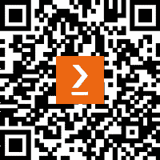

# 前言

欢迎来到 ASP.NET Core 的世界！

自从 .NET Core 诞生以来，它经历了显著的发展，并已成为构建各种应用（包括 Web、桌面、移动、游戏和 AI 应用）的强大解决方案。随着 2023 年底 .NET 8 的发布，它巩固了自己作为现代应用中最强大和最灵活框架之一的地位。

ASP.NET Core 是建立在 .NET Core 平台之上的，继承了其优势，提供了跨平台兼容性、卓越的性能和模块化架构。它已成为构建可在任何操作系统上无缝运行的云原生应用的流行选择，包括 Windows、macOS 和 Linux，并且可以部署在任何云平台上，如 Azure、AWS 或 GCP。

随着组织越来越多地采用 ASP.NET Core 进行 Web 应用程序开发，对 ASP.NET Core 开发者的需求也在上升。无论您是从传统的 .NET Framework 过渡过来，还是对使用 ASP.NET Core 进行 Web API 开发是新手，本书都旨在满足您的需求。它将指导您使用 ASP.NET Core 构建您的第一个 Web API 应用程序，并为您提供构建强大、可扩展和可维护的 Web API 的知识和技能。

虽然 ASP.NET Core 为前端开发提供了强大的选项，例如 Razor Pages、Blazor 和 MVC，但本书专注于后端开发。你将探索一系列主题，包括基于 REST 的 API、gRPC API、GraphQL API 和实时 API，深入了解使用 ASP.NET Core 构建网络 API 的基本概念和最佳实践。

此外，我们还将深入研究测试方法和技术，如单元测试和集成测试，以确保您的 Web API 的质量和可靠性。我们还将探索现代开发实践，如 CI/CD、容器化、监控和云原生设计模式，这些都是当代 Web API 开发所必需的。

虽然本书是一个基础资源，但它仅仅触及了 ASP.NET Core 所能提供的表面。我鼓励您将其作为进一步探索 ASP.NET Core 广阔领域的垫脚石。尝试提供的示例代码，并参考书中的链接进行更深入的学习。不要忘记探索官方文档以获取最新的更新和功能。

我希望你会觉得这本书有用，并激励你探索 ASP.NET Core 的世界。祝您阅读愉快！

# 本书面向对象

本书是为想要学习如何使用 ASP.NET Core 8 构建 Web API 并使用 .NET 平台创建灵活、可维护、可扩展应用的开发者而编写的。具备 C#、.NET 和 Git 的基本知识将有所帮助。

# 本书涵盖内容

*第一章*, *Web API 基础知识*，提供了关于 Web API 的概述，包括其历史背景和各种 API 样式，包括基于 REST 的 API、gRPC API、GraphQL API 和实时 API。它还将讨论设计 Web API 的过程。

*第二章*, *开始使用 ASP.NET Core Web API*，探讨了 ASP.NET Core 的基础知识，包括项目设置、依赖注入和最小 API。你还将学习如何使用 ASP.NET Core 创建你的第一个 Web API，以及如何使用各种工具对其进行测试。

*第三章*, *ASP.NET Core 基础知识（第一部分）*，涵盖了 ASP.NET Core 的基础知识，包括路由、配置和环境。

*第四章*, *ASP.NET Core 基础知识（第二部分）*，继续讨论 ASP.NET Core 基础知识，涵盖了日志记录和中间件。

*第五章*, *ASP.NET Core 中的数据访问（第一部分：Entity Framework Core 基础知识）*，探讨了使用**Entity Framework Core**（**EF Core**）进行数据库交互的利用。你将深入了解使用 EF Core 实现 CRUD 操作。

*第六章*, *ASP.NET Core 中的数据访问（第二部分：实体关系）*，介绍了 EF Core 的配置，以支持各种模型关系，包括一对一、一对多和多对多。

*第七章*, *ASP.NET Core 中的数据访问（第三部分：技巧）*，提供了在 Web API 中使用 EF Core 的最佳实践，例如`DbContext`池、原始 SQL 查询、批量操作等。

*第八章*, *ASP.NET Core 中的安全和身份*，涵盖了围绕 Web API 的安全考虑。你将深入了解使用 ASP.NET Core Identity 实现身份验证和授权机制，以确保你的 Web API 的安全性。

*第九章*, *ASP.NET Core 中的测试（第一部分 - 单元测试）*，探讨了测试方法和工具，包括 xUnit 和 Moq。你将学习如何实现单元测试以确保你的 Web API 的质量。

*第十章*, *ASP.NET Core 中的测试（第二部分 - 集成测试）*，介绍了使用 xUnit 和`WebApplicationFactory`进行集成测试。你将学习如何实现集成测试来测试你的 Web API 组件。

*第十一章*, *开始使用 gRPC*，探讨了 gRPC，一个用于构建高效 API 的现代高性能 RPC 框架。你将学习如何使用 ASP.NET Core 创建 gRPC 服务和客户端。

*第十二章*, *开始使用 GraphQL*，介绍了 GraphQL，一种强大的 API 查询语言。你将学习如何使用 ASP.NET Core 创建 GraphQL API。

*第十三章*, *SignalR 入门*，探讨了 SignalR，一个用于 ASP.NET Core 的实时通信框架。您将学习如何使用 ASP.NET Core 创建实时 API 和客户端。

*第十四章*, *使用 Azure Pipelines 和 GitHub Actions 进行 ASP.NET Core CI/CD*，涵盖了使用 Azure DevOps 和 GitHub Actions 构建测试和部署您的 Web API 应用程序的过程。它还介绍了使用 Docker 来容器化您的 Web API 应用程序。

*第十五章*, *ASP.NET Core Web API 常见实践*，提供了构建您的 ASP.NET Core Web API 应用程序的最佳实践。它涵盖了异步编程、缓存、`HttpClientFactory` 等主题。

*第十六章*, *错误处理、监控和可观察性*，涵盖了错误处理、健康检查、监控和可观察性。您将学习如何在您的 Web API 中处理错误，以及如何使用各种平台和 OpenTelemetry 监控和观察您的 Web API。

*第十七章*, *云原生模式*，探讨了现代 Web API 开发所必需的先进架构和模式。您将深入了解云原生设计模式、**领域驱动设计**（**DDD**）、**命令查询责任分离**（**CQRS**）、重试模式、断路器模式等。

*第十八章*，*利用开源框架*，涵盖了各种开源框架，这些框架可用于简化开发和提高生产力，包括 ABP 框架、Clean Architecture、Orchard Core、eShop 和 .NET Aspire。

# 要充分利用本书

您需要具备使用 .NET 和 C# 进行编程的基本理解，并熟悉面向对象编程（**OOP**）的概念。如果您是 C# 新手，可以从 Microsoft Learn 和 freeCodeCamp 在 [`www.freecodecamp.org/learn/foundational-c-sharp-with-microsoft`](https://www.freecodecamp.org/learn/foundational-c-sharp-with-microsoft) 学习 C#。

| **本书涵盖的软件/硬件** | **操作系统要求** |
| --- | --- |
| .NET 8 SDK ([`dotnet.microsoft.com/en-us/download/dotnet`](https://dotnet.microsoft.com/en-us/download/dotnet)) | Windows, macOS, 或 Linux |
| Visual Studio Code ([`code.visualstudio.com/`](https://code.visualstudio.com/)) | Windows, macOS 或 Linux |
| Visual Studio 2022 社区版 ([`visualstudio.microsoft.com/downloads/`](https://visualstudio.microsoft.com/downloads/)) | Windows, macOS 或 Linux |
| Seq ([`datalust.co/download`](https://datalust.co/download)) | Windows, Docker/Linux |
| Prometheus ([`prometheus.io/download/`](https://prometheus.io/download/)) | Windows, Docker/Linux |
| Grafana ([`grafana.com/oss/grafana/`](https://grafana.com/oss/grafana/)) | Windows, Docker/Linux |
| Jaeger ([`www.jaegertracing.io/download/`](https://www.jaegertracing.io/download/)) | Windows, Docker/Linux |
| Azure |  |
| Azure DevOps |  |
| GitHub |  |

在本书中，我们使用 LocalDB，这是 SQL Server 的一个轻量级版本。它仅在 Windows 上可用。如果您使用 Mac 或 Linux，可以使用 Docker 容器运行 SQL Server。您也可以使用 SQLite。要使用 SQLite，您需要更新`appsettings.json`文件中的连接字符串，并安装 EF Core 的 SQLite 提供程序。有关更多详细信息，请参阅*第五章*。

我们建议您亲自输入代码或通过 GitHub 仓库（下一节中提供链接）访问代码。这样做将帮助您更好地学习并长期保留知识。

# 下载示例代码文件

您可以从 GitHub 下载本书的示例代码文件[`github.com/PacktPublishing/Web-API-Development-with-ASP.NET-Core-8`](https://github.com/PacktPublishing/Web-API-Development-with-ASP.NET-Core-8)。如果代码有更新，它将在 GitHub 仓库中更新。

我们还提供其他来自我们丰富图书和视频目录的代码包，可在[`github.com/PacktPublishing/`](https://github.com/PacktPublishing/)找到。查看它们吧！

# 使用的约定

本书使用了多种文本约定。

`文本中的代码`：表示文本中的代码词汇、数据库表名、文件夹名、文件名、文件扩展名、路径名、虚拟 URL、用户输入和 Twitter 昵称。以下是一个示例：“让我们使用`IEnumerable`接口查询数据库。”

代码块设置如下：

```cs
using (var serviceScope = app.Services.CreateScope()){    var services = serviceScope.ServiceProvider;    // Ensure the database is created.    var dbContext = services.GetRequiredService<AppDbContext>();    dbContext.Database.EnsureCreated();}
```

任何命令行输入或输出应如下编写：

```cs
cd GrpcDemo.Client dotnet add GrpcDemo.Client.csproj package Grpc.Net.Client
```

**粗体**：表示新术语、重要词汇或屏幕上看到的词汇。例如，菜单或对话框中的词汇以**粗体**显示。以下是一个示例：“点击**继续**按钮。”

小贴士或重要注意事项

看起来像这样。

# 联系我们

我们欢迎读者的反馈。

**一般反馈**：如果您对本书的任何方面有疑问，请通过电子邮件发送至 customercare@packtpub.com，并在邮件主题中提及书名。

**勘误表**：尽管我们已经尽最大努力确保内容的准确性，但错误仍然可能发生。如果您在这本书中发现了错误，我们非常感谢您能向我们报告。请访问[www.packtpub.com/support/errata](http://www.packtpub.com/support/errata)并填写表格。

**盗版**：如果您在互联网上发现我们作品的任何形式的非法副本，我们非常感谢您能提供位置地址或网站名称。请通过电子邮件发送至 copyright@packt.com 并提供材料的链接。

**如果您有兴趣成为作者**：如果您在某个领域有专业知识，并且您有兴趣撰写或为书籍做出贡献，请访问 [authors.packtpub.com](http://authors.packtpub.com)。

# 分享您的想法

一旦您阅读了 *使用 ASP.NET Core 8 开发 Web API*，我们非常乐意听到您的想法！请[点击此处直接进入此书的亚马逊评论页面](https://packt.link/r/1-804-61095-X)并分享您的反馈。

您的评论对我们和科技社区都非常重要，并将帮助我们确保我们提供高质量的内容。

# 下载此书的免费 PDF 副本

感谢您购买此书！

您喜欢随时随地阅读，但无法携带您的印刷书籍吗？您的电子书购买是否与您选择的设备不兼容？

别担心，现在，随着每本 Packt 书籍，您都可以免费获得该书的 DRM 免费 PDF 版本。

在任何地方、任何地点、任何设备上阅读。直接从您最喜欢的技术书籍中搜索、复制和粘贴代码到您的应用程序中。

优惠远不止这些，您还可以获得独家折扣、时事通讯和每日免费内容的每日电子邮件。

按照以下简单步骤获取这些好处：

1.  扫描二维码或访问以下链接



[`packt.link/free-ebook/9781804610954`](https://packt.link/free-ebook/9781804610954)

1.  提交您的购买证明

1.  就这些！我们将直接将免费 PDF 和其他好处发送到您的电子邮件。
