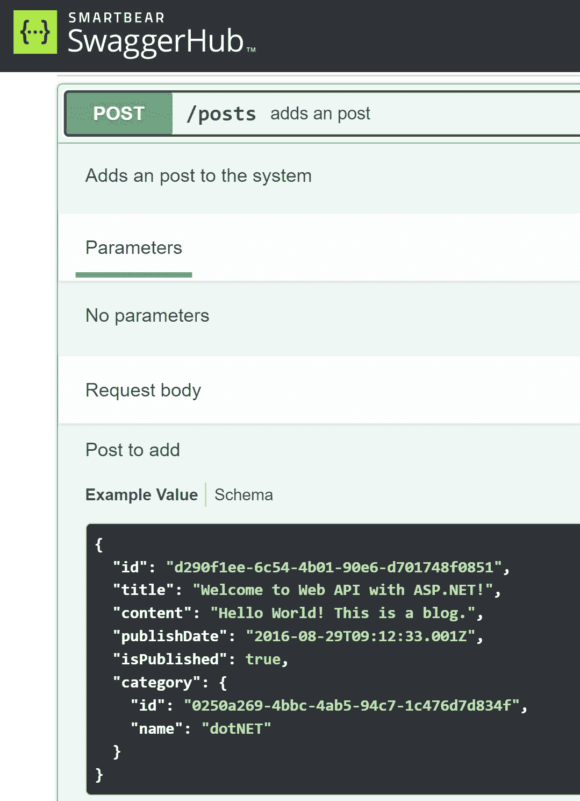

# 网络 API 基础

在当今世界，**网络 API**是网络的骨架。每天有成千上万的人使用网络 API 来购买商品、预订航班、获取天气信息等等。在本章中，我们将学习网络 API 的基础知识。你可能想知道为什么我们要从基本概念开始。答案很简单——在我们构建一个 API 之前，我们需要理解网络 API 的基本概念。

本章介绍了几种不同的网络 API 风格，例如基于 REST 的 API、基于**远程过程调用**（**RPC**）的 API、GraphQL API 和实时 API。我们还将学习如何设计它们。如果你想要开始开发网络 API，请随时跳到下一章。

在本章中，我们将涵盖以下主题：

+   什么是网络 API？

+   什么是 REST API？

+   设计基于 REST 的 API

+   RPC 和 GraphQL API 是什么？

+   什么是实时 API？

在阅读本章后，你将基本了解网络 API，并能够为你的项目选择正确的风格。让我们开始吧！

# 什么是网络 API？

**API**代表**应用程序编程接口**。正如其名所示，网络 API 是一组网络编程接口。例如，当你在一个网站上预订航班时，浏览器通过网络 API 向航空公司的服务器发出请求，以访问航空公司的数据库。然后，航空公司的服务器将航班信息返回给浏览器，让你能够在其中预订航班。

组织已经为几十年提供了 API。随着万维网的兴起，人们需要一种在服务器和客户端之间进行通信的方法。

我们可以使用不同的技术来构建网络 API，例如 Java、Python、Ruby、PHP、.NET 等等。此外，它们还有各种风格。你可能听说过**SOAP**、**Web 服务**和**REST**等术语。它们都是基于**HTTP**协议，但以不同的方式进行通信。

在这本书中，我们将网络 API 视为比 REST 更广泛的概念。在数字世界中，随着需求或基础设施的变化，机器之间交流的方式也在变化。在 20 世纪 90 年代，人们关注的是如何改进使用相同平台的内部网络。TCP/IP 成为了这种通信的标准。几年后，人们需要找到一种方法来优化跨多个平台的通信。Web 服务出现了，它们使用了**简单对象访问协议**（**SOAP**），这是为企业定义的，并确保基于不同平台构建的程序可以轻松交换数据。

然而，SOAP XML 相当庞大，这意味着它在使用时需要更多的带宽。在 2000 年代初，微软发布了**Windows Communication Foundation**（**WCF**）。这帮助开发者管理使用 SOAP 的复杂性。WCF 基于 RPC，但仍然使用 SOAP 作为底层协议。随着时间的推移，一些旧标准，如 SOAP，已经过渡到 REST API，这将在下一节中讨论。我们将从 REST API 开始，然后继续讨论其他基于 Web 的 API 风格，例如 gRPC API、GraphQL API 和 SignalR API。

# 什么是 REST API？

**REST**，也称为**表示状态转移**，是由 Roy Fielding 在 2000 年他的博士论文《架构风格和网络软件架构设计》中提出的 Web API 架构风格。今天，一般来说，REST API 基于 HTTP，但实际上，Roy Fielding 的论文只是概述了理解架构风格的核心概念和约束，并不要求基于 REST 的架构有任何特定的协议，如 HTTP。然而，由于 HTTP 是 Web API 中最广泛使用的协议，我们将使用 HTTP 作为 REST API 的协议。

只需记住，REST 只是一种风格，而不是规则。当您构建 Web API 时，您不必遵循 REST 风格。您可以使用您喜欢的任何其他风格。您可以构建一个运行良好的 Web API，但它可能不是*足够 REST*。REST 是推荐的风格，因为它帮助我们建立约束，这有助于 Web API 的设计。它还帮助开发者如果他们遵循相同的风格，可以轻松地与其他 REST API 集成。

REST 的核心概念是术语*表示状态转移*。考虑一个 Web 系统，它是一组资源的集合。例如，它可能有一个名为*books*的资源。书籍的集合是一个资源。一本书也是一个资源。当您请求书籍列表时，您选择一个链接（例如，[`www.example.com/books`](http://www.example.com/books))，这将返回一个包含所有书籍的 JSON 字符串，从而产生下一个资源的表示，例如特定书籍的链接（例如，[`www.example.com/books/1`](http://www.example.com/books/1))。您可以使用这个链接继续请求书籍。在这个过程中，表示状态被转移到客户端并渲染给用户。

解释 REST 的资源非常多。如果您想了解更多关于 REST 的信息，可以阅读维基百科上的以下文章：*REST：表示状态转移的 Web 框架* ([`en.wikipedia.org/wiki/Representational_state_transfer`](https://en.wikipedia.org/wiki/Representational_state_transfer))。

让我们来看看 REST 的约束，之后我们将向您展示一个简单的 REST API 示例。

## REST 的约束

Roy Fielding 的论文为 REST API 定义了以下六个约束：

+   **客户端-服务器**：此模式强制执行关注点分离的原则。服务器和客户端独立操作。客户端发送请求，服务器响应，之后客户端接收并解释响应。客户端不需要知道服务器的工作方式，反之亦然。

+   **无状态**：服务器不维护任何客户端状态。客户端应在请求中提供必要的信息。这种无状态协议对于扩展服务器的容量很重要，因为它不需要记住客户端的会话状态。

+   **可缓存性**：服务器的响应必须隐式或显式地包含有关响应是否可缓存的信息，允许客户端和中间件缓存响应。缓存可以在客户端机器的内存中、浏览器缓存存储中或在 **内容分发网络**（**CDN**）中执行。这对于提高 Web API 的可扩展性和性能也很重要。

+   **分层系统**：客户端不知道它如何连接到服务器。客户端和服务器之间可能存在多个层级。例如，可以在客户端和服务器之间放置一个安全层、代理或负载均衡器，而不会影响客户端或服务器代码。

+   **按需代码（可选）**：客户端可以从服务器请求用于客户端使用的代码。例如，网络浏览器可以请求 JavaScript 文件以执行某些任务。

+   **统一接口**：这对于 RESTful 系统至关重要。它包含资源标识、通过表示进行资源操作、自描述消息以及作为应用程序状态引擎的超媒体。它简化并解耦了系统的架构，使得每个部分可以独立演进。

如果你觉得这些原则有点遥远或理论化，让我们来看一个例子。

## REST API 示例

网站 [`jsonplaceholder.typicode.com/`](https://jsonplaceholder.typicode.com/) 是一个生成假 JSON 数据的假 REST API。在您的浏览器中打开以下链接：[`jsonplaceholder.typicode.com/posts`](https://jsonplaceholder.typicode.com/posts)。您将看到一个返回的 JSON 字符串：

```cs
[  {
    "userId": 1,
    "id": 1,
    "title": "sunt aut facere repellat provident occaecati excepturi optio reprehenderit",
    "body": "quia et suscipit\nsuscipit recusandae consequuntur expedita et cum\nreprehenderit molestiae ut ut quas totam\nnostrum rerum est autem sunt rem eveniet architecto"
  },
  {
    "userId": 1,
    "id": 2,
    "title": "qui est esse",
    "body": "est rerum tempore vitae\nsequi sint nihil reprehenderit dolor beatae ea dolores neque\nfugiat blanditiis voluptate porro vel nihil molestiae ut reiciendis\nqui aperiam non debitis possimus qui neque nisi nulla"
  },
...
]
```

从前面的请求中，我们可以获取帖子集合的资源。

现在，我们可以通过其 ID 请求特定的帖子。例如，我们可以使用以下 URL 请求 ID 为 `1` 的帖子：[`jsonplaceholder.typicode.com/posts/1`](https://jsonplaceholder.typicode.com/posts/1)。响应如下：

```cs
{  "userId": 1,
  "id": 1,
  "title": "sunt aut facere repellat provident occaecati excepturi optio reprehenderit",
  "body": "quia et suscipit\nsuscipit recusandae consequuntur expedita et cum\nreprehenderit molestiae ut ut quas totam\nnostrum rerum est autem sunt rem eveniet architecto"
}
```

就这样！在前面的例子中使用的 URL 是资源的标识符。响应（JSON 字符串）是资源的表示。资源通过在客户端和服务器之间传输的消息中的超文本表示来操作。

重要提示

一些文档使用 URI。一个 `http`、`https` 或 `ftp`。如今，术语 *URL* 仍然被广泛使用，因此，我们将在这本书中使用它。然而，我们应该知道它们有不同的范围。URI 是 URL 的超集。

要获取帖子资源，我们发送一个 `GET` 请求。还有一些其他方法用于操作资源，例如 `POST`、`PUT`、`PATCH` 和 `DELETE`，如下所示：

| **HTTP 方法** | **URL** | **操作** | **描述** |
| --- | --- | --- | --- |
| `GET` | `/posts` | 读取 | 读取帖子集合 |
| `GET` | `/posts/1` | 读取 | 通过 ID 读取一篇帖子 |
| `GET` | `/posts/1/comments` | 读取 | 读取帖子的评论 |
| `POST` | `/posts` | 创建 | 创建一个新的帖子 |
| `PUT` | `/posts/1` | 更新 | 通过 ID 更新帖子 |
| `PATCH` | `/posts/1` | 更新（部分） | 通过 ID 更新帖子的部分内容 |
| `DELETE` | `/posts/1` | 删除 | 通过 ID 删除帖子 |

表 1.1 – 操作资源的 HTTP 方法和 URL

还有其他一些不太常用的方法，例如 `HEAD`、`OPTIONS` 和 `TRACE`。

如我们所见，HTTP 方法映射到 **创建、更新、读取和删除** （**CURD**）操作。但这是否一直如此？

## 我的 Web API 是否是 RESTful 的？

如前所述，REST 不是一个规则或规范。没有 *官方* 的 REST API 标准。与普遍看法相反，它不要求使用 JSON。此外，它也不要求使用 CRUD 模式。但 REST 实现确实使用了标准，例如 HTTP、URL、JSON、XML 等。人们应用 HTTP 方法和 JSON 来实现 REST，但他们可能没有有意地应用 Fielding 论文中最初描述的约束。这导致人们对他们的 API 是否是 RESTful 存在分歧。许多开发者描述他们的 API 为 RESTful，即使这些 API 并不满足 Fielding 论文中描述的所有约束。

坦白说，争论一个 Web API 是否 *足够 RESTful* 并没有好处。目标是让某物工作，而不是浪费时间在这种问题的讨论上。并非每个人都阅读了原始论文。技术也在快速发展。有句中国谚语：*不管是白猫还是黑猫，只要能捉老鼠，就是好猫*。

然而，如果我们从零开始一个新项目，遵循约定将更加理想。通常，基于 REST 的 API 通过以下方面定义：

+   基础 URL，即 API 的根地址，例如 `http://api.example.com`。

+   HTTP 方法的语义，例如 `GET`、`POST`、`PUT`、`DELETE` 等。

+   媒体类型，它定义了状态转换数据元素，例如 `application/json`、`application/xml` 等。

在这本书中，我们将尝试在开发基于 ASP.NET Core 的 REST API 时遵循这些约定。

现在我们已经对 REST API 有一个概述，让我们看看如何遵循约定来设计一个。

# 设计基于 REST 的 API

在编写代码之前，构建基于 REST 的 API 有许多步骤要走。开发团队需要与利益相关者沟通并分析需求。然后，他们需要编写用户故事（或工作故事）来定义期望的结果。这需要领域专家或主题专家的见解。本书不会涵盖这部分内容。相反，接下来，我们将专注于 API 设计，这更接近开发者所做的工作。

在过去几年中，**API 优先**的概念获得了更多的关注。API 优先的方法意味着 API 被视为项目的第一公民。这意味着在编写任何代码之前，API 应该如何表现已经有一个合同。这样，开发团队可以并行工作，因为合同将首先建立。开发者不必等待 API 发布就可以与前端或移动应用集成。他们可以根据合同模拟和测试 API。使用像**Swagger**这样的工具，构建 API 的过程可以自动化，例如 API 文档、模拟 API、SDK 等。自动化可以显著加快 API 和应用程序的开发速度，有助于提高上市速度。

下面是一些我们可以遵循的步骤来设计基于 REST 的 API：

1.  确定资源。

1.  定义资源之间的关系。

1.  识别操作事件。

1.  为资源设计 URL 路径。

1.  将 API 操作映射到 HTTP 方法。

1.  分配响应代码。

1.  记录 API。

如果你熟悉前面的步骤，你可以跳过它们。但是，如果你不熟悉，请阅读以下章节。

一种流行的 API 描述格式是**OpenAPI 规范**（**OAS**）。我们可以用它来描述 API 建模和其他 API 的细节。在这个阶段，我们不需要包括实现细节，因为我们只想制定一个合同。SwaggerHub ([`app.swaggerhub.com/home`](https://app.swaggerhub.com/home)) 是一个我们可以用来设计 API 的工具。

## 确定资源

基于 REST 的 API 以资源为中心。资源是一组数据，例如帖子集合或用户集合。资源通过 URL 进行标识。客户端使用 URL 请求资源，服务器以资源表示的形式响应。资源的表示以超文本格式发送，可以被尽可能广泛的客户端解释。

识别领域范围和资源之间的关系非常重要。例如，如果你正在构建一个博客系统，你可能有一个帖子集合，每个帖子都有一个评论集合。API 的范围可能会随着时间的推移而演变。可能需要向当前领域添加更多资源，或者某些资源将被删除。此外，关系也可能发生变化。

让我们从简单开始。我们可以用博客系统作为例子。在需求分析之后，我们可以确定以下资源：

+   帖子

+   分类

+   注释

+   用户

+   标签

您可能希望在这一步包括每个资源的某些属性。例如，一个帖子有一个标题、正文和发布时间。一个评论有一个正文和发布时间。一个用户有一个名字和电子邮件。在开发过程中，您可能会发现更多属性。

## 定义资源之间的关系

一旦确定了资源，我们就可以定义它们之间的关系。例如，一个帖子有一个评论集合。一个评论属于一个帖子。一个用户有一个帖子集合。

这种关系是通过这些资源如何相互关联来定义的。有时，这些关系在数据库中也存在，但有时，它们仅针对 REST 资源。

我们可以使用一些术语来描述这些关系：

+   **独立资源**：这种资源可以独立存在。它不需要另一个资源存在。一个独立资源可以引用其他独立或依赖资源。例如，一个帖子是一个独立资源，它可以引用其作者。作者资源也是一个独立资源。

+   **依赖资源**：这种资源需要另一个资源存在。它可以引用其他独立或依赖资源，但不能在没有父资源存在的情况下存在。例如，一个评论需要一个帖子作为其父资源；否则，它不能存在。一个评论可以引用其作者，这是一个独立资源。

+   `Id` 属性，它可以唯一地识别自身。

+   `PostId` 属性，它引用了一个帖子。

这些资源可以有以下三种关系类型：

+   **一对多**：这是指一个资源有多个相关资源。例如，一个用户有多个帖子，但一个帖子只有一个作者。这也被称为*父子（子）*关系，这是在基于 REST 的 API 世界中可以看到的最常见的模式。

+   **一对一**：这是指一个资源有一个相关资源。例如，一个帖子有一个唯一的作者，一栋房子只有一个地址。一对一关系是一对多关系的特例。

+   **多对多**：这是指一个资源有多个相关资源，反之亦然。例如，一个博客有多个标签，一个标签也有多个博客。一部电影可以有多个类型，一个类型也可以有多个电影。在许多系统中，一个用户可以有多个角色，一个角色也可以有多个用户。

## 识别操作

接下来，我们可以考虑每个资源需要的操作。这些操作可能来自事先定义的用户故事。通常，每个资源都有其 CRUD 操作。请注意，操作可能包括 CRUD 之外的内容。例如，一个帖子可以被发布，或者可以被取消发布。一个评论可以被批准，或者可以被拒绝。在这个过程中，我们可能需要创建一个新的资源或属性来反映这个操作。

考虑域的范围很重要。CRUD 操作容易理解，但对于一些复杂的关系，我们可能需要来自领域专家的帮助。

当我们处理这些操作时，需要包括重要的输入和输出细节。我们将在下一步中使用它们。然而，没有必要包括每个资源的所有细节。我们以后有足够的时间来捕捉完整的设计。

对于博客系统的示例，我们可以为 `Post` 资源（包括但不限于以下）识别这些操作：

| **操作名称** | **资源(s)** | **输入** | **输出** | **描述** |
| --- | --- | --- | --- | --- |
| `createPost()` | `Post, category,` `user, tag` | Post detail |  | 创建新帖子 |
| `listPosts()` | `Post` |  | 一系列帖子 | 列出所有帖子 |
| `listPostsByCategory()` | `Post` `and category` | Category ID | 一系列帖子 | 按类别列出帖子 |
| `listPostsByTag()` | `Post` `and tag` | Tag or Tag ID | 一系列帖子 | 按标签列出帖子 |
| `searchPosts()` | `Post` | Search keyword | A list of posts | 通过标题、作者和内容搜索帖子 |
| `viewPost()` | `Post, category,` `and user` | Post ID | Post detail | 查看帖子详情 |
| `deletePost()` | `Post` | Post ID |  | 删除帖子 |
| `updatePost()` | `Post` `and category` | Post detail |  | 更新帖子 |
| `publishPost()` | `Post` | Post ID |  | 发布帖子 |
| `unpublishPost()` | `Post` | Post ID |  | 下线帖子 |

表 1.2 – 帖子资源的操作

对于某些操作，如 `createPost` 和 `deletePost`，输出是操作的结果。这可以用 HTTP 状态码表示。我们将在稍后讨论这个问题。 

我们可以为其他资源列出更多操作。

## 设计资源 URL 路径

下一步是设计每个资源的 URL 路径。客户端使用 URL 来访问资源。尽管 REST 不是一个标准，但在设计 URL 路径方面有一些指南或约定。

使用名词而不是动词

在上一步中我们识别的操作事件是一些动作，例如 `Create`、`List`、`View`、`Delete` 等。然而，URL 路径通常不会用动词表示。因为 HTTP 方法如 `GET`、`POST`、`PUT` 和 `DELETE` 已经是动词了，所以没有必要在 URL 路径中包含动词。相反，我们应该使用名词来表示资源——例如，`/posts`。

### 使用复数名词表示集合

如果一个资源是集合，我们应该使用复数名词来表示该资源。例如，`/posts` 是帖子集合的 URL 路径。要获取单个帖子的 ID，我们可以使用 `/posts/{postId}`。

### 使用逻辑嵌套表示关系

对于具有关联关系的资源，通常，子资源（即依赖资源）应该嵌套在父资源之下，并且路径应包含父标识符。然而，这并不反映数据库结构。例如，一篇文章可以有一个评论集合；URL 看起来像 `/posts/{postId}/comments`。这清楚地表明评论与文章相关。

然而，如果关系太深或太复杂，嵌套的 URL 路径可能会太长。在这种情况下，我们可以重新思考如何更好地表示这些资源。例如，如果我们想从一个评论中检索作者的信息，我们可以使用 `/posts/{postId}/comments/{commentId}/author`。但这太过分了。相反，如果我们知道作者的 `UserId`，我们可以使用 `/users/{userId}`。避免在 URL 路径中使用深层嵌套，因为它会使 API 更复杂且不便于阅读。

### 允许过滤、排序和分页

同时返回所有记录不是一个好主意。我们可以使用过滤、排序和分页来返回客户端需要的记录子集。这些操作可以提高 API 的性能并提供更好的用户体验。

例如，如果我们想搜索特定关键词的文章列表，我们可以使用查询参数，例如 `/posts?search=keyword`。如果我们想按日期排序文章，我们可以使用 `/posts?sort=date`。要获取文章的第二页，我们可以使用 `/posts?page=2`。这些查询参数可以组合使用。

### 如果我找不到适当的动词来表示 HTTP 方法中的操作怎么办？

通常，HTTP 方法可以表示 CRUD 操作。然而，在现实世界中，有更多复杂性！例如，除了基本的 CRUD 操作外，还有其他操作，如发布或取消发布文章。那么，我们应该使用哪些 HTTP 方法呢？

这里事情可能会变得复杂。这个主题是开放的，但请记住，我们不是在争论 API 是否足够 *RESTful*。我们只是想让它工作。

对于这些场景，有不同方法：

+   一种可能的解决方案是将此类操作视为子资源。因此，您可以使用 `/posts/{postId}/publish` 来发布文章。GitHub 使用以下 URL 来标记一个 gist：`/gists/{gist_id}/star`。更多信息，请参阅[`docs.github.com/en/rest/gists/gists#star-a-gist`](https://docs.github.com/en/rest/gists/gists#star-a-gist)。

+   文章应该有一个 `IsPublished` 字段来指示它是否已发布。因此，实际上，`publish` 动作是一个更新动作，它只更新 `IsPublished` 字段。然后，您可以将其视为与 `updatePost()` 操作相同。

这里有一些博客系统的资源 URL：

| **操作名称** | **URL** | **输入** | **输出** | **描述** |
| --- | --- | --- | --- | --- |
| `createPost()` | `/posts` | 文章详情 |  | 创建一个新的文章 |
| `listPosts()` | `/posts` |  | 一系列文章 | 列出所有文章 |
| `listPostsByCategory()` | `/posts?categoryId={categoryId}` | 类别 ID | 一系列文章 | 通过类别列出文章 |
| `listPostsByTag()` | `/posts?tag={tagId}` | 标签或标签 ID | 一系列文章 | 通过标签列出文章 |
| `searchPosts()` | `/posts?search={keyword}` | 搜索关键字 | 一系列文章 | 通过标题、作者和内容搜索文章 |
| `viewPost()` | `/posts/{postId}` | 文章 ID | 文章详情 | 查看文章详情 |
| `deletePost()` | `/posts/{postId}` | 文章 ID |  | 删除文章 |
| `updatePost()` | `/posts/{postId}` | 文章详情 |  | 更新文章 |
| `publishPost()` | `/posts/{postId}/publish` | 文章 ID |  | 发布文章 |
| `unpublishPost()` | `/posts/{postId}/unpublish` | 文章 ID |  | 取消发布文章 |

表 1.3 – 文章资源的 URL

一些 URL 是相同的，例如 `deletePost()` 和 `updatePost()`，因为我们将通过 HTTP 方法来区分这些操作。

## 将 API 操作映射到 HTTP 方法

接下来，我们需要确定每个操作适合哪种 HTTP 方法。正如我们之前提到的，有一些常见的 HTTP 方法用于 CRUD 操作。例如，当我们请求资源时，我们应该使用 `GET` 方法。当我们创建新资源时，我们应该使用 `POST` 方法。

当我们将 API 操作映射到 HTTP 方法时，我们还需要考虑操作的安全性以及 HTTP 方法的安全性。HTTP 操作有三种安全性类型：

+   对 `/posts/{postId}` 的 `GET` 请求，无论发送多少次相同的请求，它都会返回相同的结果。在某些情况下，资源可能被第三方更新，下一次 `GET` 请求将返回更新后的结果。但这并非由客户端引起，因此了解状态变化是否由发送请求的客户端引起非常重要。

+   向 `/posts/{postId}` 发送 `DELETE` 请求以删除它。如果请求成功，我们将收到 `200 OK` 或 `204 No Content` 响应。如果我们再次向 `/posts/{postId}` 发送相同的请求，它可能返回 `404 Not found` 响应，因为资源已经被删除，但这不会引起任何其他副作用。如果一个操作是幂等的，并且客户端知道之前的请求是否失败，那么重新发出请求是安全的，不会产生任何副作用。

+   向 `/posts` 发送 `POST` 请求以创建一篇新文章。如果我们再次发送相同的 `POST` 请求，它将创建另一篇具有相同标题和内容的新文章，依此类推。

所有安全方法也都是幂等的，但并非所有幂等方法都是安全的。以下表格列出了每个 HTTP 方法的安全性：

| **HTTP 方法** | **安全** | **幂等** | **常见操作** |
| --- | --- | --- | --- |
| `GET` | 是 | 是 | 读取、列出、查看、搜索、显示和检索 |
| `HEAD` | 是 | 是 | `HEAD` 用于检查资源的可用性，而不实际下载它。 |
| `OPTIONS` | 是 | 是 | `OPTIONS` 用于检索给定资源的可用 HTTP 方法。 |
| `TRACE` | 是 | 是 | `TRACE` 用于获取请求/响应周期的诊断信息。 |
| `PUT` | 否 | 是 | 更新和替换 |
| `DELETE` | 否 | 是 | 删除、移除和清除 |
| `POST` | 否 | 否 | 创建、添加和更新 |
| `PATCH` | 否 | 否 | 更新 |

表 1.4 – HTTP 方法的安全性

以下表格显示了如何将操作映射到 HTTP 方法：

| **操作名称** | **URL** | **HTTP 方法** | **描述** |
| --- | --- | --- | --- |
| `createPost()` | `/posts` | `POST` | 创建新帖子 |
| `listPosts()` | `/posts` | `GET` | 列出所有帖子 |
| `listPostsByCategory()` | `/posts?categoryId={categoryId}` | `GET` | 通过类别列出帖子 |
| `listPostsByTag()` | `/posts?tag={tagId}` | `GET` | 通过标签列出帖子 |
| `searchPosts()` | `/posts?search={keyword}` | `GET` | 通过标题、作者和内容搜索帖子 |
| `viewPost()` | `/posts/{postId}` | `GET` | 查看帖子详情 |
| `deletePost()` | `/posts/{postId}` | `DELETE` | 删除帖子 |
| `updatePost()` | `/posts/{postId}` | `PUT` | 更新帖子 |
| `publishPost()` | `/posts/{postId}/publish` | `PUT` | 发布帖子 |
| `unpublishPost()` | `/posts/{postId}/unpublish` | `PUT` | 取消发布帖子 |

表 1.5 – 为 Post 资源映射 HTTP 方法

你可能见过一些其他情况，例如使用 `POST` 来更新资源。这可以工作，但它并不遵循 HTTP 标准。一般来说，我们可以陈述以下内容：

+   `GET` 用于读取资源。

+   `POST` 用于使用服务器定义的 URL（如 `/posts`）创建子资源。

+   `PUT` 用于使用客户端定义的 URL（如 `/posts/{postId}`）创建或替换资源。在许多情况下，`PUT` 也可以用于更新资源。

+   `PATCH` 用于使用客户端定义的 URL（如 `/posts/{postId}`）更新资源的部分。

## 分配响应代码

是时候为操作分配 HTTP 响应代码了。有一些主要的响应代码类别：

+   `2xx` **代码 – 成功**：客户端请求的操作已被接收、理解并接受。

+   `3xx` **代码 – 重定向**：客户端必须采取额外操作以完成请求。这通常用于指示客户端应重定向到新位置。

+   `4xx` **代码 – 客户端错误**：操作未成功，但客户端可以再次尝试。

+   `5xx` **代码 – 服务器错误**：服务器遇到错误或无法执行请求。客户端可以在将来重试。

一个常见问题是，一些开发者发明了自己的响应代码。例如，如果我们创建一个新帖子，我们期望服务器返回 `201 已创建` 响应代码。一些开发者可能会使用 `200 OK` 并在响应体中包含状态代码。这不是一个好主意。服务器和客户端之间有很多层。使用你自己的代码可能会给这些中间件组件带来问题。请确保根据正确的理由使用正确的代码。以下是一些常见的响应代码：

| **HTTP 响应代码** | **描述** |
| --- | --- |
| `200 OK` | 成功 HTTP 请求的标准响应。 |
| `201 已创建` | 请求已得到满足，导致新资源被创建。 |
| `202 已接受` | 请求已被接受处理，但处理尚未完成。 |
| `204` `无内容` | 服务器已成功处理请求，但不返回任何内容。这在删除操作中很常见。 |
| `400` `错误请求` | 服务器无法理解或处理请求，因为客户端错误，例如语法错误、请求大小过大或无效输入。客户端不应在不修改请求的情况下重复请求。 |
| `401 未授权` | 请求需要用户身份验证。 |
| `403 禁止` | 服务器理解了请求，但拒绝执行。这可能是因为客户端没有必要的权限或尝试了禁止的操作。 |
| `404` `未找到` | 请求的资源找不到。 |
| `500 内部服务器错误` | 一个通用的错误消息。服务器遇到意外情况，因此无法处理请求，此时没有更具体的消息是合适的。 |
| `503` `服务不可用` | 服务器当前无法处理请求，可能是由于临时过载或服务器维护。如果可能，响应应包含 `Retry-After` 标头，以便客户端在估计时间后重试， |

表 1.6 – 常见 HTTP 响应代码

这里是显示每个操作响应代码的表格：

| **操作名称** | **URL** | **HTTP 方法** | **响应** | **描述** |
| --- | --- | --- | --- | --- |
| `createPost()` | `/posts` | `POST` | `Post, 201` | 创建新帖子 |
| `listPosts()` | `/posts` | `GET` | `Post[], 200` | 列出所有帖子 |
| `listPostsByCategory()` | `/posts?categoryId={categoryId}` | `GET` | `Post[], 200` | 按类别列出帖子 |
| `listPostsByTag()` | `/posts?tag={tagId}` | `GET` | `Post[], 200` | 按标签列出帖子 |
| `searchPosts()` | `/posts?search={keyword}` | `GET` | `Post[], 200` | 通过标题、作者和内容搜索帖子 |
| `viewPost()` | `/posts/{postId}` | `GET` | `Post, 200` | 查看帖子详情 |
| `deletePost()` | `/posts/{postId}` | `DELETE` | `204, 404` | 删除帖子 |
| `updatePost()` | `/posts/{postId}` | `PUT` | `200` | 更新帖子 |
| `publishPost()` | `/posts/{postId}/publish` | `PUT` | `200` | 发布帖子 |
| `unpublishPost()` | `/posts/{postId}/unpublish` | `PUT` | `200` | 取消发布帖子 |

表 1.7 – Post 资源的响应码

正确使用响应码至关重要，以防止任何误解。这将确保所有通信都是清晰和简洁的，从而避免任何潜在的混淆。

### 如果我想创建自己的状态码怎么办？

从技术上讲，你可以创建自己的状态码，但在实践中，请尽可能遵循标准。如果你发明了自己的状态码，那将是危险的。你的用户可能会在使用你的 API 时遇到麻烦，因为他们不知道你的状态码。你应该考虑拥有自己的状态码的好处。惯例是尊重 RFC 中定义的 HTTP 状态码。在你创建自己的状态码之前，请确保首先检查 HTTP 状态码列表。除非你有充分的理由，否则不要创建自己的状态码。你可以在这里找到更多信息：[`en.wikipedia.org/wiki/List_of_HTTP_status_codes`](https://en.wikipedia.org/wiki/List_of_HTTP_status_codes)。

然而，可能存在一些特殊情况，你希望在响应中指示更具体的状态。例如，你可能有一个可以处理任务的 API，但它可能因不同原因而失败。你可能希望在响应中提供更详细的消息，以便让你的用户知道发生了什么，而不是返回常见的`4xx`代码。你应该仔细考虑业务逻辑，区分 HTTP 状态码和业务状态码。如果你在 HTTP 状态码中找不到合适的代码，而你又想在响应中显示与业务相关的状态，你可以选择 HTTP 状态码来指示响应的类别，然后附加一个包含你的业务状态码的响应体。例如，你可以返回如下所示的响应：

```cs
400 Bad Request{ "error_code": 1, "message": "The post is locked and cannot be updated."}
```

因此，HTTP 状态码表示操作的通用状态，在响应体中，你可以包含一些特定于你系统的信息。我们将在*第十六章*中讨论如何使用`Problem Details`对象来处理错误。

## 记录 API

OpenAPI 是一种流行的 REST API 规范。它是对 REST API 的编程语言无关的接口描述，允许人类和计算机在无需访问源代码的情况下发现和理解服务的功能。类似于接口，它描述了 API 的输入和输出，以及它们应该如何传输。它也被称为 Swagger 规范。

Swagger 与 OpenAPI

有时，*Swagger* 和 *OpenAPI* 可以互换使用。Swagger 项目在 2010 年代初开发，用于定义一个简单的 API 合同，该合同包含生成或消费 API 所需的一切。它在 2015 年被捐赠给了 OpenAPI 倡议。因此，OpenAPI 指的是 API 规范，Swagger 指的是与 OpenAPI 规范一起工作的 SmartBear 的开源和商业项目。简而言之，OpenAPI 是一个规范，Swagger 是使用 OpenAPI 规范的工具。Swagger UI 也是 Swagger 工具之一。在撰写本文时，OpenAPI 的最新版本是 3.1.0。

我们可以使用 SwaggerHub 根据之前的步骤设计 API。以下是一个示例，它定义了一个简单的博客系统 API：

```cs
openapi: 3.0.0servers:
  - description: SwaggerHub API Auto Mocking
    url: https://virtserver.swaggerhub.com/yanxiaodi/MyBlog/1.0.0
info:
  description: This is a simple API
  version: '1.0.0'
  title: Sample Blog System API
  contact:
    email: you@your-company.com
  license:
    name: Apache 2.0
    url: 'http://www.apache.org/licenses/LICENSE-2.0.html'
tags:
  - name: admins
    description: Secured Admin-only calls
  - name: developers
    description: Operations available to regular developers
paths:
  /posts:
    get:
      tags:
        - developers
      summary: searches posts
      operationId: searchPost
      description: |
        By passing in the appropriate options, you can search for
        available blogs in the system
      parameters:
        - in: query
          name: searchString
          description: pass an optional search string for looking up post
          required: false
          schema:
            type: string
        - in: query
          name: skip
          description: number of records to skip for pagination
          schema:
            type: integer
            format: int32
            minimum: 0
        - in: query
          name: limit
          description: maximum number of records to return
          schema:
            type: integer
            format: int32
            minimum: 0
            maximum: 50
      responses:
        '200':
          description: search results matching criteria
          content:
            application/json:
              schema:
                type: array
                items:
                  $ref: '#/components/schemas/Post'
        '400':
          description: bad input parameter
```

此文件的另一个文件已被省略。

之前的 API 文档是一个 YAML 文件，它定义了两个模型（资源）- `Post` 和 `Category` - 以及两个操作 - `GET` 用于搜索帖子，`POST` 用于创建新帖子。对于每个操作，都有关于输入和输出的详细信息，包括预期的响应代码。

在完成 API 设计后，我们可以将 API 文档与其他开发者共享，以便进行集成，如下所示：



图 1.1 – SwaggerHub 用户界面

注意，在将 API 文档与其他团队共享之前，你可能需要根据你的用户故事和领域添加更多属性。API 合同应该相当稳定；否则，它将影响消费者。

我们已经解释了如何设计 REST API。如果你想学习如何开始使用 ASP.NET Core 进行开发，你可以继续阅读*第二章*。

REST API 是最受欢迎的 API 风格之一。在下一节中，我们将介绍其他 API 风格，例如 RPC API、GraphQL API 和实时 API。

# RPC 和 GraphQL API

虽然基于 REST 的 API 在许多场景中被广泛使用，但它并不是唯一的 Web API 风格。对于某些场景，基于 RPC 的 API 或 GraphQL API 可能更适合。了解每种 API 风格的优缺点非常重要，这样你就可以为你的场景选择正确的风格。

## 基于 RPC 的 API 是什么？

RPC 已经存在很多年了。它是 Web 交互的最早、最简单的形式。在某些语言中，它就像一个本地调用，但它在网络上执行。客户端被提供一个可用方法的列表。每个方法都接受预定义的、类型化和有序的参数，返回一个结构化的响应结果。因此，客户端可以在不同的机器或不同的进程中运行，但仍然可以与服务器一起工作，例如在同一个应用程序中。

这样，客户端与服务器紧密耦合。如果服务器更改这些方法或任何参数，客户端将受到影响。开发者必须更新客户端的代码以匹配新的服务器方法。这可能是基于 RPC 的 API 的缺点，但它可以提供更好的性能。

远程过程是通过**接口定义语言**（**IDL**）定义的。IDL 定义了远程过程的方法和参数。通常，一些代码生成器可以根据 IDL 生成客户端和服务器存根。代码是强类型的，这提供了更好的类型安全和错误处理。

要实现基于 RPC 的 API，不同语言有一些规范。例如，WCF 是几年前流行的 RPC 框架。其他一些流行的框架包括 XML-RPC、SOAP PRC、JSON-RPC 和 gRPC。

因为 RPC 就像本地方法调用一样，你经常在方法名中看到动词。与 REST 不同，RPC 支持 CRUD 以外的各种操作。以下是一个 JSON-RPC 请求和响应的示例：

请求：

```cs
POST https://rpc.example.com/calculator-service HTTP/1.1Content-Type: application/json
Content-Length: ...Accept: application/json
{"jsonrpc": "2.0", "method": "subtract", "params": [42, 23], "id": 1}
```

响应：

```cs
{ "jsonrpc": "2.0", "result": 19, "id": 3 }
```

最受欢迎的 RPC 框架之一是 gRPC，我们将在下一节讨论。

### 什么是 gRPC？

最受欢迎的 RPC 框架之一是 gRPC。它是一个高性能、开源的现代 RPC 框架，用于构建网络服务和分布式应用程序。gRPC 最初由 Google 创建，它使用一个名为 Stubby 的 RPC 框架。2015 年 3 月，Google 决定将其开源，从而产生了 gRPC，现在许多 Google 以外的组织都在使用它。

gRPC 有一些很棒的功能，如下所示：

+   **互操作性**：gRPC 使用**协议缓冲**（**protobuf**）文件来声明服务和消息，这使得 gRPC 能够完全语言和平台无关。你可以找到适用于所有主要编程语言和平台的 gRPC 工具和库。

+   `protobuf`是一种二进制格式，它比 JSON 具有更小的尺寸和更快的性能。它对人类不可读，但对计算机可读。HTTP/2 还支持在单个连接上多路复用请求。即使在较慢的网络中，它也需要更少的资源。

+   **流式传输**：gRPC 基于 HTTP/2 协议，这使得它支持双向流式传输。

+   使用`.proto`文件来描述具有输入和输出的服务。然后，他们可以使用`.proto`文件为不同的语言或平台生成存根。这与 OpenAPI 规范类似。团队可以专注于业务逻辑，并并行工作在相同的服务上。

+   **安全性**：gRPC 被设计成是安全的。HTTP/2 建立在**传输层安全**（**TLS**）端到端加密连接之上。它还支持客户端证书认证。

带着这些好处，gRPC 是微服务架构的一个很好的选择。它可以高效地连接数据中心内和跨数据中心的各个服务。它适用于分布式系统的最后一英里，因为服务到服务的通信需要低延迟和高性能。此外，多语言系统可能包含多种语言或平台，而 gRPC 可以支持不同的语言和平台。

这里是一个 gRPC `.proto`文件的示例：

```cs
syntax = "proto3";option csharp_namespace = "GrpcGreeter";
package greet;
service Greeter {
  // Sends a greeting message.
  rpc SayHello (HelloRequest) returns (HelloReply);
}
// The request message containing the user's name.
message HelloRequest {
  string name = 1;
}
// The response message containing the greeting.
message HelloReply {
  string message = 1;
}
```

ASP.NET Core 为 gRPC 提供了极大的支持。使用`.proto`文件，可以在.NET 项目中自动生成服务、客户端和消息的.NET 类型。我们将在*第十一章*中学习如何开发 gRPC 服务。

然而，gRPC 并非万能的银弹。在选择 gRPC 之前，我们需要考虑几个因素：

+   **由于协议变更导致的紧密耦合**：客户端和服务器由于协议而紧密耦合。一旦协议变更，客户端和服务器必须更新，即使是仅仅更改参数的顺序。

+   `protobuf`是一种非人类可读的格式，因此调试不方便。开发者需要额外的工具来分析有效载荷。

+   `grpcweb`，它可以提供一个库来在 gRPC 和 HTTP/1.1 之间进行转换。

+   `POST`方法，对于客户端来说不可缓存。

+   **更陡峭的学习曲线**：与人类可读的 REST 不同，许多团队发现 gRPC 难以学习。他们需要学习 protobuf 和 HTTP/2，并寻找适当的工具来处理消息内容。

那么，我们应该选择 gRPC 还是 REST？

### 我应该使用 gRPC 而不是 REST API 吗？

对于大多数服务器-客户端场景，选择 gRPC 而不是 REST 具有挑战性。基于 REST 的 API 得到了所有浏览器的良好支持，因此现在有更广泛的采用。如果您需要支持浏览器客户端，与 gRPC 相比，REST 是一个更好的选择。然而，gRPC 在某些情况下具有一些有用的功能，例如高性能通信、实时通信、低带宽和多语言环境。因此，它是微服务架构的一个很好的选择。

在微服务架构中，服务是松散耦合的，每个服务都执行特定的任务或处理特定的数据。它们需要能够以简单和高效的方式相互通信，而不必考虑浏览器兼容性。gRPC 适合这种场景，因为它基于高性能协议 HTTP/2，提供了双向流、二进制消息和复用。**Dapr**是一个可移植的事件驱动运行时，用于微服务，实现了 gRPC API，以便应用程序可以通过 gRPC 相互通信。本书中不会讨论 Dapr，但如果您感兴趣，可以在此处找到更多信息：[`dapr.io/`](https://dapr.io/)。

总之，使用 gRPC 或 REST 取决于您的用例需求。

### gRPC API 设计

gRPC API 设计过程与 REST API 设计过程非常相似。实际上，前三个步骤与 REST API 设计过程相似。我们需要识别资源，定义资源之间的关系，以及识别操作事件。

接下来，使用前三个步骤中的信息来设计和记录 gRPC API。当我们把操作事件转换为 gRPC 操作时，有一些差异。REST API 使用 HTTP 方法来表示操作。在 gRPC 中，这些操作就像服务的方法一样，这意味着我们可以在方法名称中使用动词。例如，获取帖子的方法可以表示为 `GetPost()`。

gRPC 使用 protobuf 作为 IDL。当我们设计 gRPC API 时，实际上我们需要编写 `.proto` 文件。这些 `.proto` 文件由两部分组成：

+   gRPC 服务的定义

+   在服务中使用的消息

这与 REST OpenAPI 定义类似，但语法不同。每个请求都需要一个类型定义的消息，该消息包括排序后的输入参数。每个响应返回一个消息、消息数组或错误状态响应。我们可以为博客系统创建一个 `.proto` 文件，如下所示：

```cs
option csharp_namespace = "GrpcMyBlogs";syntax = "proto3";
package myBlogs;
service Greeter {
  rpc GetPost(GetPostRequest) returns (Post);
  rpc CreatePost(CreatePostRequest) returns (Post);
  rpc UpdatePost(UpdatePostRequest) returns (Post);
  rpc SearchPosts(SearchPostsRequest) returns (SearchPostsResponse);
  // More methods...
  ...
}
message GetPostRequest {
  string post_id = 1;
}
message CreatePostRequest {
  string category_id = 1;
  string title = 2;
  string content = 3;
  // More properties below
  ...
}
message UpdatePostRequest {
  string post_id = 1;
  string category_id = 2;
  string title = 3;
  string content = 4;
  // More properties below
  ...
}
message SearchPostsRequest {
  string keyword = 1;
}
message Post {
  string post_id = 1;
  Category category = 2;
  string title = 3;
  string content = 4;
  // More properties below
  ...
}
message Category {
  string category_id = 1;
  string name = 2;
  // More properties below
  ...
}
message SearchPostsResponse {
  int32 page_number = 1;
  int32 page_size = 2 [default = 10];
  repeated Post posts = 3;
}
```

就这些！现在，`.proto` 文件已经有一个基本的 gRPC 服务定义，包括消息定义。接下来，我们可以使用各种工具生成 gRPC 服务和客户端的代码。在开发阶段，我们可能需要频繁地通过更新 `.proto` 文件来更改 gRPC 协议定义。这些更改将反映在生成的代码中。因此，在发布服务供消费之前，请仔细考虑。我们将在 *第十一章* 中讨论更多关于 gRPC 的内容。如果您想现在就开始使用 .NET 8 开发 gRPC，请跳转到该章节。

接下来，让我们看看 GraphQL API。

## 什么是 GraphQL API？

考虑使用 REST API 的场景。我们可能会发现一些问题：

+   `/posts` 端点，返回帖子的列表。当我们展示帖子列表页面时，我们只需要一些属性，如 `Title`、`PublishDate` 和 `Category`。但端点返回的帖子可能包含更多关于帖子的信息，如 `IsPublished`，这对于客户端来说是无用的。

+   `/posts/{postId}`端点显示帖子信息和`/posts/{postId}/related`端点显示相关帖子。如果我们想显示帖子详情，客户端将需要调用`/posts/{postId}`端点，但相关帖子没有包含在响应中。因此，客户端将不得不再次请求`/posts/{postId}/related`以获取相关帖子。N+1 问题通常指的是父子关系。返回集合资源的端点没有为客户端提供足够关于子资源的信息。例如，`/posts`端点返回帖子列表，但响应中没有每个帖子的内容摘要。要在帖子列表页面上显示内容摘要，客户端将不得不为每个帖子调用`/posts/{postId}`端点以获取内容摘要。因此，总请求数将是`n + 1`，其中`n`是帖子的数量。

过度和不足获取问题是基于 REST 的 API 中最常见的问题之一。因为基于 REST 的 API 以资源为中心，对于每个端点，响应结构是固定的，并且编码在 URL 中，所以它不灵活地满足客户端的需求。

这些问题可以通过 GraphQL API 来解决。GraphQL API 是另一种 API 风格，它提供了强大的查询能力。它支持根据客户端的需求以灵活的结构获取数据。它可以按资源标识符、分页列表、过滤和排序来获取数据。它还支持数据变更，就像 REST 中的 CRUD 一样。

### GraphQL 简介

GraphQL 是一种强大的查询语言，用于执行具有灵活数据结构的查询。它于 2012 年由 Facebook 内部开发，随后于 2015 年公开发布。现在，它是开源的，并由来自世界各地的许多公司和个人维护。

GraphQL 通过提供更大的灵活性和效率来解决过度和不足获取的问题。它不依赖于任何数据库或存储引擎，也不依赖于任何特定的语言。有许多库可以用来实现 GraphQL 服务和客户端。一个 GraphQL 服务定义了资源类型上的类型和字段，然后为每个类型上的每个字段提供函数。

与使用*资源*作为其核心概念并定义返回每个资源固定数据结构的 URL 的 REST 不同，GraphQL 的概念模型是一个实体图。因此，所有 GraphQL 操作都是通过单个基于 HTTP `POST`或`GET`的端点执行的，这通常是一个`/graphql`。它是完全灵活的，允许客户端决定它需要什么数据结构。GraphQL 服务接收 GraphQL 查询以验证查询是否引用了正确定义的类型和字段，然后执行函数以返回正确的数据结构。请求和响应的格式是 JSON。

除了解决过度和不足获取的问题外，GraphQL 还有一些其他优点：

+   GraphQL 减少了维护 API 版本的复杂性。只有一个端点和一种图版本。它允许 API 在不破坏现有客户端的情况下进行演变。

+   GraphQL 使用强类型系统，通过 SDL 定义模式中的类型和字段。该模式作为合同，减少了客户端和服务器之间的误解。开发者可以通过模拟所需的数据结构来开发前端应用程序。一旦服务器准备就绪，他们可以切换到实际的 API。

+   GraphQL 没有定义特定的应用程序架构，这意味着它可以在现有的 REST API 上运行以重用一些代码。

+   负载更小，因为客户端得到他们确切请求的内容，而没有过度获取。

然而，使用 GraphQL 也有一些缺点：

+   对于 REST API 开发者来说，GraphQL 具有较高的学习曲线。

+   服务器实现更复杂。查询可能很复杂。

+   GraphQL 使用单个端点，这意味着它无法充分利用 HTTP 的全部功能。它不支持除 JSON 之外的多媒体类型的 HTTP 内容协商。

+   强制授权具有挑战性，因为通常 API 网关根据 URL 执行访问控制。速率限制通常也与路径和 HTTP 方法相关联。因此，您需要更多考虑来采用新样式。

+   缓存实现复杂，因为服务不知道客户端需要什么数据。

+   不允许文件上传，因此需要单独的 API 来处理文件。

### GraphQL API 设计

GraphQL 查询非常灵活，因此客户端可以根据其需求发送各种查询。为了设计 GraphQL API，我们首先需要定义 GraphQL 模式，这是每个 GraphQL API 的核心。

GraphQL 使用 GraphQL SDL 定义 GraphQL 模式。SDL 具有类型系统，允许我们定义数据结构，就像其他强类型语言一样，例如 C#、Java、TypeScript、Go 等。

我们可以在 GraphQL 模式中定义以下类型和字段：

```cs
type Query {  posts: [Post]
  post(id: ID!): Post
}
type Post {
  id: ID!
  title: String
  content: String
  category: Category
  publishDate: String
  isPublished: Boolean
  relatedPosts: [Post]
}
type Category {
  id: ID!
  name: String
}
```

GraphQL 请求使用查询语言来描述所需的字段并结构化客户端所需的内容。以下是一个简单的查询：

```cs
{  posts {
    id
    title
    content
    category {
      id
      name
    }
    publishDate
    // If we do not need the `isPublished` field, we can omit it.
    // isPublished
    relatedPosts {
      id
      title
      category {
        id
        name
      }
      publishDate
    }
  }
}
```

在前面的查询中，我们可以省略 `isPublished` 字段并在响应中包含相关帖子，这样客户端就不需要发送更多请求。

要修改数据或执行计算逻辑，GraphQL 建立了一种称为 *mutation* 的约定。我们可以将 mutation 视为更新数据的一种方式。以下请求是一个 mutation：

```cs
mutation {  createPost(
    categoryId: ID!
    title: String!
    content: String!
  ) {
    post {
      id
      title
      content
      category {
        id
        name
      }
      publishDate
      isPublished
    }
  }
}
```

有一些工具可以生成 GraphQL 文档并测试服务，例如 GraphiQL、GraphQL Playground 等。我们现在不会过多讨论 GraphQL。在 *第十二章* 中，我们将学习如何使用 ASP.NET Core 8 开发 GraphQL API。

接下来，我们将讨论另一种 API 风格，即实时 API。

# 实时 API

我们引入了一些 Web API 风格，例如基于 REST 的 API、gRPC API 和 GraphQL API。它们都遵循请求/响应模式——客户端向服务器发送请求，服务器返回响应。这种模式易于理解。然而，这种模式可能不适合某些场景。

假设我们有一个包含两个部分的应用程序——服务器，它是一个消防站，客户端是消防车。我们如何通知消防车发生事故？

如果我们使用请求/响应模式，客户端需要向服务器发送请求以获取有关事故的最新通知。但发送请求的最佳频率是多少？1 分钟，还是 10 秒？考虑事故的紧急程度。如果消防车在 10 秒延迟后收到通知，这可能会成为问题，因为火势可能更加严重和紧急！那么，每秒发送请求怎么样？然后，服务器将会非常繁忙，而大多数时间，它只是返回一个`无事故`的响应。在请求/响应模式中，服务器无法将通知推送到客户端，因此它不适合这种情况。这导致我们面临 API 轮询的问题。

## API 轮询的问题

请求/响应模式存在局限性。服务器无法通知客户端服务器端发生的变化。如果客户端需要获取最新数据，它必须在收到任何更新之前频繁地向服务器发送请求。

例如，如果客户端想知道何时发布新帖子，它需要调用`/posts/latest`来获取最新帖子。客户端可能设置一个间隔，定期发送请求。这种模式称为 API 轮询，它是客户端需要更新资源变化时的常见解决方案。

API 轮询与常见的 REST API 没有太大区别。它可以基于请求/响应模式实现。然而，对于这种场景来说，它并不是理想的解决方案。通常，资源变化的频率是不可预测的，因此很难决定请求的频率。如果间隔太短，客户端可能会发送过多的不必要请求，服务器将处理过多的查询。然而，如果间隔太长，客户端无法及时获取最新的变化。特别是，如果应用程序需要实时通知客户端，那么系统将会非常繁忙。

当我们使用 API 轮询时，会面临更多挑战：

+   检查资源变化的逻辑很复杂。它可能需要在服务器上实现逻辑，因此服务器需要检查请求中的时间戳，然后根据时间戳查询数据。或者，客户端查询所有数据，并将集合与之前请求的数据进行比较。这带来了很多复杂性。

+   检查特定事件是否发生很难——例如，创建资源和更新资源。

+   速率限制可能会阻止客户端在期望的间隔内发送过多的请求。

解决 API 轮询问题的理想方式是允许服务器实时向客户端发送事件，而不是不断轮询并实现检查变化的逻辑。这与请求/响应模式不同。它支持服务器和客户端之间的实时通信，为应用程序提供了新的可能性。这就是实时 API 所能做到的。

## 什么是实时 API？

实时 API 超越了传统的 REST API。它提供了一些好处：

+   应用程序可以实时响应内部事件。例如，如果发布了新的帖子，客户端可以立即收到通知。

+   它可以通过减少请求数量来提高 API 效率。客户端不需要 API 轮询来检查资源变化。相反，当某些事件发生时，服务器会向客户端发送消息。它减少了通信过程中所需的资源。

一些技术可以实现实时 API，例如长轮询、**服务器发送事件**（**SSE**）、WebSocket、SignalR 和 gRPC 流。

让我们快速了解一下这些。

### 长轮询

我们之前描述的 API 轮询问题被称为短轮询或常规轮询，它易于实现但效率较低。客户端无法实时从服务器接收更新。为了克服这个问题，长轮询是另一个选择。

长轮询是短轮询的一种变体，但它基于*Comet*，这是一种 Web 应用程序模型，其中长时间保持的 HTTPS 请求允许 Web 服务器在不显式请求的情况下向浏览器推送数据。Comet 包含多种技术来实现长轮询。它也有许多名称，如 Ajax 推送、HTTP 流和 HTTP 服务器推送。

要使用长轮询，客户端向服务器发送请求，但预期服务器可能不会立即响应。当服务器收到请求时，如果没有新的数据供客户端，服务器将保持连接活跃。如果有可用的数据，服务器将向客户端发送响应并完成打开的请求。客户端收到响应后，通常会立即或在一个预定义的间隔后发出新的请求以重新建立连接。操作会重复进行。这样，它可以有效地模拟服务器推送功能。

在使用长轮询时有一些考虑因素。服务器需要管理多个连接并保持会话状态。如果架构变得更加复杂（例如，当使用多个服务器或负载均衡器时），则会导致会话粘性问题的出现，这意味着具有相同会话的后续客户端请求必须路由到处理原始请求的同一服务器。这很难扩展应用程序。同时，也难以管理消息顺序。如果浏览器有两个打开的标签页并且同时发送多个请求来写入数据，服务器将不知道哪个请求是最新的。

许多网页浏览器支持长轮询。近年来，SSE 和 WebSocket 已被广泛采用，因此长轮询不再是首选。现在，它通常与其他技术一起使用或作为后备方案。例如，当 WebSocket 和 SSE 不可用时，SignalR 使用长轮询作为后备方案。

### SSE

SSE 是一种服务器推送技术，允许服务器向网页浏览器发送事件。SSE 最初于 2004 年作为*WHATWG Web Applications 1.0*的一部分被提出。它基于 HTML5 的标准 API，即 EventSource API。Opera 网页浏览器在 2006 年实现了这一功能。现在，所有现代浏览器都支持 SSE。

在 SSE 中，客户端的行为像一个订阅者，通过创建一个新的 JavaScript `EventSource`对象来初始化连接，通过带有`text/event-stream`媒体类型的常规 HTTP `GET`请求将端点的 URL 传递给服务器。一旦连接，服务器保持连接打开，并将新事件以换行符分隔推送到客户端，直到没有更多事件要发送，或者直到客户端通过调用`EventSource.close()`方法显式关闭连接。

如果客户端由于任何原因丢失了连接，它可以重新连接以接收新的事件。为了从故障中恢复，客户端可以向服务器提供一个`Last-Event-ID`头，以指定客户端接收到的最后一个事件 ID。然后，服务器可以使用这些信息来确定客户端是否错过了任何事件。

当数据从服务器变化时，SSE 适用于需要向客户端发送实时通知的场景，以保持用户界面与最新的数据状态同步。例如包括 Twitter 更新、股票价格更新、新闻源、警报等等。

SSE 的限制在于它是单向的，因此不能用来从客户端向服务器发送数据。一旦客户端连接到服务器，它只能接收响应，但不能在同一个连接上发送新的请求。如果您需要双向通信，WebSocket 可能是一个更好的选择。

### WebSocket

WebSocket 是一种协议，它在一个 TCP 连接内提供客户端和服务器之间的全双工通信。它允许客户端向服务器发送请求，同时服务器可以实时地将事件和响应推回客户端。WebSocket 首次在 HTML5 规范中被引用为基于 TCP 的套接字 API。2008 年，WebSocket 协议由 W3C 标准化。2009 年，Google Chrome 成为第一个支持 WebSocket 的浏览器。现在，WebSocket 在大多数现代浏览器中都得到了支持，包括 Google Chrome、Microsoft Edge、Firefox、Safari 和 Opera。

与 HTTP 协议不同，WebSocket 允许客户端和服务器之间进行双向的持续对话。通信通常通过 TCP 端口 `443` 连接（如果存在不安全的连接，则为 `80`），因此它可以在防火墙中轻松配置。

从 WebSocket 的角度来看，消息内容是透明的。需要一个子协议来指定客户端和服务器之间的协议。WebSocket 可以支持文本和二进制格式的子协议。作为初始握手过程的一部分，客户端可以指定它支持哪些子协议。然后，服务器必须选择客户端支持的协议之一。这被称为子协议协商。您可以在以下位置找到许多官方注册的子协议：[`www.iana.org/assignments/websocket/websocket.xml`](https://www.iana.org/assignments/websocket/websocket.xml)。

WebSocket 协议定义了 `ws` 和 `wss` 作为分别用于未加密和加密连接的 URI 架构。始终建议使用 `wss` 来确保传输安全层加密数据。例如，我们可以使用以下代码在 JavaScript 中创建 WebSocket 连接：

```cs
const socket = new WebSocket('wss://websocket.example.com/ws/updates');
```

WebSocket 没有定义如何管理连接的事件，例如重新连接、身份验证等。客户端和服务器需要管理这些事件。有各种库用于实现不同语言的 WebSocket。例如，*Socket.IO* ([`socket.io`](https://socket.io)) 是一个流行的库，它实现了 JavaScript、Java、Python 等语言的 WebSocket 服务器和客户端。

WebSocket 是实时通信（如在线游戏、销售更新、体育更新、在线聊天、实时仪表盘等）的一个很好的选择。

单向与双向

单向通信就像收音机。SSE 是单向的，因为服务器向客户端广播数据，但客户端不能向服务器发送数据。双向通信支持双向通信。有两种类型的双向通信——半双工和全双工。

半双工通信就像对讲机。服务器和客户端都可以互相发送消息，但一次只能有一方发送消息。

全双工通信就像电话。消息可以从任何一方同时发送。WebSocket 是全双工的。

### gRPC 流

我们在上一节中介绍了 gRPC。正如我们提到的，gRPC 基于 HTTP/2 协议，这为长连接的实时通信提供了基础。与需要为每个请求创建新的 TCP 套接字连接的 HTTP/1.1 不同，一个 HTTP/2 连接可以用于一个或多个同时进行的请求，这样就避免了为每个请求创建新连接的开销。此外，HTTP/2 支持在客户端不需要请求的情况下向客户端推送数据。这比 HTTP/1.1 的请求/响应模式有了巨大的改进。

gRPC 利用 HTTP/2 协议来支持双向通信。一个 gRPC 服务支持以下流组合：

+   单一（无流式传输）

+   服务器到客户端的流式传输

+   客户端到服务器的流式传输

+   双向流式传输

gRPC 和 WebSocket 都支持全双工通信，但与 WebSocket 不同，gRPC 默认使用 `protobuf`，因此不需要选择子协议。然而，浏览器没有内置对 gRPC 的支持，因此 gRPC 流通常用于服务到服务的通信。

## 哪种实时通信技术最适合您的应用程序？

对于您的实时应用程序，有几个选择。那么，我们该如何选择？重要的是要注意，这取决于您应用程序的具体情况和限制。例如，您是否需要一个单向推送应用程序或双向通信？您是否希望支持大多数浏览器，或者只是服务器到服务的通信？您是否需要将数据推送到多个客户端，或者只是单个客户端？

幸运的是，Microsoft 在 ASP.NET Core 中提供了 **SignalR** 来实现实时通信。SignalR 是一个开源库，它使得客户端和服务器之间能够实现实时通信。它能够自动管理连接，并允许服务器向所有已连接的客户端或特定客户端组发送消息。请注意，SignalR 封装了多种技术，包括 WebSocket、SSE 和长轮询。它隐藏了这些协议的细节和复杂的实现。因此，我们不需要担心用于实时通信的技术。SignalR 会自动为您的应用程序选择最佳的传输方法。WebSocket 是默认协议。如果 WebSocket 不可用，SignalR 将回退到 SSE，然后是长轮询。

SignalR 是这些场景下的一个不错的选择：

+   当客户端需要从服务器获取高频更新或警报/通知时——例如，游戏、社交网络、投票、拍卖、地图等

+   仪表板和监控应用程序——例如，系统仪表板应用程序、即时绘图应用程序、销售数据监控应用程序等

+   协作应用程序——例如，聊天应用程序、白板应用程序等

ASP.NET Core 也为 gRPC 提供了良好的支持。那么，下一个问题是，您如何在 gRPC 和 SignalR 之间进行选择？

这里有一些您可能想要考虑的想法：

+   如果你需要构建一个支持多个客户端（浏览器）的实时应用程序，你可以使用 SignalR，因为它得到了浏览器的良好支持，而 gRPC 则没有。

+   如果你需要构建一个分布式应用程序或微服务架构应用程序，其中你希望在多个服务器之间进行通信，你可以使用 gRPC，因为它更适合服务器之间的通信，并且在这个场景下比 SignalR 更高效。

# 摘要

在本章中，我们介绍了一些不同的 API 风格，包括基于 REST 的 API、gRPC API 和 GraphQL API，并探讨了如何设计它们。我们还介绍了几种实现实时通信的不同方法，包括 WebSocket、gRPC 流和 SignalR。到目前为止，我们还没有涉及太多代码，但我们已经回顾了 Web API 的基本概念。

在下一章中，我们将开始学习如何使用 ASP.NET Core 来实现它们。
