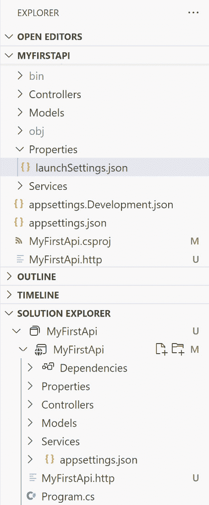

# 2

# ASP.NET Core Web API 入门

**ASP.NET Core**是一个跨平台、开源的 Web 应用程序框架，用于构建现代、云支持的 Web 应用程序和 API。它主要用于与 C#编程语言一起使用。ASP.NET Core 提供了一些功能，帮助你以各种方式构建 Web 应用程序 - 例如，通过 ASP.NET MVC、Web API、Razor Pages、Blazor 等。本书将主要涵盖 Web API。在本章中，我们将学习如何使用 ASP.NET Core 构建一个简单的 REST Web API。

在本章中，我们将介绍以下主题：

+   设置开发环境

+   创建一个简单的 REST Web API 项目

+   构建和运行项目

+   理解 MVC 模式

+   **依赖注入**(**DI**)

+   最小 API 简介

本章将为你提供创建基本 REST Web API 项目所需的必要信息，使用 ASP.NET Core。到本章结束时，你应该对创建第一个 ASP.NET Core Web API 项目所需的步骤有更好的理解。

# 技术要求

预期你应了解**.NET Framework**或**.NET Core**的基本概念，以及**面向对象编程**(**OOP**)。你还应具备对**C#**编程语言的基本理解。如果你不熟悉这些概念，可以参考以下资源：

+   **.NET** **基础**: [`learn.microsoft.com/en-us/dotnet/fundamentals/`](https://learn.microsoft.com/en-us/dotnet/fundamentals/)

+   **C#**: [`learn.microsoft.com/en-us/dotnet/csharp/`](https://learn.microsoft.com/en-us/dotnet/csharp/)

+   **OOP (****C#)**: [`learn.microsoft.com/en-us/dotnet/csharp/fundamentals/tutorials/oop`](https://learn.microsoft.com/en-us/dotnet/csharp/fundamentals/tutorials/oop)

本章中的代码示例可以在[`github.com/PacktPublishing/Web-API-Development-with-ASP.NET-Core-8/tree/main/samples/chapter2`](https://github.com/PacktPublishing/Web-API-Development-with-ASP.NET-Core-8/tree/main/samples/chapter2)找到。

# 设置开发环境

.NET Core 完全跨平台，可以在 Windows、Linux 和 macOS 上运行，因此你可以使用这些平台中的任何一个来开发 ASP.NET Core 应用程序。本书中的代码示例是在 Windows 11 上编写的。然而，你可以在 Linux 和 macOS 上运行相同的代码。

对于 ASP.NET Core，也有几个 IDE 可供选择，例如 Visual Studio、**Visual Studio Code** (**VS Code**)、Visual Studio for Mac 和 Rider。在这本书中，我们将主要使用 VS Code。

为什么不使用 Visual Studio？

Visual Studio 是.NET 平台的强大 IDE。它提供了一系列工具和功能，以提升和增强软件开发每个阶段的体验。然而，VS Code 更轻量级，且开源且跨平台。我们将使用 VS Code 来理解 ASP.NET Core 的概念，然后迁移到 Visual Studio 以使用其丰富的功能。如果你熟悉 Visual Studio 或任何其他 IDE，请随意使用。

这里是一份你需要安装的软件、SDK 和工具列表：

+   **VS Code**：[`code.visualstudio.com/download`](https://code.visualstudio.com/download)

+   **.NET 8 SDK**：[`dotnet.microsoft.com/en-us/download`](https://dotnet.microsoft.com/en-us/download)

VS Code 和 .NET 8 SDK 都是跨平台的，所以请根据你的操作系统选择正确的版本。当你安装 VS Code 时，请确保勾选 **添加到** **PATH** 选项。

如果你使用 Windows，你可能想安装 **Windows Terminal** 来运行命令行。Windows Terminal 可用于 Windows 10 及以上版本，并提供更好的用户体验。但它是可选的，因为你也可以直接使用命令行。

## 配置 VS Code

严格来说，VS Code 是一个代码编辑器。它不能识别所有编程语言。因此，你需要安装一些扩展来支持你的开发工作流程。你可以在 VS Code 界面左侧的活动栏中点击 **扩展** 图标来浏览和安装扩展。然后，你将看到 VS Code 市场中最受欢迎的扩展列表：


图 2.1 – VS Code 的 C# 开发工具包扩展概述

你需要安装此扩展以支持 .NET 开发：

+   **C# 开发工具包**：这是由 Microsoft 提供的官方 VS Code C# 扩展。当你安装 C# 开发工具包时，以下扩展将自动安装：

    +   **C# 扩展**：此扩展通过 OmniSharp 提供了 C# 语言支持

    +   **IntelliCode for C# 开发工具包**：此扩展为 C# 提供了 AI 辅助的 IntelliSense 功能

    +   **.NET 运行时安装工具**：此扩展提供了一种统一的方式来安装本地、私有版本的 .NET 运行时

C# 开发工具包扩展提供了许多功能，帮助你开发 .NET 应用程序。按 *Ctrl* + *Shift* + *P*（在 Windows 上）或 *Command* + *Shift* + *P*（在 macOS 上）打开命令面板，然后输入 `.net` 以查看 C# 开发工具包扩展提供的命令。你可以使用这些命令创建新项目、生成构建和调试资源、运行测试等。

你还可以安装以下扩展来提高你的生产力：

+   **VS Code 的 EditorConfig 扩展**：此扩展为 VS Code 提供了 EditorConfig 支持。EditorConfig 帮助多个开发者在各种编辑器和 IDE 中维护一致的编码风格，当他们在同一项目上工作时。

+   **GitHub Copilot**：GitHub Copilot 是你的 AI 代码伴侣。你可以在 VS Code 中根据上下文和注释实时获取代码建议。此扩展并非免费，但你可以在 30 天内免费试用。如果你是学生、教师或知名开源项目的维护者，你可以免费获得它。

要配置 EditorConfig，您可以在项目的根文件夹中创建一个名为`.editorconfig`的文件。您可以在[`learn.microsoft.com/en-us/dotnet/fundamentals/code-analysis/code-style-rule-options`](https://learn.microsoft.com/en-us/dotnet/fundamentals/code-analysis/code-style-rule-options)找到示例 EditorConfig 文件。

## 检查.NET SDK

一旦安装了.NET SDK，您可以通过运行以下命令来检查版本：

```cs
dotnet --version
```

您应该能够按以下方式看到版本号：

```cs
8.0.101-rc.2.23502.2
```

微软经常发布新的.NET SDK 版本。如果您遇到不同的版本号，这是可以接受的。

您可以通过运行以下命令列出所有可用的 SDK：

```cs
dotnet --list-sdks
```

前面的命令将列出您机器上所有可用的 SDK。例如，如果您安装了多个.NET SDK，它可能会显示以下输出：

```cs
6.0.415 [C:\Program Files\dotnet\sdk]7.0.402 [C:\Program Files\dotnet\sdk]
8.0.100 [C:\Program Files\dotnet\sdk]
8.0.101 [C:\Program Files\dotnet\sdk]
```

可以同时安装多个.NET SDK 版本。我们可以在项目文件中指定.NET SDK 的版本。

我应该使用哪个版本的 SDK？

每个 Microsoft 产品都有其生命周期。.NET 和.NET Core 提供**长期支持**（**LTS**）版本，这些版本将获得 3 年的补丁和免费支持。当本书编写时，.NET 7 仍在支持中，直到 2024 年 5 月。根据微软的政策，偶数版本是 LTS 版本。因此，.NET 8 是最新 LTS 版本。本书中的代码示例是用.NET 8.0 编写的。

要了解更多关于.NET 支持策略的信息，请访问[`dotnet.microsoft.com/en-us/platform/support/policy`](https://dotnet.microsoft.com/en-us/platform/support/policy)。

我们现在已准备好开始开发 ASP.NET Core 应用程序。让我们开始工作吧！

# 创建简单的 REST Web API 项目

在本节中，我们将使用**.NET 命令行界面**（**.NET CLI**）创建一个基本的 Web API 项目并查看其工作方式。

.NET CLI 是一个命令行工具，它帮助您创建、开发、构建、运行和发布.NET 应用程序。它包含在.NET SDK 中。

您有多种方式来运行.NET CLI 命令。最常见的方式是在终端窗口或命令提示符中运行命令。此外，您还可以在 VS Code 中直接运行命令。VS Code 提供了一个集成终端，它从工作区的根目录开始。要在 VS Code 中打开终端，您可以执行以下任何一项操作：

+   按*Ctrl* + *`*（在 Windows 上）或*Command* + *`*（在 macOS 上）打开终端

+   使用**视图** | **终端**菜单项打开终端

+   从命令面板，使用**视图：切换终端**命令打开终端

在终端中，导航到您想要创建项目的文件夹，然后通过运行以下命令创建一个 Web API 项目：

```cs
dotnet new webapi -n MyFirstApi -controllerscd MyFirstApi
code .
```

前面的命令创建了一个新的 Web API 项目并在 VS Code 中打开它。`dotnet new`提供了许多选项来创建各种类型的项目，例如 Web API、控制台应用程序、类库等。

我们可以使用一些选项来指定项目：

+   `-n|--name <OUTPUT_NAME>`: 创建输出的名称。如果未指定，则使用当前目录的名称。

+   `-o|--output <OUTPUT_PATH>`: 创建项目的输出路径。如果未指定，则使用当前目录。

+   `-controllers|--use-controllers`: 指示是否为操作使用控制器。如果未指定，则默认值是 `false`。

+   `-minimal|--use-minimal-apis`: 指示是否使用最小 API。默认值是 `false`，但 `-controllers` 选项会覆盖 `-minimal` 选项。如果没有指定 `-controllers` 或 `-minimal`，则使用 `-controllers` 选项的默认值 `false`，因此将创建最小 API。

重要提示

自 .NET 6.0 以来，ASP.NET Core 6.0 提供了一种创建 Web API 项目的全新方式，称为 `--use-controllers` 选项。

要了解更多关于 `dotnet new` 命令的信息，请查看此页面：[`docs.microsoft.com/en-us/dotnet/core/tools/dotnet-new`](https://docs.microsoft.com/en-us/dotnet/core/tools/dotnet-new)。我们将在接下来的章节中介绍 `dotnet` 命令的更多细节。

当你使用 VS Code 打开项目时，C# Dev Kit 扩展可以为你创建一个解决方案文件。这个特性使得 VS Code 对 C# 开发者更加友好。你可以在资源管理器视图中看到以下结构：

原因是 VS 2022 会为项目创建一个 sln 文件，但 .NET CLI 不会。当使用 VS Code 打开项目时，C# DevKit 会创建 sln 文件。我认为在这里提一下是有意义的。

C# Dev Kit 扩展提供了一项新功能，即解决方案资源管理器，它位于底部。这个特性在处理一个解决方案中的多个项目时特别有用。你可以将 **SOLUTION EXPLORER** 拖放到顶部以使其更易于查看。

当你使用 VS Code 打开项目时，C# Dev Kit 扩展可以为你创建一个解决方案文件。这个特性使得 VS Code 对 C# 开发者更加友好。你可以在资源管理器视图中看到以下结构：



图 2.2 – 解决方案资源管理器和文件夹结构

接下来，我们可以开始构建和运行项目。

# 构建和运行项目

在本节中，我们将学习如何构建和运行项目，并介绍一些有用的工具来帮助测试 API。为了使其与所有平台兼容，我们将使用 .NET CLI 命令来构建和运行项目。我们还将学习如何在 VS Code 中调试项目。

## 构建项目

构建和运行项目的最简单方法是使用 `dotnet` 命令。你可以运行以下命令来构建项目：

```cs
dotnet build
```

前面的命令将构建项目和其依赖项，并生成一组二进制文件。您可以在 `bin` 文件夹中找到这些二进制文件。`bin` 文件夹是 `dotnet build` 命令的默认输出文件夹。您可以使用 `--output` 选项指定输出文件夹。但是，建议使用默认的 `bin` 文件夹。这些二进制文件是一些 `.dll` 扩展名的文件。

当您使用 VS Code 打开项目时，您可能会看到以下弹出窗口：


图 2.3 – VS Code 提示恢复依赖项

这是因为 VS Code 会检查项目是否为 .NET 项目，并尝试恢复依赖项。您可以点击**恢复**按钮来恢复依赖项。同样，如果您看到 VS Code 提示添加资产以调试项目，请在对话框中选中**是**：


图 2.4 – VS Code 提示添加构建和调试所需的资产

一些命令，如 `dotnet build`、`dotnet run`、`dotnet test` 和 `dotnet publish`，将隐式恢复依赖项。所以如果您错过了这些提示，请不要担心。

如果没有显示错误或警告，则表示构建成功。

## 运行项目

您可以运行以下命令来运行项目：

```cs
dotnet run
```

`dotnet run` 命令是从源代码运行项目的便捷方式。请注意，它在开发中很有用，但不适用于生产。原因是如果依赖项不在共享运行时之外，`dotnet run` 命令将从 NuGet 缓存中解析依赖项。要在生产中运行应用程序，您需要使用 `dotnet publish` 命令创建部署包并将其部署。我们将在未来的章节中探讨部署过程。

您应该能够看到以下输出：

```cs
Building...info: Microsoft.Hosting.Lifetime[14]
      Now listening on: https://localhost:7291
info: Microsoft.Hosting.Lifetime[14]
      Now listening on: http://localhost:5247
info: Microsoft.Hosting.Lifetime[0]
      Application started. Press Ctrl+C to shut down.
info: Microsoft.Hosting.Lifetime[0]
      Hosting environment: Development
info: Microsoft.Hosting.Lifetime[0]
      Content root path: C:\example_code\chapter2\MyFirstApi\MyFirstApi
info: Microsoft.Hosting.Lifetime[0]
      Application is shutting down...
```

输出中有一个链接，例如 `http://localhost:5247`。端口号是在我们创建项目时随机生成的。在浏览器中，导航到 `http://localhost:<your_port>/swagger`。您将看到带有 **Swagger UI** 的 Web API 文档，它提供了一个基于 Web 的 UI，以提供信息和工具来与 API 交互。您可以使用 Swagger UI 测试 API：


图 2.5 – Swagger UI

API 项目现在正在运行！您可以看到 Web API 模板提供了一个 `/WeatherForecast` 端点。如果您在浏览器中导航到 `http://localhost:5247/WeatherForecast` 链接，您将看到 API 响应。

要支持 HTTPS，您可能需要运行以下命令以信任 HTTPS 开发证书：

```cs
dotnet dev-certs https --trust
```

如果证书之前未被信任，您将看到一个对话框。选择**是**以信任开发证书：


图 2.6 – 为本地开发安装证书

请注意，前面的命令在 Linux 上不起作用。有关更多详细信息，请参阅您的 Linux 发行版文档。

## 更改端口号

端口号定义在`Properties`文件夹中的`launchSettings.json`文件中。您可以通过编辑文件来更改端口号。根据惯例，当创建 Web API 项目时，HTTP 将选择从`5000`到`5300`的端口号，HTTPS 则从`7000`到`7300`。以下是`launchSettings.json`文件的示例：

```cs
{  "$schema": "https://json.schemastore.org/launchsettings.json",
  ...
  "profiles": {
    "https": {
      "commandName": "Project",
      "dotnetRunMessages": true,
      "launchBrowser": true,
      "launchUrl": "swagger",
      "applicationUrl": "https://localhost:7291;http://localhost:5247",
      "environmentVariables": {
        "ASPNETCORE_ENVIRONMENT": "Development"
      }
    },
    ...
  }
}
```

您可以在此处更新端口号。但请记住，端口号应在您的机器上唯一，以避免冲突。

## 热重载

当您使用`dotnet run`运行项目时，如果更改代码，则需要停止项目并重新启动。如果您的项目很复杂，停止和重新启动需要花费时间。为了加快开发速度，您可以使用`dotnet watch`命令启用热重载功能。

.NET 热重载是一种允许您在不重新启动应用程序的情况下将代码更改应用于正在运行的应用程序的功能。它最初在.NET 6 中提供。您可以使用`dotnet watch`而不是`dotnet run`来在开发中激活热重载。一旦更新代码，网页将自动刷新。但是，热重载不支持所有代码更改。在某些情况下，`dotnet watch`将询问您是否想要重新启动应用程序。有一些选项：`是`、`否`、`总是`和`从不`。根据您想要应用的代码更改选择合适的选项，如下所示：

```cs
dotnet watch  File changed: .\Services\IService.cs.dotnet watch  Unable to apply hot reload because of a rude edit.
   Do you want to restart your app - Yes (y) / No (n) / Always (a) / Never (v)?
```

API 项目现在正在运行，我们可以开始测试 API。

## 测试 API 端点

浏览器可以轻松发送`GET`请求，但对于`POST`端点来说并不简单。有各种方法可以用于测试目的调用 API，例如 Swagger UI、Postman 和其他工具。在本节中，我们将介绍一些您可以在开发阶段使用的工具。

## Swagger UI

我们在*第一章*中介绍了如何使用 SwaggerHub 设计 API。从 5.0 版本开始，ASP.NET Core 默认启用 OpenAPI 支持。它使用`Swashbuckle.AspNetCore` NuGet 包，该包提供了 Swagger UI 来文档化和测试 API。

我们可以使用 Swagger UI 直接测试 API。在 Swagger UI 中展开第一个`/WeatherForecast` API，然后点击**Try it out**按钮。您将看到一个**Execute**按钮。点击该按钮，您将看到以下响应：


图 2.7 – 在 Swagger UI 中测试端点

*图 2.7*演示了 API 正在正确运行并提供了预期的响应。要了解更多关于 Swagger 和 OpenAPI 的信息，您可以查看以下链接：

+   **Swagger**：[`swagger.io/`](https://swagger.io/)

+   **OpenAPI**：[`www.openapis.org/`](https://www.openapis.org/)

+   **SmartBear**：[`www.smartbear.com/`](https://www.smartbear.com/)

### Postman

**Postman** 是一个强大的 API 平台，用于构建和使用 API。它被许多个人开发者和组织广泛使用。您可以从这里下载：[`www.postman.com/downloads/`](https://www.postman.com/downloads/).

将 `http://localhost:5247/WeatherForecast` 作为 URL。然后，点击 **发送** 按钮。您将看到以下响应：


图 2.8 – 使用 Postman 调用 API

Postman 提供了一组丰富的功能来测试 API。要了解更多关于 Postman 的信息，请查看官方文档：[`learning.postman.com/docs/getting-started/introduction/`](https://learning.postman.com/docs/getting-started/introduction/).

### HttpRepl

`GET`、`POST`、`PUT`、`DELETE`、`HEAD`、`OPTIONS` 和 `PATCH` HTTP 动词。

要安装 HttpRepl，您可以使用以下命令：

```cs
dotnet tool install -g Microsoft.dotnet-httprepl
```

安装完成后，您可以使用以下命令连接到我们的 API：

```cs
httprepl <ROOT URL>/
```

`<ROOT URL>` 是 Web API 的基本 URL，例如以下所示：

```cs
httprepl http://localhost:5247/
```

连接建立后，您可以使用 `ls` 或 `dir` 命令列出端点，例如以下所示：

```cs
http://localhost:5247/> ls.                 []
WeatherForecast   [GET]
```

上述命令显示 `WeatherForecast` 端点支持 `GET` 操作。然后，我们可以使用 `cd` 命令导航到端点，例如以下所示：

```cs
http://localhost:5247/> cd WeatherForecast/WeatherForecast    [GET]
```

然后，我们可以使用 `get` 命令测试端点，例如以下所示：

```cs
http://localhost:5247/WeatherForecast> get
```

输出看起来像这样：


图 2.9 – HttpRepl 的输出

要断开连接，请按 *Ctrl* + *C* 退出。

您可以在 [`docs.microsoft.com/en-us/aspnet/core/web-api/http-repl/`](https://docs.microsoft.com/en-us/aspnet/core/web-api/http-repl/) 找到有关 HttpRepl 的更多信息。

### Thunder Client

如果您更喜欢在 VS Code 中完成所有操作，**Thunder Client** 是测试 API 的绝佳工具。Thunder Client 是 VS Code 的一个轻量级 REST API 客户端扩展，允许用户在无需离开 VS Code 的情况下测试他们的 API。这使得它成为希望简化工作流程的开发者的理想选择：


图 2.10 – VS Code 的 Thunder Client 扩展

安装完成后，点击 **动作栏** 上的 **Thunder Client** 图标。从侧边栏中，点击 **新建请求** 按钮。以下 UI 将显示：


图 2.11 – 使用 Thunder Client 测试 API

要了解更多关于 Thunder Client 的信息，请访问他们的 GitHub 页面：[`github.com/rangav/thunder-client-support`](https://github.com/rangav/thunder-client-support).

### 在 VS 2022 中使用.http 文件

如果您使用 Visual Studio 2022，您可以使用 `.http` 文件来测试 API。`.http` 文件是一个包含 HTTP 请求定义的文本文件。最新的 ASP.NET Core 8 模板项目提供了一个默认的 `.http` 文件。您可以在 `MyFirstApi` 文件夹中找到它。文件的内容如下：

```cs
@MyFirstApi_HostAddress = http://localhost:5247GET {{MyFirstApi_HostAddress}}/weatherforecast/
Accept: application/json
###
```

第一行定义了一个名为`MyFirstApi_HostAddress`的变量，其值为 API 的根 URL。第二行定义了一个对`/weatherforecast`端点的`GET`请求。第三行定义了一个`Accept`头。在这种情况下，它接受`application/json`内容类型。在 Visual Studio 2022 中打开此文件，你将在请求的左侧看到**发送请求**按钮。点击该按钮，你将看到以下响应：


图 2.12 – 使用 .http 文件在 Visual Studio 2022 中测试 API

然而，当这本书编写时，`.http`文件缺少一些功能，例如环境变量。此外，此功能仅在 Visual Studio 2022 中可用，因此我们不会在本书中使用它。但如果你对进一步探索此功能感兴趣，请参阅 Microsoft 文档[`learn.microsoft.com/en-us/aspnet/core/test/http-files`](https://learn.microsoft.com/en-us/aspnet/core/test/http-files)以获取更多信息。

我们介绍了一些用于测试 API 的工具。现在让我们学习如何调试 API。

## 调试

VS Code 具有内置的调试功能，允许你调试代码。与 Visual Studio 不同，它需要一个`launch.json`配置来进行调试。当你打开 VS Code 中的 ASP.NET Core 项目时，它将提示你添加一些资产。如果你选择`.vscode`文件夹中的`launch.json`文件。

如果你错过了它，你可以从调试视图中手动添加：


图 2.13 – 从调试视图创建 launch.json 文件

如果你没有看到图 2.13 中的按钮，你可以通过按*Ctrl* + *Shift* + *P*（在 Windows 上）或*Command* + *Shift* + *P*（在 macOS 上）打开命令面板，然后输入`.net`，在`.vscode`文件夹中选择`launch.json`文件：


图 2.14 – 从命令面板生成 launch.json 文件

下面显示了默认的`launch.json`配置内容：

```cs
{    "version": "0.2.0",
    "configurations": [
        {
            // Use IntelliSense to find out which attributes exist for C# debugging
            // Use hover for the description of the existing attributes
            // For further information visit https://github.com/dotnet/vscode-csharp/blob/main/debugger-launchjson.md.
            "name": ".NET Core Launch (web)",
            "type": "coreclr",
            "request": "launch",
            "preLaunchTask": "build",
            // If you have changed target frameworks, make sure to update the program path.
            "program": "${workspaceFolder}/bin/Debug/net8.0/MyFirstApi.dll",
            "args": [],
            "cwd": "${workspaceFolder}",
            "stopAtEntry": false,
            // Enable launching a web browser when ASP.NET Core starts. For more information: https://aka.ms/VSCode-CS-LaunchJson-WebBrowser
            "serverReadyAction": {
                "action": "openExternally",
                "pattern": "\\bNow listening on:\\s+(https?://\\S+)"
            },
            "env": {
                "ASPNETCORE_ENVIRONMENT": "Development"
            },
            "sourceFileMap": {
                "/Views": "${workspaceFolder}/Views"
            }
        },
        {
            "name": ".NET Core Attach",
            "type": "coreclr",
            "request": "attach"
        }
    ]
}
```

此文件指定了调试的配置。以下是一些重要属性的描述：

+   `program`属性指定可执行文件的路径

+   `args`属性指定传递给可执行文件的参数

+   `cwd`属性指定工作目录

+   `env`属性指定环境变量

目前我们不需要在这个文件中做任何更改。

在应用程序中设置一个断点。例如，我们可以在`WeatherForecastController.cs`文件中的`Get()`方法上设置一个断点，通过点击代码窗口左侧的空白边缘来实现。一旦设置了断点，你将在左侧空白边缘的行号前看到一个红色圆点：


图 2.15 – 在 VS Code 中设置断点

要调试应用程序，通过在左侧菜单中选择**调试**图标打开**调试**视图。确保你从下拉菜单中选择正确的调试配置。对于这个案例，请选择**.NET Core 启动（Web）**。然后，选择面板顶部的绿色箭头：


图 2.16 – 在 VS Code 中调试 API

从上一节中的任何工具发送请求，你将看到程序在到达断点时停止执行，如下所示：


图 2.17 – 在 VS Code 中命中断点

**变量**窗口的**局部**部分将显示当前上下文中定义的变量的值。

你也可以在**调试控制台**窗口中输入一个变量来直接检查其值。要执行下一步，你可以使用 VS Code 窗口顶部的控制工具栏。你可以逐行运行代码以监控其执行。如果我们需要了解程序的工作原理，这会很有帮助。

现在我们已经学习了如何构建、运行和测试 API，是时候看看 API 的代码了。

# 理解 MVC 模式

ASP.NET Core MVC 是一个丰富的框架，用于使用 **模型-视图-控制器**（**MVC**）设计模式构建 Web 应用程序。MVC 模式使 Web 应用程序能够将表示层与业务逻辑分离。ASP.NET Core Web API 项目遵循基本的 MVC 模式，但没有视图，因此它只有模型层和控制器层。让我们更详细地看看：

+   **模型**：模型是表示应用程序中使用的数据的类。通常，数据存储在数据库中。

+   `控制器`文件夹。*图 2**.18* 展示了一个在 Web API 项目中 MVC 模式的示例。然而，视图层不包括在 Web API 项目中。客户端的请求将被映射到控制器，控制器将执行业务逻辑并将响应返回给客户端。


图 2.18 – MVC 模式

接下来，我们将查看 ASP.NET Core Web API 项目中模型和控制器代码。

## 模型和控制器

在 ASP.NET Core 模板项目中，你可以找到一个名为 `WeatherForecast.cs` 的文件。这是一个模型。它是一个纯 C# 类，表示数据模型。

控制器位于 `Controllers` 文件夹中的 `WeatherForecastController.cs` 文件。它包含业务逻辑。

它看起来像这样：

```cs
[ApiController][Route("[controller]")]
public class WeatherForecastController : ControllerBase
{
    // Some code is ignored
    private readonly ILogger<WeatherForecastController> _logger;
    public WeatherForecastController(ILogger<WeatherForecastController> logger)
    {
        _logger = logger;
    }
    [HttpGet(Name = "GetWeatherForecast")]
    public IEnumerable<WeatherForecast> Get()
    {
        return Enumerable.Range(1, 5).Select(index => new WeatherForecast
        {
            Date = DateOnly.FromDateTime(DateTime.Now.AddDays(index)),
            TemperatureC = Random.Shared.Next(-20, 55),
            Summary = Summaries[Random.Shared.Next(Summaries.Length)]
        })
        .ToArray();
    }
}
```

控制器类的构造函数有一个名为 `ILogger<WeatherForecastController> logger` 的参数。该参数用于记录消息。它由 ASP.NET Core 框架通过依赖注入（DI）注入。我们将在下一节中讨论 DI。

此类有一个 `[ApiController]` 属性，表示它是一个 Web API 控制器。它还有一个 `[Route("[controller]")]` 属性，表示控制器的 URL。

`Get()` 方法有一个 `[HttpGet(Name = "GetWeatherForecast")]` 属性，它指示端点的名称，`Get()` 方法是一个 `GET` 操作。此方法返回一个包含天气预报的列表作为响应。

注意，`[Route("[controller]")]` 属性标记在控制器类上。这意味着控制器的路径是 `/WeatherForecast`。目前，`Get()` 方法上没有 `[Route]` 属性。我们将在未来的章节中了解更多关于路由的内容。

我们现在应该对 ASP.NET Core Web API 的工作原理有一个基本的了解。客户端向 Web API 发送请求，请求将被映射到控制器和方法。控制器将执行业务逻辑并返回响应。我们可以在控制器中使用一些方法从数据库中获取、保存、更新和删除数据。

接下来，让我们通过添加新的模型和控制器来创建一个新的 API 端点。

## 创建新的模型和控制器

在 *第一章*，我们展示了 [`jsonplaceholder.typicode.com/posts`](https://jsonplaceholder.typicode.com/posts) 上的一个示例 REST API。它返回一个帖子列表，如下所示：

```cs
[  {
    "userId": 1,
    "id": 1,
    "title": "sunt aut facere repellat provident occaecati excepturi optio reprehenderit",
    "body": "quia et suscipit\nsuscipit recusandae consequuntur expedita et cum\nreprehenderit molestiae ut ut quas totam\nnostrum rerum est autem sunt rem eveniet architecto"
  },
  {
    "userId": 1,
    "id": 2,
    "title": "qui est esse",
    "body": "est rerum tempore vitae\nsequi sint nihil reprehenderit dolor beatae ea dolores neque\nfugiat blanditiis voluptate porro vel nihil molestiae ut reiciendis\nqui aperiam non debitis possimus qui neque nisi nulla"
  },
  ...
]
```

让我们实现一个类似的 API。首先，我们需要创建一个新的模型。在项目中创建一个名为 `Models` 的新文件夹。然后，在 `Models` 文件夹中创建一个名为 `Post.cs` 的新文件：

```cs
namespace MyFirstApi.Models;public class Post
{
    public int UserId { get; set; }
    public int Id { get; set; }
    public string Title { get; set; } = string.Empty;
    public string Body { get; set; } = string.Empty;
}
```

文件作用域命名空间声明

从 C# 10 开始，你可以使用一种新的命名空间声明形式，如前一个代码片段所示，这被称为文件作用域命名空间声明。此文件中的所有成员都在同一个命名空间中。这节省了空间并减少了缩进。

可空引用类型

你可能想知道为什么我们将 `Title` 和 `Body` 属性赋值为空字符串。这是因为这些属性的类型是 `string`。如果我们不初始化属性，编译器将会报错：

`不可为空的属性 'Title' 在构造函数退出时必须包含一个非空值。考虑将属性声明为可空的。`

默认情况下，ASP.NET Core Web API 项目模板在 `<PropertyGroup>` 部分启用了 `<Nullable>enable</Nullable>`。

可空引用类型是在 C# 8.0 中引入的。它们可以最小化导致运行时抛出 `System.NullReferenceException` 错误的错误可能性。例如，如果我们忘记初始化 `Title` 属性，当我们尝试访问它的属性时，比如 `Title.Length`，可能会得到 `System.NullReferenceException` 错误。

启用此功能后，任何引用类型的变量都被视为不可为空。如果您想允许变量为可空，必须使用 `?` 运算符将类型名称附加到变量声明中，以将其声明为可空引用类型；例如，`public string Title? { get; set; }`，这明确地将属性标记为可空。

要了解更多关于此功能的信息，请参阅 [`docs.microsoft.com/en-us/dotnet/csharp/nullable-references`](https://docs.microsoft.com/en-us/dotnet/csharp/nullable-references)。

接下来，在 `Controllers` 文件夹中创建一个名为 `PostController.cs` 的新文件。您可以手动添加它，或者安装 `dotnet-aspnet-codegenerator` 工具来创建它。要安装该工具，请在项目文件夹中运行以下命令：

```cs
dotnet add package Microsoft.VisualStudio.Web.CodeGeneration.Designdotnet tool install -g dotnet-aspnet-codegenerator
```

前面的命令安装了用于脚手架的必需的 NuGet 包。`dotnet-aspnet-codegenerator` 工具是一个脚手架引擎，用于生成代码。

然后，运行以下命令来生成控制器：

```cs
dotnet-aspnet-codegenerator controller -name PostsController -api -outDir Controllers
```

前面的命令生成一个空控制器。`-name` 选项指定了控制器的名称。`-api` 选项表示控制器是一个 API 控制器。`-outDir` 选项指定了输出目录。按照以下内容更新控制器的内容：

```cs
using Microsoft.AspNetCore.Mvc;using MyFirstApi.Models;
namespace MyFirstApi.Controllers;
[Route("api/[controller]")]
[ApiController]
public class PostsController : ControllerBase
{
    [HttpGet]
    public ActionResult<List<Post>> GetPosts()
    {
        return new List<Post>
        {
            new() { Id = 1, UserId = 1, Title = "Post1", Body = "The first post." },
            new() { Id = 2, UserId = 1, Title = "Post2", Body = "The second post." },
            new() { Id = 3, UserId = 1, Title = "Post3", Body = "The third post." }
        };
    }
}
```

目标类型的新表达式

当我们创建一个特定类型的 `List` 实例时，我们通常会使用如下代码：

`var list =` `new List<Post>`

`{`

`new Post() { Id = 1, UserId = 1, Title = "Post1", Body = "The first` `post." },`

`};`

当列表声明为 `List<Post>` 时，类型已知，因此在添加新元素时不需要使用 `new Post()`。对于构造函数，例如 `new()`，可以省略类型指定。这个特性是在 C# 9.0 中引入的。

控制器的名称为 `PostsController`。约定是资源名称加上 `Controller` 后缀。它带有 `ApiController` 属性，表示该控制器是一个 Web API 控制器。它还有一个 `[Route("api/[controller]")]` 属性，表示控制器的 URL。`[controller]` 作为一个占位符，将在路由中替换为控制器的名称。因此，此控制器的路由是 `/api/posts`。

在此控制器中，我们有一个名为 `GetPosts()` 的方法。该方法返回一个帖子列表作为响应。该方法带有 `[HttpGet]` 属性，表示这是一个 `GET` 操作。它没有任何路由模板，因为它将匹配 `/api/posts`。对于其他方法，我们可以使用 `[Route("[action]")]` 属性来指定路由模板。

`GetPosts()` 方法的返回类型是 `ActionResult<IEnumerable<Post>>`。ASP.NET Core 可以自动将对象转换为 JSON 并将其作为响应消息返回给客户端。它还可以返回其他 HTTP 状态码，例如 `NotFound`、`BadRequest`、`InternalServerError` 等。我们将在稍后看到更多示例。

如果你运行`dotnet run`或`dotnet watch`，然后导航到 Swagger UI，例如`https://localhost:7291/swagger/index.html`，你将看到列出的新 API。API 可通过`/api/posts`访问。

目前，`/api/posts`端点返回一个硬编码的帖子列表。让我们更新控制器以从服务返回帖子列表。

## 创建服务

在项目中创建一个`Services`文件夹。然后，在`Services`文件夹中创建一个名为`PostService.cs`的新文件，如下所示：

```cs
using MyFirstApi.Models;namespace MyFirstApi.Services;
public class PostsService
{
    private static readonly List<Post> AllPosts = new();
    public Task CreatePost(Post item)
    {
        AllPosts.Add(item);
        return Task.CompletedTask;
    }
    public Task<Post?> UpdatePost(int id, Post item)
    {
        var post = AllPosts.FirstOrDefault(x => x.Id == id);
        if (post != null)
        {
            post.Title = item.Title;
            post.Body = item.Body;
            post.UserId = item.UserId;
        }
        return Task.FromResult(post);
    }
    public Task<Post?> GetPost(int id)
    {
        return Task.FromResult(AllPosts.FirstOrDefault(x => x.Id == id));
    }
    public Task<List<Post>> GetAllPosts()
    {
        return Task.FromResult(AllPosts);
    }
    public Task DeletePost(int id)
    {
        var post = AllPosts.FirstOrDefault(x => x.Id == id);
        if (post != null)
        {
            AllPosts.Remove(post);
        }
        return Task.CompletedTask;
    }
}
```

`PostsService`类是一个简单的演示服务，用于管理帖子列表。它有创建、更新和删除帖子的方法。为了简化实现，它使用静态字段来存储帖子列表。这只是为了演示目的；请勿在生产环境中使用。

接下来，我们将遵循 API 设计来实现 CRUD 操作。你可以回顾上一章的*基于 REST 的 API 设计*部分。

## 实现获取操作

`viewPost()`操作的实现设计如下：

| **操作名称** | **URL** | **HTTP 方法** | **输入** | **响应** | **描述** |
| --- | --- | --- | --- | --- | --- |
| `viewPost()` | `/posts/{postId}` | `GET` | PostId | 帖子，200 | 查看帖子详情 |

表 2.1 – `viewPost()`操作的实现设计

按如下方式更新`PostController`类：

```cs
using Microsoft.AspNetCore.Mvc;using MyFirstApi.Models;
using MyFirstApi.Services;
namespace MyFirstApi.Controllers;
[Route("api/[controller]")]
[ApiController]
public class PostsController : ControllerBase
{
    private readonly PostsService _postsService;
    public PostsController()
    {
        _postsService = new PostsService();
    }
    [HttpGet("{id}")]
    public async Task<ActionResult<Post>> GetPost(int id)
    {
        var post = await _postsService.GetPost(id);
        if (post == null)
        {
            return NotFound();
        }
        return Ok(post);
    }
    // Omitted for brevity
}
```

在控制器的构造方法中，我们初始化了`_postsService`字段。请注意，我们使用`new()`构造函数来创建服务的一个实例。这意味着控制器与`PostsService`类耦合在一起。我们将在下一章中看到如何解耦控制器和服务。

然后，创建一个名为`GetPost()`的方法，该方法返回具有指定 ID 的帖子。它有一个`[HttpGet("{id}")]`属性来指示操作的 URL。URL 将被映射到`/api/posts/{id}`。`id`是一个占位符，它将被帖子的 ID 替换。然后，`id`将被作为参数传递给`GetPost()`方法。

如果找不到帖子，该方法将返回一个`NotFound`响应。ASP.NET Core 提供了一套内置的响应消息，例如`NotFound`、`BadRequest`、`InternalServerError`等。

如果你现在调用 API，它将返回`NotFound`，因为我们还没有创建帖子。

## 实现创建操作

`createPost()`操作的实现设计如下：

| **操作名称** | **URL** | **HTTP 方法** | **输入** | **响应** | **描述** |
| --- | --- | --- | --- | --- | --- |
| `createPost()` | `/posts` | `POST` | 帖子 | 帖子，201 | 创建一个新的帖子 |

表 2.2 – `createPost()`操作的实现设计

在控制器中创建一个名为`CreatePost()`的新方法。由于控制器已映射到`api/posts`，我们不需要指定此方法的路由。该方法的内容如下：

```cs
[HttpPost]public async Task<ActionResult<Post>> CreatePost(Post post)
{
    await _postsService.CreatePost(post);
    return CreatedAtAction(nameof(GetPost), new { id = post.Id }, post);
}
```

当我们调用这个端点时，`post` 对象将以 JSON 格式序列化，并将其附加到 `POST` 请求体中。在这个方法中，我们可以从请求中获取帖子，然后调用服务中的 `CreatePost()` 方法来创建一个新的帖子。然后，我们将返回内置的 `CreatedAtAction`，它返回一个包含指定操作名称、路由值和帖子的响应消息。对于这种情况，它将调用 `GetPost()` 操作来返回新创建的帖子。

现在，我们可以测试 API。例如，我们可以在 Thunder Client 中发送一个 `POST` 请求。

将方法改为 `POST`。使用以下 JSON 数据作为正文：

```cs
{  "userId": 1,
  "id": 1,
  "title": "Hello ASP.NET Core",
  "body": "ASP.NET Core is a cross-platform, high-performance, open-source framework for building modern, cloud-enabled, Internet-connected apps."
}
```

点击 `201 Created`：


图 2.19 – 发送 POST 请求

然后，向 `api/posts/1` 端点发送一个 `GET` 请求。我们可以得到如下响应：


图 2.20 – 发送 GET 请求

请注意，我们创建的帖子存储在服务的内存中。因为我们没有提供数据库来存储数据，如果我们重新启动应用程序，帖子将会丢失。

接下来，让我们看看如何实现更新操作。

## 实现 UPDATE 操作

`updatePost()` 操作的设计如下：

| **操作名称** | **URL** | **HTTP 方法** | **输入** | **响应** | **描述** |
| --- | --- | --- | --- | --- | --- |
| `updatePost()` | `/posts/{postId}` | `PUT` | Post | Post, 200 | 更新一个新的帖子 |

表 2.3 – `updatePost()` 操作的设计

在控制器中创建一个新的 `UpdatePost()` 方法，如下所示：

```cs
[HttpPut("{id}")]public async Task<ActionResult> UpdatePost(int id, Post post)
{
    if (id != post.Id)
    {
        return BadRequest();
    }
    var updatedPost = await _postsService.UpdatePost(id, post);
    if (updatedPost == null)
    {
        return NotFound();
    }
    return Ok(post);
}
```

此方法有一个 `[HttpPut("{id}")]` 属性，表示这是一个 `PUT` 操作。同样，`id` 是一个占位符，它将被帖子的 ID 替换。在 `PUT` 请求中，我们应该将帖子的序列化内容附加到请求体中。

这次，让我们使用 HttpRepl 测试 API。运行以下命令来连接到服务器：

```cs
httprepl https://localhost:7291/api/postsconnect https://localhost:7291/api/posts/1
put -h Content-Type=application/json -c "{"userId": 1,"id": 1,"title": "Hello ASP.NET Core 8","body": "ASP.NET Core is a cross-platform, high-performance, open-source framework for building modern, cloud-enabled, Internet-connected apps."}"
```

你将看到以下输出：

```cs
HTTP/1.1 200 OKContent-Type: application/json; charset=utf-8
Date: Thu, 18 Aug 2022 11:25:26 GMT
Server: Kestrel
Transfer-Encoding: chunked
{
  "userId": 1,
  "id": 1,
  "title": "Hello ASP.NET Core 8",
  "body": "ASP.NET Core is a cross-platform, high-performance, open-source framework for building modern, cloud-enabled, Internet-connected apps."
}
```

然后，我们可以更新 `GetPosts()` 方法如下：

```cs
[HttpGet]public async Task<ActionResult<List<Post>>> GetPosts()
{
    var posts = await _postService.GetAllPosts();
    return Ok(posts);
}
```

我们已经实现了 `GET`、`POST` 和 `PUT` 操作。接下来，你可以尝试自己使用 `DELETE` 操作实现 `DeletePost()` 方法。

# 依赖注入

在前面的控制器示例中，有一个在控制器构造方法中使用 `new()` 构造函数初始化的 `_postsService` 字段：

```cs
private readonly PostsService _postsService;public PostsController()
{
    _postsService = new PostsService();
}
```

这意味着 `PostsController` 类依赖于 `PostsService` 类，而 `PostsService` 类是 `PostsController` 类的依赖。如果我们想用不同的实现来保存数据替换 `PostsService`，我们必须更新 `PostsController` 的代码。如果 `PostsService` 类有自己的依赖项，它们也必须由 `PostsController` 类初始化。当项目变得更大时，依赖项将变得更加复杂。此外，这种实现不易于测试和维护。

**依赖注入**（DI）是软件开发世界中最为知名的设计模式之一。它有助于解耦相互依赖的类。你可能发现以下术语被交替使用：**依赖倒置原则**（DIP）、**控制反转**（IoC）和 DI。尽管它们之间有关联，但这些术语通常会被混淆。你可以找到许多文章和博客文章来解释它们。有些人说它们是同一件事，但有些人说不是。它们究竟是什么？

## 理解 DI

依赖倒置原则是面向对象（OO）设计中的*SOLID*原则之一。它在 Robert C. Martin 的 2002 年出版的《敏捷软件开发：原则、模式和最佳实践》*Pearson*一书中被定义。该原则指出，“*高层模块不应依赖于低层模块；两者都应依赖于抽象。抽象不应依赖于细节。细节应依赖于抽象*。”

在前面的控制器中，我们提到`PostsController`依赖于`PostsService`。控制器是高层模块，而服务是低层模块。当服务发生变化时，控制器也必须随之改变。请注意，术语*反转*并不意味着低层模块将依赖于高层。相反，两者都应依赖于暴露给高层模块所需行为的抽象。如果我们通过为服务创建一个接口来反转这种依赖关系，那么控制器和服务都将依赖于该接口。只要服务实现尊重接口，其实现可以改变。

**IoC**（控制反转）是一种编程原则，它反转了应用程序中的控制流。在传统的编程中，自定义代码负责实例化对象和控制主函数的执行。与传统的控制流相比，IoC 反转了控制流。使用 IoC 时，框架负责实例化，调用自定义或任务特定的代码。

它可以用来区分框架和类库。通常，框架调用应用程序代码，而应用程序代码调用库。这种类型的 IoC 有时被称为好莱坞原则：“*别给我们打电话，我们会* *给你打电话*。”

IoC 与 DIP 相关，但它不是同一件事。DIP 关注通过共享抽象（接口）解耦高层模块和低层模块之间的依赖关系。IoC 用于增加程序的模块化并使其可扩展。有几种技术可以实现 IoC，例如**服务定位器**、DI、模板方法设计模式、策略设计模式等等。

依赖注入（DI）是一种控制反转（IoC）的形式。这个术语由马丁·福勒（Martin Fowler）在 2004 年提出。它将构建对象和使用对象的关注点分离。当一个对象或函数（客户端）需要依赖项时，它不知道如何构建它。相反，客户端只需要声明依赖项的接口，然后由外部代码（注入器）将依赖项注入到客户端。这使得更改依赖项的实现变得更加容易。它通常类似于策略设计模式。不同之处在于，策略模式可以使用不同的策略来构建依赖项，而 DI 通常只使用依赖项的单个实例。

DI 主要有三种类型：

+   **构造函数注入**：依赖项作为客户端构造函数的参数提供

+   **设置器注入**：客户端公开一个设置器方法以接受依赖项

+   **接口注入**：依赖项的接口提供了一个注入方法，该方法将依赖项注入到传递给它的任何客户端

如您所见，这三个术语是相关的，但也有一些区别。简单来说，DI 是一种在类及其依赖项之间实现 IoC 的技术。ASP.NET Core 将 DI 作为一等公民支持。

## ASP.NET Core 中的 DI

ASP.NET Core 使用构造函数注入来请求依赖项。要使用它，我们需要做以下几步：

1.  定义接口及其实现。

1.  将接口及其实现注册到服务容器中。

1.  将服务作为构造函数参数添加以注入依赖项。

您可以从章节的 GitHub 仓库中`samples/chapter2/ DependencyInjectionDemo/DependencyInjectionDemo`文件夹下载名为`DependencyInjectionDemo`的示例项目。

按照以下步骤在 ASP.NET Core 中使用 DI：

1.  首先，我们将创建一个接口及其实现。将`Post.cs`文件和`PostService.cs`文件从上一个`MyFirstApi`项目复制到`DependencyInjectionDemo`项目中。在`Service`文件夹中创建一个名为`IPostService`的新接口，如下所示：

    ```cs
    public interface IPostService{    Task CreatePost(Post item);    Task<Post?> UpdatePost(int id, Post item);    Task<Post?> GetPost(int id);    Task<List<Post>> GetAllPosts();    Task DeletePost(int id);}
    public class PostsService : IPostService
    ```

    您可能还需要更新`Post`类和`PostService`类的命名空间。

1.  接下来，我们可以将`IPostService`接口和`PostService`实现注册到服务容器中。打开`Program.cs`文件，你会找到一个名为`builder`的`WebApplicationBuilder`实例，它是通过调用`WebApplication.CreateBuilder()`方法创建的。`CreateBuilder()`方法是应用程序的入口点。我们可以使用 builder 实例来配置应用程序，然后调用`builder.Build()`方法来构建`WebApplication`。添加以下代码：

    ```cs
    builder.Services.AddScoped<IPostService, PostsService>();
    ```

    上述代码使用了`AddScoped()`方法，这表示服务会在每个客户端请求时创建一次，并在请求完成后销毁。

1.  将`PostsController.cs`文件从先前的`MyFirstApi`项目复制到`DependencyInjectionDemo`项目。更新命名空间和`using`语句。然后，更新控制器的构造方法如下：

    ```cs
    private readonly IPostService _postsService;public PostsController(IPostService postService){    _postsService = postService;}
    ```

    前面的代码使用`IPostService`接口作为构造函数参数。服务容器将正确的实现注入到控制器中。

DI 有四个角色：服务、客户端、接口和注入器。在这个例子中，`IPostService`是接口，`PostService`是服务，`PostsController`是客户端，而`builder.Services`是注入器，它是一个用于应用程序组合的服务集合。有时它被称为 DI 容器。

`PostsController`类从其构造函数请求`IPostService`的实例。控制器（客户端）不知道服务在哪里，也不知道它是如何构建的。控制器只知道接口。服务已在服务容器中注册，可以将其正确的实现注入到控制器中。我们不需要使用`new`关键字来创建服务的实例。这意味着客户端和服务是解耦的。

这个依赖注入（DI）功能是由一个名为`Microsoft.Extensions.DependencyInjection`的 NuGet 包提供的。当创建 ASP.NET Core 项目时，此包会自动添加。如果你创建的是控制台项目，你可能需要手动使用以下命令安装它：

```cs
dotnet add package Microsoft.Extensions.DependencyInjection
```

如果我们想用另一个实现替换`IPostService`，我们可以通过将新的实现注册到服务容器中来实现。控制器的代码不需要更改。这就是依赖注入（DI）的一个好处。

接下来，让我们讨论服务的作用域。

### DI 生命周期

在前面的示例中，服务是通过`AddScoped()`方法注册的。在 ASP.NET Core 中，当服务注册时，有三个生命周期：

+   **Transient**: 每次请求时都会创建一个短暂服务，并在请求结束时销毁。

+   **Scoped**: 在 Web 应用程序中，作用域意味着一个请求（连接）。作用域服务在每次客户端请求时创建，并在请求结束时销毁。

+   **Singleton**: 单例服务在第一次请求或提供实现实例到服务容器时创建。所有后续请求都将使用相同的实例。

为了演示这些生命周期之间的差异，我们将使用一个简单的演示服务：

在`Services`文件夹中创建一个新的接口`IDemoService`及其实现`DemoService`，如下所示：

IDemoService.cs:

```cs
namespace DependencyInjectionDemo.Services;public interface IDemoService
{
    SayHello();
}
```

DemoService.cs:

```cs
namespace DependencyInjectionDemo.Services;public class DemoService : IDemoService
{
    private readonly Guid _serviceId;
    private readonly DateTime _createdAt;
    public DemoService()
    {
        _serviceId = Guid.NewGuid();
        _createdAt = DateTime.Now;
    }
    public string SayHello()
    {
        return $"Hello! My Id is {_serviceId}. I was created at {_createdAt:yyyy-MM-dd HH:mm:ss}.
";
    }
}
```

实现将在调用`SayHello()`方法时生成一个 ID 和一个创建时间，并将其输出。

1.  然后，我们可以将接口和实现注册到服务容器中。打开`Program.cs`文件，并添加以下代码：

    ```cs
    builder.Services.AddScoped<IDemoService, DemoService>();
    ```

1.  创建一个名为 `DemoController.cs` 的控制器。现在，我们可以将服务作为构造函数参数添加以注入依赖项：

    ```cs
    [ApiController][Route("[controller]")]public class DemoController : ControllerBase{ private readonly IDemoService _demoService; public DemoController(IDemoService demoService) { _demoService = demoService; } [HttpGet] public ActionResult Get() { return Content(_demoService.SayHello()); }}
    ```

对于这个例子，如果你测试 `/demo` 端点，你将看到输出中的 GUID 值和创建时间每次都会变化：

```cs
http://localhost:5147/> get demoHTTP/1.1 200 OK
Content-Length: 91
Content-Type: text/plain; charset=utf-8
Date: Fri, 20 Oct 2023 22:06:46 GMT
Server: Kestrel
Hello! My Id is 6ca84d82-90cb-4dd6-9a34-5ea7573508ac. I was created at 2023-10-21 11:06:46.
http://localhost:5147/> get demo
HTTP/1.1 200 OK
Content-Length: 91
Content-Type: text/plain; charset=utf-8
Date: Fri, 20 Oct 2023 22:07:02 GMT
Server: Kestrel
Hello! My Id is 9bc5cf49-661d-45bb-b9ed-e0b3fe937827\. I was created at 2023-10-21 11:07:02.
```

我们可以将生命周期更改为 `AddSingleton()`，如下所示：

```cs
builder.Services.AddSingleton<IDemoService, DemoService>();
```

对于所有请求，GUID 值和创建时间值都将相同：

```cs
http://localhost:5147/> get demoHTTP/1.1 200 OK
Content-Length: 91
Content-Type: text/plain; charset=utf-8
Date: Fri, 20 Oct 2023 22:08:57 GMT
Server: Kestrel
Hello! My Id is a1497ead-bff6-4020-b337-28f1d3af7b05\. I was created at 2023-10-21 11:08:02.
http://localhost:5147/> get demo
HTTP/1.1 200 OK
Content-Length: 91
Content-Type: text/plain; charset=utf-8
Date: Fri, 20 Oct 2023 22:09:12 GMT
Server: Kestrel
Hello! My Id is a1497ead-bff6-4020-b337-28f1d3af7b05\. I was created at 2023-10-21 11:08:02.
```

由于 `DemoController` 类在每个请求中只对 `IDemoService` 接口请求一次，因此我们无法区分 `scoped` 和 `transient` 服务之间的行为。让我们来看一个更复杂的例子。

1.  你可以在 `DependencyInjectionDemo` 项目中找到示例代码。有三个接口及其实现：

    ```cs
    public interface IService{    string Name { get; }    string SayHello();}public interface ITransientService : IService{}public class TransientService : ITransientService{    private readonly Guid _serviceId;    private readonly DateTime _createdAt;    public TransientService()    {        _serviceId = Guid.NewGuid();        _createdAt = DateTime.Now;    }    public string Name => nameof(TransientService);    public string SayHello()    {        return $"Hello! I am {Name}. My Id is {_serviceId}. I was created at {_createdAt:yyyy-MM-dd HH:mm:ss}.";    }}public interface ISingletonService : IService{}public class SingletonService : ISingletonService{    private readonly Guid _serviceId;    private readonly DateTime _createdAt;    public SingletonService()    {        _serviceId = Guid.NewGuid();        _createdAt = DateTime.Now;    }    public string Name => nameof(SingletonService);    public string SayHello()    {        return $"Hello! I am {Name}. My Id is {_serviceId}. I was created at {_createdAt:yyyy-MM-dd HH:mm:ss}.";    }}public interface IScopedService : IService{}public class ScopedService : IScopedService{    private readonly Guid _serviceId;    private readonly DateTime _createdAt;    private readonly ITransientService _transientService;    private readonly ISingletonService _singletonService;    public ScopedService(ITransientService transientService, ISingletonService singletonService)    {        _transientService = transientService;        _singletonService = singletonService;        _serviceId = Guid.NewGuid();        _createdAt = DateTime.Now;    }    public string Name => nameof(ScopedService);    public string SayHello()    {        var scopedServiceMessage = $"Hello! I am {Name}. My Id is {_serviceId}. I was created at {_createdAt:yyyy-MM-dd HH:mm:ss}.";        var transientServiceMessage = $"{_transientService.SayHello()} I am from {Name}.";        var singletonServiceMessage = $"{_singletonService.SayHello()} I am from {Name}.";        return            $"{scopedServiceMessage}{Environment.NewLine}{transientServiceMessage}{Environment.NewLine}{singletonServiceMessage}";    }}
    ```

1.  在 `Program.cs` 文件中，我们可以将它们注册到服务容器中，如下所示：

    ```cs
    builder.Services.AddScoped<IScopedService, ScopedService>();builder.Services.AddTransient<ITransientService, TransientService>();builder.Services.AddSingleton<ISingletonService, SingletonService>();
    ```

1.  然后，创建一个名为 `LifetimeController.cs` 的控制器。代码如下：

    ```cs
    [ApiController][Route("[controller]")]public class LifetimeController : ControllerBase{    private readonly IScopedService _scopedService;    private readonly ITransientService _transientService;    private readonly ISingletonService _singletonService;    public LifetimeController(IScopedService scopedService, ITransientService transientService,        ISingletonService singletonService)    {        _scopedService = scopedService;        _transientService = transientService;        _singletonService = singletonService;    }    [HttpGet]    public ActionResult Get()    {        var scopedServiceMessage = _scopedService.SayHello();        var transientServiceMessage = _transientService.SayHello();        var singletonServiceMessage = _singletonService.SayHello();        return Content(            $"{scopedServiceMessage}{Environment.NewLine}{transientServiceMessage}{Environment.NewLine}{singletonServiceMessage}");    }}
    ```

在这个例子中，`ScopedService` 有两个依赖项：`ITransientService` 和 `ISingletonService`。因此，当 `ScopedService` 被创建时，它将从服务容器中请求这些依赖项的实例。另一方面，控制器也有依赖项：`IScopedService`、`ITransientService` 和 `ISingletonService`。当控制器被创建时，它将请求这三个依赖项。这意味着 `ITransientService` 和 `ISingletonService` 在每个请求中都需要两次。但让我们检查以下请求的输出：

```cs
http://localhost:5147/> get lifetimeHTTP/1.1 200 OK
Content-Length: 625
Content-Type: text/plain; charset=utf-8
Date: Fri, 20 Oct 2023 22:20:44 GMT
Server: Kestrel
Hello! I am ScopedService. My Id is df87d966-0e86-4f08-874f-ba6ce71de560\. I was created at 2023-10-21 11:20:44.
Hello! I am TransientService. My Id is 77e29268-ad48-423c-94e5-de1d09bd3ba5\. I was created at 2023-10-21 11:20:44\. I am from ScopedService.
Hello! I am SingletonService. My Id is 95a44c5b-8678-48c6-a2f0-cc6b90423773\. I was created at 2023-10-21 11:20:44\. I am from ScopedService.
Hello! I am TransientService. My Id is e77564d1-e146-4d29-b74b-a07f8f6640c1\. I was created at 2023-10-21 11:20:44.
Hello! I am SingletonService. My Id is 95a44c5b-8678-48c6-a2f0-cc6b90423773\. I was created at 2023-10-21 11:20:44.
http://localhost:5147/> get lifetime
HTTP/1.1 200 OK
Content-Length: 625
Content-Type: text/plain; charset=utf-8
Date: Fri, 20 Oct 2023 22:20:57 GMT
Server: Kestrel
Hello! I am ScopedService. My Id is e5f802ed-5e4c-4abd-9213-8f13f97c1008\. I was created at 2023-10-21 11:20:57.
Hello! I am TransientService. My Id is daccb91b-438f-4561-9c86-13b02ad8e358\. I was created at 2023-10-21 11:20:57\. I am from ScopedService.
Hello! I am SingletonService. My Id is 95a44c5b-8678-48c6-a2f0-cc6b90423773\. I was created at 2023-10-21 11:20:44\. I am from ScopedService.
Hello! I am TransientService. My Id is 94e9e6c1-729a-4033-8a27-550ea10ba5d0\. I was created at 2023-10-21 11:20:57.
Hello! I am SingletonService. My Id is 95a44c5b-8678-48c6-a2f0-cc6b90423773\. I was created at 2023-10-21 11:20:44.
```

我们可以看到，在每个请求中，`ScopedService` 只被创建了一次，而 `ITransientService` 被创建了两次。在这两个请求中，`SingletonService` 只被创建了一次。

### 组注册

随着项目的增长，我们可能会有越来越多的服务。如果我们把所有服务都注册在 `Program.cs` 中，这个文件将会变得非常大。在这种情况下，我们可以使用组注册一次注册多个服务。例如，我们可以创建一个名为 `LifetimeServicesCollectionExtensions.cs` 的服务组：

```cs
public static class LifetimeServicesCollectionExtensions{
    public static IServiceCollection AddLifetimeServices(this IServiceCollection services)
    {
        services.AddScoped<IScopedService, ScopedService>();
        services.AddTransient<ITransientService, TransientService>();
        services.AddSingleton<ISingletonService, SingletonService>();
        return services;
    }
}
```

这是一个针对 `IServiceCollection` 接口的扩展方法。它用于在 `Program.cs` 文件中一次性注册所有服务：

```cs
// Group registrationbuilder.Services.AddLifetimeServices();
```

以这种方式，`Program.cs` 文件将会更小，也更易于阅读。

### 动作注入

有时候，一个控制器可能需要很多服务，但可能不是所有的动作都需要所有这些服务。如果我们从构造函数中注入所有依赖项，构造函数方法将会很大。在这种情况下，我们可以使用动作注入，只在需要时注入依赖项。以下是一个示例：

```cs
[HttpGet]public ActionResult Get([FromServices] ITransientService transientService)
{
  ...
}
```

`[FromServices]` 属性允许服务容器在需要时注入依赖项，而不使用构造函数注入。然而，如果你发现某个服务需要很多依赖项，这可能表明该类承担了过多的责任。根据**单一职责原则**（**SRP**），考虑重构该类，将责任拆分到更小的类中。

请记住，这种动作注入只适用于控制器中的动作。它不支持普通类。此外，自 ASP.NET Core 7.0 以来，可以省略 `[FromServices]` 属性，因为框架将自动尝试解决 DI 容器中注册的任何复杂类型参数。

### 键控服务

ASP.NET Core 8.0 引入了一个名为键控服务或命名服务的新特性。这个特性允许开发者使用键来注册服务，从而可以使用该键访问服务。这使得在应用程序中管理实现相同接口的多个服务变得更加容易，因为键可以用来识别和访问服务。

例如，我们有一个名为 `IDataService` 的服务接口：

```cs
public interface IDataService{
    string GetData();
}
```

这个 `IDataService` 接口有两个实现：`SqlDatabaseService` 和 `CosmosDatabaseService`：

```cs
public class SqlDatabaseService : IDataService{
    public string GetData()
    {
        return "Data from SQL Database";
    }
}
public class CosmosDatabaseService : IDataService
{
    public string GetData()
    {
        return "Data from Cosmos Database";
    }
}
```

我们可以使用不同的键将它们注册到服务容器中：

```cs
builder.Services.AddKeyedScoped<IDataService, SqlDatabaseService>("sqlDatabaseService");builder.Services.AddKeyedScoped<IDataService, CosmosDatabaseService>("cosmosDatabaseService");
```

然后，我们可以使用 `FromKeyedServices` 属性来注入服务：

```cs
[ApiController][Route("[controller]")]
public class KeyedServicesController : ControllerBase
{
    [HttpGet("sql")]
    public ActionResult GetSqlData([FromKeyedServices("sqlDatabaseService")] IDataService dataService) =>
        Content(dataService.GetData());
    [HttpGet("cosmos")]
    public ActionResult GetCosmosData([FromKeyedServices("cosmosDatabaseService")] IDataService dataService) =>
        Content(dataService.GetData());
}
```

使用 `FromKeyedServices` 属性可以通过指定的键注入服务。使用 HttpRepl 测试 API，你会看到以下输出：

```cs
http://localhost:5147/> get keyedServices/sqlHTTP/1.1 200 OK
Content-Length: 22
Content-Type: text/plain; charset=utf-8
Date: Fri, 20 Oct 2023 22:48:49 GMT
Server: Kestrel
Data from SQL Database
http://localhost:5147/> get keyedServices/cosmos
HTTP/1.1 200 OK
Content-Length: 25
Content-Type: text/plain; charset=utf-8
Date: Fri, 20 Oct 2023 22:48:54 GMT
Server: Kestrel
Data from Cosmos Database
```

键控服务也可以用来注册单例或瞬态服务。只需分别使用 `AddKeyedSingleton()` 或 `AddKeyedTransient()` 方法；例如：

```cs
builder.Services.AddKeyedSingleton<IDataService, SqlDatabaseService>("sqlDatabaseService");builder.Services.AddKeyedTransient<IDataService, CosmosDatabaseService>("cosmosDatabaseService");
```

重要的是要注意，如果传递了一个空字符串作为键，则必须使用空字符串的键注册服务的默认实现，否则服务容器将抛出异常。

微软经常发布新的 .NET SDK 版本。如果你遇到不同的版本号，这是可以接受的。

上述命令将列出你机器上所有可用的 SDK。例如，如果你安装了多个 .NET SDK，它可能会显示以下输出。

重要提示

每个微软产品都有其生命周期。.NET 和 .NET Core 提供了 **长期支持**（**LTS**）版本，这些版本将获得 3 年的补丁和免费支持。当这本书编写时，.NET 7 仍然在支持中，直到 2024 年 5 月。根据微软的政策，偶数版本是 LTS 版本。因此，.NET 8 是最新的 LTS 版本。本书中的代码示例是用 .NET 8.0 编写的。

当你使用 VS Code 打开项目时，C# Dev Kit 扩展可以为你创建一个解决方案文件。这个特性使得 VS Code 对 C# 开发者更加友好。你可以在资源管理器视图中看到以下结构：

它使用 `Swashbuckle.AspNetCore` NuGet 包，该包提供了 Swagger UI 来文档化和测试 API。

按照以下步骤在 ASP.NET Core 中使用依赖注入：

我们可以看到，在每次请求中，`ScopedService` 只被创建了一次，而 `ITransientService` 被创建了两次。在这两次请求中，`SingletonService` 只被创建了一次。

### 使用主构造函数注入依赖项

从 .NET 8 和 C# 12 开始，我们可以使用主要构造函数来注入依赖。主要构造函数允许我们直接在类声明中声明构造函数参数，而不是使用单独的构造函数方法。例如，我们可以更新 `PostsController` 类如下：

```cs
```csharppublic class PostsController(IPostService postService) : ControllerBase

{

// 无需定义私有字段来存储服务

// 无需定义构造函数方法

}

```cs
```

你可以在 `DependencyInjectionDemo` 项目的 `Controller` 文件夹中找到一个名为 `PrimaryConstructorController.cs` 的示例。

当在类中使用主要构造函数时，请注意传递给类声明的参数不能用作属性或成员。例如，如果一个类在类声明中声明了一个名为 `postService` 的参数，则不能使用 `this.postService` 或外部代码来访问它。有关主要构造函数的更多信息，请参阅 https://learn.microsoft.com/en-us/dotnet/csharp/programming-guide/classes-and-structs/instance-constructors#primary-constructors 的文档。

主要构造函数可以让我们避免编写字段和构造函数方法。因此，我们将在下面的示例中使用它们。

不要使用 `new` 来创建服务 B，否则服务 A 将与服务 B 紧密耦合。

### 应用启动时解析服务

如果我们在 `Program.cs` 文件中需要一个服务，我们不能使用构造函数注入。对于这种情况，我们可以在应用启动时为有限时间解析作用域服务，如下所示：

```cs
var app = builder.Build();using (var serviceScope = app.Services.CreateScope())
{
    var services = serviceScope.ServiceProvider;
    var demoService = services.GetRequiredService<IDemoService>();
    var message = demoService.SayHello();
    Console.WriteLine(message);
}
```

上述代码创建了一个作用域，并从服务容器中解析了 `IDemoService` 服务。然后，它可以使用该服务进行某些操作。作用域释放后，服务也将被释放。

## DI 小贴士

ASP.NET Core 严重依赖 DI。以下是一些使用 DI 的技巧：

+   在设计服务时，尽量使服务无状态。除非必须，不要使用静态类和成员。如果你需要使用全局状态，考虑使用单例服务。

+   仔细设计服务之间的依赖关系。不要创建循环依赖。

+   不要在另一个服务中使用 `new` 来创建服务实例。例如，如果服务 A 依赖于服务 B，则应使用 DI 将服务 B 的实例注入到服务 A 中。不要使用 `new` 来创建服务 B，否则服务 A 将与服务 B 紧密耦合。

+   使用 DI 容器来管理服务的生命周期。如果一个服务实现了 `IDisposable` 接口，当作用域被释放时，DI 容器将释放该服务。不要手动释放它。

+   在注册服务时，不要使用 `new` 来创建服务的实例。例如，`services.AddSingleton(new ExampleService());` 会注册一个不由服务容器管理的服务实例。因此，依赖注入框架将无法自动释放该服务。

+   避免使用服务定位器模式。如果可以使用依赖注入，不要使用 `GetService()` 方法来获取服务实例。

您可以在 [`docs.microsoft.com/zh-cn/dotnet/core/extensions/dependency-injection-guidelines`](https://docs.microsoft.com/zh-cn/dotnet/core/extensions/dependency-injection-guidelines) 上了解更多关于依赖注入指南的信息。

为什么模板项目中没有为日志提供配置方法？

ASP.NET Core 为日志提供内置的依赖注入实现。当项目创建时，日志是由 ASP.NET Core 框架注册的。因此，模板项目中没有为日志提供配置方法。实际上，ASP.NET Core 框架自动注册了 250 多个服务。

我可以使用第三方依赖注入容器吗？

强烈建议您使用 ASP.NET Core 中的内置依赖注入实现。但如果您需要它不支持的一些特定功能，例如属性注入、`Func<T>` 支持懒加载等，您可以使用第三方依赖注入容器，例如 *Autofac* ([`autofac.org/`](https://autofac.org/))。

# 最小 API 简介

在上一节“创建简单的 Web API 项目”中，我们使用 `dotnet new webapi -n MyFirstApi -controllers` 命令创建了一个简单的 Web API 项目。`-controllers` 选项（或 `--use-controllers`）表示项目将使用基于控制器的路由。或者，可以使用 `-minimal` 或 `--use-minimal-apis` 选项来创建一个使用最小 API 的项目。在本节中，我们将介绍最小 API。

最小 API 是 ASP.NET Core 6.0 中引入的新功能。它是一种不使用控制器创建 API 的新方法。最小 API 设计得简单轻量，依赖最少。它们是小型项目或原型以及不需要控制器完整功能的项目的良好选择。

要创建最小 API 项目，我们可以使用以下命令：

`dotnet new webapi -n MinimalApiDemo -minimal`

项目中没有 `Controllers` 文件夹。相反，你可以在 `Program.cs` 文件中找到以下代码：

```cs
app.MapGet("/weatherforecast", () =>{
    var forecast =  Enumerable.Range(1, 5).Select(index =>
        new WeatherForecast
        (
            DateOnly.FromDateTime(DateTime.Now.AddDays(index)),
            Random.Shared.Next(-20, 55),
            summaries[Random.Shared.Next(summaries.Length)]
        ))
        .ToArray();
    return forecast;
})
.WithName("GetWeatherForecast")
.WithOpenApi();
```

前面的代码使用 `MapGet()` 方法将 `GET` 请求映射到 `/weatherforecast` 端点。`MapGet()` 方法是 `IEndpointRouteBuilder` 接口的一个扩展方法。该接口用于配置应用程序中的端点。其扩展方法 `MapGet()` 返回一个 `IEndpointConventionBuilder` 接口，允许我们使用流畅的 API 通过其他扩展方法（如 `WithName()` 和 `WithOpenApi()`）来配置端点。`WithName()` 方法用于设置端点的名称。`WithOpenApi()` 方法用于为端点生成 OpenAPI 文档。

## 创建一个简单的端点

让我们创建一个新的 `/posts` 端点，该端点支持 CRUD 操作。首先，将以下代码添加到 `Program.cs` 文件末尾，以定义一个 `Post` 类：

```cs
public class Post{
    public int Id { get; set; }
    public string Title { get; set; } = string.Empty;
    public string Content { get; set; } = string.Empty;
}
```

将以下代码添加到 `Program.cs` 文件中：

```cs
var list = new List<Post>(){
    new() { Id = 1, Title = "First Post", Content = "Hello World" },
    new() { Id = 2, Title = "Second Post", Content = "Hello Again" },
    new() { Id = 3, Title = "Third Post", Content = "Goodbye World" },
};
app.MapGet("/posts",
    () => list).WithName("GetPosts").WithOpenApi().WithTags("Posts");
app.MapPost("/posts",
    (Post post) =>
    {
        list.Add(post);
        return Results.Created($"/posts/{post.Id}", post);
    }).WithName("CreatePost").WithOpenApi().WithTags("Posts");
app.MapGet("/posts/{id}", (int id) =>
{
    var post = list.FirstOrDefault(p => p.Id == id);
    return post == null ? Results.NotFound() : Results.Ok(post);
}).WithName("GetPost").WithOpenApi().WithTags("Posts");
app.MapPut("/posts/{id}", (int id, Post post) =>
{
    var index = list.FindIndex(p => p.Id == id);
    if (index == -1)
    {
        return Results.NotFound();
    }
    list[index] = post;
    return Results.Ok(post);
}).WithName("UpdatePost").WithOpenApi().WithTags("Posts");
app.MapDelete("/posts/{id}", (int id) =>
{
    var post = list.FirstOrDefault(p => p.Id == id);
    if (post == null)
    {
        return Results.NotFound();
    }
    list.Remove(post);
    return Results.Ok();
}).WithName("DeletePost").WithOpenApi().WithTags("Posts");
```

前面的代码定义了五个端点：

+   `GET /posts`: 获取所有帖子

+   `POST /posts`: 创建一个新的帖子

+   `GET /posts/{id}`: 通过 ID 获取帖子

+   `PUT /posts/{id}`: 通过 ID 更新帖子

+   `DELETE /posts/{id}`: 通过 ID 删除帖子

我们使用 `WithTags` 扩展方法将这些端点分组到一个名为 `Posts` 的标签中。在这个例子中，使用列表来存储帖子。在实际应用中，我们应该使用数据库来存储数据。

## 在最小 API 中使用依赖注入（DI）

最小 API 也支持依赖注入（DI）。您可以在 `Services` 文件夹中找到 `IPostService` 接口及其 `PostService` 实现。以下是在最小 API 中使用依赖注入的示例：

```cs
app.MapGet("/posts", async (IPostService postService) =>{
    var posts = await postService.GetPostsAsync();
    return posts;
}).WithName("GetPosts").WithOpenApi().WithTags("Posts");
app.MapGet("/posts/{id}", async (IPostService postService, int id) =>
{
    var post = await postService.GetPostAsync(id);
    return post == null ? Results.NotFound() : Results.Ok(post);
}).WithName("GetPost").WithOpenApi().WithTags("Posts");
app.MapPost("/posts", async (IPostService postService, Post post) =>
{
    var createdPost = await postService.CreatePostAsync(post);
    return Results.Created($"/posts/{createdPost.Id}", createdPost);
}).WithName("CreatePost").WithOpenApi().WithTags("Posts");
app.MapPut("/posts/{id}", async (IPostService postService, int id, Post post) =>
{
    try
    {
        var updatedPost = await postService.UpdatePostAsync(id, post);
        return Results.Ok(updatedPost);
    }
    catch (KeyNotFoundException)
    {
        return Results.NotFound();
    }
}).WithName("UpdatePost").WithOpenApi().WithTags("Posts");
app.MapDelete("/posts/{id}", async (IPostService postService, int id) =>
{
    try
    {
        await postService.DeletePostAsync(id);
        return Results.NoContent();
    }
    catch (KeyNotFoundException)
    {
        return Results.NotFound();
    }
}).WithName("DeletePost").WithOpenApi().WithTags("Posts");
```

在前面的代码中，`IPostService` 接口被用作动作方法的参数。DI 容器将正确的实现注入到动作方法中。您可以运行项目并测试端点。它应该与基于控制器的项目具有相同的行为。

## 最小 API 与基于控制器的 API 之间的区别是什么？

最小 API 比基于控制器的 API 更简单，允许我们直接将端点映射到方法。这使得最小 API 成为快速创建简单 API 或演示项目的良好选择。然而，最小 API 不支持控制器提供的全部功能，例如模型绑定、模型验证等。这些功能可能会在未来添加。因此，我们将主要使用基于控制器的 API，并在本书中不详细讨论最小 API。如果您想了解更多关于最小 API 的信息，请参阅官方文档[`learn.microsoft.com/en-us/aspnet/core/fundamentals/minimal-apis`](https://learn.microsoft.com/en-us/aspnet/core/fundamentals/minimal-apis)。

# 摘要

在本章中，我们创建了一个简单的 Web API 项目，并介绍了如何在本地运行项目以及如何使用不同的客户端调用 API。我们使用内存列表实现了基本的 CRUD 操作。此外，我们还解释了如何在 ASP.NET Core 中使用依赖注入（DI）。我们探讨了服务生命周期并学习了一些技巧。另外，我们介绍了最小 API。在下一章中，我们将进一步探讨 ASP.NET Core 的内置组件。
