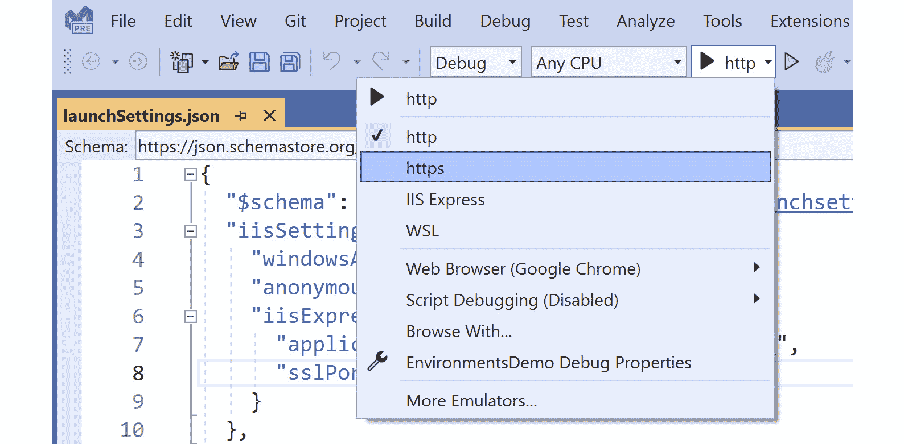
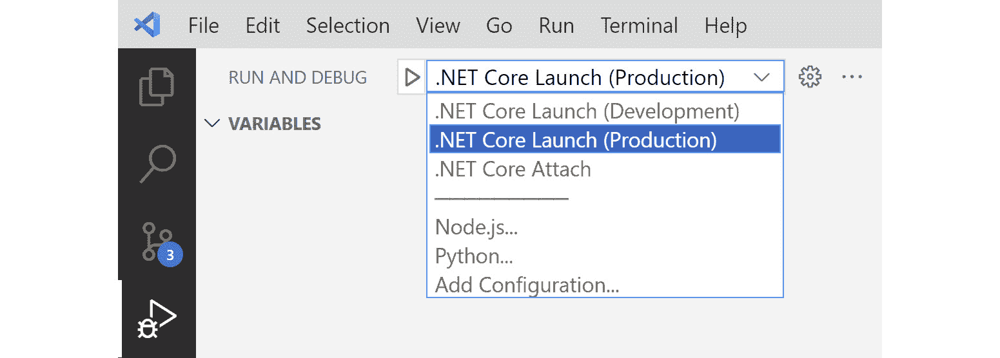
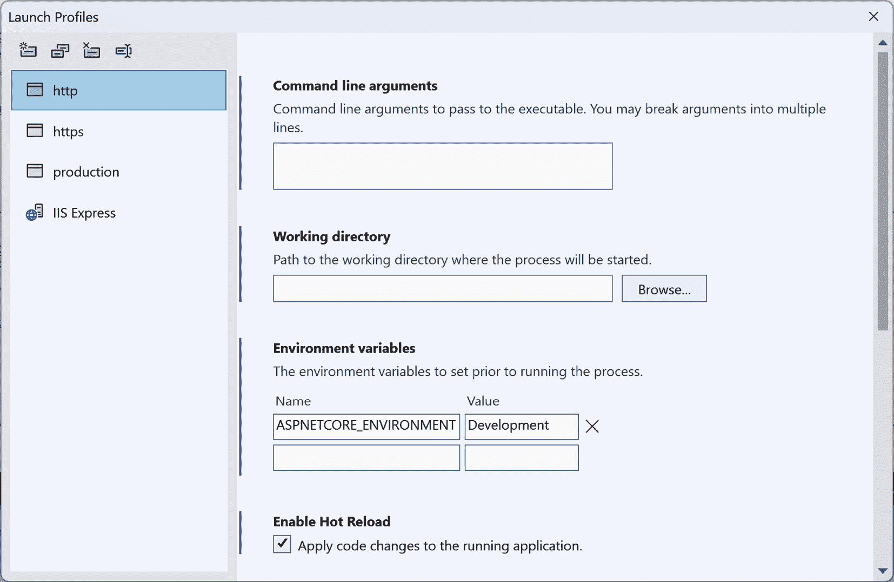

# 3

# ASP.NET Core 基础知识（第一部分）

在上一章中，我们学习了如何使用 ASP.NET Core 创建基本的 REST API。ASP.NET Core 提供了许多功能，使得构建 Web API 变得容易。

在本章中，我们将涵盖以下主题：

+   路由

+   配置

+   环境

**路由**用于将传入的请求映射到相应的控制器操作。我们将讨论如何使用属性路由来配置 ASP.NET Core Web API 的路由。**配置**用于在应用程序启动时提供初始设置，例如数据库连接字符串、API 密钥和其他设置。配置通常与**环境**一起使用，例如开发、测试和发布。在本章结束时，你将具备创建 ASP.NET Core Web API 的 RESTful 路由以及利用 ASP.NET Core 配置框架管理不同环境配置的技能。

# 技术要求

本章中的代码示例可以在[`github.com/PacktPublishing/Web-API-Development-with-ASP.NET-Core-8`](https://github.com/PacktPublishing/Web-API-Development-with-ASP.NET-Core-8)找到。

你可以使用 Visual Studio 2022 或**VS Code**打开解决方案。

# 路由

在*第二章**中，我们介绍了如何使用默认的基于控制器的模板创建一个简单的 ASP.NET Core Web API 项目。该项目使用一些属性，如 `[Route("api/controller")]`、`[HttpGet]` 等，将传入的请求映射到相应的控制器操作。这些属性用于配置 ASP.NET Core Web API 项目的路由。

路由是一种监控传入请求并确定对这些请求应调用哪个操作方法的机制。ASP.NET Core 提供两种类型的路由：传统路由和属性路由。传统路由通常用于 ASP.NET Core MVC 应用程序，而 ASP.NET Core Web API 使用属性路由。在本节中，我们将更详细地讨论属性路由。

你可以从章节的 GitHub 仓库中的`/samples/chapter3/RoutingDemo/`下载`RoutingDemo`示例项目。

## 属性路由是什么？

打开`RoutingDemo`项目中的`Program.cs`文件。你会找到以下代码：

```cs
app.MapControllers();
```

这行代码将控制器操作的端点添加到`IEndpointRouteBuilder`实例中，而不指定任何路由。要指定路由，我们需要在控制器类和操作方法上使用`[Route]`属性。以下代码展示了如何在`WeatherForecastController`类上使用`[Route]`属性：

```cs
[ApiController][Route("[controller]")]
public class WeatherForecastController : ControllerBase
{
  // Omitted for brevity
}
```

在前面的代码中，`[controller]`标记是一个用于控制器名称的占位符。在这种情况下，控制器名称是`WeatherForecast`，因此`[controller]`路由模板被替换为`WeatherForecast`。这意味着`WeatherForecastController`类的路由是`/WeatherForecast`。

ASP.NET Core 有一些内置的路由标记，例如 `[controller]`、`[action]`、`[area]`、`[page]` 等。这些标记用方括号 `[]` 包围，并将被替换为相应的值。请注意，这些标记是保留的路由参数名称，不应像 `{controller}` 一样用作路由参数。

在 ASP.NET Core REST Web API 中，我们通常使用 `[Route("api/[controller]")]` 模板来表示 API 端点。您可以在 `Controllers` 文件夹中找到 `PostsController` 类。以下代码显示了 `PostsController` 类的路由属性：

```cs
[ApiController] [Route("api/[controller]")]
 public class PostsController : ControllerBase
 {
   // Omitted for brevity
 }
```

`PostsController` 类的路由是 `/api/Posts`。这表明端点是 REST API 端点。是否使用 `/api` 作为路由前缀由您决定。对此没有标准。

一些开发者更喜欢使用小写字母作为路由模板，例如 `/api/posts`。为了实现这一点，可以显式指定路由值；例如，`[Route("api/posts")]`。然而，为每个控制器类指定路由值似乎有些繁琐。幸运的是，ASP.NET Core 提供了一种全局配置路由值的方法。将以下代码添加到 `Program.cs` 文件中：

```cs
builder.Services.AddRouting(options => options.LowercaseUrls = true);
```

上一段代码将所有路由模板转换为小写。实际上，ASP.NET Core 路由中的文本匹配是不区分大小写的。因此，此更改仅影响生成的路径 URL，例如 Swagger UI 中的 URL 和 `/api/Posts` 或 `/api/posts` 以访问相同的控制器路由。

可以将多个路由应用于一个控制器类。以下代码显示了如何将多个路由应用于 `PostsController` 类：

```cs
[ApiController] [Route("api/[controller]")]
 [Route("api/some-posts-whatever")]
 public class PostsController : ControllerBase
 {
   // Omitted for brevity
 }
```

在这种情况下，`PostsController` 类有两个路由：`/api/posts` 和 `/api/some-posts-whatever`。不建议为同一控制器类使用多个路由，因为这可能会导致混淆。如果您需要为同一控制器类使用多个路由，请确保您有充分的理由这样做。

在 ASP.NET Core REST API 中，我们通常不使用 `[action]` 标记，因为操作名称不包括在路由模板中。同样，也不要为操作方法使用 `[Route]` 属性。相反，我们使用 HTTP 方法来区分操作方法。我们将在下一节中讨论这一点。

## 将 HTTP 方法映射到操作方法

REST API 以资源为中心。当我们设计 REST API 时，需要将 CRUD 操作映射到 HTTP 方法。在 ASP.NET Core 中，我们可以使用以下 HTTP 动词属性将 HTTP 方法映射到操作方法：

+   `[HttpGet]` 将 HTTP `GET` 方法映射到操作方法

+   `[HttpPost]` 将 HTTP `POST` 方法映射到操作方法

+   `[HttpPut]` 将 HTTP `PUT` 方法映射到操作方法

+   `[HttpDelete]` 将 HTTP `DELETE` 方法映射到操作方法

+   `[HttpPatch]` 将 HTTP `PATCH` 方法映射到操作方法

+   `[HttpHead]` 将 HTTP `HEAD` 方法映射到操作方法

以下代码展示了如何使用 `[HttpGet]` 属性将 HTTP `GET` 方法映射到 `GetPosts()` 动作方法：

```cs
[HttpGet] public async Task<ActionResult<List<Post>>> GetPosts()
 {
   // Omitted for brevity
 }
```

在 ASP.NET Core REST API 中，每个动作都必须有一个 HTTP 动词属性。如果您没有指定 HTTP 动词属性，框架无法确定应该调用哪个方法来处理传入的请求。在前面的代码中，对 `/api/posts` 端点的 `GET` 请求被映射到 `GetPosts()` 动作方法。

以下代码展示了如何使用 `[HttpGet]` 属性将 HTTP `GET` 方法映射到带有路由模板的 `GetPost()` 动作方法：

```cs
[HttpGet("{id}")] public async Task<ActionResult<Post>> GetPost(int id)
 {
   // Omitted for brevity
 }
```

前面的 `HttpGet` 属性有一个 `{id}` 路由模板，这是一个路由参数。路由参数被括号 `{}` 包围。路由参数用于捕获传入请求的值。例如，对 `/api/posts/1` 端点的 `GET` 请求被映射到 `GetPost(int id)` 动作方法，值 `1` 被由 `{id}` 路由参数捕获。

以下代码展示了如何使用 `[HttpPut]` 属性来发布一个帖子：

```cs
[HttpPut("{id}/publish")] public async Task<ActionResult> PublishPost(int id)
 {
   // Omitted for brevity
 }
```

前面的 `HttpPut` 属性有一个 `{id}/publish` 路由模板。`publish` 文本用于匹配传入请求中的 `publish` 文本。因此，对 `/api/posts/1/publish` 端点的 `PUT` 请求被映射到 `PublishPost(int id)` 动作方法，值 `1` 被由 `{id}` 路由参数捕获。

在定义路由模板时，请确保没有冲突。例如，我们想要添加一个新的动作方法来通过用户 ID 获取帖子。如果我们使用以下代码，它将不会工作：

```cs
[HttpGet("{userId}")] // api/posts/user/1 public async Task<ActionResult<List<Post>>> GetPostsByUserId(int userId)
```

这是因为我们已经有了一个使用 `[HttpGet("{id}")]` 的 `GetPost()` 动作方法。当向 `/api/posts/1` 端点发送 `GET` 请求时，请求匹配多个动作，因此您将看到一个如下所示的 `500` 错误：

```cs
Microsoft.AspNetCore.Routing.Matching.AmbiguousMatchException: The request matched multiple endpoints. Matches:RoutingDemo.Controllers.PostsController.GetPost (RoutingDemo)
 RoutingDemo.Controllers.PostsController.GetPostsByUserId (RoutingDemo)
```

要修复它，我们需要指定一个不同的模板，例如 `[HttpGet("user/{userId}")]`。

## 路由约束

在前面的章节中，我们介绍了如何使用路由参数来捕获传入请求的值。一个 `[HttpGet("{id}")]` 属性可以匹配对 `/api/posts/1` 端点的 `GET` 请求。但如果请求是对 `/api/posts/abc` 端点的 `GET` 请求呢？

由于 `id` 参数的类型是 `int`，框架将尝试将捕获的值转换为 `int` 值。如果转换失败，框架将返回一个 `400 Bad Request` 响应。因此，对 `/api/posts/abc` 端点的 `GET` 请求将失败并返回一个 `400 Bad Request` 响应。

我们可以向路由参数添加路由约束来限制路由参数的值。例如，我们可以向 `id` 参数添加一个路由约束以确保 `id` 参数是一个整数。以下代码展示了如何向 `id` 参数添加路由约束：

```cs
[HttpGet("{id:int}")] public async Task<ActionResult<Post>> GetPost(int id)
 {
   // Omitted for brevity
 }
```

现在，`id` 参数必须是一个整数。对 `/api/posts/abc` 端点的 `GET` 请求将返回一个 `404 Not Found` 响应，因为路由不匹配。

ASP.NET Core 提供了一套内置的路由约束，例如以下内容：

+   `int`：参数必须是一个整数值。

+   `bool`：参数必须是一个布尔值。

+   `datetime`：参数必须是一个 DateTime 值。

+   `decimal`：参数必须是一个`decimal`值。同样，还有`double`、`float`、`long`等。

+   `guid`：参数必须是一个 GUID 值。

+   `minlength(value)`：参数必须是一个具有最小长度的字符串；例如，`{name:minlength(6)}`，这意味着`name`参数必须是一个字符串，且字符串的长度必须至少为 6 个字符。同样，还有`maxlength(value)`、`length(value)`、`length(min, max)`等。

+   `min(value)`：参数必须是一个具有最小值的整数；例如，`{id:min(1)}`，这意味着`id`参数必须是一个整数，且其值必须大于或等于 1。同样，还有`max(value)`、`range(min, max)`等。

+   `alpha`：参数必须是一个包含一个或多个字母的字符串。

+   `regex(expression)`：参数必须是一个与正则表达式匹配的字符串。

+   `required`：参数必须在路由中提供；例如，`{id:required}`，这意味着`id`参数必须在路由中提供。

如果路由参数的值不符合路由约束，则操作方法将不接受请求，并返回一个`404 Not Found`响应。

可以同时应用多个路由约束。以下代码展示了如何将多个路由约束应用于`id`参数，这意味着`id`参数必须是一个整数，且其值必须大于或等于 1 且小于或等于 100：

```cs
[HttpGet("{id:int:range(1, 100)}")] public async Task<ActionResult<Post>> GetPost(int id)
 {
   // Omitted for brevity
 }
```

路由约束可以用来使路由更加具体。然而，它们不应该用来验证输入。如果输入无效，API 应该返回一个`400 Bad Request`响应，而不是`404 Not Found`响应。

## 绑定源属性

我们可以在操作中定义参数。请参见以下操作方法：

```cs
[HttpGet("{id}")] public async Task<ActionResult<Post>> GetPost(int id)
```

`GetPost()`方法有一个名为`id`的参数，它与`{id}`路由模板中的参数相匹配。因此，`id`的值将来自路由，例如在`/api/posts/1` URL 中的 1。这被称为参数推断。

ASP.NET Core 提供了以下绑定源属性：

+   `[FromBody]`：参数来自请求体

+   `[FromForm]`：参数来自请求体中的表单数据

+   `[FromHeader]`：参数来自请求头

+   `[FromQuery]`：参数来自请求中的查询字符串

+   `[FromRoute]`：参数来自路由路径

+   `[FromServices]`：参数来自**DI**容器

例如，我们可以定义一个分页操作方法如下：

```cs
[HttpGet("paged")] public async Task<ActionResult<List<Post>>> GetPosts([FromQuery] int pageIndex, [FromQuery] int pageSize)
 {
     // Omitted for brevity
 }
```

上述代码意味着`pageIndex`参数和`pageSize`参数应来自 URL 中的查询字符串，例如`/api/posts/paged?pageIndex=1&pageSize=10`。

当 `[ApiController]` 属性应用于控制器类时，将应用一组默认推断规则，因此我们不需要显式添加这些绑定源属性。例如，以下代码显示了一个 `POST` 动作方法：

```cs
[HttpPost] public async Task<ActionResult<Post>> CreatePost(Post post)
 {
     // Omitted for brevity
 }
The post parameter is a complex type, so [FromBody] inferred that the post should be from the request body. But [FromBody] is not inferred for simple data types, such as int, string, and so on. We will define an action method as follows:
[HttpPost("search")]
 public async Task<ActionResult<Post>> SearchPosts(string keyword)
```

`keyword` 参数是简单类型，所以 `[FromQuery]` 推断 `keyword` 参数应该来自 URL 中的查询字符串，例如 `/api/posts/search?keyword=xyz`。如果我们想强制 `keyword` 参数来自请求体，我们可以使用以下 `[FromBody]` 属性：

```cs
[HttpPost("search")] public async Task<ActionResult<Post>> SearchPosts([FromBody] string keyword)
```

然后，`keyword` 参数必须来自请求体。请注意，这是一个不好的例子，因为我们通常不会使用请求体来传递简单类型参数。

这些绑定源属性的默认推断规则如下：

+   对于复杂类型参数，如果类型已在 DI 容器中注册，则 `[FromServices]` 是推断的。

+   对于未在 DI 容器中注册的复杂类型参数， `[FromBody]` 是推断的。它不支持多个 `[FromBody]` 参数。

+   对于 `IFormFile` 和 `IFormFileCollection` 等类型， `[FromForm]` 是推断的。

+   对于出现在路由中的任何参数， `[FromRoute]` 是推断的。

+   对于任何简单类型的参数，例如 `int`、`string` 等， `[FromQuery]` 是推断的。

如果可以根据这些规则推断参数，则可以省略绑定源属性。否则，我们需要显式指定绑定源属性。

路由是 REST API 中一个非常重要的概念。确保路由设计良好、直观且易于理解。这将有助于您的 REST API 的消费者轻松使用它们。

接下来，我们将检查 ASP.NET Core 中的配置。

# 配置

ASP.NET Core 提供了一个全面的配置框架，使得与配置设置一起工作变得容易。配置被视为键值对。这些配置设置存储在多种来源中，例如 JSON 文件、环境变量、命令行参数，或者在云中，例如 Azure Key Vault。在 ASP.NET Core 中，这些来源被称为 **配置提供者**。每个配置提供者负责从特定来源加载配置设置。

ASP.NET Core 支持一组配置提供者，例如以下：

+   文件配置提供者，例如，`appsettings.json`

+   用户密钥

+   环境变量配置提供者

+   命令行配置提供者

+   Azure 应用配置提供者

+   Azure 密钥保管库配置提供者

ASP.NET Core 的配置由 `Microsoft.Extension.Configuration` NuGet 包提供。您不需要显式安装此包，因为它已经包含在默认的 ASP.NET Core 模板中，该模板提供了几个内置配置提供程序，例如 `appsettings.json`。这些配置提供程序按优先级顺序配置。我们将在 *理解配置和环境的优先级* 部分中详细讨论这一点。首先，让我们看看如何使用 `appsettings.json`。

运行以下命令以创建一个新的 ASP.NET Core Web API 项目：

```cs
dotnet new webapi -n ConfigurationDemo -controllers
```

您可以从章节的 GitHub 仓库中的 `/samples/chapter3/ConfigurationDemo` 文件夹下载名为 `ConfigurationDemo` 的示例项目。

## 使用 appsettings.json

默认情况下，ASP.NET Core 应用程序配置为使用 `JsonConfigurationProvider` 从 `appsettings.json` 读取配置设置。`appsettings.json` 文件位于项目的根目录中，它是一个包含键值对的 JSON 文件。以下代码显示了 `appsettings.json` 文件的默认内容：

```cs
{  "Logging": {
    "LogLevel": {
      "Default": "Information",
      "Microsoft.AspNetCore": "Warning"
    }
  },
  "AllowedHosts": "*"
}
```

您将找到另一个 `appsettings.Development.json` 文件，它将用于开发环境。我们将在下一节介绍环境。

让我们在 `appsettings.json` 文件中添加一个 `"MyKey": "MyValue"` 键值对。这个键值对是我们将在代码中使用 `JsonConfigurationProvider` 读取的示例配置：

```cs
{  "Logging": {
    "LogLevel": {
      "Default": "Information",
      "Microsoft.AspNetCore": "Warning"
    }
  },
  "AllowedHosts": "*",
  "MyKey": "MyValue"
}
```

在 `Controllers` 文件夹中创建一个名为 `ConfigurationController` 的新控制器。在这个控制器中，我们将从 `appsettings.json` 文件中读取配置值并将其作为字符串返回。以下代码显示了 `ConfigurationController` 类：

```cs
using Microsoft.AspNetCore.Mvc;namespace ConfigurationDemo.Controllers;
[ApiController]
[Route("[controller]")]
public class ConfigurationController(IConfiguration configuration) : ControllerBase
{
    [HttpGet]
    [Route("my-key")]
    public ActionResult GetMyKey()
    {
        var myKey = configuration["MyKey"];
        return Ok(myKey);
    }
}
```

要访问配置设置，我们需要将 `IConfiguration` 接口注入到控制器的构造函数中。`IConfiguration` 接口表示一组键值应用配置属性。以下代码显示了如何访问配置设置：

```cs
var myKey = configuration["MyKey"];
```

运行应用程序并向 `/Configuration/my-key` 端点发送请求。您可以使用任何 HTTP 客户端，例如 Postman、VS Code 中的 Thunder Client 或 HttpRepl。以下代码显示了如何使用 HttpRepl：

```cs
httprepl http://localhost:5116cd Configuration
get my-key
```

您将看到以下响应：

```cs
HTTP/1.1 200 OKContent-Type: text/plain; charset=utf-8
Date: Fri, 23 Sep 2022 11:22:40 GMT
Server: Kestrel
Transfer-Encoding: chunked
MyValue
```

配置支持分层设置。例如，考虑以下配置设置：

```cs
{  "Database": {
    "Type": "SQL Server",
    "ConnectionString": "This is the database connection string"
  }
}
```

要访问 `Type` 和 `ConnectionString` 属性，我们可以使用以下代码：

```cs
[HttpGet][Route("database-configuration")]
public ActionResult GetDatabaseConfiguration()
{
    var type = configuration["Database:Type"];
    var connectionString = configuration["Database:ConnectionString"];
    return Ok(new { Type = type, ConnectionString = connectionString });
}
```

注意，我们使用冒号 (`:`) 来分隔分层设置。

运行应用程序并向 `/Configuration/database-configuration` 端点发送请求。如果您使用 HttpRepl，可以使用以下命令：

```cs
httprepl http://localhost:5116cd Configuration
get database-configuration
```

以下代码显示了 HttpRepl 的响应：

```cs
HTTP/1.1 200 OKContent-Type: application/json; charset=utf-8
Date: Fri, 23 Sep 2022 11:35:55 GMT
Server: Kestrel
Transfer-Encoding: chunked
{
  "type": "SQL Server",
  "connectionString": "This is the database connection string"
}
```

使用 `IConfiguration` 接口，我们可以使用 `configuration[key]` 格式访问配置设置。然而，硬编码键不是一种好的做法。为了避免硬编码，ASP.NET Core 支持选项模式，它可以提供一种强类型的方式来访问分层设置。

## 使用选项模式

要使用选项模式，我们需要创建一个表示配置设置的类。以下代码显示了如何创建一个名为 `DatabaseOption` 的类：

```cs
namespace ConfigurationDemo;public class DatabaseOption
{
    public const string SectionName = "Database";
    public string Type { get; set; } = string.Empty;
    public string ConnectionString { get; set; } = string.Empty;
}
```

`SectionName` 字段用于指定 `appsettings.json` 文件中的部分名称。此字段不是必需的。但如果我们没有在这里定义它，当我们绑定配置部分时，我们需要传递一个硬编码的字符串作为部分名称。为了更好地利用强类型，我们可以定义一个 `SectionName` 字段。`Type` 和 `ConnectionString` 属性用于表示 `appsettings.json` 文件中的 `Type` 和 `ConnectionString` 字段。

注意，选项类必须是非抽象的，并且具有公共的无参构造函数。

有多种方式可以使用选项模式。让我们继续。

### 使用 ConfigurationBinder.Bind() 方法

首先，让我们使用 `ConfigurationBinder.Bind()` 方法，该方法尝试通过递归匹配属性名称与配置键来将给定的对象实例绑定到配置值。

在 `ConfigurationController` 类中添加以下代码：

```cs
[HttpGet][Route("database-configuration-with-bind")]
public ActionResult GetDatabaseConfigurationWithBind()
{
    var databaseOption = new DatabaseOption();
    // The `SectionName` is defined in the `DatabaseOption` class, which shows the section name in the `appsettings.json` file.
    configuration.GetSection(DatabaseOption.SectionName).Bind(databaseOption);
    // You can also use the code below to achieve the same result
    // configuration.Bind(DatabaseOption.SectionName, databaseOption);
    return Ok(new { databaseOption.Type, databaseOption.ConnectionString });
}
```

运行应用程序并向 `/Configuration/database-configuration-with-bind` 端点发送请求。您将看到与上一节中相同的响应，*使用 appsettings.json*。这样，我们可以使用强类型选项类来访问配置设置，例如 `databaseOption.Type`。

### 使用 ConfigurationBinder.Get<TOption>() 方法

我们还可以使用 `ConfigurationBinder.Get<TOption>()` 方法，该方法尝试将配置实例绑定到类型 `T` 的新实例。如果此配置部分有值，则使用该值；否则，它尝试通过递归匹配属性名称与配置键来绑定配置实例。以下代码显示了如何实现：

```cs
[HttpGet][Route("database-configuration-with-generic-type")]
public ActionResult GetDatabaseConfigurationWithGenericType()
{
    var databaseOption = configuration.GetSection(DatabaseOption.SectionName).Get<DatabaseOption>();
    return Ok(new { databaseOption.Type, databaseOption.ConnectionString });
}
```

运行应用程序并向 `/Configuration/database-configuration-with-generic-type` 端点发送请求。您将看到与 *使用* *appsettings.json* 部分相同的响应。

### 使用 IOptions<TOption> 接口

ASP.NET Core 为选项模式提供了内置的依赖注入支持。要使用依赖注入，我们需要在 `Program.cs` 文件的 `Services.Configure()` 方法中注册 `DatabaseOption` 类。以下代码显示了如何注册 `DatabaseOption` 类：

```cs
// Register the DatabaseOption class as a configuration object.// This line must be added before the `builder.Build()` method.
builder.Services.Configure<DatabaseOption>(builder.Configuration.GetSection(DatabaseOption.SectionName));
var app = builder.Build();
```

接下来，我们可以使用依赖注入将 `IOptions<DatabaseOption>` 接口注入到 `ConfigurationController` 类中。以下代码显示了如何注入 `IOptions<DatabaseOption>` 接口：

```cs
[HttpGet][Route("database-configuration-with-ioptions")]
public ActionResult GetDatabaseConfigurationWithIOptions([FromServices] IOptions<DatabaseOption> options)
{
    var databaseOption = options.Value;
    return Ok(new { databaseOption.Type, databaseOption.ConnectionString });
}
```

运行应用程序并向 `/Configuration/database-configuration-with-ioptions` 端点发送请求。你会看到与 *使用* *appsettings.json* 部分相同的响应。

### 使用其他选项接口

我们介绍了几种使用选项模式的方法。它们有什么区别？

运行应用程序并测试前面的端点。你会看到所有响应都是相同的，其中包含一个值为 `SQL Server` 的 `Type` 属性。

保持应用程序运行。让我们更改 `appsettings.json` 文件。将 `Type` 属性从 `SQL Server` 更改为 `MySQL`。保存文件并再次向这些端点发送请求。你会发现以下结果：

+   `database-configuration` 返回新的值 `MySQL`

+   `database-configuration-with-bind` 返回新的值 `MySQL`

+   `database-configuration-with-generic-type` 返回新的值 `MySQL`

+   `database-configuration-with-ioptions` 返回旧的值 `SQL Server`

让我们尝试使用 `IOptionsSnapshot<T>` 接口替换 `IOptions<TOption>` 接口。`IOptionsSnapshot<TOption>` 接口提供了当前请求的选项快照。以下代码显示了如何使用 `IOptionsSnapshot<TOption>` 接口：

```cs
[HttpGet][Route("database-configuration-with-ioptions-snapshot")]
public ActionResult GetDatabaseConfigurationWithIOptionsSnapshot([FromServices] IOptionsSnapshot<DatabaseOption> options)
{
    var databaseOption = options.Value;
    return Ok(new { databaseOption.Type, databaseOption.ConnectionString });
}
```

再次运行应用程序。更改 `appsettings.json` 文件中的 `Type` 属性。向 `/Configuration/database-configuration-with-ioptions-snapshot` 端点发送请求。你会发现响应是新的值。

好的，我们现在知道了 `IOptions<TOption>` 接口和 `IOptionsSnapshot<TOption>` 接口之间的区别：

+   `IOptions<TOption>` 接口提供了一种访问选项的方式，但如果在应用程序运行时设置值已更改，则它无法获取最新值。

+   `IOptionsSnapshot<TOption>` 接口提供了当前请求的选项快照。当我们需要获取当前请求的最新选项时，`IOptionsSnapshot<TOption>` 接口非常有用。

但为什么呢？

ASP.NET Core 框架使用 `JsonConfigurationProvider` 内置支持 `appsetting.json`，它从 `appsettings.json` 文件中读取配置值。当框架注册 `JsonConfigurationProvider` 时，代码看起来像这样：

```cs
config.AddJsonFile("appsettings.json", optional: true, reloadOnChange: true)  .AddJsonFile($"appsettings.{env.EnvironmentName}.json", optional: true, reloadOnChange: true);
```

`reloadOnChange` 参数设置为 `true`，这意味着如果 `appsettings.json` 文件已更改，则配置值将被重新加载。因此，`ConfigurationBinder.Bind()` 方法和 `ConfigurationBinder.Get<TOption>()` 方法可以获取最新值。

然而，当 ASP.NET Core 框架注册 `IOptions<TOption>` 接口时，它被注册为一个 *单例* 服务，这意味着 `IOption<TOption>` 的实例只会创建一次。你可以将其注入到任何服务生命周期中，但如果设置值已更改，则它无法读取最新值。

相比之下，`IOptionsSnapshot<TOption>`接口注册为*作用域*服务，因此不能注入到单例服务中。如果您想为每个请求获取最新的选项，它很有用。

看起来`IOptionsSnapshot<TOption>`比`IOptions<TOption>`更好。实际上并不是。`IOptionsSnapshot<TOption>`只能缓存当前请求的选项。因为它会根据请求重新计算，所以可能会引起性能问题。因此，您需要明智地选择要使用的接口。如果选项没有变化，您可以使用`IOptions<TOption>`接口。如果选项经常变化，并且您想确保应用程序在每个请求中都能获取到最新的值，您可以使用`IOptionsSnapshot<TOption>`接口。

另一个选项接口叫做`IOptionsMonitor<TOption>`。它是`IOptions<TOption>`和`IOptionsSnapshot<TOption>`接口的组合。它提供了以下功能：

+   它是一个单例服务，可以被注入到任何服务生命周期

+   它支持可重载的配置

下面是使用`IOptionsMonitor<TOption>`接口的一个示例：

```cs
[HttpGet][Route("database-configuration-with-ioptions-monitor")]
public ActionResult GetDatabaseConfigurationWithIOptionsMonitor([FromServices] IOptionsMonitor<DatabaseOption> options)
{
    var databaseOption = options.CurrentValue;
    return Ok(new { databaseOption.Type, databaseOption.ConnectionString });
}
```

`IOptionsMonitor<TOption>`接口提供了`CurrentValue`属性来获取最新值。它还提供了`OnChange(Action<TOption, string> listener)`方法来注册一个监听器，该监听器将在选项重新加载时被调用。通常，除非您想在选项重新加载时执行某些操作，否则您不需要使用`OnChange()`方法。

### 使用命名选项

有时，我们需要在应用程序中使用多个数据库实例。考虑以下场景：

```cs
{  "Databases": {
    "System": {
      "Type": "SQL Server",
      "ConnectionString": "This is the database connection string for the system database."
    },
    "Business": {
      "Type": "MySQL",
      "ConnectionString": "This is the database connection string for the business database."
    }
  }
}
```

而不是创建两个类来表示两个数据库选项，我们可以使用命名选项功能。以下代码展示了如何为每个部分使用命名选项功能：

```cs
public class DatabaseOptions{
    public const string SystemDatabaseSectionName = "System";
    public const string BusinessDatabaseSectionName = "Business";
    public string Type { get; set; } = string.Empty;
    public string ConnectionString { get; set; } = string.Empty;
}
```

然后，在`Program.cs`文件中注册命名选项功能：

```cs
builder.Services.Configure<DatabaseOptions>(DatabaseOptions.SystemDatabaseSectionName, builder.Configuration.GetSection($"{DatabaseOptions.SectionName}:{DatabaseOptions.SystemDatabaseSectionName}"));builder.Services.Configure<DatabaseOptions>(DatabaseOptions.BusinessDatabaseSectionName, builder.Configuration.GetSection($"{DatabaseOptions.SectionName}:{DatabaseOptions.BusinessDatabaseSectionName}"));
```

以下代码展示了如何访问命名选项：

```cs
[HttpGet][Route("database-configuration-with-named-options")]
public ActionResult GetDatabaseConfigurationWithNamedOptions([FromServices] IOptionsSnapshot<DatabaseOptions> options)
{
    var systemDatabaseOption = options.Get(DatabaseOptions.SystemDatabaseSectionName);
    var businessDatabaseOption = options.Get(DatabaseOptions.BusinessDatabaseSectionName);
    return Ok(new { SystemDatabaseOption = systemDatabaseOption, BusinessDatabaseOption = businessDatabaseOption });
}
```

运行应用程序并向`/Configuration/database-configuration-with-named-options`端点发送请求。您会发现响应包含两个数据库选项，如下所示：

```cs
{  "systemDatabaseOption": {
    "type": "SQL Server",
    "connectionString": "This is the database connection string for the system database."
  },
  "businessDatabaseOption": {
    "type": "MySQL",
    "connectionString": "This is the database connection string for the business database."
  }
}
```

现在，让我们总结一下 ASP.NET Core 中的选项功能：

|  | **服务器生命周期** | **可重载** **配置** | **命名选项** |
| --- | --- | --- | --- |
| `IOptions<TOption>` | 单例 | 否 | 否 |
| `IOptionsSnapshot<TOption>` | 作用域 | 是 | 是 |
| `IOptionsMonitor<TOption>` | 单例 | 是 | 是 |

表 3.1 – `ASP.NET` Core 中选项功能的总结

接下来，我们将讨论如何注册一组选项以使`Program.cs`文件更简洁。

### 分组选项注册

在*第二章*中，我们介绍了如何在扩展方法中使用分组注册来注册多个服务。分组注册功能也适用于选项功能。以下代码展示了如何使用分组注册功能来注册多个选项：

```cs
using ConfigurationDemo;namespace DependencyInjectionDemo;
public static class OptionsCollectionExtensions
{
    public static IServiceCollection AddConfig(this IServiceCollection services, IConfiguration configuration)
    {
        services.Configure<DatabaseOption>(configuration.GetSection(DatabaseOption.SectionName));
        services.Configure<DatabaseOptions>(DatabaseOptions.SystemDatabaseSectionName, configuration.GetSection($"{DatabaseOptions.SectionName}:{DatabaseOptions.SystemDatabaseSectionName}"));
        services.Configure<DatabaseOptions>(DatabaseOptions.BusinessDatabaseSectionName, configuration.GetSection($"{DatabaseOptions.SectionName}:{DatabaseOptions.BusinessDatabaseSectionName}"));
        return services;
    }
}
```

然后，在 `Program.cs` 文件中注册选项：

```cs
builder.Services.AddConfig(builder.Configuration);
```

现在，`Program.cs` 文件变得更加简洁。

## 其他配置提供者

我们提到 ASP.NET Core 支持多个配置提供者。用于读取 `appsettings.json` 文件的配置提供者是 `JsonConfigurationProvider`，它继承自 `FileConfigurationProvider` 基类。还有一些其他 `FileConfigurationProvider` 基类的实现，例如 `IniConfigurationProvider`、`XmlConfigurationProvider` 等。

除了 `JsonConfigurationProvider`，ASP.NET Core 框架还会自动注册以下配置提供者：

+   一个 `Development` 环境

+   **非前缀环境变量配置提供者**用于读取没有前缀的环境变量

+   **命令行配置提供者**用于读取命令行参数

让我们更详细地了解这些配置提供者。

### 用户密钥配置提供者

将敏感信息存储在 `appsettings.json` 文件中不是一种好的做法。例如，如果数据库连接字符串存储在 `appsettings.json` 文件中，开发者可能会意外地将数据库连接字符串（或其他敏感信息、密钥等）提交到源代码控制系统，这将会引起安全问题。

相反，我们可以使用用户密钥功能将敏感信息存储在本地密钥文件中。用户密钥功能仅在 `Development` 环境中可用。默认情况下，ASP.NET Core 框架在 JSON 配置提供者之后注册用户密钥配置提供者。因此，用户密钥配置提供者的优先级高于 JSON 配置提供者，如果两个提供者中存在相同的配置键，它将覆盖 JSON 配置提供者。

要使用用户密钥，我们需要使用 Secret Manager 工具将密钥存储在本地密钥文件中。在项目文件夹中运行以下命令以初始化本地密钥文件：

```cs
dotnet user-secrets init
```

上述命令在 `.csproj` 文件中创建了一个 `UserSecretsId` 属性。默认情况下，`UserSecretsId` 属性的值是一个 GUID，例如以下内容：

```cs
<PropertyGroup>  <TargetFramework>net8.0</TargetFramework>
  <Nullable>enable</Nullable>
  <ImplicitUsings>enable</ImplicitUsings>
  <UserSecretsId>f3351c6a-2508-4243-8d80-89c27758164d</UserSecretsId>
</PropertyGroup>
```

然后，我们可以使用 Secret Manager 工具将密钥存储在本地密钥文件中。从项目文件夹中运行以下命令以存储密钥：

```cs
dotnet user-secrets set "Database:Type" "PostgreSQL"dotnet user-secrets set "Database:ConnectionString" "This is the database connection string from user secrets"
```

执行上述命令后，在 `%APPDATA%\Microsoft\UserSecrets\<UserSecretsId>` 文件夹中创建了一个 `secrets.json` 文件。该 `secrets.json` 文件包含以下内容：

```cs
{  "Database:Type": "PostgreSQL",
  "Database:ConnectionString": "This is the database connection string from user secrets"
}
```

注意 JSON 结构已被扁平化。

`secrets.json` 文件的位置

如果你使用 Linux 或 macOS，`secrets.json` 文件将创建在 `~/.microsoft/usersecrets/<UserSecretsId>` 文件夹中。

运行 `dotnet run` 来运行应用程序并向 `/Configuration/database-configuration` 端点发送请求。你会发现响应包含来自用户密钥的数据库选项，它覆盖了 `appsettings.json` 文件中的数据库选项，并包含 PostgreSQL 数据库类型。

本地密钥文件位于项目文件夹之外，并且未提交到源代码控制系统。请记住，Secret Manager 工具仅用于开发目的。开发者应负责保护本地密钥文件。

有一些命令用于操作本地密钥文件。你需要从项目文件夹中运行以下命令：

```cs
# List all the secretsdotnet user-secrets list
# Remove a secret
dotnet user-secrets remove "Database:Type"
# Clear all the secrets
dotnet user-secrets clear
```

重要提示

如果你下载本节的代码示例，密钥文件不会包含在存储库中。你需要运行 `dotnet user-secrets init` 命令来在你的本地机器上初始化密钥文件。

### 环境变量配置提供程序

.NET 和 ASP.NET Core 定义了一些可以用于配置应用程序的环境变量。这些特定的变量具有 `DOTNET_`、`DOTNETCORE_` 或 `ASPNETCORE_` 前缀。具有 `DOTNET_` 或 `DOTNETCORE_` 前缀的变量用于配置 .NET 运行时。具有 `ASPNETCORE_` 前缀的变量用于配置 ASP.NET Core。例如，`ASPNETCORE_ENVIRONMENT` 环境变量用于设置环境名称。我们将在 *环境* 部分讨论环境。

对于没有 `ASPNETCORE_` 前缀的环境变量，ASP.NET Core 也可以使用环境变量配置提供程序来读取它们。环境变量的优先级高于 `appsettings.json` 文件。例如，我们在 `appsettings.json` 文件中有以下配置：

```cs
{  "Database": {
    "Type": "SQL Server",
    "ConnectionString": "This is the database connection string."
  }
}
```

如果我们将 `Database__Type` 环境变量设置为 `MySQL`，`appsettings.json` 文件中的 `Database__Type` 值将被环境变量值覆盖。以下代码展示了如何在 PowerShell 中访问环境变量：

```cs
$Env:<variable-name>
```

为了表示环境变量的分层键，建议使用 `__`（双下划线）作为分隔符，因为它被所有平台支持。请勿使用 `:`，因为它不被 Bash 支持。

你可以使用以下命令在 PowerShell 中设置环境变量：

```cs
$Env:Database__Type="SQLite"
```

要检查环境变量是否设置正确，请运行以下命令：

```cs
$Env:Database__Type
```

重要提示

如果你使用 Bash，你需要使用以下命令来设置环境变量：

`export Database__Type="SQLite"`

更多信息，请参阅 [`linuxize.com/post/how-to-set-and-list-environment-variables-in-linux/`](https://linuxize.com/post/how-to-set-and-list-environment-variables-in-linux/)。

此外，请注意，与 Windows 不同，在 macOS 和 Linux 上环境变量名称是区分大小写的。

您将看到输出是 `SQLite`。现在，在同一个 PowerShell 会话中，您可以使用 `dotnet run` 来运行应用程序并向 `/Configuration/database-configuration` 端点发送请求。您会发现响应包含 `SQLite` 值，即使 `appsettings.json` 文件包含 `SQL Server` 值。这意味着环境变量值覆盖了 `appsettings.json` 文件值。

### 命令行配置提供程序

命令行参数的优先级高于环境变量。默认情况下，命令行上设置的配置设置会覆盖其他配置提供程序设置的值。

按照上一节的示例，`Database__Type` 值在 `appsettings.json` 文件中设置为 `SQL Server`。我们还设置了 `Database__Type` 环境变量为 `SQLite`。现在，让我们使用以下命令将命令行参数中的值更改为 `MySQL`：

```cs
dotnet run Database:Type=MySQL
```

向 `/Configuration/database-configuration` 端点发送请求。您会发现响应包含 `MySQL` 值，这意味着命令行参数值覆盖了环境变量值。

命令行参数还可以按以下方式设置：

```cs
dotnet run --Database:Type MySQLdotnet run /Database:Type MySQL
```

如果使用 `--` 或 `/` 作为键，则值可以跟在空格后面。否则，值必须跟在 `=` 符号后面。请勿在同一个命令中混合两种方式。

### Azure Key Vault 配置提供程序

Azure Key Vault 是一种基于云的服务，它为密码、证书和密钥等机密提供安全存储。Azure Key Vault 配置提供程序用于从 Azure Key Vault 读取机密。它是运行生产应用程序的好选择。

要使用它，您需要安装以下 NuGet 包：

+   `Azure.Extensions.AspNetCore.Configuration.Secrets`

+   `Azure.Identity`

Azure App Configuration 是一种基于云的服务，它为管理应用程序设置和功能标志提供了一个集中的配置存储库。App Configuration 补充了 Azure Key Vault。它的目标是简化处理复杂应用程序设置的任务。您需要安装以下 NuGet 包来使用 Azure App Configuration 提供程序：

+   `Microsoft.Azure.AppConfiguration.AspNetCore`

我们不会在本书中涵盖 Azure Key Vault 和 Azure App Configuration 提供程序的详细信息。有关更多信息，请参阅以下链接：

+   [`learn.microsoft.com/en-us/azure/key-vault/general/`](https://learn.microsoft.com/en-us/azure/key-vault/general/)

+   [`docs.microsoft.com/en-us/azure/azure-app-configuration/`](https://docs.microsoft.com/en-us/azure/azure-app-configuration/)

# 环境变量

在上一节中，我们介绍了如何从各种资源中读取配置设置，包括 `appsettings.json` 文件、用户机密、环境变量和命令行参数。在本节中，我们将更详细地讨论环境变量。

运行以下命令以创建一个新的 ASP.NET Core Web API 项目：

```cs
dotnet new webapi -n EnvironmentDemo -controllers
```

你可以从章节的 GitHub 仓库中`/samples/chapter3/EnvironmentsDemo`文件夹下载名为`EnvironmentDemo`的示例项目。

我们已经提到，默认的 ASP.NET Core Web API 模板包含一个`appsettings.json`文件和一个`appsettings.Development.json`文件。当我们使用`dotnet run`运行应用程序时，应用程序在`Development`环境中运行。因此，`appsettings.Development.json`文件中的配置设置会覆盖`appsettings.json`文件中的配置设置。

将以下部分添加到`appsettings.Development.json`文件中：

```cs
{  // Omitted for brevity
  "Database": {
    "Type": "SQL Server",
    "ConnectionString": "This is the database connection string from base appsettings.json."
  }
}
```

然后，将以下部分添加到`appsettings.Development.json`文件中：

```cs
{  // Omitted for brevity
  "Database": {
    "Type": "LocalDB",
    "ConnectionString": "This is the database connection string from appsettings.Development.json"
  }
}
```

重要提示

注意，用户密钥高于`appsettings.Development.json`文件。因此，如果你在上一节中配置了本地用户密钥，请清除密钥。

创建一个名为`ConfigurationController.cs`的新控制器，并添加以下代码：

```cs
using Microsoft.AspNetCore.Mvc;namespace EnvironmentsDemo.Controllers;
[ApiController]
[Route("[controller]")]
public class ConfigurationController(IConfiguration configuration) : ControllerBase
{
    private readonly IConfiguration _configuration;
    public ConfigurationController(IConfiguration configuration)
    {
        _configuration = configuration;
    }
    [HttpGet]
    [Route("database-configuration")]
    public ActionResult GetDatabaseConfiguration()
    {
        var type = configuration["database:Type"];
        var connectionString = configuration["Database:ConnectionString"];
        return Ok(new { Type = type, ConnectionString = connectionString });
    }
}
```

使用`dotnet run`运行应用程序。向`/Configuration/database-configuration`端点发送请求。你会发现响应包含一个`LocalDB`值，这意味着`appsettings.Development.json`文件覆盖了`appsettings.json`文件。

那么，环境名称`Development`在哪里设置？

## 理解`launchSettings.json`文件

在`Properties`文件夹中打开`launchSettings.json`文件。你会找到`ASPNETCORE_ENVIRONMENT`环境变量设置为`Development`：

```cs
  "profiles": {    "http": {
      "commandName": "Project",
      "dotnetRunMessages": true,
      "launchBrowser": true,
      "launchUrl": "swagger",
      "applicationUrl": "http://localhost:5161",
      "environmentVariables": {
        "ASPNETCORE_ENVIRONMENT": "Development"
      }
    },
    "https": {
      "commandName": "Project",
      "dotnetRunMessages": true,
      "launchBrowser": true,
      "launchUrl": "swagger",
      "applicationUrl": "https://localhost:7096;http://localhost:5161",
      "environmentVariables": {
        "ASPNETCORE_ENVIRONMENT": "Development"
      }
    },
    "IIS Express": {
      "commandName": "IISExpress",
      "launchBrowser": true,
      "launchUrl": "swagger",
      "environmentVariables": {
        "ASPNETCORE_ENVIRONMENT": "Development"
      }
    }
  }
```

`launchSettings.json`文件用于配置本地开发环境。它不可部署。默认的`launchSettings.json`文件包含三个配置文件：`http`、`https`和`IIS Express`：

+   `http`配置文件用于使用 HTTP 协议运行应用程序

+   `https`配置文件用于使用 HTTPS 协议运行应用程序

+   `IIS Express`配置文件用于在 IIS Express 中运行应用程序

`http`和`https`配置文件中的`commandName`字段是`Project`，这意味着 Kestrel 服务器被启动以运行应用程序。同样，`IISExpress`在`IIS Express`配置文件中的值意味着应用程序期望 IIS Express 作为 Web 服务器。

什么是 Kestrel 服务器？

Kestrel 是一个跨平台的 ASP.NET Core Web 服务器。Kestrel 默认包含并启用在 ASP.NET Core 项目模板中。ASP.NET Core 也可以在 IIS（或 IIS Express）中托管，但 IIS 不是跨平台的。因此，Kestrel 是 ASP.NET Core 应用程序的首选 Web 服务器。

当运行`dotnet run`时，使用具有`commandName`值`Project`的第一个配置文件。对于演示项目，使用`http`配置文件。在`http`配置文件中，将`ASPNETCORE_ENVIRONMENT`环境变量设置为`Development`。因此，应用程序在`Development`环境中运行。你可以在控制台中看到输出：

```cs
Building...info: Microsoft.Hosting.Lifetime[14]
      Now listening on: http://localhost:5161
info: Microsoft.Hosting.Lifetime[0]
      Application started. Press Ctrl+C to shut down.
info: Microsoft.Hosting.Lifetime[0]
      Hosting environment: Development
info: Microsoft.Hosting.Lifetime[0]
      Content root path: C:\dev\web-api-with-asp-net\example_code\chapter3\EnvironmentsDemo
```

我们可以使用 `--launch-profile` 参数指定运行应用程序时要使用的配置文件：

```cs
dotnet run --launch-profile https
```

注意，此方法仅适用于 Kestrel 配置文件。你不能使用此参数在 IIS Express 中运行应用程序。

如果你使用 VS 2022 打开项目，你可以选择要使用的配置文件，如下所示：



图 3.1 – 在 Visual Studio 2022 中选择要使用的配置文件

接下来，让我们探索如何配置应用程序以在 `Production` 环境中运行。

## 设置环境

有几种方法可以更改环境。让我们创建一个名为 `appsettings.Production.json` 的新文件。此配置文件将用于 `Production` 环境。将以下部分添加到文件中：

```cs
{  // Omitted for brevity
  "Database": {
    "Type": "PostgreSQL",
    "ConnectionString": "This is the database connection string from appsettings.Production.json"
  }
}
```

接下来，我们将指定环境为 `Production` 以应用此配置。

### 使用 `launchSettings.json` 文件

对于开发目的，我们可以在 `launchSettings.json` 文件中创建一个新的配置文件，该文件指定 `ASPNETCORE_ENVIRONMENT` 变量为 `Production`。将以下部分添加到 `launchSettings.json` 文件中：

```cs
// Omitted for brevity  "profiles": {
    // Omitted for brevity
    "production": {
      "commandName": "Project",
      "dotnetRunMessages": true,
      "launchBrowser": true,
      "launchUrl": "swagger",
      "applicationUrl": "https://localhost:7096;http://localhost:5161",
      "environmentVariables": {
        "ASPNETCORE_ENVIRONMENT": "Production"
      }
    }
    // Omitted for brevity
  }
```

使用以下命令在 `Production` 环境中运行应用程序：

```cs
dotnet run --launch-profile production
```

你将在控制台中看到应用程序在 `Production` 环境中运行：

```cs
PS C:\dev\web-api-with-asp-net\example_code\chapter3\EnvironmentsDemo> dotnet run --launch-profile productionBuilding...
warn: Microsoft.AspNetCore.Server.Kestrel.Core.KestrelServer[8]
      The ASP.NET Core developer certificate is not trusted. For information about trusting the ASP.NET Core developer certificate, see https://aka.ms/aspnet/https-trust-dev-cert.
info: Microsoft.Hosting.Lifetime[14]
      Now listening on: https://localhost:7096
info: Microsoft.Hosting.Lifetime[14]
      Now listening on: http://localhost:5161
info: Microsoft.Hosting.Lifetime[0]
      Application started. Press Ctrl+C to shut down.
info: Microsoft.Hosting.Lifetime[0]
      Hosting environment: Production
info: Microsoft.Hosting.Lifetime[0]
      Content root path: C:\dev\web-api-with-asp-net\example_code\chapter3\EnvironmentsDemo
```

看起来不错。让我们尝试访问 `/Configuration/database-configuration` 端点。你会看到响应来自 `appsettings.Production.json` 文件。

### 使用 ASPNETCORE_ENVIRONMENT 环境变量

你也可以在当前会话中将 `ASPNETCORE_ENVIRONMENT` 环境变量设置为 `Production`，如下所示：

```cs
$Env:ASPNETCORE_ENVIRONMENT = "Production"dotnet run --no-launch-profile
```

此外，你可以在系统中全局设置环境变量。使用以下命令全局设置环境变量：

```cs
[Environment]::SetEnvironmentVariable("ASPNETCORE_ENVIRONMENT", "Production", "Machine")
```

`Machine` 参数设置全局环境变量。你也可以使用 `User` 参数为当前用户设置环境变量。

### 使用 --environment 参数

另一种方法是使用 `--environment` 参数设置环境：

```cs
dotnet run --environment Production
```

### 使用 VS Code 中的 `launch.json` 文件

如果你使用 VS Code 打开项目，你可以在 `.vscode` 文件夹中的 `launch.json` 文件中设置环境。当你打开一个 ASP.NET Core 项目时，VS Code 将提示你添加调试项目所需资源。将在 `.vscode` 文件夹中添加一个 `launch.json` 文件和一个 `tasks.json` 文件。如果你没有看到提示，你可以打开命令面板并运行 **.NET: Generate Assets for Build and Debug** 命令。

打开 `launch.json` 文件，你将看到以下内容：

```cs
{  // Omitted for brevity
  "configurations": [
    {
      "name": ".NET Core Launch (web)",
      "type": "coreclr",
      // Omitted for brevity
      "env": {
        "ASPNETCORE_ENVIRONMENT": "Development"
      },
      // Omitted for brevity
    }
  ]
}
```

你可以按照现有配置添加一个新的配置。将 `ASPNETCORE_ENVIRONMENT` 字段更改为 `Production` 并使用 `.NET Core Launch (Production)` 作为名称。保存文件。你现在可以通过在调试面板中点击绿色箭头来在 `Production` 环境中运行应用程序：



图 3.2 – 在 VS Code 中运行特定环境中的应用程序

重要提示

`launch.json`文件仅在 VS Code `dotnet` `run`命令中使用。

### 在 Visual Studio 2022 中使用 launchSettings.json 文件

Visual Studio 2022 提供了一个**启动配置文件**对话框来设置环境变量。你有多种方式打开**启动配置文件**对话框：

+   打开**调试**菜单 | *<您的项目名称>* **调试属性**。

+   点击调试面板中绿色箭头旁边的箭头，并选择 *<您的项目名称>* **调试属性**。

+   右键单击**解决方案资源管理器**窗口中的项目，并选择**属性**。在**调试/常规**选项卡中，单击**打开调试启动配置文件** **UI**链接。

然后，你可以看到**启动配置文件**对话框：



图 3.3 – Visual Studio 2022 中的启动配置文件对话框

如果您在此处进行更改，则需要重新启动应用程序以应用更改。

我们已经学习了如何设置环境。设置环境后，我们可以为不同的环境使用不同的配置。

## 理解配置和环境变量的优先级

我们介绍了多种读取配置值和环境变量的不同方法。让我们看看配置和环境变量的优先级是如何确定的。

以下表格显示了配置来源的优先级（数字越小，优先级越高）：

| **来源** | **优先级** |
| --- | --- |
| 命令行参数 | 1 |
| 无前缀的环境变量 | 2 |
| 用户密钥（仅限`Development`环境） | 3 |
| `appsettings.{Environment}.json` | 4 |
| `appsettings.json` | 5 |

表 3.2 – 配置来源的优先级

如果在`Program.cs`文件中注册了其他配置提供程序，则较晚注册的提供程序比较早注册的提供程序具有更高的优先级。

在`ASPNETCORE_ENVIRONMENT`等环境变量方面，以下表格显示了优先级：

| **来源** | **优先级** |
| --- | --- |
| 命令行参数 | 1 |
| `launchSettings.json`（仅限开发目的） | 2 |
| 当前进程中的环境变量 | 3 |
| 系统环境变量 | 4 |

表 3.3 – 环境变量的优先级

注意，还有一些其他配置环境的方法没有在前面的表中列出。例如，如果您将 ASP.NET Core 应用程序部署到 Azure App Service，您可以在 App Service 配置中设置`ASPNETCORE_ENVIRONMENT`环境变量。对于 Linux 应用程序和容器应用程序，Azure App Service 使用`--env`标志将这些设置传递到容器中，以在容器中设置环境变量。

## 检查代码中的环境

在 `生产` 环境中继续运行应用程序。让我们尝试访问 Swagger UI 页面：`http://localhost:5161/swagger`。您会发现它显示了一个 `404 Not Found` 错误。为什么？

这是因为 Swagger UI 页面仅在 `开发` 环境中启用。您可以在 `Program.cs` 文件中查看代码：

```cs
if (app.Environment.IsDevelopment()){
    app.UseSwagger();
    app.UseSwaggerUI();
}
```

上述代码表示 Swagger UI 页面仅对开发环境启用。

ASP.NET Core 框架中预定义了三个环境名称，`开发`、`预发布`和`生产`，如下所示：

```cs
public static class Environments{
    public static readonly string Development = "Development";
    public static readonly string Staging = "Staging";
    public static readonly string Production = "Production";
}
```

`app.Environment.IsDevelopment()` 方法检查当前环境。如果当前环境是 `开发`，则 Swagger UI 页面被启用。否则，它被禁用。

要在代码中设置环境，在创建 `WebApplicationBuilder` 时使用以下代码：

```cs
var builder = WebApplication.CreateBuilder(new WebApplicationOptions{
    EnvironmentName = Environments.Staging
});
```

环境名称存储在 `IHostEnvironment.EnvironmentName` 属性中。您可以定义自己的环境名称。例如，您可以定义一个名为 `测试` 的环境名称。但是，框架提供了内置方法，例如 `IsDevelopment()`、`IsStaging()` 和 `IsProduction()`，来检查环境。如果您定义了自己的环境名称，您可以使用 `IHostEnvironment.IsEnvironment(string environmentName)` 方法来检查环境。

我们可以使用 `System.Environment` 类在代码中获取环境变量，例如 `ASPNETCORE_ENVIRONMENT`。将以下代码添加到 `Program.cs` 文件中：

```cs
// Omitted for brevityvar app = builder.Build();
// Read the environment variable ASPNETCORE_ENVIRONMENT
var environmentName = Environment.GetEnvironmentVariable("ASPNETCORE_ENVIRONMENT");
Console.WriteLine($"ASPNETCORE_ENVIRONMENT is {environmentName}");
```

运行应用程序，您可以在控制台看到 `ASPNETCORE_ENVIRONMENT` 环境变量：

```cs
PS C:\dev\web-api-with-asp-net\example_code\chapter3\EnvironmentsDemo> dotnet runBuilding...
ASPNETCORE_ENVIRONMENT is Development
info: Microsoft.Hosting.Lifetime[14]
      Now listening on: http://localhost:5161
# Omitted for brevity
```

对于不同的环境，我们应该做什么？

对于开发环境，我们可以启用 Swagger UI 页面，显示详细错误信息，输出调试信息等。对于生产环境，我们应该配置应用程序以获得最佳性能和最高安全性。以下是为生产环境考虑的要点：

+   禁用 Swagger UI 页面。

+   禁用详细错误信息。

+   显示友好的错误信息。

+   不要输出调试信息。

+   启用缓存。

+   启用 HTTPS。

+   启用响应压缩。

+   启用监控和日志记录。

# 摘要

在本章中，我们探讨了 ASP.NET Core 的三个重要组件：路由、配置和环境。我们讨论了如何为 ASP.NET Core Web API 应用程序配置路由以及如何从请求中读取参数。此外，我们还学习了如何从各种来源读取配置值，例如 `appsettings.json`、环境变量和命令行参数。我们还探讨了如何根据环境读取配置，使我们能够为不同的环境启用不同的功能。

在下一章中，我们将学习 ASP.NET Core 的两个更多重要组件：日志记录和中间件。
