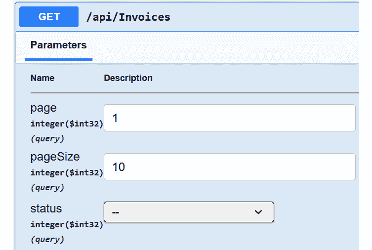

# ASP.NET Core 中的数据访问（第一部分：EF Core 基础）

在 *第二章* 中，我们介绍了一个简单的 ASP.NET Core 应用程序来管理博客文章，它使用静态字段在内存中存储数据。在许多实际应用中，数据持久化在数据库中——如 SQL Server、MySQL、SQLite、PostgreSQL 等——因此我们需要访问数据库以实现 CRUD 操作。

本章，我们将学习 ASP.NET Core 中的数据访问。在 ASP.NET Core 中访问数据库有多种方式，例如通过 ADO.NET、Entity Framework Core 和 Dapper 等。在本章中，我们将重点介绍 Entity Framework Core，它是 .NET Core 中最受欢迎的 **对象关系映射**（**ORM**）框架。

**Entity Framework Core**，简称 **EF Core**，是一个开源的 ORM 框架，它允许我们创建和管理数据库模式与对象模型之间的映射配置。它提供了一套使用 LINQ 方法执行 CRUD 操作的 API，就像在内存中操作对象一样。EF Core 支持许多数据库提供程序，如 SQL Server、SQLite、PostgreSQL、MySQL 等。它还支持许多其他功能，如迁移、变更跟踪等。

本章，我们将涵盖以下主题：

+   为什么使用 ORM？

+   配置 DbContext 类

+   实现 CRUD 控制器

+   基本 LINQ 查询

+   配置模型与数据库表之间的映射

到本章结束时，你将能够使用 EF Core 在 ASP.NET Core 应用程序中访问数据库并执行基本的 CRUD 操作。

# 技术要求

本章的代码示例可以在 [`github.com/PacktPublishing/Web-API-Development-with-ASP.NET-Core-8/tree/main/samples/chapter5/`](https://github.com/PacktPublishing/Web-API-Development-with-ASP.NET-Core-8/tree/main/samples/chapter5/) 找到。你可以使用 VS 2022 或 VS Code 打开解决方案。

预期你具备基本的 SQL 查询和 LINQ 知识。如果你不熟悉它们，可以参考以下资源：

+   SQL 查询：[`www.w3schools.com/sql/`](https://www.w3schools.com/sql/)

+   LINQ：[`learn.microsoft.com/en-us/dotnet/csharp/linq/`](https://learn.microsoft.com/en-us/dotnet/csharp/linq/)

# 为什么使用 ORM？

要操作关系型数据库中的数据，我们需要编写 SQL 语句。然而，SQL 语句不易维护且不安全类型。每次更新数据库模式时，都需要更新 SQL 语句，这容易出错。在许多传统应用中，逻辑与数据库紧密耦合。例如，逻辑可以直接在 SQL 数据库中定义，如存储过程、触发器等。这使得应用难以维护和扩展。

ORM 帮助我们将数据库架构映射到对象模型，这样我们就可以像操作内存中的对象一样操作数据库中的数据。ORM 可以将 CRUD 操作转换为 SQL 语句，这意味着它就像应用程序和数据库之间的一个抽象层。数据访问逻辑与数据库解耦，因此我们可以轻松地更改数据库而无需更改代码。此外，它提供了强类型安全，因此我们可以避免由类型不匹配引起的运行时错误。

请记住，我们并不是说 ORM 是所有场景下的最佳解决方案。有时，我们需要直接编写 SQL 语句以实现最佳性能。例如，如果我们需要生成一个复杂的数据报告，我们可能需要编写 SQL 语句来优化查询性能。然而，对于大多数场景，ORM 提供的好处比缺点更多。

.NET 中有许多 ORM 框架。在这本书中，我们将使用 EF Core，这是 .NET Core 中最受欢迎的 ORM 框架。以下是选择 EF Core 的原因：

+   **开源**: EF Core 是一个开源项目，主要由微软维护，因此它得到了良好的支持。贡献也非常活跃。

+   **多数据库支持**: EF Core 支持许多数据库提供程序，例如 SQL Server、SQLite、PostgreSQL、MySQL 等等。开发者可以使用相同的 API 访问不同的数据库。

+   **迁移**: EF Core 支持数据库迁移，这使得我们能够轻松地更新数据库架构。

+   **LINQ 支持**: EF Core 提供了对 LINQ 的支持，这使得我们可以使用熟悉的语法来查询数据库。

+   **代码优先方法**: EF Core 支持代码优先方法，这意味着我们可以使用 C# 代码定义数据库架构，EF Core 将自动生成数据库架构。

+   **性能**: EF Core 被设计成轻量级且性能良好。它支持查询缓存和延迟加载，有助于提高性能。此外，EF Core 提供了异步 API，允许我们异步执行数据库操作，从而提高应用程序的可伸缩性。此外，EF Core 支持原始 SQL 查询，使我们能够直接编写 SQL 语句以实现最佳性能。

总体而言，如果您使用 .NET Core，EF Core 对于大多数场景都是一个不错的选择。因此，在这本书中，我们将使用 EF Core 作为 ORM 框架。

要使用 .NET Core CLI 执行 EF Core 相关任务，我们首先需要安装 `dotnet-ef` 工具。您可以使用以下命令进行安装：

```cs
dotnet tool install --global dotnet-ef
```

建议将工具安装为全局工具，这样您就可以方便地在任何项目中使用它。

接下来，使用以下命令创建一个新的 Web API 项目：

```cs
dotnet new webapi -n BasicEfCoreDemo -controllers
```

然后，导航到项目文件夹并运行以下命令来安装 EF Core 包：

```cs
dotnet add package Microsoft.EntityFrameworkCore.SqlServerdotnet add package Microsoft.EntityFrameworkCore.Design
```

第一个包是数据库提供程序，用于将应用程序连接到 SQL Server 数据库。对于这个演示应用程序，我们将使用**LocalDB**，这是 SQL Server 的一个轻量级版本。第二个包包含 EF Core 工具的共享设计时组件，这些组件是执行数据库迁移所必需的。

什么是 LocalDB？

LocalDB 被设计成 SQL Server 完整版本的替代品；它适用于开发和测试，但不适用于生产使用。当我们部署应用程序到生产环境时，我们可以使用 LocalDB 进行开发并替换连接字符串。LocalDB 与 VS 2022 一起安装。如果您默认没有 VS 2022，您可以在[`learn.microsoft.com/en-us/sql/database-engine/configure-windows/sql-server-express-localdb`](https://learn.microsoft.com/en-us/sql/database-engine/configure-windows/sql-server-express-localdb)找到安装包。

LocalDB 仅由 Windows 支持。如果您使用 macOS 或 Linux，可以使用 SQLite 代替 LocalDB，或者使用 Docker 容器来运行 SQL Server。有关 SQLite 的更多信息，请参阅[`docs.microsoft.com/en-us/ef/core/providers/sqlite/`](https://docs.microsoft.com/en-us/ef/core/providers/sqlite/)。

有关 SQL Server 在 Docker 上的更多信息，请参阅[`learn.microsoft.com/en-us/sql/linux/quickstart-install-connect-docker`](https://learn.microsoft.com/en-us/sql/linux/quickstart-install-connect-docker)。请注意，还有许多其他数据库提供程序，例如 SQLite、PostgreSQL、MySQL 等。您可以在[`docs.microsoft.com/en-us/ef/core/providers/`](https://docs.microsoft.com/en-us/ef/core/providers/)找到数据库提供程序的完整列表。一些提供程序不是由 Microsoft 维护的。

接下来，让我们探索如何使用 EF Core 访问数据库。

# 配置 DbContext 类

为了表示数据库，EF Core 使用`DbContext`类，它允许我们查询和保存数据。`DbContext`类的一个实例维护数据库连接并将数据库模式映射到对象模型。它还跟踪对象的变化并管理事务。如果您熟悉面向对象编程，可以将`DbContext`类视为数据库和对象模型之间的桥梁，就像一个接口。当您查询或保存数据时，您通过`DbContext`类操作对象，EF Core 会将操作转换为相应的 SQL 语句。

在本章中，我们将开发一个简单的应用程序来管理发票。这个应用程序将用于演示如何使用 EF Core 访问数据库，包括如何定义数据库模式，如何执行 CRUD 操作，以及如何使用迁移来更新数据库模式。

您可以参考 *第一章* 来首先定义 API 合同。API 合同定义了端点和请求/响应模型。当我们定义 API 合同时，请注意我们需要咨询利益相关者以了解需求。例如，我们需要知道发票的字段、字段的数据类型等。我们还需要了解业务规则，例如 *发票号应该是唯一的*，*发票金额应该大于 0* 等。这意味着我们将在 API 设计阶段花费大量时间。在这里，我们假设我们已经定义了 API 合同，并且可以开始开发应用程序。

## 创建模型

第一步是定义模型。模型，也称为实体，是一个代表现实世界中对象的类，它将被映射到数据库中的表（或多个表）。在本演示应用程序中，我们需要定义 `Invoice` 模型。

发票可以定义为以下类：

```cs
namespace BasicEfCoreDemo.Models;public class Invoice{
    public Guid Id { get; set; }
    public string InvoiceNumber { get; set; } = string.Empty;
    public string ContactName { get; set; } = string.Empty;
    public string? Description { get; set; }
    public decimal Amount { get; set; }
    public DateTimeOffset InvoiceDate { get; set; }
    public DateTimeOffset DueDate { get; set; }
    public InvoiceStatus Status { get; set; }
}
```

`InvoiceStatus` 是一个自定义枚举类型，其定义如下所示：

```cs
public enum InvoiceStatus{
    Draft,
    AwaitPayment,
    Paid,
    Overdue,
    Cancelled
}
```

您可以在 `Models` 文件夹中创建一个名为 `Invoice.cs` 的文件，并将 `Invoice` 类代码复制到该文件中。

重要提示

我们使用 `Guid` 类型来表示 `Id` 属性，这是发票的唯一标识符。您也可以使用 `int` 或 `long` 作为标识符。两种方式都有其优缺点。例如，`int` 比使用 `Guid` 更高效，但它不是跨数据库唯一的。当数据库增长时，您可能需要将数据分割到多个数据库中，这意味着 `int` 标识符可能不再唯一。另一方面，`Guid` 无论您有多少个数据库都是唯一的，但与使用 `int` 或 `long` 相比，存储、插入、查询和排序记录的成本更高。在某些场景中，具有聚类索引的 `Guid` 主键可能会导致性能下降。在本演示应用程序中，我们目前使用 `Guid` 作为标识符。我们将在未来的章节中讨论更多关于优化应用程序性能的技术。

我们还使用 `DateTimeOffset` 类型来表示 `InvoiceDate` 和 `DueDate` 属性，这是 .NET Core 中日期和时间的推荐类型。如果您不关心时区，也可以使用 `DateTime` 类型。`DateTimeOffset` 包含从 UTC 时间的时间偏移量，它由 .NET 类型和 SQL Server 支持。如果您想避免时区问题，这将很有帮助。

未来我们可能需要更多的属性，例如联系信息、发票项目等，但我们稍后再添加。现在让我们只关注模型。

## 创建和配置 DbContext 类

接下来，我们将创建一个 `DbContext` 类来表示数据库。在 `Data` 文件夹中创建一个名为 `InvoiceDbContext.cs` 的文件，并添加以下代码：

```cs
using BasicEfCoreDemo.Models;using Microsoft.EntityFrameworkCore;
namespace BasicEfCoreDemo.Data;
public class InvoiceDbContext(DbContextOptions<InvoiceDbContext> options) : DbContext(options)
{
    public DbSet<Invoice> Invoices => Set<Invoice>();
}
```

在前面的代码中，我们做了以下操作：

+   继承了 `DbContext` 类并定义了 `InvoiceDbContext` 类，该类代表数据库。

+   定义了 `Invoices` 属性，它是一个 `DbSet<Invoice>` 类型。它用于表示数据库中的 `Invoices` 表。

重要提示

为什么这里不使用 `public DbSet<Invoice> Invoices { get; set; }`？原因是如果 `DbSet<T>` 属性未初始化，由于默认启用了可空引用类型功能，编译器会从它们发出警告。因此，我们可以使用 `Set<TEntity>()` 方法初始化属性以消除警告。另一种修复方法是使用空值忽略运算符 `!`，它强制关闭编译器警告。`DbContext` 基类构造函数会为我们初始化 `DbSet<T>` 属性，所以在这种情况下使用 `!` 是安全的。如果你不介意看到警告，使用 `public DbSet<Invoice> Invoices { get; set; }` 也可以。你可以使用这两种方法中的任何一种。

接下来，让我们配置数据库连接字符串。打开 `appsettings.json` 文件，并在 `ConnectionStrings` 部分添加以下代码：

```cs
"ConnectionStrings": {    "DefaultConnection": "Server=(localdb)\\mssqllocaldb;Database=BasicEfCoreDemoDb;Trusted_Connection=True;MultipleActiveResultSets=true"
  }
```

重要提示

你可以使用其他数据库，例如 SQLite 或 PostgreSQL，但你需要安装相应的数据库提供程序并相应地更改连接字符串。有关连接字符串的更多信息，请参阅 [`learn.microsoft.com/en-us/dotnet/framework/data/adonet/connection-string-syntax`](https://learn.microsoft.com/en-us/dotnet/framework/data/adonet/connection-string-syntax)。有一个网站叫做 [`connectionstrings.com/`](https://connectionstrings.com/)，可以为不同的数据库提供程序生成连接字符串。

在前面的连接字符串中，我们使用 `Server=(localdb)\\mssqllocaldb` 来指定服务器为一个 LocalDB 实例，并使用 `Database=BasicEfCoreDemoDb` 来指定数据库名称。你可以将数据库名称更改为你想要的任何名称。`Trusted_Connection=True` 选项指定连接是受信任的，这意味着你不需要提供用户名和密码。`MultipleActiveResultSets=true` 选项指定连接可以包含 EF Core 中的 `Include()` 方法。

打开 `Program.cs` 文件，并在 `builder` 创建后添加以下代码：

```cs
builder.Services.AddDbContext<InvoiceDbContext>(options =>    options.UseSqlServer(builder.Configuration.GetConnectionString("DefaultConnection")));
```

上一段代码将 `InvoiceDbContext` 类注册到依赖注入容器中。`AddDbContext<TContext>()` 方法是一个扩展方法，它接受一个 `DbContextOptionsBuilder` 参数，该参数调用 `UseSqlServer()` 方法来配置数据库提供程序以使用 SQL Server 或 LocalDB。请注意，我们为 SQL Server 和 LocalDB 都使用了 `UseSqlServer()` 方法。区别在于 LocalDB 默认的服务器名称为 `(localdb)\\mssqllocaldb`。我们还向 `UseSqlServer()` 方法传递了数据库连接字符串，该字符串应与我们在 `appsettings.json` 文件中定义的名称相同。

目前，此代码只是将 `InvoiceDbContext` 类注册到依赖注入容器中，但我们尚未创建数据库。接下来，我们将使用 `dotnet` `ef` 命令创建数据库。

## 创建数据库

我们已定义 `InvoiceDbContext` 类，并将 `InvoiceDbContext` 的实例添加到依赖注入容器中。接下来，在我们可以使用它之前，我们需要创建数据库和 `Invoices` 表。要创建数据库和 `Invoices` 表，我们需要运行以下命令来应用数据库迁移：

```cs
dotnet ef migrations add InitialDb
```

`InitialDb` 参数是迁移名称。只要它是有效的 C# 标识符，您可以使用任何喜欢的名称。建议使用有意义的名称，例如 `InitialDb`、`AddInvoiceTable` 等。

之前的命令创建了一些迁移文件，例如 `<timestamp>_InitialDb.cs` 和 `<timestamp>_InitialDb.Designer.cs`，这些文件存储在 `Migrations` 文件夹中。`<timestamp>_InitialDb.cs` 迁移文件包含一个 `Up()` 方法来创建数据库和表。它还有一个 `Down()` 方法来回滚更改。请注意，此命令不会创建数据库；它只是创建迁移文件。请勿手动修改或删除迁移文件，因为它们是应用或回滚数据库更改所必需的。

这里是迁移文件的示例：

```cs
protected override void Up(MigrationBuilder migrationBuilder){
    migrationBuilder.CreateTable(
        name: "Invoices",
        columns: table => new
        {
            Id = table.Column<Guid>(type: "uniqueidentifier", nullable: false),
            InvoiceNumber = table.Column<string>(type: "nvarchar(max)", nullable: false),
            ContactName = table.Column<string>(type: "nvarchar(max)", nullable: false),
            Description = table.Column<string>(type: "nvarchar(max)", nullable: true),
            Amount = table.Column<decimal>(type: "decimal(18,2)", nullable: false),
            InvoiceDate = table.Column<DateTimeOffset>(type: "datetimeoffset", nullable: false),
            DueDate = table.Column<DateTimeOffset>(type: "datetimeoffset", nullable: false),
            Status = table.Column<int>(type: "int", nullable: false)
        },
        constraints: table =>
        {
            table.PrimaryKey("PK_Invoices", x => x.Id);
        });
}
// Omitted for brevity
```

如您所见，`Up()` 方法创建表、列和约束。`Down()` 方法删除表。您可以使用 `dotnet ef migrations remove` 来删除迁移文件。

重要提示

你可能会看到如下警告信息：

**Microsoft.EntityFrameworkCore.Model.Validation[30000]**

**在实体类型‘Invoice’的 decimal 属性‘Amount’上未指定存储类型。如果这些值不适用于默认的精度和刻度，则会导致 > 值被静默截断。在‘OnModelCreating’中使用 > ‘HasColumnType’显式指定可以容纳所有值的 SQL 服务器列类型，使用 > ‘HasPrecision’指定精度和刻度，或使用 > ‘****HasConversion’配置值转换器。**

这是因为我们没有指定 `Amount` 属性的精度和刻度。我们将在稍后修复它。目前，EF Core 将使用 `decimal` 类型的默认精度和刻度，即 `decimal(18,2)`。

迁移文件已创建，但尚未应用到数据库中。接下来，运行以下命令来创建数据库和 `Invoices` 表：

```cs
dotnet ef database update
```

如果命令成功，我们应该能在您的用户文件夹中找到数据库文件，例如如果您使用 Windows，则为 `C:\Users\{username}\BasicEfCoreDemoDb.mdf`。您可以使用 `%USERPROFILE%` 来获取用户文件夹路径。

重要提示

你可能会遇到一个错误 `System.Globalization.CultureNotFoundException`：在全球化不变模式中只支持不变文化。有关更多信息，请参阅 https://aka.ms/GlobalizationInvariantMode（参数 'name'）。这是因为从 .NET 6 开始，全球化不变模式默认启用。你可以在 `csproj` 文件中将 `InvariantGlobalization` 属性设置为 `false` 来禁用它。

你可以使用几个工具来打开 LocalDB 数据库文件 – 例如，**SQL Server Management Studio**（**SSMS**），它是微软支持的。你可以从这里下载它：[`learn.microsoft.com/en-us/sql/ssms/download-sql-server-management-studio-ssms`](https://learn.microsoft.com/en-us/sql/ssms/download-sql-server-management-studio-ssms)。你也可以使用其他 [工具，例如](https://dbeaver) Dbeaver ([`dbeaver.io/`](https://dbeaver.io/))，一个免费、通用的数据库工具，[或者 JetBrains DataGrip ([`www.jetbrains.com/datagrip/`](https://www.jetbrains.com/datagrip/))，一个强大的数据库 IDE。我们将使用 SSMS。

在 SSMS 中打开数据库文件，你会看到已经创建了 `BasicEfCoreDemoDb` 数据库。它将有两个表 – `Invoices` 和 `__EFMigrationsHistory`：


图 5.1 – 由 EF Core 迁移创建的数据库

`__EFMigrationsHistory` 表用于跟踪迁移。它由 EF Core 自动创建。请不要手动修改它。

现在我们已经创建了数据库和 `Invoices` 表。接下来，让我们向表中添加一些种子数据。

## 添加种子数据

打开 `InvoiceDbContext.cs` 文件，并在 `OnModelCreating()` 方法中添加以下代码：

```cs
protected override void OnModelCreating(ModelBuilder modelBuilder){
    modelBuilder.Entity<Invoice>().HasData(
        new Invoice
        {
            Id = Guid.NewGuid(),
            InvoiceNumber = "INV-001",
            ContactName = "Iron Man",
            Description = "Invoice for the first month",
            Amount = 100,
            InvoiceDate = new DateTimeOffset(2023, 1, 1, 0, 0, 0, TimeSpan.Zero),
            DueDate = new DateTimeOffset(2023, 1, 15, 0, 0, 0, TimeSpan.Zero),
            Status = InvoiceStatus.AwaitPayment
        },
        // Omitted for brevity. You can check the full code in the sample project.
}
```

我们需要创建一个新的数据库迁移来将更改应用到数据库。运行以下命令：

```cs
dotnet ef migrations add AddSeedDatadotnet ef database update
```

如果你检查 SSMS 中的数据库，你会看到种子数据已经被添加到 `Invoices` 表中。

数据已经准备好了。接下来，我们将创建控制器来处理 HTTP 请求并使用数据库操作数据。

# 实现 CRUD 控制器

在本节中，我们将实现控制器来处理 HTTP 请求，这些请求是 `GET`、`POST`、`PUT` 和 `DELETE` 操作，分别用于检索、创建、更新和删除数据。

## 创建控制器

如果你已经按照 *第二章* 安装了 `dotnet aspnet-codegenerator` 工具，你可以使用以下命令来创建一个具有特定 `DbContext` 的控制器。不要忘记安装 `Microsoft.VisualStudio.Web.CodeGeneration.Design` NuGet 包，这是 `dotnet` `aspnet-codegenerator` 工具所必需的：

```cs
# Install the tool if you have not installed it yet.#dotnet tool install -g dotnet-aspnet-codegenerator
dotnet add package Microsoft.VisualStudio.Web.CodeGeneration.Design
dotnet-aspnet-codegenerator controller -name InvoicesController -api -outDir Controllers ––model Invoice ––dataContext InvoiceDbContext -async -actions
```

上述命令有一些参数，如下所示：

+   `-name`：控制器的名称。

+   `-api`：表示控制器是一个 API 控制器。

+   `-outDir`：控制器的输出目录。

+   `--model`：模型类名。在这种情况下，它是 `Invoice` 类。

+   `--dataContext`：`DbContext` 类名。在这种情况下，它是 `InvoiceDbContext` 类。

+   `-async`：表示控制器的操作是异步的。

有关 `dotnet` `aspnet-codegenerator` 工具的更多信息，请参阅 [`learn.microsoft.com/en-us/aspnet/core/fundamentals/tools/dotnet-aspnet-codegenerator`](https://learn.microsoft.com/en-us/aspnet/core/fundamentals/tools/dotnet-aspnet-codegenerator)。

`dotnet aspnet-codegenerator` 工具将创建一个具有以下操作的控制器：

```cs
using BasicEfCoreDemo.Data;using BasicEfCoreDemo.Models;
using Microsoft.AspNetCore.Mvc;
using Microsoft.EntityFrameworkCore;
namespace BasicEfCoreDemo.Controllers
{
    [Route("api/[controller]")]
    [ApiController]
    public class InvoicesController : ControllerBase
    {
        private readonly InvoiceDbContext _context;
        public InvoicesController(InvoiceDbContext context)
        {
            _context = context;
        }
        // GET: api/Invoices
        [HttpGet]
        public async Task<ActionResult<IEnumerable<Invoice>>> GetInvoices()
        {
            if (_context.Invoices == null)
            {
                return NotFound();
            }
            return await _context.Invoices.ToListAsync();
        }
        // GET: api/Invoices/5
        [HttpGet("{id}")]
        public async Task<ActionResult<Invoice>> GetInvoice(Guid id)
        {
            if (_context.Invoices == null)
            {
                return NotFound();
            }
            var invoice = await _context.Invoices.FindAsync(id);
            if (invoice == null)
            {
                return NotFound();
            }
            return invoice;
        }
        // PUT: api/Invoices/5
        // To protect from overposting attacks, see https://go.microsoft.com/fwlink/?linkid=2123754
        [HttpPut("{id}")]
        public async Task<IActionResult> PutInvoice(Guid id, Invoice invoice)
        {
            if (id != invoice.Id)
            {
                return BadRequest();
            }
            _context.Entry(invoice).State = EntityState.Modified;
            try
            {
                await _context.SaveChangesAsync();
            }
            catch (DbUpdateConcurrencyException)
            {
                if (!InvoiceExists(id))
                {
                    return NotFound();
                }
                else
                {
                    throw;
                }
            }
            return NoContent();
        }
        // POST: api/Invoices
        // To protect from overposting attacks, see https://go.microsoft.com/fwlink/?linkid=2123754
        [HttpPost]
        public async Task<ActionResult<Invoice>> PostInvoice(Invoice invoice)
        {
            if (_context.Invoices == null)
            {
                return Problem("Entity set 'InvoiceDbContext.Invoices'  is null.");
            }
            _context.Invoices.Add(invoice);
            await _context.SaveChangesAsync();
            return CreatedAtAction("GetInvoice", new { id = invoice.Id }, invoice);
        }
        // DELETE: api/Invoices/5
        [HttpDelete("{id}")]
        public async Task<IActionResult> DeleteInvoice(Guid id)
        {
            if (_context.Invoices == null)
            {
                return NotFound();
            }
            var invoice = await _context.Invoices.FindAsync(id);
            if (invoice == null)
            {
                return NotFound();
            }
            _context.Invoices.Remove(invoice);
            await _context.SaveChangesAsync();
            return NoContent();
        }
        private bool InvoiceExists(Guid id)
        {
            return (_context.Invoices?.Any(e => e.Id == id)).GetValueOrDefault();
        }
    }
}
```

它非常简单！`dotnet aspnet-codegenerator` 工具已生成具有基本 CRUD 操作的控制器。您可以运行应用程序并使用 Swagger UI 测试 API 端点。我们将详细解释控制器的代码。

## 控制器是如何工作的

在 *第二章* 和 *第三章* 中，我们介绍了 HTTP 请求是如何映射到控制器操作的。在本章中，我们重点关注数据访问和数据库操作。

首先，我们使用依赖注入（DI）将 `InvoiceDbContext` 实例注入到控制器中，该控制器处理数据库操作。作为开发者，我们通常不需要担心数据库连接。`InvoiceDbContext` 被注册为作用域，这意味着每个 HTTP 请求都会创建一个新的 `InvoiceDbContext` 实例，并在请求完成后销毁该实例。

一旦我们获取到 `InvoiceDbContext` 实例，我们可以使用 `DbSet` 属性来访问实体集。`DbSet<Invoice>` 属性代表 `Invoice` 模型类的集合，该集合映射到数据库中的 `Invoices` 表。我们可以使用 `FindAsync()`、`Add()`、`Remove()` 和 `Update()` 来分别检索、添加、删除和更新数据库中的实体。`SaveChangesAsync()` 方法用于将更改保存到数据库。这样，我们通过 .NET 对象操作数据库，这比使用 SQL 语句要容易得多。这就是 ORM 的力量。

LINQ 是什么？

**语言集成查询**（**LINQ**）是 .NET 中提供一致且表达性查询和操作来自各种数据源（如数据库、XML 和内存集合）的功能集合。使用 LINQ，你可以以声明性方式编写查询，这比使用 SQL 语句要容易得多。我们将在下一节中展示一些基本的 LINQ 查询。[有关 LINQ 的更多信息](https://lear)rmation，请参阅 [`learn.microsoft.com/en-us/dotnet/csharp/programming-guide/concepts/linq/`](https://learn.microsoft.com/en-us/dotnet/csharp/programming-guide/concepts/linq/)。

让我们看看生成的 SQL 语句。使用 `dotnet run` 启动应用程序，并使用 Swagger UI 或您喜欢的任何工具测试 `api/Invoices` API 端点。您可以在 **调试** 窗口中看到以下 SQL 语句：

```cs
info: Microsoft.EntityFrameworkCore.Database.Command[20101]      Executed DbCommand (26ms) [Parameters=[], CommandType='Text', CommandTimeout='30']
      SELECT [i].[Id], [i].[Amount], [i].[ContactName], [i].[Description], [i].[DueDate], [i].[InvoiceDate], [i].[InvoiceNumber], [i].[Status]
      FROM [Invoices] AS [i]
```

日志有助于理解 EF Core 生成的 SQL 语句。EF Core 执行 SQL 查询，然后将结果映射到模型。这显著简化了数据访问和数据库操作。

接下来，让我们学习如何在控制器中使用 LINQ 查询数据。

# 基本 LINQ 查询

本书并非旨在成为 LINQ 手册。然而，在本节中，我们将向你展示一些基本的 LINQ 查询：

+   查询数据

+   过滤数据

+   排序数据

+   分页数据

+   创建数据

+   更新数据

+   删除数据

## 查询数据

`InvoiceDbContext` 类中的 `DbSet<Invoice> Invoices` 属性表示 `Invoice` 实体的集合。我们可以使用 LINQ 方法来查询数据。例如，我们可以使用 `ToListAsync()` 方法从数据库检索所有发票：

```cs
var invoices = await _context.Invoices.ToListAsync();
```

这就是 `GetInvoices` 动作方法的工作原理。

要查找特定发票，我们可以使用 `FindAsync()` 方法，如 `GetInvoice()` 动作方法中所示：

```cs
var invoice = await _context.Invoices.FindAsync(id);
```

`FindAsync()` 方法接受主键值作为参数。EF Core 将 `FindAsync()` 方法转换为 SQL `SELECT` 语句，如下所示：

```cs
Executed DbCommand (15ms) [Parameters=[@__get_Item_0='?' (DbType = Guid)], CommandType='Text', CommandTimeout='30']      SELECT TOP(1) [i].[Id], [i].[Amount], [i].[ContactName], [i].[Description], [i].[DueDate], [i].[InvoiceDate], [i].[InvoiceNumber], [i].[Status]
      FROM [Invoices] AS [i]
      WHERE [i].[Id] = @__get_Item_0
```

我们还可以使用 `Single()` 或 `SingleOrDefault()` 方法来查找特定实体。例如，我们可以使用 `SingleAsync()` 方法来查找具有指定 ID 的发票：

```cs
var invoice = await _context.Invoices.SingleAsync(i => i.Id == id);
```

重要提示

你可能会注意到我们在代码中使用 `SingleAsync()` 而不是 `Single()`。EF Core 的许多方法都有同步和异步版本。异步版本以 `Async` 结尾。建议在控制器操作中使用异步版本，因为它们是非阻塞的，可以提高应用程序的性能。

如果你具有 LINQ 经验，你可能知道还有其他方法，例如 `First()`、`FirstOrDefault()` 等，可以用来查找特定实体。差异如下：

+   `Find()` 或 `FindAsync()` 用于通过主键值查找实体。如果找不到实体，则返回 `null`。请注意，这两个方法与实体的跟踪状态相关。如果实体已被 `DbContext` 跟踪，则 `Find()` 和 `FindAsync()` 方法将立即返回跟踪的实体，而无需查询数据库。否则，它们将执行 SQL `SELECT` 语句从数据库检索实体。

+   `Single()` 或 `SingleAsync()` 可以接受一个谓词作为参数。它返回满足谓词的单个实体，如果找不到实体或多个实体满足条件，则抛出异常。如果没有提供谓词调用，它将返回集合中的唯一实体，如果集合中存在多个实体，则抛出异常。

+   `SingleOrDefault()` 或 `SingleOrDefaultAsync()` 可以接受一个谓词作为参数。它也返回满足谓词的单个实体，如果多个实体满足条件，则抛出异常，如果找不到实体，则返回默认值。如果没有提供谓词，它在集合为空时返回默认值（或指定的默认值），如果集合中存在多个实体，则抛出异常。

+   `First()` 或 `FirstAsync()` 可以接受一个谓词作为参数。它返回满足谓词的第一个实体，如果找不到实体或集合为空，则抛出异常。如果没有提供谓词，它返回集合中的第一个实体，如果集合为空，则抛出异常。

+   `FirstOrDefault()` 或 `FirstOrDefaultAsync()` 可以接受一个谓词作为参数。它也返回满足谓词的第一个实体。如果找不到实体或集合为空，它返回默认值（或指定的默认值）。如果没有提供谓词，它在集合不为空时返回第一个实体；否则，它返回默认值（或指定的默认值）。如果集合为空，则抛出异常。

这些方法有点令人困惑。建议的做法如下：

+   如果您想通过主键值查找实体并利用跟踪状态来提高性能，请使用 `Find()` 或 `FindAsync()`。

+   如果您确信实体存在且只有一个实体满足条件，请使用 `Single()` 或 `SingleAsync()`。如果您希望在找不到实体时指定默认值，请使用 `SingleOrDefault()` 或 `SingleOrDefaultAsync()`。

+   如果您不确定实体是否存在，或者可能存在多个满足条件的实体，请使用 `First()` 或 `FirstAsync()`。如果您希望在找不到实体时指定默认值，请使用 `FirstOrDefault()` 或 `FirstOrDefaultAsync()`。

+   如果您使用 `Find()`、`FindAsync()`、`SingleOrDefault()`、`SingleOrDefaultAsync()`、`FirstOrDefault()` 和 `FirstOrDefaultAsync()`，不要忘记检查结果是否为 `null`。

## 过滤数据

如果表中包含大量记录，我们可能希望根据某些条件过滤数据，而不是返回所有记录。我们可以使用 `Where()` 方法根据状态过滤发票。更新 `GetInvoices` 动作方法如下所示：

```cs
[HttpGet]public async Task<ActionResult<IEnumerable<Invoice>>> GetInvoices(InvoiceStatus? status)
{
    // Omitted for brevity
    return await _context.Invoices.Where(x => status == null || x.Status == status).ToListAsync();
}
```

`Where()`方法接受一个 lambda 表达式作为参数。lambda 表达式是一种在行内定义委托方法的简洁方式，它在 LINQ 查询中广泛用于定义过滤、排序和投影操作。在前面的示例中，`x => status == null || x.Status == status`的 lambda 表达式意味着如果`status`参数不是`null`，则`Invoice`实体的`Status`属性等于`status`参数。EF Core 会将 lambda 表达式转换为 SQL 的`WHERE`子句。

运行应用程序并检查 Swagger UI。你会发现`/api/Invoices`端点现在有一个`status`参数。你可以使用该参数按状态过滤发票：


图 5.2 – 根据状态过滤发票

向`/api/Invoices`端点发送带有状态参数的请求。你将获得具有指定状态的发票。SQL 查询如下所示：

```cs
info: Microsoft.EntityFrameworkCore.Database.Command[20101]      Executed DbCommand (44ms) [Parameters=[@__status_0='?' (Size = 16)], CommandType='Text', CommandTimeout='30']
      SELECT [i].[Id], [i].[Amount], [i].[ContactName], [i].[Description], [i].[DueDate], [i].[InvoiceDate], [i].[InvoiceNumber], [i].[Status]
      FROM [Invoices] AS [i]
      WHERE [i].[Status] = @__status_0
```

你可以看到`Where()`方法被转换为 SQL 的`WHERE`子句。

## 排序和分页

仅过滤数据可能并不总是足够。我们可能还希望根据某些属性对数据进行排序，并使用分页返回数据子集。我们可以使用一些方法，如`OrderBy()`、`OrderByDescending()`、`Skip()`、`Take()`等，来排序和分页数据。更新`GetInvoices`操作方法如下所示：

```cs
[HttpGet]public async Task<ActionResult<IEnumerable<Invoice>>> GetInvoices(int page = 1, int pageSize = 10, InvoiceStatus? status = null)
{
    // Omitted for brevity
    return await _context.Invoices.AsQueryable().Where(x => status == null || x.Status == status)
                .OrderByDescending(x => x.InvoiceDate)
                .Skip((page - 1) * pageSize)
                .Take(pageSize)
                .ToListAsync();
}
```

在前面的代码中，我们使用`AsQueryable()`方法将`DbSet<Invoice>`转换为`IQueryable<Invoice>`。我们可以使用`IQueryable`来构建查询。`Where()`和`OrderByDescending()`方法返回一个新的`IQueryable`对象。因此，我们可以链式调用 LINQ 方法来构建一个新的查询。`Where()`方法用于过滤数据，`OrderByDescending()`方法用于根据`InvoiceDate`属性按降序排序数据，而`Skip()`和`Take()`方法用于分页数据。`Skip()`方法跳过前`pageSize * (page - 1)`条记录，`Take()`方法返回接下来的`pageSize`条记录。在语句的末尾，`ToListAsync()`方法执行查询并返回结果。

实际上，这里不需要`AsQueryable()`方法，因为`DbSet<TEntity>`类实现了`IQueryable<TEntity>`接口，这意味着`DbSet<Invoice>`属性已经是一个`IQueryable`对象。我们可以直接链式调用 LINQ 方法。

什么是 IQueryable？

当我们使用一些 LINQ 方法，例如 `Where()`、`OrderBy()`、`Skip()` 和 `Take()` 时，EF Core 不会立即执行查询。它将构建一个查询并返回一个新的 `IQueryable` 对象。`IQueryable` 是 `System.Linq` 命名空间中的一个接口，它表示可以用于对特定数据源（如数据库）进行查询的实体可查询集合。它允许我们通过链式调用 LINQ 方法来构建复杂的查询，但会推迟查询执行，直到需要结果的那一刻。通常，当我们调用 `ToListAsync()` 方法时，查询将被转换为特定于服务器的查询语言，如 SQL，并针对数据库执行。这可以提高应用程序的性能，因为我们不需要在过滤和排序数据之前从数据库中检索所有数据。

使用 `dotnet run` 运行应用程序并检查 Swagger UI，你会看到 `/api/Invoices` 端点已添加了 `page` 和 `pageSize` 参数。你可以使用这些参数按如下方式分页发票：



图 5.3 – 对发票进行排序和分页

生成的 SQL 查询如下所示：

```cs
info: Microsoft.EntityFrameworkCore.Database.Command[20101]      Executed DbCommand (40ms) [Parameters=[@__status_0='?' (Size = 16) (DbType = AnsiString), @__p_1='?' (DbType = Int32), @__p_2='?' (DbType = Int32)], CommandType='Text', CommandTimeout='30']
      SELECT [i].[Id], [i].[Amount], [i].[ContactName], [i].[Description], [i].[DueDate], [i].[InvoiceDate], [i].[InvoiceNumber], [i].[Status]
      FROM [Invoices] AS [i]
      WHERE [i].[Status] = @__status_0
      ORDER BY [i].[InvoiceDate] DESC
      OFFSET @__p_1 ROWS FETCH NEXT @__p_2 ROWS ONLY
```

注意，SQL 语句使用了 `OFFSET/FETCH` 子句来分页数据。这些关键字由 SQL Server 支持，但可能不被其他数据库支持。例如，MySQL 使用 `LIMIT` 子句来分页数据。EF Core 可以消除不同数据库之间的差异。它将 LINQ 查询转换为数据库的正确 SQL 语句。这样，开发者可以以数据库无关的方式编写 LINQ 查询。这就是 EF Core 的美妙之处。

## 创建实体

接下来，让我们看看如何创建一个新的发票。检查 `PostInvoice` 动作方法的代码：

```cs
[HttpPost]public async Task<ActionResult<Invoice>> PostInvoice(Invoice invoice)
{
    if (_context.Invoices == null)
    {
        return Problem("Entity set 'InvoiceDbContext.Invoices'  is null.");
    }
    _context.Invoices.Add(invoice);
    await _context.SaveChangesAsync();
    return CreatedAtAction("GetInvoice", new { id = invoice.Id }, invoice);
```

`PostInvoice` 动作方法接受一个 `Invoice` 对象作为请求体。它使用 `Add()` 方法将发票添加到 `Invoices` 实体集中。请注意，此更改发生在内存中。数据将不会添加到数据库，直到调用 `SaveChangesAsync()` 方法将更改保存到数据库。`CreatedAtAction()` 方法返回一个 `201 Created` 响应，其中包含新创建的发票的位置。你可以返回一个 `200 OK` 响应，但建议在创建新资源时返回 `201 Created` 响应。

你可以向 `/api/invoices` 端点发送 `POST` 请求来创建一个新的发票，并查看从日志中生成的 SQL 语句。它应该类似于以下内容：

```cs
 info: Microsoft.EntityFrameworkCore.Database.Command[20101]      Executed DbCommand (3ms) [Parameters=[@p0='?' (DbType = Guid), @p1='?' (Precision = 18) (Scale = 2) (DbType = Decimal), @p2='?' (Size = 32), @p3='?' (Size = 256), @p4='?' (DbType = DateTimeOffset), @p5='?' (DbType = DateTimeOffset), @p6='?' (Size = 32) (DbType = AnsiString), @p7='?' (Size = 16) (DbType = AnsiString)], CommandType='Text', CommandTimeout='30']
      SET IMPLICIT_TRANSACTIONS OFF;
      SET NOCOUNT ON;
      INSERT INTO [Invoices] ([Id], [Amount], [ContactName], [Description], [DueDate], [InvoiceDate], [InvoiceNumber], [Status])
      VALUES (@p0, @p1, @p2, @p3, @p4, @p5, @p6, @p7);
```

重要提示

`POST` 动作的 JSON 请求体不需要包含 `Id` 属性。EF Core 将为 `Id` 属性生成一个新的 `Guid` 值。

## 更新实体

要更新一个实体，我们使用 `Put` 请求。`PutInvoice` 动作方法的代码如下所示：

```cs
[HttpPut("{id}")]public async Task<IActionResult> PutInvoice(Guid id, Invoice invoice)
{
    if (id != invoice.Id)
    {
        return BadRequest();
    }
    _context.Entry(invoice).State = EntityState.Modified;
    try
    {
        await _context.SaveChangesAsync();
    }
    catch (DbUpdateConcurrencyException)
    {
        if (!InvoiceExists(id))
        {
            return NotFound();
        }
        else
        {
            throw;
        }
    }
    return NoContent();
}
```

`PutInvoice` 动作方法接受 `id` 参数和作为请求体的 `Invoice` 对象。如果你检查 Swagger UI，你会看到 `id` 参数在 URL 中定义，但 `Invoice` 对象在请求体中定义。这是因为 `Invoice` 不是一个原始类型，所以 ASP.NET Core 只能从请求体中获取它。我们已经在 *绑定源属性* 部分中讨论过这一点，见 *第三章*。

接下来，我们使用 `_context.Entry()` 方法获取发票的 `EntityEntry` 对象。然后，我们将 `State` 属性设置为 `EntityState.Modified`。看起来 `EntityState` 枚举在这里起着重要的作用。那么，`EntityState` 枚举是什么？

在 EF Core 中，每个 `DbContext` 实例都有一个 `ChangeTracker` 来跟踪实体的变化，这是 EF Core 的一个强大功能。换句话说，EF Core 知道每个实体的状态——是已添加、已删除还是已修改。当我们更新实体时，我们只需在内存中更新实体。EF Core 可以跟踪这些变化。当调用 `SaveChangesAsync()` 方法时，它将生成更新数据库中数据的 SQL 语句。

`EntityState` 枚举可以有以下值：

+   `Detached`：实体没有被上下文跟踪。

+   `Unchanged`：实体被上下文跟踪，但值没有改变。

+   `Deleted`：实体正在被跟踪且存在于数据库中，但它已被标记为删除。因此，当调用 `SaveChangesAsync()` 方法时，EF Core 将生成删除数据库中实体的 SQL 语句。

+   `Modified`：实体正在被跟踪且存在于数据库中，且在 `DbContext` 中的值已被修改。当调用 `SaveChangesAsync()` 方法时，EF Core 将生成更新数据库中实体的 SQL 语句。

+   `Added`：实体正在被跟踪，但它不存在于数据库中。当调用 `SaveChangesAsync()` 方法时，EF Core 将生成将实体插入数据库的 SQL 语句。

在 *创建实体* 部分中，我们使用了 `Add()` 方法将实体添加到实体集中。这相当于将 `State` 属性设置为 `Added`，如下面的代码所示：

```cs
//_context.Invoices.Add(invoice); This is equivalent to the following code_context.Entry(invoice).State = EntityState.Added;
await _context.SaveChangesAsync();
```

与 `Add()` 方法类似，改变实体的状态不会修改数据库中的数据。你必须调用 `SaveChangesAsync()` 方法来将更改保存到数据库。

让我们尝试调用 `PutInvoice` 动作方法来更新一个发票。在 Swagger UI 中向 `/api/invoices/{id}` 端点发送 `PUT` 请求。请求体如下所示：

```cs
{  "id": "0d501380-83d9-44f4-9087-27c8f09082f9",
  "invoiceNumber": "INV-001",
  "contactName": "Spider Man",
  "description": "Invoice for the first month",
  "amount": 100,
  "invoiceDate": "2023-01-01T00:00:00+00:00",
  "dueDate": "2023-01-15T00:00:00+00:00",
  "status": 1
}
```

请更新 JSON 主体以仅更改 `contactName` 属性。EF Core 生成的 SQL 语句如下所示：

```cs
info: Microsoft.EntityFrameworkCore.Database.Command[20101]      Executed DbCommand (39ms) [Parameters=[@p7='?' (DbType = Guid), @p0='?' (Precision = 18) (Scale = 2) (DbType = Decimal), @p1='?' (Size = 32), @p2='?' (Size = 4000), @p3='?' (DbType = DateTimeOffset), @p4='?' (DbType = DateTimeOffset), @p5='?' (Size = 32) (DbType = AnsiString), @p6='?' (Size = 16) (DbType = AnsiString)], CommandType='Text', CommandTimeout='30']
      SET IMPLICIT_TRANSACTIONS OFF;
      SET NOCOUNT ON;
      UPDATE [Invoices] SET [Amount] = @p0, [ContactName] = @p1, [Description] = @p2, [DueDate] = @p3, [InvoiceDate] = @p4, [InvoiceNumber] = @p5, [Status] = @p6
      OUTPUT 1
      WHERE [Id] = @p7;
```

你可以看到 EF Core 在 `UPDATE` 语句中省略了 `Id` 列。这是因为 `Id` 列是 `Invoices` 表的主键。EF Core 知道它不需要更新 `Id` 列。但是，无论值是否更改，EF Core 都会更新其他属性，因为实体的 `EntityState` 是 `Modified`。

有时候我们只想更新已更改的属性。例如，如果我们只想更新 `Status` 属性，SQL 语句就不需要更新其他列。为了做到这一点，我们可以找到需要更新的实体，然后显式地更新属性。让我们更新 `PutInvoice` 动作方法来完成这个任务：

```cs
var invoiceToUpdate = await _context.Invoices.FindAsync(id);if (invoiceToUpdate == null)
{
    return NotFound();
}
invoiceToUpdate.Status = invoice.Status;
await _context.SaveChangesAsync();
```

在这个例子中，我们首先通过 `FindAsync()` 方法找到实体，然后更新 `Status` 属性。EF Core 将 `Status` 属性标记为已修改。最后，我们调用 `SaveChangesAsync()` 方法将更改保存到数据库。你可以看到生成的 SQL 语句只更新了 `Status` 属性，如下所示：

```cs
info: Microsoft.EntityFrameworkCore.Database.Command[20101]      Executed DbCommand (2ms) [Parameters=[@__get_Item_0='?' (DbType = Guid)], CommandType='Text', CommandTimeout='30']
      SELECT TOP(1) [i].[Id], [i].[Amount], [i].[ContactName], [i].[Description], [i].[DueDate], [i].[InvoiceDate], [i].[InvoiceNumber], [i].[Status]
      FROM [Invoices] AS [i]
      WHERE [i].[Id] = @__get_Item_0
info: Microsoft.EntityFrameworkCore.Database.Command[20101]
      Executed DbCommand (2ms) [Parameters=[@p1='?' (DbType = Guid), @p0='?' (Size = 16) (DbType = AnsiString)], CommandType='Text', CommandTimeout='30']
      SET IMPLICIT_TRANSACTIONS OFF;
      SET NOCOUNT ON;
      UPDATE [Invoices] SET [Status] = @p0
      OUTPUT 1
      WHERE [Id] = @p1;
```

然而，在实际场景中，通常端点会接收到整个实体，而不仅仅是已更改的属性。我们可能不知道哪些属性已更改。在这种情况下，我们可以在代码中更新所有属性。EF Core 可以跟踪实体的状态，因此它足够智能，可以确定哪些属性已更改。让我们更新 `PutInvoice` 动作方法以显式更新所有属性：

```cs
// Omitted for brevityvar invoiceToUpdate = await _context.Invoices.FindAsync(id);
if (invoiceToUpdate == null)
{
    return NotFound();
}
invoiceToUpdate.InvoiceNumber = invoice.InvoiceNumber;
invoiceToUpdate.ContactName = invoice.ContactName;
invoiceToUpdate.Description = invoice.Description;
invoiceToUpdate.Amount = invoice.Amount;
invoiceToUpdate.InvoiceDate = invoice.InvoiceDate;
invoiceToUpdate.DueDate = invoice.DueDate;
invoiceToUpdate.Status = invoice.Status;
await _context.SaveChangesAsync();
// Omitted for brevity
```

向 `/api/Invoices/{id}` 端点发送一个 `PUT` 请求，并将 JSON 主体附加到请求中。如果你只更新 `Status` 和 `Description` 属性，SQL 语句将如下所示：

```cs
info: Microsoft.EntityFrameworkCore.Database.Command[20101]      Executed DbCommand (17ms) [Parameters=[@p2='?' (DbType = Guid), @p0='?' (Size = 256), @p1='?' (Size = 16) (DbType = AnsiString)], CommandType='Text', CommandTimeout='30']
      SET IMPLICIT_TRANSACTIONS OFF;
      SET NOCOUNT ON;
      UPDATE [Invoices] SET [Description] = @p0, [Status] = @p1
      OUTPUT 1
      WHERE [Id] = @p2;
```

前面的 SQL 语句略微提高了性能，因为它只更新了已更改的属性。对于一个小表来说，这可能不是什么大问题，但如果你的表很大，并且有很多列，那么这是一个好的实践。然而，它需要一个 `SELECT` 语句来首先获取实体。选择适合你场景的方法。

前面的代码中存在一个问题。如果实体有多个属性，逐个更新所有属性将会很麻烦。在这种情况下，我们可以使用 `Entry` 方法来获取 `EntityEntry` 对象，然后设置 `CurrentValues` 属性为新值。让我们更新 `PutInvoice` 动作方法以使用 `Entry` 方法：

```cs
// Update only the properties that have changed _context.Entry(invoiceToUpdate).CurrentValues.SetValues(invoice);
```

`SetValues()` 方法将设置实体的所有属性为新值。EF Core 可以检测到变化并将已更改的属性标记为 `Modified`。因此，我们不需要手动设置每个属性。当更新具有许多属性的实体时，这种方式是一种良好的实践。此外，用于更新属性的对象不必与实体具有相同的类型。这在分层应用程序中非常有用。例如，从客户端接收到的实体是一个 **数据传输对象**（**DTO**）对象，而数据库中的实体是一个领域对象。在这种情况下，EF Core 将更新与 DTO 对象中属性名称匹配的属性。

注意，`SetValues()` 方法只更新简单的属性，例如 `string`、`int`、`decimal`、`DateTime` 等等。如果实体有一个导航属性，`SetValues()` 方法将不会更新导航属性。在这种情况下，我们需要显式地更新属性。

通过再次发送 `PUT` 请求来测试 `/api/Invoices/{id}` 端点。你可以看到生成的 SQL 语句与之前的一个类似。

## 删除实体

在 `DeleteInvoice` 操作方法生成的代码中，我们可以看到以下代码：

```cs
[HttpDelete("{id}")]public async Task<IActionResult> DeleteInvoice(Guid id)
{
    if (_context.Invoices == null)
    {
        return NotFound();
    }
    var invoice = await _context.Invoices.FindAsync(id);
    if (invoice == null)
    {
        return NotFound();
    }
    _context.Invoices.Remove(invoice);
    await _context.SaveChangesAsync();
    return NoContent();
}
```

逻辑是先找到实体，然后使用 `Remove()` 方法将其从 `DbSet` 中移除。最后，我们调用 `SaveChangesAsync()` 方法将更改保存到数据库。如果你已经理解了 `EntityState`，你可能会知道 `Remove()` 方法相当于将 `EntityState` 设置为 `Deleted`，如下所示：

```cs
_context.Entry(invoice).State = EntityState.Deleted;
```

生成的 SQL 语句如下：

```cs
info: Microsoft.EntityFrameworkCore.Database.Command[20101]      Executed DbCommand (2ms) [Parameters=[@__get_Item_0='?' (DbType = Guid)], CommandType='Text', CommandTimeout='30']
      SELECT TOP(1) [i].[Id], [i].[Amount], [i].[ContactName], [i].[Description], [i].[DueDate], [i].[InvoiceDate], [i].[InvoiceNumber], [i].[Status]
      FROM [Invoices] AS [i]
      WHERE [i].[Id] = @__get_Item_0
info: Microsoft.EntityFrameworkCore.Database.Command[20101]
      Executed DbCommand (3ms) [Parameters=[@p0='?' (DbType = Guid)], CommandType='Text', CommandTimeout='30']
      SET IMPLICIT_TRANSACTIONS OFF;
      SET NOCOUNT ON;
      DELETE FROM [Invoices]
      OUTPUT 1
      WHERE [Id] = @p0;
```

如你所见，EF Core 生成两个 SQL 语句，这似乎在先找到实体之前有点不必要。当我们删除一个实体时，我们唯一需要的是主键。因此，我们可以这样更新 `DeleteInvoice()` 操作：

```cs
// Omitted for brevityvar invoice = new Invoice { Id = id };
_context.Invoices.Remove(invoice);
await _context.SaveChangesAsync();
// Omitted for brevity
```

现在，SQL 语句如下：

```cs
info: Microsoft.EntityFrameworkCore.Database.Command[20101]      Executed DbCommand (2ms) [Parameters=[@p0='?' (DbType = Guid)], CommandType='Text', CommandTimeout='30']
      SET IMPLICIT_TRANSACTIONS OFF;
      SET NOCOUNT ON;
      DELETE FROM [Invoices]
      OUTPUT 1
      WHERE [Id] = @p0;
```

这比之前的一个简单得多。

从 EF Core 7.0 开始，我们有一个名为 `ExecuteDeleteAsync()` 的新方法，可以用来在不先加载实体的情况下删除实体。代码如下：

```cs
await _context.Invoices.Where(x => x.Id == id).ExecuteDeleteAsync();
```

重要提示

`ExecuteDeleteAsync()` 方法不涉及更改跟踪器，因此它将 SQL 语句立即执行到数据库。它不需要在最后调用 `SaveChangesAsync()` 方法。这是从 EF Core 7.0 及以后的版本中删除一个实体（或多个）的推荐方法。然而，如果实体已经在 `DbContext` 中并且被更改跟踪器跟踪，直接执行 SQL 语句可能会导致 `DbContext` 和数据库中的数据不一致。在这种情况下，你可能需要使用 `Remove()` 方法或将 `EntityState` 属性设置为 `Deleted` 来从 `DbContext` 中删除实体。在使用 `ExecuteDeleteAsync()` 方法之前，请仔细考虑你的场景。

你可能想知道 EF Core 如何知道数据库中列和表的名字。我们将讨论配置并看看 EF Core 如何将模型映射到数据库。

# 配置模型与数据库之间的映射

如其名所示，ORM 用于将对象映射到关系型数据库。EF Core 使用映射配置将模型映射到数据库。在上一节中，我们看到我们没有配置任何映射；然而，EF Core 仍然可以自动将模型映射到数据库。这是因为 EF Core 有一组内置约定来配置映射。我们也可以显式自定义配置以满足我们的需求。在本节中，我们将讨论 EF Core 中的配置，包括以下内容：

+   映射约定

+   数据注释

+   Fluent API

## 映射约定

EF Core 在映射模型到数据库方面有一些约定：

+   默认情况下，数据库使用 `dbo` 架构。

+   表名是模型名称的复数形式。例如，我们在 `InvoiceDbContext` 类中有一个 `DbSet<Invoice> Invoices` 属性，因此表名是 `Invoices`。

+   列名是属性名。

+   列的数据类型基于属性类型和数据库提供程序。以下是 SQL Server 中一些常见 C# 类型的默认映射列表：

| **.NET 类型** | **SQL Server 数据类型** |
| --- | --- |
| `int` | `int` |
| `long` | `bigint` |
| `string` | `nvarchar(max)` |
| `bool` | `bit` |
| `datetime` | `datetime` |
| `double` | `float` |
| `decimal` | `decimal(18,2)` |
| `byte` | `tinyint` |
| `short` | `smallint` |
| `byte[]` | `varbinary(max)` |

表 5.1 – SQL Server 中一些常见 C# 类型的默认映射

+   如果一个属性名为 `Id` 或 `<实体名>Id`，EF Core 将将其映射为主键。

+   如果 EF Core 检测到两个模型之间的关系是一对多，它将自动将导航属性映射到数据库中的外键列。

+   如果一个列是主键，EF Core 将自动为其创建一个聚集索引。

+   如果一个列是外键，EF Core 将自动为其创建一个非聚集索引。

+   枚举类型映射到枚举的底层类型。例如，`InvoiceStatus` 枚举在数据库中映射到 `int` 类型。

然而，有时我们需要细化映射。例如，我们可能希望对于 `string` 属性使用 `varchar(100)` 列而不是 `nvarchar(max)` 列。我们可能还希望将枚举作为字符串而不是 `int` 值保存到数据库中。在这种情况下，我们可以覆盖默认约定以根据我们的需求自定义映射。

有两种方法可以显式配置模型与数据库之间的映射：

+   数据注释

+   Fluent API

让我们看看如何使用数据注释和 Fluent API 来自定义映射。

## 数据注释

数据注释是您可以应用于模型类的属性，以自定义映射。例如，您可以使用 `Table` 属性来指定表名，并使用 `Column` 属性来指定列名。以下代码展示了如何使用数据注释来自定义映射：

```cs
[Table("Invoices")]public class Invoice
{
    [Column("Id")]
    [Key]
    public Guid Id { get; set; }
    [Column(name: "InvoiceNumber", TypeName = "varchar(32)")]
    [Required]
    public string InvoiceNumber { get; set; } = string.Empty;
    [Column(name: "ContactName")]
    [Required]
    [MaxLength(32)]
    public string ContactName { get; set; } = string.Empty;
    [Column(name: "Description")]
    [MaxLength(256)]
    public string? Description { get; set; }
    [Column("Amount")]
    [Precision(18, 2)]
    [Range(0, 9999999999999999.99)]
    public decimal Amount { get; set; }
    [Column(name: "InvoiceDate", TypeName = "datetimeoffset")]
    public DateTimeOffset InvoiceDate { get; set; }
    [Column(name: "DueDate", TypeName = "datetimeoffset")]
    public DateTimeOffset DueDate { get; set; }
    [Column(name: "Status", TypeName = "varchar(16)")]
    public InvoiceStatus Status { get; set; }
}
```

在前面的代码中，每个属性都有一个或多个数据注释。这些数据注释是您可以应用于模型类的属性，以自定义映射。您可以指定一些映射信息，例如表名、列名、列数据类型等。

这里是一个常用数据注释的列表：

| **属性** | **描述** |
| --- | --- |
| `Table` | 模型类映射到的表名。 |
| `Column` | 属性映射到的表中的列名。您还可以使用 `TypeName` 属性指定列数据类型。 |
| `Key` | 指定属性作为键。 |
| `ForeignKey` | 指定属性作为外键。 |
| `NotMapped` | 模型或属性未映射到数据库。 |
| `Required` | 属性的值是必需的。 |
| `MaxLength` | 指定数据库中值的最大长度。仅适用于字符串或数组值。 |
| `Index` | 在属性映射到的列上创建索引。 |
| `Precision` | 如果数据库支持精度和刻度特性，指定属性的精度和刻度。 |
| `DatabaseGenerated` | 指定数据库应如何生成属性的值。如果您使用 `int` 或 `long` 作为实体的主键，您可以使用此属性并将 `DatabaseGeneratedOption` 设置为 `Identity`，例如 `[DatabaseGenerated(DatabaseGeneratedOption.Identity)]`。 |
| `Timestamp` | 指定属性用于并发管理。该属性将映射到 SQL Server 中的 `rowversion` 类型。在不同的数据库提供程序中的实现可能有所不同。 |

表 5.2 – 常用数据注释

以这种方式，映射配置被嵌入到模型类中。它易于理解，但稍微有些侵入性，这意味着模型类被数据库相关的配置所污染。为了将模型类与数据库映射配置解耦，我们可以使用 Fluent API。

重要提示

每次映射更改时，您都需要运行 `dotnet ef migrations add <迁移名称>` 命令来生成一个新的迁移。然后，运行 `dotnet ef database update` 命令来更新数据库。

## Fluent API

Fluent API 是一组扩展方法，您可以使用它来优雅地配置映射。这是应用映射配置最灵活和最强大的方式，而不会污染模型类。另一个需要注意的重要事项是，Fluent API 的优先级高于数据注释。如果您在数据注释和 Fluent API 中配置了相同的属性，Fluent API 将覆盖数据注释。因此，Fluent API 是配置映射的推荐方式。

Fluent API 按方法调用的顺序应用。如果有两次调用配置相同的属性，则最新调用将覆盖之前的配置。

要使用 Fluent API，我们需要在派生的 `DbContext` 类中重写 `OnModelCreating()` 方法。以下代码显示了如何使用 Fluent API 配置映射：

```cs
protected override void OnModelCreating(ModelBuilder modelBuilder){
    // Seed data is omitted for brevity
    modelBuilder.Entity<Invoice>(b =>
    {
        b.ToTable("Invoices");
        b.HasKey(i => i.Id);
        b.Property(p => p.Id).HasColumnName("Id");
        b.Property(p => p.InvoiceNumber).HasColumnName("InvoiceNumber").HasColumnType("varchar(32)").IsRequired();
        b.Property(p => p.ContactName).HasColumnName("ContactName").HasMaxLength(32).IsRequired();
        b.Property(p => p.Description).HasColumnName("Description").HasMaxLength(256);
        // b.Property(p => p.Amount).HasColumnName("Amount").HasColumnType("decimal(18,2)").IsRequired();
        b.Property(p => p.Amount).HasColumnName("Amount").HasPrecision(18, 2);
        b.Property(p => p.InvoiceDate).HasColumnName("InvoiceDate").HasColumnType("datetimeoffset").IsRequired();
        b.Property(p => p.DueDate).HasColumnName("DueDate").HasColumnType("datetimeoffset").IsRequired();
        b.Property(p => p.Status).HasColumnName("Status").HasMaxLength(16).HasConversion(
                v => v.ToString(),
                v => (InvoiceStatus)Enum.Parse(typeof(InvoiceStatus), v));
    });
}
```

在前面的代码中，我们使用 `Entity()` 方法配置 `Invoice` 实体。此方法接受一个 `Action<EntityTypeBuilder<TEntity>>` 参数来指定映射。`EntityTypeBuilder<TEntity>` 类有很多方法可以配置实体，例如表名、列名、列数据类型等。您可以通过流畅的方式链式调用这些方法来配置实体，因此它被称为 Fluent API。

这里是常用 Fluent API 方法的列表：

| **方法** | **描述** | **等效** **数据注释** |
| --- | --- | --- |
| `HasDefaultSchema()` | 指定数据库模式。默认模式是 `dbo`。 | N/A |
| `ToTable()` | 模型类映射到的表名。 | `Table` |
| `HasColumnName()` | 属性映射到的表中的列名。 | `Column` |
| `HasKey()` | 指定属性作为键。 | `Key` |
| `Ignore()` | 忽略模型或属性从映射中。此方法可以在实体级别或属性级别上应用。 | `NotMapped` |
| `IsRequired()` | 属性的值是必需的。 | `Required` |
| `HasColumnType()` | 指定属性映射到的列的数据类型。 | 带有 `TypeName` 属性的 `Column` |
| `HasMaxLength()` | 指定数据库中值的最大长度。仅适用于字符串或数组。 | `MaxLength` |
| `HasIndex()` | 在特定属性上创建索引。 | `Index` |
| `IsRowVersion()` | 指定属性用于并发管理。该属性将映射到 SQL Server 中的 `rowversion` 类型。不同数据库提供者的实现可能有所不同。 | `TimeStamp` |
| `HasDefaultValue()` | 为列指定默认值。该值必须是常量。 | N/A |
| `HasDefaultValueSql()` | 指定用于生成列默认值的 SQL 表达式，例如 `GetUtcDate()`。 | N/A |
| `HasConversion()` | 定义一个值转换器，将属性映射到列数据类型。它包含两个 `Func` 表达式来转换值。 | N/A |
| `ValueGeneratedOnAdd()` | 指定当添加新实体时数据库生成的属性值。EF Core 在插入记录时会忽略此属性。 | 使用 `DatabaseGenerated` 并带有 `DatabaseGeneratedOption.Identity` 选项的 `DatabaseGenerated` |

表 5.3 – 常用的 Fluent API 方法

使用 Fluent API 配置关系还有一些其他方法，例如 `HasOne()`、`HasMany()`、`WithOne()`、`WithMany()` 等。我们将在下一章中介绍它们。

## 分离映射配置

在大型项目中，可能会有很多模型类。如果我们把所有的映射配置都放在 `OnModelCreating()` 方法中，该方法将会非常长且难以维护。为了使代码更易于阅读和维护，我们可以将映射配置提取到一个类或几个单独的类中。

实现这一点的其中一种方法是为 `ModelBuilder` 类创建一个扩展方法。在 `Data` 文件夹中创建一个名为 `InvoiceModelCreatingExtensions` 的新类。然后，将以下代码添加到该类中：

```cs
public static class InvoiceModelCreatingExtensions{
    public static void ConfigureInvoice(this ModelBuilder builder)
    {
        builder.Entity<Invoice>(b =>
        {
            b.ToTable("Invoices");
            // Other mapping configurations are omitted for brevity
        });
    }
}
// You can continue to create the mapping for other entities, or create separate files for each entity.
```

然后，在 `OnModelCreating()` 方法中，调用扩展方法：

```cs
modelBuilder.ConfigureInvoice();// You can continue to call the extension methods for other entities. such as
// modelBuilder.ConfigureInvoiceItem();
```

现在，`OnModelCreating()` 方法更加简洁且易于阅读。

另一种分离映射配置的方法是实现 `IEntityTypeConfiguration<TEntity>` 接口。在 `Data` 文件夹中创建一个名为 `InvoiceConfiguration` 的新类。然后，将以下代码添加到该类中：

```cs
public class InvoiceConfiguration : IEntityTypeConfiguration<Invoice>{
    public void Configure(EntityTypeBuilder<Invoice> builder)
    {
        builder.ToTable("Invoices");
        // Other mapping configurations are omitted for brevity
    }
}
```

然后，在 `OnModelCreating()` 方法中，有两种应用配置的方式：

+   如果您使用 `ApplyConfiguration()` 方法，请将以下代码添加到 `OnModelCreating()` 方法中：

    ```cs
    modelBuilder.ApplyConfiguration(new InvoiceConfiguration());// You can continue to call the ApplyConfiguration method for other entities. such as// modelBuilder.ApplyConfiguration(new InvoiceItemConfiguration());
    ```

+   或者，您可以直接调用 `Configure()` 方法：

    ```cs
    new InvoiceConfiguration().Configure(modelBuilder.Entity<Invoice>());// You can continue to call the Configure method for other entities. such as// new InvoiceItemConfiguration().Configure(modelBuilder.Entity<InvoiceItem>());
    ```

随着项目的增长，为每个实体调用映射配置可能会有些繁琐。在这种情况下，EF Core 有一个名为 `ApplyConfigurationsFromAssembly()` 的方法，可以应用程序集中所有的配置，如下面的代码所示：

```cs
modelBuilder.ApplyConfigurationsFromAssembly(typeof(InvoiceDbContext).Assembly);
```

您可以选择最适合您项目的选项。有一点提醒，如果您使用 `ApplyConfigurationsFromAssembly()` 方法，请确保所有配置类都与 `DbContext` 类位于同一程序集中。此外，您无法控制配置的顺序。如果顺序很重要，您需要按照正确的顺序显式调用每个配置。

在您运行 `dotnet ef migrations add <迁移名称>` 命令后，您会发现生成的迁移文件包含以下代码：

```cs
migrationBuilder.AlterColumn<string>(    name: "Status",
    table: "Invoices",
    type: "varchar(16)",
    nullable: false,
    oldClrType: typeof(int),
    oldType: "int");
migrationBuilder.AlterColumn<string>(
    name: "InvoiceNumber",
    table: "Invoices",
    type: "varchar(32)",
    nullable: false,
    oldClrType: typeof(string),
    oldType: "nvarchar(max)");
```

前面的代码片段显示，`Status` 属性已从 `int` 更改为 `varchar(16)`，而 `InvoiceNumber` 属性已从 `nvarchar(max)` 更改为 `varchar(32)`。然后，您可以运行 `dotnet ef database update` 命令来更新数据库。您将看到 `Status` 列存储为字符串。

重要提示

在迁移过程中，如果数据类型发生变化，数据可能会丢失。例如，如果数据类型从 `nvarchar(max)` 更改为 `varchar(32)`，原始数据将被截断为 32 个字符。请在运行迁移之前确保您理解数据类型的变化。

建议明确为每个实体配置映射，以确保最佳性能。例如，`nvarchar(max)` 比起 `varchar` 需要更多的存储空间，因此默认的映射配置可能不是最有效的。此外，默认的 `dbo` 数据库模式可能不适合您的特定场景。因此，明确配置映射是一种推荐的做法。

# 摘要

在本章中，我们学习了如何使用 EF Core 访问数据库。我们使用 `DbContext` 类实现了 CRUD 操作。我们介绍了某些基本的 LINQ 查询，例如查询、筛选、排序、创建、更新和删除。我们还学习了如何使用数据注释和 Fluent API 配置映射。通过本章获得的知识，您可以构建一个简单的应用程序来访问数据库。

然而，本章中我们构建的应用程序相当基础，并且只有一个实体。在现实世界的项目中，通常存在多个实体以及它们之间的关系。

在下一章中，我们将学习如何使用 EF Core 配置实体之间的关系。
