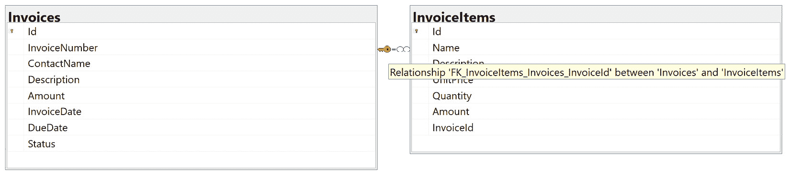
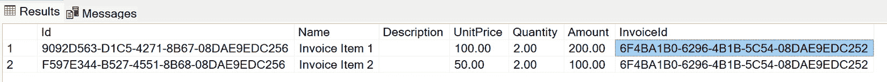
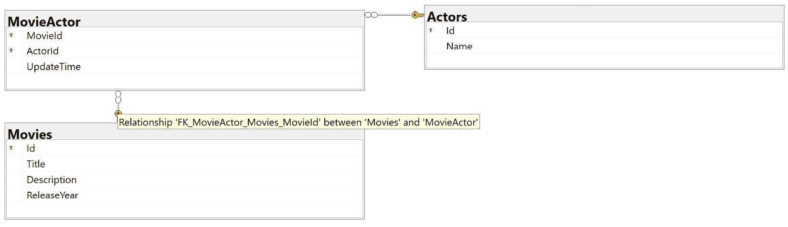
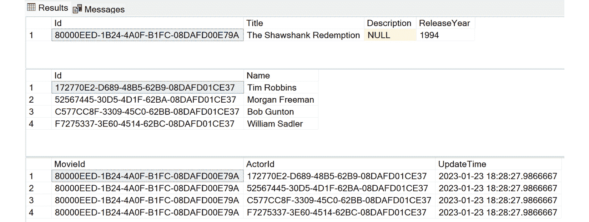

# 6

# ASP.NET Core 中的数据访问（第二部分 - 实体关系）

在*第五章*中，我们介绍了`DbContext`类的基础知识以及如何使用它来访问数据。

您可以在*第一章*的*定义资源之间的关系*部分回顾关系的基本概念，其中我们介绍了资源之间的关系。例如，在一个博客系统中，一篇帖子有一系列评论，一个用户有一系列帖子。在一个发票系统中，一个发票有一系列发票项，发票项属于发票。发票还有一个联系，它可以有一个或多个联系人，并且可以有一个地址。

在本章中，我们将继续探索 EF Core 的功能。我们将学习如何使用 Fluent APIs 管理实体之间的关系。最后，我们将讨论如何为具有关系的实体实现 CRUD 操作。

本章我们将涵盖以下主题：

+   理解一对多关系

+   理解一对一关系

+   理解多对多关系

+   理解拥有实体

阅读本章后，您应该能够使用 EF Core 的 Fluent APIs 配置实体之间的关系，并在您的 ASP.NET Core 应用程序中实现具有关系的实体的 CRUD 操作。

# 技术要求

本章中的代码示例可以在[`github.com/PacktPublishing/Web-API-Development-with-ASP.NET-Core-8/tree/main/samples/chapter6`](https://github.com/PacktPublishing/Web-API-Development-with-ASP.NET-Core-8/tree/main/samples/chapter6)找到。您可以使用 VS 2022 或 VS Code 打开解决方案。

预期您对**结构化查询语言**（**SQL**）查询和**语言集成查询**（**LINQ**）有基本了解。如果您不熟悉它们，可以参考以下资源：

+   **SQL** **查询**: [`www.w3schools.com/sql/`](https://www.w3schools.com/sql/)

+   **LINQ**: [`learn.microsoft.com/en-us/dotnet/csharp/linq/`](https://learn.microsoft.com/en-us/dotnet/csharp/linq/)

# 理解一对多关系

一对多关系是关系型数据库中最常见的关系。它们也被称为**父子（子）**关系。例如，发票有一系列发票项。在本节中，我们将学习如何在 EF Core 中配置一对多关系，以及如何为具有一对多关系的实体实现 CRUD 操作。

让我们继续使用发票示例应用程序。您可以在`chapter6`文件夹中找到`EfCoreRelationshipsDemo`项目的示例代码。如果您想按照书中的说明测试代码，您可以继续在`BasicEfCoreDemo`项目上工作。请注意，示例代码中的`InvoiceDbContext`类已被重命名为`SampleDbContext`。

接下来，让我们更新`Invoice`类并创建一个`InvoiceItem`类，然后定义它们之间的一对多关系。

## 一对多配置

为了演示一对多关系，我们需要在`Models`文件夹中添加一个新的类名为`InvoiceItem`，并给`Invoice`类添加一些额外的属性来表示它们之间的关系。

`InvoiceItem`类的代码如下：

```cs
public class InvoiceItem{
    public Guid Id { get; set; }
    public string Name { get; set; } = string.Empty;
    public string? Description { get; set; }
    public decimal UnitPrice { get; set; }
    public decimal Quantity { get; set; }
    public decimal Amount { get; set; }
    public Guid InvoiceId { get; set; }
    public Invoice? Invoice { get; set; }
}
```

`InvoiceItem`类有一组属性来存储发票项数据，例如`Name`、`Description`、`UnitPrice`等。它还有一个`InvoiceId`属性来存储发票项所属的发票 ID，以及一个`Invoice`属性来引用发票。要开始配置过程，请按照以下步骤操作：

1.  按照以下方式更新`Invoice`类：

    ```cs
    public class Invoice{    public Guid Id { get; set; }    // Omitted for brevity    // Add a collection of invoice items    public List<InvoiceItem> InvoiceItems { get; set; } = new ();}
    ```

    在前面的代码中，我们定义了`Invoice`和`InvoiceItem`之间的关系。一张发票包含一系列的发票项，而一个发票项属于一个发票。这是一个一对多关系，我们可以识别以下术语：

    +   `Invoice`是主实体。

    +   `InvoiceItem`是依赖实体。它有一个`InvoiceId`外键属性来识别父实体。

    +   `Invoice`类的`Id`属性是主键。

    +   `InvoiceItem`类的`InvoiceId`属性是外键，用于存储父实体的主键值。

    +   `Invoice`类的`InvoiceItems`属性是一个集合导航属性。

    +   `InvoiceItem`类的`Invoice`属性是一个引用导航属性。

1.  因为添加了一个新的模型，我们需要更新`DbContext`类。打开`SampleDbContext`类并添加以下代码：

    ```cs
    public DbSet<InvoiceItem> InvoiceItems => Set<InvoiceItem>();
    ```

1.  此外，配置新模型的映射也是一个好的实践。在`Data`文件夹中添加一个新的类，命名为`InvoiceItemConfiguration`：

    ```cs
    public class InvoiceItemConfiguration : IEntityTypeConfiguration<InvoiceItem>{    public void Configure(EntityTypeBuilder<InvoiceItem> builder)    {        builder.ToTable("InvoiceItems");        builder.Property(p => p.Id).HasColumnName(nameof(InvoiceItem.Id));        builder.Property(p => p.Name).HasColumnName(nameof(InvoiceItem.Name)).HasMaxLength(64).IsRequired();        builder.Property(p => p.Description).HasColumnName(nameof(InvoiceItem.Description)).HasMaxLength(256);        builder.Property(p => p.UnitPrice).HasColumnName(nameof(InvoiceItem.UnitPrice)).HasPrecision(8, 2);        builder.Property(p => p.Quantity).HasColumnName(nameof(InvoiceItem.Quantity)).HasPrecision(8, 2);        builder.Property(p => p.Amount).HasColumnName(nameof(InvoiceItem.Amount)).HasPrecision(18, 2);        builder.Property(p => p.InvoiceId).HasColumnName(nameof(InvoiceItem.InvoiceId));    }}
    ```

1.  一旦我们为`Invoice`和`InvoiceItem`定义了导航属性，EF Core 就可以发现这两个实体之间的关系。让我们使用`dotnet ef migrations add AddInvoiceItem`命令创建一个迁移。然后，检查生成的迁移文件。你会发现 EF Core 添加了以下代码：

    ```cs
    migrationBuilder.CreateTable(    name: "InvoiceItems",    columns: table => new    {        Id = table.Column<Guid>(type: "uniqueidentifier", nullable: false),        // Omitted for brevity        InvoiceId = table.Column<Guid>(type: "uniqueidentifier", nullable: false)    },    constraints: table =>    {        table.PrimaryKey("PK_InvoiceItems", x => x.Id);        table.ForeignKey(            name: "FK_InvoiceItems_Invoices_InvoiceId",            column: x => x.InvoiceId,            principalTable: "Invoices",            principalColumn: "Id",            onDelete: ReferentialAction.Cascade);    });// Omitted for brevitymigrationBuilder.CreateIndex(    name: "IX_InvoiceItems_InvoiceId",    table: "InvoiceItems",    column: "InvoiceId");
    ```

    EF Core 将创建一个新的`InvoiceItems`表，并在`InvoiceId`列上添加一个外键约束。外键约束的名称是`FK_<依赖类型名称>_<主类型名称>_<外键属性名称>`。它还会在`InvoiceId`列上创建一个索引。

另一件你需要注意的事情是，`onDelete`操作被设置为`ReferentialAction.Cascade`，这意味着如果父实体被删除，所有相关的子实体也将被删除。

让我们思考一个问题——如果我们没有在 `InvoiceItem` 类中拥有 `InvoiceId` 属性，EF Core 还能发现这两个实体之间的关系吗？你可以使用 `dotnet ef migrations remove` 命令来删除最后一个迁移，删除 `InvoiceItem` 类中的 `InvoiceId` 属性，然后再次添加迁移。你会看到 EF Core 仍然可以在 `InvoiceItems` 表中创建一个名为 `InvoiceId` 的列，并将其应用到外键约束上，这被称为**影子外键**属性。这是因为 EF Core 有其内置的约定来做这件事。有几个场景下，EF Core 可以发现实体之间的一对多关系：

+   从属实体有一个到主实体的引用导航属性

+   主实体有一个到从属实体的集合导航属性

+   引用导航属性和集合导航属性在两端都包含

+   引用导航属性和集合导航属性在两端都包含，外键属性包含在从属实体中

如果约定对我们不起作用，我们可以显式配置实体之间的关系来改变 EF Core 的默认行为。按照以下步骤操作：

1.  要显式配置实体之间的一对多关系，我们可以使用 `HasOne()`、`WithMany()`、`HasMany()` 和 `WithOne()` 方法。将以下代码添加到 `InvoiceConfiguration` 类中：

    ```cs
    builder.HasMany(x => x.InvoiceItems)    .WithOne(x => x.Invoice)    .HasForeignKey(x => x.InvoiceId);
    ```

    `HasMany()` 方法用于配置集合导航属性，而 `WithOne()` 方法用于配置引用导航属性。`HasForeignKey()` 方法用于配置外键属性。因此，前面的代码明确配置了一个发票可以有多个发票项，并且 `InvoiceItem` 类的 `InvoiceId` 属性是外键。如果你现在添加一个迁移，你会发现 EF Core 会生成与约定生成相同的代码。

1.  也可以为 `InvoiceItem` 类定义关系。删除 `Invoice` 类的前置配置代码，并将以下代码添加到 `InvoiceItemConfiguration` 类中：

    ```cs
    builder.HasOne(i => i.Invoice)    .WithMany(i => i.InvoiceItems)    .HasForeignKey(i => i.InvoiceId)    .OnDelete(DeleteBehavior.Cascade);
    ```

    现在应该容易理解了。`HasOne()` 方法用于配置引用导航属性，而 `WithMany` 方法用于配置集合导航属性。

    注意，我们还明确配置了 `OnDelete()` 动作到 `Cascade`，这与约定生成的相同。但如果需要，我们可以将其更改为其他选项。也就是说，Fluent API 比约定更灵活。

1.  我们只需要在关系的一侧配置关系。因此，请在添加迁移文件并应用迁移到数据库之前清理测试代码。迁移应用后，你可以检查数据库模式，看看是否创建了外键约束，如图下所示：



图 6.1 – 数据库中创建了一个外键约束

由于一对一关系可以在任一方向上定义，我们应该在哪个方向上配置关系呢？这取决于场景。如果两个实体之间有一对一的关系非常强，那么我们在哪一侧配置关系实际上并不重要。但如果两个实体之间是松散耦合的，我们最好在依赖实体上配置关系。

例如，`User` 实体被许多其他实体共享，例如 `Post`、`Comment`、`Invoice` 等。每个 `Post` 实体可以有一个 `Author` 属性，它是对 `User` 实体的引用导航属性，`Comment` 和 `Invoice` 也同样如此。然而，`User` 实体不需要对 `Post`、`Comment` 和 `Invoice` 实体有集合导航属性。在这种情况下，我们应该在 `Post`、`Comment` 和 `Invoice` 实体上配置关系。

要配置这种关系，我们可以忽略 `WithMany` 方法的参数，因为 `User` 实体没有对 `Post` 实体的集合导航属性，如下面的代码所示：

```cs
public void Configure(EntityTypeBuilder<Post> builder){
    // Omitted for brevity
    builder.HasOne(x => x.Author)
        .WithMany()
        .HasForeignKey(x => x.AuthorId);
    // Omitted for brevity
}
```

接下来，让我们看看我们如何实现具有一对一关系的实体的 CRUD 操作。

## 一对多 CRUD 操作

具有一对多关系的实体的 CRUD 操作与没有关系的实体不同。例如，当检索一个发票时，我们可能需要查询 `Invoices` 表和 `InvoiceItems` 表，以便检索相关的发票项目。此外，当删除一个发票时，我们必须考虑是否也要删除相关的发票项目。

EF Core 可以帮助我们管理各种场景。例如，当我们需要检索一个发票及其发票项目时，EF Core 可以生成一个 `LEFT JOIN` 查询来连接两个表。为了实现具有一对一关系的实体的 CRUD 操作，让我们探索以下部分。

### 创建数据

首先，让我们创建一个新的发票，并包含一些发票项目。你不需要更新 `PostInvoice` 动作的代码：

1.  使用 `dotnet run` 运行应用程序。向 `/api/Invoices` 端点发送一个 `POST` 请求。JSON 主体如下所示：

    ```cs
    {  "invoiceNumber": "INV-004",  "contactName": "Hulk",  "description": "Invoice for the first month",  "amount": 300,  "invoiceDate": "2022-12-28T01:39:42.915Z",  "dueDate": "2022-12-28T01:39:42.915Z",  "status": 1,  "invoiceItems": [    {      "name": "Invoice Item 1",      "description": "",      "unitPrice": 100,      "quantity": 2,      "amount": 200    },    {      "name": "Invoice Item 2",      "description": "",      "unitPrice": 50,      "quantity": 2,      "amount": 100    }  ]}
    An unhandled exception has occurred while executing the request.System.Text.Json.JsonException: A possible object cycle was detected. This can either be due to a cycle or if the object depth is larger than the maximum allowed depth of 32\. Consider using ReferenceHandler.Preserve on JsonSerializerOptions to support cycles. Path: $.InvoiceItems.Invoice.InvoiceItems.Invoice.InvoiceItems.Invoice.InvoiceItems.Invoice.InvoiceItems.Invoice.InvoiceItems.Invoice.InvoiceItems.Invoice.InvoiceItems.Invoice.InvoiceItems.Invoice.InvoiceItems.Invoice.InvoiceItems.
    ```

    异常被抛出是因为`Invoice`类有一个到`InvoiceItem`类的集合导航属性，而`InvoiceItem`类有一个到`Invoice`类的引用导航属性。因此，在 JSON 序列化中存在循环。一些序列化框架，如`Newtonsoft.Json`、`System.Text.Json`，不允许这样的循环。ASP.NET Core 默认使用`System.Text.Json`进行 JSON 序列化。因此，我们需要配置`System.Text.Json`框架以忽略循环。

1.  打开`Program.cs`文件，并在`builder.Services.AddControllers()`中添加以下代码：

    ```cs
    builder.Services    .AddControllers()    .AddJsonOptions(options =>    {        options.JsonSerializerOptions.ReferenceHandler = ReferenceHandler.IgnoreCycles;    });
    ```

    另一种修复异常的方法是在`InvoiceItem`类中用`[JsonIgnore]`属性装饰`Invoice`属性。但如果你有许多具有这种关系的实体，装饰所有这些实体会很麻烦。选择你喜欢的做法。

    此异常发生在数据保存到数据库之后。因此，如果你检查数据库，你会发现在数据库中保存了发票和发票项目：



图 6.2 – 发票项目以发票 ID 保存到数据库中

什么是 System.Text.Json？

`System.Text.Json`是从.NET Core 3.0 开始提供的一个新的 JSON 序列化框架。它比`Newtonsoft.Json`更快、更高效。它也是 ASP.NET Core 3.0 及以后版本的默认 JSON 序列化框架。建议在新项目中使用`System.Text.Json`而不是`Newtonsoft.Json`。

从前面的例子中，你可以看到以下这些点：

+   EF Core 如果模型中未定义，将为主实体生成一个`Id`属性。

+   EF Core 如果模型中未定义，将为从属实体生成一个`Id`属性。

+   EF Core 在模型中未定义的情况下，为从属实体生成一个外键属性，在这个例子中是`InvoiceId`。

+   当主实体被添加到数据库时，从属实体也会自动添加到数据库中。你不需要显式添加从属实体。

那么，如果你想要向现有发票中添加一个新的发票项目，你可以通过两种方式来完成：

+   首先获取发票，然后将新的发票项目添加到发票的`InvoiceItems`集合中，然后调用`SaveChanges()`方法将更改保存到数据库。这是发票的`Update`操作，意味着它应该是一个`PUT`操作。

+   创建一个新的发票项目，将`InvoiceId`属性设置为发票的`Id`属性，然后调用`SaveChanges()`方法将更改保存到数据库。这是发票项目的`Create`操作，意味着它应该是一个`POST`操作。此外，你需要为发票项目单独提供一个端点。

一张发票项不能脱离发票而存在。因此，通常情况下，您会通过发票与发票项进行交互。从实际的角度来看，如果依赖实体的数量不是很大，第一种方式更为常见。然而，这取决于您的场景。如果主要实体有大量的依赖实体，更新整个主要实体可能既低效又昂贵。在这种情况下，您可以公开一个单独的端点来操作依赖实体。例如，一篇博客文章可能有大量的评论。向博客文章添加新评论是常见的，但更新整个博客文章和其他评论并不是必要的。这与另一个概念有关，即**领域驱动设计**（**DDD**），它是对领域对象及其关系的建模。我们将在后面的章节中讨论它。

### 查询数据

现在我们已经在数据库中有了发票和一些发票项，我们可以向`/api/Invoices`端点发送一个`GET`请求。您可以看到以下响应：

```cs
[  {
    "id": "a224e90a-c01c-499b-7a9b-08dae9f04218",
    "invoiceNumber": "INV-004",
    "contactName": "Hulk",
    "description": "Invoice for the first month",
    "amount": 300,
    "invoiceDate": "2022-12-28T01:39:42.915+00:00",
    "dueDate": "2022-12-28T01:39:42.915+00:00",
    "status": 1,
    "invoiceItems": []
  },
  ...
]
```

响应包含发票列表。但`InvoiceItems`属性为空。这是因为`InvoiceItems`属性是一个集合导航属性。默认情况下，EF Core 不会在查询结果中包含依赖实体，因此您需要显式地将这些包含在查询结果中。按照以下步骤从数据库查询发票和发票项：

1.  打开`InvoicesController.cs`文件，并将`GetInvoices()`方法的代码更新如下：

    ```cs
    // GET: api/Invoices[HttpGet]public async Task<ActionResult<IEnumerable<Invoice>>> GetInvoices(int page = 1, int pageSize = 10,    InvoiceStatus? status = null){    // Omitted for brevity    return await context.Invoices        .Include(x => x.InvoiceItems)        .Where(x => status == null || x.Status == status)        .OrderByDescending(x => x.InvoiceDate)        .Skip((page - 1) * pageSize)        .Take(pageSize)        .ToListAsync();}
    ```

    在前面的代码中，我们使用`Include`方法将依赖实体包含在查询结果中。

1.  重新启动应用程序并再次发送相同的请求。现在，您将看到结果包括发票项，如下所示：

    ```cs
    [  {    "id": "a224e90a-c01c-499b-7a9b-08dae9f04218",    "invoiceNumber": "INV-004",    "contactName": "Hulk",    "description": "Invoice for the first month",    "amount": 300,    "invoiceDate": "2022-12-28T01:39:42.915+00:00",    "dueDate": "2022-12-28T01:39:42.915+00:00",    "status": 1,    "invoiceItems": [      {        "id": "8cc52722-5b99-4d0c-07ef-08dae9f04223",        "name": "Invoice Item 1",        "description": "",        "unitPrice": 100,        "quantity": 2,        "amount": 200,        "invoiceId": "a224e90a-c01c-499b-7a9b-08dae9f04218",        "invoice": null      },      {        "id": "2d3f739a-2280-424b-07f0-08dae9f04223",        "name": "Invoice Item 2",        "description": "",        "unitPrice": 50,        "quantity": 2,        "amount": 100,        "invoiceId": "a224e90a-c01c-499b-7a9b-08dae9f04218",        "invoice": null      }    ]  },  ...]
    info: Microsoft.EntityFrameworkCore.Database.Command[20101]      Executed DbCommand (35ms) [Parameters=[@__p_0='?' (DbType = Int32), @__p_1='?' (DbType = Int32)], CommandType='Text', CommandTimeout='30']      SELECT [t].[Id], [t].[Amount], [t].[ContactName], [t].[Description], [t].[DueDate], [t].[InvoiceDate], [t].[InvoiceNumber], [t].[Status], [i0].[Id], [i0].[Amount], [i0].[Description], [i0].[InvoiceId], [i0].[Name], [i0].[Quantity], [i0].[UnitPrice]      FROM (          SELECT [i].[Id], [i].[Amount], [i].[ContactName], [i].[Description], [i].[DueDate], [i].[InvoiceDate], [i].[InvoiceNumber], [i].[Status]          FROM [Invoices] AS [i]          ORDER BY [i].[InvoiceDate] DESC          OFFSET @__p_0 ROWS FETCH NEXT @__p_1 ROWS ONLY      ) AS [t]      LEFT JOIN [InvoiceItems] AS [i0] ON [t].[Id] = [i0].[InvoiceId]      ORDER BY [t].[InvoiceDate] DESC, [t].[Id]
    ```

    如您所见，当 LINQ 查询使用`Include()`方法包含依赖实体时，EF Core 将生成一个`LEFT` `JOIN`查询。

重要提示

`Include()`方法是一个方便的方法来包含依赖实体。然而，当依赖实体的集合很大时，它可能会引起性能问题。例如，一个帖子可能有数百或数千条评论。在列表页的查询结果中包含所有评论并不是一个好主意。在这种情况下，没有必要在查询中包含依赖实体。

1.  注意，查询在结果中的每一行都包含了`Invoice`数据。对于某些场景，它可能会引起所谓的`AsSplitQuery()`方法，如下所示：

    ```cs
    [HttpGet]public async Task<ActionResult<IEnumerable<Invoice>>> GetInvoices(int page = 1, int pageSize = 10,    InvoiceStatus? status = null){    // Omitted for brevity    return await context.Invoices        .Include(x => x.InvoiceItems)        .Where(x => status == null || x.Status == status)        .OrderByDescending(x => x.InvoiceDate)        .Skip((page - 1) * pageSize)        .Take(pageSize)        .AsSplitQuery()        .ToListAsync();}
    info: Microsoft.EntityFrameworkCore.Database.Command[20101]      FROM (          SELECT [i].[Id], [i].[InvoiceDate]      Executed DbCommand (2ms) [Parameters=[@__p_0='?' (DbType = Int32), @__p_1='?' (DbType = Int32)], CommandType='Text', CommandTimeout='30']      SELECT [i].[Id], [i].[Amount], [i].[ContactName], [i].[Description], [i].[DueDate], [i].[InvoiceDate], [i].[InvoiceNumber], [i].[Status]      FROM [Invoices] AS [i]      ORDER BY [i].[InvoiceDate] DESC, [i].[Id]      OFFSET @__p_0 ROWS FETCH NEXT @__p_1 ROWS ONLYinfo: Microsoft.EntityFrameworkCore.Database.Command[20101]      Executed DbCommand (2ms) [Parameters=[@__p_0='?' (DbType = Int32), @__p_1='?' (DbType = Int32)], CommandType='Text', CommandTimeout='30']      SELECT [i0].[Id], [i0].[Amount], [i0].[Description], [i0].[InvoiceId], [i0].[Name], [i0].[Quantity], [i0].[UnitPrice], [t].[Id]      FROM (          SELECT [i].[Id], [i].[InvoiceDate]          FROM [Invoices] AS [i]          ORDER BY [i].[InvoiceDate] DESC          OFFSET @__p_0 ROWS FETCH NEXT @__p_1 ROWS ONLY      ) AS [t]      INNER JOIN [InvoiceItems] AS [i0] ON [t].[Id] = [i0].[InvoiceId]      ORDER BY [t].[InvoiceDate] DESC, [t].[Id]
    ```

    查询包含两个`SELECT`语句。第一个`SELECT`语句用于查询发票。第二个`SELECT`语句用于查询发票项。`INNER JOIN`查询用于连接这两个查询。

1.  您也可以通过在`DbContext`类的`OnConfiguring()`方法中使用`UseQuerySplittingBehavior()`方法来全局配置默认查询拆分行为。以下代码显示了如何在`SampleDbContext`类中将默认查询拆分行为配置为`SplitQuery`：

    ```cs
    protected override void OnConfiguring(DbContextOptionsBuilder optionsBuilder){    base.OnConfiguring(optionsBuilder);    optionsBuilder.UseSqlServer(_configuration.GetConnectionString("DefaultConnection"),        b => b.UseQuerySplittingBehavior(QuerySplittingBehavior.SplitQuery));}
    ```

    在这种情况下，你不需要在你的 LINQ 查询中使用 `AsSplitQuery()` 方法。如果你想在一个查询中执行特定的查询，你可以使用 `AsSingleQuery()` 方法，如下所示：

    ```cs
    [HttpGet]public async Task<ActionResult<IEnumerable<Invoice>>> GetInvoices(int page = 1, int pageSize = 10,    InvoiceStatus? status = null){    // Omitted for brevity    return await _context.Invoices        .Include(x => x.InvoiceItems)        .Where(x => status == null || x.Status == status)        .OrderByDescending(x => x.InvoiceDate)        .Skip((page - 1) * pageSize)        .Take(pageSize)        .AsSingleQuery()        .ToListAsync();}
    ```

然而，拆分查询可能会导致其他问题。例如，多个查询会增加数据库往返次数的数量。此外，如果另一个线程在两个查询之间修改了数据，结果可能不一致。因此，你应该考虑拆分查询的优缺点，以适应你的场景。

### 检索数据

接下来，让我们看看如何通过 ID 检索数据。在 `GetInvoice` 动作中，我们使用 `await _context.Invoices.FindAsync(id)` 通过其 ID 查找发票。向 `/api/Invoices/{id}` 端点发送一个有效的 `Get` 请求。你将看到响应包含一个空的 `InvoiceItems` 数组。这是因为查询中没有包含 `InvoiceItems` 属性。要包含 `InvoiceItems` 属性在查询中，你可以在 LINQ 查询中使用 `Include` 方法。以下代码展示了如何使用 `Include` 方法将 `InvoiceItems` 属性包含在查询中：

```cs
[HttpGet("{id}")]public async Task<ActionResult<Invoice>> GetInvoice(int id)
{
    var invoice = await context.Invoices
        .Include(x => x.InvoiceItems)
        .SingleOrDefaultAsync(x => x.Id == id);
    if (invoice == null)
    {
        return NotFound();
    }
    return invoice;
}
```

生成的 SQL 查询如下：

```cs
info: Microsoft.EntityFrameworkCore.Database.Command[20101]      Executed DbCommand (4ms) [Parameters=[@__id_0='?' (DbType = Guid)], CommandType='Text', CommandTimeout='30']
      SELECT [i0].[Id], [i0].[Amount], [i0].[Description], [i0].[InvoiceId], [i0].[Name], [i0].[Quantity], [i0].[UnitPrice], [t].[Id]
      FROM (
          SELECT TOP(1) [i].[Id]
          FROM [Invoices] AS [i]
          WHERE [i].[Id] = @__id_0
      ) AS [t]
      INNER JOIN [InvoiceItems] AS [i0] ON [t].[Id] = [i0].[InvoiceId]
      ORDER BY [t].[Id]
```

查询包含两个 `SELECT` 语句，并且使用 `INNER JOIN` 查询将两个语句连接起来。这样，你可以在单个查询中检索发票和发票项目。

### 删除数据

在 *一对一配置* 部分，我们介绍了如何配置 `OnDelete` 动作，将 `DeleteBehavior` 枚举设置为 `Cascade`。`DeleteBehavior` 枚举还有其他选项。考虑以下一对一关系中的场景：

+   一个发票有一系列发票项目

+   用户删除一个发票

在此情况下，当删除发票时，你可能想要删除相关的发票项目，因为一个发票项目不能在没有发票的情况下存在。这种行为被称为**级联删除**。要删除数据，请按照以下步骤操作：

1.  运行应用程序并向 `/api/Invoices/{id}` 端点发送一个有效的 `Delete` 请求。你将看到发票和相关发票项目从数据库中删除。请注意，如果 `OnDelete()` 方法配置为 `Cascade` 或 `ClientCascade`，则在使用 LINQ 查询中的 `Include()` 方法加载相关实体时不需要。级联删除行为在数据库级别应用。你可以在这里看到生成的 SQL 查询，它仅删除 `Invoice` 实体：

    ```cs
    info: Microsoft.EntityFrameworkCore.Database.Command[20101]      Executed DbCommand (9ms) [Parameters=[@__id_0='?' (DbType = Guid)], CommandType='Text', CommandTimeout='30']      DELETE FROM [i]      FROM [Invoices] AS [i]      WHERE [i].[Id] = @__id_0
    ```

    然而，在某些场景中，你可能希望在删除主实体时保留依赖实体，例如：

    +   一个类别有一系列博客文章

    +   用户删除一个类别

    当删除类别时，没有必要删除博客文章，因为博客文章可以在没有类别的情况下存在，并且可以被分配给另一个类别。然而，如果删除类别，博客文章的外键属性 `CategoryId` 将不再匹配任何类别的主键。因此，你可能希望在删除类别时将 `CategoryId` 属性设置为 `null`。这种行为被称为 `CategoryId` 属性是可空的。如果博客文章实体的 `CategoryId` 属性不可空，当你尝试删除类别时，EF Core 将抛出异常，因为它将违反外键约束。

1.  在示例代码中，有一个此类情况的示例。你可以在 `Models` 文件夹中找到 `Category` 和 `Post` 类。与 `Invoice` 和 `InvoiceItem` 类类似，它们有一个一对一的关系。然而，`Post` 类中的 `CategoryId` 属性是可空的。因此，当删除类别时，你可以将 `DeleteBehavior` 设置为 `ClientSetNull` 以使 `CategoryId` 属性为空。

    以下代码展示了如何将 `DeleteBehavior` 配置为 `ClientSetNull`：

    ```cs
    public class PostConfiguration : IEntityTypeConfiguration<Post>{    public void Configure(EntityTypeBuilder<Post> builder)    {        builder.ToTable("Posts");        // Omitted for brevity        builder.Property(p => p.CategoryId).HasColumnName("CategoryId");        builder.HasOne(p => p.Category)            .WithMany(c => c.Posts)            .HasForeignKey(p => p.CategoryId)            .OnDelete(DeleteBehavior.ClientSetNull);    }}
    ```

    在 `OnDelete()` 方法中，你可以传递 `DeleteBehavior` 枚举来将 `DeleteBehavior` 设置为 `ClientSetNull`。`ClientSetNull` 的值表示当主实体被删除时，外键属性将被设置为 `null`。

1.  在 `CategoriesController` 类中，你可以找到 `DeleteCategory()` 方法。它与 `InvoicesController` 类中的 `DeleteInvoice()` 方法类似。唯一的区别是我们需要在删除类别之前移除类别和博客文章之间的关系。以下代码展示了如何移除类别和博客文章之间的关系：

    ```cs
    var category = await context.Categories.Include(x => x.Posts).SingleOrDefaultAsync(x => x.Id == id);if (category == null){    return NotFound();}category.Posts.Clear();// Or you can update the posts to set the category to null// foreach (var post in category.Posts)// {//     post.Category = null;// }context.Categories.Remove(category);await context.SaveChangesAsync();
    ```

    你可以清除类别实体的 `Posts` 属性，或者你可以更新博客文章的 `Category` 属性将其设置为 `null`。这样，当删除类别时，博客文章的 `CategoryId` 属性将被设置为 `null`。此外，使用 `Include` 方法加载相关实体是必需的，因为 EF Core 需要跟踪相关实体的更改。

1.  运行应用程序并向 `/api/Categories/{id}` 端点发送一个有效的 ID 的 `Delete` 请求。检查数据库，你会发现该类别已被删除，但博客文章并未被删除。相反，博客文章的 **CategoryId** 属性被设置为 **NULL**：


图 6.3 – 当类别被删除时，博客文章的 CategoryId 属性被设置为 NULL

1.  检查生成的 SQL 查询，你会发现 EF Core 执行了两个 SQL 查询。第一个查询是将博客文章的 `CategoryId` 属性更新为 `null`。第二个查询是删除类别。生成的 SQL 查询如下：

    ```cs
    info: Microsoft.EntityFrameworkCore.Database.Command[20101]      Executed DbCommand (6ms) [Parameters=[@p1='?' (DbType = Guid), @p0='?' (DbType = Guid), @p2='?' (DbType = Guid)], CommandType='Text', CommandTimeout='30']      SET NOCOUNT ON;      UPDATE [Posts] SET [CategoryId] = @p0      OUTPUT 1      WHERE [Id] = @p1;      DELETE FROM [Categories]      OUTPUT 1      WHERE [Id] = @p2;
    ```

    这意味着现在帖子没有分类，也就是说分类和博客文章之间的关系已经被移除。你可以将博客文章分配到另一个分类中，以根据你的业务逻辑重新创建这种关系。

在删除具有关系的实体时，了解其后果是很重要的。请记住，某些数据库可能不支持级联删除。因此，`DeleteBehavior` 枚举包含很多值，以便你在删除实体时进行微调。通常，建议使用 `ClientCascade` 或 `ClientSetNull`，因为 EF Core 可以在数据库不支持级联删除的情况下执行级联删除或置为空操作。

到目前为止，我们已经学习了如何配置一对多关系以及如何为具有一对多关系的实体实现 CRUD 操作。接下来，让我们继续学习另一种类型的关系：一对一关系。

# 理解一对一关系

一对一关系意味着一个实体只与另一个类型的单个实体有关联。例如，一辆自行车需要一个锁，这个锁只能用于那辆特定的自行车。同样，一个人只能拥有一个驾驶证，这个驾驶证仅供他们使用。在我们的示例代码中，一个 `Contact` 实体只有一个 `Address` 实体，一个 `Address` 实体只属于一个 `Contact` 实体。在前一节中，你学习了如何使用 `HasOne()/WithMany()` 和 `HasMany()/WithOne()` 方法配置一对多关系。在本节中，你将学习如何使用 `HasOne()` 和 `WithOne()` 方法配置一对一关系。

## 一对一配置

在一对一关系中，双方都有一个引用导航属性。技术上，双方处于平等的位置。然而，为了显式配置关系，我们需要指定哪一方是依赖方，哪一方是主方。外键属性通常定义在依赖方。在以下示例中，我们将配置 `Contact` 类和 `Address` 类之间的一对一关系：

```cs
public class Contact{
    public Guid Id { get; set; }
    public string FirstName { get; set; } = string.Empty;
    public string LastName { get; set; } = string.Empty;
    public string? Title { get; set; }
    public string Email { get; set; } = string.Empty;
    public string Phone { get; set; } = string.Empty;
    public Address Address { get; set; }
}
public class Address
{
    public Guid Id { get; set; }
    public string Street { get; set; } = string.Empty;
    public string City { get; set; } = string.Empty;
    public string State { get; set; } = string.Empty;
    public string ZipCode { get; set; } = string.Empty;
    public string Country { get; set; } = string.Empty;
    public Guid ContactId { get; set; }
    public Contact Contact { get; set; }
}
```

在前面的代码中，`Address` 类中定义了一个 `ContactId` 外键，这意味着 `Address` 类是依赖实体，而 `Contact` 类是主实体。如果你在这里没有定义外键属性，EF Core 将会自动选择一个实体作为依赖实体。然而，由于 `Contact` 和 `Address` 在一对一关系中是平等的，EF Core 可能不会选择我们期望的正确实体。因此，我们需要在依赖实体中显式定义一个外键属性。

一对一关系的配置如下：

```cs
public class ContactConfiguration : IEntityTypeConfiguration<Contact>{
    public void Configure(EntityTypeBuilder<Contact> builder)
    {
        builder.ToTable("Contacts");
        builder.HasKey(c => c.Id);
        // Omitted for brevity
        builder.Property(c => c.Phone).IsRequired();
    }
}
public class AddressConfiguration : IEntityTypeConfiguration<Address>
{
    public void Configure(EntityTypeBuilder<Address> builder)
    {
        builder.ToTable("Addresses");
        builder.HasKey(a => a.Id);
        // Omitted for brevity
        builder.Ignore(a => a.Contact);
        builder.HasOne(a => a.Contact)
            .WithOne(c => c.Address)
            .HasForeignKey<Address>(a => a.ContactId);
    }
}
```

之前的代码使用 `HasOne`/`WithOne` 来定义一对一关系。这可以在 `Contact` 配置或 `Address` 配置中定义。使用 `HasForeignKey` 方法来指定外键属性。如果您想在 `Contact` 配置中定义关系，代码可能如下所示：

```cs
builder.HasOne(c => c.Address)    .WithOne(a => a.Contact)
    .HasForeignKey<Address>(a => a.ContactId);
```

运行以下代码以添加迁移并更新数据库：

```cs
dotnet ef migrations add AddContactAndAddressdotnet ef database update
```

您将看到以下代码在 `Addresses` 表上创建了一个 `ContactId` 外键：

```cs
migrationBuilder.CreateTable(    name: "Addresses",
    columns: table => new
    {
        Id = table.Column<Guid>(type: "uniqueidentifier", nullable: false),
        // Omitted for brevity
    },
    constraints: table =>
    {
        table.PrimaryKey("PK_Addresses", x => x.Id);
        table.ForeignKey(
            name: "FK_Addresses_Contacts_ContactId",
            column: x => x.ContactId,
            principalTable: "Contacts",
            principalColumn: "Id",
            onDelete: ReferentialAction.Cascade);
    });
```

在迁移应用后，**联系人**和**地址**之间的关系配置成功，如图 *6.4* 所示。4*：


图 6.4 – 在 `Addresses` 表上创建了一个 `ContactId` 外键

接下来，让我们看看如何实现具有一对一关系的实体的 CRUD 操作。

## 一对一 CRUD 操作

一对一关系的 CRUD 操作与一对多关系的 CRUD 操作类似。EF Core 可以为您简化 CRUD 操作。因此，在本节中，我们不会详细解释所有 CRUD 操作。您将在示例仓库中找到一个名为 `ContactsController.cs` 的控制器，该控制器实现了 `Contact` 实体的 CRUD 操作。您可以检查代码以获取详细信息。

`Contact` 和 `Address` 实体之间存在一对一关系，这意味着每个 `Contact` 实体有一个 `Address` 属性，每个 `Address` 实体只属于一个 `Contact` 属性。为了说明如何查询带有其地址的联系人，我们将使用以下示例：

1.  要创建一个新的联系人及其地址，您可以向 `api/contacts` 端点发送 `POST` 请求。请求体如下所示：

    ```cs
    {    "firstName": "John",    "lastName": "Doe",    "email": "john.doe@example.com",    "phone": "1234567890",    "address": {        "street": "123 Main St",        "city": "Wellington",        "state": "Wellington",        "zipCode": "6011",        "country": "New Zealand"    }}
    ```

    在 JSON 请求体中，`address` 对象是 `Contact` 对象的一个属性。在请求体中不需要发送 `ContactId` 属性。EF Core 会自动将 `ContactId` 属性设置为 `Contact` 对象的 `Id` 属性。

1.  同样，当您通过 `api/contacts` 端点查询联系人时，默认情况下不会在响应体中包含 `Address` 对象。您需要显式使用 `Include` 方法将 `Address` 对象包含在查询中，如下面的代码所示：

    ```cs
    // GET: api/Contacts[HttpGet]public async Task<ActionResult<IEnumerable<Contact>>> GetContacts(){    if (context.Contacts == null)    {        return NotFound();    }    return await context.Contacts.Include(x => x.Address).ToListAsync();}
    ```

您可以检查 `ContactsController.cs` 文件中的其他 CRUD 操作并在 Postman 或您喜欢的任何 REST 客户端中测试它们。

我们已经探讨了两种关系类型：一对多和一对一。现在，让我们深入了解另一种关系类型：多对多。

# 理解多对多关系

多对多关系是指一个实体可以与多个实体相关联，反之亦然。例如，一部电影可以有多个演员，一个演员可以出演多部电影；一篇文章可以有多个标签，一个标签可以有多个文章；一个学生可以报名多门课程，一门课程可以有多个学生，等等。在本节中，我们将介绍如何在 EF Core 中配置多对多关系。

## 多对多配置

在多对多关系中，我们需要在两边定义一个集合导航属性。以下是一个 `Movie` 实体和 `Actor` 实体之间多对多关系的示例：

```cs
public class Movie{
    public Guid Id { get; set; }
    public string Title { get; set; } = string.Empty;
    public string? Description { get; set; }
    public int ReleaseYear { get; set; }
    public List<Actor> Actors { get; set; } = new List<Actor>();
}
public class Actor
{
    public Guid Id { get; set; }
    public string Name { get; set; } = string.Empty;
    public List<Movie> Movies { get; set; } = new List<Movie>();
}
```

EF Core 可以根据约定自动检测多对多关系。如果你运行 `dotnet ef migrations add AddMovieAndActor` 命令来添加迁移，你将在迁移文件中看到以下代码：

```cs
migrationBuilder.CreateTable(    name: "ActorMovie",
    columns: table => new
    {
        ActorsId = table.Column<Guid>(type: "uniqueidentifier", nullable: false),
        MoviesId = table.Column<Guid>(type: "uniqueidentifier", nullable: false)
    },
    constraints: table =>
    {
        table.PrimaryKey("PK_ActorMovie", x => new { x.ActorsId, x.MoviesId });
        table.ForeignKey(
            name: "FK_ActorMovie_Actors_ActorsId",
            column: x => x.ActorsId,
            principalTable: "Actors",
            principalColumn: "Id",
            onDelete: ReferentialAction.Cascade);
        table.ForeignKey(
            name: "FK_ActorMovie_Movies_MoviesId",
            column: x => x.MoviesId,
            principalTable: "Movies",
            principalColumn: "Id",
            onDelete: ReferentialAction.Cascade);
    });
```

除了创建 `Movies` 和 `Actors` 表的代码外，迁移文件还创建了一个名为 `ActorMovie` 的连接表来存储两边的外键。`ActorMovie` 表有两个外键属性，`ActorsId` 和 `MoviesId`，用于关联 `Actor` 实体和 `Movie` 实体。

然而，有时自动检测的多对多关系可能不符合我们的要求。例如，我们可能希望将表名称为 `MovieActor` 而不是 `ActorMovie`，我们可能希望指定外键属性为 `ActorId` 和 `MovieId` 而不是 `ActorsId` 和 `MoviesId`，或者我们甚至可能希望向连接表添加一些额外的属性。在这些情况下，我们可以显式配置多对多关系。

首先，我们需要定义一个连接实体来存储两边的键。以下是一个名为 `MovieActor` 的连接实体的示例：

```cs
public class MovieActor{
    public Guid MovieId { get; set; }
    public Movie Movie { get; set; } = null!;
    public Guid ActorId { get; set; }
    public Actor Actor { get; set; } = null!;
    public DateTime UpdateTime { get; set; }
}
```

此外，我们还需要向 `Movie` 和 `Actor` 实体添加一个集合导航属性：

```cs
public class Movie{
    public Guid Id { get; set; }
    // Omitted other properties
    public List<MovieActor> MovieActors { get; set; } = new ();
}
public class Actor
{
    public Guid Id { get; set; }
    // Omited other properties
    public List<MovieActor> MovieActors { get; set; } = new ();
}
```

然后，我们使用 `HasMany()/WithMany()` 方法在 `Movie` 配置中配置多对多关系，如下所示：

```cs
public class MovieConfiguration : IEntityTypeConfiguration<Movie>{
    public void Configure(EntityTypeBuilder<Movie> builder)
    {
        // Omitted for brevity
        builder.HasMany(m => m.Actors)
            .WithMany(a => a.Movies)
            .UsingEntity<MovieActor>(
                j => j
                    .HasOne(ma => ma.Actor)
                    .WithMany(a => a.MovieActors)
                    .HasForeignKey(ma => ma.ActorId),
                j => j
                    .HasOne(ma => ma.Movie)
                    .WithMany(m => m.MovieActors)
                    .HasForeignKey(ma => ma.MovieId),
                j =>
                {
                    // You can add more configuration here
                    j.Property(ma => ma.UpdateTime).HasColumnName("UpdateTime").HasDefaultValueSql("CURRENT_TIMESTAMP");
                    j.HasKey(ma => new { ma.MovieId, ma.ActorId });
                }
            );
    }
}
```

类似地，配置也可以添加到 `Actor` 配置中。添加配置后，运行 `dotnet ef migrations add AddMovieAndActor` 命令来添加迁移；你将在迁移文件中看到以下代码：

```cs
migrationBuilder.CreateTable(    name: "MovieActor",
    columns: table => new
    {
        MovieId = table.Column<Guid>(type: "uniqueidentifier", nullable: false),
        ActorId = table.Column<Guid>(type: "uniqueidentifier", nullable: false),
        UpdateTime = table.Column<DateTime>(type: "datetime2", nullable: false, defaultValueSql: "CURRENT_TIMESTAMP")
    },
    constraints: table =>
    {
        table.PrimaryKey("PK_MovieActor", x => new { x.MovieId, x.ActorId });
        table.ForeignKey(
            name: "FK_MovieActor_Actors_ActorId",
            column: x => x.ActorId,
            principalTable: "Actors",
            principalColumn: "Id",
            onDelete: ReferentialAction.Cascade);
        table.ForeignKey(
            name: "FK_MovieActor_Movies_MovieId",
            column: x => x.MovieId,
            principalTable: "Movies",
            principalColumn: "Id",
            onDelete: ReferentialAction.Cascade);
    });
```

你可以看到连接表已被重命名为 `MovieActor`，外键属性也被重命名为 `MovieId` 和 `ActorId`。此外，连接表中还添加了 `UpdateTime` 属性。

迁移应用后，你可以在数据库中看到连接表：



图 6.5 – 数据库中的连接表

在 EF Core 5.0 之前，配置多对多关系的另一种方式是使用连接实体来表示两个单独的一对多关系。以下是一个为 `Movie` 和 `Actor` 实体配置多对多关系的示例：

```cs
public class MovieActorsConfiguration : IEntityTypeConfiguration<MovieActor>{
    public void Configure(EntityTypeBuilder<MovieActor> builder)
    {
        builder.ToTable("MovieActors");
        builder.HasKey(sc => new { sc.MovieId, sc.ActorId });
        builder.HasOne(sc => sc.Actor)
            .WithMany(s => s.MovieActors)
            .HasForeignKey(sc => sc.ActorId);
        builder.HasOne(sc => sc.Movie)
            .WithMany(c => c.MovieActors)
            .HasForeignKey(sc => sc.MovieId);
    }
}
```

在前面的代码中，我们在`MovieActor`连接实体上为`电影`和`演员`实体配置了两个一对一关系。每个一对一关系都使用`HasMany()`、`WithMany()`和`ForeignKey()`方法来配置关系。这种一对一关系的组合创建了一个多对多关系。

你可以使用任何一种方式来配置多对多关系。`HasMany()/WithMany()`方法更方便且易于使用。

## 多对多 CRUD 操作

在多对多关系中，例如`电影`和`演员`，我们可能需要获取电影的演员或获取演员的电影。因此，我们需要通过 REST API 公开这两个实体。你可以使用以下命令创建两个控制器：

```cs
dotnet-aspnet-codegenerator controller -name MoviesController -api -outDir Controllers --model Movie --dataContext SampleDbContext -async -actionsdotnet-aspnet-codegenerator controller -name ActorsController -api -outDir Controllers --model Actor --dataContext SampleDbContext -async -actions
```

运行应用程序并创建一些电影和演员。

在创建电影时，我们可以包括电影的演员。例如，我们可以使用以下 JSON 有效载荷格式创建一个包含几个演员的电影：

```cs
{    "title": "The Shawshank Redemption",
    "releaseYear": "1994",
    "actors": [
        {
            "name": "Tim Robbins"
        },
        {
            "name": "Morgan Freeman"
        },
        {
            "name": "Bob Gunton"
        },
        {
            "name": "William Sadler"
        }
    ]
}
```

你将在数据库中看到以下结果：



图 6.6 – 连接表已填充

同样，你还可以在创建演员时包括演员的电影。然而，如果我们任意包含相关实体，我们可能会得到重复实体。例如，我们使用以下 JSON 有效载荷格式创建一个包含几个电影的演员：

```cs
{    "name": "Tim Robbins",
    "movies": [
        {
            "title": "The Shawshank Redemption",
            "releaseYear": "1994"
        },
        {
            "title": "Green Mile",
            "releaseYear": "1999"
        }
    ]
}
```

因此，数据库中可能会有两个同名电影。为了避免这种情况，有一些选项：

+   向`电影`实体的`标题`属性添加唯一索引以确保标题唯一。这是最简单的解决方案，可以防止重复实体被添加到数据库中。

+   在添加之前检查实体是否已存在于数据库中。

+   分别添加电影和演员，然后使用其他实体的 ID 更新电影或演员以包括其他实体，而不是整个实体。

你可以使用前面选项的组合来改进实现。要向`电影`实体的`标题`属性添加唯一索引，你可以更新`MovieConfiguration`类的以下代码：

```cs
public void Configure(EntityTypeBuilder<Movie> builder){
    builder.ToTable("Movies");
    builder.HasKey(m => m.Id);
    builder.Property(p => p.Title).HasColumnName("Title").HasMaxLength(128).IsRequired();
    // Add a unique index to the Title property
    builder.HasIndex(p => p.Title).IsUnique();
    // Omitted for brevity
}
```

你可以对`演员`实体的`名称`属性进行相同的更改。更改后，你需要创建一个新的迁移并将其应用到数据库中。这有助于在数据库级别防止重复实体。如果请求包含重复实体，数据库将抛出异常。

有可能在同一个请求中添加或更新与主实体相关的实体。但有时，这可能不是必要的。例如，一个演员只参与了一部新电影，你想要创建一个新电影并将演员添加到电影中。你可以更新演员以包括新电影，但必须发送整个演员实体到请求中，包括现有的电影。这会导致不必要的数据传输。

为了使 API 更易于使用，仅暴露一个额外的 API 端点来更新相关实体的集合，而不是更新整个实体，这是一种实用主义的方法。例如，我们可以创建一个 `/api/actors/{id}/movies` 端点来更新演员的电影。避免在同一个请求中更新相关实体的集合是一种良好的做法。我们只需向 API 端点发送相关实体的 ID 即可。从 API 的角度来看，这种关系被视为一个资源。在 `ActorsController.cs` 文件中，您将找到以下代码：

```cs
[HttpPost("{id}/movies/{movieId}")]public async Task<IActionResult> AddMovie(Guid id, Guid movieId)
{
    if (_context.Actors == null)
    {
        return NotFound("Actors is null.");
    }
    var actor = await _context.Actors.Include(x => x.Movies).SingleOrDefaultAsync(x => x.Id == id);
    if (actor == null)
    {
        return NotFound($"Actor with id {id} not found.");
    }
    var movie = await _context.Movies.FindAsync(movieId);
    if (movie == null)
    {
        return NotFound($"Movie with id {movieId} not found.");
    }
    if (actor.Movies.Any(x => x.Id == movie.Id))
    {
        return Problem($"Movie with id {movieId} already exists for Actor {id}.");
    }
    actor.Movies.Add(movie);
    await _context.SaveChangesAsync();
    return CreatedAtAction("GetActor", new { id = actor.Id }, actor);
}
[HttpGet("{id}/movies")]
public async Task<IActionResult> GetMovies(Guid id)
{
    if (_context.Actors == null)
    {
        return NotFound("Actors is null.");
    }
    var actor = await _context.Actors.Include(x => x.Movies).SingleOrDefaultAsync();
    if (actor == null)
    {
        return NotFound($"Actor with id {id} not found.");
    }
    return Ok(actor.Movies);
}
[HttpDelete("{id}/movies/{movieId}")]
public async Task<IActionResult> DeleteMovie(Guid id, Guid movieId)
{
    if (_context.Actors == null)
    {
        return NotFound("Actors is null.");
    }
    var actor = await _context.Actors.Include(x => x.Movies).SingleOrDefaultAsync();
    if (actor == null)
    {
        return NotFound($"Actor with id {id} not found.");
    }
    var movie = await _context.Movies.FindAsync(movieId);
    if (movie == null)
    {
        return NotFound($"Movie with id {movieId} not found.");
    }
    actor.Movies.Remove(movie);
    await _context.SaveChangesAsync();
    return NoContent();
}
```

上述代码暴露了一些端点，用于添加、获取和删除演员的电影。您可以使用前面代码片段中显示的 JSON 负载格式测试这些端点：

+   要向演员添加电影，向 `/api/actors/{id}/movies/{movieId}` 端点发送一个 `POST` 请求。`AddMovie` 动作将检查电影是否已经在数据库中存在。如果存在，它将检查电影是否已经在演员的电影中存在。如果没有，它将电影添加到集合中，并将更改保存到数据库中。

+   要获取一个演员的电影，向 `/api/actors/{id}/movies` 端点发送一个 `GET` 请求。`GetMovies` 动作将返回该演员的电影。此端点可以更新以支持分页、排序和过滤。

+   要从演员中删除电影，向 `/api/actors/{id}/movies/{movieId}` 端点发送一个 `DELETE` 请求。`DeleteMovie` 动作将从集合中删除电影，并将更改保存到数据库中。请注意，它不会从数据库中删除电影；它只是删除了电影和演员之间的关系。

还可以将类似的端点添加到 `MoviesController.cs` 文件中，以更新电影中的演员。您可以使用相同的方法实现端点。试试看吧！

重要提示

当您调用 `/api/actors` 端点时，您可能会发现响应中包含 `MovieActors`。这对于客户端来说并不有用。您可以使用 `JsonIgnore` 属性在序列化响应时忽略该属性。

我们现在已经讨论了三种常见的关系类型：一对一、一对多和多对多。您现在应该很好地理解了如何配置关系以及为具有关系的实体实现 CRUD 操作。让我们继续讨论下一个主题：拥有的实体类型。

# 理解拥有的实体

在前面的章节中，我们学习了一些关系是可选的，但有些是必需的。例如，一篇文章可以没有分类存在，但学生身份证不能没有学生存在。对于后者，我们可以说学生拥有身份证。同样，联系人拥有地址。我们还可以找到一些一对多关系的例子。例如，发票拥有多个发票项，因为发票项不能没有发票存在。在本节中，我们将介绍拥有的实体的概念。

所属实体类型是所有者的一部分，没有所有者就无法存在。你可以使用常见的单一到单一或单一到多对关系来建模所属实体，但 EF Core 提供了一个更方便的方法，称为所属实体类型。你可以使用`OwnsOne()`或`OwnsMany()`方法来定义所属实体类型，而不是使用`HasOne()`或`HasMany()`方法。例如，要将`InvoiceItem`实体配置为`Invoice`实体的所属实体类型，你可以使用以下代码：

```cs
public class InvoiceConfiguration : IEntityTypeConfiguration<Invoice>{
    public void Configure(EntityTypeBuilder<Invoice> builder)
    {
        // Omitted for brevity
        // Use the owned type to configure the InvoiceItems collection
        builder.OwnsMany(p => p.InvoiceItems, a =>
            {
                a.WithOwner( => x.Invoice).HasForeignKey(x => x.InvoiceId);
                a.ToTable("InvoiceItems");
                // Omitted for brevity
            }
        );
    }
}
```

如前述代码所示，你可以使用`OwnsMany()/WithOwner()`方法来配置所属实体类型。`OwnsMany()/WithOwner()`方法指定所属实体类型的所有者。`HasForeignKey()`方法指定所属实体类型的外键属性。`InvoiceItem`实体的配置存储在`InvoiceConfiguration`类中。

同样，`Address`实体的配置可以像这样存储在`ContactConfiguration`类中：

```cs
public class ContactConfiguration : IEntityTypeConfiguration<Contact>{
    public void Configure(EntityTypeBuilder<Contact> builder)
    {
        // Omitted for brevity
        // Use owned entity type
        builder.OwnsOne(c => c.Address, a =>
        {
            a.WithOwner(x => x.Contact);
            a.Property(a => a.Street).HasColumnName("Street").HasMaxLength(64).IsRequired();
            // Omitted for brevity
        });
    }
}
```

当你使用`OwnsOne()/WithOwner()`方法时，你不需要指定外键属性，因为所属实体类型默认将存储在与所有者相同的表中。你可以使用`ToTable`方法来指定所属实体类型的表名。

那么，正常的一对一或多对一与所属实体类型之间有什么区别？有一些区别：

+   你不能为所属实体类型创建`DbSet<T>`属性。你只能使用所有者的`DbSet<T>`属性。这意味着你没有直接访问所属实体类型的方法。你必须通过所有者来访问所属实体类型。

+   当你查询所有者时，所属实体类型将自动包含。你不需要使用`Include()`方法显式包含所属实体类型。所以，如果所有者有多个所属实体，请务必小心，这可能会引起性能问题。

如果你的实体具有简单的单一到单一或单一到多对关系，并且数据量不大，你可以使用所属实体类型来简化配置。然而，如果关系复杂且数据量较大，使用正常的单一到单一或单一到多对关系会更好，因为你可以显式决定包含哪些相关实体。

# 摘要

在这一章中，我们深入探讨了 EF Core 中实体之间关系的建模。我们探讨了各种常见的关系类型，包括一对一、一对多和多对多关系。我们学习了如何使用`HasOne()/WithMany()`、`HasMany()/WithOne()`和`HasMany()/WithMany()`等基本方法来配置这些关系。为了拓宽我们的理解，我们还探讨了使用`OwnsOne()/WithOwner()`和`OwnsMany/WithOwner()`方法配置所属实体类型。

为了有效地操作具有关系的实体，我们解释了如何为每种关系类型实现 CRUD 操作。特别是，我们解释了级联删除操作，确保数据完整性和相关实体的有效管理。

本章学到的概念将帮助您在 ASP.NET Core 应用程序中建模实体之间的关系。在下一章中，我们将学习 EF Core 的一些高级主题，例如并发控制、性能调整等。
