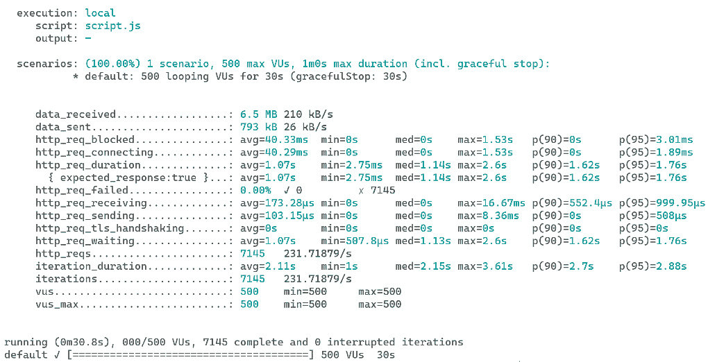
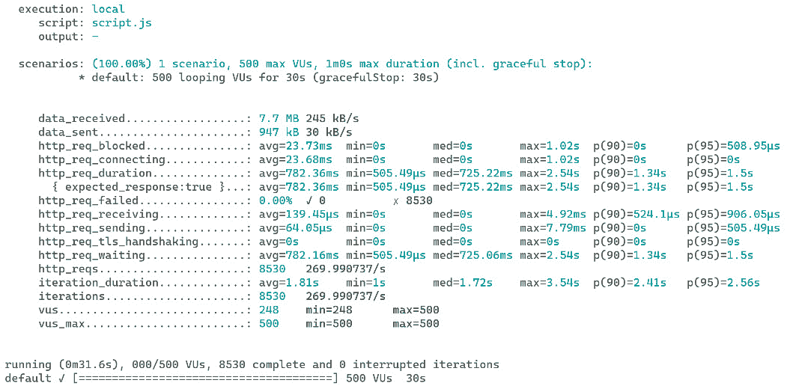

# 7

# ASP.NET Core 中的数据访问（第三部分：技巧）

在 *第六章* 中，我们学习了如何使用 EF Core Fluent API 管理实体之间的关系。我们介绍了三种类型的关系：一对一、一对多和多对多。我们还学习了如何在相关实体上执行 **CRUD** 操作。凭借我们从 *第六章* 中获得的知识，我们现在可以为大多数 Web API 应用程序构建一个简单的数据访问层。然而，还有一些场景我们需要妥善处理。例如，我们如何提高数据访问的性能？如果存在并发冲突，我们应该怎么做？

在本章中，我们将涵盖与 ASP.NET Core 数据访问相关的一些高级主题，包括 `DbContext` 连接池、性能优化、原始 SQL 查询和并发冲突。我们还将讨论一些技巧和窍门，这些技巧和窍门可以帮助您编写更好的代码。

我们将涵盖以下主题：

+   `DbContext` 连接池

+   跟踪与非跟踪查询

+   IQueryable 与 IEnumerable 的区别

+   客户端与服务器评估

+   原始 SQL 查询

+   批量操作

+   并发冲突

+   反向工程

+   其他 ORM 框架

阅读本章后，您将更深入地了解 EF Core，并能够在您的应用程序中更有效地使用它。您将学习如何使用无跟踪查询来提高查询性能，以及如何使用原始 SQL 查询来执行复杂查询。此外，您将了解如何使用批量操作来提高批量数据操作的性能。此外，您将能够处理大规模应用程序的并发冲突，并使用反向工程从现有数据库生成实体类和 `DbContext` 类。

# 技术要求

本章中的代码示例可以在 [`github.com/PacktPublishing/Web-API-Development-with-ASP.NET-Core-8`](https://github.com/PacktPublishing/Web-API-Development-with-ASP.NET-Core-8) 找到。您可以使用 VS 2022 或 VS Code 打开解决方案。

# 理解 DbContext 连接池

在上一章中，我们学习了如何使用 `AddDbContext()` 扩展方法将 `DbContext` 实例注册为 DI 容器中的作用域服务。默认情况下，为每个请求创建一个新的 `DbContext` 实例，这通常不是问题，因为它是一个轻量级对象，不消耗许多资源。然而，在高吞吐量应用程序中，为每个 `DbContext` 实例设置各种内部服务和对象的成本可能会累积。为了解决这个问题，EF Core 提供了一个名为 `DbContext` 实例重用的功能。

要启用`DbContext`池，您可以替换`AddDbContext()`方法为`AddDbContextPool()`方法。这将重置`DbContext`实例的当前状态，将其存储在池中，并在有新请求时重用。通过减少设置`DbContext`实例的成本，`DbContext`池可以显著提高您应用程序在高吞吐量场景下的性能。

您可以从本章 GitHub 仓库的`/samples/chapter7/EfCoreDemo`文件夹中找到本节的示例代码。

在`EfCoreDemo`项目中打开`Program.cs`文件。以下代码显示了如何启用`DbContext`池：

```cs
services.AddDbContextPool<InvoiceDbContext>(options =>{
    options.UseSqlServer(builder.Configuration.GetConnectionString("DefaultConnection"));
});
```

`AddDbContextPool()`方法接受一个`poolSize`参数，该参数指定可以存储在池中的最大`DbContext`实例数。默认值是`1024`，通常对大多数应用程序来说已经足够。如果池已满，EF Core 将根据需要开始创建新的`DbContext`实例。

为了验证`DbContext`池是否可以提高应用程序的性能，我们可以运行性能测试。**Grafana k6**是一个开源的负载测试工具，可以用来测试 Web API 的性能。要使用 k6，您需要在此处安装 NodeJS：[`nodejs.org/`](https://nodejs.org/)。然后您可以从[`k6.io/docs/get-started/installation/`](https://k6.io/docs/get-started/installation/)下载它。k6 为各种平台提供包，包括 Windows、Linux 和 macOS。在您的机器上安装 k6。

您可以在项目的`k6`文件夹中找到一个`script.js`文件。`script.js`文件是一个包含测试场景的 k6 脚本。以下代码显示了`script.js`文件的内容：

```cs
import http from 'k6/http';import { sleep } from 'k6';
export const options = {
    vus: 500,
    duration: '30s',
  };
export default function () {
  http.get('http://localhost:5249/api/Invoices?page=1&pageSize=10');
  sleep(1);
}
```

这是一个基本的 k6 测试脚本，运行一个 30 秒，500-VU 负载测试。在 30 秒内向`/api/Invoices?page=1&pageSize=10`端点发送`GET`请求。

首先，使用`AddDbContext()`方法注册`DbContext`，然后使用`dotnet run`命令运行应用程序。然后，打开一个新的终端并运行以下命令以启动 k6 测试：

```cs
k6 run script.js
```

接下来，使用`AddDbContextPool()`方法注册`DbContext`，并使用相同的 k6 脚本再次测试应用程序。你可以比较两次测试的结果，以查看`DbContext`池是否提高了应用程序的性能。例如，使用`AddDbContext()`方法的测试结果如下：



图 7.1 – 使用 AddDbContext()方法的测试结果

以下是用`AddDbContextPool`方法得到的结果：



图 7.2 – 使用 AddDbContextPool()方法的测试结果

当使用`AddDbContext()`时，平均请求时长为 1.07 秒，完成了 7,145 个请求，而使用`AddDbContextPool()`时，平均请求时长为 782.36 毫秒，完成了 8,530 个请求。结果显示，`DbContext`池化可以提高应用程序的性能。请注意，您的结果可能会根据您的机器配置而有所不同。此外，`dotnet run`命令用于以开发模式运行应用程序，这并不针对性能优化。因此，这个测试只是为了演示目的，并不能反映应用程序的真实性能。然而，它可以给您一个关于`DbContext`池化工作原理的直观理解。

重要提示

对于大多数应用程序来说，`DbContext`池化不是必需的。您应该只在有高吞吐量应用程序的情况下启用`DbContext`池化。因此，在启用`DbContext`池化之前，重要的是测试您的应用程序在启用和未启用池化时的性能，以查看是否有任何明显的改进。

总结来说，虽然`DbContext`池化可以提高高吞吐量应用程序的性能，但这并不是万能的解决方案。在决定是否启用`DbContext`池化之前，请务必评估您应用程序的具体需求。

# 理解跟踪查询与非跟踪查询的区别

在本节中，我们将讨论跟踪查询与非跟踪查询的区别。什么是跟踪查询和非跟踪查询？让我们从基础开始了解！

在.NET 的早期阶段，术语**SqlHelper**常用来指代一个提供一组方法来执行 SQL 查询的静态类。虽然 SqlHelper 简化了执行 SQL 查询的过程，但开发者仍然需要管理连接和事务对象，编写样板代码将结果映射到模型对象，并直接与数据库交互。

**ORM**框架，如 EF Core，是为了解决这些问题而创建的。它们不仅简化了执行 SQL 查询并将结果映射到模型对象的过程，还提供了跟踪查询返回的实体所做更改的能力。当更改被保存时，EF Core 会生成适当的 SQL 查询来更新数据库。这被称为跟踪，并且是使用 EF Core 等 ORM 框架的一个显著优势。

然而，跟踪是有代价的。这可能会增加开销和内存使用，尤其是在处理大量实体时。

我们在*第五章*中简要介绍了跟踪的相关内容。让我们来看一个跟踪的例子。您可以从本章 GitHub 仓库的`/samples/chapter7/EfCoreDemo`文件夹中找到本节示例代码。

在示例`EfCoreDemo`项目中，您可以在`InvoicesController`类中找到`GetInvoice`操作。以下代码展示了跟踪是如何工作的：

```cs
[HttpGet("{id}")]public async Task<ActionResult<Invoice>> GetInvoice(Guid id)
{
    if (context.Invoices == null)
    {
        return NotFound();
    }
    logger.LogInformation($"Invoice {id} is loading from the database.");
    var invoice = await context.Invoices.FindAsync(id);
    logger.LogInformation($"Invoice {invoice?.Id} is loaded from the database."
    logger.LogInformation($"Invoice {id} is loading from the context.");
    invoice = await context.Invoices.FindAsync(id);
    logger.LogInformation($"Invoice {invoice?.Id} is loaded from the context.")
    if (invoice == null)
    {
        return NotFound();
    }
    return invoice;
}
```

在前面的代码中，我们添加了一些日志语句来查看 EF Core 如何调用数据库。运行应用程序并调用 `GetInvoice` 动作。你将在控制台看到如下输出：

```cs
info: BasicEfCoreDemo.Controllers.InvoicesController[0]      Invoice e61436dd-0dac-4e8b-7d61-08dae88bb288 is loading from the database.
info: Microsoft.EntityFrameworkCore.Database.Command[20101]
      Executed DbCommand (30ms) [Parameters=[@__get_Item_0='?' (DbType = Guid)], CommandType='Text', CommandTimeout='30']
      SELECT TOP(1) [i].[Id], [i].[Amount], [i].[ContactName], [i].[Description], [i].[DueDate], [i].[InvoiceDate], [i].[InvoiceNumber], [i].[Status]
      FROM [Invoices] AS [i]
      WHERE [i].[Id] = @__get_Item_0
info: BasicEfCoreDemo.Controllers.InvoicesController[0]
      Invoice e61436dd-0dac-4e8b-7d61-08dae88bb288 is loaded from the database.
info: BasicEfCoreDemo.Controllers.InvoicesController[0]
      Invoice e61436dd-0dac-4e8b-7d61-08dae88bb288 is loading from the context.
info: BasicEfCoreDemo.Controllers.InvoicesController[0]
      Invoice e61436dd-0dac-4e8b-7d61-08dae88bb288 is loaded from the context.
```

当我们第一次调用 `context.Invoices.FindAsync(id)` 方法时，EF Core 将查询数据库并返回 `Invoice` 实体。第二次，EF Core 将从上下文中返回 `Invoice` 实体，因为 `Invoice` 实体已经存在于上下文中。

`Find()` 与 `Single()` 的比较

当我们通过其主键从数据库获取实体时，我们可以使用 `Find()` 或 `FindAsync()` 方法。我们还可以使用 `Single()` 或 `SingleOrDefault()` 方法。它们很相似，但并不相同。`Find()` 和 `FindAsync()` 方法是 `DbSet` 类的方法。如果具有给定主键值的实体被上下文跟踪，`Find()` 或 `FindAsync()` 方法将返回被跟踪的实体，而不会向数据库发出请求。否则，EF Core 将查询数据库以获取实体，将其附加到上下文，并返回它。但是，如果你使用 `Single()` 或 `SingleOrDefault()` 方法，EF Core 将始终查询数据库以获取实体。对于 `First()` 和 `FirstOrDefault()` 方法也是如此。因此，`Find()` 和 `FindAsync()` 方法在通过主键获取实体时更有效。但在罕见情况下，如果实体在加载到上下文后数据库中已更新，`Find()` 和 `FindAsync()` 可能会返回过时数据。例如，如果你使用批量更新 `ExecuteUpdateAsync()` 方法，更新将不会被 `DbContext` 跟踪。然后，如果你使用 `Find()` 或 `FindAsync()` 从 `DbContext` 获取实体，你将得到过时数据。在这种情况下，你应该使用 `Single()` 或 `SingleOrDefault()` 再次从数据库获取实体。在大多数情况下，当你确信实体始终被 `DbContext` 跟踪时，你可以使用 `Find()` 或 `FindAsync()` 方法通过主键获取实体。

实体具有以下 `EntityState` 值之一：`Detached`、`Added`、`Unchanged`、`Modified` 或 `Deleted`。我们介绍了 `EntityState` 枚举在 *第五章*。以下是如何改变状态：

+   查询返回的所有实体（例如 `Find()`、`Single()`、`First()`、`ToList()` 以及它们的 `async` 重载）都处于 `Unchanged` 状态。

+   如果你更新实体的属性，EF Core 将状态更改为 `Modified`。

+   如果你在一个实体上调用 `Remove()` 方法，EF Core 将状态更改为 `Deleted`。

+   如果你在一个实体上调用 `Add()` 方法，EF Core 将状态更改为 `Added`。

+   如果你在一个未跟踪的实体上调用 `Attach()` 方法，EF Core 将跟踪该实体并将状态设置为 `Unchanged`。

+   如果你在一个被跟踪的实体上调用 `Detach()` 方法，EF Core 将不会跟踪该实体，并将状态更改为 `Detached`。

注意，EF Core 可以在属性级别跟踪更改，这意味着如果你更新一个实体的属性，EF Core 只有在你调用 `SaveChanges` 方法时才会更新该属性。

要获取实体的 `EntityEntry` 对象，我们可以使用 `Entry()` 方法，它包含实体的状态和已更改的属性。请使用位于 `/samples/chapter7/EfCoreDemo` 文件夹中的 `EfCoreDemo` 示例项目。你可以在 `InvoicesController` 类中找到 `PutInvoice` 动作：

```cs
context.Entry(invoice).State = EntityState.Modified;await context.SaveChangesAsync();
```

在前面的代码片段中，我们使用 `Entry()` 方法获取了 `Invoice` 实体的 `EntityEntry` 对象，并将其状态设置为 `Modified`。当调用 `SaveChanges()` 时，EF Core 将更改持久化到数据库。

默认情况下，EF Core 启用跟踪。但是，可能存在你不想让 EF Core 跟踪实体更改的场景。例如，在 `Get` 动作中的只读查询内，`DbContext` 只存在于请求期间，跟踪是不必要的。禁用跟踪可以提高性能并节省内存。如果你不打算修改实体，你应该通过在查询上调用 `AsNoTracking()` 方法来禁用跟踪。以下是一个示例：

```cs
// To get the invoice without trackingvar invoice = await context.Invoices.AsNoTracking().FirstOrDefaultAsync(x => x.Id == id);
// To return a list of invoices without tracking
var invoices = await context.Invoices.AsNoTracking().ToListAsync();
```

如果你有很多只读查询，并且觉得每次都调用 `AsNoTracking()` 方法很麻烦，你可以在配置 `DbContext` 时全局禁用跟踪。以下代码显示了如何进行此操作：

```cs
protected override void OnConfiguring(DbContextOptionsBuilder optionsBuilder){
    base.OnConfiguring(optionsBuilder);
    optionsBuilder.UseQueryTrackingBehavior(QueryTrackingBehavior.NoTracking);
}
```

对于你想要跟踪的任何其他查询，你可以在查询上调用 `AsTracking()` 方法，如下面的代码所示：

```cs
// To get the invoice with trackingvar invoice = await context.Invoices.AsTracking().FirstOrDefaultAsync(x => x.Id == id);
// To return a list of invoices with tracking
var invoices = await context.Invoices.AsTracking().ToListAsync();
```

在前面的代码中，我们显式调用 `AsTracking()` 方法来启用查询的跟踪，这样我们就可以更新实体并将更改保存到数据库中。

重要提示

如果一个实体是无键实体，EF Core 将永远不会跟踪它。无键实体类型上没有定义键。它们通过 `[Keyless]` 数据注释或 Fluent API 的 `HasNoKey()` 方法进行配置。无键实体通常用于只读查询或视图。我们不会在本书中详细讨论无键实体。有关更多信息，请参阅官方文档[`learn.microsoft.com/en-us/ef/core/modeling/keyless-entity-types`](https://learn.microsoft.com/en-us/ef/core/modeling/keyless-entity-types)。

使用无跟踪查询是提高只读场景性能的好方法。然而，请注意，如果你禁用跟踪，当你调用 `SaveChanges()` 方法时将无法更新实体，因为 EF Core 无法检测未跟踪实体的更改。因此，在实施之前考虑使用无跟踪查询的后果是很重要的。

除了非跟踪查询之外，还有其他因素会影响 EF Core 中数据查询的性能。我们将在下一节探讨 `IQueryable` 和 `IEnumerable` 之间的差异以及它们如何影响查询性能。

# 理解 IQueryable 和 IEnumerable 之间的区别

在使用 EF Core 时，你有两个接口可用于查询数据库：`IQueryable` 和 `IEnumerable`。尽管这些接口乍一看可能很相似，但它们之间的重要区别可能会影响应用程序的性能。在本节中，我们将讨论 `IQueryable` 和 `IEnumerable` 之间的区别，它们的工作方式以及何时使用每个接口。

你可能熟悉 `IEnumerable` 接口。`IEnumerable` 接口是一个标准的 .NET 接口，用于表示对象的集合。它用于遍历集合。许多 .NET 集合实现了 `IEnumerable` 接口，例如 `List`、`Array`、`Dictionary` 等。`IEnumerable` 接口有一个名为 `GetEnumerator` 的单一方法，它返回一个 `IEnumerator` 对象。`IEnumerator` 对象用于遍历集合。

`IQueryable` 和 `IEnumerable` 之间的第一个区别是，`IQueryable` 位于 `System.Linq` 命名空间中，而 `IEnumerable` 位于 `System.Collections` 命名空间中。`IQueryable` 接口继承自 `IEnumerable` 接口，因此 `IQueryable` 可以做 `IEnumerable` 能做的所有事情。但为什么我们需要 `IQueryable` 接口呢？

`IQueryable` 和 `IEnumerable` 之间的一个关键区别在于，`IQueryable` 用于从特定的数据源查询数据，例如数据库。`IEnumerable` 用于在内存中遍历集合。当我们使用 `IQueryable` 时，查询将被转换成特定的查询语言，例如 SQL，并在我们调用 `ToList()`（或 `ToAway()`）方法或遍历集合中的项时，针对数据源执行以获取结果。

从章节的 GitHub 仓库 `/samples/chapter7/EfCoreDemo` 文件夹中下载示例代码。你可以在 `InvoicesController` 类中找到一个 `GetInvoices` 动作。

首先，让我们使用 `IQueryable` 接口查询数据库：

```cs
// Use IQueryablelogger.LogInformation($"Creating the IQueryable...");
var list1 = context.Invoices.Where(x => status == null || x.Status == status);
logger.LogInformation($"IQueryable created");
logger.LogInformation($"Query the result using IQueryable...");
var query1 = list1.OrderByDescending(x => x.InvoiceDate)
    .Skip((page - 1) * pageSize)
    .Take(pageSize);
logger.LogInformation($"Execute the query using IQueryable");
var result1 = await query1.ToListAsync();
logger.LogInformation($"Result created using IQueryable");
```

在前面的代码中，`context.Invoices` 是一个实现 `IQueryable` 接口的 `DbSet<TEntity>` 对象。`Where()` 方法用于按状态过滤发票，并返回一个 `IQueryable` 对象。然后，我们使用其他一些方法对发票进行排序和分页。当我们调用 `ToListAsync()` 方法时，查询将被转换成 SQL 查询并在数据库上执行以获取结果。日志显示了代码的执行顺序：

```cs
info: BasicEfCoreDemo.Controllers.InvoicesController[0]      Creating the IQueryable...
info: BasicEfCoreDemo.Controllers.InvoicesController[0]
      IQueryable created
info: BasicEfCoreDemo.Controllers.InvoicesController[0]
      Query the result using IQueryable...
info: BasicEfCoreDemo.Controllers.InvoicesController[0]
      Execute the query using IQueryable
info: Microsoft.EntityFrameworkCore.Database.Command[20101]
      Executed DbCommand (49ms) [Parameters=[@__p_0='?' (DbType = Int32), @__p_1='?' (DbType = Int32)], CommandType='Text', CommandTimeout='30']
      SELECT [i].[Id], [i].[Amount], [i].[ContactName], [i].[Description], [i].[DueDate], [i].[InvoiceDate], [i].[InvoiceNumber], [i].[Status]
      FROM [Invoices] AS [i]
      ORDER BY [i].[InvoiceDate] DESC
      OFFSET @__p_0 ROWS FETCH NEXT @__p_1 ROWS ONLY
info: BasicEfCoreDemo.Controllers.InvoicesController[0]
      Result created using IQueryable
```

从日志中我们可以看到，当我们调用 `ToListAsync()` 方法时，查询将在数据库上执行。查询包含 `ORDER BY`、`OFFSET` 和 `FETCH NEXT` 子句，这意味着查询是在数据库服务器上执行的。

接下来，让我们使用 `IEnumerable` 接口查询数据库：

```cs
// Use IEnumerablelogger.LogInformation($"Creating the IEnumerable...");
var list2 = context.Invoices.Where(x => status == null || x.Status == status).AsEnumerable();
logger.LogInformation($"IEnumerable created");
logger.LogInformation($"Query the result using IEnumerable...");
var query2 = list2.OrderByDescending(x => x.InvoiceDate)
    .Skip((page - 1) * pageSize)
    .Take(pageSize);
logger.LogInformation($"Execute the query using IEnumerable");
var result2 = query2.ToList();
logger.LogInformation($"Result created using IEnumerable");
```

在前面的代码中，我们使用 `AsEnumerable()` 方法将 `IQueryable` 对象转换为 `IEnumerable` 对象。然后，我们对发票进行排序和分页，并调用 `ToList()` 方法以获取结果。日志显示了代码的执行顺序：

```cs
info: BasicEfCoreDemo.Controllers.InvoicesController[0]      Creating the IEnumerable...
info: BasicEfCoreDemo.Controllers.InvoicesController[0]
      IEnumerable created
info: BasicEfCoreDemo.Controllers.InvoicesController[0]
      Query the result  using IEnumerable...
info: BasicEfCoreDemo.Controllers.InvoicesController[0]
      Execute the query using IEnumerable
info: Microsoft.EntityFrameworkCore.Database.Command[20101]
      Executed DbCommand (5ms) [Parameters=[], CommandType='Text', CommandTimeout='30']
      SELECT [i].[Id], [i].[Amount], [i].[ContactName], [i].[Description], [i].[DueDate], [i].[InvoiceDate], [i].[InvoiceNumber], [i].[Status]
      FROM [Invoices] AS [i]
info: BasicEfCoreDemo.Controllers.InvoicesController[0]
      Result created using IEnumerable
```

看看日志。生成的 SQL 查询不包含 `ORDER BY`、`OFFSET` 和 `FETCH NEXT` 子句，这意味着查询从数据库中检索了所有发票，然后在内存中对发票进行过滤、排序和分页。如果我们数据库中有大量实体，第二个查询将非常慢且效率低下。

现在，我们可以看到两个接口之间的区别。`IQueryable` 接口是一个延迟执行查询，这意味着当我们向查询添加更多条件时，查询不会执行。当调用 `ToList()` 或 `ToArray()` 方法或遍历集合中的项时，查询将对数据库执行。因此，在复杂和重量级的查询中，我们应该始终使用 `IQueryable` 接口以避免从数据库中检索所有数据。在调用 `ToList()` 或 `ToArray()` 方法时要小心，因为 `ToList()` 或 `ToArray()`（及其 `async` 重载）将立即执行查询。

哪些 LINQ 方法会导致查询立即执行？

有一些操作会导致查询立即执行：

+   使用 `for` 或 `foreach` 循环遍历集合中的项

+   使用 `ToList()`、`ToArray()`、`Single()`、`SingleOrDefault()`、`First()`、`FirstOrDefault()` 或 `Count()` 方法，或这些方法的 `async` 重载

在本节中，我们探讨了 `IQueryable` 和 `IEnumerable` 之间的区别。了解为什么在查询数据库的复杂和重量级查询时应该使用 `IQueryable` 而不是 `IEnumerable` 非常重要。如果数据库中有大量实体，从数据库中加载数据可能会导致性能问题。

接下来，我们将讨论另一个可能影响性能的因素：客户端评估。

# 客户端评估与服务器评估

在本节中，我们将讨论客户端评估和服务器评估之间的区别。在 EF Core 的旧版本（早于 EF Core 3.0）中，对具有客户端评估的 LINQ 查询的错误使用可能导致严重的性能问题。让我们看看客户端评估和服务器评估是什么。

当我们使用 EF Core 从数据库查询数据时，我们只需编写 LINQ 查询，EF Core 将 LINQ 查询转换为 SQL 查询并在数据库上执行它们。然而，有时 LINQ 操作必须在客户端执行。检查 `InvoicesController` 类中的 `SearchInvoices` 动作方法中的以下代码：

```cs
var list = await context.Invoices    .Where(x => x.ContactName.Contains(search) || x.InvoiceNumber.Contains(search))
    .ToListAsync();
```

当我们使用 `Contains()` 方法时，EF Core 可以将 LINQ 查询转换为以下 SQL 查询：

```cs
info: Microsoft.EntityFrameworkCore.Database.Command[20101]      Executed DbCommand (4ms) [Parameters=[@__search_0='?' (Size = 32), @__search_0_1='?' (Size = 32) (DbType = AnsiString)], CommandType='Text', CommandTimeout='30']
      SELECT [i].[Id], [i].[Amount], [i].[ContactName], [i].[Description], [i].[DueDate], [i].[InvoiceDate], [i].[InvoiceNumber], [i].[Status]
      FROM [Invoices] AS [i]
      WHERE (@__search_0 LIKE N'') OR CHARINDEX(@__search_0, [i].[ContactName]) > 0 OR (@__search_0_1 LIKE '') OR CHARINDEX(@__search_0, [i].[InvoiceNumber]) > 0
```

你可以看到 SQL 查询使用了某些原生 SQL 函数来过滤数据，这意味着 SQL 查询是在数据库服务器上执行的。这被称为**服务器评估**。EF Core 尽可能多地尝试运行服务器评估。

现在，假设我们想要返回每个发票的 GST 税额。我们可以将实体转换为新对象，并包含 GST 税额。当然，更好的方法是向`Invoice`实体中添加一个表示税的属性。以下是如何做到这一点的演示。

添加一个用于计算 GST 税额的`static`方法：

```cs
private static decimal CalculateTax(decimal amount){
    return amount * 0.15m;
}
```

按照以下方式更新代码：

```cs
var list = await context.Invoices    .Where(x => x.ContactName.Contains(search) || x.InvoiceNumber.Contains(search))
    .Select(x => new Invoice
    {
        Id = x.Id,
        InvoiceNumber = x.InvoiceNumber,
        ContactName = x.ContactName,
        Description = $"Tax: ${CalculateTax(x.Amount)}. {x.Description}",
        Amount = x.Amount,
        InvoiceDate = x.InvoiceDate,
        DueDate = x.DueDate,
        Status = x.Status
    })
    .ToListAsync();
```

我们通过添加 GST 税计算更新了`Description`属性。当我们运行应用程序并调用端点时，我们将看到生成的 SQL 查询与之前的查询相同。但`Description`属性在结果中已被更新。这意味着转换是在客户端完成的。这被称为**客户端评估**。

这种客户端评估是可以接受的，因为查询确实需要从数据库中获取数据。成本非常低。然而，它可能对某些查询造成问题。例如，我们想要查询 GST 税额大于$10 的发票。按照以下方式更新代码：

```cs
var list = await context.Invoices    .Where(x => (x.ContactName.Contains(search) || x.InvoiceNumber.Contains(search)) && CalculateTax(x.Amount) > 10)
    .ToListAsync();
```

当我们调用端点时，我们将看到以下错误：

```cs
fail: Microsoft.AspNetCore.Diagnostics.DeveloperExceptionPageMiddleware[1]      An unhandled exception has occurred while executing the request.
      System.InvalidOperationException: The LINQ expression 'DbSet<Invoice>()
          .Where(i => i.ContactName.Contains(__search_0) || i.InvoiceNumber.Contains(__search_0) && InvoicesController.CalculateTax(i.Amount) > 10)' could not be translated. Additional information: Translation of method 'BasicEfCoreDemo.Controllers.InvoicesController.CalculateTax' failed. If this method can be mapped to your custom function, see https://go.microsoft.com/fwlink/?linkid=2132413 for more information. Either rewrite the query in a form that can be translated, or switch to client evaluation explicitly by inserting a call to 'AsEnumerable', 'AsAsyncEnumerable', 'ToList', or 'ToListAsync'. See https://go.microsoft.com/fwlink/?linkid=2101038 for more information.
```

错误信息非常明确。这是因为`CalculateTax()`方法不受 EF Core 支持。在 EF Core 的旧版本（早于 EF Core 3.0）中，EF Core 将从数据库中获取所有数据，然后在内存中过滤数据。这可能导致性能问题。在 EF Core 3.0 之后，如果查询无法正确转换，EF Core 将抛出异常，以避免潜在的性能问题。

但如果你确定客户端评估是安全的，例如在处理小数据量时，你可以显式使用`AsEnumerable()`方法（或`AsAsyncEnumerable()`、`ToList()`或`ToListAsync()`）来强制 EF Core 获取所有数据，然后在客户端执行查询。确保你知道你在做什么。

为什么`CalculateTax()`方法必须是静态的？

由于查询编译的成本很高，EF Core 会缓存编译后的查询。如果`CalculateTax()`方法不是静态的，EF Core 将需要通过`CalculateTax()`实例方法维护对`InvoicesController`的常量表达式的引用，这可能导致内存泄漏。为了防止这种情况，EF Core 如果`CalculateTax()`方法不是静态的，将抛出异常。将方法设置为静态将确保 EF Core 不会捕获实例中的常量。

EF Core 的最新版本提供了防止由客户端评估引起的潜在性能问题的好处。如果你遇到与之前类似的异常，你可以检查查询以确保它正在被正确转换。

接下来，我们将讨论如何在 EF Core 中使用原始 SQL 查询。在某些场景下，我们需要编写原始 SQL 查询来执行复杂查询。

# 使用原始 SQL 查询

虽然 EF Core 可以将大多数 LINQ 查询转换为 SQL 查询，这非常方便，但有时如果所需的查询无法用 LINQ 编写，或者生成的 SQL 查询效率不高，我们需要编写原始 SQL 查询。在本节中，我们将探讨如何在 EF Core 中使用原始 SQL 查询。

EF Core 提供了几个方法来执行原始 SQL 查询：

+   `FromSql()`

+   `FromSqlRaw()`

+   `SqlQuery()`

+   `SqlQueryRaw()`

+   `ExecuteSql()`

+   `ExecuteSqlRaw()`

当我们执行原始 SQL 查询时，我们必须小心避免 SQL 注入攻击。让我们看看何时应该使用原始 SQL 查询以及如何正确使用它们。您可以从章节的 GitHub 仓库中的 `/samples/chapter7/EfCoreDemo` 文件夹下载示例代码。

## FromSql() 和 FromSqlRaw()

我们可以使用 `FromSql()` 方法根据一个插值字符串创建一个 LINQ 查询。`FromSql()` 方法在 EF Core 7.0 及更高版本中可用。在旧版本中有一个类似的方法称为 `FromSqlInterpolated()`。

要执行原始 SQL 查询，我们只需将插值字符串传递给 `FromSql()` 方法，如下所示：

```cs
var list = await context.Invoices    .FromSql($"SELECT * FROM Invoices WHERE Status = 2")
    .ToListAsync();
```

我们还可以向原始 SQL 查询传递参数。例如，我们想要查询具有特定状态的发票：

```cs
[HttpGet][Route("status")]
public async Task<ActionResult<IEnumerable<Invoice>>> GetInvoices(string status)
{
    // Omitted for brevity
    var list = await context.Invoices
        .FromSql($"SELECT * FROM Invoices WHERE Status = {status}")
        .ToListAsync();
    return list;
}
```

等等，直接将字符串插入 SQL 查询是否安全？如果 `status` 参数是 `'; DROP TABLE Invoices; --`，会发生什么？它会导致 SQL 注入攻击吗？

这是一个好问题。让我们看看 EF Core 如何处理参数。运行应用程序并调用 `/api/invoices/status?status=AwaitPayment` 端点。我们将看到生成的 SQL 查询如下：

```cs
info: Microsoft.EntityFrameworkCore.Database.Command[20101]      Executed DbCommand (41ms) [Parameters=[p0='?' (Size = 4000)], CommandType='Text', CommandTimeout='30']
      SELECT * FROM Invoices WHERE Status = @p0
```

参数不是直接插入到 SQL 查询中。相反，EF Core 使用 `@p0` 参数占位符并将参数值传递到 SQL 查询中。这被称为参数化查询。使用参数化查询来避免 SQL 注入攻击是安全的。因此，我们不需要担心 `FromSql` 方法的安全性。

为什么 FromSql() 是安全的

`FromSql()` 方法期望一个参数作为 `FormattableString` 类型。因此，必须使用 `$` 前缀来使用插值字符串语法。语法看起来像常规的 C# 字符串插值，但它不是同一回事。`FormattableString` 类型可以包含插值参数占位符。插值参数值将自动转换为 `DbParameter` 类型。因此，使用 `FromSql()` 方法来避免 SQL 注入攻击是安全的。

对于某些场景，我们可能需要构建动态 SQL 查询。例如，我们想要根据用户输入查询发票，该输入指定了属性名称和属性值。在这种情况下，我们不能使用 `FromSql`，因为不允许对列名进行参数化。我们需要使用 `FromSqlRaw`。然而，我们必须小心避免 SQL 注入攻击。确保 SQL 查询安全是开发者的责任。以下是一个示例：

```cs
[HttpGet][Route("free-search")]
public async Task<ActionResult<IEnumerable<Invoice>>> GetInvoices(string propertyName, string propertyValue)
{
    if (context.Invoices == null)
    {
        return NotFound();
    }
    // Do something to sanitize the propertyName value
    var value = new SqlParameter("value", propertyValue);
    var list = await context.Invoices
        .FromSqlRaw($"SELECT * FROM Invoices WHERE {propertyName} = @value", value)
        .ToListAsync();
    return list;
}
```

在前面的例子中，列名没有被参数化。因此，我们必须小心避免 SQL 注入攻击。需要清理 `propertyName` 的值以确保其安全性。也许你可以检查该值是否包含任何特殊字符，例如 `;`、`--` 等。如果值包含任何特殊字符，你可以在执行 SQL 查询之前抛出异常或删除这些特殊字符。此外，如果你允许用户指定列名，这将增加验证列名的努力，因为你需要检查该列名是否存在于数据库中或该列是否有正确的索引。确保你知道你在做什么。

`propertyValue` 是参数化的，因此使用它是安全的。

在使用 `FromSql()` 构建了 SQL 查询之后，你可以然后应用 LINQ 查询运算符来过滤数据，正如你想要的。记住，使用 `FromSql()` 比使用 `FromSqlRaw()` 更好。

当我们使用 `FromSql()` 或 `FromSqlRaw()` 方法时，请记住有一些限制：

+   SQL 查询返回的数据必须包含实体的所有属性，否则 EF Core 无法将数据映射到实体。

+   SQL 查询返回的列名必须与实体属性映射到的列名匹配。

+   SQL 查询只能查询一个表。如果你需要查询多个表，你可以先构建原始查询，然后使用 `Include()` 方法包含相关实体。

## SqlQuery() 和 SqlQueryRaw()

当我们想使用原始 SQL 查询从数据库中查询实体时，`FromSql()` 方法很有用。在某些情况下，我们想执行原始 SQL 查询并返回标量值或非实体类型。例如，我们想查询具有特定状态的发票的 ID。我们可以使用 `SqlQuery()` 方法执行原始 SQL 查询并返回 ID 列表。以下是一个示例：

```cs
[HttpGet][Route("ids")]
public ActionResult<IEnumerable<Guid>> GetInvoicesIds(string status)
{
    var result = context.Database
        .SqlQuery<Guid>($"SELECT Id FROM Invoices WHERE Status = {status}")
        .ToList();
    return result;
}
```

翻译后的 SQL 查询如下：

```cs
info: Microsoft.EntityFrameworkCore.Database.Command[20101]      Executed DbCommand (22ms) [Parameters=[p0='?' (Size = 4000)], CommandType='Text', CommandTimeout='30']
      SELECT Id FROM Invoices WHERE Status = @p0
```

注意，`SqlQuery()` 方法是在 `DbContext` 对象的 `Database` 属性上使用的。它不可在 `DbSet` 对象上使用。

`SqlQueryRaw()` 方法与 `SqlQuery()` 方法类似，但它允许我们构建类似于 `FromSqlRaw()` 方法的动态 SQL 查询。同样，你必须承担责任以避免 SQL 注入攻击。

## ExecuteSql() 和 ExecuteSqlRaw()

对于某些不需要返回值的情况，我们可以使用 `ExecuteSql` 方法来执行原始 SQL 查询。通常，它用于更新或删除数据或调用 `ExecuteSql()` 方法来执行原始 SQL 查询。以下是一个示例：

```cs
[HttpDelete][Route("status")]
public async Task<ActionResult> DeleteInvoices(string status)
{
    var result = await context.Database
        .ExecuteSqlAsync($"DELETE FROM Invoices WHERE Status = {status}");
    return Ok();
}
```

这样做，我们不需要从数据库中加载实体然后逐个删除。使用 `ExecuteSql()` 方法执行原始 SQL 查询要高效得多。

`ExecuteSqlRaw()` 方法与 `ExecuteSql()` 方法类似，但它允许我们构建类似于 `FromSqlRaw()` 方法的动态 SQL 查询。同样，您必须非常小心地清理 SQL 查询以避免 SQL 注入攻击。

在本节中，我们介绍了如何在 EF Core 中使用原始 SQL 查询。我们讨论了 `FromSql()` 和 `FromSqlRaw()`、`SqlQuery()` 和 `SqlQueryRaw()`、`ExecuteSql()` 和 `ExecuteSqlRaw()` 之间的区别。我们还讨论了这些方法的局限性。再次强调，当我们使用原始 SQL 查询时，必须非常小心以避免 SQL 注入攻击。

在本节的一个示例中，我们向您展示了如何运行原始 SQL 查询来删除一组实体。EF Core 7.0 引入了一个批量操作功能，可以使这个过程更容易。现在有两个新的批量操作方法可用，即 `ExecuteUpdate()` 和 `ExecuteDelete()`，它们提供了一种更有效的方式来更新或删除数据。在接下来的部分中，我们将更详细地讨论这个功能。

# 使用批量操作

在本节中，我们将探讨如何有效地使用 EF Core 更新/删除数据。EF Core 7.0 或更高版本提供了批量操作的能力，这些操作易于使用，可以提高更新/删除操作的性能。为了利用这个功能，请确保您正在使用 EF Core 的最新版本。

正如我们在上一节中提到的，EF Core 跟踪实体的变化。要更新一个实体，通常情况下，我们需要从数据库中加载实体，更新实体属性，然后调用 `SaveChanges()` 方法将更改保存到数据库。这是一个非常常见的场景。删除实体的情况类似。然而，如果我们想要更新或删除大量实体，逐个加载实体并更新或删除它们并不高效。对于这些场景，不需要跟踪实体的变化。因此，使用批量操作功能来更新或删除数据会更好。

我们可以使用原始 SQL 查询通过 `ExecuteSql()` 方法来更新或删除数据。然而，它缺乏强类型支持。在 SQL 查询中硬编码列名不是一种好的做法。从 EF Core 7.0 开始，我们可以使用 `ExecuteUpdate()` 和 `ExecuteDelete()` 方法来更新或删除数据。请注意，这两个方法不涉及实体跟踪功能。因此，一旦您调用这两个方法，更改将立即执行。不需要调用 `SaveChanges()` 方法。

接下来，让我们看看如何使用这两个方法。我们将向您展示如何使用 `ExecuteUpdate()` 方法以及生成的 SQL 查询。`ExecuteDelete()` 方法类似。示例代码位于章节的 GitHub 仓库 `/samples/chapter7/EfCoreDemo` 文件夹中。

## ExecuteUpdate()

`ExecuteUpdate()` 方法用于在不从数据库加载实体的情况下更新数据。您可以通过添加 `Where()` 子句来更新一个或多个实体。

例如，我们想要更新在特定日期之前创建的发票的状态。代码如下：

```cs
[HttpPut][Route("status/overdue")]
public async Task<ActionResult> UpdateInvoicesStatusAsOverdue(DateTime date)
{
    var result = await context.Invoices
        .Where(i => i.InvoiceDate < date && i.Status == InvoiceStatus.AwaitPayment)
        .ExecuteUpdateAsync(s => s.SetProperty(x => x.Status, InvoiceStatus.Overdue));
    return Ok();
}
```

生成的 SQL 查询如下：

```cs
info: Microsoft.EntityFrameworkCore.Database.Command[20101]      Executed DbCommand (46ms) [Parameters=[@__p_0='?' (DbType = DateTimeOffset)], CommandType='Text', CommandTimeout='30']
      UPDATE [i]
      SET [i].[Status] = 'Overdue'
      FROM [Invoices] AS [i]
      WHERE [i].[InvoiceDate] < @__p_0 AND [i].[Status] = 'AwaitPayment'
```

此查询可以同时更新多个发票。它确实受益于强大的类型支持，但效率与原始 SQL 查询相同。如果您需要更新多个属性，可以使用 `SetProperty()` 方法多次，如下面的代码所示：

```cs
var result = await context.Invoices        .Where(i => i.InvoiceDate < date && i.Status == InvoiceStatus.AwaitPayment)
        .ExecuteUpdateAsync(s =>
            s.SetProperty(x => x.Status, InvoiceStatus.Overdue)
            .SetProperty(x => x.LastUpdatedDate, DateTime.Now));
```

此外，`Where()` 子句可以引用其他实体。因此，始终推荐使用 `ExecuteUpdate()` 方法来更新多个实体，而不是使用原始 SQL 查询。

## `ExecuteDelete()`

同样，我们可以使用 `ExecuteDelete()` 方法来删除数据，而无需从数据库中加载实体。此方法可以通过添加 `Where` 子句来删除一个或多个实体。例如，我们想要删除在特定日期之前创建的发票。代码如下：

```cs
await context.Invoices.Where(x => x.InvoiceDate < date).ExecuteDeleteAsync();
```

再次强调，这些批量操作不会跟踪实体的变化。如果一个 `DbContext` 实例已经加载了实体，在批量更新或删除之后，上下文中的实体仍然会保留旧值。因此，在使用这些批量操作时要格外小心。

在本节中，我们讨论了如何在 EF Core 中使用批量操作功能。我们介绍了 `ExecuteUpdate()` 和 `ExecuteDelete()` 方法，这些方法可以用来更新或删除数据，而无需从数据库中加载实体。与原始 SQL 查询相比，这两种方法具有强大的类型支持。建议使用这两种方法来更新或删除多个实体。

接下来，我们将学习如何在更新数据时管理并发冲突。

# 理解并发冲突

一个 API 端点可以同时被多个客户端调用。如果端点更新数据，数据可能在当前客户端完成更新之前被另一个客户端更新。当同一实体被多个客户端更新时，可能会引起并发冲突，这可能导致数据丢失或不一致，甚至可能造成数据损坏。在本节中，我们将讨论如何在 EF Core 中处理并发冲突。您可以从章节的 GitHub 仓库 `/samples/chapter7/ConcurrencyConflictDemo` 文件夹中下载示例项目 `ConcurrencyConflictDemo`。

处理并发冲突有两种方式：

+   **悲观并发控制**：这种方法使用数据库锁来防止多个客户端同时更新同一实体。当客户端尝试更新一个实体时，它将首先对该实体获取一个锁。如果锁获取成功，则只有这个客户端可以更新实体，而所有其他客户端将无法更新该实体，直到锁被释放。然而，当并发客户端数量较多时，这种方法可能会导致性能问题，因为管理锁的成本很高。EF Core 不支持内置的悲观并发控制。

+   **乐观并发控制**：这种方法不涉及锁；相反，使用版本列来检测并发冲突。当客户端尝试更新一个实体时，它将首先获取版本列的值，然后在更新实体时将其与旧值进行比较。如果版本列的值与旧值相同，这意味着没有其他客户端已更新该实体。在这种情况下，客户端可以更新实体。但如果版本列的值与旧值不同，这意味着另一个客户端已更新该实体。在这种情况下，EF Core 将抛出一个异常来指示并发冲突。然后客户端可以处理异常并重试更新操作。

让我们看看并发冲突的一个例子。在`ConcurrencyConflictDemo`项目中，我们有一个具有`Inventory`属性的`Product`实体，该属性用于存储库存中的产品数量。我们想要创建一个 API 端点来销售产品。当客户端调用此端点时，它将传递产品 ID 和要销售的产品数量。端点将更新`Inventory`属性，减去要销售的产品数量。逻辑如下：

+   客户端调用 API 端点来销售产品。

+   应用程序从数据库中获取产品。

+   应用程序检查`Inventory`属性以确保库存中的产品数量足以销售：

    +   如果库存中的产品数量足够，应用程序将从`Inventory`属性中减去正在销售的产品数量，然后调用`SaveChanges()`方法将更改保存到数据库。

    +   如果库存中的产品数量不足，应用程序将向客户端返回错误信息。

重要提示

示例项目使用以下代码在`Program.cs`文件中启动应用程序时重置数据库：

`dbContext.Database.EnsureDeleted();`

`dbContext.Database.EnsureCreated();`

因此，当你运行应用程序时，数据库将被重置，产品 1 的`Inventory`属性将被设置为`15`。

以下代码显示了 API 端点的实现的第一版本：

```cs
[HttpPost("{id}/sell/{quantity}")]public async Task<ActionResult<Product>> SellProduct(int id, int quantity)
{
    if (context.Products == null)
    {
        return Problem("Entity set 'SampleDbContext.Products' is null.");
    }
    var product = await context.Products.FindAsync(id);
    if (product == null)
    {
        return NotFound();
    }
    if (product.Inventory < quantity)
    {
        return Problem("Not enough inventory.");
    }
    product.Inventory -= quantity;
    await context.SaveChangesAsync();
    return product;
}
```

应该还有一些其他逻辑来处理订单创建和支付等操作。我们在这里不会讨论这些；相反，我们将专注于由产品库存更新引起的并发冲突：

1.  为了模拟这种并发场景，我们可以在保存更改到数据库之前传递一个`delay`参数来添加延迟。以下代码显示了如何添加延迟：

    ```cs
    [HttpPost("{id}/sell/{quantity}")]public async Task<ActionResult<Product>> SellProduct(int id, int quantity, int delay = 0){    // Omitted code for brevity    await Task.Delay(TimeSpan.FromSeconds(delay));    product.Inventory -= quantity;    await context.SaveChangesAsync();    return product;}
    ```

1.  现在，让我们尝试在短时间内两次调用 API 端点。第一次`POST`请求将传递一个值为`2`秒的`delay`参数：

    ```cs
    http://localhost:5273/api/Products/1/sell/10?delay=2
    ```

    第二次`POST`请求将传递一个值为`3`秒的`delay`参数：

    ```cs
    http://localhost:5273/api/Products/1/sell/10?delay=3
    ```

1.  先发送第一个请求，然后隔`2`秒发送第二个请求。预期结果是第一个请求成功，第二个请求失败。但实际上，两个请求都成功了。响应显示产品的`Inventory`属性已更新为`5`，这是不正确的。`Inventory`属性的初始值是`15`，而我们卖出了 20 个产品，那么`Inventory`属性怎么会被更新为`5`呢？

让我们看看应用中会发生什么：

1.  客户端 A 调用 API 端点来销售产品，并希望销售 10 个产品。

1.  客户端 A 检查`Inventory`属性，发现库存中的产品数量为 15，这足以销售。

1.  几乎同时，客户端 B 调用 API 端点来销售产品，并希望销售 10 个产品。

1.  客户端 B 检查`Inventory`属性，发现库存中的产品数量为 15，因为客户端 A 尚未更新`Inventory`属性。

1.  客户端 A 从`Inventory`属性中减去 10，结果值为`5`，并将更改保存到数据库中。现在，库存中的产品数量为`5`。

1.  客户端 B 也从`Inventory`属性中减去 10 并保存更改到数据库。问题是客户端 A 已经将库存数量更新为`5`，但客户端 B 并不知道这一点。因此，客户端 B 也将`Inventory`属性更新为`5`，这是不正确的。

这是一个并发冲突的例子。多个客户端试图同时更新同一个实体，结果并非我们所期望的。在这种情况下，客户端 B 不应该能够更新`Inventory`属性，因为库存中的产品数量不足。然而，如果应用程序没有处理并发冲突，我们可能会在数据库中得到错误的数据。

为了解决这个问题，EF Core 提供了乐观并发控制。有两种方式可以使用乐观并发控制：

+   原生数据库生成的并发令牌

+   应用程序管理的并发令牌

让我们看看如何使用这两种方式来处理并发冲突。

## 原生数据库生成的并发令牌

一些数据库，如 SQL Server，提供原生机制来处理并发冲突。要在 SQL Server 中使用原生数据库生成的并发令牌，我们需要为`Product`类创建一个新的属性，并给它添加一个`[Timestamp]`属性。下面的代码显示了更新的`Product`类：

```cs
public class Product{
    public int Id { get; set; }
    public string Name { get; set; }
    public int Inventory { get; set; }
    // Add a new property as the concurrency token
    public byte[] RowVersion { get; set; }
}
```

在 Fluent API 配置中，我们需要添加以下代码来将`RowVersion`属性映射到数据库中的`rowversion`列：

```cs
modelBuilder.Entity<Product>()    .Property(p => p.RowVersion)
    .IsRowVersion();
```

如果你更喜欢使用数据注释配置，你可以在`RowVersion`属性上添加`[Timestamp]`属性，EF Core 将自动将其映射到数据库中的`rowversion`列，如下面的代码所示：

```cs
public class Product{
    public int Id { get; set; }
    public string Name { get; set; }
    public int Inventory { get; set; }
    // Add a new property as the concurrency token
    [Timestamp]
    public byte[] RowVersion { get; set; }
}
```

不要忘记运行`dotnet ef migrations add AddConcurrencyControl`命令来创建一个新的迁移。这次不需要运行`dotnet ef database update`命令，因为我们有代码在应用程序启动时重置数据库。

重要提示

如果您想在 Fluent API 中配置映射，可以使用以下代码：

`modelBuilder.Entity<Product>()`

`.Property(p =>` `p.RowVersion)`

`.``IsRowVersion();`

这将生成以下迁移：

`migrationBuilder.AddColumn<byte[]>(`

`name: "RowVersion",`

`table: "Products",`

`type: "rowversion",`

`rowVersion: true,`

`nullable: false,`

`defaultValue:` `new byte[0]);`

现在，让我们再次尝试调用 API 端点。使用之前相同的请求，一个带有`2`秒`delay`参数，另一个带有`3`秒`delay`参数。这次，我们应该看到第一个请求将成功，但第二个请求将失败，并抛出`DbUpdateConcurrencyException`异常：

```cs
fail: Microsoft.AspNetCore.Diagnostics.DeveloperExceptionPageMiddleware[1]      An unhandled exception has occurred while executing the request.
      Microsoft.EntityFrameworkCore.DbUpdateConcurrencyException: The database operation was expected to affect 1 row(s), but actually affected 0 row(s); data may have been modified or deleted since entities were loaded. See http://go.microsoft.com/fwlink/?LinkId=527962 for information on understanding and handling optimistic concurrency exceptions.
```

检查数据库。产品 1 的`Inventory`列已更新为`5`，这是正确的。

如果你检查 EF Core 生成的 SQL 语句，你会发现`rowversion`列被包含在`UPDATE`语句的`WHERE`子句中：

```cs
info: Microsoft.EntityFrameworkCore.Database.Command[20101]      Executed DbCommand (1ms) [Parameters=[@p1='?' (DbType = Int32), @p0='?' (DbType = Int32), @p2='?' (Size = 8) (DbType = Binary)], CommandType='Text', CommandTimeout='30']
      SET IMPLICIT_TRANSACTIONS OFF;
      SET NOCOUNT ON;
      UPDATE [Products] SET [Inventory] = @p0
      OUTPUT INSERTED.[RowVersion]
      WHERE [Id] = @p1 AND [RowVersion] = @p2;
```

通过使用并发控制，EF Core 不仅检查实体的 ID，还检查`rowversion`列的值。如果`rowversion`列的值与数据库中的值不同，这意味着实体已被另一个客户端更新，当前的更新操作应该被中止。

注意，`rowversion`列类型适用于 SQL Server，但不适用于其他数据库，如 SQLite。不同的数据库可能有不同类型的并发令牌，或者根本不支持并发令牌。请查看您所使用数据库的文档，以了解它是否支持内置的并发令牌。如果不支持，您需要使用应用程序管理的并发令牌，如下一节所示。

## 应用程序管理的并发令牌

如果数据库不支持内置的并发令牌，我们可以在应用程序中手动管理并发令牌。而不是使用数据库可以自动更新的`rowversion`列，我们可以使用实体类中的一个属性来管理并发令牌，并在每次实体更新时为其分配一个新的值。

下面是一个使用应用程序管理的并发令牌的示例：

1.  首先，我们需要在`Product`类中添加一个新的属性，如下面的代码所示：

    ```cs
    public class Product{    public int Id { get; set; }    public string Name { get; set; }    public int Inventory { get; set; }    // Add a new property as the concurrency token    public Guid Version { get; set; }}
    ```

1.  更新 Fluent API 配置以指定`Version`属性作为并发令牌：

    ```cs
    modelBuilder.Entity<Product>()    .Property(p => p.Version)    .IsConcurrencyToken();
    ```

1.  相应的数据注释配置如下：

    ```cs
    public class Product{    public int Id { get; set; }    public string Name { get; set; }    public int Inventory { get; set; }    // Add a new property as the concurrency token    [ConcurrencyCheck]    public Guid Version { get; set; }}
    ```

1.  因为这个`Version`属性不由数据库管理，所以每当实体被更新时，我们需要手动分配一个新的值。

以下代码展示了在实体更新时如何更新`Version`属性：

```cs
[HttpPost("{id}/sell/{quantity}")]public async Task<ActionResult<Product>> SellProduct(int id, int quantity)
{
    // Omitted for brevity.
    product.Inventory -= quantity;
    // Manually assign a new value to the Version property.
    product.Version = Guid.NewGuid();
    await context.SaveChangesAsync();
    return product;
}
```

您也可以在 SQL Server 中使用应用管理的并发令牌。唯一的区别是每次实体更新时，您需要手动将新值分配给并发令牌属性。但如果你使用 SQL Server 中的内置并发令牌，则不需要这样做。

在并发冲突发生的情况下，采取必要的步骤来解决问题是至关重要的。这将在下一节中讨论。

## 处理并发冲突

当发生并发冲突时，EF Core 将抛出 `DbUpdateConcurrencyException` 异常。我们可以捕获这个异常并在应用程序中处理它。例如，我们可以向客户端返回 `409 冲突` 状态码，并让客户端决定下一步做什么：

```cs
[HttpPost("{id}/sell/{quantity}")]public async Task<ActionResult<Product>> SellProduct(int id, int quantity)
{
    // Omitted for brevity.
    product.Inventory -= quantity;
    try
    {
        await context.SaveChangesAsync();
    }
    catch (DbUpdateConcurrencyException)
    {
        // Do not forget to log the error
        return Conflict($"Concurrency conflict for Product {product.Id}.");
    }
    return product;
}
```

当发生并发冲突时，前面的代码会向客户端返回 `409 冲突` 状态码。然后客户端可以处理异常并重试更新操作。

重要提示

一些数据库提供了不同的隔离级别来处理并发冲突。例如，SQL Server 提供了四个隔离级别：`ReadUncommitted`、`ReadCommitted`、`RepeatableRead` 和 `Serializable`。默认隔离级别是 `ReadCommitted`。当发生并发冲突时，每个隔离级别都有不同的行为，并且各有优缺点。更高的隔离级别提供了更多的一致性，但也会降低并发性。有关更多信息，请参阅[隔离级别](https://learn.microsoft.com/en-gb/sql/t-sql/statements/set-transaction-isolation-level-transact-sql)。

在本节中，我们讨论了如何在 EF Core 中处理并发冲突。我们介绍了两种处理并发冲突的方法：原生数据库生成的并发令牌和应用管理的并发令牌。我们还讨论了当并发冲突发生时如何处理异常。并发冲突在高并发环境中是一个常见问题。正确处理它们对于避免数据丢失或不一致非常重要。

# 反向工程

到目前为止，我们已经学习了如何使用 EF Core 从实体类创建数据库架构。这被称为 *代码优先*。然而，有时我们需要处理现有的数据库。在这种情况下，我们需要从现有的数据库架构创建实体类和 `DbContext`。这被称为 *数据库优先* 或 *反向工程*。在本节中，我们将讨论如何使用 EF Core 从现有的数据库架构反向工程实体类和 `DbContext`。当我们想要将现有应用程序迁移到 EF Core 时，这非常有用。

让我们以`EfCoreRelationshipsDemoDb`数据库为例。如果您还没有创建此数据库，请按照*第六章*中的步骤创建它。示例代码位于该章节 GitHub 仓库的`/samples/chapter7/EfCoreReverseEngineeringDemo`文件夹中。

1.  首先，让我们创建一个新的 Web API 项目。在终端中运行以下命令：

    ```cs
    Microsoft.EntityFrameworkCore.Design NuGet package. Navigate to the EfCoreReverseEngineeringDemo folder, and run the following command in the terminal to install it:

    ```

    将`Microsoft.EntityFrameworkCore.SqlServer` NuGet 包添加到项目中：

    ```cs
    Microsoft.EntityFrameworkCore.Sqlite NuGet package. You can find the list of supported database providers at https://learn.microsoft.com/en-us/ef/core/providers/.
    ```

    ```cs

    ```

1.  接下来，我们将使用`dbcontext scaffold`命令从数据库模式生成实体类和`DbContext`。此命令需要数据库的连接字符串和数据库提供者的名称。您可以在终端中运行以下命令：

    ```cs
    DbContext class will be the same as the database name, such as EfCoreRelationshipsDemoDbContext.cs. We can also change the name of the DbContext class by using the --context option. For example, we can run the following command to change the name of the DbContext class to AppDbContext:
    ```

    ```cs
    Data and Models folders.
    ```

1.  打开`AppDbContext.cs`文件，我们将在以下代码中看到一个警告：

    ```cs
    protected override void OnConfiguring(DbContextOptionsBuilder optionsBuilder)#warning To protect potentially sensitive information in your connection string, you should move it out of source code. You can avoid scaffolding the connection string by using the Name= syntax to read it from configuration - see https://go.microsoft.com/fwlink/?linkid=2131148\. For more guidance on storing connection strings, see http://go.microsoft.com/fwlink/?LinkId=723263.        => optionsBuilder.UseSqlServer("Server=(localdb)\\mssqllocaldb;Initial Catalog=EfCoreRelationshipsDemoDb;Trusted_Connection=True;");
    ```

    这个警告告诉我们，我们不应该在源代码中存储连接字符串。相反，我们应该将其存储在配置文件中，例如`appsettings.json`。

在`OnModelCreating`方法中，我们可以看到实体类及其关系已经以 Fluent API 风格配置。如果您更喜欢使用数据注释，可以在运行`dbcontext scaffold`命令时使用`--data-annotations`选项。但正如我们在*第五章*中提到的，Fluent API 比数据注释更强大，建议使用 Fluent API。

EF Core 足够智能，可以检测实体类之间的关系，如果您的数据库模式遵循约定。然而，如果这不是这种情况，您可能会得到意外的结果。请仔细检查生成的代码，以确保关系配置正确。

请记住，生成的代码只是一个起点。一些模型或属性可能无法在数据库中正确表示。例如，如果您的模型具有继承，生成的代码将不会包括基类，因为基类在数据库中没有表示。此外，某些列类型可能无法映射到相应的 CLR 类型。例如，`Invoice`表中的`Status`列是`nvarchar(16)`类型，在生成的代码中将映射到`string`类型，而不是`Status`枚举类型。

您可以更新生成的代码以满足您的需求，但请注意，下次您运行`dbcontext scaffold`命令时，更改将被覆盖。您可以使用部分类向生成的类中添加自己的代码，因为生成的类被声明为`partial`。

在本节中，我们讨论了如何使用 EF Core 从现有的数据库模式反向工程实体类和`DbContext`。需要注意的是，EF Core 强烈偏好代码优先的方法。除非您正在处理现有的数据库，否则建议使用代码优先的方法以利用 EF Core 迁移功能。

# 其他 ORM 框架

除了 EF Core 之外，还有许多其他 ORM 框架可用于 .NET。其中一些最受欢迎的包括以下：

+   **Dapper** ([`dapperlib.github.io/Dapper/`](https://dapperlib.github.io/Dapper/)): Dapper 是一个设计为快速和轻量级的微型 ORM 框架。Dapper 不支持变更跟踪，但它易于使用，并且非常快速。正如官方文档所说，“*Dapper 的简单性意味着许多 ORM 框架自带的功能都被移除了。它关注 95% 的场景，并为你提供大多数情况下需要的工具。它不试图解决每个问题。*”性能是 Dapper 最重要的特性之一。也许将 Dapper 的性能与 EF Core 进行比较并不公平，因为 EF Core 提供了比 Dapper 更多的功能。如果你正在寻找一个简单、快速且易于使用的 ORM 框架，Dapper 是一个好的选择。在某些项目中，Dapper 与 EF Core 结合使用，以提供两者的最佳结合。Dapper 是开源的，最初由 Stack Overflow 开发。

+   **NHibernate** ([`nhibernate.info/`](https://nhibernate.info/)): 与 NUnit 类似，NHibernate 是 Java 中 Hibernate ORM 框架的 .NET 实现。它是一个成熟、开源的 ORM 框架，已经存在很长时间了。它非常强大且灵活。NHibernate 由一群开发者维护。

+   **PetaPoco** ([`github.com/CollaboratingPlatypus/PetaPoco`](https://github.com/CollaboratingPlatypus/PetaPoco)): PetaPoco 是一个小巧、快速、易于使用的微型 ORM 框架，原始版本中只有 1,000+ 行代码。PetaPoco 通过使用动态方法生成（MSIL）将列值分配给属性，其性能与 Dapper 相似。PetaPoco 现在支持 SQL Server、SQL Server CE、MS Access、SQLite、MySQL、MariaDB、PostgreSQL、Firebird DB 和 Oracle。它使用 T4 模板生成代码。PetaPoco 是开源的，目前由几位核心开发者维护。

很难说哪一个是最好的。这取决于你的需求。Dapper 以其速度和性能而闻名，而 EF Core 则功能更丰富，提供了对复杂查询和关系的更好支持。在决定为特定任务使用哪个框架时，考虑每种方法的性能影响，以及框架功能和灵活性之间的权衡。

# 摘要

在本章中，我们深入探讨了 Entity Framework 的一些高级主题。我们首先探讨了如何通过使用 `DbContext` 缓存和无跟踪查询来提高我们应用程序的性能。然后我们学习了如何使用参数化查询安全有效地执行原始 SQL 查询，以及如何利用 EF Core 中的新批量操作功能来加快数据操作。

接下来，我们探讨了如何使用乐观并发控制来处理并发场景，这允许多个用户同时访问和修改相同的数据而不发生冲突。我们还介绍了逆向工程，这是一种从现有数据库模式生成实体类和`DbContext`类的技术，这可以在创建数据访问层时节省时间和精力。

为了拓宽我们的视野，除了 EF Core 之外，我们还简要介绍了其他一些流行的 ORM 框架，例如 Dapper、NHibernate 和 PetaPoco，并讨论了它们的优缺点。到本章结束时，你应该对如何在 Web API 项目中利用 EF Core 高效地访问和操作数据有一个稳固的理解，以及对你可用的其他 ORM 选项的一些见解。

然而，EF Core 是一个非常广泛的话题，我们无法在这本书中涵盖所有内容。有关 EF Core 的更多信息，请参阅官方文档[`learn.microsoft.com/en-us/ef/`](https://learn.microsoft.com/en-us/ef/)。

在下一章中，我们将学习如何使用身份验证和授权来确保我们的 Web API 项目安全。
