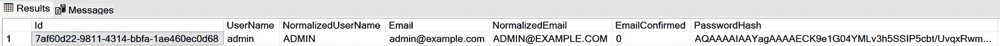
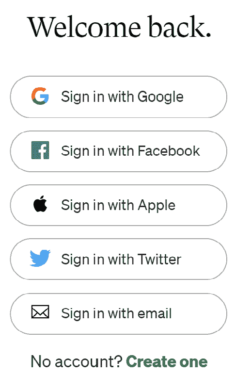

# 8

# ASP.NET Core 中的安全和身份

在*第七章*中，我们讨论了 EF Core 的更多高级主题，例如 `DbContext` 缓存、性能优化和并发控制。到这一点，你应该已经具备创建使用 EF Core 访问数据库的 Web API 应用程序所需的技能。然而，该应用程序并不安全。在没有任何身份验证的情况下，任何知道 URL 的人都可以访问 API，可能会将敏感数据暴露给公众。为了确保 Web API 应用程序的安全性，我们必须采取额外的步骤。

安全是一个广泛的话题，它是任何应用程序的关键方面。在本章中，我们将探讨 ASP.NET Core 提供的一些安全功能，包括身份验证、授权以及保护您的 Web API 应用程序的最佳实践。我们将涵盖以下主题：

+   开始使用身份验证和授权

+   深入了解授权

+   管理用户和角色

+   ASP.NET Core 8 中的新身份验证 API 端点

+   理解 OAuth 2.0 和 OpenID Connect

+   其他安全主题

阅读本章后，你将基本了解 ASP.NET Core 中的安全功能。你还将了解如何在 Web API 应用程序中实现身份验证和不同的授权类型，例如基于角色的授权、基于声明的授权和基于策略的授权。

# 技术要求

本章中的代码示例可以在 [`github.com/PacktPublishing/Web-API-Development-with-ASP.NET-Core-8`](https://github.com/PacktPublishing/Web-API-Development-with-ASP.NET-Core-8) 找到。您可以使用 VS Code 或 VS 2022 打开解决方案。

# 开始使用身份验证和授权

身份验证和授权是安全性的两个重要方面。尽管这两个术语经常一起使用，但它们是不同的概念。在我们深入代码之前，了解身份验证和授权之间的区别非常重要。

我们已经构建了一些 Web API 应用程序。然而，这些 API 将对任何知道 URL 的人公开。对于某些资源，我们希望仅允许认证用户访问。例如，我们有一个包含一些敏感信息的资源，这些信息不应向每个人开放。在这种情况下，应用程序应该能够识别发起请求的用户。如果用户是匿名的，应用程序不应允许用户访问资源。这就是身份验证发挥作用的地方。

对于某些场景，我们还想限制某些特定用户对某些资源的访问。例如，我们希望允许认证用户读取资源，但只有管理员用户可以更新或删除资源。在这种情况下，应用程序应该能够检查用户是否具有执行操作所需的权限。这就是授权发挥作用的地方。

简而言之，身份验证用于了解用户是谁，而授权用于了解用户可以做什么。这两个过程共同用于确保用户是他们所声称的人，并且他们有权访问资源。

ASP.NET Core 提供了 Identity 框架，该框架具有丰富的身份验证和授权功能。在本章中，我们将探讨如何使用 Identity 框架在 ASP.NET Core 中实现身份验证和授权。我们还将介绍一些第三方身份验证提供者。

想象一下这样一个场景：我们想要构建一个允许用户注册和登录的 Web API 应用程序。对于特定的端点，我们只想允许经过身份验证的用户访问资源。在本节中，我们将探讨如何实现这个场景。通过这个示例，你将学习如何在 ASP.NET Core 中实现基本的身份验证和授权系统；这将帮助你为下一节做准备。

在本示例中，我们将使用以下资源：

+   `POST /account/register`：此资源将用于注册新用户。用户应在请求体中发送用户名和密码。验证用户名和密码后，应用程序将在数据库中创建新用户并向用户返回 JWT 令牌。此 JWT 令牌将用于在后续请求中验证用户。

+   `POST /account/login`：此资源将用于登录现有用户。用户发送用户名和密码后，应用程序将验证凭据，如果凭据有效，则向用户返回 JWT 令牌。JWT 令牌将用于在后续请求中验证用户。

+   `GET /WeatherForecast`：此资源将用于获取天气预报。它只允许经过身份验证的用户访问资源。用户应在 Authorization 头中发送 JWT 令牌以进行用户身份验证。

应该有更多端点来管理用户，例如更新用户资料、删除用户、重置密码等。然而，我们在这个章节中不会构建一个完整的应用程序。为了保持简单，我们只会关注演示 ASP.NET Core 中身份验证和授权功能所需的最小特性。

JWT 是什么？

JWT 代表*JSON Web Token*。它是在两个当事人之间安全表示声明的行业标准。JWT 的 RFC 是 RFC 7519：[`www.rfc-editor.org/rfc/rfc7519`](https://www.rfc-editor.org/rfc/rfc7519)。JWT 令牌由三部分组成：头部、负载和签名。因此，典型的 JWT 令牌看起来像`xxxxx.yyyyy.zzzzz`。头部包含用于签名令牌的算法，负载包含声明，签名用于验证令牌的完整性。有关 JWT 的更多信息，请参阅[`jwt.io/introduction`](https://jwt.io/introduction)。

## 创建具有身份验证和授权的示例项目

首先，我们必须准备项目并添加任何必要的 NuGet 包。此外，我们需要配置数据库上下文，以便我们能够在数据库中存储用户信息。按照以下步骤操作：

1.  通过运行以下命令创建一个新的 ASP.NET Core Web API 项目：

    ```cs
    AuthenticationDemo. Open the project in VS Code. You can find the start project in the /samples/chapter8/AuthenticationDemo/BasicAuthenticationDemo/start folder.
    ```

1.  现在，是时候添加所需的 NuGet 包了。我们将使用 ASP.NET Core Identity 来实现身份验证。ASP.NET Core Identity 是一个提供身份验证和授权功能的成员系统。它是 ASP.NET Core 框架的一部分。我们需要安装以下 NuGet 包：

    +   `Microsoft.AspNetCore.Identity.EntityFrameworkCore`: 此包用于 ASP.NET Core Identity 的 EF Core 实现。

    +   `Microsoft.EntityFrameworkCore.SqlServer`: 此包用于连接到 SQL Server。

    +   `Microsoft.EntityFrameworkCore.Tools`: 此包用于启用必要的 EF Core 工具。

    +   `Microsoft.AspNetCore.Authentication.JwtBearer`: 此包用于启用 JWT 身份验证。

    ASP.NET Core Identity 包已经包含在默认项目模板中，因此我们不需要安装它。

1.  接下来，我们将添加数据库上下文。我们将使用 EF Core 来访问数据库。但首先，我们需要一个实体模型来表示用户。创建一个名为 `Authentication` 的新文件夹，并向其中添加一个名为 `AppUser` 的新类。`AppUser` 类继承自 ASP.NET Core Identity 提供的 `IdentityUser` 类，如下面的代码所示：

    ```cs
    public class AppUser : IdentityUser{}
    ```

    `IdentityUser` 类已经包含了我们在大多数场景中表示用户所需的属性，例如 `UserName`、`Email`、`PasswordHash`、`PhoneNumber` 等。

1.  接下来，我们需要创建一个数据库上下文来访问数据库。在 `Authentication` 文件夹中添加一个名为 `AppDbContext` 的新类。`AppDbContext` 类继承自 ASP.NET Core Identity 提供的 `IdentityDbContext` 类，如下面的代码所示：

    ```cs
    public class AppDbContext(DbContextOptions<AppDbContext> options, IConfiguration configuration) : IdentityDbContext<AppUser>(options){    protected override void OnConfiguring(DbContextOptionsBuilder optionsBuilder)    {        base.OnConfiguring(optionsBuilder);        optionsBuilder.UseSqlServer(_configuration.GetConnectionString("DefaultConnection"));    }}
    "ConnectionStrings": {    "DefaultConnection": "Server=(localdb)\\mssqllocaldb;Database=AuthenticationDemo;Trusted_Connection=True;MultipleActiveResultSets=true"}
    ```

    如我们所见，这个 `AppDbContext` 完全是为 ASP.NET Core Identity 而设计的。如果你的应用程序中还有其他实体，你可以为它们创建一个单独的 `DbContext`。你可以为这两个 `DbContext` 使用相同的连接字符串。

1.  接下来，我们需要创建一些模型来注册和登录用户，因为当我们注册用户时，我们需要发送用户名、密码和电子邮件地址。当我们登录用户时，我们需要发送用户名和密码。如果为这些不同场景创建单独的模型会更好。

1.  在 `Authentication` 文件夹中创建一个名为 `AddOrUpdateAppUserModel` 的新类。此类将用于在注册新用户时表示用户。`AddOrUpdateAppUserModel` 类应包含以下属性：

    ```cs
    public class AddOrUpdateAppUserModel{    [Required(ErrorMessage = "User name is required")]    public string UserName { get; set; } = string.Empty;    [EmailAddress]    [Required(ErrorMessage = "Email is required")]    public string Email { get; set; } = string.Empty;    [Required(ErrorMessage = "Password is required")]    public string Password { get; set; } = string.Empty;}
    ```

1.  类似地，在 `Authentication` 文件夹中创建一个名为 `LoginModel` 的新类，如下面的代码所示：

    ```cs
    public class LoginModel{    [Required(ErrorMessage = "User name is required")]    public string UserName { get; set; } = string.Empty;    [Required(ErrorMessage = "Password is required")]    public string Password { get; set; } = string.Empty;}
    public class AppUser : IdentityUser{    public string FirstName { get; set; }    public string LastName { get; set; }    public string ProfilePicture { get; set; }}
    ```

    如果您向 `AppUser` 类添加了额外的属性，您还需要为 `AddOrUpdateAppUserModel` 添加相应的属性。

1.  接下来，我们需要配置身份验证服务。首先，让我们更新 `appsettings.json` 文件以提供 JWT 令牌的配置：

    ```cs
    "JwtConfig": {    "ValidAudiences": "http://localhost:5056",    "ValidIssuer": "http://localhost:5056",    "Secret": "c1708c6d-7c94-466e-aca3-e09dcd1c2042"  }
    ```

    根据您的需求更新配置。因为我们使用相同的 Web API 来颁发和验证 JWT 令牌，所以我们使用相同的 URL 作为 `ValidAudiences` 和 `ValidIssuer` 属性。`Secret` 属性用于签名 JWT 令牌。您可以使用任何字符串作为密钥。在这种情况下，我们可以使用一个 GUID 值。请注意，这只是为了演示目的。在实际应用程序中，您应该将密钥存储在安全的位置，例如 Azure Key Vault。

1.  如下所示更新 `Program.cs` 文件中的代码：

    ```cs
    // Omitted for brevitybuilder.Services.AddControllers();builder.Services.AddDbContext<AppDbContext>();builder.Services.AddIdentityCore<AppUser>()    .AddEntityFrameworkStores<AppDbContext>()    .AddDefaultTokenProviders();builder.Services.AddAuthentication(options =>{    options.DefaultAuthenticateScheme = JwtBearerDefaults.AuthenticationScheme;    options.DefaultChallengeScheme = JwtBearerDefaults.AuthenticationScheme;    options.DefaultScheme = JwtBearerDefaults.AuthenticationScheme;}).AddJwtBearer(options =>{    var secret = builder.Configuration["JwtConfig:Secret"];    var issuer = builder.Configuration["JwtConfig:ValidIssuer"];    var audience = builder.Configuration["JwtConfig:ValidAudiences"];    if (secret is null || issuer is null || audience is null)    {        throw new ApplicationException("Jwt is not set in the configuration");    }    options.SaveToken = true;    options.RequireHttpsMetadata = false;    options.TokenValidationParameters = new TokenValidationParameters()    {        ValidateIssuer = true,        ValidateAudience = true,        ValidAudience = audience,        ValidIssuer = issuer,        IssuerSigningKey = new SymmetricSecurityKey(Encoding.UTF8.GetBytes(secret))    };});// Omitted for brevityapp.UseHttpsRedirection();app.UseAuthentication();app.UseAuthorization();// Omitted for brevity
    ```

    在前面的代码中，我们配置了身份验证服务以使用 JWT 令牌。`AddIdentityCore()` 方法为指定的 `User` 类型添加并配置了身份系统。我们还向服务集合中添加了 `AppDbContext` 和 `AppUser`，并指定我们想要使用 EF Core 来存储用户数据。`AddDefaultTokenProviders()` 方法为应用程序添加了默认的令牌提供者，这些提供者用于生成令牌。`Services.AddAuthentication()` 方法配置了身份验证服务以使用 JWT 令牌。`AddJwtBearer()` 方法配置了 JWT 携带者身份验证处理程序，包括令牌验证参数。我们使用 `appsettings.json` 文件中的某些配置来配置令牌验证参数。

    最后，我们需要调用 `UseAuthentication()` 和 `UseAuthorization()` 方法来在应用程序中启用身份验证和授权。

1.  现在，是时候创建和更新数据库了。我们已经创建了数据库上下文和用户实体。因此，现在我们需要创建数据库。为此，只需运行以下命令：

    ```cs
    dotnet ef migrations add InitialDbdotnet ef database update
    ```

    如果命令执行成功，您应该看到以下表创建的数据库：


图 8.1 – 由 ASP.NET Core Identity 创建的数据库表

1.  另一种检查数据库是否已创建的方法是将以下代码添加到 `Program.cs` 文件中：

    ```cs
    using (var serviceScope = app.Services.CreateScope()){    var services = serviceScope.ServiceProvider;    // Ensure the database is created.    var dbContext = services.GetRequiredService<AppDbContext>();    dbContext.Database.EnsureCreated();}
    ```

    您可以使用这两种方法中的任何一种来检查数据库是否在开发环境中创建。

    用户数据将存储在这些表中，当使用 ASP.NET Core Identity 提供的默认表时，这很方便。

接下来，让我们将 `Authorize` 属性应用于 `WeatherForecastController` 以启用身份验证和授权：

1.  通过添加 `[Authorize]` 属性来更新 `WeatherForecastController`，如下所示：

    ```cs
    [Authorize][ApiController][Route("[controller]")]public class WeatherForecastController : ControllerBase{    // ...}
    ```

    此属性将确保在访问控制器之前用户已认证。如果用户未认证，则控制器将返回 `401 未授权` 响应。通过运行应用程序并调用 `/WeatherForecast` 端点来测试此功能。您应该看到一个 `401` 响应：


图 8.2 – 当用户未认证时，控制器返回 401 响应

`Authorize` 属性可以应用于控制器或操作方法。如果属性应用于控制器，则控制器中的所有操作方法都将受到保护。如果属性应用于操作方法，则只有该操作方法将受到保护。

您还可以使用 `AllowAnonymous` 属性来允许控制器或操作方法进行匿名访问。请注意，`AllowAnonymous` 属性会覆盖 `Authorize` 属性。因此，如果您将这两个属性都应用于控制器或操作方法，`AllowAnonymous` 属性将具有优先权，这意味着控制器或操作方法将对所有用户开放。

1.  接下来，让我们添加 `AccountController` 来处理认证请求。例如，我们需要提供一个 `/account/register` 端点。当用户发送用户名和密码时，应用程序将在数据库中创建用户的记录并生成 JWT 令牌。

    要生成 JWT 令牌，我们需要提供以下信息：

    +   `appsettings.json` 文件，如前所述。

    +   接下来，创建一个新的控制器名为 `AccountController` 来处理认证请求。在 `Controllers` 文件夹中创建一个新的类名为 `AccountController`。`AccountController` 类应继承自 `ControllerBase` 类，如下面的代码所示：

        ```cs
        [ApiController][Route("[controller]")]public class AccountController(UserManager<AppUser> userManager, IConfiguration configuration) : ControllerBase{}
        ```

        我们使用 `UserManager` 类来管理用户。`UserManager` 类由 ASP.NET Core Identity 提供。我们还需要注入 `IConfiguration` 接口以从 `appsettings.json` 文件中获取配置值。

    +   在 `AccountController` 类中创建一个名为 `Register()` 的新方法。此方法将用于注册新用户。`Register()` 方法应接受一个 `AddOrUpdateAppUserModel` 对象作为参数，如下面的代码所示：

        ```cs
        [HttpPost("register")]public async Task<IActionResult> Register([FromBody] AddOrUpdateAppUserModel model){    // Check if the model is valid    if (ModelState.IsValid)    {        var existedUser = await userManager.FindByNameAsync(model.UserName);        if (existedUser != null)        {            ModelState.AddModelError("", "User name is already taken");            return BadRequest(ModelState);        }        // Create a new user object        var user = new AppUser()        {            UserName = model.UserName,            Email = model.Email,            SecurityStamp = Guid.NewGuid().ToString()        };        // Try to save the user        var result = await userManager.CreateAsync(user, model.Password);        // If the user is successfully created, return Ok        if (result.Succeeded)        {            var token = GenerateToken(model.UserName);            return Ok(new { token });        }        // If there are any errors, add them to the ModelState object        // and return the error to the client        foreach (var error in result.Errors)        {            ModelState.AddModelError("", error.Description);        }    }    // If we got this far, something failed, redisplay form    return BadRequest(ModelState);}
        private string? GenerateToken(string userName){    var secret = _configuration["JwtConfig:Secret"];    var issuer = _configuration["JwtConfig:ValidIssuer"];    var audience = _configuration["JwtConfig:ValidAudiences"];    if (secret is null || issuer is null || audience is null)    {        throw new ApplicationException("Jwt is not set in the configuration");    }    var signingKey = new SymmetricSecurityKey(Encoding.UTF8.GetBytes(secret));    var tokenHandler = new JwtSecurityTokenHandler();    var tokenDescriptor = new SecurityTokenDescriptor    {        Subject = new ClaimsIdentity(new[]        {            new Claim(ClaimTypes.Name, userName)        }),        Expires = DateTime.UtcNow.AddDays(1),        Issuer = issuer,        Audience = audience,        SigningCredentials = new SigningCredentials(signingKey, SecurityAlgorithms.HmacSha256Signature)    };    var securityToken = tokenHandler.CreateToken(tokenDescriptor);    var token = tokenHandler.WriteToken(securityToken);    return token;}
        ```

        在前面的代码中，我们使用 `JwtSecurityTokenHandler` 类来生成 JWT 令牌。`JwtSecurityTokenHandler` 类由 `System.IdentityModel.Tokens.Jwt` NuGet 包提供。首先，我们从 `appsettings.json` 文件中获取配置值。然后，我们使用密钥创建一个 `SymmetricSecurityKey` 对象。`SymmetricSecurityKey` 对象用于签名令牌。

        接下来，我们创建了一个 `SecurityTokenDescriptor` 对象，它包含以下属性：

        +   `Subject`：令牌的主题。主题可以是任何值，例如用户名、电子邮件地址等。

        +   `Expires`：令牌的过期日期。

        +   `Issuer`：令牌的发行者。

        +   `Audience`：令牌的受众。

        +   `SigningCredentials`：用于签名令牌的凭据。注意，我们使用 `HmacSha256Signature` 算法来签名令牌。这是一个用于数字签名的 256 位 HMAC 密码学算法。如果你遇到类似 `IDX10603: The algorithm: 'HS256' requires the SecurityKey.KeySize to be greater than '128' bits.` 的错误，请检查 `appsettings.json` 文件中的密钥。密钥长度应至少为 16 个字符（16 * 8 = 128）。

        最后，我们使用了 `JwtSecurityTokenHandler` 类来创建并将令牌写入字符串值。

    +   现在，我们可以测试 `Register()` 方法。使用 `dotnet run` 运行应用程序。你可以使用 Swagger UI 或其他任何工具来测试 API。向 `http://localhost:5056/account/register` 端点发送以下 JSON 数据的 `POST` 请求：

        ```cs
        {  "userName": "admin",  "email": "admin@example.com",  "password": "Passw0rd!"}
        ```

        你将看到以下类似的响应：


图 8.3 – 注册新用户

如我们所见，`Register()` 方法返回一个 JWT 令牌。该令牌有效期为 1 天。我们可以使用此令牌在未来对用户进行身份验证。如果你检查数据库，你将看到在 `AspNetUsers` 表中已创建新用户，密码已散列，如下面的截图所示：



图 8.4 – 新用户已在数据库中创建

1.  复制令牌值并向 `/WeatherForecast` 端点发送 `GET` 请求。你需要将 `Bearer` 令牌附加到请求头中，如下面的截图所示：


图 8.5 – 使用 Bearer 令牌发送请求

重要提示

当你将 Bearer 令牌附加到请求时，请注意令牌值之前有一个 `Bearer` 前缀。因此，实际格式应该是

`Authorization:` `Bearer <token>`。

好的，它工作了！你的 API 现在已经安全。下一步是创建一个登录方法来对用户进行身份验证。这相当直接。在 `AccountController` 类中创建一个名为 `Login` 的新方法。`Login()` 方法应该接受一个 `AddOrUpdateAppUserModel` 对象作为参数，如下面的代码所示：

```cs
[HttpPost("login")]public async Task<IActionResult> Login([FromBody] LoginModel model)
{
    // Get the secret in the configuration
    // Check if the model is valid
    if (ModelState.IsValid)
    {
        var user = await _userManager.FindByNameAsync(model.UserName);
        if (user != null)
        {
            if (await _userManager.CheckPasswordAsync(user, model.Password))
            {
                var token = GenerateToken(model.UserName);
                return Ok(new { token });
            }
        }
        // If the user is not found, display an error message
        ModelState.AddModelError("", "Invalid username or password");
    }
    return BadRequest(ModelState);
}
```

我们使用 `UserManager` 类通过用户名查找用户。如果找到用户，我们使用 `CheckPasswordAsync()` 方法来检查密码。如果密码正确，我们生成一个新的令牌并将其返回给客户端。如果未找到用户或密码不正确，我们向客户端返回错误消息。

到目前为止，我们已经创建了一个具有基本身份验证和授权的 Web API 项目。我们还创建了一个控制器来处理与账户相关的操作。注意，在这个例子中，我们没有实现任何特定的授权规则。所有经过身份验证的用户都可以访问 `WeatherForecast` 端点。

接下来，我们将讨论 JWT 令牌的详细信息。

## 理解 JWT 令牌结构

JWT 令牌是一个字符串值。它由三部分组成，由点（`.`）分隔：

+   头部

+   有效载荷

+   签名

头部和有效载荷使用 `Base64Url` 算法进行编码。我们可以使用 `jwt.io` 来解码令牌。将响应体中的令牌复制并粘贴到 `jwt.io` 网站上的 `Encoded` 字段。您将看到解码后的令牌，如下面的截图所示：


图 8.6 – 解码 JWT 令牌

头部包含用于签名令牌的算法。在我们的案例中，我们使用 `HmacSha256Signature` 算法。因此，解码后的头部如下所示：

```cs
{  "alg": "HS256",
  "typ": "JWT"
}
```

有效载荷包含令牌的声明和一些其他附加数据。在我们的案例中，解码后的有效载荷如下所示：

```cs
{  "unique_name": "admin",
  "nbf": 1679779000,
  "exp": 1679865400,
  "iat": 1679779000,
  "iss": "http://localhost:5056",
  "aud": "http://localhost:5056"
}
```

在 RFC7519 中定义了一些推荐（但不是强制性的）已注册的声明名称：

+   `sub`: `sub`（主题）声明标识了令牌的主题主体

+   `nbf`: `nbf`（不可用之前）声明标识了令牌必须不被接受处理的之前的时间

+   `exp`: `exp`（过期时间）声明标识了令牌必须不被接受处理的过期时间或之后的时间

+   `iat`: `iat`（发行时间）声明标识了令牌被发行的时间

+   `iss`: `iss`（发行者）声明标识了发行令牌的主体

+   `aud`: `aud`（受众）声明标识了令牌旨在为其提供的接收者

注意，在我们的案例中，我们使用相同的值用于 `iss` 和 `aud` 声明，因为我们使用相同的 Web API 发行和验证令牌。在实际应用中，通常有一个单独的认证服务器来发行令牌，这样 `iss` 和 `aud` 声明就有不同的值。

签名用于验证令牌，以确保令牌未被篡改。有各种算法可以生成签名。在我们的案例中，我们使用 `HmacSha256Signature` 算法，因此签名是使用以下公式生成的：

`HMACSHA256(base64UrlEncode(header) + "." + base64UrlEncode(payload), secret)`

因此，令牌通常看起来像 `xxxxx.yyyyy.zzzzz`，可以轻松地通过 HTTP 请求头传递，或者存储在浏览器的本地存储中。

## 消费 API

到目前为止，我们有一个安全的 API。您可以在 `samples\chapter8\AuthenticationDemo\BasicAuthenticationDemo\end` 文件夹中找到一个名为 `AuthenticationDemoClient` 的示例客户端应用程序。客户端应用程序是一个简单的控制台应用程序。它使用 `HttpClient` 类向 API 发送 HTTP 请求。主要代码如下：

登录：

```cs
var httpClient = new HttpClient();// Create a post request with the user name and password
var request = new HttpRequestMessage(HttpMethod.Post, "http://localhost:5056/authentication/login");
request.Content = new StringContent(JsonSerializer.Serialize(new LoginModel()
{
    UserName = userName,
    Password = password
}), Encoding.UTF8, "application/json");
var response = await httpClient.SendAsync(request);
var token = string.Empty;
if (response.IsSuccessStatusCode)
{
    var content = await response.Content.ReadAsStringAsync();
    var jwtToken = JsonSerializer.Deserialize<JwtToken>(content);
    Console.WriteLine(jwtToken.token);
    token = jwtToken.token;
}
```

获取天气预报：

```cs
request = new HttpRequestMessage(HttpMethod.Get, "http://localhost:5056/WeatherForecast");// Add the token to the request header
request.Headers.Authorization = new AuthenticationHeaderValue("Bearer", token);
response = await httpClient.SendAsync(request);
if (response.IsSuccessStatusCode)
{
    var content = await response.Content.ReadAsStringAsync();
    var weatherForecasts = JsonSerializer.Deserialize<IEnumerable<WeatherForecast>>(content);
    foreach (var weatherForecast in weatherForecasts)
    {
        Console.WriteLine("Date: {0:d}", weatherForecast.Date);
        Console.WriteLine($"Temperature (C): {weatherForecast.TemperatureC}");
        Console.WriteLine($"Temperature (F): {weatherForecast.TemperatureF}");
        Console.WriteLine($"Summary: {weatherForecast.Summary}");
    }
}
```

首先，客户端应用程序向登录 API 发送请求以获取令牌。然后，它将令牌附加到请求头并发送请求到天气预报 API。如果令牌有效，API 将返回数据。

## 配置 Swagger UI 以支持授权

你可能更喜欢使用 Swagger UI 来测试 API。Swagger UI 的默认配置不支持授权。我们需要更新 `Program` 类中的 `AddSwaggerGen()` 方法以支持授权。更新 `Program` 类如下：

```cs
builder.Services.AddSwaggerGen(c =>{
    c.AddSecurityDefinition("Bearer", new OpenApiSecurityScheme
    {
        Description = "JWT Authorization header using the Bearer scheme. Example: \"Authorization: Bearer {token}\"",
        Name = "Authorization",
        In = ParameterLocation.Header,
        Type = SecuritySchemeType.ApiKey,
        Scheme = "Bearer"
    });
    c.AddSecurityRequirement(new OpenApiSecurityRequirement
    {
        {
            new OpenApiSecurityScheme
            {
                Reference = new OpenApiReference
                {
                    Type = ReferenceType.SecurityScheme,
                    Id = "Bearer"
                }
            },
            new string[] { }
        }
    });
});
```

之前的代码向 Swagger UI 添加了 `Bearer` 安全定义。`AddSecurityRequirement` 方法向 Swagger UI 添加了 `Authorization` 标头。现在，当你运行应用程序时，你将在 Swagger UI 中看到 **授权** 按钮。点击 **授权** 按钮；你将看到一个弹出窗口，允许你输入令牌，如图下所示：


图 8.7 – 在 Swagger UI 中输入令牌

在 **值** 字段中输入令牌。然后，点击 **授权** 按钮。现在，你可以直接使用 Swagger UI 测试 API：

注意

你需要在令牌前添加 `Bearer` 前缀，并空一格。


图 8.8 – Swagger UI 已授权

你可以在此处找到有关 Swagger UI 配置的更多信息：[`github.com/domaindrivendev/Swashbuckle.AspNetCore`](https://github.com/domaindrivendev/Swashbuckle.AspNetCore)。

在本节中，我们讨论了支持身份验证和授权的 Web API 项目的实现，包括创建控制器来处理登录请求。此外，我们还探讨了如何生成 JWT 令牌并验证它，以及如何使用控制台应用程序访问项目资源以及如何配置 Swagger UI 以授权测试 API。

在下一节中，我们将学习更多关于 ASP.NET Core 中的授权知识。我们将探讨几种授权类型，包括基于角色的授权、基于声明的授权和基于策略的授权。

# 深入探讨授权

授权是确定用户是否允许执行特定操作的过程。在上一节中，我们实现了一个支持简单身份验证和授权的 Web API 项目。通过使用 `Authorize` 属性，只有经过身份验证的用户才能访问 API。然而，在许多场景中，我们需要实现细粒度授权。例如，某些资源仅对管理员可访问，而某些资源则对普通用户可访问。在本节中，我们将探讨如何在 ASP.NET Core 中实现细粒度授权，包括基于角色的授权、基于声明的授权和基于策略的授权。

## 基于角色的授权

你可以在本书的 GitHub 仓库中找到入门应用程序和完成的应用程序，位于 `chapter8/AuthorizationDemo/RoleBasedAuthorizationDemo`。入门应用程序与我们之前章节中创建的应用程序类似：

1.  我们将从入门级应用程序开始。别忘了创建数据库并使用以下命令运行迁移：

    ```cs
    AppRoles that is defined as follows:

    ```

    public static class AppRoles{    public const string Administrator = "Administrator";    public const string User = "User";    public const string VipUser = "VipUser";}

    ```cs

    ```

1.  在 `Program` 类中，我们需要在 `AddIdentityCore()` 方法之后显式调用 `AddRoles()` 方法。更新的代码如下：

    ```cs
    // Use the `AddRoles()` methodbuilder.Services.AddIdentityCore<AppUser>()    .AddRoles<IdentityRole>()    .AddEntityFrameworkStores<AppDbContext>()    .AddDefaultTokenProviders();
    ```

    如果您使用 `AddIdentity()` 方法，则不需要调用 `AddRoles()` 方法。`AddIdentity()` 方法将内部调用 `AddRoles()` 方法。

1.  我们还需要检查角色是否存在于数据库中。如果不存在，我们将创建角色。添加以下代码：

    ```cs
    using (var serviceScope = app.Services.CreateScope()){    var services = serviceScope.ServiceProvider;    var roleManager = app.Services.GetRequiredService<RoleManager<IdentityRole>>();    if (!await roleManager.RoleExistsAsync(AppRoles.User))    {        await roleManager.CreateAsync(new IdentityRole(AppRoles.User));    }    if (!await roleManager.RoleExistsAsync(AppRoles.VipUser))    {        await roleManager.CreateAsync(new IdentityRole(AppRoles.VipUser));    }    if (!await roleManager.RoleExistsAsync(AppRoles.Administrator))    {        await roleManager.CreateAsync(new IdentityRole(AppRoles.Administrator));    }}
    ```

1.  使用 `dotnet run` 运行应用程序。您将看到角色已创建在数据库中：


图 8.9 – 数据库中的角色

1.  在 `AccountController` 类中，我们有一个 `Register()` 方法，用于注册新用户。让我们更新 `Register()` 方法，将 `User` 角色分配给新用户。更新的代码如下：

    ```cs
    // Omitted for brevity// Try to save the uservar userResult = await userManager.CreateAsync(user, model.Password);// Add the user to the "User" rolevar roleResult = await userManager.AddToRoleAsync(user, AppRoles.User);// If the user is successfully created, return Okif (userResult.Succeeded && roleResult.Succeeded){    var token = GenerateToken(model.UserName);    return Ok(new { token });}
    ```

    同样，我们可以创建一个新的操作来注册管理员或 VIP 用户。您可以在完成的应用程序中查看代码。

1.  您可以使用您喜欢的任何 HTTP 客户端注册新的管理员。用户创建后，您可以在数据库中查看用户及其角色，如图*图 8**.10*所示：


图 8.10 – 数据库中的用户及其角色

`AspNetUserRoles` 表的数据用于存储用户和角色之间的关系。`UserId` 列是 `AspNetUsers` 表的主键，而 `RoleId` 列是 `AspNetRoles` 表的主键。

1.  接下来，我们需要更新用于生成 JWT 令牌的方法。当我们生成令牌时，我们需要在令牌中包含用户的角色。我们可以使用 `GetRolesAsync()` 方法获取角色，然后将它们添加到声明中。更新的代码如下：

    ```cs
    var userRoles = await userManager.GetRolesAsync(user);var claims = new List<Claim>{    new(ClaimTypes.Name, userName)};claims.AddRange(userRoles.Select(role => new Claim(ClaimTypes.Role, role)));var tokenDescriptor = new SecurityTokenDescriptor{    Subject = new ClaimsIdentity(claims),    Expires = DateTime.UtcNow.AddDays(1),    Issuer = issuer,    Audience = audience,    SigningCredentials = new SigningCredentials(signingKey, SecurityAlgorithms.HmacSha256Signature)};
    ```

1.  尝试运行应用程序并注册一个新用户或使用现有用户登录。复制响应中的令牌并将其粘贴到 `jwt.io` 网站以解码负载。您将看到令牌中包含了角色，如下所示：

    ```cs
    {  "unique_name": "admin",  "role": "Administrator",  "nbf": 1679815694,  "exp": 1679902094,  "iat": 1679815694,  "iss": "http://localhost:5056",  "aud": "http://localhost:5056"}
    ```

1.  现在，让我们更新 `WeatherForecastController` 类以实现基于角色的授权。添加一个新的管理员操作，如下所示：

    ```cs
    [HttpGet("admin", Name = "GetAdminWeatherForecast")][Authorize(Roles = AppRoles.Administrator)]public IEnumerable<WeatherForecast> GetAdmin(){    return Enumerable.Range(1, 20).Select(index => new WeatherForecast    {        Date = DateOnly.FromDateTime(DateTime.Now.AddDays(index)),        TemperatureC = Random.Shared.Next(-20, 55),        Summary = Summaries[Random.Shared.Next(Summaries.Length)]    })    .ToArray();}
    ```

    `Authorize` 属性用于指定允许访问 API 的角色。在上面的代码中，只有具有 `Administrator` 角色的认证用户可以访问 API。

    现在，您可以测试 API。如果您使用普通用户的令牌访问 `/WeatherForecast/admin` 端点，您将收到 403 禁止访问的响应。

通常，`管理员`角色应该有权限访问所有资源。但在我们当前的应用程序中，管理员用户无法访问`/WeatherForecast`端点。有多种方法可以解决这个问题。

第一种方法是，当我们注册一个新的管理员时，我们可以将`Administrator`角色分配给用户，并将`User`角色（或任何其他角色）分配给用户。这样，管理员用户就可以访问所有资源。

我们还可以更新`Authorize`属性以允许多个角色，如下所示：

```cs
[HttpGet(Name = "GetWeatherForecast")][Authorize(Roles = $"{AppRoles.User},{AppRoles.VipUser},{AppRoles.Administrator}")]
public IEnumerable<WeatherForecast> Get()
{
    // Omitted for brevity
}
```

上述代码表示用户必须至少拥有指定的其中一个角色才能访问 API。

注意，如果你对一个操作应用了多个具有指定角色的`Authorize`属性，用户必须拥有所有这些角色才能访问 API。例如，考虑以下代码：

```cs
[HttpGet("vip", Name = "GetVipWeatherForecast")][Authorize(Roles = AppRoles.User)]
[Authorize(Roles = AppRoles.VipUser)]
public IEnumerable<WeatherForecast> GetVip()
{
    // Omitted for brevity
}
```

上述代码表示用户必须同时拥有`User`和`VipUser`角色才能访问 API。如果用户只有一个角色，用户将收到 403 禁止响应。

此外，我们还可以定义一个策略来指定允许访问 API 的角色。例如，在`Program`类中，我们可以添加以下代码：

```cs
builder.Services.AddAuthorization(options =>{
    options.AddPolicy("RequireAdministratorRole", policy => policy.RequireRole(AppRoles.Administrator));
    options.AddPolicy("RequireVipUserRole", policy => policy.RequireRole(AppRoles.VipUser));
    options.AddPolicy("RequireUserRole", policy => policy.RequireRole(AppRoles.User));
    options.AddPolicy("RequireUserRoleOrVipUserRole", policy => policy.RequireRole(AppRoles.User, AppRoles.VipUser));
});
```

然后，我们可以更新`Authorize`属性以使用策略，如下所示：

```cs
[HttpGet("admin-with-policy", Name = "GetAdminWeatherForecastWithPolicy")][Authorize(Policy = "RequireAdministratorRole")]
public IEnumerable<WeatherForecast> GetAdminWithPolicy()
{
    // Omitted for brevity
}
```

如果`policy.RequireRole()`方法在参数中具有多个角色，用户必须至少拥有其中一个角色才能访问 API。您可以在完成的应用程序中查看代码。

这样，我们就实现了 ASP.NET Core 中的基于角色的授权。在下一节中，我们将学习如何实现基于声明的授权。

## 基于声明的授权

当用户进行身份验证时，用户将有一组声明，这些声明用于存储有关用户的信息。例如，用户可以有一个指定用户角色的声明。因此，从技术上讲，角色也是声明，但它们是用于存储用户角色的特殊声明。我们可以在声明中存储其他信息，例如用户的名字、电子邮件地址、出生日期、驾照号码等。一旦我们这样做，授权系统就可以检查声明以确定用户是否有权访问资源。基于声明的授权比基于角色的授权提供了更细粒度的访问控制，但实现和管理可能更复杂。

你可以在本书 GitHub 仓库的`chapter8/AuthorizationDemo/ClaimBasedAuthorizationDemo`文件夹中找到入门应用程序和完成的应用程序：

1.  我们将从入门应用程序开始。不要忘记使用以下命令创建数据库并运行迁移：

    ```cs
    ClaimTypes class that contains the common claim types, such as NameIdentifier,  DateOfBirth, Email, Gender, GivenName, Name, PostalCode, and others, including Role. This is why we said that roles are also claims. You can also define your own claim types. For example, we can define the following claim types in the AppClaimTypes class:

    ```

    `public static class AppClaimTypes{    public const string DrivingLicenseNumber = "DrivingLicenseNumber";    public const string AccessNumber = "AccessNumber";}`

    ```cs

    ```

1.  还可以创建一个新的`AppAuthorizationPolicies`类来定义授权策略：

    ```cs
    public static class AppAuthorizationPolicies{    public const string RequireDrivingLicenseNumber = "RequireDrivingLicenseNumber";    public const string RequireAccessNumber = "RequireAccessNumber";}
    ```

1.  然后，我们可以在用户登录时将声明添加到令牌中。更新 `AccountController` 类中的 `GenerateToken` 方法，如下所示：

    ```cs
    // Omitted for brevityvar tokenDescriptor = new SecurityTokenDescriptor{    Subject = new ClaimsIdentity(new[]    {        new Claim(ClaimTypes.Name, userName),        // Suppose the user's information is stored in the database so that we can retrieve it from the database        new Claim(ClaimTypes.Country, "New Zealand"),        // Add our custom claims        new Claim(AppClaimTypes.AccessNumber, "12345678"),        new Claim(AppClaimTypes.DrivingLicenseNumber, "123456789")    }),    Expires = DateTime.UtcNow.AddDays(1),    Issuer = issuer,    Audience = audience,    SigningCredentials = new SigningCredentials(signingKey, SecurityAlgorithms.HmacSha256Signature)};// Omitted for brevity
    ```

    我们可以将任何声明添加到令牌中。在前面提到的代码中，我们向令牌中添加了 `Country`、`AccessNumber` 和 `DrivingLicenseNumber` 声明。

1.  假设我们有一个要求，只有拥有驾驶执照的用户才能访问资源。我们可以通过向 `Program` 类中添加以下代码来实现这一点：

    ```cs
    builder.Services.AddAuthorization(options =>{    options.AddPolicy(AppAuthorizationPolicies.RequireDrivingLicense, policy => policy.RequireClaim(AppClaimTypes.DrivingLicenseNumber));    options.AddPolicy(AppAuthorizationPolicies.RequireAccessNumber, policy => policy.RequireClaim(AppClaimTypes.AccessNumber));});
    ```

    因此，基于角色的授权和基于声明的授权之间的区别在于，基于声明的授权使用 `policy.RequireClaim()` 来检查声明，而基于角色的授权使用 `policy.RequireRole()` 来检查角色。

1.  到目前为止，我们可以更新 `Authorize` 属性，使其使用策略，如下所示：

    ```cs
    [Authorize(Policy = AppAuthorizationPolicies.RequireDrivingLicense)][HttpGet("driving-license")]public IActionResult GetDrivingLicense(){    var drivingLicenseNumber = User.Claims.FirstOrDefault(c => c.Type == AppClaimTypes.DrivingLicenseNumber)?.Value;    return Ok(new { drivingLicenseNumber });}
    ```

1.  运行应用程序并测试 `/WeatherForecast/driving-license` 端点。您将得到一个 `401` 未授权响应，因为用户没有 `DrivingLicenseNumber` 声明。注册一个用户或登录以获取令牌。然后，将令牌添加到 `Authorization` 标头中，再次调用 `/WeatherForecast/driving-license` 端点。您将得到一个包含 `drivingLicenseNumber` 的响应体中的 200 OK 响应。

    令牌现在包含声明，如下面的 JSON 响应所示：

    ```cs
    {  "unique_name": "user",  "http://schemas.xmlsoap.org/ws/2005/05/identity/claims/country": "New Zealand",  "AccessNumber": "12345678",  "DrivingLicenseNumber": "123456789",  "nbf": 1679824749,  "exp": 1679911149,  "iat": 1679824749,  "iss": "http://localhost:5056",  "aud": "http://localhost:5056"}
    ```

1.  这是最简单的基于声明的授权实现方式。当前方法仅检查令牌是否包含声明；它不检查声明的值。我们也可以检查值。`RequireClaim()` 方法还有一个接受 `allowedValues` 作为参数的重载版本。例如，我们有一个只能由新西兰用户访问的资源。我们可以更新 `Program` 类，如下所示：

    ```cs
    builder.Services.AddAuthorization(options =>{    // Omitted for brevity    options.AddPolicy(AppAuthorizationPolicies.RequireCountry, policy => policy.RequireClaim(ClaimTypes.Country, "New Zealand"));});
    options.AddPolicy(AppAuthorizationPolicies.RequireCountry, policy => policy.RequireClaim(ClaimTypes.Country, "New Zealand", "Australia"));
    ```

    控制器中的操作如下所示：

    ```cs
    [Authorize(Policy = AppAuthorizationPolicies.RequireCountry)][HttpGet("country")]public IActionResult GetCountry(){    var country = User.Claims.FirstOrDefault(c => c.Type == ClaimTypes.Country)?.Value;    return Ok(new { country });}
    ```

    您可以通过调用 `/WeatherForecast/country` 端点来测试 API。现在，只有具有 `Country` 声明且值为 `New Zealand` 的用户才能访问资源。

与角色类似，我们可以将多个策略应用于资源。例如，我们可以要求用户必须同时拥有 `DrivingLicense` 和 `AccessNumber` 声明才能访问资源。就像角色一样，您可以将两个策略添加到 `Authorize` 属性中，这意味着用户必须同时拥有 `DrivingLicense` 和 `AccessNumber` 声明才能访问资源。以下是一个示例：

```cs
[Authorize(Policy = AppAuthorizationPolicies.RequireDrivingLicense)][Authorize(Policy = AppAuthorizationPolicies.RequireAccessNumber)]
[HttpGet("driving-license-and-access-number")]
public IActionResult GetDrivingLicenseAndAccessNumber()
{
    var drivingLicenseNumber = User.Claims.FirstOrDefault(c => c.Type == AppClaimTypes.DrivingLicenseNumber)?.Value;
    var accessNumber = User.Claims.FirstOrDefault(c => c.Type == AppClaimTypes.AccessNumber)?.Value;
    return Ok(new { drivingLicenseNumber, accessNumber });
}
```

另一种方法是使用 `RequireAssertion()` 方法，它允许我们执行自定义逻辑来检查声明。更新 `Program` 类，如下所示：

```cs
builder.Services.AddAuthorization(options =>{
    // Omitted for brevity
    options.AddPolicy(AppAuthorizationPolicies.RequireDrivingLicenseAndAccessNumber, policy => policy.RequireAssertion(context =>
    {
        var hasDrivingLicenseNumber = context.User.HasClaim(c => c.Type == AppClaimTypes.DrivingLicenseNumber);
        var hasAccessNumber = context.User.HasClaim(c => c.Type == AppClaimTypes.AccessNumber);
        return hasDrivingLicenseNumber && hasAccessNumber;
    }));
});
```

在前面的代码中，`context` 参数包含一个 `User` 属性，该属性包含声明。我们可以使用 `HasClaim()` 方法来检查用户是否有声明。然后，如果用户同时拥有 `DrivingLicenseNumber` 和 `AccessNumber` 声明，我们可以返回 `true`；否则，返回 `false`。您也可以使用 `context.User.Claims` 属性来获取声明并按照您的要求检查值。

控制器中的操作如下所示：

```cs
[Authorize(Policy = AppAuthorizationPolicies.RequireDrivingLicenseAndAccessNumber)][HttpGet("driving-license-and-access-number")]
public IActionResult GetDrivingLicenseAndAccessNumber()
{
    // Omitted for brevity
}
```

在本节中，我们学习了如何在 ASP.NET Core 中实现基于声明的授权。我们还学习了如何使用 `RequireAssertion()` 方法来检查声明。如果我们需要更复杂的授权逻辑，我们可以使用策略授权。但首先，让我们学习在 ASP.NET Core 中授权是如何工作的。

## 理解授权过程

在上一节中，我们学习了如何实现基于角色的授权和基于声明的授权。让我们深入了解细节。您可能已经注意到，当我们使用基于角色的授权或基于声明的授权时，我们需要在 `AddAuthorization` 方法中调用 `AddPolicy()` 方法。`AddPolicy()` 方法的签名如下：

```cs
public void AddPolicy(string name, Action<AuthorizationPolicyBuilder> configurePolicy){
    // Omitted for brevity
}
```

`AddPolicy()` 方法接受两个参数：

+   一个 `name` 参数，它是策略的名称

+   `configurePolicy` 参数，它是一个接受 `AuthorizationPolicyBuilder` 参数的委托

您可以按 *F12* 查看类 `AuthorizationPolicyBuilder` 的源代码。您会发现它有一些配置策略的方法，例如 `RequireRole()`、`RequireClaim()` 等。`RequireRole` 方法的源代码如下：

```cs
public AuthorizationPolicyBuilder RequireRole(IEnumerable<string> roles){
    ArgumentNullThrowHelper.ThrowIfNull(roles);
    Requirements.Add(new RolesAuthorizationRequirement(roles));
    return this;
}
```

`RequireClaim()` 方法的源代码如下所示：

```cs
public AuthorizationPolicyBuilder RequireClaim(string claimType){
    ArgumentNullThrowHelper.ThrowIfNull(claimType);
    Requirements.Add(new ClaimsAuthorizationRequirement(claimType, allowedValues: null));
    return this;
}
```

`RequireRole()` 和 `RequireClaim()` 方法在底层调用 `Requirements.Add()` 方法。那么，`Requirements` 对象是什么？

我们正在接近 ASP.NET Core 授权的核心。`Requirements` 对象的定义如下：

```cs
public IList<IAuthorizationRequirement> Requirements { get; set; } = new List<IAuthorizationRequirement>();
```

`AuthorizationPolicyBuilder` 类中的 `Requirements` 对象是一个 `IAuthorizationRequirement` 对象的列表。`IAuthorizationRequirement` 接口只是一个标记服务，它没有任何方法。让我们在 `RolesAuthorizationRequirement` 类和 `ClaimsAuthorizationRequirement` 类上按 *F12*。我们将看到它们的源代码：

```cs
// RolesAuthorizationRequirementpublic class RolesAuthorizationRequirement : AuthorizationHandler<RolesAuthorizationRequirement>, IAuthorizationRequirement
{
    // Omitted for brevity
}
// ClaimsAuthorizationRequirement
public class ClaimsAuthorizationRequirement : AuthorizationHandler<ClaimsAuthorizationRequirement>, IAuthorizationRequirement
{
    // Omitted for brevity
}
```

如我们所见，`RolesAuthorizationRequirement` 和 `ClaimsAuthorizationRequirement` 类都实现了 `IAuthorizationRequirement` 接口。它们还实现了 `AuthorizationHandler<TRequirement>` 类，该类定义如下：

```cs
public abstract class AuthorizationHandler<TRequirement> : IAuthorizationHandler        where TRequirement : IAuthorizationRequirement
{
    /// <summary>
    /// Makes a decision if authorization is allowed.
    /// </summary>
    /// <param name="context">The authorization context.</param>
    public virtual async Task HandleAsync(AuthorizationHandlerContext context)
    {
        foreach (var req in context.Requirements.OfType<TRequirement>())
        {
            await HandleRequirementAsync(context, req).ConfigureAwait(false);
        }
    }
    /// <summary>
    /// Makes a decision if authorization is allowed based on a specific requirement.
    /// </summary>
    /// <param name="context">The authorization context.</param>
    /// <param name="requirement">The requirement to evaluate.</param>
    protected abstract Task HandleRequirementAsync(AuthorizationHandlerContext context, TRequirement requirement);
}
```

因此，`AuthorizationHandler<TRequirement>` 类的每个实现都实现了 `HandleRequirementAsync()` 方法来检查要求。例如，`RolesAuthorizationRequirement` 类由以下代码组成：

```cs
public RolesAuthorizationRequirement(IEnumerable<string> allowedRoles){
    ArgumentNullThrowHelper.ThrowIfNull(allowedRoles);
    if (!allowedRoles.Any())
    {
        throw new InvalidOperationException(Resources.Exception_RoleRequirementEmpty);
    }
    AllowedRoles = allowedRoles;
}
/// <summary>
/// Gets the collection of allowed roles.
/// </summary>
public IEnumerable<string> AllowedRoles { get; }
/// <summary>
/// Makes a decision if authorization is allowed based on a specific requirement.
/// </summary>
/// <param name="context">The authorization context.</param>
/// <param name="requirement">The requirement to evaluate.</param>
protected override Task HandleRequirementAsync(AuthorizationHandlerContext context, RolesAuthorizationRequirement requirement)
{
    if (context.User != null)
    {
        var found = false;
        foreach (var role in requirement.AllowedRoles)
        {
            if (context.User.IsInRole(role))
            {
                found = true;
                break;
            }
        }
        if (found)
        {
            context.Succeed(requirement);
        }
    }
    return Task.CompletedTask;
}
```

当一个 `RolesAuthorizationRequirement` 实例被创建时，它从构造函数中接受一组角色。然后，它使用 `HandleRequirementAsync()` 方法来检查用户是否在角色中。如果用户在角色中，它调用 `context.Succeed()` 方法将 `Succeeded` 属性设置为 `true`。否则，它将 `Succeeded` 属性设置为 `false`。

如果您检查 `ClaimsAuthorizationRequirement` 类的实现，您会发现它与 `RolesAuthorizationRequirement` 类类似。它接受 `claimType` 和一组 `allowValues`，并检查用户是否有该声明，以及声明值是否在 `allowValues` 集合中。

接下来的问题是——谁负责调用这些方法？

让我们回到 `Program` 类来理解中间件管道。我们在 `Program` 文件中有 `app.UseAuthorization()` 方法，它用于添加授权中间件。在 `UseAuthorization` 方法上按 *F12*。我们将能够查看其源代码：

```cs
public static IApplicationBuilder UseAuthorization(this IApplicationBuilder app){
    // Omitted for brevity
    return app.UseMiddleware<AuthorizationMiddleware>();
}
```

持续按 *F12* 检查 `AuthorizationMiddleware` 的源代码。您将在 `Invoke()` 方法中看到以下代码：

```cs
// Omitted for brevityvar authorizeData = endpoint?.Metadata.GetOrderedMetadata<IAuthorizeData>() ?? Array.Empty<IAuthorizeData>();
var policies = endpoint?.Metadata.GetOrderedMetadata<AuthorizationPolicy>() ?? Array.Empty<AuthorizationPolicy>();
// Omitted for brevity
var policyEvaluator = context.RequestServices.GetRequiredService<IPolicyEvaluator>();
var authenticateResult = await policyEvaluator.AuthenticateAsync(policy, context);
// Omitted for brevity
var authorizeResult = await policyEvaluator.AuthorizeAsync(policy, authenticateResult!, context, resource);
// Omitted for brevity
```

现在，我们更接近了。`AuthorizationMiddleware` 类从端点元数据中获取策略，然后调用 `IPolicyEvaluator.AuthenticateAsync()` 方法来检查用户是否已认证，之后它调用 `IPolicyEvaluator.AuthorizeAsync()` 方法来检查用户是否被授权。`IPolicyEvaluator` 接口定义如下：

```cs
public interface IPolicyEvaluator{
    Task<AuthenticateResult> AuthenticateAsync(AuthorizationPolicy policy, HttpContext context);
    Task<PolicyAuthorizationResult> AuthorizeAsync(AuthorizationPolicy policy, AuthenticateResult authenticationResult, HttpContext context, object? resource);
}
```

ASP.NET Core 框架已将 `IPolicyEvaluator` 的默认实现注入到 DI 容器中。您可以在以下位置找到 `PolicyEvaluator` 类的源代码：`https://source.dot.net/#Microsoft.AspNetCore.Authorization.Policy/PolicyEvaluator.cs`。您将看到它注入了一个 `IAuthorizationService` 对象，该对象定义如下：

```cs
public interface IAuthorizationService{
    Task<AuthorizationResult> AuthorizeAsync(ClaimsPrincipal user, object? resource, IEnumerable<IAuthorizationRequirement> requirements);
    Task<AuthorizationResult> AuthorizeAsync(ClaimsPrincipal user, object? resource, string policyName);
}
```

通过这样，我们找到了之前描述的 `IAuthorizationRequirement` 类！

您可以在以下位置找到 `IAuthorizationService` 的默认实现源代码：[`source.dot.net/#Microsoft.AspNetCore.Authorization/DefaultAuthorizationService.cs`](https://source.dot.net/#Microsoft.AspNetCore.Authorization/DefaultAuthorizationService.cs)。它也被框架注入到 DI 容器中。核心代码如下：

```cs
public virtual async Task<AuthorizationResult> AuthorizeAsync(ClaimsPrincipal user, object? resource, IEnumerable<IAuthorizationRequirement> requirements){
    ArgumentNullThrowHelper.ThrowIfNull(requirements);
    var authContext = _contextFactory.CreateContext(requirements, user, resource);
    var handlers = await _handlers.GetHandlersAsync(authContext).ConfigureAwait(false);
    foreach (var handler in handlers)
    {
        await handler.HandleAsync(authContext).ConfigureAwait(false);
        if (!_options.InvokeHandlersAfterFailure && authContext.HasFailed)
        {
            break;
        }
    }
    var result = _evaluator.Evaluate(authContext);
    if (result.Succeeded)
    {
        _logger.UserAuthorizationSucceeded();
    }
    else
    {
        _logger.UserAuthorizationFailed(result.Failure);
    }
    return result;
}
```

因此，我们得到了以下调用堆栈：

1.  在 `Program` 类中定义授权策略（要求）。

1.  将授权策略应用于端点。

1.  将授权中间件应用于管道。

1.  请求带有 `Authorization` 标头进入，该标头可以从 `HttpContext` 对象中检索。

1.  `AuthorizationMiddleware` 调用 `IPolicyEvaluator.AuthorizeAsync()` 方法。

1.  `IPolicyEvaluator.AuthorizeAsync()` 方法调用 `IAuthorizationService.AuthorizeAsync()` 方法。

1.  `IAuthorizationService.AuthorizeAsync()` 方法调用 `IAuthorizationHandler.HandleAsync()` 方法来检查用户是否被授权。

一旦我们理解了调用堆栈，我们就可以通过实现 `IAuthorizationRequirement`、`IAuthorizationHandler` 和 `IAuthorizationService` 接口轻松实现授权策略。

## 基于策略的授权

在上一节中，我们解释了基于角色的授权和基于声明的授权都是在 `IAuthorizationRequirement`、`IAuthorizationHandler` 和 `IAuthorizationService` 接口下实现的。如果我们有更复杂的授权逻辑，我们可以直接使用基于策略的授权，这允许我们定义自定义的授权策略来执行复杂的授权逻辑。

例如，我们有一个需要支持以下授权逻辑的场景：

+   拥有 `Premium` 订阅并且基于新西兰的用户可以访问特殊付费内容

+   拥有 `Premium` 订阅但不在新西兰的用户无法访问特殊付费内容

在现实世界中，可能还有其他复杂的授权逻辑。让我们使用基于策略的授权来实现上述授权逻辑。你可以在 `/samples/chapter8/AuthorizationDemo/PolicyBasedAuthorization` 文件夹中找到示例代码：

1.  首先，向 `Authentication` 文件夹中添加两个类，如下所示：

    ```cs
    public static class AppClaimTypes{    public const string Subscription = "Subscription";}public static class AppAuthorizationPolicies{    public const string SpecialPremiumContent = "SpecialPremiumContent";}
    ```

    这些类定义了我们需要的声明类型和授权策略。你也可以直接在代码中使用字符串，但建议使用常量以避免拼写错误。

1.  在 `AccountController` 类中，更新 `GenerateToken()` 方法以添加一个新的声明，如下所示：

    ```cs
    private string? GenerateToken(string userName, string country){    // Omitted for brevity    var tokenDescriptor = new SecurityTokenDescriptor    {        Subject = new ClaimsIdentity(new[]        {            new Claim(ClaimTypes.Name, userName),            new Claim(AppClaimTypes.Subscription, "Premium"),            new Claim(ClaimTypes.Country, country)        }),        Expires = DateTime.UtcNow.AddDays(1),        Issuer = issuer,        Audience = audience,        SigningCredentials = new SigningCredentials(signingKey, SecurityAlgorithms.HmacSha256Signature)    };    // Omitted for brevity}
    ```

    我们向令牌中添加了一个新的声明，`AppClaimTypes.Subscription`，其值为 `Premium`。这个声明表示用户的订阅类型。我们还向令牌中添加了一个新的声明，`ClaimTypes.Country`。这个声明表示用户的国籍。在现实世界中，你可以从数据库中获取用户的订阅类型和国籍信息。为了简化，我们假设令牌中包含了订阅类型和国籍信息。

1.  接下来，更新 `AccountController` 类中的 `Login()` 方法，将国家添加到声明中，并为新西兰用户创建另一个方法，如下所示：

    ```cs
    [HttpPost("login-new-zealand")]public async Task<IActionResult> LoginNewZealand([FromBody] LoginModel model){    if (ModelState.IsValid)    {        var user = await userManager.FindByNameAsync(model.UserName);        if (user != null)        {            if (await userManager.CheckPasswordAsync(user, model.Password))            {                var token = GenerateToken(model.UserName, "New Zealand");                return Ok(new { token });            }        }        // If the user is not found, display an error message        ModelState.AddModelError("", "Invalid username or password");    }    return BadRequest(ModelState);}[HttpPost("login")]public async Task<IActionResult> Login([FromBody] LoginModel model){    if (ModelState.IsValid)    {        var user = await userManager.FindByNameAsync(model.UserName);        if (user != null)        {            if (await userManager.CheckPasswordAsync(user, model.Password))            {                var token = GenerateToken(model.UserName, "Australia");                return Ok(new { token });            }        }        // If the user is not found, display an error message        ModelState.AddModelError("", "Invalid username or password");    }    return BadRequest(ModelState);}
    ```

    再次强调，这只是为了演示目的的简化实现。在现实世界中，通常只有一个登录端点，国家信息是从数据库或其他来源检索的，例如 IP 地址。

1.  接下来，我们需要实现授权策略。在 `Authorization` 文件夹中创建一个名为 `SpecialPremiumContentRequirement` 的新类，如下所示：

    ```cs
    public class SpecialPremiumContentRequirement : IAuthorizationRequirement{    public string Country { get; }    public SpecialPremiumContentRequirement(string country)    {        Country = country;    }}
    ```

    这个类实现了 `IAuthorizationRequirement` 接口。`Country` 属性表示可以访问付费内容的国家。我们可以使用这个属性来检查用户是否有权访问付费内容。

1.  接下来，我们需要实现 `AuthorizationHandler` 接口。在 `Authorization` 文件夹中创建一个名为 `SpecialPremiumContentAuthorizationHandler` 的类，如下所示：

    ```cs
    public class SpecialPremiumContentAuthorizationHandler : AuthorizationHandler<SpecialPremiumContentRequirement>{    protected override Task HandleRequirementAsync(AuthorizationHandlerContext context, SpecialPremiumContentRequirement requirement)    {        var hasPremiumSubscriptionClaim = context.User.HasClaim(c => c.Type == "Subscription" && c.Value == "Premium");        if (!hasPremiumSubscriptionClaim)        {            return Task.CompletedTask;        }        var countryClaim = context.User.FindFirst(c => c.Type == ClaimTypes.Country);        if (countryClaim == null || string.IsNullOrWhiteSpace(countryClaim.ToString()))        {            return Task.CompletedTask;        }        if (countryClaim.Value == requirement.Country)        {            context.Succeed(requirement);        }        return Task.CompletedTask;    }}
    ```

    此处理器用于检查要求是否满足。如果用户拥有 `Premium` 订阅且位于可以访问高级内容的国家，则满足要求。否则，要求不满足。

1.  接下来，我们需要注册授权策略和授权处理器。更新 `Program` 类，如下所示：

    ```cs
    builder.Services.AddAuthorization(options =>{    options.AddPolicy(AppAuthorizationPolicies.SpecialPremiumContent, policy =>    {        policy.Requirements.Add(new SpecialPremiumContentRequirement("New Zealand"));    });});builder.Services.AddSingleton<IAuthorizationHandler, SpecialPremiumContentAuthorizationHandler>();
    ```

    在前面的代码中，我们使用 `SpecialPremiumContentRequirement` 要求注册了授权策略 `AppAuthorizationPolicies.SpecialPremiumContent`。如果用户拥有 `Premium` 订阅且位于新西兰，则满足 `SpecialPremiumContentRequirement` 要求。我们还注册了 `SpecialPremiumContentAuthorizationHandler` 处理器作为单例服务。

1.  最后，我们需要将授权策略应用到控制器上。打开 `WeatherForecastController` 类并添加一个新的操作，如下面的代码所示：

    ```cs
    [Authorize(Policy = AppAuthorizationPolicies.SpecialPremiumContent)][HttpGet("special-premium", Name = "GetPremiumWeatherForecast")]public IEnumerable<WeatherForecast> GetPremium(){    // Omitted for brevity}
    ```

    此操作只能由拥有 `Premium` 订阅且位于新西兰的用户访问。如果用户没有 `Premium` 订阅或不在新西兰，授权策略将不会满足，用户将无法访问该操作。

您可以像上一节那样测试应用程序。应用程序有两个登录端点——一个用于新西兰用户，一个用于澳大利亚用户。如果您以新西兰用户身份登录，您可以访问 `WeatherForecast/special-premium` 端点。否则，您将收到 `403` 响应。

对于基于策略的授权，有一些需要注意的点：

+   您可以使用一个 `AuthorizationHandler` 实例来处理多个要求。在 `HandleAsync()` 方法中，您可以使用 `AuthorizationHandlerContext.PendingRequirements` 来获取所有挂起的请求，然后逐个检查它们。

+   如果您有多个 `AuthorizationHandler` 实例，它们将以任何顺序被调用，这意味着您不能期望处理器的顺序。

+   您需要调用 `context.Succeed(requirement)` 来标记要求已满足。

如果要求不满足会怎样？有两种选择：

+   通常，您不需要调用 `context.Fail()` 来标记失败的要求，因为可能有其他处理器来处理相同的要求，这些要求可能已经满足。

+   如果您想确保要求失败并指示整个授权过程失败，您可以显式调用 `context.Fail()`，并在 `AddAuthorization()` 方法中将 `InvokeHandlersAfterFailure` 属性设置为 `false`，如下所示：

    ```cs
    builder.Services.AddAuthorization(options =>  {      options.AddPolicy(AppAuthorizationPolicies.PremiumContent, policy =>      {          policy.Requirements.Add(new PremiumContentRequirement("New Zealand"));      });      options.InvokeHandlersAfterFailure = false;  });
    ```

在本节中，我们探讨了 ASP.NET Core 中可用的三种授权类型：基于角色、基于声明和基于策略。我们检查了源代码以深入了解授权的工作原理。有了这些知识，您现在应该能够自信地使用 ASP.NET Core 的授权功能。接下来，我们将学习如何管理用户和角色。

# 管理用户和角色

在前面的部分中，我们实现了身份验证和授权功能。通常，应用程序还应提供一种管理用户和角色的方式。ASP.NET Core Identity 提供了一套 API 来管理用户和角色。在本节中，我们将介绍如何使用这些 API。

在前面的章节中，我们学习了`IdentityDbContext`类用于存储用户和角色信息。因此，我们不需要创建一个新的数据库上下文类。同样，我们可以使用`UserManager`和`RoleManager`来管理用户和角色，而无需编写任何代码。

下面是使用`UserManager`类管理用户的一些常见操作：

| **方法** | **描述** |
| --- | --- |
| `CreateAsync(TUser user, string password)` | 使用给定的密码创建用户。 |
| `UpdateUserAsync(TUser user)` | 更新用户。 |
| `FindByNameAsync(string userName)` | 通过用户名查找用户。 |
| `FindByIdAsync(string userId)` | 通过 ID 查找用户。 |
| `FindByEmailAsync(string email)` | 通过电子邮件查找用户。 |
| `DeleteAsync(TUser user)` | 删除用户。 |
| `AddToRoleAsync(TUser user, string role)` | 将用户添加到角色中。 |
| `GetRolesAsync(TUser user)` | 获取用户的角色列表。 |
| `IsInRoleAsync(TUser user, string role)` | 检查用户是否具有该角色。 |
| `RemoveFromRoleAsync(TUser user, string role)` | 从角色中移除用户。 |
| `CheckPasswordAsync(TUser user, string password)` | 检查密码是否正确。 |
| `ChangePasswordAsync(TUser user, string currentPassword, string newPassword)` | 更改用户的密码。用户必须提供正确的当前密码。 |
| `GeneratePasswordResetTokenAsync(TUser user)` | 生成用于重置用户密码的令牌。您需要在`AddIdentityCore()`方法中指定`options.Token.PasswordResetTokenProvider`。 |
| `GenerateEmailConfirmationTokenAsync(TUser user)` | 生成用于确认用户电子邮件的令牌。您需要在`AddIdentityCore()`方法中指定`options.Tokens.EmailConfirmationTokenProvider`。 |
| `ConfirmEmailAsync(TUser user, string token)` | 检查用户是否具有有效的电子邮件确认令牌。如果令牌匹配，此方法将用户的`EmailConfirmed`属性设置为`true`。 |

表 8.1 – 管理用户常见操作

下面是使用`RoleManager`类管理角色的一些常见操作：

| **方法** | **描述** |
| --- | --- |
| `CreateAsync(TRole role)` | 创建角色 |
| `RoleExistsAsync(string roleName)` | 检查角色是否存在 |
| `UpdateAsync(TRole role)` | 更新角色 |
| `DeleteAsync(TRole role)` | 删除角色 |
| `FindByNameAsync(string roleName)` | 通过名称查找角色 |

表 8.2 – 管理角色常见操作

这些 API 封装了数据库操作，因此我们可以使用它们轻松地管理用户和角色。一些方法返回 `Task<IdentityResult>` 对象。`IdentityResult` 对象包含一个 `Succeeded` 属性，用于指示操作是否成功。如果操作不成功，您可以通过使用 `Errors` 属性来获取错误消息。

我们不会在本书中涵盖所有 API。您可以在 ASP.NET Core 文档中找到更多信息。接下来，我们将学习关于 ASP.NET Core 8.0 中的新内置身份验证 API 端点。

# ASP.NET Core 8 中的新身份验证 API 端点

在前面的章节中，我们学习了如何使用 ASP.NET Core 内置的身份验证 API 实现身份验证和授权。我们开发了一些端点来注册、登录和管理用户和角色。ASP.NET Core 8.0 引入了一组新功能，以简化 Web API 的身份验证。在本节中，我们将介绍这些新端点。

注意，这个新功能仅适用于简单的身份验证场景。由身份验证 API 端点生成的令牌是透明的，不是 JWT 令牌，这意味着它仅适用于同一应用程序。然而，它仍然是一个快速入门的选择。在 ASP.NET Core 8.0 中，我们可以使用新的 `MapIdentityApi()` 方法来映射身份验证 API 端点，而无需像前几节那样编写任何实现。让我们来学习如何使用它：

1.  首先，按照 *步骤 1* 到 *5* 在 *创建具有身份验证和授权的示例项目* 部分中创建一个名为 `NewIdentityApiDemo` 的新 Web API 项目。请注意，您不需要安装 `Microsoft.AspNetCore.Authentication.JwtBearer` 包，因为我们在这个示例项目中不会使用 JWT 令牌。

1.  在 `Program.cs` 文件中添加授权策略服务和注册 `DbContext`，如下所示：

    ```cs
    builder.Services.AddAuthorization();builder.Services.AddDbContext<AppDbContext>();
    ```

1.  运行以下命令以创建数据库和迁移：

    ```cs
    dotnet ef migrations add InitialDbdotnet ef database update
    ```

1.  在 `Program.cs` 文件中注册身份验证 API 端点，如下所示：

    ```cs
    builder.Services.AddIdentityApiEndpoints<AppUser>().AddEntityFrameworkStores<AppDbContext>();
    ```

    `AddIdentityApiEndpoints()` 方法通过在内部调用 `AddIdentityCore<TUser>()` 方法向应用程序添加一组常见的身份验证服务。它还配置了身份验证以支持身份令牌和 cookie，因此我们不需要显式调用 `AddIdentityCore<AppUser>()` 方法。

1.  在 `Program.cs` 文件中映射身份验证 API 端点，如下所示：

    ```cs
    app.MapGroup("/identity").MapIdentityApi<AppUser>();
    ```

    以下代码将身份验证 API 端点映射到 `/identity` 路径。您可以将其更改为您喜欢的任何路径，例如 `api/accounts`、`/users` 等。请注意，由于我们使用 `AppUser` 而不是默认的 `IdentityUser`，我们必须在 `MapIdentityApi()` 方法中指定 `AppUser` 类型。

1.  将 `[Authorize]` 属性应用于 `WeatherForecastController` 类，如下所示：

    ```cs
    [Authorize] [ApiController] [Route("[controller]")] public class WeatherForecastController : ControllerBase {     // Omitted for brevity }
    ```

1.  使用 `dotnet run` 运行应用程序。您将在 Swagger UI 中看到新的身份验证 API 端点：


图 8.11 – Swagger UI 中的身份验证 API 端点

1.  现在，你可以探索新的身份验证 API 端点。向 `/identity/register` 端点发送以下内容的 `POST` 请求以注册新用户：

    ```cs
    {   "userName": "admin",   "email": "admin@example.com",   "password": "Passw0rd!" }
    {   "email": "admin@example.com",   "password": "Passw0rd!" }
    ```

    你将获得一个包含访问令牌和刷新令牌的响应：

    ```cs
    {   "tokenType": "Bearer",   "accessToken": "CfDJ8L-NUxrCjhBJqmxaYaETqK0P0...",   "expiresIn": 3600,   "refreshToken": "CfDJ8L-NUxrCjhBJqmxaYaETqK2U..." }
    ```

然后，你可以使用访问令牌通过 `Authorization` 标头请求受保护的 `/weatherforecast` 端点，正如我们在前面的章节中介绍的那样。

这个新功能还提供了 `refreshToken`、`confirmEmail`、`resetPassword`、`2fa` 等端点。请随意自行探索它们。

# 理解 OAuth 2.0 和 OpenID Connect

之前，我们学习了如何使用 ASP.NET Core 内置的身份验证 API 来实现身份验证和授权。然而，在实际项目中，你可能会遇到一些术语，例如 OAuth 2.0 和 OpenID Connect。了解它们是什么以及如何在 ASP.NET Core 中使用它们将非常有帮助。撰写一本关于 OAuth 2.0 和 OpenID Connect 的完整书籍是值得的。在本节中，我们将介绍围绕 OAuth 2.0 和 OpenID Connect 的一些基本概念，以及一些第三方身份验证和授权提供商。

## 什么是 OAuth 2.0？

让我们从真实示例开始。当你使用领英时，你可能会看到一个窗口提示你从 Outlook、Gmail、Yahoo 或其他电子邮件服务同步你的联系人。这是因为领英希望了解你的联系人，以便它可以推荐你邀请你的朋友加入领英或与他们建立联系。这是一个典型的 OAuth 2.0 应用示例：


图 8.12 – 在领英上同步联系人

如果你填写了你的电子邮件地址并点击 **继续** 按钮，你将被重定向到电子邮件服务提供商的网站。例如，我使用 Outlook，所以我将看到一个像这样的窗口，因为我有多个账户：


图 8.13 – 提示登录 Outlook

注意地址栏中的 URL。它看起来可能像这样：

```cs
https://login.microsoftonline.com/common/oauth2/v2.0/authorize?client_id=xxxxxxxx-xxxx-xxxx-xxxx-xxxxxxxxxxxx&redirect_uri=https%3A%2F%2Fwww.linkedin.com%2Fgenie%2Ffinishauth&scope=openid%20email%20People.Read&response_type=code&state=xxxxxxxx-xxxx-xxxx-xxxx-xxxxxxxxxxxx
```

URL 包含应用程序的 **客户端 ID**，用于标识应用程序。它还包含 **重定向 URL**，以便授权服务器在用户授予权限后可以将用户重定向回应用程序。

你需要登录电子邮件服务提供商的网站并授权领英访问你的联系人。如果你已经登录，你会看到这个窗口：


图 8.14 – 授权领英访问你的联系人

在你授权领英后，你将被重定向回领英。领英将从电子邮件服务提供商那里获取联系人信息并展示给你。

我们不希望 LinkedIn 知道我们电子邮件地址的密码。在这种情况下，OAuth 2.0 和 OpenID Connect 被用来授权 LinkedIn 访问我们的联系人，而无需知道我们的密码。

OAuth 2.0 实现了一个**委托授权**模型。它允许客户端代表用户访问受保护资源。OAuth 2.0 模型中涉及一些实体：

+   **资源所有者**：拥有受保护资源的用户。在我们的例子中，资源所有者是拥有电子邮件地址的用户。

+   **客户端**：想要访问受保护资源的客户端应用程序。在我们的例子中，客户端是 LinkedIn。请注意，此客户端不是用户的浏览器。

+   **资源服务器**：托管受保护资源的服务器。在我们的例子中，资源服务器是电子邮件服务提供商——例如，Outlook。

+   **授权服务器**：处理委托授权的服务器。在我们的例子中，授权服务器是 Microsoft 身份平台。一个**授权**服务器至少有两个端点：

    +   **授权端点**用于与最终用户交互并获得授权授予

    +   **令牌端点**用于与客户端交换授权授予以获取访问令牌：


图 8.15 – OAuth 2.0 流程

注意，客户端（LinkedIn）在能够访问受保护资源之前，必须将其自身注册为授权服务器（Microsoft）的已知客户端。客户端必须向授权服务器提供**客户端 ID**和**客户端密钥**以证明其身份。这就是为什么我们可以在*图 8*中看到 LinkedIn 的 Microsoft Graph Connector。14*。

OAuth 2.0 的常见步骤如下：

1.  客户端请求访问受保护资源。

1.  客户端将用户重定向到授权服务器，如 Microsoft、Google 等。具体来说，它重定向到授权服务器的授权端点。用户认证后，授权服务器将提示用户，询问类似“嗨，我有一个**已知**的客户端名为 LinkedIn，它想使用您的权限访问我的 API。具体来说，它想访问您的联系人，以便代表您发送电子邮件。您想授予 LinkedIn 访问权限吗？”的内容。这正是*图* *8*.14*所展示的。

1.  一旦用户接受请求，授权服务器将生成一个**授权代码**，它只是一个不透明的字符串，确认用户确实授予了客户端（LinkedIn）访问权限。授权服务器将用户重定向回客户端（LinkedIn）。

1.  授权代码作为查询字符串参数发送到客户端（LinkedIn）。

1.  客户端（LinkedIn）现在拥有一个授权码。接下来，它将使用授权码、客户端 ID 和客户端密钥从授权服务器的令牌端点请求一个**访问令牌**。它可能会问：“嗨，我是 LinkedIn。这个用户已经授权我访问这个电子邮件地址的联系人。这是我的客户端凭证（客户端 ID 和客户端密钥）。我还有一个授权码。我能访问吗？”

1.  授权服务器将验证客户端凭证和授权码。如果一切正常，它将生成一个访问令牌并将其发送回客户端（LinkedIn）。访问令牌是一个可以用来访问受保护资源的字符串。它通常是 JWT 令牌。它也可能包含**作用域**，这是客户端（LinkedIn）被授予的权限。例如，它可能是**Contacts.Read**。

1.  客户端（LinkedIn）现在可以使用这个访问令牌来访问受保护的资源。它可能会问：“嗨，我是 LinkedIn。我有一个访问令牌。我能访问这个电子邮件地址的联系人吗？”资源服务器检查访问令牌，如果它是有效的，它将返回受保护的资源给客户端（LinkedIn）。

以这种方式，客户端可以在不知道用户密码的情况下访问受保护的资源。因为访问令牌有一个作用域，它只能访问作用域内的受保护资源。例如，如果作用域是`Contacts.Read`，客户端只能读取联系人，但不能修改联系人。这种机制在安全性和可用性之间提供了良好的平衡。

## OpenID Connect 是什么？

OAuth 最初于 2006 年设计和发布，后来在 2012 年作为 OAuth 2.0 进行修订和标准化。OAuth 2.0 解决了委托授权的问题。然而，还有一些其他场景 OAuth 2.0 无法解决。例如，您的 API 可能需要知道访问 API 的用户的身份，但用户可能不想为您的 API 创建账户。他们可能已经在某些其他服务中拥有账户，例如 Microsoft、Google 等。在这种情况下，如果用户可以使用他们现有的账户来访问您的 API，那就更方便了。然而，OAuth 2.0 并未设计用于实现使用现有账户的登录。这就是新的规范 OpenID Connect 出现的地方。

OpenID Connect 是 OAuth 2.0 之上的一个认证层，由 OpenID 基金会在 2014 年设计。OpenID Connect 类似于 OAuth 2.0 的扩展，它添加并定义了一些新功能来检索用户的身份，包括用户名、电子邮件地址等个人资料信息。OpenID Connect 使用与 OAuth 2.0 相似的术语和概念，如**客户端**、**资源所有者**、**授权服务器**等。然而，请记住，OpenID Connect 并不是 OAuth 2.0 的替代品。相反，它是一个规范，它扩展了 OAuth 2.0 以支持认证。

许多流行的身份提供者，如 Microsoft、Google、Facebook 等，已实现了 OpenID Connect，以便您可以将您的 API 应用程序与他们的身份提供者集成。然后，用户可以使用他们现有的账户登录到您的 API 应用程序。以下是在[Medium.com](http://Medium.com)上 OpenID Connect 工作的一个示例：



图 8.16 – Medium.com 使用多个身份提供者登录

如果您点击**使用 Google 登录**，您将被重定向到 Google 进行登录。然后，您将被重定向回 Medium.com，以便您可以使用现有的 Google 账户登录到 Medium.com。这就是 OpenID Connect 所做的事情。

与 OAuth 2.0 类似，OpenID Connect 也会生成一个访问令牌。它还引入了一种新的令牌，称为**ID 令牌**，这是一个包含用户身份信息的 JWT 令牌。客户端应用程序可以检查和验证 ID 令牌以提取有关用户身份的信息。

## 与其他身份提供者集成

许多身份提供者支持 OpenID Connect，以便您可以将您的 API 应用程序与这些平台集成。以下是一些流行的身份提供者：

+   **Microsoft**：Microsoft 为身份验证和授权提供了 Microsoft Identity Platform。更多信息，请参阅[`learn.microsoft.com/zh-cn/azure/active-directory/develop/`](https://learn.microsoft.com/zh-cn/azure/active-directory/develop/)。

+   **Google**：使用 Google 登录是一项帮助您快速轻松地管理用户身份验证并与您的应用程序共享用户配置文件信息的服务的服务。更多信息，请参阅[`developers.google.com/identity/gsi/web/guides/overview`](https://developers.google.com/identity/gsi/web/guides/overview)。

+   **Facebook**：Facebook 登录是人们使用他们的 Facebook 账户登录到您的应用程序的一种便捷方式。更多信息，请参阅[`developers.facebook.com/products/facebook-login/`](https://developers.facebook.com/products/facebook-login/)。

+   **Auth0**：Auth0 是一个基于云的身份管理平台，为 Web、移动和传统应用程序提供身份验证、授权和相关安全服务。更多信息，请参阅[`auth0.com/docs/quickstart/backend`](https://auth0.com/docs/quickstart/backend)。

+   **Okta**：Okta 也是一个基于云的身份平台，允许组织跨多个应用程序和服务管理并保护用户身份验证和授权。更多信息，请参阅[`www.okta.com/`](https://www.okta.com/)。

重要提示

2021 年 3 月，Okta 收购了 Auth0。然而，两家公司将继续独立运营。通常，Auth0 面向小型公司，以其对开发者友好的功能而闻名，但 Okta 被认为更专注于大型企业，并提供更多高级功能，如网络集成、单点登录等。

如果你需要自己构建身份提供者，也有一些开源项目你可以使用：

+   `IdentityServer`：`IdentityServer` 是 ASP.NET Core 中最灵活和符合标准规范的 OpenID Connect 和 OAuth 2.0 框架之一。许多公司使用它来保护他们的应用程序和 API。请注意，`IdentityServer` 是开源的，但现在不再是免费的。最后一个免费版本是 2021 年发布的 IdentityServer4，但它不再维护。Duende Software 现在提供 `IdentityServer` 的商业版本。有关更多信息，请参阅 [`duendesoftware.com/products/identityserver`](https://duendesoftware.com/products/identityserver)。

+   `OpenIddict`：`OpenIddict` 是一个针对 ASP.NET Core 的开源 OpenID Connect 栈。它提供了一个灵活的解决方案来实现 OpenID Connect 客户端、服务器、令牌验证等。然而，它不是一个即插即用的解决方案。你需要编写一些自定义代码来实现一些业务逻辑，例如授权控制器等。有关更多信息，请参阅 [`github.com/openiddict/openiddict-core`](https://github.com/openiddict/openiddict-core)。

+   `KeyCloak`：`KeyCloak` 是一个开源的身份和访问管理解决方案。它提供单点登录、用户联合、强认证、用户管理、细粒度授权等功能。它是基于容器的，因此可以轻松地在容器化环境中部署。有关更多信息，请参阅 [`www.keycloak.org/`](https://www.keycloak.org/)。

我们不会在本书中详细说明如何将这些身份提供者集成。请参阅文档。

# 其他安全主题

正如我们在本章开头提到的，安全是一个非常广泛的话题。在本节中，我们将简要介绍一些其他安全主题。

## 总是使用超文本传输协议安全（HTTPS）

HTTPS 是一种协议，它为客户端和服务器之间提供安全的通信。它是 HTTP 和 **安全套接字层/传输层安全性**（**SSL/TLS**）协议的结合。HTTPS 用于加密客户端和服务器之间的通信，确保通过互联网传输的敏感数据安全，并且不能被未经授权的第三方截获。如果你尝试访问一个不使用 HTTPS 的网站，Google Chrome 和其他现代浏览器将显示警告。因此，为所有你的网络应用程序使用 HTTPS 非常重要。

默认的 ASP.NET Core Web API 模板可以使用 HTTP 和 HTTPS。建议只使用 HTTPS。因此，我们需要配置项目以将所有 HTTP 请求重定向到 HTTPS。

为了实现这一点，我们需要将以下代码添加到`Program.cs`文件中：

```cs
app.UseHttpsRedirection();
```

此代码应用了`UseHttpsRedirection`中间件，将 HTTP 请求重定向到 HTTPS。

当你在本地运行应用程序时，ASP.NET Core 将自动生成一个自签名证书并使用它来加密通信。然而，当你将应用程序部署到生产环境时，你需要使用由受信任的**证书颁发机构**（**CA**）签发的证书，例如 DigiCert、Comodo、GeoTrust 等。

## 使用强密码策略

我们在之前章节中实现的默认密码策略不够安全。用户可以使用任何密码，这可能会带来安全风险。强制用户使用强大、唯一的密码，对他人难以猜测或破解，这一点非常重要。通常，一个好的密码应该是由大小写字母、数字和特殊字符的组合。密码长度至少为 8 个字符。我们可以定义一个密码策略来强制执行这些规则。

我们可以在`Program`类中指定密码策略。在`AddAuthentication()`方法之后添加以下代码：

```cs
builder.Services.Configure<IdentityOptions>(options =>{
    // Password settings
    options.Password.RequireDigit = true;
    options.Password.RequireLowercase = true;
    options.Password.RequireNonAlphanumeric = true;
    options.Password.RequireUppercase = true;
    options.Password.RequiredLength = 8;
    options.Password.RequiredUniqueChars = 1;
    // User settings
    options.User.AllowedUserNameCharacters =
    "abcdefghijklmnopqrstuvwxyzABCDEFGHIJKLMNOPQRSTUVWXYZ0123456789-._@+";
    options.User.RequireUniqueEmail = true;
});
```

之前的代码易于理解。在这个例子中，我们要求密码至少包含一个大小写字母、一个数字和一个特殊字符，并且密码长度至少为 8 个字符。我们还要求用户的电子邮件必须是唯一的。因此，如果用户尝试使用已存在的电子邮件进行注册，注册将失败。现在，用户的密码应该难以猜测。

我们还可以在用户登录失败时强制执行密码策略。例如，如果用户连续三次登录失败，账户将被锁定 5 分钟。这有助于防止暴力攻击。要启用此功能，在`AddAuthentication()`方法之后添加以下代码：

```cs
builder.Services.Configure<IdentityOptions>(options =>{
    // Omitted for brevity
    // Lockout settings
    options.Lockout.DefaultLockoutTimeSpan = TimeSpan.FromMinutes(5);
    options.Lockout.MaxFailedAccessAttempts = 3;
    options.Lockout.AllowedForNewUsers = true;
});
```

当我们使用`SignInManager.CheckPasswordSignInAsync()`方法进行登录时，此更改将生效。在之前的例子中，我们使用了`UserManager`。因此，我们需要更新`AuthenticationController`类中的`Login()`方法。首先，我们需要将`SignInManager`注入到控制器中。然后，我们必须更新`AuthenticationController`类，如下所示：

```cs
[HttpPost("login")]public async Task<IActionResult> Login([FromBody] LoginModel model)
{
    // Check if the model is valid
    if (ModelState.IsValid)
    {
        var user = await _userManager.FindByNameAsync(model.UserName);
        if (user != null)
        {
            var result =
                await _signInManager.CheckPasswordSignInAsync(user, model.Password, lockoutOnFailure: true);
            if (result.Succeeded)
            {
                var token = GenerateToken(model.UserName);
                return Ok(new { token });
            }
        }
        // If the user is not found, display an error message
        ModelState.AddModelError("", "Invalid username or password");
    }
    return BadRequest(ModelState);
}
```

之前代码使用了`SignInManager.CheckPasswordSignInAsync()`方法进行登录，该方法有一个名为`lockoutOnFailure`的参数，用于指定当用户登录失败时是否应该锁定账户。默认值是`false`，因此我们需要使用`true`来启用锁定功能。

注意，如果你在 `Program.cs` 中使用 `AddIdentityCore<AppUser>()`，正如我们在上一节中提到的，`SignInManager` 默认不可用。在这种情况下，你需要显式地将 `SignInManager` 服务添加到 `ConfigureServices()` 方法中，如下所示：

```cs
builder.Services.AddIdentityCore<AppUser>()    .AddSignInManager()
    .AddEntityFrameworkStores<AppDbContext>()
    .AddDefaultTokenProviders();
```

让我们来测试这个应用程序。使用 `dotnet run` 运行应用程序，并使用 `Register` API 创建一个新用户。你会发现，如果密码太简单，你会收到一个错误信息。以下是一个示例请求：

```cs
{  "userName": "user",
  "email": "user@example.com",
  "password": "123456"
}
```

你将收到一个 `400` 响应，并显示以下错误信息：

```cs
{  "": [
    "Passwords must be at least 8 characters.",
    "Passwords must have at least one non alphanumeric character.",
    "Passwords must have at least one lowercase ('a'-'z').",
    "Passwords must have at least one uppercase ('A'-'Z')."
  ]
}
```

如果你尝试使用错误的密码登录超过三次，你将被锁定系统 5 分钟。在此期间，即使你输入正确的密码，也无法访问系统。5 分钟后，你将能够再次登录。

## 实现双因素认证（2FA）

双因素认证（2FA）是一种需要用户提供两种不同形式的认证以验证其身份的安全流程。除了常见的用户名和密码外，2FA 通过要求用户提供第二个认证因素（如发送到其手机或认证器应用程序的代码、指纹、面部识别等）来增加一个额外的安全层。这使得黑客更难访问用户账户。即使黑客获得了用户的密码，他们仍然无法获取第二个因素。2FA 在银行和金融服务中广泛使用，以保护用户的敏感信息。

**多因素认证**（**MFA**）是双因素认证（2FA）的超集。它要求用户提供超过两个因素来验证其身份。有两种类型的 MFA：

+   **基于时间的多因素认证一次性密码**（**TOTP**）：基于时间的多因素认证 TOTP 是一种需要用户通过认证器应用程序（如 Google Authenticator 或 Microsoft Authenticator）生成代码的多因素认证。该代码的有效期很短，通常为 30 秒。代码过期后，用户需要生成一个新的代码。这种类型的多因素认证在银行和金融服务中广泛使用。如果你使用银行应用程序，你可能已经见过这种类型的多因素认证。它要求服务器和认证器应用程序具有准确的时间。

+   **快速身份在线 2**（**FIDO2**）：基于 FIDO2 的多因素认证要求用户使用硬件密钥（如 USB 密钥或生物识别设备，如指纹扫描仪）进行认证。近年来，它变得越来越受欢迎。然而，ASP.NET Core 目前尚不支持 FIDO2。

+   **基于短信的多因素认证**（**MFA SMS**）：基于短信的多因素认证不再推荐，因为短信存在许多安全问题。

要了解更多关于多因素认证（MFA）的信息，请参阅[`learn.microsoft.com/en-us/aspnet/core/security/authentication/mfa`](https://learn.microsoft.com/en-us/aspnet/core/security/authentication/mfa)。

## 实现速率限制

速率限制是一种安全机制，限制客户端可以向服务器发送的请求数量。它可以防止恶意客户端发送过多的请求，这可能导致 **拒绝服务**（**DoS**）攻击。ASP.NET Core 提供了内置的速率限制中间件。我们在 *第四章* 中解释了如何使用它。

## 使用模型验证

模型验证是一种安全机制，可以防止恶意用户向服务器发送无效数据。我们应该始终验证客户端发送的数据。换句话说，客户端是不可信的。例如，我们期望模型中的一个属性是整数，但客户端发送字符串怎么办？应用程序应该能够处理这种情况，并在执行任何业务逻辑之前直接拒绝请求。

ASP.NET Core 提供了内置的模型绑定和模型验证机制。模型绑定用于将客户端发送的数据转换为相应的模型。客户端发送的数据可以有不同的格式，例如 JSON、XML、表单字段或查询字符串。模型验证用于检查客户端发送的数据是否有效。我们在前面的章节中使用了模型验证。例如，以下是注册新用户时我们使用的代码：

```cs
// Create an action to register a new user[HttpPost("register")]
public async Task<IActionResult> Register([FromBody] AddOrUpdateAppUserModel model)
{
    // Check if the model is valid
    if (ModelState.IsValid)
    {
        // Omitted for brevity
    }
    return BadRequest(ModelState);
}
```

`ModelState.IsValid` 属性表示模型是否有效。那么，ASP.NET Core 是如何验证模型的呢？看看 `AddOrUpdateAppUserModel` 类：

```cs
public class AddOrUpdateAppUserModel{
    [Required(ErrorMessage = "User name is required")]
    public string UserName { get; set; } = string.Empty;
    [EmailAddress]
    [Required(ErrorMessage = "Email is required")]
    public string Email { get; set; } = string.Empty;
    [Required(ErrorMessage = "Password is required")]
    public string Password { get; set; } = string.Empty;
}
```

我们使用验证属性来指定验证规则。例如，`Required` 是一个内置属性注释，指定该属性是必需的。除了 `Required` 之外，还有一些最常用的属性：

+   `CreditCard`: 这指定了该属性必须是一个有效的信用卡号

+   `EmailAddress`: 这指定了该属性必须是一个有效的电子邮件地址

+   `Phone`: 这指定了该属性必须是一个有效的电话号码

+   `Range`: 这指定了该属性必须在一个指定的范围内

+   `RegularExpression`: 这指定了该属性必须匹配指定的正则表达式

+   `StringLength`: 这指定了该属性必须是一个具有指定长度的字符串

+   `Url`: 这指定了该属性必须是一个有效的 URL

+   `Compare`: 这指定了该属性必须与另一个属性相同

如果这些内置属性无法满足您的需求，您也可以创建自定义属性。例如，您可以创建一个 `Adult` 属性来根据用户的生日验证用户的年龄：

```cs
public class AdultAttribute : ValidationAttribute{
    public string GetErrorMessage() => $"You must be at least 18 years old to register.";
    protected override ValidationResult IsValid(object value, ValidationContext validationContext)
    {
        var birthDate = (DateTime)value;
        var age = DateTime.Now.Year - birthDate.Year;
        if (DateTime.Now.Month < birthDate.Month || (DateTime.Now.Month == birthDate.Month && DateTime.Now.Day < birthDate.Day))
        {
            age--;
        }
        if (age < 18)
        {
            return new ValidationResult(GetErrorMessage());
        }
        return ValidationResult.Success;
    }
}
```

然后，您可以在模型中使用 `Adult` 属性：

```cs
public class AddOrUpdateAppUserModel{
    // Omitted for brevity
    [Required(ErrorMessage = "Birthday is required")]
    [Adult]
    public DateTime Birthday { get; set; }
}
```

您还可以在控制器中手动验证模型。例如，您可以检查用户的电子邮件是否唯一：

```cs
// Create an action to register a new user[HttpPost("register")]
public async Task<IActionResult> Register([FromBody] AddOrUpdateAppUserModel model)
{
    // Check if the email is unique
    if (await _userManager.FindByEmailAsync(model.Email) != null)
    {
        ModelState.AddModelError("Email", "Email already exists");
        return BadRequest(ModelState);
    }
    if (ModelState.IsValid)
    {
        // Omitted for brevity
    }
    return BadRequest(ModelState);
}
```

在前面的代码中，我们使用`AddModelError()`方法向模型添加验证错误。如果存在任何验证错误，`ModelState.IsValid`属性将返回`false`。在*第十六章*中，我们将讨论如何使用`ProblemDetails`类向客户端返回错误信息，以及如何使用`FluentValidation`对模型进行更复杂场景的验证。您可以参考该章节以获取更多信息。

## 使用参数化查询

我们在前面章节中解释了如何使用 EF Core 执行 SQL 查询。通常，如果您使用 LINQ 查询数据，EF Core 会为您生成参数化查询。但是，当您使用以下方法时，您需要小心 SQL 注入攻击：

+   `FromSqlRaw()`

+   `SqlQeuryRaw()`

+   `ExecuteSqlRaw()`

这些方法允许您在不清理输入的情况下执行原始 SQL 查询。因此，请在执行之前确保清理查询语句。

## 使用数据保护

数据保护是一种安全机制，它阻止恶意用户访问敏感数据。例如，如果您在数据库中存储用户的密码，您应该在存储之前对其进行加密。另一个例子是用户的信用卡号，也应该在存储之前进行加密。

这是因为如果数据库遭到破坏，攻击者可以轻易地访问用户的敏感数据。换句话说，数据库不可信，就像客户端一样。数据保护是另一个重要话题，但超出了本书的范围。ASP.NET Core 提供了一个内置的数据保护机制。如果您想了解更多信息，请参阅官方文档：[`learn.microsoft.com/en-us/aspnet/core/security/data-protection/introduction`](https://learn.microsoft.com/en-us/aspnet/core/security/data-protection/introduction)。

## 保护秘密安全

秘密是敏感数据，不应向公众公开。在我们的应用程序中，我们可能有多个秘密，例如数据库连接字符串、API 密钥、客户端密钥等。在前面的章节中，我们经常将它们存储在`appsettings.json`文件中。然而，我们需要强调这不是一个好的做法。这些秘密应该存储在安全的地方，例如 Azure Key Vault、AWS Secrets Manager 或`kube-secrets`。永远不要将它们上传到源代码仓库。

我们将在*第十四章*中介绍**持续集成/持续部署**（**CI/CD**）并解释如何安全地存储秘密。

## 保持框架更新

.NET Core 框架是一个开源项目。它不断在更新。我们应该始终保持框架的最新状态，包括 NuGet 包。注意 .NET Core 框架的生命周期。尽可能使用框架的最新版本。如果你正在使用较旧版本，你应该考虑升级它。你可以在这里找到 .NET Core 框架的生命周期：[`dotnet.microsoft.com/en-us/platform/support/policy/dotnet-core`](https://dotnet.microsoft.com/en-us/platform/support/policy/dotnet-core)。

## 检查 Open Web Application Security Project (OWASP) Top 10

OWASP 是一个非营利组织，提供有关 Web 应用程序安全性的信息。它发布了一份最常见的 Web 应用程序安全风险列表，称为 OWASP Top 10。你可以在这里找到 OWASP Top 10：[`owasp.org/www-project-top-ten/`](https://owasp.org/www-project-top-ten/)。你应该定期检查列表，以确保你的应用程序不会受到任何风险的威胁。

此外，OWASP 提供了一个名为 *DotNet Security Cheat Sheet* 的免费资源，其中包含了确保 .NET Core 应用程序安全性的最佳实践。你可以在这里找到它：[`cheatsheetseries.owasp.org/cheatsheets/DotNet_Security_Cheat_Sheet.html`](https://cheatsheetseries.owasp.org/cheatsheets/DotNet_Security_Cheat_Sheet.html)。

# 摘要

在本章中，我们介绍了 ASP.NET Core 的安全和身份功能。我们主要学习了如何使用其内置的认证和授权机制。我们学习了如何使用 Identity 框架来管理用户和角色，并解释了基于角色的授权、基于声明的授权和基于策略的授权。

然后，我们介绍了 OAuth 2.0 和 OpenID Connect，它们是最受欢迎的认证和授权标准。之后，我们解释了几个安全实践，例如使用 HTTPS、强密码、参数化查询等。

再次强调，安全性是一个大主题，我们无法在一章中涵盖所有细节。请将安全性视为一个持续的过程，并始终确保你的应用程序安全。

在下一章中，我们将开始测试，这是任何软件项目的重要部分。我们将学习如何为 ASP.NET Core 应用程序编写单元测试。
