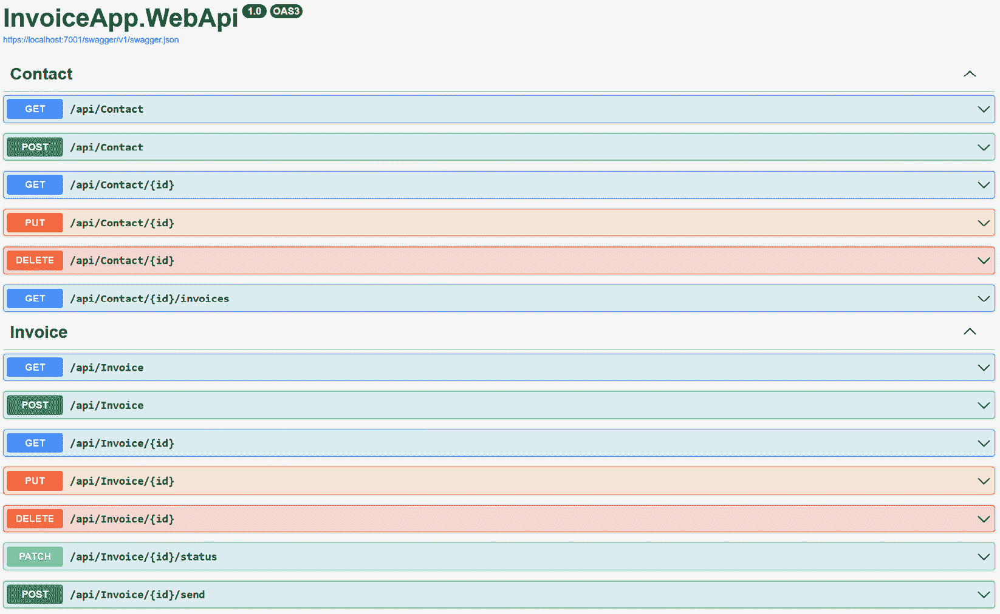
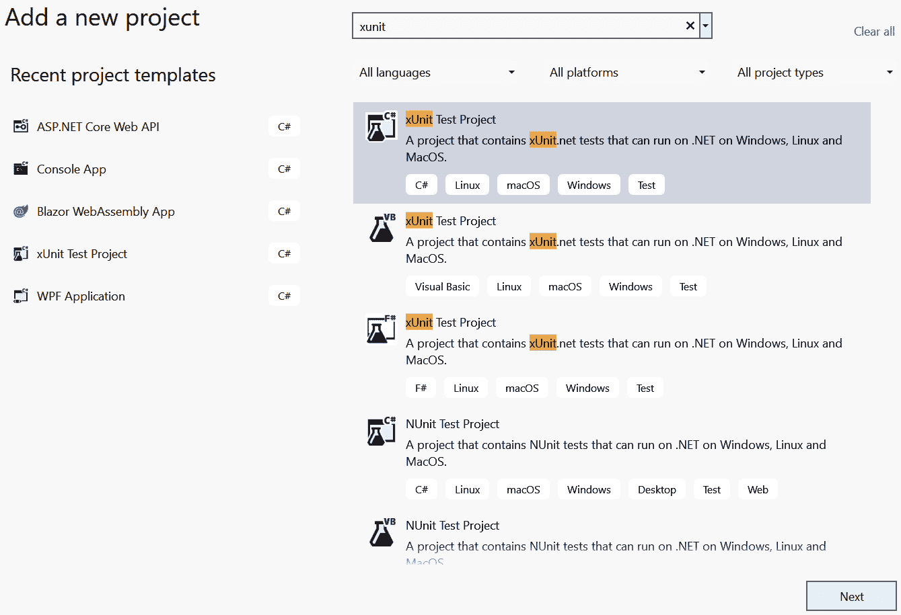
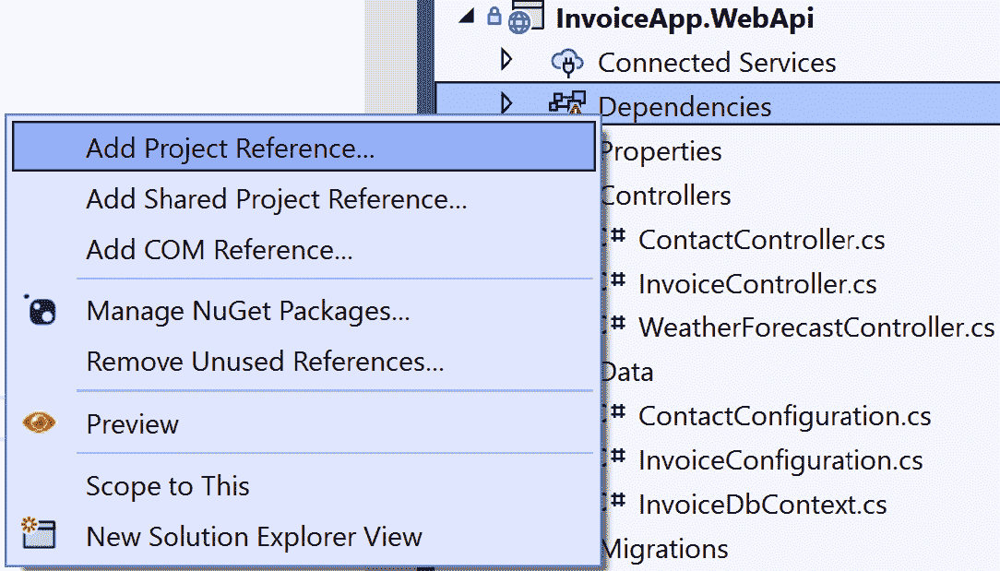
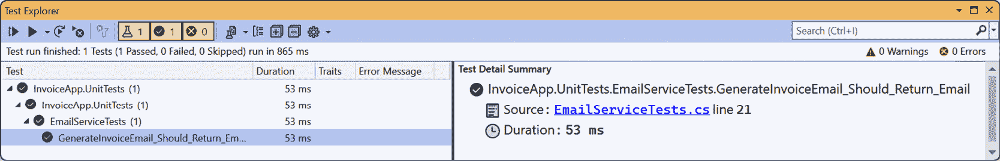
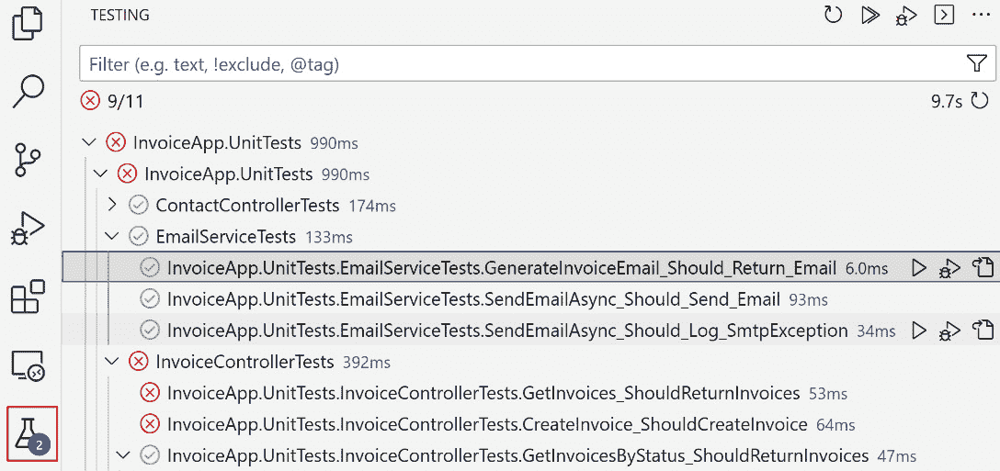
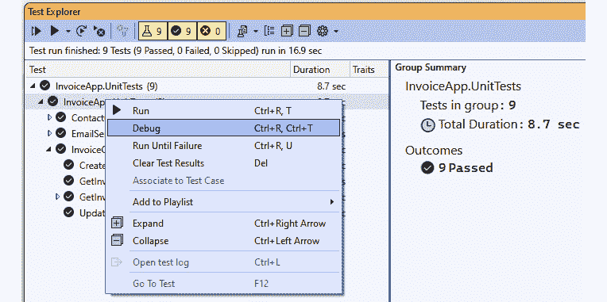
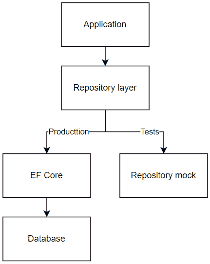

# 9

# ASP.NET Core 测试（第一部分 – 单元测试）

测试是任何软件开发过程的重要组成部分，包括 ASP.NET Core Web API 开发。测试有助于确保应用程序按预期工作并满足要求。它还有助于确保对代码所做的任何更改都不会破坏现有功能。

在本章中，我们将探讨 ASP.NET Core 中可用的不同测试类型以及如何在 ASP.NET Core Web API 应用程序中实现单元测试。

本章将涵盖以下主题：

+   ASP.NET Core 测试简介

+   编写单元测试

+   测试数据库访问层

在本章结束时，你将能够为你的 ASP.NET Core Web API 应用程序编写单元测试，以确保代码单元正确运行。你还将学习如何使用一些库，例如 `Moq` 和 `FluentAssertions`，使你的测试更易于阅读和维护。

# 技术要求

本章中的代码示例可在 [`github.com/PacktPublishing/Web-API-Development-with-ASP.NET-Core-8/tree/main/samples/chapter9`](https://github.com/PacktPublishing/Web-API-Development-with-ASP.NET-Core-8/tree/main/samples/chapter9) 找到。你可以使用 VS Code 或 VS 2022 打开解决方案。

# ASP.NET Core 测试简介

可以对 ASP.NET Core Web API 应用程序执行不同类型的测试，如下所示：

+   **单元测试**：这是测试单个代码单元的过程，例如方法和类，以确保它们按预期工作。单元测试应该是小的、快速的，并且与其他代码单元隔离。可以使用模拟框架来隔离代码单元与其依赖项，例如数据库和外部服务。

+   **集成测试**：这涉及测试应用程序不同组件之间的集成，以确保它们按预期一起工作。此类测试有助于识别在应用程序部署到生产环境时可能出现的任何问题。通常，集成测试比单元测试慢。根据场景，集成测试可能使用模拟对象或真实对象。例如，如果集成测试是为了测试应用程序与数据库的集成，则应使用真实数据库实例。但如果集成测试是为了测试应用程序与外部服务（如支付服务）的集成，则应使用模拟对象来模拟外部服务。在微服务架构中，集成测试更复杂，因为它们可能涉及多个服务。除了每个服务的集成测试之外，还应该有针对整个系统的集成测试。

+   **端到端测试**：这是从用户的角度测试应用程序的过程，以确保整个系统从开始到结束，包括用户界面、Web API、数据库等，都按预期工作。端到端测试通常涉及模拟用户与应用程序的交互，例如点击按钮和将数据输入表单。

+   **回归测试**：这涉及到在添加新功能或修复错误后测试应用程序是否仍然按预期工作。回归测试通常在应用程序部署到生产环境后执行。它有助于确保新功能或错误修复不会破坏现有功能。

+   **负载测试**：这涉及到测试应用程序是否能够处理正常负载的用户和请求。它有助于设定应用程序性能的基线。

+   **压力测试**：这涉及到测试应用程序是否能够处理极端条件，例如用户数量和请求的突然增加，或者逐渐增加长期负载。它还确定应用程序是否能够从故障中恢复以及恢复所需的时间。

+   **性能测试**：这是一种评估应用程序在不同工作负载下性能的测试，包括响应时间、吞吐量、资源使用等。性能测试是负载测试和压力测试的超集。通常，单元测试和集成测试在开发环境和预发布环境中执行，而性能测试则在类似生产环境的环境中执行，例如**用户验收测试**（**UAT**）环境，该环境在基础设施和配置方面与生产环境非常相似。这确保了性能测试的准确性和可靠性。在某些情况下，可以在计划维护窗口期间在开发环境中进行有限的性能测试，以验证实际性能场景。

单元测试和集成测试是 .NET 开发者编写的最常见的测试类型。在本章中，我们将重点关注单元测试；我们将在*第十章*中讨论集成测试。

# 编写单元测试

单元测试是为了测试代码的各个独立单元，例如方法和类。通常由熟悉代码的开发者编写单元测试。当开发者开发新功能或修复错误时，他们也应该编写单元测试以确保代码按预期工作。.NET 提供了许多单元测试框架，包括 NUnit、xUnit 和 MSTest。在本章中，我们将使用 xUnit 编写单元测试，因为它是目前最流行的 .NET 应用程序单元测试框架之一。

## 准备示例应用程序

示例应用程序，`InvoiceApp`，是一个简单的 ASP.NET Core Web API 应用程序，它公开了一组用于管理发票的 RESTful API。该示例应用程序使用 EF Core 将数据存储和检索到 SQL Server 数据库中。它具有以下端点：

+   `GET /api/invoices`: 获取发票列表

+   `GET /api/invoices/{id}`: 通过 ID 检索发票

+   `POST /api/invoices`: 创建一个新的发票

+   `PUT /api/invoices/{id}`: 更新现有发票

+   `DELETE /api/invoices/{id}`: 删除一张发票

+   `PATCH /api/invoices/{id}/status`: 更新发票的状态

+   `POST /api/invoices/{id}/send`: 向联系人发送发票电子邮件

注意，前面的端点不足以构建一个完整的发票管理应用程序。这只是一个示例应用程序，用于演示如何为 ASP.NET Core Web API 应用程序编写单元测试和集成测试。

此外，该示例应用程序包含一个可以用于测试 API 的 Swagger UI。*图 9**.1*显示了示例应用程序的 Swagger UI：



图 9.1 – 示例应用程序 API 端点

使用 `dotnet run` 命令运行示例应用程序后，您可以通过 [`localhost:5087/swagger/index.html`](http://localhost:5087/swagger/index.html) 访问 Swagger UI。

现在，我们将使用这个示例应用程序来演示如何为 ASP.NET Core Web API 应用程序编写单元测试。

## 设置单元测试项目

我们将使用 xUnit 为示例应用程序编写单元测试。xUnit 是 .NET 应用程序的流行单元测试框架。它是一个免费、开源的项目，已经存在多年。它也是 .NET Core 和 .NET 5+ 应用程序的默认单元测试框架。您可以在 [`xunit.net/`](https://xunit.net/) 找到更多关于 xUnit 的信息。

要设置测试项目，您可以使用 VS 2022 或 .NET CLI。如果您使用 VS 2022，可以通过在解决方案上右键单击并选择 `InvoiceApp.UnitTests` 来创建一个新的 xUnit 测试项目，然后点击 **创建** 以创建项目：



图 9.2 – 在 VS 2022 中创建一个新的 xUnit 测试项目

在创建项目后，将项目引用添加到`InvoiceApp.WebApi`项目，以便测试项目可以访问主 Web API 项目中的类。您可以通过在项目列表中右键单击`InvoiceApp.WebApi`项目并点击**确定**来添加项目引用：



图 9.3 – 在 VS 2022 中将项目引用添加到测试项目中

如果您使用.NET CLI，您可以在终端中运行以下命令来创建一个新的 xUnit 测试项目：

```cs
dotnet new xunit -n InvoiceApp.UnitTests
```

然后，您可以通过运行以下命令将测试项目添加到解决方案中：

```cs
dotnet sln InvoiceApp.sln add InvoiceApp.UnitTests/InvoiceApp.UnitTests.csproj
```

您还需要通过运行以下命令将引用添加到主项目中：

```cs
dotnet add InvoiceApp.UnitTests/InvoiceApp.UnitTests.csproj reference InvoiceApp.WebApi/InvoiceApp.WebApi.csproj
```

默认的 xUnit 测试项目模板包含一个示例单元测试。您可以删除名为`UnitTest1.cs`的示例单元测试；我们将在下一节编写自己的单元测试。

如果您从空白.NET 库项目开始创建测试项目，您需要将以下包添加到测试项目中：

+   `Microsoft.NET.Test.Sdk`：这是运行单元测试所必需的

+   `xunit`：这是我们用来编写单元测试的 xUnit 框架

+   `xunit.runner.visualstudio`：这是在 Visual Studio 中运行单元测试所必需的

+   `coverlet.collector`：这是一个开源项目，为.NET 应用程序提供代码覆盖率分析

当我们编写单元测试时，请记住，一个单元测试应该测试一个代码单元，例如一个方法或一个类。单元测试应该与其他代码单元隔离。如果一个方法依赖于另一个方法，我们应该模拟其他方法以隔离代码单元，确保我们专注于我们正在测试的代码单元的行为。

## 无依赖项编写单元测试

让我们看看第一个例子。在示例应用程序中，您可以找到一个名为`Services`的文件夹，其中包含`IEmailService`接口及其实现`EmailService`。`EmailService`类有一个名为`GenerateInvoiceEmail()`的方法。该方法是一个简单的函数，根据`Invoice`实体生成电子邮件。以下代码显示了`GenerateInvoiceEmail()`方法：

```cs
public (string to, string subject, string body) GenerateInvoiceEmail(Invoice invoice){
    var to = invoice.Contact.Email;
    var subject = $"Invoice {invoice.InvoiceNumber} for {invoice.Contact.FirstName} {invoice.Contact.LastName}";
    var body = $"""
        Dear {invoice.Contact.FirstName} {invoice.Contact.LastName},
        Thank you for your business. Here are your invoice details:
        Invoice Number: {invoice.InvoiceNumber}
        Invoice Date: {invoice.InvoiceDate.LocalDateTime.ToShortDateString()}
        Invoice Amount: {invoice.Amount.ToString("C")}
        Invoice Items:
        {string.Join(Environment.NewLine, invoice.InvoiceItems.Select(i => $"{i.Description} - {i.Quantity} x {i.UnitPrice.ToString("C")}"))}
        Please pay by {invoice.DueDate.LocalDateTime.ToShortDateString()}. Thank you!
        Regards,
        InvoiceApp
        """;
    return (to, subject, body);
}
```

原始字符串字面量

`body`变量是一个原始字符串字面量，这是 C# 11 中引入的新特性。原始字符串字面量用三重引号（`"""`）包围。它们可以跨越多行，并且可以包含双引号而不需要转义。您可以在[`learn.microsoft.com/en-us/dotnet/csharp/language-reference/tokens/raw-string`](https://learn.microsoft.com/en-us/dotnet/csharp/language-reference/tokens/raw-string)找到有关原始字符串字面量的更多信息。原始字符串也可以与插值字符串一起使用，这对于生成包含变量的字符串来说很方便。

在`GenerateInvoiceEmail()`方法中没有依赖项，因此我们可以不模拟任何其他方法就为该方法编写单元测试。在`InvoiceApp.UnitTests`项目中创建一个名为`EmailServiceTests`的类。然后，将以下代码添加到该类中：

```cs
[Fact]public void GenerateInvoiceEmail_Should_Return_Email()
{
    var invoiceDate = DateTimeOffset.Now;
    var dueDate = invoiceDate.AddDays(30);
    // Arrange
    var invoice = new Invoice
    {
        Id = Guid.NewGuid(),
        InvoiceNumber = "INV-001",
        Amount = 500,
        DueDate = dueDate,
        // Omit other properties for brevity
    };
    // Act
    var (to, subject, body) = new EmailService().GenerateInvoiceEmail(invoice);
    // Assert
    Assert.Equal(invoice.Contact.Email, to);
    Assert.Equal($"Invoice INV-001 for John Doe", subject);
    Assert.Equal($"""
        Dear John Doe,
        Thank you for your business. Here are your invoice details:
        Invoice Number: INV-001
        Invoice Date: {invoiceDate.LocalDateTime.ToShortDateString()}
        Invoice Amount: {invoice.Amount.ToString("C")}
        Invoice Items:
        Item 1 - 1 x $100.00
        Item 2 - 2 x $200.00
        Please pay by {invoice.DueDate.LocalDateTime.ToShortDateString()}. Thank you!
        Regards,
        InvoiceApp
        """, body);
}
```

`Fact` 属性表示 `GenerateInvoiceEmail_Should_Return_Email()` 方法是一个单元测试，这样 xUnit 就可以检测并运行这个方法作为单元测试。在 `GenerateInvoiceEmail_Should_Return_Email()` 方法中，我们创建了一个 `Invoice` 对象并将其传递给 `GenerateInvoiceEmail()` 方法。然后，我们使用 `Assert` 类验证 `GenerateInvoiceEmail()` 方法返回预期的电子邮件。

在编写单元测试时，我们遵循 *安排-执行-断言* 模式：

+   **安排**：这是准备数据和设置单元测试环境的地方

+   **执行**：这是调用我们想要测试的方法的地方

+   **断言**：这是验证方法返回预期结果或方法行为符合预期的地方

要在 VS 2022 中运行单元测试，您可以右键单击 `InvoiceApp.UnitTests` 项目或 `EmailServiceTest.cs` 文件，并选择 **运行测试**。您也可以使用 **测试资源管理器** 窗口通过点击 **测试** 菜单并选择 **运行** **所有测试** 来运行单元测试：



图 9.4 – 在 VS 2022 中运行单元测试

VS Code 也支持运行单元测试。点击 VS Code 窗口左侧的 **测试** 图标以打开 **测试** 视图；您将看到单元测试，如图 *图 9**.5* 所示：



图 9.5 – 在 VS Code 中运行单元测试

如果您使用 .NET CLI，您可以在终端中运行以下命令来运行单元测试：

```cs
dotnet test
```

您将看到以下输出：

```cs
Starting test execution, please wait...A total of 1 test files matched the specified pattern.
Passed!  - Failed:     0, Passed:     1, Skipped:     0, Total:     1, Duration: < 1 ms - InvoiceApp.UnitTests.dll (net8.0)
```

输出显示单元测试已通过。如果您想查看详细的测试结果，您可以运行以下命令：

```cs
dotnet test --verbosity normal
```

您将看到详细的测试结果，显示测试名称、结果、持续时间和输出。

## 使用依赖项编写单元测试

让我们看看另一个例子。在 `EmailService` 类中，有一个名为 `SendEmailAsync()` 的方法，该方法向收件人发送电子邮件。在实际应用中，我们通常使用第三方电子邮件服务来发送电子邮件。为了使 `EmailService` 类可测试，我们可以创建一个 `IEmailSender` 接口及其实现 `EmailSender`。`EmailSender` 类是 `SmtpClient` 类的包装器，用于发送电子邮件。以下代码显示了更新的 `EmailService` 类：

```cs
public async Task SendEmailAsync(string to, string subject, string body){
    // Mock the email sending process
    // In real world, you may use a third-party email service, such as SendGrid, MailChimp, Azure Logic Apps, etc.
    logger.LogInformation($"Sending email to {to} with subject {subject} and body {body}");
    try
    {
        await emailSender.SendEmailAsync(to, subject, body);
        logger.LogInformation($"Email sent to {to} with subject {subject}");
    }
    catch (SmtpException e)
    {
        logger.LogError(e, $"SmtpClient error occurs. Failed to send email to {to} with subject {subject}.");
    }
    catch (Exception e)
    {
        logger.LogError(e, $"Failed to send email to {to} with subject {subject}.");
    }
}
```

因此，现在，`EmailService` 依赖于 `IEmailSender` 接口。为了测试 `EmailService` 类中 `SendEmailAsync()` 方法的行为，我们需要模拟 `IEmailSender` 接口以隔离 `EmailService` 类和 `EmailSender` 类。否则，如果单元测试中发生任何错误，我们无法确定错误是由 `EmailService` 类还是 `EmailSender` 类引起的。

我们可以使用`Moq`库来模拟`IEmailSender`接口。`Moq`是.NET 中流行的模拟库。它作为一个 NuGet 包提供。要安装`Moq`，您可以在 VS 2022 中使用**NuGet 包管理器**，或者运行以下命令：

```cs
dotnet add package Moq
```

然后，我们可以为`SendEmailAsync()`方法创建单元测试。因为如果邮件发送过程失败，`SendEmailAsync()`方法可能会抛出异常，所以我们需要编写两个单元测试来测试成功和失败场景。以下代码显示了成功场景的单元测试：

```cs
[Fact]public async Task SendEmailAsync_Should_Send_Email()
{
    // Arrange
    var to = "user@example.com";
    var subject = "Test Email";
    var body = "Hello, this is a test email";
    var emailSenderMock = new Mock<IEmailSender>();
    emailSenderMock.Setup(m => m.SendEmailAsync(It.IsAny<string>(), It.IsAny<string>(), It.IsAny<string>()))
        .Returns(Task.CompletedTask);
    var loggerMock = new Mock<ILogger<IEmailService>>();
    loggerMock.Setup(l => l.Log(It.IsAny<LogLevel>(), It.IsAny<EventId>(), It.IsAny<It.IsAnyType>(),
        It.IsAny<Exception>(), (Func<It.IsAnyType, Exception?, string>)It.IsAny<object>())).Verifiable();
    var emailService = new EmailService(loggerMock.Object, emailSenderMock.Object);
    // Act
    await emailService.SendEmailAsync(to, subject, body);
    // Assert
    emailSenderMock.Verify(m => m.SendEmailAsync(It.IsAny<string>(), It.IsAny<string>(), It.IsAny<string>()), Times.Once);
    loggerMock.Verify(
        l => l.Log(
            It.IsAny<LogLevel>(),
            It.IsAny<EventId>(),
            It.Is<It.IsAnyType>((v, t) => v.ToString().Contains($"Sending email to {to} with subject {subject} and body {body}")),
            It.IsAny<Exception>(),
            (Func<It.IsAnyType, Exception?, string>)It.IsAny<object>()
        ),
        Times.Once
    );
    loggerMock.Verify(
        l => l.Log(
            It.IsAny<LogLevel>(),
            It.IsAny<EventId>(),
            It.Is<It.IsAnyType>((v, t) => v.ToString().Contains($"Email sent to {to} with subject {subject}")),
            It.IsAny<Exception>(),
            (Func<It.IsAnyType, Exception?, string>)It.IsAny<object>()
        ),
        Times.Once
    );
}
```

在前面的代码中，我们使用`Mock`类来创建`IEmailSender`接口和`ILogger`接口的模拟对象。我们需要设置模拟对象的方法行为。如果单元测试中使用的方 法没有被设置，单元测试将会失败。例如，我们使用`SetUp()`方法来模拟`IEmailSender`接口的`SendEmailAsync`方法：

```cs
emailSenderMock.Setup(m => m.SendEmailAsync(It.IsAny<string>(), It.IsAny<string>(), It.IsAny<string>()))    .Returns(Task.CompletedTask);
```

`SetUp()`方法接受一个 lambda 表达式作为参数，用于配置`SendEmailAsync()`方法的行为。在前面的代码中，我们使用`It.IsAny<string>()`方法指定`SendEmailAsync()`方法可以接受任何字符串值作为参数。然后，我们使用`Returns()`方法指定`SendEmailAsync()`方法的返回值。在这种情况下，我们使用`Task.CompletedTask`属性指定`SendEmailAsync()`方法将返回一个完成的任务。如果您需要返回一个特定的值，您也可以使用`Returns()`方法返回一个特定的值。例如，如果`SendEmailAsync()`方法返回一个`bool`值，您可以使用以下代码返回一个`true`值：

```cs
emailSenderMock.Setup(m => m.SendEmailAsync(It.IsAny<string>(), It.IsAny<string>(), It.IsAny<string>()))    .ReturnsAsync(true);
```

模拟`ILogger`接口

`EmailService`类使用`ILogger`接口来记录信息和错误。我们使用`LogInformation()`方法记录信息，使用`LogError()`方法记录错误。然而，我们无法直接模拟`LogInformation()`或`LogError()`方法，因为它们是建立在`ILogger`接口之上的扩展方法。这些扩展方法，如`LogInformation()`、`LogError()`、`LogDebug()`、`LogWarning()`、`LogCritical()`、`LogTrace()`等，都调用`ILogger`接口的`Log()`方法。因此，为了验证给定的日志消息是否被记录，有必要仅模拟`ILogger`接口的`Log()`方法。

如果`SendEmailAsync()`方法抛出异常，我们需要确保当异常发生时，记录器会记录异常。为了测试失败场景，我们需要模拟`SendEmailAsync()`方法，使其抛出异常。我们可以使用`ThrowsAsync()`方法显式地模拟`SendEmailAsync()`方法抛出异常。以下代码显示了如何模拟`SendEmailAsync()`方法抛出异常：

```cs
emailSenderMock.Setup(m => m.SendEmailAsync(It.IsAny<string>(), It.IsAny<string>(), It.IsAny<string>()))  .ThrowsAsync(new SmtpException("Test SmtpException"));
```

然后，我们可以验证当`SendEmailAsync()`方法抛出异常时，`ILogger`接口的`LogError()`方法是否被调用，如下所示：

```cs
// Act + Assertawait Assert.ThrowsAsync<SmtpException>(() => emailService.SendEmailAsync(to, subject, body));
loggerMock.Verify(
    l => l.Log(
        It.IsAny<LogLevel>(),
        It.IsAny<EventId>(),
        It.Is<It.IsAnyType>((v, t) =>
            v.ToString().Contains($"Failed to send email to {to} with subject {subject}")),
        It.IsAny<SmtpException>(),
        (Func<It.IsAnyType, Exception?, string>)It.IsAny<object>()
    ),
    Times.Once
);
```

这样，我们可以确保当发生异常时，`SendEmailAsync()`方法将记录异常。

当我们编写单元测试时，请注意测试方法名称应该是描述性的，并且应该表明测试的目的。例如，`SendEmailAsync_ShouldLogError_WhenEmailSendingFails()`是一个好的名称，因为它表明当电子邮件发送失败时，`SendEmailAsync`方法应该记录错误。然而，`SendEmailAsyncTest()`不是一个好的名称，因为它没有表明测试的目的。

有关如何使用`Mock`库创建模拟对象的更多信息，请参阅[`github.com/moq/moq`](https://github.com/moq/moq)。

## 使用 FluentAssertions 验证测试结果

`xUnit`提供了一套静态断言方法来验证测试结果。例如，我们可以使用`Assert.Equal()`方法来验证两个对象是否相等。这些方法涵盖了大多数场景，例如验证对象、集合、异常、事件、相等性、类型等。以下是 xUnit 提供的断言方法列表：

| **xUnit** **断言方法** | **说明** |
| --- | --- |
| `Assert.Equal(expected, actual)` | 验证`expected`值等于`actual`值 |
| `Assert.NotEqual(expected, actual)` | 验证`expected`值不等于`actual`值 |
| `Assert.StrictEqual(expected, actual)` | 验证`expected`值严格等于`actual`值，使用类型的默认比较器 |
| `Assert.NotStrictEqual(expected, actual)` | 验证`expected`值严格不等于`actual`值，使用类型的默认比较器 |
| `Assert.Same(expected, actual)` | 验证`expected`对象是与`actual`对象相同的实例 |
| `Assert.NotSame(expected, actual)` | 验证`expected`对象不是与`actual`对象相同的实例 |
| `Assert.True(condition)` | 验证`condition`为真 |
| `Assert.False(condition)` | 验证`condition`为假 |
| `Assert.Null(object)` | 验证`object`是 null |
| `Assert.NotNull(object)` | 验证`object`不是 null |
| `Assert.IsType(expectedType, object)` | 验证`object`确实是`expectedType`，而不是派生类型 |
| `Assert.IsNotType(unexpectedType, object)` | 验证`object`不是确切的`unexpectedType` |
| `Assert.IsAssignableFrom(expectedType, object)` | 验证`object`可以分配给`expectedType`，这意味着`object`是给定类型或其派生类型 |
| `Assert.Contains(expected, collection)` | 验证`collection`包含`expected`对象 |
| `Assert.DoesNotContain(expected, collection)` | 验证`collection`不包含`expected`对象 |
| `Assert.Empty(collection)` | 验证`collection`为空 |
| `Assert.NotEmpty(collection)` | 验证`collection`不为空 |
| `Assert.Single(collection)` | 验证`collection`是否恰好包含一个给定类型的元素 |
| `Assert.InRange(actual, low, high)` | 验证`actual`值是否在`low`和`high`（包含）的范围内 |
| `Assert.NotInRange(actual, low, high)` | 验证`actual`值不在`low`和`high`（包含）的范围内 |
| `Assert.Throws<exceptionType>(action)` | 验证`action`抛出指定`exceptionType`的异常，而不是派生异常类型 |
| `Assert.ThrowsAny<exceptionType>(action)` | 验证`action`抛出指定`exceptionType`或派生异常类型的异常 |

表 9.1 – xUnit 提供的断言方法列表

注意，这个列表并不完整。你可以在 xUnit 的 GitHub 仓库中找到更多断言方法：[`github.com/xunit/assert.xunit`](https://github.com/xunit/assert.xunit)。

虽然 xUnit 提供的断言方法对于大多数场景已经足够，但它们并不是非常易读。使单元测试更自然、易读的一个好方法是使用`FluentAssertions`，这是一个为.NET 提供的开源断言库。它提供了一组扩展方法，允许我们流畅地编写断言。

要安装`FluentAssertions`，我们可以使用以下.NET CLI 命令：

```cs
dotnet add package FluentAssertions
```

如果你使用 VS 2022，也可以使用 NuGet 包管理器安装`FluentAssertions`包。

然后，我们可以使用`Should()`方法来验证测试结果。例如，我们可以使用`Should().Be()`方法来验证两个对象是否相等。

以下代码展示了如何使用`Should().Be()`方法来验证`GetInvoicesAsync()`方法是否返回发票列表：

```cs
// Omitted code for brevityreturnResult.Should().NotBeNull();
returnResult.Should().HaveCount(2);
// Or use returnResult.Count.Should().Be(2);
returnResult.Should().Contain(i => i.InvoiceNumber == "INV-001");
returnResult.Should().Contain(i => i.InvoiceNumber == "INV-002");
```

`FluentAssertions`方法比`Assert.Equal()`方法更直观、易读。对于大多数场景，你可以轻松地将 xUnit 提供的断言方法替换为`FluentAssertions`方法，而无需查阅文档。

让我们看看如何使用`FluentAssertions`来验证异常。在`EmailServiceTests`类中，有一个`SendEmailAsync_Should_Log_SmtpException()`方法。此方法验证当`SendEmailAsync()`方法抛出异常时，`SendEmailAsync()`方法是否会记录异常。以下代码展示了如何使用`xUnit`来验证异常：

```cs
await Assert.ThrowsAsync<SmtpException>(() => emailService.SendEmailAsync(to, subject, body));
```

我们可以使用`FluentAssertions`的`Should().ThrowAsync<>()`方法来验证异常，如下面的代码所示：

```cs
var act = () => emailService.SendEmailAsync(to, subject, body);await act.Should().ThrowAsync<SmtpException>().WithMessage("Test SmtpException");
```

使用`FluentAssertions`比使用 xUnit 的方式更易读、直观。以下是一个表格，比较了 xUnit 和`FluentAssertions`提供的某些常见断言方法：

| **xUnit** **断言方法** | **FluentAssertions** **断言方法** |
| --- | --- |
| `Assert.Equal(expected, actual)` | `.``Should().Be(expected)` |
| `Assert.NotEqual(expected, actual)` | `.``Should().NotBe(expected)` |
| `Assert.True(condition)` | `.``Should().BeTrue()` |
| `Assert.False(condition)` | `.``Should().BeFalse()` |
| `Assert.Null(object)` | `.``Should().BeNull()` |
| `Assert.NotNull(object)` | `.``Should().NotBeNull()` |
| `Assert.Contains(expected, collection)` | `.``Should().Contain(expected)` |
| `Assert.DoesNotContain(expected, collection)` | `.``Should().NotContain(expected)` |
| `Assert.Empty(collection)` | `.``Should().BeEmpty()` |
| `Assert.NotEmpty(collection)` | `.``Should().NotBeEmpty()` |
| `Assert.Throws<TException>(action)` | `.``Should().Throw<TException>()` |
| `Assert.DoesNotThrow(action)` | `.``Should().NotThrow()` |

表 9.2 – xUnit 和 FluentAssertions 提供的常见断言方法的比较

注意，前面的表格并不是一个详尽的列表。你可以在 `FluentAssertions` 的官方文档中找到更多扩展方法：[`fluentassertions.com/introduction`](https://fluentassertions.com/introduction)。

除了流畅断言方法之外，如果测试失败，`FluentAssertions` 还提供了更好的错误信息。例如，如果我们使用 `Assert.Equal()` 方法来验证 `returnResult` 是否包含两个发票，代码将如下所示：

```cs
Assert.Equal(3, returnResult.Count);
```

如果测试失败，错误信息将如下所示：

```cs
InvoiceApp.UnitTests.InvoiceControllerTests.GetInvoices_ShouldReturnInvoices Source: InvoiceControllerTests.cs line 21
 Duration: 372 ms
  Message:
Assert.Equal() Failure
Expected: 3
Actual:   2
  Stack Trace:
InvoiceControllerTests.GetInvoices_ShouldReturnInvoices() line 34
InvoiceControllerTests.GetInvoices_ShouldReturnInvoices() line 41
--- End of stack trace from previous location ---
```

如果测试方法中有多个 `Assert.Equal()` 方法，虽然不推荐但有时不得不这样做，我们无法立即知道哪个 `Assert.Equal()` 方法失败。我们需要检查错误信息的行号以找到失败的断言。这并不很方便。

如果我们使用 `FluentAssertions`，断言代码将如下所示：

```cs
returnResult.Count.Should().Be(3);
```

如果测试因相同原因失败，错误信息将如下所示：

```cs
InvoiceApp.UnitTests.InvoiceControllerTests.GetInvoices_ShouldReturnInvoices Source: InvoiceControllerTests.cs line 21
 Duration: 408 ms
  Message:
Expected returnResult.Count to be 3, but found 2.
```

现在，错误信息更加详细和直观，并告诉我们哪个断言失败。这对于我们在测试方法中有多个断言时非常有帮助。

你甚至可以通过向断言方法添加自定义消息来丰富错误信息。例如，我们可以向 `Should().Be()` 方法添加自定义消息，如下所示：

```cs
returnResult.Count.Should().Be(3, "The number of invoices should be 3");
```

现在，错误信息将如下所示：

```cs
Expected returnResult.Count to be 3 because The number of invoices should be 3, but found 2.
```

因此，强烈建议在测试中使用 `FluentAssertions`。它可以使你的测试更易于阅读和维护。

# 测试数据库访问层

在许多 Web API 应用程序中，我们需要访问数据库以执行 CRUD 操作。在本节中，我们将学习如何在单元测试中测试数据库访问层。

## 我们如何测试数据库访问层？

目前，我们将 `InvoiceDbContext` 注入到控制器中以访问数据库。这种方法对开发来说很容易，但它将控制器与 `InvoiceDbContext` 类紧密耦合。当我们测试控制器时，我们需要创建一个真实的 `InvoiceDbContext` 对象并使用它来测试控制器，这意味着控制器不是独立测试的。这个问题可以通过多种方式解决：

+   使用 EF Core 的 `InMemoryDatabase` 提供者创建内存数据库作为模拟数据库

+   使用 SQLite 内存数据库作为模拟数据库

+   创建一个单独的仓库层来封装数据库访问代码，将仓库层注入到控制器（或需要访问数据库的服务）中，然后使用`Mock`对象来模拟仓库层

+   使用真实数据库进行测试

每种方法都有其优缺点：

+   `InMemoryDatabase`提供者最初是为 EF Core 的内部测试设计的。然而，它不是测试其他应用程序的好选择，因为它不像真实数据库那样运行。例如，它不支持事务和原始 SQL 查询。因此，它不是测试数据库访问代码的好选择。

+   SQLite 也提供了一个可用于测试的内存数据库功能。然而，它具有与 EF Core 的`InMemoryDatabase`提供者类似的限制。如果生产数据库是 SQL Server，如果我们使用 SQLite 进行测试，EF Core 无法保证数据库访问代码在 SQL Server 上正确工作。

+   创建一个单独的仓库层是为了将控制器与`DbContext`类解耦。在这个模式中，在应用程序代码和`DbContext`之间创建了一个单独的`IRepository`接口，并将`IRepository`接口的实现注入到控制器或服务中。这样，我们可以使用`Mock`对象来模拟`IRepository`接口以测试控制器或服务，这意味着控制器或服务可以在隔离状态下进行测试。然而，这种方法需要大量工作来创建仓库层。此外，`DbContext`类已经是仓库模式，所以如果你不需要更改数据库提供者，创建另一个仓库层是多余的。但这个模式仍然有其优点。测试可以专注于应用程序逻辑，而不必担心数据库访问代码。此外，如果你需要更改数据库提供者，你只需更改`IRepository`接口的实现，无需更改控制器或服务。

+   对真实数据库进行测试提供了更多好处。其中最重要的好处之一是它可以确保数据库访问代码在生产数据库上正确工作。使用真实数据库也是快速且可靠的。然而，一个挑战是我们需要确保测试的隔离性，因为其中一些测试可能会更改数据库中的数据。因此，我们需要确保测试完成后数据可以被恢复或重新创建。

在本节中，我们将使用一个单独的本地数据库进行测试，例如 LocalDB 数据库。如果你的应用程序将在 SQL Server 上运行，你可以使用另一个 SQL Server 进行测试而不是 LocalDB，因为 LocalDB 的行为与 SQL Server 不相同。如果你的应用程序将在云中运行，例如 Azure，你可以使用 Azure SQL 数据库。你可以为测试使用另一个 Azure SQL 数据库，但你需要为其分配少量资源以节省成本。请记住，测试数据库应尽可能保持与生产环境相同的环境，以避免在生产中出现意外的行为。

关于控制器，我们将直接使用 `InvoiceDbContext` 类以简化操作；我们将在未来的章节中学习仓储模式。

## 创建测试固定点

当我们对数据库进行 CRUD 方法测试时，需要在测试执行之前准备数据库，并在测试完成后清理数据库，以确保测试所做的更改不会影响其他测试。xUnit 提供了 `IClassFixture<T>` 接口来创建测试固定点，这可以用于为每个测试类准备和清理数据库。

首先，我们需要在 `InvoiceApp.UnitTests` 项目中创建一个测试固定点类，如下所示：

```cs
public class TestDatabaseFixture{
    private const string ConnectionString = @"Server=(localdb)\mssqllocaldb;Database=InvoiceTestDb;Trusted_Connection=True";
}
```

在 `TestDatabaseFixture` 类中，我们定义了一个连接到本地数据库的连接字符串。使用 `const` 字符串只是为了简化。在实际应用程序中，你可能希望使用配置系统从其他来源读取连接字符串，例如 `appsettings.json` 文件。

然后，我们添加一个创建数据库上下文对象的方法，如下所示：

```cs
public InvoiceDbContext CreateDbContext()    => new(new DbContextOptionsBuilder<InvoiceDbContext>()
            .UseSqlServer(ConnectionString)
            .Options, null);
```

我们还需要一个初始化数据库的方法，如下所示：

```cs
public void InitializeDatabase(){
    using var context = CreateDbContext();
    context.Database.EnsureDeleted();
    context.Database.EnsureCreated();
    // Create a few Contacts
    var contacts = new List<Contact>
    {
        // Omitted the code for brevity
    };
    context.Contacts.AddRange(contacts);
    // Create a few Invoices
    var invoices = new List<Invoice>
    {
        // Omitted the code for brevity
    };
    context.Invoices.AddRange(invoices);
    context.SaveChanges();
}
```

在 `InitializeDatabase()` 方法中，我们创建一个新的 `InvoiceDbContext` 对象，然后使用 `EnsureDeleted()` 方法删除数据库（如果存在）。然后，我们使用 `EnsureCreated()` 方法创建数据库。之后，我们在数据库中填充一些数据。在这个例子中，我们创建了一些 `Contact` 和 `Invoice` 对象并将它们添加到数据库中。最后，我们调用 `SaveChanges()` 方法将更改保存到数据库中。

现在，我们需要在 `TestDatabaseFixture` 类的构造函数中调用 `InitializeDatabase()` 方法来初始化数据库，如下所示：

```cs
private static readonly object Lock = new();private static bool _databaseInitialized;
public TestDatabaseFixture()
{
    // This code comes from Mirosoft Docs: https://github.com/dotnet/EntityFramework.Docs/blob/main/samples/core/Testing/TestingWithTheDatabase/TestDatabaseFixture.cs
    lock (Lock)
    {
        if (!_databaseInitialized!)
        {
            InitializeDatabase();
            databaseInitialized = true;
        }
    }
}
```

为了避免多次初始化数据库，我们使用一个静态字段 `_databaseInitialized` 来指示数据库是否已初始化。我们还定义了一个静态对象 `Lock`，以确保数据库只初始化一次。`InitializeDatabase()` 方法用于初始化数据库。它将在测试执行之前只调用一次。

有几点重要的事情需要注意：

+   xUnit 为每个测试创建测试类的新的实例。因此，测试类的构造函数会在每个测试中调用。

+   对于每个测试运行删除和重新创建数据库可能会减慢测试速度，并且可能不是必要的。如果您不想在每次测试运行时删除和重新创建数据库，您可以取消注释`EnsureDeleted()`方法以允许数据库重用。然而，如果在开发阶段需要频繁更改数据库模式，您可能需要在每次测试运行时删除和重新创建数据库以确保数据库模式是最新的。

+   我们使用一个锁对象来确保`InitializeDatabase()`方法在每个测试运行中只被调用一次。原因是`TextDatabaseFixture`类可以在多个测试类中使用，xUnit 可以并行运行多个测试类。使用锁可以帮助我们确保种子方法只被调用一次。我们将在下一节中了解更多关于并行测试执行的内容。

现在测试固定装置已经准备好了，我们可以在测试类中使用它。

## 使用测试固定装置

接下来，我们将在测试类中使用测试固定装置。首先，让我们测试`InvoiceController`类的`GetAll()`方法。在`InvoiceApp.UnitTests`项目中创建一个名为`InvoiceControllerTests`的新测试类，如下所示：

```cs
public class InvoiceControllerTests(TestFixture fixture) : IClassFixture<TestFixture>{
}
```

我们使用依赖注入将`TestDatabaseFixture`对象注入到测试类中。然后，我们可以在测试方法中使用文本固定装置来创建`InvoiceDbContext`对象，如下所示：

```cs
[Fact]public async Task GetInvoices_ShouldReturnInvoices()
{
    // Arrange
    await using var dbContext = fixture.CreateDbContext();
    var emailServiceMock = new Mock<IEmailService>();
    var controller = new InvoiceController(dbContext, emailServiceMock.Object);
    // Act
    var actionResult = await controller.GetInvoicesAsync();
    // Assert
    var result = actionResult.Result as OkObjectResult;
    Assert.NotNull(result);
    var returnResult = Assert.IsAssignableFrom<List<Invoice>>(result.Value);
    Assert.NotNull(returnResult);
    Assert.Equal(2, returnResult.Count);
    Assert.Contains(returnResult, i => i.InvoiceNumber =="INV-001");
    Assert.Contains(returnResult, i => i.InvoiceNumber =="INV-002");
}
```

在`GetInvoices_ShouldReturnInvoices()`方法中，我们使用固定装置创建`InvoiceDbContext`对象，然后使用一些模拟依赖项创建`InvoiceController`对象。然后，我们调用`GetInvoicesAsync()`方法从数据库中获取发票。最后，我们使用`Assert`类来验证结果。

我们用来验证控制器的数据是我们将数据种入`TestDatabaseFixture`类数据库中的数据。如果您更改`TestDatabaseFixture`类中的数据，您也需要更改测试类中的预期数据。

`GetInvoices_ShouldReturnInvoices()`方法是一个简单的`Fact`测试方法。我们也可以使用`Theory`测试方法来测试具有不同参数的`GetInvoicesAsync()`方法。例如，我们可以测试在传递`status`参数时，控制器是否可以返回正确的发票。测试方法如下：

```cs
[Theory][InlineData(InvoiceStatus.AwaitPayment)]
[InlineData(InvoiceStatus.Draft)]
public async Task GetInvoicesByStatus_ShouldReturnInvoices(InvoiceStatus status)
{
    // Arrange
    await using var dbContext = _fixture.CreateDbContext();
    var emailServiceMock = new Mock<IEmailService>();
    var controller = new InvoiceController(dbContext, emailServiceMock.Object);
    // Act
    var actionResult = await controller.GetInvoicesAsync(status: status);
    // Assert
    var result = actionResult.Result as OkObjectResult;
    Assert.NotNull(result);
    var returnResult = Assert.IsAssignableFrom<List<Invoice>>(result.Value);
    Assert.NotNull(returnResult);
    Assert.Single(returnResult);
    Assert.Equal(status, returnResult.First().Status);
}
```

在前面的示例中，我们使用`Theory`属性来指示测试方法是`Theory`测试方法。一个`Theory`测试方法可以有一个或多个`InlineData`属性。每个`InlineData`属性可以向测试方法传递一个或多个值。在这种情况下，我们使用`InlineData`属性将`InvoiceStatus`值传递给测试方法。您可以使用多个`InlineData`属性向测试方法传递多个值。测试方法将使用不同的值多次执行。

本章中介绍的所有测试都是用来测试只读方法的。它们不会更改数据库，所以我们不需要担心数据库的状态。在下一节中，我们将介绍如何为更改数据库的方法编写测试。

## 为更改数据库的方法编写测试

如果一个方法更改数据库，我们需要确保在运行测试之前数据库处于已知状态，并且确保在测试后数据库恢复到原始状态，这样更改就不会影响其他测试。

例如，一个方法可能从数据库中删除一条记录。如果测试方法从数据库中删除了一条记录但在测试后没有恢复数据库，那么下一个测试方法可能会失败，因为记录缺失。

让我们为`InvoiceController`类的`CreateInvoiceAsync()`方法创建一个测试方法。`CreateInvoiceAsync()`方法在数据库中创建一个新的发票。测试方法如下：

```cs
[Fact]public async Task CreateInvoice_ShouldCreateInvoice()
{
    // Arrange
    await using var dbContext = fixture.CreateDbContext();
    var emailServiceMock = new Mock<IEmailService>();
    var controller = new InvoiceController(dbContext, emailServiceMock.Object);
    // Act
    var contactId = dbContext.Contacts.First().Id;
    var invoice = new Invoice
    {
        DueDate = DateTimeOffset.Now.AddDays(30),
        ContactId = contactId,
        Status = InvoiceStatus.Draft,
        InvoiceDate = DateTimeOffset.Now,
        InvoiceItems = new List<InvoiceItem>
        {
            // Omitted for brevity
        }
    };
    var actionResult = await controller.CreateInvoiceAsync(invoice);
    // Assert
    var result = actionResult.Result as CreatedAtActionResult;
    Assert.NotNull(result);
    var returnResult = Assert.IsAssignableFrom<Invoice>(result.Value);
    var invoiceCreated = await dbContext.Invoices.FindAsync(returnResult.Id);
    Assert.NotNull(invoiceCreated);
    Assert.Equal(InvoiceStatus.Draft, invoiceCreated.Status);
    Assert.Equal(500, invoiceCreated.Amount);
    Assert.Equal(3, dbContext.Invoices.Count());
    Assert.Equal(contactId, invoiceCreated.ContactId);
    // Clean up
    dbContext.Invoices.Remove(invoiceCreated);
    await dbContext.SaveChangesAsync();
}
```

在这个测试方法中，我们创建了一个新的发票并将其传递给`CreateInvoiceAsync()`方法。然后，我们使用`Assert`类来验证结果。最后，我们从数据库中删除发票并保存更改。请注意，`CreateInvoiceAsync()`方法的结果是一个`CreatedAtActionResult`对象，它包含创建的发票。因此，我们应该将结果转换为`CreatedAtActionResult`对象，然后从`Value`属性中获取创建的发票。此外，在这个测试方法中，我们已经断言创建的发票的`Amount`属性基于发票项是正确的。

当我们运行测试时，可能会出现错误，因为联系人 ID 不正确，如下所示：

```cs
Assert.Equal() FailureExpected: ae29a8ef-5e32-4707-8783-b6bc098c0ccb
Actual:   275de2a8-5e0f-420d-c68a-08db59a2942f
```

错误信息表明`CreateInvoiceAsync()`方法的行为不符合预期。我们可以调试应用程序以找出为什么联系人 ID 没有正确保存。原因是当我们创建`Invoice`时，我们只指定了`ContactId`属性，而没有指定`Contact`属性。因此，EF Core 找不到指定 ID 的联系人，然后它创建了一个具有新 ID 的新联系人。为了解决这个问题，我们需要在创建`Invoice`对象时指定`Contact`属性。在调用`dbContext.Invoices.AddAsync()`方法之前，添加以下代码：

```cs
var contact = await dbContext.Contacts.FindAsync(invoice.ContactId);if (contact == null)
{
    return BadRequest("Contact not found.");
}
invoice.Contact = contact;
```

现在，我们可以再次运行测试。这次，测试应该会通过。这就是单元测试如此重要的原因。它们可以帮助我们在将应用程序部署到生产之前及早发现并修复错误。

在前面的示例中，数据是在测试方法中创建的，然后在测试结束后从数据库中删除。还有另一种管理这种场景的方法：使用事务。我们可以使用事务来包装测试方法，然后在测试结束后回滚事务。这样，在测试方法中创建的数据就不会保存到数据库中。这样，我们就不需要手动从数据库中删除数据。

让我们为 `InvoiceController` 类的 `UpdateInvoiceAsync()` 方法创建一个测试。`UpdateInvoiceAsync()` 方法更新数据库中的发票。测试方法如下：

```cs
[Fact]public async Task  UpdateInvoice_ShouldUpdateInvoice()
{
    // Arrange
    await using var dbContext = fixture.CreateDbContext();
    var emailServiceMock = new Mock<IEmailService>();
    var controller = new InvoiceController(dbContext, emailServiceMock.Object);
    // Act
    // Start a transaction to prevent the changes from being saved to the database
    await dbContext.Database.BeginTransactionAsync();
    var invoice = dbContext.Invoices.First();
    invoice.Status = InvoiceStatus.Paid;
    invoice.Description = "Updated description";
    invoice.InvoiceItems.ForEach(x =>
    {
        x.Description = "Updated description";
        x.UnitPrice += 100;
    });
    var expectedAmount = invoice.InvoiceItems.Sum(x => x.UnitPrice * x.Quantity);
    await controller.UpdateInvoiceAsync(invoice.Id, invoice);
    // Assert
    dbContext.ChangeTracker.Clear();
    var invoiceUpdated = await dbContext.Invoices.SingleAsync(x => x.Id == invoice.Id);
    Assert.Equal(InvoiceStatus.Paid, invoiceUpdated.Status);
    Assert.Equal("Updated description", invoiceUpdated.Description);
    Assert.Equal(expectedAmount, invoiceUpdated.Amount);
    Assert.Equal(2, dbContext.Invoices.Count());
}
```

在 `UpdateInvoice_ShouldUpdateInvoice()` 方法中，在我们调用 `UpdateInvoiceAsync()` 方法之前，我们启动一个事务。在测试方法执行后，我们不提交事务，因此事务将回滚。在测试方法中做出的更改将不会保存到数据库中。这样，我们就不需要手动从数据库中删除数据。

我们还使用 `ChangeTracker.Clear()` 方法来清除更改跟踪器。更改跟踪器用于跟踪对实体的更改。如果我们不清除更改跟踪器，我们将得到跟踪的实体而不是查询数据库。因此，在查询数据库之前，我们需要显式清除更改跟踪器。

当我们测试更改数据库的方法时，这种方法很方便。然而，它可能会导致一个问题：如果控制器（或服务）方法已经启动了一个事务？我们不能在另一个事务中包装一个事务。在这种情况下，我们必须显式清理测试方法执行后对数据库所做的任何更改。

我们可以使用 `IDisposable` 接口在我们的测试中清理数据库。为此，我们可以创建一个实现 `IDisposable` 接口的测试类，然后在 `Dispose()` 方法中清理数据库。为了设置测试上下文，让我们创建一个名为 `TransactionalTestDatabaseFixture` 的类，如下所示：

```cs
public class TransactionalTestDatabaseFixture{
    private const string ConnectionString = @"Server=(localdb)\mssqllocaldb;Database=InvoiceTransactionalTestDb;Trusted_Connection=True";
    public TransactionalTestDatabaseFixture()
    {
        // This code comes from Microsoft Docs: https://github.com/dotnet/EntityFramework.Docs/blob/main/samples/core/Testing/TestingWithTheDatabase/TransactionalTestDatabaseFixture.cs
        using var context = CreateDbContext();
        context.Database.EnsureDeleted();
        context.Database.EnsureCreated();
        InitializeDatabase();
    }
    public InvoiceDbContext CreateDbContext()
        => new(new DbContextOptionsBuilder<InvoiceDbContext>()
            .UseSqlServer(ConnectionString)
            .Options, null);
    public void InitializeDatabase()
    {
        using var context = CreateDbContext();
        // Create a few Contacts and Invoices
        // Omitted for brevity
        context.SaveChanges();
    }
    public void Cleanup()
    {
        using var context = CreateDbContext();
        context.Contacts.ExecuteDelete();
        context.Invoices.ExecuteDelete();
        context.SaveChanges();
        InitializeDatabase();
    }
}
```

在前面的代码中，我们创建了一个名为 `InvoiceTransactionalTestDb` 的数据库并初始化它。此文件与 `InvoiceTestDatabaseFixture` 类类似，但它有一个 `Cleanup` 方法，用于清理数据库。在 `Cleanup` 方法中，我们从数据库中删除所有联系人和发票，然后初始化数据库以恢复数据。

在 `InvoiceController.cs` 文件中，`UpdateInvoiceStatusAsync` 方法使用事务来更新发票的状态。这不是必需的；这纯粹是为了演示目的。让我们创建一个名为 `TransactionalInvoiceControllerTests` 的测试类来测试这个方法，如下所示：

```cs
public class TransactionalInvoiceControllerTests(TransactionalTestDatabaseFixture fixture) : IClassFixture<TransactionalTestDatabaseFixture>, IDisposable{
    [Fact]
    public async Task UpdateInvoiceStatusAsync_ShouldUpdateStatus()
    {
        // Arrange
        await using var dbContext = _fixture.CreateDbContext();
        var emailServiceMock = new Mock<IEmailService>();
        var controller = new InvoiceController(dbContext, emailServiceMock.Object);
        // Act
        var invoice = await dbContext.Invoices.FirstAsync(x => x.Status == InvoiceStatus.AwaitPayment);
        await controller.UpdateInvoiceStatusAsync(invoice.Id, InvoiceStatus.Paid);
        // Assert
        dbContext.ChangeTracker.Clear();
        var updatedInvoice = await dbContext.Invoices.FindAsync(invoice.Id);
        Assert.NotNull(updatedInvoice);
        Assert.Equal(InvoiceStatus.Paid, updatedInvoice.Status);
    }
    public void Dispose()
    {
        _fixture.Cleanup();
    }
}
```

在前面的代码中，我们使用 `TransactionalTestDatabaseFixture` 类创建数据库上下文。此类实现了 `IDisposable` 接口，并在 `Dispose()` 方法中调用 `Cleanup()` 方法。如果我们在一个测试类中有多个测试方法，xUnit 将为每个测试方法创建测试类的实例，并按顺序运行它们。因此，`Dispose()` 方法将在每个测试方法执行后调用以清理数据库，这将确保测试方法中做出的更改不会影响其他测试方法。

如果我们想在多个测试类中共享`TransactionalTestDatabaseFixture`，会怎样呢？默认情况下，xUnit 会并行运行测试类。如果其他测试类也需要使用此固定装置来清理数据库，当 xUnit 初始化测试上下文时可能会引起并发问题。为了避免这个问题，我们可以使用`Collection`属性来指定使用此固定装置的测试类属于同一个测试集合，这样 xUnit 就不会并行运行它们。我们将在下一节讨论 xUnit 的并行性。

## xUnit 的并行性

默认情况下，xUnit（v2+）的最新版本会并行运行测试。这是因为并行化可以提高测试的性能。如果我们有很多测试，并行运行它们可以节省大量时间。此外，它还可以利用多核 CPU 来运行测试。然而，我们需要了解 xUnit 如何并行运行测试，以防它引起问题。

xUnit 使用一个称为**测试集合**的概念来表示一组测试。默认情况下，每个测试类是一个唯一的测试集合。请注意，同一测试类中的测试不会并行运行。

例如，在示例项目中，我们可以找到一个`InvoiceControllerTests.cs`文件和一个`ContactControllerTests.cs`文件。因此，xUnit 将并行运行这两个测试类，但同一测试类中的测试不会并行运行。

我们还在*创建测试固定装置*部分中引入了`TestDatabaseFixture`类。类固定装置用于在同一个测试类中的所有测试之间共享单个测试上下文。因此，如果我们使用类固定装置来创建数据库上下文，数据库上下文将共享给同一个测试类中的所有测试。目前，我们有两个测试类使用`TestDatabaseFixture`类来提供数据库上下文。xUnit 将为这两个测试类创建`TestDatabaseFixture`类的一个实例吗？

答案是否定的。我们可以在`TestDatabaseFixture`类的构造函数中设置一个断点，然后在 VS 2022 的**测试资源管理器**窗口中右键单击`InvoiceApp.UnitTests`，然后点击**调试**来调试测试，如图*图 9.6*所示。6*：



图 9.6 – 在 VS 2022 中调试测试

你会发现`TestDatabaseFixture`类的构造函数被调用两次（或更多，取决于使用此测试固定装置的测试数量）。因此，我们知道 xUnit 将为每个测试类创建`TestDatabaseFixture`类的新实例。这就是我们使用锁来确保数据库只创建一次的原因。如果我们不使用锁，多个测试类将同时尝试初始化数据库，这可能会引起潜在的问题。

在*编写更改数据库的方法的测试*部分，我们创建了一个可以清理数据库的`TransactionalTestDatabaseFixture`类。如果我们将其应用于一个测试类，例如`TransactionalInvoiceControllerTests`，它将正常工作。但如果我们想将其用于多个测试类呢？默认情况下，xUnit 将并行运行这些测试类，这意味着多个测试类将同时尝试清理数据库。在这种情况下，我们不希望并行运行这些测试类。为了做到这一点，我们可以使用`Collection`属性将这些测试类分组到一个集合中，这样 xUnit 就不会并行运行它们。这可以帮助我们避免并发问题。

让我们看一个例子。在示例项目中，你会找到一个名为`UpdateContactAsync()`的方法，它使用事务。这并不是必需的，只是为了演示目的。要使用集合固定件，我们需要为集合创建一个定义。让我们在`InvoiceApp.UnitTests`项目中创建一个`TransactionalTestsCollection`类，如下所示：

```cs
[CollectionDefinition("TransactionalTests")]public class TransactionTestsCollection : ICollectionFixture<TransactionalTestDatabaseFixture>
{
}
```

在本课程中，我们声明`TransactionalTestDatabaseFixture`类是一个使用`CollectionDefinition`属性的集合固定件。我们还为这个集合指定了一个名称，即`TransactionalTests`。然后，我们使用`ICollectionFixture<T>`接口来指定`TransactionalTestDatabaseFixture`类是一个集合固定件。

之后，我们在测试类中添加了`Collection`属性，指定`TransactionalInvoiceControllerTests`和`TransactionalContactControllerTests`类属于`TransactionalTests`集合，如下所示：

```cs
[Collection("TransactionalTests")]public class TransactionalInvoiceControllerTests : IDisposable
{
    // Omitted for brevity
}
[Collection("TransactionalTests")]
public class TransactionalContactControllerTests : IDisposable
{
    // Omitted for brevity
}
```

现在，如果我们调试测试，我们会发现`TransactionalTestDatabaseFixture`类的构造函数只被调用一次，这意味着 xUnit 将为这两个测试类只创建一个`TransactionalTestDatabaseFixture`类的实例。此外，xUnit 不会并行运行这两个测试类，这意味着`TransactionalTestDatabaseFixture`类的`Cleanup`方法不会同时被调用。因此，我们可以使用`TransactionalTestDatabaseFixture`类为多个测试类中的每个测试方法清理数据库。

让我们总结本节的关键点：

+   默认情况下，每个测试类都是一个唯一的测试集合

+   同一测试类中的测试不会并行运行

+   如果我们想在同一测试类中的所有测试之间共享一个单独的测试上下文，我们可以使用类固定件：

    +   xUnit 为每个测试方法创建一个新的测试类实例

    +   xUnit 为每个测试类创建一个新的类固定件实例，并在同一测试类中的所有测试之间共享相同的实例

+   默认情况下，如果测试类不在同一测试集合中，xUnit 将并行运行测试类

+   如果我们不想并行运行多个测试类，可以使用`Collection`属性将它们分组到一个测试集合中

+   如果我们想在几个测试类之间共享单个测试上下文，并在每个测试方法之后清理测试上下文，我们可以使用集合固定实例，并在每个测试类中实现`IDisposable`接口以清理测试上下文：

    +   xUnit 为每个测试方法创建一个新的测试类实例

    +   xUnit 只为测试集合创建一个集合固定实例，并在集合中的所有测试之间共享该实例

    +   如果测试类属于同一个测试集合，xUnit 不会并行运行多个测试类

xUnit 提供了许多功能来自定义测试执行。如果您想了解更多关于 xUnit 的信息，可以查看官方文档，网址为[`xunit.net/`](https://xunit.net/)

## 使用存储库模式

到目前为止，您已经学习了如何使用真实数据库来测试数据库访问层。还有另一种测试数据库访问层的方法，即使用存储库模式将控制器与`DbContext`类解耦。在本节中，我们将向您展示如何使用存储库模式来测试数据库访问层。

存储库模式是一种常用的模式，用于将应用程序和数据库访问层分离。我们可以在控制器中不直接使用`DbContext`，而是添加一个单独的存储库层来封装数据库访问逻辑。控制器将使用存储库层来访问数据库，如图 9.7 所示：



图 9.7– 使用存储库模式

在*图 9.7*中，我们可以看到应用程序现在没有对 EF Core 的依赖。应用程序（控制器）只依赖于存储库层，而存储库层依赖于 EF Core。因此，在测试中可以模拟存储库层，而无需真实数据库即可测试控制器。

要了解如何使用存储库模式进行测试，您可以查看`UnitTestsDemo\UnitTest-v2`文件夹中的示例项目。该项目基于`v1`项目，我们已向项目中添加了存储库层。

`IInvoiceRepository`接口定义了`Invoice`存储库的方法，如下所示：

```cs
public interface IInvoiceRepository{
    Task<Invoice?> GetInvoiceAsync(Guid id);
    Task<IEnumerable<Invoice>> GetInvoicesAsync(int page = 1, int pageSize = 10, InvoiceStatus? status = null);
    Task<IEnumerable<Invoice>> GetInvoicesByContactIdAsync(Guid contactId, int page = 1, int pageSize = 10, InvoiceStatus? status = null);
    Task<Invoice> CreateInvoiceAsync(Invoice invoice);
    Task<Invoice?> UpdateInvoiceAsync(Invoice invoice);
    Task DeleteInvoiceAsync(Guid id);
}
```

`IInvoiceRepository`接口的实现位于`InvoiceRepository`类中；它使用`DbContext`类来访问数据库。首先，我们使用构造函数注入将`InvoiceDbContext`类注入到`InvoiceRepository`类中，如下所示：

```cs
public class InvoiceRepository(InvoiceDbContext dbContext) : IInvoiceRepository{
}
```

接下来，我们可以在`InvoiceRepository`类中实现`IInvoiceRepository`接口。以下是一个`GetInvoicesAsync`方法的示例：

```cs
public async Task<Invoice?> GetInvoiceAsync(Guid id){
    return await dbContext.Invoices.Include(i => i.Contact)
        .SingleOrDefaultAsync(i => i.Id == id);
}
```

在`GetInvoiceAsync()`方法中，我们使用`LINQ`查询根据指定的 ID 获取发票。请注意，我们使用`Include`方法将`Contact`属性包含在查询结果中。这是因为我们想要获取发票的联系人信息。如果我们不希望在查询结果中包含导航属性，我们可以删除`Include()`方法，或者向`GetInvoiceAsync()`方法添加一个参数来指定是否包含导航属性。`Include()`方法定义在`Microsoft.EntityFrameworkCore`命名空间中，因此我们需要在`InvoiceRepository.cs`文件中添加`using Microsoft.EntityFrameworkCore;`语句。

`GetInvoicesAsync()`方法的实现如下：

```cs
public async Task<IEnumerable<Invoice>> GetInvoicesAsync(int page = 1, int pageSize = 10, InvoiceStatus? status = null){
    return await dbContext.Invoices
        .Include(x => x.Contact)
        .Where(x => status == null || x.Status == status)
        .OrderByDescending(x => x.InvoiceDate)
        .Skip((page - 1) * pageSize)
        .Take(pageSize)
        .ToListAsync();
}
```

在前面的`GetInvoicesAsync()`方法中，我们使用了一些`LINQ`方法，例如`Where()`、`OrderByDescending()`、`Skip()`和`Take()`来实现分页功能。请注意，`ToListAsync()`方法定义在`Microsoft.EntityFrameworkCore`命名空间中，所以不要忘记添加`using Microsoft.EntityFrameworkCore;`语句。

你可以在`UnitTestsDemo\UnitTest-v2`文件夹中的`InvoiceRepository.cs`文件中找到`InvoiceRepository`类的完整实现。

存储库接口的实现只是一个使用`DbContext`类来实现 CRUD 操作的类。通常，这一层不包含任何业务逻辑。此外，我们应该注意，`GetInvoicesAsync()`方法返回`IEnumerable<Invoice>`而不是`IQueryable<Invoice>`。这是因为`IQueryable`接口涉及 EF Core，但使用存储库模式的目的是将应用程序与 EF Core 解耦。因此，我们可以在测试中轻松模拟存储库层。

控制器现在依赖于存储库层，如下所示：

```cs
[Route("api/[controller]")][ApiController]
public class InvoiceController(IInvoiceRepository invoiceRepository, IEmailService emailService)
    : ControllerBase
    // GET: api/Invoices
    [HttpGet]
    public async Task<ActionResult<List<Invoice>>> GetInvoicesAsync(int page = 1, int pageSize = 10,
        InvoiceStatus? status = null)
    {
        var invoices = await invoiceRepository.GetInvoicesAsync(page, pageSize, status);
        return Ok(invoices);
    }
    // Omitted for brevity
}
```

现在，控制器变得更加简洁，不再依赖于 EF Core。我们可以更新测试，使它们使用存储库层而不是`DbContext`类。类似于之前的`InvoiceControllerTests`，我们可能需要一个类固定器来管理测试上下文，如下所示：

```cs
public class TestFixture{
    public List<Invoice> Invoices { get; set; } = new();
    public List<Contact> Contacts { get; set; } = new();
    public TestFixture()
    {
        InitializeDatabase();
    }
    public void InitializeDatabase()
    {
        // Omited for brevity
    }
}
```

在这个类固定器中，我们添加了两个列表来模拟数据库表。接下来，我们可以模拟测试，如下所示：

```cs
public class InvoiceControllerTests(TestFixture fixture) : IClassFixture<TestFixture>{
    [Fact]
    public async Task GetInvoices_ShouldReturnInvoices()
    {
        // Arrange
        var repositoryMock = new Mock<IInvoiceRepository>();
        repositoryMock.Setup(x => x.GetInvoicesAsync(It.IsAny<int>(), It.IsAny<int>(), It.IsAny<InvoiceStatus?>()))
            .ReturnsAsync((int page, int pageSize, InvoiceStatus? status) =>
                fixture.Invoices.Where(x => status == null || x.Status == status)
                    .OrderByDescending(x => x.InvoiceDate)
                    .Skip((page - 1) * pageSize)
                    .Take(pageSize)
                    .ToList());
        var emailServiceMock = new Mock<IEmailService>();
        var controller = new InvoiceController(repositoryMock.Object, emailServiceMock.Object);
        // Act
        var actionResult = await controller.GetInvoicesAsync();
        // Assert
        var result = actionResult.Result as OkObjectResult;
        Assert.NotNull(result);
        var returnResult = Assert.IsAssignableFrom<List<Invoice>>(result.Value);
        Assert.NotNull(returnResult);
        Assert.Equal(2, returnResult.Count);
        Assert.Contains(returnResult, i => i.InvoiceNumber == "INV-001");
        Assert.Contains(returnResult, i => i.InvoiceNumber == "INV-002");
    }
    // Omited for brevity
}
```

在这个测试方法中，我们模拟存储库层并将其传递给控制器。这遵循了单元测试的概念：关注被测试的单元并模拟依赖项。你可以检查源代码中的其他测试，并尝试添加更多测试以覆盖其他场景，例如创建发票、更新发票、删除发票等。请注意，我们使用两个`List<T>`实例来模拟数据库表。如果测试方法更改了数据，不要忘记在测试方法执行后恢复数据。

仓库模式是一种将应用程序与数据访问层解耦的良好实践，它还使得用另一个数据访问层替换现有数据访问层成为可能。它允许我们在测试目的下模拟数据库访问层。然而，它增加了应用程序的复杂性。此外，如果我们使用仓库模式，我们可能会丢失 EF Core 的一些功能，例如`IQueryable`。最后，模拟行为可能与实际行为不同。因此，在使用它之前，我们应该考虑权衡利弊。

## 测试快乐路径和悲伤路径

到目前为止，我们已经编写了一些测试来覆盖快乐路径。然而，我们也应该测试悲伤路径。在测试中，术语**快乐路径**和**悲伤路径**用于描述不同的场景或测试用例：

+   `GetInvoiceAsync(Guid id)`方法，快乐路径是数据库中存在指定 ID 的发票，并且方法返回该发票。

+   `GetInvoiceAsync(Guid id)`方法，悲伤路径是数据库中不存在指定 ID 的发票，并且方法返回`404 Not Found`错误。

通过结合快乐路径和悲伤路径测试，我们可以确保代码单元在不同场景下按预期工作。以下是为`GetInvoiceAsync(Guid id)`方法的快乐路径示例：

```cs
[Fact]public async Task GetInvoice_ShouldReturnInvoice()
{
    // Arrange
    var repositoryMock = new Mock<IInvoiceRepository>();
    repositoryMock.Setup(x => x.GetInvoiceAsync(It.IsAny<Guid>()))
        .ReturnsAsync((Guid id) => fixture.Invoices.FirstOrDefault(x => x.Id == id));
    var emailServiceMock = new Mock<IEmailService>();
    var controller = new InvoiceController(repositoryMock.Object, emailServiceMock.Object);
    // Act
    var invoice = fixture.Invoices.First();
    var actionResult = await controller.GetInvoiceAsync(invoice.Id);
    // Assert
    var result = actionResult.Result as OkObjectResult;
    Assert.NotNull(result);
    var returnResult = Assert.IsAssignableFrom<Invoice>(result.Value);
    Assert.NotNull(returnResult);
    Assert.Equal(invoice.Id, returnResult.Id);
    Assert.Equal(invoice.InvoiceNumber, returnResult.InvoiceNumber);
}
```

在这个测试方法中，我们将`Invoices`列表中第一张发票的 ID 传递给`GetInvoiceAsync(Guid id)`方法。由于指定 ID 的发票在数据库中存在，该方法应返回该发票。

让我们为`GetInvoiceAsync(Guid id)`方法创建一个悲伤路径测试：

```cs
[Fact]public async Task GetInvoice_ShouldReturnNotFound()
{
    // Arrange
    var repositoryMock = new Mock<IInvoiceRepository>();
    repositoryMock.Setup(x => x.GetInvoiceAsync(It.IsAny<Guid>()))
        .ReturnsAsync((Guid id) => _fixture.Invoices.FirstOrDefault(x => x.Id == id));
    var emailServiceMock = new Mock<IEmailService>();
    var coentroller = new InvoiceController(repositoryMock.Object, emailServiceMock.Object);
    // Act
    var actionResult = await controller.GetInvoiceAsync(Guid.NewGuid());
    // Assert
    var result = actionResult.Result as NotFoundResult;
    Assert.NotNull(result);
}
```

在这个测试方法中，我们将一个新的 GUID 传递给`GetInvoiceAsync(Guid id)`方法。由于指定 ID 的发票在数据库中不存在，该方法应返回`404 Not Found`错误。我们还可以为其他方法创建悲伤路径测试。

提示

C#中`as`和`is`的区别是什么？

`as`运算符用于在兼容类型之间执行转换。如果转换不可行，则`as`运算符返回`null`而不是抛出异常。因此，在前面的测试中，如果`result`不是`null`，我们可以看到控制器返回的结果是`NotFoundResult`，这是预期的结果。

`is`运算符用于确定一个对象是否与给定的类型兼容。如果对象兼容，则运算符将返回`true`；否则，它将返回`false`。在执行操作之前验证对象类型是一个有用的工具。

从 C# 7 开始，我们可以使用`is`同时检查和转换类型。例如，我们可以使用`if (result is NotFoundResult notFoundResult)`来检查`result`是否为`NotFoundResult`，并同时将其转换为`NotFoundResult`。

通过这样，我们已经学会了如何为控制器编写单元测试。你可以检查源代码中的其他测试，并尝试添加更多测试以覆盖其他场景，例如创建发票、更新发票、删除发票等。

# 摘要

在本章中，我们探讨了 ASP.NET Web API 应用程序的单元测试基础。我们讨论了使用 xUnit 作为测试框架以及 `Moq` 作为模拟框架。我们学习了如何使用 xUnit 配置测试固定，以及如何使用测试固定管理测试数据。我们还学习了如何编写单元测试来测试数据访问层和控制器。

单元测试是确保你的代码单元按预期工作的一种很好的方式。这些测试通常使用模拟对象来隔离代码单元与其依赖项，但这并不能保证代码单元与其依赖项能良好地协同工作。因此，我们还需要编写集成测试来测试代码单元是否能够与其依赖项协同工作。例如，控制器能否正确处理请求？

在下一章中，我们将学习如何为 ASP.NET Web API 应用程序编写集成测试。
