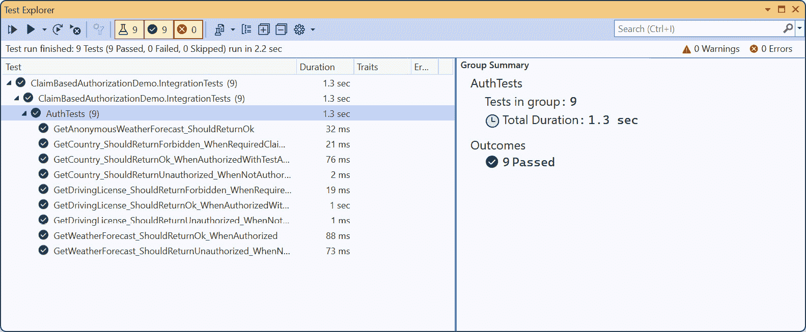
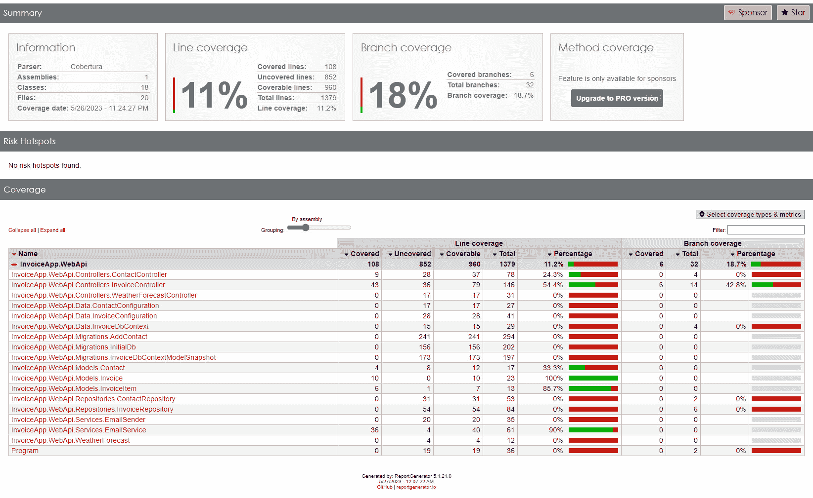
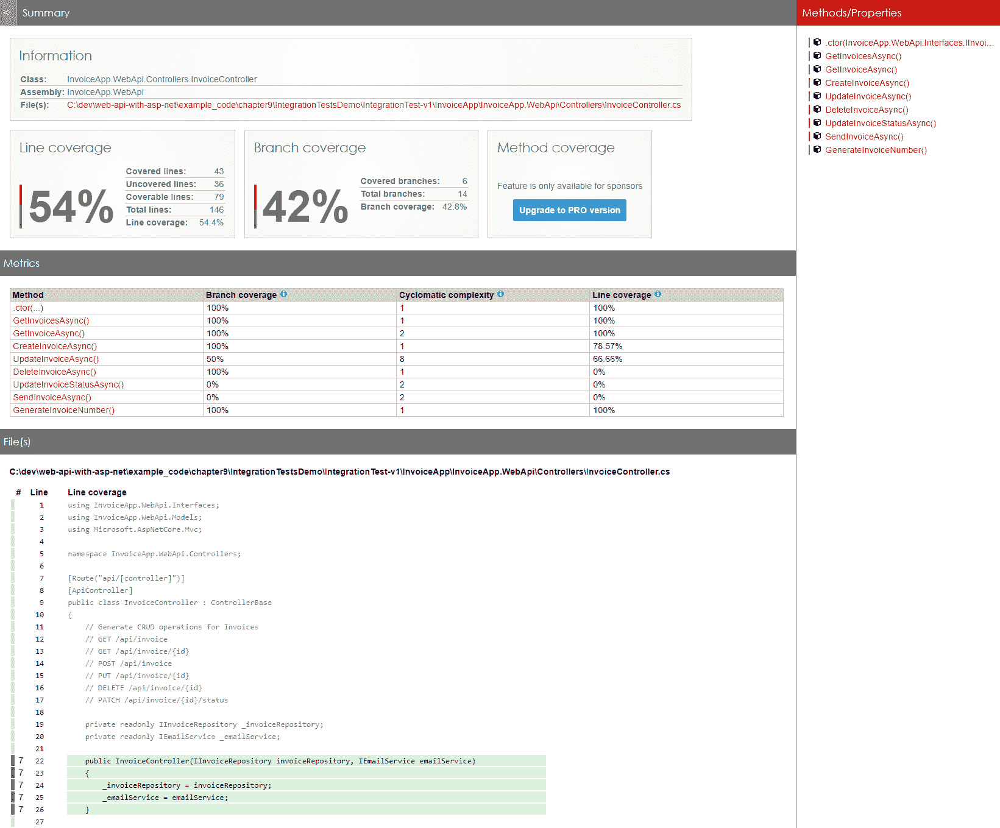
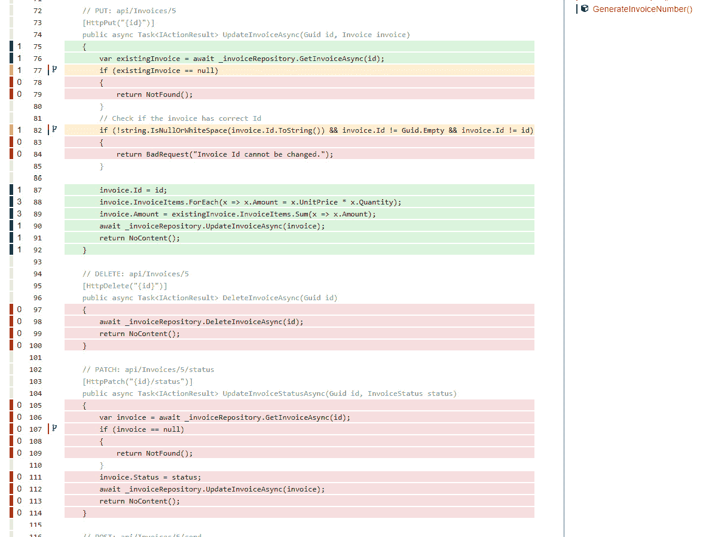

# 第十章：ASP.NET Core 中的测试（第二部分 - 集成测试）

在*第九章*中，我们学习了如何为 ASP.NET Core Web API 应用程序编写单元测试。单元测试用于测试独立的代码单元。然而，一个代码单元通常依赖于其他组件，例如数据库、外部服务等。为了彻底测试代码，我们需要在应用程序的上下文中测试代码单元。换句话说，我们需要测试代码单元如何与其他应用程序部分交互。这种测试类型被称为集成测试。

在本章中，我们将主要关注集成测试。我们将涵盖以下主题：

+   编写集成测试

+   带有身份验证和授权的测试

+   理解代码覆盖率

到本章结束时，您应该能够为 ASP.NET Core Web API 应用程序编写集成测试。

# 技术要求

本章中的代码示例可以在[`github.com/PacktPublishing/Web-API-Development-with-ASP.NET-Core-8`](https://github.com/PacktPublishing/Web-API-Development-with-ASP.NET-Core-8)找到。您可以使用 VS Code 或 VS 2022 打开解决方案。

# 编写集成测试

在单元测试中，我们直接创建控制器的实例。这种方法没有考虑到 ASP.NET Core 的某些特性，例如路由、模型绑定和验证等。为了彻底测试应用程序，我们需要编写集成测试。在本节中，我们将编写应用程序的集成测试。

与关注独立单元的单元测试不同，集成测试关注组件之间的交互。这些集成测试可能涉及不同的层，例如数据库、文件系统、网络、HTTP 请求/响应管道等。集成测试确保应用程序的组件按预期协同工作。因此，通常集成测试使用实际依赖项而不是模拟。此外，由于涉及更多组件，集成测试比单元测试慢。考虑到集成测试的成本，我们不需要编写太多的集成测试。相反，我们应该关注应用程序的关键部分。大多数时候，我们可以使用单元测试来覆盖其他部分。

您可以在 `IntegrationTestsDemo` 文件夹中找到本节的示例代码。代码基于我们在*第九章*中创建的 `InvoiceApp` 项目。您可以使用 VS 2022 或 VS Code 打开解决方案。我们将使用术语 **系统测试对象** (**SUT**) 来指代我们正在测试的 ASP.NET Core Web API 应用程序。

## 设置集成测试项目

我们可以继续使用 **xUnit** 作为集成测试的测试框架。一种好的做法是从单元测试项目中创建一个单独的集成测试项目。这种方法允许我们分别运行单元测试和集成测试，并且也使得为这两种类型的测试使用不同的配置变得更容易。

如果您正在使用 VS 2022，您可以通过右键单击解决方案并选择 `InvoiceApp.IntegrationTests` 来创建一个新的 xUnit 项目，然后点击 `InvoiceApp.WebApi` 项目以允许集成测试项目访问 Web API 项目中的类（参见 *第九章*）。

如果您正在使用 **.NET CLI**，您可以在终端中运行以下命令来创建一个新的 xUnit 测试项目：

```cs
dotnet new xunit -n InvoiceApp.IntegrationTestsdotnet sln InvoiceApp.sln add InvoiceApp.IntegrationTests/InvoiceApp.IntegrationTests.csproj
dotnet add InvoiceApp.IntegrationTests/InvoiceApp.IntegrationTests.csproj reference InvoiceApp.WebApi/InvoiceApp.WebApi.csproj
```

ASP.NET Core 提供了一个内置的测试 Web 服务器，我们可以用它来托管 SUT 以处理 HTTP 请求。使用测试 Web 服务器的优点是我们可以为测试环境使用不同的配置，并且它还可以节省网络流量，因为 HTTP 请求是在同一个进程中处理的。因此，使用测试 Web 服务器进行的测试比使用真实 Web 服务器进行的测试要快。要使用测试 Web 服务器，我们需要将 `Microsoft.AspNetCore.Mvc.Testing` NuGet 包添加到集成测试项目中。您可以在 VS 2022 中通过右键单击项目并选择 `Microsoft.AspNetCore.Mvc.Testing` 来添加包，并安装该包。

您也可以使用以下命令来添加包：

```cs
dotnet add InvoiceApp.IntegrationTests/InvoiceApp.IntegrationTests.csproj package Microsoft.AspNetCore.Mvc.Testing
```

默认的 `UnitTest1.cs` 文件可以被移除。

如果您想在测试中使用 **FluentAssertions**，请随意安装，正如我们在 *第九章* 的 *使用 FluentAssertions 验证测试结果* 部分中所展示的。

现在，我们可以开始编写集成测试。

## 使用 WebApplicationFactory 编写基本集成测试

让我们从简单的集成测试开始，检查 SUT 是否可以正确处理 HTTP 请求。示例应用程序有一个由 ASP.NET Core 项目模板提供的 `WeatherForecastController.cs` 控制器。它返回一组天气预报。我们可以编写一个集成测试来检查控制器是否返回预期的结果。

在 `InvoiceApp.IntegrationTests` 项目中创建一个名为 `WeatherForecastApiTests` 的新文件。然后向该文件添加以下代码：

```cs
public class WeatherForecastApiTests(WebApplicationFactory<Program> factory)    : IClassFixture<WebApplicationFactory<Program>>
{
}
```

在测试类中，我们使用 `WebApplicationFactory<T>` 类型创建一个测试 Web 主机，并将其用作类固定。这个类固定实例将在类中的所有测试之间共享。`WebApplicationFactory<T>` 类型由 `Microsoft.AspNetCore.Mvc.Testing` 包提供。它是一个泛型类型，允许我们为指定的应用程序入口点创建测试 Web 主机。在这种情况下，我们使用 Web API 项目中定义的 `Program` 类作为入口点。但你会看到一个错误，说 `CS0122'Program' is inaccessible due to its protection level`。这是因为 `Program` 类默认定义为 `internal`。

为了解决这个问题，有两种方法：

+   打开 `InvoiceApp.WebApi.csproj` 文件，并向文件中添加以下行：

    ```cs
    <ItemGroup>     <InternalsVisibleTo Include="MyTestProject" /></ItemGroup>
    ```

    将 `MyTestProject` 替换为你的测试项目名称，例如 `InvoiceApp.IntegrationTests`。这种方法允许测试项目访问 Web API 项目的内部成员。

+   或者，你可以将 `Program` 类的访问修饰符更改为 `public`。将以下代码添加到 `Program.cs` 文件的末尾：

    ```cs
    public partial class Program { }
    ```

你可以使用这两种方法中的任何一种来解决问题。之后，我们可以编写测试方法，如下所示：

```cs
[Fact]public async Task GetWeatherForecast_ReturnsSuccessAndCorrectContentType()
{
    // Arrange
    var client = factory.CreateClient();
    // Act
    var response = await client.GetAsync("/WeatherForecast");
    // Assert
    response.EnsureSuccessStatusCode(); // Status Code 200-299
    Assert.Equal("application/json; charset=utf-8", response.Content.Headers.ContentType.ToString());
    // Deserialize the response
    var responseContent = await response.Content.ReadAsStringAsync();
    var weatherForecast = JsonSerializer.Deserialize<List<WeatherForecast>>(responseContent, new JsonSerializerOptions
    {
        PropertyNameCaseInsensitive = true
    });
    weatherForecast.Should().NotBeNull();
    weatherForecast.Should().HaveCount(5);
}
```

在测试方法中，我们首先使用 `WebApplicationFactory<T>` 实例创建 `HttpClient` 类的实例。然后，我们向 `/WeatherForecast` 端点发送 HTTP `GET` 请求。`EnsureSuccessStatusCode` 方法确保响应的状态码在 *200-299* 范围内。然后我们检查响应的内容类型是否为 `application/json; charset=utf-8`。最后，我们将响应内容反序列化为 `WeatherForecast` 对象的列表，并检查列表是否包含五个项目。

由于这个控制器没有任何依赖项，测试很简单。如果控制器有依赖项，比如数据库上下文、其他服务或其他外部依赖项，怎么办？我们将在以下章节中看到如何处理这些场景。

## 使用数据库上下文进行测试

在示例应用程序中，`ContactController` 类有依赖项，例如 `IContactRepository` 接口。`ContactRepository` 类实现了这个接口，并使用 `InvoiceContext` 类来访问数据库。因此，如果我们想测试系统单元（SUT）是否能够正确处理 HTTP 请求，我们需要创建一个测试数据库，并配置测试 Web 主机使用测试数据库。类似于单元测试，我们也可以为集成测试使用一个单独的数据库。

`WebApplicationFactory<T>` 类型提供了一种配置测试 Web 主机的方式。我们可以重写 `ConfigureWebHost` 方法来配置测试 Web 主机。例如，我们可以用测试数据库上下文替换默认的数据库上下文。让我们创建一个新的测试固定类 `CustomIntegrationTestsFixture` 并向该类添加以下代码：

```cs
public class CustomIntegrationTestsFixture : WebApplicationFactory<Program>{
    private const string ConnectionString = @"Server=(localdb)\mssqllocaldb;Database=InvoiceIntegrationTestDb;Trusted_Connection=True";
    protected override void ConfigureWebHost(IWebHostBuilder builder)
    {
        // Set up a test database
        builder.ConfigureServices(services =>
        {
            var descriptor = services.SingleOrDefault(d => d.ServiceType == typeof(DbContextOptions<InvoiceDbContext>));
            services.Remove(descriptor);
            services.AddDbContext<InvoiceDbContext>(options =>
            {
                options.UseSqlServer(ConnectionString);
            });
        });
    }
}
```

在前面的代码中，我们重写了 `ConfigureWebHost()` 方法来配置 SUT 的测试 Web 主机。当测试 Web 主机被创建时，`Program` 类将首先执行，这意味着 `Program` 类中定义的默认数据库上下文将被创建。然后，`CustomIntegrationTestsFixture` 类中定义的 `ConfigureWebHost()` 方法将被执行。因此，我们需要使用 `services.SingleOrDefault(d => d.ServiceType == typeof(DbContextOptions<InvoiceDbContext>))` 来找到默认的数据库上下文，并将其从服务集合中移除。然后，我们添加一个新的数据库上下文，它使用测试数据库。这种方法允许我们为集成测试使用单独的数据库。我们还需要在初始化测试固定实例时创建测试数据库并播种一些测试数据。

你也可以在 `ConfigureWebHost()` 方法中添加更多对测试 Web 主机的自定义设置。例如，你可以配置测试 Web 主机使用不同的配置文件，如下所示：

```cs
builder.ConfigureAppConfiguration((context, config) =>{
    config.AddJsonFile("appsettings.IntegrationTest.json");
});
```

SUT 的测试 Web 主机的默认环境是 `Development`。如果你想使用不同的环境，可以使用 `UseEnvironment()` 方法，如下所示：

```cs
builder.UseEnvironment("IntegrationTest");
```

接下来，我们需要一种方法来创建测试数据库并播种一些测试数据。创建一个名为 `Utilities` 的静态类，并将以下代码添加到类中：

```cs
public static class Utilities{
    public static void InitializeDatabase(InvoiceDbContext context)
    {
        context.Database.EnsureDeleted();
        context.Database.EnsureCreated();
        SeedDatabase(context);
    }
    public static void Cleanup(InvoiceDbContext context)
    {
        context.Contacts.ExecuteDelete();
        context.Invoices.ExecuteDelete();
        context.SaveChanges();
        SeedDatabase(context);
    }
    private static void SeedDatabase(InvoiceDbContext context)
    {
        // Omitted for brevity
    }
}
```

`Utilities` 类包含一些静态方法，帮助我们管理测试数据库。在运行测试之前，我们需要初始化测试数据库，在运行更改数据库中数据的测试之后，我们需要清理测试数据库。

我们应该在什么时候初始化测试数据库？我们了解到，类固定实例是在测试类初始化之前创建的，并且在整个测试类中的所有测试方法之间共享。因此，我们可以在类固定实例中初始化测试数据库。更新 `CustomIntegrationTestsFixture` 类中的 `ConfigureWebHost()` 方法中的以下代码：

```cs
builder.ConfigureServices(services =>{
    var descriptor = services.SingleOrDefault(d => d.ServiceType == typeof(DbContextOptions<InvoiceDbContext>));
    services.Remove(descriptor);
    services.AddDbContext<InvoiceDbContext>(options =>
    {
        options.UseSqlServer(ConnectionString);
    });
    using var scope = services.BuildServiceProvider().CreateScope();
    var scopeServices = scope.ServiceProvider;
    var dbContext = scopeServices.GetRequiredService<InvoiceDbContext>();
    Utilities.InitializeDatabase(dbContext);
});
```

当 SUT 的测试 Web 主机被创建时，我们用测试数据库上下文替换默认的数据库上下文，并初始化测试数据库，这样测试类中的所有测试方法都可以使用相同的测试数据库。

接下来，我们可以创建一个新的测试类，命名为 `InvoicesApiTests`，用于测试 `/api/invoices` 端点。将以下代码添加到类中：

```cs
public class InvoicesApiTests(CustomIntegrationTestsFixture factory) : IClassFixture<CustomIntegrationTestsFixture>{
}
```

`InvoicesApiTests` 测试类将使用 `CustomIntegrationTestsFixture` 类的实例进行初始化。然后我们可以创建一些测试方法来测试 `/api/invoices` 端点。一个测试 `GET /api/invoices` 端点的方法可能如下所示：

```cs
[Fact]public async Task GetInvoices_ReturnsSuccessAndCorrectContentType()
{
    // Arrange
    var client = _factory.CreateClient();
    // Act
    var response = await client.GetAsync("/api/invoice");
    // Assert
    response.EnsureSuccessStatusCode(); // Status Code 200-299
    response.Content.Headers.ContentType.Should().NotBeNull();
    response.Content.Headers.ContentType!.ToString().Should().Be("application/json; charset=utf-8");
    // Deserialize the response
    var responseContent = await response.Content.ReadAsStringAsync();
    var invoices = JsonSerializer.Deserialize<List<Invoice>>(responseContent, new JsonSerializerOptions
    {
        PropertyNameCaseInsensitive = true
    });
    invoices.Should().NotBeNull();
    invoices.Should().HaveCount(2);
}
```

由于对 `GET /api/invoices` 端点的请求没有更改数据库，测试方法很简单。

接下来，让我们看看如何测试更改数据库的 `POST /api/invoices` 端点。一个测试此端点的方法可能如下所示：

```cs
[Fact]public async Task PostInvoice_ReturnsSuccessAndCorrectContentType()
{
    // Arrange
    var client = factory.CreateClient();
    var invoice = new Invoice
    {
        DueDate = DateTimeOffset.Now.AddDays(30),
        ContactId = Guid.Parse("8a9de219-2dde-4f2a-9ebd-b1f8df9fef03"),
        Status = InvoiceStatus.Draft,
        InvoiceItems = new List<InvoiceItem>
        {
            // Omitted for brevity        }
    };
    var json = JsonSerializer.Serialize(invoice);
    var data = new StringContent(json, Encoding.UTF8, "application/json");
    // Act
    var response = await client.PostAsync("/api/invoice", data);
    // Assert
    response.EnsureSuccessStatusCode(); // Status Code 200-299
    response.Content.Headers.ContentType.Should().NotBeNull();
    response.Content.Headers.ContentType!.ToString().Should().Be("application/json; charset=utf-8");
    // Deserialize the response
    var responseContent = await response.Content.ReadAsStringAsync();
    var invoiceResponse = JsonSerializer.Deserialize<Invoice>(responseContent, new JsonSerializerOptions
    {
        PropertyNameCaseInsensitive = true
    });
    invoiceResponse.Should().NotBeNull();
    invoiceResponse!.Id.Should().NotBeEmpty();
    invoiceResponse.Amount.Should().Be(500);
    invoiceResponse.Status.Should().Be(invoice.Status);
    invoiceResponse.ContactId.Should().Be(invoice.ContactId);
    // Clean up the database
    var scope = factory.Services.CreateScope();
    var scopedServices = scope.ServiceProvider;
    var db = scopedServices.GetRequiredService<InvoiceDbContext>();
    Utilities.Cleanup(db);
}
```

由于这个请求到`POST /api/invoices`端点会更改数据库，我们在运行测试后需要清理数据库。要获取数据库上下文的当前实例，我们需要创建一个新的作用域并从作用域中获取数据库上下文。然后我们可以使用`Utilities`类的`Cleanup`方法来清理数据库。

对`POST /api/invoices`端点的悲伤路径的测试可能看起来如下所示：

```cs
[Fact]public async Task PostInvoice_WhenContactIdDoesNotExist_ReturnsBadRequest()
{
    // Arrange
    var client = factory.CreateClient();
    var invoice = new Invoice
    {
        DueDate = DateTimeOffset.Now.AddDays(30),
        ContactId = Guid.NewGuid(),
        Status = InvoiceStatus.Draft,
        InvoiceItems = new List<InvoiceItem>
        {
            // Omitted for brevity
        }
    };
    var json = JsonSerializer.Serialize(invoice);
    var data = new StringContent(json, Encoding.UTF8, "application/json");
    // Act
    var response = await client.PostAsync("/api/invoice", data);
    // Assert
    response.StatusCode.Should().Be(HttpStatusCode.BadRequest);
}
```

根据你的需要添加更多集成测试。请注意，我们需要仔细管理测试数据库。如果你有多个更改数据库的测试类，你可能需要遵循我们在*第九章*中介绍的[*创建测试固定装置*]部分中使用的相同模式（使用锁或集合固定装置），以确保在每次测试类运行之前测试数据库是干净的，并在每次测试类运行后清理测试数据库。

例如，如果我们还有一个使用`CustomIntegrationTestsFixture`的`ContactsApiTests`类，xUnit 将并行运行`InvoicesApiTests`和`ContactsApiTests`。这可能会导致问题，因为这两个测试类会同时尝试初始化测试数据库。为了避免这个问题，我们可以将这些测试类放在一个集合中运行，以确保它们按顺序执行。

我们可以通过创建一个名为`CustomIntegrationTests`的测试集合，并将`CollectionDefinition`属性添加到`CustomIntegrationTestsCollection`类中来演示这一点。此属性将使我们能够定义集合及其关联的测试，如下所示：

```cs
[CollectionDefinition("CustomIntegrationTests")]public class CustomIntegrationTestsCollection : ICollectionFixture<CustomIntegrationTestsFixture>
{
}
```

然后，我们可以将`Collection`属性添加到`InvoicesApiTestsWithCollection`和`ContactsApiTestsWithCollection`类中。例如，`InvoicesApiTestsWithCollection`类可能看起来如下所示：

```cs
[Collection("CustomIntegrationTests")]public class InvoicesApiTestsWithCollection(CustomIntegrationTestsFixture factory) : IDisposable
{
    // Omitted for brevity
}
```

你可以在示例仓库中找到完整的源代码。请注意，正常的集成测试类`InvoicesApiTests`没有`Collection`属性，因此 xUnit 会将其与`CustomIntegrationTests`集合并行运行。为了避免冲突，我们可以跳过`InvoicesApiTests`类中的测试方法，如下所示：

```cs
[Fact(Skip = "This test is skipped to avoid conflicts with the test collection")]public async Task GetInvoices_ReturnsSuccessAndCorrectContentType()
{
    // Omitted for brevity
}
```

当你在示例仓库中运行测试时，请根据需要添加或注释掉`Skip`属性。

## 使用模拟服务进行测试

正如我们在*第九章*中解释的，单元测试应该专注于独立的代码单元。因此，单元测试通常使用模拟或存根服务来隔离被测试的代码与其他服务。另一方面，集成测试应该测试不同组件之间的集成。因此，从技术上讲，集成测试应该使用真实服务而不是模拟服务。

然而，在某些情况下，在集成测试中使用模拟依赖项可能会有所帮助。例如，在示例发票应用程序中，我们需要调用第三方服务来发送电子邮件。如果我们使用真实的电子邮件服务进行集成测试，它可能存在以下问题：

+   实际的电子邮件服务可能在测试环境中不可用。例如，电子邮件服务可能托管在不同的环境中，而测试环境可能无法访问电子邮件服务。

+   电子邮件服务可能有速率限制、严格的网络策略或其他可能引起集成测试问题或减慢测试执行速度的限制。

+   电子邮件服务可能在测试环境中造成不必要的成本，尤其是如果该服务基于使用量定价或需要付费订阅。如果我们频繁运行集成测试，可能会产生高额费用。

+   测试可能会影响生产环境，并为真实用户造成问题。

在这种情况下，在集成测试中使用模拟电子邮件服务可以帮助我们避免这些问题，从而使我们能够更快、更有效地运行测试，避免影响生产，并节省成本。

让我们看看如何在集成测试中使用模拟电子邮件服务。我们用来发送电子邮件的服务是`IEmailSender`接口。我们可以在集成测试中注入一个实现`IEmailSender`接口的模拟服务。在测试类中创建一个新的测试方法：

```cs
[Theory][InlineData("7e096984-5919-492c-8d4f-ce93f25eaed5")]
[InlineData("b1ca459c-6874-4f2b-bc9d-f3a45a9120e4")]
public async Task SendInvoiceAsync_ReturnsSuccessAndCorrectContentType(string invoiceId)
{
    // Arrange
    var mockEmailSender = new Mock<IEmailSender>();
    mockEmailSender.Setup(x => x.SendEmailAsync(It.IsAny<string>(), It.IsAny<string>(), It.IsAny<string>()))
        .Returns(Task.CompletedTask).Verifiable();
    var client = factory.WithWebHostBuilder(builder =>
    {
        builder.ConfigureTestServices(services =>
        {
            var emailSender = services.SingleOrDefault(x => x.ServiceType == typeof(IEmailSender));
            services.Remove(emailSender);
            services.AddScoped<IEmailSender>(_ => mockEmailSender.Object);
        });
    }).CreateClient();
    // Act
    var response = await client.PostAsync($"/api/invoice/{invoiceId}/send", null);
    // Assert
    response.EnsureSuccessStatusCode(); // Status Code 200-299
    mockEmailSender.Verify(x => x.SendEmailAsync(It.IsAny<string>(), It.IsAny<string>(), It.IsAny<string>()), Times.Once);
    var scope = factory.Services.CreateScope();
    var scopedServices = scope.ServiceProvider;
    var db = scopedServices.GetRequiredService<InvoiceDbContext>();
    var invoice = await db.Invoices.FindAsync(Guid.Parse(invoiceId));
    invoice!.Status.Should().Be(InvoiceStatus.AwaitPayment);
}
```

在前面的代码中，我们使用`Moq`库创建了一个模拟电子邮件发送服务。SUT 的测试 Web 宿主提供了一个`WithWebHostBuilder()`方法来配置 Web 宿主构建器。在这个方法中，我们可以使用`ConfigureTestServices()`方法配置 Web 宿主的服务集合。类似于我们在[*使用数据库上下文进行测试*]部分中引入的模拟数据库上下文，我们找到已注册的`IEmailSender`服务并将其从服务集合中移除，然后添加模拟服务到服务集合中。最后，我们创建 HTTP 客户端并向 API 端点发送请求。如果正确使用了模拟服务，测试应该通过。

总结来说，是否在集成测试中使用模拟服务应根据具体情况决定，并取决于测试的具体要求和目标。在某些场景下，模拟可能很有用，但不应过度使用，否则集成测试可能无法反映真实世界的场景。

如果你的 Web API 项目运行在微服务架构中，你可能需要在集成测试中调用其他微服务。在这种情况下，你可以使用相同的方法来模拟 HTTP 客户端和 HTTP 响应。集成测试可能会更复杂。我们在这里停止，并在下一章讨论微服务架构时再进一步探讨。

# 使用身份验证和授权进行测试

在 Web API 中，一个常见的场景是某些 API 端点需要身份验证和授权。我们在*第八章*中介绍了如何实现身份验证和授权。在本节中，我们将讨论如何测试需要身份验证和授权的 API 端点。

## 准备示例应用程序

为了演示带有身份验证和授权的测试，我们将使用我们在*第八章*中创建的示例应用程序。您可以在示例仓库的 `chapter10\AuthTestsDemo\start\` 文件夹中找到源代码。这个示例应用程序使用基于声明的身份验证和授权。您可以在*第八章*中回顾实现细节。

在 `WeatherForecastController` 中，有几个需要身份验证和授权的方法。（请原谅命名方式——我们只是使用了 ASP.NET Core Web API 的默认模板。）

按照在“设置集成测试项目”部分所述创建一个新的集成测试项目。您需要确保集成测试项目已安装以下 NuGet 包：

+   `Microsoft.AspNetCore.Mvc.Testing`：这是 SUT 的测试 Web 主机

+   `xUnit`：这是一个测试框架

+   `Moq`：这是一个模拟库

+   `FluentAssertions`：这是一个断言库（可选）

如果您想在 VS 2022 中运行测试，您还需要安装 `xunit.runner.visualstudio`，这是 VS 2022 的测试运行器。

还需将示例应用程序项目添加为引用。为了简单起见，我们将只关注身份验证和授权的集成测试。因此，这个演示不涉及数据库上下文和数据库。

您还需要将 `Program` 类设置为公共。只需在 `Program` 文件末尾添加以下代码：

```cs
public partial class Program { }
```

接下来，我们可以开始编写需要身份验证和授权的 API 端点的集成测试。

## 创建测试夹具

正如我们在*第九章*中“创建测试夹具”部分所解释的，我们可以创建一个测试夹具来在测试之间共享通用代码。创建一个名为 `IntegrationTestsFixture` 的新类，并添加以下代码：

```cs
public class IntegrationTestsFixture : WebApplicationFactory<Program>{
    protected override void ConfigureWebHost(IWebHostBuilder builder)
    {
        // This is where you can set up your test server with the services you need
        base.ConfigureWebHost(builder);
    }
}
```

这是一个简单的测试夹具，继承自 `WebApplicationFactory<Program>` 类。由于我们在这个演示中不需要设置任何服务，因此在 `ConfigureWebHost` 方法中没有自定义代码。如果您需要设置服务，可以在该方法中完成。

## 创建测试类

接下来，我们可以创建测试类。创建一个名为 `AuthTests` 的新类，并添加以下代码：

```cs
public class AuthTests(IntegrationTestsFixture fixture) : IClassFixture<IntegrationTestsFixture>{
}
```

这与我们在*第九章*中“使用测试夹具”部分创建的测试类类似。它继承自 `IClassFixture<IntegrationTestsFixture>` 接口，并有一个接受 `IntegrationTestsFixture` 实例的构造函数。因此，测试类可以使用 `IntegrationTestsFixture` 实例来访问 SUT 的测试 Web 主机。到目前为止，测试类中还没有特殊的代码。

## 测试匿名 API 端点

接下来，让我们测试不需要身份验证和授权的 API 端点。在 `WeatherForecastController` 类中，复制 `Get()` 方法并将其粘贴到 `Get()` 方法下方。将新方法重命名为 `GetAnonymous()` 并添加 `AllowAnonymous` 属性。新方法应如下所示：

```cs
[AllowAnonymous][HttpGet("anonymous")]
public IEnumerable<WeatherForecast> GetAnonymous()
{
    // Omitted for brevity
}
```

现在，我们有一个新的 API 端点，它不需要身份验证和授权。在测试类中创建一个新的测试方法：

```cs
[Fact]public async Task GetAnonymousWeatherForecast_ShouldReturnOk()
{
    // Arrange
    var client = fixture.CreateClient();
    // Act
    var response = await client.GetAsync("/weatherforecast/anonymous");
    // Assert
    response.EnsureSuccessStatusCode(); // Status Code 200-299
    response.Content.Headers.ContentType.Should().NotBeNull();
    response.Content.Headers.ContentType!.ToString().Should().Be("application/json; charset=utf-8");
    // Deserialize the response
    var responseContent = await response.Content.ReadAsStringAsync();
    var weatherForecasts = JsonSerializer.Deserialize<List<WeatherForecast>>(responseContent, new JsonSerializerOptions
    {
        PropertyNameCaseInsensitive = true
    });
    weatherForecasts.Should().NotBeNull();
    weatherForecasts.Should().HaveCount(5);
}
```

这个测试方法与我们之前在 *第九章* 的 *使用测试用例* 部分中创建的测试方法没有太大区别。当我们使用 `CreateClient()` 方法时，没有特殊的代码来设置 `HttpClient`。因此，测试方法可以发送请求到 API 端点，而不需要任何身份验证和授权。因为这个端点允许匿名访问，所以测试应该通过。

## 测试授权的 API 端点

`WeatherForecastController` 类有一个 `Authorize` 属性。因此，没有 `AllowAnonymous` 属性的 API 端点需要身份验证和授权。让我们测试 `Get()` 方法的悲伤路径。在测试类中创建一个新的测试方法：

```cs
[Fact]public async Task GetWeatherForecast_ShouldReturnUnauthorized_WhenNotAuthorized()
{
    // Arrange
    var client = fixture.CreateClient();
    // Act
    var response = await client.GetAsync("/weatherforecast");
    // Assert
    response.StatusCode.Should().Be(HttpStatusCode.Unauthorized);
}
```

这种测试方法与之前的 `GetAnonymousWeatherForecast_ShouldReturnOk()` 方法类似，但我们期望状态码为 `401 Unauthorized`，因为 API 端点需要身份验证和授权。这个测试也应该通过。

接下来，我们需要在测试中设置身份验证和授权。有几种方法可以做到这一点：

+   在测试中，调用身份验证端点以获取访问令牌。然后将访问令牌添加到 HTTP 请求的 `Authorization` 头部。然而，这种方法不推荐，因为它需要额外的努力来维护凭证，如用户名、密码、客户端 ID、客户端密钥等。此外，测试可能无法在测试环境中访问身份验证端点。如果测试依赖于身份验证端点，它会增加测试的复杂性。

+   创建一个辅助方法来生成访问令牌。然后将访问令牌添加到 HTTP 请求的 `Authorization` 头部。这种方法不需要在测试中调用身份验证端点。然而，这意味着我们需要知道如何生成访问令牌。如果身份验证逻辑由第三方提供者提供，我们可能无法在测试中实现相同的实现。因此，只有在我们对身份验证逻辑有完全控制权的情况下，它才可用。

+   使用 `WebApplicationFactory` 来设置身份验证和授权，并创建一个自定义的 `AuthenticationHandler` 来模拟身份验证和授权过程。这种方法更实用，因为它不需要在测试中调用身份验证端点。此外，它不需要在测试项目中重复身份验证逻辑。

由于我们有包含认证逻辑的示例应用程序的源代码，我们可以演示如何使用第二种方法，然后我们将向您展示如何使用第三种方法。

### 在测试中生成访问令牌

我们用来生成访问令牌的代码来自`AccountController`类，这是认证端点。我们可以在`AccountController`类中找到一个名为`GenerateToken`的方法。当用户成功登录时，会调用此方法。在`IntegrationTestsFixture`类中创建一个新的方法：

```cs
public string? GenerateToken(string userName){
    using var scope = Services.CreateScope();
    var configuration = scope.ServiceProvider.GetRequiredService<IConfiguration>();
    var secret = configuration["JwtConfig:Secret"];
    var issuer = configuration["JwtConfig:ValidIssuer"];
    var audience = configuration["JwtConfig:ValidAudiences"];
    // Omitted for brevity
    var securityToken = tokenHandler.CreateToken(tokenDescriptor);
    var token = tokenHandler.WriteToken(securityToken);
    return token;
}
```

在前面的方法中，我们使用`IConfiguration`服务从配置中获取密钥、发行者和受众。然后，我们将`AccountController`类中的`GenerateToken()`方法的代码复制过来以生成访问令牌。请注意，配置来自主 Web API 项目中的`appsettings.json`文件。由于我们没有更改测试 Web 宿主的配置，因此配置与主 Web API 项目中的配置相同。但如果你需要为测试使用不同的配置，请在`IntegrationTestsFixture`类中的`ConfigureWebHost`方法中添加适当的代码以应用任何更改，正如我们在*创建测试* *fixture*部分中介绍的那样。

接下来，我们可以使用`AuthTest`类中的`GenerateToken`方法。在测试类中创建一个新的测试方法：

```cs
[Fact]public async Task GetWeatherForecast_ShouldReturnOk_WhenAuthorized()
{
    // Arrange
    var token = fixture.GenerateToken("TestUser");
    var client = fixture.CreateClient();
    client.DefaultRequestHeaders.Authorization = new AuthenticationHeaderValue("Bearer", token);
    // Act
    var response = await client.GetAsync("/weatherforecast");
    // Assert
    response.EnsureSuccessStatusCode(); // Status Code 200-299
    // Omited for brevity
}
```

在这个测试方法中，我们调用`GenerateToken()`方法生成访问令牌，然后将访问令牌添加到 HTTP 请求的`Authorization`头中。因为生成令牌的逻辑与认证端点相同，所以测试应该通过。

### 使用自定义认证处理器

测试授权的 API 端点另一种方法是使用自定义认证处理器。自定义认证处理器可以模拟认证和授权过程。因此，我们可以用它来测试授权的 API 端点而不调用认证端点。这是测试授权 API 端点的推荐方法，因为它不需要任何其他依赖项，也不需要在测试项目中重复认证逻辑。

在实际的认证过程中，我们需要生成一个包含已认证用户声明的 JWT 令牌，并将其添加到 HTTP 请求的`Authorization`头中。如果我们使用自定义认证处理器，我们可以跳过生成 JWT 令牌的过程，但我们需要找到一种方法来定义所需的声明并将它们传递给自定义认证处理器。我们可以在请求头中简单地添加声明，然后在自定义认证处理器中读取这些值以创建`ClaimsPrincipal`对象。让我们演示如何做到这一点。

要使用自定义认证处理器，首先创建一个名为`TestAuthHandler`的新类，它继承自`AuthenticationHandler`类：

```cs
public class TestAuthHandler : AuthenticationHandler<AuthenticationSchemeOptions>{
    public const string AuthenticationScheme = "TestScheme";
    public const string UserNameHeader = "UserName";
    public const string CountryHeader = "Country";
    public const string AccessNumberHeader = "AccessNumber";
    public const string DrivingLicenseNumberHeader = "DrivingLicenseNumber";
    public TestAuthHandler(IOptionsMonitor<AuthenticationSchemeOptions> options, ILoggerFactory logger,
        UrlEncoder encoder, ISystemClock clock) : base(options, logger, encoder, clock)
    {
    }
    protected override Task<AuthenticateResult> HandleAuthenticateAsync()
    {
        return Task.FromResult(result);
    }
}
```

在前面的代码中，我们定义了身份验证方案名称为`TestScheme`，这是实际方案名称`Bearer`的一个替代名称。您可以在`Program`类中找到其定义。我们还定义了一些 HTTP 头名称，我们将使用它们将声明传递给自定义身份验证处理程序。`HandleAuthenticateAsync()`是我们需要重写以实现身份验证逻辑的方法。我们将在以下代码中实现它。

理念是在测试中创建请求时，我们只需简单地将声明添加到请求头中。这样，自定义身份验证处理程序就可以从请求头中读取值，并将`HandleAuthenticateAsync()`方法更新如下：

```cs
protected override Task<AuthenticateResult> HandleAuthenticateAsync(){
    var claims = new List<Claim>();
    if (Context.Request.Headers.TryGetValue(UserNameHeader, out var userName))
    {
        claims.Add(new Claim(ClaimTypes.Name, userName[0]));
    }
    if (Context.Request.Headers.TryGetValue(CountryHeader, out var country))
    {
        claims.Add(new Claim(ClaimTypes.Country, country[0]));
    }
    if (Context.Request.Headers.TryGetValue(AccessNumberHeader, out var accessNumber))
    {
        claims.Add(new Claim(AppClaimTypes.AccessNumber, accessNumber[0]));
    }
    if (Context.Request.Headers.TryGetValue(DrivingLicenseNumberHeader, out var drivingLicenseNumber))
    {
        claims.Add(new Claim(AppClaimTypes.DrivingLicenseNumber, drivingLicenseNumber[0]));
    }
    // You can add more claims here if you want
    var identity = new ClaimsIdentity(claims, AuthenticationScheme);
    var principal = new ClaimsPrincipal(identity);
    var ticket = new AuthenticationTicket(principal, AuthenticationScheme);
    var result = AuthenticateResult.Success(ticket);
    return Task.FromResult(result);
}
```

我们不是从 JWT 令牌中获取声明，而是从请求头中获取声明。如果值存在，我们将它们添加到`ClaimsIdentity`对象中。然后我们创建`ClaimsPrincipal`对象和`AuthenticationTicket`对象。最后，我们返回带有`Success`状态的`AuthenticateResult`对象。此方法模拟了身份验证过程，避免了生成 JWT 令牌的需要，但它仍然创建了我们需要测试授权 API 端点的`ClaimsPrincipal`对象。

接下来，我们可以通过使用自定义身份验证处理程序来测试授权的 API 端点。在`WeatherForecastController`类中，我们可以找到一个`GetDrivingLicense`方法，这是一个需要`DrivingLicenseNumber`声明的授权 API 端点。我们可以在`AuthTest`类中创建一个新的测试方法，如下所示：

```cs
[Fact]public async Task GetDrivingLicense_ShouldReturnOk_WhenAuthorizedWithTestAuthHandler()
{
    // Arrange
    var client = fixture.WithWebHostBuilder(builder =>
    {
        builder.ConfigureTestServices(services =>
        {
            services.AddAuthentication(options =>
                {
                    options.DefaultAuthenticateScheme = TestAuthHandler.AuthenticationScheme;
                    options.DefaultChallengeScheme = TestAuthHandler.AuthenticationScheme;
                    options.DefaultScheme = TestAuthHandler.AuthenticationScheme;
                })
                .AddScheme<AuthenticationSchemeOptions, TestAuthHandler>(TestAuthHandler.AuthenticationScheme,
                    options => { });
        });
    }).CreateClient();
    client.DefaultRequestHeaders.Authorization = new AuthenticationHeaderValue(TestAuthHandler.AuthenticationScheme);
    client.DefaultRequestHeaders.Add(TestAuthHandler.UserNameHeader, "Test User");
    client.DefaultRequestHeaders.Add(TestAuthHandler.CountryHeader, "New Zealand");
    client.DefaultRequestHeaders.Add(TestAuthHandler.AccessNumberHeader, "123456");
    client.DefaultRequestHeaders.Add(TestAuthHandler.DrivingLicenseNumberHeader, "12345678");
    // Act
    var response = await client.GetAsync("/weatherforecast/driving-license");
    // Assert
    response.EnsureSuccessStatusCode(); // Status Code 200-299
    response.Content.Headers.ContentType.Should().NotBeNull();
    response.Content.Headers.ContentType!.ToString().Should().Be("application/json; charset=utf-8");
}
```

在这个测试方法中，我们使用`WithWebHostBuilder`方法指定 SUT 的测试 Web 宿主，然后调用`AddAuthentication`方法指定身份验证方案。然后我们调用`AddScheme`方法将`TestAuthHandler`身份验证处理程序应用到身份验证服务上。有了这个定制的测试 Web 宿主，我们可以创建一个新的 HTTP 客户端。在我们使用这个 HTTP 客户端发送请求之前，我们需要添加指定身份验证方案的`Authorization`头。我们还为了简便起见将声明添加到请求头中，这样自定义身份验证处理程序就可以从请求头中读取值并创建`ClaimsPrincipal`对象。

然后，我们可以调用`GetAsync`方法向 API 端点发送 HTTP 请求。最后，我们可以验证响应状态码和响应内容类型，以确保请求成功。

前面的测试方法是针对正常路径的。为了测试未授权场景，我们可以创建一个新的测试方法，该方法不向请求添加`DrivingLicenseNumberHeader`头，并验证响应状态码为`401 Unauthorized`：

```cs
[Fact]public async Task GetDrivingLicense_ShouldReturnForbidden_WhenRequiredClaimsNotProvidedWithTestAuthHandler()
{
    // Arrange
    var client = fixture.WithWebHostBuilder(builder =>
    {
        builder.ConfigureTestServices(services =>
        {
            services.AddAuthentication(options =>
                {
                    options.DefaultAuthenticateScheme = TestAuthHandler.AuthenticationScheme;
                    options.DefaultChallengeScheme = TestAuthHandler.AuthenticationScheme;
                    options.DefaultScheme = TestAuthHandler.AuthenticationScheme;
                })
                .AddScheme<AuthenticationSchemeOptions, TestAuthHandler>(TestAuthHandler.AuthenticationScheme,
                    options => { });
        });
    }).CreateClient();
    client.DefaultRequestHeaders.Authorization = new AuthenticationHeaderValue(TestAuthHandler.AuthenticationScheme);
    client.DefaultRequestHeaders.Add(TestAuthHandler.UserNameHeader, "Test User");
    client.DefaultRequestHeaders.Add(TestAuthHandler.CountryHeader, "New Zealand");
    client.DefaultRequestHeaders.Add(TestAuthHandler.AccessNumberHeader, "123456");
    // Act
    var response = await client.GetAsync("/weatherforecast/driving-license");
    // Assert
    response.StatusCode.Should().Be(HttpStatusCode.Forbidden);
}
```

在前面的测试方法中，我们没有向请求添加`DrivingLicenseNumberHeader`头。因此，自定义身份验证处理程序找不到`DrivingLicenseNumber`声明，并将返回`Forbidden`状态码。

现在，我们发现前述测试方法中存在一些重复的代码。如果我们需要为每个测试方法设置测试 Web 主机并创建 HTTP 客户端，我们可以将这些代码移动到`IntegrationTestsFixture`类中。在`IntegrationTestsFixture`类中创建一个名为`CreateClientWithAuth`的方法：

```cs
public HttpClient CreateClientWithAuth(string userName, string country, string accessNumber, string drivingLicenseNumber){
    var client = WithWebHostBuilder(builder =>
    {
        builder.ConfigureTestServices(services =>
        {
            services.AddAuthentication(options =>
                {
                    options.DefaultAuthenticateScheme = TestAuthHandler.AuthenticationScheme;
                    options.DefaultChallengeScheme = TestAuthHandler.AuthenticationScheme;
                    options.DefaultScheme = TestAuthHandler.AuthenticationScheme;
                })
                .AddScheme<AuthenticationSchemeOptions, TestAuthHandler>(TestAuthHandler.AuthenticationScheme,
                    options => { });
        });
    }).CreateClient();
    client.DefaultRequestHeaders.Authorization = new AuthenticationHeaderValue(TestAuthHandler.AuthenticationScheme);
    client.DefaultRequestHeaders.Add(TestAuthHandler.UserNameHeader, userName);
    client.DefaultRequestHeaders.Add(TestAuthHandler.CountryHeader, country);
    client.DefaultRequestHeaders.Add(TestAuthHandler.AccessNumberHeader, accessNumber);
    client.DefaultRequestHeaders.Add(TestAuthHandler.DrivingLicenseNumberHeader, drivingLicenseNumber);
    return client;
}
```

`CreateClientWithAuth()`方法接受声明作为参数，然后使用定制的测试 Web 主机创建`HttpClient`。这样，我们可以轻松控制每个测试方法的声明。然后我们可以更新测试方法以使用此方法。例如，`GetCountry`端点的测试方法可以更新如下：

```cs
[Fact]public async Task GetCountry_ShouldReturnOk_WhenAuthorizedWithTestAuthHandler()
{
    // Arrange
    var client = fixture.CreateClientWithAuth("Test User", "New Zealand", "123456", "12345678");
    // Act
    var response = await client.GetAsync("/weatherforecast/country");
    // Assert
    response.EnsureSuccessStatusCode(); // Status Code 200-299
    response.Content.Headers.ContentType.Should().NotBeNull();
    response.Content.Headers.ContentType!.ToString().Should().Be("application/json; charset=utf-8");
}
[Fact]
public async Task GetCountry_ShouldReturnForbidden_WhenRequiredClaimsNotProvidedWithTestAuthHandler()
{
    // Arrange
    // As we don't provide the country claim, the request will be forbidden
    var client = fixture.CreateClientWithAuth("Test User", "", "123456", "12345678");
    // Act
    var response = await client.GetAsync("/weatherforecast/country");
    // Assert
    response.StatusCode.Should().Be(HttpStatusCode.Forbidden);
}
```

现在我们可以验证测试方法是否仍然按预期工作。



图 10.1 – 在 VS 2022 中测试方法按预期通过

注意，如果你需要，你也可以自定义`AuthenticationSchemeOptions`类。例如，你可以定义一个继承自`AuthenticationSchemeOptions`类的`TestAuthHandlerOptions`类，如下所示：

```cs
public class TestAuthHandlerOptions : AuthenticationSchemeOptions{
    public string UserName { get; set; } = string.Empty;
}
```

然后，你可以在`ConfigureTestServices`方法中配置`TestAuthHandlerOptions`：

```cs
var client = fixture.WithWebHostBuilder(builder =>{
    builder.ConfigureTestServices(services =>
    {
        services.Configure<TestAuthHandlerOptions>(options =>
        {
            options.UserName = "Test User";
        });
        services.AddAuthentication(options =>
            {
                options.DefaultAuthenticateScheme = TestAuthHandler.AuthenticationScheme;
                options.DefaultChallengeScheme = TestAuthHandler.AuthenticationScheme;
                options.DefaultScheme = TestAuthHandler.AuthenticationScheme;
            })
            .AddScheme<TestAuthHandlerOptions, TestAuthHandler>(TestAuthHandler.AuthenticationScheme,
                options => { });
    });
}).CreateClient();
```

`TestAuthHandler`类现在应该更新如下：

```cs
public class TestAuthHandler : AuthenticationHandler<TestAuthHandlerOptions>{
    public readonly string _userName;
    public TestAuthHandler(IOptionsMonitor<TestAuthHandlerOptions> options, ILoggerFactory logger,
    UrlEncoder encoder, ISystemClock clock) : base(options, logger, encoder, clock)
    {
        // Get the user name from the options
        _userName = options.CurrentValue.UserName;
    }
}
```

`TestAuthHandler`类现在可以从`TestAuthHandlerOptions`类中获取用户名。你还可以在`TestAuthHandlerOptions`类中定义其他属性，然后在使用`TestAuthHandler`类时使用它们。

如果你的项目不使用基于声明的授权，你也可以定义一个自定义授权处理程序来实现授权逻辑。请查阅官方文档以获取更多信息：[`learn.microsoft.com/en-us/aspnet/core/security/authentication/`](https://learn.microsoft.com/en-us/aspnet/core/security/authentication/)。

# 代码覆盖率

现在我们已经涵盖了 ASP.NET Core 中的单元测试和集成测试。在本节中，我们将讨论**代码覆盖率**，这是一个衡量在测试过程中测试套件覆盖应用程序源代码程度的指标。

代码覆盖率是衡量软件质量的重要指标。如果代码覆盖率低，这意味着代码中有许多部分没有被测试覆盖。在这种情况下，我们无法确信代码按预期工作。此外，当我们对代码进行更改或重构时，我们不确定这些更改是否会破坏现有代码。

代码覆盖率可以提供关于哪些代码部分被测试（或未被测试）的见解。它可以帮助我们识别可能需要额外测试的区域，并确保代码得到彻底测试。

代码覆盖率在评估测试过程的有效性和可靠性方面起着至关重要的作用。通过分析代码覆盖率，我们可以对代码的质量有信心，并识别潜在的薄弱环节或未测试的代码。足够的代码覆盖率对于提高代码质量和降低错误和缺陷的风险至关重要。

需要注意的是，代码覆盖率不是代码质量的唯一指标。虽然高代码覆盖率是可取的，但达到 100%的代码覆盖率并不能保证代码没有错误。代码覆盖率应与其他因素相结合，如有效的测试设计、代码审查、静态分析、手动测试等。此外，代码设计、架构和开发实践等因素也会影响代码质量。我们需要在代码覆盖率和其他因素之间找到平衡。

分析代码覆盖率，我们有两个步骤：

+   **收集测试数据**：数据收集器可以在测试运行期间监控测试执行并收集代码覆盖率数据。它可以以不同的格式报告代码覆盖率数据，如 XML 或 JSON。

+   **生成报告**：报告生成器可以读取收集的数据并生成代码覆盖率报告，通常以 HTML 格式。

让我们看看如何使用数据收集器和报告生成器。我们将使用`InvoiceApp`项目作为示例。您可以在`chapter10\IntegrationTestsDemo\IntegrationTest-v1`文件夹中找到示例项目。

## 使用数据收集器

要使用数据收集器，我们可以使用**Coverlet**。Coverlet 是一个跨平台的.NET 代码覆盖率框架，支持行、分支和方法覆盖率。它可以作为.NET Core 全局工具或 NuGet 包使用。更多信息，请查看 GitHub 上的 Coverlet 仓库：[`github.com/coverlet-coverage/coverlet`](https://github.com/coverlet-coverage/coverlet)。

xUnit 项目模板已经包含了 Coverlet 包。如果您的测试项目没有包含 Coverlet 包，您可以通过在包管理控制台运行以下命令来安装它：

```cs
dotnet add package coverlet.collector
```

要获取覆盖率数据，导航到测试项目文件夹，并运行以下命令：

```cs
dotnet test --collect:"XPlat Code Coverage"
```

`--collect:"XPlat Code Coverage"`选项告诉`dotnet test`命令收集代码覆盖率数据。"XPlat Code Coverage"参数是收集器的友好名称。您可以使用任何喜欢的名称，但请注意，它不区分大小写。代码覆盖率数据将保存在`TestResults`文件夹中。您可以在`coverage.cobertura.xml`文件中找到代码覆盖率数据。文件夹结构是`/TestResults/{GUID}/coverage.cobertura.xml`。

这里是`coverage.cobertura.xml`文件的示例：

```cs
<?xml version="1.0" encoding="utf-8"?><coverage line-rate="0.1125" branch-rate="0.1875" version="1.9" timestamp="1685100267" lines-covered="108" lines-valid="960" branches-covered="6" branches-valid="32">
  <sources>
    <source>C:\dev\web-api-with-asp-net\example_code\chapter9\IntegrationTestsDemo\IntegrationTest-v1\InvoiceApp\InvoiceApp.WebApi\</source>
  </sources>
  <packages>
    <package name="InvoiceApp.WebApi" line-rate="0.1125" branch-rate="0.1875" complexity="109">
      <classes>
      ...
        <class name="InvoiceApp.WebApi.Services.EmailService" filename="Services\EmailService.cs" line-rate="1" branch-rate="1" complexity="2">
          <methods>
            <method name="GenerateInvoiceEmail" signature="(InvoiceApp.WebApi.Models.Invoice)" line-rate="1" branch-rate="1" complexity="1">
              <lines>
                <line number="19" hits="1" branch="False" />
                <line number="20" hits="1" branch="False" />
                <line number="21" hits="1" branch="False" />
                <!-- ... -->
                <line number="37" hits="1" branch="False" />
                <line number="38" hits="1" branch="False" />
              </lines>
            </method>
            <method name=".ctor" signature="(Microsoft.Extensions.Logging.ILogger`1&lt;InvoiceApp.WebApi.Interfaces.IEmailService&gt;,InvoiceApp.WebApi.Interfaces.IEmailSender)" line-rate="1" branch-rate="1" complexity="1">
              <lines>
                <line number="12" hits="3" branch="False" />
                <line number="13" hits="3" branch="False" />
                <line number="14" hits="3" branch="False" />
                <line number="15" hits="3" branch="False" />
                <line number="16" hits="3" branch="False" />
              </lines>
            </method>
          </methods>
          <lines>
            <line number="19" hits="1" branch="False" />
            <line number="20" hits="1" branch="False" />
            <line number="21" hits="1" branch="False" />
            <!-- ... -->
            <line number="37" hits="1" branch="False" />
            <line number="38" hits="1" branch="False" />
            <line number="12" hits="3" branch="False" />
            <line number="13" hits="3" branch="False" />
            <line number="14" hits="3" branch="False" />
            <line number="15" hits="3" branch="False" />
            <line number="16" hits="3" branch="False" />
          </lines>
        </class>
        ...
      </classes>
    </package>
  </packages>
</coverage>
```

在此代码中，我们可以看到以下信息：

+   `line-rate`：这是被测试覆盖的行数的百分比

+   `branch-rate`：这是被测试覆盖的分支的百分比

+   `lines-covered`：这是被测试覆盖的行数

+   `lines-valid`：这是源代码中的行数

+   `branches-covered`：这是被测试覆盖的分支数

+   `branches-valid`：这是源代码中的分支数

你还可以将 Coverlet 用作.NET 全局工具。为此，你可以运行以下命令来安装 Coverlet 作为.NET 全局工具：

```cs
dotnet tool install --global coverlet.console
```

然后你可以这样使用它：

```cs
coverlet /path/to/InvoiceApp.UnitTests.dll --target "dotnet" --targetargs "test /path/to/test-project --no-build"
```

请更新前面命令中的路径以匹配你的项目结构。`--no-build`选项用于跳过构建测试项目，这在已经构建了测试项目时很有用。

现在我们有了代码覆盖率数据。然而，`coverage.cobertura.xml`文件不是人类可读的。因此，我们必须生成一个人类可读的报告，我们将在下一节介绍。

## 生成代码覆盖率报告

为了更好地理解覆盖率数据，我们可以生成一个代码覆盖率报告。为此，我们可以使用`ReportGenerator` NuGet 包。**ReportGenerator**是一个可以将 Coverlet 生成的覆盖率数据转换为人类可读报告的工具。它还支持其他覆盖率格式，如**OpenCover**、**dotCover**、**NCover**等。

要安装 ReportGenerator，我们可以运行以下命令：

```cs
dotnet tool install -g dotnet-reportgenerator-globaltool
```

然后我们可以运行以下命令来生成代码覆盖率报告：

```cs
reportgenerator "-reports:/path/to/coverage.cobertura.xml" "-targetdir:coveragereport" "-reporttypes:Html;HtmlSummary"
```

请更新前面命令中的路径以匹配你的项目结构。

如果命令运行成功，你将在`coveragereport`文件夹中看到生成的 HTML 报告。你可以在浏览器中打开`index.html`文件来查看报告。报告看起来像这样：



图 10.2 – 代码覆盖率报告概述

你可以检查每个类以查看代码覆盖率详情，如图*10.3*所示：



图 10.3 – 代码覆盖率详情概述

在*图 10.4*中，我们可以看到一些行没有被测试覆盖：



图 10.4 – 用红色突出显示的未通过测试的行概述

很遗憾，我们样本项目的代码覆盖率很糟糕。但幸运的是，它只是一个样本项目。在实际项目中，我们应该尽力提高代码覆盖率！

在本节中，我们学习了如何使用 Coverlet 和 ReportGenerator 生成代码覆盖率数据和报告。代码覆盖率是有效软件测试的一个重要方面。通过利用这些报告，开发人员和质量保证团队能够深入了解他们的测试质量和代码质量，这最终可以增强应用程序的可靠性和稳定性，并帮助我们自信地重构代码。

# 摘要

在本章中，我们讨论了如何为 ASP.NET Core 网络 API 应用程序编写集成测试。我们学习了如何创建测试固定装置来设置测试网络主机，以及如何在测试类中使用测试固定装置。我们还学习了如何测试授权端点并生成代码覆盖率数据和报告。

作为一名优秀的开发者，为你的代码编写测试非常重要。编写测试不仅是一种有益的实践，而且是一种有益的习惯。你可能发现你在编写测试上花费的时间比编写功能还要多，但这份努力是值得的。为了确保你的 ASP.NET 网络 API 应用程序能够正确运行，请确保编写单元测试和集成测试。这样做将有助于确保你的代码是可靠和安全的。

在下一章中，我们将探讨网络 API 的另一个方面：gRPC，这是一个高性能、开源的通用 RPC 框架。
