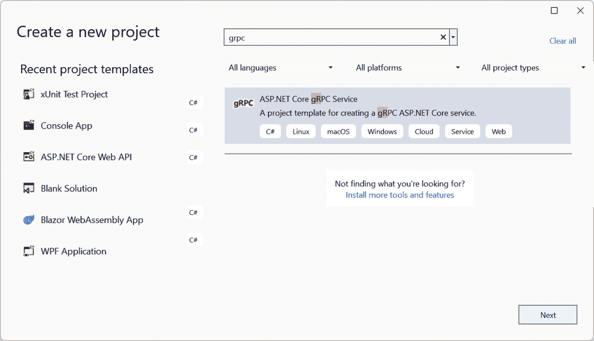
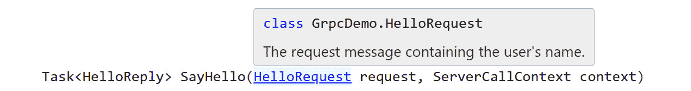
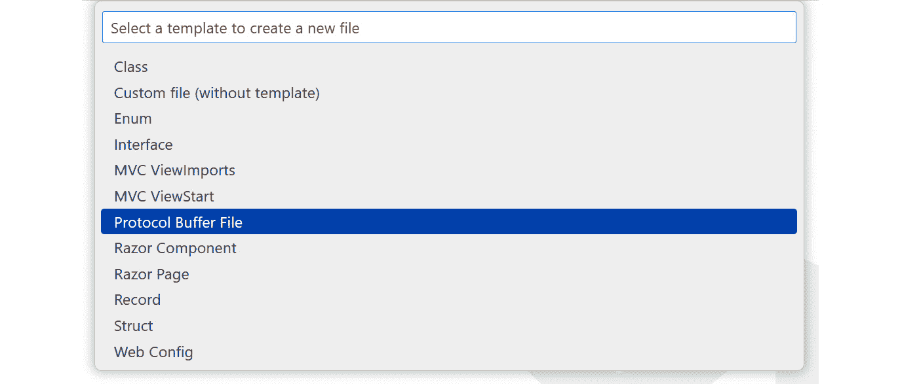

# 使用 gRPC 入门

除了 RESTful API 之外，还有其他类型的 API。其中之一是基于**远程过程调用**（**RPC**）的 API，我们在*第一章*中介绍了它。gRPC 是由 Google 开发的一个高性能 RPC 框架。现在，它是一个在 **Cloud Native Computing Foundation**（**CNCF**）下的开源项目，并且越来越受欢迎。

ASP.NET Core 提供了一套 gRPC 工具来帮助我们构建 gRPC 服务。在本章中，我们将介绍 gRPC 和 **Protocol Buffers**（**Protobuf**）消息的基础知识。首先，我们将学习如何定义 protobuf 消息和 gRPC 服务。然后，我们将学习如何在 ASP.NET Core 中实现 gRPC 服务，使我们能够无缝地在不同的应用程序之间进行通信。本章将涵盖以下主题：

+   gRPC 概述

+   设置 gRPC 项目

+   定义 gRPC 服务和消息

+   实现 gRPC 服务和客户端

+   在 ASP.NET Core 应用程序中消费 gRPC 服务

到本章结束时，你应该能够理解 protobuf 和 gRPC 的基础知识，并知道如何在 ASP.NET Core 中构建 gRPC 服务。

# 技术要求

本章中的代码示例可以在[`github.com/PacktPublishing/Web-API-Development-with-ASP.NET-Core-8/tree/main/samples/chapter11`](https://github.com/PacktPublishing/Web-API-Development-with-ASP.NET-Core-8/tree/main/samples/chapter11)找到。你可以使用 VS 2022 或 VS Code 打开解决方案。

# gRPC 概述

如果你已经阅读了*第一章*，你应该熟悉 RPC 的概念——它是一种允许程序在远程机器上调用过程的协议。与围绕资源中心的 RESTful API 不同，基于 RPC 的 API 侧重于操作。因此，RPC 方法支持除 CRUD 操作之外的各种类型的操作。

gRPC 是最受欢迎的 RPC 框架之一。它比传统的 RPC 框架提供了许多优势。正如我们在*第一章*中提到的，gRPC 基于 HTTP/2，比 HTTP/1.1 更高效。gRPC 使用 protobuf 作为默认的数据序列化格式，它是一种比 JSON 更紧凑、更高效的二进制格式。gRPC 的工具支持也非常好。它遵循“契约优先”的方法，这意味着我们可以创建语言中性的服务定义并为不同的语言生成代码。它还支持流，这对于实时通信是一个非常有用的功能。

随着微服务的日益流行，gRPC 越来越受欢迎。虽然 gRPC 在某些方面优于 RESTful API，但它并不被视为完全的替代品。gRPC 是微服务之间高性能、低延迟通信的绝佳选择，但 RESTful API 更适合基于 Web 的应用程序和需要简单性、灵活性和广泛采用的场景。根据你特定用例的需求选择正确的协议非常重要。在下一节中，我们将学习如何在 ASP.NET Core 中设置 gRPC 项目。

# 设置 gRPC 项目

在本节中，我们将使用 dotnet CLI 构建一个 gRPC 项目。我们还将创建一个客户端项目以消费 gRPC 服务。我们将在本章中使用相同的项目。

## 创建新的 gRPC 项目

要创建一个新的 gRPC 项目，我们可以使用 `dotnet new` 命令。dotnet CLI 为 gRPC 项目提供了一个模板，其中包括一个基本的 gRPC 服务。我们可以使用以下命令创建一个新的 gRPC 项目：

```cs
dotnet new grpc -o GrpcDemo
```

`-o` 选项指定输出目录。运行命令后，我们将看到创建了一个名为 `GrpcDemo` 的项目。

如果你更喜欢使用 VS 2022，你也可以使用内置的 gRPC 模板在 VS 2022 中创建一个新的 gRPC 项目。创建新项目时，可以选择 **ASP.NET Core gRPC Service** 模板，如图 11.1* 所示：



图 11.1 – 在 VS 2022 中创建新的 gRPC 项目

创建项目后，你可以使用 VS Code 或 VS 2022 打开项目。接下来，我们将探索项目结构。

## 理解 gRPC 项目结构

gRPC 项目的项目结构与 RESTful API 项目有所不同。gRPC 项目中没有 `Controllers` 文件夹。相反，有一个 `Protos` 文件夹，其中包含 proto 文件。你可以在 `Protos` 文件夹中找到一个 `greet.proto` 文件，如下所示：

```cs
syntax = "proto3";option csharp_namespace = "GrpcDemo";
package greet;
// The greeting service definition.
service Greeter {
  // Sends a greeting
  rpc SayHello (HelloRequest) returns (HelloReply);
}
// The request message containing the user's name.
message HelloRequest {
  string name = 1;
}
// The response message containing the greetings.
message HelloReply {
  string message = 1;
}
```

gRPC 使用 protobuf 作为默认的数据序列化格式。`greet.proto` 文件是定义 gRPC 服务和消息的 proto 文件。如果你熟悉 RESTful API，你可以将此文件视为 Swagger 文件（OpenAPI 规范）。它是 gRPC 服务的契约。在先前的 proto 文件中，我们定义了一个名为 `Greeter` 的服务，其中包含一个名为 `SayHello()` 的方法。`SayHello()` 方法接收一个 `HelloRequest` 消息作为输入，并返回一个 `HelloReply` 消息作为输出。`HelloRequest` 和 `HelloReply` 消息分别具有名为 `name` 和 `message` 的字符串属性。

在 proto 文件中，你可以使用 `//` 来添加注释。要添加多行注释，可以使用 `/* ... */`。

重要提示

VS Code 默认不提供 proto 文件的语法高亮。你可以安装一些扩展，例如 `vscode-proto3`，以启用语法高亮。

让我们检查项目文件。打开 `GrpcDemo.csproj` 文件；我们将看到以下内容：

```cs
<ItemGroup>  <Protobuf Include="Protos\greet.proto" GrpcServices="Server" />
</ItemGroup>
<ItemGroup>
  <PackageReference Include="Grpc.AspNetCore" Version="2.51.0" />
  <PackageReference Include="Google.Protobuf" Version="3.22.0-rc2" />
</ItemGroup>
```

您将看到它包含两个包引用：

+   `Grpc.AspNetCore`: 此包为 ASP.NET Core 提供了 gRPC 服务器库。它还引用了 `Grpc.Tools` 包，该包提供了代码生成工具。

+   `Google.Protobuf`: 此包提供了 `Protobuf` 运行时库。

有一个包含 proto 文件的 `Protobuf` 项目组。`GrpcServices` 属性指定了由 proto 文件生成的代码类型。它可以设置为以下值：

+   `None`: 不生成代码

+   `Client`: 此选项仅生成客户端代码

+   `Server`: 此选项仅生成服务器端代码

+   `Both`: 此选项生成客户端代码和服务器端代码。这是默认值

在模板项目中，`GrpcServices` 属性设置为 `Server`，这意味着仅生成服务器端代码。

如果您有多个 proto 文件，您可以在 `ItemGroup` 元素中添加多个 `Protobuf` 项目。

接下来，让我们检查 `Services` 文件夹。您可以在 `Services` 文件夹中找到 `GreeterService.cs` 文件，它包含了 `Greeter` 服务的实现：

```cs
public class GreeterService(ILogger<GreeterService> logger) : Greeter.GreeterBase{
    public override Task<HelloReply> SayHello(HelloRequest request, ServerCallContext context)
    {
        return Task.FromResult(new HelloReply
        {
            Message = "Hello " + request.Name
        });
    }
}
```

`GreeterService` 类继承自由 proto 文件生成的 `GreeterBase` 类。它有一个 `SayHello()` 方法，该方法接收一个 `HelloRequest` 对象作为输入，并返回一个 `HelloReply` 对象作为输出。`SayHello()` 方法的实现非常简单——它匹配 proto 文件中 `SayHello()` 方法的定义。

如果您将鼠标悬停在 VS Code 中的 `HelloRequest` 类上，您将看到一个弹出消息，显示 `HelloRequest` 类的命名空间为 `GrpcDemo.HelloRequest`，如图 *图 11.2* 所示。2*：



图 11.2 – HelloRequest 类的命名空间

`HelloReply` 类也类似。然而，您在项目中找不到 `HelloRequest` 类和 `HelloReply` 类。这些类在哪里定义的？

您可以按 *F12* 键跳转到 VS Code 中 `HelloRequest` 类的定义。您将被导航到位于 `obj\Debug\net8.0\Protos` 文件夹中的 `Greet.cs` 文件。此文件由 proto 文件生成，并包含 `HelloRequest` 类的定义：

```cs
  #region Messages  /// <summary>
  /// The request message containing the user's name.
  /// </summary>
  public sealed partial class HelloRequest : pb::IMessage<HelloRequest>
  {
    private static readonly pb::MessageParser<HelloRequest> _parser = new pb::MessageParser<HelloRequest>(() => new HelloRequest());
    // Omitted for brevity
    public HelloRequest() {
      OnConstruction();
    }
    // Omitted for brevity
    /// <summary>Field number for the "name" field.</summary>
    public const int NameFieldNumber = 1;
    private string name_ = "";
    [global::System.Diagnostics.DebuggerNonUserCodeAttribute]
    [global::System.CodeDom.Compiler.GeneratedCode("protoc", null)]
    public string Name {
      get { return name_; }
      set {
        name_ = pb::ProtoPreconditions.CheckNotNull(value, "value");
      }
    }
    // Omitted for brevity
  }
```

在 `HelloRequest` 类的定义中，我们可以看到它实现了 `IMessage<HelloRequest>` 接口，该接口定义在 `Google.Protobuf` 包中。所有 protobuf 消息都必须实现这个基接口。`HelloRequest` 类还有一个 `Name` 属性，它在 proto 文件中定义。你可以在 `Name` 属性上找到一个 `DebuggerNonUserCodeAttribute` 属性。这个属性意味着 `Name` 成员不是应用程序用户代码的一部分。`Name` 属性还有一个 `GeneratedCode` 属性，这意味着这个成员是由工具生成的。具体来说，`Name` 属性是由 `protoc` 工具生成的，它是 protobuf 编译器。用户不应修改此成员。

你还可以在 `Greet.cs` 文件中找到 `HelloReply` 类的定义。在 `Greet.cs` 文件旁边，在 `Protos` 文件夹中，你可以找到一个 `GreetGrpc.cs` 文件，它定义了 `GreeterBase` 抽象类作为 `GreeterService` 类的基类。同样，`GreeterBase` 类也是由 gRPC 工具生成的。它包含了 `SayHello()` 方法的定义，如下所示：

```cs
/// <summary>Base class for server-side implementations of Greeter</summary>[grpc::BindServiceMethod(typeof(Greeter), "BindService")]
public abstract partial class GreeterBase
{
  /// <summary>
  /// Sends a greeting
  /// </summary>
  /// <param name="request">The request received from the client.</param>
  /// <param name="context">The context of the server-side call handler being invoked.</param>
  /// <returns>The response to send back to the client (wrapped by a task).</returns>
  [global::System.CodeDom.Compiler.GeneratedCode("grpc_csharp_plugin", null)]
  public virtual global::System.Threading.Tasks.Task<global::GrpcDemo.HelloReply> SayHello(global::GrpcDemo.HelloRequest request, grpc::ServerCallContext context)
  {
    throw new grpc::RpcException(new grpc::Status(grpc::StatusCode.Unimplemented, ""));
  }
}
```

`GreeterBase` 类被标记为 `BindServiceMethod` 属性，这意味着这个方法是 proto 文件中定义的 `SayHello()` 方法的实现。`SayHello()` 方法有一个名为 `GeneratedCode` 的属性，表示这个类是由 gRPC C# 插件生成的。在 `SayHello()` 方法内部，你可以看到它默认会抛出一个异常。因为这个方法是 `virtual` 的，所以我们需要在 `GreeterService` 类中重写这个方法以提供实际的实现。

接下来，让我们检查 `Program.cs` 文件。你将在 `Program.cs` 文件中找到以下代码：

```cs
var builder = WebApplication.CreateBuilder(args);// Add services to the container.
builder.Services.AddGrpc();
var app = builder.Build();
// Configure the HTTP request pipeline.
app.MapGrpcService<GreeterService>();
```

在前面的代码块中，我们可以看到调用了 `AddGrpc()` 方法向服务容器添加 gRPC 服务。然后，我们使用 `MapGrpcService<GreeterService>()` 方法将 `GreeterService` 类映射到 gRPC 服务，这与 RESTful API 项目中的 `MapControllers` 方法类似。

在 `Program.cs` 文件中还有另一行代码，它使用 `MapGet()` 方法在用户通过网页浏览器访问应用程序的根路径时显示一条消息：

```cs
app.MapGet("/", () => "Communication with gRPC endpoints must be made through a gRPC client. To learn how to create a client, visit: https://go.microsoft.com/fwlink/?linkid=2086909");
```

这是因为 gRPC 服务不能通过网页浏览器访问。所以，我们需要显示一条消息来通知用户他们需要使用 gRPC 客户端来访问 gRPC 服务。

让我们更新 proto 文件并看看会发生什么。打开 `greet.proto` 文件并更新 `HelloRequest`，如下所示：

```cs
message HelloRequest {  string name = 1;
  string address = 2;
}
```

保存文件并返回到 `GreeterService` 类。在 `SayHello()` 方法中，你可以尝试访问 `HelloRequest` 对象的 `Address` 属性。你会发现 `Address` 属性不可用。这是因为生成的代码没有更新。我们需要通过使用 `dotnet build` 命令来重新生成代码。或者，你可以删除 `obj` 文件夹，代码将自动重新生成。

你可能会发现将生成的代码存储在 `obj` 文件夹中并不方便。我们可以通过在 `.csproj` 文件中的 `Protobuf` 项中使用 `OutputDir` 属性来更改生成的代码的输出目录。例如，你可以将 `Protobuf` 项更改为以下内容：

```cs
<ItemGroup>  <Protobuf Include="Protos\greet.proto" GrpcServices="Server" OutputDir="Generated" />
</ItemGroup>
```

现在，生成的代码将存储在 `Generated\Protos` 文件夹中。一个 proto 文件可以生成多个用于服务器端代码的文件。例如，`greet.proto` 文件将生成以下文件：

+   `greet.cs`: 此文件包含消息的定义以及序列化和反序列化消息的方法

+   `greetGrpc.cs`: 此文件包含服务基类的定义以及将服务绑定到服务器的方法

现在，我们已经了解了 gRPC 项目的结构，让我们学习 protobuf 消息背后的概念。

# 创建 protobuf 消息

在本节中，我们将学习如何创建 protobuf 消息。我们将介绍 protobuf 消息的概念以及如何在 proto 文件中定义它们。

gRPC 是一种以合同为先的框架，这意味着 gRPC 服务和消息必须在 proto 文件中定义。当我们谈论消息时，我们指的是客户端和服务器之间发送的数据。虽然 gRPC 消息可能与 RESTful API 中的数据模型相似，但它们并不相同。RESTful API 围绕资源，数据模型通常是资源模型，可以映射到一个或多个数据库表。相比之下，gRPC 是基于操作的，消息可以是任何其他类型的数据模型或客户端和服务器之间发送的其他消息。因此，gRPC 消息可能无法精确映射到 RESTful API 中的资源模型。

例如，当通过使用 JSON 作为数据格式的 RESTful API 创建发票时，我们需要向服务器发送一个带有 JSON 体的 HTTP POST 请求。JSON 体会反序列化为 .NET 对象，该对象作为发票的数据模型。要检索发票，我们需要向服务器发送一个 HTTP GET 请求，服务器会将数据模型序列化为 JSON 字符串并发送给客户端。我们可能还有其他操作，例如更新发票、删除发票等。所有这些操作都映射到 HTTP 方法。

要使用 gRPC 实现相同的功能，我们需要定义一个包含几个方法的 gRPC 服务：`CreateInvoice()`、`GetInvoice()`、`UpdateInvoice()`、`DeleteInvoice()`等。对于这些方法中的每一个，我们还必须定义相应的请求和响应消息。例如，`CreateInvoice()`方法需要一个包含发票属性的`CreateInvoiceRequest`消息，以及一个包含创建的发票 ID 的`CreateInvoiceResponse`消息。重要的是要注意，请求和响应消息与发票的数据模型不同，该模型用于在系统中表示发票实体。请求和响应消息用于在客户端和服务器之间发送数据。

注意，gRPC 和 protobuf 不是同一回事。protobuf 是一种语言无关、平台无关的数据序列化格式。gRPC 是一个使用 protobuf 作为默认数据序列化格式的框架。有时，这两个术语可以互换使用，但我们应该了解它们之间的区别。

想想我们之前提到的发票示例。发票有几个属性，例如发票号码、发票日期、客户名称、总金额等等。客户有一个名称和一个地址。地址有一些属性，例如街道、城市、州等等。

接下来，我们将定义第一个消息，该消息用于为发票服务创建地址。本节的源代码可以在`chapter11/GrpcDemo-v2`文件夹中找到。我们将从一个简单的消息开始，然后介绍有关 protobuf 消息的更多概念，包括字段编号、字段类型以及如何在 protobuf 消息中使用其他.NET 类型。我们还将学习如何使用`repeated`和`map`关键字实现列表和字典类型。

## 定义 protobuf 消息

在`Protos`文件夹中创建一个新的`invoice.proto`文件。当您创建新文件时，VS Code 会提供一个 proto 文件模板，如图*11.3*所示：



图 11.3 – VS Code 中的 proto 文件模板

proto 文件模板创建了一个名为`Protos.proto`的 proto 文件。将其重命名为`invoice.proto`。proto 文件的内容如下：

```cs
syntax = "proto3";option csharp_namespace = "MyApp.Namespace";
```

proto 文件是一个具有`.proto`扩展名的文本文件。proto 文件的第一行指定了 proto 文件的语法版本。在撰写本文时，proto 文件的最新版本是 2016 年发布的版本 3。您可以在[`protobuf.dev/programming-guides/proto3/`](https://protobuf.dev/programming-guides/proto3/)找到有关 proto 文件语法的更多信息。

`option csharp_namespace` 行指定了 C# 生成代码的命名空间。你可以根据需要更改命名空间。此选项用于避免不同 proto 文件之间的命名冲突。请注意，尽管 proto 文件是语言中立的，但 `option csharp_namespace` 属性仅由 C# 代码生成器使用。在这个示例项目中，我们可以将命名空间更改为 `GrpcDemo` 以匹配现有代码的命名空间。

重要提示

Protobuf 支持使用 `package` 关键字来避免命名冲突，具体取决于语言。例如，`package com.company` 在 C# 中相当于 `option csharp_namespace = "Com.Company"`（名称将被转换为 PascalCase），而在 Java 中 `package com.company` 相当于 `option java_package = "com.company"`。然而，在 Python 中 `package com.company` 将会被忽略，因为 Python 模块是按照文件系统目录组织的。

由于我们使用 C#，我们使用 `option csharp_namespace` 属性，它可以覆盖 C# 应用程序的 `package` 关键字。如果你与其他使用其他语言的程序共享 proto 文件，你可以使用 `package` 关键字或语言特定的选项来避免命名冲突。

一旦创建了 proto 文件，我们需要将其添加到项目文件中。打开 `GrpcDemo.csproj` 文件，并将以下代码添加到 `<ItemGroup>` 元素中：

```cs
<Protobuf Include="Protos\invoice.proto" GrpcServices="Server"  OutputDir="Generated"/>
```

现在，当我们在构建项目时，gRPC 工具将生成 `invoice.proto` 文件的代码。

gRPC proto3 使用与 .NET 类相似的概念来定义消息。然而，也有一些不同之处。例如，proto3 不支持 `GUID` 和 `decimal` 类型。让我们从一个简单的消息开始。我们可以定义一个 `Address` 消息如下：

```cs
message CreateAddressRequest {  string street = 1;
  string city = 2;
  string state = 3;
  string zip_code = 4;
  string country = 5;
}
```

如我们所见，它与 .NET 类相似。我们使用 `message` 关键字来定义 gRPC 消息。在消息体中，我们可以使用 `string` 来声明一个字符串字段。然而，这里有一些问题需要回答：

+   为什么我们要给每个属性分配一个数字？它是默认值吗？

+   为什么数字从 1 开始？我们能否使用 0？

+   我们是否应该按照特定的顺序使用这些数字？

在我们继续之前，让我们回答这些问题。

## 理解字段编号

字段名后面的数字被称为 *字段编号*。字段编号在 proto 文件中扮演着重要的角色。这些字段编号用于识别消息中的字段。使用字段编号而不是字段名称有什么好处？让我们看看一个 XML 文档的例子：

```cs
<address>  <street>1 Fake Street</street>
  <city>Wellington</city>
  <state>Wellington</state>
  <zip_code>6011</zip_code>
  <country>New Zealand</country>
</address>
```

在前面的 XML 文档中，每个字段都被一个标签包裹。我们必须打开和关闭这些标签来包裹字段的值。XML 语法在传输数据时浪费了大量的空间。考虑以下 JSON 文档的例子：

```cs
{  "street": "1 Fake Street",
  "city": "Wellington",
  "state": "Wellington",
  "zip_code": "6011",
  "country": "New Zealand"
}
```

在前面的 JSON 文档中，我们只使用每个字段名称一次。通常，JSON 格式比 XML 格式更紧凑。如果我们去掉字段名称会怎样？这就是为什么我们在 proto 文件中使用字段编号的原因。通过在编码消息时使用字段编号而不是字段名称，我们可以使 gRPC 消息更加紧凑。这是因为数字比字段名称短。此外，protobuf 使用二进制格式，这比 JSON 和 XML 等纯文本格式更紧凑。这进一步有助于减少消息的大小。

根据 protobuf 文档，关于字段编号有一些需要注意的事项：

+   字段编号的范围是从 `1` 到 `536,870,911`。因此，我们不能使用 `0` 作为字段编号。

+   字段编号必须在消息内是唯一的。

+   字段编号 `19000` 到 `19999` 是为 protobuf 保留的，因此不能使用它们。

+   从技术上讲，字段编号的顺序并不重要。建议使用字段编号的升序。较小的字段编号使用更少的字节进行编码。例如，编号在 `1` 到 `15` 之间的字段仅使用一个字节进行编码，但编号从 `16` 到 `2047` 的字段则使用两个字节。

+   一旦将字段编号分配给字段，如果 proto 文件在生产中使用，则不能更改。更改字段编号将破坏 proto 文件的向后兼容性。

通过这些，我们已经学习了字段编号是什么以及为什么使用它们。接下来，让我们了解字段类型。

## 理解字段类型

与 .NET 类类似，gRPC 消息可以有不同的字段类型。protobuf 提供了一组原生类型，这些类型被称为**标量值类型**。这些标量值类型在大多数编程语言中都有表示。下表列出了 protobuf 标量值类型与 .NET 类型之间的映射：

| **Protobuf 类型** | **.NET 类型** | **注意事项** |
| --- | --- | --- |
| `double` | `double` | ±5.0 × 10−324 到 ±1.7 × 10308。 |
| `float` | `float` | ±1.5 x 10−45 到 ±3.4 x 1038。 |
| `int32` | `int` | 长度可变。如果字段有负数，请使用 `sint32`。 |
| `int64` | `long` | 长度可变。如果字段有负数，请使用 `sint64`。 |
| `uint32` | `uint` | 长度可变。无符号整数。0 到 (232-1)。 |
| `uint64` | `ulong` | 长度可变。无符号整数。0 到 (264-1)。 |
| `sint32` | `int` | 长度可变。有符号整数。-231 到 (231-1)。 |
| `sint64` | `long` | 长度可变。有符号整数。-263 到 (263-1)。 |
| `fixed32` | `uint` | 长度始终为 4 字节。此类型在序列化或反序列化大于 228 的值时比 `uint32` 更有效。 |
| `fixed64` | `ulong` | 长度始终为 8 字节。此类型在序列化或反序列化大于 256 的值时比 `uint64` 更有效。 |
| `sfixed32` | `int` | 长度始终为 4 字节。 |
| `sfixed64` | `long` | 长度始终为 8 字节。 |
| `bool` | `bool` |  |
| `string` | `string` | `string` 字段必须以 UTF-8 或 7 位 ASCII 编码。`string` 字段的长度最大为 232。 |
| `bytes` | `ByteString` | 此类型定义在 protobuf 运行时中。它可以映射到并从 C# 的 `byte[]` 类型转换。 |

表 11.1 – Protobuf 标量值类型和 .NET 类型

让我们创建一个名为 `CreateContactRequest` 的新消息并添加一些字段到它中：

```cs
message CreateContactRequest {  string first_name = 1;
  string last_name = 2;
  string email = 3;
  string phone = 4;
  int32 year_of_birth = 5;
  bool is_active = 6;
}
```

`CreateContactRequest` 消息需要 `first_name`、`last_name`、`email`、`phone`、`year_of_birth` 和 `is_active` 字段。这些字段的类型分别是 `string`、`int32` 和 `bool`。

接下来，我们可以运行 `dotnet build` 来生成代码。或者，您也可以删除 `Generated` 文件夹中的现有文件，gRPC 工具将根据 proto 文件自动重新生成代码。

生成的代码文件包含一些复杂的代码。然而，我们可以找到 `CreateContactRequest` 类的定义，如下所示：

```cs
public sealed partial class CreateContactRequest : pb::IMessage<CreateContactRequest>{
    private string firstName_ = "";
    public string FirstName {
      get { return firstName_; }
      set {
        firstName_ = pb::ProtoPreconditions.CheckNotNull(value, "value");
      }
    }
    private string lastName_ = "";
    public string LastName {
      get { return lastName_; }
      set {
        lastName_ = pb::ProtoPreconditions.CheckNotNull(value, "value");
      }
    }
    private string email_ = "";
    public string Email {
      get { return email_; }
      set {
        email_ = pb::ProtoPreconditions.CheckNotNull(value, "value");
      }
    }
    private string phone_ = "";
    public string Phone {
      get { return phone_; }
      set {
        phone_ = pb::ProtoPreconditions.CheckNotNull(value, "value");
      }
    }
    private int yearOfBirth_;
    public int YearOfBirth {
      get { return yearOfBirth_; }
      set {
        yearOfBirth_ = value;
      }
    }
    private bool isActive_;
    public bool IsActive {
      get { return isActive_; }
      set {
        isActive_ = value;
      }
    }
}
```

在前面的代码块中，为了简洁起见，省略了一些代码。您可以看到 `CreateContactRequest` 消息已被转换为 .NET 类，其中包含每个字段的属性。

重要提示

Protobuf 为字段和方法的命名提供了一组风格指南。一般规则如下：

+   字段名使用 `lower_snake_case`

+   方法名使用 `PascalCase`

+   文件名应使用 `lower_snake_case`

+   使用双引号表示字符串字面量比使用单引号更受欢迎

+   缩进应为两个空格的长度

您可以在 [`protobuf.dev/programming-guides/style/`](https://protobuf.dev/programming-guides/style/) 找到更多信息。

通过这样，我们已经学习了如何使用 protobuf 标量值类型。现在，让我们考虑其他类型。

## 其他 .NET 类型

protobuf 的标量数据类型不支持所有 .NET 类型，例如 `Guid`、`DateTime`、`decimal` 等。对于这些类型有一些解决方案。在本节中，我们将学习如何在 protobuf 中使用这些类型。我们还将探索一些其他类型，如 `enum` 和 `repeated`。

### GUID 值

`GUID` 类型（在其他平台上可能具有另一个名称，`UUID`）是一个 128 位的结构，用于标识对象。它在 .NET 应用程序中非常常见。通常，`GUID` 值可以表示为一个包含 32 个十六进制数字的字符串。例如，`31F6E4E7-7C48-4F91-8D33-7A74F6729C8B` 是一个 `GUID` 值。

然而，protobuf 不支持 `GUID` 类型。在 protobuf 中表示 `GUID` 值的最佳方式是使用 `string` 字段。在 .NET 代码中，我们可以使用 `Guid.Parse()` 将字符串转换为 `GUID` 值，并使用 `Guid.ToString()` 将 `GUID` 值转换为字符串。

### 日期时间值

.NET 有几种类型来表示日期和时间值，例如 `DateTime`、`DateTimeOffset` 和 `TimeSpan`。尽管 protobuf 不直接支持这些类型，但它提供了几个扩展来支持它们。

要使用这些扩展类型，我们需要将`google/protobuf/xxx.proto`文件导入到 proto 文件中。例如，以下是一个包含时间戳和持续时间的消息：

```cs
syntax = "proto3";import "google/protobuf/timestamp.proto";
import "google/protobuf/duration.proto";
message UpdateInvoiceDueDateRequest {
  string invoice_id = 1;
  google.protobuf.Timestamp due_date = 2;
  google.protobuf.Duration grace_period = 3;
}
```

检查`Generated`文件夹中生成的`UpdateInvoiceDueDateRequest`消息的代码。你会发现`due_date`字段被转换为`Timestamp`类型，而`grace_period`字段被转换为`Duration`类型，如下所示：

```cs
public const int DueDateFieldNumber = 2;private global::Google.Protobuf.WellKnownTypes.Timestamp dueDate_;
public global::Google.Protobuf.WellKnownTypes.Timestamp DueDate {
  get { return dueDate_; }
  set {
    dueDate_ = value;
  }
}
public const int GracePeriodFieldNumber = 3;
private global::Google.Protobuf.WellKnownTypes.Duration gracePeriod_;
public global::Google.Protobuf.WellKnownTypes.Duration GracePeriod {
  get { return gracePeriod_; }
  set {
    gracePeriod_ = value;
  }
}
```

`Timestamp`类型和`Duration`类型不是原生.NET 类型。它们在`Google.Protobuf.WellKnownTypes`命名空间中定义，该命名空间包含一些 protobuf 不支持的可知类型。这些类型的源代码可以在[`github.com/protocolbuffers/protobuf/tree/main/csharp/src/Google.Protobuf/WellKnownTypes`](https://github.com/protocolbuffers/protobuf/tree/main/csharp/src/Google.Protobuf/WellKnownTypes)找到。

因为这些类型不是原生.NET 类型，所以在使用时需要将它们转换为原生.NET 类型。`Google.Protobuf.WellKnownTypes`命名空间提供了一些转换方法。以下是将.NET 类型转换为 protobuf 类型的示例：

```cs
var updateInvoiceDueDateRequest = new UpdateInvoiceDueDateRequest{
    InvoiceId = Guid.Parse("3193C36C-2AAB-49A7-A0B1-6BDB3B69DEA1"),
    DueDate = Timestamp.FromDateTime(DateTime.UtcNow.AddDays(30)),
    GracePeriod = Duration.FromTimeSpan(TimeSpan.FromDays(10))
};
```

我们可以使用`Timestamp`类将`DateTime`和`DateTimeOffset`值转换为`Timestamp`值。`Timestamp.FromDateTime()`方法用于转换`DateTime`值，而`Timestamp.FromDateTimeOffset()`方法用于转换`DateTimeOffset`值。我们还可以使用`Duration.FromTimeSpan()`方法将`TimeSpan`值转换为`Duration`值。请注意，如果您在应用程序中使用`DateTimeOffset`类型，则`DateTimeOffset`值的偏移量始终为 0，并且`DateTime.Kind`属性始终设置为`DateTimeKind.Utc`。

同样，我们可以将 protobuf 类型转换为.NET 类型：

```cs
var dueDate = updateInvoiceDueDateRequest.DueDate.ToDateTime();var gracePeriod = updateInvoiceDueDateRequest.GracePeriod.ToTimeSpan();
```

`Timestamp`类提供了几种将它的值转换为其他类型的方法。`ToDateTime()`方法可以用于将`Timestamp`值转换为`DateTime`值，而`ToTimeSpan()`方法可以用于将`Duration`值转换为`TimeSpan`值。此外，`ToDateTimeOffset()`方法可以用于将`Timestamp`值转换为`DateTimeOffset`值。根据您的需求，您可以选择适合您需求的方法。

### 十进制值

在编写本文时，protobuf 不支持直接使用`decimal`类型。有一些关于将`decimal`类型添加到 protobuf 的讨论，但尚未实现。作为解决方案，Microsoft Docs 提供了一个`DecimalValue`类型，可以用于在 protobuf 中表示`decimal`值。以下是从 Microsoft Docs 复制的代码，展示了如何在 protobuf 中定义`decimal`值：

```cs
// Example: 12345.6789 -> { units = 12345, nanos = 678900000 }message DecimalValue {
    // Whole units part of the amount
    int64 units = 1;
    // Nano units of the amount (10^-9)
    // Must be same sign as units
    sfixed32 nanos = 2;
}
```

在本书中，我们将不会深入探讨 `DecimalValue` 类型的细节。更多信息请参阅[`learn.microsoft.com/en-us/dotnet/architecture/grpc-for-wcf-developers/protobuf-data-types#decimals`](https://learn.microsoft.com/en-us/dotnet/architecture/grpc-for-wcf-developers/protobuf-data-types#decimals)。

### 枚举值

`.NET 应用程序中，`enum` 类型非常常见。protobuf 支持枚举类型。以下是其使用示例：

```cs
enum InvoiceStatus {  INVOICE_STATUS_UNKNOWN = 0;
  INVOICE_STATUS_DRAFT = 1;
  INVOICE_STATUS_AWAIT_PAYMENT = 2;
  INVOICE_STATUS_PAID = 3;
  INVOICE_STATUS_OVERDUE = 4;
  INVOICE_STATUS_CANCELLED = 5;
}
```

前面的枚举定义与 C# 中的枚举定义类似，但我们需要在 proto 文件中定义它。在前面代码中，我们定义了一个包含六个值的 `InvoiceStatus` 枚举类型。请注意，每个枚举类型都必须包含一个 `0` 值，这是默认值，并且必须放在第一个位置。`InvoiceStatus` 枚举类型将被转换为 .NET 枚举类型，如下所示：

```cs
public enum InvoiceStatus {  [pbr::OriginalName("INVOICE_STATUS_UNKNOWN")] Unknown = 0,
  [pbr::OriginalName("INVOICE_STATUS_DRAFT")] Draft = 1,
  [pbr::OriginalName("INVOICESTATUS_AWAIT_PAYMENT")] AwaitPayment = 2,
  [pbr::OriginalName("INVOICE_STATUS_PAID")] Paid = 3,
  [pbr::OriginalName("INVOICE_STATUS_OVERDUE")] Overdue = 4,
}
```

如您所见，原始名称中的 `INVOICE_STATUS` 前缀被移除，因为前缀与枚举名称相同。在 .NET 代码中，枚举名称被转换为 PascalCase。

除了枚举类型外，.NET 还有一个名为 `nullable` 的常见类型。我们将在下一节中检查可空类型。

### 可空值

Protobuf 标量值类型，如 `int32`、`sint32`、`fixed32` 和 `bool`，不能为 `null`。但在 .NET 中，可空值类型非常常见。例如，我们可以使用 `int?` 来声明一个可以 `null` 的整数值。为了支持可空值类型，protobuf 提供了一些包装类型，这些类型在 `google/protobuf/wrappers.proto` 文件中定义，以支持可空类型。我们可以将此文件导入到 proto 文件中，并使用包装类型。例如，我们可以定义一个消息如下：

```cs
syntax = "proto3";import "google/protobuf/wrappers.proto";
message AddInvoiceItemRequest {
  string name = 1;
  string description = 2;
  google.protobuf.DoubleValue unit_price = 3;
  google.protobuf.Int32Value quantity = 4;
  google.protobuf.BoolValue is_taxable = 5;
}
```

在前面代码中，`google.protobuf.DoubleValue` 类型用于表示可空 `double` 值，`google.protobuf.Int32Value` 类型用于表示可空 `int32` 值，`google.protobuf.BoolValue` 类型用于定义可空 `bool` 值。`AddInvoiceItemRequest` 消息的生成代码如下所示：

```cs
private double? unitPrice_;public double? UnitPrice {
  get { return unitPrice_; }
  set {
    unitPrice_ = value;
  }
}
private int? quantity_;
public int? Quantity {
  get { return quantity_; }
  set {
    quantity_ = value;
  }
}
private bool? isTaxable_;
public bool? IsTaxable {
  get { return isTaxable_; }
  set {
    isTaxable_ = value;
  }
}
```

如您所见，`unitPrice`、`quantity` 和 `IsTaxable` 字段在 .NET 中被转换为可空类型。

大多数 .NET 可空类型都由 protobuf 支持。除了 `google.protobuf.DoubleValue`、`google.protobuf.Int32Value` 和 `google.protobuf.BoolValue` 类型外，protobuf 还提供了以下包装类型：

+   `google.protobuf.FloatValue`：此类型用于表示 `float`? 值。

+   `google.protobuf.Int64Value`：此类型用于表示 `long`? 值。

+   `google.protobuf.UInt32Value`：此类型用于表示 `uint`? 值。

+   `google.protobuf.UInt64Value`：此类型用于表示 `ulong`? 值。

+   `google.protobuf.StringValue`：此类型用于表示 `string` 值。

+   `google.protobuf.BytesValue`：此类型用于表示 `ByteString` 值。

在上述列表中，有两个特殊类型：`google.protobuf.StringValue` 和 `google.protobuf.BytesValue`。对应的 .NET 类型是 `string` 和 `ByteString`。`ByteString` 类型是一个表示不可变字节数组的类，它在 protobuf 运行时中定义。这两个类型的默认值是 `null`。

因此，如果 `google.protobuf.StringValue` 在 .NET 中映射为 `string`，那么 `google.protobuf.StringValue` 和 protobuf 中的 `string` 之间有什么区别？区别在于默认值。我们将在下一节中查看这些类型的默认值。

### 默认值

以下表格列出了标量值类型的默认值：

| **Protobuf 类型** | **默认值** |
| --- | --- |
| `string` | 一个空字符串 |
| `bytes` | 一个空字节数组 |
| `bool` | `false` |
| 数值类型 | `0` |
| `enums` | 第一个枚举值 |

表 11.2 – Protobuf 标量值类型的默认值

如果你将 `string` 作为字段的类型，默认值将是一个空字符串。然而，`google.protobuf.StringValue` 字段的默认值是 `null`。同样，`bytes` 字段的默认值是一个空字节数组，而 `google.protobuf.BytesValue` 字段的默认值是 `null`。所有其他包装类型也有一个默认值 `null`。

所有数值类型，包括 `int32`、`double` 和 `float`，都有一个默认值 `0`。这适用于所有数值数据类型。protobuf 中的 `Enum` 类型有一个默认值，即枚举类型中的第一个值，必须是 `0`。例如，`InvoiceStatus` 枚举类型的默认值是 `INVOICE_STATUS_UNKNOWN`，即 `0`。

### 重复字段

与 .NET 集合类似，protobuf 支持重复字段。重复字段可以包含零个或多个项目。以下代码展示了如何定义重复字段：

```cs
message UpdateBatchInvoicesStatusRequest {  repeated string invoice_ids = 1;
  InvoiceStatus status = 2;
}
```

在上述代码中，我们使用 `repeated` 关键字定义了一个重复字段。在 `UpdateInvoicesStatusRequest` 消息中，重复的 `invoice_ids` 字段的生成代码如下：

```cs
private readonly pbc::RepeatedField<string> invoiceIds_ = new pbc::RepeatedField<string>();public pbc::RepeatedField<string> InvoiceIds {
  get { return invoiceIds_; }
}
```

从生成的代码中，我们可以看到重复的 `string` 字段被转换为 `RepeatedField<string>` 类型。`RepeatedField<T>` 类型在 `Google.Protobuf.Collections` 命名空间中定义，并实现了 .NET 集合接口，如下所示：

```cs
public sealed class RepeatedField<T> : IList<T>, ICollection<T>, IEnumerable<T>, IEnumerable, IList, ICollection, IDeepCloneable<RepeatedField<T>>, IEquatable<RepeatedField<T>>, IReadOnlyList<T>, IReadOnlyCollection<T>{
  // Omitted for brevity
}
```

`RepeatedField<T>` 类型可以用作正常的 .NET 集合类型，并且可以对其应用任何 LINQ 方法。这使得它成为数据操作的一个强大且多功能的工具。

你还会发现 `InvoiceIds` 字段是一个只读属性。要向集合中添加一个或多个项目，可以使用 `Add()` 方法。以下是一个示例：

```cs
var updateInvoicesStatusRequest = new UpdateBatchInvoicesStatusRequest();// Add one item
updateInvoicesStatusRequest.InvoiceIds.Add("3193C36C-2AAB-49A7-A0B1-6BDB3B69DEA1");
// Add multiple items
updateInvoicesStatusRequest.InvoiceIds.Add(new[]
            { "99143291-2523-4EE8-8A4D-27B09334C980", "BB4E6CFE-6AAE-4948-941A-26D1FBF59E8A" });
```

重复字段的默认值是一个空集合。

### 映射字段

Protobuf 支持映射字段，它类似于 .NET 字典的键值对集合。以下代码提供了一个如何定义映射字段的示例：

```cs
message UpdateInvoicesStatusRequest {  map<string, InvoiceStatus> invoice_status_map = 1;
}
```

`invoice_status_map` 字段的生成代码如下：

```cs
private readonly pbc::MapField<string, global::GrpcDemo.InvoiceStatus> invoiceStatusMap_ = newpbc::MapField<string, global::GrpcDemo.InvoiceStatus>();public pbc::MapField<string, global::GrpcDemo.InvoiceStatus> InvoiceStatusMap {
  get { return invoiceStatusMap_; }
}
```

`MapField<Tkey, TValue>` 类型定义在 `Google.Protobuf.Collections` 命名空间中，并实现了 `IDictionary<TKey, TValue>` 接口，如下所示：

```cs
public sealed class MapField<TKey, TValue> : IDeepCloneable<MapField<TKey, TValue>>, IDictionary<TKey, TValue>, ICollection<KeyValuePair<TKey, TValue>>, IEnumerable<KeyValuePair<TKey, TValue>>, IEnumerable, IEquatable<MapField<TKey, TValue>>, IDictionary, ICollection, IReadOnlyDictionary<TKey, TValue>, IReadOnlyCollection<KeyValuePair<TKey, TValue>>{
  // Omitted for brevity
}
```

`MapField<TKey, TValue>` 类型可以用作正常的 .NET 字典类型。此类型提供了与标准字典相同的功能，允许存储和检索键值对。

与重复字段类似，`InvoiceStatusMap` 字段也是一个只读属性。我们可以使用 `Add()` 方法向集合中添加一个键值对或多个键值对，如下所示：

```cs
var updateInvoicesStatusRequest = new UpdateInvoicesStatusRequest();// Add one key-value pair
updateInvoicesStatusRequest.InvoiceStatusMap.Add("3193C36C-2AAB-49A7-A0B1-6BDB3B69DEA1", InvoiceStatus.AwaitPayment);
// Add multiple key-value pairs
updateInvoicesStatusRequest.InvoiceStatusMap.Add(new Dictionary<string, InvoiceStatus>
{
    { "99143291-2523-4EE8-8A4D-27B09334C980", InvoiceStatus.Paid },
    { "BB4E6CFE-6AAE-4948-941A-26D1FBF59E8A", InvoiceStatus.Overdue }
});
```

注意，映射字段不能重复。此外，映射字段的键必须是 `string` 或整数类型。你不能将 `enum` 类型用作映射字段的键。映射字段的值可以是任何类型，包括消息类型。但值类型不能是另一个映射字段。

我们现在已经对 protobuf 消息有了全面的理解，包括字段编号、字段类型、默认值、重复字段和映射字段。有关 protobuf 消息的更多信息，请参阅 [`protobuf.dev/programming-guides/proto3/`](https://protobuf.dev/programming-guides/proto3/)。

接下来，我们将检查各种 protobuf 服务。我们将探讨各种 RPC 方法的类型以及如何为服务创建 gRPC 客户端。通过这样做，我们将更好地理解这些服务的工作原理以及如何有效地使用它们。

# 创建 protobuf 服务

现在我们已经理解了 protobuf 消息的定义，我们可以继续定义 protobuf 服务。这些服务由 RPC 方法组成，每个方法都有一个请求消息和一个响应消息。为了便于实现这些服务，gRPC 工具将生成必要的 C# 代码，然后可以将该代码用作服务的基础类。

gRPC 支持四种类型的 RPC 方法：

+   **单一 RPC**：客户端向服务器发送一个单一请求消息，并收到一个单一响应消息。此类方法适用于需要单一请求-响应交换的应用程序。

+   **服务器流式 RPC**：客户端向服务器发送一个单一请求消息，然后服务器响应一个响应消息流。此类方法允许客户端和服务器之间进行连续的数据交换。

+   **客户端流式 RPC**：客户端向服务器发送一个流请求消息，然后服务器响应一个响应消息。类似于服务器流式 RPC，此类方法也允许进行连续的数据交换，但数据变化是由客户端发起的。

+   **双向流式 RPC**：客户端通过发送一个流请求消息来启动过程，服务器随后响应一个流响应消息。此类方法允许客户端和服务器在两个方向上进行通信。

让我们逐一检查这些 RPC 方法。本节的源代码可以在 `chapter11/GrpcDemo-v3` 文件夹中找到。

## 定义一个一元服务

一元服务是 RPC 方法中最简单的一种类型。以下代码展示了一元服务：

```cs
message CreateContactRequest {  string first_name = 1;
  string last_name = 2;
  string email = 3;
  string phone = 4;
  int32 year_of_birth = 5;
  bool is_active = 6;
}
message CreateContactResponse {
  string contact_id = 1;
}
service ContactService {
  rpc CreateContact(CreateContactRequest) returns (CreateContactResponse);
}
```

在前面的代码中，我们定义了一个 `CreateContactRequest` 消息和一个 `CreateContactResponse` 消息，然后定义了一个 `ContactService` 服务，其中包含一个 `CreateContact()` RPC 方法。`CreateContact` RPC 方法需要一个 `CreateContactRequest` 请求消息和一个 `CreateContactResponse` 响应消息。

`CreateContact()` RPC 方法的生成代码如下：

```cs
public abstract partial class ContactServiceBase{
  public virtual global::System.Threading.Tasks.Task<global::GrpcDemo.CreateContactResponse> CreateContact(global::GrpcDemo.CreateContactRequest request, grpc::ServerCallContext context)
  {
    throw new grpc::RpcException(new grpc::Status(grpc::StatusCode.Unimplemented, ""));
  }
}
```

`ContactServiceBase` 类是服务实现的基类。它包含一个 `CreateContact()` 方法，这是一个 `virtual` 方法。默认情况下，`CreateContact()` 方法会抛出异常，因为该方法尚未实现。我们需要在服务实现中重写此方法。

接下来，在 `Service` 文件夹中创建一个 `ContactService.cs` 文件。在 `ContactService.cs` 文件中，我们需要实现 `ContactService` 类，该类是从 `ContactServiceBase` 类派生的。`ContactService` 类如下：

```cs
public class ContactService(ILogger<ContactService> logger) : Contact.ContactBase{
    public override Task<CreateContactResponse> CreateContact(CreateContactRequest request, ServerCallContext context)
    {
        // TODO: Save contact to database
        return Task.FromResult(new CreateContactResponse
        {
            ContactId = Guid.NewGuid().ToString()
        });
    }
}
```

在前面的代码中，我们重写了 `CreateContact()` 方法并实现了该方法。这个 `CreateContact()` 方法允许我们执行一些需要的逻辑，例如将联系人保存到数据库中。为了简单起见，我们只是返回一个新的 `CreateContactResponse` 对象，并带有新的 `ContactId` 值。实际上，我们可能还有其他逻辑。

接下来，我们需要在 DI 容器中注册 `ContactService` 类。打开 `Program.cs` 文件，并在 `ConfigureServices()` 方法中添加以下代码：

```cs
app.MapGrpcService<ContactService>();
```

我们的新一元服务简化了处理 HTTP 请求的过程，消除了编写任何代码或管理不同 HTTP 方法的需要。所有 RPC 调用都由 gRPC 框架处理，从而实现了一个简化的流程。

要调用 gRPC 服务，必须创建一个 gRPC 客户端，因为当前浏览器不支持此协议。作为替代，可以使用 Postman 等工具来访问服务。在下一节中，我们将演示如何创建控制台应用程序来调用该服务。

## 创建 gRPC 客户端

gRPC 可以是一个控制台应用程序、一个 Web 应用程序或任何其他类型的应用程序，例如 WPF 应用程序。在本节中，我们将创建一个控制台应用程序作为前一节中创建的一元服务的 gRPC 客户端。您可以在其他类型的应用程序中使用类似的代码。按照以下步骤操作：

1.  使用 `dotnet new` 命令创建一个新的控制台项目：

    ```cs
    dotnet new console -o GrpcDemo.Client
    ```

1.  现在，我们有两个项目。如果您尚未创建解决方案文件，可以通过运行以下命令创建它：

    ```cs
    dotnet new sln -n GrpcDemo
    ```

1.  然后，将两个项目添加到解决方案中：

    ```cs
    GrpcDemo.Client folder and add the Grpc.Net.Client package to the project:

    ```

    cd GrpcDemo.Client

    ```cs

    ```

1.  要使用 gRPC 工具生成客户端代码，我们还需要添加以下包：

    ```cs
    Grpc.Tools package contains code-generation tooling for gRPC. It is a development-time dependency, which means that it is not required at runtime. So, we need to add the <PrivateAssets>all</PrivateAssets> element to the Grpc.Tools package to ensure that the package is not included in the published application.
    ```

1.  接下来，将`Protos`文件夹从`GrpcDemo`项目复制到`GrpcDemo.Client`项目。然后，将以下代码添加到`GrpcDemo.Client.csproj`文件中：

    ```cs
    <ItemGroup>  <Protobuf Include="Protos\greet.proto" GrpcServices="Client" OutputDir="Generated"/>  <Protobuf Include="Protos\invoice.proto" GrpcServices="Client"  OutputDir="Generated"/>  <Protobuf Include="Protos\demo.proto" GrpcServices="Client"  OutputDir="Generated"/></ItemGroup>
    ```

    与`GrpcDemo`项目类似，我们使用`Protobuf`元素来指定 proto 文件和输出目录。`GrpcServices`属性用于指定生成的代码类型。在这种情况下，我们使用`Client`，因为我们正在创建一个 gRPC 客户端。

    当您在`GrpcDemo`项目中对 proto 文件进行更改时，请务必将更改复制到`GrpcDemo.Client`项目，以确保客户端代码是最新的。

    在`Generated/Protos`文件夹中，您将找到每个 proto 文件的生成代码。例如，`invoice.proto`文件将生成以下文件：

    +   `Invoice.cs`：此文件包含`invoice.proto`文件中消息的定义

    +   `InvoiceGrpc.cs`：此文件包含`invoice.proto`文件中服务器的 gRPC 客户端代码

1.  接下来，让我们在项目根目录中创建一个`InvoiceClient.cs`文件，并添加以下代码：

    ```cs
    using Grpc.Net.Client;namespace GrpcDemo.Client;internal class InvoiceClient{    public async Task CreateContactAsync()    {        using var channel = GrpcChannel.ForAddress("http://localhost:5269");        var client = new Contact.ContactClient(channel);        var reply = await client.CreateContactAsync(new CreateContactRequest()        {            Email = "john.doe@abc.com",            FirstName = "John",            LastName = "Doe",            IsActive = true,            Phone = "1234567890",            YearOfBirth = 1980        });        Console.WriteLine("Created Contact: " + reply.ContactId);        Console.ReadKey();    }}
    ```

    在前面的代码中，我们使用`GrpcChannel.ForAddress()`方法创建一个 gRPC 通道，它接受 gRPC 服务器的地址。

1.  要获取 gRPC 服务器的地址，您可以在`GrpcDemo`项目中使用`dotnet run`命令来启动 gRPC 服务器。以下输出显示了 gRPC 服务器的地址：

    ```cs
    info: Microsoft.Hosting.Lifetime[14]      Now listening on: http://localhost:5269info: Microsoft.Hosting.Lifetime[0]      Application started. Press Ctrl+C to shut down.info: Microsoft.Hosting.Lifetime[0]      Hosting environment: Development
    ```

1.  或者，您可以在`Properties/launchSettings.json`文件中检查`applicationUrl`属性。以下代码显示了`applicationUrl`属性：

    ```cs
    {  "$schema": "http://json.schemastore.org/launchsettings.json",  "profiles": {    "http": {      ...      "applicationUrl": "http://localhost:5269",      ...    },    "https": {      ...      "applicationUrl": "https://localhost:7179;http://localhost:5269",      ...    }  }}
    ```

    gRPC 通道用于在指定的地址和端口上建立与 gRPC 服务器的连接。一旦我们有了 gRPC 通道，我们就可以创建一个由 proto 文件生成的`ContactClient`类的实例。然后，我们调用`CreateContactAsync()`方法来创建一个联系人。`CreateContactAsync()`方法接受一个`CreateContactRequest`对象作为参数。`CreateContactAsync()`方法返回一个包含`ContactId`值的`CreateContactResponse`对象。在方法结束时，我们将`ContactId`值打印到控制台。

    此方法很简单。有一些需要注意的事项：

    +   创建 gRPC 通道是一个昂贵的操作。因此，建议重用 gRPC 通道。然而，gRPC 客户端是一个轻量级对象，因此没有必要重用它。

    +   您可以从一个 gRPC 通道创建多个 gRPC 客户端，并且可以安全地同时使用多个 gRPC 客户端。

1.  要使用 TLS 保护 gRPC 通道，您需要使用 HTTPS 运行 gRPC 服务。例如，您可以使用以下命令运行 gRPC 服务：

    ```cs
    dotnet run --urls=https://localhost:7179
    ```

1.  然后，您可以使用 HTTPS 地址创建 gRPC 通道：

    ```cs
    Program.cs file, call the CreateContactAsync() method, as follows:

    ```

    var contactClient = new InvoiceClient();await contactClient.CreateContactAsync();

    ```cs

    ```

1.  在不同的终端中运行 gRPC 服务器和 gRPC 客户端。通过这样做，您将在 gRPC 客户端终端看到以下输出：

    ```cs
    Created Contact: 3193c36c-2aab-49a7-a0b1-6bdb3b69dea1
    ```

这是一个控制台应用程序中 gRPC 客户端的简单示例。在下一节中，我们将创建一个服务器流式服务及其对应的 gRPC 客户端。

## 定义服务器流式服务

与单一服务类似，服务器流式服务有一个请求消息和一个响应消息。区别在于响应消息是一个流消息。一旦服务器开始发送流响应消息，客户端就不能再向服务器发送任何消息，除非服务器完成发送流响应消息或客户端通过触发`ServerCallContext.CancellationToken`来取消 RPC 调用。

当我们需要向客户端发送一系列数据时，服务器流式服务非常有用。在这种情况下，服务器可以在单个 RPC 调用中向客户端发送多个消息。以下是一些服务器流式服务有用的场景：

+   **事件流式传输**：当服务器需要向客户端发送一系列事件消息，以便客户端可以处理这些事件消息时。

+   **实时数据流**：当服务器有一个连续的数据流要发送给客户端，例如股票价格、天气数据等。

+   **文件流式传输**：当服务器需要向客户端发送大文件时，服务器可以将文件分割成小块，并逐个作为流响应消息发送。这可以减少服务器和客户端的内存使用，因为服务器和客户端不需要将整个文件加载到内存中。

以下代码展示了具有所需消息类型的服务器流式服务：

```cs
message GetRandomNumbersRequest {  int32 min = 1;
  int32 max = 2;
  int32 count = 3;
}
message GetRandomNumbersResponse {
  int32 number = 1;
}
service RandomNumbers {
  rpc GetRandomNumbers(GetRandomNumbersRequest) returns (stream GetRandomNumbersResponse);
}
```

在前面的 proto 文件中，我们定义了两个名为`GetRandomNumbersRequest`和`GetRandomNumbersResponse`的消息。然后，我们定义了一个`RandomNumbers`服务，其中包含一个`GetRandomNumbers()` RPC 方法。请注意，`GetRandomNumbers` RPC 方法的响应消息被注解了`stream`关键字。这意味着响应消息是一个流消息。

为`GetRandomNumbers()` RPC 方法生成的代码如下：

```cs
[grpc::BindServiceMethod(typeof(RandomNumbers), "BindService")]public abstract partial class RandomNumbersBase
{
  [global::System.CodeDom.Compiler.GeneratedCode("grpc_csharp_plugin", null)]
  public virtual global::System.Threading.Tasks.Task GetRandomNumbers(global::GrpcDemo.GetRandomNumbersRequest request, grpc::IServerStreamWriter<global::GrpcDemo.GetRandomNumbersResponse> responseStream, grpc::ServerCallContext context)
  {
    throw new grpc::RpcException(new grpc::Status(grpc::StatusCode.Unimplemented, ""));
  }
}
```

在生成的代码中，我们可以看到响应消息的类型是`IServerStreamWriter<GetRandomNumbersResponse>`。让我们为`RandomNumbers`服务添加一个简单的实现。按照以下步骤操作：

1.  在`Service`文件夹中创建一个`RandomNumbersService.cs`文件，并添加以下代码：

    ```cs
    public class RandomNumbersService(ILogger<RandomNumbersService> logger) : RandomNumbers.RandomNumbersBase{    public override async Task GetRandomNumbers(GetRandomNumbersRequest request,        IServerStreamWriter<GetRandomNumbersResponse> responseStream, ServerCallContext context)    {        var random = new Random();        for (var i = 0; i < request.Count; i++)        {            await responseStream.WriteAsync(new GetRandomNumbersResponse            {                Number = random.Next(request.Min, request.Max)            });            await Task.Delay(1000);        }    }}
    ```

    在`GetRandomNumbers()`方法的实现中，我们使用`for`循环生成随机数，并每秒将它们发送给客户端。请注意，我们使用`responseStream.WriteAsync()`方法将流响应消息发送给客户端。消息发送完成时，循环结束。

1.  如果我们需要一个连续的流响应消息，我们可以检查`context`参数的`ServerCallContext.CancellationToken`属性。如果客户端取消了 RPC 调用，`ServerCallContext.CancellationToken`属性将被触发。以下代码展示了如何检查`ServerCallContext.CancellationToken`属性：

    ```cs
    public override async Task GetRandomNumbers(GetRandomNumbersRequest request,    IServerStreamWriter<GetRandomNumbersResponse> responseStream, ServerCallContext context){    var random = new Random();    while (!context.CancellationToken.IsCancellationRequested)    {        await responseStream.WriteAsync(new GetRandomNumbersResponse        {            Number = random.Next(request.Min, request.Max)        });        await Task.Delay(1000, context.CancellationToken);    }}
    ```

    在前面的代码中，我们使用`while`循环来检查`ServerCallContext.CancellationToken`属性。如果客户端取消 RPC 调用，`ServerCallContext.CancellationToken`属性将被触发，`while`循环将结束。如果方法中还有其他异步操作，我们可以将`ServerCallContext.CancellationToken`属性传递给异步操作。这可以确保当客户端取消 RPC 调用时，异步操作将被取消。

1.  接下来，我们将在依赖注入容器中注册`RandomNumbersService`类。打开`Program.cs`文件并添加以下代码：

    ```cs
    app.MapGrpcService<RandomNumbersService>();
    ```

1.  接下来，我们将创建一个 gRPC 客户端来调用`GetRandomNumbers()` RPC 方法。在项目根目录下创建一个`RandomNumbersClient.cs`文件并添加以下代码：

    ```cs
    internal class ServerStreamingClient{    public async Task GetRandomNumbers()    {        using var channel = GrpcChannel.ForAddress("https://localhost:7179");        var client = new RandomNumbers.RandomNumbersClient(channel);        var reply = client.GetRandomNumbers(new GetRandomNumbersRequest()        {            Count = 100,            Max = 100,            Min = 1        });        await foreach (var number in reply.ResponseStream.ReadAllAsync())        {            Console.WriteLine(number.Number);        }        Console.ReadKey();    }}
    ```

    创建客户端的代码与我们在*创建 gRPC 客户端*部分介绍的`InvoiceClient`类似。唯一的区别在于响应消息的处理，它使用`await foreach`语句处理。`ReadAllAsync()`方法返回一个`IAsyncEnumerable<T>`对象，可以使用`await` `foreach`语句遍历。

1.  在`GrpcDemo.Client`项目的`Program.cs`文件中，调用`GetRandomNumbers()`方法，如下所示：

    ```cs
    var serverStreamingClient = new ServerStreamingClient();await serverStreamingClient.GetRandomNumbers();
    ```

1.  在不同的终端中运行 gRPC 服务器和 gRPC 客户端。您将看到输出包含一系列随机数。

这是一个服务器流式服务和相应的 gRPC 客户端的示例。在下一节中，我们将创建客户端流式服务和相应的 gRPC 客户端。

## 定义客户端流式服务

客户端流式服务允许客户端通过单个请求将一系列消息发送到服务器。服务器在完成处理流请求消息后，向客户端发送单个响应消息。一旦服务器发送响应消息，客户端流式调用即完成。

这里有一些场景，客户端流式服务非常有用：

+   **文件上传**：当客户端将大文件上传到服务器时，客户端可以将文件分割成小块，并逐个作为流请求消息发送，这比在单个请求中发送整个文件更有效率。

+   **实时数据捕获**：当客户端需要向服务器发送一系列数据流，例如传感器数据、用户交互或任何连续的数据流时，服务器可以处理这些数据并对这批数据进行响应。

+   **数据聚合**：当客户端需要将一批数据发送到服务器进行聚合或分析时。

要定义客户端流式服务，我们需要使用`stream`关键字来注解请求消息。以下代码展示了具有所需消息类型的客户端流式服务：

```cs
message SendRandomNumbersRequest {  int32 number = 1;
}
message SendRandomNumbersResponse {
  int32 count = 1;
  int32 sum = 2;
}
service RandomNumbers {
  rpc SendRandomNumbers(stream SendRandomNumbersRequest) returns (SendRandomNumbersResponse);
}
```

前面的 `.proto` 文件定义了两个消息：`SendRandomNumbersRequest` 和 `SendRandomNumbersResponse`。客户端向服务器发送一个包含一系列数字的流消息。然后，服务器处理流消息并计算数字的总和。最后，服务器向客户端发送一个响应消息，其中包含数字的数量和总和。需要注意的是，`SendRandomNumbers()` RPC 方法被 `stream` 关键字注释，表示请求消息是一个流消息。

与服务器流式服务类似，我们可以实现 `SendRandomNumbers()` 方法，如下所示：

```cs
public override async Task<SendRandomNumbersResponse> SendRandomNumbers(IAsyncStreamReader<SendRandomNumbersRequest> requestStream, ServerCallContext context){
    var count = 0;
    var sum = 0;
    await foreach (var request in requestStream.ReadAllAsync())
    {
        _logger.LogInformation($"Received: {request.Number}");
        count++;
        sum += request.Number;
    }
    return new SendRandomNumbersResponse
    {
        Count = count,
        Sum = sum
    };
}
```

我们在前面的代码中使用了 `IAsyncStreamReader<T>.ReadAllAsync()` 方法来读取客户端的所有流请求消息。随后，我们使用 `await foreach` 来遍历流请求消息。最后，我们计算数字的数量和总和，并返回一个 `SendRandomNumbersResponse` 对象。

要消费客户端流式服务，我们将从 `GrpcDemo` 项目复制 proto 文件到 `GrpcDemo.Client` 项目。然后，我们在 `GrpcDemo.Client` 项目中创建一个 `ClientStreamingClient` 类，并添加以下代码：

```cs
internal class ClientStreamingClient{
    public async Task SendRandomNumbers()
    {
        using var channel = GrpcChannel.ForAddress("https://localhost:7179");
        var client = new RandomNumbers.RandomNumbersClient(channel);
        // Create a streaming request
        using var clientStreamingCall = client.SendRandomNumbers();
        var random = new Random();
        for (var i = 0; i < 20; i++)
        {
            await clientStreamingCall.RequestStream.WriteAsync(new SendRandomNumbersRequest
            {
                Number = random.Next(1, 100)
            });
            await Task.Delay(1000);
        }
        await clientStreamingCall.RequestStream.CompleteAsync();
        // Get the response
        var response = await clientStreamingCall;
        Console.WriteLine($"Count: {response.Count}, Sum: {response.Sum}");
        Console.ReadKey();
    }
}
```

在 `SendRandomNumbers()` 方法中，我们通过调用 `RandomNumbersClient` 类的 `SendRandomNumbers()` 方法创建一个 `AsyncClientStreamingCall` 对象。请注意，客户端流式调用在调用 `SendRandomNumbers()` 方法时开始，但客户端不会发送任何消息，直到调用 `RequestStream.CompleteAsync()` 方法。在一个 `for` 循环中，我们使用 `RequestStream.WriteAsync()` 方法将流请求消息发送到服务器。在方法结束时，我们调用 `RequestStream.CompleteAsync()` 方法来指示流请求消息已完成。流请求消息包含 20 个随机生成的数字。

在 `GrpcDemo.Client` 项目的 `Program.cs` 文件中，我们随后调用 `SendRandomNumbers()` 方法，如下所示：

```cs
var clientStreamingClient = new ClientStreamingClient();await clientStreamingClient.SendRandomNumbers();
```

在不同的终端中运行 gRPC 服务器和 gRPC 客户端。大约 20 秒后，你将在 gRPC 客户端终端看到以下输出（总和可能不同）：

```cs
Count: 20, Sum: 1000
```

通过这样，我们已经学会了如何创建客户端流式服务及其对应的 gRPC 客户端。在下一节中，我们将创建双向流式服务及其对应的 gRPC 客户端。

## 定义双向流式服务

双向流式服务允许客户端和服务器在单个请求中并发地向对方发送消息流。一旦建立连接，客户端和服务器可以在任何时间以任何顺序相互发送消息，因为两个流是独立的。例如，服务器可以响应客户端的每条消息，或者服务器可以在收到客户端的一系列消息后发送响应消息。

以下是一些双向流服务有用的场景：

+   **聊天应用**：当客户端和服务器需要互相发送即时消息时

+   **实时数据仪表板**：当客户端持续向服务器发送数据，并且服务器构建实时仪表板以显示数据时

+   **多人游戏**：当玩家需要实时交互，并且服务器需要在玩家之间同步游戏状态时

让我们定义一个双向流服务。在这个例子中，客户端向服务器发送一些句子，服务器则对每个句子返回句子的大写版本。以下代码显示了所需的消息类型：

```cs
message ChatMessage {  string sender = 1;
  string message = 1;
}
service Chat {
  rpc SendMessage(stream ChatMessage) returns (stream ChatMessage);
}
```

在前面的 proto 文件中，我们已经定义了一个包含两个字段：`sender`和`message`的`ChatMessage`消息。此外，我们还定义了一个具有`SendMessage` RPC 方法的`Chat`服务。需要注意的是，此方法的请求和响应都被注解了`stream`关键字，表示它们都是流消息。

现在，我们可以实现`SendMessage()`方法。按照以下步骤进行：

1.  在`Service`文件夹中创建一个`ChatService.cs`文件并添加以下代码：

    ```cs
    public class ChatService(ILogger<ChatService> logger) : Chat.ChatBase{    public override async Task SendMessage(IAsyncStreamReader<ChatMessage> requestStream, IServerStreamWriter<ChatMessage> responseStream, ServerCallContext context)    {        await foreach (var request in requestStream.ReadAllAsync())        {            logger.LogInformation($"Received: {request.Message}");            await responseStream.WriteAsync(new ChatMessage            {                Message = $"You said: {request.Message.ToUpper()}"            });        }    }}
    ```

    在这里，我们使用`await foreach`方法遍历流请求消息。对于每个请求消息，我们使用`WriteAsync()`方法向客户端发送响应消息。这个响应消息包含请求消息的大写版本。

1.  接下来，在依赖注入容器中注册`ChatService`类。打开`Program.cs`文件并添加以下代码：

    ```cs
    GrpcDemo project to the GrpcDemo.Client project. Then, create a BidirectionalStreamingClient class in the GrpcDemo.Client project and add the following code:

    ```

    内部类`BidirectionalStreamingClient`{    public async Task SendMessage()    {        using var channel = GrpcChannel.ForAddress("https://localhost:7179");        var client = new Chat.ChatClient(channel);        // 创建一个流请求        using var streamingCall = client.SendMessage();        Console.WriteLine("开始一个后台任务以接收消息...");        var responseReaderTask = Task.Run(async () =>        {            await foreach (var response in streamingCall.ResponseStream.ReadAllAsync())            {                Console.WriteLine(response.Message);            }        });        Console.WriteLine("开始发送消息...");        Console.WriteLine("输入你的消息然后按回车键发送。");        while (true)        {            var message = Console.ReadLine();            if (string.IsNullOrWhiteSpace(message))            {                break;            }            await streamingCall.RequestStream.WriteAsync(new ChatMessage            {                Message = message            });        }        Console.WriteLine("断开连接...");        await streamingCall.RequestStream.CompleteAsync();        await responseReaderTask;    }}

    ```cs

    Because we use a console application to call the bidirectional streaming service, we need to use a background task to read the stream response messages. The `ReadAllAsync()` method returns an `IAsyncEnumerable<T>` object, which can be iterated over using the `await foreach` statement. In the background task, we use the `await foreach` statement to iterate over the stream response messages and print them to the console.Additionally, we use a `while` loop to read the input from the console and send the stream request messages to the server in the main thread. The `while` loop ends when the user enters an empty string. At the end of the method, we call the `RequestStream.CompleteAsync()` method to indicate that the stream request message is complete so that the server can finish processing the stream request messages gracefully.
    ```

1.  在`GrpcDemo.Client`项目的`Program.cs`文件中，调用`SendMessage()`方法，如下所示：

    ```cs
    var bidirectionalStreamingClient = new BidirectionalStreamingClient();await bidirectionalStreamingClient.SendMessage();
    ```

1.  在不同的终端中运行 gRPC 服务器和 gRPC 客户端。你将在 gRPC 客户端终端看到以下输出：

    ```cs
    Hello, World!Starting background task to receive messages...Starting to send messages...Input your message then press enter to send it.How are you?You said: HOW ARE YOU?What is ASP.NET Core?You said: WHAT IS ASP.NET CORE?Disconnecting...
    ```

这个示例是一个双向流服务的简单演示以及相应的 gRPC 客户端。双向流服务允许客户端和服务器在任何时间以任何顺序相互发送消息流。在上面的示例中，服务对客户端的每条消息做出响应。然而，使用类似的代码，我们可以根据需求实现更复杂的逻辑。

我们现在已经探讨了四种类型的 gRPC 服务：单一请求、服务器端流、客户端流和双向流。我们还学习了如何创建 gRPC 客户端来调用这些 gRPC 服务。在下一节中，我们将学习如何在 ASP.NET Core 应用程序中使用 gRPC 服务。

# 在 ASP.NET Core 应用程序中消费 gRPC 服务

在上一节中，我们学习了如何创建控制台应用程序来消费 gRPC 服务。在本节中，我们将集成 gRPC 服务到 ASP.NET Core 应用程序中。我们将重用上一节中创建的 gRPC 服务，并创建一个新的 ASP.NET Core 应用程序来消费这些 gRPC 服务。

要开始本节中概述的步骤，请从源代码的 `GrpcDemo-v3` 文件夹开始。本节的完整代码可以在 `GrpcDemo-v4` 文件夹中找到。

在控制台应用程序中，我们使用 `GrpcChannel` 类创建一个 gRPC 通道，然后使用 gRPC 通道创建一个 gRPC 客户端，如下面的代码所示：

```cs
using var channel = GrpcChannel.ForAddress("https://localhost:7179");var client = new Contact.ContactClient(channel);
```

在 ASP.NET Core 应用程序中，创建 gRPC 客户端的一个更好的方法是使用 `IHttpClientFactory` 接口和依赖注入。让我们看看如何使用 DI 容器创建 gRPC 客户端：

1.  首先，我们必须创建一个新的 ASP.NET Core 应用程序。在这个 ASP.NET Core 应用程序中，我们将创建一个 REST API 来消费我们在上一节中创建的 gRPC 服务。使用 `dotnet new` 命令创建一个新的 ASP.NET Core 应用程序：

    ```cs
    dotnet new webapi -o GrpcDemo.Api -controllers
    ```

1.  然后，将此项目添加到解决方案中：

    ```cs
    Grpc.Net.ClientFactory and Grpc.Tools packages to the project:

    ```

    Grpc.Net.ClientFactory 包允许开发人员使用依赖注入容器创建 gRPC 客户端，从而消除了使用 new 关键字的需求。此外，Grpc.Tools 包可以用于从 proto 文件生成 gRPC 客户端代码。

    ```cs

    ```

1.  然后，将 `GrpcDemo` 项目的 `Protos` 文件夹复制到 `GrpcDemo.Api` 项目中。接下来，将以下代码添加到 `GrpcDemo.Api.csproj` 文件中：

    ```cs
    <ItemGroup>  <Protobuf Include="Protos\greet.proto" GrpcServices="Client" OutputDir="Generated"/>  <Protobuf Include="Protos\invoice.proto" GrpcServices="Client"  OutputDir="Generated"/>  <Protobuf Include="Protos\demo.proto" GrpcServices="Client"  OutputDir="Generated"/></ItemGroup>
    ```

    与 `GrpcDemo.Client` 项目类似，我们使用 `GrpcServices="Client"` 属性来指定生成的代码的类型。在这种情况下，我们使用 `Client`，因为我们将在 ASP.NET Core 应用程序中创建一个 gRPC 客户端来消费 gRPC 服务。

1.  接下来，我们可以在 DI 容器中注册 gRPC 客户端。打开 `Program.cs` 文件并添加以下代码：

    ```cs
    ContactController.cs file in the Controllers folder and add the following code:

    ```

    [ApiController][Route("[controller]")]public class ContactController(Contact.ContactClient client, ILogger<ContactController> logger) : ControllerBase{    [HttpPost]    public async Task<IActionResult> CreateContact(CreateContactRequest request)    {        var reply = await _client.CreateContactAsync(request);        return Ok(reply);    }}

    ```cs

    In the `ContactController` class, we use dependency injection to inject the gRPC client, `ContactClient`, which is generated from the `demo.proto` file. Then, we create a `CreateContact` action method to call the `CreateContactAsync()` method of the `ContactClient` class. The `CreateContactAsync()` method accepts a `CreateContactRequest` object as the parameter, which is also generated from the proto file. The `CreateContactAsync()` method returns a `CreateContactResponse` object, which contains the `ContactId` value. At the end of the method, we return the `ContactId` value to the client.
    ```

1.  在不同的终端中运行 gRPC 服务器和 ASP.NET Core 应用程序。请注意，gRPC 服务器地址必须与 `AddGrpcClient()` 方法中指定的地址匹配。然后，您可以导航到 Swagger UI 页面，例如 `http://localhost:5284/swagger/index.html`，以测试 `CreateContact()` 动作方法。例如，您可以使用以下 JSON 对象作为请求体：

    ```cs
    {  "firstName": "John",  "lastName": "Doe",  "email": "john.doe@example.com",  "phone": "1234567890",  "yearOfBirth": 1980,  "isActive": true}
    ```

    您将看到以下响应（`contactId` 值可能不同）：

    ```cs
    {  "contactId": "8fb43c22-143f-4131-a5f5-c3700b4f3a08"}
    ```

此简单示例展示了如何在 ASP.NET Core 应用程序中 DI 容器中使用 `AddGrpcClient()` 方法注册 gRPC 客户端，以及如何使用 gRPC 客户端消费 unary gRPC 服务。对于其他类型的 gRPC 服务，您需要相应地更新代码。

# 更新 proto 文件

gRPC 是一种以合约为中心的 RPC 框架。这意味着服务器和客户端通过在 proto 文件中定义的合约进行通信。不可避免地，合约会随着时间的推移而变化。在本节中，我们将学习如何更新合约以及如何处理服务器和客户端中的更改。

一旦 proto 文件在生产环境中使用，我们在更新 proto 文件时需要考虑向后兼容性。这是因为现有的客户端可能使用旧版本的 proto 文件，这可能与新版本的 proto 文件不兼容。如果新版本的合约不向后兼容，现有的客户端将无法工作。

以下更改与旧版本兼容：

+   **向请求消息中添加新字段**：如果客户端不发送新字段，则服务器可以使用新字段的新默认值。

+   **向响应消息中添加新字段**：如果响应消息包含新字段，但客户端不识别新字段，则客户端将在 proto 3 中丢弃新字段。在未来版本的 proto，称为 3.5 的版本中，此行为将改为将新字段作为未知字段保留。

+   **向服务中添加新的 RPC 方法**：使用旧版本 proto 文件的客户端将无法调用新的 RPC 方法。但是，旧的 RPC 方法仍然可以工作。

+   **向 proto 文件中添加新服务**：类似于添加新的 RPC 方法，新服务将不会对旧客户端可用，但旧服务仍然可以工作。

以下更改可能会导致破坏性更改，需要相应地更新客户端：

+   从消息中删除字段

+   在消息中重命名字段

+   删除或重命名消息

+   修改字段的数据类型

+   修改字段编号

+   删除或重命名服务

+   从服务中删除或重命名 RPC 方法

+   重新命名一个包

+   修改 `csharp_namespace` 选项

Protobuf 使用字段编号来序列化和反序列化消息。如果我们不更改字段编号和数据类型，仅更改消息中的一个字段名称，则消息仍然可以正确地进行序列化和反序列化，但 .NET 代码中的字段名称将与 proto 文件中的字段名称不同。这可能会让开发者感到困惑。因此，客户端代码需要更新以使用新的字段名称。

从消息中删除字段是一个破坏性更改，因为字段编号不能重复使用。例如，如果我们从 *Understanding the field types* 部分定义的 `CreateContactRequest` 消息中删除 `year_of_birth` 字段，服务器将反序列化字段编号 5 为未知字段。如果开发者后来决定添加一个新的字段，该字段的字段编号为 5，并且数据类型不同，而现有客户端仍然发送字段编号 5 作为整数值，这可能导致序列化/反序列化错误。

要安全地删除一个字段，我们必须确保被删除的字段编号在将来不会被使用。为了避免任何潜在冲突，我们可以通过使用 `reserved` 关键字来保留被删除的字段编号。例如，如果我们从 `CreateContactRequest` 消息中删除 `year_of_birth` 和 `is_active` 字段，我们可以保留字段编号，如下所示：

```cs
message CreateContactRequest {  reserved 5, 6;
  reserved "year_of_birth", "is_active";
  string first_name = 1;
  string last_name = 2;
  string email = 3;
  string phone = 4;
}
```

在前面的代码中，我们使用 `reserved` 关键字保留字段编号 5 和 6，以及 `year_of_birth` 和 `is_active` 字段名称。保留的字段编号和字段名称不能在 proto 文件中重复使用。如果我们尝试使用保留的字段编号或字段名称，gRPC 工具将报告错误。

注意，应列出保留的字段名称以及保留的字段编号。这确保了 JSON 和文本格式具有向后兼容性。当字段名称被保留时，它们不能与字段编号放在同一个 `reserved` 语句中。

# 摘要

在本章中，我们探讨了 gRPC 服务和客户端的基础知识。我们讨论了在 protobuf 中使用的字段类型，包括标量类型和一些其他类型，如 `DateTime`、`enum`、重复字段和映射字段。然后，我们学习了四种类型的 gRPC 服务：单一请求、服务器流式传输、客户端流式传输和双向流式传输。我们探讨了如何实现每种类型的 gRPC 服务以及如何创建 gRPC 客户端以消费 gRPC 服务。此外，我们还演示了如何使用 `AddGrpcClient()` 方法在 ASP.NET Core 应用程序的依赖注入 (DI) 容器中注册 gRPC 客户端，以及如何使用 gRPC 客户端消费单一 gRPC 服务。最后，我们讨论了如何更新 proto 文件以及如何处理服务器和客户端的变化。

为了简化代码示例，我们在 gRPC 服务中没有使用任何数据库访问代码。在实际应用中，我们可能在 gRPC 服务中需要与数据库或其他外部服务进行交互。你可以遵循与 REST API 服务相同的做法。

gRPC 适用于构建高性能的服务间通信。由于本书的内容限制，我们只涵盖了 gRPC 的基础知识。我们没有涵盖高级主题，如身份验证、错误处理、性能调整等。然而，这一章应该足以让你开始使用 gRPC。

在下一章中，我们将探讨 GraphQL，这是一种替代 Web API 的方法。GraphQL 允许客户端仅请求他们所需的数据，这使得随着时间的推移修改 API 更容易，并能够使用强大的开发者工具。

## 进一步阅读

要了解更多关于 .NET Core 上的 gRPC 的信息，请参考以下资源：

+   [`protobuf.dev/`](https://protobuf.dev/)

+   [`grpc.io/docs/languages/csharp/`](https://grpc.io/docs/languages/csharp/)

+   [`learn.microsoft.com/en-us/aspnet/core/grpc/`](https://learn.microsoft.com/en-us/aspnet/core/grpc/)
