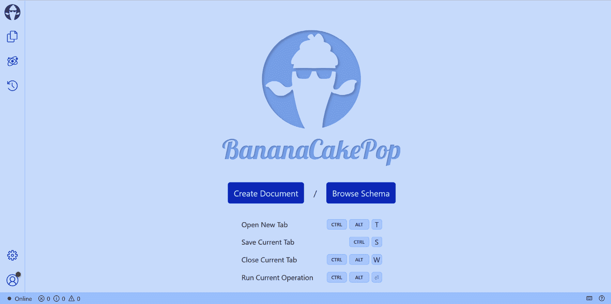
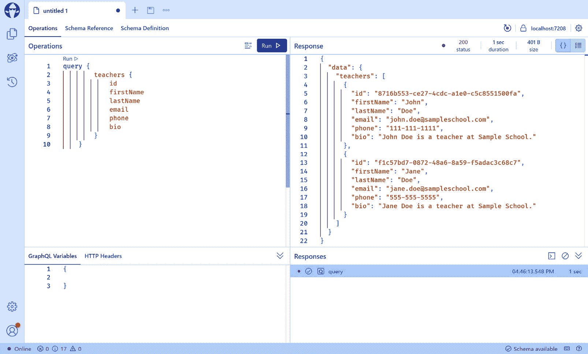
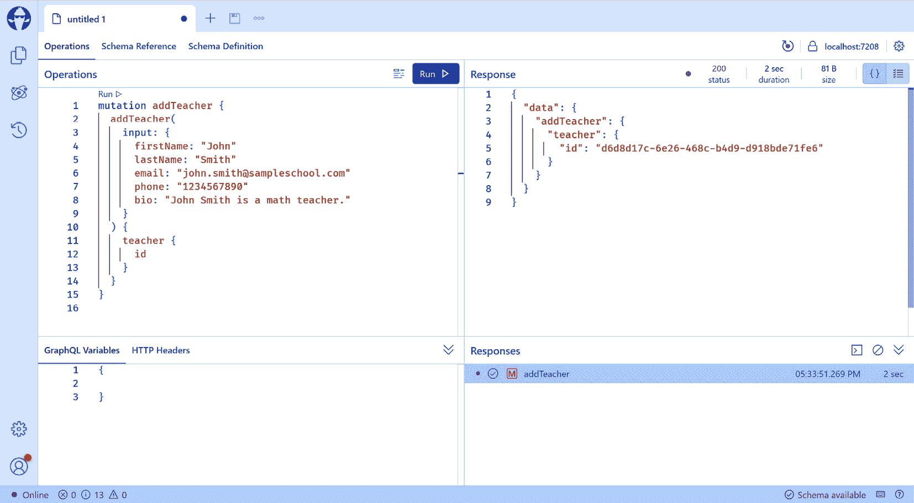
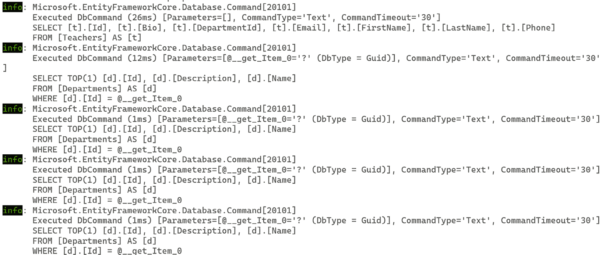
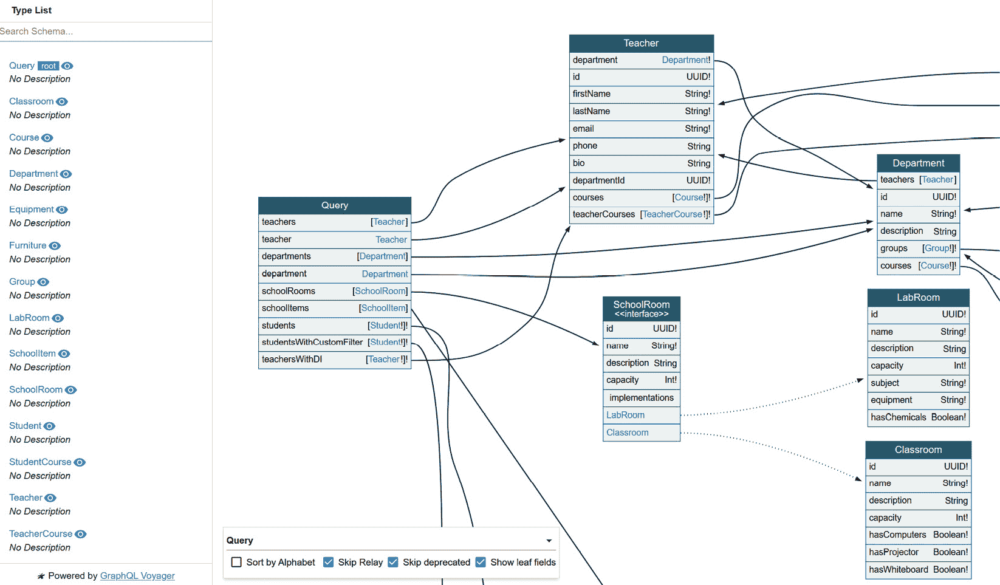

# 开始使用 GraphQL

在 *第十一章* 中，我们探讨了如何在 ASP.NET Core 中创建 gRPC 服务。gRPC 是一种高性能 RPC 框架，它促进了服务之间的通信。我们讨论了 protobuf 消息中使用的字段类型，以及如何定义四种类型的 gRPC 服务：单例、服务器端流、客户端端流和双向流。此外，我们还学习了如何在 ASP.NET Core 中配置 gRPC 服务以及如何从客户端应用程序调用 gRPC 服务。

接下来，我们将探讨另一种网络 API 的形状：GraphQL。GraphQL 是一种基于查询的 API，允许客户端指定他们需要的数据，从而解决了过度获取和不足获取数据的问题。此外，GraphQL 支持 **变更**，允许客户端修改数据。在本章中，我们将学习 GraphQL 的基本概念以及如何在 ASP.NET Core 中创建 GraphQL API。本章将涵盖以下主题：

+   GraphQL 概述

+   使用 HotChocolate 设置 GraphQL API

+   添加变更

+   在查询中使用变量

+   定义 GraphQL 模式

+   使用解析器检索相关对象

+   使用数据加载器

+   依赖注入

+   接口和联合类型

+   过滤、排序和分页

+   可视化 GraphQL 模式

阅读本章后，您将能够理解 GraphQL 的基本概念以及如何在 ASP.NET Core 中创建 GraphQL API。您还将学习如何使用 Apollo Federation 构建基于微服务的 GraphQL API。

# 技术要求

本章中的代码示例可以在 [`github.com/PacktPublishing/Web-API-Development-with-ASP.NET-Core-8/tree/main/samples/chapter12`](https://github.com/PacktPublishing/Web-API-Development-with-ASP.NET-Core-8/tree/main/samples/chapter12) 找到。您可以使用 VS 2022 或 VS Code 打开解决方案。

# GraphQL 概述

GraphQL 提供了一种灵活的方式来查询和变更数据。GraphQL 与 REST 的主要区别在于，GraphQL 允许客户端指定他们需要的数据，而 REST API 返回一组固定的数据。GraphQL 将数据视为图，并使用查询语言来定义数据的形状。这通过允许客户端指定他们的数据需求来解决过度获取和不足获取数据的问题。此外，它还支持变更，使客户端能够根据需要修改数据。

虽然 REST API 为不同的资源提供了多个端点，但 GraphQL 通常通过单个端点提供服务，通常是 `/graphql`，该端点暴露了一个描述数据的模式。所有查询和变更都发送到这个端点。该模式使用 GraphQL 模式定义语言定义，这是客户端和服务器之间的合同。该模式定义了数据的类型和可以在数据上执行的操作。客户端可以使用该模式来验证查询和变更请求。

GraphQL 可以解决客户端数据过取和不足取的问题。然而，后端开发比 REST API 更复杂。GraphQL 使用解析器从图的不同层级获取数据。如果解析器的实现效率不高，可能会导致性能问题。对于不熟悉 GraphQL 的开发者来说，GraphQL 的学习曲线也很陡峭。

ASP.NET Core 没有内置对 GraphQL 的支持。然而，可以使用几个第三方库来创建 GraphQL API：

+   **HotChocolate**：HotChocolate 是一个开源的.NET GraphQL 服务器。它建立在 ASP.NET Core 之上，并支持最新的 2021 年 10 月的 GraphQL 规范。它由提供 GraphQL 工具和咨询服务公司的 ChilliCream 支持。ChilliCream 还提供其他产品，如 Banana Cake Pop，这是一个用于创建和测试 GraphQL 查询的 GraphQL IDE，以及 Strawberry Shake，这是一个.NET 的 GraphQL 客户端库。您可以在[`chillicream.com/docs/hotchocolate/`](https://chillicream.com/docs/hotchocolate/)找到有关 HotChocolate 的更多信息。

+   **GraphQL.NET**：GraphQL.NET 是.NET 的另一个开源 GraphQL 实现。它提供了一组库，可用于创建 GraphQL API 和客户端。您可以在[`graphql-dotnet.github.io/`](https://graphql-dotnet.github.io/)找到有关 GraphQL.NET 的更多信息。

在本章中，我们将使用 HotChocolate 在 ASP.NET Core 中创建一个 GraphQL API。

# 使用 HotChocolate 设置 GraphQL API

首先，您可以从`chapter12\start`文件夹中下载本章名为`SchoolManagement`的代码示例。这个示例项目包含一个`AppDbContext`类和一个`Teacher`类的基本代码，以及一些种子数据。`Teacher`类具有以下属性：

```cs
public class Teacher{
    public Guid Id { get; set; }
    public string FirstName { get; set; } = string.Empty;
    public string LastName { get; set; } = string.Empty;
    public string Email { get; set; } = string.Empty;
    public string? Phone { get; set; }
    public string? Bio { get; set; }
}
```

您可以使用 VS Code 或 VS 2022 打开项目。我们将按照以下步骤将`HotChocolate`集成到项目中以创建 GraphQL API：

1.  将`HotChocolate.AspNetCore` NuGet 包添加到项目中。此包包含 HotChocolate 的 ASP.NET Core 集成。它还包含 GraphQL IDE，这是一个可以用于创建和测试 GraphQL 查询的 GraphQL 客户端。您可以使用以下命令将包添加到项目中：

    ```cs
    Query, in the GraphQL/Queries folder, as shown here:

    ```

    `public class Query{    public async Task<List<Teacher>> GetTeachers([Service] AppDbContext context) =>        await context.Teachers.ToListAsync();}`

    ```cs

    The `Query` class will be used to define the queries that can be executed by the client. It has one method named `GetTeachers()`, which returns a list of teachers.
    ```

1.  然后，我们需要在`Program.cs`文件中注册查询根类型。在`AddDbContext()`方法之后添加以下代码：

    ```cs
    Query type to the schema.
    ```

1.  接下来，我们需要将 GraphQL 端点映射以公开 GraphQL 模式。将以下代码添加到`Program.cs`文件中：

    ```cs
    /graphql URL.
    ```

1.  使用`dotnet run`运行项目，并在`https://localhost:7208/graphql/`打开 GraphQL IDE。您应该看到以下屏幕：



图 12.1 – Banana Cake Pop GraphQL IDE

GraphQL IDE 允许你创建和测试 GraphQL 查询。

重要提示

默认启动 URL 是 `swagger`，用于 ASP.NET Core Web API 项目。你可以在 `launchSettings.json` 文件中将启动 URL 更改为 `graphql` 以直接打开 GraphQL IDE。

1.  点击 **浏览模式** 按钮，然后点击 **模式定义** 选项卡来查看 GraphQL 模式。你应该看到以下模式：

    ```cs
    type Query {  teachers: [Teacher!]!}type Teacher {  id: UUID!  firstName: String!  lastName: String!  email: String!  phone: String  bio: String}
    ```

    前面的模式定义了一个查询根类型 `Query` 和一个 `Teacher` 类型。`Query` 类型有一个名为 `teachers` 的字段，它返回一个 `[Teacher!]!` 对象。GraphQL 使用 `!` 来表示该字段是非空白的。默认情况下，所有字段都是可空白的。`[Teacher!]!` 表示该字段是一个非空白的 `Teacher` 对象数组。当没有数据时，该字段将返回一个空数组。

    `Teacher` 类型有几个字段：`id`、`firstName`、`lastName`、`email`、`phone` 和 `bio`。`id` 字段是 `UUID` 类型，它是一个表示 128 位数字的标量类型。`firstName`、`lastName`、`email`、`phone` 和 `bio` 字段是 `String` 类型。客户端可以指定查询中要返回的字段。

1.  让我们尝试查询数据。点击 **创建文档** 按钮来创建一个新的查询。你可以使用以下查询来获取所有教师：

    ```cs
    query {    teachers {        id        firstName        lastName        email        phone        bio    }}
    ```

    前面的查询将返回数据库中的所有教师，如下所示：



图 12.2 – 查询所有教师

1.  你可以在查询中添加或删除字段以指定要返回的数据。例如，为了在网页上显示教师列表，我们不需要返回 `id` 字段和 `bio` 字段。我们可以从查询中移除 `bio` 字段，如下所示：

    ```cs
    query {    teachers {        firstName        lastName        email        phone    }}
    ```

    前面的查询将仅返回这四个字段，从而减少了有效负载的大小。

到目前为止，我们已经使用 HotChocolate 创建了一个 GraphQL API。我们还学习了如何使用 GraphQL 查询来查询数据。接下来，我们将学习如何使用突变来修改数据。

# 添加突变

在前面的部分中，我们学习了如何使用 HotChocolate 创建一个 GraphQL API。我们添加了一个查询根类型来查询数据。在本节中，我们将讨论如何使用突变来修改数据。

在 GraphQL 中，突变（mutations）用于修改数据。一个突变由三个部分组成：

+   按照惯例，在 `Input` 后缀之后，例如 `AddTeacherInput`。

+   按照惯例，在 `Payload` 后缀之后，例如 `AddTeacherPayload`。

+   `AddTeacherAsync`。

让我们添加一个突变来创建一个新的教师。我们将使用以下步骤：

1.  在 `GraphQL/Mutations` 文件夹中创建一个 `AddTeacherInput` 类，如下所示：

    ```cs
    public record AddTeacherInput(    string FirstName,    string LastName,    string Email,    string? Phone,    string? Bio);
    ```

    `AddTeacherInput` 类是一个记录类型，它定义了 `AddTeacherAsync` 突变的输入数据。`Id` 属性不包括在输入数据中，因为它将由代码生成。

1.  在 `GraphQL/Mutations` 文件夹中添加一个 `AddTeacherPayload` 类，如下所示：

    ```cs
    public class AddTeacherPayload{    public Teacher Teacher { get; }    public AddTeacherPayload(Teacher teacher)    {        Teacher = teacher;    }}
    ```

    `AddTeacherPayload` 类定义了突变执行后返回的数据。它有一个 `Teacher` 属性，类型为 `Teacher`。

1.  接下来，我们需要添加实际的突变来执行操作。将 `Mutation` 类添加到 `GraphQL/Mutations` 文件夹中，如下所示：

    ```cs
    public class Mutation{    public async Task<AddTeacherPayload> AddTeacherAsync(        AddTeacherInput input,        [Service] AppDbContext context)    {        var teacher = new Teacher        {            Id = Guid.NewGuid(),            FirstName = input.FirstName,            LastName = input.LastName,            Email = input.Email,            Phone = input.Phone,            Bio = input.Bio        };        context.Teachers.Add(teacher);        await context.SaveChangesAsync();        return new AddTeacherPayload(teacher);    }}
    ```

    `Mutation` 类有一个名为 `AddTeacherAsync` 的方法，它接受一个 `AddTeacherInput` 对象作为输入数据，并返回一个 `AddTeacherPayload` 对象。`AddTeacherAsync()` 方法创建一个新的 `Teacher` 对象并将其添加到数据库中。然后，它返回一个包含新创建的 `Teacher` 对象的 `AddTeacherPayload` 对象。

1.  接下来，我们需要在 `Program.cs` 文件中注册突变。在 `AddQueryType()` 方法之后添加 `AddMutationType` 方法，如下所示：

    ```cs
    builder.Services    .AddGraphQLServer()    .AddQueryType<Query>()    .AddMutationType<Mutation>();
    ```

1.  使用 `dotnet run` 运行项目并打开 GraphQL IDE。检查模式定义，你应该会看到以下突变：

    ```cs
    type Mutation {  addTeacher(input: AddTeacherInput!): AddTeacherPayload!}input AddTeacherInput {  firstName: String!  lastName: String!  email: String!  phone: String  bio: String}type AddTeacherPayload {  teacher: Teacher!}
    ```

    上述模式定义了一个名为 `addTeacher` 的突变，它反映了我们在 `Mutation` 类中定义的类型和方法。请注意，`AddTeacherInput` 类型是一个输入类型，因此它使用 `input` 关键字而不是 `type`。

1.  点击**创建文档**按钮创建一个新的查询。你可以使用以下突变来创建一个新的教师：

    ```cs
    mutation addTeacher {  addTeacher(    input: {      firstName: "John"      lastName: "Smith"      email: "john.smith@sampleschool.com"      phone: "1234567890"      bio: "John Smith is a math teacher."    }  ) {    teacher {      id    }  }}
    ```

    上述突变将创建一个新的教师并返回新创建教师的 `id` 属性，如下所示：



图 12.3 – 创建新的教师

然后，你可以查询数据以验证新教师是否已添加到数据库中。

# 在查询中使用变量

在上一节中，我们学习了如何使用 GraphQL 查询和突变查询和修改数据。在本节中，我们将讨论如何在查询中使用变量。

GraphQL 允许你在查询中使用变量。当你想要向查询传递参数时，这非常有用。我们可以创建一个接受 `id` 参数并返回具有指定 ID 的教师的查询。按照以下步骤创建查询：

1.  在 `Query` 类中添加一个 `GetTeacher()` 方法，如下所示：

    ```cs
    public async Task<Teacher?> GetTeacher(Guid id, [Service] AppDbContext context) =>    await context.Teachers.FindAsync(id);
    ```

    上述代码向 `Query` 类添加了一个 `GetTeacher()` 方法。它接受一个 `id` 参数并返回具有指定 ID 的教师。

1.  现在，你可以在查询中使用 `$` 符号来定义变量。例如，你可以使用以下查询通过 ID 获取教师：

    ```cs
    query getTeacher($id: UUID!) {  teacher(id: $id) {    id    firstName    lastName    email    phone  }}
    ```

    上述查询定义了一个名为 `id` 的 `UUID!` 类型的变量。`!` 符号表示该变量不可为空。`teacher` 字段接受 `id` 变量作为参数，并返回具有指定 ID 的教师。在 `id` 变量中传递值到查询，如下所示：

    ```cs
    {  "id": "00000000-0000-0000-0000-000000000401"}
    ```

你可以在查询中定义多个变量。请注意，变量必须是标量、枚举或输入对象类型。

# 定义 GraphQL 模式

通常，一个系统有多种数据类型。例如，学校管理系统有教师、学生、部门和课程。一个部门有多个课程，一个课程有多个学生。一位教师可以教授多个课程，一个课程也可以由多位教师教授。在本节中，我们将讨论如何定义具有多种数据类型的 GraphQL 模式。

## 标量类型

标量类型是 GraphQL 中的基本类型。以下表格列出了 GraphQL 中的标量类型：

| **标量类型** | **描述** | **.NET 类型** |
| --- | --- | --- |
| `Int` | 有符号 32 位整数 | `int` |
| `Float` | 根据 IEEE 754 指定的有符号双精度浮点值 | `float`或`double` |
| `String` | UTF-8 字符序列 | `string` |
| `Boolean` | `true`或`false` | `bool` |
| `ID` | 一个唯一的标识符，序列化为字符串 | `string` |

表 12.1 – GraphQL 中的标量类型

除了前面的标量类型之外，`HotChocolate`还支持以下标量类型：

+   `Byte`：无符号 8 位整数

+   `ByteArray`：编码为 Base64 字符串的字节数组

+   `Short`：有符号 16 位整数

+   `Long`：有符号 64 位整数

+   `Decimal`：有符号十进制值

+   `Date`：ISO-8601 日期

+   `TimeSpan`：ISO-8601 时间持续时间

+   `DateTime`：由社区在[`www.graphql-scalars.com/`](https://www.graphql-scalars.com/)定义的 GraphQL 自定义标量。它基于 RFC3339。请注意，此`DateTime`标量使用偏移量而不是时区来表示 UTC

+   `Url`：URL

+   `Uuid`：GUID

+   `Any`：一个特殊类型，用于表示任何字面量或输出类型

这里没有列出更多标量类型。您可以在[`chillicream.com/docs/hotchocolate/v13/defining-a-schema/scalars`](https://chillicream.com/docs/hotchocolate/v13/defining-a-schema/scalars)找到有关标量类型的更多信息。

GraphQL 还支持枚举。GraphQL 中的枚举类型是一种特殊的标量类型。它们用于表示一组固定的值。.NET 很好地支持枚举类型，因此您可以直接在 GraphQL 中使用.NET `enum`类型。您可以如下定义枚举类型：

```cs
public enum CourseType{
    Core,
    Elective,
    Lab
}
```

前面的代码定义了一个名为`CourseType`的枚举类型，包含三个值：`Core`、`Elective`和`Lab`。生成的 GraphQL 模式如下：

```cs
enum CourseType {  CORE
  ELECTIVE
  LAB
}
```

HotChocolate 会自动根据 GraphQL 规范将枚举值转换为大写。

## 对象类型

对象类型是 GraphQL 中最常见的类型。它可以包含简单的标量类型，如`Int`、`String`和`Boolean`，以及其他对象类型。例如，一个`Teacher`类型可以包含`Department`类型，如下所示：

```cs
public class Teacher{
    public Guid Id { get; set; }
    public string FirstName { get; set; } = string.Empty;
    public string LastName { get; set; } = string.Empty;
    public Guid DepartmentId { get; set; }
    public Department Department { get; set; } = default!;
}
public class Department
{
    public Guid Id { get; set; }
    public string Name { get; set; } = string.Empty;
    public string? Description { get; set; }
    // other properties
}
```

前面的代码定义了一个`Teacher`类型和一个`Department`类型。`Teacher`类型有一个`Department`属性，其类型为`Department`。HotChocolate 将生成如下模式：

```cs
type Teacher {  id: UUID!
  firstName: String!
  lastName: String!
  departmentId: UUID!
  department: Department!
}
type Department {
  id: UUID!
  name: String!
  description: String
}
```

如前所述，GraphQL 中的所有字段默认都是可空的。如果我们想使一个字段不可空，可以使用 `!` 符号。

对象类型可以包含其他对象类型的列表。例如，`Department` 类型可以包含一个 `Teacher` 对象的列表，如下所示：

```cs
public class Department{
    public Guid Id { get; set; }
    public string Name { get; set; } = string.Empty;
    public string? Description { get; set; }
    public List<Teacher> Teachers { get; set; } = new();
}
```

生成的模式如下：

```cs
type Department {  id: UUID!
  name: String!
  description: String
  teachers: [Teacher!]!
}
```

`teachers` 字段是一个包含不可空 `Teacher` 对象的不可空数组。如果我们想使 `teachers` 字段可空，可以使用以下方式使用 `?` 符号：

```cs
public class Department{
    public Guid Id { get; set; }
    public string Name { get; set; } = string.Empty;
    public string? Description { get; set; }
    public List<Teacher>? Teachers { get; set; }
}
```

生成的模式如下：

```cs
type Department {  id: UUID!
  name: String!
  description: String
  teachers: [Teacher!]
}
```

上述模式意味着 `teachers` 字段是一个可空的、包含不可空 `Teacher` 对象的数组。当没有数据时，`teachers` 字段将返回 `null`。

让我们回顾一下在前几节中定义的 `Query` 类型与 `Mutation` 类型：

```cs
type Query {  teachers: [Teacher!]!
  teacher(id: UUID!): Teacher
}
type Mutation {
  addTeacher(input: AddTeacherInput!): AddTeacherPayload!
}
```

这两种类型看起来像常规对象类型，但在 GraphQL 中有特殊含义。`Query` 类型与 `Mutation` 类型是 GraphQL 中的两种特殊对象类型，因为它们定义了 GraphQL API 的入口点。每个 GraphQL 服务都必须有一个 `Query` 类型，但可能有一个或没有 `Mutation` 类型。所以 `teachers` 查询实际上是 `Query` 类型的字段，就像 `teacher` 类型中的 `department` 字段一样。变更操作以相同的方式工作。

到目前为止，GraphQL 类型与 C# 类型相似。如果你熟悉面向对象编程，你应该能够轻松理解 GraphQL 类型。类似于 C#，GraphQL 也支持接口。但在我们深入接口之前，让我们讨论一下在查询 `Teacher` 对象时如何检索 `Department` 对象。

# 使用解析器检索相关对象

在前几节中，我们定义了一个 `Teacher` 类型和一个 `Department` 类型。`Teacher` 类型有一个 `Department` 属性，其类型为 `Department`。在查询 `Teacher` 对象时，我们可能还想检索 `Department` 对象。我们该如何做呢？

你可能会认为我们可以使用 `Include()` 方法来检索 `Department` 对象，如下所示：

```cs
public async Task<List<Teacher>> GetTeachers([Service] AppDbContext context) =>    await context.Teachers.Include(x => x.Department).ToListAsync();
```

然后，你可以按照以下方式查询 `Department` 对象：

```cs
query{  teachers{
    id
    firstName
    lastName
    department{
      id
      name
      description
    }
  }
}
```

这确实可行，你将看到以下结果：

```cs
{  "data": {
    "teachers": [
      {
        "id": "00000000-0000-0000-0000-000000000401",
        "firstName": "John",
        "lastName": "Doe",
        "department": {
          "id": "00000000-0000-0000-0000-000000000001",
          "name": "Mathematics",
          "description": "Mathematics Department"
        }
      },
      {
        "id": "00000000-0000-0000-0000-000000000402",
        "firstName": "Jane",
        "lastName": "Doe",
        "department": {
          "id": "00000000-0000-0000-0000-000000000001",
          "name": "Mathematics",
          "description": "Mathematics Department"
        }
      }
    ]
  }
}
```

但这不是最好的方法。记住，GraphQL 允许客户端指定他们需要的数据。如果查询没有指定 `department` 字段，`Department` 对象仍然会从数据库中检索。这并不高效。我们只应在查询中指定了 `department` 字段时才检索 `Department` 对象。这引出了解析器的概念。

解析器是一个函数，用于从某个地方检索特定字段的数据。当查询中请求字段时，解析器将被执行。解析器可以从数据库、Web API 或任何其他数据源获取数据。它将钻入图以检索字段的数据。例如，当在`teachers`查询中请求`department`字段时，解析器将从数据库中检索`Department`对象。但是，当查询未指定`department`字段时，解析器将不会执行。这可以避免不必要的数据库查询。

## 字段解析器

HotChocolate 支持三种定义模式的方式：

+   `Get`前缀或`Async`后缀，这些前缀或后缀将从名称中移除。

+   **代码优先**：这种方式允许你使用显式类型和解析器来定义模式。它使用 Fluent API 来定义模式的详细信息。当你需要自定义模式时，这种方法更加灵活。

+   **模式优先**：这种方式允许你使用 GraphQL 模式定义语言来定义模式。如果你熟悉 GraphQL，你可以使用这种方法直接定义模式。

由于我们的读者大多是.NET 开发者，我们将在本章的其余部分使用代码优先的方法来定义模式，这样我们可以利用 Fluent API 来微调模式。

让我们回顾一下上一节中定义的`teacher`查询：

```cs
public async Task<Teacher?> GetTeacher(Guid id, [Service] AppDbContext context) =>   await context.Teachers.FindAsync(id);
```

上面的方法是基于注解的。HotChocolate 自动将`GetTeacher()`方法转换为名为`teacher`的解析器。接下来，我们希望在请求`department`字段时检索`Department`对象。让我们按照以下步骤进行一些更改：

1.  首先，我们需要将`TeacherType`类定义为 GraphQL 对象。在`Types`文件夹中创建一个`TeacherType`类。代码如下：

    ```cs
    public class TeacherType : ObjectType<Teacher>{    protected override void Configure(IObjectTypeDescriptor<Teacher> descriptor)    {        descriptor.Field(x => x.Department)            .Name("department")            .Description("This is the department to which the teacher belongs.")            .Resolve(async context =>            {                var department = await context.Service<AppDbContext>().Departments.FindAsync(context.   Parent<Teacher>().DepartmentId);                return department;            });    }}
    ```

    `TeacherType`类继承自`ObjectType<Teacher>`类，该类有一个`Configure()`方法来配置 GraphQL 对象并指定如何解析字段。在上面的代码中，我们使用代码优先的方法来定义`TeacherType`的`Department`字段。`Name`方法用于指定字段的名称。如果字段的名称与遵循约定的属性名称相同，我们可以省略`Name`方法。按照约定，`Department`字段将转换为模式中的`department`字段。然后，我们使用`Description`方法来定义字段的描述。描述将在 GraphQL IDE 中显示。

    然后，我们使用`Resolve()`方法来定义解析器。解析器通过使用`Teacher`对象的`DepartmentId`属性从数据库中检索`Department`对象。请注意，我们使用`context.Parent<Teacher>()`方法来获取`Teacher`对象，因为`Teacher`对象是`Department`对象的父对象。

1.  如我们所知，`Query` 类型是一个特殊对象类型，因此我们也将创建一个 `QueryType` 类。在 `GraphQL` 文件夹中创建一个新的 `Types` 文件夹，并将 `Query.cs` 文件移动到这个 `Types` 文件夹中。

1.  移除 `GetTeacher()` 方法并添加一个属性，如下所示：

    ```cs
    public class Query{    // Omitted for brevity    public TeacherType? Teacher { get; set; } = new();}
    ```

1.  创建一个名为 `QueryType` 的新类，如下所示：

    ```cs
    public class QueryType : ObjectType<Query>{    protected override void Configure(IObjectTypeDescriptor<Query> descriptor)    {        descriptor.Field(x => x.Teacher)            .Name("teacher")            .Description("This is the teacher in the school.")            .Type<TeacherType>()            .Argument("id", a => a.Type<NonNullType<UuidType>>())            .Resolve(async context =>            {                var id = context.ArgumentValue<Guid>("id");                var teacher = await context.Service<AppDbContext>().Teachers.FindAsync(id);                return teacher;            });    }}
    ```

    上述代码定义了根查询类型。在这个查询类型中，我们指定字段的类型为 `TeacherType`。接下来，我们使用 `Argument()` 方法定义 `id` 参数，它是一个不可为空的 `UUID` 类型。然后，我们使用 `Resolve()` 方法定义解析器。解析器接收 `id` 参数并从数据库中检索 `Teacher` 对象。请注意，`AppDbContext` 是从 `context` 对象注入到解析器中的。

1.  接下来，我们需要更新 `Program.cs` 文件以注册 `QueryType`。按照以下方式更新 `Program.cs` 文件：

    ```cs
    builder.Services    .AddGraphQLServer()    .AddQueryType<QueryType>()    .AddMutationType<Mutation>();
    ```

    我们使用 `QueryType` 替换了之前定义的 `Query` 类型，这样我们就可以在请求 `department` 字段时使用解析器来检索 `Department` 对象。

1.  现在，我们可以测试解析器。使用 `dotnet run` 运行应用程序，并发送以下请求来查询一个教师。

    这是 GraphQL 请求：

    ```cs
    query ($id: UUID!) {  teacher(id: $id) {    firstName    lastName    email    department {      name      description    }  }}
    {  "id": "00000000-0000-0000-0000-000000000401"}
    ```

    你将在响应中看到部门信息。此外，如果你检查日志，你将看到从数据库中检索了 `Department` 对象。如果你从查询中移除 `department` 字段，你将只在日志中看到一个数据库查询，这意味着 GraphQL 不会从数据库中获取 `Department` 对象。

在这个示例中，我们使用委托方法定义了一个解析器。我们也可以在单独的类中定义解析器。例如，我们可以定义一个 `TeacherResolver` 类，如下所示：

```cs
public class TeacherResolvers{
    public async Task<Department> GetDepartment([Parent] Teacher teacher, [Service] IDbContextFactory<AppDbContext> dbContextFactory)
    {
        await using var dbContext = await dbContextFactory.CreateDbContextAsync();
        var department = await dbContext.Departments.FindAsync(teacher.DepartmentId);
        return department;
    }
}
```

上述代码定义了一个 `GetDepartment()` 方法，它接受一个 `Teacher` 对象作为父对象并返回 `Department` 对象。然后，我们可以使用 `ResolveWith()` 方法在 `TeacherType` 类中定义解析器，如下所示：

```cs
descriptor.Field(x => x.Department)    .Description("This is the department to which the teacher belongs.")
    .ResolveWith<TeacherResolvers>(x => x.GetDepartment(default, default));
```

现在，解析器的逻辑被移动到了一个单独的类中。当解析器复杂时，这种方法更加灵活。但对于简单的解析器，我们可以直接使用委托方法。

到目前为止，一切运行良好。让我们在下一节尝试使用相同的方法更新 `GetTeachers` 方法。

## 对象列表的解析器

同样，我们可以使用 `ListType<TeacherType>` 来定义 `teachers` 字段，然后使用 `Resolve()` 方法定义解析器。`ListType` 类是用于流畅的代码优先 API 的包装类型。它用于定义对象列表。在 `Query` 类中移除 `GetTeachers()` 方法，并添加一个属性，如下所示：

```cs
public class Query{
    // Omitted for brevity
    public List<TeacherType> Teachers { get; set; } = new();
}
```

然后，按照以下方式在 `QueryType` 类中配置 `Teachers` 字段：

```cs
public class QueryType : ObjectType<Query>{
    protected override void Configure(IObjectTypeDescriptor<Query> descriptor)
    {
        descriptor.Field(x => x.Teachers)
            .Name("teachers") // This configuration can be omitted if the name of the field is the same as the name of the property.
            .Description("This is the list of teachers in the school.")
            .Type<ListType<TeacherType>>()
            .Resolve(async context =>
            {
                var teachers = await context.Service<AppDbContext>().Teachers.ToListAsync();
                return teachers;
            });
        // Omitted for brevity
    }
}
```

上述代码定义了 `QueryType` 的 `Teachers` 字段。它使用 `ListType<TeacherType>` 来定义一个 `TeacherType` 的列表。然后，它使用 `Resolve()` 方法来定义解析器。解析器从数据库中检索所有 `Teacher` 对象。这段代码与之前定义的 `teacher` 字段类似。然而，它检索的是 `TeacherType` 对象的列表而不是单个 `TeacherType` 对象。由于 `TeacherType` 对 `Department` 字段有一个解析器，我们可以为每个 `TeacherType` 对象检索 `Department` 对象。

现在，我们可以使用以下查询测试 `teachers` 字段：

```cs
query{  teachers{
    id
    firstName
    lastName
    department{
      id
      name
      description
    }
  }
}
```

然而，你可能会在响应中遇到错误。一些教师可以正确检索，但一些可能无法检索。错误信息如下：

```cs
{  "errors": [
    {
      "message": "Unexpected Execution Error",
      "locations": [
        {
          "line": 6,
          "column": 5
        }
      ],
      "path": [
        "teachers",
        7,
        "department"
      ],
      "extensions": {
        "message": "A second operation was started on this context instance before a previous operation completed. This is usually caused by different threads concurrently using the same instance of DbContext. For more information on how to avoid threading issues with DbContext, see https://go.microsoft.com/fwlink/?linkid=2097913.",
        ...
      }
    },
  ]
}
```

这是因为我们有多個解析器会并发执行数据库查询。然而，`AppDbContext` 被注册为作用域服务，并且 `AppDbContext` 类不是线程安全的。当多个解析器尝试并行查询数据库时，它们将使用相同的 `AppDbContext` 实例，这会导致错误。

为了解决这个问题，我们需要确保解析器不会并发访问相同的 `AppDbContext` 实例。有两种方法可以实现这一点。一种是将解析器顺序执行，另一种是为每个解析器使用单独的 `AppDbContext` 实例。HotChocolate 提供了一个 `RegisterDbContext<TDbContext>()` 方法来管理解析器的 `DbContext`。为了使用这个功能，我们需要使用以下命令安装一个名为 `HotChocolate.Data.EntityFramework` 的 NuGet 包：

```cs
Program.cs file to register the AppDbContext class, as follows:

```

builder.Services    .AddGraphQLServer()

.RegisterDbContext<AppDbContext>()

// 省略以节省篇幅

```cs

The preceding code allows HotChocolate to manage the lifetime of `AppDbContext` for resolvers.
The `RegisterDbContext<TDbContext>()` method can specify how `DbContext` should be injected. There are three options:

*   `DbContextKind.Synchronized`: This is to ensure that `DbContext` is never used concurrently. `DbContext` is still injected as a scoped service.
*   `DbContextKind.Resolver`: This way will resolve the scoped `DbContext` for each resolver. This option is the default configuration. From the perspective of the resolver, `DbContext` is a transient service, so HotChocolate can execute multiple resolvers concurrently without any issues.
*   `DbContextKind.Pooled`: This mechanism will create a pool of `DbContext` instances. It leverages the `DbContextPool` feature of EF Core. HotChocolate will resolve `DbContext` from the pool for each resolver. When the resolver is completed, `DbContext` will be returned to the pool. In this way, `DbContext` is also like a transient service for each resolver, so HotChocolate can parallelize the resolvers as well.

To demonstrate how to benefit from the pooled `DbContext`, we will use the `DbContextKind.Pooled` option. This approach requires a couple of additional steps:

1.  First, we need to register `DbContext` using the `AddPooledDbContextFactory()` method instead of the `AddDbContext()` method. Update the `Program.cs` file as follows:

    ```

    builder.Services.AddPooledDbContextFactory<AppDbContext>(options =>    options.UseSqlServer(builder.Configuration.GetConnectionString("DefaultConnection")));// 注册 GraphQL 服务

    ```cs

    The preceding code registers `AppDbContext` as a pooled service using the `AddPooledDbContextFactory()` method. Then, we use the `RegisterDbContext()` method to register `AppDbContext` as a pooled service for HotChocolate resolvers.

     2.  Update the `Configure()` method in the `QueryType` file to use the pooled `DbContext`:

    ```

    descriptor.Field(x => x.Teachers)    // 省略以节省篇幅    .Type<ListType<TeacherType>>()    .Resolve(async context =>    {        var dbContextFactory = context.Service<IDbContextFactory<AppDbContext>>();        await using var dbContext = await dbContextFactory.CreateDbContextAsync();        var teachers = await dbContext.Teachers.ToListAsync();        return teachers;    });

    ```cs

    The preceding code uses `IDbContextFactory<TDbContext>` to create a new `AppDbContext` instance for each resolver. Then, it retrieves the `Teacher` objects from the database using the new `AppDbContext` instance.

    One thing to note is that we need to use the `await using` statement to dispose of the `AppDbContext` instance after the resolver is completed in order to return the `AppDbContext` instance to the pool.

     3.  Update the other resolvers as well. For example, the resolver of the `Teacher` type looks like this:

    ```

    descriptor.Field(x => x.Department)    .Description("这是教师所属的部门。")    .Resolve(async context =>    {        var dbContextFactory = context.Service<IDbContextFactory<AppDbContext>>();        await using var dbContext = await dbContextFactory.CreateDbContextAsync();        var department = await dbContext.Departments            .FindAsync(context.Parent<Teacher>().DepartmentId);        return department;    });

    ```cs

    Now, we can test the `teachers` field again. You will see that all the teachers with the department information can be retrieved correctly.

So, everything looks good. But wait. If you check the logs, you will find that there are many database queries for each `Department` object:


Figure 12.4 – Database queries for each Department object
What is the reason behind this? Let us find out in the next section.
Using data loaders
In the previous section, we learned how to integrate HotChocolate with EF Core. We also learned how to use the `DbContextPool` feature to fetch data in multiple resolvers. However, we found that there are many database queries for each `Department` object in the `Teacher` list. That is because the resolvers for each `Department` object are executed separately, querying the database by each `DepartmentId` property in the list. This is similar to the *N+1* problem we discussed in *Chapter 1*. The difference is that the *N+1* problem occurs on the client side in REST APIs, while it occurs on the server side in GraphQL. To solve this problem, we need to find a way to load the batch data efficiently.
HotChocolate provides a `DataLoader` mechanism to solve the *N+1* problem. The data loader fetches data in batches from the data source. Then, the resolver can retrieve the data from the data loader, rather than querying the data source directly. The data loader will cache the data for the current request. If the same data is requested again, the resolver can retrieve the data from the data loader directly. This can avoid unnecessary database queries.
Before we learn how to use the data loader to solve the *N+1* problem, let's prepare the examples. We already have a `Teachers` query to query the list of teachers, and each teacher has a `Department` object. Now, we want to add a `Departments` query to query the list of departments, and each department has a list of teachers. We will use the following steps to add the `Departments` query:

1.  The `Department` type is defined as follows:

    ```

    public class Department{    public Guid Id { get; set; }    public string Name { get; set; } = string.Empty;    public string? Description { get; set; }    public List<Teacher> Teachers { get; set; } = new();}

    ```cs

     2.  The `Department` class has a list of `Teacher` objects. Following the convention, we can define a `DepartmentType` class as follows:

    ```

    public class DepartmentType : ObjectType<Department>{    protected override void Configure(IObjectTypeDescriptor<Department> descriptor)    {        descriptor.Field(x => x.Teachers)            .Description("这是该部门教师列表的描述.")            .Type<ListType<TeacherType>>()            .ResolveWith<DepartmentResolvers>(x => x.GetTeachers(default, default));    }}public class DepartmentResolvers{    public async Task<List<Teacher>> GetTeachers([Parent] Department department,        [Service] IDbContextFactory<AppDbContext> dbContextFactory)    {        await using var dbContext = await dbContextFactory.CreateDbContextAsync();        var teachers = await dbContext.Teachers.Where(x => x.DepartmentId == department.Id).ToListAsync();        return teachers;    }}

    ```cs

    The preceding code is similar to `TeacherType`, which we defined previously. `DepartmentType` has a `Teachers` field of the `ListType<TeacherType>` type. Then, we use the `ResolveWith()` method to define the resolver. The resolver retrieves the `Teacher` objects from the database using the `DepartmentId` property of the `Department` object.

     3.  Add a new field in the `Query` class, as follows:

    ```

    public class Query{    // 省略以节省篇幅    public List<DepartmentType> Departments { get; set; } = new();}

    ```cs

     4.  Then, configure the `Departments` field in the `QueryType` as follows:

    ```

    descriptor.Field(x => x.Departments)    .Description("这是该学校部门列表的描述.")    .Type<ListType<DepartmentType>>()    .Resolve(async context =>    {        var dbContextFactory = context.Service<IDbContextFactory<AppDbContext>>();        await using var dbContext = await dbContextFactory.CreateDbContextAsync();        var departments = await dbContext.Departments.ToListAsync();        return departments;    });

    query{   departments{    id    name    description    teachers{      id      firstName      lastName      bio    }   }}

    ```cs

    If you check the logs, you will find that the following database queries are executed multiple times:

    ```

    info: Microsoft.EntityFrameworkCore.Database.Command[20101]      Executed DbCommand (3ms) [Parameters=[@__department_Id_0='?' (DbType = Guid)], CommandType='Text', CommandTimeout='30']      SELECT [t].[Id], [t].[Bio], [t].[DepartmentId], [t].[Email], [t].[FirstName], [t].[LastName], [t].[Phone]      FROM [Teachers] AS [t]      WHERE [t].[DepartmentId] = @__department_Id_0

    ```cs

The preceding query is executed for each `Department` object. This is also an *N+1* problem, as we discussed previously. Next, we will use the data loader to solve these *N+1* problems.
Batch data loader
First, let's optimize the `teachers` query. To retrieve the `teachers` data with the department information, we want to execute two SQL queries only. One is to retrieve the `teachers` data, and the other is to retrieve the department data. Then, HotChocolate should be able to map the `department` data to the teachers in memory, instead of executing a SQL query for each teacher.
Follow these steps to use the data loader:

1.  Create a folder named `DataLoaders` in the `GraphQL` folder, then create a new `DepartmentByTeacherIdBatchDataLoader` class, as follows:

    ```

    public class DepartmentByTeacherIdBatchDataLoader(       IDbContextFactory<AppDbContext> dbContextFactory,       IBatchScheduler batchScheduler,       DataLoaderOptions? options = null)       : BatchDataLoader<Guid, Department>(batchScheduler, options){    protected override async Task<IReadOnlyDictionary<Guid, Department>> LoadBatchAsync(IReadOnlyList<Guid>    keys,        CancellationToken cancellationToken)    {        await using var dbContext = await dbContextFactory.CreateDbContextAsync(cancellationToken);        var departments = await dbContext.Departments.Where(x => keys.Contains(x.Id))            .ToDictionaryAsync(x => x.Id, cancellationToken);        return departments;    }}

    ```cs

    The preceding code defines a data loader to fetch the batch data for the `Department` object. The parent resolver, which is the `teachers` query, will get a list of `Teacher` objects. Each `Teacher` object has a `DepartmentId` property. `DepartmentByTeacherIdBatchDataLoader` will fetch the `Department` objects for the `DepartmentId` values in the list. The list of the `Department` objects will be converted to a dictionary. The key of the dictionary is the `DepartmentId` property and the value is the `Department` object. Then, the parent resolver can map the `Department` object to the `Teacher` object in memory.

     2.  Update the `TeacherResolvers` class as follows:

    ```

    public class TeacherResolvers{    public async Task<Department> GetDepartment([Parent] Teacher teacher,        DepartmentByTeacherIdBatchDataLoader departmentByTeacherIdBatchDataLoader, CancellationToken cancellationToken)    {        var department = await departmentByTeacherIdBatchDataLoader.LoadAsync(teacher.DepartmentId,    cancellationToken);        return department;    }}

    ```cs

    Instead of querying the database directly, the resolver uses `DepartmentByTeacherIdBatchDataLoader` to fetch the `Department` object for the `DepartmentId` property of the `Teacher` object. The `DepartmentByTeacherIdBatchDataLoader` will be injected by HotChocolate automatically.

     3.  Run the application and test the `teachers` query again. Now, you will see only two SQL queries are executed:

    ```

    info: Microsoft.EntityFrameworkCore.Database.Command[20101]      Executed DbCommand (108ms) [Parameters=[], CommandType='Text', CommandTimeout='30']      SELECT [t].[Id], [t].[Bio], [t].[DepartmentId], [t].[Email], [t].[FirstName], [t].[LastName], [t].[Phone]      FROM [Teachers] AS [t]info: Microsoft.EntityFrameworkCore.Database.Command[20101]      Executed DbCommand (73ms) [Parameters=[@__keys_0='?' (Size = 4000)], CommandType='Text',    CommandTimeout='30']      SELECT [d].[Id], [d].[Description], [d].[Name]      FROM [Departments] AS [d]      WHERE [d].[Id] IN (          SELECT [k].[value]          FROM OPENJSON(@__keys_0) WITH ([value] uniqueidentifier '$') AS [k]      )

    ```cs

    As we see, the first query is to get the list of the teachers, and the second query is to use the `IN` clause to query the departments that match the `DepartmentId` values in the list. This is much more efficient than the previous approach.

As it fetches the batch data for the `Department` object, it is called a batch data loader. This data loader is often used for one-to-one relationships, such as one `Teacher` object has one `Department` object. Note that this one-to-one relationship is not the same as the one-to-one relationship in the database. In GraphQL, the one-to-one relationship means that one object has one child object.
Group data loader
Next, let's optimize the `departments` query. In this case, one `Department` object has a list of `Teacher` objects. We can use the group data loader to fetch the `Teacher` objects for each `Department` object. The group data loader is similar to the batch data loader. The difference is that the group data loader fetches a list of objects for each key. The batch data loader fetches a single object for each key.
Follow these steps to use the group data loader:

1.  Create a `TeachersByDepartmentIdDataLoader` class in the `DataLoaders` folder, and add the following code:

    ```

    public class TeachersByDepartmentIdDataLoader(       IDbContextFactory<AppDbContext> dbContextFactory,       IBatchScheduler batchScheduler,       DataLoaderOptions? options = null)       : GroupedDataLoader<Guid, Teacher>(batchScheduler, options){    protected override async Task<ILookup<Guid, Teacher>> LoadGroupedBatchAsync(IReadOnlyList<Guid> keys,        CancellationToken cancellationToken)    {        await using var dbContext = await dbContextFactory.CreateDbContextAsync(cancellationToken);        var teachers = await dbContext.Teachers.Where(x => keys.Contains(x.DepartmentId))            .ToListAsync(cancellationToken);        return teachers.ToLookup(x => x.DepartmentId);    }}

    ```cs

    The preceding code defines a group data loader, which returns an `ILookup<Guid, Teacher>` object in the `LoadGroupedBatchAsync()` method. The `ILookup<Guid, Teacher>` object is similar to a dictionary. The key of the dictionary is the `DepartmentId` property and the value is a list of `Teacher` objects. The parent resolver can map the `Teacher` objects to the `Department` object in memory.

     2.  Update the `DepartmentResolvers` class as follows:

    ```

    public class DepartmentResolvers{    public async Task<List<Teacher>> GetTeachers([Parent] Department department,        TeachersByDepartmentIdDataLoader teachersByDepartmentIdDataLoader, CancellationToken cancellationToken)    {        var teachers = await teachersByDepartmentIdDataLoader.LoadAsync(department.Id, cancellationToken);        return teachers.ToList();    }}

    ```cs

    The preceding code uses `TeachersByDepartmentIdDataLoader` to fetch the `Teacher` objects for the `Department` object. `TeachersByDepartmentIdDataLoader` will be injected by HotChocolate automatically.

     3.  Run the application and test the `departments` query again. Now, you will see only two SQL queries are executed:

    ```

    info: Microsoft.EntityFrameworkCore.Database.Command[20101]      Executed DbCommand (38ms) [Parameters=[], CommandType='Text', CommandTimeout='30']      SELECT [d].[Id], [d].[Description], [d].[Name]      FROM [Departments] AS [d]info: Microsoft.EntityFrameworkCore.Database.Command[20101]      Executed DbCommand (36ms) [Parameters=[@__keys_0='?' (Size = 4000)], CommandType='Text',    CommandTimeout='30']      SELECT [t].[Id], [t].[Bio], [t].[DepartmentId], [t].[Email], [t].[FirstName], [t].[LastName], [t].[Phone]      FROM [Teachers] AS [t]      WHERE [t].[DepartmentId] IN (          SELECT [k].[value]          FROM OPENJSON(@__keys_0) WITH ([value] uniqueidentifier '$') AS [k]      )

    ```cs

    That is exactly what we want. The first query is to get the list of the departments, and the second query is to use the `IN` clause to query the teachers that match the `DepartmentId` values in the list. This approach reduces the number of database queries significantly.

In this case, each `Department` object has a list of `Teacher` objects, so this kind of data loader is called a group data loader. It is often used for one-to-many relationships, such as one `Department` object has a list of `Teacher` objects.
HotChocolate supports cache data loader as well. It also supports using multiple data loaders in a resolver. As they are not used often, we will not discuss them in this chapter. You can refer to the documentation for more details: [`github.com/PacktPublishing/Web-API-Development-with-ASP.NET-Core-8/tree/main/samples/chapter12/start`](https://github.com/PacktPublishing/Web-API-Development-with-ASP.NET-Core-8/tree/main/samples/chapter12/start).
Dependency injection
In the previous code examples, we use `IDbContextFactory<AppDbContext>` and `AppDbContext` directly in the resolvers. In order to encapsulate our data access logic, we can add a service layer to implement our business logic. HotChocolate supports dependency injection for resolvers. In this section, we will learn how to inject other services into the resolvers.
To demonstrate how to use dependency injection in HotChocolate, we will add an interface named `ITeacherService` and a class named `TeacherService`, as follows:

```

public interface ITeacherService{

Task<Department> GetDepartmentAsync(Guid departmentId);

Task<List<Teacher>> GetTeachersAsync();

Task<Teacher> GetTeacherAsync(Guid teacherId);

// 省略以节省篇幅

}

public class TeacherService(IDbContextFactory<AppDbContext> contextFactory) : ITeacherService

{

public async Task<Department> GetDepartmentAsync(Guid departmentId)

{

await using var dbContext = await contextFactory.CreateDbContextAsync();

var department = await dbContext.Departments.FindAsync(departmentId);

return department ?? throw new ArgumentException("Department not found", nameof(departmentId));

}

public async Task<List<Teacher>> GetTeachersAsync()

{

等待使用 var dbContext = await contextFactory.CreateDbContextAsync();

var teachers = await dbContext.Teachers.ToListAsync();

return teachers;

}

public async Task<Teacher> GetTeacherAsync(Guid teacherId)

{

await using var dbContext = await contextFactory.CreateDbContextAsync();

var teacher = await dbContext.Teachers.FindAsync(teacherId);

return teacher ?? throw new ArgumentException("Teacher not found", nameof(teacherId));

}

// 省略以节省篇幅

}

```cs

The preceding code encapsulates the data access logic in the `TeacherService` class. Then, we need to register `ITeacherService` in the `Program.cs` file, as follows:

```

builder.Services.AddScoped<ITeacherService, TeacherService>();

```cs

 HotChocolate uses the same approach to register the services as ASP.NET Core, but injecting the services is a little different. In ASP.NET Core, we can inject the services into the controller constructor, while HotChocolate does not recommend constructor injection. Instead, HotChocolate recommends using the method-level injection. First, the GraphQL type definitions are singleton objects. If we use constructor injection, the services will be injected as singleton objects as well. This is not what we want. Second, sometimes HotChocolate needs to synchronize the resolvers to avoid concurrency issues. If we use constructor injection, HotChocolate cannot control the lifetime of the services. Note that this applies to the HotChocolate GraphQL types and resolvers only. For other services, we can still use constructor injection.
Let us see how to use the method-level injection.
Using the Service attribute
We can use `HotChocolate.ServiceAttribute` to inject services into the resolvers. For example, we can add a `GetTeachersWithDI` method in the `Query` class as follows:

```

public async Task<List<Teacher>> GetTeachersWithDI([Service] ITeacherService teacherService) =>    await teacherService.GetTeachersAsync();

```cs

Note that the `Service` attribute is from the `HotChocolate` namespace, not the `Microsoft.AspNetCore.Mvc` namespace. With this attribute, `ITeacherService` will be injected into the `teacherService` parameter automatically.
If we have many services in the project, using the attribute for each service is tedious. HotChocolate provides a `RegisterServices()` method to simplify the injection. We can update the `Program.cs` file as follows:

```

builder.Services    .AddGraphQLServer()

.RegisterDbContext<AppDbContext>(DbContextKind.Pooled)

.RegisterService<ITeacherService>()

.AddQueryType<QueryType>()

.AddMutationType<Mutation>();

```cs

Now, we can remove the `Service` attribute from the `GetTeachersWithDI()` method. HotChocolate can still inject `ITeacherService` automatically, as shown here:

```

public async Task<List<Teacher>> GetTeachersWithDI(ITeacherService teacherService) =>    await teacherService.GetTeachersAsync();

```cs

This will save us a lot of time.
Understanding the lifetime of the injected services
We have learned that, in ASP.NET Core, we can inject the services as singleton, scoped, or transient services. HotChocolate offers more options for the lifetime of the injected services. When we use the `Service` attribute or the `RegisterService()` method to inject the services, we can specify the `ServiceKind` property to control the lifetime of the services. The `ServiceKind` has the following options:

*   `ServiceKind.Default`: This is the default option. The service will be injected as the same lifetime in the registered service in the DI container.
*   `ServiceKind.Synchronized`: This option is similar to the synchronized `DbContext`. The resolver using the service will be executed sequentially. The synchronization only happens in the same request scope.
*   `ServiceKind.Resolver`: This option is to resolve the service for each resolver scope. The service will be disposed of after the resolver is completed.
*   `ServiceKind.Pooled`: This option is similar to the pooled `DbContext`. The service needs to be registered as an `ObjectPool<T>` instance in the ASP.NET Core DI container. The resolver will get the service from the pool and return it to the pool after the resolver is completed.

To specify the `ServiceKind` for the injected services, we can add a `ServiceKind` parameter in the `Service` attribute or the `RegisterService()` method. For example, we can update the `GetTeachersWithDI()` method as follows:

```

public async Task<List<Teacher>> GetTeachersWithDI([Service(ServiceKind.Resolver)] ITeacherService teacherService) =>    await teacherService.GetTeachersAsync();

```cs

The preceding code specifies the `ServiceKind` as `ServiceKind.Resolver`. So, `ITeacherService` will be resolved for each resolver scope.
If we use the `RegisterServices()` method to register the services, we can specify the `ServiceKind` in the `RegisterServices()` method, as follows:

```

builder.Services    .AddGraphQLServer()

.RegisterDbContext<AppDbContext>(DbContextKind.Pooled)

.RegisterService<ITeacherService>(ServiceKind.Resolver)

.AddQueryType<QueryType>()

.AddMutationType<Mutation>();

```cs

To inject the services in the `Resolve()` method, we can get the service from the `context` object, as follows:

```

descriptor.Field(x => x.Teachers)    .Description("This is the list of teachers in the school.")

.Type<ListType<TeacherType>>()

.Resolve(async context =>

{

var teacherService = context.Service<ITeacherService>();

var teachers = await teacherService.GetTeachersAsync();

return teachers;

});

```cs

The preceding code uses the `context.Service<T>()` method to get `ITeacherService` from the `context` object, which is similar to injecting `IDbContextFactory<AppDbContext>` in the previous examples.
Interface and union types
HotChocolate supports the use of interfaces and union types in GraphQL. In this section, we will explore how to incorporate these features into your GraphQL schema. Interfaces provide a way to group types that share common fields, while union types allow for the creation of a single type that can return different object types. With HotChocolate, you can easily implement these features to enhance the functionality of your GraphQL schema.
Interfaces
To prepare the examples of GraphQL interfaces, we have an `ISchoolRoom` interface and two classes that implement the interface, as follows:

```

public interface ISchoolRoom{

Guid Id { get; set; }

string Name { get; set; }

string? Description { get; set; }

public int Capacity { get; set; }

}

public class LabRoom : ISchoolRoom

{

public Guid Id { get; set; }

public string Name { get; set; } = string.Empty;

public string? Description { get; set; }

public int Capacity { get; set; }

public string Subject { get; set; } = string.Empty;

public string Equipment { get; set; } = string.Empty;

public bool HasChemicals { get; set; }

}

public class Classroom : ISchoolRoom

{

public Guid Id { get; set; }

public string Name { get; set; } = string.Empty;

public string? Description { get; set; }

public int Capacity { get; set; }

public bool HasComputers { get; set; }

public bool HasProjector { get; set; }

public bool HasWhiteboard { get; set; }

}

```cs

The two classes both implement the `ISchoolRoom` interface, but they have some different properties. You can find the model classes and the model configurations in the sample code.
The service layer is defined in the `ISchoolRoomService` interface and the `SchoolRoomService` class, as follows:

```

`public interface ISchoolRoomService{`

异步获取学校教室列表：`Task<List<ISchoolRoom>> GetSchoolRoomsAsync();`

异步获取实验室教室列表：`Task<List<LabRoom>> GetLabRoomsAsync();`

异步获取教室列表：`Task<List<Classroom>> GetClassroomsAsync();`

异步获取实验室教室：`Task<LabRoom> GetLabRoomAsync(Guid labRoomId);`

异步获取教室：`Task<Classroom> GetClassroomAsync(Guid classroomId);`

}

`public class SchoolRoomService(IDbContextFactory<AppDbContext> contextFactory) : ISchoolRoomService`

{

`public async Task<List<ISchoolRoom>> GetSchoolRoomsAsync()`

{

`await using var dbContext = await contextFactory.CreateDbContextAsync();`

`var labRooms = await dbContext.LabRooms.ToListAsync();`

`var classrooms = await dbContext.Classrooms.ToListAsync();`

`var schoolRooms = new List<ISchoolRoom>();`

`schoolRooms.AddRange(labRooms);`

`schoolRooms.AddRange(classrooms);`

`return schoolRooms;`

}

// 省略以节省篇幅

}

```cs

The `GetSchoolRoomsAsync()` method retrieves a list of `LabRoom` objects and a list of `Classroom` objects from the database. Then, it combines the two lists into a single list of `ISchoolRoom` objects.
We also need to register `ISchoolRoomService` in the `Program.cs` file, as follows:

```

`builder.Services.AddScoped<ISchoolRoomService, SchoolRoomService>();`

```cs

 To define an interface in HotChocolate, we need to use the `InterfaceType<T>` class. The `InterfaceType<T>` class is used to define an interface type in the schema. Follow these steps to define an interface type using the code-first API:

1.  Create a class named `SchoolRoomType` in the `Types` folder:

    ```

    `public class SchoolRoomType : InterfaceType<ISchoolRoom>{    protected override void Configure(IInterfaceTypeDescriptor<ISchoolRoom> descriptor)    {        descriptor.Name("SchoolRoom");    }}`

    ```cs

    The preceding code defines an interface type for the `ISchoolRoom` interface.

     2.  Create two new classes for `LabRoom` and `Classroom`, as follows:

    ```

    `public class LabRoomType : ObjectType<LabRoom>{    protected override void Configure(IObjectTypeDescriptor<LabRoom> descriptor)    {        descriptor.Name("LabRoom");        descriptor.Implements<SchoolRoomType>();    }}public class ClassroomType : ObjectType<Classroom>{    protected override void Configure(IObjectTypeDescriptor<Classroom> descriptor)    {        descriptor.Name("Classroom");        descriptor.Implements<SchoolRoomType>();    }}`

    ```cs

    In the preceding code, we use the `Implements()` method to specify the interface implemented by the object type.

     3.  Add a query field in the `Query` class:

    ```

    `public List<SchoolRoomType> SchoolRooms { get; set; } = new();`

    ```cs

     4.  Configure the `SchoolRooms` field in the `QueryType` class:

    ```

    `descriptor.Field(x => x.SchoolRooms)    .Description("This is the list of school rooms in the school.")    .Type<ListType<SchoolRoomType>>()    .Resolve(async context =>    {        var service = context.Service<ISchoolRoomService>();        var schoolRooms = await service.GetSchoolRoomsAsync();        return schoolRooms;    });`

    ```cs

    In the preceding code, we use the `Service()` method to get `ISchoolRoomService` from the `context` object. Then, we use the `GetSchoolRoomsAsync()` method to retrieve the list of `ISchoolRoom` objects. The result includes both `LabRoom` and `Classroom` objects.

     5.  Next, we need to explicitly register `LabRoomType` and `ClassroomType` in `SchemaBuilder`. Update the `Program.cs` file as follows:

    ```

    `builder.Services    .AddGraphQLServer()    .RegisterDbContext<AppDbContext>(DbContextKind.Pooled)    .RegisterService<ITeacherService>(ServiceKind.Resolver)    .AddQueryType<QueryType>()    .AddType<LabRoomType>()    .AddType<ClassroomType>()    .AddMutationType<Mutation>();`

    ```cs

     6.  Run the application and check the generated schema. You will find the interface definition and its implementations, as shown here:

    ```

    类型查询：`type Query {  """  This is the list of school rooms in the school.  """  schoolRooms: [SchoolRoom]}type LabRoom implements SchoolRoom {  id: UUID!  name: String!  description: String  capacity: Int!  subject: String!  equipment: String!  hasChemicals: Boolean!}type Classroom implements SchoolRoom {  id: UUID!  name: String!  description: String  capacity: Int!  hasComputers: Boolean!  hasProjector: Boolean!  hasWhiteboard: Boolean!}`

    ```cs

     7.  Next, we can use the `SchoolRoom` interface to query both the `LabRoom` and `Classroom` objects. For example, we can use the following query to retrieve the `LabRoom` objects:

    ```

    查询：`query {  schoolRooms {    __typename    id    name    description    capacity    ... on LabRoom {      subject      equipment      hasChemicals    }    ... on Classroom {      hasComputers      hasProjector      hasWhiteboard    }  }}`

    {  "data": {    "schoolRooms": [      {        "__typename": "LabRoom",        "id": "00000000-0000-0000-0000-000000000501",        "name": "Chemistry Lab",        "description": "Chemistry Lab",        "capacity": 20,        "subject": "Chemistry",        "equipment": "Chemicals, Beakers, Bunsen Burners",        "hasChemicals": true      },      {        "__typename": "Classroom",        "id": "00000000-0000-0000-0000-000000000601",        "name": "Classroom 1",        "description": "Classroom 1",        "capacity": 20,        "hasComputers": true,        "hasProjector": false,        "hasWhiteboard": true      },      ...    ]  }}

    ```cs

    In the response, you can see that the `LabRoom` object has the `subject`, `equipment`, and `hasChemicals` properties, while the `Classroom` object has the `hasComputers`, `hasProjector`, and `hasWhiteboard` properties. This can be helpful when we want to query complex objects with different properties.

Although interfaces provide flexibility for querying objects with different properties, we need to note that interfaces can be used for output types only. We cannot use interfaces for input types or arguments.
Union types
Union types are similar to interfaces. The difference is that union types do not need to define any common fields. Instead, union types can combine multiple object types into a single type.
Follow the same approach as the previous section to prepare the models for union types. You can find an `Equipment` class and a `Furniture` class in the `Models` folder, as follows:

```

public class 设备{

public Guid Id { get; set; }

public string 名称 { get; set; } = string.Empty;

public string? 描述 { get; set; }

public string 状态 { get; set; } = string.Empty;

public string 品牌 { get; set; } = string.Empty;

public int 数量 { get; set; }

}

public class 家具

{

public Guid Id { get; set; }

public string 名称 { get; set; } = string.Empty;

public string? 描述 { get; set; }

public string 颜色 { get; set; } = string.Empty;

public string 材质 { get; set; } = string.Empty;

public int 数量 { get; set; }

}

```cs

The `Equipment` class and the `Furniture` class have some different properties. You can find the model configurations in the sample code. We also need to add the services for both classes. You can find the following code in the `Services` folder.
Here is the code for the `IEquipmentService` interface and the `EquipmentService` class:

```

public interface IEquipmentService{

Task<List<设备>> 获取设备列表 Async();

Task<设备> 获取设备 Async(Guid equipmentId);

}

public class 设备服务(IDbContextFactory<AppDbContext> contextFactory) : IEquipmentService

{

public async Task<List<设备>> 获取设备列表 Async()

{

await using var dbContext = await contextFactory.CreateDbContextAsync();

var equipment = await dbContext.Equipment.ToListAsync();

return equipment;

}

public async Task<设备> 获取设备 Async(Guid equipmentId)

{

await using var dbContext = await contextFactory.CreateDbContextAsync();

var equipment = await dbContext.Equipment.FindAsync(equipmentId);

return equipment ?? throw new ArgumentException("设备未找到", nameof(equipmentId));

}

}

```cs

Here is the code for the `IFurnitureService` interface and the `FurnitureService` class:

```

public interface IFurnitureService{

Task<List<家具>> 获取家具列表 Async();

Task<家具> 获取家具 Async(Guid furnitureId);

}

public class 家具服务(IDbContextFactory<AppDbContext> contextFactory) : IFurnitureService

{

public async Task<List<家具>> 获取家具列表 Async()

{

await using var dbContext = await contextFactory.CreateDbContextAsync();

var furniture = await dbContext.Furniture.ToListAsync();

return furniture;

}

public async Task<家具> 获取家具 Async(Guid furnitureId)

{

await using var dbContext = await contextFactory.CreateDbContextAsync();

var furniture = await dbContext.Furniture.FindAsync(furnitureId);

return furniture ?? throw new ArgumentException("家具未找到", nameof(furnitureId));

}

}

```cs

The preceding code should be straightforward. Do not forget to register the services in the `Program.cs` file, as follows:

```

builder.Services.AddScoped<IEquipmentService, 设备服务>();builder.Services.AddScoped<IFurnitureService, 家具服务>();

```cs

Next, let's create the union types following these steps:

1.  Create two classes named `EquipmentType` and `FurnitureType`, as follows:

    ```

    公共类 EquipmentType : ObjectType<Equipment>{    protected override void Configure(IObjectTypeDescriptor<Equipment> descriptor)    {        descriptor.Name("Equipment");    }}public class FurnitureType : ObjectType<Furniture>{    protected override void Configure(IObjectTypeDescriptor<Furniture> descriptor)    {        descriptor.Name("Furniture");    }}

    ```cs

    The preceding code defines the `EquipmentType` and `FurnitureType` object types. These two object types are just normal object types.

     2.  Create a new class named `SchoolItemType`, as follows:

    ```

    公共类 SchoolItemType : UnionType{    protected override void Configure(IUnionTypeDescriptor descriptor)    {        descriptor.Name("SchoolItem");        descriptor.Type<EquipmentType>();        descriptor.Type<FurnitureType>();    }}

    ```cs

    The preceding code defines a union type named `SchoolItem`. A union type must inherit from the `UnionType` class. Then, we use the `Type` method to specify the object types that are included in the union type. In this case, the `SchoolItem` union type includes the `EquipmentType` and `FurnitureType` object types.

    As we already registered these two types in the union type, we do not need to register them again in the `Program.cs` file.

     3.  Add a query field in the `Query` class:

    ```

    公共 List<SchoolItemType> SchoolItems { get; set; } = new();

    ```cs

     4.  Configure the resolver for the `SchoolItems` field in the `QueryType` class, as shown here:

    ```

    descriptor.Field(x => x.SchoolItems)    .Description("这是学校中物品列表.")    .Type<ListType<SchoolItemType>>()    .Resolve(async context =>    {        var equipmentService = context.Service<IEquipmentService>();        var furnitureService = context.Service<IFurnitureService>();        var equipmentTask = equipmentService.GetEquipmentListAsync();        var furnitureTask = furnitureService.GetFurnitureListAsync();        await Task.WhenAll(equipmentTask, furnitureTask);        var schoolItems = new List<object>();        schoolItems.AddRange(equipmentTask.Result);        schoolItems.AddRange(furnitureTask.Result);        return schoolItems;    });

    ```cs

    We retrieve a list of `Equipment` and `Furniture` objects from the database. We then combine these two lists into a single list of objects, as the object type is the base type of all types in C#. This allows us to use the object type to effectively combine the two lists.

     5.  Run the application and check the generated schema. You will find the union type defined as follows:

    ```

    联合 SchoolItem = Equipment | Furnituretype Equipment {  id: UUID!  name: String!  description: String  condition: String!  brand: String!  quantity: Int!}type Furniture {  id: UUID!  name: String!  description: String  color: String!  material: String!  quantity: Int!}

    ```cs

    A union type is represented as a union of a list of object types using the `|` symbol. In this case, the `SchoolItem` union type includes the `Equipment` and `Furniture` object types.

     6.  Then, we can query the `SchoolItem` union type, as follows:

    ```

    查询 `{  schoolItems {    __typename    ... on Equipment {      id      name      description      condition      brand      quantity    }    ... on Furniture {      id      name      description      color      material      quantity    }  }}

    {  "data": {    "schoolItems": [      {        "__typename": "Equipment",        "id": "00000000-0000-0000-0000-000000000701",        "name": "Bunsen Burner",        "description": "Bunsen Burner",        "condition": "Good",        "brand": "Bunsen",        "quantity": 10      },      {        "__typename": "Furniture",        "id": "00000000-0000-0000-0000-000000000801",        "name": "Desk",        "description": "Desk",        "color": "Brown",        "material": "Wood",        "quantity": 20      },      ...    ]  }}

    ```cs

    In the response, you can see that the `Equipment` object has the `condition` and `brand` properties, while the `Furniture` object has the `color` and `material` properties. However, even though the `Equipment` and `Furniture` objects have some of the same properties (such as `Id`, `Name`, and so on.), the query must specify the properties for each object type. For example, we cannot use the following query:

    ```

    查询 `{  schoolItems {    __typename    id    name   }}

    ```cs

    The preceding query will cause an error, as follows:

    ```

    {  "errors": [    {      "message": "联合类型不能直接声明字段。请使用内联片段或片段代替。",      "locations": [        {          "line": 2,          "column": 15        }      ],      "path": [        "schoolItems"      ],      "extensions": {        "type": "SchoolItem",        "specifiedBy": "http://spec.graphql.org/October2021/   #sec-Field-Selections-on-Objects-Interfaces-and-Unions-Types"      }    }  ]}

    ```cs

Please note that the `SchoolItem` union type is not a base type of the `Equipment` and `Furniture` object types. If you want to query the common properties of the object types, you can use the interface type instead of the union type.
Filtering, sorting, and pagination
In this section, we will learn how to implement filtering, sorting, and pagination in HotChocolate. These features are very important for a real-world application. We will use the `Student` object as an example to demonstrate how to implement these features. The `Student` class is defined as follows:

```

公共类 Student{

公共 Guid Id { get; set; }

public string FirstName { get; set; } = string.Empty;

public string LastName { get; set; } = string.Empty;

public string Email { get; set; } = string.Empty;

public string? Phone { get; set; }

public string Grade { get; set; } = string.Empty;

public DateOnly? DateOfBirth { get; set; }

public Guid GroupId { get; set; }

public Group Group { get; set; } = default!;

public List<Course> Courses { get; set; } = new();

public List<StudentCourse> StudentCourses { get; set; } = new();

}

```cs

To use filtering, sorting, and pagination, we need to install the `HotChocolate.Data` NuGet package. If you already installed the `HotChocolate.Data.EntityFramework` package following the previous sections, you do not need to install the `HotChocolate.Data` package again. The `HotChocolate.Data` package is a dependency of the `HotChocolate.Data.EntityFramework` package. If not, you can install the `HotChocolate.Data` package using the following command:

```

dotnet add package HotChocolate.Data

```cs

 Let’s begin with filtering!
Filtering
HotChocolate supports filtering on the object type. A question is how we translate the GraphQL filter to the SQL-native queries. If the resolver exposes an `IQueryable` interface, HotChocolate can translate the GraphQL filter to SQL-native queries automatically. But we can also implement the filtering logic in the resolver manually. In this section, we will explore how to use filtering in HotChocolate.
To enable filtering on the `Student` object type, follow these steps:

1.  First, we need to register the `Filtering` middleware in the `Program.cs` file, as follows:

    ```

    builder.Services    .AddGraphQLServer()    // Omitted for brevity    .AddFiltering()    .AddMutationType<Mutation>();

    ```cs

     2.  Add a query field in the `Query` class:

    ```

    public List<Student> Students { get; set; } = new();

    ```cs

     3.  Apply the filtering in the resolver of the `Students` field in the `QueryType`:

    ```

    descriptor.Field(x => x.Students)    .Description("This is the list of students in the school.")    .UseFiltering()    .Resolve(async context =>    {        var dbContextFactory = context.Service<IDbContextFactory<AppDbContext>>();        var dbContext = await dbContextFactory.CreateDbContextAsync();        var students = dbContext.Students.AsQueryable();        return students;    });

    ```cs

    The preceding code uses the `UseFiltering()` method to enable filtering on the `Students` field. Then, we use the `AsQueryable()` method to expose the `IQueryable` interface. This allows HotChocolate to translate the GraphQL filter to SQL-native queries automatically.

     4.  Run the application and check the generated schema. You will find the `students` query has a `StudentFilterInput` filter, as shown here:

    ```

    students(where: StudentFilterInput): [Student!]!

    input StudentFilterInput {  and: [StudentFilterInput!]  or: [StudentFilterInput!]  id: UuidOperationFilterInput  firstName: StringOperationFilterInput  lastName: StringOperationFilterInput  email: StringOperationFilterInput  phone: StringOperationFilterInput  grade: StringOperationFilterInput  dateOfBirth: DateOperationFilterInput}

    ```cs

    HotChocolate automatically inspects the `Student` object type and generates the filter input type. The `StudentFilterInput` filter includes all the properties of the `Student` object type by default.

     5.  Next, we can filter the `students` query, as follows:

    ```

    query {  students(where: { firstName: { eq: "John" } }) {    id    firstName    lastName    email    phone    grade    dateOfBirth  }}

    {  "data": {    "students": [      {        "id": "00000000-0000-0000-0000-000000000901",        "firstName": "John",        "lastName": "Doe",        "email": "",        "phone": null,        "grade": "",        "dateOfBirth": "2000-01-01"      }    ]  }}

    ```cs

    You can find the generated SQL query in the logs, as follows:

    ```

    info: Microsoft.EntityFrameworkCore.Database.Command[20101]      Executed DbCommand (36ms) [Parameters=[@__p_0='?' (Size = 32)], CommandType='Text',    CommandTimeout='30']      SELECT [s].[Id], [s].[DateOfBirth], [s].[Email], [s].[FirstName], [s].[Grade], [s].[GroupId], [s].   [LastName], [s].[Phone]      FROM [Students] AS [s]      WHERE [s].[FirstName] = @__p_0

    ```cs

    The preceding SQL query uses the `WHERE` clause to filter the `Student` objects, which means the filtering is done in the database.

     6.  The filtering can be defined in the variable as well. For example, we can use the following query to filter the `Student` objects:

    ```

    query ($where: StudentFilterInput) {  students(where: $where) {    id    firstName    lastName    email    phone    grade    dateOfBirth  }}

    {  "where": {    "firstName": {      "eq": "John"    }  }}

    ```cs

    The result is the same as the previous query. You can also try other operators to filter the `Student` objects. For example, the following variable uses the `in` operator to filter the `Student` objects:

    ```

    {  "where": {    "firstName": {      "in": ["John", "Jane"]    }  }}

    ```cs

    The following variable uses the `gt` operator to filter the students who were born after `2001-01-01`:

    ```

    {  "where": {    "dateOfBirth": {      "gt": "2001-01-01"    }  }}

    ```cs

The generated filter input type contains all the properties of the object type. Sometimes, we do not need to filter all the properties. For example, we may want to allow filtering on a few properties only. In this case, we can create a custom filter input type and specify the properties we want to filter. Follow these steps to create a custom filter input type:

1.  Create a `Filters` folder in the `GraphQL` folder. Then, add a new class named `StudentFilterType`, as follows:

    ```

    public class StudentFilterType : FilterInputType<Student>{    protected override void Configure(IFilterInputTypeDescriptor<Student> descriptor)    {        descriptor.BindFieldsExplicitly();        descriptor.Field(t => t.Id);        descriptor.Field(t => t.GroupId);        descriptor.Field(t => t.FirstName);        descriptor.Field(t => t.LastName);        descriptor.Field(t => t.DateOfBirth);    }}

    ```cs

     2.  Then, we need to specify the filter input type in the resolver. Update the resolver for the `students` query, as follows:

    ```

    descriptor.Field(x => x.Students)    .Description("这是学校中学生的列表.")    .UseFiltering<StudentFilterType>()    // 省略以节省篇幅

    ```cs

     3.  Check the generated schema. You will find `StudentFilterInput` only contains the fields we specified in `StudentFilterType`, as shown here:

    ```

    输入 StudentFilterInput {  and: [StudentFilterInput!]  or: [StudentFilterInput!]  id: UuidOperationFilterInput  groupId: UuidOperationFilterInput  firstName: StringOperationFilterInput  lastName: StringOperationFilterInput  dateOfBirth: DateOperationFilterInput}

    ```cs

     4.  If the model has many properties but we only want to ignore a few properties, we can use the `Ignore()` method to ignore the properties we do not want to filter. For example, we can update `StudentFilterType` as follows:

    ```

    override protected void Configure(IFilterInputTypeDescriptor<Student> descriptor){    descriptor.BindFieldsImplicitly();    descriptor.Ignore(t => t.Group);    descriptor.Ignore(t => t.Courses);}

    public class StudentStringOperationFilterInputType : StringOperationFilterInputType{    protected override void Configure(IFilterInputTypeDescriptor descriptor)    {        descriptor.Operation(DefaultFilterOperations.Equals).Type<StringType>();        descriptor.Operation(DefaultFilterOperations.Contains).Type<StringType>();    }}

    ```cs

    The preceding code defines a custom `StudentStringOperationFilterInputType` filter. The `StudentStringOperationFilterInputType` filter only includes the `eq` and `contains` operations. Then, we can use the `StudentStringOperationFilterInputType` filter in `StudentFilterType`, as follows:

    ```

    override protected void Configure(IFilterInputTypeDescriptor<Student> descriptor){    // 省略以节省篇幅    descriptor.Field(t => t.FirstName).Type<StudentStringOperationFilterInputType>();    descriptor.Field(t => t.LastName).Type<StudentStringOperationFilterInputType>();}

    ```cs

    Now, the `StudentFilterInput` filter only includes the `eq` and `contains` operations for the `FirstName` and `LastName` properties.

     5.  The filter supports `and` and `or` operations. You can find an `and` and `or` property in the `StudentFilterInput` filter. These two fields are used to combine multiple filters. The `and` field means the filter must match all the conditions. The `or` field means the filter must match at least one condition. For example, we can use the following query to filter the `Student` objects whose first name is John and who were born after 2001-01-01 using the `and` operation:

    ```

    查询 {  students(where: { and: [{ firstName: { eq: "John" } }, { dateOfBirth: { gt: "2001-01-01" } }] }) {    id    firstName    lastName    email    phone    grade    dateOfBirth  }}

    查询 ($where: StudentFilterInput) {  students(where: $filter) {    id    firstName    lastName    email    phone    grade    dateOfBirth  }}

    ```cs

    The variables are defined as follows:

    ```

    {  "where": {    "or": [      {        "firstName": {          "eq": "John"        }      },      {        "lastName": {          "eq": "Doe"        }      }    ]  }}

    ```cs

In the preceding examples, we expose the `IQueryable` interface in the resolver, so HotChocolate can translate the GraphQL filter to SQL-native queries automatically. However, sometimes, we cannot expose the `IQueryable` interface in the resolver. In this case, we need to implement the filtering logic in the resolver manually. The code would be more complex. Let us see how to implement the filtering logic in the resolver manually:

1.  The methods to retrieve the list of the `Student` type by the group ID are defined in the `IStudentService` interface, as follows:

    ```

    public interface IStudentService{    // 省略以节省篇幅    Task<List<Student>> GetStudentsByGroupIdAsync(Guid groupId);    Task<List<Student>> GetStudentsByGroupIdsAsync(List<Guid> groupIds);}

    ```cs

    We have two methods for `eq` and `in` operations. The `GetStudentsByGroupIdAsync()` method retrieves the list of `Student` objects by the group ID. The `GetStudentsByGroupIdsAsync()` method retrieves the list of `Student` objects by the list of group IDs. These two methods return the list of `Student` objects instead of the `IQueryable` interface. So, we need to implement the filtering logic in the resolver manually.

     2.  Define a customized filter for the `Student` type as follows:

    ```

    public class CustomStudentFilterType : FilterInputType<Student>{    protected override void Configure(IFilterInputTypeDescriptor<Student> descriptor)    {        descriptor.BindFieldsExplicitly();        descriptor.Name("CustomStudentFilterInput");        descriptor.AllowAnd(false).AllowOr(false);        descriptor.Field(t => t.GroupId).Type<CustomStudentGuidOperationFilterInputType>();    }}public class CustomStudentGuidOperationFilterInputType : UuidOperationFilterInputType{    protected override void Configure(IFilterInputTypeDescriptor descriptor)    {        descriptor.Name("CustomStudentGuidOperationFilterInput");        descriptor.Operation(DefaultFilterOperations.Equals).Type<IdType>();        descriptor.Operation(DefaultFilterOperations.In).Type<ListType<IdType>>();    }}

    ```cs

    In the preceding code, we define a custom filter input type named `CustomStudentFilterInput`. The `CustomStudentFilterInput` filter only includes the `GroupId` property. To make the filter more simple, we disable the `and` and `or` operations. Then, we define a custom filter input type named `CustomStudentGuidOperationFilterInput`. The `CustomStudentGuidOperationFilterInput` filter only includes the `eq` and `in` operations. Note that we need to specify the names of the filter input types. Otherwise, HotChocolate will report name conflicts because we already have a `StudentFilterInput` filter.

     3.  Add a new query type in the `Query` class:

    ```

    public List<Student> StudentsWithCustomFilter { get; set; } = new();

    ```cs

     4.  Configure the resolver and manually filter the data in the `QueryType` class, as follows:

    ```

    descriptor.Field(x => x.StudentsWithCustomFilter)    .Description("这是学校中学生的列表.")    .UseFiltering<CustomStudentFilterType>()    .Resolve(async context =>    {        var service = context.Service<IStudentService>();        // 以下代码使用自定义过滤器。        var filter = context.GetFilterContext()?.ToDictionary();        if (filter != null && filter.ContainsKey("groupId"))        {            var groupFilter = filter["groupId"]! as Dictionary<string, object>;            if (groupFilter != null && groupFilter.ContainsKey("eq"))            {                if (!Guid.TryParse(groupFilter["eq"].ToString(), out var groupId))                {                    throw new ArgumentException("无效的组 ID", nameof(groupId));                }                var students = await service.GetStudentsByGroupIdAsync(groupId);                return students;            }            if (groupFilter != null && groupFilter.ContainsKey("in"))            {                if (groupFilter["in"] is not IEnumerable<string> groupIds)                {                    throw new ArgumentException("无效的组 ID 列表", nameof(groupIds));                }                groupIds = groupIds.ToList();                if (groupIds.Any())                {                    var students =                        await service.GetStudentsByGroupIdsAsync(groupIds                            .Select(x => Guid.Parse(x.ToString())).ToList());                    return students;                }                return new List<Student>();            }        }        var allStudents = await service.GetStudentsAsync();        return allStudents;    });

    ```cs

    The preceding code is a bit complex. We need to get the filter from the `context` object. Then, we check whether the filter contains the `groupId` property. If the filter contains the `groupId` property, we check whether the `eq` or `in` operation is specified. If the `eq` operation is specified, we retrieve the list of `Student` objects by the group ID. If the `in` operation is specified, we retrieve the list of `Student` objects by the list of group IDs. If the `eq` or `in` operation is not specified, we retrieve all the `Student` objects.

     5.  Run the application and check the generated schema. You will find the `studentsWithCustomFilter` query has a `CustomStudentFilterInput` filter, as shown here:

    ```

    input CustomStudentFilterInput {  groupId: CustomStudentGuidOperationFilterInput}input CustomStudentGuidOperationFilterInput {  and: [CustomStudentGuidOperationFilterInput!]  or: [CustomStudentGuidOperationFilterInput!]  eq: ID  in: [ID]}

    query ($where: CustomStudentFilterInput) {  studentsWithCustomFilter(where: $where) {    id    firstName    lastName    email    phone    grade    dateOfBirth  }}

    ```cs

    To filter the `Student` objects by `groupId`, we can define the following variable:

    ```

    {  "where": {    "groupId": {      "eq": "00000000-0000-0000-0000-000000000201"    }  }}

    ```cs

    To filter the `Student` objects by the list of group IDs, we can define the following variable:

    ```

    {  "where": {    "groupId": {      "in": ["00000000-0000-0000-0000-000000000201", "00000000-0000-0000-0000-000000000202"]    }  }}

    ```cs

As the filtering variables may vary in different cases, the logic to filter the data may be different. It is recommended to use the `IQueryable` interface if possible, so that HotChocolate can translate the GraphQL filter to SQL-native queries automatically.
Sorting
In this section, we will learn how to use sorting in HotChocolate. The sorting is similar to filtering. We can use the `UseSorting()` method to enable sorting on the object type. If we use the `IQueryable` interface in the resolver, HotChocolate can translate the GraphQL sorting to SQL-native queries automatically. Otherwise, we need to implement the sorting logic in the resolver manually.
To enable sorting on the `Student` object type, the `HotChocolate.Data` package is required. Follow the step just before the *Filtering* section to install the `HotChocolate.Data` package if you have not installed it yet. Then, follow these steps to enable sorting on the `Student` object type:

1.  Register the `Sorting` middleware in the `Program.cs` file, as follows:

    ```

    builder.Services    .AddGraphQLServer()    // 省略以节省空间    .AddSorting()    .AddMutationType<Mutation>();

    ```cs

     2.  Update the resolver for the `students` query:

    ```

    descriptor.Field(x => x.Students)    .Description("这是学校中学生的列表.")    .UseFiltering<StudentFilterType>()    .UseSorting()    // 省略以节省空间

    ```cs

    Note that `UseSorting()` must be placed after `UseFiltering`.

     3.  Then, run the application and check the generated schema. You will find the `students` query has an `orderBy` argument, as shown here:

    ```

    students(where: StudentFilterInput, order: [StudentSortInput!]): [Student!]!

    input StudentSortInput {  id: SortEnumType  firstName: SortEnumType  lastName: SortEnumType  email: SortEnumType  phone: SortEnumType  grade: SortEnumType  dateOfBirth: SortEnumType  groupId: SortEnumType  group: GroupSortInput}

    ```cs

    The `StudentSortInput` type includes all the properties of the `Student` object type. The `SortEnumType` type is an enum type, as follows:

    ```

    enum SortEnumType {  ASC  DESC}

    ```cs

    The `SortDirection` type includes two values: `ASC` and `DESC`. The `ASC` value means the sorting is ascending. The `DESC` value means the sorting is descending.

     4.  Next, we can query the `Student` type with sorting. The following query will sort the results by first name:

    ```

    query ($order: [StudentSortInput!]) {  students(order: $order) {    id    firstName    lastName    email    phone    grade    dateOfBirth  }}

    {  "order": [    {      "firstName": "ASC"    }  ]}

    ```cs

    The sorting variable supports multiple properties. For example, the following query variable will sort the results by first name and last name:

    ```

    {  "order": [     {        "firstName": "ASC"     },     {        "lastName": "ASC"     }  ]}

    info: Microsoft.EntityFrameworkCore.Database.Command[20101]      Executed DbCommand (3ms) [Parameters=[], CommandType='Text', CommandTimeout='30']      SELECT [s].[Id], [s].[DateOfBirth], [s].[Email], [s].[FirstName], [s].[Grade], [s].[GroupId], [s].   [LastName], [s].[Phone]      FROM [Students] AS [s]      ORDER BY [s].[FirstName], [s].[LastName]

    ```cs

    The preceding SQL query uses the `ORDER BY` clause to sort the `Student` objects, which means the sorting is done in the database.

Similar to filtering, the default sorting includes all the properties of the object type. If we want to sort on specific properties only, we can create a custom sort input type and specify the properties we want to sort. Follow these steps to create a custom sort input type:

1.  Create a folder named `Sorts` in the `GraphQL` folder. Add a new class named `StudentSortType`, as follows:

    ```

    public class StudentSortType : SortInputType<Student>{    protected override void Configure(ISortInputTypeDescriptor<Student> descriptor)    {        descriptor.BindFieldsExplicitly();        descriptor.Field(x => x.FirstName);        descriptor.Field(x => x.LastName);        descriptor.Field(x => x.DateOfBirth);    }}

    ```cs

    The preceding code defines a custom sort input type, which only includes the `FirstName`, `LastName`, and `DateOfBirth` properties.

    Similar to the filter input type, you can explicitly specify the properties you want to sort, or you can ignore the properties you do not want to sort.

     2.  Update the resolver to apply the custom sort input type:

    ```

    descriptor.Field(x => x.Students)    .UseFiltering<StudentFilterType>()    .UseSorting<StudentSortType>()    // Omitted for brevity

    ```cs

     3.  Run the application and check the schema. You will see that `StudentSortInput` now has three properties only:

    ```

    input StudentSortInput {  firstName: SortEnumType  lastName: SortEnumType  dateOfBirth: SortEnumType}

    ```cs

The query is similar to the previous example, so we will not repeat it here.
Pagination
Pagination is a common feature in web API development. In this section, we will learn how to use pagination in HotChocolate.
Similar to filtering and sorting, we need to install the `HotChocolate.Data` package to use pagination. HotChocolate supports two types of pagination:

*   **Cursor-based pagination**: This is the default pagination in HotChocolate. It uses a cursor to indicate the current position in the list. The cursor is usually an ID or a timestamp, which is opaque to the client.
*   `skip` and `take` arguments to paginate the list.

Let’s first use cursor-based pagination to paginate the `Student` objects. As we introduced before, if we use the `IQueryable` interface in the resolver, HotChocolate can translate the GraphQL pagination to SQL-native queries automatically. Follow the next steps to use cursor-based pagination for the `students` query:

1.  Update the resolver for the `students` query:

    ```

    descriptor.Field(x => x.Students)    .Description("这是学校学生列表。")    .UsePaging()    .UseFiltering<StudentFilterType>()    .UseSorting<StudentSortType>()    // 省略以节省篇幅

    ```cs

    Note that `UsePaging()` must be placed before `UseFiltering()` and `UseSorting()`.

     2.  Run the application and check the generated schema. You will find that the `students` query now is the `StudentsConnection` type:

    ```

    students(  first: Int  after: String  last: Int  before: String  where: StudentFilterInput  order: [StudentSortInput!]): StudentsConnection

    type StudentsConnection {  pageInfo: PageInfo!  edges: [StudentsEdge!]  nodes: [Student!]}

    ```cs

    In GraphQL, the connection type is a standard way to paginate the list. The `StudentsConnection` type includes three fields: `pageInfo`, `edges`, and `nodes`. The `nodes` field is a list of the `Student` objects. The `edges` and `pageInfo` fields are defined in the `StudentsEdge` and `PageInfo` types as follows:

    ```

    type StudentsEdge {  cursor: String!  node: Student!}type PageInfo {  hasNextPage: Boolean!  hasPreviousPage: Boolean!  startCursor: String  endCursor: String}

    ```cs

     3.  Next, we can query the paginated `Student` objects as follows:

    ```

    query {  students {    edges {      cursor      node {        id        firstName        dateOfBirth      }    }    pageInfo {      hasNextPage      hasPreviousPage    }  }}

    {  "data": {    "students": {      "edges": [        {          "cursor": "MA==",          "node": {            "id": "00000000-0000-0000-0000-000000000901",            "firstName": "John",            "dateOfBirth": "2000-01-01"          }        },        ...        {          "cursor": "OQ==",          "node": {            "id": "00000000-0000-0000-0000-000000000910",            "firstName": "Jack",            "dateOfBirth": "2000-01-10"          }        }      ],      "pageInfo": {        "hasNextPage": true,        "hasPreviousPage": false      }    }  }}

    ```cs

    The result contains a `cursor` field for each `Student` object. The `cursor` field is an opaque string, which is used to indicate the current position in the list. The `pageInfo` field indicates whether there are more pages. In this case, the `hasNextPage` field is `true`, which means there are more pages.

     4.  To query the next page, we need to specify the `after` parameter:

    ```

    query {  students(after: "OQ==") {    edges {      cursor      node {        id        firstName        dateOfBirth      }    }    pageInfo {      hasNextPage      hasPreviousPage    }  }}

    info: Microsoft.EntityFrameworkCore.Database.Command[20101]      Executed DbCommand (11ms) [Parameters=[@__p_0='?' (DbType = Int32), @__p_1='?' (DbType = Int32)],    CommandType='Text', CommandTimeout='30']      SELECT [s].[Id], [s].[DateOfBirth], [s].[Email], [s].[FirstName], [s].[Grade], [s].[GroupId], [s].   [LastName], [s].[Phone]      FROM [Students] AS [s]      ORDER BY (SELECT 1)      OFFSET @__p_0 ROWS FETCH NEXT @__p_1 ROWS ONLY

    ```cs

    The preceding SQL query uses the `OFFSET` and `FETCH` clauses to paginate the `Student` objects, which means the pagination is handled in the database.

     5.  To query the previous page, we need to specify the `before` parameter, as in this example:

    ```

    query {  students(before: "MA==") {     edges {        cursor        node {          id          firstName          dateOfBirth        }     }     pageInfo {        hasNextPage        hasPreviousPage     }  }}

    ```cs

     6.  We can specify the options for pagination in the `UsePaging()` method. For example, we can specify the default page size and include the total count in the `UsePaging()` method, as follows:

    ```

    descriptor.Field(x => x.Students)    .Description("This is the list of students in the school.")    .UsePaging(options: new PagingOptions()    {        MaxPageSize = 20,        DefaultPageSize = 5,        IncludeTotalCount = true    })    .UseFiltering<StudentFilterType>()    .UseSorting<StudentSortType>()    // Omitted for brevity

    query {  students {    edges {      cursor      node {        id        firstName        dateOfBirth      }    }    totalCount    pageInfo {      hasNextPage      hasPreviousPage    }  }}

    ```cs

    You can see the `totalCount` field in the response. The default page size is `5`.

     7.  We can use pagination with filtering and sorting. The following query will filter the `Student` objects by first name and sort the results by first name and then by last name:

    ```

    query ($where: StudentFilterInput, $order: [StudentSortInput!]) {  students(where: $where, order: $order) {    edges {      cursor      node {        id        firstName        dateOfBirth      }    }    totalCount    pageInfo {      hasNextPage      hasPreviousPage    }  }}

    {   "where":{      "dateOfBirth":{         "gt":"2001-01-01"      }   },   "order":[      {         "firstName":"ASC"      },      {         "lastName":"ASC"      }   ]}

    ```cs

    After querying the first page, we can query the next page, as follows:

    ```

    query ($where: StudentFilterInput, $order: [StudentSortInput!]) {  students(where: $where, order: $order, after: "NA==") {    edges {      cursor      node {        id        firstName        dateOfBirth      }    }    totalCount    pageInfo {      hasNextPage      hasPreviousPage    }  }}

    ```cs

    You can also define the `after` parameter in the query variable, as follows:

    ```

    {   "where":{      "dateOfBirth":{         "gt":"2001-01-01"      }   },   "order":[      {         "firstName":"ASC"      },      {         "lastName":"ASC"      }   ],   "after":"NA=="}

    ```cs

The query language of GraphQL is very flexible. We cannot list all the possible queries here. You can try different queries by yourself.
HotChocolate supports offset-based pagination as well. To use offset-based pagination, we need to use the `UseOffsetPaging()` method instead of the `UsePaging()` method. Follow these steps to use offset-based pagination:

1.  Update the resolver for the `students` query:

    ```

    descriptor.Field(x => x.Students)    .Description("This is the list of students in the school.")    .UseOffsetPaging()    .UseFiltering<StudentFilterType>()    .UseSorting<StudentSortType>()    // Omitted for brevity

    ```cs

    The preceding code uses the `UseOffsetPaging()` method to enable offset-based pagination instead of cursor-based pagination.

     2.  Run the application and check the generated schema. You will find the `students` query is now the `StudentsCollectionSegment` type:

    ```

    students(  skip: Int  take: Int  where: StudentFilterInput  order: [StudentSortInput!]): StudentsCollectionSegmenttype StudentsCollectionSegment {  pageInfo: CollectionSegmentInfo!  items: [Student!]}type CollectionSegmentInfo {  hasNextPage: Boolean!  hasPreviousPage: Boolean!}

    ```cs

    You should be familiar with the `skip` and `take` arguments. The `skip` argument is used to skip the first `n` items. The `take` argument is used to take the first `n` items. We already used these two methods in LINQ to implement the pagination.

     3.  Next, we can query the paginated `Student` objects as follows:

    ```

    query {   students {     items {       id       firstName       dateOfBirth     }     pageInfo {       hasNextPage       hasPreviousPage     }   } }

    ```cs

     4.  To query the next page, we need to specify the `skip` and `take` parameters, as follows:

    ```

    query {  students(skip: 5, take: 5) {    items {      id      firstName      dateOfBirth    }    pageInfo {      hasNextPage      hasPreviousPage    }  }}

    ```cs

     5.  You can define the `skip` and `take` parameters in the query variable as follows:

    ```

    {  "skip": 5,  "take": 5}

    ```cs

     6.  We can specify the pagination options in the `UseOffsetPaging` method:

    ```

    descriptor.Field(x => x.Students)    .Description("这是学校的学生名单。")    .UseOffsetPaging(options: new PagingOptions()    {        MaxPageSize = 20,        DefaultPageSize = 5,        IncludeTotalCount = true    })    .UseFiltering<StudentFilterType>()    .UseSorting<StudentSortType>()    // 省略以节省篇幅

    ```cs

    You can include the `totalCount` field in the response now.

     7.  We can use pagination with filtering and sorting. The following query will filter the `Student` objects by first name and sort the results by first name and then by last name, and then fetch the second page:

    ```

    查询（$where: StudentFilterInput, $order: [StudentSortInput!], $skip: Int!, $take: Int!）{     students(where: $where, order: $order, skip: $skip, take: $take) {       items {         id         firstName         dateOfBirth       }       totalCount       pageInfo {         hasNextPage         hasPreviousPage       }     }   }

    {   "where":{      "dateOfBirth":{         "gt":"2001-01-01"      }   },   "order":[      {         "firstName":"ASC"      },      {         "lastName":"ASC"      }   ],   "skip":5,   "take":5}

    ```cs

    The generated SQL query is shown here:

    ```

    info: Microsoft.EntityFrameworkCore.Database.Command[20101]      Executed DbCommand (2ms) [Parameters=[@__p_0='?' (DbType = Date), @__p_1='?' (DbType = Int32),    @__p_2='?' (DbType = Int32)], CommandType='Text', CommandTimeout='30']      SELECT [s].[Id], [s].[DateOfBirth], [s].[Email], [s].[FirstName], [s].[Grade], [s].[GroupId], [s].   [LastName], [s].[Phone]      FROM [Students] AS [s]      WHERE [s].[DateOfBirth] > @__p_0      ORDER BY [s].[FirstName], [s].[LastName]      OFFSET @__p_1 ROWS FETCH NEXT @__p_2 ROWS ONLY

    ```cs

The preceding SQL query shows that the pagination is handled in the database.
Visualizing the GraphQL schema
When the GraphQL API becomes more complex, it is difficult to understand the schema. We can use `GraphQL Voyager` to visualize the GraphQL schema. `GraphQL Voyager` is an open-source project that can visualize the GraphQL schema in an interactive graph. It is a frontend application that can be integrated with the GraphQL API. To use it in our ASP.NET Core application, we can use the `GraphQL.Server.Ui.Voyager` package. This package is part of the GraphQL.NET project.
Follow these steps to use GraphQL Voyager in our application:

1.  Install the `GraphQL.Server.Ui.Voyager` package using the following command:

    ```

    Program.cs 文件：

    ```cs
    app.MapGraphQLVoyager();
    ```

    上述代码添加了一个中间件，将 Voyager UI 映射到默认 URL `ui/voyager`。如果您想指定不同的 URL，可以将 URL 作为参数传递，如下例所示：

    ```cs
    app.MapGraphQLVoyager("/voyager");
    ```

    ```cs

     2.  Run the application and navigate to the `ui/voyager` URL. You will see the following page:



Figure 12.5 – Overview of the GraphQL Voyager UI
Visualizing the GraphQL schema can be beneficial for your team. Doing so allows you to share the schema with your team members, making it easier to collaborate and stay on the same page.
Summary
In this chapter, we explored how to use HotChocolate and Entity Framework Core to create a GraphQL API. We discussed how to define object types, queries, and mutations, as well as how to use dependency injection to inject the `DbContext` instance and services into the resolver. We also introduced the data loader, which can reduce the number of queries to the database. Additionally, we discussed interface and union types, which are useful for defining polymorphic types. Finally, we explored how to use filtering, sorting, and pagination in HotChocolate.
In the next chapter, we will discuss SignalR, which is a real-time communication library in ASP.NET Core.
Further reading
It is important to note that GraphQL is a comprehensive query language and there are many features that we were unable to cover in this chapter. For example, GraphQL supports subscriptions, which enable real-time communication with the GraphQL API. To learn more about HotChocolate and GraphQL, please refer to the following resources:

*   [`graphql.org/learn/`](https://graphql.org/learn/)
*   [`chillicream.com/docs/hotchocolate/`](https://chillicream.com/docs/hotchocolate/)

In a microservice architecture, we can use Apollo Federation to create a GraphQL gateway. Apollo Federation can combine multiple GraphQL APIs into a single GraphQL API. We will not cover Apollo Federation here as it is out of the scope of this book. To learn more about Apollo Federation, please refer to the following resources:

*   [`www.apollographql.com/`](https://www.apollographql.com/)
*   [`github.com/apollographql`](https://github.com/apollographql)

```
