# 13

# SignalR 入门

在 *第一章* 中，我们介绍了实时 Web API 的概念。可以使用各种技术来实现实时 Web API，例如 gRPC 流、长轮询、**服务器端事件**（**SSE**）、WebSockets 等。Microsoft 提供了一个名为 SignalR 的开源库，用于简化实时 Web API 的实现。在本章中，我们将介绍 SignalR 的基础知识以及如何使用 SignalR 实现实时 Web API。

本章将涵盖以下主题：

+   实时 Web API 概述

+   设置 SignalR

+   构建 SignalR 客户端

+   在 SignalR 中使用身份验证和授权

+   管理用户和组

+   从其他服务发送消息

+   配置 SignalR 端点和客户端

到本章结束时，您将能够使用 SignalR 实现实时 Web API。

# 技术要求

要遵循本章中的步骤，您可以从 GitHub 仓库 [`github.com/PacktPublishing/Web-API-Development-with-ASP.NET-Core-8/tree/main/samples/chapter13`](https://github.com/PacktPublishing/Web-API-Development-with-ASP.NET-Core-8/tree/main/samples/chapter13) 下载源代码。您可以使用 VS 2022 或 VS Code 打开解决方案。

您还需要安装以下软件：

+   **Node.js**：Node.js 是基于 Chrome 的 V8 JavaScript 引擎构建的 JavaScript 运行时环境。您可以从 [`nodejs.org/en/`](https://nodejs.org/en/) 下载 Node.js 的最新版本。我们将使用它来安装 TypeScript 客户端所需的包。

# 实时 Web API 概述

在 *第一章* 中，我们介绍了几种可以用于实现实时 Web API 的技术。每种技术都有其优缺点。为了简化实时 Web API 的实现，Microsoft 提供了 SignalR，它支持多种传输方式，如 WebSockets、SSE 和长轮询。SignalR 将根据客户端的能力自动选择最佳传输方式。除此之外，SignalR 还提供了一个简单的编程模型来实现实时 Web API。开发者无需担心底层传输细节；相反，他们可以专注于业务逻辑。

SignalR 首次在 2013 年为 ASP.NET 介绍。截至目前，SignalR 已经为 ASP.NET Core 重写，并包含在 ASP.NET Core 框架中。因此，存在两个不同的 SignalR 版本：一个用于 ASP.NET，另一个用于 ASP.NET Core。如果您正在使用 ASP.NET Core，则无需安装任何额外的包即可使用 SignalR。ASP.NET 版本和 ASP.NET Core 版本的 SignalR 之间也有一些差异。例如，ASP.NET Core SignalR 不支持 Microsoft Internet Explorer。然而，大多数现代应用程序都针对现代浏览器，因此这不应成为大问题。在本章中，我们将重点关注 ASP.NET Core 版本的 SignalR。

与 REST API 不同，SignalR 客户端需要安装 SignalR 客户端库才能与 SignalR 服务器通信。SignalR 为不同的平台提供了一些客户端库：

+   **JavaScript 客户端**：这是最常用的客户端库，因为它可以在浏览器和 Node.js 应用程序中使用

+   **.NET 客户端**：此客户端可用于 .NET 应用程序，例如 Xamarin、**Windows 表面基础**（**WPF**）和 Blazor

+   **Java 客户端**：此客户端支持 Java 8 及更高版本

其他客户端，如 C++ 客户端和 Swift 客户端，不是由 Microsoft 正式支持的。

SignalR 是构建实时 Web API 的好选择。例如，您可以使用 SignalR 构建聊天应用程序、实时仪表板、投票应用程序、白板应用程序等。SignalR 可以将数据推送到特定的客户端或客户端组。它自动管理客户端和服务器之间的连接。在下一节中，我们将介绍 SignalR 的基础知识并构建一个简单的聊天应用程序。

# 设置 SignalR

在本节中，我们将使用 SignalR 构建一个简单的聊天应用程序。该聊天应用程序将允许用户向公共聊天室发送消息。消息将被广播到所有已连接的客户端。此应用程序包含四个项目：

+   `ChatApp.Server`：这是提供 SignalR 中心的 ASP.NET Core Web API 项目

+   `ChatApp.TypeScriptClient`：这是一个用 TypeScript 编写的客户端应用程序

+   `ChatApp.BlazorClient`：这是一个用 Blazor 编写的客户端应用程序，Blazor 是一个用于使用 C# 构建客户端应用程序的 Web 框架

重要提示

此示例的代码基于 Microsoft 提供的官方 SignalR 示例。您可以在 [`github.com/aspnet/SignalR-samples/tree/main/ChatSample`](https://github.com/aspnet/SignalR-samples/tree/main/ChatSample) 找到原始源代码。我们向示例中添加了 Blazor 和 MAUI 客户端。

`ChatApp.Server` 应用程序是一个简单的 ASP.NET Core Web API 应用程序，用于提供 SignalR 中心。SignalR 中心是一个用于管理客户端和服务器之间连接的类。它是 SignalR 实时通信的高级抽象。SignalR 中心可以用于向客户端发送消息并从客户端接收消息。SignalR 中心还可以管理用户和客户端组。在 ASP.NET Core SignalR 中，中心被定义为中间件组件，因此我们可以轻松将其添加到 ASP.NET Core 管道中。

SignalR 中心有一个 `Clients` 属性来管理服务器和客户端之间的连接。当用户连接到 SignalR 中心时，会创建一个新的连接。一个用户可以有多个连接。`Clients` 属性有一些用于管理连接的方法：

+   `All` 用于在所有已连接的客户端上调用方法。

+   `Caller` 用于在调用者上调用方法。

+   `Others` 用于在除调用者之外的所有已连接客户端上调用方法。

+   `Client` 用于在特定客户端上调用方法。

+   `Clients` 用于在特定的已连接客户端上调用方法。

+   `Group` 用于在客户端组上调用方法。

+   `Groups` 用于在多个客户端组上调用方法。

+   `User` 用于在特定用户上调用方法。请注意，一个用户可能有多个连接。

+   `Users` 用于在指定的用户上调用方法，包括所有连接。

+   `AllExcept` 用于在除了指定客户端之外的所有已连接客户端上调用方法。

+   `GroupExcept` 用于在除了指定客户端之外的一组客户端上调用方法。

+   `OthersInGroup` 用于在除了调用者之外的一组所有客户端上调用方法。

在接下来的几节中，我们将探讨这些方法中的一些。您可以在 GitHub 仓库的 `chapter13/v1` 文件夹中找到示例的完整代码。

接下来，按照以下步骤创建一个新的解决方案并设置 `ChatApp.Server` 项目：

1.  使用 `dotnet new` `sln` 命令创建一个名为 `ChatApp` 的新解决方案：

    ```cs
    ChatApp.Server using the dotnet new webapi command and add it to the solution:

    ```

    在 Program.cs 文件中添加以下代码：

    ```cs
    Hubs in the project and add a new class called ChatHub:

    ```

    namespace ChatApp.Server.Hubs;public class ChatHub : Hub{    public Task SendMessage(string user, string message)    {        return Clients.All.SendAsync("ReceiveMessage", username, message);    }}

    ```cs

    The preceding code creates a new SignalR hub class called `ChatHub` that inherits from the `Hub` class. The `ChatHub` class contains a method called `SendMessage()`, which is used to send a message to all connected clients. The `SendMessage()` method takes two parameters, `user` and `message`, which are used to identify the username and the message. This method uses the `Clients.All.SendAsync()` method to broadcast the message to all connected clients when the `SendMessage()` method is invoked by clients. Note the first parameter of the `SendAsync()` method (for example, `ReceiveMessage()`) is the name of the method for clients to receive the message.
    ```

    ```cs

    ```

1.  接下来，我们需要将 SignalR hub 映射到一个 URL。将以下代码添加到 `Program.cs` 文件中：

    ```cs
    using ChatApp.Server.Hubs; statement to the top of the file.
    ```

1.  检查 `Properties` 文件夹中的 `launchSettings.json` 文件。默认的 `launchSettings.json` 文件包含 `http` 和 `https` URL。默认情况下，`dotnet run` 命令将使用第一个 `http` 配置文件。我们可以指定启动配置文件使用 `https` URL。使用以下命令运行应用程序：

    ```cs
    https URL to run the application. Take note of the URL (for example, https://localhost:7159). We will use it in the next section.
    ```

SignalR hub 现在已准备好使用。但是，为了测试它，客户端必须安装 SignalR 客户端库才能与 hub 进行通信。在下一节中，我们将构建客户端应用程序。

# 构建 SignalR 客户端

本节将通过构建三个由 `ChatApp.Server` 应用程序提供的相同 SignalR hub 消费者 SignalR 客户端，来演示如何在不同的平台上使用 SignalR。SignalR 的代码在各个平台上基本相同，这使得它在您自己的应用程序中学习和实现变得容易。因此，您可以参考这些应用程序中的任何一个来了解如何在客户端应用程序中消费 SignalR 服务。

## 构建 TypeScript 客户端

我们将构建的第一个客户端是一个 TypeScript 客户端。这个应用程序只是一个普通的 HTML 页面，它使用 SignalR JavaScript 客户端库与 SignalR hub 进行通信。TypeScript 是 JavaScript 的超集，它提供了静态类型和其他功能，以帮助开发者编写更好的 JavaScript 代码。TypeScript 代码编译成 JavaScript 代码，因此它可以在任何 JavaScript 运行时中运行，例如浏览器和 Node.js。要了解更多关于 TypeScript 的信息，您可以访问官方网站 [`www.typescriptlang.org/`](https://www.typescriptlang.org/)。

在应用中使用 TypeScript，我们需要安装它。你可以使用以下命令来安装：

```cs
npm install -g typescript
```

安装 TypeScript 后，你可以使用以下命令来检查版本：

```cs
tsc -v
```

如果你看到了版本号，这意味着 TypeScript 已经成功安装。

接下来，按照以下步骤创建 TypeScript 客户端：

1.  在解决方案文件夹中创建一个名为 `ChatApp.TypeScriptClient` 的新文件夹。然后，在 `ChatApp.TypeScriptClient` 文件夹中创建一个 `src` 文件夹。`src` 文件夹用于存储 TypeScript 客户端的源代码。

1.  在 `src` 文件夹中创建一个名为 `index.html` 的新文件，并添加以下代码：

    ```cs
    <!DOCTYPE html><html lang="en"><head>    <meta charset="UTF-8">    <meta name="viewport" content="width=device-width, initial-scale=1.0">    <title>Chat App</title></head><body>    <div id="divChat">        <label for="txtUsername">User Name</label>        <input type="text" id="txtUsername" />        <label for="txtMessage">Message</label>        <input type="text" id="txtMessage" />        <button id="btnSend">Send</button>        <ul id="messages"></ul>    </div></body></html>
    ```

    上述代码创建了一个简单的 HTML 页面，其中包含一个文本框和一个按钮。`ul` 元素用于显示消息。

1.  在 `ChatApp.TypeScriptClient` 文件夹中创建一个名为 `tsconfig.json` 的新文件，并添加以下代码：

    ```cs
    {  "compilerOptions": {    "noEmitOnError": true,    "noImplicitAny": true,    "sourceMap": true,    "target": "es6",    "moduleResolution":"node"  },  "files": ["src/app.ts"],  "compileOnSave": true}
    ```

    上述代码是 TypeScript 编译器的配置文件。它指定了目标 JavaScript 版本、模块系统和其他选项。它还指定了要编译的 TypeScript 文件，例如 `app.ts`。我们将在 *第 6 步* 中创建一个 `app.ts` 文件。

1.  接下来，我们需要设置 `npm`，以便我们可以安装所需的包。使用以下命令来初始化 `npm`：

    ```cs
    package.json file in the ChatApp.TypeScriptClient folder. The package.json file is used to manage the dependencies of the project. It also contains other information about the project, such as the name, version, description, and so on.
    ```

1.  接下来，我们需要安装所需的包。使用以下命令来安装所需的包：

    ```cs
    @microsoft/signalr package is the official SignalR JavaScript client library. The @types/node package is used to provide type definitions for Node.js.
    ```

1.  在 `src` 文件夹中创建一个名为 `app.ts` 的新文件，并添加以下代码：

    ```cs
    import * as signalR from "@microsoft/signalr";const txtUsername: HTMLInputElement = document.getElementById(  "txtUsername") as HTMLInputElement;const txtMessage: HTMLInputElement = document.getElementById(  "txtMessage") as HTMLInputElement;const btnSend: HTMLButtonElement = document.getElementById(  "btnSend") as HTMLButtonElement;btnSend.disabled = true;const connection = new signalR.HubConnectionBuilder()  .withUrl("https://localhost:7159/chatHub")  .build();connection.on("ReceiveMessage", (username: string, message: string) => {  const li = document.createElement("li");  li.textContent = `${username}: ${message}`;  const messageList = document.getElementById("messages");  messageList.appendChild(li);  messageList.scrollTop = messageList.scrollHeight;});connection  .start()  .then(() => (btnSend.disabled = false))  .catch((err) => console.error(err.toString()));txtMessage.addEventListener("keyup", (event) => {  if (event.key === "Enter") {    sendMessage();  }});btnSend.addEventListener("click", sendMessage);function sendMessage() {  connection    .invoke("SendMessage", txtUsername.value, txtMessage.value)    .catch((err) => console.error(err.toString()))    .then(() => (txtMessage.value = ""));}
    ```

    上述代码创建了一个到 SignalR hub 的 SignalR 连接。`connection` 对象用于向 SignalR hub 发送消息并从 SignalR hub 接收消息。`withURL()` 方法用于指定 SignalR hub 的 URL。在这种情况下，我们使用 `https://localhost:7159/chatHub` 作为 URL。如果你的 SignalR hub 部署在不同的 URL 上，你需要相应地更改它。

    当页面加载时，`connection` 对象有几个在这个示例中使用的函数：

    +   `on()` 方法接受两个参数：第一个参数是方法的名称，即我们在 `ChatHub` 类中定义的 `RecieveMessage()`，第二个参数是一个回调函数，当收到消息时会被调用。

    +   当用户点击 `invoke()` 方法时，会调用 `invoke()` 方法，它接受三个参数：第一个参数是我们想在 SignalR hub 上调用的方法的名称，即 `SendMessage()`，正如我们在 `ChatHub` 类中定义的那样，第二个参数是用户名，第三个参数是消息。

    确保使用正确的方法名称。否则，客户端将无法与 SignalR hub 通信。

1.  接下来，我们需要将 TypeScript 代码编译成 JavaScript 代码。我们将使用 Gulp 来自动化编译过程。如果你更喜欢使用其他工具，例如 Webpack，你也可以使用它们。使用以下命令来全局安装 Gulp：

    ```cs
    gulp and gulp-typescript in the project:

    ```

    在 `ChatApp.TypeScriptClient` 文件夹中的 `gulpfile.js` 文件中添加以下代码：

    ```cs
    const gulp = require('gulp');const browserify = require('browserify');const source = require('vinyl-source-stream');const buffer = require('vinyl-buffer');const sourcemaps = require('gulp-sourcemaps');const tsify = require('tsify');// Bundle TypeScript with SignalRgulp.task('bundle', () => {  return browserify({    basedir: '.',    debug: true,    entries: ['src/app.ts'], // Replace with your TypeScript entry file    cache: {},    packageCache: {},  })    .plugin(tsify)    .bundle()    .pipe(source('bundle.js'))    .pipe(buffer())    .pipe(sourcemaps.init({ loadMaps: true }))    .pipe(sourcemaps.write('./'))    .pipe(gulp.dest('dist'));});// Copy HTMLgulp.task('copy-html', () => {  return gulp.src('src/**/*.html')    .pipe(gulp.dest('dist'));});// Main build taskgulp.task('default', gulp.series('bundle', 'copy-html'));
    ```

    `gulp` 配置文件定义了一些任务，用于将 TypeScript 代码编译成 JavaScript 并生成捆绑文件。此外，它将 HTML 文件复制到 `dist` 文件夹，该文件夹用于存储编译后的 JavaScript 代码和 HTML 文件。如果需要，可以更改文件夹名称。捆绑文件加载 SignalR JavaScript 客户端库和编译后的 JavaScript 代码。

    ```cs

    ```

1.  在 `package.json` 文件中添加一个脚本来运行 `gulp` 任务：

    ```cs
    "scripts": {  "gulp": "gulp"}
    ```

    完整的 `package.json` 文件应如下所示：

    ```cs
    {  "name": "chatapp.typescriptclient",  "version": "1.0.0",  "description": "",  "main": "index.js",  "scripts": {    "gulp": "gulp"  },  "keywords": [],  "author": "",  "license": "ISC",  "dependencies": {    "@microsoft/signalr": "⁸.0.0",    "@types/node": "²⁰.9.0"  },  "devDependencies": {    "@microsoft/signalr": "⁸.0.0",    "browserify": "¹⁷.0.0",    "gulp": "⁴.0.2",    "gulp-sourcemaps": "³.0.0",    "gulp-typescript": "⁶.0.0-alpha.1",    "tsify": "⁵.0.4",    "vinyl-buffer": "¹.0.1",    "vinyl-source-stream": "².0.0"  }}
    ```

1.  接下来，更新 `src` 文件夹中的 `index.html` 文件以加载捆绑文件：

    ```cs
    <!-- Omitted -->    <script src="img/bundle.js"></script></body></html>
    ```

1.  运行以下命令以编译 TypeScript 代码并将 HTML 文件复制到 `dist` 文件夹：

    ```cs
    dist folder. It will also copy the HTML files to the dist folder. If the command is executed successfully, you should see three files in the dist folder: bundle.js, bundle.js.map, and index.html. In the next sections, if you make any changes to the TypeScript code, you need to run this command again to compile the TypeScript code.The development of the TypeScript client is now complete. To test it, we need to run a web server to host the HTML page. VS Code has some extensions that can be used to run a web server. For example, you can use the `index.html` file in the `dist` folder and select the **Show Preview** menu to run the web server. You will see VS Code opens a new tab and displays the HTML page, as shown next:
    ```

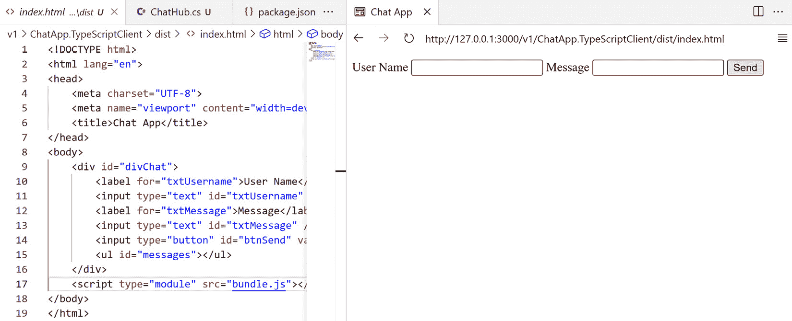

图 13.1 – 在 VS Code 中运行 TypeScript 客户端

您还可以尝试一些其他工具，例如 `http-server`。

1.  现在，通过运行以下命令启动 SignalR 服务器：

    ```cs
    Program.cs file:

    ```

    // 启用 CORSvar corsPolicy = new CorsPolicyBuilder()    .AllowAnyHeader()    .AllowAnyMethod()    .AllowCredentials()    .WithOrigins("http://127.0.0.1:3000")    .Build();builder.Services.AddCors(options =>{    options.AddPolicy("CorsPolicy", corsPolicy);});

    ```cs

    The preceding code allows cross-origin requests from `http://127.0.0.1:3000`, which is the URL of the **Live Preview** web server. You can change it to the URL of your web server if you are using a different web server. Note that this example is a very basic configuration that does not restrict any HTTP headers or HTTP methods. In a real-world application, you may need to restrict HTTP requests to improve the security of the application. For more details about CORS, you can refer to the official documentation at [`learn.microsoft.com/en-us/aspnet/core/security/cors`](https://learn.microsoft.com/en-us/aspnet/core/security/cors).
    ```

1.  重新启动 SignalR 服务器并刷新网页。您应该看到 **发送** 按钮已启用。输入用户名和消息，然后点击 **发送** 按钮。您应该看到消息显示在列表中，如下所示：

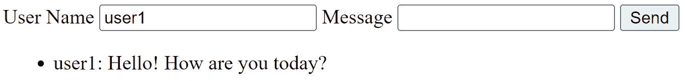

图 13.2 – 从 TypeScript 客户端发送消息

1.  打开另一个浏览器标签，并输入相同的 URL。输入不同的用户名和消息，然后点击 **发送** 按钮。您应该看到两个浏览器标签中都显示了消息，如下所示：

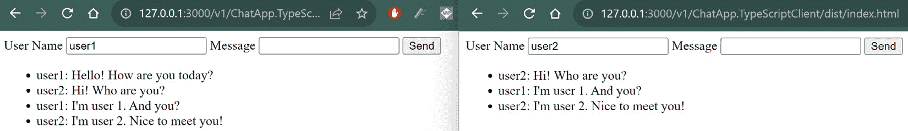

图 13.3 – 从另一个浏览器标签发送消息

TypeScript 客户端现在已完成。这是一个非常简单的客户端，它不使用任何 JavaScript 框架。前端开发的世界正在迅速变化。如果在测试示例代码时遇到任何问题，可以使用您喜欢的任何其他 JavaScript 框架，例如 React、Angular 或 Vue.js。SignalR 的代码对于不同的 JavaScript 框架基本相同。

## 构建 Blazor 客户端

我们将要构建的第二个客户端是一个 Blazor 客户端。Blazor 是一个使用 C# 构建客户端应用程序的 Web 框架。Blazor 首次在 2018 年作为 ASP.NET Core 3.0 的一部分被引入。Blazor 支持不同的托管模型：

+   **Blazor Server**：在这种托管模型中，Blazor 应用程序托管在 ASP.NET Core 服务器上。远程客户端通过 SignalR 连接到服务器。服务器负责处理用户交互并通过 SignalR 连接更新 UI。应用程序可以使用.NET 生态系统的全部功能和所有 ASP.NET Core 特性。这种托管模型还允许客户端下载少量代码，这意味着应用程序加载速度快，但需要持续连接到服务器。如果 SignalR 连接丢失，应用程序将无法工作。

+   **Blazor WebAssembly**：这种托管模型在浏览器中的 WebAssembly .NET 运行时上运行 Blazor 应用程序。Blazor 应用程序被下载到客户端，这意味着这种模型比 Blazor Server 模型需要更大的下载量。当一个 Blazor WebAssembly 应用程序在 ASP.NET Core 应用程序内托管时，它被称为*托管 Blazor WebAssembly*。托管 Blazor WebAssembly 应用程序可以与 ASP.NET Core 应用程序共享代码。当一个 Blazor WebAssembly 应用程序在没有服务器端代码的静态网站上托管时，它被称为*独立 Blazor WebAssembly*。独立的 Blazor WebAssembly 应用程序类似于纯客户端应用程序，例如 React 应用程序，因此它可以托管在任何 Web 服务器或**内容分发网络**（**CDN**）上。Blazor WebAssembly 应用程序可以离线工作，但性能取决于客户端的硬件。

+   **Blazor 混合模式**：这种模型允许 Blazor 应用程序在.NET 原生应用程序框架（如 WPF、Windows Forms 和 MAUI）中运行。这种模型结合了 Web 和原生应用程序的力量，并可以使用.NET 平台的全部功能。它适合构建跨平台应用程序，因为 Blazor 代码可以在不同的平台上共享。然而，仍然需要为不同的平台打包应用程序。

在这个示例应用程序中，我们将使用独立的 Blazor WebAssembly 来构建客户端应用程序，因为基于 Web 的应用程序是最常见的场景之一。但也可以使用类似的代码为其他托管模型服务。ASP.NET Core 8 为 Blazor 带来了一些改进。要了解更多关于 Blazor 的信息，您可以访问官方网站[`learn.microsoft.com/en-us/aspnet/core/blazor/`](https://learn.microsoft.com/en-us/aspnet/core/blazor/)。

要创建 Blazor WebAssembly 应用程序，请按照以下步骤操作：

1.  导航到`ChatApp.sln`解决方案的根目录。创建一个名为`ChatApp.BlazorClient`的新 Blazor WebAssembly 应用程序，并使用以下命令将其添加到解决方案中：

    ```cs
    ChatApp.BlazorClient folder and run the following command to install the SignalR client library:

    ```

    在`/Components/Pages/Home.razor`文件中的页面指令：

    ```cs
    @using Microsoft.AspNetCore.SignalR.Client@implements IAsyncDisposable
    ```

    这个`using`语句将 SignalR 客户端库导入到`Home`组件中。`implements IAsyncDisposable`语句表示`Home`组件实现了`IAsyncDisposable`接口。`IAsyncDisposable`接口用于异步释放资源。我们将用它来在组件不再使用时释放 SignalR 连接。

    ```cs

    ```

1.  将以下代码添加到`Home.razor`文件的末尾：

    ```cs
    @code {    private HubConnection? _hubConnection;    private readonly List<string> _messages = new ();    private string? _username;    private string? _message;    private bool IsConnected => _hubConnection?.State == HubConnectionState.Connected;    protected override async Task OnInitializedAsync()    {        _hubConnection = new HubConnectionBuilder()        .WithUrl("https://localhost:7159/chatHub")        .Build();        _hubConnection.On<string, string>("ReceiveMessage", (username, message) =>        {            var encodedMessage = $"{username}: {message}";            _messages.Add(encodedMessage);            StateHasChanged();        });        await _hubConnection.StartAsync();    }    private async Task SendMessage()    {        if (_hubConnection != null && IsConnected)        {            await _hubConnection!.InvokeAsync("SendMessage", _username, _message);            _message = string.Empty;        }    }    public async ValueTask DisposeAsync()    {        if (_hubConnection is not null)        {            await _hubConnection.DisposeAsync();        }    }}
    ```

    Blazor 利用`@code`指令将 C#代码集成到组件中。在这个例子中，我们为`Home`组件定义了一些字段和方法。如果你将此代码与其 TypeScript 对应版本进行比较，你会发现逻辑非常相似。`OnInitializedAsync()`方法用于设置 SignalR 连接，而`SendMessage()`方法用于调用 SignalR hub 的`SendMessage()`方法来发送消息。`DisposeAsync()`方法用于在组件不再使用时释放 SignalR 连接。此外，`StateHasChanged()`方法用于通知组件重新渲染 UI。

1.  接下来，我们需要将这些字段绑定到 UI 上。在`@code`指令之前添加以下代码：

    ```cs
    <div id="username-group">    <label>User Name</label>    <input type="text" @bind="_username" /></div><div id="message-group">    <label>Message</label>    <input type="text" @bind="_message" /></div><input type="button" value="Send" @onclick="SendMessage" disabled="@(!IsConnected)" /><ul>    @foreach (var message in _messages)    {        <li>@message</li>    }</ul>
    ```

    Blazor 使用`@`符号来指示 C#表达式。`@bind`指令用于将输入元素的值绑定到指定的字段。`@onclick`指令用于将点击事件绑定到指定的方法。`@foreach`指令用于遍历消息并在列表中显示它们。如果你熟悉任何现代 JavaScript 框架，如 React、Angular 或 Vue.js，你会在 Blazor 和这些框架之间发现一些相似之处。

1.  接下来，我们需要为 SignalR 服务器配置 CORS 策略，以便 Blazor 客户端可以连接到 SignalR hub。检查`Properties`文件夹中的`launchSettings.json`文件。与 SignalR 服务器应用程序类似，我们可以使用`http`或`https`配置文件来运行 Blazor 客户端应用程序。在这种情况下，我们将使用`https`配置文件。例如，示例代码的 URL 使用`https://localhost:7093`在 HTTPS 配置文件上运行 Blazor 客户端应用程序。我们需要更新 SignalR 服务器的 CORS 策略。更新`ChatApp.Server`项目的`Program.cs`文件，如下所示：

    ```cs
    var corsPolicy = new CorsPolicyBuilder()    .AllowAnyHeader()    .AllowAnyMethod()    .AllowCredentials()    .WithOrigins("http://127.0.0.1:3000", "https://localhost:7093")    .Build();
    ```

    现在，SignalR 服务器可以接受来自 Blazor 客户端应用程序的跨源请求。

1.  使用`dotnet run --launch-profile https`命令在单独的终端中运行 SignalR 服务器应用程序和 Blazor 客户端应用程序。你可以在浏览器中打开`https://localhost:7093` URL 来测试 Blazor 客户端应用程序。Blazor 客户端可以与 TypeScript 客户端进行聊天，如下所示：

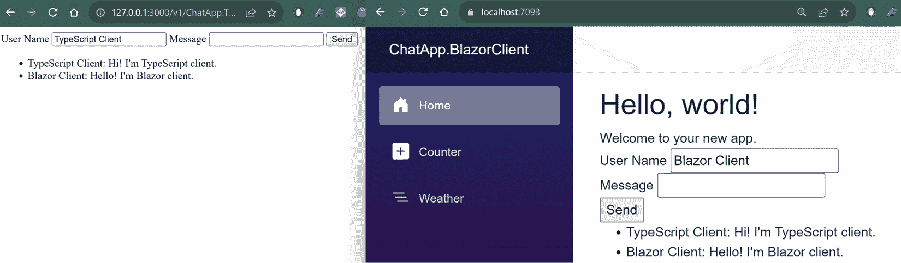

图 13.4 – Blazor 客户端和 TypeScript 客户端之间的聊天

SignalR 提供了实时通信的便利性。开发者不需要操作底层传输细节；相反，他们可以使用 SignalR 的 `Hub` 类轻松发送和接收消息。在下一节中，我们将探讨 SignalR 集线器（hub）的更多功能。

# 在 SignalR 中使用身份验证和授权

在上一节中，我们使用 `Hub` 类实现了一个简单的聊天应用。`Clients.All.SendAsync` 方法用于向所有已连接的客户端发送消息。有时，我们可能想向特定的客户端或一组客户端发送消息。为了管理用户和组，我们需要知道用户的身份。在本节中，我们将探讨如何在 SignalR 中使用身份验证和授权。

默认情况下，SignalR 使用 `ClaimTypes.NameIdentifier` 断言来区分用户。`ClaimTypes.NameIdentifier` 断言用于唯一标识用户。我们在 *第八章* 中介绍了基于断言的授权，因此我们将遵循该章节的步骤将身份验证和授权添加到 SignalR 服务器应用程序。如果您不熟悉 ASP.NET Core 身份验证和授权，您可以参考 *第八章* 获取更多详细信息。

您可以在 GitHub 仓库的 `chapter13/v2` 文件夹中找到示例代码的完整代码。

## 将身份验证和授权添加到 SignalR 服务器

要将身份验证和授权添加到 SignalR 服务器，请按照以下步骤操作：

1.  使用以下命令安装所需的包：

    ```cs
    Data in the ChatApp.Server project. Then, create a new class called AppbContext in the Data folder. As we introduced DbContext in previous chapters, we will not show the code here. You can find the code in the sample application.
    ```

1.  在 `appsettings.json` 文件中添加一个连接字符串：

    ```cs
    "ConnectionStrings": {  "DefaultConnection": "Server=(localdb)\\mssqllocaldb;Database=ChatAppDb;Trusted_Connection=True;MultipleActiveResultSets=true"}
    ```

1.  在 `appsettings.json` 文件中添加 JWT 令牌的配置：

    ```cs
    "JwtConfig": {  "ValidAudiences": "http://localhost:7159",  "ValidIssuer": "http://localhost:7159",  "Secret": "c1708c6d-7c94-466e-aca3-e09dcd1c2042"}
    ```

    我们将使用与身份验证服务器相同的 SignalR 服务器。因此，我们将使用 SignalR 服务器的 URL 作为受众和发行者。如果您使用不同的身份验证服务器，您需要相应地更改受众和发行者。

1.  SignalR 需要一个 `IUserIdProvider` 接口来获取用户 ID。在 `ChatApp.Server` 项目中创建一个名为 `Services` 的新文件夹。然后，在 `Services` 文件夹中创建一个名为 `NameUserIdProvider` 的新类：

    ```cs
    using Microsoft.AspNetCore.SignalR;namespace ChatApp.Server.Services;public class NameUserIdProvider : IUserIdProvider{    public string GetUserId(HubConnectionContext connection)    {        return connection.User?.Identity?.Name ?? string.Empty;    }}
    ```

    上述代码实现了 `IUserIdProvider` 接口。`GetUserId` 方法返回当前用户的用户 ID。在这种情况下，我们使用用户名作为用户 ID。您可以使用任何其他唯一值作为用户 ID。例如，如果您想使用电子邮件地址作为用户 ID，您可以创建一个名为 `EmailBasedUserIdProvider` 的类，如下所示：

    ```cs
    using System.Security.Claims;using Microsoft.AspNetCore.SignalR;namespace ChatApp.Server.Services;public class EmailBasedUserIdProvider : IUserIdProvider{    public string GetUserId(HubConnectionContext connection)    {        return connection.User?.Claims.FirstOrDefault(c => c.Type == ClaimTypes.Email)?.Value ??    string.Empty;    }}
    ```

1.  更新 `Program.cs` 文件以添加身份验证和授权，如下所示：

    ```cs
    builder.Services.AddDbContext<AppDbContext>();builder.Services.AddIdentityCore<IdentityUser>()    .AddEntityFrameworkStores<AppDbContext>()    .AddDefaultTokenProviders();builder.Services.AddAuthentication(options =>{    options.DefaultAuthenticateScheme = JwtBearerDefaults.AuthenticationScheme;    options.DefaultChallengeScheme = JwtBearerDefaults.AuthenticationScheme;    options.DefaultScheme = JwtBearerDefaults.AuthenticationScheme;}).AddJwtBearer(options =>{    var secret = builder.Configuration["JwtConfig:Secret"];    var issuer = builder.Configuration["JwtConfig:ValidIssuer"];    var audience = builder.Configuration["JwtConfig:ValidAudiences"];    if (secret is null || issuer is null || audience is null)    {        throw new ApplicationException("Jwt is not set in the configuration");    }    options.SaveToken = true;    options.RequireHttpsMetadata = false;    options.TokenValidationParameters = new TokenValidationParameters()    {        ValidateIssuer = true,        ValidateAudience = true,        ValidAudience = audience,        ValidIssuer = issuer,        IssuerSigningKey = new SymmetricSecurityKey(Encoding.UTF8.GetBytes(secret))    };    // Hook the SignalR event to check for the token in the query string    options.Events = new JwtBearerEvents    {        OnMessageReceived = context =>        {            var accessToken = context.Request.Query["access_token"];            var path = context.HttpContext.Request.Path;            if (!string.IsNullOrEmpty(accessToken) && path.StartsWithSegments("/chatHub"))            {                context.Token = accessToken;            }            return Task.CompletedTask;        }    };});// Use the name-based user ID providerbuilder.Services.AddSingleton<IUserIdProvider, NameUserIdProvider>();
    ```

    上述代码与*第八章*中的代码类似。一个区别是我们配置了`JwtBearerOptions`对象的`options.Events`属性。`OnMessageReceived`事件用于检查查询字符串中的令牌。原因是 WebSocket API 和 SSE 不支持标准的`Authorization`头，因此需要将令牌附加到查询字符串。如果查询字符串中找到令牌，它将被用来验证用户。

    我们还向之前创建的`NameUserIdProvider`类中添加了`IUserIdProvider`服务。如果您想使用`EmailBasedUserIdProvider`类，您需要相应地更改代码。请注意，您不能同时使用这两个类。

1.  创建数据库并使用以下命令运行迁移：

    ```cs
    Authorize attribute to the ChatHub class, as shown next:

    ```

    [授权]`public class ChatHub : Hub{    // 省略以节省空间}`

    ```cs

    The `Authorize` attribute can be applied to the `Hub` class or methods of the `Hub` class. It also supports policy-based authorization. For example, you can use the `Authorize(Policy = "Admin")` attribute to restrict access to the `ChatHub` class to administrators.
    ```

1.  运行`ChatApp.Server`应用程序以及任何其他客户端应用程序。遗憾的是，TypeScript 和 Blazor 客户端将无法连接到 SignalR hub，因为需要用户认证。要访问 SignalR hub，我们需要验证客户端。

## 添加登录端点

为了验证客户端，我们需要提供一个登录端点。我们在*第八章*中实现了登录端点。您可以按照*第八章*中的步骤来实现登录端点或从示例应用程序中复制代码。您需要创建一个包含注册和登录端点的`AccountController`类。您还需要添加一些模型，例如`LoginModel`和`AddOrUpdateUserModel`类。有了这些类，我们可以使用`account/register`和`account/login`端点来注册和登录用户。

这里需要注意的是，在生成 JWT 令牌时，我们需要向令牌中添加一个`ClaimTypes.NameIdentifier`声明。SignalR 使用此声明来识别用户。以下代码显示了如何向令牌中添加`ClaimTypes.NameIdentifier`声明：

```cs
var tokenDescriptor = new SecurityTokenDescriptor{
    Subject = new ClaimsIdentity(new[]
    {
        // SignalR requires the NameIdentifier claim to map the user to the connection
        new Claim(ClaimTypes.NameIdentifier, userName),
        new Claim(ClaimTypes.Name, userName),
        // If you use the email-based user ID provider, you need to add the email claim from the database
    }),
    Expires = DateTime.UtcNow.AddDays(1),
    Issuer = issuer,
    Audience = audience,
    SigningCredentials = new SigningCredentials(signingKey, SecurityAlgorithms.HmacSha256Signature)
};
```

现在，我们需要为测试创建一些用户。运行`ChatApp.Server`应用程序，并使用 Postman 或其他 HTTP 客户端向`account/register`端点发送`POST`请求。以下代码显示了如何使用`account/register`端点创建用户：

```cs
{  "userName": "user1",
  "email": "user1@example.com",
  "password": "Passw0rd!"
}
```

创建更多用户，例如`user2`、`user3`等。我们将使用这些用户来测试后续的`Groups`功能。

## 验证 TypeScript 客户端

现在，我们可以验证 TypeScript 客户端。为此，我们需要更新 UI 以允许用户输入用户名和密码。我们还需要更新 TypeScript 代码以将用户名和密码发送到登录端点。按照以下步骤更新 TypeScript 客户端：

1.  按照以下方式更新`<body>`元素中的 HTML 内容：

    ```cs
    <body>    <div id="divLogin">        <label for="txtUsername">User Name</label>        <input type="text" id="txtUsername" />        <label for="txtPassword">Password</label>        <input type="password" id="txtPassword" />        <button id="btnLogin">Login</button>    </div>    <div id="divChat">        <label>User Name</label>        <label id="lblUsername" ></label>        <label for="txtMessage">Message</label>        <input type="text" id="txtMessage" />        <button id="btnSend">Send</button>        <ul id="messages"></ul>    </div>    <script type="module" src="img/bundle.js"></script></body>
    ```

    以下代码将登录表单添加到 HTML 页面。登录表单包含用户名文本框、密码文本框和登录按钮。`divChat` 元素现在有一个 `lblUsername` 元素来显示用户名。`divChat` 元素默认是隐藏的。用户身份验证后，我们将显示它。

1.  按照以下方式更新 `app.ts` 文件：

    ```cs
    import * as signalR from "@microsoft/signalr";divChat.style.display = "none";btnSend.disabled = true;btnLogin.addEventListener("click", login);let connection: signalR.HubConnection = null;async function login() {  const username = txtUsername.value;  const password = txtPassword.value;  if (username && password) {    try {      // Use the Fetch API to login      const response = await fetch("https://localhost:7159/account/login", {        method: "POST",        headers: { "Content-Type": "application/json" },        body: JSON.stringify({ username, password }),      });      const json = await response.json();      localStorage.setItem("token", json.token);      localStorage.setItem("username", username);      txtUsername.value = "";      txtPassword.value = "";      lblUsername.textContent = username;      divLogin.style.display = "none";      divChat.style.display = "block";      txtMessage.focus();      // Start the SignalR connection      connection = new signalR.HubConnectionBuilder()        .withUrl("https://localhost:7159/chatHub", {          accessTokenFactory: () => {           var localToken = localStorage.getItem("token");           // You can add logic to check if the token is valid or expired           return localToken;         },        })        .build();      connection.on("ReceiveMessage", (username: string, message: string) => {        const li = document.createElement("li");        li.textContent = `${username}: ${message}`;        const messageList = document.getElementById("messages");        messageList.appendChild(li);        messageList.scrollTop = messageList.scrollHeight;      });      await connection.start();      btnSend.disabled = false;    } catch (err) {      console.error(err.toString());    }  }}txtMessage.addEventListener("keyup", (event) => {  if (event.key === "Enter") {    sendMessage();  }});btnSend.addEventListener("click", sendMessage);function sendMessage() {  connection    .invoke("SendMessage", lblUsername.textContent, txtMessage.value)    .catch((err) => console.error(err.toString()))    .then(() => (txtMessage.value = ""));}
    ```

    一些代码被省略了。您可以从书籍的 GitHub 仓库中找到完整的代码。

    在前面的代码中，我们使用 `fetch` API 向登录端点发送 `POST` 请求。如果用户已通过身份验证，登录端点将返回 JWT 令牌。然后，我们将令牌存储在本地存储中，并在 `divChat` 元素中显示用户名。我们还调整了 SignalR 连接的创建。`accessTokenFactory` 属性用于从本地存储中获取令牌。您可以添加一些逻辑来检查令牌是否有效或已过期。如果令牌已过期，您可以重定向用户到登录页面或使用 `dist` 文件夹：

    ```cs
    npm run gulp
    ```

1.  使用 **Live Preview** 扩展运行 Web 服务器。同时运行 SignalR 服务器应用程序。您将看到一个登录表单，如下所示：

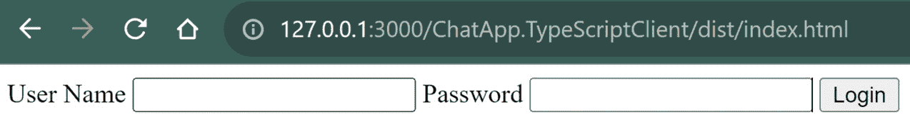

图 13.5 – 登录表单

使用您之前创建的用户名和密码登录。您应该看到一个聊天表单，如下所示：

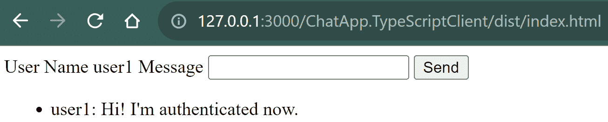

图 13.6 – 已验证聊天

现在，TypeScript 客户端已经进行了身份验证。接下来，我们将验证 Blazor 客户端。

## 验证 Blazor 客户端

验证 Blazor 客户端的代码与 TypeScript 客户端非常相似，因此我们在此不列出所有代码。您可以在示例应用程序中找到代码。以下代码展示了如何登录并将令牌设置到 SignalR 连接中：

```cs
@inject HttpClient Httpprivate async Task Login()
{
    if (!string.IsNullOrWhiteSpace(_username) && !string.IsNullOrWhiteSpace(_password))
    {
        var response = await Http.PostAsJsonAsync("Account/login", new { Username = _username, Password = _password });
        if (response.IsSuccessStatusCode)
        {
            var jsonString = await response.Content.ReadAsStringAsync();
            var data = System.Text.Json.JsonSerializer.Deserialize<Dictionary<string, string>>(jsonString);
            _token = data["token"];
            if (string.IsNullOrWhiteSpace(_token))
            {
                throw new Exception("Invalid token.");
            }
            else
            {
                _showLogin = false;
                _showChat = true;
                StateHasChanged();
                // Set the token to the hub connection.
                _hubConnection = new HubConnectionBuilder()
                .WithUrl("https://localhost:7159/chatHub", options =>
                {
                    options.AccessTokenProvider = () => Task.FromResult<string?>(_token);
                })
                .Build();
                _hubConnection.On<string, string>("ReceiveMessage", (username, message) =>
                {
                    var encodedMessage = $"{username}: {message}";
                    _messages.Add(encodedMessage);
                    StateHasChanged();
                });
                await _hubConnection.StartAsync();
            }
        }
    }
}
```

在前面的代码中，我们注入 `HttpClient` 向登录端点发送 `POST` 请求。然后，我们将令牌设置到 SignalR 连接中。`AccessTokenProvider` 属性用于从 `_token` 字段获取令牌。类似于 TypeScript 客户端，您可以添加一些逻辑来检查令牌是否有效或已过期。

运行三个应用程序。您可以使用不同的用户名登录到两个客户端并发送消息。您应该看到消息在两个客户端中显示，如下所示：

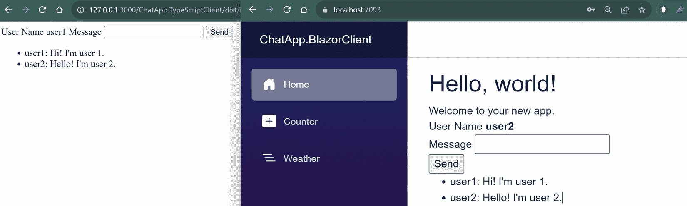

图 13.7 – 不同用户的已验证聊天

客户端现在支持身份验证。接下来，我们将向聊天应用添加更多功能。

# 管理用户和组

在上一节中，我们为 SignalR 服务器实现了基本的身份验证和授权。我们还更新了客户端以验证用户。在本节中，我们将探讨如何在 SignalR 中管理用户和组。我们希望为聊天应用添加以下功能：

+   允许用户知道谁连接到了聊天应用

+   允许用户向特定用户发送消息

+   允许用户加入组

+   允许用户向特定组发送消息

你可以在 GitHub 仓库的`chapter13/v3`文件夹中找到示例代码的完整代码。让我们从第一个功能开始。

## 管理 SignalR 中的事件

SignalR 提供事件来通知客户端当用户连接或断开连接时。我们可以重写`OnConnectedAsync()`和`OnDisconnectedAsync()`方法来处理这些事件。以下代码展示了如何重写`OnConnectedAsync()`方法：

```cs
public override async Task OnConnectedAsync(){
    await Clients.All.SendAsync("UserConnected", Context.User.Identity.Name);
    await base.OnConnectedAsync();
}
```

当客户端连接到 SignalR 中心时，将调用`OnConnectedAsync()`方法。在这种情况下，我们使用`Clients.All.SendAsync()`方法向所有已连接的客户端发送消息。`Context.User.Identity.Name`属性用于获取当前用户的用户名。

以下代码展示了如何重写`OnDisconnectAsync()`方法：

```cs
public override async Task OnDisconnectedAsync(Exception? exception){
    await Clients.All.SendAsync("UserDisconnected", Context.User.Identity.Name);
    await base.OnDisconnectedAsync(exception);
}
```

然后，我们可以更新 TypeScript 客户端以处理`UserConnected`和`UserDisconnected`事件。以下代码展示了如何在 TypeScript 客户端中处理`UserConnected`事件：

```cs
connection.on("UserConnected", (username: string) => {  const li = document.createElement("li");
  li.textContent = `${username} connected`;
  const messageList = document.getElementById("messages");
  messageList.appendChild(li);
  messageList.scrollTop = messageList.scrollHeight;
});
connection.on("UserDisconnected", (username: string) => {
  const li = document.createElement("li");
  li.textContent = `${username} disconnected`;
  const messageList = document.getElementById("messages");
  messageList.appendChild(li);
  messageList.scrollTop = messageList.scrollHeight;
});
```

Blazor 客户端中的代码非常相似：

```cs
_hubConnection.On<string>("UserConnected", (username) =>{
    var encodedMessage = $"{username} connected.";
    _messages.Add(encodedMessage);
    StateHasChanged();
});
_hubConnection.On<string>("UserDisconnected", (username) =>
{
    var encodedMessage = $"{username} disconnected.";
    _messages.Add(encodedMessage);
    StateHasChanged();
});
```

现在，我们可以运行 SignalR 服务器和两个客户端。你应该在聊天窗口中看到用户的连接和断开连接消息。如果你刷新页面或关闭浏览器标签，你应该看到用户断开连接的消息，如下所示：

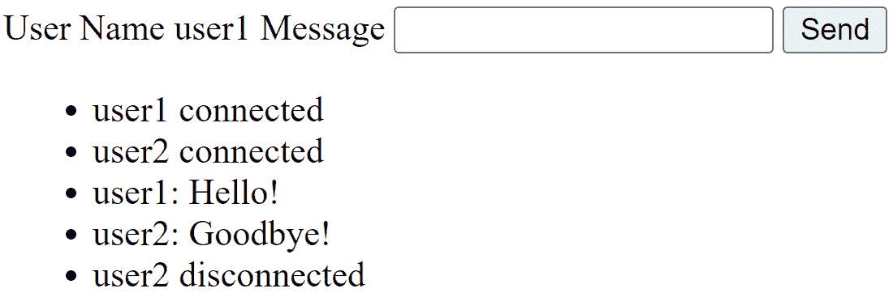

图 13.8 – 用户连接和断开连接的消息

接下来，我们将添加一个功能，允许用户向特定用户发送消息。

## 向特定用户发送消息

我们想要添加的下一个功能是允许用户向特定用户发送消息。为此，我们需要知道消息发送给谁。SignalR 使用`ClaimTypes.NameIdentifier`声明来区分用户。为了简化代码，我们将用户名作为目标用户传递：

```cs
public Task SendMessageToUser(string user, string toUser, string message){
    return Clients.User(toUser).SendAsync("ReceiveMessage", user, message);
}
```

前面的代码使用`Clients.User(user)`方法来查找指定用户的连接。

接下来，更新 TypeScript 客户端以添加一个文本框来输入目标用户名。以下代码展示了如何更新`divChat`元素的 HTML 内容：

```cs
<label for="txtToUser">To</label><input type="text" id="txtToUser" />
```

然后，我们可以从 TypeScript 客户端按如下方式调用此方法：

```cs
function sendMessage() {  // If the txtToUser field is not empty, send the message to the user
  if (txtToUser.value) {
    connection
      .invoke("SendMessageToUser", lblUsername.textContent, txtToUser.value, txtMessage.value)
      .catch((err) => console.error(err.toString()))
      .then(() => (txtMessage.value = ""));
  } else {
    connection
      .invoke("SendMessage", lblUsername.textContent, txtMessage.value)
      .catch((err) => console.error(err.toString()))
      .then(() => (txtMessage.value = ""));
  }
}
```

在前面的代码中，当`txtToUser`字段不为空时，我们使用`SendMessageToUser()`方法向指定的用户发送消息。否则，我们使用`SendMessage()`方法向所有已连接的用户发送消息。

Blazor 客户端中的代码非常相似：

```cs
private async Task SendMessage(){
    if (_hubConnection != null && IsConnected)
    {
        if (!string.IsNullOrWhiteSpace(_toUser))
        {
            await _hubConnection.InvokeAsync("SendMessageToUser", _username, _toUser, _message);
        }
        else
        {
            await _hubConnection.InvokeAsync("SendMessage", _username, _message);
        }
        _message = string.Empty;
    }
}
```

请参阅示例应用程序以获取完整代码。

运行三个应用程序。这次，我们需要打开三个浏览器标签进行测试。使用三个不同的用户名登录到三个客户端。然后，我们可以向特定用户发送消息，如下所示：

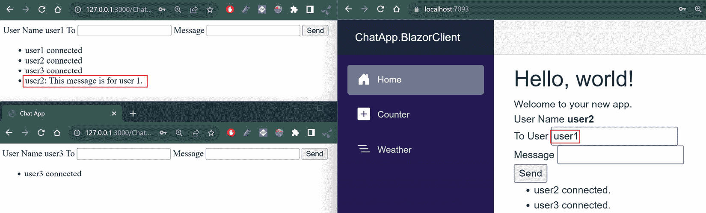

图 13.9 – 向特定用户发送消息

在*图 13*.9 中，我们从`user2`用户向`user1`用户发送了一条消息。您可以看到，消息显示在`user1`的浏览器标签中，但没有显示在`user3`的浏览器标签中。

您可以尝试在不同的浏览器标签中登录相同的用户名。您会发现两个浏览器标签都会收到消息。这是因为 SignalR 使用`ClaimTypes.NameIdentifier`声明来区分用户。每个浏览器标签都有一个不同的 SignalR 连接，但它们使用相同的用户名。因此，SignalR 将它们视为同一用户。

## 使用强类型 Hub

到目前为止，我们已经向`ChatHub`类添加了一些方法：

```cs
public Task SendMessage(string user, string message){
    await Clients.All.SendAsync("ReceiveMessage", user, message);
}
public Task SendMessageToUser(string user, string toUser, string message)
{
    return Clients.User(toUser).SendAsync("ReceiveMessage", user, message);
}
public override async Task OnConnectedAsync()
{
    await Clients.All.SendAsync("UserConnected", Context.User.Identity.Name);
    await base.OnConnectedAsync();
}
public override async Task OnDisconnectedAsync(Exception? exception)
{
    await Clients.All.SendAsync("UserDisconnected", Context.User.Identity.Name);
    await base.OnDisconnectedAsync(exception);
}
```

每个方法都使用一个字符串参数调用`SendAsync()`方法。字符串参数是要在客户端上调用的方法名称。`SendAsync()`方法是一个动态方法，但它不是类型安全的。如果我们拼错了方法名称，编译器将不会报告任何错误。为了提高类型安全性，我们可以使用强类型 Hub。

要使用强类型 Hub，我们需要定义一个包含客户端方法的 Hub 接口。以下代码展示了如何定义 Hub 接口：

```cs
public interface IChatClient{
    Task ReceiveMessage(string user, string message);
    Task UserConnected(string user);
    Task UserDisconnected(string user);
}
```

然后，我们可以更新`ChatHub`类以实现`IChatClient`接口：

```cs
public class ChatHub : Hub<IChatClient>{
    public Task SendMessage(string user, string message)
    {
        return Clients.All.ReceiveMessage(user, message);
    }
    public Task SendMessageToUser(string user, string toUser, string message)
    {
        return Clients.User(toUser).ReceiveMessage(user, message);
    }
    public override async Task OnConnectedAsync()
    {
        await Clients.All.UserConnected(Context.User.Identity.Name);
        await base.OnConnectedAsync();
    }
    public override async Task OnDisconnectedAsync(Exception? exception)
    {
        await Clients.All.UserDisconnected(Context.User.Identity.Name);
        await base.OnDisconnectedAsync(exception);
    }
}
```

在前面的代码中，`SendAsync()`方法不再使用。相反，我们使用在`IChatClient`接口中定义的`RecieveMessage()`、`UserConnected()`和`UserDisconnected()`方法。`Hub`类是泛型的，因此我们需要指定`IChatClient`接口作为泛型类型参数。现在，`ChatHub`类是强类型的。请注意，如果您使用强类型 Hub，则`SendAsync()`方法将不再可用。

接下来，我们将添加一个功能，允许用户加入组。

## 加入组

SignalR 允许用户加入组。`Hub`类有一个`Groups`属性来管理组。`Groups`属性的类型是`IGroupManager`接口，它提供了`AddToGroupAsync()`、`RemoveFromGroupAsync()`等方法。以下代码展示了如何将用户添加到组中以及如何从组中移除用户：

```cs
public async Task AddToGroup(string user, string group){
    await Groups.AddToGroupAsync(Context.ConnectionId, group);
    await Clients.Group(group).ReceiveMessage(Context.User.Identity.Name,
        $"{user} has joined the group {group}. Connection Id: {Context.ConnectionId}");
}
public async Task RemoveFromGroup(string user, string group)
{
    await Groups.RemoveFromGroupAsync(Context.ConnectionId, group);
    await Clients.Group(group).ReceiveMessage(Context.User.Identity.Name,
                   $"{user} has left the group {group}. Connection Id: {Context.ConnectionId}");
}
```

在前面的代码中，我们使用`Groups`属性来管理组。`Context.ConnectionId`属性用于获取当前用户的连接 ID。`Clients.Group`方法用于向指定组中的所有用户发送消息，以便他们知道谁加入了或离开了该组。

接下来，我们需要更新 UI 以允许用户输入组名。将以下代码添加到`divChat`元素的 HTML 内容中：

```cs
<label id="lblToGroup">Group</label><input type="text" id="txtToGroup" />
<button id="btnJoinGroup">Join Group</button>
<button id="btnLeaveGroup">Leave Group</button>
```

更新 TypeScript 代码以处理`JoinGroup`和`LeaveGroup`事件。以下代码展示了如何处理`JoinGroup`事件：

```cs
btnJoinGroup.addEventListener("click", joinGroup);btnLeaveGroup.addEventListener("click", leaveGroup);
function joinGroup() {
  if (txtToGroup.value) {
    connection
      .invoke("AddToGroup", lblUsername.textContent, txtToGroup.value)
      .catch((err) => console.error(err.toString()))
      .then(() => {
        btnJoinGroup.disabled = true;
        btnJoinGroup.style.display = "none";
        btnLeaveGroup.disabled = false;
        btnLeaveGroup.style.display = "inline";
        txtToGroup.readOnly = true;
      });
  }
}
function leaveGroup() {
  if (txtToGroup.value) {
    connection
      .invoke("RemoveFromGroup", lblUsername.textContent, txtToGroup.value)
      .catch((err) => console.error(err.toString()))
      .then(() => {
        btnJoinGroup.disabled = false;
        btnJoinGroup.style.display = "inline";
        btnLeaveGroup.disabled = true;
        btnLeaveGroup.style.display = "none";
        txtToGroup.readOnly = false;
      });
  }
}
```

前面的代码展示了两个事件处理程序，用于`JoinGroup`和`LeaveGroup`事件，分别在 SignalR Hub 上调用`AddToGroup()`和`RemoveFromGroup()`方法。

Blazor 客户端中的代码非常相似。这里不再列出代码。您可以在示例应用程序中找到代码。

现在，客户端应该能够加入和离开组。当用户加入或离开组时，组中的其他用户将收到消息，如下所示：

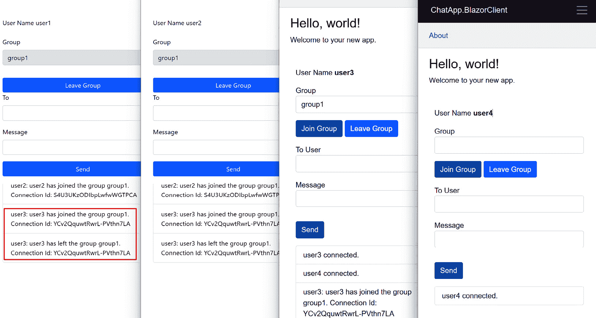

图 13.10 – 加入和离开组

在 *图 13*.10 中，`user3` 加入 `group1` 然后离开 `group1`。您可以看到 `group1` 中的其他用户收到了消息。

接下来，我们将添加一个功能，允许用户向特定组发送消息。

## 向组发送消息

向组发送消息的代码与向特定用户发送消息的代码非常相似。以下代码展示了在 `ChatHub` 类中如何向组发送消息：

```cs
public async Task SendMessageToGroup(string user, string group, string message){
    await Clients.Group(group).ReceiveMessage(user, message);
}
```

上述代码使用 `Clients.Group(group)` 来查找指定组中用户的连接。然后，它使用在 `IChatClient` 接口中定义的 `ReceiveMessage()` 方法向组中的用户发送消息。

Blazor 客户端可以按如下方式调用此方法：

```cs
private async Task SendMessage(){
    if (_hubConnection != null && IsConnected)
    {
        if (!string.IsNullOrWhiteSpace(_group) && _isJoinedGroup)
        {
            await _hubConnection.InvokeAsync("SendMessageToGroup", _username, _group, _message);
        }
        // Omitted for brevity
    }
}
```

我们在此处不会列出 TypeScript 客户端的代码。您可以在示例应用程序中找到代码。

现在，客户端应该能够向特定组发送消息。以下图示展示了如何向组发送消息：

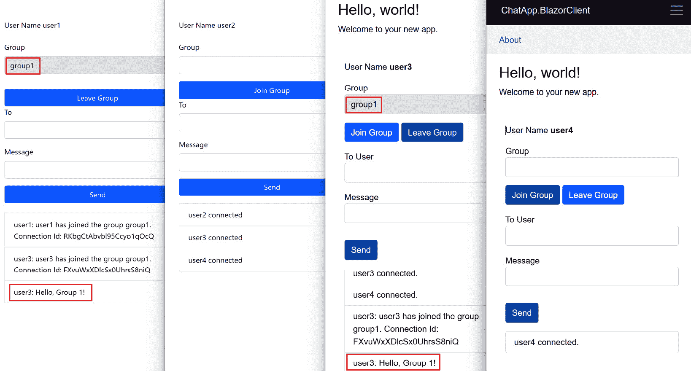

图 13.11 – 向组发送消息

您将看到 `user1` 和 `user3` 显示了消息，因为他们处于同一个组中。但 `user2` 和 `user4` 将不会看到消息，因为他们不在 `group1` 中。

# 从其他服务发送消息

到目前为止，我们已经实现了一个聊天应用，允许用户向其他用户或组发送消息。有时，我们需要从其他地方发送消息。例如，当发生事件时，我们可能需要发送消息来通知用户。在本节中，我们将探讨如何从其他服务发送消息。您可以在 GitHub 仓库的 `chapter13/v4` 文件夹中找到示例的完整代码。

我们将在 `ChatApp.Server` 应用程序中添加一个 REST API 端点，以允许其他系统向 SignalR 集线器发送消息。按照以下步骤在 `ChatApp.Server` 应用程序中添加 REST API 端点：

1.  在 `Models` 文件夹中创建以下模型：

    ```cs
    public class SendToAllMessageModel{    public string FromUser { get; set; } = string.Empty;    public string Message { get; set; } = string.Empty;}public class SendToUserMessageModel{    public string FromUser { get; set; } = string.Empty;    public string ToUser { get; set; } = string.Empty;    public string Message { get; set; } = string.Empty;}public class SendToGroupMessageModel{    public string FromUser { get; set; } = string.Empty;    public string GroupName { get; set; } = string.Empty;    public string Message { get; set; } = string.Empty;}
    ```

    这些模型用于向 SignalR 集线器发送消息。

1.  在示例应用程序中创建一个新的控制器或使用现有的 `AccountController` 类。我们将在 `Controllers` 文件夹中创建一个 `ChatController` 类。

1.  将 `IHubContext<ChatHub, IChatClient>` 服务注入到 `ChatController` 类中：

    ```cs
    [Route("api/[controller]")][ApiController]public class ChatController(IHubContext<ChatHub, IChatClient> hubContext) : ControllerBase{}
    ```

    `IHubContext<ChatHub, IChatClient>` 服务用于向客户端发送消息。在这个例子中，我们使用了一个强类型集线器。如果您使用的是普通 SignalR 集线器，您也可以注入 `IHubContext<ChatHub>` 服务。

1.  添加以下操作以向所有用户、特定用户和特定组发送消息：

    ```cs
     [HttpPost("/all")] public async Task<IActionResult> SendToAllMessage([FromBody] SendToAllMessageModel model) {     if (ModelState.IsValid)     {         await hubContext.Clients.All.ReceiveMessage(model.FromUser, model.Message);         return Ok();     }     return BadRequest(ModelState); } [HttpPost("/user")] public async Task<IActionResult> SendToUserMessage([FromBody] SendToUserMessageModel model) {     if (ModelState.IsValid)     {         await hubContext.Clients.User(model.ToUser).ReceiveMessage(model.FromUser, model.Message);         return Ok();     }     return BadRequest(ModelState); } [HttpPost("/group")] public async Task<IActionResult> SendToGroupMessage([FromBody] SendToGroupMessageModel model) {     if (ModelState.IsValid)     {         await hubContext.Clients.Group(model.GroupName).ReceiveMessage(model.FromUser, model.Message);         return Ok();     }     return BadRequest(ModelState); }
    ```

    上一段代码使用了 `hubContext.Clients` 属性向客户端发送消息。请注意，此端点未进行身份验证。如果需要，您可以为此端点添加身份验证和授权。

    +   运行三个应用程序。使用不同的用户登录并加入群组。然后，您可以使用 Postman 或任何其他 HTTP 客户端测试 `chat/all`、`chat/user` 和 `chat/group` 端点。

这就是从外部服务发送消息的方法。在下一节中，我们将探讨如何管理 SignalR 连接。

# 配置 SignalR 中心和客户端

SignalR 提供了一个 `HubOptions` 类来配置 SignalR 中心。此外，SignalR 客户端也有一些配置选项。在本节中，我们将探讨如何配置 SignalR 中心和客户端。您可以在 GitHub 仓库的 `chapter13/v5` 文件夹中找到示例的完整代码。

## 配置 SignalR 中心

这里是 SignalR 中心的配置选项：

+   `KeepAliveInterval`：此属性确定发送给客户端的保持连接消息的间隔。如果客户端在此时间段内没有从服务器收到消息，它将向服务器发送 `ping` 消息以维持连接。更改此值时，还重要的是要调整客户端中的 `serverTimeoutInMilliseconds` 或 `ServerTimeout` 选项。为了获得最佳结果，建议将 `serverTimeoutInMilliseconds` 或 `ServerTimeout` 选项设置为 `KeepAliveInterval` 属性值的两倍。`KeepAliveInterval` 的默认值是 15 秒。

+   `ClientTimeoutInterval`：此属性确定服务器在未从客户端收到消息的情况下，将客户端视为断开连接的间隔。建议将 `ClientTimeoutInterval` 设置为 `KeepAliveInterval` 属性值的两倍。`ClientTimeoutInterval` 的默认值是 30 秒。

+   `EnableDetailedErrors`：此属性确定是否向客户端发送详细错误消息。`EnableDetailedErrors` 的默认值是 `false`，因为错误消息可能包含敏感信息。

+   `MaximumReceiveMessageSize`：此属性确定服务器将接受的消息的最大大小。`MaximumReceiveMessageSize` 的默认值是 32 KB。不要将此值设置得过大，因为它可能引起 **拒绝服务**（**DoS**）攻击并消耗大量内存。

+   `MaximumParallelInvocationsPerClient`：此属性确定每个客户端可以并行执行的 hub 方法调用的最大数量。`MaximumParallelInvocationsPerClient` 的默认值是 1。

+   `StreamBufferCapacity`：此属性确定客户端上传流中可以缓存的项的最大数量。`StreamBufferCapacity` 的默认值是 10。我们将在下一节中介绍流。

配置 SignalR 中心的方式有两种。第一种方式是为所有中心提供一个 `HubOptions` 对象。以下代码展示了如何配置 `ChatHub` 类：

```cs
builder.Services.AddSignalR(options =>{
    options.KeepAliveInterval = TimeSpan.FromSeconds(10);
    options.ClientTimeoutInterval = TimeSpan.FromSeconds(20);
    options.EnableDetailedErrors = true;
});
```

第二种方式是为每个中心配置 SignalR 中心。以下代码展示了如何配置 `ChatHub` 类：

```cs
builder.Services.AddSignalR().AddHubOptions<ChatHub>(options =>{
    options.KeepAliveInterval = TimeSpan.FromSeconds(10);
    options.ClientTimeoutInterval = TimeSpan.FromSeconds(20);
    options.EnableDetailedErrors = true;
});
```

如果您有多个中心并且想要分别配置它们，上述代码非常有用。

注意，如果您更改 SignalR 中心的 `KeepAliveInterval` 或 `ClientTimeoutInterval` 属性，您还需要在客户端更新 `serverTimeoutInMilliseconds` 或 `ServerTimeout` 选项。以下代码展示了如何配置 TypeScript 客户端：

```cs
connection = new signalR.HubConnectionBuilder()  .withUrl("https://localhost:7159/chatHub", {
    // Omitted for brevity
  })
  .build();
// The following configuration must match the configuration in the server project
connection.keepAliveIntervalInMilliseconds = 10000;
connection.serverTimeoutInMilliseconds = 20000;
```

`HubConnection` 对象具有 `keepAliveIntervalInMilliseconds` 属性和 `serverTimeoutInMilliseconds` 属性，这些属性可以用于匹配服务器项目中的配置。

类似地，您还可以如下配置 Blazor 客户端：

```cs
_hubConnection = new HubConnectionBuilder()    .WithUrl("https://localhost:7159/chatHub", options =>
    {
        // Omitted for brevity
    })
    .Build();
_hubConnection.KeepAliveInterval = TimeSpan.FromSeconds(10);
_hubConnection.ServerTimeout = TimeSpan.FromSeconds(20);
You can also configure these properties on the HubConnectionBuilder object as shown below:
_hubConnection = new HubConnectionBuilder()
    .WithUrl("https://localhost:7159/chatHub", options =>
    {
        // Omitted for brevity
    })
    .WithKeepAliveInterval(TimeSpan.FromSeconds(10))
    .WithServerTimeout(TimeSpan.FromSeconds(20))
    .Build();
```

确保服务器和客户端中 `KeepAliveInterval` 和 `ClientTimeout/ServerTimeout` 属性的值相同。

## HTTP 配置选项

SignalR 可以自动与客户端协商传输协议。默认传输协议是 WebSockets。如果客户端不支持 WebSockets，SignalR 将使用 SSE 或长轮询。您可以配置 SignalR 的 HTTP 选项。以下代码展示了如何为 `ChatHub` 类配置 HTTP 选项：

```cs
app.MapHub<ChatHub>("/chatHub", options =>{
    options.Transports = HttpTransportType.WebSockets | HttpTransportType.LongPolling;
    options.WebSockets.CloseTimeout = TimeSpan.FromSeconds(10);
    options.LongPolling.PollTimeout = TimeSpan.FromSeconds(120);
});
```

上述代码使用 `HttpConnectionDispatcherOptions` 对象为 `ChatHub` 类配置了 HTTP 选项。在此示例中，我们配置了 `Transports` 属性以使用 WebSockets 和长轮询，但不使用 SSE。此外，我们还配置了 `WebSockets` 属性的 `CloseTimeout` 属性为 10 秒，以及 `LongPolling` 属性的 `PollTimeout` 属性为 120 秒。`CloseTimeout` 属性的默认值是 5 秒，这意味着如果客户端在 5 秒内无法关闭连接，连接将被终止。`PollTimeout` 属性的默认值是 90 秒，这意味着服务器将在等待 90 秒后终止轮询请求，然后创建一个新的轮询请求。

允许的传输可以在客户端进行配置。我们可以如下配置 TypeScript 客户端：

```cs
connection = new signalR.HubConnectionBuilder()  .withUrl("https://localhost:7159/chatHub", {
    transport: signalR.HttpTransportType.WebSockets | signalR.HttpTransportType.LongPolling,
  })
  .build();
```

以下代码展示了如何配置 Blazor 客户端：

```cs
_hubConnection = new HubConnectionBuilder()    .WithUrl("https://localhost:7159/chatHub", options =>
    {
        options.Transports = HttpTransportType.WebSockets | HttpTransportType.LongPolling;
    })
    .Build();
```

`HttpTransportType` 枚举具有 `FlagsAttribute` 属性，因此您可以使用位运算符 `OR` 来组合多个传输协议。

## 自动重新连接

有时，由于网络问题，SignalR 连接可能会断开。例如，如果用户的设备从 Wi-Fi 切换到蜂窝网络，或者如果用户的设备处于隧道中，SignalR 连接可能会断开。在这种情况下，我们希望客户端自动重新连接到服务器：

1.  SignalR 允许客户端在连接断开时自动重新连接到服务器。以下代码展示了如何配置 TypeScript 客户端以自动重新连接到服务器：

    ```cs
    connection = new signalR.HubConnectionBuilder()  .withUrl("https://localhost:7159/chatHub", {    // Omitted for brevity  })  .withAutomaticReconnect()  .build();
    ```

1.  类似地，您可以按以下方式配置 Blazor 客户端：

    ```cs
    _hubConnection = new HubConnectionBuilder()    .WithUrl("https://localhost:7159/chatHub", options =>    {        // Omittted for brevity    })    .WithAutomaticReconnect()    .Build();
    ```

1.  默认情况下，当连接断开时，客户端将在 0 秒、2 秒、10 秒和 30 秒后尝试重新连接到 SignalR 服务器。您可以按以下方式配置重试策略：

    ```cs
    connection = new signalR.HubConnectionBuilder()  .withUrl("https://localhost:7159/chatHub", {    // Omittted for brevity  })  .withAutomaticReconnect([0, 5, 20])  .build();
    ```

    `withAutomaticReconnect()`方法接受一个数字数组来配置毫秒级的延迟持续时间。在前面代码中，客户端将在 0 秒、5 秒和 20 秒后尝试重新连接到服务器。

1.  在 Blazor 客户端中，您可以按以下方式配置重试策略：

    ```cs
    _hubConnection = new HubConnectionBuilder()    .WithUrl("https://localhost:7159/chatHub", options =>    {        // Omitted for brevity    })    .WithAutomaticReconnect(new[] { TimeSpan.FromSeconds(0), TimeSpan.FromSeconds(5), TimeSpan.FromSeconds(20) })    .Build();
    ```

    前面的代码配置了与 TypeScript 客户端相同的重试策略。

1.  为了测试自动重连功能，我们可以在标签上添加一个显示连接状态的标签。将以下代码添加到`divChat`元素的 HTML 内容中：

    ```cs
    <div class="form-group mb-3">  <label>Status</label>  <label id="lblStatus"></label></div>
    ```

1.  然后，更新 TypeScript 代码以显示连接状态：

    ```cs
    connection.onclose(() => {  lblStatus.textContent = "Disconnected.";});connection.onreconnecting((error) => {  lblStatus.textContent = `${error} Reconnecting...`;});connection.onreconnected((connectionId) => {  lblStatus.textContent = `Connected. ${connectionId}`;});await connection.start();lblStatus.textContent = `Connected. ${connection.connectionId}`;
    ```

1.  我们还可以启用调试日志以查看连接状态。以下代码展示了如何进行此操作：

    ```cs
    connection = new signalR.HubConnectionBuilder()  .withUrl("https://localhost:7159/chatHub", {    // Omitted for brevity  })  .configureLogging(signalR.LogLevel.Debug)  // Omitted for brevity
    ```

    您可以在示例应用程序中找到完整的代码。

1.  运行 SignalR 服务器和 TypeScript 客户端。按*F12*打开 TypeScript 客户端的开发者工具。点击**网络**选项卡，您可以更改网络条件以模拟网络问题。例如，您可以将网络更改为**离线**以模拟网络断开，如下所示：

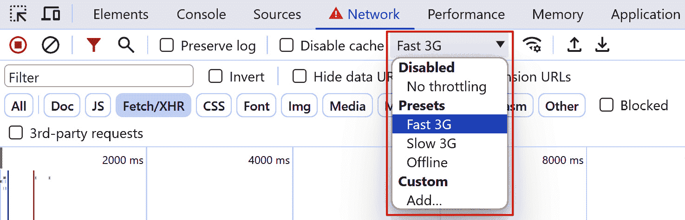

图 13.12 – 在 Chrome 开发者工具中模拟网络断开

1.  将网络更改为**离线**后，等待几秒钟（取决于超时配置），您应该会看到客户端自动重新连接到服务器，如下所示：

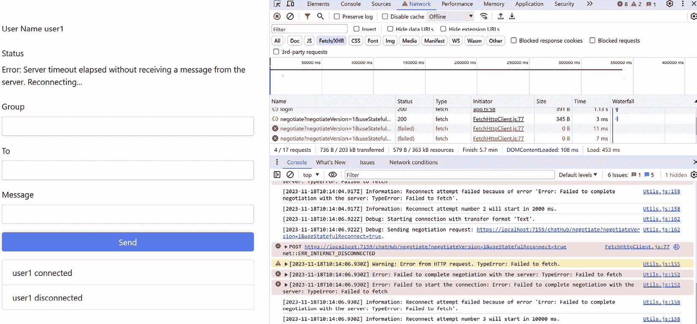

图 13.13 – 客户端自动重新连接到服务器

1.  将网络改回**在线**，您应该会看到客户端重新连接到服务器，如下所示：

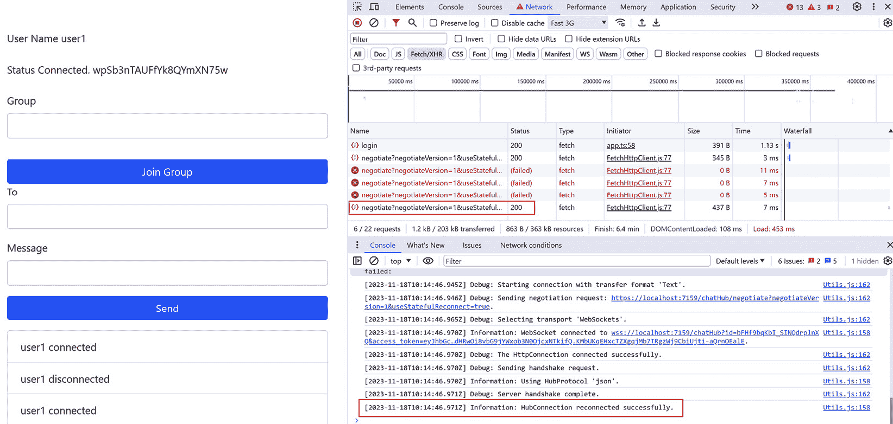

图 13.14 – 网络恢复在线后客户端重新连接到服务器

重要提示

如果客户端在尝试四次后仍然无法重新连接到服务器，将触发`onclose`事件。您可以添加`onclose`事件的处理器来处理连接关闭事件。例如，您可以通知用户连接已关闭，并要求用户刷新页面或手动重新连接到服务器。

ASP.NET Core 8.0 中的 SignalR 支持状态重连，允许服务器在客户端断开连接时临时存储消息。在重新连接后，客户端将使用相同的连接 ID，服务器将回放客户端断开连接期间发送的任何消息。这确保了客户端的状态得到保持，且不会丢失任何消息。

1.  要启用状态重连，我们需要为 SignalR 端点配置 `AllowStatefulReconnects` 选项，如下所示：

    ```cs
    app.MapHub<ChatHub>("/chatHub", options =>{    // Omitted for brevity    options.AllowStatefulReconnects = true;});
    ```

1.  默认情况下，状态重连的最大缓冲区大小为 100,000 字节。您可以根据以下方式更改缓冲区大小：

    ```cs
    builder.Services.AddSignalR(options =>{    // Omitted for brevity    options.StatefulReconnectBufferSize = 200000;});
    ```

1.  然后，我们可以配置 TypeScript 客户端以使用状态重连，如下所示：

    ```cs
    connection = new signalR.HubConnectionBuilder()  .withUrl("https://localhost:7159/chatHub", {    // Omitted for brevity  })  .withAutomaticReconnect()  .withStatefulReconnect({ bufferSize: 200000 })  .build();
    ```

1.  类似地，您可以这样配置 Blazor 客户端：

    ```cs
    _hubConnection = new HubConnectionBuilder()    .WithUrl("https://localhost:7159/chatHub", options =>    {        // Omitted for brevity    })    .WithAutomaticReconnect()    .WithStatefulReconnect()    .Build();
    ```

1.  要配置 Blazor 客户端的缓冲区大小，您可以配置 `HubConnectionOptions` 对象，如下所示：

    ```cs
    var builder = new HubConnectionBuilder()    .WithUrl("https://localhost:7159/chatHub", options =>    {        // Omitted for brevity    })    .WithAutomaticReconnect()    .WithStatefulReconnect();builder.Services.Configure<HubConnectionOptions>(options =>{    options.StatefulReconnectBufferSize = 200000;});_hubConnection = builder.Build();
    ```

除了自动重连功能外，如果连接断开，您还可以手动重新连接到 SignalR 服务器。您可以为 `onclose` 事件或 `Closed` 事件添加事件处理器来处理连接关闭事件。

## 扩展 SignalR

到目前为止，我们已经实现了一个聊天应用，允许用户向其他用户或组发送消息。我们还探讨了如何管理 SignalR 连接。您也可以使用类似的方法构建实时通知系统、实时仪表板等。然而，该应用只能在单个服务器上运行。如果我们想扩展应用，例如，使用负载均衡器将请求分发到多个服务器，服务器 *A* 就不知道服务器 *B* 上的连接。

SignalR 需要在客户端和服务器之间建立持久连接。这意味着来自同一客户端的请求必须路由到同一服务器。这被称为 *粘性会话* 或 *会话亲和性*。如果您有多个 SignalR 服务器，则需要此要求。除了此要求外，在扩展 SignalR 时还有一些其他考虑因素：

+   如果您在 Azure 上托管应用，可以使用 Azure SignalR 服务。Azure SignalR 服务是一个完全托管的服务，可以帮助您扩展 SignalR 应用而无需担心基础设施。使用 Azure SignalR 服务时，您无需使用粘性会话，因为所有客户端都连接到 Azure SignalR 服务。此服务承担管理连接和释放 SignalR 服务器资源的责任。有关更多信息，请参阅 [`learn.microsoft.com/en-us/azure/azure-signalr/signalr-overview`](https://learn.microsoft.com/en-us/azure/azure-signalr/signalr-overview)。

+   如果你将应用程序托管在自己的基础设施或其他云服务提供商上，你可以使用 Redis 背板来同步连接。Redis 背板是一个使用 pub/sub 功能将消息转发到其他 SignalR 服务器的 Redis 服务器。然而，这种方法在大多数情况下需要粘性会话，并且 SignalR 应用程序实例需要额外的资源来管理连接。还有一些其他的 SignalR 背板提供商，例如 SQL Server、NCache 等。

我们在这本书中不会涵盖如何扩展 SignalR 的细节。你可以在官方文档中找到更多信息。

# 摘要

SignalR 是一个强大的库，简化了构建实时网络应用程序的过程。在本章中，我们探讨了如何使用 SignalR 来构建聊天应用程序。我们介绍了 SignalR 的基本概念，如中心点、客户端和连接。我们使用 TypeScript 和 Blazor 创建了客户端，这展示了如何使用 TypeScript 和 .NET 来构建 SignalR 客户端。我们还讨论了如何向特定用户或组发送消息，以及如何使用 JWT 认证来保护 SignalR 连接。此外，我们还探讨了如何配置 SignalR 中心点和客户端，例如配置保持活动间隔、配置 HTTP 选项和配置自动重连功能。

虽然我们已经涵盖了众多功能，但仍有许多内容可以探索，例如流式传输。更多详细信息，请参阅官方文档：[`learn.microsoft.com/en-us/aspnet/core/signalr/introduction`](https://learn.microsoft.com/en-us/aspnet/core/signalr/introduction)。在下一章中，我们将探讨如何部署 ASP.NET Core 应用程序。
