# 第十四章：使用 Azure Pipelines 和 GitHub Actions 进行 ASP.NET Core 的 CI/CD

在前面的章节中，我们已经探讨了构建、测试和运行 ASP.NET Core 应用程序的基础知识。我们还讨论了如何使用 `dotnet run` 命令从数据库中访问数据以在本地运行我们的应用程序。现在，是我们继续我们的 ASP.NET Core 之旅并学习如何将我们的应用程序部署到云中的时候了。

在本章中，我们将探讨 **持续集成和持续交付/部署**（**CI/CD**）的概念。本章将重点介绍两个流行的 CI/CD 工具和平台：Azure Pipelines 和 GitHub Actions。

在本章中，我们将讨论以下主题：

+   CI/CD 简介

+   使用 Docker 容器化 ASP.NET Core 应用程序

+   使用 Azure Pipelines 进行 CI/CD

+   GitHub Actions

完成本章后，您将基本了解容器化概念，并能够使用这些工具中的任何一个构建和部署您的 ASP.NET Core 应用程序到云中。

# 技术要求

本章中的代码示例可以在 [`github.com/PacktPublishing/Web-API-Development-with-ASP.NET-Core-8/tree/main/samples/chapter14/`](https://github.com/PacktPublishing/Web-API-Development-with-ASP.NET-Core-8/tree/main/samples/chapter14/) 找到。

# CI/CD 简介

开发者每天都在编写代码——他们可能创建新功能、修复错误，或者重构现有代码。在团队环境中，多个开发者可能正在同一个代码库上工作。一个开发者可能正在创建新功能，而另一个开发者可能正在修复错误。代码库不断变化，确保不同开发者所做的代码更改不会相互冲突，并且不会破坏任何现有功能，这一点非常重要。为了避免此类问题，开发者应频繁地集成他们的代码更改。

此外，当应用程序准备部署时，考虑它可能部署到的不同环境（如开发、测试或生产）也很重要。不同的环境可能有不同的配置，部署过程也可能因环境而异。为了确保应用程序被正确且一致地部署，自动化部署过程是理想的。这就是 CI/CD 发挥作用的地方。

缩写 *CI/CD* 的含义可能因上下文而异。**CI** 是一种开发实践，允许开发者定期集成代码更改。**CD** 可以指 **持续交付** 或 **持续部署**，这两个术语通常可以互换使用。在大多数情况下，*CD* 指的是频繁且自动地将应用程序构建、测试和部署到生产环境（以及可能的其他环境），因此没有必要对这些术语的确切定义进行争论。

CI/CD 流水线是**DevOps**的关键组件，DevOps 是**开发**和**运维**两个词的组合。DevOps 在过去几年中不断发展，通常被定义为一系列实践、工具和流程，这些流程能够使最终用户持续获得价值。虽然 DevOps 是一个广泛的话题，但本章将专注于 CI/CD 流水线。

典型的 CI/CD 流程如下所示：

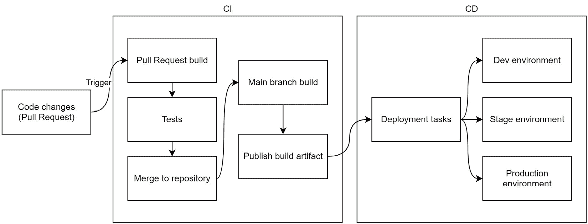

图 14.1 – 典型的 CI/CD 流程

图 14.1 中的步骤描述如下：

1.  开发者创建新的功能或修复代码库中的错误，然后将更改提交到共享代码仓库。如果团队使用 Git 作为其**版本控制系统**（**VCS**），开发者将创建一个拉取请求来提交更改。

1.  拉取请求将启动 CI 流水线，该流水线将构建应用程序并执行测试。如果构建或测试失败，开发者将收到通知，使他们能够及时解决问题。

1.  如果构建和测试成功，并且拉取请求得到团队的批准，代码更改将被合并到`main`分支。这确保了代码是最新的，并且与团队的标准保持一致。

1.  合并操作将触发 CI 流水线构建应用程序并将工件（例如，二进制文件、配置文件、Docker 镜像等）发布到工件存储库。

1.  CD 流水线可以手动或自动触发。然后 CD 流水线将应用程序部署到目标环境（例如，开发、测试或生产环境）。

CI/CD 流程可能比图 14.1 中显示的更复杂。例如，CI 流水线可能需要静态代码分析、代码测试覆盖率和其他质量检查。CD 流水线可能需要为不同的环境应用不同的配置或采用不同的部署策略，例如蓝绿部署或金丝雀部署。随着 CI/CD 流水线复杂性的增加，DevOps 工程师的需求也在增加，因为他们拥有使用各种工具和平台实施这些流水线的技能。

在我们深入探讨 CI/CD 的细节之前，让我们首先介绍一些在 CI/CD 中常用的概念和术语。

## CI/CD 概念和术语

理解 CI/CD 中常用的一些关键概念和术语至关重要。以下是一些 CI/CD 中最常用的术语：

+   **流水线**：流水线是一种用于构建、测试和部署应用程序的自动化过程。它们可以手动或自动触发，甚至可以设置由其他流水线触发。这有助于简化开发过程，确保应用程序能够快速高效地构建、测试和部署。

+   **构建**：构建是一个涉及编译源代码并创建必要的二进制文件或 Docker 镜像的过程。这确保了代码已准备好部署。

+   **测试**：管道可能包括自动化测试，如单元测试、集成测试、性能测试或**端到端**（**E2E**）测试。这些测试可以集成到管道中，以确保代码更改不会破坏任何现有功能。这有助于确保软件的稳定性和可靠性。

+   **工件**：工件是一个文件或文件集合——通常是构建过程的输出。工件示例包括二进制文件、Docker 镜像或包含二进制文件的 ZIP 文件。然后，这些工件可以用作部署过程的输入。

+   **容器化**：容器化是一种将应用程序及其依赖项打包到容器镜像中的方法，可以在一致的环境中部署和运行，不受主机操作系统的限制。最流行的容器化工具之一是 Docker。容器化提供了许多好处，如提高可伸缩性、便携性和资源利用率。

+   **版本控制系统**（VCS）：VCS 是软件开发的重要工具，允许开发者跟踪和管理源代码的更改。Git 是最广泛使用的 VCS 之一，为开发者提供了一种有效管理其代码库的方法。

+   **部署**：部署是将应用程序部署到目标环境的过程。它涉及配置应用程序以满足环境的要求，并确保其安全且可供使用。

+   `main`分支可以触发 CI 管道构建和发布工件。成功的 CI 管道可以触发 CD 管道将应用程序部署到非生产环境。然而，为了安全起见，CD 管道可能需要手动触发以将应用程序部署到生产环境。

理解与 CI/CD 相关的根本概念和术语对于成功实施至关重要。由于可以用于实现 CI/CD 管道的工具有很多，我们将在以下章节中详细讨论。

## 理解 CI/CD 的重要性

CI/CD 在 DevOps 中扮演着重要角色。它帮助团队快速响应变化，并频繁、安全、可靠地向最终用户提供价值。由于 CI/CD 管道是自动化的，它们可以简化软件交付的过程，并减少将应用程序部署到生产环境所需的时间和精力。此外，CI/CD 有助于维护一个稳定可靠的代码库。

为了成功实施 CI/CD 流水线，团队必须遵守某些实践。应进行自动测试以确保代码更改不会破坏任何现有功能。此外，应建立明确的部署策略，例如在将应用程序部署到生产环境之前，在开发环境中进行应用程序的预部署。通过遵循这些实践，团队可以缩短**上市时间**（**TTM**），更快更频繁地将应用程序交付给最终用户。

CI/CD 实践以以下方式帮助开发团队：

+   **更快地获得反馈**：当代码更改提交到共享代码仓库时，CI/CD 流水线可以自动触发。这为开发者提供了关于代码更改的更快反馈，使他们能够在开发过程的早期阶段解决任何问题。

+   **减少手动努力和风险**：CI/CD 流水线自动化了部署过程，减少了手动努力和风险。这减少了生产部署所需的时间和精力，消除了手动和容易出错的流程。

+   **一致性**：自动构建和部署确保了不同环境之间的一致性。这减少了由于配置问题或“在我的机器上运行正常”问题导致的部署失败的风险。

+   **提高质量**：可以将自动测试集成到 CI/CD 流水线中，这有助于确保代码库保持稳定和可靠。CI/CD 流水线还可以运行其他质量检查，如静态代码分析和代码测试覆盖率，从而提高代码质量。

+   **快速交付和敏捷性**：CI/CD 流水线使团队能够更快更频繁地向最终用户发布新功能和错误修复。这使企业能够快速响应客户需求和市场需求。

考虑到这些好处，很明显，CI/CD 对于任何开发团队来说都是必不可少的。没有人愿意回到手动构建和部署的时代，因为那既耗时又容易出错。

我们现在已经学习了 CI/CD 的某些概念以及为什么它很重要。在下一节中，我们将讨论如何使用 Docker 容器化 ASP.NET Core 应用程序。

# 使用 Docker 容器化 ASP.NET Core 应用程序

多年前，当我们向生产环境部署应用程序时，我们需要确保目标环境已安装正确的 .NET Framework 版本。开发者们在与生产环境可能不同的配置中挣扎，包括软件版本、操作系统和硬件。这通常会导致由于配置问题而导致的部署失败。

.NET Core 的引入，这是一个跨平台和开源框架，使我们能够在任何平台上部署我们的应用程序，包括 Windows、Linux 和 macOS。然而，为了成功部署，我们仍然需要确保目标环境已安装正确的运行时。这就是容器化发挥作用的地方。

## 容器化是什么？

容器是轻量级、隔离和可移植的环境，包含运行应用程序所需的所有依赖项。与**虚拟机**（**VMs**）不同，它们不需要单独的客户端操作系统，因为它们共享宿主操作系统的内核。这使得它们比 VM 更轻量级和可移植，因为它们可以在支持容器运行时的任何平台上运行。容器还提供隔离，确保应用程序不受环境变化的影响。

容器化是一个强大的工具，使我们能够将应用程序及其依赖项打包到单个容器镜像中。**Docker**是最受欢迎的容器化解决方案之一，为开发目的提供对 Windows、Linux 和 macOS 的支持，以及许多 Linux 变体，如 Ubuntu、Debian 和 CentOS，用于生产环境。此外，Docker 与云平台兼容，包括 Azure、**亚马逊网络服务**（**AWS**）和**谷歌云平台**（**GCP**）。如果我们使用 Docker 作为容器运行时，那么这些容器镜像就被称为**Docker 镜像**。

Docker 镜像是一种方便的方式来打包应用程序及其依赖项。它们包含运行应用程序所需的所有组件，例如应用程序代码（二进制文件）、运行时或 SDK、系统工具和配置。Docker 镜像是不可变的，这意味着一旦创建就无法更改。为了存储这些镜像，它们被放置在注册表中，例如 Docker Hub、**Azure 容器注册表**（**ACR**）或 AWS **弹性容器注册表**（**ECR**）。Docker Hub 是一个公共注册表，提供许多预构建的镜像。或者，可以创建一个私有注册表来存储自定义 Docker 镜像。

一旦创建了一个 Docker 镜像，就可以用它来创建 Docker 容器。Docker 容器是 Docker 镜像的隔离、内存实例，具有自己的文件系统、网络和内存。这使得创建容器比启动虚拟机（VM）要快得多，同时也允许快速销毁和从同一镜像重建容器。此外，可以从同一镜像创建多个容器，这对于扩展应用程序非常有用。如果任何容器失败，可以在几秒钟内将其销毁并从同一镜像重建，这使得容器化成为一个强大的工具。

Docker 镜像中的文件是可堆叠的。*图 14.2*展示了包含 ASP.NET Core 应用程序及其依赖项的容器文件系统示例：

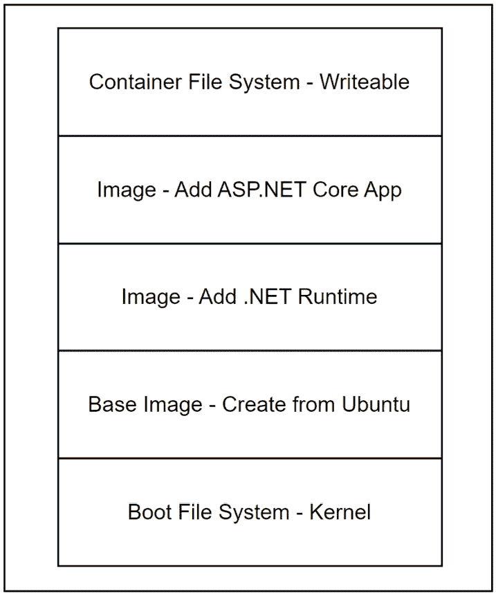

图 14.2 – Docker 容器文件系统

*图 14.2* 展示了 Docker 容器的层。在内核层之上是基础镜像层，它是由 Ubuntu 创建的空容器镜像。在基础镜像层之上是 ASP.NET Core 运行时层，然后是 ASP.NET Core 应用层。当创建容器时，Docker 在其他层之上添加一个可写层。这个可写层可以用来存储临时文件，例如日志。然而，正如我们之前提到的，Docker 镜像是不可变的，因此对可写层的任何更改在容器销毁时都会丢失。这就是为什么我们不应该在容器中存储任何持久数据。相反，我们应该将数据存储在卷中，卷是主机机器上的一个目录，该目录被挂载到容器中。

这是一个对 Docker 镜像和容器的非常简化的解释。接下来，让我们安装 Docker 并为我们的 ASP.NET Core 应用程序创建一个 Docker 镜像。

## 安装 Docker

您可以从以下链接下载 Docker Desktop：

+   Windows: [`docs.docker.com/desktop/install/windows-install/`](https://docs.docker.com/desktop/install/windows-install/ )

+   Mac: [`docs.docker.com/desktop/install/mac-install/`](https://docs.docker.com/desktop/install/mac-install/ )

+   Linux: [`docs.docker.com/desktop/install/linux-install/`](https://docs.docker.com/desktop/install/linux-install/ )

请遵循官方文档在您的机器上安装 Docker。

如果您使用 Windows，请使用 **Windows Subsystem for Linux 2** （**WSL 2**） 后端而不是 Hyper-V。WSL 2 是一个兼容层，允许 Linux 二进制可执行文件在 Windows 上原生运行。使用 WSL 2 作为 Windows 上 Docker Desktop 的后端比 Hyper-V 后端提供更好的性能。

要在 Windows 上安装 WSL 2，请遵循此链接的说明：[`learn.microsoft.com/en-us/windows/wsl/install`](https://learn.microsoft.com/en-us/windows/wsl/install)。默认情况下，WSL 2 使用 Ubuntu 发行版。您还可以安装其他 Linux 发行版，如 Debian、CentOS 或 Fedora。

安装 WSL 2 后，您可以在 PowerShell 中运行以下命令来检查 WSL 的版本：

```cs
wsl -l -v
```

如果您看到 `VERSION` 字段显示 `2`，这意味着 WSL 2 已正确安装。然后，您可以安装 Docker Desktop 并选择 WSL 2 作为后端。如果您安装了多个 Linux 发行版，您可以选择与 Docker Desktop 一起使用的默认发行版。转到 **设置** | **资源** | **WSL 集成**，并选择您想要与 Docker Desktop 一起使用的发行版，如图 *图 14.3* 所示：

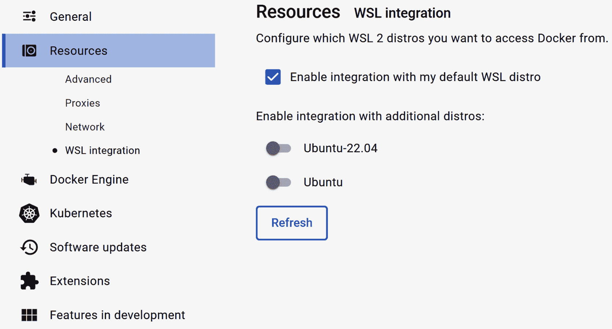

图 14.3 – 选择与 Docker Desktop 一起使用的默认 Linux 发行版

这是 `wsl -l -v` 命令的示例输出，它显示了安装在此机器上的两个 Linux 发行版；默认发行版是 `Ubuntu-22.04`：

```cs
  NAME                   STATE           VERSION* Ubuntu-22.04           Running         2
  Ubuntu                 Stopped         2
  docker-desktop-data    Running         2
  docker-desktop         Running         2
```

Docker Desktop 安装了两个内部 Linux 发行版：

+   `docker-desktop`：用于运行 Docker 引擎

+   `docker-desktop-data`：用于存储容器和镜像

注意，Docker 可能会在您的机器上消耗大量资源。如果您觉得 Docker 使您的机器变慢或消耗了太多资源，您可以按照以下链接中的说明配置分配给 WSL 2 的资源：[`learn.microsoft.com/en-us/windows/wsl/wsl-config#configure-global-options-with-wslconfig`](https://learn.microsoft.com/en-us/windows/wsl/wsl-config#configure-global-options-with-wslconfig)。

在安装 Docker Desktop 之后，我们现在可以为我们的 ASP.NET Core 应用程序创建 Docker 镜像。在下一节中，我们将讨论一些在 Docker 中常用的命令。

## 理解 Dockerfile

为了演示如何构建和运行 Docker 镜像，我们需要一个示例 ASP.NET Core 应用程序。您可以使用以下命令创建一个新的 ASP.NET Core Web API 项目：

```cs
dotnet new webapi -o BasicWebApiDemo -controllers
```

或者，您可以从书籍 GitHub 仓库中的`/samples/chapter14/MyBasicWebApiDemo`文件夹克隆示例代码。

Docker 镜像可以使用 Dockerfile 构建，这是一个包含用于构建镜像的指令列表的文本文件。您可以在 ASP.NET Core 项目的根目录中手动创建 Dockerfile，或者使用 VS 2022 为您创建它。要使用 VS 2022 创建 Dockerfile，请在解决方案资源管理器中右键单击项目，然后选择**添加** | **Docker 支持**。您将看到以下对话框：

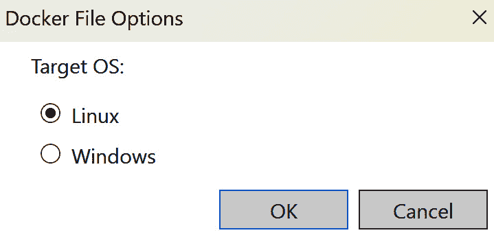

图 14.4 – 在 VS 2022 中为 ASP.NET Core 项目添加 Docker 支持

这里有两个选项：**Linux**和**Windows**。建议用于开发目的使用 Linux，因为 Linux 镜像比 Windows 镜像小。Docker 最初是为 Linux 设计的，因此在 Linux 上的成熟度高于 Windows。许多云平台，如 Azure、AWS 和 GCP，支持 Linux 容器。但是，并非所有 Windows 服务器都支持 Windows 容器。除非您有强烈的理由在 Windows 服务器上托管您的应用程序，否则您应该在这里选择**Linux**。

一旦您选择了没有任何文件扩展名的`Dockerfile`。这允许我们使用`docker build`命令构建 Docker 镜像，而无需指定 Dockerfile 的名称。VS 2022 默认创建的 Dockerfile 将类似于以下内容：

```cs
#See https://aka.ms/customizecontainer to learn how to customize your debug container and how Visual Studio uses this Dockerfile to build your images for faster debugging.FROM mcr.microsoft.com/dotnet/aspnet:8.0 AS base
USER app
WORKDIR /app
EXPOSE 8080
EXPOSE 8081
FROM mcr.microsoft.com/dotnet/sdk:8.0 AS build
ARG BUILD_CONFIGURATION=Release
WORKDIR /src
COPY ["BasicWebApiDemo.csproj", "."]
RUN dotnet restore "./BasicWebApiDemo.csproj"
COPY . .
WORKDIR "/src/."
RUN dotnet build "BasicWebApiDemo.csproj" -c $BUILD_CONFIGURATION -o /app/build
FROM build AS publish
RUN dotnet publish "BasicWebApiDemo.csproj" -c $BUILD_CONFIGURATION -o /app/publish /p:UseAppHost=false
FROM base AS final
WORKDIR /app
COPY --from=publish /app/publish .
ENTRYPOINT ["dotnet", "BasicWebApiDemo.dll"]
```

让我们逐行分析 Dockerfile：

```cs
FROM mcr.microsoft.com/dotnet/aspnet:8.0 AS base
```

`FROM`指令指定要使用的基镜像。`FROM`指令必须是 Dockerfile 中的第一个指令。在这种情况下，我们使用的是`mcr.microsoft.com/dotnet/aspnet:8.0`镜像，这是 ASP.NET Core 运行时镜像。此镜像由 Microsoft 提供。`mcr.microsoft.com`是`AS base`的域名，我们正在给这个镜像起一个名字，即`base`。这个名称可以在 Dockerfile 的后续部分用来引用这个镜像。

```cs
USER app
```

接下来，`USER` 指令指定了用户名或由基本镜像创建的 `app` 用户。此用户不是超级用户，因此比 root 用户更安全。

```cs
WORKDIR /app
```

`WORKDIR` 指令为这些指令设置容器内部的工作目录：`RUN`、`CMD`、`COPY`、`ADD`、`ENTRYPOINT` 等。此指令类似于终端中的 `cd` 命令。它支持绝对路径和相对路径。如果目录不存在，它将被创建。在这个例子中，工作目录被设置为 `/app`。

```cs
EXPOSE 8080EXPOSE 8081
```

`EXPOSE` 指令在容器运行时将指定的端口（端口）暴露给容器。请注意，此指令实际上并不会将端口发布到主机机器。它只是意味着容器将监听指定的端口（端口）。默认情况下，`EXPOSE` 指令暴露 TCP 协议上的端口。在这种情况下，容器将监听端口 `8080` 和 `8081`。

```cs
FROM mcr.microsoft.com/dotnet/sdk:8.0 AS buildARG BUILD_CONFIGURATION=Release
WORKDIR /src
```

在前面的行中，我们使用了一个不同的镜像，即 `mcr.microsoft.com/dotnet/sdk:8.0` 镜像，并将其命名为 `build`。此镜像包含 .NET SDK，用于构建应用程序。`ARG` 指令定义了一个可以在 Dockerfile 中稍后使用的变量。在这种情况下，我们定义了一个名为 `BUILD_CONFIGURATION` 的变量，并将其默认值设置为 `Release`。`WORKDIR` 指令将工作目录设置为 `/src`。

```cs
COPY ["BasicWebApiDemo.csproj", "."]RUN dotnet restore "./BasicWebApiDemo.csproj"
```

`COPY` 指令将文件或目录从源（本地机器上的）复制到目标（容器的文件系统）。在这种情况下，我们正在将 `.csproj` 文件复制到当前目录。`RUN` 指令在当前镜像上执行指定的命令，创建一个新的层，然后提交结果。新层将被用于 Dockerfile 中的下一步。在这种情况下，我们正在运行 `dotnet restore` 命令来还原 NuGet 包。

```cs
COPY . .WORKDIR "/src/."
RUN dotnet build "BasicWebApiDemo.csproj" -c $BUILD_CONFIGURATION -o /app/build
```

在前面的行中，我们正在将本地机器上的所有文件复制到容器当前目录。然后，我们将工作目录设置为 `/src`。最后，我们运行 `dotnet build` 命令来构建应用程序。请注意，我们正在使用 Dockerfile 中之前定义的 `BUILD_CONFIGURATION` 变量。

```cs
FROM build AS publishRUN dotnet publish "BasicWebApiDemo.csproj" -c $BUILD_CONFIGURATION -o /app/publish /p:UseAppHost=false
```

再次，`FROM` 指令使用我们之前定义的 `build` 镜像，并将其命名为 `publish`。然后，`RUN` 指令运行 `dotnet publish` 命令来发布应用程序。再次使用 `$BUILD_CONFIGURATION` 变量。发布的应用程序将被放置在 `/app/publish` 目录中。

```cs
FROM base AS finalWORKDIR /app
COPY --from=publish /app/publish .
ENTRYPOINT ["dotnet", "BasicWebApiDemo.dll"]
```

接下来，我们将`base`镜像重命名为`final`，并将工作目录设置为`/app`。要运行应用程序，我们只需要运行时，因此不需要 SDK 镜像。然后，`COPY`指令将发布的应用程序从`publish`镜像的`app/publish`目录复制到当前目录。最后，`ENTRYPOINT`指令指定了容器启动时要运行的命令。在这种情况下，我们运行`dotnet BasicWebApiDemo.dll`命令来启动 ASP.NET Core 应用程序。

您可以在 Docker 官方提供的文档中找到有关 Dockerfile 指令的更多信息：[`docs.docker.com/engine/reference/builder/`](https://docs.docker.com/engine/reference/builder/)。接下来，让我们继续构建 Docker 镜像。

## 构建 Docker 镜像

Docker 提供了一套可用于构建、运行和管理 Docker 镜像和容器的命令。要构建一个 Docker 镜像，请转到我们之前创建的 ASP.NET Core 项目的根目录，然后运行以下命令：

```cs
docker build -t basicwebapidemo .
```

`-t`选项用于给镜像添加一个名称。末尾的`.`表示当前目录。Docker 期望在当前目录中找到一个名为`Dockerfile`的文件。如果您已重命名 Dockerfile 或 Dockerfile 不在当前目录中，可以使用`-f`选项指定 Dockerfile 的名称，例如`docker build -t basicwebapidemo -f` `MyBasicWebApiDemo/MyDockerfile MyBasicWebApiDemo`。

输出结果显示，Docker 正在逐层构建镜像。Dockerfile 中的每条指令都会在镜像中创建一个层，并在上一层的上方添加更多内容。这些层被缓存，所以如果某个层没有改变，它将不会在下一个构建过程中被重建。但是，如果某个层发生了变化（例如，如果我们更新了源代码），那么复制源代码的那个层将被重建，并且所有随后的层都将受到影响，需要被重建。

现在，让我们回顾一下由 VS 2022 生成的默认 Dockerfile。为什么它会在运行`dotnet restore`命令后复制所有文件？这是因为如果我们只更新了源代码，但 NuGet 包没有改变，那么由于层被缓存，`dotnet restore`命令将不会再次执行。这可以提高构建性能。然而，如果我们更新了 NuGet 包，这意味着`.csproj`文件已更改，那么`dotnet restore`命令将再次执行。

这里有一些编写 Dockerfile 的技巧：

+   考虑层的顺序。不太可能改变的层应该放在更可能改变的层之前。

+   尽可能保持层的大小小。不要复制不必要的文件。您可以通过配置 `.dockerignore` 文件来排除构建上下文中的文件或目录。如果您使用 VS 2022 创建 Dockerfile，它将为您生成一个 `.dockerignore` 文件。或者，您可以手动创建一个名为 `.dockerignore` 的文本文件，然后编辑它。以下是一个示例 `.dockerignore` 文件：

    ```cs
    # Exclude build results, Npm cache folder, and some other files**/bin/**/obj/**/.git**/.vs**/.vscode**/global.json**/Dockerfile**/.dockerignore**/node_modules
    ```

    要了解更多关于 `.dockerignore` 文件的信息，请参阅以下官方文档：[`docs.docker.com/engine/reference/builder/#dockerignore-file`](https://docs.docker.com/engine/reference/builder/#dockerignore-file).

+   尽可能保持层数最少。例如，为了托管 ASP.NET Core 应用程序，我们可以通过使用 `mcr.microsoft.com/dotnet/aspnet` 镜像来减少层数。这个镜像已经包含了 ASP.NET Core 运行时，消除了在容器中安装 SDK 的需要。您还可以将命令组合成一个单独的 `RUN` 指令。

+   使用多阶段构建。多阶段构建允许我们在 Dockerfile 中使用多个 `FROM` 指令。每个 `FROM` 指令都可以用来创建一个新的镜像。最终的镜像将只包含最后一个 `FROM` 指令的层。这可以减小最终镜像的大小。例如，我们可以使用 `mcr.microsoft.com/dotnet/sdk` 镜像来构建应用程序，然后使用 `mcr.microsoft.com/dotnet/aspnet` 镜像来运行应用程序。这样，最终的镜像将只包含 ASP.NET Core 运行时，而不会包含 SDK，因为 SDK 对运行应用程序不是必需的。要了解更多关于多阶段构建的信息，请参阅以下官方文档：[`docs.docker.com/develop/develop-images/multistage-build/`](https://docs.docker.com/develop/develop-images/multistage-build/).

    要了解更多关于优化 Docker 构建的信息，请参阅以下官方文档：[`docs.docker.com/build/cache/`](https://docs.docker.com/build/cache/).

我们可以使用以下命令列出我们机器上的所有 Docker 镜像：

```cs
docker images
```

输出应该类似于以下内容：

```cs
REPOSITORY      TAG     IMAGE ID       CREATED              SIZEbasicwebapidemo latest  b0d8d94d219c   About a minute ago   222MB
```

`basicwebapidemo` 镜像是我们刚刚构建的。每个镜像都有一个 `TAG` 值和一个 `IMAGE ID` 值。`TAG` 值是镜像的一个可读名称。默认情况下，标签是 `latest`。我们可以在构建镜像时指定不同的标签。例如，我们可以使用以下命令使用 `v1` 标签构建镜像：

```cs
docker build -t basicwebapidemo:v1 .
```

在前面的命令中，`-t` 选项用于给镜像添加一个名称，该名称与标签之间用冒号分隔。

要删除一个镜像，使用 `docker rmi <container name or ID>` 命令，后跟镜像名称或镜像 ID：

```cs
docker rmi basicwebapidemo
```

注意，如果镜像被容器使用，您需要先停止容器，然后再删除镜像。

现在我们已经有了我们的 ASP.NET Core 应用程序的 Docker 镜像。所有必要的依赖都包含在镜像中。接下来，让我们运行这个 Docker 镜像。

## 运行 Docker 容器

要在容器中运行 Docker 镜像，我们可以使用 `docker run` 命令。以下命令将运行我们刚刚构建的 `basicwebapidemo` 镜像：

```cs
docker run -d -p 80:8080 --name basicwebapidemo basicwebapidemo
```

让我们更仔细地看看这个：

+   `-d` 选项用于以分离模式运行容器，这意味着容器将在后台运行。您可以省略此选项，然后容器将在前台运行，这意味着如果您退出终端，容器将停止。

+   `-p` 选项用于将容器的端口（端口）发布到主机。在这种情况下，我们将容器的端口 8080 发布到主机的端口 80。

+   `--name` 选项用于指定容器的名称。最后一个参数是要运行的镜像的名称。

+   您还可以使用 `-it` 选项以交互式模式运行容器。此选项允许您在容器中运行命令。

当我们编写 Dockerfile 时，我们解释了 `EXPOSE` 指令仅将端口 8080 和 8081 暴露给容器。要将内部容器端口发布到主机，我们需要使用 `-p` 选项。第一个端口号是主机机的端口，第二个端口号是内部容器端口。在这个例子中，我们将容器端口 8080 暴露给主机端口 80。这可能会让一些人感到困惑。所以，请仔细检查端口号。此外，有时主机机的端口号可能已被另一个进程占用。在这种情况下，您需要使用不同的端口号。

输出应返回容器 ID，它是容器的 UID，例如这样：

```cs
5529b0278e5a14452a7049a7c9922797b0c1171423970f99b4481c93cfdc6a38
```

使用 `docker ps` 命令列出所有正在运行的容器：

```cs
docker ps
```

输出应类似于这样：

```cs
CONTAINER ID   IMAGE             COMMAND                  CREATED         STATUS         PORTS                                 NAMES403eb4952287   basicwebapidemo   "dotnet BasicWebApiD…"   5 minutes ago   Up 5 minutes   8081/tcp, 0.0.0.0:80->8080/tcp   basicwebapidemo
```

在输出中，我们可以看到容器的端口 8080 已被映射到主机的端口 80。

要列出所有状态的容器，只需添加 `-a` 选项：

```cs
docker ps -a
```

您可以检查容器的状态。如果容器正在运行，状态应该是 `Up`。

我们可以使用以下命令来管理容器：

+   要暂停一个容器：`docker pause <容器名称` `或 ID>`

+   要重启一个容器：`docker restart <容器名称` `或 ID>`

+   要停止一个容器：`docker stop <容器名称` `或 ID>`

+   要删除容器：`docker rm <容器名称` `或 ID>`

如果容器正在运行，您可以通过向此 URL 发送请求来测试端点：`http://localhost/weatherforecast`。您将看到 ASP.NET Core 应用程序的响应。如果您更改主机机的端口号，您需要在 URL 中使用正确的端口号。例如，如果您使用 `-p 5000:8080`，那么您需要使用 [`localhost:5000/weatherforecast`](http://localhost:5000/weatherforecast) 来访问端点。

我们可以使用 `docker logs <容器名称或 ID>` 命令来显示容器的日志：

```cs
docker logs basicwebapidemo
```

您将看到如下日志：

```cs
info: Microsoft.Hosting.Lifetime[14]      Now listening on: http://[::]:8080
info: Microsoft.Hosting.Lifetime[0]
      Application started. Press Ctrl+C to shut down.
info: Microsoft.Hosting.Lifetime[0]
      Hosting environment: Production
info: Microsoft.Hosting.Lifetime[0]
      Content root path: /app
```

要检查容器的状态，您可以使用 `docker stats <容器名称或` `ID>` 命令：

```cs
docker stats basicwebapidemo
```

您将看到容器的状态如下：

```cs
CONTAINER ID   NAME              CPU %     MEM USAGE / LIMIT     MEM %     NET I/O           BLOCK I/O   PIDS403eb4952287   basicwebapidemo   0.01%     24.24MiB / 15.49GiB   0.15%     23.8kB / 2.95kB   0B / 0B     25
```

你可以通过向`/weatherforecast`端点发送请求来获取 ASP.NET Core 应用程序的响应。请注意，容器正在生产环境中运行，因此 Swagger UI 不可用。这是因为我们在`Program.cs`文件中只启用了开发环境中的 Swagger UI。要启用 Swagger UI，我们可以停止并删除当前容器，然后在开发环境中创建一个新的容器。或者，你也可以创建一个具有不同名称的新容器。例如，你可以通过运行以下命令来停止容器：

```cs
docker stop basicwebapidemo
```

然后通过运行以下命令来移除容器：

```cs
docker rm basicwebapidemo
```

接下来，将环境变量添加到`docker run`命令中，以设置环境为开发模式：

```cs
docker run -d -p 80:8080 --name basicwebapidemo -e ASPNETCORE_ENVIRONMENT=Development basicwebapidemo
```

现在，你可以通过在浏览器中导航到`/swagger`端点来查看 Swagger UI。

到目前为止，我们已经学会了如何构建和运行 Docker 镜像。Docker 有许多其他命令可以用来管理 Docker 镜像和容器。为了总结，以下是 Docker 官方文档中一些最常用的 Docker 命令：

+   `docker build`：构建 Docker 镜像

+   `docker run`：运行 Docker 镜像

+   `docker images`：列出所有镜像

+   `docker ps`：列出所有正在运行的容器

+   `docker ps -a`：列出所有状态的容器

+   `docker logs`：显示容器的日志

+   `docker stats`：显示容器的统计信息

+   `docker pause`：暂停容器

+   `docker restart`：重启容器

+   `docker stop`：停止容器

+   `docker rm`：删除容器

+   `docker rmi`：删除镜像

+   `docker exec`：在运行的容器中运行命令

+   `docker inspect`：显示一个或多个容器或镜像的详细信息

+   `docker login`：登录到 Docker 注册库

+   `docker logout`：从 Docker 注册库注销

+   `docker pull`：从注册库拉取镜像

+   `docker push`：将镜像推送到注册库

+   `docker tag`：创建一个指向`SOURCE_IMAGE`的`TARGET_IMAGE`标签

+   `docker volume`：管理卷

+   `docker network`：管理网络

+   `docker system`：管理 Docker

+   `docker version`：显示 Docker 版本信息

+   `docker info`：显示 Docker 系统级别的信息

+   `docker port`：列出端口映射或容器的特定映射

你可以在这里找到更多关于 Docker 命令的信息：[`docs.docker.com/engine/reference/commandline/cli/`](https://docs.docker.com/engine/reference/commandline/cli/).

我们现在已经学会了如何为我们的 ASP.NET Core 应用程序构建 Docker 镜像并在容器中运行它。尽管容器在我们的本地机器上运行，但与在生产环境中运行并没有太大区别。容器与主机机器隔离。容器的便携性使得将应用程序部署到任何环境变得容易。

我们也可以使用 Docker 命令将镜像推送到注册库，例如 Docker Hub、ACR 等。然而，手动部署容易出错且耗时。这就是为什么我们需要 CI/CD 管道来自动化部署过程。

在下一节中，我们将讨论如何使用 Azure DevOps 和 Azure Pipelines 将容器化应用程序部署到云中。

# 使用 Azure DevOps 和 Azure Pipelines 进行 CI/CD

Azure DevOps 是一个基于云的服务，提供了一套用于管理软件开发流程的工具。它包括以下服务：

+   **Azure 板**：一个用于管理工作项的服务，例如用户故事、任务和错误。

+   **Azure 代码仓库**：一个用于托管代码仓库的服务。它支持 Git 和 **团队基础版本控制**（**TFVC**）。仓库可以是公开的或私有的。

+   **Azure 管道**：一个用于使用任何语言、平台和云构建、测试和部署应用程序的服务。

+   **Azure 测试计划**：一个用于手动和探索性测试工具的服务。

+   `Maven`、`npm`、`NuGet` 和 `Python` 包。

Azure DevOps 对开源项目和小型团队是免费的。在这本书中，我们不会涵盖 Azure DevOps 的所有功能。让我们专注于 Azure Pipelines。在本节中，我们将讨论如何使用 Azure Pipelines 构建和部署我们的 ASP.NET Core 应用程序到 Azure App Service。

在我们将应用程序部署到 Azure 之前，我们需要以下资源：

+   **Azure DevOps 账户**：[`azure.microsoft.com/en-us/products/devops`](https://azure.microsoft.com/en-us/products/devops)。

+   **Azure 订阅**：[`azure.microsoft.com/en-us/free/`](https://azure.microsoft.com/en-us/free/)。您可以在这里注册一个免费账户。您将获得一些免费积分来使用 Azure 服务。

+   **GitHub 仓库**：您需要一个 GitHub 仓库来托管源代码。当代码更改提交到仓库时，将触发管道。

## 准备源代码

GitHub 是最受欢迎的源代码控制解决方案之一。对于公开仓库，它是免费的。我们假设您已经有了 GitHub 账户。

从 [/chapter14/MyBasicWebApiDemo](https://h/chapter14/MyBasicWebApiDemo) 下载示例代码。这是一个简单的 ASP.NET Core Web API 应用程序，包括其单元测试和集成测试。在 GitHub 上创建一个新的仓库，然后将源代码推送到该仓库。仓库的目录结构应如下所示：

```cs
MyAzurePipelinesDemo    ├── src
    │   └──MyBasicWebApiDemo
    ├── tests
    │   ├──MyBasicWebApiDemo.UnitTests
    │   └──MyBasicWebApiDemo.IntegrationTests
    ├── MyBasicWebApiDemo.sln
    ├── README.md
    ├── LICENSE
    └── .gitignore
```

在上述目录结构中，主要的 ASP.NET Core Web API 项目位于 `src` 文件夹中，单元测试和集成测试位于 `tests` 文件夹中。这可以更好地组织解决方案结构。但这只是个人偏好。您也可以将单元测试和集成测试放在与主要项目相同的文件夹中。如果您使用不同的目录结构，请在以下章节中相应地更新管道中的路径。

我们将使用此仓库进行管道。接下来，让我们创建所需的 Azure 资源。

## 创建 Azure 资源

在当今的技术格局中，云计算已成为现代软件开发的核心。云计算提供了许多好处，例如可扩展性、**高可用性**（**HA**）和成本效益。在各种云服务提供商中，如 AWS、GCP 和阿里云，Microsoft Azure 作为一种强大且灵活的平台脱颖而出，用于托管和编排您的应用程序。Azure 为托管应用程序提供了许多服务，例如 Azure App Service、**Azure Kubernetes Service**（**AKS**）、**Azure Container Instances**（**ACI**）、Azure VM 和 Azure Functions。在这本书中，我们将使用 Azure 作为云平台来托管我们的应用程序。对于其他云平台，概念是相似的。

我们将需要以下 Azure 资源：

+   **Azure Container Registry**：一个用于存储 Docker 镜像的私有注册库。您可以在 Azure 门户中创建一个新的 Azure 容器注册库。请参阅以下官方文档：[`docs.microsoft.com/en-us/azure/container-registry/container-registry-get-started-portal`](https://docs.microsoft.com/en-us/azure/container-registry/container-registry-get-started-portal)。

+   **Azure Web App for Containers**：一个用于托管容器化 Web 应用的服务。它提供了一种快速简单的方式，在任何平台上构建、部署和扩展企业级 Web、移动和 API 应用。您可以在 Azure 门户中创建一个新的 Azure Web App for Containers 实例。请参阅以下官方文档：[`learn.microsoft.com/en-us/azure/app-service/quickstart-custom-container?tabs=dotnet&pivots=container-linux-azure-portal`](https://learn.microsoft.com/en-us/azure/app-service/quickstart-custom-container?tabs=dotnet&pivots=container-linux-azure-portal)。在创建 Web 应用容器实例时，请选择**Docker 容器**作为**发布**选项，并选择**Linux**作为**操作系统**选项，因为我们在这个章节中使用的是 Linux 容器。

注意，您还可以选择 Azure App Service 来托管您的应用程序而无需容器化。Azure App Service 支持许多编程语言和框架，例如 .NET、.NET Core、Java、Node.js、Python 等。它还支持容器。您可以在以下链接中了解更多关于 Azure App Service 的信息：[`docs.microsoft.com/en-us/azure/app-service/overview`](https://docs.microsoft.com/en-us/azure/app-service/overview)。在本节中，我们将探讨如何部署容器中的应用程序，因此以下示例我们将使用 Azure Web App for Containers。

为了更好地管理这些资源，建议创建一个资源组将这些资源分组在一起。您可以在 Azure 门户中创建一个新的资源组，或者在创建新资源时创建一个新的资源组。以下是我们需要为管道准备的关键资源信息：

资源组

name: `devops-lab`

容器注册库

name: `devopscrlab`

容器实例 Web 应用：

name: `azure-pipeline-demo`

您可以使用 Azure 门户或 Azure CLI 来创建这些资源。在代码中定义创建资源的脚本是一种良好的实践，这被称为**基础设施即代码**（**IaC**）。然而，我们在这里不会涵盖 IaC，因为它超出了本书的范围。您可以在以下链接中了解更多关于 IaC 的信息：[`learn.microsoft.com/en-us/devops/deliver/what-is-infrastructure-as-code`](https://learn.microsoft.com/en-us/devops/deliver/what-is-infrastructure-as-code)。

接下来，让我们创建一个 Azure DevOps 项目。

## 创建 Azure DevOps 项目

由于官方文档提供了如何创建 Azure DevOps 项目的详细说明，我们在这里不会涵盖细节。请参考以下官方文档：[`learn.microsoft.com/en-us/azure/devops/pipelines/get-started/pipelines-sign-up?view=azure-devops`](https://learn.microsoft.com/en-us/azure/devops/pipelines/get-started/pipelines-sign-up?view=azure-devops)。

您需要遵循官方文档来创建 Azure DevOps 账户。您可以使用 Microsoft 账户或 GitHub 账户注册。一旦创建了 Azure DevOps 账户，您就可以创建一个新的组织。组织是项目和团队的一个容器。您可以使用一个 Azure DevOps 账户创建多个组织。

接下来，您可以在 Azure DevOps 中创建一个新项目。点击主页上的 **New project** 按钮，然后按照以下说明创建新项目：

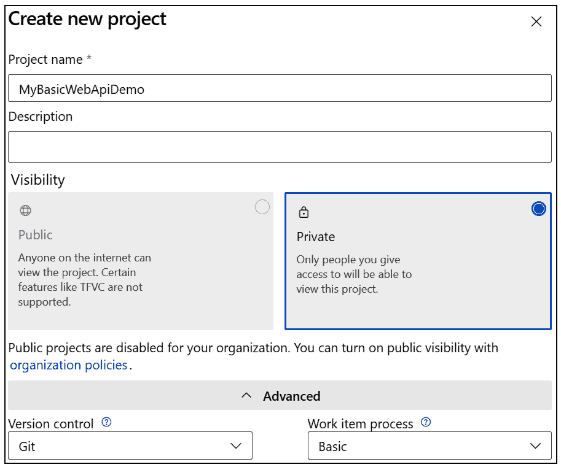

图 14.5 – 在 Azure DevOps 中创建新项目

我们将在下一节中创建这些管道：

+   **拉取请求构建管道**：当创建拉取请求时构建应用程序并运行测试的管道。当在 GitHub 仓库中创建拉取请求时，此管道将被触发。如果构建失败或测试失败，则无法合并拉取请求。

+   `main` 分支。

+   **发布管道**：将应用程序部署到 Azure Container Apps 的管道。此管道可以在将新镜像发布到 ACR 时触发，也可以手动触发。

## 创建拉取请求管道

在本节中，我们将创建一个拉取请求构建管道。请按照以下步骤操作：

1.  导航到 Azure DevOps 门户，点击左侧的 **Pipelines** 选项卡，然后点击 **Create Pipeline** 按钮。您将看到一个类似这样的页面：

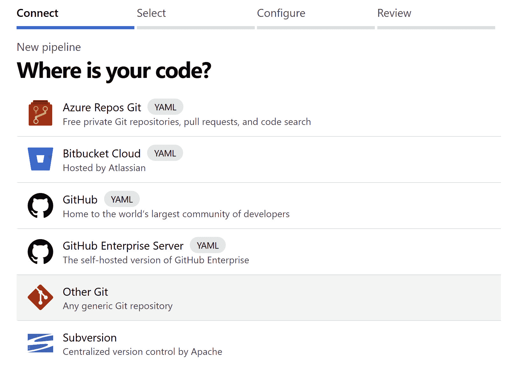

图 14.6 – 在 Azure DevOps 中创建新管道

1.  Azure DevOps 管道支持各种源，例如 Azure Repos、GitHub、Bitbucket 和 Subversion。我们已经有了一个 GitHub 仓库，所以我们将使用 GitHub 作为源。点击 **GitHub** 按钮，然后按照说明授权 Azure DevOps 访问您的 GitHub 账户。一旦您授权 Azure DevOps 访问您的 GitHub 账户，您将看到您 GitHub 账户中的仓库列表。选择我们之前创建的仓库；您将被导航到 GitHub 并看到一个可以安装 Azure Pipelines 到仓库的页面。点击 **批准并安装** 按钮将 Azure Pipelines 安装到仓库。然后，您将被导航回 Azure DevOps。您将看到一个类似这样的页面：

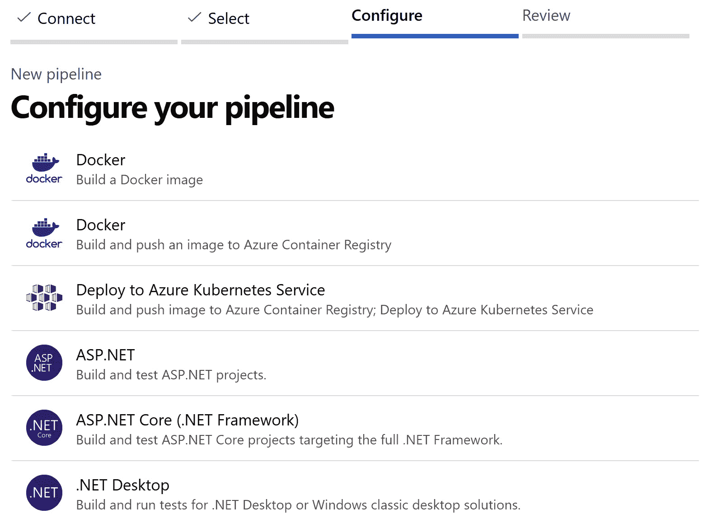

图 14.7 – 配置管道

1.  Azure DevOps 管道可以为您的项目提供各种模板。在这种情况下，您可以选择 **ASP.NET** 模板开始。Azure DevOps 管道可以自动检测源代码并为您生成一个基本管道。默认管道是一个 YAML 文件，可能看起来像这样：

    ```cs
    trigger:- mainpool:  vmImage: 'windows-latest'variables:  solution: '**/*.sln'  buildPlatform: 'Any CPU'  buildConfiguration: 'Release'steps:- task: NuGetToolInstaller@1- task: NuGetCommand@2  inputs:    restoreSolution: '$(solution)'- task: VSBuild@1  inputs:    solution: '$(solution)'    msbuildArgs: '/p:DeployOnBuild=true /p:WebPublishMethod=Package /p:PackageAsSingleFile=true /p:SkipInvalidConfigurations=true /p:PackageLocation="$(build.artifactStagingDirectory)"'    platform: '$(buildPlatform)'    configuration: '$(buildConfiguration)'- task: VSTest@2  inputs:    platform: '$(buildPlatform)'    configuration: '$(buildConfiguration)'
    ```

1.  默认管道针对 Windows。我们将在一个 Linux 容器中运行应用程序，因此需要对管道进行一些修改。删除默认内容，我们将从头开始。

1.  首先，将管道重命名为 `pr-build-pipeline`。您可以通过点击 `.``yml` 文件名来重命名管道：

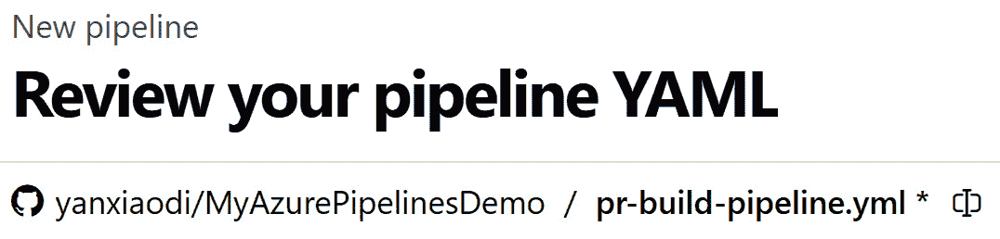

图 14.8 – 重命名管道

1.  然后，我们需要更新触发器，以便在为目标分支之一打开或更新拉取请求时运行管道。使用 `pr` 关键字表示管道将由 `main` 分支的拉取请求触发：

    ```cs
    pr:  branches:    include:    - main
    ```

1.  接下来，将 `pool` 设置为使用 `ubuntu-latest` 镜像。`ubuntu-latest` 镜像是 Linux 镜像，比 Windows 镜像小。此外，应用程序针对 Linux 容器，因此最好使用 Linux 镜像：

    ```cs
    pool:  vmImage: 'ubuntu-latest'
    ```

1.  接下来，为解决方案路径、构建配置等创建一些变量：

    ```cs
    variables:  solution: '**/*.sln'  buildConfiguration: 'Release'
    ```

1.  然后，我们需要添加一些任务。添加一个 `steps:` 部分，然后添加以下任务：

    ```cs
    steps:- task: UseDotNet@2  displayName: 'use dotnet cli'  inputs:    packageType: 'sdk'    version: '8.0.x'    includePreviewVersions: true
    ```

    `UseDotNet@2` 任务用于安装 .NET SDK，以便我们可以使用 .NET CLI 执行命令。在这种情况下，我们正在安装 .NET 8.0 SDK。`includePreviewVersions` 选项用于包含 .NET SDK 的预览版本。我们需要使用预览版本，因为本书编写时 .NET 8.0 SDK 仍在预览中。如果您在 .NET 8.0 SDK 发布后阅读此书，您可以删除 `includePreviewVersions` 选项。

    在线管道编辑器为 YAML 文件提供了类似于这样的 IntelliSense：

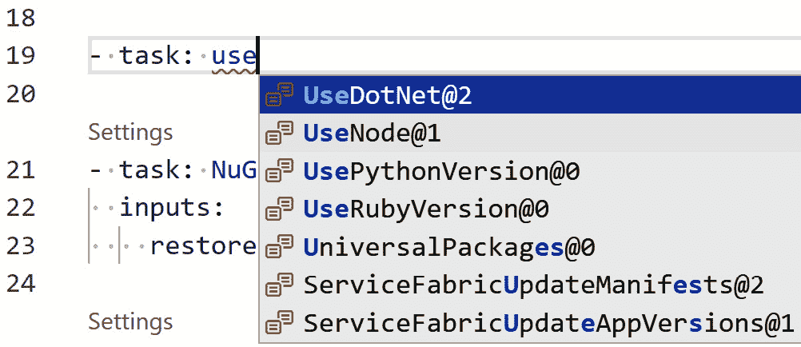

图 14.9 – YAML 文件的 IntelliSense

1.  您可以点击任务上方的 **设置** 链接，在对话框中配置任务：

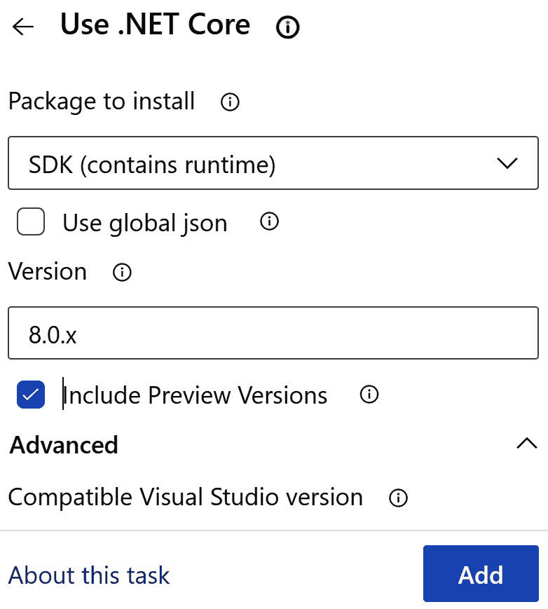

图 14.10 – 在对话框中配置任务

1.  接下来，添加一个 `DotNetCoreCLI@2` 任务来构建应用程序：

    ```cs
    - task: DotNetCoreCLI@2  displayName: 'dotnet build'  inputs:    command: 'build'    arguments: '--configuration $(buildConfiguration)    projects: '$(solution)'
    ```

    `DotNetCoreCLI@2` 任务用于运行 dotnet CLI 命令。在这种情况下，我们正在运行 `dotnet build` 命令来构建应用程序。`--configuration` 选项用于指定构建配置。`--runtime` 选项用于指定目标运行时。在这种情况下，我们针对 Linux 运行时。`projects` 选项用于指定 `.csproj` 文件或解决方案文件的路径。在这种情况下，我们使用我们之前定义的 `$(solution)` 变量。

1.  接下来，添加任务来运行单元测试和集成测试：

    ```cs
    - task: DotNetCoreCLI@2  displayName: 'dotnet test - unit tests'  inputs:    command: 'test'    arguments: '--configuration $(buildConfiguration) --no-build --no-restore --logger trx --collect "Code coverage"'    projects: '**/*.UnitTests.csproj'- task: DotNetCoreCLI@2  displayName: 'dotnet test - integration tests'  inputs:    command: 'test'    arguments: '--configuration $(buildConfiguration) --no-build --no-restore --logger trx --collect "Code coverage"'    projects: '**/*.IntegrationTests.csproj'
    ```

    在前面的任务中，我们正在运行 `dotnet test` 命令来运行单元测试和集成测试。`--no-build` 选项用于跳过构建应用程序。`--no-restore` 选项用于跳过还原 NuGet 包，因为我们已经在前面的任务中还原了包并构建了应用程序。其他选项用于指定记录器和收集代码覆盖率。

1.  点击 **保存并运行** 按钮提交更改并运行管道。你会看到管道正在运行。过了一会儿，管道将完成：

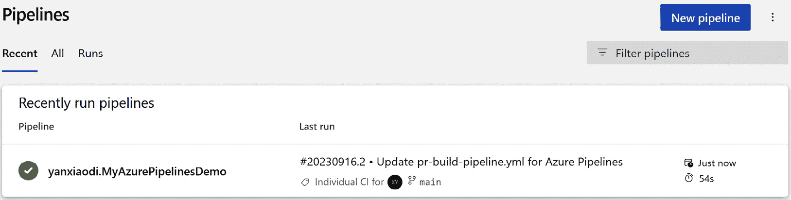

图 14.11 – 管道成功

1.  点击 **测试** 选项卡，然后你会看到测试结果：

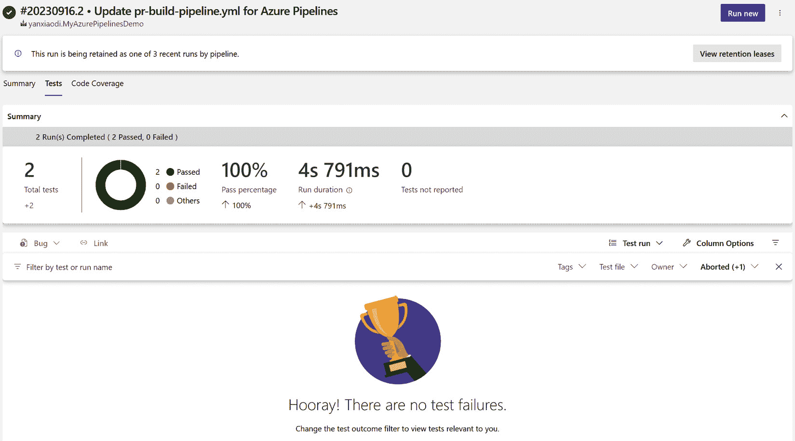

图 14.12 – 测试结果

1.  你也可以按照以下方式检查代码覆盖率：

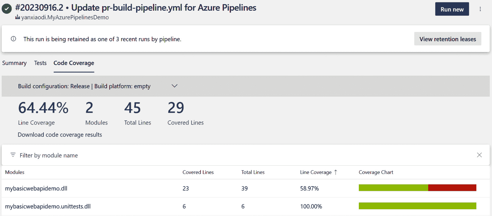

图 14.13 – 代码覆盖率

1.  我们刚刚手动触发了管道的第一次运行。接下来，让我们创建一个拉取请求并看看管道是如何触发的。

1.  创建一个新的分支并对源代码进行一些更改。例如，我们可以在 `WeatherForecastController` 中返回 6 个项目而不是 5 个项目：

    ```cs
    return Enumerable.Range(1, 6).Select(index => new WeatherForecast// Omitted for brevity
    ```

1.  然后，提交更改并将更改推送到远程仓库。你会发现管道也会为新分支运行。这是因为 YAML 管道默认对所有分支启用。你可以使用 `trigger none` 选项禁用此功能。将以下行添加到 YAML 文件的开始部分：

    ```cs
    trigger: none
    ```

    然后，此管道不会自动为新分支触发，而是由拉取请求触发。

1.  接下来，在 GitHub 仓库中创建一个新的拉取请求。你会看到管道会自动触发然后失败：

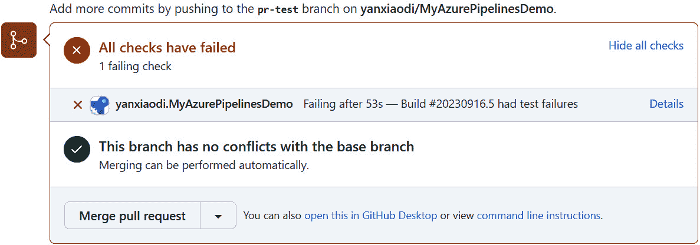

图 14.14 – 拉取请求触发的管道但失败

1.  在这种情况下，我们无法合并拉取请求，因为构建管道失败了。你可以检查日志来查看管道哪里出了问题。在这种情况下，管道失败是因为单元测试失败了：

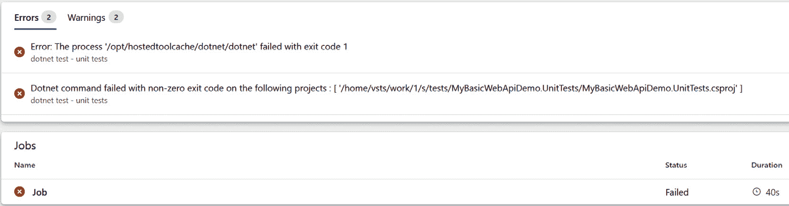

图 14.15 – 单元测试失败

1.  点击**测试**选项卡，然后您将看到测试结果：

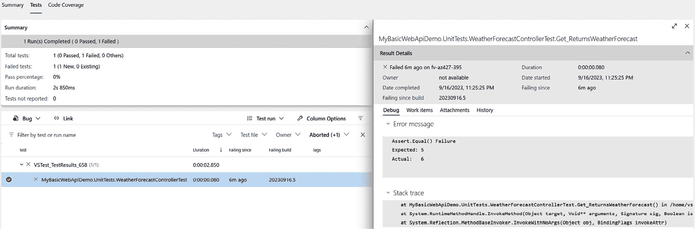

图 14.16 – 单元测试结果

失败测试用例的详细信息可以帮助我们识别问题。接下来，您可以修复错误并将更改推送到远程仓库。然后，管道将被再次触发。如果管道成功，您可以将提交请求合并。

提交请求构建管道用于确保代码更改不会破坏应用程序。在合并提交请求之前运行测试非常重要。接下来，让我们创建一个 CI 构建管道来构建 Docker 镜像并将其发布到 ACR。

## 将 Docker 镜像发布到 ACR

在上一节中，我们创建了一个提交请求构建管道来验证提交请求中的代码更改。当创建或更新提交请求时，该管道将被触发。一旦提交请求合并到`main`分支，我们就可以自动构建 Docker 镜像并将其发布到 ACR。为此，我们将按照以下步骤创建 CI 构建管道

1.  按照上一节中的步骤创建一个新的管道。在配置步骤中，我们可以选择上一节中创建的`pr-build-pipeline.yml`文件：

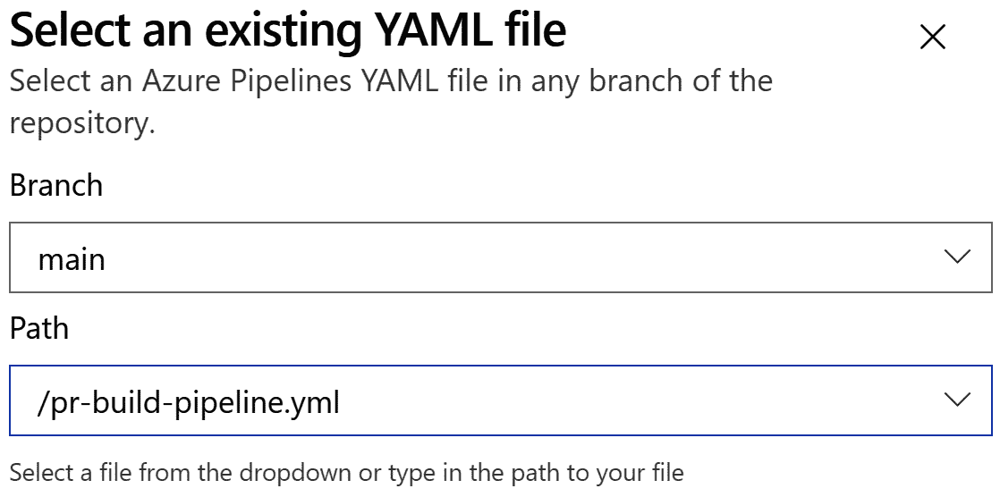

图 14.17 – 选择一个现有的 YAML 文件开始

1.  更好的方法是选择**Docker - 构建并推送镜像到 Azure 容器注册库**模板，这正是我们需要的。您将被提示配置您的 Azure 订阅、ACR 等：

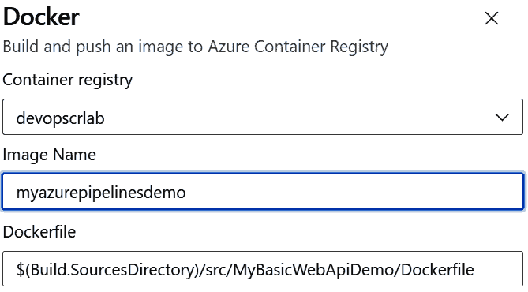

图 14.18 – 配置 ACR、Dockerfile 和镜像名称

1.  Azure Pipelines 将自动检测 Dockerfile 并为您生成一个管道。默认管道可能看起来像这样：

    ```cs
    trigger:- mainresources:- repo: selfvariables:  # Container registry service connection established during pipeline creation  dockerRegistryServiceConnection: 'deb345e0-7bdd-4420-ba08-538785d525cd'  imageRepository: 'myazurepipelinesdemo'  containerRegistry: 'devopscrlab.azurecr.io'  dockerfilePath: '$(Build.SourcesDirectory)/src/MyBasicWebApiDemo/Dockerfile'  tag: '$(Build.BuildId)'  # Agent VM image name  vmImageName: 'ubuntu-latest'stages:- stage: Build  displayName: Build and push stage  jobs:  - job: Build    displayName: Build    pool:      vmImage: $(vmImageName)    steps:    - task: Docker@2      displayName: Build and push an image to container registry      inputs:        command: buildAndPush        repository: $(imageRepository)        dockerfile: $(dockerfilePath)        containerRegistry: $(dockerRegistryServiceConnection)        tags: |          $(tag)          latest
    ```

    Azure Pipelines 已识别前一个管道中 Dockerfile 的路径。此外，必须配置一些变量，例如镜像名称和容器注册库。`tag`变量用于使用构建 ID 标记镜像。请注意，我们在镜像中添加了一个`latest`标记。`latest`标记用于指示镜像的最新版本。

Azure Pipelines 预定义变量

Azure Pipelines 提供了许多预定义变量，可以在管道中使用。例如，`$(Build.SourcesDirectory)`变量用于获取代理上已下载源代码文件的本地路径。您可以在以下位置找到所有预定义变量：[`learn.microsoft.com/en-us/azure/devops/pipelines/build/variables?view=azure-devops&tabs=yaml`](https://learn.microsoft.com/en-us/azure/devops/pipelines/build/variables?view=azure-devops&tabs=yaml)。

与拉取请求构建流水线的不同之处在于，我们在流水线中拥有**阶段**和**作业**。*图 14*.*19*显示了流水线的结构：


图 14.19 – 流水线的结构

*图 14*.*19*中的组件解释如下：

+   触发器用于指定流水线何时运行。它可以是计划、拉取请求、对特定分支的提交或手动触发。

+   流水线包含一个或多个阶段。阶段用于组织作业。在拉取请求构建流水线中，阶段被省略。您可以在一个流水线中拥有多个阶段，用于不同的目的。例如，您可以有一个构建阶段、测试阶段和部署阶段。阶段还可以用于设置安全和审批的边界。

+   每个阶段包含一个或多个作业。作业是一系列步骤的容器。作业可以在一个代理上运行，也可以在没有代理的情况下运行。例如，您可以有一个在 Windows 代理上运行的作业，另一个在 Linux 代理上运行的作业。

+   每个作业包含一个或多个步骤。步骤是流水线中最小的构建块。步骤通常是一个任务或脚本。Azure Pipelines 提供了许多内置任务，例如我们在这个流水线中使用的`Docker@2`任务。内置任务是一个预定义的打包脚本，用于执行操作。您也可以编写自己的自定义任务。任务可以是命令行工具、脚本或编译程序。您可以在以下位置找到所有内置任务：[`learn.microsoft.com/en-us/azure/devops/pipelines/tasks/reference/?view=azure-pipelines`](https://learn.microsoft.com/en-us/azure/devops/pipelines/tasks/reference/?view=azure-pipelines)。

在前面的流水线中，我们有一个阶段、一个作业和一个步骤。步骤是`Docker@2`任务。`Docker@2`任务用于构建和推送 Docker 镜像到容器注册库。使用此任务简化了构建和推送 Docker 镜像的过程，因此我们不需要手动编写`docker build`命令。

1.  将此流水线重命名为`docker-build-pipeline`。类似于`pr-build-pipeline`，我们需要排除`docker-build-pipeline`流水线在新分支和拉取请求中的运行。将以下行添加到 YAML 文件的开始部分：

    ```cs
    pr: none
    ```

    因此，当我们创建一个新的分支或新的拉取请求时，`docker-build-pipeline`不会自动触发。我们将手动触发流水线或通过合并拉取请求来触发。

1.  点击`docker-build-pipeline`将自动触发。

    如果一切正常，您将看到`docker-build-pipeline`流水线成功，并且 Docker 镜像已发布到 ACR：

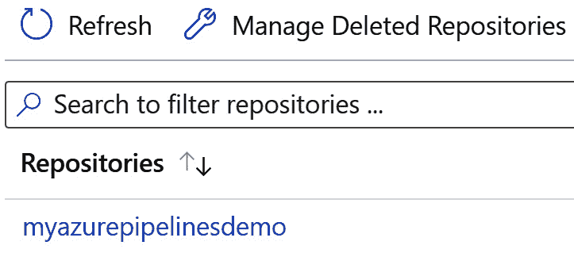

图 14.20 – Docker 镜像已发布到 ACR

CI 管道是一个良好的实践，以确保代码更改可以在不破坏应用程序的情况下成功构建。然而，某些更改可能不需要运行测试或重新构建 Docker 镜像。例如，如果你只更改了文档（例如，`README`文件），你不需要运行测试或重新构建 Docker 镜像。在这种情况下，你有几种选择：

1.  你可以排除一些文件从管道中。例如，你可以排除`README.md`文件。你可以使用`paths`选项来指定包含或排除的路径，如下所示：

    ```cs
    trigger:  branches:    include:    - main  paths:    exclude:    - README.md    - .gitignore    - .dockerignore    - *.yml
    ```

1.  你可以跳过某些提交的 CI 管道。在提交信息中使用`[skip ci]`来跳过 CI 管道。例如，你可以在提交信息中使用`[skip ci] update README`来跳过此提交的 CI 管道。一些变体包括`[ci skip]`、`[skip azurepipelines]`、`[skip azpipelines]`、`[skip azp]`等等。

在创建管道时可能会遇到一些错误。以下是一些故障排除技巧：

+   仔细检查日志。日志可以帮助你识别问题。

+   检查变量。确保变量正确。

+   检查权限。确保服务连接具有正确的权限。

+   检查 YAML 语法。确保 YAML 文件有效。YAML 文件使用缩进来表示结构。请确保缩进正确。

+   检查管道结构。确保管道结构正确。例如，确保`steps`部分位于`jobs`部分之下，而`jobs`部分位于`stages`部分之下。

+   检查管道触发器。确保管道由正确的事件触发。你可以使用`branches`、`paths`、`include`和`exclude`来指定触发管道的分支和路径。

+   注意，如果你在在线编辑器中编辑管道 YAML 文件，你将直接将更改提交到`main`分支。你的本地`feature`分支将不会自动更新。当你将更改推送到 feature 分支时，是否触发管道取决于你 feature 分支中的 YAML 文件设置，而不是`main`分支。因此，请确保你的 feature 分支与`main`分支保持同步。

+   如果你使用 VS 创建 Dockerfile，请仔细检查 Dockerfile 中的路径。有时，如果你使用自定义解决方案结构，VS 可能无法检测到正确的路径。

我们现在已将 Docker 镜像推送到 ACR。接下来，让我们创建一个发布管道，将应用程序部署到 Azure Web App for Containers。

## 将应用程序部署到 Azure Web App for Containers

在上一节中，我们创建了一个 CI 构建管道来构建 Docker 镜像并将其发布到 ACR。在本节中，我们将创建一个发布管道，从 ACR 拉取 Docker 镜像并将其部署到 Azure Web App for Containers。

按照上一节中的步骤创建一个新的管道。当我们配置管道时，选择**入门级管道**模板，因为我们将从零开始。默认的入门级管道包含两个脚本作为示例。删除这些脚本，它应该如下所示：

```cs
trigger: nonepr: none
pool:
  vmImage: ubuntu-latest
```

我们可以禁用管道的触发器，因为我们将在需要部署应用程序时手动运行管道。将管道重命名为`release-pipeline`。

接下来，向管道中添加一些变量：

```cs
variables:  containerRegistry: 'devopscrlab.azurecr.io'
  imageRepository: 'myazurepipelinesdemo'
  tag: 'latest'
```

接下来，我们需要配置用户名和密码以验证管道从 ACR 拉取 Docker 镜像。您可以在 Azure 门户中找到您的 ACR 实例的用户名和密码。点击左侧的**访问密钥**按钮，然后您将看到用户名和密码。

由于密码是秘密，我们无法直接在 YAML 文件中使用它，否则密码将在 GitHub 仓库中暴露。Azure Pipelines 提供了一种在管道中存储秘密的方法。点击右上角的**变量**按钮，然后点击**新建变量**按钮以添加新变量：

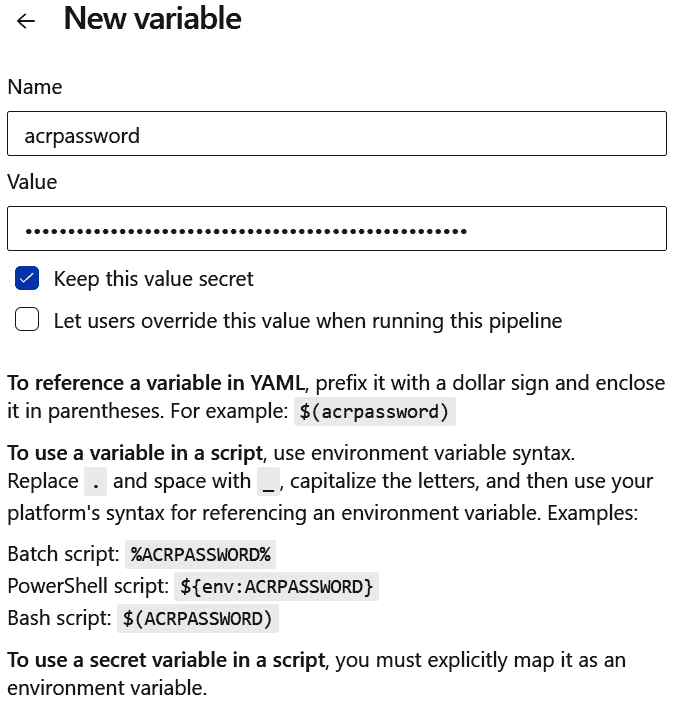

图 14.21 – 添加新变量以存储密码

检查`$(acrpassword)`变量以引用密码。

接下来，添加一个任务来设置 Azure App Service 设置。从任务助手中选择**Azure App Service 设置**任务。我们需要添加凭据以验证 Azure Web App 从 ACR 拉取 Docker 镜像。Azure Pipelines 将提示您配置任务。请注意，**应用设置**字段是一个 JSON 字符串。任务应如下所示：

```cs
- task: AzureAppServiceSettings@1  displayName: Update settings
  inputs:
    azureSubscription: '<Your Azure subscription>(<guid>)'
    appName: 'azure-pipeline-demo'
    resourceGroupName: 'devops-lab'
    appSettings: |
      [
        {
          "name": "DOCKER_REGISTRY_SERVER_URL",
          "value": "$(containerRegistry)",
          "slotSetting": false
        },
        {
          "name": "DOCKER_REGISTRY_SERVER_USERNAME",
          "value": "devopscrlab",
          "slotSetting": false
        },
        {
          "name": "DOCKER_REGISTRY_SERVER_PASSWORD",
          "value": "$(acrpassword)",
          "slotSetting": false
        }
      ]
```

在`appSettings`字段中，我们使用`$(acrpassword)`变量来引用我们之前创建的密码。

接下来，点击右上角的**显示助手**按钮以打开助手。助手帮助我们轻松使用内置任务。选择**用于容器的 Azure Web App**任务，该任务用于将 ACR 中的 Docker 镜像部署到 Azure Web App for Containers。Azure Pipelines 将提示您配置任务。按照以下方式配置任务：

```cs
- task: AzureWebAppContainer@1  displayName: Deploy to Azure Web App for Container
  inputs:
    azureSubscription: '<Your Azure subscription>'
    appName: 'azure-pipeline-demo'
    containers: '$(containerRegistry)/$(imageRepository):$(tag)'
    containerCommand: 'dotnet MyBasicWebApiDemo.dll'
```

或者，您可以使用助手中的**Azure App Service 部署**任务。此任务用于将应用程序部署到支持原生部署或容器部署的 Azure Web App。您需要配置 Azure 订阅、App Service 类型等。当您为**App Service 类型**选择**Web App for Containers (Linux)**选项时，您将被提示配置 ACR 名称、Docker 镜像名称、标签等。任务应如下所示：

```cs
- task: AzureRmWebAppDeployment@4  displayName: Deploy to Web App for Container
  inputs:
    ConnectionType: 'AzureRM'
    azureSubscription: '<Your Azure subscription>'
    appType: 'webAppContainer'
    WebAppName: 'azure-pipeline-demo'
    DockerNamespace: 'devopscrlab.azurecr.io'
    DockerRepository: 'myazurepipelinesdemo'
    DockerImageTag: 'latest'
    StartupCommand: 'dotnet MyBasicWebApiDemo.dll'
```

注意，我们还需要指定一个`StartupCommand`值。在这种情况下，我们使用`dotnet MyBasicWebApiDemo.dll`来启动应用程序。

现在，我们可以手动触发管道以部署应用程序。如果一切正常，您将看到部署成功。

检查 Azure Web App 的配置。您将看到 **应用程序设置** 已更新：


图 14.22 – 应用设置已更新

导航到 Azure 门户并检查我们之前创建的 Azure Web App 的详细信息。您可以在其中找到 Azure Web App 的 URL，例如 `azure-pipeline-demo.azurewebsites.net`。在浏览器中打开此 URL 并检查控制器端点，例如 `https://azure-pipeline-demo.azurewebsites.net/WeatherForecast`。您将看到应用程序的响应。

到目前为止，我们已经创建了三个管道：

+   **拉取请求构建管道**：此管道用于验证拉取请求中的代码更改。当创建或更新拉取请求时，它将被触发。如果构建失败或测试失败，则无法合并拉取请求。此管道不生成任何工件。

+   `main` 分支。此管道生成一个 Docker 镜像作为工件。

+   **发布管道**：此管道用于从 ACR 拉取 Docker 镜像并将其部署到 Azure Web App for Containers。此管道可以在将新的 Docker 镜像发布到 ACR 时手动或自动触发。此管道不生成任何工件。

## 配置设置和秘密

在上一节中，我们创建了一个发布管道，用于将应用程序部署到 Azure Web App for Containers。我们可能还需要将应用程序部署到其他环境，例如预发布环境。这些不同的环境可能具有不同的设置，例如数据库连接字符串、API 密钥等。那么，我们如何为不同的环境配置设置呢？

有多种实现方式。一种简单的方法是为不同的环境配置变量。您可以直接在每个管道中定义变量。Azure Pipelines 还提供了一个 **库** 来管理变量。您可以将变量分组到变量组中，然后在管道中使用该变量组。

安全地存储机密信息对任何组织都至关重要。为确保您的秘密安全，您可以使用各种密钥保管库，例如 Azure Key Vault 和 AWS Secrets Manager。Azure Pipelines 提供了一个密钥保管库任务来从保管库中检索秘密。使用 Azure Key Vault 任务，您可以轻松地从保管库检索秘密并在管道中使用它们。有关密钥保管库任务的更多信息，请访问 [`learn.microsoft.com/en-us/azure/devops/pipelines/release/key-vault-in-own-project`](https://learn.microsoft.com/en-us/azure/devops/pipelines/release/key-vault-in-own-project)。

本章的目的不是涵盖 Azure Pipelines 的所有细节，但你现在应该对 Azure Pipelines 有一个基本的了解。使用 CI/CD 管道可以帮助你自动化构建、测试和部署过程，从而消除人工工作并减少人为错误的风险。在现代软件开发中，使用 CI/CD 管道变得越来越重要。每个开发者都应该学习如何使用它们。

在下一节中，我们将探讨 GitHub Actions，这是另一个流行的 CI/CD 工具。

# GitHub Actions

在上一节中，我们探讨了 Azure Pipelines。接下来，让我们来了解 GitHub Actions。GitHub Actions 是由 GitHub 提供的 CI/CD 工具，它与 Azure Pipelines 非常相似。在本节中，我们将使用 GitHub Actions 来构建和测试应用程序，并将 Docker 镜像推送到 ACR。

## 准备项目

为了演示如何使用 GitHub Actions，我们将使用与上一节相同的源代码。你可以从这里下载源代码：[`github.com/PacktPublishing/Web-API-Development-with-ASP.NET-Core-8/tree/main/samples/chapter14/MyBasicWebApiDemo`](https://github.com/PacktPublishing/Web-API-Development-with-ASP.NET-Core-8/tree/main/samples/chapter14/MyBasicWebApiDemo)。创建一个新的 GitHub 仓库并将源代码推送到仓库。源代码的目录结构如下：

```cs
MyGitHubActionsDemo    ├── src
    │   └──MyBasicWebApiDemo
    ├── tests
    │   ├──MyBasicWebApiDemo.UnitTests
    │   └──MyBasicWebApiDemo.IntegrationTests
    ├── MyBasicWebApiDemo.sln
    ├── README.md
    ├── LICENSE
    └── .gitignore
```

如果你使用不同的目录结构，请在以下章节中相应地更新管道中的路径。我们将使用这个仓库来演示如何配置 GitHub Actions。

## 创建 GitHub Actions

我们将重用上一节中创建的 Azure 资源。如果你还没有创建 Azure 资源，请参阅 *创建 Azure 资源* 部分，以创建资源。

在 GitHub 仓库页面上，点击 **操作** 选项卡，你可以看到许多针对不同编程语言和框架的模板：

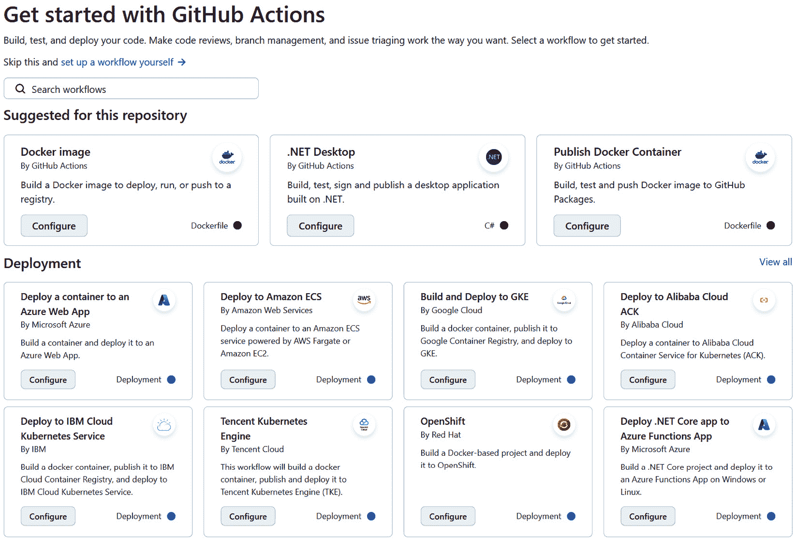

图 14.23 – 为 GitHub Actions 选择模板

在 **持续集成** 部分，你可以找到 **.NET** 模板。点击 **配置** 按钮创建一个新的工作流程。工作流程是一个 YAML 文件，它定义了 CI/CD 管道。默认工作流程可能看起来像这样：

```cs
# This workflow will build a .NET project# For more information see: https://docs.github.com/en/actions/automating-builds-and-tests/building-and-testing-net
name: .NET
on:
  push:
    branches: [ "main" ]
  pull_request:
    branches: [ "main" ]
jobs:
  build:
    runs-on: ubuntu-latest
    steps:
    - uses: actions/checkout@v3
    - name: Setup .NET
      uses: actions/setup-dotnet@v3
      with:
        dotnet-version: 6.0.x
    - name: Restore dependencies
      run: dotnet restore
    - name: Build
      run: dotnet build --no-restore
    - name: Test
      run: dotnet test --no-build --verbosity normal
```

工作流程的语法与 Azure Pipelines 非常相似。工作流程在创建或更新拉取请求时触发，或者当向 `main` 分支推送提交时触发。

在右侧，你可以找到 **Marketplace** 面板。Marketplace 与 Azure DevOps Pipelines 的助手类似，提供了许多内置操作，你可以在工作流程中使用：


图 14.24 – Marketplace 面板

示例应用程序使用.NET 8。因此，我们需要将`dotnet-version`更新为`8.0.x`。点击已提交到`/.github/workflows`目录的`dotnet.yml`文件。对源代码进行更改或创建一个新的分支，并将更改推送到远程仓库。例如，您可以将控制器更改回返回六个项目而不是五个项目：

```cs
public IEnumerable<WeatherForecast> Get(){
    return Enumerable.Range(1, 6).Select(index => new WeatherForecast
    // Omitted for brevity
```

您还可以创建一个拉取请求。您将看到工作流程会自动触发，但测试失败：

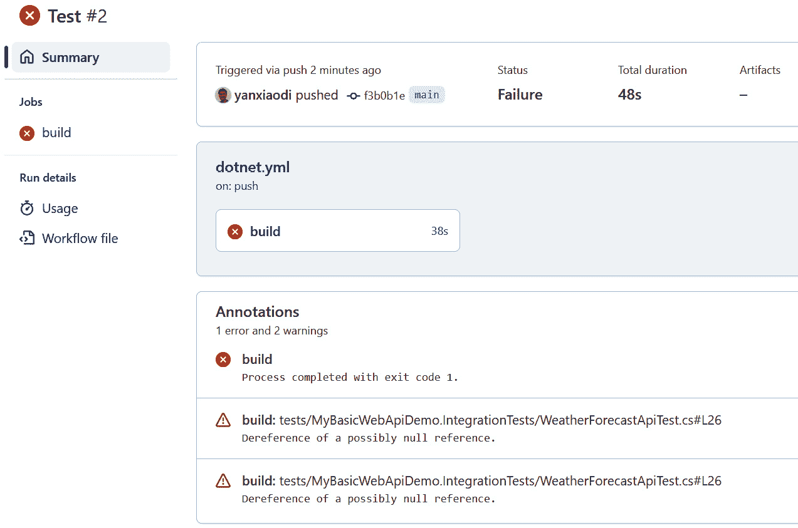

图 14.25 – 工作流程自动触发然后失败

点击日志中的链接以查看导致测试失败的代码的详细信息。在审查拉取请求中的代码更改时，这非常方便。如果一切正常，您可以合并拉取请求。

为了明确它适用于拉取请求构建，我们可以将此文件重命名为`pr-build.yml`，并更新`on`部分以使工作流程在拉取请求中运行：

```cs
on:  pull_request:
    branches: [ "main" ]
```

接下来，让我们构建一个 Docker 镜像并将其推送到 ACR。

## 将 Docker 镜像推送到 ACR

在`.github\workflows`文件夹中创建一个名为`docker-build.yml`的新 YAML 文件。更新文件内容如下：

```cs
name: Pull Request buildon:
  push:
    branches: [ "main" ]
```

当向`main`分支推送提交或拉取请求合并到`main`分支时，此工作流程会被触发。

为了验证操作以访问 ACR，我们需要在 GitHub 密钥中配置 ACR 的用户名和密码。通过在 Azure 门户中点击 ACR 的**访问密钥**菜单来查找用户名和密码。

前往 GitHub 仓库的**设置**，然后在**安全**类别中点击**密钥和变量**。然后，点击**操作**，您将看到密钥和变量页面。有两种类型的密钥：环境密钥和仓库密钥。您可以直接在仓库密钥中存储用户名和密码。为了演示如何使用环境密钥，我们将在这个示例中使用环境密钥。点击**管理环境**按钮以创建一个名为**生产**的新环境。然后，点击**添加密钥**按钮以添加用户名和密码：

+   名称：`REGISTRY_USERNAME`。值：ACR 的用户名。

+   名称：`REGISTRY_PASSWORD`。值：ACR 的密码。

您可以更改环境密钥的名称，但请确保在以下工作流程中使用相同的名称。

现在，环境密钥应该看起来像这样：

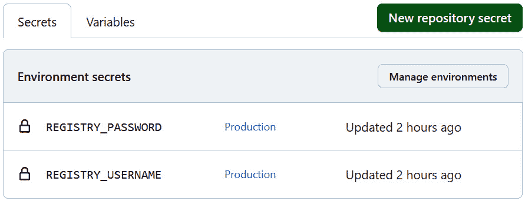

图 14.26 – Actions 密钥和变量页面

将以下内容添加到`docker-build.yml`文件中：

```cs
jobs:  docker_build_and_push:
    runs-on: ubuntu-latest
    environment: Production
    steps:
    - uses: actions/checkout@v3
    - name: Setup .NET
      uses: actions/setup-dotnet@v3
      with:
        dotnet-version: 8.0.x
    - name: Restore dependencies
      run: dotnet restore
    - name: Build
      run: dotnet build --no-restore
    - name: Login to Azure Container Registry
      uses: azure/docker-login@v1
      with:
        login-server: devopscrlab.azurecr.io
        username: ${{ secrets.REGISTRY_USERNAME }}
        password: ${{ secrets.REGISTRY_PASSWORD }}
    - name: Push to Azure Container Registry
      run: |
        docker build -f ${{ github.workspace }}/src/MyBasicWebApiDemo/Dockerfile -t devopscrlab.azurecr.io/myazurepipelinesdemo:${{ github.run_id }} -t devopscrlab.azurecr.io/myazurepipelinesdemo:latest .
        docker push devopscrlab.azurecr.io/myazurepipelinesdemo:${{ github.run_id }}
        docker push devopscrlab.azurecr.io/myazurepipelinesdemo:latest
```

前面的内容与`pr-build.yml`文件类似，但我们做了一些更改：

+   我们添加了一个`environment`部分来指定环境，以便我们可以在以后引用环境密钥。

+   我们添加了一个新的`azure/docker-login@v1`步骤来登录到 ACR。在这个步骤中，我们使用环境密钥指定了登录服务器、用户名和密码。

+   我们添加了一个新步骤来构建 Docker 镜像并将其推送到 ACR。在这个步骤中，我们使用了 `github.run_id` 变量来使用运行 ID 标记镜像。我们还使用 `latest` 标记了镜像。

GitHub Actions 上下文

GitHub Actions 支持许多内置上下文变量，例如 `github.run_id`、`github.run_number`、`github.sha`、`github.ref` 等。你可以在这里找到所有上下文变量：[`docs.github.com/en/actions/learn-github-actions/contexts`](https://docs.github.com/en/actions/learn-github-actions/contexts)。

提交更改并将更改推送到远程仓库。下次你合并拉取请求时，你会看到工作流程会自动触发，并将 Docker 镜像推送到 ACR：

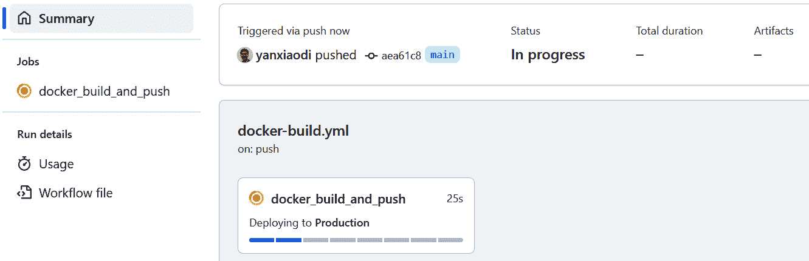

图 14.27 – GitHub Actions 工作流程自动触发

由于 Azure Pipelines 和 GitHub Actions 之间有许多相似之处，我们不会涵盖 GitHub Actions 的所有细节。也许轮到你来创建一个 GitHub Actions 工作流程，将 Docker 镜像部署到 Azure Web App for Containers？你可以在这里找到有关 GitHub Actions 的更多信息：[`docs.github.com/en/actions`](https://docs.github.com/en/actions)。

# 摘要

在本章中，我们探讨了 CI/CD 的基础知识。我们讨论了如何使用 Docker 来容器化 ASP.NET Web API 应用程序，包括如何创建 Dockerfile、构建 Docker 镜像以及在本地运行 Docker 容器。然后我们了解了 Azure DevOps Pipelines，这是微软的一个强大的 CI/CD 平台，以及如何在 YAML 文件中创建 CI/CD 管道。我们涵盖了配置触发器、使用内置任务和使用变量。我们创建了三个管道，用于构建、Docker 镜像构建和发布。我们还简要讨论了 GitHub Actions，这是另一个流行的 CI/CD 工具，并创建了一个 GitHub Actions 工作流程来构建和测试应用程序，然后构建 Docker 镜像并将其推送到 ACR。阅读本章后，你应该对 CI/CD 有基本的了解，并能够使用 CI/CD 管道来自动化构建、测试和部署过程。

在下一章中，我们将检查构建 ASP.NET Web API 的一些常见做法，包括缓存、`HttpClient` 工厂等。
