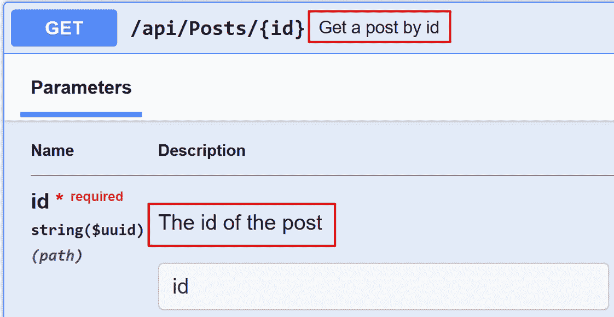
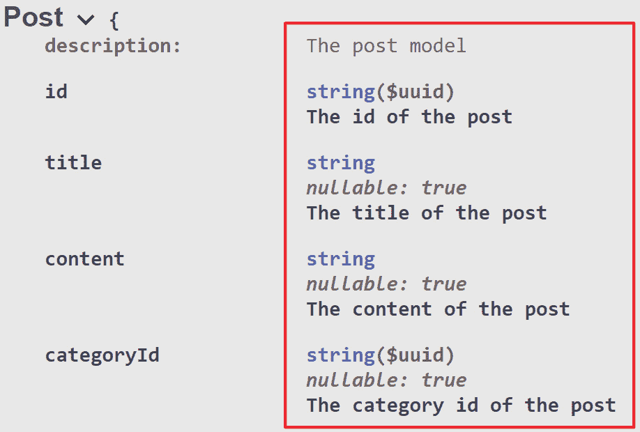

# 15

# ASP.NET Core Web API 常见实践

在前面的章节中，我们介绍了很多概念，包括 ASP.NET web API 的基础知识、RESTful 风格、Entity Framework、单元测试和集成测试、CI/CD 等。你应该能够自己构建一个简单的 ASP.NET Core web API 应用程序。然而，还有很多东西我们需要学习。

你可能之前听说过“*没有银弹*”这个短语。这意味着通常没有简单、通用或一刀切的解决方案来解决所有问题。无论技术、工具或框架多么强大，它们都不是万能的。这对于 ASP.NET Core Web API 开发也是如此。然而，有一些常见实践可以帮助我们构建更好的 ASP.NET Core Web API 应用程序。

在本章中，我们将总结 ASP.NET Core Web API 开发的常见实践。在本章中，我们将涵盖以下主题：

+   ASP.NET Core Web API 开发的常见实践

+   通过实现缓存来优化性能

+   使用 HttpClientFactory 管理 HttpClient 实例

读完本章后，你应该能够扩展你对 ASP.NET Core web API 开发的知识，并构建更好的 Web API 应用程序。

# 技术要求

本章的代码示例可以在[`github.com/PacktPublishing/Web-API-Development-with-ASP.NET-Core-8/tree/main/samples/chapter15`](https://github.com/PacktPublishing/Web-API-Development-with-ASP.NET-Core-8/tree/main/samples/chapter15)找到。

# ASP.NET Web API 开发的常见实践

在本节中，我们将介绍一些 ASP.NET web API 开发的常见实践。当然，我们无法在本书中涵盖所有常见实践。但是，我们将尝试涵盖最重要的那些。

## 使用 HTTPS 而不是 HTTP

在前面的章节中，我们为了简单起见使用了 HTTP 端点；然而，在现实世界中，应该始终使用 HTTPS 而不是 HTTP。HTTPS 是 HTTP 的安全版本，它使用 TLS/SSL 加密 HTTP 流量，从而防止第三方拦截或篡改数据。这确保了传输数据的安仝性和完整性。

对于需要安全数据传输的网站，如在线银行和在线购物，HTTPS 正变得越来越流行。这一趋势体现在许多网络浏览器，如 Google Chrome、Microsoft Edge、Firefox 等，现在将 HTTP 网站标记为 **不安全**，以鼓励用户切换到 HTTPS。这是使用 HTTPS 进行安全数据传输趋势日益增长的明显迹象。

默认情况下，ASP.NET Core Web API 模板使用 HTTPS。你可以在 `Program.cs` 文件中找到以下代码：

```cs
app.UseHttpsRedirection();
```

此代码将所有 HTTP 请求重定向到 HTTPS。在开发环境中，ASP.NET Core Web API 应用程序使用自签名证书。当您将 ASP.NET Core Web API 应用程序部署到生产环境时，您需要使用由受信任的**证书颁发机构**（**CA**）签发的有效证书，例如 Let’s Encrypt、DigiCert、Comodo 等。

## 正确使用 HTTP 状态码

HTTP 状态码用于指示 HTTP 请求的状态。HTTP 状态码有五个类别：

+   1xx: 信息性

+   2xx: 成功

+   3xx: 重定向

+   4xx: 客户端错误

+   5xx: 服务器错误

以下表格提供了 RESTful Web API 中最常用的一些 HTTP 状态码的摘要：

| **状态码** | **描述** |
| --- | --- |
| `200` | OK |
| `201` | 已创建 |
| `202` | 已接受 |
| `204` | 无内容 |
| `301` | 永久移动 |
| `302` | 找到 |
| `304` | 未修改 |
| `400` | 错误请求 |
| `401` | 未授权 |
| `403` | 禁止访问 |
| `404` | 未找到 |
| `405` | 不允许的方法 |
| `409` | 冲突 |
| `410` | 已删除 |
| `415` | 不支持媒体类型 |
| `422` | 不可处理的实体 |
| `429` | 请求过多 |
| `500` | 内部服务器错误 |
| `501` | 未实现 |
| `503` | 服务不可用 |
| `504` | 网关超时 |

表 15.1 – RESTful Web API 中常用的 HTTP 状态码

以下列表显示了 RESTful Web API 中 HTTP 方法和它们对应的状态码：

+   `GET`: `GET`方法用于检索单个资源或资源集合。`GET`请求不应修改服务器状态。它可以返回以下状态码：

    +   `200`: 资源已找到并返回。

    +   `404`: 资源未找到。注意，如果集合存在但为空，则`GET`方法应返回`200`状态码，而不是`404`状态码。

+   `POST`: `POST`方法用于创建单个资源或资源集合。它也可以用于更新资源。它可以返回以下状态码：

    +   `200`: 资源已成功更新。

    +   `201`: 资源创建成功。响应应包含新创建资源的标识符。

    +   `202`: 资源已接受处理，但处理尚未完成。此状态码通常用于长时间运行的操作。

    +   `400`: 请求无效。

    +   `409`: 资源已存在。

+   `PUT`: `PUT`方法用于更新单个资源或资源集合。它很少用于创建资源。它可以返回以下状态码：

    +   `200`: 资源已成功更新。

    +   `204`: 资源已成功更新，但没有内容可返回。

    +   `404`: 资源未找到。

+   `DELETE`: `DELETE`方法用于删除具有特定标识符的单个资源。它可以用于删除资源集合，但这不是常见场景。它可以返回以下状态码：

    +   `200`: 资源已成功删除，并且响应中包含已删除的资源。

    +   `204`: 资源已成功删除，但没有内容返回。

    +   `404`: 资源未找到。

重要的是要注意，这个列表并不全面，仅适用于 RESTful Web API。在选择合适的 HTTP 状态码时，请考虑具体场景。对于 GraphQL API，通常使用 `200` 作为大多数响应的状态码，`errors` 字段指示任何错误。

## 使用异步编程

ASP.NET Core Web API 框架旨在异步处理请求，因此我们应该尽可能使用异步编程。异步编程允许应用程序并发处理多个任务，从而可以提高应用程序的性能。对于许多 I/O 密集型操作，例如访问数据库、发送 HTTP 请求和操作文件，使用异步编程可以在等待 I/O 操作完成的同时释放线程以处理其他请求。

在 C# 中，你可以使用 `async` 和 `await` 关键字来定义和等待异步操作。.NET 中的许多方法都有同步和异步版本。例如，`StreamReader` 类有以下同步和异步方法来读取流的内容：

```cs
// Synchronous methodspublic int Read();
public string ReadToEnd();
// Asynchronous methods
public Task<int> ReadAsync();
public Task<string> ReadToEndAsync();
```

在这四种方法中，没有 `Async` 后缀的方法是同步的，它会在操作完成之前阻塞线程。相比之下，带有 `Async` 后缀的方法是异步的，它立即返回一个 `Task` 对象并允许线程处理其他请求。当操作完成时，`Task` 对象将完成，线程将继续处理请求。尽可能使用异步编程以提高应用程序的性能。

对于 I/O 操作，我们应该始终使用异步编程。例如，当访问 `HttpRequest` 和 `HttpResponse` 对象时，应使用异步方法。以下是一个示例：

```cs
[HttpPost]public async Task<ActionResult<Post>> PostAsync()
{
    // Read the content of the request body
    var jsonString = await new StreamReader(Request.Body).ReadToEndAsync();
    // Do something with the content
    var result = JsonSerializer.Deserialize<Post>(jsonString);
    return Ok(result);
}
```

在前面的代码中，使用 `ReadToEndAsync()` 方法读取请求体的内容。对于这种情况，我们不应使用同步的 `ReadToEnd()` 方法，因为它将阻塞线程直到操作完成。

如果有多个异步操作需要同时执行，我们可以使用 `Task.WhenAll()` 方法等待所有异步操作完成。以下是一个示例：

```cs
[HttpGet]public async Task<ActionResult> GetAsync()
{
    // Simulate a long-running I/O-bound operation
    var task1 = SomeService.DoSomethingAsync();
    var task2 = SomeService.DoSomethingElseAsync();
    await Task.WhenAll(task1, task2);
    return Ok();
}
```

在前面的代码中，`Task.WhenAll()` 方法等待 `task1` 和 `task2` 任务完成。如果你需要在任务完成后获取任务的结果，可以使用 `Task` 对象的 `Result` 属性来获取结果。以下是一个示例：

```cs
[HttpGet]public async Task<ActionResult> GetAsync()
{
    // Simulate long-running I/O-bound operations
    var task1 = SomeService.DoSomethingAsync();
    var task2 = SomeService.DoSomethingElseAsync();
    await Task.WhenAll(task1, task2);
    var result1 = task1.Result;
    var result2 = task2.Result;
    // Do something with the results
    return Ok();
}
```

在前面的代码中，使用了`task1`和`task2`对象的`Result`属性来获取任务的结果。因为我们已经使用了`await`关键字等待任务完成，所以`Result`属性将立即返回结果。但如果我们没有使用`await`关键字等待任务完成，`Result`属性将阻塞线程，直到任务完成。因此，在使用`Result`属性时请务必小心。同样，`Task`对象的`Wait()`方法也会阻塞线程，直到任务完成。如果你想等待任务完成，请使用`await`关键字而不是`Wait`方法。

重要提示

注意，`Task.WhenAll()`方法并不适用于所有场景。例如，EF Core 不支持在同一个数据库上下文中并行执行多个查询。如果你需要在同一个数据库上下文中执行多个查询，你应该使用`await`关键字等待前一个查询完成，然后再执行下一个查询。

在使用异步编程时，有几个重要的考虑因素需要记住。这些包括但不限于以下内容：

+   不要在 ASP.NET Core 中使用`async void`。唯一允许使用`async void`的场景是在事件处理器中。如果异步方法返回`void`，则方法中抛出的异常不会被调用者正确捕获。

+   不要在同一个方法中混合同步和异步方法。如果可能，尽量在整个过程中使用`async`。这允许整个调用堆栈都是异步的。

+   如果你需要使用`Task`对象的`Result`属性，请确保`Task`对象已完成。否则，`Result`属性将阻塞线程，直到`Task`对象完成。

+   如果你有一个只返回另一个异步方法结果的函数，就没有必要使用`async`关键字。只需直接返回`Task`对象即可。例如，以下代码是不必要的：

    ```cs
    public async Task<int> GetDataAsync(){    return await SomeService.GetDataAsync();}
    ```

    以下代码没有使用`async`/`await`关键字，这更好：

    ```cs
    public Task<int> GetDataAsync(){    return SomeService.GetDataAsync();}
    ```

这是因为`async`关键字将创建一个状态机来管理异步方法的执行。在这种情况下，这是不必要的。直接返回`Task`不会产生额外的开销。

## 对大型集合使用分页

不建议在单个响应中返回大量资源，因为这可能导致性能问题。这些问题可能包括以下内容：

+   服务器可能需要大量时间来查询数据库并处理响应。

+   响应负载可能相当大，从而导致网络拥塞。这可能会对系统的性能产生负面影响，导致延迟增加和吞吐量下降。

+   客户端可能需要额外的时间和资源来处理大量的响应。对于客户端来说，反序列化一个大的 JSON 对象可能是计算密集型的。此外，在 UI 上渲染大量项目可能会导致客户端无响应。

为了有效地管理大量集合，建议使用分页。*第五章*介绍了通过使用`IQueryable`接口的`Skip()`和`Take()`方法来实现分页和过滤。我们还提到应该使用`AsNoTracking()`方法来提高只读查询的性能。这将导致返回给客户端的资源集合。然而，客户端可能不知道是否有更多的资源可用。为了解决这个问题，我们可以创建一个自定义类来表示分页响应。以下是一个示例：

```cs
public class PaginatedList<T> where T : class{
    public int PageIndex { get; }
    public int PageSize { get; }
    public int TotalPages { get; }
    public List<T> Items { get; } = new();
    public PaginatedList(List<T> items, int count, int pageIndex = 1, int pageSize = 10)
    {
        PageIndex = pageIndex;
        PageSize = pageSize;
        TotalPages = (int)Math.Ceiling(count / (double)pageSize);
        Items.AddRange(items);
    }
    public bool HasPreviousPage => PageIndex > 1;
    public bool HasNextPage => PageIndex < TotalPages;
}
```

在前面的代码中，`PaginatedList<T>`类包含一些属性来表示分页信息：

+   `PageIndex`：当前页索引

+   `PageSize`：页面大小

+   `TotalPages`：总页数

+   `Items`：当前页上的项目集合

+   `HasPreviousPage`：指示是否存在上一页

+   `HasNextPage`：指示是否存在下一页

然后，我们可以在控制器中使用这个类来实现分页。以下是一个示例：

```cs
[HttpGet]public async Task<ActionResult<PaginatedList<Post>>> GetPosts(int pageIndex = 1, int pageSize = 10)
{
    var posts = _context.Posts.AsQueryable().AsNoTracking();
    var count = await posts.CountAsync();
    var items = await posts.Skip((pageIndex - 1) * pageSize).Take(pageSize).ToListAsync();
    var result = new PaginatedList<Post>(items, count, pageIndex, pageSize);
    return Ok(result);
}
```

在前面的代码中，除了`Items`属性外，`PaginatedList<T>`类还包含分页信息，如`PageIndex`、`PageSize`、`TotalPages`、`HasPreviousPage`、`HasNextPage`等。端点的响应将如下所示：

```cs
{  "pageIndex": 1,
  "pageSize": 10,
  "totalPages": 3,
  "items": [
    {
      "id": "3c979917-437b-406d-a784-0784170b5dd9",
      "title": "Post 26",
      "content": "Post 26 content",
      "categoryId": "ffdd0d80-3c3b-4e83-84c9-025d5650c6e5",
      "category": null
    },
    ...
  ],
  "hasPreviousPage": false,
  "hasNextPage": true
}
```

这样，客户端可以轻松实现分页。您还可以在`PaginatedList<T>`类中包含更多信息，例如上一页和下一页的链接等。

在实现分页时，考虑排序和过滤非常重要。通常，数据应该先进行过滤，然后是排序，最后是分页。例如，以下 LINQ 查询可以用来：

```cs
var posts = _context.Posts.AsQueryable().AsNoTracking();posts = posts.Where(x => x.Title.Contains("Post")).OrderBy(x => x.PublishDate).Skip((pageIndex - 1) * pageSize).Take(pageSize).ToListAsync();
```

应该使用`Where()`方法首先过滤数据，以减少需要排序的数据量。这很重要，因为排序通常是一个昂贵的操作。一旦数据被过滤，可以使用`OrderBy()`方法对其进行排序。最后，可以使用`Skip()`和`Take()`方法对数据进行分页。

## 指定响应类型

ASP.NET Core Web API 端点可以返回各种类型的响应，例如`ActionResult`、`ActionResult<T>`或对象的特定类型。以下代码返回一个`Post`对象：

```cs
[HttpGet("{id}")]public async Task<Post> GetAsync(Guid id)
{
    var post = await _postService.GetAsync(id);
    return post;
}
```

上述代码可以正常工作，但如果找不到`post`怎么办？建议使用`ActionResult<T>`而不是对象的特定类型。`ActionResult<T>`类是一个泛型类，可以用来返回各种 HTTP 状态码。以下是一个示例：

```cs
public async Task<ActionResult<Post>> GetPost(Guid id){
    var post = await _context.Posts.FindAsync(id);
    if (post == null)
    {
        return NotFound();
    }
    return Ok(post);
}
```

在前面的代码中，`ActionResult<Post>` 类被用来返回一个 `Post` 对象。如果找不到 `post`，则使用 `NotFound` 方法返回 `404 Not Found` 状态码。如果找到 `post`，则使用 `Ok` 方法返回 `200 OK` 状态码。

我们可以将 `[ProducesResponseType]` 属性添加到指定端点的响应类型。以下是一个完整的示例：

```cs
[HttpGet("{id}")][ProducesResponseType(StatusCodes.Status200OK)]
[ProducesResponseType(StatusCodes.Status404NotFound)]
public async Task<ActionResult<Post>> GetPost(Guid id)
{
    var post = await _context.Posts.FindAsync(id);
    if (post == null)
    {
        return NotFound();
    }
    return Ok(post);
}
```

在前面的代码中，有两个 `[ProducesResponseType]` 属性。第一个指定了 `200 OK` 状态码，第二个指定了 `404 Not Found` 状态码。`[ProducesResponseType]` 属性是可选的，但建议使用它来指定端点的响应类型。Swagger UI 将使用 `[ProducesResponseType]` 属性来生成端点的响应类型，如图 *图 15.1* 所示：

![图 15.1 – Swagger UI 使用 `[ProducesResponseType]` 属性来生成端点的响应类型](img/B18971_15_01.jpg)

图 15.1 – Swagger UI 使用 `[ProducesResponseType]` 属性来生成端点的响应类型

我们可以在 Swagger UI 中看到可能的响应。这个端点可以返回 `200 OK` 状态码或 `404 Not Found` 状态码。

为了强制使用 `[ProducesResponseType]` 属性，我们可以使用 `OpenAPIAnalyzers`。这个分析器可以用来报告缺少 `[ProducesResponseType]` 属性。在 `*.csproj` 文件的 `<PropertyGroup>` 部分添加以下代码：

```cs
<IncludeOpenAPIAnalyzers>true</IncludeOpenAPIAnalyzers>
```

然后，我们可以在 Visual Studio 中看到如果控制器操作没有 `[ProducesResponseType]` 属性将显示的警告，如图 *图 15.2* 所示：

![图 15.2 – Visual Studio 如果控制器操作没有 `[ProducesResponseType]` 属性将显示警告](img/B18971_15_02.jpg)

图 15.2 – Visual Studio 如果控制器操作没有 `[ProducesResponseType]` 属性将显示警告

Visual Studio 将为你提供快速修复来添加这些属性。这个分析器非常有用，建议使用它。

## 在端点添加注释

在端点添加 XML 注释可以帮助其他开发者更好地理解它们。这些注释将在 Swagger UI 中显示，提供端点的全面描述。这可以成为开发者使用端点时的宝贵资源。

在端点添加 XML 注释非常简单。我们只需向它们添加 `///` 注释。当你输入 `///` 时，Visual Studio 将自动生成 XML 注释结构。你需要添加方法的描述、参数、返回值等。以下是一个示例：

```cs
/// <summary>/// Get a post by id
/// </summary>
/// <param name="id">The id of the post</param>
/// <returns>The post</returns>
[HttpGet("{id}")]
[ProducesResponseType(StatusCodes.Status200OK)]
[ProducesResponseType(StatusCodes.Status404NotFound)]
public async Task<ActionResult<Post>> GetPost(Guid id)
{
    // Omitted for brevity
}
```

你也可以向模型类添加注释。以下是一个简单的示例：

```cs
/// <summary>/// The post model
/// </summary>
public class Post
{
    /// <summary>
    /// The id of the post
    /// </summary>
    public Guid Id { get; set; }
    /// <summary>
    /// The title of the post
    /// </summary>
    public string Title { get; set; }
    /// <summary>
    /// The content of the post
    /// </summary>
    public string Content { get; set; }
}
```

然后，我们需要在项目文件中启用 XML 文档文件生成。打开 `*.csproj` 文件，并在 `<PropertyGroup>` 元素中添加以下代码：

```cs
<GenerateDocumentationFile>true</GenerateDocumentationFile><NoWarn>$(NoWarn);1591</NoWarn>
```

`GenerateDocumentationFile` 属性指定是否应生成 XML 文档文件。`NoWarn` 属性可以用来抑制特定的警告，例如与缺少 XML 注释相关的 `1591` 警告代码。抑制此警告是有益的，因为它可以防止在构建项目时出现警告。

接下来，我们需要配置 Swagger UI 以使用 XML 文档文件。打开 `Program.cs` 文件，并更新 `builder.Services.AddSwaggerGen()` 方法如下：

```cs
builder.Services.AddSwaggerGen(c =>{
    // The below line is optional. It is used to describe the API.
    // c.SwaggerDoc("v1", new OpenApiInfo { Title = "MyBasicWebApiDemo", Version = "v1" });
    c.IncludeXmlComments(Path.Combine(AppContext.BaseDirectory, $"{Assembly.GetExecutingAssembly().GetName().Name}.xml"));
});
```

在前面的代码中，使用了 `IncludeXmlComments` 方法来指定 XML 文档文件。我们可以使用反射 `{Assembly.GetExecutingAssembly().GetName().Name}.xml` 来获取 XML 文档文件名。`AppContext.BaseDirectory` 属性用于获取应用程序的基本目录。

要在 Swagger UI 中查看评论，运行应用程序并打开 Swagger UI。如图 *15.3* 所示，评论将被显示：



图 15.3 – Swagger UI 显示端点的评论

模型类也在 Swagger UI 中进行了描述，如图 *15.4* 所示：



图 15.4 – Swagger UI 显示模型类的评论

在 Swagger UI 中显示评论是提供开发者友好的 API 文档的绝佳方式。强烈建议为端点和模型类添加注释。

## 使用 System.Text.Json 替代 Newtonsoft.Json

`Newtonsoft.Json` 是 .NET 中流行的 JSON 库，在许多项目中得到广泛应用。它是由 James Newton-King 在 2006 年作为一个个人项目创建的，并从此成为 NuGet 上的第一库，下载量超过十亿次。一个有趣的事实是，在 2022 年，NuGet 上 `Newtonsoft.Json` 的下载量达到了令人印象深刻的 21 亿次，超过了 2,147,483,647 的 `Int32.MaxValue`。这一里程碑促使 NuGet 进行了修改，以支持 `Newtonsoft.Json` 的持续下载。

随着 .NET Core 3.0 的发布，Microsoft 引入了一个新的 JSON 库，`System.Text.Json`。这个库通过利用 `Span<T>` 来设计，它提供了一个类型安全和内存安全的任意连续内存区域的表示。使用 `Span<T>` 可以减少内存分配并提高 .NET 代码的性能。`System.Text.Json` 包含在 .NET Core SDK 中，并且正在积极开发中。尽管它可能没有 `Newtonsoft.Json` 的所有功能，但它对于新项目来说是一个很好的选择。

最新的 ASP.NET Web API 模板默认使用 `System.Text.Json`。它提供了一个简单的方式来序列化和反序列化 JSON 数据。以下是一个示例：

```cs
var options = new JsonSerializerOptions{
    PropertyNamingPolicy = JsonNamingPolicy.CamelCase,
    WriteIndented = true
};
// Serialize
var json = JsonSerializer.Serialize(post, options);
// Deserialize
var post = JsonSerializer.Deserialize<Post>(json, options);
```

如果您仍然想使用`Newtonsoft.Json`，您可以安装`Microsoft.AspNetCore.Mvc.NewtonsoftJson` NuGet 包，并按照以下方式更新`Program.cs`文件：

```cs
builder.Services.AddControllers()    .AddNewtonsoftJson(options =>
    {
        options.SerializerSettings.ContractResolver = new CamelCasePropertyNamesContractResolver();
        options.SerializerSettings.Formatting = Formatting.Indented;
    });
```

您可以通过更新`options`对象来配置`Newtonsoft.Json`库。再次强调，除非您需要`Newtonsoft.Json`的一些特定功能，否则建议使用`System.Text.Json`而不是`Newtonsoft.Json`，因为`System.Text.Json`具有更好的性能。

# 通过实现缓存来优化性能

缓存是一种常用的技术，用于提高应用程序的性能。在 Web API 开发中，缓存可以将频繁访问的数据存储在临时存储中，如内存或磁盘，以减少数据库查询次数并提高应用程序的响应速度。在本节中，我们将介绍 ASP.NET Core web API 开发中的缓存。

缓存是处理不经常更新但计算或从数据库获取成本高昂的数据的有效工具。当多个客户端频繁访问相同的数据时，它也非常有用。例如，考虑一个电子商务应用程序，它显示产品类别列表。产品类别不经常更改，但用户经常查看。为了提高应用程序的性能，我们可以缓存类别。当用户请求类别时，应用程序可以直接返回缓存数据，而无需查询数据库。

在 ASP.NET Core 中，我们有几种实现缓存的方法，每种方法都适用于特定的场景：

+   **内存缓存**：这种类型的缓存将数据存储在应用程序的内存中。它快速高效，适用于数据不需要在应用程序的多个实例之间共享的场景。然而，当应用程序重启时，数据将会丢失。

+   **分布式缓存**：这种类型的缓存涉及将缓存数据存储在共享存储中，如 Redis 或 SQL Server，可以被应用程序的多个实例访问。它适用于部署了多个实例的应用程序，如 Web 农场、容器编排或无服务器计算。

+   **响应缓存**：这种缓存技术基于 HTTP 缓存机制。

在以下章节中，我们将介绍 ASP.NET Core web API 开发中的内存缓存和分布式缓存，以及 ASP.NET Core 7.0 中引入的输出缓存。

## 内存缓存

内存缓存是将数据存储在应用程序内存中的快速简单方法。ASP.NET Core 提供了`IMemoryCache`接口来简化此过程。这种类型的缓存非常灵活，因为它可以以键值对的形式存储任何类型的数据。

本节中的示例项目可以在`chapter15/CachingDemo`文件夹中找到。这是一个简单的 ASP.NET Core web API 应用程序。它包含一个返回产品类别的`/categories`端点。

为了简化示例，我们使用静态列表来存储类别以模拟数据库。当应用程序查询类别时，它将打印一条日志以指示类别是从数据库中查询的。以下是 `CategoryService` 类中的代码：

```cs
public async Task<IEnumerable<Category>> GetCategoriesAsync(){
    // Simulate a database query
    _logger.LogInformation("Getting categories from the database");
    await Task.Delay(2000);
    return Categories;
}
```

在前面的代码中，我们使用 `Task.Delay()` 方法来模拟数据库查询。这个查询需要两秒钟才能完成，速度较慢。由于类别不经常更改，我们可以使用内存缓存来提高应用程序的性能。

要使用内存缓存，我们需要通过运行以下命令添加 `Microsoft.Extensions.Caching.Memory` NuGet 包：

```cs
dotnet add package Microsoft.Extensions.Caching.Memory
```

然后，我们需要在 `Program` 类中注册内存缓存：

```cs
builder.Services.AddMemoryCache();
```

接下来，我们可以在其他类中使用 `IMemoryCache` 接口。将 `IMemoryCache` 接口注入到 `CategoryService` 类中：

```cs
public class CategoryService(ILogger<CategoryService> logger, IMemoryCache cache)    : ICategoryService
{
    // Omitted for brevity
}
```

按照以下方式更新 `GetCategoriesAsync` 方法：

```cs
public async Task<IEnumerable<Category>> GetCategoriesAsync(){
    // Try to get the categories from the cache
    if (_cache.TryGetValue(CacheKeys.Categories, out IEnumerable<Category>? categories))
    {
        _logger.LogInformation("Getting categories from cache");
        return categories ?? new List<Category>();
    }
    // Simulate a database query
    _logger.LogInformation("Getting categories from the database");
    await Task.Delay(2000);
    categories = Categories;
    // Cache the categories for 10 minutes
    var cacheEntryOptions = new MemoryCacheEntryOptions()
        .SetAbsoluteExpiration(TimeSpan.FromMinutes(10));
    _cache.Set(CacheKeys.Categories, categories, cacheEntryOptions);
    return Categories;
}
```

在更新的代码中，我们首先尝试通过缓存键从缓存中获取类别。如果类别在缓存中找到，我们直接返回它们。否则，我们查询数据库并将类别缓存 10 分钟。使用 `SetAbsoluteExpiration()` 方法设置缓存条目的绝对过期时间。10 分钟后，缓存条目将从缓存中删除。

运行应用程序并向 `/categories` 端点发送请求。第一次请求将花费 2 秒钟完成，然后后续请求将立即完成。你可能在控制台看到以下日志：

```cs
info: CachingDemo.Services.CategoryService[0]      Getting categories from the database
info: CachingDemo.Services.CategoryService[0]
      Getting categories from cache
```

以这种方式，内存缓存可以显著提高应用程序的性能。

为了确保缓存不会因过时条目而膨胀，缓存必须应用适当的过期策略。缓存有几种过期选项，其中两个如下：

+   **绝对过期**：缓存条目将在指定时间后从缓存中删除。

+   **滑动过期**：如果缓存条目在预定时间内未被访问，它将被删除。

当使用 `SlidingExpiration` 时，如果缓存经常被访问，它可以无限期地保留。为了避免这种情况，我们可以设置 `AbsoluteExpiration` 属性或 `AbsoluteExpirationRelativeToNow` 属性以限制缓存条目的最大生存期。以下是一个示例：

```cs
var cacheEntryOptions = new MemoryCacheEntryOptions{
    SlidingExpiration = TimeSpan.FromMinutes(10),
    AbsoluteExpirationRelativeToNow = TimeSpan.FromMinutes(30)
};
cache.Set(CacheKeys.Categories, categories, cacheEntryOptions);
```

在前面的代码中，将 `SlidingExpiration` 属性设置为 10 分钟，将 `AbsoluteExpirationRelativeToNow` 属性设置为 30 分钟。这意味着即使缓存条目经常被访问，30 分钟后缓存条目也将从缓存中删除。

有时我们可能需要手动更新缓存条目。例如，当创建新类别或更新或删除现有类别时，我们可以删除缓存条目以强制应用程序再次查询数据库并刷新缓存条目。将前面的代码移动到一个新方法中：

```cs
private async Task RefreshCategoriesCache(){
    // Query the database first
    logger.LogInformation("Getting categories from the database");
    // Simulate a database query
    await Task.Delay(2000);
    var categories = Categories;
    // Then refresh the cache
    cache.Remove(CacheKeys.Categories);
    var cacheEntryOptions = new MemoryCacheEntryOptions
    {
        SlidingExpiration = TimeSpan.FromMinutes(10),
        AbsoluteExpirationRelativeToNow = TimeSpan.FromMinutes(30)
    };
    cache.Set(CacheKeys.Categories, categories, cacheEntryOptions);
}
```

注意，在前面的代码中，我们应该先查询数据库，然后删除缓存条目并重置它。否则，如果缓存条目在数据库查询完成之前被删除，应用程序可能会多次查询数据库。

然后，当创建新类别或更新或删除现有类别时，我们可以调用`RefreshCategoriesCache()`方法。以下是一个示例：

```cs
public async Task<Category?> UpdateCategoryAsync(Category category){
    var existingCategory = Categories.FirstOrDefault(c => c.Id == category.Id);
    if (existingCategory == null)
    {
        return null;
    }
    existingCategory.Name = category.Name;
    existingCategory.Description = category.Description;
    await RefreshCategoriesCache();
    return existingCategory;
}
```

或者，我们可以创建一个后台任务定期更新缓存条目。后台任务是一种在后台运行而不需要用户交互的任务。它适用于执行非时间敏感的任务，例如更新缓存条目。要创建后台任务，我们可以使用`BackgroundService`类。创建一个名为`CategoriesCacheBackgroundService`的新类，该类继承自`BackgroundService`类：

```cs
public class CategoriesCacheBackgroundService(    IServiceProvider serviceProvider,
    ILogger<CategoriesCacheBackgroundService> logger,
    IMemoryCache cache)
    : BackgroundService
{
    protected override async Task ExecuteAsync(CancellationToken stoppingToken)
    {
        // Remove the cache every 1 hour
        while (!stoppingToken.IsCancellationRequested)
        {
            logger.LogInformation("Updating the cache in background service");
            using var scope = serviceProvider.CreateScope();
            var categoryService = scope.ServiceProvider.GetRequiredService<ICategoryService>();
            var categories = await categoryService.GetCategoriesAsync();
            cache.Remove(CacheKeys.Categories);
            cache.Set(CacheKeys.Categories, categories, TimeSpan.FromHours(1));
            await Task.Delay(TimeSpan.FromHours(1), stoppingToken);
        }
    }
}
```

在前面的代码中，我们使用`while`循环每小时重置一次缓存条目。请注意，您不能直接注入`ICategoryService`，因为`BackgroundService`类将被注册为单例服务，而`ICategoryService`被注册为作用域服务。单例服务不能依赖于作用域服务。为了解决这个问题，我们需要使用`IServiceProvider`接口创建作用域并从作用域中获取`ICategoryService`。

然后，在`Program`类中注册`CacheBackgroundService`类：

```cs
builder.Services.AddHostedService<CacheBackgroundService>();
```

当后台任务每小时执行一次时，缓存条目将从缓存中删除。后台任务应首先查询数据库，然后删除缓存条目并重置它。如果首先删除缓存条目，则应用程序可能会多次查询数据库，导致性能问题。

在实现缓存时，考虑无法在数据库中找到记录的场景非常重要。让我们看看这是如何发生的。按照以下方式更新`GetCategoryAsync()`方法：

```cs
public async Task<Category?> GetCategoryAsync(int id){
    if (cache.TryGetValue($"{CacheKeys.Categories}:{id}", out Category? category))
    {
        logger.LogInformation($"Getting category with id {id} from cache");
        return category;
    }
    // Simulate a database query
    logger.LogInformation($"Getting category with id {id} from the database");
    await Task.Delay(2000);
    var result = Categories.FirstOrDefault(c => c.Id == id);
    if (result is not null)
    {
        cache.Set($"{CacheKeys.Categories}:{id}", result);
    }
    return result;
}
```

在前面的代码中，如果缓存中找不到类别，我们将查询数据库并将类别缓存起来。但这里有一个潜在的问题。如果指定的 ID 没有对应的类别，会发生什么？在这种情况下，应用程序将不会设置缓存，并且每次请求都会查询数据库。缓存根本不会被使用。为了解决这个问题，我们可以使用`IMemoryCache`接口的`GetOrCreateAsync`方法。以下是更新后的代码：

```cs
public async Task<Category?> GetCategoryAsync(int id){
    var category = await cache.GetOrCreateAsync($"{CacheKeys.Categories}:{id}", async entry =>
    {
        // Simulate a database query
        logger.LogInformation($"Getting category with id {id} from the database");
        await Task.Delay(2000);
        return Categories.FirstOrDefault(c => c.Id == id);
    });
    return category;
}
```

更新后的代码使用`GetOrCreateAsync`方法从缓存中检索类别。如果类别不存在，该方法将执行指定的委托从数据库中获取它。成功检索后，类别将被缓存并返回。如果类别未找到，将返回`null`。因此，应用程序不会每次都查询数据库。为了避免前面提到的问题，建议使用`GetOrCreateAsync`方法从缓存中获取数据。

在使用内存缓存时，还有更多重要的考虑因素：

+   *考虑缓存条目的过期时间*。如果数据不经常更改，我们可以设置较长的过期时间。否则，使用较短的过期时间。此外，您还可以使用 `SlidingExpiration` 属性和绝对过期时间来在性能和数据新鲜度之间取得平衡。

+   *内存缓存可以缓存任何对象，但在缓存大型对象时要小心*。限制缓存条目的大小非常重要。我们可以使用 `SetSize`、`Size` 和 `SizeLimit` 来限制缓存的大小。请注意，当使用这些方法时，内存缓存必须注册为单例服务。有关更多信息，请参阅[`learn.microsoft.com/en-us/aspnet/core/performance/caching/memory`](https://learn.microsoft.com/en-us/aspnet/core/performance/caching/memory)。

+   *定义合适的缓存键*。缓存键应该是唯一的且具有描述性。特别是，当使用缓存为用户服务时，确保缓存键对每个用户都是唯一的。否则，一个用户的缓存数据可能会被另一个用户使用。

+   *提供一个当缓存不可用时回退到数据源的方法*。

这些设置没有硬性规则。您需要考虑特定的场景并相应地调整设置。

内存缓存是提高应用程序性能的一种简单而有效的方法。然而，它不适用于以多个实例部署的应用程序。缓存数据仅适用于当前实例。当客户端从另一个实例请求数据时，原始实例中的缓存数据将不会被使用。为了解决这个问题，一种解决方案是实现会话亲和性，这意味着用户的请求将始终被路由到相同的实例。这可以通过使用支持会话亲和性的负载均衡器，如 Nginx、Azure Application Gateway 等，来实现。这超出了本书的范围。有关更多信息，请参阅负载均衡器的文档。

解决此问题的另一种方法是实现分布式缓存，如下一节所述。

## 分布式缓存

分布式缓存将缓存从应用程序卸载到共享存储，例如 Redis 或 SQL Server。存储在分布式缓存中的数据可以被应用程序的多个实例访问。如果应用程序重新启动，缓存的数据将不会丢失。使用分布式缓存时，无需实现会话亲和性。

在 ASP.NET Core 中实现分布式缓存有几种选择。以下是最常用的选项：

+   **Redis**: Redis 是一个开源的内存数据结构存储。它具有许多功能，如缓存、发布/订阅等。

+   **SQL Server**: SQL Server 也可以用作分布式缓存。

+   **Azure Cache for Redis**：Azure Cache for Redis 是一个完全托管、开源的内存数据结构存储。它基于流行的开源 Redis 缓存。您可以使用本地 Redis 服务器进行开发和测试，并在生产中使用 Azure Cache for Redis。

+   `https://github.com/Alachisoft/NCache`。

在本节中，我们将使用与上一节相同的示例项目介绍 Redis 缓存。我们使用静态的 `Dictionary<int, List<Category>>` 来存储用户的收藏类别，这模拟了数据库中存储的数据。当用户请求收藏类别时，应用程序将使用用户 ID 作为键来查询数据库。如果我们使用内存缓存，缓存键应包括用户 ID，例如 `1_Favorites_Categories`。然而，如果此用户的后续请求被路由到另一个实例，将无法获取缓存数据。这就是为什么我们需要使用分布式缓存。

首先，我们需要准备一个 Redis 服务器。我们可以使用 Docker 来运行 Redis 服务器。在您的机器上启动 Docker Desktop 并运行以下命令以拉取 Redis 镜像：

```cs
docker pull redis
```

然后，运行 Redis 服务器：

```cs
docker run --name redis -p 6379:6379 -d redis
```

Redis 服务器将在端口 `6379` 上监听。

要在终端中访问 Redis 服务器，我们需要使用 `redis-cli` 命令。此命令包含在 Redis 镜像中。运行以下命令以访问 Redis 服务器：

```cs
docker exec -it redis redis-cli
```

使用 `docker exec` 命令在运行中的容器中执行命令。`-it` 选项用于以交互式方式运行命令。这意味着我们想在容器中执行 `redis-cli` 命令。您将看到以下输出：

```cs
127.0.0.1:6379>
```

这意味着我们已经成功访问了 Redis 服务器。现在我们可以使用 `redis-cli` 命令来访问 Redis 服务器。例如，我们可以使用 `set` 命令来设置键的值：

```cs
set my-key "Hello World"
```

然后，我们可以使用 `get` 命令来获取键的值：

```cs
get my-key
```

您将在输出中看到 `Hello World`。

现在 Redis 服务器已准备好使用。要在 ASP.NET Core 中使用 Redis 缓存，我们需要安装 `Microsoft.Extensions.Caching.StackExchangeRedis` NuGet 包：

```cs
dotnet add package Microsoft.Extensions.Caching.StackExchangeRedis
```

然后，我们需要在 `Program` 类中注册 Redis 缓存：

```cs
builder.Services.AddStackExchangeRedisCache(options =>    options.Configuration = "localhost:6379";    options.InstanceName = "CachingDemo";
});
```

在前面的代码中，使用了 `AddStackExchangeRedisCache` 扩展方法来注册 Redis 缓存。我们指定了 Redis 服务器地址和可选的实例名称，该名称用于为缓存创建一个逻辑分区。请注意，这些配置可以在 `appsettings.json` 文件或环境变量中定义，允许使用不同的 Redis 实例进行开发和生产。

接下来，我们可以使用 `IDistributedCache` 接口来操作 Redis 缓存。将 `IDistributedCache` 接口注入到 `CategoryService` 类中：

```cs
public class CategoryService(ILogger<CategoryService> logger, IMemoryCache cache, IDistributedCache distributedCache) : ICategoryService{
    // Omitted for brevity
}
// Update the GetFavoritesCategoriesAsync() method as follows:
public async Task<IEnumerable<Category>> GetFavoritesCategoriesAsync(int userId)
{
    // Try to get the categories from the cache
    var cacheKey = $"{CacheKeys.FavoritesCategories}:{userId}";
    var bytes = await distributedCache.GetAsync(cacheKey);
    if (bytes is { Length: > 0 })
    {
        logger.LogInformation("Getting favorites categories from distributed cache");
        var serializedFavoritesCategories = Encoding.UTF8.GetString(bytes);
        var favoritesCategories = JsonSerializer.Deserialize<IEnumerable<Category>>(serializedFavoritesCategories);
        return favoritesCategories ?? new List<Category>();
    }
    // Simulate a database query
    logger.LogInformation("Getting favorites categories from the database");
    var categories = FavoritesCategories[userId];
    // Store the result in the distributed cache
    var cacheEntryOptions = new DistributedCacheEntryOptions
    {
        SlidingExpiration = TimeSpan.FromMinutes(10),
        AbsoluteExpirationRelativeToNow = TimeSpan.FromMinutes(30)
    };
    var serializedCategories = JsonSerializer.Serialize(categories);
    var serializedCategoriesBytes = Encoding.UTF8.GetBytes(serializedCategories);
    await distributedCache.SetAsync(cacheKey, serializedCategoriesBytes, cacheEntryOptions);
    await Task.Delay(2000);
    return FavoritesCategories[userId].AsEnumerable();
}
```

在前面的代码中，我们首先尝试使用缓存键从缓存中获取收藏的分类。如果收藏的分类在分布式缓存中找到，我们直接返回缓存的数据。否则，我们查询数据库并将结果存储在分布式缓存中。

由于 Redis 缓存将数据存储为 `byte[]`，为了存储缓存数据，我们需要将数据序列化为 JSON 字符串，然后使用 `Encoding.UTF8.GetBytes()` 方法将 JSON 字符串转换为 `byte[]` 值。同样，在获取缓存数据时，我们需要使用 `Encoding.UTF8.GetString()` 方法将 `byte[]` 值转换为 JSON 字符串，然后使用 `JsonSerializer.Deserialize()` 方法将 JSON 字符串反序列化为强类型对象。

此外，缓存键必须是一个 `string` 值。

为了使数据转换为 `byte[]` 和从 `byte[]` 转换更容易，`IDistributedCache` 接口有几个扩展方法，如下所示：

+   `SetStringAsync` 和 `SetString`：这两个方法可以直接保存 `string` 值

+   `GetStringAsync` 和 `GetString`：这两个方法可以直接读取 `string` 值

要删除缓存条目，我们可以使用 `RemoveAsync()` 方法或 `Remove()` 方法。正如我们之前提到的，使用这些方法的异步版本是首选的。

运行应用程序并向 `Categories/favorites/1` 端点发送一些请求。您将看到日志显示第一次响应来自数据库，后续的响应来自分布式缓存：

```cs
info: CachingDemo.Services.CategoryService[0]      Getting favorites categories from the database
info: CachingDemo.Services.CategoryService[0]
      Getting favorites categories from distributed cache
```

您可以使用 `redis-cli` 来检查缓存数据。运行以下命令以获取键：

```cs
127.0.0.1:6379> keys *
```

输出应如下所示：

```cs
1) "CachingDemo_FavoritesCategories:1"
```

然后，使用 `HGETALL` 命令来显示缓存数据：

```cs
127.0.0.1:6379> hgetall CachingDemo_FavoritesCategories:1
```

注意，您不能在这里使用 `GET` 命令，因为它仅用于检索字符串值。分类数据在 Redis 中存储为 `hash`，因此我们需要使用 `HGETALL` 命令。

输出应如下所示，包括缓存条目的所有字段：

```cs
1) "absexp"2) "638322378838137428"
3) "sldexp"
4) "6000000000"
5) "data"
6) " [{\"Id\":1,\"Name\":\"Toys\",\"Description\":\"Soft toys, action figures, dolls, and puzzles\"},{\"Id\":2,\"Name\":\"Electronics\",\"Description\":\"Smartphones, tablets, laptops, and smartwatches\"},{\"Id\":3,\"Name\":\"Clothing\",\"Description\":\"Shirts, pants, dresses, and shoes\"}]"
```

使用分布式缓存可以通过允许缓存数据在多个实例之间共享来帮助使应用程序更具可伸缩性。然而，这也可能带来由于额外的网络 I/O 所需的潜在成本增加的延迟。在决定是否使用分布式缓存时，应仔细考虑。

`IDistributedCache` 接口没有 `GetOrCreateAsync()` 方法。如果缓存数据未找到，应用程序仍然需要查询数据库。为了解决这个问题，我们可以实现自己的 `GetOrCreateAsync()` 方法。为 `IDistributedCache` 接口创建一个扩展方法：

```cs
public static class DistributedCacheExtension{
    public static async Task<T?> GetOrCreateAsync<T>(this IDistributedCache cache, string key, Func<Task<T?>> createAsync, DistributedCacheEntryOptions? options = null)
    {
        // Get the value from the cache.
        // If the value is found, return it.
        var value = await cache.GetStringAsync(key);
        if (!string.IsNullOrWhiteSpace(value))
        {
            return JsonSerializer.Deserialize<T>(value);
        }
        // If the value is not cached, then create it using the provided function.
        var result = await createAsync();
        var json = JsonSerializer.Serialize(result);
        await cache.SetStringAsync(key, json, options ?? new DistributedCacheEntryOptions());
        return result;
    }
}
```

现在，可以将 `GetFavoritesCategoriesAsync` 方法更新如下：

```cs
public async Task<IEnumerable<Category>?> GetFavoritesCategoriesAsync(int userId){
    var cacheKey = $"{CacheKeys.FavoritesCategories}:{userId}";
    var cacheEntryOptions = new DistributedCacheEntryOptions
    {
        SlidingExpiration = TimeSpan.FromMinutes(10),
        AbsoluteExpirationRelativeToNow = TimeSpan.FromMinutes(30)
    };
    var favoritesCategories = await distributedCache.GetOrCreateAsync(cacheKey, async () =>
    {
        // Simulate a database query
        logger.LogInformation("Getting favorites categories from the database");
        var categories = FavoritesCategories[userId];
        await Task.Delay(2000);
        return categories;
    }, cacheEntryOptions);
    return favoritesCategories?.AsEnumerable();
}
```

如果数据库中没有找到该分类，`GetOrCreateAsync()` 方法将返回 `null` 并为未来的请求缓存 `null` 值。这样，应用程序将不再反复查询数据库。

以下表格显示了内存缓存和分布式缓存的区别：

| **内存缓存** | **分布式缓存** |
| --- | --- |
| 在应用程序的内存中缓存数据 | 在共享存储中缓存数据 |
| 适用于以单个实例部署的应用程序 | 适用于以多个实例部署的应用程序 |
| 应用程序重启时缓存的数据会丢失 | 应用程序重启时缓存的数据不会丢失 |
| 缓存键可以是任何 `object` | 缓存键必须是 `string` |
| 缓存的数据值可以是任何强类型对象 | 缓存的数据以 `byte[]` 的形式持久化，可能需要序列化和反序列化。 |

表 15.2 – 内存缓存和分布式缓存的区别

如果你想使用其他分布式缓存，你可以安装以下包等：

+   `dotnet add` `package Microsoft.Extensions.Caching.SqlServer`

+   `dotnet add` `package NCache.Microsoft.Extensions.Caching.OpenSource`

请参阅它们的官方文档以获取更多详细信息。

## 响应缓存

响应缓存定义在 RFC 9111 规范中 ([`www.rfc-editor.org/rfc/rfc9111`](https://www.rfc-editor.org/rfc/rfc9111))。它使用 HTTP 头部 `cache-control` 来指定缓存行为。客户端（如浏览器）和直接代理（如 CDN 和网关）可以使用 `cache-control` 头部来确定是否缓存响应以及缓存多长时间。

`cache-control` 头部有几个指令，如下所示：

+   `public`: 响应可以被客户端和中间代理缓存。

+   `private`: 响应只能被客户端缓存。共享缓存（如 CDN）不得缓存响应。

+   `no-cache`: 对于请求，客户端必须在使用缓存的响应副本之前将请求发送到服务器进行验证。对于响应，客户端必须在服务器上成功验证后才能使用缓存的响应副本。

+   `no-store`: 对于请求，客户端必须不存储请求的任何部分。对于响应，客户端必须不存储响应的任何部分。

+   `max-age`: 这是指响应的最大年龄，以秒为单位。如果响应未过期，客户端可以使用缓存的副本。例如，`max-age=3600` 表示响应可以被缓存一小时。

我们可以使用 `ResponseCache` 属性来指定端点的缓存行为。以下是一个示例：

```cs
[HttpGet][ResponseCache(Duration = 60)]
public async Task<ActionResult<IEnumerable<Category>>> Get()
{
    var result = await categoryService.GetCategoriesAsync();
    return Ok(result);
}
```

在前面的代码中，我们使用 `ResponseCache` 属性在控制器上指定端点的缓存行为。`Duration = 60` 表示响应可以被缓存 60 秒。

运行应用程序并在 Swagger UI 中测试 `/Categories` 端点。你将看到响应中的 `cache-control` 头部，如下所示：

```cs
cache-control: public,max-age=60content-type: application/json; charset=utf-8
date: Sat,07 Oct 2023 03:56:06 GMT
server: Kestrel
```

如果您重新提交请求，浏览器将使用缓存的响应版本，而无需将请求发送到服务器。这由 `cache-control` 标头中的 `max-age` 指令管理。如果请求在 60 秒后重新提交，浏览器将向服务器发送请求以进行验证。

基于 HTTP 的响应缓存在客户端生效。如果多个客户端向同一端点发送请求，每个请求都会导致服务器处理请求并生成响应。ASP.NET Core 提供了一个服务器端响应缓存中间件，用于在服务器端缓存响应。然而，此中间件有一些限制。

+   它仅支持 `GET` 和 `HEAD` 请求，并且不支持包含 `Authorization`、`Set-Cookie` 标头等内容的请求。

+   当数据发生变化时，您无法在服务器端使客户端缓存的响应失效。

+   此外，大多数浏览器，如 Chrome 和 Edge，会自动发送带有 `cache-control: max-age=0` 标头的请求，这禁用了客户端的响应缓存。因此，服务器也将尊重此标头并禁用服务器端响应缓存。

本书没有涵盖提到的中间件；有关更多信息，请参阅[`learn.microsoft.com/en-us/aspnet/core/performance/caching/middleware`](https://learn.microsoft.com/en-us/aspnet/core/performance/caching/middleware)上的文档。然而，我们将介绍输出缓存，这是 ASP.NET Core 7.0 及更高版本中可用的。此中间件解决了服务器端响应缓存中间件的一些限制。

## 输出缓存

在 ASP.NET Core 7.0 中，Microsoft 引入了输出缓存中间件。此中间件的工作方式与服务器端响应缓存中间件类似，但它有一些优点：

+   它配置了服务器端的缓存行为，因此客户端 HTTP 缓存配置不会影响输出缓存配置。

+   当数据发生变化时，它具有在服务器端使缓存的响应失效的能力。

+   它可以使用外部缓存存储，例如 Redis，来存储缓存的响应。

+   当缓存的响应未修改时，它可以向客户端返回 `304 Not Modified` 响应。这可以节省网络带宽。

然而，输出缓存中间件也具有与响应缓存中间件类似的限制：

+   它仅支持带有 `200 OK` 状态码的 `GET` 和 `HEAD` 请求

+   它不支持 `Authorization` 和 `Set-Cookie` 标头

要启用输出缓存，我们需要在 `Program` 类中注册输出缓存中间件：

```cs
builder.Services.AddOutputCache(options =>{
    options.AddBasePolicy(x => x.Cache());
});
```

然后，我们需要将中间件添加到 HTTP 请求管道中：

```cs
app.UseOutputCache();
```

接下来，将 `OutputCache` 属性应用于需要缓存的端点。例如，我们可以将 `OutputCache` 属性应用于 `/categories/{id}` 端点：

```cs
[HttpGet("{id}")][OutputCache]
public async Task<ActionResult<Category?>> Get(int id)
{
    var result = await categoryService.GetCategoryAsync(id);
    if (result is null)
    {
        return NotFound();
    }
    return Ok(result);
}
```

`GetOrCreateAsync()` 方法如下所示：

```cs
public async Task<Category?> GetCategoryAsync(int id){
    // Simulate a database query
    logger.LogInformation($"Getting category with id {id} from the database");
    await Task.Delay(2000);
    return Categories.FirstOrDefault(c => c.Id == id);
}
```

同样，我们使用`Task.Delay()`方法来模拟数据库查询。运行应用程序并在 Swagger UI 中测试`/categories/1`端点。你会看到控制台日志显示第一个响应来自数据库。响应的头部如下所示：

```cs
content-type: application/json; charset=utf-8date: Sat,07 Oct 2023 06:43:02 GMT
server: Kestrel
```

再次发送请求。你将不会在控制台看到数据库查询日志。响应的头部如下所示：

```cs
age: 5content-length: 87
content-type: application/json; charset=utf-8
date: Sat,07 Oct 2023 06:44:39 GMT
server: Kestrel
```

你会发现响应的头部包含`age`头部，这表明响应已被缓存。`age`头部是自响应生成以来的秒数。

默认情况下，缓存的响应过期时间为 60 秒。60 秒后，下一个请求将再次查询数据库。

我们可以为不同的端点定义不同的缓存策略。按照以下方式更新`AddOutputCache()`方法：

```cs
builder.Services.AddOutputCache(options =>{
    options.AddBasePolicy(x => x.Cache());
    options.AddPolicy("Expire600", x => x.Expire(TimeSpan.FromSeconds(600)));
    options.AddPolicy("Expire3600", x => x.Expire(TimeSpan.FromSeconds(3600)));
});
```

在前面的代码中，我们添加了两种缓存策略。第一个`Expire600`策略将在 10 分钟后使缓存的响应过期，第二个策略将在 1 小时后使缓存的响应过期。然后，我们可以将`OutputCache`属性应用到端点上，如下所示：

```cs
[HttpGet("{id}")][OutputCache(PolicyName = "Expire600")]
public async Task<ActionResult<Category?>> Get(int id)
{
    // Omitted for brevity
}
```

现在，缓存的响应将在 10 分钟后过期。

## 我应该使用哪种缓存策略？

缓存是提高应用程序性能的有用工具。在本节中，我们介绍了几种缓存技术，包括内存缓存、分布式缓存、响应缓存和输出缓存。每种缓存技术都有其适用的场景。我们需要根据具体场景选择合适的缓存技术。

响应缓存相对容易实现；然而，它依赖于客户端的 HTTP 缓存配置。如果客户端的 HTTP 缓存被禁用，响应缓存将无法按预期工作。输出缓存更灵活，可以独立于客户端的 HTTP 缓存配置使用。它不需要太多努力来实现，但有一些限制。

内存缓存是在应用程序的单个实例中缓存数据的一种快速且简单的方式。然而，如果有多个应用程序实例，它需要会话亲和性才能正常工作。分布式缓存支持多个实例，但需要额外的网络 I/O 来访问缓存。因此，我们需要在性能和可扩展性之间权衡。如果从数据库检索数据复杂或需要昂贵的计算，并且数据不经常更改，我们可以使用分布式缓存来减少数据库或计算的负载。此外，我们可以将内存缓存和分布式缓存结合使用，以利用两种缓存技术的优势。例如，我们首先从内存缓存中查询数据，如果找不到数据，然后查询分布式缓存。还要考虑缓存条目的过期时间。你可能需要对不同的数据使用不同的过期策略。

本节仅介绍了 ASP.NET Core 中缓存的基本概念。要了解更多关于缓存的信息，请参阅[`docs.microsoft.com/en-us/aspnet/core/performance/caching/`](https://docs.microsoft.com/en-us/aspnet/core/performance/caching/)上的文档。

# 使用 HttpClientFactory 管理 HttpClient 实例

.NET 提供了`HttpClient`类来发送 HTTP 请求。然而，在使用它时可能会有些困惑。在过去，许多开发者会误用`using`语句来创建`HttpClient`实例，因为它实现了`IDisposal`接口。这是不建议的，因为`HttpClient`类旨在用于多个请求的重用。为每个请求创建一个新的实例可能会耗尽本地套接字端口。

为了解决这个问题，Microsoft 在 ASP.NET Core 2.1 中引入了`IHttpClientFactory`接口。此接口简化了`HttpClient`实例的管理。它允许我们使用依赖注入将`HttpClient`实例注入到应用程序中，而无需担心`HttpClient`实例的生命周期。在本节中，我们将介绍如何使用`IHttpClientFactory`接口来管理`HttpClient`实例。

您可以在`samples/chapter15/HttpClientDemo`文件夹中找到本节的示例应用程序。

为了演示如何使用`IHttpClientFactory`接口，我们需要有一个作为后端服务的 Web API 应用程序。您可以使用我们在前几章中创建的任何示例应用程序。在本节中，我们将使用一个模拟 API 服务：`https://jsonplaceholder.typicode.com/`。这是一个免费的在线 REST API 服务，可用于测试和原型设计。它提供了一组端点，例如`/posts`、`/comments`、`/albums`、`/photos`、`/todos`和`/users`。

小贴士

当您从 JSON 数据创建 C#模型时，您可以使用 Visual Studio 中的**粘贴 JSON 为类**功能。您可以在**编辑** | **粘贴** **特殊**菜单中找到此功能。

## 创建基本的 HttpClient 实例

`IHttpClientFactory`接口提供了一个`AddHttpClient()`扩展方法来注册`HttpClient`实例。在`Program.cs`文件中添加以下代码：

```cs
builder.Services.AddHttpClient();
```

然后，我们可以将`IHttpClientFactory`接口注入到控制器中，并使用它来创建`HttpClient`实例：

```cs
[ApiController][Route("[controller]")]
public class PostsController(IHttpClientFactory httpClientFactory) : ControllerBase
{
    [HttpGet]
    public async Task<IActionResult> Get()
    {
        var httpClient = httpClientFactory.CreateClient();
        var httpRequestMessage = new HttpRequestMessage
        {
            Method = HttpMethod.Get,
            RequestUri = new Uri("https://jsonplaceholder.typicode.com/posts")
        };
        var response = await httpClient.SendAsync(httpRequestMessage);
        response.EnsureSuccessStatusCode();
        var content = await response.Content.ReadAsStringAsync();
        var posts = JsonSerializerHelper.DeserializeWithCamelCase<List<Post>>(content);
        return Ok(posts);
    }
    // Omitted for brevity
}
```

在前面的代码中，我们使用`CreateClient()`方法创建一个`HttpClient`实例。然后，我们创建一个`HttpRequestMessage`实例，并使用`SendAsync()`方法发送 HTTP 请求。`EnsureSuccessStatusCode()`方法用于确保响应成功。如果响应失败，将抛出异常。`ReadAsStringAsync()`方法用于将响应内容读取为字符串。最后，我们使用`JsonSerializerHelper`类将 JSON 字符串反序列化为`Post`对象列表。

`JsonSerializerHelper`类定义如下：

```cs
public static class JsonSerializerHelper{
    public static string SerializeWithCamelCase<T>(T value)
    {
        var options = new JsonSerializerOptions
        {
            PropertyNamingPolicy = JsonNamingPolicy.CamelCase,
            DictionaryKeyPolicy = JsonNamingPolicy.CamelCase,
        };
        return JsonSerializer.Serialize(value, options);
    }
    public static T? DeserializeWithCamelCase<T>(string json)
    {
        var options = new JsonSerializerOptions
        {
            PropertyNamingPolicy = JsonNamingPolicy.CamelCase,
            DictionaryKeyPolicy = JsonNamingPolicy.CamelCase,
        };
        return JsonSerializer.Deserialize<T>(json, options);
    }
}
```

这是因为 API 返回的 JSON 数据使用的是驼峰命名法。我们需要使用 `JsonNamingPolicy.CamelCase` 属性将 JSON 字符串反序列化为强类型对象。我们可以将 `JsonSerializerOptions` 实例传递给 `JsonSerializer.Serialize()` 和 `JsonSerializer.Deserialize()` 方法来指定序列化和反序列化选项。使用辅助方法可以简化代码。

`HttpRequestMessage` 类是一个表示 HTTP 请求消息的低级类。在大多数情况下，我们可以使用 `GetStringAsync()` 方法发送 `GET` 请求，并将响应内容作为字符串获取，如下所示：

```cs
var content = await httpClient.GetStringAsync("https://jsonplaceholder.typicode.com/posts");var posts = JsonSerializerHelper.DeserializeWithCamelCase<List<Post>>(content);
return Ok(posts);
```

发送 `POST` 请求的代码类似：

```cs
[HttpPost]public async Task<IActionResult> Post(Post post)
{
    var httpClient = httpClientFactory.CreateClient();
    var json = JsonSerializer.Serialize(post);
    var data = new StringContent(json, Encoding.UTF8, "application/json");
    var response = await httpClient.PostAsync("https://jsonplaceholder.typicode.com/posts", data);
    var content = await response.Content.ReadAsStringAsync();
    var newPost = JsonSerializer.Deserialize<Post>(content);
    return Ok(newPost);
}
```

要发送 `POST` 请求，我们需要将 `Post` 对象序列化为 JSON 字符串，然后将 JSON 字符串转换为 `StringContent` 实例。然后，我们可以使用 `PostAsync()` 方法发送请求。

`StringContent` 类是 `HttpContent` 类的一个具体实现。`HttpContent` 类是一个抽象类，表示 HTTP 消息的内容。它有以下具体实现：

+   `ByteArrayContent`: 表示基于字节数组的 `HttpContent` 实例

+   `FormUrlEncodedContent`: 表示使用 `application/x-www-form-urlencoded` MIME 类型编码的名称/值对集合

+   `MultipartContent`: 表示使用 `multipart/*` MIME 类型序列化的 `HttpContent` 实例集合

+   `StreamContent`: 表示基于流的 `HttpContent` 实例

+   `StringContent`: 表示基于字符串的 `HttpContent` 实例

`HttpClient` 类有几个方法和扩展方法来发送 HTTP 请求。以下表格显示了常用的方法：

| **方法名称** | **描述** |
| --- | --- |
| `SendAsync()` | 向指定的 URI 发送 HTTP 请求。此方法可以发送任何 HTTP 请求。 |
| `GetAsync()` | 向指定的 URI 发送 `GET` 请求。 |
| `GetStringAsync()` | 向指定的 URI 发送 `GET` 请求。此方法将响应体作为字符串返回。 |
| `GetByteArrayAsync()` | 向指定的 URI 发送 `GET` 请求。此方法将响应体作为字节数组返回。 |
| `GetStreamAsync()` | 向指定的 URI 发送 `GET` 请求。此方法将响应体作为流返回。 |
| `GetFromJsonAsync<T>()` | 向指定的 URI 发送 `GET` 请求。此方法将响应体作为强类型对象返回。 |
| `GetFromJsonAsAsyncEnumerable<T>()` | 向指定的 URI 发送 `GET` 请求。此方法将响应体作为 `IAsyncEnumerable<T>` 实例返回。 |
| `PostAsync()` | 向指定的 URI 发送 `POST` 请求。 |
| `PostAsJsonAsync()` | 向指定的 URI 发送 `POST` 请求。请求体被序列化为 JSON。 |
| `PutAsync()` | 向指定的 URI 发送 `PUT` 请求。 |
| `PutAsJsonAsync()` | 向指定的 URI 发送 `PUT` 请求。请求体被序列化为 JSON。 |
| `DeleteAsync()` | 向指定的 URI 发送`DELETE`请求。 |
| `DeleteFromJsonAsync<T>()` | 向指定的 URI 发送`DELETE`请求。此方法将响应体作为强类型对象返回。 |
| `PatchAsync()` | 向指定的 URI 发送`PATCH`请求。 |

表 15.3 – HttpClient 类常用的方法

当我们使用由`IHttpClientFactory`接口创建的`HttpClient`实例时，我们需要指定请求 URL。我们可以在注册`HttpClient`实例时设置`HttpClient`实例的基本地址。更新`Program.cs`文件中的`AddHttpClient()`方法：

```cs
builder.Services.AddHttpClient(client =>{
    client.BaseAddress = new Uri("https://jsonplaceholder.typicode.com/");
    // You can set more options like the default request headers, timeout, and so on.
});
```

然后，在发送 HTTP 请求时，我们不需要指定基本地址。但是，如果我们需要向具有不同基本地址的多个端点发送请求怎么办？让我们在下一节中看看如何解决这个问题。

## 命名的 HttpClient 实例

每次指定`HttpClient`实例的基本地址或请求 URI 都是一件繁琐的事情。我们可以在注册`HttpClient`实例时指定一些通用设置。例如，我们可以如下指定`HttpClient`实例的基本地址：

```cs
builder.Services.AddHttpClient("JsonPlaceholder", client =>{
    client.BaseAddress = new Uri("https://jsonplaceholder.typicode.com/");
    // You can set more options like the default request headers, timeout, etc.
    client.DefaultRequestHeaders.Add(HeaderNames.Accept, "application/json");
    client.DefaultRequestHeaders.Add(HeaderNames.UserAgent, "HttpClientDemo");
});
```

在前面的代码中，我们使用名称`JsonPlaceholder`注册了`HttpClient`实例并指定了`HttpClient`实例的基本地址。我们还可以设置默认请求头，例如`Accept`和`User-Agent`头。然后，我们可以使用`JsonPlaceholder`名称将`HttpClient`实例注入到控制器中：

```cs
var httpClient = httpClientFactory.CreateClient("JsonPlaceholder");
```

这被称为命名`HttpClient`实例，它允许我们使用不同的名称注册多个`HttpClient`实例。当我们需要具有不同配置的多个`HttpClient`实例时，这非常有用。通过使用名称，我们可以轻松访问所需的实例。

## 类型化的 HttpClient 实例

为了更好地封装`HttpClient`实例，我们可以为特定类型创建一个类型化的`HttpClient`实例。例如，我们可以为`User`类型创建一个类型化的`HttpClient`实例：

```cs
public class UserService{
    private readonly HttpClient _httpClient;
    private readonly JsonSerializerOptions _jsonSerializerOptions = new()
    {
        PropertyNamingPolicy = JsonNamingPolicy.CamelCase,
        DictionaryKeyPolicy = JsonNamingPolicy.CamelCase
    };
    public UserService(HttpClient httpClient)
    {
        _httpClient = httpClient;
        _httpClient.BaseAddress = new Uri("https://jsonplaceholder.typicode.com/");
        _httpClient.DefaultRequestHeaders.Add(HeaderNames.Accept, "application/json");
        _httpClient.DefaultRequestHeaders.Add(HeaderNames.UserAgent, "HttpClientDemo");
    }
    public Task<List<User>?> GetUsers()
    {
        return _httpClient.GetFromJsonAsync<List<User>>("users", _jsonSerializerOptions);
    }
    public async Task<User?> GetUser(int id)
    {
        return await _httpClient.GetFromJsonAsync<User>($"users/{id}", _jsonSerializerOptions);
    }
    // Omitted for brevity
}
```

在前面的代码中，我们创建了一个`UserService`类来封装`HttpClient`实例。在`Program`类中注册`UserService`类：

```cs
builder.Services.AddHttpClient<UserService>();
```

然后，我们可以将`UserService`类注入到控制器中：

```cs
[ApiController][Route("[controller]")]
public class UsersController(UserService usersService) : ControllerBase
{
    [HttpGet]
    public async Task<ActionResult<List<User>>> Get()
    {
        var users = await usersService.GetUsers();
        return Ok(users);
    }
    [HttpGet("{id}")]
    public async Task<ActionResult<User>> Get(int id)
    {
        var user = await usersService.GetUser(id);
        if (user == null)
        {
            return NotFound();
        }
        return Ok(user);
    }
    // Omitted for brevity
}
```

在前面的代码中，控制器不需要知道`HttpClient`实例的详细信息。它只需要调用`UserService`类的方 法。代码更加简洁。

`IHttpClientFactory`接口是管理`HttpClient`实例的推荐方式。它使我们免于管理`HttpClient`实例生命周期的繁琐工作。它还允许我们在集中位置配置`HttpClient`实例。有关更多信息，请参阅[`learn.microsoft.com/en-us/aspnet/core/fundamentals/http-requests`](https://learn.microsoft.com/en-us/aspnet/core/fundamentals/http-requests)的文档。

# 摘要

在本章中，我们讨论了 ASP.NET Core Web API 开发中的常见实践，例如 HTTP 状态码、异步编程、分页、响应类型和 API 文档。我们还探讨了多种缓存技术，包括内存缓存、分布式缓存、响应缓存和输出缓存。每种技术都有其自身的优缺点，因此考虑权衡并选择适合特定场景的适当缓存策略非常重要。此外，我们还讨论了 `IHttpClientFactory` 接口，该接口简化了 `HttpClient` 实例的管理，并允许我们使用依赖注入将 `HttpClient` 实例注入到应用程序中，而无需担心其生命周期。

在下一章中，我们将讨论如何在 ASP.NET Core Web API 应用程序中处理错误，以及如何使用 OpenTelemetry 监控应用程序。
