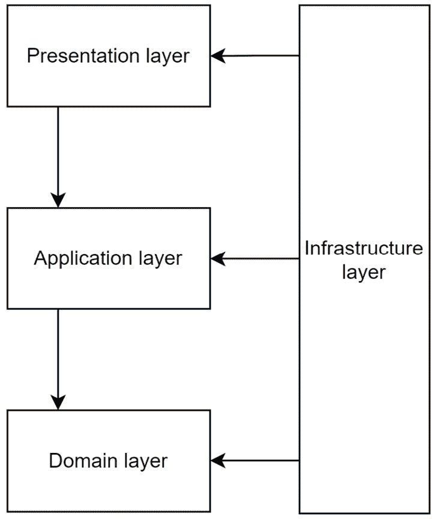
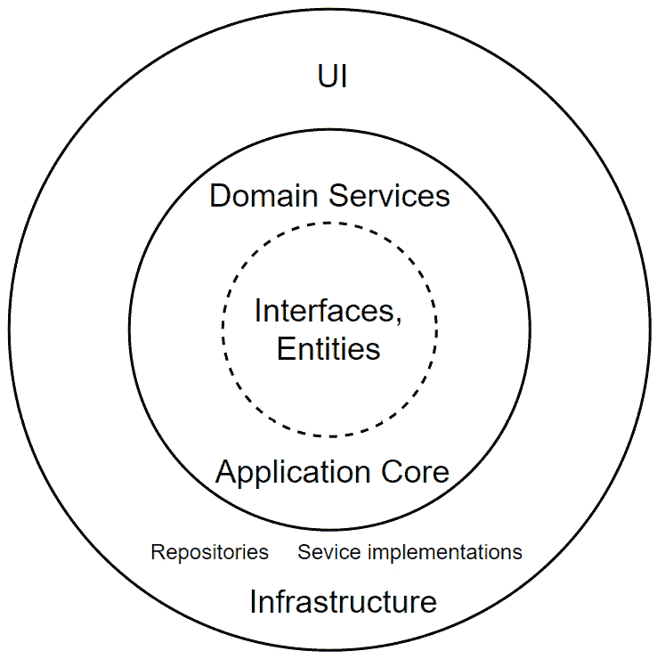
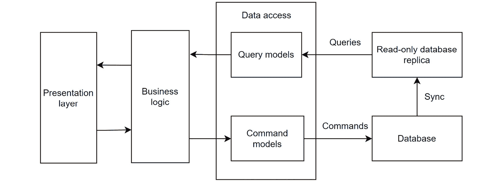
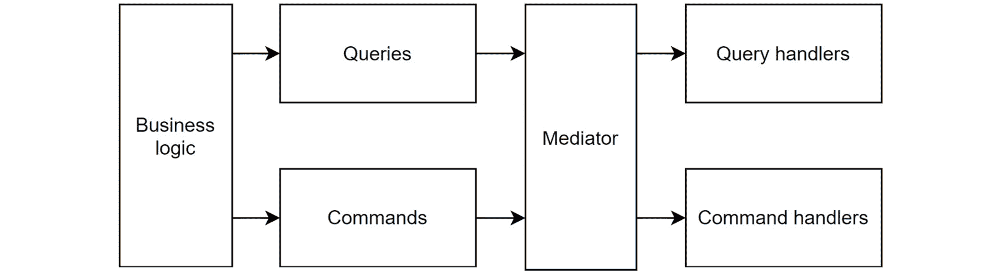
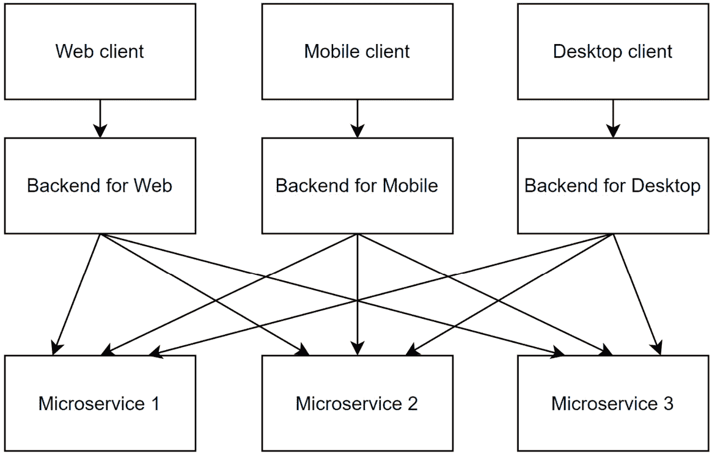

# 云原生模式

在前面的章节中，我们已经涵盖了使用 ASP.NET Core 开发 Web API 的各种基本技能。我们讨论了不同的 API 开发风格，如 REST、gRPC 和 GraphQL，以及如何使用 Entity Framework Core 实现数据访问层。我们还介绍了如何使用 ASP.NET Core Identity 框架来保护 Web API。此外，我们还学习了如何为 Web API 应用程序编写单元测试和集成测试，以及 API 开发中的常见实践，如测试、缓存、可观察性等。我们还讨论了如何通过 CI/CD 管道将容器化的 Web API 应用程序部署到云端。这些都是 Web API 开发的基本技能。

然而，这仅仅是旅程的开始。随着我们结束对使用 ASP.NET Core 开发 Web API 的基本概念探索，是时候踏上探索更高级主题的旅程了。在本章中，我们将从基础知识过渡到深入探讨对希望掌握 Web API 开发的开发者来说重要的主题。现在，让我们将我们的技能提升到下一个层次。

在本章中，我们将深入探讨以下主题：

+   领域驱动设计

+   清洁架构

+   微服务

+   Web API 设计模式

到本章结束时，你将对这些主题有一个高级的理解，并能够自行进一步探索。

# 技术要求

本章中的代码示例可以在[`github.com/PacktPublishing/Web-API-Development-with-ASP.NET-Core-8/tree/main/samples/chapter17`](https://github.com/PacktPublishing/Web-API-Development-with-ASP.NET-Core-8/tree/main/samples/chapter17)找到。

# 领域驱动设计

术语**领域驱动设计**，也称为**DDD**，由埃里克·埃文斯在他的 2003 年出版的书籍《领域驱动设计：软件核心的复杂性处理》中提出。DDD 包含了一系列原则和实践，这些原则和实践专注于领域模型和领域逻辑，帮助开发者管理复杂性并构建灵活且可维护的软件。DDD 不局限于任何特定的技术或框架。你可以在任何软件项目中使用它，包括 Web API 开发。

在埃里克·埃文斯的书中，他定义了 DDD 的三个重要原则：

+   关注核心领域和领域逻辑

+   以领域模型为基础进行复杂设计

+   与技术和领域专家合作，迭代地完善解决领域问题的模型

领域是软件系统所构建的主题区域。领域模型是领域概念模型，它结合了数据和行为。开发者根据领域专家的领域知识构建领域模型。领域模型是软件系统的核心，可以用来解决领域问题。

在以下子节中，我们将介绍 DDD 的基本概念以及如何将其应用于 Web API 开发。请注意，领域驱动设计是一个综合性的主题，无法在一个章节中涵盖。因此，子节的目的不是成为 DDD 的完整指南，而是提供一个 DDD 的高级概述并解释一些 DDD 的关键概念。如果您想了解更多关于 DDD 的信息，可以参考其他资源，例如埃里克·埃文斯的 DDD 书籍。

## 通用语言

DDD 的一个核心概念是，为了构建一个复杂业务领域的软件系统，我们需要构建通用语言和反映业务领域的领域模型。在领域驱动设计中，软件结构和代码，如类名、类方法等，应与业务领域相匹配。领域术语应嵌入到代码中。当开发者与领域专家交谈时，他们应使用相同的术语。例如，如果我们正在构建一个银行系统的 Web API，我们可能有一个`Banking`领域。当我们与领域专家讨论需求时，我们可能会听到诸如`Account`、`Transaction`、`Deposit`、`Withdrawal`等术语。在银行系统中，一个`Account`对象可以有不同的类型，例如`SavingAccount`、`LoanAccount`、`CreditCardAccount`等。一个`SavingAccount`可能有一个`Deposit()`方法和一个`Withdrawal()`方法。在系统的代码中，我们应该使用与领域专家相同的术语。

通用语言的运用是 DDD 的一个基本支柱。这种语言在领域专家、开发者和用户之间提供了共同的理解，使他们能够有效地沟通系统需求、设计和实现。通过在代码中自觉地使用通用语言，开发者可以构建一个准确反映业务领域的领域模型。如果没有这一点，代码可能会与业务领域脱节，变得难以管理。

## 边界上下文

在领域驱动设计（DDD）的领域中，边界上下文的概念至关重要。边界上下文是一个定义领域模型并作为软件系统内责任划分区域的边界。它就像一个语言领土，在这个领土中，特定的模型具有意义和相关性。通过封装对领域的独特理解，边界上下文促进了领域专家和开发者之间沟通的清晰性和精确性。

考虑这样一个场景，我们正在构建一个银行系统的 Web API。如果没有边界上下文，`Account`这个术语在`Banking`领域和客户关系管理（CRM）领域可能会有不同的解释。这种歧义可能导致混淆、期望不一致，最终导致对整个系统的理解碎片化。为了避免这种情况，应该使用边界上下文来明确定义领域模型的范围。

在许多情况下，领域由几个子领域组成，每个子领域可能指代业务领域的不同部分，从而创建不同的边界上下文。这些边界上下文通过程序接口相互通信，例如 Web API 和消息队列。

## DDD 层

DDD 解决方案通常表示为一个分层架构。每一层都有特定的职责。以下图显示了 DDD 应用的典型层：



图 17.1 – DDD 应用的典型层

在前面的图中，有四个层：

+   **表示层**：这一层负责向用户展示数据并接收用户输入。通常，这一层实现为一个用户界面，例如 Web 应用程序、移动应用程序或桌面应用程序。在这本书中，我们主要关注没有用户界面的 Web API 应用程序。在这种情况下，表示层可以是一个消费 Web API 的客户端应用程序。

+   **应用层**：这一层负责协调应用程序的活动。它从表示层接收用户输入，调用领域层执行业务逻辑，并将结果返回给表示层。在我们的案例中，应用层是 Web API 应用程序，它从客户端应用程序接收 HTTP 请求，调用领域层执行业务逻辑，并将结果返回给客户端应用程序。

+   `SavingAccount`类的`Deposit`方法，领域层中的逻辑并不知道如何将数据保存到数据库中。相反，它只关注使用抽象和接口的`Deposit`方法业务逻辑。这一层通常包含实体、值对象、聚合、存储库和领域服务。

+   **基础设施层**：这一层实现了应用程序的基础设施，例如数据访问、缓存、日志记录、消息传递等。它通常与外部系统作为依赖项集成，例如数据库、消息队列等。在我们的案例中，基础设施层可以包括数据访问层，该层使用 EF Core 来访问数据库。

DDD 主要关注领域和应用层。这是因为 UI 层和基础设施层不是 DDD 特有的，可以使用任何技术或框架来实现。例如，UI 层可以使用 **ASP.NET Core MVC**、**Blazor**、**React**、**WPF** 或任何其他平台上的 UI 框架来实现，而核心领域逻辑保持不变。同样，DDD 也不指定数据存储，可以是关系型数据库、NoSQL 数据库或任何其他数据存储。领域层使用仓储模式来访问数据，这与数据存储无关。另一个例子是日志机制，它也不是 DDD 特有的，因为领域层需要记录业务事件，但并不关心所使用的日志系统。

### DDD 构建模块

DDD 有一些构建模块，可以用来构建领域模型。这些构建模块包括实体、值对象、聚合、仓储和领域服务。在接下来的小节中，我们将介绍这些构建模块以及如何使用它们来构建领域模型：

#### 实体

如果你已经阅读了前面的章节，你可能对 **面向对象编程**（**OOP**）和 **对象关系映射**（**ORM**）有基本的了解。在 OOP 中，一个对象是一个类的实例。对象具有状态和行为。状态由对象属性表示，而行为由对象的方法表示。

在 DDD 中，实体类似于 OOP 中的对象，但不仅如此。**实体**是一个具有唯一标识符的对象，它由其标识符定义，而不是由其属性定义。通常，实体映射到数据库中的表。

实体的标识符通常由一个 ID 属性表示。ID 属性是不可变的，这意味着一旦设置，就不能更改。ID 属性可以是原始类型，如整数、字符串或 GUID。它也可以是复合键。

如果两个实体具有相同的属性但不同的标识符，它们被认为是不同的实体。

例如，在一个银行系统中，`Account` 是一个实体。它有一个唯一的标识符，可以用 `Id` 属性来表示。两个账户不能有相同的 `Id` 属性。

#### 值对象

**值对象**是 DDD 中的一种对象类型。它通过其属性来识别，而不是通过唯一的标识符。通常，值对象是不可变的，这意味着一旦创建，其属性就不能被更改。如果两个值对象具有相同的属性，它们被认为是相同的值对象。

例如，`Address` 是一个值对象。它通过其属性，如 `Street`、`City`、`State` 和 `ZipCode` 来识别。如果两个地址具有相同的 `Street`、`City`、`State` 和 `ZipCode`，它们被认为是相同的地址。

#### 聚合

**聚合**是一组关联的对象，包括实体和值对象，它们被视为数据变更的单位。聚合有一个根实体，这是唯一可以从聚合外部访问的对象。根实体负责维护聚合的一致性和完整性。需要注意的是，如果外部对象需要访问聚合内的对象或修改聚合内的对象，它们必须通过根实体进行。

例如，在一个发票系统中，`Invoice` 实体是一个聚合根。它包含一个 `InvoiceItem` 实体的列表，这些是发票的项目。要向发票中添加项目，外部对象必须通过 `Invoice` 实体，如下面的代码所示：

```cs
public class Invoice{
    public int Id { get; private set; } // Aggregate root Id, which should not be changed once it is set
    public DateTime Date { get; set; }
    public InvoiceStatus Status { get; private set; }
    public decimal Total { get; private set; } // The total amount of the invoice, which should be updated when an item is added or removed, but cannot be changed directly
    // Other properties
    public List<InvoiceItem> Items { get; private set; }
    public void AddItem(InvoiceItem item)
    {
        // Add the item to the invoice
        Items.Add(item);
        // Update the invoice total, etc.
        // ...
    }
    public void RemoveItem(InvoiceItem item)
    {
        // Remove the item from the invoice
        Items.Remove(item);
        // Update the invoice total, etc.
        // ...
    }
    public void Close()
    {
        // Close the invoice
        Status = InvoiceStatus.Closed;
    }
}
```

在前面的示例中，如果我们需要向发票中添加或删除项目，我们必须首先获取 `Invoice` 实体，然后调用 `AddItem()` 或 `RemoveItem()` 方法来添加或删除项目。我们不能直接从 `Items` 属性添加或删除项目，因为 `Items` 属性是私有的，并且只能从 `Invoice` 实体内部访问。这样，领域逻辑就被封装在 `Invoice` 实体内部，并维护了发票的一致性和完整性。同样，我们也不能直接更改 `Total` 属性。相反，`AddItem` 或 `RemoveItem` 方法可以更新 `Total` 属性。

#### 存储库

**存储库**是一个用于访问数据持久层的抽象层。它封装了数据访问逻辑，并提供了一种查询和保存数据的方式。为了确保领域层不依赖于任何特定的数据访问技术，存储库通常实现为一个接口。然后，基础设施层可以使用特定的数据访问技术，如 EF Core 或 Dapper，来实现存储库接口并访问不同的数据源，如关系数据库或 NoSQL 数据库。这种方式将领域层与数据访问技术和数据存储解耦。

以下代码展示了存储库接口的一个示例：

```cs
public interface IInvoiceRepository{
    Task<Invoice> GetByIdAsync(Guid id);
    Task<List<Invoice>> GetByCustomerIdAsync(Guid customerId);
    Task AddAsync(Invoice invoice);
    Task UpdateAsync(Invoice invoice);
    Task DeleteAsync(Invoice invoice);
}
```

我们在*第九章*中介绍了存储库模式。它不是一个特定的 DDD 模式。然而，它经常在 DDD 中用于解耦领域层和数据访问层。

#### 领域服务

**领域服务**是一种无状态服务，它包含不属于任何特定实体或值对象的领域逻辑。它通常用于实现涉及多个实体或值对象的复杂领域逻辑。为了访问数据持久层，领域服务可能依赖于一个或多个存储库。此外，它还可能依赖于其他外部服务。这些依赖通过依赖注入机制注入到领域服务中。

例如，在一个银行系统中，`TransferService` 领域服务负责将资金从一个账户转移到另一个账户的逻辑。为此，它依赖于 `AccountRepository` 来访问 `Account` 实体。此外，它可能需要使用外部服务在转账完成后向账户持有人发送通知。如果账户在不同的银行，`TransferService` 领域服务可能还需要使用外部服务在它们之间转账。

以下代码展示了领域服务的示例：

```cs
public class TransferService{
    private readonly IAccountRepository _accountRepository;
    private readonly ITransactionRepository _transactionRepository;
    private readonly INotificationService _notificationService;
    private readonly IBankTransferService _bankTransferService;
    public TransferService(IAccountRepository accountRepository, ITransactionRepository transactionRepository, INotificationService notificationService, IBankTransferService bankTransferService)
    {
        _accountRepository = accountRepository;
        _transactionRepository = transactionRepository;
        _notificationService = notificationService;
        _bankTransferService = bankTransferService;
    }
    public async Task TransferAsync(Guid fromAccountId, Guid toAccountId, decimal amount)
    {
        // Get the account from the repository
        var fromAccount = await _accountRepository.GetByIdAsync(fromAccountId);
        var toAccount = await _accountRepository.GetByIdAsync(toAccountId);
        // Transfer money between the accounts
        fromAccount.Withdraw(amount);
        toAccount.Deposit(amount);
        // Save the changes to the repository
        await _accountRepository.UpdateAsync(fromAccount);
        await _accountRepository.UpdateAsync(toAccount);
        // Create transaction records
        await _transactionRepository.AddAsync(new Transaction
        {
            FromAccountId = fromAccountId,
            ToAccountId = toAccountId,
            Amount = amount,
            Date = DateTime.UtcNow
        });
        await _transactionRepository.AddAsync(new Transaction
        {
            FromAccountId = toAccountId,
            ToAccountId = fromAccountId,
            Amount = -amount,
            Date = DateTime.UtcNow
        });
        // Send a notification to the account holder
        await _notificationService.SendAsync(fromAccount.HolderId, $"You have transferred {amount}to {toAccount.HolderId}");
        await _notificationService.SendAsync(toAccount.HolderId, $"You have received {amount} from{fromAccount.HolderId}");
        // Transfer money between the banks
        // await _bankTransferService.TransferAsync(fromAccount.BankId, toAccount.BankId, amount);
    }
}
```

上述代码展示了 `TransferService` 领域服务。它有四个依赖项：`IAccountRepository`、`ITransactionRepository`、`INotificationService` 和 `IBankTransferService`。`TransferAsync` 方法用于将资金从一个账户转移到另一个账户。它首先从 `IAccountRepository` 获取账户信息，然后在这些账户之间进行转账。之后，它将更改保存到 `IAccountRepository` 并在 `ITransactionRepository` 中创建交易记录。最后，它使用 `INotificationService` 向账户持有人发送通知。

重要注意事项

上述示例为了演示目的而简化了。实际在两个账户之间转账的实现要复杂得多。例如，可能需要检查账户余额、检查每日转账限额等。它还可能需要在不同的银行之间转账，这涉及到处理转账过程中可能发生的任何错误的复杂逻辑。如果发生任何错误，可能需要回滚交易。这是一个典型的实现复杂领域逻辑的领域服务示例。

#### 工作单元

在上述示例中，当在两个账户之间转账时，涉及多个步骤。如果在过程中发生错误怎么办？为了防止在两个账户之间转账过程中任何资金丢失，有必要将这个过程包裹在一个事务中。这将确保在发生错误的情况下，事务将被回滚，资金将保持安全。例如，如果 `TransferAsync()` 方法在从 `fromAccount` 提取资金后但在将其存入 `toAccount` 之前抛出异常，则事务将被回滚，资金不会丢失。

在数据库的上下文中，术语 **transaction** 经常被使用。这种交易在 DDD 中被称为 **工作单元**。工作单元是一系列必须作为一个整体执行的操作。工作单元中的所有步骤必须同时成功或失败。如果任何步骤失败，整个工作单元必须回滚。这可以防止数据处于不一致的状态。

工作单元可以以多种方式实现。在许多场景中，工作单元被实现为一个数据库事务。另一个例子是消息队列。当接收到消息时，它作为一个工作单元进行处理。如果处理成功，则从队列中删除消息。否则，消息将保留在队列中，将在稍后时间再次进行处理。

#### 应用服务

应用服务负责管理应用过程。它从表示层接收用户输入，调用领域服务执行业务逻辑，并将结果返回给表示层。在一个 Web API 应用程序中，应用服务可以作为一个 Web API 控制器实现，或者作为一个由 Web API 控制器调用的独立服务。

应用服务应该是薄的，并将大部分工作委托给领域服务。通常，应用服务使用`AutoMapper`。例如，一个`InvoiceDto`类可能包含发票的属性，如`Id`、`Date`、`Status`、`Total`等。它没有任何添加或删除发票项目或关闭发票的方法。它纯粹是一个数据容器。如果`Invoice`实体的某个属性在表示层中不需要，则不应将其包含在`InvoiceDto`中。

当表示层需要创建或更新实体时，它可以向应用服务发送一个 DTO。然后，应用服务将 DTO 映射到实体，并调用领域服务来执行必要的业务逻辑。最后，应用服务将实体映射回 DTO，并将其返回给表示层。

下面是一个应用服务的简单示例：

```cs
[Route("api/[controller]")][ApiController]
public class InvoicesController : ControllerBase
{
    private readonly IInvoiceService _invoiceService;
    public InvoicesController(IInvoiceService invoiceService)
    {
        _invoiceService = invoiceService;
    }
    [HttpPost]
    public async Task<IActionResult> CreateAsync(InvoiceDto invoiceDto)
    {
        var invoice = await _invoiceService.CreateAsync(invoiceDto);
        return Ok(invoice);
    }
    // Omitted other methods
}
public interface IInvoiceService
{
    Task<InvoiceDto> CreateAsync(InvoiceDto invoiceDto);
    // Omitted other methods
}
public class InvoiceService : IInvoiceService
{
    private readonly IInvoiceRepository _invoiceRepository;
    private readonly IMapper _mapper;
    public InvoiceService(IInvoiceRepository invoiceRepository, IMapper mapper)
    {
        _invoiceRepository = invoiceRepository;
        _mapper = mapper;
    }
    public async Task<InvoiceDto> CreateAsync(InvoiceDto invoiceDto)
    {
        var invoice = _mapper.Map<Invoice>(invoiceDto);
        await _invoiceRepository.AddAsync(invoice);
        return _mapper.Map<InvoiceDto>(invoice);
    }
    // Omitted other methods
}
```

在前面的示例中，`IInvoiceService`接口定义了应用服务的方法。`InvoiceService`类实现了`IInvoiceService`接口。它有两个依赖项：`IInvoiceRepository`和`IMapper`。`IInvoiceRepository`用于访问`Invoice`实体，而`IMapper`用于将`InvoiceDto`映射到`Invoice`实体，反之亦然。`CreateAsync()`方法通过控制器从表示层接收`InvoiceDto`，将其映射到`Invoice`实体，然后调用`IInvoiceRepository`的`AddAsync()`方法将`Invoice`实体添加到数据库中。最后，它将`Invoice`实体映射回`InvoiceDto`，并将其返回给表示层。

重要注意事项

在前面的示例中，没有领域服务。这是因为创建发票的逻辑很简单。在这种情况下，应用服务层可以直接调用存储库将发票添加到数据库中。然而，如果逻辑更复杂，涉及多个实体或聚合，最好使用领域服务来实现逻辑。

DDD 关注的是如何构建一个反映业务领域的领域模型，以及如何维护领域模型的一致性和完整性。它不是用来生成报告或用户界面的。报告可能需要复杂的查询，这些查询不适合领域模型。在这种情况下，你可能需要使用单独的报表数据库或报表服务。同样，用户界面可能需要以不同于领域模型的方式显示数据。然而，无论数据如何显示，领域模型都应该保持不变。

DDD 可以帮助你管理复杂性并构建一个灵活且可维护的软件系统。但请记住，DDD 不是万能的。通常，DDD 用于复杂的企业领域。开发者必须实现大量的隔离、抽象和封装来维护模型。这可能会导致大量的努力和复杂性。如果你的项目很简单，DDD 可能有点过度。在这种情况下，一个简单的分层架构可能是一个更好的选择。

# 清洁架构

清洁架构是一种由罗伯特·C·马丁（也称为 Uncle Bob）在其 2017 年出版的书籍《Clean Architecture: A Craftsman’s Guide to Software Structure and Design》中提出的软件架构。它是一种关注关注点分离的分层架构。与 DDD 类似，清洁架构不是一个特定的技术或框架。它是一套可以应用于任何软件项目的原则和实践。

清洁架构也被称为洋葱架构，因为层是以环形排列的，就像洋葱一样。以下图表显示了清洁架构的典型层：



图 17.2 – 清洁架构的典型层

上述图表说明了从外层到内层的依赖关系。在架构的中心是应用核心层，它包含业务逻辑的实体和接口。此外，这一层包含实现接口的领域服务。它不依赖于任何其他层。围绕应用核心层的是基础设施层和 UI 层，它们都依赖于应用核心层。这种架构确保应用核心层不知道数据是如何存储或呈现给用户的。此外，基础设施层和 UI 层可以被替换，而不会影响应用核心层。

清洁架构与领域驱动设计（DDD）有一些相似之处。它们都是关注关注点分离的分层架构。它们都使用依赖注入（或控制反转）来解耦层。DDD 关注领域层，而清洁架构优先考虑将核心业务逻辑从外部依赖中隔离的重要性。关注点分离允许在不影响核心业务逻辑的情况下修改外部组件，使其更容易适应不断变化的需求。

领域驱动设计（DDD）和清洁架构相互补充，可以一起使用。虽然 DDD 指导如何构建领域模型和理解业务领域，但清洁架构提供了一个组织和管理代码库的蓝图。结合这些方法可以导致灵活且易于维护的软件系统。

领域驱动设计（DDD）和清洁架构都是关注业务领域的分层架构。接下来，让我们讨论整个软件系统的架构。在下一节中，我们将介绍微服务，这是一种构建可扩展和可维护软件系统的流行架构。

# 微服务

许多传统应用程序都是作为单体构建的。单体应用程序作为一个单一单元部署在单个服务器上。单体应用程序易于开发和部署。然而，随着应用程序的增长，维护和扩展变得越来越困难。应用程序中的微小更改可能需要整个应用程序被重建、重新测试和重新部署。此外，如果应用程序的某一部分需要扩展，整个应用程序都必须进行扩展，这并不经济。此外，如果应用程序的某一部分失败，可能会影响整个应用程序。

这就是微服务发挥作用的地方。微服务是一个小型、独立的负责特定业务领域的服务。每个微服务都有自己的数据库和依赖。它可以独立开发、部署和扩展。这些微服务通过程序接口（如 Web API 或消息队列）相互通信。

微服务提供了几个好处：

+   **单一职责**：每个微服务负责特定的业务领域。它有自己的依赖和数据库。

+   **弹性和容错性**：微服务被设计成具有弹性和容错性。如果一个微服务失败，它不会影响其他微服务。

+   **可扩展性**：微服务可以根据需求独立扩展。如果一个微服务有很高的负载，我们可以增加该微服务的实例数量来处理负载。

+   **技术多样性**：只要微服务通过标准接口（如 HTTP API 或 gRPC）相互通信，每个微服务都可以使用不同的技术和框架构建。

+   **CI/CD**：微服务通过允许独立构建、测试和部署单个微服务，简化了 CI/CD 流程，从而最小化对整个系统的干扰。

微服务不是一个新概念；它已经存在了几十年。然而，近年来它变得更加流行，尤其是在云计算兴起之后。云计算为微服务提供了可扩展且成本效益高的基础设施。此外，容器技术，如 Docker 的出现，使得构建和部署微服务变得更加容易。通过使用容器和容器编排工具，如**Kubernetes**，开发者可以轻松地将微服务构建和部署到云端。编排工具可以根据工作负载自动扩展微服务。这使得构建可扩展且成本效益高的软件系统变得更加容易。

微服务不必局限于其他架构。实际上，它们可以与其他架构结合使用，以创建更健壮和高效的系统。您可以使用层，如 DDD 和清洁架构，来构建每个微服务。通过利用两种架构的优点，组织可以创建一个强大且可靠的系统，以满足其需求。这种方法对于需要高度可扩展性和灵活性的组织尤其有益。

例如，在一个在线购物系统中，我们可能会有以下微服务：

+   **产品服务**：这项服务负责管理产品，例如添加新产品、更新产品、删除产品等。它有自己的数据库来存储产品数据。

+   **订单服务**：这项服务负责管理订单，例如创建新订单、更新订单、删除订单等。它也有自己的数据库来存储订单数据。

+   **支付服务**：这项服务负责处理支付，例如信用卡支付、PayPal 支付等。它有自己的数据库来存储支付数据。它可能还需要与外部支付服务集成，例如 PayPal、Stripe、在线银行服务等。

+   **物流服务**：这项服务负责运输产品，例如将产品运送给客户并跟踪运输。它需要与外部物流服务集成，例如联邦快递、联合包裹服务公司等。

+   **通知服务**：这项服务负责向客户发送通知，例如发送电子邮件或短信通知等。它需要与外部通知服务集成，例如 SendGrid、Twilio 等。

+   **身份服务**：这项服务负责管理用户，例如创建新用户、更新用户、删除用户等。它可能提供第三方身份验证，例如来自微软、谷歌、Facebook 等。

+   **网关服务**：这项服务负责将请求路由到适当的微服务。它是系统的入口点。它没有自己的数据库。相反，它根据请求 URL 将请求路由到适当的微服务。它还可以实现速率限制、身份验证、授权等功能。

+   **客户端应用程序**：这些是消费微服务的客户端应用程序。它们可以是 Web 应用程序、移动应用程序或桌面应用程序。

每个服务负责特定的业务领域，并且有自己的依赖关系。开发者可以使用不同的技术和框架来构建服务，因为它们通过标准 HTTP API 或 gRPC 进行通信。如果一个服务需要扩展，它可以独立扩展。例如，如果`Order`服务有很高的负载，我们可以增加`Order`服务的实例数量来处理负载。这比扩展整个应用程序要经济得多。此外，如果一个服务失败，它不会影响其他服务。例如，如果`Payment`服务失败，`Order`服务和`Product`服务仍然可以工作。它仍然可以接收订单并允许用户查看产品。当`Payment`服务恢复在线时，它可以处理尚未处理的订单。

微服务在近年来变得越来越流行。然而，它增加了系统的复杂性。在采用微服务之前，你应该仔细考虑它是否适合你的项目。考虑以下微服务面临的挑战：

+   **分布式系统复杂性**：微服务是分布式系统。它们比单体应用程序更复杂。例如，如果一个服务需要调用另一个服务，你需要考虑如何处理服务之间的通信以及如何维护数据的一致性。此外，你还需要处理网络故障、部分故障、级联故障等问题。

+   **数据管理**：每个微服务都有自己的数据库。这使得维护数据一致性变得困难，因为不支持跨越多个微服务的交易。要从多个微服务查询数据，必须实现分布式查询机制，这可能是一个复杂的过程。

+   **服务发现**：在微服务架构中，每个服务都有自己的 URL。它们需要知道其他服务的 URL 才能与之通信。这被称为服务发现。有许多方法可以实现服务发现，例如使用服务注册表、使用服务网格等。容器编排工具，如 Kubernetes，也可以用于实现服务发现，因为它们可以维护微服务的内部服务 URL。

+   **测试**：测试微服务架构比测试单体应用程序更复杂。除了单元测试、集成测试和端到端测试之外，你还需要测试微服务之间的通信。

+   **监控**：监控微服务架构需要一个精心设计监控系统。你需要监控每个微服务的健康状况以及微服务之间的通信。跟踪机制可以用来跟踪微服务之间的请求。

总结来说，如果你的应用程序很简单，不要通过使用微服务而使其过于复杂。随着应用程序的增长，你可以考虑逐步将其重构为微服务架构。

接下来，让我们讨论一些 Web API 应用程序的常见设计模式。

# Web API 设计模式

为了构建一个灵活、可扩展且易于维护的 Web API 应用程序，利用成熟的设计模式是至关重要的。这些模式解决了在 Web API 开发中遇到的常见挑战，并提供了有效的解决方案。Microsoft 的全面指南提供了对这些设计模式的见解，你可以在以下链接中找到更多详细信息：[`learn.microsoft.com/en-us/azure/architecture/patterns/`](https://learn.microsoft.com/en-us/azure/architecture/patterns/)。

这些设计模式不仅限于 ASP.NET Core；它们可以应用于任何 Web API，无论其底层技术或框架。在接下来的子章节中，我们将介绍一些关键的设计模式，概述它们解决的问题、实现细节以及使用时的考虑因素。这些模式涵盖了解决方案设计和实现、消息传递、可靠性等方面，包括以下内容：

+   **命令查询责任** **分离**（**CQRS**）

+   **发布/订阅**（**pub/sub**）

+   **前端后端**（**BFF**）

+   超时

+   速率限制

+   重试

+   电路断路器

## CQRS

CQRS 是解决扩展和优化读取和写入操作挑战的有力工具。通过分离处理命令（写入）和查询（读取）的责任，CQRS 使每个操作可以独立优化，从而提高了可扩展性和效率。

传统上，应用程序的数据模型被设计为支持读取和写入操作。然而，读取和写入操作的要求往往不同。读取操作可能执行不同的查询，导致不同的 DTO 模型。写入操作可能需要更新数据库中的多个表。这可能导致一个复杂且难以维护的数据模型。此外，读取操作和写入操作可能具有不同的性能要求。

CQRS 将应用程序的数据模型划分为用于读取和写入的独立模型。这允许使用针对每个操作特定需求定制的不同存储机制和优化。CQRS 使用查询来读取数据，使用命令来更新数据。查询不会改变系统的状态，而命令则会。

为了更好地分离读取和写入操作，CQRS 还可以使用不同的数据存储进行读取和写入。例如，读取存储可以使用多个只读副本的写入存储，这可以提高读取操作的性能。副本必须与写入存储保持同步，这可以通过使用内置的数据库复制功能或事件驱动机制来实现。

以下图展示了典型的 CQRS 架构：



图 17.3 – 典型的 CQRS 架构

要在 ASP.NET Core web API 应用程序中实现 CQRS，您可以使用 `MediatR` 库，这是一个 .NET 中的简单中介者实现。这个库是一个简单的中介者实现，它允许使用中介者模式。中介者模式是一种行为设计模式，它允许对象在不显式引用彼此的情况下进行交互。相反，它们通过中介者进行通信，解耦了对象并提供了更大的灵活性。

以下图展示了使用 `MediatR` 库的典型 CQRS 架构：



图 17.4 – 使用 MediatR 库的典型 CQRS 架构

在前面的图中，中介者负责从业务逻辑层接收命令和查询，然后调用相应的处理器来执行命令和查询。然后，处理器可以使用存储库来访问数据持久层进行读取和写入数据。业务逻辑层不需要知道中介者如何调用处理器。它只需要将命令和查询发送给中介者。这种模式解耦了业务逻辑层和数据持久层。这种模式也使得向多个处理器发送命令和查询变得更加容易。例如，如果我们有一个向客户发送电子邮件通知的命令，并且需要添加文本消息通知，我们只需简单地添加一个新的处理器来处理该命令，而无需更改客户端代码。

您可以在源代码的 `/chapter17/CqrsDemo` 文件夹中找到一个示例应用程序，该应用程序演示了如何在 ASP.NET Core web API 应用程序中实现 CQRS。

重要提示

示例项目有一个单独的基础设施项目，通过遵循清洁架构来实现数据持久层。当您运行 `dotnet ef` 命令来添加迁移或更新数据库时，您需要指定启动项目。例如，要添加迁移，您需要导航到 `CqrsDemo.Infrastructure` 项目并运行以下命令：

**dotnet ef migrations add InitialCreate --****startup-project ../CqrsDemo.WebApi**

要了解更多关于 `dotnet ef` 命令的信息，您可以参考以下链接：[`learn.microsoft.com/en-us/ef/core/cli/dotnet#target-project-and-startup-project`](https://learn.microsoft.com/en-us/ef/core/cli/dotnet#target-project-and-startup-project)。

要进行下一步，您可以使用源代码 `/chapter17/CqrsDemo/start` 文件夹中的项目。此项目包含一个基本的 ASP.NET Core Web API 应用程序，用于管理发票。它包含以下项目：

+   `CqrsDemo.WebApi`：这是 ASP.NET Core Web API 项目。它包含控制器和应用程序配置。

+   `CqrsDemo.Core`：这是包含域模型、仓储接口、服务等的核心项目。

+   `CqrsDemo.Infrastructure`：此项目包含仓储的实现。

### 实现模型映射

在核心项目中，请注意服务层使用 DTO，如下所示：

```cs
public interface IInvoiceService{
    Task<InvoiceDto?> GetAsync(Guid id, CancellationToken cancellationToken = default);
    Task<List<InvoiceWithoutItemsDto>> GetPagedListAsync(int pageIndex, int pageSize, CancellationToken cancellationToken = default);
    Task<InvoiceDto> AddAsync(CreateOrUpdateInvoiceDto invoice, CancellationToken cancellationToken = default);
    Task<InvoiceDto?> UpdateAsync(Guid id, CreateOrUpdateInvoiceDto invoice, CancellationToken cancellationToken = default);
    // Omitted
}
```

这些方法使用不同的 DTO 类型进行读写。为了将实体映射到 DTO 以及反之亦然，我们可以使用 `AutoMapper`，这是一个流行的 `对象到对象映射器` 库。以下代码展示了如何在 `InvoiceProfile.cs` 文件中配置 `AutoMapper`：

```cs
public InvoiceProfile(){
    CreateMap<CreateOrUpdateInvoiceItemDto, InvoiceItem>();
    CreateMap<InvoiceItem, InvoiceItemDto>();
    CreateMap<CreateOrUpdateInvoiceDto, Invoice>();
    CreateMap<Invoice, InvoiceWithoutItemsDto>();
    CreateMap<Invoice, InvoiceDto>();
}
```

然后，我们可以在 `Program.cs` 文件中注册 `AutoMapper`，如下所示：

```cs
builder.Services.AddAutoMapper(typeof(InvoiceProfile));
```

要使用映射器，只需将 `IMapper` 接口注入到服务层，如下所示：

```cs
public class InvoiceService(IInvoiceRepository invoiceRepository, IMapper mapper) : IInvoiceService{
    public async Task<InvoiceDto?> GetAsync(Guid id, CancellationToken cancellationToken = default)
    {
        var invoice = await invoiceRepository.GetAsync(id, cancellationToken);
        return invoice == null ? null : mapper.Map<InvoiceDto>(invoice);
    }
    // Omitted
}
```

使用 `AutoMapper` 可以在将实体映射到 DTO 以及反之亦然时节省我们大量时间。接下来，我们可以使用 `MediatR` 库实现查询和命令。

### 实现查询

接下来，我们将使用 `MediatR` 库实现 CQRS 模式。按照以下步骤操作：

1.  首先，我们需要安装 `MediatR` NuGet 包。在终端窗口中运行以下命令以安装 `MediatR` 包：

    ```cs
    MediatR package to the CqrsDemo.Core project and the CqrsDemo.WebApi project.`MediatR` provides the following interfaces:*   `IMediator`: This is the main interface of the `MediatR` library. It can be used to send requests to the handlers. It can also be used to publish events to multiple handlers.*   `ISender`: This interface is used to send a request through the mediator pipeline to be handled by a single handler.*   `IPublisher`: This interface is used to publish a notification or event through the mediator pipeline to be handled by multiple handlers.The `IMediator` interface can be used to send all requests or events. For a clearer indication of the purpose of the request or event, it is recommended to use the `ISender` interface for requests handled by a single handler and the `IPublisher` interface for notifications or events that require multiple handlers.
    ```

1.  在 `CqrsDemo.Core` 项目中创建一个 `Queries` 文件夹。然后，在 `Queries` 文件夹中创建一个 `GetInvoiceByIdQuery.cs` 文件，并包含以下代码：

    ```cs
    public class GetInvoiceByIdQuery(Guid id) : IRequest<InvoiceDto?>{    public Guid Id { get; set; } = id;}
    ```

    以下代码定义了一个 `GetInvoiceByIdQuery` 类，该类实现了 `IRequest<InvoiceDto?>` 接口。此接口用于指示这是一个返回 `InvoiceDto` 对象的查询。`Id` 属性用于指定要检索的发票的 ID。

1.  类似地，在 `Queries` 文件夹中创建一个 `GetInvoiceListQuery.cs` 文件，并包含以下代码：

    ```cs
    public class GetInvoiceListQuery(int pageIndex, int pageSize) : IRequest<List<InvoiceWithoutItemsDto>>{    public int PageIndex { get; set; } = pageIndex;    public int PageSize { get; set; } = pageSize;}
    ```

    注意，`GetInvoiceListQuery`查询返回一个`InvoiceWithoutItemsDto`对象列表。这是因为我们在列出发票时不需要发票项。这是一个示例，展示了如何使用不同的 DTO 进行读取和写入。

1.  接下来，在`Queries`文件夹中创建一个`Handlers`文件夹。然后，在`Handlers`文件夹中创建一个`GetInvoiceByIdQueryHandler.cs`文件，并包含以下代码：

    ```cs
    public class GetInvoiceByIdQueryHandler(IInvoiceService invoiceService) : IRequestHandler<GetInvoiceByIdQuery, InvoiceDto?>{    public Task<InvoiceDto?> Handle(GetInvoiceByIdQuery request, CancellationToken cancellationToken)    {        return invoiceService.GetAsync(request.Id, cancellationToken);    }}
    ```

    `GetInvoiceByIdQueryHandler`类实现了`IRequestHandler<GetInvoiceByIdQuery, InvoiceDto?>`接口。该接口用于指示此处理程序处理`GetInvoiceByIdQuery`查询并返回一个`InvoiceDto`对象。`Handle()`方法接收`GetInvoiceByIdQuery`查询并调用`IInvoiceService`的`GetAsync()`方法通过 ID 获取发票。

    `IInvoiceService`接口可以注入到处理程序中。或者，您可以选择直接将`IInvoiceRepository`接口注入到处理程序中并在那里实现业务逻辑。最终，这是您的决定在哪里存储逻辑。重要的是要记住，目标是分离业务逻辑和数据持久层。

1.  同样，在`Handlers`文件夹中创建一个`GetInvoiceListQueryHandler.cs`文件，并包含以下代码：

    ```cs
    public class GetInvoiceListQueryHandler(IInvoiceService invoiceService) : IRequestHandler<GetInvoiceListQuery, List<InvoiceWithoutItemsDto>>{    public Task<List<InvoiceWithoutItemsDto>> Handle(GetInvoiceListQuery request, CancellationToken cancellationToken)    {        return invoiceService.GetPagedListAsync(request.PageIndex, request.PageSize, cancellationToken);    }}
    ```

    现在，我们有两个处理程序来处理`GetInvoiceByIdQuery`查询和`GetInvoiceListQuery`查询。接下来，我们需要更新控制器以使用`MediatR`库。

1.  使用以下代码更新`CqrsDemo.WebApi`项目中的`InvoicesController.cs`文件：

    ```cs
    [Route("api/[controller]")][ApiController]public class InvoicesController(IInvoiceService invoiceService, ISender mediatorSender) : ControllerBase{    // Omitted}
    ```

    前面的代码将`ISender()`接口注入到控制器中。您也可以注入`IMediator`接口。在这个例子中，我们将使用`ISender`接口向处理程序发送请求。

1.  使用以下代码更新`InvoicesController`类的`GetInvoice()`方法：

    ```cs
    [HttpGet("{id}")]public async Task<ActionResult<InvoiceDto>> GetInvoice(Guid id){    var invoice = await mediatorSender.Send(new GetInvoiceByIdQuery(id));    return invoice == null ? NotFound() : Ok(invoice);}
    ```

    前面的代码创建了一个包含`id`参数的`GetInvoiceByIdQuery`对象。`ISender`接口将调用`GetInvoiceByIdQueryHandler`处理程序来处理查询。然后，处理程序将调用`IInvoiceService`的`GetAsync`方法通过 ID 获取发票。因此，控制器与服务层解耦。

1.  同样，使用以下代码更新`InvoicesController`类的`GetInvoices`方法：

    ```cs
    [HttpGet][Route("paged")]public async Task<ActionResultIEnumerableInvoiceWithoutItemsDto>>> GetInvoices(int pageIndex, int pageSize){    var invoices = await mediatorSender.Send(new GetInvoiceListQuery(pageIndex, pageSize));    return Ok(invoices);}
    ```

    前面的代码创建了一个包含`pageIndex`和`pageSize`参数的`GetInvoiceListQuery`对象。`ISender`接口将调用`GetInvoiceListQueryHandler`处理程序来处理查询。然后，处理程序将调用`IInvoiceService`的`GetPagedListAsync()`方法来获取发票列表。

1.  接下来，我们需要在`Program.cs`文件中按照以下方式注册`MediatR`：

    ```cs
    builder.Services.AddMediatR(cfg => cfg.RegisterServicesFromAssembly(typeof(GetInvoiceByIdQueryHandler).Assembly));
    ```

    前面的代码在`CqrsDemo.Core`项目中注册了所有三个`MediatR`接口和处理程序。

现在，我们使用查询来实现读操作。您可以运行应用程序并测试端点，例如 `/api/invoices/{id}` 和 `/api/invoices/paged`。这些端点应该像以前一样工作。

### 实现命令

接下来，我们将使用命令来实现写操作。按照以下步骤进行：

1.  在 `CqrsDemo.Core` 项目中创建一个 `Commands` 文件夹。然后，在 `Commands` 文件夹中创建一个 `CreateInvoiceCommand.cs` 文件，并使用以下代码：

    ```cs
    public class CreateInvoiceCommand(CreateOrUpdateInvoiceDto invoice) : IRequest<InvoiceDto>{    public CreateOrUpdateInvoiceDto Invoice { get; set; } = invoice;}
    ```

    前面的代码定义了一个实现 `IRequest<InvoiceDto>` 接口的 `CreateInvoiceCommand` 类。

1.  在 `Commands` 文件夹中创建一个 `Handlers` 文件夹。然后，在 `Handlers` 文件夹中创建一个 `CreateInvoiceCommandHandler.cs` 文件，并使用以下代码：

    ```cs
    public class CreateInvoiceCommandHandler(IInvoiceService invoiceService) : IRequestHandler<CreateInvoiceCommand, InvoiceDto>{    public Task<InvoiceDto> Handle(CreateInvoiceCommand request, CancellationToken cancellationToken)    {        return invoiceService.AddAsync(request.Invoice, cancellationToken);    }}
    ```

1.  使用以下代码更新 `InvoicesController` 类：

    ```cs
    [HttpPost]public async Task<ActionResult<InvoiceDto>> CreateInvoice(CreateOrUpdateInvoiceDto invoice){    var result = await mediatorSender.Send(new CreateInvoiceCommand(invoice));    return CreatedAtAction(nameof(GetInvoice), new { id = result.Id }, result);}
    ```

    现在，运行应用程序并向 `/api/invoices` 端点发送 `POST` 请求。您应该能够创建一个新的发票。

    在这个例子中，我们将不会实现所有命令和查询。您可以作为一个练习来处理剩余的命令和查询。

`MediatR` 使得在 ASP.NET Core Web API 应用程序中实现 CQRS 模式变得容易。然而，实现 CQRS 的方法不止一种。您也可以在不使用 `MediatR` 库的情况下实现 CQRS。

使用 `MediatR` 库的一个好处是它可以向多个处理器发送请求。例如，我们可以创建一个命令来向客户发送电子邮件通知和短信通知。然后，我们可以创建两个处理器来处理该命令。按照以下步骤实现此功能：

1.  如下所示，将两个属性添加到发票模型中：

    ```cs
    public string ContactEmail { get; set; } = string.Empty;public string ContactPhone { get; set; } = string.Empty;
    ```

    您需要更新 `Invoice` 类、`CreateOrUpdateInvoiceDto` 类、`InvoiceWithoutItemsDto` 类和 `InvoiceDto` 类。您还可以定义一个 `Contact` 类以实现更好的封装。

1.  添加数据库迁移并更新数据库。您可能还需要更新种子数据。请注意，在运行 `dotnet ef` 命令时需要指定启动项目。例如，要添加迁移，您需要导航到 `CqrsDemo.Infrastructure` 项目并运行以下命令：

    ```cs
    dotnet ef migrations add AddContactInfo --startup-project ../CqrsDemo.WebApi
    ```

1.  然后，更新数据库：

    ```cs
    dotnet ef database update --startup-project ../CqrsDemo.WebApi
    ```

1.  在 `CqrsDemo.Core` 项目中创建一个 `Notification` 文件夹。然后，在 `Notification` 文件夹中创建一个 `SendInvoiceNotification` 类，并使用以下代码：

    ```cs
    public class SendInvoiceNotification(Guid invoiceId) : INotification{    public Guid InvoiceId { get; set; } = invoiceId;}
    ```

    前面的代码定义了一个实现 `INotification` 接口的 `SendInvoiceNotification` 类。此接口用于指示这是一个不返回任何结果的通知。

1.  在 `Notification` 文件夹中创建一个 `Handlers` 文件夹。然后，在 `Handlers` 文件夹中创建一个 `SendInvoiceEmailNotificationHandler` 类，并使用以下代码：

    ```cs
    public class SendInvoiceEmailNotificationHandler(IInvoiceService invoiceService) : INotificationHandler<SendInvoiceNotification>{    public async Task Handle(SendInvoiceNotification notification, CancellationToken cancellationToken)    {        // Send email notification        var invoice = await invoiceService.GetAsync(notification.InvoiceId, cancellationToken);        if (invoice is null || string.IsNullOrWhiteSpace(invoice.ContactEmail))        {            return;        }        // Send email notification        Console.WriteLine($"Sending email notification to {invoice.ContactEmail} for invoice {invoice.Id}");    }}
    ```

    在前面的代码中，我们使用 `IInvocieService` 通过 ID 获取发票。然后，我们检查发票是否存在以及是否指定了联系邮箱。如果是这样，我们将向客户发送电子邮件通知。为了简单起见，我们只是在控制台打印一条消息。

1.  类似地，在`Handlers`文件夹中创建一个名为`SendInvoiceTextMessageNotificationHandler`的类，代码如下：

    ```cs
    public class SendInvoiceTextMessageNotificationHandler(IInvoiceService invoiceService) : INotificationHandler<SendInvoiceNotification>{    public async Task Handle(SendInvoiceNotification notification, CancellationToken cancellationToken)    {        // Send text message notification        var invoice = await invoiceService.GetAsync(notification.InvoiceId, cancellationToken);        if (invoice is null || string.IsNullOrWhiteSpace(invoice.ContactPhone))        {            return;        }        // Send text message notification        Console.WriteLine($"Sending text message notification to {invoice.ContactPhone} for invoice {invoice.Id}");    }}
    ```

    前面的代码与之前的处理器类似。它向客户发送短信通知。

1.  将`IPublisher`接口注入到`InvoicesController`类中，如下所示：

    ```cs
    public class InvoicesController(IInvoiceService invoiceService, ISender mediatorSender, IPublisher mediatorPublisher) : ControllerBase{    // Omitted}
    ```

    `IPublisher`接口用于通过中介管道发布通知或事件，以便由多个处理器处理。

1.  在`InvoicesController`类中更新`CreateInvoice`方法，代码如下：

    ```cs
    [HttpPost]public async Task<ActionResult<InvoiceDto>> CreateInvoice(CreateOrUpdateInvoiceDto invoiceDto){    //var invoice = await invoiceService.AddAsync(invoiceDto);    var invoice = await mediatorSender.Send(new CreateInvoiceCommand(invoiceDto));    await mediatorPublisher.Publish(new SendInvoiceNotification(invoice.Id));    return CreatedAtAction(nameof(GetInvoice), new { id = invoice.Id }, invoice);}
    ```

    在前面的代码中，当创建一个新的发票时，我们向`IPublisher`接口发送一个`SendInvoiceNotification`通知。`IPublisher`接口将调用`SendInvoiceEmailNotificationHandler`处理器和`SendInvoiceTextMessageNotificationHandler`处理器来处理通知。然后，它们将发送电子邮件通知和短信通知给客户。如果我们需要更多的通知，我们只需简单地添加更多的处理器来处理通知，而无需更改控制器代码。

    运行应用程序，并向`/api/invoices`端点发送一个`POST`请求以创建一个新的发票。你应该能够看到控制台中的电子邮件通知和短信通知消息。

这只是一个简单的示例，用于展示如何使用`MediatR`库来实现 CQRS 模式。CQRS 和`MediatR`允许我们分离读取和写入关注点，并将业务逻辑层与数据持久化层解耦。你也可以尝试为读取和写入使用不同的数据库，甚至为不同的项目使用不同的数据库。然而，请注意，使用不同的数据库可能会导致数据一致性问题的出现。你可以使用 CQRS 模式与事件源模式结合来维护数据一致性和完整的审计跟踪。我们不会在本书中介绍事件源模式。你可以在以下链接中找到有关事件源模式的更多详细信息：[`learn.microsoft.com/en-us/azure/architecture/patterns/event-sourcing`](https://learn.microsoft.com/en-us/azure/architecture/patterns/event-sourcing)。

接下来，我们将介绍一个用于微服务之间异步通信的流行模式：pub/sub 模式。

### Pub/sub

在微服务架构中，微服务通过标准接口，如 HTTP API 或 gRPC，相互通信。有时，一个微服务可能需要以异步方式与其他服务通信。它可能还需要向多个服务广播一个事件。pub/sub 模式可以用来解决微服务之间松散耦合通信的需求。它便于向多个订阅者广播事件或消息，而无需它们直接相互了解。

发布/订阅模式是一种通信模型，它促进了发布者和订阅者之间消息交换，而不需要他们相互了解。它由三个组件组成：发布者、订阅者和消息代理。发布者负责将事件或消息发布到消息代理，然后消息代理将它们分发到订阅者。反过来，订阅者订阅消息代理，接收已发布的事件或消息。这种模式允许发布者和订阅者之间进行异步通信，使他们能够保持相互独立。

许多消息代理都可以用于实现发布/订阅模式。以下是一些流行的消息代理：

+   **RabbitMQ**：RabbitMQ 是一个开源的、跨平台的消息代理，在微服务架构中广泛使用。它轻量级且易于在本地和云中部署。更多详情，请参阅以下链接：[`rabbitmq.com/`](https://rabbitmq.com/)。

+   **Redis**：Redis 是一个开源的内存数据结构存储。它功能多样且性能高。Redis 是各种用例的流行选择，如键值数据库、缓存和消息代理。我们在*第十五章*中学习了如何将 Redis 用作缓存。它也可以用作消息代理以实现发布/订阅模式。更多详情，请参阅以下链接：[`redis.io/`](https://redis.io/)。

+   **Apache Kafka**：Apache Kafka 是一个开源的、分布式的流事件平台。它是一个可靠且可扩展的消息代理，可用于实现发布/订阅模式。它确保以可扩展、容错和安全的 manner 存储事件流。您可以自行管理，也可以使用各种云提供商提供的托管服务。更多详情，请参阅以下链接：[`kafka.apache.org/`](https://kafka.apache.org/)。

+   **Azure Service Bus**：Azure Service Bus 是 Microsoft Azure 提供的一个完全托管的面向企业的消息代理。它支持消息队列和主题。更多详情，请参阅以下链接：[`learn.microsoft.com/en-us/azure/service-bus-messaging/`](https://learn.microsoft.com/en-us/azure/service-bus-messaging/)。

发布/订阅模式将微服务彼此解耦。它还提高了可伸缩性和可靠性。所有消息或事件都以异步方式处理。这有助于服务在负载增加或某个服务失败的情况下继续运行。然而，这也增加了系统的复杂性。您需要管理消息排序、消息优先级、消息重复、消息过期、死信队列等。要了解更多关于发布/订阅模式的信息，您可以参考以下链接：[`learn.microsoft.com/en-us/azure/architecture/patterns/publisher-subscriber`](https://learn.microsoft.com/en-us/azure/architecture/patterns/publisher-subscriber)。

### 前端后端

**前端后端**（**BFFs**）解决了高效服务于具有不同要求的多样化客户端接口的挑战。当应用程序需要为多种客户端类型提供服务，如 Web、移动和桌面时，这非常有用。每种客户端类型可能需要不同的数据格式。在这种情况下，单体后端可能难以满足每个客户端的独特需求。具体来说，如果后端包含多个微服务，每个微服务可能需要提供多个端点来服务于不同的客户端类型。这可能导致一个复杂且低效的系统。

BFF 架构是针对需要为多种客户端类型提供服务（如 Web、移动和桌面）的应用程序的有用解决方案。每种客户端类型可能对数据格式有独特的要求，这在使用单体后端时可能难以管理。如果后端包含多个微服务，每个微服务可能需要提供多个端点来服务于不同的客户端类型，从而导致一个复杂且低效的系统。BFF 可以通过高效地为具有不同要求的多样化客户端接口提供服务来帮助解决这一挑战。

BFF 引入了针对特定前端客户端定制的专用后端服务。每个前端客户端都有其对应的后端，这允许对数据检索、处理和展示进行细粒度控制。这使系统更加高效和灵活，能够更好地满足每个客户端的需求。

下图展示了典型的 BFF 架构：



图 17.5 – 典型的 BFF 架构

在*图 17*.*5*中，每个 BFF 服务负责特定的前端客户端。它可以从多个微服务中检索数据并将数据合并成一个响应。每个 BFF 服务都经过微调以满足前端客户端的具体需求。它还说明了每个 BFF 服务如何负责特定的前端客户端。每个 BFF 服务都针对前端客户端的具体要求进行定制。它可以从多个微服务中检索数据并将它们合并成一个响应。

BFFs 应该是轻量级的。它们可以包含客户端特定的逻辑，但不应该包含业务逻辑。BFFs 的主要目的是为每个前端客户端定制数据。然而，这可能会导致代码重复。如果多个前端客户端的数据格式相似，可能不需要 BFFs。

### 弹性模式

在微服务架构中，弹性和可靠性对于成功系统至关重要。Web API 经常面临不可预测的环境，如网络延迟、瞬态故障、服务不可用、高流量等。为了确保这些 API 具有弹性和可靠性，可以实施几种模式。这些包括重试、速率限制、超时、断路器等。在本节中，我们将讨论如何在 ASP.NET Core Web API 应用程序中使用`Polly`库来实现这些模式。

你可以在`/chapter17/PollyDemo`文件夹中找到一个示例项目。该项目包含两个基本的 ASP.NET Core Web API 应用程序：

+   `PollyServerWebApi`，它作为一个服务器

+   `PollyClientWebApi`，它也是一个 Web API 应用程序，但同时也作为客户端

我们将使用这两个应用程序来演示如何使用`Polly`库来实现速率限制、重试、超时和断路器。`Polly`是一个流行的.NET 弹性库和瞬态故障处理库。你可以在以下链接中找到更多关于`Polly`的详细信息：[`www.thepollyproject.org/`](https://www.thepollyproject.org/)。

要在 ASP.NET Core Web API 应用程序中使用`Polly`，你需要安装`Polly` NuGet 包。导航到`PollyClientWebApi`项目，并在终端窗口中运行以下命令来安装`Polly`包：

```cs
dotnet add package Polly.Core
```

`Polly`提供了一个弹性管道构建器来构建弹性管道。弹性管道运行一系列弹性策略。每个策略负责处理特定类型的问题。以下代码展示了如何创建弹性管道构建器：

```cs
var pipeline = new ResiliencePipelineBuilder();
```

接下来，我们将探索`Polly`提供的几个弹性策略。

#### 超时

**超时**模式是一种常见的模式，用于处理缓慢或无响应的服务。当一个服务缓慢或无响应时，客户端可能会等待很长时间才收到响应。为了避免这种情况，可以为服务设置超时。如果服务在给定的时间框架内无法响应，客户端可以向用户返回错误，从而避免他们不必要的等待。

在*第四章*中，我们介绍了一个`RequestTimeout`中间件来设置 ASP.NET Core Web API 应用程序的超时。`RequestTimeout`中间件应用于需要超时的端点或操作。有时，我们可能需要为特定的方法调用设置超时，例如调用 REST API 或查询数据库。让我们探索其他设置超时的方法。

.NET Core 中的 `HttpClient` 类提供了超时功能。您可以通过设置 `Timeout` 属性来为 `HttpClient` 对象设置超时。以下代码展示了如何为 `HttpClient` 对象设置超时：

```cs
var httpClient = httpClientFactory.CreateClient();httpClient.Timeout = TimeSpan.FromSeconds(10);
```

上述代码创建了一个 `HttpClient` 对象并将超时设置为 10 秒。如果服务在 10 秒内没有响应，`HttpClient` 对象将抛出异常。您可以捕获这个异常并向用户返回错误。

为 `HttpClient` 对象设置超时对于简单任务很有用，例如调用 REST API。但是，它不适用于不使用 `HttpClient` 的更复杂任务，例如数据库查询。对于其他任务，例如数据库查询，您可以使用 `CancellationToken` 来设置超时。以下代码展示了如何为数据库查询设置超时：

```cs
var cancellationToken = new CancellationTokenSource(TimeSpan.FromSeconds(10));var invoice = await invoiceRepository.GetAsync(id, cancellationToken.Token);
```

上述代码创建了一个 `CancellationTokenSource` 对象并将超时设置为 10 秒。如果数据库查询在 10 秒内未完成，`GetAsync()` 方法将抛出异常。这防止了客户端在收到响应之前长时间等待。

有时，可能需要调用多个服务。此外，为每个服务调用设置超时可能很繁琐。为了简化这个过程，我们可以使用 `Polly` 库来实现超时策略。

`Polly` 提供了一个超时策略，可用于设置服务超时。按照以下步骤实现超时策略：

1.  在 `PollyServerWebApi` 应用程序中创建一个端点以模拟慢速服务。打开 `Program.cs` 文件并添加以下代码：

    ```cs
    app.MapGet("/api/slow-response", async () =>{    var random = new Random();    var delay = random.Next(1, 20);    await Task.Delay(delay * 1000);    return Results.Ok($"Response delayed by {delay} seconds");});
    ```

    上述代码定义了一个最小的 API 端点，用于模拟慢速服务。它生成 1 到 20 秒之间的随机延迟。此端点将在延迟后返回响应。这只是一个模拟慢速服务的示例。在实际应用中，服务可能由于网络延迟、高流量等原因而变慢。

1.  在 `PollyClientWebApi` 应用程序中创建一个控制器以调用慢速服务。在 `Controllers` 文件夹中添加一个 `PollyController` 类，代码如下：

    ```cs
    namespace PollyClientWebApi.Controllers;[Route("api/[controller]")][ApiController]public class PollyController(ILogger<PollyController> logger, IHttpClientFactory httpClientFactory) : ControllerBase{    [HttpGet("slow-response")]    public async Task<IActionResult> GetSlowResponse()    {        var client = httpClientFactory.CreateClient("PollyServerWebApi");        var response = await client.GetAsync("api/slow-response");        var content = await response.Content.ReadAsStringAsync();        return Ok(content);    }}
    ```

    此控制器使用 `IHttpClientFactory` 创建 `HttpClient` 对象。然后，它调用慢速服务并将响应返回给客户端。

1.  运行这两个应用程序并向 `PollyClientWebApi` 应用程序的 `/api/polly/slow-response` 端点发送请求。您应该在 1 到 20 秒的随机延迟后看到响应。

1.  接下来，我们将使用 `Polly` 实现超时策略。例如，我们可以将超时设置为 5 秒，这意味着如果服务在 5 秒内没有响应，客户端将返回错误给用户而不是长时间等待。更新 `PollyController` 类的 `GetSlowResponse()` 方法如下：

    ```cs
    [HttpGet("slow-response")]public async Task<IActionResult> GetSlowResponse(){    var pipeline = new ResiliencePipelineBuilder().AddTimeout(TimeSpan.FromSeconds(5)).Build();    try    {        var response = await pipeline.ExecuteAsync(async cancellationToken =>            await client.GetAsync("api/slow-response", cancellationToken));        var content = await response.Content.ReadAsStringAsync();        return Ok(content);    }    catch (Exception e)    {        logger.LogError(e.Message);        return Problem(e.Message);    }}
    ```

    前面的代码使用 `Polly` 创建一个 `ResiliencePipelineBuilder` 对象。然后，它添加了一个 5 秒的超时策略。`ExecuteAsync()` 方法用于执行管道。如果服务在 5 秒内没有响应，`ExecuteAsync()` 方法将抛出异常。`catch` 块用于捕获异常并向用户返回错误。

1.  注意，在 `ExecuteAsync()` 方法中，将取消令牌传递给 `HttpClient` 对象的 `GetAsync()` 方法。如果不这样做，即使发生超时，`HttpClient` 也会继续等待。尊重来自 `Polly` 弹性管道的取消令牌非常重要。

1.  运行两个应用程序并向 `PollyClientWebApi` 应用程序的 `/api/polly/slow-response` 端点发送请求。你应该能在 5 秒后看到错误信息。

在前面的示例中，我们在控制器中定义了超时策略。为了重用超时策略，我们可以在 `Program.cs` 文件中定义一个全局超时策略，然后使用依赖注入将策略注入到控制器中。按照以下步骤实现全局超时策略：

1.  安装 `Polly.Extensions` NuGet 包。导航到 `PollyClientWebApi` 项目，并在终端窗口中运行以下命令以安装 `Polly.Extensions` 包：

    ```cs
    Program.cs file of the PollyClientWebApi application and add the following code:

    ```

    builder.Services.AddResiliencePipeline("timeout-5s-pipeline", configure =>{    configure.AddTimeout(TimeSpan.FromSeconds(5));});

    ```cs

    The preceding code defines a global timeout policy with a timeout of 5 seconds. The policy is named `timeout-5s-pipeline`. You can use any name you like. The `AddResiliencePipeline()` method is used to add the timeout policy to the pipeline.
    ```

1.  将 `ResiliencePipelineProvider<string>` 类注入到 `PollyController` 类中，如下所示：

    ```cs
    public class PollyController(ILogger<PollyController> logger, IHttpClientFactory httpClientFactory, ResiliencePipelineProvider<string> resiliencePipelineProvider) : ControllerBase{    // Omitted}
    ```

    `ResiliencePipelineProvider<string>` 类用于检索全局超时策略。`string` 类型参数指定了策略名称的类型。

1.  更新 `PollyController` 类的 `GetSlowResponse()` 方法如下：

    ```cs
    var pipeline = resiliencePipelineProvider.GetPipeline("timeout-5s-pipeline");// Omitted
    ```

    这样，我们可以通过名称重用全局超时策略。

`Polly` 支持许多其他弹性模式。接下来，让我们讨论速率限制。

#### 速率限制

**速率限制**模式是一种常用的模式，用于限制可以发送到服务的请求数量。速率应设置为合理的值，以避免过载服务。你可以运行性能测试来确定最佳速率限制。服务的性能取决于许多因素，例如硬件、网络和业务逻辑的复杂性。一旦确定了最佳速率限制，就可以将其应用到服务中，以确保它可以处理工作负载。

例如，如果一个服务在请求数量超过 100 时每秒可以处理 100 个请求，那么当请求数量超过这个限制时，服务可能会变慢甚至不可用。客户端可能会遇到超时错误。为了避免这种情况，我们可以为服务设置速率限制。当请求数量超过速率限制时，服务将拒绝请求并向客户端返回错误。这可以防止服务过载。

ASP.NET Core 提供了一个速率限制中间件，可用于配置各种策略中的速率限制，例如`fixed window`（固定窗口）、`sliding window`（滑动窗口）、`token bucket`（令牌桶）和`concurrency`（并发）。我们已在*第四章*中介绍了速率限制中间件。您可以在以下链接中找到有关速率限制中间件的更多详细信息：[`learn.microsoft.com/en-us/aspnet/core/performance/rate-limit`](https://learn.microsoft.com/en-us/aspnet/core/performance/rate-limit)。

您可以打开位于`/chapter17/PollyDemo/end`文件夹中的`PollyDemo`解决方案。在`PollyServerWebApi`项目的`Program.cs`文件中，您可以找到以下代码：

```cs
builder.Services.AddRateLimiter(options =>{
    options.AddFixedWindowLimiter("FiveRequestsInThreeSeconds", limiterOptions =>
    {
        limiterOptions.PermitLimit = 5;
        limiterOptions.Window = TimeSpan.FromSeconds(3);
    });
    options.RejectionStatusCode = StatusCodes.Status429TooManyRequests;
    options.OnRejected = async (context, _) =>
    {
        await context.HttpContext.Response.WriteAsync("Too many requests. Please try later.", CancellationToken.None);
    };
});
// Omitted
app.UseRateLimiter();
```

速率限制策略应用于`WeatherForecastController`类：

```cs
[EnableRateLimiting("FiveRequestsInThreeSeconds")][ApiController]
[Route("[controller]")]
public class WeatherForecastController(ILogger<WeatherForecastController> logger) : ControllerBase
{
    // Omitted
}
```

之前的代码配置了一个固定窗口速率限制器，其速率限制为每 3 秒五个请求。当然，这只是一个用于演示目的的示例。当`PollyClientWebApi`应用程序在 3 秒内向`PollyServerWebApi`应用程序发送超过五个请求时，`PollyServerWebApi`应用程序将向客户端返回`429 Too Many Requests`错误。使用`OnRejected`回调来处理被拒绝的请求。在这个例子中，我们只是向客户端返回一条消息。

使用`dotnet run`命令运行`PollyServerWebApi`应用程序和`PollyClientWebApi`应用程序。然后，向`PollyClientWebApi`应用程序的`/weatherforecast`端点发送每 3 秒超过五个请求。您应该在`PollyClientWebApi`应用程序中看到`429 Too Many Requests`错误。这样，我们可以限制对`PollyServerWebApi`服务的请求数量，以便它可以在不过载的情况下处理工作负载。

我们还可以使用`Polly`来实现速率限制模式。按照以下步骤使用`Polly`实现速率限制模式：

1.  通过在终端窗口中运行以下命令为`PollyClientWebApi`项目安装`Polly.RateLimiting` NuGet 包：

    ```cs
    Polly.RateLimiting package is a wrapper for the System.Threading.RateLimiting package provided by Microsoft. It also depends on the Polly.Core package. So, if you have not installed the Polly.Core package, it will be installed automatically.
    ```

1.  在`PollyServerWebApi`应用程序中创建一个`/api/normal-response`端点以模拟正常服务。打开`Program.cs`文件并添加以下代码：

    ```cs
    app.MapGet("/api/normal-response", async () =>{    var random = new Random();    var delay = random.Next(1, 1000);    await Task.Delay(delay);    return Results.Ok($"Response delayed by {delay} milliseconds");});
    ```

    此端点将在 1 到 1000 毫秒之间的随机延迟后返回响应，这意味着在最坏的情况下，它可能需要 1 秒钟才能返回响应。为了限制对此端点的请求数量，我们可以使用`PollyClientWebApi`应用程序的速率限制策略。

1.  我们将使用依赖注入来注入速率限制策略以方便使用。在`Program.cs`中定义以下速率限制策略：

    ```cs
    builder.Services.AddResiliencePipeline("rate-limit-5-requests-in-3-seconds", configure =>{    configure.AddRateLimiter(new FixedWindowRateLimiter(new FixedWindowRateLimiterOptions    { PermitLimit = 5, Window = TimeSpan.FromSeconds(3) }));});
    ```

    之前的代码定义了一个固定窗口速率限制器，其速率限制为每 3 秒 5 个请求。该策略命名为`rate-limit-5-requests-in-3-seconds`。您可以使用您喜欢的任何名称。

1.  在这个例子中，我们为速率限制策略创建了一个单独的`Polly`管道。你还可以将多个策略组合成一个单一的管道。例如，你可以使用以下代码将速率限制策略和超时策略组合成一个单一的管道：

    ```cs
    builder.Services.AddResiliencePipeline("combined-resilience-policy", configure =>{    configure.AddRateLimiter(        // Omitted    );    configure.AddTimeout(        // Omitted    );    // You can add more policies here});
    ```

1.  将`ResiliencePipelineProvider<string>`类注入到`PollyClientWebApi`项目的`PollyController`类中，如下所示：

    ```cs
    [HttpGet("rate-limit")]public async Task<IActionResult> GetNormalResponseWithRateLimiting(){    var client = httpClientFactory.CreateClient("PollyServerWebApi");    try    {        var pipeline = resiliencePipelineProvider.GetPipeline("rate-limit-5-requests-in-3-seconds");        var response = await pipeline.ExecuteAsync(async cancellationToken =>            await client.GetAsync("api/normal-response", cancellationToken));        var content = await response.Content.ReadAsStringAsync();        return Ok(content);    }    catch (Exception e)    {        logger.LogError($"{e.GetType()} {e.Message}");        return Problem(e.Message);    }}
    ```

    你会发现代码与超时策略非常相似。

1.  运行两个应用程序，并在 3 秒内向`PollyClientWebApi`应用程序的`/api/polly/rate-limit`端点发送超过 5 个请求。有时，你可能在`PollyClientWebApi`应用程序的控制台窗口中看到如下错误消息：

    ```cs
    Polly.RateLimiting.RateLimiterRejectedException The operation could not be executed because it was rejected by the rate limiter. It can be retried after '00:00:03'.
    ```

1.  同样，你可以使用`Polly`实现其他速率限制策略，例如`滑动窗口`、`并发`和`令牌桶`。以下是一个滑动窗口速率限制器的示例：

    ```cs
    configure.AddRateLimiter(new SlidingWindowRateLimiter(new SlidingWindowRateLimiterOptions{ PermitLimit = 100, Window = TimeSpan.FromMinutes(1) }));
    ```

    上述代码定义了一个每分钟限制 100 个请求的滑动窗口速率限制器。

1.  由于 Polly 的`RateLimiter`是一个可丢弃的资源，因此当它不再需要时销毁它是良好的实践。`Polly`提供了一个`OnPipelineDisposed`回调，可以用来销毁`RateLimiter`对象。例如，我们可以在`OnPipelineDisposed`回调中销毁`RateLimiter`对象，如下所示：

    ```cs
    builder.Services.AddResiliencePipeline("rate-limit-5-requests-in-3-seconds", (configure, context) =>{    var rateLimiter = new FixedWindowRateLimiter(new FixedWindowRateLimiterOptions    { PermitLimit = 5, Window = TimeSpan.FromSeconds(3) });    configure.AddRateLimiter(rateLimiter);    // Dispose the rate limiter when the pipeline is disposed    context.OnPipelineDisposed(() => rateLimiter.Dispose());});
    ```

这样，当管道被销毁时，我们可以销毁`RateLimiter`对象，以避免不必要的资源消耗。

#### 重试

接下来，让我们讨论`429 Too Many Requests`错误或`500 Internal Server Error`错误，它可以在延迟后重试请求，因为错误可能是由暂时性问题引起的，例如速率限制或网络故障。当客户端 API 下次发送请求时，它可能成功。这被称为重试。

重试模式是解决微服务之间通信中短暂失败的一种常见方法。这种模式在微服务架构中尤其有用，因为网络故障或服务的暂时不可用可能导致通信失败。通过实现重试机制，这些短暂问题可以得到管理，从而提高系统的整体可靠性。

按照以下步骤使用`Polly`实现重试模式：

1.  按照以下方式更新`WeatherForecastController`类的`Get()`方法：

    ```cs
    [HttpGet(Name = "GetWeatherForecast")]public async Task<ActionResult<IEnumerable<WeatherForecast>>> Get(){    var httpClient = httpClientFactory.CreateClient("PollyServerWebApi");    var pollyPipeline = new ResiliencePipelineBuilder()    .AddRetry(new Polly.Retry.RetryStrategyOptions()    {        ShouldHandle = new PredicateBuilder().Handle<Exception>(),        MaxRetryAttempts = 3,        Delay = TimeSpan.FromMilliseconds(500),        MaxDelay = TimeSpan.FromSeconds(5),        OnRetry = args =>        {            logger.LogWarning($"Retry {args.AttemptNumber}, due to: {args.Outcome.Exception?.Message}.");            return default;        }    })    .Build();    HttpResponseMessage? response = null;    await pollyPipeline.ExecuteAsync(async _ =>    {        response = await httpClient.GetAsync("/WeatherForecast");        response.EnsureSuccessStatusCode();    });    if (response != null & response!.IsSuccessStatusCode)    {        var result = await response.Content.ReadFromJsonAsync<IEnumerable<WeatherForecast>>();        return Ok(result);    }    return StatusCode((int)response.StatusCode, response.ReasonPhrase);}
    ```

    上述代码创建了一个`ResiliencePipelineBuilder`对象来构建一个弹性管道。然后，它向管道中添加了一个重试策略。如果请求失败，重试策略将重试请求三次。重试之间的延迟为 500 毫秒。`MaxDelay`属性用于指定最大延迟时间。`OnRetry`回调用于记录重试尝试。最后，它执行管道以将请求发送到`PollyServerWebApi`应用程序。

1.  运行两个应用程序，并在 3 秒内向`PollyClientWebApi`应用程序的`/weatherforecast`端点发送超过五个请求。有时，你可能看到请求完成所需的时间更长。这是因为如果请求失败，则会重试请求。你也应该能够在`PollyClientWebApi`应用程序的控制台窗口中看到重试尝试，如下所示：

    ```cs
    warn: PollyClientWebApi.Controllers.WeatherForecastController[0]      Retry 2, due to: Response status code does not indicate success: 429 (Too Many Requests)..
    ```

    以这种方式，如果请求失败，我们可以自动重试请求。这可以提高系统的可靠性。

1.  重试策略可以以多种方式配置。例如，我们可以将重试策略配置为仅在响应状态码为`429`时重试请求，如下所示：

    ```cs
    ShouldHandle = new PredicateBuilder().Handle<Exception>().Or<HttpRequestException>(ex => ex.StatusCode == HttpStatusCode.TooManyRequests),
    ```

    我们还可以使用指数退避策略延迟重试尝试。这是因为服务可能过载，重试尝试可能会再次失败。在这种情况下，我们可以延迟重试尝试以避免过载服务。

1.  要使用指数退避策略，我们可以指定`RetryStrategyOptions`对象的`BackoffType`属性，如下所示：

    ```cs
    BackoffType = DelayBackoffType.Exponential,
    ```

    `BackoffType`属性是一个`DelayBackoffType`枚举，可以设置为`Constant`、`Linear`或`Exponential`。`Constant`策略将以恒定的延迟延迟重试尝试。`Linear`策略将以线性延迟延迟重试尝试。`Exponential`策略将以指数延迟延迟重试尝试。默认策略是`Constant`。

在使用重试模式时，有一些考虑因素：

+   重试模式应仅用于处理短暂故障。如果你想要实现可重复的操作，你应该使用某种调度机制，例如后台服务，或者合适的工具，如`Polly`重试来实现计划重复操作。

+   考虑为不同类型的错误使用不同的重试策略。例如，API 调用可能涉及 HTTP 请求、数据库查询和 JSON 反序列化。如果 HTTP 请求因网络故障而失败，你可以重试请求。然而，如果 JSON 反序列化失败，即使重试 JSON 反序列化方法，成功的可能性也很低。在这种情况下，你可以使用`ShouldHandle`来指定应该重试的错误类型。

#### 断路器

**断路器**模式是防止服务过载和失败的有用工具。如果服务变得严重过载，客户端应停止发送请求一段时间，以允许服务恢复。这被称为断路器模式，可以帮助避免服务崩溃或完全失败。

我们可以使用`Polly`来实现断路器模式。因为我们已经学习了如何使用 Polly 来实现超时模式、速率限制模式和重试模式，你应该能够理解以下步骤：

1.  在`PollyServerWebApi`应用程序中创建一个新的`/api/random-failure-response`端点以模拟服务过载。打开`Program.cs`文件并添加以下代码：

    ```cs
    app.MapGet("/api/random-failure-response", () =>{    var random = new Random();    var delay = random.Next(1, 100);    return Task.FromResult(delay > 20 ? Results.Ok($"Response is successful.") : Results.StatusCode(StatusCodes.Status500InternalServerError));});
    ```

    此端点将以大约 80%的概率（大约）返回一个`500 内部服务器错误`错误。这只是一个模拟服务过载的例子。在实际应用中，服务可能因高流量、网络延迟等原因而过载。

1.  将以下代码添加到`PollyClientWebApi`应用程序的`Program.cs`文件中：

    ```cs
    builder.Services.AddResiliencePipeline("circuit-breaker-5-seconds", configure =>{    configure.AddCircuitBreaker(new CircuitBreakerStrategyOptions    {        FailureRatio = 0.7,        SamplingDuration = TimeSpan.FromSeconds(10),        MinimumThroughput = 10,        BreakDuration = TimeSpan.FromSeconds(5),        ShouldHandle = new PredicateBuilder().Handle<Exception>()    });});
    ```

    上述代码定义了一个名为`circuit-breaker-5-seconds`的断路器策略，其故障率为 0.7。这意味着如果故障率大于 0.7，断路器将打开。`SamplingDuration`属性用于指定计算故障率所使用的采样持续时间。`MinimumThroughput`属性表示在采样期间至少必须发出 10 个请求。`BreakDuration`属性表示如果断路器打开，它将保持打开状态 5 秒钟。`ShouldHandle`属性用于指定应由断路器处理的错误类型。

1.  在`PollyClientWebApi`应用程序的`PollyController`类中创建一个新的操作以调用过载服务。添加以下代码：

    ```cs
    [HttpGet("circuit-breaker")]public async Task<IActionResult> GetRandomFailureResponseWithCircuitBreaker(){    var client = httpClientFactory.CreateClient("PollyServerWebApi");    try    {        var pipeline = resiliencePipelineProvider.GetPipeline("circuit-breaker-5-seconds");        var response = await pipeline.ExecuteAsync(async cancellationToken =>            {                var result = await client.GetAsync("api/random-failure-response", cancellationToken);                result.EnsureSuccessStatusCode();                return result;            });        var content = await response.Content.ReadAsStringAsync();        return Ok(content);    }    catch (Exception e)    {        logger.LogError($"{e.GetType()} {e.Message}");        return Problem(e.Message);    }}
    ```

    上述代码使用`result.EnsureSuccessStatusCode()`来抛出异常，如果响应状态码不是成功的。由于过载服务有 80%的概率返回错误，断路器在几次请求后会打开。然后，断路器将保持打开状态 5 秒钟。在这段时间内，客户端不会向过载服务发送任何请求。5 秒后，断路器将关闭，客户端将再次向过载服务发送请求。

1.  运行这两个应用程序并向`PollyClientWebApi`应用程序的`/api/polly/circuit-breaker`端点发送超过 10 个请求。有时，你会看到如下`500 内部服务器错误`错误：

    ```cs
    {  "type": "https://tools.ietf.org/html/rfc9110#section-15.6.1",  "title": "An error occurred while processing your request.",  "status": 500,  "detail": "Response status code does not indicate success: 500 (Internal Server Error).",  "traceId": "00-c5982555dbf0e66d5ca79fd83aa3837c-46cd1cd7f6acb851-00"}
    ```

1.  发送更多请求，你会看到断路器打开并返回不同的错误消息，如下所示：

    ```cs
    {  "type": "https://tools.ietf.org/html/rfc9110#section-15.6.1",  "title": "An error occurred while processing your request.",  "status": 500,  "detail": "The circuit is now open and is not allowing calls.",  "traceId": "00-1b6dc3f8912f5ebd4e67a39a89dd605a-495d67559eaf22b7-00"}
    ```

    你可以看到错误消息与之前的不同，这表明断路器已打开，因此任何对过载服务的请求都将被拒绝。你需要在发送更多请求到过载服务之前等待 5 秒钟。在这 5 秒钟内，所有对`/api/polly/circuit-breaker`端点的请求都不会发送到过载服务，而是返回相同的错误消息。

断路器与重试模式不同。重试模式期望操作最终会成功。然而，断路器模式会在操作可能失败时阻止其执行，这样可以节省资源并允许外部服务恢复。您可以将这两种模式结合使用。但请注意，重试逻辑应该检查断路器抛出的异常类型。如果断路器指示操作失败不是暂时性问题，则重试逻辑不应重试该操作。

`Polly`是一个强大的库，实现了许多弹性模式。本节无法涵盖`Polly`提供的所有模式。您可以在以下链接中找到更多示例：[`www.pollydocs.org/index.html`](https://www.pollydocs.org/index.html).

除了本章讨论的设计模式之外，还有更多针对微服务架构的模式。由于许多这些模式超出了本书的范围，我们将不会详细讨论它们。您可以从 Microsoft Learn 中找到更多关于这些模式的信息：[`learn.microsoft.com/en-us/azure/architecture/patterns/`](https://learn.microsoft.com/en-us/azure/architecture/patterns/).

# 摘要

在本章中，我们探讨了微服务架构的几个概念和模式，包括领域驱动设计、清洁架构、CQRS、pub/sub 和 BFF，以及弹性模式，如超时、速率限制、重试和断路器。这些模式可以帮助我们设计和实现可维护、可靠和可扩展的微服务架构。尽管本章没有涵盖微服务架构的所有模式，但它应该提供了对它们是什么以及如何使用它们的基本理解。这些模式对于希望超越 ASP.NET Core Web API 基本知识的开发者至关重要。

在下一章中，我们将讨论一些可以用来构建 ASP.NET Core Web API 应用程序的开源框架。您可以通过以下链接查看该章节：[`github.com/PacktPublishing/Web-API-Development-with-ASP.NET-Core-8/tree/main/samples/chapter18`](https://github.com/PacktPublishing/Web-API-Development-with-ASP.NET-Core-8/tree/main/samples/chapter18).

## 进一步阅读

要了解更多关于微服务架构的信息，强烈推荐以下来自 Microsoft Learn 的资源：

+   架构原则：[`learn.microsoft.com/en-us/dotnet/architecture/modern-web-apps-azure/architectural-principles`](https://learn.microsoft.com/en-us/dotnet/architecture/modern-web-apps-azure/architectural-principles).

+   常见网络应用程序架构：[`learn.microsoft.com/en-us/dotnet/architecture/modern-web-apps-azure/common-web-application-architectures`](https://learn.microsoft.com/en-us/dotnet/architecture/modern-web-apps-azure/common-web-application-architectures).

+   .NET 微服务：容器化 .NET 应用的架构: [`docs.microsoft.com/en-us/dotnet/architecture/microservices/`](https://docs.microsoft.com/en-us/dotnet/architecture/microservices/).

+   使用 ASP.NET Core 和 Azure 构建现代 Web 应用程序: [`learn.microsoft.com/en-us/dotnet/architecture/modern-web-apps-azure/`](https://learn.microsoft.com/en-us/dotnet/architecture/modern-web-apps-azure/).

+   为 Azure 构建云原生 .NET 应用程序: [`learn.microsoft.com/en-us/dotnet/architecture/cloud-native/`](https://learn.microsoft.com/en-us/dotnet/architecture/cloud-native/).

+   无服务器应用程序：架构、模式和 Azure 实现: [`learn.microsoft.com/en-us/dotnet/architecture/serverless/`](https://learn.microsoft.com/en-us/dotnet/architecture/serverless/).

+   云设计模式: [`docs.microsoft.com/en-us/azure/architecture/patterns/`](https://docs.microsoft.com/en-us/azure/architecture/patterns/).
