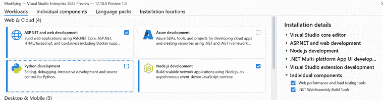
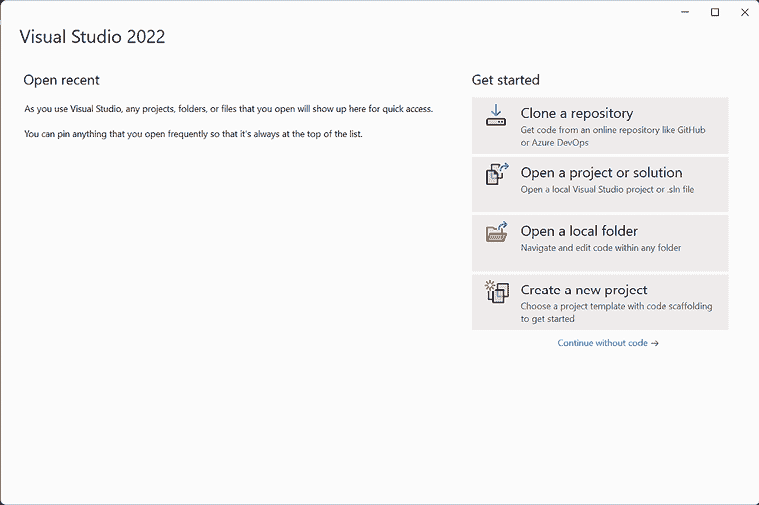
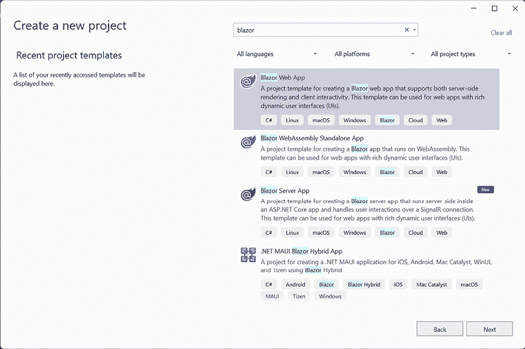
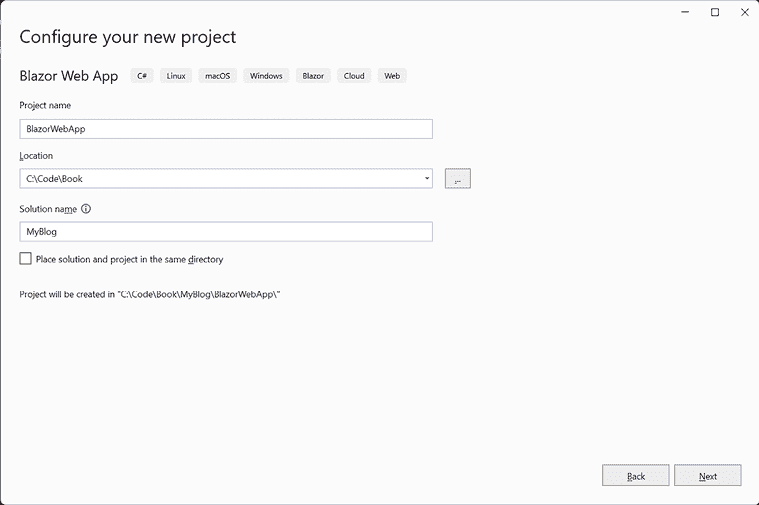
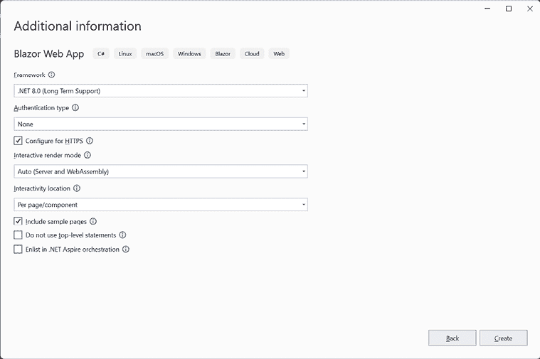
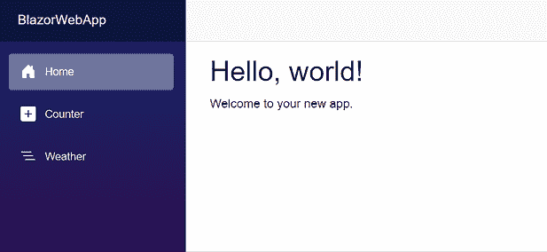
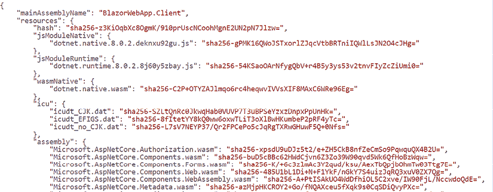
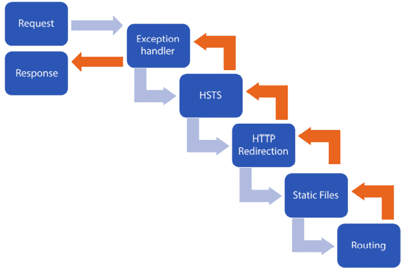

# 第二章：创建您的第一个 Blazor 应用程序

在本章中，我们将设置我们的开发环境，以便我们可以开始开发 Blazor 应用程序。我们将创建我们的第一个 Blazor 应用程序，并了解项目结构。

到本章结束时，您将拥有一个可工作的开发环境，并创建了一个可以运行混合流式服务器端渲染、Blazor 服务器和 Blazor WebAssembly 的 Blazor 应用程序。

在本章中，我们将涵盖以下内容：

+   设置您的开发环境

+   创建我们的第一个 Blazor 应用程序

+   使用命令行

+   确定项目结构

# 技术要求

我们将创建一个新的项目（一个博客引擎），并在整本书中继续对该项目进行工作。

您可以在 [`github.com/PacktPublishing/Web-Development-with-Blazor-Third-Edition/tree/main/Chapter02`](https://github.com/PacktPublishing/Web-Development-with-Blazor-Third-Edition/tree/main/Chapter02) 找到本章结果的源代码。

# 设置您的开发环境

在本书中，我们将重点关注 Windows 开发，并且任何截图都将来自 Visual Studio（除非另有说明）。但由于 .NET 8 是跨平台的，我们将介绍如何在 Windows、macOS 和 Linux 上设置您的开发环境。

所有平台的链接可以在这里找到：[`visualstudio.microsoft.com/`](https://visualstudio.microsoft.com/).

我们可以从网页上下载 Visual Studio 或 Visual Studio Code。

## Windows

在 Windows 上，我们有很多不同的选项来开发 Blazor 应用程序。Visual Studio 2022 是我们可以使用的最强大的工具。

有三个不同的版本，如下所示：

+   社区 2022

+   专业 2022

+   企业 2022

简而言之，社区版是免费的，而其他版本则需要付费。社区版确实有一些限制，我们可以在以下链接中比较不同的版本：[`visualstudio.microsoft.com/vs/compare/`](https://visualstudio.microsoft.com/vs/compare/).

对于本书，我们可以使用这些版本中的任何一种。请按照以下步骤操作：

1.  从 [`visualstudio.microsoft.com/vs/`](https://visualstudio.microsoft.com/vs/) 下载 Visual Studio 2022。选择适合您的版本。

1.  安装 Visual Studio，并在安装过程中确保选择 **ASP.NET 和 Web 开发**，如图 *图 2.1* 所示：



图 2.1：Windows 上 Visual Studio 2022 的安装

1.  在右侧是一个将安装的所有组件的列表。请检查 **.NET WebAssembly Build Tools**。列表中可能还有 .NET6 或 .NET 7 版本，但我们想要不带版本号的版本。

我们还可以使用 Visual Studio Code 在 Windows 上开发 Blazor，但我们将不会讨论 Windows 的安装过程。

## macOS 和 Linux（或 Windows）

Visual Studio Code 是跨平台的，这意味着我们可以在 Linux、macOS 或 Windows 上使用它。

不同版本可在 [`code.visualstudio.com/Download`](https://code.visualstudio.com/Download) 获取。

安装完成后，我们还需要添加两个扩展：

1.  打开 Visual Studio Code 并通过按 *Shift* + *command* + *X*（在 macOS 上）或 *Ctrl*+ *Shift*+ *X*（在 Linux 和 Windows 上）打开扩展面板。

1.  搜索 `Visual Studio Code 的 C# 开发工具包` 并点击 **安装**。您可能需要一个 Microsoft 账户来安装 C# 开发工具包。

1.  搜索 `JavaScript 调试器（夜间版）` 并点击 **安装**。

还有其他跨平台的 IDE，例如 JetBrains Rider，有些人更喜欢使用。

现在一切都已经设置好了，让我们创建我们的第一个应用。

# 创建我们的第一个 Blazor 应用程序

在整本书中，我们将创建一个博客引擎。您不需要学习很多业务逻辑；该应用易于理解，但将涉及您在构建 Blazor 应用时将面临的技术和领域。

我有机会与 Steve Sanderson（Blazor 的创造者）和 Dan Roth（ASP.NET 的项目经理）讨论该项目。我们得出的结论是，这将展示 Blazor 最重要的功能。

该项目将允许访客阅读博客文章并发表评论。它还将有一个管理网站，我们可以在这里撰写博客文章，这将受到密码保护。

我们将创建一个利用 Blazor 服务器、Blazor WebAssembly 和流式服务器端渲染的应用。

重要提示

从现在起，本指南将使用 Visual Studio 2022，但其他平台也有类似创建项目的方法。

## 探索模板

在 .NET 8 中，微软减少了我们可访问的模板数量。我们将在 *第四章*，*理解基本 Blazor 组件* 中进一步探讨它们。这一章将为您提供一个快速概述。

在 .NET 7 中，根据我们是否需要示例代码，我们有不同的模板，但在 .NET 8 中我们只有两个。我们还有一个 Blazor 混合模板 (.NET MAUI)，但我们将会在 *第十八章*，*访问 .NET MAUI* 中回到它。

### Blazor Web 应用

**Blazor Web 应用** 模板为我们提供了一个 Blazor 应用。一旦我们选择了这个模板，我们就可以选择我们希望应用如何运行。我们可以使用示例代码或无代码配置我们的应用。我们可以选择是否支持交互式组件以及我们想要的交互类型。我们还可以选择是否为每个组件或整个应用指定渲染模式。因此，一开始，我们不需要选择是否要选择 Blazor 服务器或 Blazor WebAssembly；我们可以混合搭配。

如果我们添加示例页面，我们将获得一些组件来查看 Blazor 应用看起来像什么，以及一些基本的设置和菜单结构。它还包含添加 Bootstrap、隔离 CSS 以及类似内容的代码（见 *第九章*，*共享代码和资源*）。

这是本书中将使用的模板，以便更好地理解事物是如何组合在一起的。

### Blazor WebAssembly 独立应用

**Blazor WebAssembly Standalone App**模板（正如其名所示）为我们提供了一个 Blazor WebAssembly 独立应用程序。在这里，我们可以选择是否要包含示例页面。它包含一些组件，以展示 Blazor 应用程序的外观，以及一些基本的设置和菜单结构。它还包含添加 Bootstrap、独立 CSS 等代码（见*第九章*，*共享代码和资源*）。那么为什么我们有这个模板呢？嗯，Blazor Web App 在某种程度上依赖于服务器渲染技术。如果你想要能够从文件共享、GitHub Pages 或 Azure Static Web Apps（仅举几个例子）运行你的应用程序，这个模板就是为你准备的。

## 创建 Blazor Web 应用程序

首先，我们将创建一个 Blazor 服务器应用程序并对其进行操作：

1.  启动 Visual Studio 2022，你将看到以下屏幕：



图 2.2：Visual Studio 启动屏幕

1.  点击**创建新项目**，在搜索栏中输入`blazor`。

1.  你将获得不同模板的列表——这是.NET 7 和.NET 8 模板的混合。现在我们需要选择项目的模板。从搜索结果中选择**Blazor Web App**并点击**下一步**：



图 2.3：Visual Studio 创建新项目屏幕

1.  现在命名项目（这是任何项目中最难的部分，但别担心，我已经完成了这个步骤！）！将应用程序命名为`BlazorWebApp`。将解决方案名称更改为`MyBlog`并点击**下一步**：



图 2.4：Visual Studio 配置新项目屏幕

1.  接下来，选择我们应该创建哪种类型的 Blazor 应用程序。从下拉菜单中选择**.NET 8.0（长期支持）**。将**身份验证类型**设置为**无**。勾选**配置**以启用 HTTPS。将交互式渲染模式设置为**自动（服务器和 Webassembly）**并将**交互性位置**设置为**每页/组件**。

1.  选择**包含示例页面**。取消选择**不使用顶级语句**。取消选择**加入.NET Aspire 编排**并点击**创建**：



图 2.5：Visual Studio 创建新 Blazor 应用程序屏幕

1.  现在通过按**Ctrl** + **F5**（我们也可以在**调试** | **不调试启动**菜单下找到它）来运行应用程序。

恭喜！你刚刚创建了你第一个 Blazor Web 应用程序。网站应该看起来像*图 2.6*所示：



图 2.6：一个新的 Blazor Web App

探索一下网站，导航到**计数器**和**天气**以了解加载时间，并查看示例应用程序的功能。

不同的页面有不同的运行方式。计数器页面是交互式的，并使用自动渲染模式。这意味着如果加载 WebAssembly 版本需要超过 100 毫秒，网页将首先启动一个 SignalR 连接，以便快速加载组件。在后台，WebAssembly 版本将被下载并缓存。下次用户访问我们的网站时，它将使用缓存的版本并快速加载。

浏览器下载页面、一些 CSS 和 `blazor.web.js`，这是负责设置网站的文件。在某些情况下，它是一个返回服务器的 SignalR 连接，在某些情况下，它启动 WebAssembly。

计数器页面配置为 `RenderMode:Auto`，这意味着它将首先使用 Blazor Server 进行渲染，然后任何后续请求都将使用 WebAssembly 进行更新。一旦切换到计数器页面，就会在后台下载大量文件。

在这种情况下，当页面被下载时，将触发必要的 JavaScript 文件的下载。然后，下载 `blazor.boot.json`。*图 2.13* 展示了 `blazor.boot.json` 部分内容的示例：



图 2.7：blazor.boot.json 文件的部分内容

`blazor.boot.json` 中最重要的内容是入口程序集，这是浏览器应该开始执行 DLL 的名称。它还包括应用程序运行所需的所有框架 DLL。现在，我们的应用程序知道它需要启动什么。在 .NET 的早期版本中，文件是 DLL 文件。在 .NET 8 中，我们下载 `.wasmfiles`。

默认情况下，Blazor 将使用 `Webcil`，这是一种有效载荷格式。`Webcil` 将打包 DLLs。一些提供商已经关闭了对 DLL 文件的支持，并且防病毒程序与 DLL 文件存在问题，因此这是一个很棒的更新。

JavaScript 将下载 `blazor.boot.json` 中提到的所有资源：这是一个混合体，包括您的代码编译成的 .NET Standard DLL、Microsoft .NET Framework 代码以及您可能使用的任何社区或第三方 DLL。然后，JavaScript 下载 `dotnet.native.wasm`，这是编译成 WebAssembly 的 Mono 运行时，它将启动您的应用程序。

现在，我们已经有了项目的基线。在这本书的整个过程中，我们将使用 Visual Studio，但还有其他方法可以运行您的 Blazor 网站，例如使用命令行。命令行是一个超级强大的工具，在下一节中，我们将探讨如何使用命令行设置项目。

# 使用命令行

在 .NET 5 中，我们获得了一个名为 `dotnet.exe` 的超级强大工具。之前使用过 .NET Core 的开发者已经熟悉这个工具了，但在 .NET 5 中，它不再仅限于 .NET Core 开发者使用。

它可以完成 Visual Studio 可以做的许多事情，例如创建项目、添加和创建 NuGet 包，等等。在下面的示例中，我们将使用 **dotnet** 命令创建一个 Blazor Server 和一个 Blazor WebAssembly 项目。

## 使用命令行创建项目

以下步骤是为了展示使用命令行的强大功能。我们将在本书的后续内容中不会使用此项目，所以如果你不想尝试，可以跳过这一部分。CLI 是跨平台的，因此这也可以在 Linux 和 macOS 上使用。

要使用 Blazor 应用程序创建解决方案，你可以执行以下操作：

```cs
dotnet new blazor -o BlazorWebApp 
```

我们在本书中不会深入探讨 CLI，但要知道它是一种创建项目、添加包以及更多操作的好方法。

注意：.NET CLI

理念是，你应该能够从命令行完成所有操作。如果你更喜欢使用命令行，你应该查看 .NET CLI；你可以在以下链接中了解更多关于 .NET CLI 的信息：[`docs.microsoft.com/en-us/dotnet/core/tools/`](https://docs.microsoft.com/en-us/dotnet/core/tools/)。

让我们回到 Blazor 模板，它为我们添加了许多文件。在下一节中，我们将查看 Visual Studio 为我们生成的内容。

# 确定项目结构

Visual Studio 将生成两个项目：`Blazor App`，这是服务器项目，以及 `BlazorWebApp.Client`，这是我们放置 WebAssembly 组件的地方。

现在，是时候查看不同的文件以及它们在不同项目中的可能差异了。在我们逐一查看时，请查看我们刚刚创建的两个项目中的代码（在 *创建我们的第一个 Blazor 应用* 部分）。

## Program.cs (BlazorWebApp 项目)

`Program.cs` 是第一个被调用的类。因此，让我们从它开始看起。

`Program.cs` 文件看起来是这样的：

```cs
var builder = WebApplication.CreateBuilder(args);
// Add services to the container.
builder.Services.AddRazorComponents()
    .AddInteractiveServerComponents()
    .AddInteractiveWebAssemblyComponents();
var app = builder.Build();
// Configure the HTTP request pipeline.
if (app.Environment.IsDevelopment())
{
    app.UseWebAssemblyDebugging();
}
else
{
    app.UseExceptionHandler("/Error", createScopeForErrors: true);
    // The default HSTS value is 30 days. You may want to change this for production scenarios, see https://aka.ms/aspnetcore-hsts.
    app.UseHsts();
}
app.UseHttpsRedirection();
app.UseStaticFiles();
app.UseAntiforgery();
app.MapRazorComponents<App>()
    .AddInteractiveServerRenderMode()
    .AddInteractiveWebAssemblyRenderMode()
    .AddAdditionalAssemblies(typeof(Counter).Assembly);
app.Run(); 
```

在 .NET 6 中，Microsoft 删除了 `Startup.cs` 文件，并将所有启动代码放入 `Program.cs`。它还使用了顶级语句，这使得代码略微不那么臃肿。

在这里有一些值得提到的事情。`Program` 类从添加我们应用程序中需要的所有依赖项开始。在这种情况下，我们添加了 `RazorComponent`，这使得我们能够运行 Razor 组件。然后，我们添加了 `InteractiveServerComponents`，这使我们能够访问运行 Blazor 服务器所需的所有对象。由于我们选择了自动渲染模式，我们还通过添加 `InteractiveWebAssemblyComponents` 获得了对 Blazor WebAssembly 的访问。

它还配置了 **HTTP 严格传输安全**（**HSTS**），强制应用程序使用 HTTPS，并确保用户不会使用任何不受信任的资源或证书。我们还确保网站重定向到 HTTPS 以保护网站。

`UseStaticFiles` 允许下载静态文件，如 CSS 或图像。

`UseAntiforgery` 是一个方法，它将反伪造中间件添加到应用程序管道中，提供一层针对 **跨站请求伪造**（**CSRF** 或 **XSRF**）攻击的安全防护。

这种类型的攻击发生在恶意网络应用程序影响客户端浏览器与信任该浏览器的网络应用程序之间的交互时，通常会导致未经用户同意执行不希望的操作。

不同的 `Use*` 方法将请求代理添加到请求管道或中间件管道。每个请求代理（`ExceptionHandler`、`HttpRedirection`、`StaticFiles` 等）都按照它们在 `Program.cs` 中添加的顺序从上到下依次调用，然后再从下到上。

这就是为什么异常处理器是第一个被添加的原因。

如果在后续的任何请求代理中发生异常，异常处理器仍然能够处理它（因为请求会通过管道返回），如图 *2.15* 所示：



图 2.8：请求中间件管道

如果这些请求代理中的任何一个在处理静态文件等情况下处理请求，则不需要涉及路由，其余的请求代理将不会被调用。有时，添加请求代理的正确顺序是至关重要的；例如，我们希望在管道中尽早运行身份验证，以确保用户无法访问他们不应访问的内容。

备注：

如果你想深入了解，这里有一些更多信息：[`docs.microsoft.com/en-us/aspnet/core/fundamentals/middleware/?view=aspnetcore-8.0`](https://docs.microsoft.com/en-us/aspnet/core/fundamentals/middleware/?view=aspnetcore-8.0)。

在类末尾，我们将 Razor 组件映射到 `App` 组件。我们添加不同的渲染模式和额外的程序集 – 在这种情况下，`BlazorWebApp.Client` 项目，这是我们的 WebAssembly 项目。

## Program.cs (BlazorWebApp.Client)

位于 Blazor WebAssembly 项目的 `program.cs` 文件中不包含很多东西。

它看起来像这样：

```cs
var builder = WebAssemblyHostBuilder.CreateDefault(args);
await builder.Build().RunAsync(); 
```

它只是设置主机构建器并使用默认配置。

## App (BlazorWebApp)

接下来发生的事情是 `App` 组件运行。

它看起来像这样：

```cs
<!DOCTYPE html>
<html lang="en">
<head>
<meta charset="utf-8" />
<meta name="viewport" content="width=device-width, initial-scale=1.0" />
<base href="/" />
<link rel="stylesheet" href="bootstrap/bootstrap.min.css" />
<link rel="stylesheet" href="app.css" />
<link rel="stylesheet" href="BlazorWebApp.styles.css" />
<link rel="icon" type="image/png" href="favicon.png" />
<HeadOutlet />
</head>
<body>
<Routes />
<script src="img/blazor.web.js"></script>
</body>
</html> 
```

让我们逐一分析，看看我们能学到什么。它从 `html`、`doctype` 和一个 `head` 标签开始。`head` 标签包含元标签和 **样式表**（**CSS**）。`base` 标签是为了让应用程序找到适当的文件。如果我们，例如，在子文件夹（如 GitHub Pages）中托管我们的应用程序，我们需要修改 `base` 标签以反映这一点。`HeadOutlet` 组件用于我们在代码中添加诸如页面标题等内容（我们将在 *第五章*，*创建高级 Blazor 组件*中回到这一点）。

`Routes` 组件是处理所有路由的组件，我们将在下一节中对其进行探讨。最后但同样重要的是，我们还有使所有这些成为可能的 JavaScript。

## 路由

`Routes` 组件是处理所有路由的组件。它看起来像这样：

```cs
<Router AppAssembly="@typeof(Program).Assembly" AdditionalAssemblies="new[] { typeof(Client._Imports).Assembly }">
<Found Context="routeData">
<RouteView RouteData="@routeData" DefaultLayout="@typeof(Layout.MainLayout)" />
<FocusOnNavigate RouteData="@routeData" Selector="h1" />
</Found>
</Router> 
```

此文件处理路由，查找要显示的合适组件（基于 `@page` 指令）。如果找不到路由，它会显示错误消息。在 *第八章*，*身份验证和授权*中，我们将在此文件实现身份验证时对其进行更改。

`Routes`组件还包括一个默认布局。我们可以为每个组件覆盖布局，但通常，你将为你的网站有一个布局页面。在这种情况下，默认布局被称为`MainLayout`。

`FocusOnNavigate`将在我们导航/加载新的组件/路由后，将焦点设置在特定的元素上——在本例中，是`H1`。

## MainLayout

`MainLayout`，我们可以在共享文件夹中找到，包含所有组件作为页面查看时的默认布局。`MainLayout`包含几个`div`标签，一个用于侧边栏，一个用于主要内容：

```cs
@inherits LayoutComponentBase
<div class="page">
<div class="sidebar">
<NavMenu />
</div>
<main>
<div class="top-row px-4">
<a href="https://learn.microsoft.com/aspnet/core/" target="_blank">About</a>
</div>
<article class="content px-4">
            @Body
        </article>
</main>
</div>
<div id="blazor-error-ui">
    An unhandled error has occurred.
    <a href="" class="reload">Reload</a>
<a class="dismiss">X</a>
</div> 
```

你在这份文档中需要的只有`@inherits LayoutComponentBase`和`@Body`；其余的都是 Bootstrap。

Bootstrap 是开发响应式和移动优先网站中最受欢迎的 CSS 框架之一。

我们可以在`App.Razor`文件中找到对 Bootstrap 的引用。

它是由 Twitter/X 创建的，用于 Twitter/X。你可以在[`getbootstrap.com/`](https://getbootstrap.com/)了解更多关于 Bootstrap 的信息。

`@inherits`指令从`LayoutComponentBase`继承，其中包含使用布局所需的所有代码。`@Body`是组件将被渲染的位置（当作为页面查看时）。

它还包含 Blazor 的默认错误 UI。

在布局的顶部，你可以看到`<NavMenu>`，一个 Razor 组件。它位于`Components/Layout`文件夹中，看起来像这样：

```cs
<div class="top-row ps-3 navbar navbar-dark">
<div class="container-fluid">
<a class="navbar-brand" href="">BlazorWebApp</a>
</div>
</div>
<input type="checkbox" title="Navigation menu" class="navbar-toggler" />
<div class="nav-scrollable" onclick="document.querySelector('.navbar-toggler').click()">
<nav class="flex-column">
<div class="nav-item px-3">
<NavLink class="nav-link" href="" Match="NavLinkMatch.All">
<span class="bi bi-house-door-fill-nav-menu" aria-hidden="true"></span> Home
            </NavLink>
</div>
<div class="nav-item px-3">
<NavLink class="nav-link" href="counter">
<span class="bi bi-plus-square-fill-nav-menu" aria-hidden="true"></span> Counter
            </NavLink>
</div>
<div class="nav-item px-3">
<NavLink class="nav-link" href="weather">
<span class="bi bi-list-nested-nav-menu" aria-hidden="true"></span> Weather
            </NavLink>
</div>
</nav>
</div> 
```

它包含左侧菜单，是一个标准的 Bootstrap 菜单。它还具有三个菜单项和汉堡菜单的逻辑（如果是在手机上查看）。这种导航菜单通常是用 JavaScript 完成的，但这个是用 CSS 和 C#完成的。

你会发现另一个组件，`NavLink`，它是框架内建的。它将渲染一个锚点标签，但也会检查当前路由。如果你当前位于与导航链接相同的路由/URL 上，它将自动向标签添加一个名为`active`的 CSS 类。

我们将遇到一些内置的组件，这些组件将帮助我们前进。模板中也有一些页面，但现在我们将暂时忽略它们，并在下一章中介绍组件时再进行讨论。

## CSS

在`Components/Layout`文件夹中，有两个 CSS 文件：`NavMenu.razor.css`和`MainLayout.razor.css`。

这些文件是仅影响特定组件（名称的第一部分）的 CSS 样式。我们将在第九章中返回一个称为隔离 CSS 的概念，*共享代码和资源*。

# 摘要

在本章中，我们成功搭建了开发环境，并创建了我们的第一个 Blazor 应用程序。我们学习了类、组件和布局的调用顺序，这使得跟踪代码变得更加容易。

在下一章中，我们将从 Blazor 中暂时休息一下，看看如何管理状态，并设置一个存储我们的博客文章的仓库。
