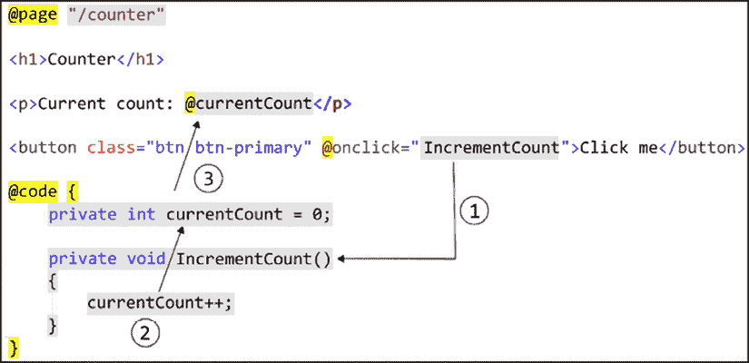

# 4

# 理解基本 Blazor 组件

在本章中，我们将查看 Blazor 模板中提供的组件，并开始构建我们自己的组件。了解用于创建 Blazor 网站的不同的技术将有助于我们开始构建自己的组件。

Blazor 使用组件来完成大多数事情，因此我们将在这本书的整个过程中使用本章的知识。

我们将从这个章节的理论开始，并以创建一个组件来展示一些博客文章结束，这些博客文章使用我们在 *第三章*，*管理状态 – 第一部分* 中创建的 API。

在本章中，我们将涵盖以下主题：

+   探索组件

+   学习 Razor 语法

+   理解依赖注入

+   更改渲染模式

+   确定代码放置的位置

+   生命周期事件

+   参数

+   编写我们的第一个组件

# 技术要求

确保你已经跟进了前面的章节，或者使用 `Chapter03` 文件夹作为起点。

你可以在 [`github.com/PacktPublishing/Web-Development-with-Blazor-Third-Edition/tree/main/Chapter04`](https://github.com/PacktPublishing/Web-Development-with-Blazor-Third-Edition/tree/main/Chapter04) 找到本章结果的源代码。

# 探索组件

在 Blazor 中，一个 `component` 是一个包含小而独立的函数（代码和标记）的 `.razor` 文件，或者它可以作为一个页面使用。组件还可以托管其他组件。本章将向我们展示组件是如何工作的以及如何使用它们。

我们有三种不同的方式可以创建一个组件：

+   使用 Razor 语法，代码和 HTML 在同一个文件中共享

+   将代码后文件与 `.razor` 文件一起使用

+   仅使用代码后文件

在本章中，我们将探讨不同的选项。首先，我们将探讨我们用于创建项目的模板中的组件；这些组件都使用了第一个选项，即 `.razor` 文件，其中我们在同一个文件中混合了代码和 HTML。

模板中的组件如下：

+   **计数器**

+   **天气**

## 计数器

`counter` 页面显示了一个按钮和一个计数器；如果我们点击按钮，计数器会增加。现在我们将把这个页面拆分开来，使其更容易理解。它位于 `BlazorWebApp.Client` 项目中的 `Pages` 文件夹内。

页面顶部是 `@page` 指令，这使得我们可以直接路由到组件，正如我们在这段代码中看到的那样：

```cs
@page "/counter" 
```

如果我们启动 `BlazorWebApp` 项目，并将 `/counter` 添加到 URL 的末尾，我们可以直接通过其路由访问组件。我们还可以使路由接受参数，但我们将稍后回到这一点。

在下面，我们有渲染模式：

```cs
@rendermode InteractiveAuto 
```

这是我们可以在特定组件上设置渲染模式的方法。这意味着当我们使用这个组件时，它将首先使用 Blazor 服务器（带有 SignalR）渲染页面，并在后台下载 WebAssembly 版本，以便下次我们加载页面时，它将运行 WebAssembly 版本。

接下来，让我们探索一下代码。要向页面添加代码，我们使用 `@code` 语句，并在该语句中可以添加普通的 C# 代码，如下所示：

```cs
@code {
    private int currentCount = 0;
    private void IncrementCount()
    {
        currentCount++;
    }
} 
```

在前面的代码块中，我们有一个设置为 `0` 的私有 `currentCount` 变量。然后，我们有一个名为 `IncrementCount()` 的方法，该方法将 `currentCount` 变量增加 `1`。

我们通过使用 `@` 符号来显示当前值。在 Razor 中，`@` 符号表示是时候编写一些代码了：

```cs
<p role="status">Current count: @currentCount</p> 
```

如我们所见，Razor 非常智能，因为它能理解代码何时停止，标记何时继续，因此不需要添加额外的内容来从代码过渡到标记（更多内容将在下一节中介绍）。

如前例所示，我们在 HTML 标签和 `@currentCount` 之间混合，Razor 能够理解这种区别。接下来，我们有一个按钮，它是改变值的触发器：

```cs
<button class="btn btn-primary" @onclick="IncrementCount">Click me</button> 
```

这是一个带有 `Bootstrap` 类（使其看起来更美观）的 HTML 按钮。`@onclick` 将按钮的 `onclick` 事件绑定到 `IncrementCount()` 方法。如果我们不使用 `@` 符号来使用 `onclick`，它将引用 JavaScript 事件而不会工作。

因此，当我们点击按钮时，它将调用 `IncrementCount()` 方法（在 *图 4.1* 中表示为 `1`），该方法增加变量（在 *图 4.1* 中表示为 `2`），由于变量发生了变化，UI 将自动更新（在 *图 4.1* 中表示为 `3`），如图所示：



图 4.1：计数组件的流程

`counter` 组件是在 `BlazorWebApp.Client` 项目中实现的，这是一个 WebAssembly 项目。在那个项目中，我们应该放置所有我们想要作为 WebAssembly 运行的组件。然后 `BlazorWebApp` 项目引用 `BlazorWebApp.Client` 项目，这样它就能找到所有组件，并且如果我们想的话，可以将其作为 Blazor 服务器组件运行。

## 天气

我们接下来要查看的组件是 `Weather` 组件。它位于 `Components/Pages/Weather.razor` 文件夹中。

`Weather` 组件介绍了新的流式渲染功能。文件最初看起来是这样的：

```cs
@page "/weather"
@attribute [StreamRendering(true)] 
```

就像 `Counter` 组件一样，我们首先定义一个路由。这个页面上没有渲染模式属性。该组件将使用 **服务器端渲染**（**SSR**）进行渲染。这是所有组件的默认行为，除非指定，就像 `Counter` 组件一样。

当我们开始项目时，我们将 **交互位置** 设置为 **每页/组件**。这意味着当我们想要交互时，我们需要指定这一点。但是，有了 `[StreamRendering(true)]` 属性，我们将获得一种交互感。页面首先加载，显示加载文本。然后，使用相同的请求，我们获取其余的数据，就像一个 `…` 好吧，流。所以，我们将获得快速加载，无需等待数据，无需使用 WebAssembly 或 SignalR 添加交互性，但仍有一些加载进度。我们将在稍后的章节中进一步探讨这一点。

`Weather` 组件的 HTML 部分看起来像这样：

```cs
<PageTitle>Weather</PageTitle>
<h1>Weather</h1>
<p>This component demonstrates showing data.</p>
@if (forecasts == null)
{
    <p><em>Loading...</em></p>
}
else
{
    <table class="table">
<thead>
<tr>
<th>Date</th>
<th>Temp. (C)</th>
<th>Temp. (F)</th>
<th>Summary</th>
</tr>
</thead>
<tbody>
            @foreach (var forecast in forecasts)
            {
                <tr>
<td>@forecast.Date.ToShortDateString()</td>
<td>@forecast.TemperatureC</td>
<td>@forecast.TemperatureF</td>
<td>@forecast.Summary</td>
</tr>
            }
        </tbody>
</table>
} 
```

如果我们没有任何预报，它将显示“加载中...”，一旦我们有了数据，它将渲染一个显示数据的表格。

生成一些模拟数据的代码部分看起来像这样：

```cs
@code {
    private WeatherForecast[]? forecasts;
    protected override async Task OnInitializedAsync()
    {
        // Simulate asynchronous loading to demonstrate streaming rendering
await Task.Delay(500);
        var startDate = DateOnly.FromDateTime(DateTime.Now);
        var summaries = new[] { "Freezing", "Bracing", "Chilly", "Cool", "Mild", "Warm", "Balmy", "Hot", "Sweltering", "Scorching" };
        forecasts = Enumerable.Range(1, 5).Select(index => new WeatherForecast
        {
            Date = startDate.AddDays(index),
            TemperatureC = Random.Shared.Next(-20, 55),
            Summary = summaries[Random.Shared.Next(summaries.Length)]
        }).ToArray();
    }
    private class WeatherForecast
    {
        public DateOnly Date { get; set; }
        public int TemperatureC { get; set; }
        public string? Summary { get; set; }
        public int TemperatureF => 32 + (int)(TemperatureC / 0.5556);
    }
} 
```

当页面初始化时，`WeatherForecast` 数组会被填充随机数据。

这让我想起有人（作为玩笑）向 Dan Roth 在 GitHub 上的一个仓库提交了一个错误报告，报告称“天气预报不可靠。”

对话继续，“在我的伦敦之行中，天气预报功能完全准确，但在加利福尼亚却证明是误导性的。计数和整体紫色很棒。”Dan Roth 回复道：“感谢您的反馈！我会联系 .NET 核心框架团队，确保 `System.Random` 能更好地考虑加利福尼亚的天气模式。”

这是我喜欢 .NET 社区的原因之一。

如我们所见，通过使用 Razor 语法，我们可以无缝地将代码与 HTML 混合。代码会检查是否有任何数据——如果有，它将渲染表格；如果没有，它将显示一个加载信息。一旦我们有了数据，组件将自动更新。我们对 HTML 有完全的控制权，Blazor 不会向生成的 HTML 中添加任何内容。

有一些组件库可以使这个过程变得简单一些，我们将在下一章，*第五章*，*创建高级 Blazor 组件*中探讨。

现在我们已经知道了示例模板是如何实现的，是时候深入探讨 Razor 语法了。

# 学习 Razor 语法

我喜欢 Razor 语法的其中一个原因是它很容易混合代码和 HTML 标签。由于代码靠近标记，我认为它更容易跟随和理解。语法非常流畅；Razor 解析器理解代码何时停止，标记何时开始，这意味着我们不需要过多地考虑它。它也不是一门新语言；相反，我们可以利用我们现有的 C# 和 HTML 知识来创建我们的组件。本节将包含大量理论，帮助我们理解 Razor 语法。

要从 HTML 转换到代码（C#），我们使用 `@` 符号。我们可以用几种方法将代码添加到我们的文件中，我们将在接下来的章节中探讨这些方法：

+   Razor 代码块

+   隐式 Razor 表达式

+   显式 Razor 表达式

+   表达式编码

+   指令

## Razor 代码块

我们已经看到了一些代码块。一个代码块看起来像这样：

```cs
@code {
    //your code here
} 
```

如果我们愿意，我们可以省略`code`关键字，如下所示：

```cs
@{
    //your code here
} 
```

在这些花括号内，我们可以像这样混合 HTML 和代码：

```cs
@{
    void RenderName(string name)
    {
        <p>Name: <strong>@name</strong></p>
    }
    RenderName("Steve Sanderson");
    RenderName("Daniel Roth");
} 
```

注意`RenderName()`方法如何从代码过渡到段落标签，然后再回到代码；这是一个隐式过渡。

如果我们想要输出没有 HTML 标签的文本，我们可以使用`text`标签而不是段落标签，如下面的示例所示：

```cs
<text>Name: <strong>@name</strong></text> 
```

这将渲染与之前代码相同的结果，但没有段落标签，并且`text`标签不会被渲染。

## 隐式 Razor 表达式

**隐式 Razor 表达式**是指我们在 HTML 标签内添加代码。

我们已经在`Weather`示例中看到了这个：

```cs
<td>@forecast.Summary</td> 
```

我们从一个`<td>`标签开始，然后使用`@`符号切换到 C#，再使用结束标签切换回 HTML。我们可以将`await`关键字与方法调用一起使用，但除此之外，隐式 Razor 表达式不能包含任何空格。

由于`<>`会被解释为 HTML，因此我们不能使用隐式表达式调用泛型方法。因此，为了解决这个问题，我们可以使用显式表达式。

## 显式 Razor 表达式

如果我们想在代码中使用空格，我们可以使用显式 Razor 表达式。用`@`符号后跟括号`()`编写代码。所以，它看起来像这样：`@()`。

在这个示例中，我们从当前日期减去`7`天：

```cs
<td>@(DateTime.Now - TimeSpan.FromDays(7))</td> 
```

我们还可以使用显式 Razor 表达式来连接文本；例如，我们可以像这样连接文本和代码：

```cs
<td>Temp@(forecast.TemperatureC)</td> 
```

输出结果将是 `<td>Temp42</td>`。

使用显式表达式，我们可以通过使用此语法轻松调用泛型方法：

```cs
<td>@(MyGenericMethod<string>())</td> 
```

Razor 引擎知道我们是否在使用代码。它还确保在输出到浏览器时将字符串编码为 HTML，这被称为**表达式编码**。

## 表达式编码

如果我们将 HTML 作为字符串，它默认会被转义。以下代码为例：

```cs
@("<span>Hello World</span>") 
```

渲染的 HTML 将看起来像这样：

```cs
&lt;span&gt;Hello World&lt;/span&gt; 
```

要从字符串输出实际的 HTML（我们将在第五章*创建高级 Blazor 组件*中这样做），可以使用以下语法：

```cs
@((MarkupString)"<span>Hello World</span>") 
```

使用`MarkupString`，输出将是 HTML，显示 HTML 标签`span`。在某些情况下，一行代码不够；然后，我们可以使用代码块。

## 指令

有许多指令会改变组件的解析方式或启用功能。这些是跟随`@`符号的保留关键字。我们将介绍最常见和最有用的几个。

我发现将布局和代码放在同一个`.razor`文件中非常方便。

注意，我们可以使用代码隐藏来编写我们的代码，以便在代码和布局之间获得更多的分离。在本章的后面部分，我们将探讨如何使用代码隐藏而不是 Razor 语法来完成所有操作。现在，以下示例将展示如何使用 Razor 语法和代码隐藏来完成相同的指令。

### 添加属性

要向我们的页面添加属性，我们可以使用`attribute`指令：

```cs
@attribute [Authorize] 
```

如果我们使用的是代码后端文件，我们将使用以下语法：

```cs
[Authorize] public partial class SomeClass {} 
```

### 添加接口

要实现接口（在这种情况下为`IDisposable`），我们会使用以下代码：

```cs
@implements IDisposable 
```

然后，我们将在`@code{}`部分实现接口所需的方法。

在代码后端场景中执行相同操作时，我们会在类名后添加接口，如下例所示：

```cs
public partial class SomeClass : IDisposable {} 
```

### 继承

要继承另一个类，我们应该使用以下代码：

```cs
@inherits TypeNameOfClassToInheritFrom 
```

在代码后端场景中执行相同操作时，我们会在类名后添加我们想要继承的类：

```cs
public class SomeClass : TypeNameOfClassToInheritFrom {} 
```

### 泛型

我们可以将我们的组件定义为泛型组件。

泛型允许我们定义数据类型，因此组件可以与任何数据类型一起工作。

要将组件定义为泛型组件，我们添加`@typeparam`指令；然后，我们可以在组件的代码中使用该类型，如下所示：

```cs
@typeparam TItem
@code
{
      [Parameter]
      public List<TItem> Data { get; set; }
} 
```

泛型在创建可重用组件时非常强大；这将使我们的组件对不同数据类型可重用。我们将在*第六章*，*使用验证构建表单*中回到泛型。

### 更改布局

如果我们想要为页面设置特定的布局（不是在`Routes.razor`文件中指定的默认布局），我们可以使用`@layout`指令：

```cs
@layout AnotherLayout 
```

这样，我们的组件将使用指定的布局（这仅适用于具有`@page`指令的组件）。

### 设置命名空间

默认情况下，组件的命名空间将是我们的项目默认命名空间加上文件夹结构。如果我们想让我们的组件位于特定的命名空间中，我们可以使用以下方法：

```cs
@namespace Another.NameSpace 
```

### 设置路由

我们已经提到了`@page`指令。如果我们想让我们的组件可以通过 URL 直接访问，我们可以使用`@page`指令：

```cs
@page "/theurl" 
```

URL 可以包含参数、子文件夹等等，我们将在本章后面回到这一点。

### 添加使用语句

要向我们的组件添加命名空间，我们可以使用`@using`指令：

```cs
@using System.IO 
```

如果我们在多个组件中使用相同的命名空间，那么我们可以将它们添加到`_Imports.razor`文件中。这样，它们将可用在我们创建的所有组件中。

如果你想进一步了解指令，你可以在这里找到更多信息：[`learn.microsoft.com/en-us/aspnet/core/mvc/views/razor?view=aspnetcore-8.0#directives`](https://learn.microsoft.com/en-us/aspnet/core/mvc/views/razor?view=aspnetcore-8.0#directives)

现在我们对 Razor 语法的运作方式有了更多的了解。不用担心；我们将有足够的时间来练习它。本节还有一个我没有涵盖的指令，那就是`inject`。我们首先需要了解**依赖注入**（DI）是什么以及它是如何工作的，这将在下一节中展示。

# 理解依赖注入

依赖注入（DI）是一种软件模式和实现**控制反转**（IoC）的技术。

IoC 是一个通用术语，意味着我们可以表明类需要一个类实例，而不是让我们的类实例化一个对象。我们可以说我们的类想要一个特定的类或一个特定的接口。

类的创建在其他地方，IoC 决定它将创建哪个类。

当涉及到 DI 时，如果对象（类实例）通过构造函数、参数或服务查找传递，它是一种 IoC 的形式。

如果你想要深入了解 .NET 中的 DI，这是一个很好的资源：[`learn.microsoft.com/en-us/dotnet/core/extensions/dependency-injection`](https://learn.microsoft.com/en-us/dotnet/core/extensions/dependency-injection)。

在 Blazor 中，我们可以通过提供一种实例化对象的方法来配置 DI；这是一个我们应该使用的核心架构模式。我们已经看到一些关于它的引用，例如在 `Program.cs` 中：

```cs
builder.Services.AddScoped<IBlogApi, BlogApiJsonDirectAccess>(); 
```

在这里，我们说如果任何类需要 `IBlogApi`，应用程序应该实例化一个 `BlogApiJsonDirectAccess` 类型的对象。在这种情况下，我们使用了一个接口；相反，我们可以说：

```cs
builder.Services.AddScoped<BlogApiJsonDirectAccess>(); 
```

在这种情况下，当我们请求一个 `BlogApiJsonDirectAccess` 对象时，它将返回该类型的对象。如果我们所构建的东西只有一个实现，就没有必要为它创建一个接口。在上一章，*第三章*，*管理状态 – 第一部分*。我们创建了一个 `IBlogApi` 接口，它返回一个 `BlogApiJsonDirectAccess` 的实例。当我们实现 WebAssembly 版本时，DI 将返回另一个类。

使用 DI 有许多优点。我们的依赖关系是松散耦合的，所以我们不需要在我们的类中实例化另一个类。相反，我们请求一个实例，这使得编写测试和根据平台更改实现变得更加容易。

任何外部依赖都将更加明显，因为我们必须将它们传递到类中。我们还可以在中心位置设置我们应该如何实例化对象。我们在 `Program.cs` 中配置 DI。

我们可以以不同的方式配置对象的创建，例如以下几种：

+   单例

+   作用域

+   临时

## 单例

当我们使用单例时，对象将对所有网站用户都是相同的。对象只创建一次。

要配置单例服务，请使用以下方法：

```cs
services.AddSingleton<IWeatherForecastService, WeatherForecastService>(); 
```

当我们想要与我们的网站所有用户共享对象时，应该使用单例，但要注意，由于状态是共享的，如果对象存储了特定于单个用户或会话的数据，可能会导致问题，因为一旦这些数据被一个用户更改，更改将反映给所有可能同时使用应用程序的用户。这也可能导致数据无意中共享。

## 作用域

当我们使用 scoped 时，每个连接都会创建一个新的对象，由于 Blazor Server 需要连接来工作，所以只要用户有连接，它就会是同一个对象。WebAssembly 没有 scoped 的概念，因为没有连接，所以所有代码都在用户的网页浏览器内运行。如果我们使用 scoped，它将以与 Blazor WebAssembly 中的 singleton 相同的方式工作，因为我们只有一个用户，所有内容都在浏览器内运行。建议如果想要将服务范围限定在当前用户，仍然使用 scoped。这使得在 Blazor Server 和 Blazor WebAssembly 之间移动代码变得更加容易，并且对服务应该如何使用提供了更多上下文。

要配置一个 scoped 服务，请使用以下方法：

```cs
services.AddScoped<IWeatherForecastService, WeatherForecastService>(); 
```

如果我们有属于用户的数据，我们应该使用 scoped 对象来保持用户的状态。更多关于这一点的内容在 *第十一章*，*管理状态 – 第二部分*。

这里值得提一下，新的“按组件”模型会在任何组件当前以 InteractiveServer 模式运行时创建一个 SignalR 连接。如果我们导航到一个没有 `InteractiveServer` 组件的新页面，连接最终会被断开。这意味着状态也会被移除。因此，当使用“按组件”模型时，我们需要确保不要在 scoped 变量中保存任何重要信息，除非我们以其他方式持久化它。

## Transient

当我们使用 transient 时，每次请求都会创建一个新的对象。

要配置一个 transient 服务，请使用以下方法：

```cs
services.AddTransient<IWeatherForecastService, WeatherForecastService>(); 
```

如果我们不需要保持任何状态，并且不介意每次请求时对象都被创建，我们可以使用 transient。

现在我们知道了如何配置服务，我们需要开始使用服务，通过注入它。

## 注入服务

有三种方式可以注入服务。我们可以在 Razor 文件中使用 `@inject` 指令：

```cs
@inject WeatherForecastService ForecastService 
```

这将确保我们可以在组件中访问 `WeatherForecastService`。

第二种方式是在使用代码隐藏时通过添加 `Inject` 属性来创建一个属性：

```cs
[Inject]
public WeatherForecastService ForecastService { get; set; } 
```

第三种方式是在我们想要将服务注入到另一个服务时——这时，我们需要通过构造函数注入服务：

```cs
public class MyService
{
    public MyService(WeatherForecastService
      weatherForecastService)
    {
    }
} 
```

现在我们知道了依赖注入的工作原理以及为什么我们应该使用它。在 .NET 7 中，使用 scoped 服务意味着只要连接（或电路）是活跃的，数据就可以访问。但到了 .NET 8，它根据渲染模式略有变化。让我们接下来看看这一点。

## 改变渲染模式

当涉及到 .NET 8 时，最大的变化是能够在同一应用程序中更改渲染模式。在 .NET 7 中，我们必须选择一个或另一个，但使用 .NET 8，我们可以根据需要更改它。也许如果某个页面没有交互性，我们可以使用新的 **服务器端渲染**（**SSR**）。这与 WebForms 或 MVC 非常相似。页面在服务器上渲染。没有额外的交互性将工作。我们可以在每个组件上设置渲染模式，或者在我们使用组件时进行设置。当我们创建项目时，我们选择我们想要的交互式渲染模式。

让我们来看看不同的选项：

+   **无** – 没有交互性，只有静态渲染文件，没有 SignalR 和 WebAssembly。使用此选项，我们可以使用静态 SSR 和流式服务器端渲染。

+   **服务器** – 这将使我们能够通过 Blazor 服务器使用交互性，而不是 WebAssembly。

+   **WebAssembly** – 这将使我们能够通过 Blazor WebAssembly 使用交互性，而不是 Blazor 服务器。

+   **自动**（服务器和 WebAssembly）- 允许我们同时使用服务器和 WebAssembly。

我们还将 **交互位置** 设置为 **每页/组件**，这意味着网站的默认行为是静态的，并且我们需要在每个组件上指定是否要使用交互性。我们也可以将其设置为 **全局**，这将像这样在 `Routes` 组件上设置交互性：

```cs
<Routes @rendermode="@InteractiveAuto" /> 
```

要为每个组件更改渲染模式，我们可以使用上面的语法或使用我们在 Counter 组件中看到的属性：

```cs
@rendermode InteractiveAuto 
```

默认情况下，所有组件都使用服务器预渲染。这意味着组件首先在服务器上渲染，然后推送到网页浏览器。SignalR 或 WebAssembly 启动，组件再次渲染，例如，对数据库进行额外的调用。我个人很少使用服务器预渲染。我喜欢页面首先发送服务器准备好的内容，然后，当数据库调用完成后，发送剩余的内容。我们也可以通过这样做来禁用预渲染：

```cs
<Routes @rendermode="new InteractiveServerRenderMode(prerender: false)" /> 
```

在本书的学习过程中，我们将有足够的时间学习更多关于渲染模式的知识。在 .NET 7 中，我们有更多的模板，但通过使用这些设置的组合，我们可以创建相同的场景。

| .NET 7 模板 | .NET 8 模板 | 交互式渲染模式 | 交互位置 |
| --- | --- | --- | --- |
| Blazor 服务器应用程序 | Blazor Web 应用程序 | 服务器 | 全局 |
| Blazor WebAssembly 应用程序 | Blazor WebAssembly 独立应用程序 |  |  |
| Blazor WebAssembly (ASP.NET Core 托管) | Blazor Web 应用程序 | WebAssembly | 全局 |

如果你刚接触 Blazor，这个表格没有意义，但如果你在 .NET 7 中使用过 Blazor，并想使用你在 .NET 7 中使用的项目模板，这是如何操作的。在本章中，我们提到了几次代码后置。在下一节中，我们将探讨如何使用代码后置与 Razor 文件一起使用，并完全跳过 Razor 文件。

# 确定代码放置的位置

我们已经看到了在 Razor 文件中直接编写代码的示例。除非代码变得过长或过于复杂，否则我更喜欢这样做。我总是倾向于可读性。

我们有四种编写组件的方法：

+   在 Razor 文件中

+   在部分类中

+   继承一个类

+   只有代码

让我们更详细地查看这个列表上的每一项。

## 在 Razor 文件中

如果我们正在编写一个不太复杂的文件，那么在编写组件时不需要切换文件会很好。正如我们在本章中已经讨论过的，我们可以使用`@code`指令直接将代码添加到我们的 Razor 文件中。

如果我们想将代码移动到后置代码文件中，那么我们只需要更改指令。对于其余的代码，我们只需将其移动到后置代码类中。当我刚开始使用 Blazor 时，由于来自 MVC 世界，其中代码和标记的分离是使用 MVC 方式的一个重要部分，所以将代码和标记写在同一文件中感觉有些奇怪。但我建议你在开发你的 Web 应用时尝试一下。

在工作中，我们开始使用后置代码，但后来改为在`.razor`文件中编写代码，并且从那时起就没有回头了。

然而，许多开发者更喜欢后置代码，将代码与布局分离。为此，我们可以使用部分类。

## 在部分类中

我们可以创建一个与 Razor 文件同名的部分类，并添加`.cs`扩展名。

如果你已经下载了源代码（或者你可以在 GitHub 上查看代码），你可以在`Examples`文件夹中查看`WeatherCodeBehind.razor.cs`。我已经将所有代码移动到后置代码文件中；编译此代码的结果将与我们保留代码在 Razor 文件中相同。这只是一种个人偏好的问题。

后置代码看起来像这样：

```cs
namespace BlazorWebApp.Components.Pages;
[StreamRendering(true)]
public partial class WeatherWithCodeBehind
{
    private WeatherForecast[]? forecasts;
    protected override async Task OnInitializedAsync()
    {
        // Simulate asynchronous loading to demonstrate streaming rendering
await Task.Delay(500);
        var startDate = DateOnly.FromDateTime(DateTime.Now);
        var summaries = new[] { "Freezing", "Bracing", "Chilly", "Cool", "Mild", "Warm", "Balmy", "Hot", "Sweltering", "Scorching" };
        forecasts = Enumerable.Range(1, 5).Select(index => new WeatherForecast
        {
            Date = startDate.AddDays(index),
            TemperatureC = Random.Shared.Next(-20, 55),
            Summary = summaries[Random.Shared.Next(summaries.Length)]
        }).ToArray();
    }
    private class WeatherForecast
    {
        public DateOnly Date { get; set; }
        public int TemperatureC { get; set; }
        public string? Summary { get; set; }
        public int TemperatureF => 32 + (int)(TemperatureC / 0.5556);
    }
} 
```

由于我们正在使用部分类，因此不需要将 razor 与后置代码连接起来。如果它们具有相同的名称，它们将正常工作。我们可以混合放置代码的位置；在这种情况下，我们在后置代码中有`StreamingRendering`属性，如果我们想的话，我们也可以将其保留在`.razor`文件中。如果你更喜欢使用后置代码，这就是你想要的方式。

这不是使用后置代码文件的唯一方法；我们还可以从后置代码文件中继承。

## 继承一个类

我们也可以创建一个完全不同的类（常见的模式是将它与 Razor 文件同名，并在末尾添加`Model`），并在我们的 Razor 文件中继承它。为了使其工作，我们需要从`ComponentBase`继承。在部分类的情况下，类已经从`ComponentBase`继承，因为 Razor 文件会这样做。

字段必须是受保护的或公共的（不是私有的），以便页面可以访问这些字段。如果我们不需要从我们的基类继承，我建议使用部分类。

这是后置代码类声明的代码片段：

```cs
public class WeatherWithInheritsModel:ComponentBase 
```

我们需要从`ComponentBase`或从继承自`ComponentBase`的类继承。

在 Razor 文件中，我们将使用`@inherits`指令：

```cs
@inherits WeatherWithInheritsModel 
```

现在 Razor 文件将继承自我们的代码隐藏类（这是创建代码隐藏类的第一种可用方法）。

部分和继承选项都是将代码移动到代码隐藏文件中的简单方法。继承模型是第一种可用的方法，但如我所述，如果你更喜欢代码隐藏，请使用部分类。但另一个选项是跳过 Razor 文件，完全使用代码。

## 只有代码

Visual Studio 将使用源生成器将 Razor 代码转换为 C#。我们将在第十七章“检查源生成器”中深入了解源生成器。Razor 文件将在编译时生成代码。如果我们想的话，可以跳过 Razor 步骤，完全用代码编写布局。

此文件（`CounterWithoutRazor.cs`）可在 GitHub 上找到。

反例看起来可能如下所示：

```cs
using Microsoft.AspNetCore.Components;
using Microsoft.AspNetCore.Components.Rendering;
using Microsoft.AspNetCore.Components.Web;
namespace BlazorWebApp.Component.Pages;
[Route("/CounterWithoutRazor")]
public class CounterWithoutRazor : ComponentBase
{
    protected override void BuildRenderTree
      (RenderTreeBuilder builder)
    {
        builder.AddMarkupContent(0, "<h1>Counter</h1>\r\n\r\n");
        builder.OpenElement(1, "p");
        builder.AddContent(2, "Current count: ");
        builder.AddContent(3, currentCount);
        builder.CloseElement();
        builder.AddMarkupContent(4, "\r\n\r\n");
        builder.OpenElement(5, "button");
        builder.AddAttribute(6, "class", "btn btn-primary");
        builder.AddAttribute(7, "onclick", EventCallback.Factory.Create<MouseEventArgs>(this, IncrementCount));
        builder.AddContent(8, "Click me");
        builder.CloseElement();
    }
    private int currentCount = 0;
    private void IncrementCount()
    {
        currentCount++;
    }
} 
```

Razor 文件首先会被转换成与之前代码大致相同的东西，然后代码被编译。它逐个添加元素，最终将渲染 HTML。

代码中的数字是 Blazor 跟踪渲染树中每个元素的方式。有些人更喜欢像上一个代码块那样编写代码，而不是使用 Razor 语法；社区中甚至有简化手动编写`BuildRenderTree()`函数过程的努力。

微软的一些内置组件就是这样构建的。

我建议永远不要手动编写这个方法，但我将它保留在书中，因为它展示了 Razor 文件是如何被编译的。现在我们已经知道了如何使用代码隐藏，让我们来看看 Blazor 的生命周期事件以及它们何时被调用。

# 生命周期事件

我们可以使用一些生命周期事件来运行我们的代码。在本节中，我们将逐一介绍它们，并了解何时应该使用它们。大多数生命周期事件都有两个版本——同步和异步。

## OnInitialized 和 OnInitializedAsync

组件第一次加载时，会调用`OnInitialized()`，然后是`OnInitializedAsync()`。这是一个加载任何数据的绝佳方法，因为此时 UI 尚未渲染。如果我们正在进行长时间运行的任务（例如从数据库获取数据），我们应该将那段代码放在`OnInitializedAsync()`方法中。

这些方法只会运行一次。如果你想在参数更改时更新 UI，请参阅`OnParametersSet()`和`OnParametersSetAsync()`。

## OnParametersSet 和 OnParametersSetAsync

当组件初始化时（在`OnInitialized()`和`OnInitializedAsync()`之后）以及每次我们更改参数值时，都会调用`OnParametersSet()`和`OnParametersSetAsync()`。

例如，如果我们使用`OnInitialized()`方法加载数据，但使用了参数，那么如果参数更改，数据不会重新加载，因为`OnInitialized()`只会运行一次。我们需要在`OnParametersSet()`或`OnParametersSetAsync()`中触发数据的重新加载，或者将加载移动到那个方法。

## OnAfterRender 和 OnAfterRenderAsync

组件渲染完成后，会调用`OnAfterRender()`和`OnAfterRenderAsync()`方法。当这些方法被调用时，所有元素都已渲染，因此如果我们想要/需要调用任何 JavaScript 代码，我们必须从这些方法中调用（如果我们尝试从任何其他生命周期事件方法中执行 JavaScript 互操作，将会得到错误）。这是预渲染的限制。当组件预渲染时，没有连接到网络浏览器，我们将无法运行任何 JavaScript。然而，如果我们禁用预渲染，我们也可以在其他生命周期方法中运行 JavaScript。我们还可以访问`firstRender`参数，因此我们只能在第一次渲染时运行我们的代码。

## ShouldRender

当我们的组件重新渲染时，会调用`ShouldRender()`；如果它返回`false`，则组件将不会再次渲染。即使此方法返回`false`，组件也总会渲染一次。

`ShouldRender()`没有异步选项。

现在我们知道了不同的生命周期事件何时发生以及它们的顺序。组件也可以有参数，这样我们就可以以不同的数据重用它们。

# 参数

参数使得将值发送到组件成为可能。要向组件添加参数，我们使用`public`属性上的`[Parameter]`属性：

```cs
@code {
    [Parameter]
    public int MyParameter { get; set; }
} 
```

如果我们使用代码后文件，此语法是相同的。我们可以通过在路由中指定它来使用`@page`指令将参数添加到路由中：

```cs
@page "/parameterdemo/{MyParameter}" 
```

在这种情况下，我们必须指定一个与花括号内名称相同的参数。要在`@page`指令中设置参数，我们前往`/parameterdemo/THEVALUE`。

有时候我们想要指定另一种类型而不是字符串（字符串是默认类型）。我们可以在参数名称后添加数据类型，如下所示：

```cs
@page "/parameterdemo/{MyParameter:int}" 
```

只有当数据类型是整数时，这才会匹配路由。我们还可以使用级联参数传递参数。如果我们想要处理多个路由，我们可以在组件中拥有多个页面指令。

## 级联参数

如果我们要将一个值传递给多个组件，我们可以使用级联参数。

而不是使用`[Parameter]`，我们可以使用`[CascadingParameter]`，如下所示：

```cs
[CascadingParameter]
public int MyParameter { get; set; } 
```

要将值传递给组件，我们用`CascadingValue`组件将其包围，如下所示：

```cs
<CascadingValue Value="MyProperty">
<ComponentWithCascadingParameter/>
</CascadingValue> 
@code {
    public string MyProperty { get; set; } = "Test Value";
} 
```

`CascadingValue`是我们传递给组件的值，而`CascadingParameter`是接收该值的属性。

如我们所见，我们没有向`ComponentWithCascadingParameter`组件传递任何参数值；级联值将与相同数据类型的参数匹配。如果我们有多个相同类型的参数，我们可以在具有级联参数的组件中指定参数的名称，如下所示：

```cs
[CascadingParameter(Name = "MyCascadingParameter")] 
```

我们也可以为传递`CascadingValue`的组件这样做，如下所示：

```cs
<CascadingValue Value="MyProperty" Name="MyCascadingParameter">
<ComponentWithCascadingParameter/>
</CascadingValue> 
```

如果我们知道值不会改变，我们可以通过使用`IsFixed`属性来指定这一点：

```cs
<CascadingValue Value="MyProperty" Name="MyCascadingParameter" IsFixed="True">
<ComponentWithCascadingParameter/>
</CascadingValue> 
```

这样，Blazor 就不会寻找更改，如果我们知道值不会改变，这会更高效。级联值/参数不能向上更新，只能向下更新。这意味着要更新级联值，我们需要以另一种方式实现它；在组件内部更新它不会改变任何在层次结构中更高的组件。

在 *第五章*，*创建高级 Blazor 组件* 中，我们将探讨事件，这是解决更新级联值问题的一种方式。

呼吁！这一章信息量很大，但现在我们知道了 Blazor 组件的基础知识。现在，是时候构建一个组件了！

# 编写我们的第一个组件

我们将要构建的第一个组件将显示网站上所有的博客文章。公平地说，我们还没有写过任何博客文章，但我们将暂时解决这个问题，以便我们可以开始做一些有趣的事情。

在 *第三章*，*管理状态 – 第一部分* 中，我们创建了一个 JSON 存储库和一个 API（或接口）；现在是时候使用它们了。

我们将在 `BlazorWebApp` 项目和 `BlazorWebApp.Client` 项目之间共享代码。我们甚至将根据它们是否作为 WebAssembly 运行来更改它们的实现方式。

关于共享有一个专门的章节（*第九章*，*共享代码和资源*），但现在我们就开始吧。

## 创建组件库

我们需要做的第一件事是创建一个新的项目，然后将我们的组件添加到该项目中。我们本来可以直接将组件添加到 `BlazorWebApp` 或 `BlazorWebApp.Client` 项目中，但这样做演示了我们可以如何构建可重用组件并在以后将它们作为包分发。

要创建我们的第一个组件，请按照以下说明操作：

1.  右键单击 **MyBlog** 解决方案并选择 **添加** | **新建项目**。

1.  找到模板 **Razor 类库** 并点击 **下一步**。

1.  将项目命名为 `SharedComponents` 并点击 **下一步**。

1.  选择 **.NET 8.0** 并点击 **创建**。

1.  现在我们有一个名为 `SharedComponents` 的项目，我们可以添加所有我们想要共享的组件。删除默认创建的 `Component1.razor` 和 `ExampleJsInterop.cs`。

1.  在 `SharedComponents` 项目中，添加对 `Data.Models` 的项目引用，并添加对 `Microsoft.AspNetCore.Components.Web` 的 Nuget 包引用。

我们有一个新的项目。这是我们分享组件的地方。目前，我们还没有任何可以分享的组件，但这是我们接下来要做的。

## 使用我们的组件库

我们有一个很好的库，但为了我们的项目在导航到路由时触发，我们需要向路由器添加额外的程序集。

要做到这一点，我们需要遵循几个步骤：

1.  我们已经在 `BlazorWebApp` 项目中有一个名为 Home 的组件，所以让我们删除它。在 `Components/Pages` 文件夹中，删除 `Home.razor` 文件。

1.  我们需要一个可以导航到的组件。在`SharedComponents`项目中，在`Pages`文件夹中，我们需要创建一个新的组件。您可以在解决方案资源管理器中选择文件夹或项目节点，然后按*Shift* + *F2*，输入`Home.razor`，然后按*Enter*。这是创建新组件最快的方法。

1.  在`BlazorWebApp`项目中，将项目引用添加到`SharedComponents`项目中。

1.  在`BlazorWebApp.Client`项目中，将项目引用添加到`SharedComponents`项目中。

1.  现在，我们可以在 WebAssembly 项目（`BlazorWebApp.Client`）和`BlazorWebProject`中访问共享组件。这意味着我们可以运行我们放入共享项目（`SharedComponents`）中的任何组件，作为`InteractiveWebAssembly`或`InteractiveServer`。

1.  打开`Router.razor`。它看起来像这样：

    ```cs
    <Router AppAssembly="@typeof(Program).Assembly" AdditionalAssemblies="new[] { typeof(Client._Imports).Assembly }"> 
    ```

    路由器定义了组件的查找位置。`AppAssembly`是它首先查找的地方。我们还可以添加额外的程序集，正如我们所看到的，我们已经有了一个额外的程序集。我们正在引用`BlazorWebbApp.Client`项目，以便我们可以预渲染和服务器渲染（SignalR）计数器组件。但现在我们想要添加一个额外的程序集。将路由器更改为以下内容：

    ```cs
    <Router AppAssembly="@typeof(Program).Assembly" AdditionalAssemblies="new[] { typeof(Client._Imports).Assembly,typeof(SharedComponents.Pages.Home).Assembly }"> 
    ```

    我们将新的程序集添加到额外的程序集中。现在，路由器将同时在`SharedComponents`程序集中查找组件。

1.  我们还必须在`Program.cs`中添加一行。在`BlazorWebApp`项目中，打开`Program.cs`。在那里，您将找到以下行：

    ```cs
     app.MapRazorComponents<App>()
        .AddInteractiveServerRenderMode()
        .AddInteractiveWebAssemblyRenderMode()
        .AddAdditionalAssemblies(typeof(Counter).Assembly); 
    ```

    我们也需要在那里添加新的程序集，如下所示：

    ```cs
    app.MapRazorComponents<App>()
        .AddInteractiveServerRenderMode()
        .AddInteractiveWebAssemblyRenderMode()
        .AddAdditionalAssemblies(typeof(Counter).Assembly)
    .AddAdditionalAssemblies(typeof(SharedComponents.Pages.Home).Assembly); 
    ```

我们还需要在`Program.cs`中添加额外的程序集，以便服务器端渲染能够工作。太好了！我们所有的组件都在一个单独的库中，并且我们在`BlazorWebApp`和`BlazorWebApp.Client`项目之间共享组件。

## 创建我们自己的组件

现在是时候开始添加我们自己的组件了！

好吧，这并不完全正确，因为我们将继续在`Home.razor`上工作。让我们先创建一个列出我们博客文章的组件：

1.  在`SharedComponents`项目中，打开`Home.razor`。

1.  用以下代码替换该文件的内容：

    ```cs
    @page "/"
    @using Data.Models.Interfaces
    @using Data.Models
    @inject IBlogApi _api
    @code{
    } 
    ```

    如果我们从顶部开始，我们可以看到一个页面指令。它将确保当路由是“`/`”时显示组件。然后，我们有三个`@using`指令，引入了命名空间，这样我们就可以在 Razor 文件中使用它们。

    然后我们注入我们的 API（使用 DI），并将其命名为`_api`。

1.  添加一个变量来保存我们所有的文章。在`code`部分，添加以下内容：

    ```cs
    protected List<BlogPost> posts = new(); 
    ```

1.  现在，我们需要加载数据。

    要加载文章，请在`code`部分添加以下内容：

    ```cs
    protected override async Task OnInitializedAsync()
    {
        posts = await _api.GetBlogPostsAsync(10, 0);
        await base.OnInitializedAsync();
    } 
    ```

    现在，当页面加载时，文章也会被加载：`10`篇文章和页面`0`（第一页）。

1.  在`@inject`行下面，添加以下代码：

    ```cs
    <ul>
        @foreach (var p in posts)
        {
            <li>@p.Title</li>
        }
    </ul> 
    ```

我们添加一个**无序列表**（**UL**）；在其中，我们遍历博客文章并显示标题。

现在，我们可以通过按*Ctrl* + *F5*（**调试** | **不调试启动**）来运行应用程序。确保您已将`BlazorWebApp`选为启动项目。

由于我们没有任何博客文章，这会带我们到一个空页面。幸运的是，在存储库中有一个名为 `ExampleData` 的文件夹。如果你下载它，将这些文件放入我们在 *第三章*，*管理状态 – 第一部分* 中创建的 `Data` 文件夹，然后重新加载网页，你应该能看到几篇文章。

干得好，我们创建了我们的第一个组件！

有几点值得注意。`SharedComponents` 项目对 JSON 存储库实现一无所知，只知道 `IBlogApi` 接口。

`Home` 组件请求 `IBlogApi` 的一个实例，而 `BlazorWebApp` 项目知道它应该返回 `BlogApiJsonDirectAccess` 的一个实例。这是我非常喜欢 Blazor 的一个原因；我们可以创建只消费接口而不知道实现细节的组件。

我们将在 *第七章*，*创建 API* 中实现 WebAssembly 的 Web API 时回到这一点。

# 摘要

在本章中，我们学习了大量的 Razor 语法——这是我们将在整本书中使用的。我们学习了依赖注入（DI）、指令和参数，当然，我们还创建了我们的第一个组件。这些知识将帮助我们理解如何创建和重用组件。

在下一章中，我们将探讨更多高级组件场景。
