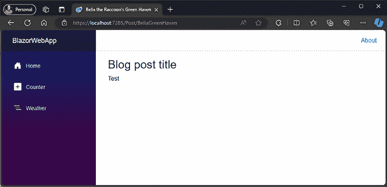

# 第五章：创建高级 Blazor 组件

在上一章中，我们学习了创建组件的所有基础知识。这一章将教会我们如何将我们的组件提升到下一个层次。

本章将重点介绍一些将使我们的组件可重用的功能，这将使我们节省时间，并让我们了解如何使用他人制作的可重用组件。

我们还将查看一些内置组件，这些组件在构建 Blazor 应用程序时将帮助你添加额外的功能（与使用 HTML 标签相比）。

在本章中，我们将涵盖以下主题：

+   探索绑定

+   动作和 EventCallback

+   使用 RenderFragment

+   探索新内置组件

# 技术要求

在本章中，我们将开始构建我们的组件。为此，你需要我们在 *第四章*，*理解基本 Blazor 组件* 中开发的代码。如果你遵循了前几章的说明，那么你就可以开始了。如果没有，那么请确保你克隆/下载了存储库。本章的起点可以在 `chapter04` 文件夹中找到，而完成的 `chapter` 在 `chapter05` 中。

你可以在 [`github.com/PacktPublishing/Web-Development-with-Blazor-Third-Edition/tree/main/Chapter05`](https://github.com/PacktPublishing/Web-Development-with-Blazor-Third-Edition/tree/main/Chapter05) 找到本章结果的源代码。

# 探索绑定

当构建应用程序时，数据很重要，我们可以使用绑定来显示或更改数据。通过使用绑定，你可以连接组件内的变量（以便自动更新）或通过设置组件属性。最神奇的是，通过使用绑定，Blazor 能够理解何时应该更新 UI 和变量（如果 UI 中的数据发生变化）。

在 Blazor 中，我们可以以两种不同的方式将值绑定到组件，如下所示：

+   单向绑定

+   双向绑定

通过使用绑定，我们可以在组件之间发送信息，并确保我们可以在需要时更新一个值。

## 单向绑定

我们已经在 *第四章*，*创建基本 Blazor 组件* 中讨论了单向绑定。让我们再次查看该组件，并在本节中继续构建它。

在本节中，我们将结合参数和绑定。

`Counter.razor` 示例如下所示：

```cs
@page "/counter" @rendermode InteractiveAuto
<PageTitle>Counter</PageTitle>
<h1>Counter</h1>
<p role="status">Current count: @currentCount</p>
<button class="btn btn-primary" @onclick="IncrementCount">Click me</button>
@code {
    private int currentCount = 0;
    private void IncrementCount()
    {
        currentCount++;
    }
} 
```

组件将显示当前计数和一个按钮，该按钮将增加当前计数。这是单向绑定。尽管按钮可以更改 `currentCount` 的值，但它只单向流向屏幕。

由于这部分是为了演示功能性和理论，而不是我们正在构建的完整项目的一部分，因此你不需要编写或运行此代码。这些组件的源代码可在 GitHub 上找到。

我们可以向 `Counter` 组件添加一个参数。代码将如下所示：

```cs
@page "/counterwithparameter"
@rendermode InteractiveAuto
<h1>Counter</h1>
<p>Current count: @CurrentCount</p>
<button class="btn btn-primary" @onclick="IncrementCount">Click me</button>
@code {
    [Parameter]
    public int IncrementAmount { get; set; } = 1;
    [Parameter]
    public int CurrentCount { get; set; } = 0;
    private void IncrementCount()
    {
        CurrentCount+=IncrementAmount;
    }
} 
```

代码示例有两个参数，一个用于`CurrentCount`，一个用于`IncrementAmount`。通过向组件添加参数，我们可以改变它们的行为。当然，这个示例有点愚蠢。你可能不会用到这种在按下按钮时只进行计数的组件。但它很好地说明了这个想法。

现在，我们可以将组件添加到另一个组件中。这就是我们如何创建可重用组件并通过更改参数的值来改变其行为的方法。

我们可以这样改变它的行为：

```cs
@page "/parentcounter"
@rendermode InteractiveAuto
<CounterWithParameter IncrementAmount="@incrementamount" CurrentCount="@
currentcount"/>
The current count is: @currentcount
@code {
    int incrementamount = 10;
    int currentcount = 0;
} 
```

在这个示例中，我们有两个变量，`incrementamount`和`currentcount`，我们将它们传递到我们的`CounterWithParameter`组件中。

如果我们运行这个程序，我们会看到一个`Counter`组件，它会以`10`的增量进行计数。然而，`currentcount`变量将不会更新，因为它只是一个单向绑定（一个方向）。

为了帮助我们实现这一点，我们可以实现双向绑定，这样我们的父组件就会通知任何变化。

## 双向绑定

**双向绑定**在两个方向上绑定值，我们的`Counter`组件将能够通知父组件任何变化。在下一章，*第六章*，*使用验证构建表单*中，我们将更详细地讨论双向绑定。

要使我们的`CounterWithParameter`组件进行双向绑定，我们需要添加一个`EventCallback`。名称必须由参数的名称后跟`Changed`组成。这样，Blazor 就会在值发生变化时更新值。在我们的例子中，我们需要将其命名为`CurrentCountChanged`。代码将如下所示：

```cs
[Parameter]
public EventCallback<int> CurrentCountChanged { get; set; }
private async Task IncrementCount()
{
    CurrentCount += IncrementAmount;
    await CurrentCountChanged.InvokeAsync(CurrentCount);
} 
```

通过仅使用该命名约定，Blazor 就知道`CurrentCountChanged`是当`CurrentCount`发生变化时将被触发的事件。

`EventCallback`不能为`null`，因此没有必要进行空检查（更多内容将在下一节中介绍）。

我们还需要更改我们监听变化的方式：

```cs
<CounterWithParameterAndEvent IncrementAmount="@incrementamount" @bind-CurrentCount="currentcount"/> 
```

我们需要在`CurrentCount`绑定前添加`@bind-`前缀。您也可以使用以下语法来设置事件的名称：

```cs
<CounterWithParameterAndEvent IncrementAmount="@incrementamount" @bind-CurrentCount="currentcount" @bind-CurrentCount:event="CurrentCountChanged"/> 
```

通过使用`:event`，我们可以告诉 Blazor 我们想要使用哪个事件；在这种情况下，是`CurrentCountChanged`事件。

在下一章，*第六章*，*使用验证构建表单*中，我们将继续探讨与输入/表单组件的绑定。

我们当然也可以使用**EventCallback**创建事件。

# 动作和 EventCallback

为了通信变化，我们可以使用**EventCallback**，如*双向绑定*部分所示。`EventCallback<T>`与我们在.NET 中可能习惯的有所不同。`EventCallback<T>`是一个专门为 Blazor 设计的类，以便将事件回调暴露为组件的参数。

在.NET 中，通常可以给事件添加多个监听器（多播），但使用`EventCallback<T>`，你只能添加一个监听器（单播）。

值得注意的是，你可以像在.NET 中一样使用事件。然而，你可能想使用`EventCallback<T>`，因为与传统的.NET 事件相比，使用`EventCallback`有很多优点，如下所示：

+   .NET 事件使用类，而`EventCallback`使用结构体。这意味着在 Blazor 中，我们不需要在调用`EventCallback`之前执行空检查，因为结构体不能为空。

+   `EventCallback`是异步的，并且可以被等待。当`EventCallback`被调用时，Blazor 将自动在消费组件上执行`StateHasChanged`以确保组件更新（如果需要更新）。

因此，如果你需要多个监听器，你可以使用`Action<T>`。否则，最好使用`EventCallback<T>`。

一些事件类型具有我们可以访问的事件参数。它们是可选的，所以在大多数情况下你不需要添加它们。

你可以通过在方法中指定它们来添加它们，或者你可以使用像这样的 lambda 表达式：

```cs
<button @onclick="@((e)=>message=$"x:{e.ClientX} y:{e.ClientY}")">Click me</button> 
```

当点击`button`时，它将设置一个名为`message`的变量，该变量包含鼠标坐标的字符串。Lambda 表达式有一个参数`e`，其类型为`MouseArgs`。然而，你不必指定类型，编译器会理解参数的类型。

现在我们已经添加了操作并使用**EventCallback**来通信更改，我们将在下一节中看到如何执行**RenderFragment**。

# 使用 RenderFragment

为了使我们的组件更加可重用，我们可以向它们提供一段 Razor 语法。在 Blazor 中，你可以指定**RenderFragment**，这是一个你可以执行并显示的 Razor 语法片段。

有两种类型的渲染元素，`RenderFragment`和`RenderFragment<T>`。`RenderFragment`是一个没有输入参数的简单 Razor 片段，而`RenderFragment<T>`有一个输入参数，你可以在 Razor 片段代码中使用`context`关键字来使用它。我们现在不会深入讨论如何使用它，但在本章的后面，我们将讨论一个使用`RenderFragment<T>`的组件（**Virtualize**），在下一章（第六章），我们将实现一个使用`RenderFragment<T>`的组件。

我们可以将`RenderFragment`作为组件标签内的默认内容，同时也可以给它一个默认值。我们将在下一节中探讨这一点，并使用这些特性构建一个组件。

当在列表中使用组件时，它可能会增加一些开销。它需要为每个组件执行整个生命周期。这就是渲染片段发挥作用的地方。我们可以创建一个返回渲染片段的方法，而不需要组件的开销。以下是一个例子：

```cs
@page "/RenderFragmentTest"
@for (int i = 0; i < 10; i++)
{
    @Render(i)
}
@code
{
    private RenderFragment Render(int number) 
    {
         return @<p>This is a render fragment @number</p>;
    }
} 
```

我们有一个返回渲染片段的方法的组件。

如果我们需要在其他组件中使用它，这个方法可以是静态的。当进行这样的循环时，它将提高性能，并且与有组件引用相比，对内存消耗的影响更低。

**网格组件**

如果你想深入了解渲染片段，请查看 **Blazm.Components**，它有一个使用 `RenderFragment<T>` 的网格组件。

你可以在 GitHub 上找到它：[`github.com/EngstromJimmy/Blazm.Components`](https://github.com/EngstromJimmy/Blazm.Components)。

## 子内容

通过将渲染片段命名为 `ChildContent`，Blazor 将自动使用组件标签之间的任何内容。然而，这仅在您使用单个渲染片段时才有效；如果您使用多个，您还必须指定 `ChildComponent` 标签。我们将在下一节中构建一个使用 `childcontent` 渲染片段的组件。

## 默认值

我们可以提供带有默认值的 `RenderFragment` 或通过使用 `@` 符号在代码中设置它：

```cs
@<b>This is a default value</b>; 
```

## 构建一个警报组件

为了更好地理解如何使用渲染片段，让我们构建一个将使用渲染片段的警报组件。内置模板使用 Bootstrap，因此我们将为此组件做同样的事情。Bootstrap 有许多组件很容易导入到 Blazor 中。当在大型项目上与多个开发者合作时，构建组件是确保团队中每个人以相同方式编写代码的简单方法。

让我们基于 Bootstrap 构建一个简单的警报组件：

1.  通过在 `SharedComponents 项目` 上右键单击并选择 **添加** | **新建文件夹** 来创建一个文件夹，并将其命名为 `ReusableComponents`。

1.  创建一个新的 Razor 组件，并将其命名为 `Alert.razor`。

1.  在 `Alert.razor` 文件中，将内容替换为以下代码：

    ```cs
    <div class="alert alert-primary" role="alert">
        A simple primary alert—check it out!
    </div> 
    ```

    代码是从 Bootstrap 的网页 [`getbootstrap.com`](http://getbootstrap.com) 复制的，它显示了一个看起来像这样的警报：

    

    图 5.1：Bootstrap 警报组件的默认外观

    我们可以通过两种方式自定义这个 `alert` 组件。我们可以添加一个 `string` 参数用于消息。

    然而，由于这是一个关于渲染片段的部分，我们将探索第二种选项——是的，你已经猜到了，*渲染片段*。

1.  添加一个具有 `RenderFragment` 属性的代码部分，并将其命名为 `ChildContent`，并用新属性替换警报文本：

    ```cs
    <div class="alert alert-primary" role="alert">
        @ChildContent
    </div>
    @code{
        [Parameter]
        public RenderFragment ChildContent { get; set; } =@<b>This is a default value</b>;
    } 
    ```

    现在我们有一个 `RenderFragment` 并设置了一个默认值，在 `div` 标签之间显示片段。我们还想添加一个 `enum` 来表示不同的样式化警报框的方式。

1.  在 `代码` 部分，添加一个包含不同样式的 `enum`：

    ```cs
    public enum AlertStyle
    {
        Primary,
        Secondary,
        Success,
        Danger,
        Warning,
        Info,
        Light,
        Dark
    } 
    ```

1.  为 `enum` 风格添加一个参数/属性：

    ```cs
    [Parameter]
    public AlertStyle Style { get; set; } 
    ```

1.  最后一步是更新 `div` 的 `class` 属性。将 `class` 属性更改为以下样子：

    ```cs
    <div class="@($"alert alert-{Style.ToString().ToLower()}")" role="alert"> 
    ```

1.  在 `SharedComponents` 项目中，在 `Pages` 文件夹中，创建一个新的 razor 组件，并将其命名为 `AlertTest.razor`。

    将代码替换为以下片段：

    ```cs
    @page "/alerttest"
    @using SharedComponents.ReusableComponents
    <Alert Style="Alert.AlertStyle.Danger">
        This is a test
    </Alert>
    <Alert Style="Alert.AlertStyle.Success">
    <ChildContent>
            This is another test
        </ChildContent>
    </Alert>
    <Alert Style="Alert.AlertStyle.Success"/> 
    ```

    页面显示了三个警报组件：

    第一个具有 `Danger` 风格，我们没有指定为 `This is a test` 文本设置哪个属性，但按照惯例，它将使用名为 `ChildContent` 的属性。

    在第二个中，我们指定了 `ChildContent` 属性。如果你在组件中使用更多的渲染片段，你必须像这样设置它们，使用全名。

    在最后一个中，我们没有指定任何内容，这将给属性赋予我们在组件中指定的默认渲染片段。

1.  运行 `BlazorServer` 项目并导航到 `/AlertTest` 以查看测试页面：


图 5.2：测试页面的截图

我们已经完成了我们的第一个可重用组件！

创建可重用组件是我更喜欢用来制作我的 Blazor 网站的方式，因为我不必写两次相同的代码。如果你在一个更大的团队中工作，这一点会更加明显。这使得所有开发者都能产生相同的代码和最终结果，并且通过这种方式，他们可以获得更高的代码质量并减少测试需求。

当我们升级到最新的 Bootstrap 版本时，一些 CSS 类已被弃用并由其他类替换。幸运的是，我们通过创建可重用组件来遵循这种方法，所以我们只需要更改几个地方。有几个地方我们仍然有一些旧的代码库（未使用组件），这变得非常明显，创建组件是值得努力的。

Blazor 有很多内置组件。在下一节中，我们将深入了解它们是什么以及如何使用它们。

当涉及到可重用组件时，我们在那上面投入了相当多的时间。如果你发现自己正在写两次相同的代码，你可能想把它添加到一个组件中。在我以前的工作中，我们开始使用 `Radzen`，这是一个开源的组件库（以及其他一些东西）。在我目前的工作中，我们使用 `MudBlazor`。我们在流中使用 `Progress Telerik`。使用第三方组件可以加快开发速度，但通常，这些组件是为许多不同的用户构建的。它们可以做很多事情。这意味着我们团队上的每个开发者现在都可以访问所有这些力量。权力越大，责任越大。

在我的一次演讲中，我引用了这句话，配图是蝙蝠侠，文字写着“超人”。我没有得到任何反应。我从未用这样的笑话失败过。但开个玩笑，这意味着所有开发者都需要记住如何使用组件。否则，UI 可能会因为使用组件的开发者不同而看起来不同。我投入了很多时间来设计可重用组件，帮助团队提高生产力。隐藏我们不使用的参数，为组件提供合理的默认值。所以，即使你使用第三方组件，也尽量弄清楚你在使用什么，也许可以在第三方组件之上创建一个抽象层。如果你不知道，这句话来自蜘蛛侠，或者更准确地说，是本叔叔。但它确实让我想起了我最喜欢的双关语。你知道为什么蜘蛛侠总是有如此机智的回应吗？因为能力越大，责任越大。我要退场了。

# 探索新的内置组件

当 Blazor 首次推出时，有几件事情很难做，在某些情况下，我们需要涉及 JavaScript 来解决挑战。在本节中，我们将查看我们在 .NET 5 到 .NET 8 中获得的一些新组件。

我们将查看以下新组件或函数：

+   设置 UI 的焦点

+   影响 HTML 头部

+   组件虚拟化

+   错误边界

+   部分

## 设置 UI 的焦点

我的第一篇 Blazor 博客文章是关于如何在 UI 元素上设置焦点，但现在这已经内置到框架中了。之前的解决方案涉及对 UI 元素的 JavaScript 调用来更改焦点。

通过使用 `ElementReference`，你现在可以设置元素的焦点。

让我们构建一个组件来测试这个新特性的行为：

1.  在 `SharedComponents` 项目中，在 `Pages` 文件夹中，添加一个新的 Razor 组件，并将其命名为 `SetFocus.razor`。

1.  打开 `SetFocus.razor` 并添加一个 `page` 指令：

    ```cs
    @page "/setfocus" @rendermode InteractiveAuto 
    ```

1.  添加一个元素引用：

    ```cs
    @code {
        ElementReference textInput;
    } 
    ```

    `ElementReference` 就像它的名字一样，是对一个元素的引用。在这种情况下，它是一个输入文本框。

    在 `_Imports` 文件中，添加以下行：

    ```cs
    @using static Microsoft.AspNetCore.Components.Web.RenderMode 
    ```

1.  添加文本框和按钮：

    ```cs
    <input @ref="textInput" />
    <button @onclick="() => textInput.FocusAsync()">Set focus</button> 
    ```

    使用 `@ref`，我们指定了对任何类型组件或标签的引用，我们可以使用它来访问输入框。`button onclick` 方法将执行 `FocusAsync()` 方法并将焦点设置在文本框上。

1.  按下 *F5* 运行项目，然后导航到 `/setfocus`。

1.  按下 **设置焦点** 按钮，注意文本框如何获得焦点。

这个例子可能看起来很愚蠢，因为它只设置了焦点，但这是一个实用的功能，而 `autofocus` HTML 属性在 Blazor 中不起作用。在 `OnAfterRender` 方法中调用 `FocusAsync` 以在页面加载时获取焦点更改会更合理，但这不会让演示变得那么酷。

在我的博客帖子中，我采取了另一种方法。我的目标是设置一个元素的焦点，而无需使用代码。在即将到来的第六章，*使用验证构建表单*中，我们将实现我的博客帖子中的`autofocus`功能，但使用新的.NET 功能。

.NET 5 的发布解决了我们之前必须用 JavaScript 编写的一些问题；设置焦点就是一个例子。在.NET 6 中，我们有一种方法可以影响 HTML 头。

## 影响`HTML head`

有时，我们想要设置页面的标题或更改社交网络`meta`标签。`head`标签位于`App`组件中，页面这部分不会重新加载/重新渲染（只有路由组件内的组件会重新渲染）。在 Blazor 的早期版本中，你必须自己使用 JavaScript 编写代码来实现这一点。

但.NET 有一个名为`HeadOutlet`的新组件可以解决这个问题。

要使用这些组件，我们将创建一个页面来查看我们的博客帖子之一。我们将使用我们学到的大多数技术：

1.  在`SharedComponents`项目中，打开`Home.razor`。

1.  将`foreach`循环修改如下：

    ```cs
    <li><a href="/Post/@p.Id">@p.Title</a></li> 
    ```

    我们在标题中添加了一个链接来查看一个博客帖子。注意我们如何在`href`属性内部使用`@`符号来获取帖子的 ID。

1.  在`Pages`文件夹中，添加一个 Razor 组件，并将其命名为`Post.razor`。

1.  在`code`部分中，添加一个参数来保存帖子的 ID：

    ```cs
    [Parameter]
    public string BlogPostId { get; set; } 
    ```

    这将保存来自 URL 的博客帖子的 ID。

1.  添加一个`page`指令以获取集合、URL 和 ID：

    ```cs
    @page "/post/{BlogPostId}" 
    ```

    `page`指令将为我们的博客帖子设置 URL 为`/post/`，后跟帖子的 ID。我们不必在所有组件中添加`using`语句。相反，打开`_Imports.razor`并添加以下命名空间：

    ```cs
    @using Data.Models.Interfaces
    @using Data.Models 
    ```

    这将确保所有我们的组件默认具有这些命名空间。

1.  再次打开`Post.razor`，在`page`指令下方注入 API（命名空间现在由`_Imports.razor`提供）：

    ```cs
    @inject IBlogApi _api
    @inject NavigationManager _navman 
    ```

    我们现在将 API 注入到组件中，我们可以检索我们的博客帖子。我们还可以访问导航管理器。

1.  在`code`部分中，为我们的博客帖子添加一个属性：

    ```cs
    public BlogPost? BlogPost { get; set; } 
    ```

    这将包含我们想在页面上显示的博客帖子。

1.  要加载博客帖子，请添加以下代码：

    ```cs
    protected async override Task OnParametersSetAsync()
    {
        BlogPost=await _api.GetBlogPostAsync(BlogPostId);
        await base.OnParametersSetAsync();
    } 
    ```

    在这种情况下，我们使用`OnParametersSetAsync()`方法。这是为了确保我们在从数据库获取数据时设置参数，并且当参数更改时内容会更新。

1.  我们还必须在帖子中显示并添加必要的`meta`标签。为此，只需在`code`部分上方添加以下代码：

    ```cs
    @if (BlogPost != null)
    {
        <PageTitle>@BlogPost.Title</PageTitle>
    <HeadContent>
    <meta property="og:title"
     content="@BlogPost.Title" />
    <meta property="og:description" content="@(new
          string(BlogPost.Text.Take(100).ToArray()))" />
    <meta property="og:image" content=
     "@($"{_navman.BaseUri}/pathtoanimage.png")" />
    <meta property="og:url" content="@_navman.Uri" />
    <meta name="twitter:card" content="@(new string(BlogPost.Text.Take(100).ToArray()))" />
    </HeadContent>
    <h2>@BlogPost.Title</h2>
        @((MarkupString)BlogPost.Text)

    } 
    ```

    当页面首次加载时，`BlogPost`参数可能为空，因此我们首先需要检查是否应该显示内容。

    通过添加`Title`组件，Blazor 将设置我们网站的标题，在本例中是博客帖子的标题。

    根据我收集的关于 **搜索引擎优化**（**SEO**）的信息，我们添加的元标签是使用 Facebook 和 X（以前称为 Twitter）时所需的最基本内容。我们没有为每篇博客文章添加图片，但如果我们愿意，我们可以有一个网站范围内的图片（适用于所有博客文章）。只需将 `Pathtoanimage.png` 更改为图片名称，并将图片放入 `wwwroot` 文件夹中。

    如果加载了博客文章，则显示一个带有标题和下方文本的 `H3` 标签。你可能还记得来自 *第四章*，*理解基本 Blazor 组件* 中的 `MarkupString`。这将输出我们博客文章中的字符串，而不会更改 HTML（不会转义 HTML）。

1.  通过按 *F5* 键运行项目，并导航到一篇博客文章，可以看到标题的变化：



图 5.3：博客文章截图

我们的博客开始成形。我们有一个博客文章列表，可以查看单个文章；我们还有很长的路要走，但我们已经走上了正轨。

## 组件虚拟化

**Virtualize** 是 Blazor 中的一个组件，它将确保只渲染可以适应屏幕的组件或行。如果你有一个包含大量项的列表，渲染所有这些项将对内存产生重大影响。

许多第三方组件供应商提供具有相同虚拟化功能的网格组件。在我看来，`Virtualize` 组件是 .NET 5 版本中最令人兴奋的事情之一。

`Virtualize` 组件将计算屏幕上可以容纳多少项（基于窗口大小和项的高度）。如果你滚动页面，Blazor 将在内容列表前后添加一个 `div` 标签，确保滚动条显示正确的位置和比例（即使没有渲染任何项）。

`Virtualize` 组件的工作方式与 `foreach` 循环类似。

以下是我们目前在 `Home.razor` 文件中的代码：

```cs
<ul>
    @foreach (var p in posts)
    {
        <li><a href="/Post/@p.Id">@p.Title</a></li>
    }
</ul> 
```

目前，它将显示我们数据库中的所有博客文章的长列表。诚然，我们现在只有几个，但有一天我们可能会有很多文章。

我们可以将代码（现在不要更改代码）更改为使用新的 `Virtualize` 组件，将其更改为以下内容：

```cs
<Virtualize Items="posts" Context="p">
<li><a href="/Post/@p.Id">@p.Title</a></li>
</Virtualize> 
```

我们不是使用 `foreach` 循环，而是使用 `Virtualize` 组件并添加一个渲染片段，以显示每个项应该如何渲染。`Virtualize` 组件使用 `RenderFragment<T>`，默认情况下，它将发送类型为 `T` 的项到渲染片段。在 `Virtualize` 组件的情况下，对象将是一篇博客文章（因为项是博客文章的 `List<T>`）。我们使用名为 `context` 的变量访问每篇文章。然而，我们可以在 `Virtualize` 组件上使用 `Context` 属性来指定另一个名称，因此我们现在使用的是 `p` 而不是 `context`。

`Virtualize` 组件比这更强大，正如我们将在下一个要实现的功能中看到的那样：

1.  在 `SharedComponents` 项目中，打开 `Home.razor`。

1.  删除`OnInitializedAsync`方法和`protected List<BlogPost> posts = new List<BlogPost>()`；我们不再需要它们了。

1.  将帖子的加载改为`Virtualize`：

    ```cs
    <ul>
    <Virtualize ItemsProvider="LoadPosts" Context="p">
    <li><a href="/Post/@p.Id">@p.Title</a></li>
    </Virtualize>
    </ul> 
    ```

    在这种情况下，我们使用`ItemsProvider`委托，它将负责从我们的 API 获取帖子。

    我们传递一个名为`LoadPosts`的方法，我们还需要将其添加到文件中。

1.  现在，让我们通过添加以下代码来添加`LoadPosts`方法：

    ```cs
    public int totalBlogposts { get; set; }
    private async ValueTask<ItemsProviderResult<BlogPost>> LoadPosts(ItemsProviderRequest request)
    {
        if (totalBlogposts == 0)
        {
            totalBlogposts = await _api.GetBlogPostCountAsync();
        }
        var numblogposts = Math.Min(request.Count, totalBlogposts - request.StartIndex);
        var blogposts= await _api.GetBlogPostsAsync(numblogposts,request.StartIndex);
        return new ItemsProviderResult<BlogPost>(blogposts, totalBlogposts);
    } 
    ```

我们将在数据库中添加一个`totalBlogposts`属性，用于存储我们目前拥有的帖子数量。`LoadPost`方法返回带有`ItemsProviderResult<Blogpost>`的`ValueTask`。该方法以`ItemsProviderRequest`作为参数，其中包含`Virtualize`组件想要的帖子数量以及它想要跳过的数量。

如果我们不知道总共有多少帖子，我们需要通过调用`GetBlogPostCountAsync`方法从我们的 API 检索该信息。然后，我们需要确定我们应该获取多少帖子；要么获取我们需要的所有帖子，要么获取所有剩余的帖子（无论值是多少）。

然后，我们通过调用`GetBlogPostsAsync`并返回`ItemsProviderResult`来调用我们的 API 获取实际的帖子。

我们实现了一个`Virtualize`组件，它将只加载和渲染填充屏幕所需的博客帖子数量。但这是一个需要交互才能工作的交互式组件。如果你现在尝试运行项目，你会注意到屏幕是空的。如果我们向`Home`组件添加`@rendermode InteractiveServer`，它就会再次开始工作。目前，`InteractiveServer`是我们唯一能用的东西。这是我们在 DI 方面设置好的唯一场景。

## 错误边界

在.NET 6 中，我们有一个非常方便的组件来处理错误，称为**ErrorBoundary**。

我们可以用`ErrorBoundary`组件包围组件；如果发生错误，它将显示错误消息而不是整个页面失败：

```cs
<ErrorBoundary>
<ComponentWithError />
</ErrorBoundary> 
```

此组件接受两个渲染片段。通过指定如前例所示，我们只设置了`ChildContent`渲染片段。这是默认的。

我们也可以提供自定义的错误消息，如下所示：

```cs
<ErrorBoundary>
<ChildContent>
<ComponentWithError />
</ChildContent>
<ErrorContent>
<h1 style="color: red;">Oops… something broke</h1>
</ErrorContent>
</ErrorBoundary> 
```

在这个示例中，我们指定了`ChildContent`，这使得我们能够指定多个属性，就像`ErrorContent`一样。这是一个很好的组件，可以扩展并创建自己的功能。您可以通过使用`context`参数（就像我们在`virtualize`中做的那样）来访问异常：

```cs
<ErrorBoundary Context="ex">
<ChildContent>
<p>@(1/zero)</p>
</ChildContent>
<ErrorContent>
       An error occurred
       @ex.Message
    </ErrorContent>
</ErrorBoundary>
@code {
    int zero = 0;
} 
```

这是在 UI 中处理错误的好方法。

## 部分

.NET 8 为我们提供了添加部分的能力。你可能还记得`WebForms`中类似的特性。

我们可以使用`SectionOutlet`组件在布局组件中定义一个区域，我们想在其中插入内容。然后，在我们的组件内部，我们可以添加一个`SectionContent`，在其中添加我们想要在出口中显示的内容。

如果我们有一个以上的 `SectionContent` 引用了 `SectionOutlet`，它将渲染最新的 `SectionContent`。我们可以通过使用部分名称或部分 ID 来引用一个 `SectionOutlet`。部分名称只是一个我们可以使用的字符串。ID 是一个对象，因此我们可以获得更优雅的语法来跟踪我们的部分。

我们可以在布局文件中添加一个部分，并从我们的组件中添加内容到该部分。这是一个布局问题。假设我们想添加上下文菜单。例如，这样我们就可以更改一个完全不同的组件中的菜单。

让我们看看一些代码。

首先，我们可能需要添加这个命名空间：

```cs
Microsoft.AspNetCore.Components.Sections; 
```

最好在 `_imports.razor` 文件中（因为这是内置组件之一）。

在布局组件中，我们添加一个出口，如下所示：

```cs
<SectionOutlet SectionName="top-header"/> 
```

然后，在我们的组件中，我们可以添加一个 `SectionContent`，如下所示：

```cs
<SectionContent SectionName="top-header">
<b>Test</b>
</SectionContent> 
```

如果我们想使用部分 ID，可以这样做：在布局文件中，假设它被命名为 `MainLayout`。

```cs
<SectionOutlet SectionId="MainLayout.TopHeader"/> 
```

在 `MainLayout` 的代码部分：

```cs
@code
{
    public static SectionOutlet TopHeader = new()
} 
```

然后，在组件内部，我们将其更改为这样：

```cs
<SectionContent SectionId="Layout.MainLayout.TopHeader">
<b>Using SectionId</b>
</SectionContent> 
```

这是一种改变布局文件的好方法。通过这样做，我们可以创建更高级的布局，这些布局可以与每个页面/组件一起工作。我们可以将更多的布局移动到布局文件中，而不是将其放在每个组件中。我喜欢这个功能。这将清理掉很多代码。

# 摘要

在本章中，我们探讨了构建组件的更高级场景。构建组件正是 Blazor 的核心所在。组件还使得在过程中进行更改变得容易，因为只有一个地方必须实现更改。我们还实现了我们的第一个可重用组件，这将有助于在整个团队中保持相同的标准并减少重复代码。

我们还使用了一些 Blazor 功能来加载和显示数据。

在下一章中，我们将探讨表单和验证，以开始构建我们博客的管理部分。

# 加入我们的 Discord 社区

加入我们社区的 Discord 空间，与作者和其他读者进行讨论：

[`packt.link/WebDevBlazor3e`](https://packt.link/WebDevBlazor3e)


