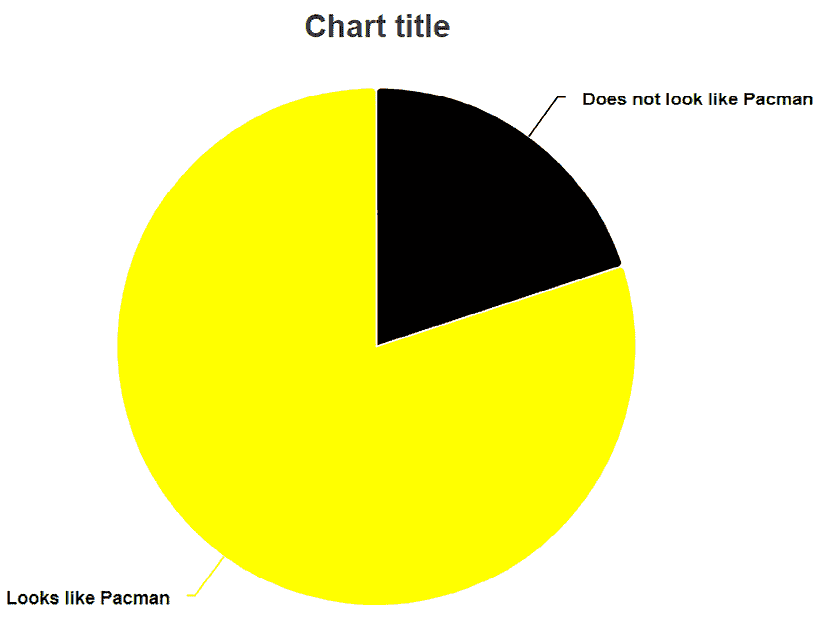

# JavaScript 互操作

在本章中，我们将探讨 JavaScript。在特定场景中，我们仍然需要使用 JavaScript，或者我们可能想使用依赖于 JavaScript 的现有库。Blazor 使用 JavaScript 来更新 **文档对象模型**（**DOM**），下载文件，并访问客户端上的本地存储。

因此，总会有，并且始终会有，我们需要与 JavaScript 通信或让 JavaScript 与我们通信的情况。别担心，Blazor 社区是一个了不起的社区，所以很可能有人已经构建了我们需要的互操作。

在本章中，我们将涵盖以下主题：

+   为什么我们需要 JavaScript？

+   .NET 到 JavaScript

+   JavaScript 到 .NET

+   实现现有的 JavaScript 库

+   WebAssembly 中的 JavaScript 互操作

# 技术要求

确保你已经遵循了前面的章节或使用 `Chapter09` 文件夹作为起点。

你可以在 [`github.com/PacktPublishing/Web-Development-with-Blazor-Third-Edition/tree/main/Chapter10`](https://github.com/PacktPublishing/Web-Development-with-Blazor-Third-Edition/tree/main/Chapter10) 找到本章结果的源代码。

如果你正在使用 GitHub 上的代码跳入这一章，请确保你已经在设置文件中添加了 `Auth0` 账户信息。你可以在 *第八章*，*身份验证和授权* 中找到说明。

# 为什么我们需要 JavaScript？

许多人说 Blazor 是 JavaScript 杀手，但事实是 Blazor 需要 JavaScript 来工作。某些事件仅在 JavaScript 中触发，如果我们想使用这些事件，我们需要进行互操作。

我开玩笑地说，我在开始使用 Blazor 进行开发时从未写过这么多 JavaScript。这并不糟糕。

我已经编写了几个需要 JavaScript 才能工作的库。它们被称为 `Blazm.Components` 和 `Blazm.Bluetooth`。

第一个是一个网格组件，它使用 JavaScript 互操作在窗口大小调整时触发 C# 代码（JavaScript 到 .NET），以移除无法适应窗口的列。

当触发时，C# 代码会调用 JavaScript 来获取列的大小，这是只有网络浏览器才知道的，然后根据这个答案，如果需要的话，它会移除列。

第二个，`Blazm.Bluetooth`，使得使用 Web Bluetooth 与蓝牙设备交互成为可能，这是一个通过 JavaScript 可访问的 Web 标准。

它使用双向通信；蓝牙事件可以触发 C# 代码，而 C# 代码可以遍历设备并向它们发送数据。它们都是开源的，所以如果你对查看一个真实世界的项目感兴趣，你可以在我的 GitHub 上查看它们：[`github.com/EngstromJimmy`](https://github.com/EngstromJimmy)。

如前所述，在大多数情况下，我会说我们不需要自己编写 JavaScript。Blazor 社区非常大，所以很可能有人已经编写了我们需要的代码。但我们也不必害怕使用 JavaScript。接下来，我们将探讨向我们的 Blazor 项目添加 JavaScript 调用的不同方法。

# .NET 到 JavaScript

从 .NET 调用 JavaScript 非常简单。有两种这样做的方法：

+   全局 JavaScript

+   JavaScript 隔离

我们将探讨这两种方法，看看它们有什么区别。

## 全局 JavaScript（旧方法）

要访问 JavaScript 方法，我们需要使其可访问。一种方法是通过 JavaScript 窗口对象全局定义它。这是一种不好的做法，因为它对所有脚本都是可访问的，并且可能会替换其他脚本中的功能（如果我们不小心使用了相同的名称）。

例如，我们可以使用作用域，在全局空间中创建一个对象，并将我们的变量和方法放在该对象上，这样我们就能降低一点风险，至少。

使用作用域可能看起来像这样：

```cs
<script>
window.myscope = {};
window.myscope.methodName = () => { alert("this has been called"); }
</script> 
```

我们创建一个名为 `myscope` 的对象。然后，我们在该对象上声明一个名为 `methodName` 的方法。在这个例子中，方法中没有代码；这只是为了演示如何实现。

然后，要从 C# 调用该方法，我们将使用 `JSRuntime` 如此调用：

```cs
@using Microsoft.JSInterop
@inject IJSRuntime jsRuntime
await jsRuntime.InvokeVoidAsync("myscope.methodName"); 
```

我们可以使用两种不同的方法来调用 JavaScript：

+   `InvokeVoidAsync`，它调用 JavaScript 但不期望返回值

+   `InvokeAsync<T>`，它调用 JavaScript 并期望返回类型为 `T` 的值

如果我们想的话，我们也可以向我们的 JavaScript 方法发送参数。我们还需要引用 JavaScript，并且 JavaScript 必须存储在 `wwwroot` 文件夹中。

另一种方法是 JavaScript 隔离，它使用这里描述的方法，但使用模块。

## JavaScript 隔离

在 .NET 5 中，我们得到了一种使用 JavaScript 隔离添加 JavaScript 的新方法，这是一种调用 JavaScript 的更好方式。它不使用全局方法，也不需要我们引用 JavaScript 文件。

这对于组件供应商和最终用户来说都很棒，因为 JavaScript 只在需要时加载。它只会加载一次（Blazor 为我们处理这一点），我们不需要添加对 JavaScript 文件的引用，这使得开始和使用库变得更容易。

所以，让我们来实现它。

隔离的 JavaScript 可以存储在 `wwwroot` 文件夹中，但自从 .NET 6 更新以来，我们可以像添加隔离 CSS 一样添加它们。将它们添加到组件的文件夹中，并命名为，在末尾添加 `.js`（`mycomponent.razor.js`）。

让我们就这样做！

在我们的项目中，我们可以删除类别和组件。让我们实现一个简单的 JavaScript 调用来显示一个提示，以确保用户想要删除类别或标签。但我们已经讨论了以可重用方式做事，所以让我们这样做：

1.  在`SharedComponents`项目中，选择`ReusableComponents/BlogButton.razor`文件，创建一个新的 JavaScript 文件，并将文件命名为`BlogButton.razor.js`。

1.  打开新文件（位于解决方案资源管理器中的`BlogButton.razor`下）并添加以下代码：

    ```cs
    export function showConfirm(message) {
        return confirm(message);
    } 
    ```

    JavaScript Isolation 使用标准的**EcmaScript**（**ES**）模块，并且可以按需加载。它公开的方法只能通过该对象访问，而不是像*旧方法*那样全局访问。

1.  打开`BlogButton.razor`并在文件顶部注入`IJSRuntime`：

    ```cs
    @using Microsoft.JSInterop
    @inject IJSRuntime jsRuntime 
    ```

1.  在`code`部分，让我们添加一个将调用 JavaScript 的方法：

    ```cs
     IJSObjectReference jsmodule;
        [Parameter]
        public string? ConfirmMessage { get; set; } = null;
        private async Task<bool> ShouldExecute()
        {
            if (ConfirmMessage != null)
            {
                jsmodule = await jsRuntime.InvokeAsync<IJSObjectReference>("import", "/_content/SharedComponents/ReusableComponents/BlogButton.razor.js");
                return await jsmodule.InvokeAsync<bool>("showConfirm", ConfirmMessage);
            }
            else
            {
                return true;
            }
        } 
    ```

    `IJSObjectReference`是对我们将进一步导入的特定脚本的引用。它有权访问我们的 JavaScript 中导出的方法，而其他什么都没有。

    我们运行`Import`命令并将文件名作为参数发送。这将运行`let mymodule = import("/_content/SharedComponents/ReusableComponents/BlogButton.razor.js")` JavaScript 命令并返回模块。我们还添加了一个`ConfirmMessage`参数，这样我们知道如果有`ConfirmMessage`，我们应该显示确认消息。

    然后，在我们的`OnButtonClick`方法中，我们首先检查是否应该执行该方法。将其更改为以下内容：

    ```cs
    if (OnClick.HasDelegate && await ShouldExecute())
     {
         await OnClick.InvokeAsync(args);
     } 
    ```

    现在，我们可以使用我们的按钮来确认我们是否想要删除`Category`或`Tag`。

1.  打开`ItemList.razor`，并将我们的`BlogButton`添加到组件中。在`Virtualize`组件内部，将内容更改为以下内容：

    ```cs
     <tr>
    <td>
    <BlogButton OnClick="@(()=> {SelectEvent.InvokeAsync(item); })"> Select</BlogButton>
    </td>
    <td>@ItemTemplate(item)</td>
    <td>
    <BlogButton ConfirmMessage="Are you sure you want to delete this item?" Type="BlogButton.ButtonType.Delete" OnClick="@(()=> {DeleteEvent.InvokeAsync(item);})"> Delete</BlogButton>
    </td>
    </tr> 
    ```

而不是仅仅调用我们的`Delete`事件回调，我们首先调用我们的新方法。让 JavaScript 确认你确实想要删除它，如果是的话，然后运行`Delete`事件回调。

这是一个简单的 JavaScript 实现。

# JavaScript 到.NET

反过来呢？我认为从 JavaScript 调用.NET 代码并不是一个非常常见的场景，如果我们发现自己处于那种场景，我们可能需要考虑我们在做什么。

作为 Blazor 开发者，我们应该尽可能避免使用 JavaScript。

我并不是在以任何方式批评 JavaScript，但我看到开发者经常将他们之前使用过的东西强行塞入 Blazor 项目中。

他们用 JavaScript 解决的是用 Blazor 中的`if`语句容易解决的问题。这就是为什么我认为考虑何时使用 JavaScript 以及何时不使用 JavaScript 是至关重要的。

当然，有时 JavaScript 是唯一的选择，如我之前提到的，`Blazm`使用双向通信。

从 JavaScript 到.NET 代码的回调有三种方式：

+   静态.NET 方法调用

+   实例方法调用

+   组件实例方法调用

让我们更仔细地看看它们。

## 静态.NET 方法调用

要从 JavaScript 调用.NET 函数，我们可以使函数静态，并且还需要将`JSInvokable`属性添加到方法上。

我们可以在 Razor 组件的`code`部分或类内部添加一个这样的函数：

```cs
[JSInvokable]
public static Task<int[]> ReturnArrayAsync()
{
   return Task.FromResult(new int[] { 1, 2, 3 });
} 
```

在 JavaScript 文件中，我们可以使用以下代码调用该函数：

```cs
DotNet.invokeMethodAsync('BlazorWebAssemblySample', 'ReturnArrayAsync')
      .then(data => {
        data.push(4);
          console.log(data);
      }); 
```

`DotNet`对象来自`Blazor.js`或`blazor.server.js`文件。

`BlazorWebAssemblySample`是程序集的名称，`ReturnArrayAsync`是静态.NET 函数的名称。

如果我们不想让函数名与方法名相同，我们也可以在`JSInvokeable`属性中指定函数名，如下所示：

```cs
[JSInvokable("DifferentMethodName")] 
```

在这个示例中，JavaScript 回调到.NET 代码，该代码返回一个`int`数组。

它在 JavaScript 文件中以 promise 的形式返回，我们等待它，然后（使用`then`运算符）继续执行，将`4`添加到数组中，然后在控制台输出值。

## 实例方法调用

这个方法有点棘手；我们需要传递.NET 对象的实例来调用它（这是`Blazm.Bluetooth`使用的方法）。

首先，我们需要一个类来处理方法调用：

```cs
using Microsoft.JSInterop;
public class HelloHelper
{
    public HelloHelper(string name)
    {
        Name = name;
    }
    public string Name { get; set; }
    [JSInvokable]
    public string SayHello() => $"Hello, {Name}!";
} 
```

这个类在构造函数中接受一个字符串（一个名字）和一个名为`SayHello`的方法，该方法返回一个包含`"Hello,"`和我们在创建实例时提供的名字的字符串。

因此，我们需要创建这个类的实例，提供一个名字，并创建`DotNetObjectReference<T>`，这将使 JavaScript 能够访问这个实例。

但首先，我们需要能够调用.NET 函数的 JavaScript：

```cs
export function sayHello (dotnetHelper) {
    return dotnetHelper.invokeMethodAsync('SayHello').then(r => alert(r));
} 
```

在这种情况下，我们使用导出语法，并导出一个名为`sayHello`的函数，它接受一个名为`dotnetHelper`的`DotNetObjectReference`实例。

在该实例中，我们调用`SayHello`方法，这是.NET 对象上的`SayHello`方法。在这种情况下，它将引用`HelloHelper`类的一个实例。

我们还需要调用 JavaScript 方法，我们可以从一个类或，在这种情况下，从一个组件中这样做：

```cs
@page "/interop" @using Microsoft.JSInterop
@inject IJSRuntime jsRuntime
@implements IDisposable
<button type="button" class="btn btn-primary" @onclick="async ()=> { await TriggerNetInstanceMethod(); }">    Trigger .NET instance method HelloHelper.SayHello </button>
@code {
    private DotNetObjectReference<HelloHelper> objRef;

    IJSObjectReference jsmodule;
    public async ValueTask<string>
 TriggerNetInstanceMethod()
    {
        objRef = DotNetObjectReference.Create(new HelloHelper("Bruce Wayne"));
        jsmodule = await jsRuntime. InvokeAsync<IJSObjectReference>("import", "/_content/MyBlog.Shared/Interop.razor.js");
        return await jsmodule.InvokeAsync<string>("sayHello", objRef);
    }
    public void Dispose()
    {
        objRef?.Dispose();
    }
} 
```

让我们来看看这个类。我们注入`IJSRuntime`，因为我们需要它来调用 JavaScript 函数。为了避免任何内存泄漏，我们还需要确保实现`IDisposable`接口，并在文件的底部确保销毁`DotNetObjectReference`实例。

我们创建一个`DotNetObjectReference<HelloHelper>`类型的私有变量，它将包含我们对`HelloHelper`实例的引用。我们创建`IJSObjectReference`以便我们可以加载我们的 JavaScript 函数。

然后，我们创建一个`DotNetObjectReference.Create(new HelloHelper("Bruce Wayne"))`的新实例，它是我们对`HelloHelper`类的新实例的引用，我们向其提供名字`"Bruce Wayne"`。

现在，我们有`objRef`，我们将将其发送到 JavaScript 方法，但首先，我们加载 JavaScript 模块，然后调用`JavaScriptMethod`并传入我们的`HelloHelper`实例的引用。现在，JavaScript 的`sayHello`方法将运行`hellohelperref.invokeMethodAsync('SayHello')`，这将调用`SayHelloHelper`并返回一个包含`"Hello, Bruce Wayne"`的字符串。

我们还可以使用两种其他方法从 JavaScript 调用 .NET 函数。我们可以在组件实例上调用一个方法来触发一个动作，但这不是 Blazor Server 的推荐方法。我们还可以通过使用 `helper` 类在组件实例上调用一个方法。

由于从 JavaScript 调用 .NET 很少见，我们不会深入探讨两个示例。相反，我们将深入了解实现现有 JavaScript 库时需要考虑的事项。

# 实现现有的 JavaScript 库

在我看来，最好的方法是不移植 JavaScript 库。Blazor 需要保持 DOM 和渲染树的同步，而让 JavaScript 操作 DOM 可能会危及这一点。

大多数组件供应商，如 Telerik、Synfusion、Radzen，当然还有 `Blazm`，都有原生组件。它们不仅仅是包装 JavaScript，而是用 C# 明确为 Blazor 编写的。即使这些组件在某种程度上使用 JavaScript，目标也是将其保持在最低限度。

因此，如果您是库维护者，我的建议是编写一个本地的 Blazor 版本的库，尽量减少 JavaScript 的使用，最重要的是，不要强迫 Blazor 开发者编写 JavaScript 来使用您的组件。

一些组件将无法使用 JavaScript 实现，因为它们需要操作 DOM。

Blazor 在同步 DOM 和渲染树方面相当智能，但尽量避免操作 DOM。如果您需要使用 JavaScript 做某事，请确保将 HTML 标签放在操作区域之外，然后 Blazor 将跟踪该标签，而不会考虑标签内部的内容。

由于我们在工作场所很早就开始使用 Blazor，许多供应商还没有推出 Blazor 组件。我们需要一个图表组件，而且要快。在我们的上一个网站（Blazor 之前），我们使用了一个名为 **Highcharts** 的组件。

`Highcharts` 可以免费用于非商业项目。在构建我们的包装器时，我们有一些想要确保的事情。我们希望组件的工作方式与现有的类似，并且我们希望它尽可能简单易用。

让我们回顾一下我们做了什么。

首先，我们添加了对 `Highcharts` JavaScript 的引用：

```cs
<script src="img/highcharts.js"></script> 
```

然后，我们添加了一个 JavaScript 文件，如下所示：

```cs
export function loadHighchart(id, json) {
var obj = looseJsonParse(json);
    Highcharts.chart(id, obj);
};
export function looseJsonParse(obj) {
    return Function('"use strict";return (' + obj + ')')();
} 
```

`loadHighchart` 方法接受要转换为图表的 `div` 标签的 `id` 和配置的 JSON。

也有一种方法可以将 JSON 转换为 JSON 对象，以便它可以传递给 `chart` 方法。

`Highchart` Razor 组件看起来是这样的：

```cs
@using Microsoft.JSInterop
@inject Microsoft.JSInterop.IJSRuntime jsruntime
<div>
    <div id="@id"></div>
</div>
@code
{
    [Parameter] public string Json { get; set; }
    private string id { get; set; } = "Highchart" + Guid.NewGuid().ToString();
    protected override void OnParametersSet()
    {
        StateHasChanged();
        base.OnParametersSet();
    }
    IJSObjectReference jsmodule;
    protected async override Task OnAfterRenderAsync(bool firstRender)
    {
        if (!string.IsNullOrEmpty(Json))
        {
            jsmodule = await jsruntime.InvokeAsync<IJSObjectReference>("import", "/_content/Components/SharedComponents/HighChart.razor.js");
            await jsmodule.InvokeAsync<string>("loadHighchart", new object[] { id, Json });
        }
        await base.OnAfterRenderAsync(firstRender);
    }
} 
```

这里需要注意的重要事情是我们有两个嵌套的 `div` 标签：一个在外面，我们希望 Blazor 跟踪；一个在里面，Highcharts 将添加内容。

我们在配置的 JSON 中传递一个 JSON 参数，然后调用我们的 JavaScript 函数。我们在 `OnAfterRenderAsync` 方法中运行我们的 JavaScript 互操作，因为否则它可能会抛出异常，正如您可能从第四章*理解基本 Blazor 组件*中回忆的那样。

现在，唯一剩下的事情就是使用组件，它看起来像这样：

```cs
@rendermode InteractiveServer @page "/HighChartTest"
<HighChart Json="@chartjson">
</HighChart>
@code {
    string chartjson = @" {
    chart: { type: 'pie'},
    series: [{
        data: [{
            name: 'Does not look like Pacman',
            color:'black',
            y: 20,
        }, {
            name: 'Looks like Pacman',
            color:'yellow',
            y: 80
        }]
    }]
}";
} 
```

此测试代码将显示一个看起来像*图 10.1*的饼图：



图 10.1：图表示例

我们已经了解了如何使 JavaScript 库与 Blazor 一起工作，所以如果需要，这是一个选项。

正如之前提到的，组件供应商正在投资 Blazor，因此他们可能已经拥有了我们所需要的，所以我们可能不需要在创建自己的组件库上投入时间。

# WebAssembly 中的 JavaScript 互操作

本章中提到的所有内容都将非常适合 Blazor Server 和 Blazor WebAssembly。

但在 Blazor WebAssembly 中，我们直接访问 `JSRuntime`（因为所有代码都在浏览器内部运行）。直接访问将给我们带来巨大的性能提升。对于大多数应用程序，我们只进行一到两次 JavaScript 调用。性能实际上不会成为问题。但是，有些应用程序更侧重于 JavaScript，因此直接使用 `JSRuntime` 会更有益。

我们已经通过使用 `IJSInProcessRuntime` 和 `IJSUnmarshalledRuntime` 直接访问了 `JSRuntime`。但是，从 .NET 7 开始，这两个都已成为过时，我们现在有了更简洁的语法。

在 GitHub 仓库中，我向 `SharedComponents` 项目添加了一些文件，如果您想尝试代码。

我们将首先探讨如何在 .NET 中调用 JavaScript。请注意，由于我们的项目在服务器端进行预渲染，这些代码示例将无法工作（因为它们在服务器上运行时不会工作）。这些示例必须在仅使用 WebAssembly 的项目中运行或禁用预渲染。它们包含在 GitHub 上的源代码中供参考。

为了能够使用这些功能，我们需要在项目文件中启用它们，通过启用 `AllowUnsafeBlocks`：

```cs
<PropertyGroup>
<AllowUnsafeBlocks>true</AllowUnsafeBlocks>
</PropertyGroup> 
```

## .NET 到 JavaScript

为了展示差异，以下示例是本章前面提到的相同的 `ShowAlert` 函数。

Razor 文件看起来像这样：

```cs
@page "/nettojswasm"
@using System.Runtime.InteropServices.JavaScript
<h3>This is a demo how to call JavaScript from .NET</h3>
<button @onclick="ShowAlert">Show Alert</button>
@code {
    protected async void ShowAlert()
    {
        ShowAlert("Hello from .NET");
    }
    protected override async Task OnInitializedAsync()
    {
        await JSHost.ImportAsync("nettojs", "../JSInteropSamples/NetToJS.razor.js");
    }
} 
```

我们使用 `JSHost` 来导入 JavaScript 并将其命名为 `"nettojs"`。源生成器生成调用 JavaScript 的实现，并且为了确保它能识别出它应该做什么，我们需要在代码后添加一些代码。我们将在第十七章*检查源生成器*中更深入地探讨源生成器。代码后看起来像这样：

```cs
using System.Runtime.InteropServices.JavaScript;
namespace BlazorWebAssembly.Client.JSInteropSamples;
public partial class NetToJS
{
    [JSImport("showAlert", "nettojs")]
    internal static partial string ShowAlert(string message);
} 
```

JavaScript 文件看起来像这样：

```cs
export function showAlert(message) {
    return alert(message);
} 
```

我们在方法上添加一个 `JSImport` 属性，它将自动映射到 JavaScript 调用。

我认为这是一个更优雅的实现，并且速度更快。

接下来，我们将探讨如何从 JavaScript 调用 .NET。

## JavaScript 到 .NET

当从 JavaScript 调用一个 .NET 方法时，有一个新的属性可以实现这一功能，称为 `JSExport`。

Razor 文件实现如下：

```cs
@page "/jstostaticnetwasm"
@using System.Runtime.InteropServices.JavaScript
<h3>This is a demo how to call .NET from JavaScript</h3>
<button @onclick="ShowMessage">Show alert with message</button>
@code {
    protected override async Task OnInitializedAsync()
    {
        await JSHost.ImportAsync("jstonet", "../JSInteropSamples/JSToStaticNET.razor.js");
    }
} 
```

在演示的 `JSExport` 部分中，调用 `JSHost.ImportAsync` 不是必需的，但我们需要它来调用 JavaScript，以便我们可以从 JavaScript 中进行 .NET 调用。

同样，这里我们需要在代码背后的类中有类似这样的方法：

```cs
using System.Runtime.InteropServices.JavaScript;
using System.Runtime.Versioning;
namespace BlazorWebAssembly.Client.JSInteropSamples;
[SupportedOSPlatform("browser")]
public partial class JSToStaticNET
{
    [JSExport]
    internal static string GetAMessageFromNET()
    {
        return "This is a message from .NET";
    }
    [JSImport("showMessage", "jstonet")]
    internal static partial void ShowMessage();
} 
```

在这里，我们使用 `SupportedOSPlatform` 属性来确保此代码只能在浏览器上运行。

此演示的 JavaScript 部分看起来像这样：

```cs
export async function setMessage() {
    const { getAssemblyExports } = await globalThis.getDotnetRuntime(0);
    var exports = await getAssemblyExports("BlazorWebAssembly.Client.dll");
    alert(exports.BlazorWebAssembly.Client.JSInteropSamples.JSToStaticNET.GetAMessageFromNET());
}
export async function showMessage() {
    await setMessage();
} 
```

我们从 .NET 调用 `showMessage` JavaScript 函数，然后它将调用 `setMessage` 函数。

`setMessage` 函数使用 `globalThis` 对象来访问 .NET 运行时并获取对 `getAssemblyExports` 方法的访问权限。

它将检索我们程序集的所有导出，然后运行该方法。.NET 方法将返回 `"This is a message from .NET"` 字符串，并在一个警告框中显示该字符串。

尽管我更喜欢不在我的 Blazor 应用程序中调用任何 JavaScript 代码，但我非常喜欢能够轻松地在 .NET 代码和 JavaScript 代码之间建立桥梁的能力。

# 摘要

本章向我们介绍了从 .NET 调用 JavaScript 以及从 JavaScript 调用 .NET 的方法。在大多数情况下，我们不需要进行 JavaScript 调用，而且可能性很大，Blazor 社区或组件供应商已经为我们解决了这个问题。

我们还探讨了如果需要，如何移植现有的库。

在下一章中，我们将继续探讨状态管理。

# 加入我们的 Discord 社区

加入我们的 Discord 空间，与作者和其他读者进行讨论：

[`packt.link/WebDevBlazor3e`](https://packt.link/WebDevBlazor3e)


