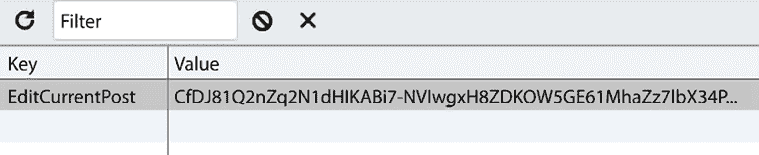
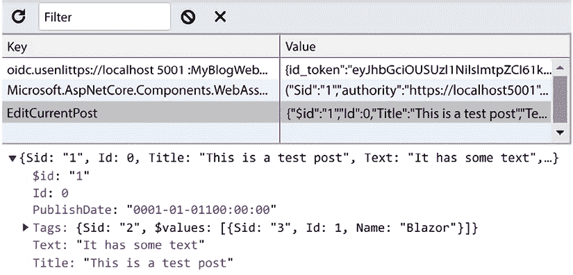

# 11

# 管理状态 – 第二部分

在本章中，我们继续探讨状态管理。大多数应用程序都以某种形式管理状态。

状态只是以某种方式持久化的信息。它可以是存储在数据库中的数据，会话状态，甚至存储在 URL 中的内容。

用户状态存储在内存中，无论是在网页浏览器还是在服务器上。它包含组件层次结构和最近渲染的 UI（渲染树）。它还包含组件实例中的值或字段和属性，以及依赖注入中服务实例存储的数据。

如果我们调用 JavaScript，我们设置的值也会存储在内存中。Blazor Server 依赖于电路（SignalR 连接）来保持用户状态，而 Blazor WebAssembly 依赖于浏览器的内存。但是，当我们混合这两种状态时，状态管理就会变得有些复杂。如果我们重新加载页面，电路和内存都会丢失。切换页面也是如此；如果没有更多的`InteractiveServer`组件在页面上，SignalR 连接将被终止，状态丢失。管理状态不是关于处理连接或连接问题，而是关于我们如何在重新加载网页的情况下保持数据。

在页面导航或会话之间保存状态可以改善用户体验，可能是销售与否的区别。想象一下重新加载页面，购物车中的所有项目都消失了；你很可能不会再在那里购物。

现在想象一下，一周或一个月后返回页面，所有那些东西仍然在那里。

本章将涵盖以下主题：

+   在服务器端存储数据

+   在 URL 中存储数据

+   实现浏览器存储

+   使用内存状态容器服务

+   状态管理框架

+   根级级联值

我们已经讨论过，甚至实现了一些这些内容。让我们利用这个机会回顾我们已经讨论过的事情，以及介绍一些新技术。

# 技术要求

确保你已经阅读了前面的章节，或者以`Chapter10`文件夹作为起点。

你可以在这个章节的最终结果源代码[`github.com/PacktPublishing/Web-Development-with-Blazor-Third-Edition/tree/main/Chapter`](https://github.com/PacktPublishing/Web-Development-with-Blazor-Third-Edition/tree/main/Chapter11)11 中找到。

如果你使用 GitHub 上的代码跳转到本章，请确保你在`Settings`文件中添加了`Auth0`账户信息。你可以在*第八章*，*认证和授权*中找到说明。

# 在服务器端存储数据

在服务器端存储数据有许多不同的方式。唯一需要记住的是，Blazor WebAssembly（或`InteractiveWebAssembly`）始终需要一个 API。Blazor Server（或`InteractiveServer`）不需要 API，因为我们可以直接访问服务器端资源。

我与许多开发人员就 API 或直接访问进行了讨论，这些都归结为你打算如何使用应用程序。如果你正在构建 Blazor Server 应用程序，并且没有兴趣迁移到 Blazor WebAssembly，我可能会选择直接访问，就像我们在`MyBlog`项目中做的那样。

尽管如此，我并不会在组件中直接进行数据库查询。我会将它们保留在 API 中，只是不是 Web API。正如我们所看到的，在*第七章* *创建 API*中，将那些 API 函数公开在 API 中，并不需要很多步骤。我们始终可以从直接服务器访问开始，如果我们想的话，再转向 API。

当涉及到存储数据时，我们可以将其保存在 Blob 存储、键值存储、关系数据库、文档数据库、表存储中等。

可能性是无限的。如果.NET 可以与该技术通信，我们就能使用它。

# 在 URL 中存储数据

初看起来，这个选项可能听起来很可怕，但事实并非如此。在这种情况下，数据可以是博客帖子 ID 或页码，如果我们使用分页的话。通常，你想要在 URL 中保存的东西是你希望以后能够链接到的东西，例如在我们的例子中是博客帖子。

要从 URL 中读取参数，我们使用以下语法：

```cs
@page "/posts/{PageNumber:int}" 
```

URL 由`posts`后跟帖子的页码（用于浏览博客帖子）组成。

要找到那个特定的路由，`PageNumber`必须是一个整数；否则，路由将无法找到。

我们还需要一个同名的`public`参数：

```cs
[Parameter]
public int PageNumber{ get; set; } 
```

如果我们在 URL 中存储数据，我们需要确保使用`OnParametersSet`或`OnParametersSetAsync`方法；否则，如果更改参数，数据将不会重新加载。如果参数更改，Blazor 不会再次运行`OnInitializedAsync`。

这就是为什么我们的`post.razor`组件在`OnParametersSet`中加载基于 URL 参数变化的内容，并在`OnInitializedAsync`中加载不受参数影响的内容。

我们可以通过指定它们为可空类型来使用可选参数，如下所示：

```cs
@page "/post/{PageNumber:int?}" 
```

因此，这个路由将匹配“`/post/`”和“`/post/42`”等。

## 路由约束

当我们指定参数的类型时，这被称为**路由约束**。我们添加约束，以便只有在参数值可以转换为指定的类型时，匹配才会发生。

以下是一些可用的约束：

+   `bool`

+   `datetime`

+   `decimal`

+   `float`

+   `guid`

+   `int`

+   `long`

URL 元素将被转换为**C#**对象。因此，在将它们添加到 URL 时使用不变文化是很重要的。`string`不是列表的一部分，因为这已经是默认行为。

## 使用查询字符串

到目前为止，我们只讨论了在`page`指令中指定的路由，但我们也可以从查询字符串中读取数据。

`NavigationManager`为我们提供了访问 URI 的权限，因此通过使用此代码，我们可以访问查询字符串参数：

```cs
@inject NavigationManager Navigation
@code{
var query = new Uri(Navigation.Uri).Query;
} 
```

我们不会深入探讨这个问题，但现在我们知道，如果我们需要访问查询字符串参数，这是可能的。

我们也可以使用类似这样的属性来访问`query`参数：

```cs
[Parameter, SupplyParameterFromQuery(Name = "parameterName")]
public string ParameterFromQuery { get; set; } 
```

这种语法更易于使用。

数据在 URL 中存在并不意味着存储数据。如果我们导航到另一个页面，我们需要确保包含新的 URL；否则，它将会丢失。如果我们想存储不需要每次都包含在 URL 中的数据，我们可以使用浏览器存储。

# 实现浏览器存储

浏览器有多种不同的方式在网页浏览器中存储数据。它们根据我们使用的数据类型而有所不同。**本地存储**的范围限定在用户的浏览器窗口。即使用户重新加载页面或关闭网页浏览器，数据仍然会被保存。

数据也会在标签页之间共享。**会话存储**的范围限定在**浏览器**标签页；如果你重新加载该标签页，数据将被保存，但如果你关闭该标签页，数据将会丢失。`SessionsStorage`在某种程度上更安全使用，因为我们避免了由于多个标签页操作存储中的相同值而可能出现的 bug 风险。

为了能够访问浏览器存储，我们需要使用 JavaScript。幸运的是，我们不需要自己编写代码。

在.NET 5 中，微软引入了**受保护浏览器存储**，它使用 ASP.NET Core 中的数据保护，但在 WebAssembly 中不可用。然而，我们可以使用一个名为`Blazored.LocalStorage`的开源库，它既可以用于 Blazor Server，也可以用于 Blazor WebAssembly。

但我们在这里是为了学习新事物，对吧？

因此，让我们实现一个接口，这样我们就可以根据我们使用的托管模型使用两种版本。这个实现有一个问题。如果我们以`AutoMode`运行，不同托管模型之间的状态将不会共享。解决方案是在两种实现中都坚持使用`Blazored.LocalStorage`。但为了展示实现之间的差异，我们将在这个案例中同时进行。请注意，这是在用户的计算机上以明文形式存储的，所以请小心存储的内容。

## 创建一个接口

首先，我们需要一个可以读取和写入存储的接口：

1.  在`SharedComponents`项目中，创建一个名为`Interfaces`的新文件夹。

1.  在新文件夹中，创建一个名为`IBrowserStorage.cs`的新类。

1.  将文件中的内容替换为以下代码：

    ```cs
    namespace SharedComponents.Interfaces;
    public interface IBrowserStorage
    {
        Task<T?> GetAsync<T>(string key);
        Task SetAsync(string key, object value);
        Task DeleteAsync(string key);
    } 
    ```

现在我们有一个包含`get`、`set`和`delete`方法的接口。

## 实现 Blazor Server（InteractiveServer）

对于 Blazor Server，我们将使用受保护浏览器存储：

1.  在`BlazorWebApp`项目中，添加一个名为`Services`的新文件夹。

1.  在新文件夹中，创建一个名为`BlogProtectedBrowserStorage.cs`的新类。

    （我意识到命名有些过度，但这将有助于我们区分 Blazor Server 和 Blazor WebAssembly 实现，因为我们很快将创建另一个实现。）

1.  打开新文件并添加以下`using`语句：

    ```cs
    using Microsoft.AspNetCore.Components.Server.ProtectedBrowserStorage;
    using SharedComponents.Interfaces; 
    ```

1.  将类替换为以下内容：

    ```cs
    public class BlogProtectedBrowserStorage : IBrowserStorage
    {
        ProtectedSessionStorage Storage { get; set; }
        public BlogProtectedBrowserStorage(ProtectedSessionStorage storage)
        {
            Storage = storage;
        }
        public async Task DeleteAsync(string key)
        {
            await Storage.DeleteAsync(key);
        }
        public async Task<T?> GetAsync<T>(string key)
        {
            var value = await Storage.GetAsync<T>(key);
            return value.Success ? value.Value : default(T);
        }
        public async Task SetAsync(string key, object value)
        {
            await Storage.SetAsync(key, value);
        }
    } 
    ```

    `BlogProtectedBrowserStorage` 类实现了 `IBrowserStorage` 接口以用于受保护的浏览器存储。我们注入一个 `ProtectedSessionStorage` 实例并实现了 `set`、`get` 和 `delete` 方法。

1.  在 `Program.cs` 文件中，添加以下命名空间：

    ```cs
    using SharedComponents.Interfaces;
    using BlazorWebApp.Services; 
    ```

1.  在 `AddInteractiveWebAssemblyComponents();` 结尾的行下方添加以下内容：

    ```cs
    builder.Services.AddScoped<IBrowserStorage,BlogProtectedBrowserStorage>(); 
    ```

我们正在配置 Blazor，当注入 `IBrowserStorage` 时返回 `BlogProtectedBrowserStorage` 实例。

这与我们对 API 所做的是相同的。根据平台注入不同的实现。

## 实现 WebAssembly（交互式 WebAssembly）

对于 Blazor WebAssembly，我们将使用 `Blazored.SessionStorage`：

1.  在 `BlazorWebApp.Client` 项目中，添加对 `Blazored.SessionStorage` 的 `NuGet` 引用。

1.  添加一个名为 `Services` 的新文件夹。

1.  在新文件夹中，创建一个名为 `BlogBrowserStorage.cs` 的新类。

1.  打开新文件，并将内容替换为以下代码：

    ```cs
    using Blazored.SessionStorage;
    using SharedComponents.Interfaces;
    namespace BlazorWebApp.Client.Services;
    public class BlogBrowserStorage : IBrowserStorage
    {
        ISessionStorageService Storage { get; set; }
        public BlogBrowserStorage(ISessionStorageService storage)
        {
            Storage = storage;
        }
        public async Task DeleteAsync(string key)
        {
            await Storage.RemoveItemAsync(key);
        }
        public async Task<T?> GetAsync<T>(string key)
        {
            return await Storage.GetItemAsync<T>(key);
        }
        public async Task SetAsync(string key, object value)
        {
            await Storage.SetItemAsync(key, value);
        }
    } 
    ```

    `ProtectedBrowserStorage` 和 `Blazored.SessionStorage` 的实现方式非常相似。方法名称不同，但参数相同。

1.  在 `Program.cs` 文件中，添加以下命名空间：

    ```cs
    using Blazored.SessionStorage;
    using SharedComponents.Interfaces;
    using BlazorWebApp.Client.Services; 
    ```

1.  在 `await builder.Build().RunAsync();` 之上添加以下内容：

    ```cs
    builder.Services.AddBlazoredSessionStorage();
    builder.Services.AddScoped<IBrowserStorage, BlogBrowserStorage>(); 
    ```

`AddBlazoredSessionStorage` 扩展方法将所有内容连接起来，以便我们可以开始使用浏览器会话存储。

然后我们添加 `IBrowserStorage` 的配置，就像我们在服务器上所做的那样，但在这个情况下，当我们请求依赖注入 `IBrowserStorage` 时，我们返回 `BlogBrowserStorage`。

## 实现共享代码

我们还需要实现一些调用我们刚刚创建的服务的代码：

1.  在 `SharedComponents` 项目中，打开 `Pages/Admin/BlogPostEdit.razor` 文件。我们将对该文件进行一些修改。

1.  注入 `IBrowserStorage`：

    ```cs
    @inject SharedComponents.Interfaces.IBrowserStorage _storage 
    ```

1.  由于我们只能在执行动作（如点击）或 `OnAfterRender` 方法中运行 JavaScript 调用，让我们创建一个 `OnAfterRenderMethod`：

    ```cs
    protected override async Task OnAfterRenderAsync(bool firstRender)
    {
        if (firstRender && string.IsNullOrEmpty(Id))
        {
            var saved = await _storage.GetAsync<BlogPost>("EditCurrentPost");
            if (saved != null)
            {
               Post = saved;
       StateHasChanged();
            }
        }
        await base.OnAfterRenderAsync(firstRender);
    } 
    ```

    当我们加载组件且 `Id` 为 `null` 时，这意味着我们正在编辑一个新文件，然后我们可以检查浏览器存储中是否有保存的文件。

    此实现只能在草稿中有一个文件，并且只保存新帖子。如果我们编辑现有的帖子，则不会保存这些更改。

1.  我们需要将 `UpdateHTML` 方法改为异步。将方法修改如下：

    ```cs
    protected async Task UpdateHTMLAsync()
    {
        if (!string.IsNullOrEmpty(Post.Text))
        {
            markDownAsHTML = Markdig.Markdown.ToHtml(Post.Text, pipeline);
            if (string.IsNullOrEmpty(Post.Id))
            {
                await _storage.SetAsync("EditCurrentPost", Post);
            }
        }
    } 
    ```

1.  如果博客帖子的 `Id` 为 `null`，我们将把帖子存储在浏览器存储中。确保将所有对 `UpdateHTML` 的引用更改为 `UpdateHTMLAsync`。

    确保在 `OnParametersSetAsync` 方法中也等待调用，如下所示：

    ```cs
    await UpdateHTMLAsync(); 
    ```

1.  此实现存在一个问题：我们目前正在预渲染我们的组件。当我们预渲染时，没有连接到网络浏览器。没有状态可以检索。简单来说，我们需要禁用此组件的预渲染功能以使其工作。所以，让我们这么做吧！

1.  将`@rendermode InteractiveServer`更改为：

    ```cs
    @rendermode @(new InteractiveServerRenderMode(prerender: false)) 
    ```

我们完成了。现在是时候测试实现：

1.  通过按*Ctrl* + *F5*键运行项目。

1.  登录到网站（这样我们就可以访问管理工具）。

1.  点击**博客文章**然后点击**新建博客文章**。

1.  在框中输入任何内容，一旦我们在文本区域中输入一些内容，它就会将文章保存到存储中。

1.  点击**博客文章**（这样我们就从我们的博客文章中导航出去）。

1.  点击**新建博客文章**，所有信息仍然保留。

1.  按*F12*键以查看浏览器开发者工具。点击**应用程序** | **会话存储** | **https://localhost:portnumber**。

    你应该看到一个键为`EditCurrentPost`的文章，该文章的值应该是一个加密字符串，如*图 11.1*所示：

    

    图 11.1：加密的受保护浏览器存储

    让我们接下来测试 Blazor WebAssembly（InteractiveWebAssembly）。

1.  再次打开`EditPost.razor`文件，将`@rendermode @(new InteractiveServerRenderMode(prerender: false))`更改为：

    ```cs
    @rendermode @(new InteractiveWebAssemblyRenderMode(prerender: false)) 
    ```

1.  你可能需要清理和重新构建你的项目才能使其工作。

1.  登录到网站（这样我们就可以访问管理工具）。

1.  点击**博客文章**然后**新建博客文章**。你可能注意到页面加载和组件显示之间存在延迟。这是 WebAssembly 的初始加载时间，用于启动一切。

1.  在框中输入任何内容，一旦我们在文本区域中输入一些内容，它就会将文章保存到存储中。

1.  点击**博客文章**（这样我们就从我们的博客文章中导航出去）。

1.  点击**新建博客文章**，所有信息应该仍然保留在那里。

1.  按*F12*键以查看浏览器开发者工具。点击**应用程序** | **会话存储** | **https://localhost:portnumber**。

你应该看到一个键为`EditCurrentPost`的文章，该文章的值应该是一个 JSON 字符串，如*图 11.2*所示。

如果我们更改存储中的数据，它也会在应用程序中更改，所以请记住，这是纯文本，最终用户可以操作数据：



图 11.2：未受保护的浏览器存储

现在，我们已经为 Blazor Server 实现了受保护的浏览器存储，为 Blazor WebAssembly 实现了会话存储。我们可以在需要的地方混合和匹配托管模型，这是.NET 8 的一个真正惊人的功能。

我们只剩下一种方法可以尝试，让我们让它变得最有趣。

# 使用内存状态容器服务

当涉及到内存状态容器时，我们只需使用依赖注入来保持服务实例在内存中的预定时间（作用域、单例或瞬态）。

在*第四章*，*理解基本 Blazor 组件*中，我们讨论了依赖注入的作用域如何与 Blazor Server 和 Blazor WebAssembly 不同。在本节中，对我们来说最大的区别是 Blazor WebAssembly 在浏览器内部运行，并且没有与服务器或其他用户的连接。

为了展示内存状态的工作方式，我们将做一些可能对博客来说有点过度的事情，但看到它会很酷。当我们编辑我们的博客帖子时，我们将实时更新连接到我们博客的所有网络浏览器（我确实说过过度）。

根据宿主的不同，我们可能需要以不同的方式实现这一点。让我们从 Blazor Server 开始。

## 在 Blazor Server 上实现实时更新

Blazor Server 的实现也可以用于 Blazor WebAssembly。由于 WebAssembly 在我们的浏览器中运行，它只会通知连接到该站点的用户，这将是您自己。但了解这一点可能很好，因为同样的东西在 Blazor Server 和 Blazor WebAssembly 中都可以工作：

1.  在`SharedComponents`项目中，在`Interfaces`文件夹中，创建一个名为`IBlogNotificationService.cs`的接口。

1.  添加以下代码：

    ```cs
    using Data.Models;
    namespace SharedComponents.Interfaces;
    public interface IBlogNotificationService
    {
        event Action<BlogPost>? BlogPostChanged;
        Task SendNotification(BlogPost post);
    } 
    ```

    我们有一个可以在博客帖子更新时订阅的动作，以及一个在我们更新帖子时可以调用的方法。

1.  在`BlazorWebServer`项目的`Services`文件夹中，添加一个名为`BlazorServerBlogNotificationService.cs`的新类。

    给类起一个包含`BlazorServer`的名字可能看起来不必要，但它确保我们可以轻松地区分这些类。

    将内容替换为以下代码：

    ```cs
    using SharedComponents.Interfaces;
    using Data.Models;
    namespace BlazorServer.Services;
    public class BlazorServerBlogNotificationService : IBlogNotificationService
    {
        public event Action<BlogPost>? BlogPostChanged;
        public Task SendNotification(BlogPost post)
        {
            BlogPostChanged?.Invoke(post);
            return Task.CompletedTask;
        }
    } 
    ```

    这里的代码相当简单。如果我们调用`SendNotification`，它将检查是否有人正在监听`BlogPostChanged`动作，并决定是否触发该动作。

1.  在`Program.cs`中添加依赖注入：

    ```cs
    builder.Services.AddSingleton<IBlogNotificationService, BlazorServerBlogNotificationService>(); 
    ```

    每当我们请求`IBlogNotificationService`类型的实例时，我们都会得到`BlazorServerBlogNotificationService`的一个实例。

    我们将这个依赖注入作为单例。我必须强调这一点。当使用 Blazor Server 时，这将是所有用户的相同实例，因此我们必须在使用`Singleton`时格外小心。

    在这种情况下，我们希望该服务通知我们博客的所有访客博客帖子已更改。

1.  在`SharedComponents`项目中打开`Post.razor`。

1.  在页面顶部（或接近顶部）添加以下代码：

    ```cs
    @using SharedComponents.Interfaces
    @inject IBlogNotificationService _notificationService
    @implements IDisposable 
    ```

    我们为`IBlogNotificationService`添加了依赖注入，并且还需要实现`IDisposable`以防止任何内存泄漏。

    在`OnInitializedAsync`方法的顶部添加以下代码：

    ```cs
    _notificationService.BlogPostChanged += PostChanged; 
    ```

    我们向事件添加了一个监听器，以便我们知道何时应该更新信息。

1.  我们还需要`PostChanged`方法，所以添加以下代码：

    ```cs
    private async void PostChanged(BlogPost post)
    {
        if (BlogPost?.Id == post.Id)
        {
            BlogPost = post;
            await InvokeAsync(()=>this.StateHasChanged());
        }
    } 
    ```

    如果参数具有与我们当前查看的帖子相同的 ID，则将事件中的内容替换为帖子并调用`StateHasChanged`。

    由于这发生在另一个线程上，我们需要使用`InvokeAsync`调用`StateHasChanged`，以确保它在 UI 线程上运行。

    我们还需要通过实现`Dispose`方法来停止监听更新。添加以下内容：

    ```cs
    void IDisposable.Dispose()
    {
        _notificationService.BlogPostChanged -= PostChanged;
    } 
    ```

    我们移除事件监听器以防止任何内存泄漏。

    `Post`组件目前是一个静态渲染组件。我们没有任何交互性，所以让我们启用它。

    将以下内容添加到组件中：

    ```cs
    @rendermode InteractiveServer 
    ```

1.  在`SharedComponents`项目中，打开`Pages/Admin/BlogPostEdit.Razor`文件。

1.  当我们修改我们的博客文章时，我们还需要发送一个通知。在文件顶部添加以下内容：

    ```cs
    @using SharedComponents.Interfaces
    @inject IBlogNotificationService _notificationService 
    ```

    我们添加一个命名空间并注入我们的通知服务。

1.  在`UpdateHTMLAsync`方法中，在`!string.IsNullOrEmpty(Post.Text)` `if`语句下方添加以下内容：

    ```cs
    await _notificationService.SendNotification(Post); 
    ```

    每次我们更改内容时，现在都会发送一个通知，表明博客文章已更改。我确实意识到在保存帖子时这样做可能更有意义，但这会使演示更加酷。

    让我们从测试`InteractiveServer`开始。在`BlogPortEditPage.razor`中，将`@rendermode @(new InteractiveWebAssemblyRenderMode(prerender: false))`更改为：

    ```cs
    @rendermode @(new InteractiveServerRenderMode(prerender: false)) 
    ```

1.  通过按*Ctrl* + *F5*运行项目。

1.  复制 URL 并在另一个网络浏览器中打开。现在我们应该有两个网络浏览器窗口打开，显示我们的博客。

1.  在第一个窗口中，打开一个博客文章（哪个都行），然后在第二个窗口中登录并编辑同一篇博客文章。

当我们在第二个窗口中更改博客文章的文本时，更改应该会实时反映在第一个窗口中。

我总是很惊讶，没有使用 Blazor 实现的功能可能有点棘手，但现在只需要 10 步（不算测试），如果我们没有为下一步做准备，步骤会更少。

接下来，我们将为 Blazor WebAssembly 实现相同的功能，但 Blazor WebAssembly 是在用户的网络浏览器中运行的。与 Blazor Server 一样，它没有内置的实时通信。

## 实现 Blazor WebAssembly 的实时更新

我们已经有很多东西准备好了。我们只需要添加一个实时消息系统。由于 SignalR 既容易实现又很棒，让我们使用它。

我第一次使用 SignalR 时，我的第一个想法是，“等等，这不可能那么简单。我一定是忘记了什么，或者缺少了什么”。希望我们现在会有同样的体验。

让我们看看这今天是否仍然成立：

1.  在`BlazorWebApp`项目中，添加一个名为`Hubs`的新文件夹。

1.  在新文件夹中，创建一个名为`BlogNotificationHub.cs`的类。

1.  将代码替换为以下内容：

    ```cs
    using Data.Models;
    using Microsoft.AspNetCore.SignalR;
    namespace BlazorWebApp.Hubs;
    public class BlogNotificationHub : Hub
    {
        public async Task SendNotification(BlogPost post)
        {
            await Clients.All.SendAsync("BlogPostChanged", post);
        }
    } 
    ```

    该类继承自`Hub`类。有一个名为`SendNotification`的方法。记住这个名字；我们很快就会回到它。

    我们调用`Clients.All.SendAsync`，这意味着我们将发送一个名为`BlogPostChanged`的消息，包含博客文章的内容。

    名称`BlogPostChanged`也很重要，所以请记住这一点。

1.  在`Program.cs`文件中，添加以下内容：

    ```cs
    builder.Services.AddSignalR(); 
    ```

    这添加了 SignalR。由于这个项目是托管模型的混合，我们已经有权限访问 SignalR。

1.  添加以下命名空间：

    ```cs
    using BlazorWebApp.Hubs; 
    ```

1.  在`app.MapRazorComponents<App>()`之上添加：

    ```cs
    app.MapHub<BlogNotificationHub>("/BlogNotificationHub"); 
    ```

    在这里，我们配置`BlogNotificationHub`应该使用哪个 URL。在这种情况下，我们使用与 hub 名称相同的 URL。

    这里的 URL 也很重要。我们将在稍后使用它。

1.  在`BlazorWebApp.Client`中添加对`Microsoft.AspNetCore.SignalR.Client NuGet`包的引用。

1.  在`Services`文件夹中，创建一个名为`BlazorWebAssemblyBlogNotificationService.cs`的类。

    在此文件中，我们将实现 SignalR 通信。

1.  添加以下命名空间：

    ```cs
    using Microsoft.AspNetCore.Components;
    using Microsoft.AspNetCore.SignalR.Client;
    using Data.Models;
    using SharedComponents.Interfaces; 
    ```

1.  添加此类：

    ```cs
    public class BlazorWebAssemblyBlogNotificationService : IBlogNotificationService, IAsyncDisposable
    {
        public BlazorWebAssemblyBlogNotificationService(NavigationManager navigationManager)
        {
            _hubConnection = new HubConnectionBuilder()
            .WithUrl(navigationManager.ToAbsoluteUri("/BlogNotificationHub"))
            .Build();
            _hubConnection.On<BlogPost>("BlogPostChanged", (post) =>
            {
                BlogPostChanged?.Invoke(post);
            });
            _hubConnection.StartAsync();
        }
        private readonly HubConnection _hubConnection;
        public event Action<BlogPost>? BlogPostChanged;

        public async Task SendNotification(BlogPost post)
        {
            await _hubConnection.SendAsync("SendNotification", post);
        }
        public async ValueTask DisposeAsync()
        {
            await _hubConnection.DisposeAsync();
        }
    } 
    ```

    这里发生了很多事情。这个类实现了`IBlogNotificationService`和`IAsyncDisposable`。

    在构造函数中，我们使用依赖注入来获取`NavigationManager`，这样我们就可以确定服务器的 URL。

    然后，我们配置到 hub 的连接。然后，我们指定 hub 的 URL；这应该与我们在*步骤 7*中指定的相同。

    现在，我们可以配置 hub 连接以监听事件。在这种情况下，我们监听`BlogPostChanged`事件，这与我们在*步骤 3*中指定的名称相同。当有人发送事件时，我们将指定的方法将运行。

    在这种情况下，该方法触发我们在`IBlogNotificationService`中定义的事件。然后，我们开始建立连接。由于构造函数不能是异步的，所以我们不会等待`StartAsync`方法。

    `IBlogNotificationService`还实现了`SendNotification`方法，我们在 hub 上触发具有相同名称的事件，这将导致 hub 向所有已连接客户端发送`BlogPostChanged`事件。

    我们最后要确保我们处理了 hub 连接。

1.  在`Program.cs`文件中，我们需要配置依赖注入。在`await builder.Build().RunAsync();`之上，添加以下内容：

    ```cs
    builder.Services.AddSingleton<IBlogNotificationService, BlazorWebAssemblyBlogNotificationService>(); 
    ```

1.  这里事情变得有点复杂，因为我们根据是否使用 InteractiveServer 或 InteractiveWebAssembly 有不同的实现。我们需要确保以相同的方式运行`EditPost`和`Post`组件。在这种混合场景中，始终使用 SignalR 连接是一个更好的选择，因为这样我们可以使用相同的实现，无论托管模型如何。在`SharedComponents`项目中，打开`Pages/Admin/BlogPostEdit.razor`并将`@rendermode @(new InteractiveServerRenderMode(prerender: false))`更改为：

    ```cs
    @rendermode @(new InteractiveWebAssemblyRenderMode(prerender: false)). 
    ```

    你可能需要清理并重新构建解决方案才能使其工作。

1.  打开`Post.razor`并执行相同操作；将`@rendermode InteractiveServer`更改为：

    ```cs
    @rendermode InteractiveWebAssembly. 
    ```

    现在，是时候进行测试了，通过按*Ctrl* + *F5*来运行项目。

1.  复制 URL 并打开另一个网络浏览器。现在，我们应该有两个网络浏览器窗口打开，显示博客。

1.  在第一个窗口中，打开一个博客文章（任何一篇都可以），在第二个窗口中，登录并编辑同一篇博客文章。

当我们在第二个窗口中更改博客文章的文本时，该更改应该实时反映在第一个窗口中。

在 *13* 个步骤（不包括测试）中，我们实现了服务器和客户端之间的实时通信，一个运行在网页浏览器内的 .NET 代码的 Blazor WebAssembly 客户端。

而且不需要 JavaScript！

## 状态管理框架

谈到 JavaScript，在 Angular、React 等等 JavaScript 框架的世界中，有一些我们可以用来管理状态的框架（例如 **Redux** 和 **ngRX**）。Blazor 也是如此。非常简单，我们有一个可以通过方法更改的状态；如果状态发生变化，监听该变化的组件将会收到通知。

对于 Blazor，有大量类似的框架。我个人从未使用过框架，而是构建了一个 `Singleton` 服务并将我的组件连接到该服务（基本上就是这些框架所做的事情）。

如果你想要深入了解，可以查看 Fluxor 或 Blazor-State。在组件之间共享状态的另一种方法是称为根级级联值。

# 根级级联值

根级级联值是 .NET 8 中的一个新特性。这是在组件之间以及不同渲染模式之间共享状态的一个好方法。它将自动添加一个级联值；我们已经使用了这个特性，然后添加了 `AddCascadingAuthenticationState()`，它在后台使用根级级联值。

然而，这并不在 InteractiveServer 和 InteractiveWebAssembly 之间共享值，但它为我们提供了一种在不使用依赖注入的情况下在组件之间共享状态的方法。

真正美妙的是，如果值发生变化，它将自动更改参数并触发组件的重渲染。组件内部不需要特殊代码。但是订阅值变化确实有成本，所以使用根级级联值时要小心，不要使用太多。

使用方式可能看起来像这样：

```cs
@(Preferences?.DarkTheme)
@code {
    [CascadingParameter(Name = "Preferences")]
    public Preferences Preferences { get; set; }
} 
```

在 `Program.cs` 中：

```cs
builder.Services.AddCascadingValue<Preferences>(sp =>
{
    var preferences = new Preferences { DarkTheme = true };
    var source = new CascadingValueSource<Preferences>("Preferences", preferences, isFixed: false);
    return source;
}); 
```

可以通过在 `CascadingValueSource` 上调用 `NotifyChangedAsync` 方法来更新值。一个实现可能看起来像这样：

```cs
builder.Services.AddCascadingValue<Preferences>(sp =>
{
    var preferences = new Preferences { DarkTheme = true };
    var source = new CascadingValueSource<Preferences>("Preferences", preferences, isFixed: false);
    if (preferences is INotifyPropertyChanged changed)
        changed.PropertyChanged += (sender, args) => source.NotifyChangedAsync();
    return source;
}); 
```

在这里，我们使用 `INotifyPropertyChanged` 接口在更改属性时调用 `NotifyChangedAsync`。如果你想要进一步探索，你可以在 GitHub 上找到一个完整的示例。

# 摘要

在这一章中，我们学习了如何在我们的应用程序中处理状态，以及如何使用本地存储来存储数据，无论是加密的还是未加密的。我们探讨了不同的方法，并确保包括 SignalR 以便能够使用与服务器之间的实时通信。

几乎所有应用程序都需要以某种形式保存数据。这可能包括设置或偏好。本章中我们讨论的内容是最常见的，但我们也应该知道，有许多开源项目我们可以用来持久化状态。我个人更喜欢组件在需要时从数据库中加载数据，这样就可以自给自足，而不必依赖于状态来自其他地方或某处。这种方法在过去一直为我服务得很好。

在下一章中，我们将探讨调试。希望你还没有必要知道如何调试！
