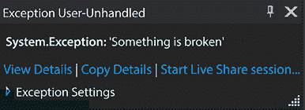
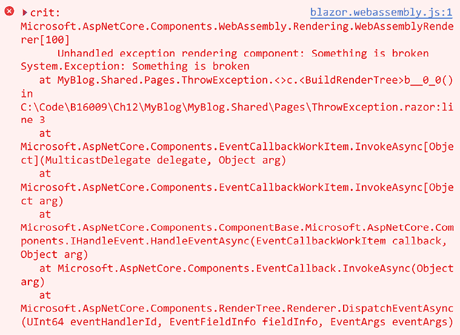
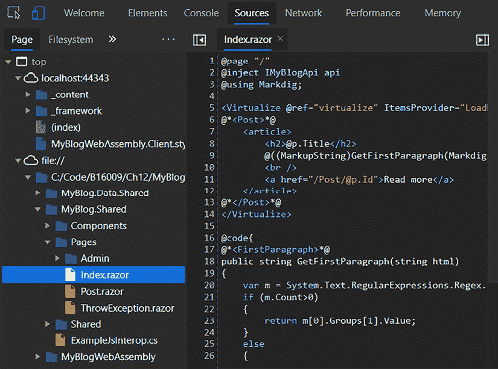

# 第十二章：调试代码

在本章中，我们将探讨调试。Blazor 的调试体验很好；希望你在本书前面的章节中没有遇到难题，不得不跳到这一章。

调试代码是解决错误、理解工作流程或查看特定值的一种极好方式。Blazor 有三种不同的调试代码方式，我们将逐一查看。

在本章中，我们将涵盖以下内容：

+   让事情出问题

+   Blazor Server 调试

+   Blazor WebAssembly 调试

+   在浏览器中调试 Blazor WebAssembly

+   热重载

# 技术要求

确保你已经遵循了前面的章节，或者使用 `Chapter11` 文件夹作为起点。

你可以在 [`github.com/PacktPublishing/Web-Development-with-Blazor-Third-Edition/tree/main/Chapter12`](https://github.com/PacktPublishing/Web-Development-with-Blazor-Third-Edition/tree/main/Chapter12) 找到本章末尾结果的源代码。

如果你使用 GitHub 中的代码跳转到本章，请确保你已经在设置文件中添加了 `Auth0` 账户信息。你可以在 *第八章*，*身份验证和授权* 中找到说明。

要调试某个东西，我们首先应该让它出点问题！

# 让事情出问题

艾德加·W·迪杰斯特拉曾经说过，

*“如果调试是移除软件错误的过程，那么编程就必须是放置它们的过程。”*

在这个部分中，这绝对是真实的，因为我们将添加一个会抛出异常的页面：

1.  在 `SharedComponents` 项目中，在 `Pages` 文件夹中，创建一个新的 Razor 组件，命名为 `ThrowException.razor`。

1.  将文件内容替换为以下代码块：

    ```cs
    @page "/ThrowException"
    @rendermode @(new InteractiveServerRenderMode(prerender: false))
    <button @onclick="@(()=> {throw new Exception("Something is broken"); })">Throw an exception</button> 
    ```

这个页面显示了一个按钮，当你按下它时，它会抛出一个异常。

太好了！我们找到了我们应用程序的伊万·德拉戈（它想打败我们，但我们可能用一些花哨的调试技巧打败它）。

下一步是查看 Blazor Server 调试。

# Blazor Server 调试

如果你以前调试过任何 .NET 应用程序，你会感到非常熟悉。别担心；如果你还没有，我们会带你了解。调试 Blazor Server 就像我们可能预期的那样，并且是我们将要涵盖的三种不同类型中最好的调试体验。

我通常将我的 Razor 页面放在共享库中，在构建我的项目时，我使用 Blazor Server 的原因有两个。首先，运行项目要快一些，其次，调试体验更好。

让我们试一试！

1.  按 *F5* 启动项目（这次带有调试）。

1.  使用网络浏览器，导航到 `https://localhost:端口号/throwexception`（端口号可能不同）。

1.  按 *F12* 显示网络浏览器开发者工具。

1.  在开发者工具中，点击 **控制台**。

1.  点击我们页面上的 **抛出异常** 按钮。

    到目前为止，Visual Studio 应该请求焦点，并且应该显示如图 *图 12.1* 所示的异常：

    

    图 12.1：Visual Studio 中的异常

1.  按*F5*继续并切换回网页浏览器。我们现在应该能够在开发者工具中看到异常信息，如图*图 12.2*所示：

    图 12.2：网页浏览器中的异常

    正如我们在*图 12.1*和*图 12.2*中看到的那样，我们在 Visual Studio 调试时以及在开发者工具中都会遇到异常。

    如果在生产应用程序中发生异常，这会使问题变得非常容易找到（但愿不会发生）——这个功能已经帮我们节省了很多时间。

    现在我们尝试一个断点：

1.  在 Visual Studio 中，打开`Pages/Home.razor`。

1.  在`LoadPosts`方法的任何地方，通过点击最左边的边框（出现一个红色圆点）来设置断点。我们也可以通过按*F9*来添加断点。

1.  返回网页浏览器并导航到`https://localhost:portnumber/`（端口号可能不同）。

Visual Studio 现在应该会触发断点，通过悬停在变量上，我们应该能够看到当前的值。

断点和异常调试都按预期工作。接下来，我们将看看如何调试 Blazor WebAssembly。

# Blazor WebAssembly 调试

Blazor WebAssembly 当然也可以进行调试。有几件事情需要记住。像我们在博客中使用的`InteractiveWebAssembly`进行调试，将会与 Blazor Server 一样工作。断点和异常将按预期工作。然而，有一个选项可以将 Blazor WebAssembly 作为一个独立的应用程序运行。这会有一些不同。

为了能够玩转这个，我们需要添加另一个项目。

1.  右键点击**MyBlog 解决方案**，选择**添加**，**新建项目**…，然后选择**Blazor WebAssembly 独立应用程序**。

1.  将项目名称更改为`BlazorWebAssemblyApp`。

1.  保持默认值不变并点击**创建**。

1.  右键点击我们的**BlazorWebAssemblyApp**项目并选择**设置为启动项目**。

1.  在**Pages**文件夹中，打开`Counter.razor`并在`currentCount++`行上设置断点。

1.  通过按*F5*来运行项目，看看会发生什么，断点被触发了。

这并不总是这样，我实际上对它工作得如此之好感到非常高兴。在.NET 的早期版本中，你必须点击另一个页面然后再回来才能触发断点。

Blazor WebAssembly 的调试是通过`launchSettings.json`文件中的以下代码行实现的：

```cs
"inspectUri": "{wsProtocol}://{url.hostname}:{url.port}/_framework/debug/ws-proxy?browser={browserInspectUri}" 
```

但它在我们创建项目时已经为我们提供了，所以我们不需要手动添加。

现在我们来看看我们的异常会发生什么：

1.  复制我们的`ThrowException.razor`文件并将其放入`BlazorWebAssemblyApp/Pages`文件夹。

1.  在复制的文件中，删除`@rendermode`行。由于 WebAssembly 项目全是 WebAssembly，我们不需要指定渲染模式。

1.  在网页浏览器中，导航到`https://localhost:portnumber/throwexception`。

1.  点击**抛出异常**按钮。

1.  在 Visual Studio 中不会遇到未处理的异常。我们将在网页浏览器的开发工具中遇到异常，如图 12.3 所示：



图 12.3：WebAssembly 错误

Blazor WebAssembly 的调试体验不如 Blazor Server 那么精致，但它已经足够精致，可以完成这项工作。

我们还剩下一种方法可以探索——在网页浏览器中进行调试。

# 在网页浏览器中调试 Blazor WebAssembly

Blazor WebAssembly 的第一次调试体验是能够在网页浏览器中进行调试：

1.  在 Visual Studio 中，按 *Ctrl* + *F5* 启动项目（不进行调试）。

1.  在网页浏览器中，按 *Shift* + *Alt* + *D*。

    我们将获得一个错误消息，其中包含如何以调试模式启动网页浏览器的说明。

    我正在运行 Edge，因此启动 Edge 的方式可能如下所示：

    ```cs
    msedge --remote-debugging-port=9222 --user-data-dir="C:\Users\Jimmy\AppData\Local\Temp\blazor-edge-debug" --no-first-run https://localhost:5001/ 
    ```

    `port` 和 `user-data-dir` 的值将与上面的示例不同。从您的网页浏览器中复制命令。

1.  按 *Win* + *R* 并粘贴命令。

1.  将会打开一个新的 Chrome 或 Edge 实例。在这个新实例中，按 *Shift* + *Alt* + *D*。

1.  我们现在应该看到一个包含来自我们项目的 C# 代码的**源**选项卡。从这里，我们可以设置将被触发的断点并悬停在变量上。请确保在网页浏览器中只打开此选项卡（而不是多个选项卡）。

调试用户界面可以在图 12.4 中看到：



图 12.4：浏览器内调试用户界面的截图

在浏览器中调试 C# 代码非常令人惊叹，但由于我们一直在 Visual Studio 中直接进行调试，我认为这种调试用途不大。

接下来，我们将探讨一些可能不属于调试但开发 Blazor 应用程序时很有用的内容。

# 热重载

在 Visual Studio 和 **dotnet CLI** 中，我们可以启用**热重载**。这意味着只要我们在应用程序中进行更改，我们的 Blazor 应用程序就会自动重新加载，并且（在大多数情况下）我们不会丢失状态。

要设置此功能，请执行以下操作：

1.  在 Visual Studio 中，有一个小火焰图标。我们可以使用此按钮手动触发**热重载**。

    只有当应用程序正在运行时（无论是否进行调试）才可点击。

1.  选择**文件保存时热重载**选项。

1.  按 *Ctrl* + *F5* 启动项目。

1.  在网页浏览器中，通过将 `/counter` 添加到 URL 来打开计数器页面。

1.  修改 `/Pages/Counter.razor` 文件并点击**保存**。

现在，我们的网页浏览器应该会重新加载，并且更改将显示出来。在撰写本文时，我的热重载在 Visual Studio 中运行时没有找到任何更改，但使用 `dotnet watch` 时它确实有效。

热重载确实节省了时间，而且非常神奇。无需重新编译项目、启动浏览器，只需在保存文件后几秒钟就能在浏览器中看到更改，这简直令人惊叹。然而，有些情况下我们的网站表现异常，这时我们就需要重新构建。因此，你需要记住，如果遇到无法解释的问题，你可能需要再次构建项目。

这也可以通过运行以下命令从命令行进行：

```cs
dotnet watch 
```

热重载随着每个版本的发布而越来越好。我通常运行 Visual Studio 的预览版以获得最佳体验，但这也可能有时有其缺点。

# 摘要

本章探讨了调试我们的 Blazor 应用程序的不同方法。总会有需要逐步检查代码以找到错误或查看发生了什么的时候。当这些时刻到来时，Visual Studio 提供了世界级的功能来帮助我们实现目标。

好处在于，无论是 Blazor 服务器还是 Blazor WebAssembly，调试 Blazor 应用程序都能按照预期从 Microsoft 产品中工作。我们得到的 C# 错误（在大多数情况下）都很容易理解和解决。

在下一章中，我们将探讨测试我们的 Blazor 组件。
