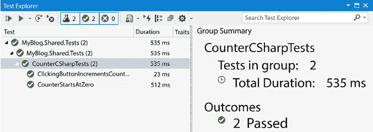
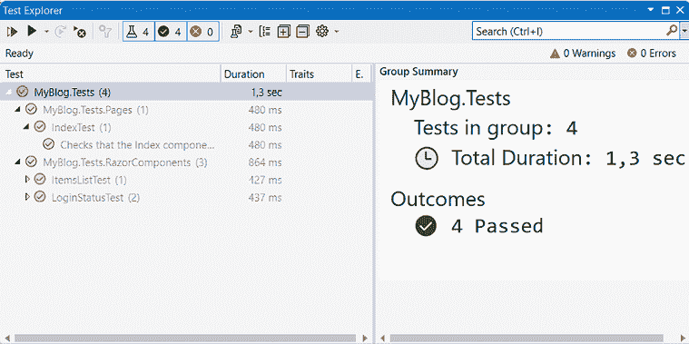

# 第十三章：测试

在本章中，我们将探讨测试。为我们的项目编写测试将帮助我们快速开发。

我们可以运行测试以确保我们没有在最新的更改中破坏任何东西。此外，我们不必在测试组件上投入时间，因为所有这些都由测试完成。测试将提高产品的质量，因为我们知道之前工作正常的东西仍然按预期工作。

但为 UI 元素编写测试并不总是容易；最常见的方法是启动网站，使用点击按钮的工具，然后读取输出以确定是否正常工作。这种方法的优势在于我们可以测试我们的网站在不同的浏览器和设备上。缺点是通常需要花费大量时间来完成这些测试。我们需要启动网站，打开浏览器，验证测试，关闭浏览器，然后为下一个测试重复此过程。

我们也可以在 Blazor 中使用这种方法（就像任何 ASP.NET 网站一样），但与 Blazor 一起，我们在测试方面还有其他机会。

Steve Sanderson 为 Blazor 创建了一个测试框架的雏形，Microsoft MVP Egil Hansen 接手并继续了其开发。

Egil 的框架被称为 **bUnit**，并已成为 Blazor 社区中测试 Blazor 组件的行业标准。

本章涵盖了以下主题：

+   什么是 bUnit？

+   设置测试项目

+   模拟 API

+   编写测试

+   `Blazm` 扩展

# 技术要求

确保你已经阅读了前面的章节或使用 `Chapter12` 文件夹作为起点。

你可以在此章结果的源代码在 [`github.com/PacktPublishing/Web-Development-with-Blazor-Third-Edition/tree/main/Chapter13`](https://github.com/PacktPublishing/Web-Development-with-Blazor-Third-Edition/tree/main/Chapter13) 找到。

如果你使用 GitHub 上的代码跳转到本章，请确保你已在设置文件中添加了 `Auth0` 账户信息。你可以在 *第八章*，*身份验证和授权* 中找到说明。

# 什么是 bUnit？

如介绍中所述，一些测试会启动浏览器来测试页面/组件，但 bUnit 采用另一种方法。

bUnit 是专门为 Blazor 定制的。它可以使用 C# 或 Razor 语法定义和设置测试。它还可以模拟 JavaScript 互操作以及 Blazor 的身份验证和授权。为了使我们的组件更容易测试，有时我们需要从开始就考虑这些事情，或者对我们的代码进行一些小的修改。

bUnit 不依赖于浏览器，而是在内部渲染输出并将其暴露给我们，以便我们可以针对预定义的输出进行测试。这也是一个限制——我们不是在测试真实网站；我们是在测试组件，所以将其视为单元测试，而不是集成测试。

是时候让我们动手实践了，让我们创建一个测试项目。

# 设置测试项目

要能够运行测试，我们需要一个测试项目：

1.  要安装 **bUnit** 模板，打开 PowerShell 并运行以下命令：

    ```cs
    dotnet new install bunit.template 
    ```

1.  检查 bUnit 网页上的模板的最新版本：[`bunit.dev/`](https://bunit.dev/)。

1.  在 Visual Studio 中，右键单击 **MyBlog** 解决方案，然后选择 **添加** | **新建项目**。

1.  搜索 **bUnit**，在结果中选择 **bUnit Test Project**，然后点击 **下一步**。有时，找到模板需要一些时间，我们也可以将 **项目类型** 下拉菜单更改为 **bUnit** 来找到模板。我们可能需要重新启动 Visual Studio 才能找到它。

1.  将项目命名为 `MyBlog.Tests`，保留位置不变，然后点击 **下一步**。

1.  选择 **xUnit** 作为单元测试框架和目标框架：**.NET 8.0**，然后点击 **创建**。

太好了！我们现在有一个测试项目。在我们模拟 API 之前，让我们看看我们可用的不同方法，这样我们就可以了解 bUnit 是如何工作的。

在 `MyBlog.Tests` 中，我们应该有以下四个文件：

+   `_Imports.razor` 包含我们希望所有 Razor 文件都能访问的命名空间。

+   `Counter.razor` 是我们在 Blazor 模板中默认获得的相同 `Counter` 组件的副本。

+   `CounterCSharpTest.cs` 包含用 C#编写的测试。

+   `CounterRazorTest.razor` 包含用 Razor 编写的测试。

让我们从 `CounterCSharpTest.cs` 文件开始，它包含两个测试：一个检查计数器是否从 `0` 开始，另一个点击按钮并验证计数器现在是 `1`。这两个简单的测试对于测试 `Counter` 组件是有意义的。

`CounterStartsAtZero` 测试看起来像这样：

```cs
[Fact]
public void CounterStartsAtZero()
{
    // Arrange
var cut = RenderComponent<Counter>();
    // Assert that content of the paragraph shows counter
// at zero
    cut.Find("p").MarkupMatches("<p>Current count: 0</p>");
} 
```

让我们分解一下。`Fact` 属性告诉测试运行器这是一个 *正常* 测试，没有参数。我们也可以使用 `Theory` 属性告诉测试运行器 `test` 方法需要参数值，但在这个用例中我们不需要参数。

首先，我们安排测试。简单来说，我们设置进行测试所需的一切。Egil 使用 `cut` 作为组件的名称，这代表 **待测试组件**。

在这种情况下，我们运行 `RenderComponent` 方法，并传入组件类型，即 `Counter` 组件。接下来，我们断言组件是否输出了正确的内容。我们使用 `Find` 方法找到第一个段落标签，然后验证 HTML 看起来像 `<p>Current count: 0</p>`。

第二个测试稍微复杂一些，看起来像这样：

```cs
[Fact]
public void ClickingButtonIncrementsCounter()
{
    // Arrange
var cut = RenderComponent<Counter>();
    // Act - click button to increment counter
    cut.Find("button").Click();
    // Assert that the counter was incremented
    cut.Find("p").MarkupMatches("<p>Current count: 1</p>");
} 
```

与之前的测试一样，我们通过渲染我们的 `Counter` 组件开始安排。下一步是执行，我们点击按钮。我们寻找按钮，然后在 `Counter` 组件中点击按钮。只有一个按钮，所以在这种情况下，以这种方式寻找按钮是安全的。

然后是再次断言的时候了，我们以与上一个测试相同的方式检查标记，但这次我们寻找的是 `1` 而不是 `0`。

另外还有一种替代方案，我们可以使用 Razor 语法编写测试。如果我们查看 `CounterRazorTests.razor` 文件，我们可以看到完全相同的测试，但语法不同：

```cs
 [Fact]
    public void CounterStartsAtZero()
    {
        // Arrange
var cut = Render(@<Counter />);
        // Assert that content of the paragraph shows counter at zero
        cut.Find("p").MarkupMatches(@<p>Current count: 0</p>);
    } 
```

实际上，只是我们渲染组件的方式不同。这做的是同样的事情，只是个人偏好的问题。我更喜欢使用 Razor 版本；它更容易阅读，并且在测试时添加参数到我们的组件也更简单。

现在，让我们运行测试并查看它们是否通过：

1.  在 Visual Studio 中，通过使用 *Ctrl* + *Q* 搜索来调出 **Test Explorer**。我们也可以在 **视图** | **测试资源管理器** 中找到它。

1.  在视图中点击 **运行所有测试**。测试资源管理器应该看起来像 *图 13.1*：



图 13.1：Visual Studio 测试资源管理器

太棒了！现在，我们的第一个测试正在运行，并且希望它能通过。

接下来，我们将查看如何模拟 API。

# 模拟 API

测试我们的应用程序有不同的方法。API 测试超出了本书的范围，但我们仍然需要测试组件，这些组件依赖于 API。我们可以启动 API 并针对 API 进行测试，但在这个情况下，我们只对测试 Blazor 组件感兴趣。

然后，我们可以模拟 API 或创建一个不读取数据库但读取预定义数据集的 API 的假副本。这样，我们总能知道输出应该是什么。

幸运的是，我们为 API 创建的接口正是我们创建模拟 API 所需要的。

我们不会实现项目中所有测试的 100%，因此我们不需要模拟所有方法。请随意在章节末尾作为练习实现所有方法的测试。

我们有两种方法可以实现模拟 API。我们可以启动一个内存数据库，但为了保持简单，我们将选择另一种选项，在请求时生成帖子：

1.  在 `MyBlog.Tests` 项目中，将项目引用添加到 `SharedComponents` 和 `BlazorWebApp` 项目。

1.  创建一个名为 `BlogApiMock.cs` 的新类。

1.  添加以下命名空间：

    ```cs
    using Data.Models;
    using Data.Models.Interfaces;
    using System.Collections.Generic;
    using System.Threading.Tasks; 
    ```

1.  实现 `IBlogApi` 接口；类应该看起来像这样：

    ```cs
    internal class BlogApiMock :IBlogApi
    {
    } 
    ```

    现在，我们将实现每个方法，以便我们可以获取数据。

1.  对于 `BlogPost`，在类中添加以下代码：

    ```cs
    public async Task<BlogPost?> GetBlogPostAsync(string id)
    {
        BlogPost post = new()
        {
            Id = id,
            Text = $"This is a blog post no {id}",
            Title = $"Blogpost {id}",
            PublishDate = DateTime.Now,
            Category = await GetCategoryAsync("1"),
        };
        post.Tags.Add(await GetTagAsync("1"));
        post.Tags.Add(await GetTagAsync("2"));
        return post;
    }
    public Task<int> GetBlogPostCountAsync()
    {
        return Task.FromResult(10);
    }
    public async Task<List<BlogPost>?> GetBlogPostsAsync(int numberofposts, int startindex)
        {
            List<BlogPost> list = new();
            for (int a = 0; a < numberofposts; a++)
            {
                list.Add(await GetBlogPostAsync($"{startindex + a}"));
            }
            return list;
        } 
    ```

    当我们运行 `GetBlogPostAsync` 方法时，我们创建一个博客文章并填充我们可以稍后用于测试的预定义信息。对于获取博客文章列表也是同样的情况。

    我们还声称数据库中总共有 `10` 篇博客文章。

    对于类别，添加以下代码：

    ```cs
     public async Task<List<Category>?> GetCategoriesAsync()
        {
            List<Category> list = new();
            for (int a = 0; a < 10; a++)
            {
                list.Add(await GetCategoryAsync($"{a}"));
            }
            return list;
        }
        public Task<Category?> GetCategoryAsync(string id)
        {
            return Task.FromResult(new Category() { Id = id, Name = $"Category {id}" });
        } 
    ```

    这里，我们做同样的事情：我们创建名为 `Category` 后跟数字的类别。

1.  对于注释，添加以下内容：

    ```cs
     public Task<List<Comment>> GetCommentsAsync(string blogPostId)
        {
            var comments= new List<Comment>
            {
                new Comment { BlogPostId = blogPostId, Date = DateTime.Now, Id = "Comment1", Name = "Rocket Raccoon", Text = "I really want that arm!" }
            };
            return Task.FromResult(comments);
        } 
    ```

    这里，我们创建一个评论。

    对于标签也是同样的情况；添加以下代码：

    ```cs
     public Task<Tag?> GetTagAsync(string id)
        {
            return Task.FromResult(new Tag() { Id = id, Name = $"Tag {id}" });
        }
        public async Task<List<Tag>?> GetTagsAsync()
        {
            List<Tag> list = new();
            for (int a = 0; a < 10; a++)
            {
                list.Add(await GetTagAsync($"{a}"));
            }
            return list;
        } 
    ```

    我们不会为 API 中的其他方法添加测试。但我们确实需要将它们添加到模拟类中，以满足接口：

    ```cs
     public Task<BlogPost?> SaveBlogPostAsync(BlogPost item)
        {
            return Task.FromResult(item);
        }
        public Task<Category?> SaveCategoryAsync(Category item)
        {
            return Task.FromResult(item);
        }
        public Task<Tag?> SaveTagAsync(Tag item)
        {
            return Task.FromResult(item);
        }     public Task<Comment?> SaveCommentAsync(Comment item)
        {
            return Task.FromResult(item);
        }
        public Task DeleteBlogPostAsync(string id)
        {
            return Task.CompletedTask;
        }
        public Task DeleteCategoryAsync(string id)
        {
            return Task.CompletedTask;
        }
        public Task DeleteTagAsync(string id)
        {
            return Task.CompletedTask;
        }
      public Task DeleteCommentAsync(string id)
      {
            return Task.CompletedTask;
      } 
    ```

现在我们有一个模拟 API，它反复执行相同的事情，这样我们就可以进行可靠的测试。

# 编写测试

是时候编写一些测试了。如我之前在本章中提到的，我们不会为整个网站创建测试；如果你愿意，我们可以留到稍后由你来完成。这只是为了让你了解如何编写测试：

1.  在`MyBlog.Tests`项目中，创建一个名为`Pages`的新文件夹。这样做只是为了保持一定的结构（与我们要测试的项目相同的文件夹结构）。

1.  选择`Pages`文件夹，创建一个名为`HomeTest.razor`的新 Razor 组件。

1.  在`_Imports`文件中，添加以下命名空间：

    ```cs
    @using SharedComponents.Pages
    @using Data.Models.Interfaces
    @using SharedComponents.ReusableComponents 
    ```

1.  在`HomeTest.razor`文件中，通过添加以下代码继承`TestContext`：

    ```cs
    @inherits TestContext 
    ```

1.  现在，我们将添加测试。添加以下代码：

    ```cs
    @code{
    [Fact(DisplayName ="Checks that the Home component shows 10 posts")]
        public void Shows10Blogposts()
        {
            // Act
    var cut = Render(@<Home />);
            // Assert that the content has 10 article tags (each representing a blogpost)
            Assert.Equal(10,cut.FindAll("article").Count());
        }
    } 
    ```

    我们给我们的测试起一个显示名称，这样我们就能理解它做什么。这个测试相当简单；我们知道从模拟 API 中有`10`篇博客文章。我们还知道每篇博客文章都在`article`标签内渲染。我们找到所有的`article`标签，并确保总共有`10`个。

    由于我们正在使用注入，我们需要配置依赖注入，这可以在构造函数中完成。

1.  我们需要添加`HomeTest`方法：

    ```cs
    public HomeTest()
    {
          Services.AddScoped<IBlogApi, BlogApiMock>();
    } 
    ```

    当类创建时，此方法将运行，在这里我们声明如果组件请求`BlogApi`的实例，它将返回我们的模拟 API 的实例。

    这与 Blazor Server 中的方式相同，在那里我们返回一个直接与数据库通信的 API，以及与 Blazor WebAssembly 相同，在那里我们返回一个与 Web API 通信的 API 实例。

    在这种情况下，它将返回我们的模拟 API，该 API 返回易于测试的数据。现在，我们需要运行实际测试。

1.  删除默认测试：

    ```cs
    Counter.razor 
    CounterCSharpTests.cs
    CounterRazorTests.cs 
    ```

1.  在 Visual Studio 中，通过使用*Ctrl* + *Q*搜索来打开测试资源管理器。我们也可以在**视图** | **测试资源管理器**中找到它。

    运行我们的测试，看看是否得到绿色信号，如图*图 13.2*所示：



图 13.2：带有 IndexTest 的测试资源管理器

现在，我们有一个检查 10 篇帖子是否渲染的测试。

bUnit 是一个优秀的测试框架，而且它专门为 Blazor 编写，因此能够充分利用 Blazor 的强大功能，这使得它非常易于使用。

现在，我们对我们的博客有一个简单的测试，但 bUnit 支持更高级的功能，如身份验证。

## 身份验证

使用 bUnit，我们可以测试身份验证和授权。

然而，进行身份验证的不是组件本身。我们在*第八章*，*身份验证和授权*中向`App.razor`添加了`AuthorizeRouteView`，所以在单个组件中测试这一点不会有任何区别。

但我们可以使用`AuthorizeView`，例如，我们已经在我们的博客中的`LoginStatus`组件中有了它，当未授权时显示登录链接，当授权时显示注销链接。请随意添加这些测试，就像我们在上一节中做的那样，或者作为参考。

我们可以使用`AddTestAuthorization`方法来授权我们的测试，如下所示：

```cs
 [Fact(DisplayName ="Checks if log in is showed")]
    public void ShouldShowLogin()
    {
        // Arrange
this.AddTestAuthorization();
        // Act
var cut = Render(@<LoginStatus />);

        // Assert that there is a link with the text Log in
        Assert.Equal("Log in",cut.Find("a").InnerHtml);
    } 
```

这种方法添加了`TestAuthorization`但并未授权。随后页面将显示一个带有文本`登录`的链接。为了测试用户是否已授权，我们只需将用户设置为已授权：

```cs
 [Fact(DisplayName ="Checks if logout is showed")]
    public void ShouldShowLogout()
    {
        // Arrange
var authContext = this.AddTestAuthorization();
        authContext.SetAuthorized("Testuser", AuthorizationState.Authorized);
        // Act
var cut = Render(@<LoginStatus />);

        // Assert that there is a link with the text Log out
        Assert.Equal("Log out",cut.Find("a").InnerHtml);
    } 
```

我们可以添加声明、角色以及更多内容。我们用于测试的用户与数据库中的用户或角色无关；授权由 bUnit 模拟。

认证和授权可能很难测试，但使用 bUnit 确实很简单。测试 JavaScript 可能有点困难，但 bUnit 也有相应的解决方案。

## 测试 JavaScript

bUnit 不支持测试 JavaScript，这是可以理解的。然而，我们可以自己测试互操作性。

在这本书中，我们使用了.NET 5 语法来编写 JavaScript。在我们的`SharedComponents\ReusableComponents\BlogButton.razor`组件中，我们进行 JavaScript 互操作以确认删除项。

JavaScript 调用看起来像这样：

```cs
jsmodule = await jsRuntime.InvokeAsync<IJSObjectReference>("import", "/_content/SharedComponents/ReusableComponents/BlogButton.razor.js");
return await jsmodule.InvokeAsync<bool>("showConfirm", ConfirmMessage); 
```

我们确保加载 JavaScript 模块，然后执行`showConfirm`方法。

在 bUnit 中，JavaScript 测试可以以两种模式进行——`严格`和`宽松`。默认值是`严格`，因此我们需要指定每个模块和每个方法。

如果我们选择`宽松`，所有方法都将返回默认值。例如，对于布尔值，它将返回`false`。

要测试前面的 JavaScript 调用，我们可以通过添加类似以下内容来实现：

```cs
var moduleInterop = this.JSInterop.SetupModule("/_content/SharedComponents/ReusableComponents/BlogButton.razor.js");
    var showconfirm = moduleInterop.Setup<bool>("showConfirm", "Are you sure?").SetResult(true); 
```

我们设置了一个与之前相同的路径到 JavaScript 的模块。然后，我们指定方法和任何参数。

最后，我们指定结果应该是什么。在这种情况下，我们返回`true`，这将返回 JavaScript，如果我们想删除项。我们还可以验证 JavaScript 方法是否被调用。在`ItemList`组件中测试此功能的完整示例如下：

```cs
@using Data.Models; @using SharedComponents.ReusableComponents;
@inherits TestContext
@code {
    [Fact(DisplayName = "Test if js method 'showConfirm' is called upon using JS interop")]
    public void ShouldShowConfirm()
    {
        // Arrange
var moduleInterop = this.JSInterop.SetupModule("/_content/SharedComponents/ReusableComponents/BlogButton.razor.js");
        moduleInterop.Setup<bool>("showConfirm", "Are you sure?").SetResult(true);
        var cut = Render(@<BlogButton OnClick="()=>{}" ConfirmMessage="Are you sure?"/>);
        // Act
var buttons = cut.FindAll("button");
        buttons.First().Click();
        // Assert
        JSInterop.VerifyInvoke("showConfirm");
}
} 
```

干得好！我们现在在我们的项目中有了测试。尽管我们没有涵盖所有组件，但我们应该有完成测试的所有构建块。

如果你想了解更多关于 bUnit 的信息，请查看以下链接：[`bunit.dev/docs/getting-started/index.html`](https://bunit.dev/docs/getting-started/index.html)。

他们的文档非常出色。

好知道也可以使用其他测试框架。我们结合使用 Playwright 测试和 bUnit，但测试的内容完全不同。你可以在[`playwright.dev/dotnet/docs/intro`](https://playwright.dev/dotnet/docs/intro)找到 Playwright。

在我们总结本章之前，我们还有一件事要讨论。

# Blazm 扩展

在开发 Blazor 应用程序时，有些事情做起来有点繁琐。我们在整本书中做了很多这样的事情。我编写代码时容易拼错单词，在创建独立的 CSS 或 JavaScript 文件时，我有时会拼错文件名，甚至文件扩展名也会出错。所以，我想，有没有更好的方法来做这件事？

是的，有！

我开发了一个 Visual Studio 扩展，它将为 Visual Studio 添加一些非常棒的功能。

但我究竟为什么要等这么久才谈论这个呢！？好吧，首先学习“真正的”方法很重要，然后才走捷径。

你可以在这里查看扩展：[`marketplace.visualstudio.com/items?itemName=EngstromJimmy.BlazmExtension`](https://marketplace.visualstudio.com/items?itemName=EngstromJimmy.BlazmExtension)

它可以帮助我们添加代码后文件和隔离的 CSS 和 JavaScript 文件。它还可以帮助我们将命名空间移动到`_imports`文件，以及更多。但它还可以帮助我们生成测试，不是全部，但会在路上帮助我们。你还记得我们在*第四章*中使用的`Alerts`组件吗？我们可以右键单击该组件并选择`Generate` **bUnit 测试**，然后使用**Razor 语法**。它将生成代码到剪贴板，我们可以将其粘贴到我们想要的位置。它将自动给我们以下代码：

```cs
@inherits TestContext
@using Bunit
@using SharedComponents.ReusableComponents;
@code
    {
        [Fact]
        public void AlertTest()
        {
            //Arrange
            SharedComponents.ReusableComponents.Alert/AlertStyle style = default!;
            var cut = Render(@<Alert
                  Style="@style"
                  >
                  <ChildContent>
<b>ChildContent fragment</b></ChildContent>
                  </Alert>
);
            //Act
//Assert
        }
    } 
```

结果并不完美，正如我们所见，但它给了我们一个立足点。如果我们为`Alert`组件编写一个测试，它可能看起来像这样：

```cs
[Fact]
 public void AlertStyleTest()
 {
     //Arrange
     Alert.AlertStyle style = Alert.AlertStyle.Primary;
     var cut = Render(@<Alert Style="@style">
     <ChildContent>
         <b>ChildContent fragment</b>
     </ChildContent>
 </Alert>
 );
     //Act
//Assert
     cut.MarkupMatches("""<div class="alert alert-primary" role="alert"><b>ChildContent fragment</b></div>""");
 } 
```

我们不得不清理一些命名空间并添加一个断言。如果你问我，这很整洁，但话又说回来，我对这个话题确实有些偏见。我真的希望这个扩展能帮到你，如果你喜欢它，我非常希望你能给它一个五星好评。

# 摘要

在本章中，我们探讨了测试我们的应用程序。我们讨论了如何模拟 API 以进行可靠的测试。我们还涵盖了如何测试 JavaScript 互操作以及认证。

测试可以加快我们的开发速度，最重要的是，提高质量。结合 bUnit 和依赖注入，构建帮助我们测试组件的测试变得容易。

由于我们可以单独测试每个组件，所以我们不必登录，导航到我们网站上的特定位置，然后测试整个页面，正如许多其他测试框架所要求的那样。

现在，我们的网站包含可重用组件、认证、API、Blazor Server、Blazor WebAssembly、认证、共享代码、JavaScript 互操作、状态管理和测试。我们只剩下一件事要做：发布它！

在下一章，*第十四章*，*部署到生产环境*，是时候发布了。
