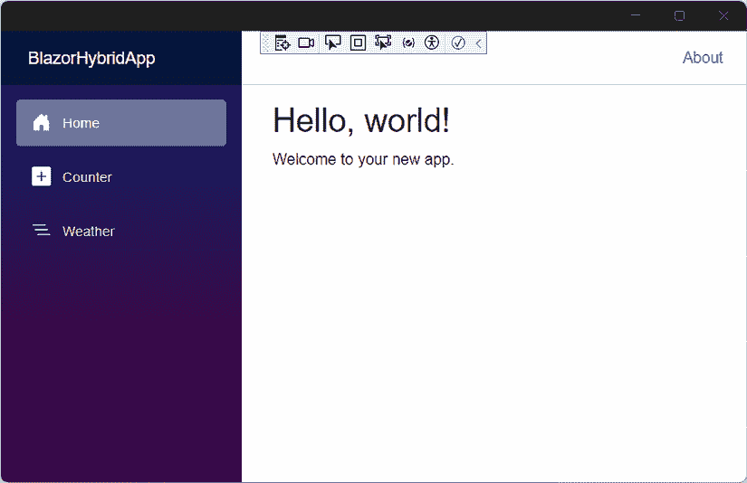
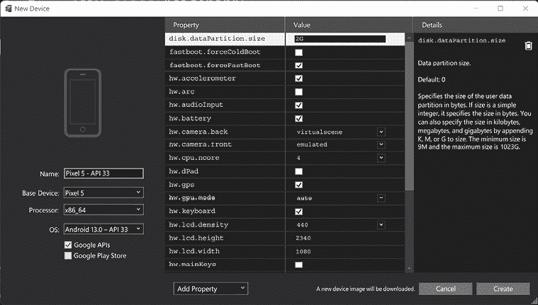
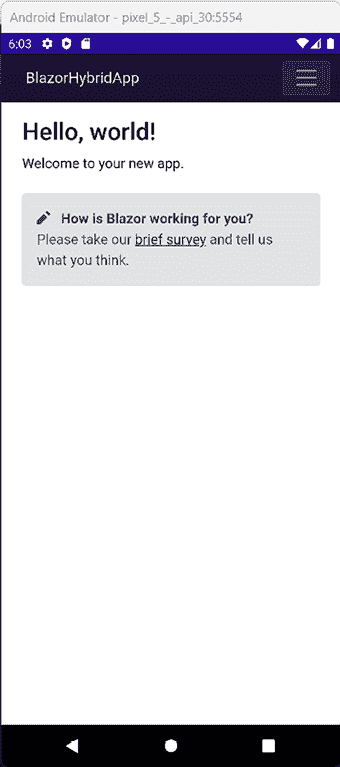
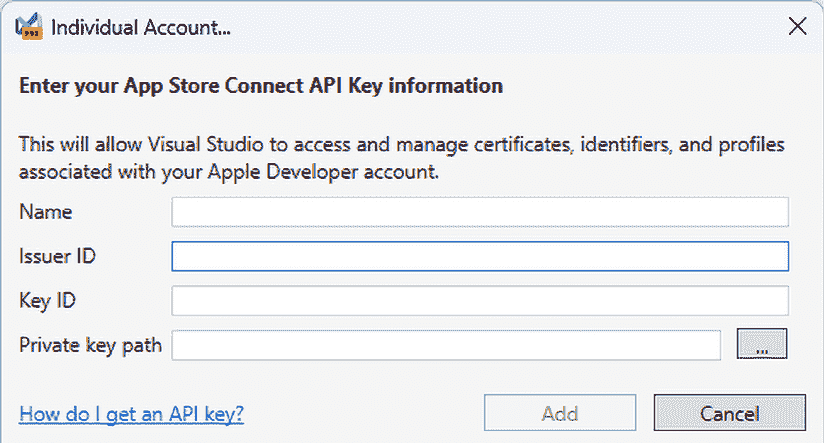
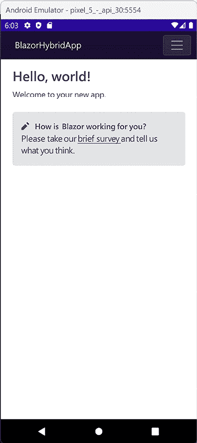
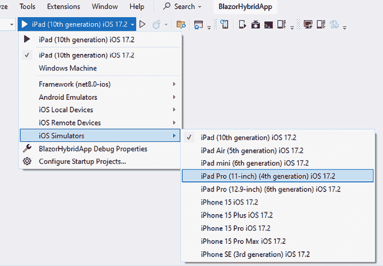
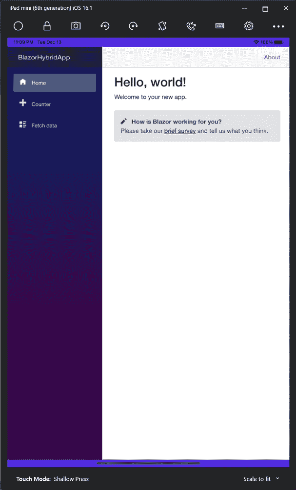
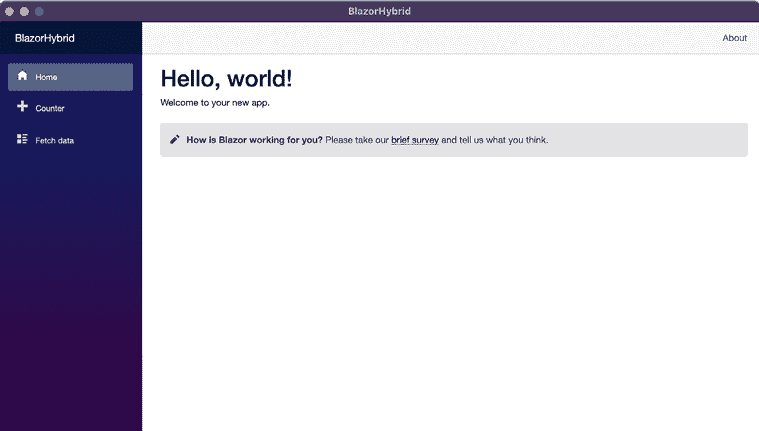

# 18

# 访问 .NET MAUI

到目前为止，我们已经讨论了 Blazor WebAssembly 和 Blazor 服务器，但第三个选项是什么？

在本章中，我们将访问 **.NET MAUI**，微软的新跨平台开发平台。

本章不会深入探讨 .NET MAUI，因为那可以是一本完整的书。

在本章中，我们将涵盖以下内容：

+   什么是 .NET MAUI？

+   创建新项目

+   查看模板

+   为 Android 开发

+   为 iOS 开发

+   为 macOS 开发

+   为 Windows 开发

+   为 Tizen 开发

本章的目的是让你将其作为参考，以便你能够独立实现一个新项目。

# 技术要求

本章是参考章节，并且与本书的其他章节没有任何关联。

你可以在[`github.com/PacktPublishing/Web-Development-with-Blazor-Third-Edition/tree/main/Chapter18`](https://github.com/PacktPublishing/Web-Development-with-Blazor-Third-Edition/tree/main/Chapter18)找到本章的源代码。

# 什么是 .NET MAUI？

我们将从一点历史开始。

Xamarin 是一家成立于 2011 年 5 月的软件公司，由创建 Mono 的工程师创立，Mono 是 .NET Framework 的免费和开源版本。微软于 2016 年收购了该公司，现在它是 .NET 开发平台的重要组成部分，为使用 C# 和 .NET 构建原生跨平台移动应用提供工具和服务。Xamarin 的技术允许开发者使用单个共享代码库编写原生 iOS、Android 和 Windows 应用程序，这使得为多个平台开发和维护应用程序变得更加容易。

**.NET 多平台应用程序用户界面**（**MAUI**）是微软的新框架，它是 Xamarin.Forms 的进化。

这是一种创建一个 UI，部署到许多不同的平台，并在每个平台上获得原生控件的方法。.NET MAUI 还可以托管 Blazor，这被称为 Blazor 混合。这样，我们可以在 .NET MAUI 应用程序内部渲染 Blazor 内容，使用与为网络构建相同的控件和代码。使用 Blazor 混合渲染的控件是网络控件，因此我们不会获得原生控件。然而，我们可以混合原生和 Blazor 混合内容。

多年前，我参加了一个与一群顾问的会议。我工作的公司想要投资一个应用程序，我们转向瑞典的一家大型咨询公司，以获得关于我们如何进行的帮助。

一周后，我们再次开会，他们展示了他们的发现。他们的建议是原生开发，不使用任何跨平台框架。

他们进行了一系列的争论，但有两点给我留下了深刻的印象，如下：

+   原生应用看起来更好，并给用户带来“真实”的设备体验。

+   共享代码（跨平台）意味着如果一个平台有错误，同样的错误现在在所有平台上都有。

由于 .NET MAUI（以前称为 Xamarin.Forms）使用原生控件，用户无法知道在开发原生应用程序和使用 .NET MAUI 开发之间的区别。最终，它将看起来和感觉像原生应用程序。对于 Blazor 混合来说并非如此，它使用 Web 控件。因此，对于第一个论点有一些合理的论据。现在，我们必须问自己，原生外观和感觉有多重要？看看我 iPhone 上的应用程序，没有多少应用程序看起来相同，所以我争辩说，只要您坚持良好的 UX，这并不那么重要。第二个论点让我非常生气。他们是不是试图说服我们共享代码很糟糕？是的，他们是。在平台之间共享代码非常棒；您只需编写一次代码，修复一次错误，并在所有平台上修复它。

.NET MAUI 给我们提供了两种选择。我们可以使用原生 UI 和 C# 代码，或者使用 Blazor 混合来获取 Web 控件。

# 创建新项目

要开发跨平台应用程序，我们必须在 Visual Studio 中安装跨平台工具。

如果您还没有这样做，请打开 Visual Studio 安装程序并选择 **.NET 多平台应用程序 UI** 开发工作流程。

.NET MAUI 有几个模板：**.NET MAUI 应用程序**、**.NET MAUI Blazor 混合应用程序**和**.NET MAUI 类库**。

## .NET MAUI 应用程序

.NET MAUI 应用程序模板使用 XAML 创建应用程序。

XAML 也用于 **Windows 表现基金会**（**WPF**）和**通用 Windows 平台**（**UWP**）。每个 XAML 版本都有细微的差别，但如果您之前使用过 WPF 或 UWP，它们应该感觉熟悉。

XAML 被转换为原生元素。这样，如果我们的应用程序在 Windows 上运行，它将具有 Windows 应用程序的外观和感觉。如果我们运行在 iOS 设备上，它将看起来和感觉像原生 iOS 应用程序。

如果我们想使用我们的 C# 技能创建跨平台应用程序，这可能是我们最好的选择。使用这种方法，我们将获得原生感觉，而无需在 Kotlin 或 Swift 中编写原生代码。

## .NET MAUI 类库

.NET MAUI 类库用于在应用程序之间共享内容、类和功能。

## .NET MAUI Blazor 混合应用程序

由于这是一本关于 Blazor 的书，我们将重点关注 .NET MAUI Blazor 混合 `App` 模板。这是一个将 Blazor 应用程序嵌入到原生壳中的模板。

对于 .NET MAUI Blazor 应用程序项目，我们至少需要：

+   Android 7.0 (API 24) 或更高版本

+   iOS 14 或更高版本

+   macOS 11 或更高版本，使用 Mac Catalyst

.NET MAUI Blazor 混合应用程序项目使用 BlazorWebView 来渲染 Blazor 内容。它与 Blazor 服务器不同，不运行 WebAssembly；它只是我们托管 Blazor 应用程序的第三个选项。

让我们开始一个新的项目并深入了解：

1.  在 Visual Studio 中，创建一个新的 `.NET MAUI Blazor 混合应用程序` 项目。

1.  将项目命名为 `BlazorHybridApp` 并确保您选择了 **.NET 8**。

1.  在 Visual Studio 顶部，选择 **Windows 机器** 并运行项目。

就这些。我们现在有了我们的第一个跨平台 Blazor 混合应用！



图 18.1：在 Windows 上运行的.NET MAUI 应用

我们可能需要在我们的机器上启用开发者模式。如果有提示我们这样做，只需按照说明重新运行应用程序。太好了！我们现在有一个项目了。在下一节中，我们将查看模板的样子。

# 查看模板

当运行项目时，我们应该能够识别 UI。它就是相同的*Hello, world!*页面，相同的计数器，以及相同的天气预报。

如果我们查看`Components/Pages`文件夹，我们会找到 Razor 组件，如果我们打开`Counter.razor`文件，我们会找到一个看起来像这样的熟悉组件：

```cs
@page "/counter"
<h1>Counter</h1>
<p role="status">Current count: @currentCount</p>
<button class="btn btn-primary" @onclick="IncrementCount">Click me</button>
@code {
    private int currentCount = 0;
    private void IncrementCount()
    {
        currentCount++;
    }
} 
```

要创建 Blazor 混合应用，添加这样的组件就足够开始了解了，但让我们更深入地了解一下。模板是带有一些添加的 Blazor 启动代码的.NET MAUI 应用。

为了理解正在发生的事情，我们将从`Platforms`文件夹开始。在`Platforms`文件夹中，我们将为每个我们可以为 Android、iOS、Mac Catalyst、Tizen 和 Windows 开发的平台找到不同的文件夹。

这是每个平台的开端，它们有一些不同的实现，但最终，它们都指向位于项目根目录的`MauiProgram`文件。

`MauiProgram`类设置了所有内容，比如字体和依赖注入：

```cs
namespace BlazorHybridApp;
public static class MauiProgram
{
    public static MauiApp CreateMauiApp()
    {
        var builder = MauiApp.CreateBuilder();
        builder
            .UseMauiApp<App>()
            .ConfigureFonts(fonts =>
            {
                fonts.AddFont("OpenSans-Regular.ttf", "OpenSansRegular");
            });
        builder.Services.AddMauiBlazorWebView();
#if DEBUG
        builder.Services.AddBlazorWebViewDeveloperTools();
        builder.Logging.AddDebug();
#endif
        builder.Services.AddSingleton<WeatherForecastService>();
        return builder.Build();
    }
} 
```

文件中的关键是`UseMauiApp<App>`，这给我们一些关于接下来会发生什么的线索。下一步是加载`App.xaml`。

`App.xaml`文件包含许多用于样式的资源。Blazor 的魔法从`App.xaml.cs`开始：

```cs
namespace BlazorHybridApp;
public partial class App : Application
{
    public App()
    {
        InitializeComponent();
        MainPage = new MainPage();
    }
} 
```

它将应用程序`MainPage`设置为`MainPage`类的实例。在`MainPage.xaml`中，我们已经达到了应用程序中的第一个 Blazor 引用，即`BlazorWebView`：

```cs
<BlazorWebView x:Name="blazorWebView" HostPage="wwwroot/index.html">
<BlazorWebView.RootComponents>
<RootComponent Selector="#app" ComponentType="{x:Type local:Components.Routes}" />
</BlazorWebView.RootComponents>
</BlazorWebView> 
```

在这种情况下，我们指的是位于`wwwroot`文件夹中的`index.html`，并设置根组件（类似于我们在 Blazor Server 和 Blazor WebAssembly 中的`Program.cs`中做的）。

在这里，我们还可以添加 XAML 组件，这使得混合 XAML 和 Blazor 组件成为可能。尽管实现看起来不同，但我们应该熟悉这些概念。

`index.html`几乎与 Blazor WebAssembly 中的相同：

```cs
<!DOCTYPE html>
<html lang="en">
<head>
<meta charset="utf-8" />
<meta name="viewport" content="width=device-width, initial-scale=1.0, maximum-scale=1.0, user-scalable=no, viewport-fit=cover" />
<title>BlazorHybridApp</title>
<base href="/" />
<link rel="stylesheet" href="css/bootstrap/bootstrap.min.css" />
<link href="css/app.css" rel="stylesheet" />
<link href="BlazorHybridApp.styles.css" rel="stylesheet" />
</head>
<body>
<div class="status-bar-safe-area"></div>
<div id="app">Loading...</div>
<div id="blazor-error-ui">
        An unhandled error has occurred.
        <a href="" class="reload">Reload</a>
<a class="dismiss">/</a>
</div>
<script src="img/blazor.webview.js" autostart="false"></script>
</body>
</html> 
```

值得注意的是唯一的不同之处是与其他的 JavaScript 不同（Blazor Server 和 Blazor WebAssembly 实现）。从这一点开始，应用程序现在运行的是纯 Blazor。

正如我们在`MainPage.xaml`中看到的，我们正在加载一个名为`Routes`的 Razor 文件。这个名字来自 Blazor Web App 模板，看起来像这样：

```cs
<Router AppAssembly="@typeof(MauiProgram).Assembly">
<Found Context="routeData">
<RouteView RouteData="@routeData" DefaultLayout="@typeof(Layout.MainLayout)" />
<FocusOnNavigate RouteData="@routeData" Selector="h1" />
</Found>
</Router> 
```

这是我们找到路由器的地方，我们在这里配置 Razor 组件的位置，并处理找不到的请求。

我们不会深入探讨 Blazor 部分，因为路由器之后的一切都与其他任何 Blazor 托管模型（Blazor Server 和 Blazor WebAssembly）相同。有一个`MainLayout`、`NavMenu`以及每个功能的组件（`Hello, world!`、`Counter`和`Weather`）。

使用 Blazor Server 和 Blazor WebAssembly，我们需要调用 JavaScript 来访问本地资源，如蓝牙、电池和手电筒等。Blazor Hybrid 添加了直接访问本地资源的能力。我们可以通过类似以下代码来访问手电筒（因为我们都喜欢发光的东西）：

```cs
try
{
    if (FlashlightSwitch.IsToggled)
        await Flashlight.Default.TurnOnAsync();
    else
await Flashlight.Default.TurnOffAsync();
}
catch (FeatureNotSupportedException ex)
{
    // Handle not supported on device exception
}
catch (PermissionException ex)
{
    // Handle permission exception
}
catch (Exception ex)
{
    // Unable to turn on/off flashlight
} 
```

如果我们运行 Blazor Server 或 Blazor WebAssembly 应用程序，此代码将无法工作。如果我们仍然想在 .NET MAUI 和 Blazor 网页应用程序之间共享组件，我们可以使用依赖注入来实现，就像我们在书中已经做过的几次一样，一个是网页实现，一个是移动实现。

接下来，我们将让我们的神奇应用在 Android 上运行。

# 针对 Android 的开发

在开发 Android 时有两个选项。我们可以在**模拟器**或**物理设备**上运行我们的应用程序。

要发布我们的应用程序，我们需要一个 Google 开发者许可证，但在开发和测试时不需要。

## 在模拟器中运行

我们首先需要安装一个模拟器来在 Android 模拟器上运行我们的应用程序：

1.  在 Visual Studio 中，打开**工具** | **Android** | **Android 设备管理器**。

1.  点击**新建**按钮并配置一个新设备（默认设置应该可以）：



图 18.2：Android 设备配置

1.  点击**创建**以下载设备镜像并配置它。

1.  在 Visual Studio 顶部选择新创建的模拟器并运行项目。启动模拟器将需要几分钟时间。在开发时，请确保不要关闭模拟器以加快部署时间。

为了让模拟器运行得更快，我们可以根据所使用的处理器启用硬件加速。

要启用硬件加速，请参阅官方文档：[`learn.microsoft.com/en-us/xamarin/android/get-started/installation/android-emulator/hardware-acceleration?pivots=windows`](https://learn.microsoft.com/en-us/xamarin/android/get-started/installation/android-emulator/hardware-acceleration?pivots=windows)。

太好了！我们现在已经在 Android 模拟器中运行了我们的应用程序：



图 18.3：在 Android 模拟器中运行的应用程序

接下来，我们将在物理设备上运行应用程序。

## 在物理设备上运行

如果我们想在物理设备上尝试我们的应用程序，我们需要在我们的 Android 设备上做一些事情。这可能会因设备而异。

首先，我们需要确保手机已解锁为开发者模式：

1.  前往**设置**屏幕。

1.  选择**关于手机**。

1.  点击**构建号**七次，直到出现**您现在是一名开发者**。

其次，我们需要启用 USB 调试：

1.  前往**设置**屏幕。

1.  选择**开发者选项**。

1.  打开 **USB 调试** 选项。

1.  一些设备还需要启用 **通过 USB 安装**。

现在我们已经准备好在物理设备上尝试我们的应用程序了。

1.  使用 USB 线缆将您的设备连接到计算机。

1.  在 Visual Studio 顶部的菜单中，点击 **Android 本地设备** 下的箭头，并选择您的设备。

1.  按 **运行**，Visual Studio 将将应用程序部署到设备上。

我们现在应该在我们的设备上运行我们的应用程序。

在另一台设备上运行代码是一种非凡的感觉。多年来，我为 Windows 8 和 Windows Phone 开发了超过 100 个应用程序。然而，时至今日，看到我的应用程序部署到另一台物理设备上，我仍然有同样的感觉。

接下来，我们将查看我们为 iOS 开发有哪些选项。

# 开发 iOS 应用

苹果不允许在非苹果计算机上编译 iOS 代码。还有像 MacinCloud 和 MacStadium 这样的云选项，但在这本书中我们不会讨论这些选项。

这意味着我们必须拥有一台 Mac（用于使用模拟器）或者拥有一个苹果开发者许可证（用于使用热重启）。

为了使我们的 iOS 设备能够工作，我们需要将其设置为开发者模式：

1.  打开您 iPhone 的 **设置** 应用。

1.  向下滚动一点，找到 **隐私和安全**，然后点击它。

1.  寻找名为 **开发者模式** 的选项。如果您找不到，您可能需要将手机连接到 Xcode。它因操作系统版本而异，但可以向 Google 或 Bing 求助。有许多资源可以帮助您解决您版本的问题。

1.  应该有一个切换开关；将其翻转以启用开发者模式。

1.  您的 iOS 设备可能会提醒您，这可能会使您的设备的安全性降低。不用担心，只需点击 **重启** 以继续。

1.  一旦您的设备重新启动，解锁它。您会看到一个提示，询问您是否确定要启用开发者模式。继续点击 **开启**，如果需要输入密码，请输入。

## 热重启

要在我们的物理设备上测试我们的应用程序，我们可以使用热重启。热重启功能仅设计用于我们在开发过程中测试应用程序，我们将无法发布应用程序。

首先，我们需要安装 iTunes。如果您没有 iTunes，您可以从 Windows 商店安装。

在 Visual Studio 的顶部菜单中，如果我们选择 **iOS 本地设备**，我们会看到一个友好的向导，它会精确地告诉我们需要做什么。第一步是提供信息性的，并允许我们安装 iTunes。

接下来，是时候输入我们的 App Store Connect API 密钥信息了。为了能够提供这些信息，我们需要有一个苹果开发者账户。截至写作时，这需要花费 99 美元。

关于如何找到这些信息，有非常优秀的说明。

您将看到以下屏幕：



图 18.4：Apple Connect API 密钥信息屏幕

然后，您需要采取以下步骤：

1.  您可以通过访问[`appstoreconnect.apple.com/access/api`](https://appstoreconnect.apple.com/access/api)创建一个新的密钥。

1.  点击**请求 API 密钥**然后**生成 API 密钥**。

1.  输入名称`Visual Studio`并选择**访问开发者**。

1.  将不同的值复制到 Visual Studio 中，下载 API 密钥，并将文件作为**私钥路径**选择。

1.  接下来，选择一个团队，我们就准备好了。

1.  运行应用程序并查看它在您的 iPhone 上运行：



图 18.5：在 iPhone 上运行的应用程序

接下来，我们将探讨如何设置模拟器。

### 模拟器

模拟器在 Mac 上运行应用程序，但结果显示在 PC 上。模拟器与仿真器不同。仿真器在机器上（在我们的案例中，是 PC）上运行代码。模拟器在原生操作系统（macOS）上运行，模仿 iPad 或 iPhone。

要使模拟器工作，我们需要在同一网络上有苹果电脑。Visual Studio 将帮助我们设置一切。我们必须安装 Xcode。在您的 Mac 上，从 App Store 安装 Xcode，启动它以同意许可协议并选择您想要为哪些设备开发。

我们还需要打开 Mac 的远程访问。我们可以通过以下方式做到这一点：

1.  在 Mac 上，按*cmd* + *space*调用 Spotlight，搜索**远程登录**，然后打开**共享系统偏好设置**。

1.  启用**远程登录**选项以允许 Visual Studio 连接到 Mac。

1.  设置**仅限这些用户**的访问权限，并确保您的用户包含在列表或组中。

我们现在已经在 Mac 上准备好了所有东西。在 PC 上的 Visual Studio 中，我们现在可以配对我们的 Mac：

1.  选择**工具** | **iOS** | **与 Mac 配对**。

1.  按照向导中的说明（与上面相同）。

1.  从列表中选择 Mac 并点击**连接**。Visual Studio 现在可以帮助您安装开始所需的东西。Mac 安装所有这些可能需要一段时间，所以如果不起作用，模拟器可能还没有安装。

1.  在 Visual Studio 顶部的下拉菜单中，我们可以选择**iOS 模拟器**，然后选择一个设备来运行我们的应用程序。



图 18.6：在 Visual Studio 中的设备选择

1.  运行应用程序，模拟器将启动。如果我们在 iPad Mini 上运行它，应用程序将看起来像这样：



图 18.7：在 iPad 模拟器中运行的应用程序

我们现在有两种在 iOS 设备上运行和测试应用程序的方法。我们还可以直接将 iPhone 连接到 Mac，并通过 Wi-Fi 运行应用程序。有关通过 Wi-Fi 调试的更多信息，请参阅官方文档：[`learn.microsoft.com/en-us/xamarin/ios/deploy-test/wireless-deployment`](https://learn.microsoft.com/en-us/xamarin/ios/deploy-test/wireless-deployment)。

接下来，我们将为 macOS 构建一个应用程序。

# macOS 开发

我们没有从 Windows 机器运行或部署到 macOS 的选项。要在 Mac 上运行我们的应用程序，请按照以下步骤操作：

1.  在 Mac 上，使用 VS Code 打开我们的项目。

1.  在撰写本文时，将 .NET MAUI 工具安装在 VS Code 中仍然是一个预览版本，并且微软宣布 VS for Mac 已停止开发。这是跟踪在 Mac 上安装工具的最佳来源：[`learn.microsoft.com/en-us/dotnet/maui/get-started/installation?view=net-maui-8.0&tabs=visual-studio-code`](https://learn.microsoft.com/en-us/dotnet/maui/get-started/installation?view=net-maui-8.0&tabs=visual-studio-code)。请遵循链接中的说明。

1.  运行项目，我们的应用将显示出来：



图 18.8：在 macOS 上运行的应用

在这种情况下，我们是在同一平台上运行应用程序，没有仿真器或模拟器，这比在单独的设备上运行要简单得多。

接下来，我们将在 Windows 上运行我们的应用程序。

# 为 Windows 开发

在 Windows 上运行应用程序是我们之前在 *.NET MAUI Blazor Hybrid App* 部分的 *步骤 3* 中所做的事情。再次强调，执行以下步骤：

1.  将下拉菜单更改为 **Windows Machine** 并运行项目。我们可以在本章开头的 *图 18.1* 中看到结果。

与 macOS 一样，我们在同一平台上运行应用程序，没有仿真器或模拟器，这比在单独的设备上运行要简单得多。

接下来，我们将看看 Tizen。

# 为 Tizen 开发

Tizen 是一个主要针对电视和手表的操作系统。我的三星 Gear S3 运行的是 Tizen。Tizen 由三星管理，而不是微软。其他制造商能够接入这个平台的能力，正好显示了 .NET MAUI 平台是多么出色。

在撰写本文时，Tizen 的体验略有滞后。由于这不是一个官方平台，并且由于工具的状态，我决定不包括指南。

但 Tizen 正在开发工具，所以如果你想将你的应用转移到运行 Tizen 的电视上，你应该了解一下。

# 摘要

在本章中，我们探讨了使用 Blazor Hybrid 进行跨平台开发。我之前在本章中提到过这一点，但再次提一下，在手机或非计算机设备上运行代码是一件非常有趣的事情。这种感受是无法比拟的。即使你并不打算为移动设备开发，也值得一试。

使用 .NET MAUI，我们可以利用我们现有的 C# 知识，也许更重要的是，我们的 Blazor 知识来创建移动应用程序。
