WPF 基础

在本章中，我们将涵盖以下食谱：

+   使用 Visual Studio 2017 安装 WPF 工作负载

+   创建 WPF 应用程序

+   从一个窗口创建和导航到另一个窗口

+   创建和导航到另一页

+   创建对话框

+   创建窗口之间的所有权

+   创建单实例应用程序

+   向 WPF 应用程序传递参数

+   处理未处理的异常

# 简介

**Windows 展示基础**（**WPF**）为开发者提供了一个统一的编程模型，用于构建动态、数据驱动的 Windows 桌面应用程序。它首次于 2006 年与 .NET 3.0 一起发布。它是 .NET 框架本身的一部分。

WPF 是一个图形子系统，用于渲染丰富的 **用户界面**（UI），是一个基于矢量的渲染引擎，在 **可扩展应用程序标记语言**（**XAML**）中创建令人惊叹的用户界面。它支持广泛的功能，包括应用程序模型、控件、布局、图形、资源、安全性等。

用于其执行的运行时库自 Windows Vista 和 Windows Server 2008 以来已包含在 Windows 中。如果你使用的是带有 SP2/SP3 的 Windows XP 或 Windows Server 2003，你可以选择安装必要的库。

要开始学习 WPF 的不同食谱，你应该对基本原理有一个清晰的理解。在本章中，我们将从架构和语法开始，并指导你创建构建块。

## WPF 架构

WPF 使用分层架构，包括托管、非托管和五个不同层中的核心 API，这些层被称为 **展示框架**、**展示核心**、**公共语言运行时**、**媒体集成库**和 **OS 核心层**。编程模型通过托管代码公开。

在以下图中，你可以看到架构的清晰图示：

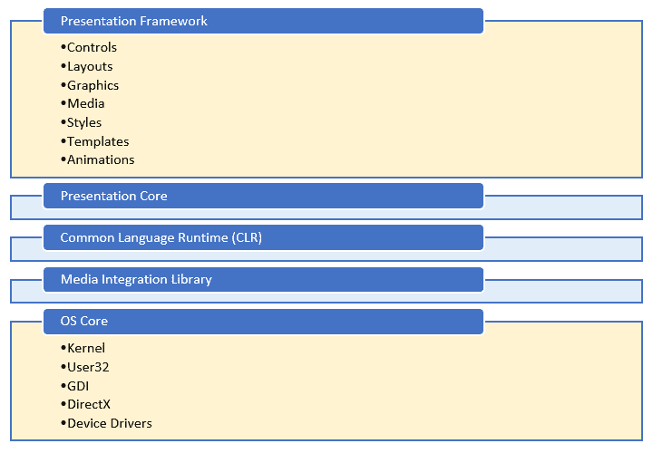

### 展示框架

**展示框架**，是 `presentationframework.dll` 的一部分，为你提供了开始构建 WPF 应用程序 UI 所需的基本组件（如控件、布局、图形、媒体、样式、模板、动画等）。它是托管层的一部分。

### 展示核心

**展示核心**层，是 `presentationcore.dll` 的一部分，为你提供了对 **媒体集成库**（**MIL**）的包装。它为你提供了访问 MIL 核心和视觉系统的公共接口，以开发视觉树。它包含视觉元素和渲染指令，用于使用 XAML 工具构建 Windows 应用程序。这也是托管代码的一部分。

### 公共语言运行时

**公共语言运行时**，通常称为 **CLR**，是托管层的一部分，为你提供了构建健壮应用程序的几个功能，包括 **公共类型系统**（**CTS**）、错误处理、内存管理等。

### 媒体集成库

**媒体集成库（MIL**），位于`milcore.dll`中，是用于通过 DirectX 引擎渲染的所有图形显示的未管理层的一部分。它为您提供了对 2D 和 3D 表面的基本支持，并允许您访问未管理组件以实现与 DirectX 的紧密集成。它还允许您在从视觉系统到**公共语言运行时（CLR**）渲染指令时获得性能。

### 操作系统核心

在 MIL 之后，下一层是**操作系统核心**，它为您提供了访问操作系统核心组件的低级 API 的权限。这一层包括内核、User32、DirectX、GDI 和设备驱动程序。

## WPF 应用程序类型

虽然 WPF 主要用于桌面应用程序，但您也可以创建基于网络的程序。因此，WPF 应用程序可以分为两种类型：

+   基于桌面的可执行文件（EXE）

+   基于网络的程序（XBAP）

桌面应用程序是常规的 `.exe` 可执行文件，您通常在任一基于 Windows 的系统上运行它们，而基于网络的程序是可以在 Web 服务器上部署的 `.xbap` 文件，并且可以在任何支持的浏览器中运行。运行这些应用程序类型都需要 .NET Framework。

当您运行一个 WPF 应用程序时，它将在两个线程中启动。UI 线程使用`System.Threading.DispatcherObject`来创建消息系统，并维护 UI 操作队列。就像 Win32 消息泵一样，它根据设置的优先级执行 UI 操作。

另一个线程是后台线程，用于处理由 WPF 管理的渲染引擎。它获取视觉树的副本，并执行操作以在 Direct3D 表面上显示视觉组件。然后它调用 UI 元素来确定大小并按其父元素排列子元素。

## XAML 概述

**XAML**代表**可扩展应用程序标记语言**。它是一种基于 XML 的标记语言，用于声明性地创建任何基于 XAML 的应用程序的 UI，例如**Windows 平台基金会（WPF**）、**通用 Windows 平台（UWP**）和**Xamarin.Forms**。您可以使用声明性的 XAML 语法创建可见的 UI 元素来设计丰富的 UI，然后编写后台代码以执行运行时逻辑。

微软最近推出了**XAML 标准**，这是一个定义标准 XAML 词汇的规范，它将允许支持的框架共享基于 XAML 的 UI 定义。

您可以通过访问 GitHub 上的此处了解更多关于此规范的信息：

[`aka.ms/xamlstandard.`](http://aka.ms/xamlstandard)

虽然使用 XAML 标记来创建 UI 不是强制性的，但它已被广泛接受为创建整个应用程序 UI 的智能选项，因为它使创建变得更容易。你也可以通过编写 C# 或 VB.NET 代码来创建 UI，但这会使创建更困难，也更难以维护。此外，这也使得设计师难以独立工作。

使用 XAML 设计应用程序 UI 与编写带有几个可选属性的 XML 节点一样简单。属性用于设置额外的样式、行为和属性。要在 UI 中创建一个简单的按钮，你只需在 XAML 文件中写下 `<Button />`。同样，你也可以只写 `<TextBox />` 来创建一个用户输入框。

此外，你还可以向控件添加更多详细信息。例如，要向按钮添加标签，使用其 `Content` 属性，并设置其尺寸，使用 `Height` 和 `Width` 属性，如下面的代码所示：

```cs
    <Button Content="Click Here" /> 
    <Button Height="36" Width="120" /> 
```

通常，当你将 XAML 页面添加到你的 WPF 应用程序项目中时，它将与项目一起编译，并产生一个名为 **二进制应用程序标记语言**（**BAML**）的二进制文件。项目的最终输出（即，程序集文件）包含这个 BAML 文件作为资源。当应用程序加载到内存中时，BAML 将在运行时被解析。

你也可以将 XAML 加载到内存中，并直接在 UI 上渲染它。但是，在这种情况下，如果它有任何 XAML 语法错误，它将在运行时抛出这些错误。如果你将性能与第一个过程进行比较，后者较慢，因为它将整个 XAML 语法渲染到 UI 上。

这里有一个流程图，展示了加载和渲染/解析 XAML UI 的方法：

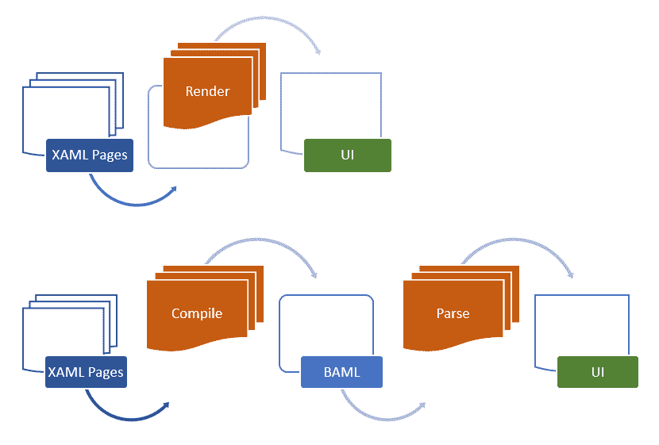

## XAML 语法术语

XAML 使用一些语法术语来定义 UI 中的元素并创建其实例。在你开始工作之前，你必须了解它提供的不同术语。让我们看看其中的一些。

### 对象元素语法

每个类型的实例都使用适当的 XAML 语法来在 UI 中创建一个对象元素。这些对象元素以一个左尖括号 (`<`) 开头，并定义了元素的名称。当它定义在默认作用域之外时，你可以选择性地添加命名空间前缀。你可以使用一个自闭合的尖括号 (`/>`) 或一个右尖括号 (`>`) 来关闭对象元素的定义。如果一个对象元素没有子元素，则使用自闭合的尖括号。例如，（`<Button Content="点击这里" />`）使用自闭合的尖括号。如果你写入带有子元素的内容，它将使用结束标签关闭（`<Button>点击这里</Button>`），如下所示。

当你在 XAML 页面上定义对象元素时，创建元素实例的指令被生成，并在你将其加载到内存中时通过调用元素的构造函数来创建其实例。

### 属性属性语法

您可以定义一个或多个属性到元素。这些是通过将一个名为 **属性属性语法** 的属性写入元素来完成的。它以属性名称和一个赋值运算符（`=`）开头，后跟引号内的值。以下示例演示了定义按钮元素具有标签作为其内容是多么容易，以及如何在 UI 中设置其尺寸：

```cs
<Button Content="Click Here" /> 
<Button Content="Click Here" Width="120" Height="30" /> 
```

### 属性元素语法

这是一种 XAML 语法，允许您将属性定义为元素。这通常用于您无法在引号内分配属性值的情况。如果我们以之前的例子为例，文本 `Click Here` 可以轻松地分配给按钮内容。但是，当您有另一个元素或组合属性值时，您不能将其写入引号内。为此，XAML 引入了 **属性元素语法** 以帮助您轻松定义属性值。

它以 `<element.PropertyName>` 开头，以 `</element.PropertyName>` 结尾。以下示例演示了如何使用 `SolidColorBrush` 对象为按钮背景分配颜色：

```cs
    <Button> 
      <Button.Background> 
         <SolidColorBrush Color="Red" /> 
      </Button.Background> 
    </Button> 
```

### 内容语法

这是一种另一种类型的 XAML 语法，用于设置 UI 元素的内容。它可以设置为子元素的值。以下示例演示了如何将 `Border` 控件的文本内容属性设置为包含 `Button` 控件作为其 `子` 元素：

```cs
    <Border> 
      <Border.Child> 
        <Button Content="Click Here" /> 
      </Border.Child> 
    </Border> 
```

在使用 **Content 语法** 时，您应该记住以下要点：

+   `Content` 属性的值必须是连续的

+   您不能在单个实例中两次定义 XAML `Content` 属性

因此，以下是不合法的，因为它将抛出 XAML 错误：

```cs
    <Border> 
        <Border.Child> 
            <Button Content="Button One" /> 
        </Border.Child> 
        <Border.Child> 
            <Button Content="Button Two" /> 
        </Border.Child> 
    </Border> 
```

### 集合语法

当您需要将一组元素定义到父根元素时，使用 **集合语法** 可以使其易于阅读。例如，要在 `StackPanel` 内添加元素，我们使用其 `Children` 属性，如下面的代码所示：

```cs
    <StackPanel>   
      <StackPanel.Children> 
         <Button Content="Button One" /> 
         <Button Content="Button Two" /> 
      </StackPanel.Children> 
    </StackPanel> 
```

这也可以写成如下，解析器知道如何创建和将元素分配给 `StackPanel`：

```cs
    <StackPanel> 
      <Button Content="Button One" /> 
      <Button Content="Button Two" /> 
    </StackPanel> 
```

### 事件属性语法

当您添加按钮时，需要将其与事件监听器关联，以执行某些操作。对于添加其他控件和 UI 布局也是如此。XAML 允许您使用 **事件属性语法** 为特定的 XAML 对象元素定义事件。

语法看起来像属性属性，但它用于将事件监听器关联到元素。以下示例演示了如何将点击事件分配给按钮控件：

```cs
    <Button Content="Click Here" Click="OnButtonClicked" /> 
```

关联的事件由 XAML 页面的代码后端生成，您可以在其中执行实际操作。以下是前面按钮点击事件实现代码片段：

```cs
    void OnButtonClicked (object sender, RoutedEventArgs e) 
    { 
        // event implementation 
    } 
```

# 使用 Visual Studio 2017 安装 WPF 工作负载

由于我们已经学习了 WPF 架构和 XAML 语法的基本概念，我们可以开始学习不同的菜谱，使用 WPF 的 XAML 工具构建 Windows 应用程序。但在那之前，让我们安装 **Visual Studio 2017** 所需的工作负载/组件。如果您使用的是 Visual Studio 的早期版本，这一步骤将有所不同。

## 准备工作

要安装构建 WPF 应用程序所需的组件，请运行 Visual Studio 2017 安装程序。如果您没有安装程序，您可以去 [`www.visualstudio.com/downloads`](https://www.visualstudio.com/downloads) 下载正确的版本。让我们下载 Visual Studio Community 2017 版本，因为它是一个功能齐全的 IDE，并且对学生、开源和个人开发者免费提供。

## 如何操作...

下载 Visual Studio 2017 安装程序后，请按照以下步骤安装正确的 workload：

1.  运行安装程序后，它将显示以下屏幕。点击继续：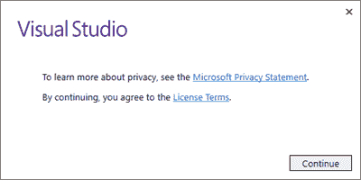

1.  等待几分钟，让安装程序为安装过程做好准备。一个进度条将显示当前进度的状态：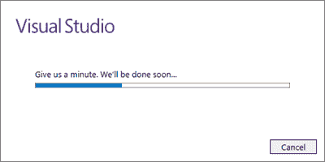

1.  然后会出现以下屏幕，其中将要求您选择要安装的 **workloads** 或 **components**：

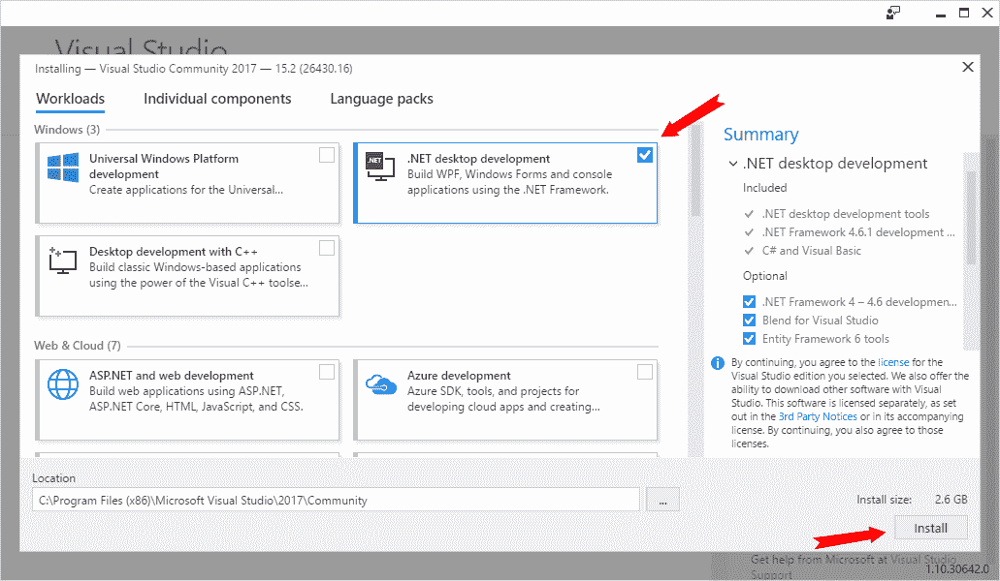

1.  要构建针对 .NET Framework 的 WPF 应用程序，请选择前面的截图所示的 .NET 桌面开发 workload。

1.  点击安装按钮继续安装。

1.  以下屏幕将显示，显示安装状态。根据您的网络带宽，这将花费一些时间，因为它将根据您的选择从 Microsoft 服务器下载所需的组件，并逐个安装：

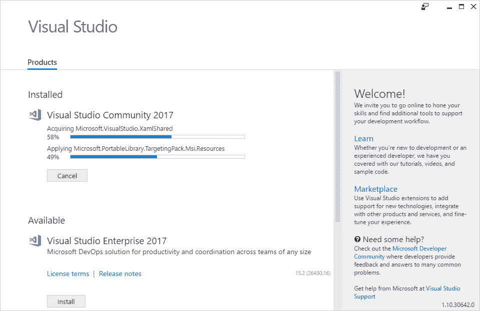

1.  安装完成后，您可能需要重新启动系统以使更改生效。在这种情况下，屏幕上会出现一个弹出窗口，要求您重新启动您的电脑。

安装了 **.NET 桌面开发组件**并重新启动系统后，你就可以开始构建你的第一个 WPF 应用程序了。

# 创建 WPF 应用程序

WPF 开发平台支持一系列广泛的功能，包括 UI 控件、布局、资源、图形、数据绑定、应用程序模型等。在使用这些功能之前，您需要使用 Visual Studio 创建 WPF 项目。

本菜谱的目标是创建一个 WPF 项目，并学习基本的项目结构和组件。让我们开始使用 **XAML 工具**构建我们的第一个 WPF 应用程序。

## 准备工作

要开始使用 WPF 应用程序开发，您必须在系统上运行 Visual Studio，并且已经安装了所需的组件。

## 如何操作...

按照以下步骤创建您的第一个 WPF 应用程序：

1.  在您的 Visual Studio IDE 中，导航到文件 | 新建 | 项目...菜单，如图以下截图所示：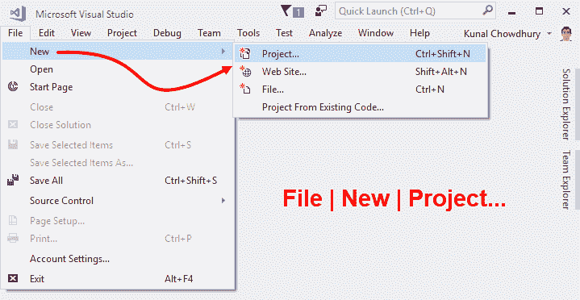

1.  这将在屏幕上打开新建项目对话框。您也可以通过按键盘快捷键*Ctrl* + *Shift* + *N*来打开它。

1.  在新建项目对话框中，导航到已安装 | 模板 | Visual C# | Windows 经典桌面，如图以下截图的左侧所示：

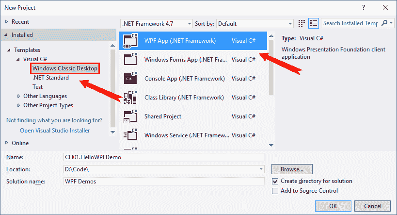

1.  在右侧面板中，首先选择您希望应用程序针对的.NET Framework 版本。我们在这里选择了.NET Framework 4.7。

1.  然后从可用的模板列表中选择 WPF App (.NET Framework)。

1.  给项目起一个名字（在我们的例子中是`CH01.HelloWPFDemo`）。

1.  可选地，选择项目位置，您希望创建它的位置。

1.  可选地，您也可以为解决方案提供不同的名称。

1.  当您准备好时，单击“确定”按钮，让 Visual Studio 根据您选择的模板创建项目。

一旦项目创建完成，Visual Studio 将打开解决方案资源管理器，其中列出了项目及其上创建的所有默认文件。项目结构将类似于以下截图：

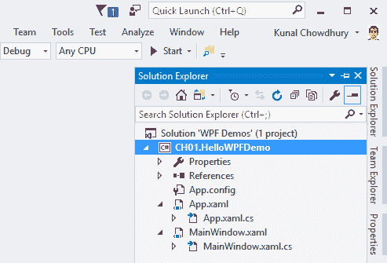

## 更多内容...

使用 Visual Studio 默认模板创建的每个 WPF 应用程序项目都包含以下文件：

+   `App.config`：这是您的 WPF 应用程序的配置文件。默认情况下，它包含以下行，描述了应用程序运行所支持的运行时版本。这包含我们在项目创建期间选择的完全相同的运行时版本：

```cs
    <?xml version="1.0" encoding="utf-8" ?> 
      <configuration> 
        <startup>  
          <supportedRuntime            
           version="v4.0"sku=".NETFramework,Version=v4.7" /> 
        </startup> 
      </configuration> 
```

`config`文件还可以包含应用程序设置和其他您想要在应用程序中使用/引用的配置设置。

+   `App.xaml`：当您创建 WPF 项目时，Visual Studio 会自动创建`App.xaml`文件。它是应用程序的声明性起点。此文件的根元素是`Application`实例，它定义了应用程序特定的属性和事件：

```cs
    <Application x:Class="CH01.HelloWPFDemo.App" 

      StartupUri="MainWindow.xaml"> 

    <Application.Resources> 

    </Application.Resources> 
    </Application> 
```

`Application`类的实例定义了`Window`或`Page`，它将成为启动 UI，并通过`StartupUri`属性进行注册。在前面代码中，（`StartupUri="MainWindow.xaml"`）表示当您运行应用程序时，将加载`MainWindow.xaml`页面。

应用程序实例还可以持有全局/应用程序级别的资源（如，样式、模板和转换器），这些资源可以在整个应用程序中全局使用。

+   `App.xaml.cs`：这是`App.xaml`的后台代码类文件，它扩展了框架的`Application`类以编写应用程序特定的代码。您可以使用此文件订阅事件，如`Startup`、`UnhandledException`以执行常见操作：

```cs
namespace CH01.HelloWPFDemo 
{ 
    /// <summary> 
    /// Interaction logic for App.xaml 
    /// </summary> 
    public partial class App : Application 
    { 
    } 
} 
```

此类通常用于操作命令行参数并根据这些参数加载不同的 XAML 页面。

+   `MainWindow.xaml`：这是 Visual Studio 在创建 WPF 项目时生成的默认 UI 页面。它是注册为`App.xaml`中的`StartupUri`的页面。此页面的根元素是`Window`，默认包含一个`Grid`布局。以下是默认代码片段：

```cs
<Window x:Class="CH01.HelloWPFDemo.MainWindow" 
  xmlns=
   "http://schemas.microsoft.com/winfx/2006/xaml/presentation" 

   Title="MainWindow" Height="350" Width="525"> 
  <Grid> 

  </Grid> 
</Window> 
```

`x:Class`属性定义了包含 UI 逻辑的关联部分类。您可以修改此 XAML 以提供应用程序启动页的新外观。本书的后续章节将涵盖各种 UI 控件和布局。

+   `MainWindow.xaml.cs`：这是`MainWindow.xaml`的后台代码类，包含与 UI 操作相关的逻辑。通常，开发者在类中编写各种 UI 操作的实现。

每当您向 XAML 页面添加任何 UI 元素时，该控件都会在具有`.g.i.cs`扩展名的部分类文件中内部注册。例如，如果您在`MainWindow.xaml`文件中添加一个控件，它将注册在`obj`文件夹中的`MainWindow.g.i.cs`中。如果您打开该文件，您可以在`InitializeComponent()`方法中观察到整个加载过程。

# 创建并从一个窗口导航到另一个窗口

在 WPF 独立应用程序中，窗口用于托管 UI 元素，使用户能够与 UI 和数据交互。基类`Window`提供了创建和与窗口 UI 交互的所有 API。

在 WPF 应用程序中，通用的窗口布局被分为多个部分。以下是基本窗口的截图，包含其各个部分：

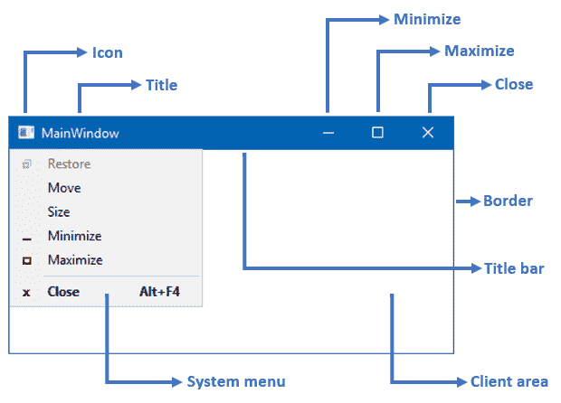

窗口的各个部分如下所述：

+   窗口的外部部分是一个**Border**，您可以利用它来启用调整大小选项：

    +   外部边框可以包含一个**调整大小把手**，使您能够以对角线方式调整窗口大小

+   窗口顶部有一个**标题栏**，它由以下部分组成：

    +   **图标**，为您的应用程序窗口提供独特的品牌

    +   **标题**，显示窗口的可识别名称

    +   一个包含最小化、最大化/还原和关闭按钮的小面板

    +   **系统菜单**，包含允许用户在窗口上执行最小化、最大化/还原、移动、大小和关闭操作的菜单项

+   开发者可以在此处添加应用程序/窗口特定的布局和控制**客户端区域**

## 准备工作

要开始此食谱，请打开您的 Visual Studio 实例，并根据 WPF App (.NET Framework)模板创建一个名为`CH01.WindowDemo`的 WPF 项目。一旦创建项目，它将包含名为`MainWindow.xaml`和`MainWindow.xaml.cs`的文件，以及其他默认文件。

让我们在同一项目中创建一个新的窗口，并从`MainWindow`中调用按钮以打开新窗口。

## 如何操作...

要创建一个新窗口，请按照以下简单步骤操作：

1.  打开“解决方案资源管理器”，在项目节点上右键单击。

1.  从右键单击上下文菜单中，导航到“添加 | 窗口...”，如下面的截图所示：

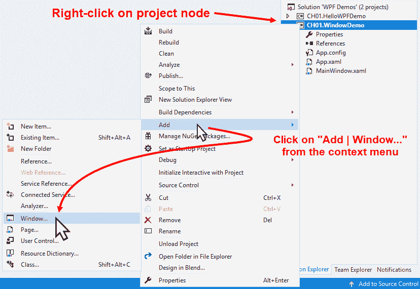

1.  屏幕上会出现以下“添加新项”对话框：

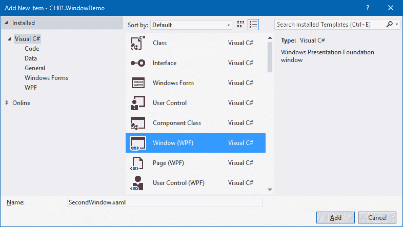

1.  确保选中的模板是“窗口（WPF）”。给它起个名字，`SecondWindow.xaml`，然后点击“添加”按钮。

1.  这将在项目目录中创建 `SecondWindow.xaml` 文件及其关联的后台代码文件 `SecondWindow.xaml.cs`。

1.  打开 XAML 文件（`SecondWindow.xaml`）并将全部内容替换为以下 XAML 代码：

```cs
<Window x:Class="CH01.WindowDemo.SecondWindow" 
  xmlns=
    "http://schemas.microsoft.com/winfx/2006/xaml/presentation" 

    Title="Second Window" Height="200" Width="300"> 
    <Grid> 
        <TextBlock Text="Second Window Instance" 
                   HorizontalAlignment="Center" 
                   VerticalAlignment="Center" 
                   FontSize="16"/> 
    </Grid> 
</Window>
```

1.  现在打开 `MainWindow.xaml` 文件，向其中添加一个按钮。将整个 `<Grid> </Grid>` 块替换为以下 XAML 代码：

```cs
<Grid> 
    <Button Content="Open Second Window" 
            Height="30" Width="150" 
            Click="OnSecondWindowButtonClicked"/> 
</Grid> 
```

1.  现在我们需要添加按钮点击事件的实现。只需打开 `MainWindow.xaml.cs` 文件，并在类定义内添加以下代码行：

```cs
private void OnSecondWindowButtonClicked(object sender,  
RoutedEventArgs e) 
{ 
    var window = new SecondWindow(); 
    window.Show(); 
} 
```

1.  现在，当你运行应用程序时，你会在屏幕上看到 MainWindow 打开，其中包含一个标签为“打开第二个窗口”的按钮。点击此按钮将在屏幕上打开第二个窗口，其文本内容为“第二个窗口实例”。以下是供您参考的截图！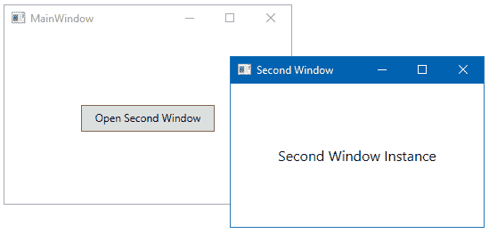

请注意，如果你再次点击按钮，因为它是无模式的，它将创建第二个窗口的另一个实例。

## 它是如何工作的...

当你创建 `Window` 类的实例时，它不会对用户可见。它只有在调用 `Show()` 方法时才会可见，该方法返回原始调用者的句柄，而不等待窗口关闭。

当你调用 `Show()` 方法时，它基本上创建了一个无模式窗口，因此当同一个窗口已经打开时，你可以在同一应用程序中与其他窗口进行交互。`Window` 类还公开了一个名为 `ShowDialog()` 的方法，它创建了一个模式窗口，并阻止用户与应用程序的其他窗口交互。我们将在本章的“创建对话框”部分中进一步讨论。

## 还有更多...

`Window` 类为你提供了一组属性、方法和事件，以自定义窗口的外观，执行特定操作或通知当前上下文。要使客户端区域支持透明度，请将窗口的 `AllowsTransparency` 属性设置为 `true`。这在你想创建一个自定义形状的窗口或皮肤主题时非常有用。

你可以通过设置 `Icon` 属性来更改窗口的默认图标，并通过设置 `ResizeMode` 属性来启用/禁用窗口大小调整。你还可以通过设置 `Title`、`WindowStartupLocation`、`WindowState`、`WindowStyle` 和 `ShowInTaskbar` 属性来设置窗口标题、启动位置、窗口状态、窗口样式和任务栏可见性。

不仅这些，你还可以通过调用其`Activate()`方法将窗口带到前台，通过调用`Window`类中可用的`Close()`方法关闭窗口。有时，当你想隐藏窗口而不是完全退出时，你可以利用`Hide()`方法使窗口隐藏，并通过在相同实例上调用`Show()`方法将其再次显示出来。

该类还公开了一些事件来通知你当前上下文信息。你可以在你的代码中使用`Activated`、`Deactivated`、`Closing`、`Closed`和`StateChanged`事件来获取此类通知。

# 创建和导航到另一个页面

WPF 应用程序支持浏览器风格的导航机制，它既可以用在独立应用程序中，也可以用在 XBAP 应用程序中。为了实现它，WPF 提供了`Page`类来封装可以由浏览器导航和托管的`Page`内容，以及`NavigationWindow`和/或`Frame`。

## 准备工作

要开始构建支持从 WPF 页面到另一个页面导航机制的应用程序，请打开 Visual Studio IDE，并基于 WPF App (.NET Framework)模板创建一个项目。给它起个名字（在我们的例子中，它是`CH01.PageDemo`）。

## 如何做到这一点...

一旦你根据 WPF App (.NET Framework)模板创建了项目，请按照以下步骤将页面添加到项目中，并与`NavigationService`集成：

1.  右键单击要创建页面的项目节点。

1.  如此截图所示，从上下文菜单中导航到添加 | 页面...：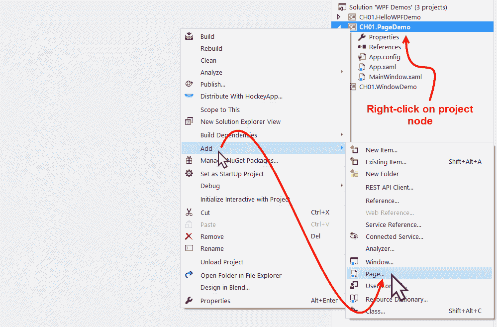

1.  这将打开以下“添加新项目”对话框窗口，其中已选中标题为“页面（WPF）”的项目。给它起个名字，`Page1.xaml`，然后点击添加。它将在你的项目中创建`Page1.xaml`和相关代码后文件`Page1.xaml.cs`：


1.  现在按照相同的步骤，1 到 3，创建另一个页面`Page2.xaml`，这将把 XAML 和相关 C#代码后文件添加到项目中。

1.  打开`Page1.xaml`文件，将`Grid`替换为以下 XAML：

```cs
<Grid> 
    <TextBlock Text="This is Page 1" FontSize="20" 
               HorizontalAlignment="Center"       
               VerticalAlignment="Center"/> 
    <Button Content="Next" Height="30" Width="120"  
            Margin="20" 
            HorizontalAlignment="Right"  
            VerticalAlignment="Bottom" 
            Click="OnNextButtonClicked"/> 
</Grid>
```

1.  在相关的代码后文件（`Page1.xaml.cs`）中，添加以下按钮点击事件处理器：

```cs
private void OnNextButtonClicked(object sender,
 RoutedEventArgs e) 
{ 
  NavigationService.Navigate(new Uri("Page2.xaml", 
   UriKind.Relative)); 
} 
```

1.  类似地，将以下 XAML 添加到`Page2.xaml`页面中，替换现有的`Grid`：

```cs
<Grid> 
    <TextBlock Text="This is Page 2" FontSize="20" 
               HorizontalAlignment="Center"  
               VerticalAlignment="Center"/> 
    <Button Content="Previous" Height="30" Width="120"  
            Margin="20" 
            HorizontalAlignment="Right"  
            VerticalAlignment="Bottom" 
            Click="OnPreviousButtonClicked"/> 
</Grid> 
```

1.  将以下按钮点击事件处理器添加到`Page2.xaml.cs`文件中：

```cs
private void OnPreviousButtonClicked(object sender, RoutedEventArgs e) 
{ 
    if (NavigationService.CanGoBack) 
    { 
        NavigationService.GoBack(); 
    } 
} 
```

1.  现在打开`MainWindow.xaml`文件，将 XAML 内容替换为以下内容：

```cs
<NavigationWindow x:Class="CH01.PageDemo.MainWindow" 
  xmlns=
   "http://schemas.microsoft.com/winfx/2006/xaml/presentation" 

    Title="MainWindow" Height="350" Width="525" 
    Source="Page1.xaml"> 

</NavigationWindow>
```

1.  现在打开`MainWindow.xaml.cs`文件，将其基类更改为`NavigationWindow`，而不是`Window`。

1.  运行应用程序，它将打开以下包含第 1 页的屏幕：

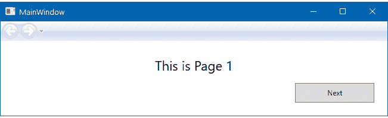

1.  点击“下一步”按钮将导航到第 2 页，如这里所示，它包含由 WPF 框架自动提供的激活导航按钮：

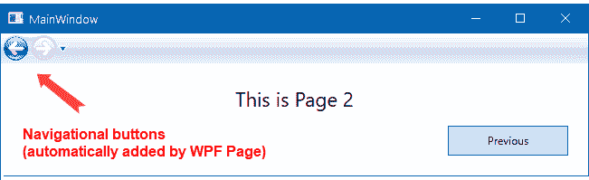

1.  现在，如果你点击导航面板中的“上一步”按钮或后退按钮，它将导航你到页面 1。

## 它是如何工作的...

在`MainWindow.xaml`页面中定义的`NavigationWindow`提供了支持内容导航的基本机制。`Source`属性（`Source="Page1.xaml"`），定义为`URI`，要求`NavigationWindow`默认加载所提到的页面（`Page1.xaml`）。

当你点击`Page1`的“下一步”按钮时，`NavigationService.Navigate`方法会被执行，传递你想要加载的下一页的`URI`。导航按钮会根据你执行的历史导航自动激活。

在`Page2`中，当你点击“上一步”按钮时，它首先检查`NavigationService`是否有立即的历史条目可以导航到你之前的一页。如果找到前一页，它将通过调用`NavigationService.GoBack()`方法自动将你导航到所需的页面。在这种情况下，你不需要传递页面的`URI`。

## 还有更多...

`NavigationService`提供了各种属性、方法和事件，用于在页面内容上执行导航机制。`CanGoBack()`和`CanGoForward()`返回一个`Boolean`值，分别指示后退和前进导航历史中是否至少有一个条目。`GoBack()`方法将你导航到后退导航历史中最新的条目，而`GoForward()`方法（如果可用）将你导航到前进导航历史。

要刷新当前内容，你可以调用`Refresh()`方法。`StopLoading()`方法停止当前执行从当前导航上下文的内容部分下载/加载。你也可以通过编程方式添加或从导航历史中删除条目。`AddBackEntry`方法接受一个参数`CustomContentState`对象，将条目添加到后退导航历史中。`RemoveBackEntry()`方法从后退导航历史中删除最近的条目。

存在诸如`Navigating`、`Navigated`、`NavigationFailed`、`NavigationStopped`、`NavigationProgress`和`LoadCompleted`等事件，用于通知你当前导航过程的各个状态。根据你的需求明智地使用它们。

# 创建对话框

对话框也是一种窗口，通常用于从用户那里获取输入或向用户显示消息。它使用模型窗口来防止用户在对话框已打开时与其他相同应用程序的窗口交互。在本教程中，我们将学习如何创建模型对话框并使用框架提供的常用对话框。

## 准备工作

要在 WPF 应用程序中开始构建和使用对话框，打开你的 Visual Studio IDE 并创建一个新的 WPF 项目，命名为`CH01.DialogBoxDemo`。

## 如何操作...

按照以下步骤创建对话框窗口，并从 `MainWindow` 中调用它以向用户显示消息：

1.  打开解决方案资源管理器，在项目节点上右键单击。

1.  从上下文菜单中选择添加 | 窗口... 以打开添加新项目对话框。

1.  确保选择了窗口（WPF）模板，将其命名为 `MessageDialog`，然后点击添加以继续。这将创建项目中的 `MessageDialog.xaml` 和 `MessageDialog.xaml.cs` 文件。

1.  打开 `MessageDialog.xaml` 文件，并用以下内容替换整个 XAML：

```cs
<Window x:Class="CH01.DialogBoxDemo.MessageDialog" 
 xmlns=
   "http://schemas.microsoft.com/winfx/2006/xaml/presentation"

    ShowInTaskbar="False" WindowStyle="SingleBorderWindow" 
    Title="Message" Height="150" Width="400"  
    FontSize="14" Topmost="True" ResizeMode="NoResize"> 

    <Grid> 
       <TextBlock TextWrapping="Wrap" Margin="8" 
        Text="Thank you for reading 'Windows Presentation 
        Foundation Cookbook'. Click 'OK' to continue next."/> 
        <StackPanel Orientation="Horizontal" 
                    VerticalAlignment="Bottom"  
                    HorizontalAlignment="Right" 
                    Margin="4"> 
            <Button Content="OK" Width="60" Height="30" 
                    Margin="4" IsDefault="True"  
                    Click="OnOKClicked"/> 
            <Button Content="Cancel" Width="60" Height="30" 
                    Margin="4" IsCancel="True"  
                    Click="OnCancelClicked"/> 
        </StackPanel> 
    </Grid> 
</Window>
```

1.  打开 `MessageDialog.xaml.cs` 文件，并为确定按钮和取消按钮添加以下事件实现：

```cs
private void OnOKClicked(object sender, RoutedEventArgs e) 
{ 
    DialogResult = true; 
} 

private void OnCancelClicked(object sender, RoutedEventArgs e) 
{ 
    DialogResult = false; 
} 
```

1.  现在，打开 `MainWindow.xaml` 页面，并用以下 XAML 内容替换 `Grid`：

```cs
<Grid> 
    <ListBox x:Name="result" Height="100" Margin="8" 
             HorizontalAlignment="Stretch"  
             VerticalAlignment="Top" /> 
    <Button Content="Show Message" Width="150" Height="30"  
            VerticalAlignment="Bottom" Margin="8" 
            Click="OnShowMessageButtonClicked"/> 
</Grid> 
```

1.  前往代码后置文件，`MainWindow.xaml.cs`，并添加以下按钮事件实现，如以下代码段所示：

```cs
private void OnShowMessageButtonClicked(object sender, RoutedEventArgs e) 
{ 
    var messageDialog = new MessageDialog(); 
    var dialogResult = messageDialog.ShowDialog(); 

    if (dialogResult == true) 
    { 
        result.Items.Add("You clicked 'OK' button."); 
    } 
    else if (dialogResult == false) 
    { 
        result.Items.Add("You clicked 'Cancel' button."); 
    } 
}
```

1.  现在，运行应用程序。可见的窗口将有一个标有显示消息的按钮。点击它以调用我们创建的消息对话框窗口：

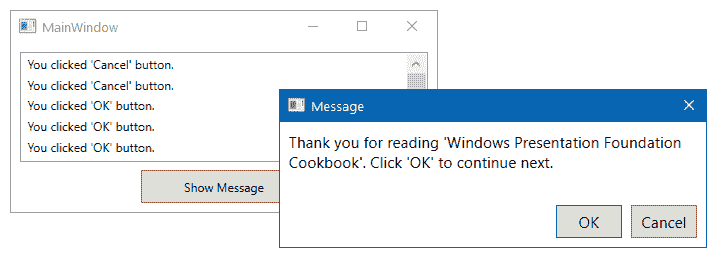

1.  点击取消按钮，这将把“你点击了'取消'按钮”文本添加到 MainWindow 中的列表中。

1.  再次启动消息窗口并点击确定按钮。这将把“你点击了'确定'按钮”添加到列表中。

## 工作原理...

当你调用 `Window` 实例的 `ShowDialog()` 方法时，它将以模式对话框的形式打开，并等待用户提供输入。在这种情况下，用户输入是与确定和取消按钮的交互。当你点击确定按钮时，相关的事件处理器将 `true` 赋值给 `DialogResult` 属性并返回给调用者。同样，取消按钮的事件处理器将 `false` 赋值给 `DialogResult` 属性并返回。

根据返回的 `ShowDialog()` 方法值，实际上返回的是 `DialogResult` 的值，你可以决定用户是否点击了确定或取消按钮。

通过将以下属性设置为 `Window` 实例，已自定义对话框窗口：

+   `ShowInTaskbar` 属性已被设置为 `False` 以防止窗口在任务栏中可见。

+   `WindowStyle` 属性已被设置为 `SingleBorderWindow` 以向窗口添加细边框，从标题栏中移除最小化和最大化按钮。

+   `Topmost` 属性已被设置为 `True` 以保持它始终位于其他窗口之上。这是可选的，但很好。

+   `ResizeMode` 属性已被设置为 `NoResize` 以防止用户调整对话框窗口的大小。

## 更多内容...

操作系统提供了一些可重用的对话框，这些对话框提供了与应用程序运行的操作系统的版本一致的用户体验。这种体验在所有应用程序中保持一致，以提供执行常见操作（如打开文件、保存文件、打印文件、颜色选择等）的独特界面。

WPF 提供这些可重用的常见对话框作为托管包装类，封装了核心实现。这减少了创建和管理常见操作所需的额外努力。

### 使用打开文件对话框

要在您的 WPF 应用程序中打开文件，您可以使用位于`Microsoft.Win32`命名空间下的托管包装类`OpenFileDialog`。您只需创建实例并通过可选设置一些属性进行 UI 自定义来调用`ShowDialog()`方法。

一个基本的打开文件对话框看起来如下截图所示，为您提供选择一个或多个文件打开的选项：


以下代码片段演示了如何通过可选填充文件扩展名过滤器来启动打开文件对话框：

```cs
private void OnOpenButtonClicked(object sender, RoutedEventArgs e) 
{ 
    var openfileDialog = new OpenFileDialog 
    { 
        Filter = "Text documents (.txt) | *.txt | Log files (.log) | 
        *.log" 
    }; 

    var dialogResult = openfileDialog.ShowDialog(); 
    if (dialogResult == true) 
    { 
        var fileName = openfileDialog.FileName; 
    } 
} 
```

`ShowDialog()`方法返回的`dialogResult`告诉我们操作是否成功执行。基于此，您可以调用文件对话框的实例以获取有关所选文件的更多详细信息。

### 使用保存文件对话框

除了`OpenFileDialog`接口外，`Microsoft.Win32`命名空间还提供了`SaveFileDialog`托管包装类，以从您的 WPF 应用程序执行文件保存操作。与打开文件对话框类似，您需要创建其实例，并通过可选填充其各种属性来最终调用`ShowDialog()`方法。

保存文件对话框看起来如下截图所示，您可以为要保存的文件提供名称：

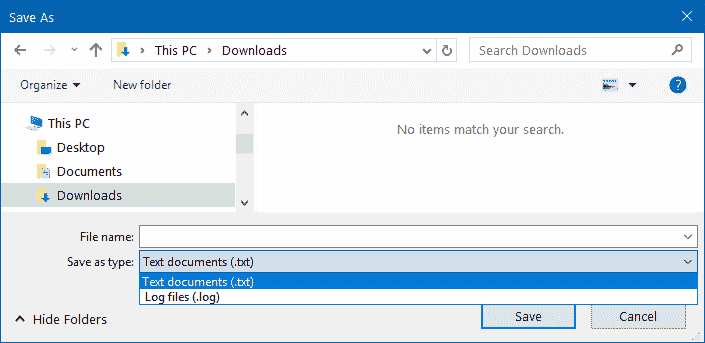

可选地，您可以在启动对话框窗口之前设置扩展名过滤器、默认文件名和其他属性，如下面的代码片段所示：

```cs
private void OnSaveButtonClicked(object sender, RoutedEventArgs e) 
{ 
    var saveFileDialog = new SaveFileDialog 
    { 
        Filter = "Text documents (.txt) | *.txt | Log files (.log) |
         *.log" 
    }; 

    var dialogResult = saveFileDialog.ShowDialog(); 
    if (dialogResult == true) 
    { 
        var fileName = saveFileDialog.FileName; 
    } 
} 
```

根据`ShowDialog()`调用返回的`dialogResult`，您可以决定保存操作是否成功，并从文件对话框实例中检索有关保存文件的更多信息。

### 使用打印对话框

托管包装`PrintDialog`也存在于`Microsoft.Win32`命名空间中，并为您提供调用操作系统的打印机属性和执行`打印`操作的接口。对话框为您提供选择打印机、配置打印首选项以及选择页面范围和其他参数的选项，如下面的截图所示：

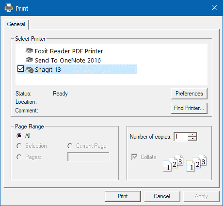

要调用相同的操作，只需创建`PrintDialog`的实例并调用其`ShowDialog()`方法。您可以可选地设置页面范围、可打印区域和其他属性。如果`ShowDialog()`方法返回的`dialogResult`设置为`true`，则确认打印作业已成功排队，基于此您可以执行下一组操作。

这里是供您参考的代码片段：

```cs
private void OnPrintButtonClicked(object sender, RoutedEventArgs e) 
{ 
    var printDialog = new PrintDialog(); 
    var dialogResult = printDialog.ShowDialog(); 

    if (dialogResult == true) 
    { 
        // perform the print operation 
    } 
} 
```

### 其他常见对话框

WPF 还提供了一些其他常见的对话框，用于执行各种格式选项的选择，如字体、字体样式、字体大小、文本效果和颜色。你可以使用位于`System.Windows.Forms`命名空间下的`FontDialog`和`ColorDialog`，分别添加对字体和颜色选择的支持。

这里是展示字体选择器和颜色选择器对话框的截图：

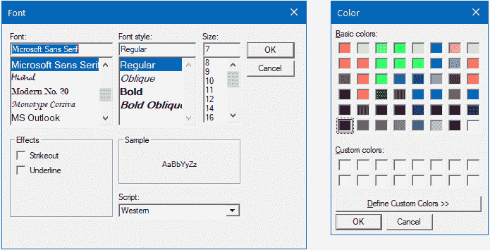

# 创建窗口之间的所有权

在 WPF 应用程序中，你创建的窗口对象默认情况下是相互独立的。但是，有时你可能想要在它们之间创建所有者-所有者关系。例如，你通常在 Visual Studio IDE 和/或 Photoshop 应用程序中看到的工具箱窗口。

当你设置一个窗口的所有者时，它将根据所有者实例的行为。例如，如果你最小化或关闭所有者窗口，属于所有者关系的其他窗口将自动根据其所有者进行最小化或关闭。

让我们开始创建这个菜谱，以便在两个窗口之间建立所有者-所有者关系。

## 准备工作

要开始这个菜谱，打开你的 Visual Studio IDE 并创建一个新的名为`CH01.OwnershipDemo`的 WPF 项目。

## 如何操作...

执行以下步骤以创建一个`ToolBox`窗口并将其所有者属性分配给`MainWindow`，以便它可以根据其所有者进行操作：

1.  右键单击项目节点，从上下文菜单中选择“添加 | 窗口...”。将在屏幕上显示“添加新项”对话框。

1.  从可用列表中选择“窗口（WPF）”，将其命名为`ToolBox`，然后单击“添加”继续。这将把`ToolBox.xaml`和`ToolBox.xaml.cs`添加到你的项目中。

1.  打开`ToolBox.xaml`文件，并用以下 XAML 代码替换其内容：

```cs
<Window x:Class="CH01.OwnershipDemo.ToolBox" 
  xmlns=
   "http://schemas.microsoft.com/winfx/2006/xaml/presentation" 

    SizeToContent="WidthAndHeight"  
    ResizeMode="NoResize" 
    Title="ToolBox"> 
    <StackPanel Margin="10"> 
        <Button Content="Bold" Width="70" Margin="4"/> 
        <Button Content="Italics" Width="70" Margin="4"/> 
        <Button Content="Underlined" Width="70"  
                Margin="4"/> 
    </StackPanel> 
</Window> 
```

1.  现在打开`App.xaml`页面，并从其中移除属性属性`StartupUri`，定义为（`StartupUri="MainWindow.xaml"`）。

1.  前往其代码后文件`App.xaml.cs`并重写`OnStartup`事件。我们需要根据我们的需求修改实现。用以下代码块替换整个`OnStartup`事件处理器：

```cs
protected override void OnStartup(StartupEventArgs e) 
{ 
    base.OnStartup(e); 

    var mainWindow = new MainWindow(); 
    mainWindow.Show(); // must show before setting it
    as owner of some other window 

    var toolBox = new ToolBox { Owner = mainWindow }; 
    toolBox.Show(); 
} 
```

1.  运行应用程序以查看两个窗口之间的关系。窗口将看起来像以下截图所示：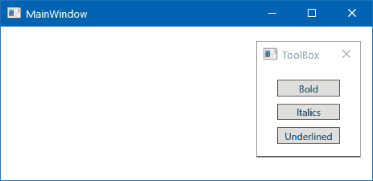

1.  拖动工具箱窗口，你可以看到你能够将其移动到 MainWindow 之外。现在对 MainWindow 执行一些操作，例如最小化和关闭，你将看到工具箱窗口也会根据其所有者进行操作。

## 它是如何工作的...

默认情况下，每个`窗口`对象的所有者设置为 null，因此每个窗口都是相互独立的。但是，当你设置其所有者时，它将遵循所有者-所有者关系并与所有者窗口一起操作。

`窗口`所有权不是 WPF 的功能，而是 Win32 用户 API 的能力，并且可以从 WPF 应用程序中访问。

## 还有更多...

确保在将其设置为其他窗口的所有者之前，首先显示所有者窗口，否则系统将抛出`InvalidOperationException`：

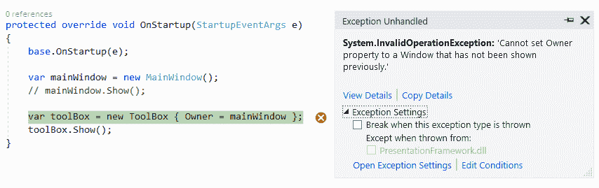

关于窗口所有权的注意事项：

+   与其他窗口有所有权关系的窗口始终出现在所有者窗口之上。

+   你可以将窗口拖到所有者窗口之外。

+   当你最小化或关闭所有者时，与之相关的其他窗口将分别跟随所有者最小化或关闭。

+   默认情况下，相关联的窗口会显示在任务栏中，但当你最小化所有者时，它会被从任务栏中移除。

+   当你想断开关系时，只需将`Owner`属性设置为`null`。

# 创建单实例应用程序

当你为 Windows 构建应用程序时，有许多原因会让你想要限制用户启动你的应用程序的多个实例。一些常见的例子是安装程序、卸载程序、更新工具、媒体应用程序、实用工具等。

在一个普通的应用程序中，当你启动应用程序时，它会创建一个 Windows 进程，并为其分配自己的内存空间和资源。但是，当你不希望为已经运行的单个应用程序创建多个进程实例时，你希望静默退出新实例并将运行中的进程带到前台。

在本食谱中，我们将学习如何使用**Mutex**（**互斥**）和非托管代码来实现这一点。

## 准备工作

要开始，请打开您的 Visual Studio 实例，并基于 WPF 应用程序模板创建一个新项目。在项目创建过程中，将其命名为`CH01.SingleInstanceDemo`。

## 如何做到这一点...

一旦创建了 WPF 项目，请按照以下步骤创建 WPF 应用程序的单实例：

1.  通过按*CTRL* + *F5*键组合运行应用程序。这将启动应用程序的一个实例。

1.  按多次*CTRL* + *F5*以启动多个应用程序实例。现在，是时候将应用程序变成单实例应用程序了！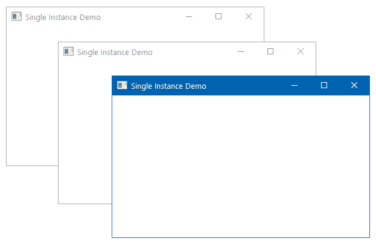

1.  关闭所有正在运行的过程，然后按照以下步骤实现单实例行为。

1.  打开`MainWindow.xaml`并添加窗口标题到`Single Instance Demo`。在这里你可以找到整个 XAML 代码：

```cs
<Window x:Class="CH01.SingleInstanceDemo.MainWindow" 
  xmlns=
    "http://schemas.microsoft.com/winfx/2006/xaml/presentation" 

     Title="Single Instance Demo"  
     Height="250" Width="400"> 
    <Grid> 

    </Grid> 
</Window>
```

1.  打开`App.xaml.cs`文件并重写`OnStartup`方法的基本实现。

1.  修改`OnStartup`方法的代码，使其看起来像以下代码：

```cs
protected override void OnStartup(StartupEventArgs e) 
{ 
  base.OnStartup(e); 

  var mutex = new Mutex(true, "SingleInstanceDemo",  
  out bool isNewInstance); 
  if (!isNewInstance) 
  { 
    MessageBox.Show("Application instance is  
     already running!"); 
    Shutdown(); 
  } 
} 
```

1.  添加`System.Threading`命名空间声明，以便 Mutex 可以被发现。Mutex 位于上述命名空间中。

1.  现在编译项目以确保没有编译错误。

1.  按*CTRL* + *F5*，这将运行应用程序的第一个实例。

1.  现在返回 Visual Studio，不关闭应用程序，然后按*CTRL* + *F5*。这次，不是启动应用程序 UI，屏幕上会弹出“一个应用程序实例已经在运行！”的消息。点击 OK 将关闭消息。

1.  再次按*CTRL* + *F5*。观察屏幕上没有第二个 UI 实例可见。

## 它是如何工作的...

这是一个处理应用程序以使其只有一个实例的技巧。**互斥锁（Mutex）**（**互斥**）对象用于定义具有唯一名称的实例。在这里我们称之为`SingleInstanceDemo`。布尔`out`参数返回当前调用线程是否被授予`mutex`对象的初始所有权。

**互斥锁（Mutex）**对象是一个同步对象，通常用于同步对共享资源的访问，以确保只有一个线程可以在某个时间点访问该资源。

对于应用程序的第一个实例，它将被授予初始所有权。当第二个实例运行时，调用线程将不会获得初始所有权，因为具有相同名称的`mutex`对象`SingleInstanceDemo`已经存在并且正在运行。

因此，`isNewInstance`的布尔值将是`false`，消息框将显示在屏幕上。此时应用程序的第二个实例仍在运行，当您点击 OK 按钮关闭消息框时，它将调用`Shutdown()`方法。

因此，第二个实例将从进程列表中移除。第一个实例将继续在系统上运行。

## 还有更多...

可能存在一种情况，应用程序在后台进程中运行，而用户尝试重新启动应用程序。在这种情况下，您可能希望激活已运行的程序并显示其 UI，而不是向用户显示消息。

您可以通过稍微修改现有代码并集成未管理代码调用来做到这一点。为此，再次打开`App.xaml.cs`文件，并按照以下步骤操作：

1.  在文件中添加以下`using namespace`：`System.Runtime.InteropServices`。

1.  然后，您需要将以下未管理代码声明从`user32.dll`添加到`App.xaml.cs`文件中：

```cs
[DllImport("user32", CharSet = CharSet.Unicode)] 
static extern IntPtr FindWindow(string cls, string win); 

[DllImport("user32")] 
static extern IntPtr SetForegroundWindow(IntPtr hWnd);
```

1.  添加以下方法以激活已运行的窗口，前提是窗口标题是静态的。在我们的例子中，它是 Single Instance Demo，在`MainWindow.xaml`页面中进行了修改：

```cs
private static void ActivateWindow() 
{ 
    var otherWindow = FindWindow(null, "Single Instance Demo"); 
    if (otherWindow != IntPtr.Zero) 
    { 
        SetForegroundWindow(otherWindow); 
    } 
} 
```

1.  现在，您不需要调用`MessageBox`，而是在`OnStartup`中调用`ActivateWindow()`方法。在这里，您可以找到以下新代码：

```cs
protected override void OnStartup(StartupEventArgs e) 
{ 
    base.OnStartup(e); 

    var mutex = new Mutex(true,  
     "SingleInstanceDemo",  
     out bool isNewInstance); 
    if (!isNewInstance) 
    { 
        // MessageBox.Show("Application instance is  
           already running!"); 
        ActivateWindow(); 
        Shutdown(); 
    } 
} 
```

1.  现在运行应用程序。它将在屏幕上启动标题为 Single Instance Demo 的`MainWindow`。

1.  返回 Visual Studio。这将使应用程序窗口进入后台。现在通过按键盘快捷键*CTRL* + *F5*再次运行应用程序。这次，它不会运行不同的实例来显示 UI，而是激活现有窗口并将运行的应用程序推向前台。

应用程序窗口不一定要始终具有静态标题。在这种情况下，处理该场景将变得更加复杂。

# 向 WPF 应用程序传递参数

命令行参数用于在启动应用程序时从用户那里获取可选参数或值。这些通常用于从外部执行特定命令。

在本教程中，我们将学习如何向 WPF 应用程序传递命令行参数。

## 准备工作

要开始，打开 Visual Studio IDE 并创建一个名为 `CH01.CommandLineArgumentDemo` 的 WPF 应用程序项目。

## 如何操作...

现在按照以下步骤让应用程序支持命令行参数并根据这些参数执行操作：

1.  打开 `MainWindow.xaml` 并将 `TextBlock` 添加到 `Grid` 面板中。将整个 XAML 内容替换为以下行：

```cs
<Window x:Class="CH01.CommandLineArgumentDemo.MainWindow" 
  xmlns=
   "http://schemas.microsoft.com/winfx/2006/xaml/presentation" 

    Title="Main Window" Height="200" Width="400"> 
    <Grid> 
        <TextBlock Text="This is 'Main Window'
          of the application." 
            HorizontalAlignment="Center"  
            VerticalAlignment="Center" 
            FontSize="18" /> 
    </Grid> 
</Window> 
```

1.  通过在项目节点上右键单击并遵循上下文菜单路径添加 | 窗口...来在项目中创建一个新窗口。将其命名为 `OtherWindow` 并单击添加按钮。这将 `OtherWindow.xaml` 和 `OtherWindow.xaml.cs` 添加到项目中。

1.  现在打开 `OtherWindow.xaml` 并更改其 UI 以显示不同的文本。让我们将整个 XAML 代码替换为以下行：

```cs
<Window x:Class="CH01.CommandLineArgumentDemo.OtherWindow" 
xmlns=
  "http://schemas.microsoft.com/winfx/2006/xaml/presentation" 

   Title="Other Window" Height="200" Width="400"> 
    <Grid> 
        <TextBlock Text="This is 'Other Window' of the  
          application." 
            HorizontalAlignment="Center"  
            VerticalAlignment="Center" 
            FontSize="18" /> 
    </Grid> 
</Window> 
```

1.  现在打开 `App.xaml` 并移除 `StartupUri="MainWindow.xaml"`。这样做是为了根据传递给应用程序的参数来控制正确窗口的启动。

1.  打开 `App.xaml.cs` 并重写其 `OnStartup` 方法以检索传递给它的参数并根据这些参数打开所需的窗口。让我们为 `OnStartup` 方法添加以下代码实现：

```cs
protected override void OnStartup(StartupEventArgs e) 
{ 
    base.OnStartup(e); 

    var args = e.Args; 
    if (args.Contains("/other"))  
    {  
        new OtherWindow().Show();  
    } 
    else  
    {  
        new MainWindow().Show();  
    } 
} 
```

1.  现在构建项目。导航到 `bin\Debug` 文件夹并在该位置启动一个命令窗口。或者，您可以在 `bin\Debug` 路径启动一个 **命令窗口**（**cmd.exe**）并导航到您的应用程序所在路径。

1.  在控制台窗口中，不传递任何参数输入应用程序名称，如下所示：

```cs
 CH01.CommandLineArgumentDemo.exe
```

1.  这将启动我们的应用程序的 `MainWindow`，如下所示：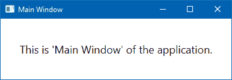

1.  关闭应用程序窗口，并在控制台窗口中输入应用程序名称，指定 `/other` 参数，如下所示：

```cs
      CH01.CommandLineArgumentDemo.exe /other
```

1.  这将启动应用程序的 `OtherWindow` 而不是 `MainWindow`：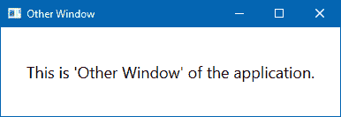

## 工作原理...

`OnStartup(StartupEventArgs e)` 方法签名包含 `StartupEventArgs` 作为方法参数。它包含一个属性 `Args`，该属性返回一个字符串数组，表示传递给应用程序的命令行参数。如果没有传递命令行参数，则字符串数组中将没有项。

现在，通过检查条件，我们启动用户想要显示的窗口。您还可以传递参数，使应用程序以正常模式、最大化模式或最小化模式启动。在某些特定情况下，您还可以使用它以隐藏方式打开应用程序。

## 还有更多...

如我们所见，通过传递参数从命令行启动 WPF 应用程序，现在让我们学习如何从 Visual Studio 本身启动它以调试模式运行。

要在调试模式下从 Visual Studio 将命令行参数传递给您的 WPF 应用程序，请右键单击项目节点，并从上下文菜单中单击“属性”。这将打开项目属性。现在导航到“调试”选项卡。请参考以下截图：

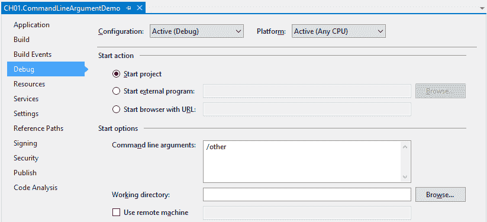

在“启动选项”下，输入 `/other` 作为命令行参数。现在按 *F5* 键以调试模式运行应用程序。你会看到屏幕上打开了 `OtherWindow`。要启动 `MainWindow`，只需从前面提到的项目属性中移除 `/other` 参数，再次运行应用程序。这次你会看到打开的是 `MainWindow` 而不是 `OtherWindow`。

# 处理未处理的异常

异常处理是软件开发的重要组成部分。当运行时发生异常，由于代码中的任何错误，我们使用 `try {} catch {}` 块来处理这些异常。`try {}` 块包含发生异常的代码；`catch {}` 块知道如何根据异常类型来处理它。在异常被处理后，程序的正常执行继续，不会影响应用程序。

尽管在大多数情况下我们都会处理，但仍可能存在一些可能被忽视并在运行时出现的异常。这种未处理的异常会导致应用程序崩溃。在本教程中，我们将学习如何在 WPF 应用程序中捕获未处理的异常并正确关闭应用程序。

## 准备工作

要开始，请打开 Visual Studio IDE。现在创建一个新的项目，基于 WPF 应用程序模板，并将其命名为 `CH01.UnhandledExceptionDemo`。

## 如何操作...

让我们按照以下步骤开始演示：

1.  打开 `MainWindow.xaml` 页面，并在其上添加两个单选按钮和一个按钮。第一个单选按钮将在 `try {} catch {}` 块中处理异常，而第二个单选按钮将抛出一个未处理的异常。将以下代码添加到您的 `MainWindow.xaml` 中：

```cs
<Window x:Class="CH01.UnhandledExceptionDemo.MainWindow" 
  xmlns=
    "http://schemas.microsoft.com/winfx/2006/xaml/presentation" 

     Title="UnhandledException Demo"  
     Height="120" Width="400"> 
    <Grid Margin="10"> 
        <StackPanel Orientation="Vertical"> 
            <RadioButton x:Name="radioOne" GroupName="type" 
                  Content="Handle in Try/Catch Block"  
                  IsChecked="True" Margin="4"/> 
            <RadioButton x:Name="radioTwo" GroupName="type" 
                  Content="Handle in Unhandled Block"  
                  IsChecked="False" Margin="4"/> 
        </StackPanel> 
        <Button Content="Throw Exception"  
                Width="120" Height="30" 
                VerticalAlignment="Top"  
                HorizontalAlignment="Right" 
                Margin="10"  
                Click="OnThrowExceptionClicked"/> 
    </Grid> 
</Window> 
```

1.  打开 `MainWindow.xaml.cs` 文件，添加按钮点击事件处理程序。在类内部添加以下代码块：

```cs
private void OnThrowExceptionClicked(object sender, RoutedEventArgs e) 
{ 
    if (radioOne.IsChecked == true) 
    { 
        try { throw new Exception("Demo Exception"); } 
        catch (Exception ex) 
        { 
            MessageBox.Show("'" + ex.Message +  
                  "' handled in Try/Catch block"); 
        } 
    } 
    else 
    { 
        throw new Exception("Demo Exception"); 
    } 
} 
```

1.  打开 `App.xaml.cs` 文件，并重写 `OnStartup` 方法，以便将应用程序级别的 `DispatcherUnhandledException` 事件注册，如下面的代码所示：

```cs
protected override void OnStartup(StartupEventArgs e) 
{ 
    base.OnStartup(e); 

    DispatcherUnhandledException += OnUnhandledException; 
}
```

1.  将 `DispatcherUnhandledException` 事件处理程序添加到 `App.xaml.cs` 中，并按以下代码处理异常，但使用一个空的代码块：

```cs
private void OnUnhandledException(object sender, DispatcherUnhandledExceptionEventArgs e) 
{ 

} 
```

1.  让我们构建并运行应用程序。你将在屏幕上看到以下 UI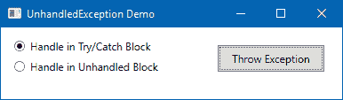

1.  应用程序窗口中将有两个单选选择器和一个按钮。当第一个单选按钮被选中并且你点击“抛出异常”按钮时，它将在`try {}`块中生成一个异常，然后立即被相关的`catch {}`块处理，而不会导致应用程序崩溃。以下消息框将在 UI 上显示：


1.  对于第二个单选按钮，当被选中时，如果你点击“抛出异常”按钮，异常将不会被处理，并在`App.xaml.cs`文件中的`OnUnhandledException`事件中被捕获，应用程序将崩溃：

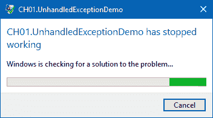

1.  再次打开`App.xaml.cs`并修改`OnUnhandledException`事件实现，如下所示，以处理抛出的异常：

```cs
private void OnUnhandledException(object sender, DispatcherUnhandledExceptionEventArgs e) 
{ 
    e.Handled = true; 
} 
```

1.  现在再次运行应用程序，选中第二个单选按钮并点击按钮。你会注意到这次应用程序不会崩溃。

1.  多次点击“抛出异常”按钮。应用程序将继续按原样运行，而不会导致 UI 崩溃。

## 它是如何工作的...

当你通过指定`e.Handled = true`来处理这种未捕获/未处理的异常时，你的应用程序将不会崩溃并继续运行。捕获未处理异常的最好部分是记录未知/未处理的错误，这样你就可以调查这些异常背后的根本原因，并在未来的构建中修复它们。

当出现关键错误时，你可以从这个块中以编程方式重新启动应用程序。

## 还有更多...

你还可以使用`AppDomain.CurrentDomain.UnhandledException`事件处理程序来捕获任何未处理的异常，但你将无法以继续运行应用程序的方式处理它。当使用时，你可以记录错误并终止/重新启动应用程序。

在`DispatcherUnhandledException`事件中通过指定`e.Handled = true`处理的未处理异常不会路由到`AppDomain.CurrentDomain.UnhandledException`。
