使用 WPF 标准控件

在本章中，我们将介绍以下菜谱：

+   使用 `TextBlock` 控件添加纯文本

+   使用 `Label` 在文本中添加其他控件

+   提供用户输入文本的选项

+   在应用程序 UI 中添加图像

+   与现成的 2D 形状一起工作

+   添加工具提示以显示附加信息

+   向 WPF 应用程序添加标准菜单

+   使用上下文菜单提供额外功能

+   使用单选按钮和复选框添加用户选项

+   与进度条控件一起工作

+   使用 `Slider` 控件选择数值

+   在您的应用程序中使用日历控件

+   在 `ListBox` 控件中列出项目

+   提供从 ComboBox 中选择选项

+   向窗口添加状态栏

+   向窗口添加工具栏面板以执行快速任务

# 简介

每个 UI 框架都必须提供标准控件来设计应用程序 UI，**Windows Presentation Foundation**（**WPF**）就是其中之一。WPF 提供了一套标准控件和 UI 元素，例如 `TextBlock`、`TextBox`、`Button`、`Image`、各种形状、`ProgressBar`、`Slider`、各种菜单、`Toolbar`、`ListBox`、`ComboBox`、`DataGrid` 以及更多。

如以下图所示，UI 控件可以分为两种类型——**ItemsControl** 和 **ContentControl**，它们继承自 `Control` 类。WPF 中所有可用的面板都共享相同的基类 `Panel`。`Control` 和 `Panel` 类都有基 **FrameworkElement**，它再次继承自 **UIElement**。它以 **DependencyObject** 为基类，以 **Object** 为超基类：

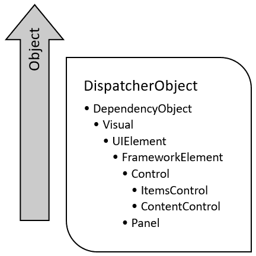

每个控件都有一组常见的属性可供使用。这包括 `FontFamily`、`FontSize`、`FontStyle`、`Foreground`、`Background`、`BorderBrush`、`BorderThickness` 以及更多。每个框架元素都公开了额外的属性，例如 `Width`、`MaxWidth`、`MinWidth`、`ToolTip`、`Height`、`Name`、`Language`、`Margin` 以及更多。当在 UI 中使用任何元素时，您将使用这些常见属性来设置 UIElement 的样式和其他参数。

# 使用 `TextBlock` 控件添加纯文本

WPF 中的 `TextBlock` 控件是一个轻量级 UI 元素，用于在屏幕上显示文本内容。几乎在应用程序 UI 的任何地方，你都会使用这个元素来显示单行或多行格式的纯文本。要添加简单的纯文本，你可以在 XAML 页面中写入 `<TextBlock Text="Text message" />` 或 `<TextBlock>Text message</TextBlock>`。

在这个菜谱中，我们将更深入地探索这个 UI 元素。

## 准备工作

要开始，打开您的 Visual Studio IDE，并创建一个名为 `CH02.TextBlockDemo` 的新 WPF 项目。

## 如何做到...

现在打开 `MainWindow.xaml`，按照以下步骤添加具有各种格式化选项的 `TextBlock` 控件：

1.  首先，将现有的 `Grid` 面板更改为 `StackPanel`。

1.  现在向其中添加以下两个 `TextBlock` 控件，它们将包含纯文本：

```cs
<TextBlock Text="1\. This is a TextBlock control, with 'Text'   
   property" Margin="10 5" /> 
<TextBlock Margin="10 5"> 
   2\. This is a TextBlock control, having text as Content 
</TextBlock> 
```

1.  添加以下 XAML 以添加更多 `TextBlock` 控件，并对其应用一些基本的文本格式化：

```cs
<TextBlock Text="3\. This is a TextBlock control, having text    
           formatting" 
           FontWeight="Bold"  
           FontStyle="Italic"  
           TextDecorations="Underline" 
           Foreground="Red" 
           Margin="10 5" /> 
<TextBlock Text="4\. TextBlock with different FontFamily" 
           FontFamily="Lucida Handwriting" 
           FontSize="16" Foreground="Blue" 
           Margin="10 5" /> 
<TextBlock Text="5\. This is a TextBlock control, 
           having long text
           content, wrapped automatically using 
           'TextWrapping' property." 
           TextWrapping="Wrap" 
           Margin="10 5" /> 
<TextBlock Text="6\. This is a TextBlock control, 
           having long text content, trimmed 
           automatically using  
           'TextTrimming' property." 
           TextTrimming="CharacterEllipsis" 
           Margin="10 5" /> 
```

1.  让我们构建项目并运行它。你将在屏幕上看到以下 UI：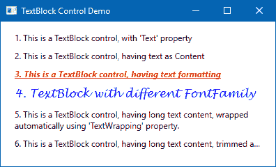

## 它是如何工作的...

对于前两个 `TextBlock` 控件，UI 上将显示纯文本。第三个 `TextBlock` 控件将应用 **Bold**、**Italic** 和 **Underline**，通过指定控件的 `FontWeight`、`FontStyle` 和 `TextDecoration` 属性来实现。此外，它的前景色已被设置为 *红色*，通过指定 `Foreground` 属性。

你还可以为 `TextBlock` 控件设置不同的字体。使用 `FontFamily` 属性来设置。正如你所见，第四个 `TextBlock` 控件应用了 **Lucida Handwriting** 字体。

当你有一个长文本，它不能在单行中查看时，你可以根据可用空间将其换行或截断。`TextWrapping="Wrap"` 在第五个 `TextBlock` 中将其换行。尝试调整窗口的大小，你会看到 `TextBlock` 会自动调整以匹配可用空间，而第六个 `TextBlock` 控件的文本则通过将 `TextTrimming` 属性设置为字符省略号（末尾的三个点）进行截断。这意味着还有更多文本可用，但它已经被 `裁剪`。

作为 `CharacterEllipsis` 的替代，你可以使用 `WordEllipsis`，它将在最后一个可能的单词的末尾截断文本，而不是最后一个可能的字符。

## 还有更多...

`TextBlock` 控件也支持内联格式化。就像 HTML 标签一样，你可以用 `Bold`、`Italic` 和 `Underline` 标签包围文本内容来格式化它，如下面的 XAML 代码所示：

```cs
<TextBlock Margin="10, 5"> 
    7\. TextBlock with <Bold>Bold</Bold>, <Italic>Italics</Italic>, <Underline>Underlined</Underline> text 
</TextBlock> 
```

你也可以在文本内容中添加换行符，如下所示：

```cs
<TextBlock Margin="10, 5"> 
    8\. TextBlock with LineBreak<LineBreak/> in between the text 
</TextBlock> 
```

下面的 XAML 代码演示了如何向 `TextBlock` 控件添加一个匹配 Windows 主题风格的超链接元素：

```cs
<TextBlock Margin="10, 5"> 
    9\. TextBlock with a <Hyperlink NavigateUri="http://www.kunal-chowdhury.com">Hyperlink</Hyperlink> text in it 
</TextBlock> 
```

`NavigateUri` 属性用于定义你希望导航到的 URL。

你可以使用 `Span` 元素来设置单个文本内容的样式，包括字体样式、大小、前景色等。它还允许你在其中指定其他内联元素。`Run` 元素允许你使用 `Span` 元素的全部可用属性来设置文本内容样式。以下示例演示了在 `TextBlock` 控件中使用 `Span` 和 `Run` 元素是多么简单：

```cs
<TextBlock Margin="10, 5" 
    TextWrapping="Wrap"> 
    10\. This is a <Span><Bold>TextBlock</Bold></Span> control, with <Span Foreground="Brown">Span</Span> Elements and <Run TextDecorations="Underline">Run</Run> commands in it 
</TextBlock> 
```

`Span` 元素可以包含其他内联元素，但 `Run` 元素只能包含纯文本。

运行前面的示例将产生以下输出：

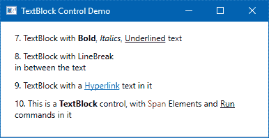

# 使用标签添加文本中的其他控件

`Label` 控件是 WPF 应用程序中表示文本的另一种方式。它看起来像 `TextBlock` 控件提供的外观，但它不仅可以支持文本，还可以托管任何类型的其他控件。它公开了 `Content` 属性以托管文本和其他控件。

在这个菜谱中，我们将探讨如何在 WPF 中使用 `Label` 控件。

## 准备工作

要开始使用此控件，打开 Visual Studio 以创建基于 WPF 项目模板的应用程序，并将其命名为 `CH02.LabelDemo`。

## 如何操作...

一旦项目创建完成，请按照以下简单步骤使用 `Label` 控件在应用程序 UI 中添加文本：

1.  打开 `MainWindow.xaml` 文件以更改应用程序 UI。

1.  将现有的 `Grid` 面板替换为以下 XAML 代码：

```cs
<StackPanel Margin="10 10 10 20"> 
    <Label Content="1\. This is a Label control" /> 
    <Label Content="2\. A Label control with text formatting" 
            FontWeight="Bold" Foreground="Red" 
            FontStyle="Italic"/> 
    <Label> 
        <StackPanel Orientation="Horizontal"> 
            <TextBlock Text="3\. A Rectangle" /> 
            <Rectangle Width="20" Height="20" Fill="Red" 
            Margin="10 0" /> 
            <TextBlock Text="inside a Label control" /> 
        </StackPanel> 
    </Label> 
</StackPanel> 
```

1.  现在构建并运行应用程序。你将在屏幕上看到以下输出：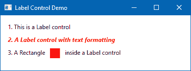

## 它是如何工作的...

在 `StackPanel` 中添加的第一个控件是一个非常基本的标签，其 `Content` 属性包含纯文本。第二个 `Label` 控件也包含纯文本，但对其应用了各种格式（例如，`FontWeight`、`Foreground` 和 `FontStyle`），使其样式看起来加粗、斜体和红色。

由于 `Label` 控件继承自 `System.Windows.Controls.ContentControl`，它也支持向其内容添加其他控件。添加到 UI 的第三个标签与前面的两个示例略有不同。它不仅包含文本，还包含其他控件，如 `StackPanel`、`TextBlock` 和一个 `Rectangle`，这要归功于它的 `Content` 属性。

在前面的示例中，对于第三个标签，使用 `TextBlock` 控件来保存实际的文本内容，而 `StackPanel` 被用作面板控件来保存 `TextBlock` 和 `Rectangle`。

需要记住的一个点是 `Label` 比一个 `TextBlock` 更重。所以，当你需要在 UI 上渲染纯文本时，最好只使用 `TextBlock`。

## 还有更多...

在 Windows 和其他操作系统中，通过按住 *Alt* 键然后按下一个定义为访问键的字符来访问窗口中的控件是一种普遍的做法。例如，要打开任何 Windows 应用程序的文件菜单，我们使用 *Alt* + *F*。在这里，字符 *F* 是访问键，当我们按下 *Alt* 时会被调用。

让我们学习如何在 WPF 应用程序中使用 `Label` 控件给标签添加访问键。创建一个名为 `CH02.LabelAccessKeyDemo` 的新项目，打开 `MainWindow.xaml` 页面，并将默认的 `Grid` 替换为 `StackPanel`。现在在 `StackPanel` 内添加两个标签和两个文本框，如下所示：

```cs
<StackPanel Margin="10 10 10 20"> 
    <Label Content="Enter _Username:" 
            Target="{Binding ElementName=txbUsername}" /> 
    <TextBox x:Name="txbUsername" Margin="6 0" /> 

    <Label Content="Enter _Password:" 
            Target="{Binding ElementName=txbPassword}" /> 
    <TextBox x:Name="txbPassword" Margin="6 0" /> 
</StackPanel> 
```

现在运行应用程序。按 *Alt* + *U* 激活第一个标签的访问键，并将焦点放在 `txbUsername` 字段上。按 *Alt* + *P* 自动将焦点放在 `txbPassword` 字段上：

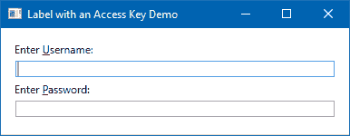

Windows 窗体应用程序使用"`&`"作为其访问键指定符，但在 WPF 应用程序中略有不同，因为它使用 XML 标记来创建 UI。因此，在 WPF 应用程序中，如果你想向标签添加访问键指定符，你需要在想要突出显示的字符前指定`_`（下划线）。

例如，在用户名中的`U`前添加`_`，当按下*Alt* + *U*时激活该标签。前一个示例中的密码字段也是类似的情况。

常用的做法是使用尚未用作其他控件访问键的第一个字符作为访问键。但在需要的情况下，你可以指定标签内容中的任何字符。

`Label`控件的`Target`属性将指令传递给指定的控件，当用户触发访问键时，该控件会自动激活。存在于绑定中的`ElementName`属性（`Target="{Binding ElementName=txbPassword}"`）告诉了你想发送激活指令的控件名称。

# 提供用户输入文本的选项

WPF 中的`TextBox`控件用于允许用户以单行或多行格式输入纯文本。单行文本框是常用的表单输入控件；而多行文本框则用作编辑器。

## 准备工作

打开你的 Visual Studio IDE，创建一个名为`CH02.TextBoxDemo`的新项目，基于 WPF 应用程序模板。

## 如何操作...

一旦项目创建完成，按照以下步骤操作来尝试一些`TextBox`属性：

1.  打开`MainWindow.xaml`页面，将默认的`Grid`替换为`StackPanel`，这样我们就可以以堆叠的方式添加控件。

1.  现在在`StackPanel`中添加五个`TextBox`控件，并设置以下各种属性：

```cs
<StackPanel Margin="10 10 10 20">
        <TextBox Height="30" Margin="10 5"
                 Text="Hello"/>
        <TextBox Text="Hello WPF!"
                 FontSize="18" Foreground="Blue"
                 FontWeight="Bold"
                 Height="30" Margin="10 5"/>
        <TextBox Text="This is a 'ReadOnly' TextBox control"
                 IsReadOnly="True" Height="30" Margin="10 5"/>
        <TextBox Text="This is a 'Disabled' TextBox control"
                 IsEnabled="False" Height="30" Margin="10 5"/>
        <TextBox TextWrapping="Wrap" AcceptsReturn="True"
                 Height="60" VerticalScrollBarVisibility="Auto"
                 Margin="10 5">
            This is multiline textbox.
            User can press 'Enter' key to move to next line.
        </TextBox>
    </StackPanel>
```

1.  运行应用程序，使其在屏幕上显示以下 UI：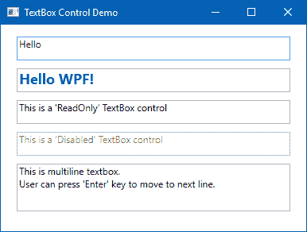

## 它是如何工作的...

我们添加到`StackPanel`中的第一个`TextBox`控件是最简单的一个，当它在 UI 中渲染时，它包含空文本。用户可以在此处输入任何纯文本。你也可以通过使用`Text`属性从代码中指定文本，如第二个控件所示。

你还可以为`TextBox`控件的文本定义一系列样式。如第二个控件所示，我们指定了`FontSize`、`Foreground`、`FontWeight`。你也可以指定其他属性，作为任何控件的一部分。

第三个是一个`ReadOnly`文本框，你可以通过将`IsReadOnly`属性值设置为`True`来定义它。当你想要禁用`TextBox`时，将其`IsEnabled`属性设置为`False`，如第四个示例所示。

第五个示例演示了定义多行文本框有多简单。只需将其`AcceptsReturn`属性设置为`True`和`TextWrapping`设置为`Wrap`，控件就会像多行文本编辑器一样运行。

## 还有更多...

当你使用`TextBox`作为多行文本输入控件时，别忘了设置其`VerticalScrollBarVisibility`。这将允许用户滚动文本内容。正如最后一个示例所示，将其设置为`Auto`以根据其内容按需启用。

### Windows 剪贴板支持

`TextBox`控件自动支持**Windows 剪贴板**。右键单击它，可以在屏幕上弹出带有常见剪贴板功能的上下文菜单，例如全选、剪切、复制和粘贴。除了这些功能外，它还默认支持剪贴板操作的常见键盘快捷键，如撤销/重做。

### 添加拼写检查支持

附加的`SpellCheck.IsEnabled`属性允许你向`TextBox`控件添加拼写检查支持。将其设置为`True`以启用它。让我们在 UI 中添加一个带有此功能的多行文本框：

```cs
<TextBox TextWrapping="Wrap" AcceptsReturn="True" 
         Height="60" VerticalScrollBarVisibility="Auto" 
         SpellCheck.IsEnabled="True" 
         Margin="10 5" /> 
```

现在运行应用程序，你将在 UI 中看到一个带有多行文本输入字段的窗口。输入一些带有拼写错误的文本。你会看到拼写错误的单词被红色下划线突出显示。右键单击它，可以看到一个上下文菜单，其中建议来自词典的单词。

如以下截图所示，选择最适合此上下文的一个：

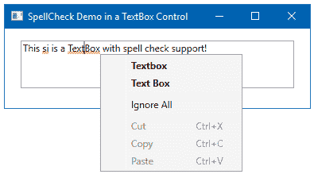

# 向应用程序 UI 添加图片

图片用于创建具有背景、图标和缩略图的 UI，并向用户传达更多信息。在 WPF 中，使用`Image`元素来显示图片。让我们看看这个。

## 准备工作

要开始使用 WPF 中的图片，启动你的 Visual Studio IDE，创建一个名为`CH02.ImageDemo`的 WPF 项目，并添加一个名为`demoImage.jpg`的图片。

## 如何做到这一点...

让我们按照以下步骤在`MainWindow.xaml`页面中添加图片：

1.  打开`MainWindow.xaml`页面，并将现有的`Grid`替换为`StackPanel`。将其`Orientation`属性设置为`Horizontal`，以便添加到该面板的项目水平堆叠。

1.  将四张图片添加到`StackPanel`中，并将它们的`Source`属性设置为`demoImage.jpg`，该图片位于项目目录中。

1.  将每张图片的宽度和高度设置为`100`。

1.  对于第一张图片，将其`Stretch`属性设置为`None`。

1.  对于第二张图片，将其`Stretch`属性设置为`Fill`。

1.  对于第三张和第四张图片，分别将它们的`Stretch`属性设置为`Uniform`和`UniformToFill`。

1.  这里是完整的 XAML 代码，你可以参考：

```cs
<StackPanel Orientation="Horizontal"> 
    <Image Source="demoImage.jpg" 
           Stretch="None" 
           Width="100" Height="100"  
           Margin="10 10 5 10" /> 
    <Image Source="demoImage.jpg" 
           Stretch="Fill" 
           Width="100" Height="100"  
           Margin="10 10 5 10" /> 
    <Image Source="demoImage.jpg" 
           Stretch="Uniform" 
           Width="100" Height="100"  
           Margin="10 10 5 10" /> 
    <Image Source="demoImage.jpg" 
           Stretch="UniformToFill" 
           Width="100" Height="100"  
           Margin="10 10 5 10" /> 
</StackPanel> 
```

1.  让我们构建并运行应用程序。你将在应用程序 UI 中看到以下输出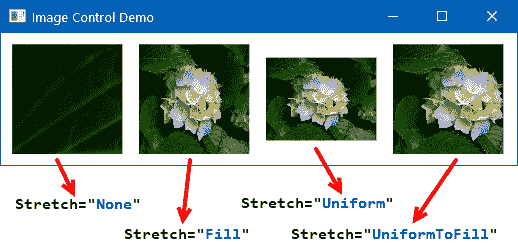

## 它是如何工作的...

在 XAML 中，`Image`控件的`Source`属性是你想要显示的图片文件的路径。当你从代码中访问它时，它是一个`BitmapImage`。

图像的`Stretch`属性描述了它应该如何拉伸以填充目标。对于第一个图像，我们将其设置为`Stretch="None"`，它保留了图像的原始大小。当您将其设置为`Fill`时，例如示例中的第二个图像，内容将调整大小以填充目标尺寸，而不保留其宽高比。

对于第三和第四个图像，分别将其设置为`Uniform`和`UniformToFill`，将内容调整大小以适应目标尺寸，同时保留其原始宽高比。但对于第四种情况，如果目标图像的宽高比与源图像不同，源内容将被裁剪以适应目标尺寸。

图像`Stretch`属性的默认值是`Uniform`。这意味着，当您将图像添加到 UI 中时，默认情况下，它会将内容调整大小以适应目标尺寸。

## 还有更多...

您还可以通过创建`BitmapImage`实例并将其分配给其`Source`属性来在 XAML 中设置图像。`BitmapImage`实例公开了`UriSource`属性来设置图像路径。以下是如何在 XAML 中使用`BitmapImage`元素设置图像源的示例：

```cs
<Image> 
    <Image.Source> 
        <BitmapImage UriSource="demoImage.jpg" /> 
    </Image.Source> 
</Image> 
```

您还可以通过设置`BitmapImage`的`Rotation`属性来旋转图像。它包含四个值：`Rotate0`、`Rotate90`、`Rotate180`和`Rotate270`。以下是一个如何将图像旋转 180 度的示例：

```cs
<Image> 
    <Image.Source> 
        <BitmapImage UriSource="demoImage.jpg" 
                     Rotation="Rotate180"/> 
    </Image.Source> 
</Image> 
```

此外，您还可以使用`Image`控件中的`StretchDirection`属性。该值表示图像如何缩放。有三个值：`UpOnly`、`DownOnly`和`Both`。内容根据图像内容的大小向上、向下或双向缩放。

# 使用现成的 2D 形状进行操作

在 WPF 中，`Shape`是一个`UIElement`，它允许您在应用程序中绘制 2D 形状。WPF 已经提供了一些现成的形状，如下所示：

+   矩形

+   椭圆

+   直线

+   多边形

+   多边形

+   路径

所有这些`UIElements`都公开了一些共同属性来绘制形状。`Stroke`和`StrokeThickness`属性描述了绘制形状轮廓的颜色和厚度。`Fill`属性描述了用于装饰形状内部的颜色。

在本教程中，我们将学习如何创建各种形状。

## 准备工作

让我们从创建一个新的项目开始。打开您的 Visual Studio，创建一个名为`CH02.ShapesDemo`的 WPF 项目。由于我们将创建多个形状，我们将使用`UniformGrid`面板来在本次演示中托管形状。您可以在下一章中了解更多关于此面板的信息。

## 如何操作...

按照以下步骤在您的应用程序中创建各种形状：

1.  打开您的`MainWindow.xaml`文件，并将现有的`Grid`面板替换为`UniformGrid`。通过设置其`Column`属性，将其最大列数设置为`3`。

1.  让我们添加第一个形状，一个`Rectangle`。在`UniformGrid`内添加以下 XAML 代码：

```cs
<Rectangle Width="200" Height="100" 
           Stroke="DarkBlue" StrokeThickness="5" 
           Fill="SkyBlue" Margin="10 5" /> 
```

1.  现在，让我们添加一个 `Ellipse`，你可以通过设置相同的值到其 `Height` 和 `Width` 属性来将其更改为一个圆。添加以下代码来创建椭圆：

```cs
<Ellipse Width="200" Height="100" 
         Stroke="DarkBlue" StrokeThickness="5" 
         Fill="SkyBlue" Margin="10 5" /> 
```

1.  在面板中添加 `Line`，请添加以下 XAML：

```cs
<Line X1="10" Y1="80" X2="190" Y2="20" 
      Stroke="DarkBlue" StrokeThickness="5" 
      Margin="10 5" /> 
```

1.  `Polyline` 是一系列连接的直线。添加以下 XAML 以轻松创建多段线形状，其中线条是根据 `Points` 属性中提供的点绘制的：

```cs
<Polyline Points="10,60 60,180 100,20 180,80 120,140" 
          Stroke="DarkBlue" StrokeThickness="5" 
          Margin="10 5" /> 
```

1.  同样，你可以在 UI 中添加 `Polygon` 形状。在 `UniformGrid` 内添加以下代码来绘制形状：

```cs
<Polygon Points="10,60 60,180 100,20 180,80 120,140" 
         Fill="SkyBlue" Stroke="DarkBlue"  
         StrokeThickness="5" Margin="10 5" />
```

1.  要添加 `Path` 形状控件，请添加以下 XAML 代码：

```cs
<Path Data="M10,60 60,180 C100,20 180,80 120,140" 
      Stroke="DarkBlue" StrokeThickness="5"  
      Margin="10 5" /> 
```

1.  现在，让我们构建你的项目并运行应用程序。你将在屏幕上看到以下形状，因为我们已经添加了前面的代码！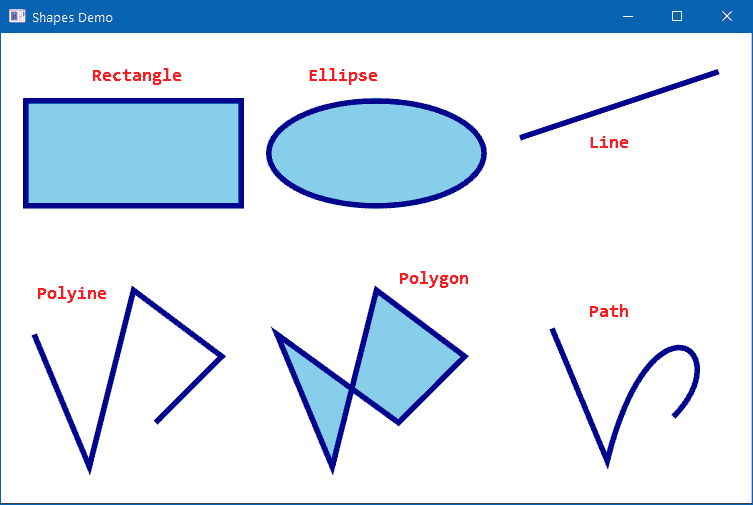

## 它是如何工作的...

通过设置 `Rectangle` 类的 `Height` 和 `Width` 属性以及其轮廓颜色和粗细来绘制矩形形状。要创建一个正方形，你可以通过设置其维度来使用此形状。

在第二个示例中，使用 `Ellipse` 控件绘制了一个圆形形状。它使用相同的属性集来创建形状。要使其成为一个完整的圆，请将其 `Height` 和 `Width` 设置为相同的值。

如果你想在 UI 中绘制一条直线，请使用 `Line` 类。它公开了四个属性来绘制线条。将 `X1` 和 `Y1` 属性设置为标记起点；将 `X2` 和 `Y2` 属性设置为标记线的终点。在上一个示例中，一条线从 (`10`,`80`) 坐标点绘制到 (`190`,`20`) 坐标点。

在第四个示例中，我们看到了如何使用 `Polyline` 形状控件创建一系列连接的直线。你需要设置线条的 (*X*, *Y*) 坐标点在其 `Points` 属性中。在上一个示例中，它创建了连接以下坐标点 (`10`,`60`), (`60`,`180`), (`100`,`20`), (`180`,`80`), 和 (`120`,`140`) 的形状。

`Polygon` 也使用相同的概念来绘制一系列线条，但它将连接的线条系列完成以绘制一个封闭形状。

使用 `Path` 控件，在第六个示例中，你可以绘制一系列连接的线条和曲线。`Data` 属性用于设置指定要绘制的形状的几何形状。数据点始终以 `M` 开头，以开始绘制线条。在任何部分，如果你想创建一个曲线，在该点前缀字符 `C`。

## 还有更多...

`PathGeometry` 对象用于绘制线条、曲线、弧和复杂形状。WPF 提供了两个类来使用迷你语言 **Path Markup Syntax** 描述几何路径。

你可以在这里了解更多信息：

[`bit.ly/path-markup-syntax`](http://bit.ly/path-markup-syntax)

如果你想要绘制简单的形状，你可以使用 `EllipseGeometry`、`LineGeometry` 和 `RectangleGeometry` 对象。复合几何形状是通过 `GeometryGroup` 创建的，要创建组合几何形状，请使用 `CombineGeometry`。

让我们通过以下示例来演示使用三个段落的 `PathSegmentCollection` 的复杂路径几何形状：

```cs
<Path Stroke="DarkBlue" StrokeThickness="5"> 
    <Path.Data> 
        <PathGeometry> 
            <PathGeometry.Figures> 
                <PathFigureCollection> 
                    <PathFigure StartPoint="10,100"> 
                        <PathFigure.Segments> 
                            <PathSegmentCollection> 
                                <ArcSegment Point="40,80" /> 
                                <BezierSegment Point1="100,300"  
                                               Point2="100,-100"  
                                               Point3="200,150" /> 
                                <BezierSegment Point1="100,200"  
                                               Point2="200,-10"  
                                               Point3="100,150" /> 
                            </PathSegmentCollection> 
                        </PathFigure.Segments> 
                    </PathFigure> 
                </PathFigureCollection> 
            </PathGeometry.Figures> 
        </PathGeometry> 
    </Path.Data> 
</Path> 
```

该集合包含一个 `ArcSegment` 和两个 `BeizerSegments`，用于设置绘制以下形状的几何点，但你也可以添加额外的段，例如 `LineSegment`、`PolyBeizerSegment`、`PolyLineSegment`、`PolyQuadraticBeizerSegment` 和 `QuadraticBeizerSegment` 以创建更复杂的路径：


注意，所有形状都是可拉伸的。你可以使用 `Stretch` 属性来定义形状的拉伸行为。如果你将其设置为 `None`，则 `Shape` 对象将不可拉伸。如果你将其设置为 `Fill`、`Uniform` 或 `UniformToFill`，则 `Shape` 内容将被拉伸以填充空间，或者在不保留纵横比的情况下填充空间。

# 添加工具提示以显示附加信息

工具提示用于在鼠标悬停在特定控件或链接上时显示有关该控件或链接的附加信息。`FrameworkElement` 类公开了一个名为 `Tooltip` 的属性，你可以在 WPF 中找到所有可用的控件。

在这个菜谱中，我们将学习如何在 WPF 中使用工具提示。我们还将介绍如何使用其他控件设计工具提示。

## 准备工作

打开你的 Visual Studio IDE，创建一个名为 `CH02.TooltipDemo` 的新 WPF 应用程序项目。

## 如何做...

打开 `MainWindow.xaml` 页面，然后按照以下步骤添加简单的工具提示到 UI：

1.  首先，将默认的 `Grid` 替换为 `StackPanel`，并将其 `Orientation` 属性设置为 `Horizontal` 以水平堆叠一些项目。

1.  向 `StackPanel` 添加三个按钮，并设置它们的 `ToolTip` 属性。要添加工具提示的显示持续时间，请将其 `ToolTipService.ShowDuration` 附加属性设置为毫秒值。以下 XAML 可以作为参考：

```cs
<StackPanel Orientation="Horizontal" 
            HorizontalAlignment="Center" 
            Margin="20"> 
    <Button Content="New" Width="60" Height="30"  
            ToolTip="Create a New file" 
            Margin="4" /> 
    <Button Content="Open" Width="60" Height="30"  
            ToolTip="Open a file" 
            ToolTipService.ShowDuration="2000" 
            Margin="4" /> 
    <Button Content="Save" Width="60" Height="30" 
            ToolTip="Clicking on this button, 
            saves the file to disk" 
            Margin="4" /> 
</StackPanel> 
```

1.  运行应用程序，并将鼠标悬停在按钮上以在屏幕上看到弹出的工具提示，如下面的截图所示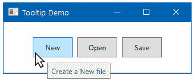

## 它是如何工作的...

`ToolTip` 属性，当在任何 WPF 控件中设置时，当你悬停在控件上时变得可见。除此之外，`ToolTipService` 类有一系列附加属性来帮助你设置工具提示的各种行为。

如前所述的第二个示例，如果你将鼠标悬停在 `Open` 按钮上，屏幕上的 `Tooltip` 属性将可见 2 秒。这是因为我们将 `ToolTipService` 的 `ShowDuration` 属性设置为 `2000` 毫秒（2 秒）。

你还可以使用 `ToolTipService.ShowOnDisabled` 属性来显示或隐藏一个禁用元素上的 `Tooltip`。该类中的 `HasDropShadow` 属性确保 `Tooltip` 是否会有阴影。

## 更多内容...

由于 `ToolTip` 属性是 `object` 类型，您可以将其分配给任何内容，包括各种 UI 控件。因此，它帮助您通过更丰富的体验来自定义工具提示的 UI。

让我们修改先前列出的示例中第三个按钮的 `Tooltip` 属性。在 `StackPanel` 中放置几个 `TextBlock` 和 `Border` 控件来设计 UI，如下面的 XAML 代码片段所示：

```cs
<Button Content="Save" Width="60" Height="30"  
    Margin="4"> 
    <Button.ToolTip> 
        <StackPanel> 
            <TextBlock FontWeight="Bold" 
                       Text="Save File" /> 
            <TextBlock Text="Clicking on this button, 
                       saves the file to disk" 
                       FontSize="10" /> 
            <Border BorderBrush="Silver"  
                    BorderThickness="0,1,0,0"  
                    Margin="0 4" /> 
            <TextBlock FontStyle="Italic" 
                       FontSize="9" 
                       Text="Press F1 for more help" /> 
        </StackPanel> 
    </Button.ToolTip> 
</Button> 
```

当您运行应用程序时，将鼠标悬停在第三个按钮上，可以看到该按钮定制的工具提示 UI，如下面的屏幕截图所示：

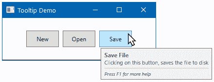

`ToolTipService` 类还公开了一些额外的属性，例如 `HorizontalOffset` 和 `VerticalOffset`，用于在屏幕上的特定位置定位 `Tooltip`。

# 将标准菜单添加到 WPF 应用程序中

WPF 应用程序中最常见的部分之一是菜单，因为它在很小的空间内提供了各种选项。WPF 提供了一个名为 `Menu` 的控件来容纳名为 `MenuItem` 的项。

让我们更深入地了解这个菜单控件以及如何将其添加到 Windows 应用程序中。

## 准备工作

打开您的 Visual Studio，创建一个名为 `CH02.MenuDemo` 的新 WPF 项目。

## 如何操作...

按照以下步骤将菜单添加到您的 WPF 应用程序中：

1.  打开 `MainWindow.xaml` 页面，并将默认的 `Grid` 替换为 `DockPanel`。我们将在下一章中更详细地讨论这个面板。

1.  现在将 `Menu` 控件添加到 `DockPanel` 内部。这将创建一个基础，用于容纳所有菜单项。

1.  然后，您可以以分层的方式添加根级菜单项和子菜单项，如下面的代码片段所示：

```cs
<DockPanel> 
    <Menu> 
        <MenuItem Header="File"> 
            <MenuItem Header="New" /> 
            <MenuItem Header="Open" /> 
            <MenuItem Header="Save" /> 
            <Separator /> 
            <MenuItem Header="Exit" /> 
        </MenuItem> 
        <MenuItem Header="Edit"> 
            <MenuItem Header="Undo" /> 
            <MenuItem Header="Redo" /> 
        </MenuItem> 
    </Menu> 
</DockPanel> 
```

1.  运行应用程序以查看包含添加的菜单项的以下窗口：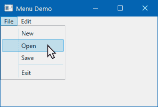

## 工作原理...

当您在 `<Menu>` 标签下添加第一个菜单项时，它将创建根级菜单项；例如，文件菜单，编辑菜单。每个根菜单项可以包含一个或多个分层子菜单项。在先前的示例中，文件菜单包含四个子菜单项。

`MenuItem` 的标题属性用于添加每个项目的标签。当您想添加分隔符时，可以通过添加 `<Separator />` 标签来实现，如先前的示例所示。分隔符不需要任何 `Header` 内容。

## 更多内容...

您可以进一步自定义菜单项，以包含图标、勾选标记、快捷键或键盘访问指定符。让我们讨论每个选项。

### 将访问键添加到菜单中

按照常规做法，通过按住 *Alt* 键然后按定义为其访问键的字符来访问应用程序菜单。例如，要打开任何 Windows 应用程序的文件菜单，我们使用 *Alt* + *F*，要访问文件 | 新建菜单，我们使用 *Alt* + *F*，*N*。在这里，字符 *F* 和 *N* 被用作访问键，当我们按 *Alt* 时被调用。

在 WPF 应用程序中，您需要在要突出显示为访问键的字符之前指定下划线`_`。例如，在文件菜单标题内容中在`F`之前添加下划线`_`，当按下*Alt* + *F*时激活该菜单：

```cs
<MenuItem Header="_File"> 
      <MenuItem Header="_New" /> 
      <MenuItem Header="_Open" /> 
</MenuItem> 
```

常用的做法是使用尚未用作其他控件访问键的第一个字符作为访问键。但是，根据需要，您可以指定标签内容中的任何字符。

### 将图标添加到菜单

您可以向菜单添加图标，以使应用程序的菜单项看起来更好。`MenuItem`元素包含一个名为`Icon`的属性，可以将其添加为图像图标或 Unicode 字符作为图标。

让我们添加一个 Unicode 字符，为打开和保存菜单项添加一个图标：

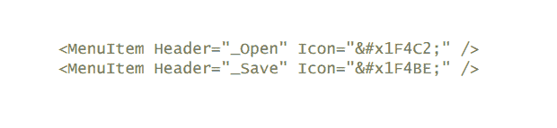

现在运行应用程序，查看已添加到相应菜单中的图标，如下截图所示：

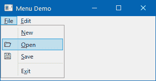

### 添加可复选菜单项

您也可以添加可复选菜单项。WPF 菜单项公开了两个属性来处理此功能。`IsCheckable`属性告诉菜单项它可以处理勾选/取消勾选选项。当`IsCheckable`设置为`True`时，它会在该菜单项的交替单击上设置勾选/取消勾选图标。

您也可以通过编程方式勾选/取消勾选菜单项。将其`IsChecked`属性设置为`True`或`False`。确保设置`IsCheckable="True"`。让我们在编辑菜单下添加以下菜单项：

```cs
<MenuItem Header="Save _settings on exit" 
          IsCheckable="True" IsChecked="True" /> 
```

### 将点击事件处理程序添加到菜单

菜单不仅仅是添加到应用程序；您需要通过添加`Click`事件处理程序在菜单上执行一些操作，如下所示代码片段：

```cs
<MenuItem Header="E_xit" Click="OnExitMenuClicked" /> 
```

在代码背后实现处理程序，如下所示：

```cs
private void OnExitMenuClicked(object sender, RoutedEventArgs e) 
{ 
    MessageBox.Show("'Exit' menu item clicked!"); 
    Environment.Exit(0); 
} 
```

当用户单击退出菜单项时，这将首先显示一个消息框，然后退出应用程序。

# 使用上下文菜单提供额外功能

上下文菜单在提供额外功能的任何 Windows 应用程序中都发挥着至关重要的作用，这些功能与上下文相关。这通常与单个控件或窗口相关。

当您在控件或窗口上右键单击时，您可以向用户提供一个弹出上下文菜单，以执行单击操作。WPF 为所有框架元素提供了一个`ContextMenu`属性，以持有具有分层`MenuItems`的`ContextMenu`。

请参考此配方以了解如何在您的 WPF 应用程序中添加上下文菜单。

## 准备工作

使用 Visual Studio 的 WPF 应用程序项目模板创建一个名为`CH02.ContextMenuDemo`的新项目。

## 如何操作...

按照以下步骤将上下文菜单添加到`TextBlock`控件。相同的步骤也可以用于将上下文菜单添加到继承自`FrameworkElement`的任何控件：

1.  打开`MainWindow.xaml`文件以修改应用程序 UI。

1.  将整个`Grid`块替换为以下 XAML 代码：

```cs
<Grid> 
    <TextBlock Text="Right-click on me to open Context Menu!" 
        Margin="10"> 
        <TextBlock.ContextMenu> 
            <ContextMenu> 
                <MenuItem Header="Menu item 1" /> 
                <MenuItem Header="Menu item 2" 
                    InputGestureText="Ctrl + R, Ctrl + G"/> 
                <Separator /> 
                <MenuItem Header="Menu item 3" 
                          IsCheckable="True"  
                          IsChecked="True" /> 
            </ContextMenu> 
        </TextBlock.ContextMenu> 
    </TextBlock> 
</Grid> 
```

1.  运行应用程序。您将看到一个文本，提示您右键单击以打开上下文菜单！。

1.  右键单击窗口。你将在屏幕上看到以下上下文菜单弹出![img/c711319d-e3e4-4b76-8f6f-ac764520cb7f.png]

## 它是如何工作的...

如前例所示，每个 `FrameworkElement` 都公开了一个名为 `ContextMenu` 的属性，它可以包含一个 `ContextMenu` 项。就像我们在前面的菜谱中学到的菜单一样，上下文菜单也可以包含多个项作为 `MenuItem`，并且每个菜单项又可以包含一个或多个菜单项以使上下文菜单具有层次结构。

菜单项的标签是通过设置其 `Header` 属性来分配的。你还可以为每个菜单项设置图标，通过将其 `Icon` 属性分配给图像或 Unicode 字符。如果你已将命令绑定到菜单，则可以将快捷键文本分配为 `InputGestureText` 属性。

此外，你还可以创建可勾选的上下文菜单项。如图菜单项 3 所示，你可以将 `IsCheckable` 属性设置为 `True`，使菜单可勾选。然后你可以使用 `IsCheck` 属性来显示/隐藏其上的勾选标记。

要在一系列上下文菜单项之间添加分隔符，你可以使用 `<Separator />` 标签，如前例所示。

# 使用单选按钮和复选框添加用户选项

单选按钮和复选框在 Windows 应用程序开发中起着至关重要的作用。它们主要用于向用户提供从一组项目中选择选项的功能。单选按钮允许你从一组选项中选择一个，而复选框允许你切换选项。

在这个菜谱中，我们将学习如何在 WPF 应用程序中使用 `RadioButton` 和 `CheckBox` 控件。

## 准备工作

要开始，打开你的 Visual Studio IDE，并创建一个名为 `CH02.OptionSelectorsDemo` 的新项目。确保你选择 WPF 应用程序项目模板。

## 如何操作...

打开 `MainWindow.xaml` 页面，按照以下步骤向其中添加一组单选按钮和复选框控件：

1.  首先，将默认的 `Grid` 面板替换为 `StackPanel` 以垂直堆叠项目。

1.  现在添加以下具有一组单选按钮的 `StackPanel`，其 `GroupName="rdoGroup1"`：

```cs
<StackPanel Orientation="Horizontal"> 
    <RadioButton GroupName="rdoGroup1" 
                 Content="Radio 1" 
                 IsChecked="True" 
                 Margin="4" /> 
    <RadioButton GroupName="rdoGroup1" 
                 Content="Radio 2" 
                 Margin="4" /> 
    <RadioButton GroupName="rdoGroup1" 
                 Content="Radio 3" 
                 Margin="4" /> 
</StackPanel>
```

1.  在水平放置的 `StackPanel` 中添加另一组单选按钮，其 `GroupName="rdoGroup2"`，并将其添加到根 `StackPanel`：

```cs
<StackPanel Orientation="Horizontal"> 
    <RadioButton GroupName="rdoGroup2" 
                 Content="Radio 1" 
                 Margin="4" /> 
    <RadioButton GroupName="rdoGroup2" 
                 Content="Radio 2" 
                 IsChecked="True" 
                 Margin="4" /> 
    <RadioButton GroupName="rdoGroup2" 
                 Content="Radio 3" 
                 Margin="4" /> 
</StackPanel> 
```

1.  现在将以下 `CheckBox` 控件放置在水平 `StackPanel` 中，并将其添加到根：

```cs
<StackPanel Orientation="Horizontal"> 
    <CheckBox Content="Checkbox 1" 
              IsChecked="True" 
              Margin="4" /> 
    <CheckBox Content="Checkbox 2" 
              IsChecked="True" 
              Margin="4" /> 
    <CheckBox Content="Checkbox 3" 
              Margin="4" /> 
</StackPanel>
```

1.  运行应用程序，屏幕上将显示以下输出![img/34fdcd90-9735-4fe5-9315-6f5121fdd8ce.png]

1.  选择几个单选按钮和复选框控件来感受其行为。

## 它是如何工作的...

第一组单选按钮控件放置在与同一名称 `rdoGroup1` 的组中。当组名称设置为单选按钮的一组时，选择将遵循该组。该组中的第一个单选按钮默认选中，通过将其 `IsChecked` 属性设置为 `True`。如果你选择该组中的任何其他单选按钮，则之前的选中状态将重置为未选中状态。

第二组也是如此，但选择一个组不会影响另一个组。因此，当你从第一组检查一个单选按钮时，它不会取消选中另一组的单选按钮。

对于复选框控件来说，情况并非如此。复选框控件允许你拥有多个选中的项。当你选择一个复选框时，它可以从一个状态切换到另一个状态。

单选按钮和复选框控件都暴露了`IsChecked`属性，以返回一个布尔值来指示控件是被选中还是未选中。

## 还有更多...

要禁用单选按钮或复选框控件，将其`IsEnabled`属性设置为`False`。这两个控件都暴露了两个事件——`Checked`和`Unchecked`。当你注册这些事件时，当检查该控件时，控件的`Checked`事件将被触发。同样，当取消选中该控件时，`Unchecked`事件将被触发。

# 与进度条控件一起工作

当你在后台执行长时间任务时，你可能想在应用程序 UI 中添加一个进度指示器，以提供一些工作正在进行中的视觉指示。WPF 为我们提供了一个名为`ProgressBar`的控件，以显示 0%到 100%之间的工作百分比，通常是。

在这个菜谱中，我们将了解进度条控件及其各种属性。

## 准备工作

让我们打开 Visual Studio 并创建一个新的 WPF 应用程序项目。将其命名为`CH02.ProgressBarDemo`。

## 如何操作...

一旦项目创建完成，请按照以下步骤将进度指示器添加到应用程序的 UI 中：

1.  打开`MainWindow.xaml`，并将现有的`Grid`面板替换为`StackPanel`，这样我们就可以垂直堆叠添加我们的控件。

1.  如以下代码片段所示，在`StackPanel`中添加三个`ProgressBar`控件：

```cs
<StackPanel Margin="10"> 
    <TextBlock Text="Progress Indicator set at: 20%" /> 
    <ProgressBar Height="30" 
                    Margin="0 4" 
                    Minimum="0" 
                    Maximum="100" 
                    Value="20" /> 

    <TextBlock Text="Progress Indicator set at: 70%" /> 
    <ProgressBar Height="30" 
                    Margin="0 4" 
                    Minimum="0" 
                    Maximum="100" 
                    Value="70" /> 

    <TextBlock Text="Progress Indicator set at:
     Indeterminate" /> 
    <ProgressBar Height="30" 
                    Margin="0 4" 
                    Minimum="0" 
                    Maximum="100" 
                    IsIndeterminate="True" /> 
</StackPanel> 
```

1.  将三个控件的`Minimum`和`Maximum`属性分别设置为`0`（零）和`100`（百）。

1.  如前述 XAML 代码片段所示，将第一个进度条的`Value`设置为`20`，第二个进度条的`Value`设置为`70`。

1.  将第三个进度条的`IsIndeterminate`属性设置为`True`。

1.  现在运行应用程序。你将看到我们之前分享的 XAML 代码的以下输出！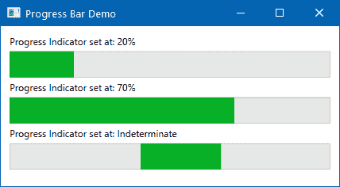

## 它是如何工作的...

首个进度指示器的值设置为`20`，而第二个进度指示器的值设置为`70`。这表示分别完成了 20%和 70%的工作。随着你任务的进展，你可以增加值以在 UI 中的`ProgressBar`控件上获得进度视觉指示。

对于第三个`ProgressBar`控件，在先前的示例中，它略有不同。当你不确定要完成的总工作量时，你可以将其`IsIndeterminate`属性设置为`True`，如先前的截图所示。当你的工作完成时，你可以停止不确定状态并将其`Value`设置为 100。

# 使用滑动条控件选择数值

`Slider` 控件用于通过拖动滑块按钮沿水平或垂直线选择一个数值。这通常用于提供播放视频的可视化以及音量指示器。

WPF 为我们提供了一个名为 `Slider` 的控件，可以快速在应用程序 UI 中实现此功能，并且提供了许多属性以进行各种配置。让我们在本食谱中了解更多关于它的信息。

## 准备工作

首先，创建一个名为 `CH02.SliderDemo` 的项目，基于 WPF 应用程序模板。

## 如何实现...

在 WPF 中集成滑块非常简单。只需在 XAML 页面中放置 `<Slider />`，它就会开始工作。但为了进一步自定义它，让我们遵循以下步骤：

1.  打开 `MainWindow.xaml` 页面，并将默认的 `Grid` 替换为 `StackPanel`。

1.  现在在 `StackPanel` 中添加一个 `Slider` 和一个 `TextBlock` 控件，如下面的 XAML 片段所示：

```cs
<StackPanel Margin="10"> 
    <Slider x:Name="slider" 
            Minimum="0" Maximum="100"                 
            Value="25" 
            SmallChange="1" 
            LargeChange="5" /> 
    <TextBlock Margin="4"> 
        <Run Text="Current slider value: " /> 
        <Run Text="{Binding Value, ElementName=slider}" /> 
    </TextBlock> 
</StackPanel>
```

1.  运行应用程序。您将在 UI 中看到一个 `Slider` 控件，以及显示当前值的文本，该值设置为 `25`。将滑块滑块向右移动，它将显示当前选定的值。在我们的演示中，它现在是 `65`，如下面的截图所示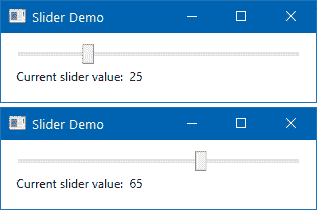

## 工作原理...

它基于当前值工作。名为 `Value` 的属性为我们提供一个整数，表示当前位置。您可以通过编程方式将其设置为将滑块滑块移动到较小的或较大的值。

`Minimum` 和 `Maximum` 属性表示滑块可以接受的最小和最大值。在我们的例子中，我们将其分别设置为 `0`（零）和 `100`（百）。

在我们的示例代码中，其他控件 `TextBlock` 与滑块的 `Value` 属性进行数据绑定，该属性在 XAML 中。它以纯文本格式显示滑块的当前值。

## 更多内容...

您还可以在滑块控件中启用刻度显示，以提供更好的滑块位置指示。使用 `TickPlacement` 属性打开刻度标记。它有四个值 `None`、`TopLeft`、`BottomRight` 和 `Both`。让我们在我们的上一个滑块控件中添加 `TickPlacement="BottomRight"`。

`TickFrequency` 属性用于设置 `0` 和 `100` 之间可能值的范围。让我们在我们的代码中添加 `TickFrequency="20"` 并再次运行应用程序。您将看到以下屏幕：

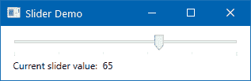

如前一个截图所示，您可以看到在滑块的底部添加了一些点。它们代表刻度。由于我们已将 `TickFrequency` 设置为 `20`，它将整个滑块范围划分为 `100/20 = 5` 个部分。

通常，移动滑块不会自动对齐到刻度。因此，您将观察到滑块位于刻度之间。使用 `IsSnapToTickEnabled` 属性并将其设置为 `True`，以确保滑块始终仅位于刻度标记上。在这种情况下，拖动滑块将根据刻度频率计数移动滑块。

# 在您的应用程序中使用日历控件

`Calendar` 控件是 `System.Windows.Controls` 命名空间的一部分，它允许您在 WPF 应用程序中创建一个可视化的日历。它允许您选择一个日期或一组日期。由于它继承自 `Control` 类，因此 `Control` 类的所有常见属性和事件都对它可用。

在此配方中，我们将了解更多关于 `Calendar` 控件及其使用方法。

## 准备工作

要开始使用此配方，让我们创建一个名为 `CH02.CalendarDemo` 的 WPF 应用程序项目。

## 如何操作...

按照以下步骤将基本控件添加到主窗口：

1.  打开 `MainWindow.xaml` 页面。

1.  在默认的 `Grid` 面板内部，添加 `<Calendar />` 标签以在应用程序 UI 中创建基本的日历控件。

1.  要检索用户选择的日期，将 `SelectedDatesChanged` 事件注册到它，如下面的代码片段所示：

```cs
<Grid Margin="10"> 
    <Calendar SelectedDatesChanged="OnSelectedDateChanged"  
      HorizontalAlignment="Left" /> 
</Grid> 
```

1.  在代码后置类 (`MainWindow.xaml.cs`) 中添加相关的事件处理程序 (`OnSelectedDateChanged`)，如下所示，以检索所选日期并在消息框中显示：

```cs
private void OnSelectedDateChanged(object sender,  
 SelectionChangedEventArgs e) 
{ 
    MessageBox.Show("You selected: " +  
      ((DateTime)e.AddedItems[0]).ToString("dd-MMM-yyyy")); 
} 
```

1.  让我们运行应用程序。您将在屏幕上看到以下 UI：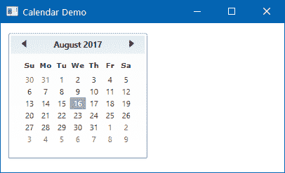

1.  一旦从日历中选择了一个日期，所选日期将在消息框中显示，如下所示：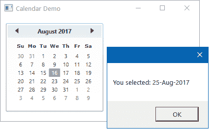

1.  选择不同的日期。这将向 UI 显示新选定的日期的消息。

## 它是如何工作的...

WPF `Calendar` 控件为您提供了基本的 UI，以便在应用程序中开始日历集成。顶部两个箭头允许您在月份之间导航并从日历中选择所需的日期。

导航还支持年视图和十年视图，因此您可以非常容易地选择所需的年份和月份。点击顶部显示的月份名称（在我们的例子中是 2017 年 8 月），以导航到年视图。当您处于年视图时，它将显示 Jan–Dec 的月份范围，点击年份将导航到十年视图，在那里您可以选择所需的年份。

## 还有更多...

`Calendar` 控件公开了许多属性和事件，供您自定义控件的行为和外观。让我们进一步讨论这个问题。

### SelectionModes 属性

`SelectionMode` 属性允许您获取或设置表示在日历上允许哪种选择的值。有四个可用的值，分别命名为 `None`、`SingleDate`、`SingleRange` 和 `MultipleRange`。默认的 `enum` 值 `SingleDate` 允许您仅选择单个日期。但是，当您想要多选时，将其设置为 `MultipleRange`：

```cs
<Calendar SelectionMode="MultipleRange" /> 
```

### DisplayDate 属性

`Calendar`控件允许你设置起始和结束显示日期。`DisplayDate`属性表示要显示的当前日期；而设置`DisplayDateStart`和`DisplayDateEnd`属性则限制你只能选择从起始日期到结束日期的日期范围内的日期。

以下 XAML 代码演示了如何在`Calendar`控件中设置`DisplayDate`、`DisplayDateStart`和`DisplayDateEnd`属性：

```cs
<Calendar SelectionMode="MultipleRange" 
          DisplayDateStart="8/10/2017" 
          DisplayDateEnd="8/21/2017" 
          DisplayDate="8/16/2017" /> 
```

现在运行应用程序以查看以下输出：

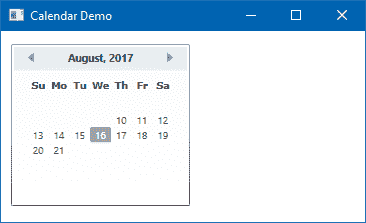

### 显示模式属性

`DisplayMode`属性允许你选择日历的格式，可以是月份、年份或十年。当你启动一个基本的日历时，默认情况下，它显示月份视图：

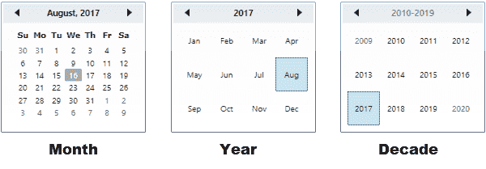

但是用户可以通过点击`Calendar`控件的头文字轻松地从月份导航到年份再到十年。

要从代码中更改显示模式，可以将`DisplayMode`属性设置为`Month`、`Year`或`Decade`：

```cs
<Calendar DisplayMode="Month" /> <!-- default mode --> 
<Calendar DisplayMode="Year" /> 
<Calendar DisplayMode="Decade" /> 
```

用户可以通过点击任何日历单元格来启动向下转换，并且他们可以轻松地从十年导航到年份再到月份并选择正确的日期。

### 黑名单日期属性

尽管显示，你可以选择不选择某些日期范围。你可以通过使用日历的`BlackoutDates`属性来实现，它接受一个`CalendarDateRange`对象的集合。

以下`Calendar`控件将阻止从 2017 年 8 月 1 日到 2017 年 8 月 8 日以及从 2017 年 8 月 21 日到 2017 年 8 月 31 日的日期范围：

```cs
<Calendar> 
    <Calendar.BlackoutDates> 
        <CalendarDateRange Start="8/1/2017" End="8/8/2017" /> 
        <CalendarDateRange Start="8/21/2017" End="8/31/2017" /> 
    </Calendar.BlackoutDates> 
</Calendar> 
```

所有非选择日期都由一个十字标记，如下面的截图所示：

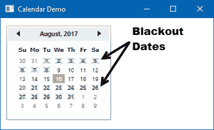

# 在 Listbox 控件中列出项目

在 WPF 中，`ListBox`控件用于显示项目列表。用户可以根据指定的`SelectionMode`从列表中选择一个或多个项目。

在这个菜谱中，我们将学习如何创建`ListBox`控件并在 WPF 应用程序中使用它。

## 准备工作

打开你的 Visual Studio IDE 并创建一个新的 WPF 应用程序项目，命名为`CH02.ListBoxDemo`。

## 如何操作...

在 UI 中添加`ListBox`控件就像在任何 XAML 页面中编写`<ListBox />`标签一样简单。但要存储其中的数据，您必须正确使用其属性。按照以下步骤添加带有一些静态数据的`ListBox`控件：

1.  打开 WPF 项目的`MainWindow.xaml`页面。

1.  在默认的`Grid`面板下，添加`<ListBox></ListBox>`标签以添加控件。

1.  在控件内部添加几个`ListBoxItem`，如下所示：

```cs
<ListBox x:Name="lstBox" 
         Width="120" Height="85" 
         Margin="10 10 20 5"> 
    <ListBoxItem Content="Item 1" /> 
    <ListBoxItem Content="Item 2" IsSelected="True" /> 
    <ListBoxItem Content="Item 3" /> 
    <ListBoxItem Content="Item 4" /> 
    <ListBoxItem Content="Item 5" /> 
</ListBox> 
```

1.  向控件添加两个按钮，分别标记为`+`和`-`以执行对所述`Listbox`控件的`add`和`delete`操作。注册两个按钮的`Click`事件：

```cs
<StackPanel Orientation="Horizontal" 
            HorizontalAlignment="Center"> 
    <Button Content="+" 
            Width="20" Height="20" 
            Margin="0 0 4 0" 
            Click="OnAddItemClicked" /> 
    <Button Content="-"  
            Width="20" Height="20" 
            Margin="0 0 4 0" 
            Click="OnDeleteItemClicked" /> 
</StackPanel> 
```

1.  在代码隐藏文件`MainWindow.xaml.cs`中，实现如下所示的按钮点击事件处理程序：

```cs
private void OnAddItemClicked(object sender,  
 RoutedEventArgs e) 
{ 
    var itemsCount = lstBox.Items.Count; 
    var newitem = new ListBoxItem  
                  { 
                    Content = "Item " + (itemsCount + 1) 
                  }; 

    lstBox.Items.Add(newitem); 
    lstBox.SelectedItem = newitem; 
} 

private void OnDeleteItemClicked(object sender,  
 RoutedEventArgs e) 
{ 
    var selectedItem = lstBox.SelectedItem; 
    if (selectedItem != null) 
    { 
        lstBox.Items.Remove(selectedItem); 
        lstBox.SelectedIndex = 0; 
    } 
} 
```

1.  现在运行应用程序。你将在屏幕上看到以下 UI：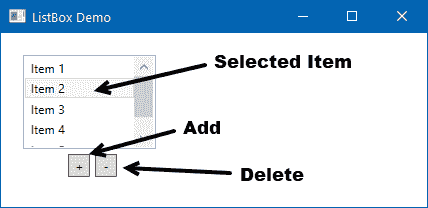

## 它是如何工作的...

在前面的示例中，`ListBox`控件包含五个作为`ListBoxItem`的项目。当您启动应用程序时，默认情况下，第二个项目被选中，因为其`IsSelected`属性被设置为`True`。

这两个按钮用于在`Listbox`控件中`添加`或`删除`项目。点击`+`按钮将触发`OnAddItemClicked`事件，这将创建一个新的`ListBoxItem`实例并将其添加到`ListBox`控件中。滚动列表以查看新添加的条目。由于`ListBox`的`SelectedItem`属性被分配了最新的项目，它现在将被选中，从而取消之前的选中。

点击`-`按钮以触发`OnDeleteItemClicked`事件。这将获取当前选中的项目，如果它不是`null`，它将被从`ListBox`控件中删除。`SelectedIndex`属性将设置为`0`（零），以便在删除后选择第一个元素。

## 还有更多...

`ListBox`有许多属性可以执行特定操作。让我们学习其中的一些。在本节的后面，我们还将介绍如何添加具有附加 UI 控件的定制`ListBoxItem`。

### 实现多选

`ListBox`支持多选。默认情况下，当`SelectionMode`属性设置为`Single`时，它只接受单个项目的选择。如果您将`SelectionMode`设置为`Multiple`，它将接受多选。`Extended`模式允许您执行单选，但如果在选择项目时按下*Ctrl*键，它将作为多选操作。

### 使用多个控件自定义 ListBoxItem

您可以通过向其中添加额外的 UI 控件轻松地自定义`ListBoxItem`。考虑以下 XAML 代码片段，其中我们添加了一个`ListBox`，它包含四个`ListBoxItem`：

```cs
<ListBox Width="150" Margin="20 10 10 10"> 
    <ListBoxItem> 
        <StackPanel Orientation="Horizontal"> 
            <Rectangle Width="10" 
                       Height="10" 
                       Fill="Red" 
                       Margin="0 0 8 0" /> 
            <TextBlock Text="Red (#FFFF0000)" /> 
        </StackPanel> 
    </ListBoxItem> 
    <ListBoxItem IsSelected="True"> 
        <StackPanel Orientation="Horizontal"> 
            <Rectangle Width="10" 
                       Height="10" 
                       Fill="Green" 
                       Margin="0 0 8 0" /> 
            <TextBlock Text="Green (#FF00FF00)" /> 
        </StackPanel> 
    </ListBoxItem> 
    <ListBoxItem> 
        <StackPanel Orientation="Horizontal"> 
            <Rectangle Width="10" 
                       Height="10" 
                       Fill="Blue" 
                       Margin="0 0 8 0" /> 
            <TextBlock Text="Red (#FF0000FF)" /> 
        </StackPanel> 
    </ListBoxItem> 
</ListBox> 
```

如果您看到前面的代码片段，每个`ListBoxItem`都有一个`StackPanel`来容纳一个`Rectangle`控件和一个`TextBlock`控件。如果您运行前面的代码，您将看到以下 UI：

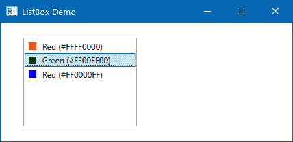

在前面的屏幕截图中，注意项目是如何列出的。每个项目都包含一个矩形来预览作为项目列出的颜色。这在显示实体信息时更有用。

通常，这是通过使用`ListBox`控件的`DataTemplate`属性来完成的，我们将在本书的后续章节中学习。

# 提供从 ComboBox 中选择选项

`ComboBox`控件是一个项目控件，其工作方式类似于`ListBox`，但列表中只有一个项目可选中。`ListBox`控件默认情况下在屏幕上列出多个项目，但`ComboBox`控件仅在用户点击时显示可滚动的列表。因此，它占用的空间要小得多。

本食谱将讨论`ComboBox`控件及其使用方法。

## 准备工作

开始创建一个新的 WPF 应用程序项目，使用您的 Visual Studio IDE，命名为`CH02.ComboBoxDemo`。

## 如何操作...

按照以下简单步骤将`ComboBox`控件添加到您的应用程序 UI 中：

1.  将默认的`Grid`替换为`StackPanel`以水平堆叠托管 UI 控件。

1.  在`StackPanel`内部添加以下 XAML 代码，以创建一个包含一些项目的简单`ComboBox`控件：

```cs
<ComboBox Width="150" Height="26" 
    Margin="10"> 
    <ComboBoxItem Content="Item 1" /> 
    <ComboBoxItem Content="Item 2" IsSelected="True" /> 
    <ComboBoxItem Content="Item 3" /> 
    <ComboBoxItem Content="Item 4" /> 
    <ComboBoxItem Content="Item 5" /> 
</ComboBox> 
```

1.  添加另一个`ComboBox`以具有自定义项目，如下面的示例代码所示：

```cs
<ComboBox Width="150" Height="26" 
    Margin="10"> 
    <ComboBoxItem> 
        <StackPanel Orientation="Horizontal"> 
            <Rectangle Width="10" 
                       Height="10" 
                       Fill="Red" 
                       Margin="0 0 8 0" /> 
            <TextBlock Text="Red (#FFFF0000)" /> 
        </StackPanel> 
    </ComboBoxItem> 
    <ComboBoxItem> 
        <StackPanel Orientation="Horizontal"> 
            <Rectangle Width="10" 
                       Height="10" 
                       Fill="Green" 
                       Margin="0 0 8 0" /> 
            <TextBlock Text="Green (#FF00FF00)" /> 
        </StackPanel> 
    </ComboBoxItem> 
    <ComboBoxItem> 
        <StackPanel Orientation="Horizontal"> 
            <Rectangle Width="10" 
                       Height="10" 
                       Fill="Blue" 
                       Margin="0 0 8 0" /> 
            <TextBlock Text="Red (#FF0000FF)" /> 
        </StackPanel> 
    </ComboBoxItem> 
</ComboBox> 
```

1.  现在运行应用程序，它将看起来如下截图所示，具有可展开的弹出菜单：


## 工作原理...

虽然一个`ComboBox`控件类似于`ListBox`，但它默认不显示项目列表。需要用户干预才能显示项目。`ComboBox`的 UI 是三个控制器的组合：

+   一个**TextBox**，用于显示选定的项目

+   一个**Button**，用于显示或隐藏可用项目

+   一个**Popup**，在可滚动的面板内显示项目列表，并给用户选择一个可用列表项的选项

`ComboBox`包含一个`ComboBoxItem`集合。您可以将这些添加到其`Items`属性中。当您点击箭头时，项目列表将在屏幕上弹出，如前一张截图所示。要从代码中预选一个项目，将其`IsSelected`属性设置为`True`。

您还可以向`ComboBoxItem`添加自定义内容，以表示更好的 UI 组件。前一个示例中的第二个`ComboBox`演示了如何轻松自定义 UI。

就像`ListBox`一样，它也公开了`SelectedItem`、`SelectedIndex`、`SelectedValue`属性，以帮助您轻松设置或获取选定的项目。

## 更多...

`ComboBox`控件默认情况下不可编辑。但您可以控制此行为，为用户提供在`ComboBox`控件中手动输入所需值的选项。`IsEditable`属性用于添加此功能。将其设置为`True`，将其更改为可编辑的`ComboBox`。考虑以下代码：

```cs
<ComboBox Width="150" Height="26" 
    Margin="10" IsEditable="True"> 
    <ComboBoxItem Content="Item 1" /> 
    <ComboBoxItem Content="Item 2" IsSelected="True" /> 
    <ComboBoxItem Content="Item 3" /> 
    <ComboBoxItem Content="Item 4" /> 
    <ComboBoxItem Content="Item 5" /> 
</ComboBox> 
```

如果运行前面的代码，您可以看到以下 UI，其中控件现在允许您向其中输入文本：

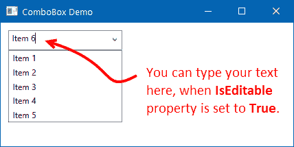

# 向窗口添加状态栏

状态栏用于显示有关应用程序当前状态的各项信息。您可以使用此功能显示光标位置、单词计数、任务进度等。通常，状态栏放置在窗口底部，而菜单、工具栏放置在顶部。

在本食谱中，我们将学习如何在 WPF 窗口中添加状态栏。

## 准备中

要开始使用状态栏，让我们创建一个名为`CH02.StatusBarDemo`的 WPF 应用程序项目。

## 如何做...

一旦创建 WPF 项目，打开`MainWindow.xaml`页面，按照以下步骤将`StatusBar`控件添加到窗口中：

1.  在`Grid`面板内部，添加一个`StatusBar`标签，并将其`Height`设置为`26`，`VerticalAlignment`设置为`Bottom`。

1.  现在更改其项目面板模板以托管一个具有五列的`Grid`（我们将在下一章中讨论更多关于网格列的内容），如下所示：

```cs
<StatusBar.ItemsPanel> 
    <ItemsPanelTemplate> 
        <Grid> 
            <Grid.ColumnDefinitions> 
                <ColumnDefinition Width="Auto" /> 
                <ColumnDefinition Width="Auto" /> 
                <ColumnDefinition Width="*" /> 
                <ColumnDefinition Width="Auto" /> 
                <ColumnDefinition Width="Auto" /> 
            </Grid.ColumnDefinitions> 
        </Grid> 
    </ItemsPanelTemplate> 
</StatusBar.ItemsPanel> 
```

1.  现在，在`StatusBar`标签内添加您想要显示的控件。让我们添加两个`StatusBarItem`；一个包含纯文本内容，另一个包含`ProgressBar`控件。在它们之间放置两个分隔符，如下面的 XAML 代码片段所示：

```cs
<StatusBarItem Content="Running Process..." 
  Grid.Column="0"/> 
<Separator Width="1" Grid.Column="1" /> 
<Separator Width="1" Grid.Column="3" /> 
<StatusBarItem Grid.Column="4"> 
    <ProgressBar IsIndeterminate="True" 
                 Width="100" Height="15" /> 
</StatusBarItem> 
```

1.  这是完整的 XAML 代码，您需要将其放置在默认的`Grid`面板中：

```cs
<StatusBar Height="26" VerticalAlignment="Bottom"> 
    <StatusBar.ItemsPanel> 
        <ItemsPanelTemplate> 
            <Grid> 
                <Grid.ColumnDefinitions> 
                    <ColumnDefinition Width="Auto" /> 
                    <ColumnDefinition Width="Auto" /> 
                    <ColumnDefinition Width="*" /> 
                    <ColumnDefinition Width="Auto" /> 
                    <ColumnDefinition Width="Auto" /> 
                </Grid.ColumnDefinitions> 
            </Grid> 
        </ItemsPanelTemplate> 
    </StatusBar.ItemsPanel> 

    <StatusBarItem Content="Running Process..." 
     Grid.Column="0"/> 
    <Separator Width="1" Grid.Column="1" /> 
    <Separator Width="1" Grid.Column="3" /> 
    <StatusBarItem Grid.Column="4"> 
        <ProgressBar IsIndeterminate="True" 
                     Width="100" Height="15" /> 
    </StatusBarItem> 
</StatusBar> 
```

1.  当您的 UI 准备就绪后，让我们运行应用程序。您将看到以下屏幕：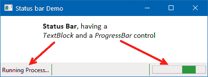

## 工作原理...

在前面的示例中，我们将纯文本内容“正在运行进程...”作为`StatusBarItem`放置在`Grid`的第一个列中。`Grid`的第二列和第四列包含一个宽度为一像素的`Separator`控件。第五列包含一个具有不确定状态的`ProgressBar`控件。

当您调整窗口大小时，状态栏将跟随其父级自动调整大小并定位到窗口底部。除了`Grid`之外，您还可以使用`DockPanel`将状态栏停靠到底部。

# 添加工具栏面板以执行快速任务

在任何基于 Windows 的应用程序中，您都可以找到一个工具栏，通常位于窗口主菜单的下方。它包含一组控件，提供对常用功能的便捷访问。

WPF 提供了一个`ToolBarTray`元素来托管一个或多个`ToolBar`控件，包含各种 UI 控件。它为您提供了额外的功能，例如自动溢出机制和手动重新定位功能。

在本教程中，我们将学习如何在 WPF 应用程序中处理工具栏。

## 准备工作

首先，打开您的 Visual Studio IDE 并创建一个新的 WPF 应用程序项目，命名为`CH03.ToolBarDemo`。

## 如何操作...

一旦项目创建完成，按照以下步骤在应用程序窗口中添加工具栏：

1.  从解决方案资源管理器打开`MainWindow.xaml`页面。

1.  现在，将现有的`Grid`替换为`DockPanel`，以便我们可以将工具栏停靠到窗口顶部。

1.  在`DockPanel`中添加一个`ToolBarTray`元素并将其停靠到`Top`。

1.  在`ToolBarTray`中添加一个`ToolBar`控件，然后在其内部添加几个按钮，如下面的 XAML 标记所示：

```cs
<ToolBarTray DockPanel.Dock="Top"> 
    <ToolBar> 
        <Button Content="B" FontWeight="Bold" 
                Width="20" 
                Click="OnBoldButtonClicked"/> 
        <Button Content="I" FontStyle="Italic" 
                Width="20"/> 
        <Button Width="20"> 
            <TextBlock Text="U"  
                       TextDecorations="Underline"/> 
        </Button> 
    </ToolBar> 
</ToolBarTray> 
```

1.  在`DockPanel`中添加一个`TextBox`控件，位于`ToolBarTray`下方，以便它可以覆盖窗口剩余的空间。给它命名为`txtBox`。

1.  您可以在`ToolBarTray`中添加多个工具栏。您还可以在`ToolBar`中添加其他控件。让我们添加以下包含`ComboBox`的`ToolBar`。将其放置在第一个`ToolBar`控件之后：

```cs
<ToolBar> 
    <ComboBox Width="50"> 
        <ComboBoxItem Content="8"/> 
        <ComboBoxItem Content="10"/> 
        <ComboBoxItem Content="12"/> 
        <ComboBoxItem Content="14"  
                      IsSelected="True"/> 
        <ComboBoxItem Content="16"/> 
    </ComboBox> 
</ToolBar> 
```

1.  这是完整的 XAML 代码，供您参考：

```cs
<DockPanel> 
    <ToolBarTray DockPanel.Dock="Top"> 
        <ToolBar> 
            <Button Content="B" FontWeight="Bold" 
                    Width="20"  
                    Click="OnBoldButtonClicked"/> 
            <Button Content="I" FontStyle="Italic" 
                    Width="20"/> 
            <Button Width="20"> 
                <TextBlock Text="U"  
                           TextDecorations="Underline"/> 
            </Button> 
        </ToolBar> 
        <ToolBar> 
            <ComboBox Width="50"> 
                <ComboBoxItem Content="8"/> 
                <ComboBoxItem Content="10"/> 
                <ComboBoxItem Content="12"/> 
                <ComboBoxItem Content="14"  
                              IsSelected="True"/> 
                <ComboBoxItem Content="16"/> 
            </ComboBox> 
        </ToolBar> 
    </ToolBarTray> 
    <TextBox x:Name="txtBox" Text="Sample Text" 
       AcceptsReturn="True" TextWrapping="Wrap" /> 
</DockPanel> 
```

1.  由于我们已将第一个工具栏的第一个按钮的点击事件与类相关联，我们需要编写事件主体。打开`MainWindow.xaml.cs`文件，并在类中添加以下按钮点击事件实现：

```cs
private void OnBoldButtonClicked(object sender,  
 RoutedEventArgs e) 
{ 
    txtBox.FontWeight =  
        txtBox.FontWeight == FontWeights.Bold ? 
        FontWeights.Normal : FontWeights.Bold; 
} 
```

1.  一旦运行应用程序，你将看到以下 UI，其中包含一个工具栏面板内的两个工具栏：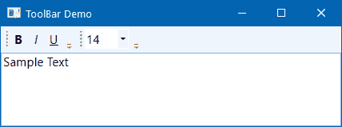

1.  点击第一个按钮（用字符 B 表示）。你会看到文本 Sample Text 变得加粗。如果你再次点击相同的按钮，文本的字体重量将变为正常！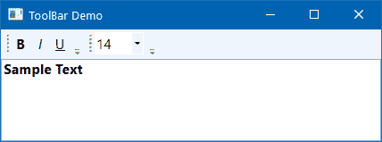

## 它是如何工作的...

`ToolBarTray` 可以包含一个或多个 `ToolBar` 控件。每个 `ToolBar` 控件可以包含一个或多个控件。`ToolBar` 控件也可以保持为空。当你开始向其中添加其他控件时，工具栏开始根据可用空间改变其大小和位置。

放置在 `ToolBar` 内部的控件可以注册其相关的事件。如果你想的话，你也可以使用命令绑定来在视图和代码之间建立更精细的关联。

在前面的例子中，第一个按钮，用字符 B 表示，代表为相关的 `TextBox` 应用 `Bold` 加权。当你第一次点击它时，文本的 `FontWeight` 属性将被设置为 `Bold`。当你再次点击它时，它将被设置为 `Normal`。按照相同的逻辑，你可以为其他按钮添加 `Click` 事件，并为组合框添加 `SelectionChange` 事件，如前面的例子所示。
