布局和面板

在本章中，我们将涵盖以下配方：

+   使用 Grid 构建 UI 布局

+   在均匀的单元格中放置元素

+   使用 `WrapPanel` 自动重新定位控件

+   在堆叠中放置控件

+   在 Canvas 内部定位控件

+   使用 Border 包装 UI 元素

+   创建可滚动的面板

+   使用 DockPanel 锚定控件

+   使用 `ViewBox` 缩放 UI 元素

+   创建标签布局

+   在面板中动态添加/删除元素

+   实现拖放功能

# 简介

WPF 提供了适当的布局和定位，以提供具有适当容器元素的交互式、用户友好的应用程序，该容器元素可以帮助您定位子 UI 元素。父容器通常是窗口的内容。您可以使用适当的边距、填充和对齐方式放置子级容器和元素。

在 WPF 中，`Panel` 是提供布局支持的基类。WPF 中有许多派生面板，可以帮助您创建简单到复杂的布局，并且所有这些都在 `System.Windows.Controls` 命名空间中定义。

所有 `Panel` 元素都支持由 `FrameworkElement` 定义的尺寸和定位。您可以通过设置 `Height`、`Width`、`Margin`、`Padding`、`HorizontalAlignment` 和 `VerticalAlignment` 属性来设计您的 UI。以下图表描述了您将在每个地方使用的重要属性：

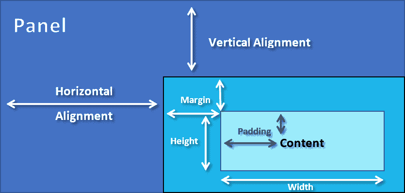

面板还公开了其他属性，例如 `Background`、`Children`、`ZIndex` 等。由于窗口只能包含一个子元素，因此面板通常用于划分空间以容纳另一个控件或面板。选择正确的面板对于创建布局非常重要。在本章中，我们将学习各种配方，使用各种面板来设计应用程序布局。

# 使用 Grid 构建 UI 布局

`Grid` 面板使您能够以表格格式排列子元素，这些元素由行和列中的单元格表示。这是您在创建新的 WPF 项目并导航到 `MainWindow.xaml` 文件时将看到的默认面板。Visual Studio 会自动将其添加到每个窗口的第一个容器中。

当您想以表格或矩阵形式表示数据时，这通常很有用。在创建表单布局时也很有用。

在这个配方中，我们将详细讨论 `Grid` 面板，以便你在设计应用程序布局时能够正确使用它。

## 准备工作

让我们从 `Grid` 作为布局面板开始，通过创建一个新的项目。打开 Visual Studio 并创建一个名为 `CH03.GridDemo` 的新项目，选择 WPF 应用程序模板。

## 如何操作...

执行以下步骤以创建一个示例 `Grid` 布局，用于在每个单元格中托管几个矩形：

1.  在解决方案资源管理器中，打开你的 `MainWindow.xaml` 页面。

1.  在默认的 `Grid` 面板内创建几行和列，如下面的代码所示：

```cs
    <Grid.RowDefinitions> 
        <RowDefinition Height="*" /> 
        <RowDefinition Height="*" /> 
    </Grid.RowDefinitions> 
    <Grid.ColumnDefinitions> 
        <ColumnDefinition Width="*" /> 
        <ColumnDefinition Width="*" /> 
        <ColumnDefinition Width="*" /> 
    </Grid.ColumnDefinitions> 
```

1.  在`Grid`内添加六个矩形，并使用`Grid.Row`和`Grid.Column`附加属性正确放置它们。您可以参考以下示例代码：

```cs
    <Rectangle Width="100" Height="60" 
               Fill="OrangeRed"  
               Grid.Row="0" Grid.Column="0"/> 
    <Rectangle Width="100" Height="60" 
               Fill="OrangeRed"  
               Grid.Row="0" Grid.Column="1"/> 
    <Rectangle Width="100" Height="60" 
               Fill="OrangeRed"  
               Grid.Row="0" Grid.Column="2"/> 
    <Rectangle Width="100" Height="60" 
               Fill="OrangeRed"  
               Grid.Row="1" Grid.Column="0"/> 
    <Rectangle Width="100" Height="60" 
               Fill="OrangeRed"  
               Grid.Row="1" Grid.Column="1"/> 
    <Rectangle Width="100" Height="60" 
               Fill="OrangeRed"  
               Grid.Row="1" Grid.Column="2"/> 
```

1.  现在运行应用程序，您将在屏幕上看到以下 UI：

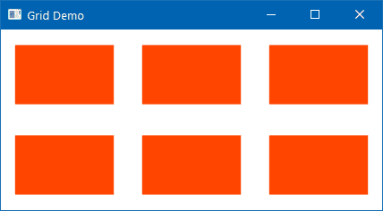

## 它是如何工作的...

`Grid`通过创建行和列在单元格中工作。`<Grid.RowDefinitions>`和`<Grid.ColumnDefinitions>`定义了`Grid`的结构。它包含行和列的集合。在这里，我们使用`RowDefinition`和`ColumnDefinition`创建了两个行和三个列（`2x3`矩阵）。

当我们将矩形放置在`Grid`内时，我们通过指定行号和列号来定位它们，使用附加属性`Grid.Row`和`Grid.Column`。由于索引位置从`0`（零）开始，第一个放置在第一个单元格中的矩形具有行索引 = `0` 和列索引 = `0`。同样，第六个/最后一个矩形的定位为`Row=1`和`Column=2`。

您可以通过指定绝对值、百分比值（星号大小）或自动大小来设置`RowDefinition`的`Height`和`ColumnDefinition`的`Width`。在上面的例子中，我们使用了星号大小来定义行和列的维度。

绝对值使用整数来定义固定的高度/宽度。星号大小是一个基于相对的因子，类似于百分比值。当您将高度/宽度标记为`*`时，它将在填充所有其他固定和自动大小的行/列之后尽可能多地占用空间。当您指定`Auto`时，它将占用包含的控件所需的空间。

## 还有更多...

关于星号大小值还有更多要了解的。当有两行或两列的高度/宽度定义为`*`时，它们将通过按比例分配来占用可用空间。因此，在上面的例子中，两个行中的每一个都占用了 50%的可用空间。同样，三个列平均占用了总共 100%的可用空间。

您也可以使用`n*`来定义它们。例如，如果一个`Grid`包含两行，其中一行的高度定义为`2*`，另一行定义为`8*`，它们将分别占用 20%和 80%的可用空间。让我们用一个简单的例子来看看。

在窗口内创建一个`Grid`，并将其`ShowGridLines`属性设置为`True`，以便在屏幕上显示网格线。默认情况下，它设置为`False`。现在将整个`Grid`分为五个列。考虑以下 XAML 代码：

```cs
<Grid ShowGridLines="True"> 
    <Grid.ColumnDefinitions> 
        <ColumnDefinition Width="2*"/> 
        <ColumnDefinition Width="Auto" MinWidth="5"/> 
        <ColumnDefinition Width="*"/> 
        <ColumnDefinition Width="3*"/> 
        <ColumnDefinition Width="40"/> 
    </Grid.ColumnDefinitions> 
</Grid> 
```

第二列的宽度设置为`Auto`，这意味着它将占用与包含元素宽度相同的空间。当所述列内部不包含任何元素时，这将具有`0`（零）宽度。您可以指定`MinWidth`来提供最小值。

第五列具有固定的宽度为`40`。第二列和第四列的宽度将首先计算，因为它们分别包含自动宽度和固定宽度。

在前面的例子中，其他三个列现在将基于可用空间进行计算，并按`2:1:3`的比例计算。示例中的第三列将占据六分之一的空间。第一列和第四列将根据第三列的宽度占据`2x`和`3x`的宽度。

一旦运行此 UI，你将看到以下输出。现在调整窗口大小以查看如何根据给定的输入动态调整大小：

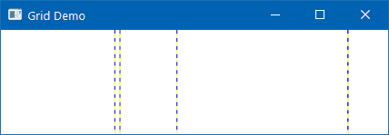

### 创建可调整大小的网格

在 WPF 中创建可调整大小的`Grid`是可能的。你可以使用`<GridSplitter/>`标签创建一个`splitter`控件，用户可以使用它来调整特定列的大小。让我们考虑以下 XAML 代码：

```cs
<Grid ShowGridLines="True"> 
    <Grid.ColumnDefinitions> 
        <ColumnDefinition Width="2*"/> 
        <ColumnDefinition Width="Auto"/> 
        <ColumnDefinition Width="*"/> 
        <ColumnDefinition Width="3*"/> 
        <ColumnDefinition Width="40"/> 
    </Grid.ColumnDefinitions> 
    <GridSplitter Grid.Column="1" Width="5"/> 
</Grid> 
```

在这个例子中，`GridSplitter`控件被放置在第二列。当你运行应用程序时，你将在第二列中看到一个垂直线，你可以拖动它来调整网格列的大小，如下面的截图所示：

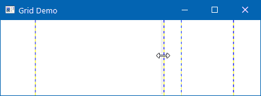

### 在多行和多/或列中跨越元素

并非必须将一个项目放置在单个单元格中。你可以将它跨越多个行和/或列。附加属性`Grid.RowSpan`允许你将元素跨越两个或多个网格行单元格。同样，`Grid.ColumnSpan`允许你将元素跨越两个或多个网格列。你可以使用其中一个或两个。

考虑以下代码片段，其中矩形跨越两个行和两个列，从（`0,0`）单元格位置开始：

```cs
    <Rectangle Fill="OrangeRed"  
               Grid.Row="0" Grid.Column="0" 
               Grid.RowSpan="2" Grid.ColumnSpan="2" /> 
```

当你运行这个时，你将看到以下输出：


# 在均匀单元格中放置元素

就像 Windows Presentation Foundation 中的`Grid`布局系统一样，`UniformGrid`控件也提供了类似的布局系统，但只有一点不同，即行和列的大小相同。它根据行和列的数量，将布局平均分成相同大小的单元格。

在这个菜谱中，我们将通过一个简单的例子来学习`UniformGrid`布局。

## 准备工作

让我们创建一个示例应用程序来演示`UniformGrid`控件。打开你的 Visual Studio IDE，创建一个名为`CH03.UniformGridDemo`的新 WPF 应用程序项目。

## 如何做到这一点...

现在执行以下步骤：

1.  从解决方案资源管理器中，打开`MainWindow.xaml`页面。

1.  用以下 XAML 代码替换现有的`Grid`面板：

```cs
<UniformGrid> 
    <Label Content="Cell 1" Background="Yellow" /> 
    <Label Content="Cell 2" Background="YellowGreen" /> 
    <Label Content="Cell 3" Background="Orange" /> 
    <Label Content="Cell 4" Background="OrangeRed" /> 
</UniformGrid> 
```

1.  构建项目并运行应用程序。你将在屏幕上看到以下输出：

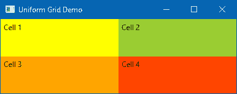

1.  现在关闭应用程序，并在相同的`UniformGrid`中添加几个更多的`Label`控件，如下所示：

```cs
<Label Content="Cell 5" Background="Violet" /> 
<Label Content="Cell 6" Background="DeepSkyBlue" /> 
<Label Content="Cell 7" Background="SkyBlue" />
```

1.  再次运行应用程序，你会看到行和列的数量会自动改变以适应新的元素，如下面的截图所示：

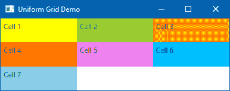

## 它是如何工作的...

当你开始在 `UniformGrid` 控件内放置控件时，它会自动计算所需的单元格数量以容纳添加的控件。基于此，它将可用空间划分为行和列，以顺序定位子元素。

当需要放置更多控件时，它再次将空间划分为额外的相等行和列，如第二个示例所示。

## 还有更多...

`UniformGrid` 为我们提供了许多属性，以自定义 UI。我们现在将讨论一些最重要的属性。

### 设置行和列数

`UniformGrid` 在设置行数和列数上没有限制。你可以通过分配 `Rows` 和 `Columns` 属性来设置数字。例如，以下 XAML 只会将元素渲染为单行，因为我们分配了 `Rows="1"`：

```cs
<UniformGrid Rows="1"> 
    <Label Content="Cell 1" Background="Yellow" /> 
    <Label Content="Cell 2" Background="YellowGreen" /> 
    <Label Content="Cell 3" Background="Orange" /> 
    <Label Content="Cell 4" Background="OrangeRed" /> 
    <Label Content="Cell 5" Background="Violet" /> 
    <Label Content="Cell 6" Background="DeepSkyBlue" /> 
    <Label Content="Cell 7" Background="SkyBlue" /> 
</UniformGrid> 
```

以下示例将产生以下输出：

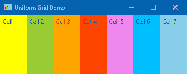

如果你设置 `Columns="2"`，所有元素都将重新定位到两列，但跨越多行。你还可以组合这两个属性。

### 定义 UniformGrid 的第一个单元格

`UniformGrid` 面板默认将第一个元素放置在第一个单元格中（行=0，列=0），但它也允许显式设置单元格位置。第一个单元格的位置必须在第一行，索引从 `0`（零）开始。

以下示例演示了如何通过分配 `FirstColumn` 属性来设置第一个元素的位置：

```cs
<UniformGrid Columns="4" FirstColumn="2"> 
    <Label Content="Cell 1" Background="Yellow" /> 
    <Label Content="Cell 2" Background="YellowGreen" /> 
    <Label Content="Cell 3" Background="Orange" /> 
    <Label Content="Cell 4" Background="OrangeRed" /> 
    <Label Content="Cell 5" Background="Violet" /> 
    <Label Content="Cell 6" Background="DeepSkyBlue" /> 
    <Label Content="Cell 7" Background="SkyBlue" /> 
</UniformGrid> 
```

当你运行前面的示例时，你将在屏幕上看到以下输出，其中单元格 1 标签位于第三列（索引位置是 `2`）：

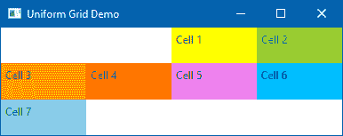

### 从右到左填充元素

`UniformGrid` 中填充元素的默认行为是 *从左到右*。但你可以以 *从右到左* 的方式填充它们。为此，将 `FlowDirection` 属性设置为 `RightToLeft`（默认为 `LeftToRight`），如以下代码片段所示：

```cs
<UniformGrid FlowDirection="RightToLeft"> 
    <Label Content="Cell 1" Background="Yellow" /> 
    <Label Content="Cell 2" Background="YellowGreen" /> 
    <Label Content="Cell 3" Background="Orange" /> 
    <Label Content="Cell 4" Background="OrangeRed" /> 
    <Label Content="Cell 5" Background="Violet" /> 
    <Label Content="Cell 6" Background="DeepSkyBlue" /> 
    <Label Content="Cell 7" Background="SkyBlue" /> 
</UniformGrid> 
```

当你运行前面的代码时，你将看到一个类似于以下截图的 UI：


# 使用 WrapPanel 自动重新定位控件

WPF 中的 `WrapPanel` 与 `StackPanel` 类似，但它不会将项目堆叠成单行；而是根据可用空间将项目换行。它看起来也像 `UniformGrid` 控件，但它具有根据项目尺寸的奇数单元格大小。

在本食谱中，我们将更详细地介绍 `WrapPanel` 以及如何使用它重新定位控件。

## 准备工作

要开始，打开 Visual Studio IDE 并创建一个名为 `CH03.WrapPanelDemo` 的新项目。确保在创建项目时选择 WPF 应用程序模板。

## 如何做到这一点...

让我们通过一个简单的例子来在`WrapPanel`中添加几个按钮。按照以下步骤设计 UI：

1.  从 Visual Studio 解决方案资源管理器中打开`MainWindow.xaml`页面。

1.  将现有的`Grid`面板替换为`WrapPanel`控件，并将其`Orientation`属性设置为`Horizontal`。

1.  添加一些不同大小的按钮控件。窗口中的整个 XAML 将类似于以下代码：

```cs
<WrapPanel Orientation="Horizontal"> 
    <Button Content="Button 1" Margin="4" 
            Width="100" Height="30"/> 
    <Button Content="Button 2" Margin="4" 
            Width="100" Height="30"/> 
    <Button Content="Button 3" Margin="4" 
            Width="100" Height="30"/> 
    <Button Content="Button 4" Margin="4" 
            Width="208" Height="30"/> 
    <Button Content="Button 5" Margin="4" 
            Width="100" Height="30"/> 
    <Button Content="Button 6" Margin="4" 
            Width="60" Height="30"/> 
    <Button Content="Button 7" Margin="4" 
            Width="60" Height="30"/> 
    <Button Content="Button 8" Margin="4" 
            Width="180" Height="30"/> 
</WrapPanel> 
```

1.  现在构建项目并运行应用程序。您将在屏幕上看到以下输出：

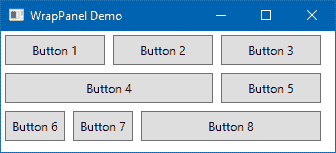

1.  调整应用程序 UI 的大小，看看按钮如何在屏幕内放置。

## 它是如何工作的...

`WrapPanel`通过在一条线上堆叠子元素来工作。一旦这一行满了，不能再添加更多元素，它就会在那里换行，并在下一行添加新元素并继续。与`UniformGrid`不同，`WrapPanel`没有固定列宽。因此，可以根据可用空间放置项目。

我们作为`WrapPanel`子元素添加的按钮控件将堆叠在第一行。当它无法在同一行容纳时，它会换行以给下一个元素留出空间。

`WrapPanel`的`Orientation`属性决定了您是想水平还是垂直堆叠它们。

## 还有更多...

在前面的示例中，我们已经看到`WrapPanel`内的项目都有它们各自的大小提及。您也可以通过设置`ItemWidth`和`ItemHeight`属性来为所有项目设置一个特定值，如下面的代码片段所示：

```cs
<WrapPanel Orientation="Vertical" 
  ItemWidth="100" ItemHeight="30"> 
    <Button Content="Button 1" Margin="4" /> 
    <Button Content="Button 2" Margin="4" /> 
    <Button Content="Button 3" Margin="4" /> 
    <Button Content="Button 4" Margin="4" /> 
    <Button Content="Button 5" Margin="4" /> 
    <Button Content="Button 6" Margin="4" /> 
</WrapPanel> 
```

在这种情况下，您不需要为每个子元素单独指定大小。当您运行前面的代码时，您将看到类似于以下输出的输出：

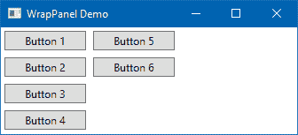

# 在堆叠中放置控件

WPF 中另一个简单且有用的布局面板是`StackPanel`。它几乎与`WrapPanel`一样工作，但有一个区别，它不能将子元素换行。所有添加到其中的项目要么水平堆叠，要么垂直堆叠。

`StackPanel`使用原生或相对大小来测量其子元素，通过按顺序布局项目来简化布局过程。

然而，当使用比例大小或自动大小的时候，`Grid`会使用复杂的子元素组合。因此，它使得`Grid`布局在测量过程和布局过程执行时速度较慢到中等。

因此，在可能的情况下，`StackPanel`比`Grid`面板更可取，以减少渲染开销。

在这个示例中，我们将通过一个非常简单的例子来学习`StackPanel`的工作原理。

## 准备工作

要开始，让我们打开 Visual Studio 并创建一个名为`CH03.StackPanelDemo`的新 WPF 应用程序项目。

## 如何实现...

在解决方案资源管理器中，导航到项目并执行以下步骤以创建包含几个按钮控件的 `StackPanel` 示例 UI：

1.  首先，打开 `MainWindow.xaml` 文件。

1.  在 `Window` 标签内，将默认的 `Grid` 替换为以下 XAML 代码：

```cs
<StackPanel> 
    <StackPanel Orientation="Horizontal"> 
        <Button Content="Button 1" Margin="4" /> 
        <Button Content="Button 2" Margin="4" /> 
        <Button Content="Button 3" Margin="4" /> 
        <Button Content="Button 4" Margin="4" /> 
    </StackPanel> 
    <StackPanel Orientation="Vertical"> 
        <Button Content="Button 5" Margin="4" /> 
        <Button Content="Button 6" Margin="4" /> 
        <Button Content="Button 7" Margin="4" /> 
        <Button Content="Button 8" Margin="4" /> 
    </StackPanel> 
</StackPanel>
```

1.  让我们构建并运行应用程序。你将看到以下输出：

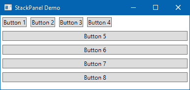

## 工作原理...

第一个 `StackPanel` 用于容纳多个内嵌 `StackPanel`，默认垂直堆叠。第一个内嵌 `StackPanel` 控件包含按钮 1 - 按钮四。这些按钮将水平堆叠，因为我们设置了面板的 `Orientation` 属性为 `Horizontal`。

第二个内嵌 `StackPanel` 包含按钮 5 - 按钮八，垂直堆叠，因为我们设置了 `Orientation` 属性为 `Vertical`。

与默认方向为 `Horizontal` 的 `WrapPanel` 不同，`StackPanel` 的默认方向设置为 `Vertical`。

## 更多...

`StackPanel` 默认拉伸其子元素，但你也可以控制其拉伸方式。在垂直方向的 `StackPanel` 中，你可以将子元素的 `HorizontalAlignment` 属性设置为 `Left`、`Center`、`Right` 或 `Stretch`，如下面的代码所示：

```cs
<StackPanel Orientation="Vertical"> 
    <Button Content="Button (Left)" Margin="4" 
            HorizontalAlignment="Left"/> 
    <Button Content="Button (Center)" Margin="4" 
            HorizontalAlignment="Center"/> 
    <Button Content="Button (Right)" Margin="4" 
            HorizontalAlignment="Right"/> 
    <Button Content="Button (Stretch)" Margin="4" 
            HorizontalAlignment="Stretch" /> 
</StackPanel> 
```

上述代码示例将给出以下输出：

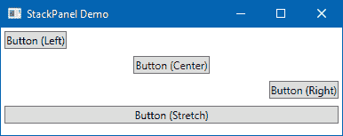

同样，你可以为放置在水平方向的 `StackPanel` 中的子元素分配 `VerticalAlignment` 属性。此属性包含以下值——`Top`、`Center`、`Bottom` 和 `Stretch`。

# 在 Canvas 中定位控件

`Canvas` 是 WPF 中的另一个简单面板，它允许你将子元素放置在相对于 `Canvas` 的特定坐标位置。它公开了四个附加属性：`Left`、`Right`、`Top` 和 `Bottom`，用于处理控件的位置。

这个示例将帮助你理解 `Canvas` 面板中子元素的位置。

## 准备中

让我们打开 Visual Studio 实例，创建一个名为 `CH03.CanvasDemo` 的新 WPF 应用程序项目。

## 如何做...

执行以下步骤以创建一个简单的 `Canvas` 面板，其中包含一些标签控件，并将它们定位到特定的坐标位置：

1.  打开解决方案资源管理器并导航到项目。

1.  打开 `MainWindow.xaml` 文件，并用以下行替换默认的 `Grid`：

```cs
<Canvas> 
    <Label Width="100" Height="60" 
           Background="GreenYellow"  
           Canvas.Left="70" Canvas.Top="40" 
           Content="(70, 40)" 
           FontSize="20" FontWeight="Bold"/> 
    <Label Width="100" Height="60" 
           Background="YellowGreen"  
           Canvas.Left="220" Canvas.Top="90" 
           Content="(220, 90)" 
           FontSize="20" FontWeight="Bold"/> 
</Canvas> 
```

1.  构建并运行应用程序。它将显示以下屏幕：


1.  现在调整窗口大小并观察标签的位置。

## 工作原理...

`Canvas.Left` 属性允许你指定子元素与 `Canvas` 左边缘的距离。`Canvas.Top` 属性允许你指定子元素与 `Canvas` 顶部的距离。

类似地，`Canvas.Right` 和 `Canvas.Bottom` 属性允许你分别指定相对于右边缘和底部的相对位置。

如前例所示，第一个标签放置在坐标位置（`70, 40`），而第二个元素放置在坐标位置（`220, 90`）。如果您调整窗口大小，子元素的位置不会改变。

需要注意的是，子元素上的垂直和水平对齐方式不起作用。此外，如果您设置了`Left`属性，则`Right`属性不起作用。同样，如果您设置了`Top`属性，则`Bottom`属性不起作用。

## 还有更多...

在一个`Canvas`面板中放置的控件的`Z`-顺序决定了该控件是在另一个重叠控件的上方还是下方。您可以使用`Canvas.ZIndex`属性来调整`Z`-顺序的位置。

默认情况下，画布上第一个元素的`ZIndex`从`0`（零）开始，并且每次您在画布上添加一个新元素时，它都会逐渐增加`1`。但在特殊情况下，当您想将一个重叠的控件置于顶部时，请将其`ZIndex`设置得高于与之重叠的最后一个元素的`ZIndex`。

# 使用 Border 包裹 UI 元素

WPF 中的`Border`控件用作`Decorator`，您可以使用它来围绕另一个控件绘制边框。由于 WPF 面板不支持在其边缘添加边框，因此使用`Border`控件来实现相同的效果。

本食谱将指导您如何为一个控件添加边框。您也可以使用相同的概念来装饰放置在面板内部的多个控件，通过将面板包裹在一个`Border`中来实现。

## 准备工作

以一个示例开始，让我们首先创建一个新的项目。打开 Visual Studio 并创建一个名为`CH03.BorderDemo`的 WPF 应用程序项目。

## 如何操作...

执行以下简单步骤以在`TextBlock`周围添加边框：

1.  打开您的 WPF 项目的`MainWindow.xaml`文件。

1.  现在将默认的`Grid`替换为`StackPanel`。

1.  在其中添加几个由 Border 包裹的 TextBlock。以下是完整的 XAML 代码：

```cs
<StackPanel Margin="10"> 
    <Border BorderBrush="OrangeRed" 
            BorderThickness="2" 
            Margin="10 4" Padding="10"> 
        <TextBlock Text="Text surrounded by border"/> 
    </Border> 
    <Border BorderBrush="OrangeRed" 
            BorderThickness="2" 
            CornerRadius="20" 
            Margin="10 4" Padding="10"> 
        <TextBlock Text="Text surrounded by border,
        having corner radius = 20"/> 
    </Border> 
    <Border BorderBrush="OrangeRed" 
            BorderThickness="2" 
            CornerRadius="5" 
            Background="Yellow" 
            Margin="10 4" Padding="10"> 
        <TextBlock Text="Text surrounded by border, 
        having a Yellow background and rounded border"  
        TextWrapping="Wrap"/> 
    </Border> 
    <Border BorderBrush="OrangeRed" 
            BorderThickness="4 0" 
            CornerRadius="5" 
            Margin="10 4" Padding="10"> 
        <TextBlock Text="Text surrounded by two-side border"/> 
    </Border> 
</StackPanel>
```

1.  让我们运行应用程序。您将看到以下输出：

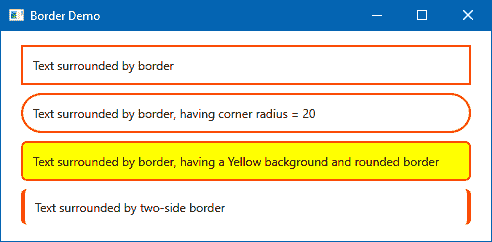

## 工作原理...

`BorderThickness`属性接受一个整数值来绘制控件周围的边框。`BorderBrush`属性为其添加颜色。您可以使用`SolidColorBrush`、`GradientColorBrush`或任何其他画笔类型。第一个`Border`控件为文本添加了一个细的`2px`边框。

在第二个示例中，`CornerRadius`属性已设置为`20`，以在`Border`控件的角落周围添加 20 度的曲线。

第三个示例有一个带有背景画笔的边框来包裹`TextBlock`控件。您可以将`BorderThickness`、`BorderBrush`和`Background`属性结合起来以实现这种外观。注意小角落半径为`5`度！

在第四个示例中，我们为文本的两边提供了一个边框。`BorderThickness` 的值可以是 `1`、`2` 或 `4` 个双精度值。四个双精度值（`BorderThickness="5, 3, 5, 4"` 或 `BorderThickness="5 3 5 4"`）按顺序描述了 `Left`、`Top`、`Right` 和 `Bottom` 边。

当你提供两个双精度值（`BorderThickness="5, 3"` 或 `BorderThickness="5 3"`）时，第一个值描述 `Left` 和 `Right`；第二个值分别描述 `Top` 和 `Bottom`。为了在所有边上提供相同厚度的厚度，只需将一个双精度值分配给属性（`BorderThickness="5"`）。

# 创建可滚动面板

`ScrollViewer` 控件在 WPF 应用程序中启用滚动功能，并帮助您托管其他控件。当有更多内容可供显示，但可视区域小于该内容时，使用 `ScrollViewer` 帮助用户滚动内容。

在本教程中，我们将学习如何在 WPF 应用程序中使用 `ScrollViewer`。

## 准备中

让我们打开 Visual Studio 并创建一个名为 `CH03.ScrollViewerDemo` 的项目。请确保基于 WPF 应用程序模板创建项目。

## 如何操作...

使用 `ScrollViewer` 包围面板或控件是一个快速步骤。执行以下步骤以向 `image` 控件添加滚动功能：

1.  在项目中添加一个名为 `demoImage.jpg` 的图片。

1.  从解决方案资源管理器打开 `MainWindow.xaml` 文件。

1.  现在将现有的 `Grid` 替换为 `ScrollViewer`。

1.  添加一个指向 `demoImage.jpg` 文件的图片，如下所示：

```cs
<ScrollViewer HorizontalScrollBarVisibility="Auto" 
              VerticalScrollBarVisibility="Auto"> 
    <Image Source="demoImage.jpg" /> 
</ScrollViewer>
```

1.  运行应用程序，您将看到以下窗口，其中包含一个位于 `ScrollViewer` 内的图片：

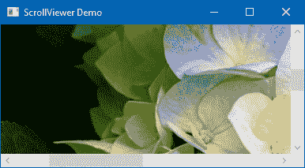

1.  使用滚动条左右和/或上下滚动以查看整个图像。

## 工作原理...

`ScrollViewer` 暴露了两个主要属性—`HorizontalScrollBarVisibility` 和 `VerticalScrollBarVisibility`。两者都代表一个名为 `ScrollBarVisibility` 的枚举，有四个值：

+   **可见**: 当属性设置为 `ScrollBarVisibility.Visible` 时，滚动条将始终可见。

+   **隐藏**: 当属性设置为 `ScrollBarVisibility.Hidden` 时，滚动条将不会在屏幕上可见，用户将无法滚动以查看完整内容。

+   **禁用**: 当设置为 `ScrollBarVisibility.Disabled` 时，滚动条将被禁用。

+   **自动**: 这通常用于仅在需要时使滚动滑块可见。为此，将属性设置为 `ScrollBarVisibility.Auto`。

# 使用 DockPanel 垂直控件

`DockPanel` 使在屏幕的左侧、右侧、顶部或底部停靠 UI 元素变得更容易。这通常很有用，尤其是在你想将窗口分成特定区域时。例如，状态栏始终保持在窗口底部，而菜单或工具栏位于窗口的最顶部。

这个菜谱将帮助您学习如何在应用程序窗口中停靠子元素。

## 准备工作

让我们从一个新的项目开始。打开 Visual Studio 并创建一个基于可用 WPF 应用程序模板的项目，命名为 `CH03.DockPanelDemo`。

## 如何操作...

执行以下步骤以添加一个带有几个标签停靠的 `DockPanel`：

1.  从解决方案资源管理器导航到项目并打开 `MainWindow.xaml`。

1.  将现有的 `Grid` 面板替换为 `DockPanel` 控件。

1.  现在向其中添加五个标签并将它们停靠在窗口的各个侧面。

1.  这里是完整的 XAML 代码供参考：

```cs
<DockPanel> 
    <Label Content="Button (DockPanel.Dock='Right')" 
           Background="YellowGreen" 
           Margin="4" Padding="4" 
           DockPanel.Dock="Right"/> 
    <Label Content="Button (DockPanel.Dock='Top')" 
           Background="GreenYellow" 
           Margin="4" Padding="4" 
           DockPanel.Dock="Top"/> 
    <Label Content="Button (DockPanel.Dock='Bottom')" 
           Background="SkyBlue" 
           Margin="4" Padding="4" 
           DockPanel.Dock="Bottom"/> 
    <Label Content="Button (DockPanel.Dock='Left')" 
           Background="Orange" 
           Margin="4" Padding="4" 
           DockPanel.Dock="Left"/> 
    <Label Content="Button (None)" 
           Background="Pink" 
           Margin="4" Padding="4"/> 
</DockPanel> 
```

1.  让我们运行应用程序。您将看到标签位于窗口的不同侧面，如下面的截图所示：

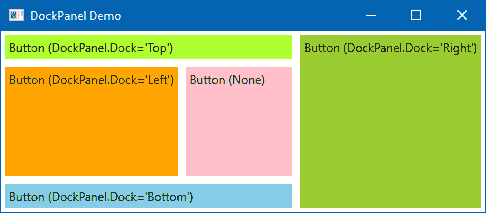

## 工作原理...

`DockPanel.Dock` 属性根据相对顺序确定元素的位置。该属性是 `Dock` 枚举类型，并接受以下值——`Dock.Left`、`Dock.Right`、`Dock.Top` 和 `Dock.Bottom`。如果您不指定该属性，则默认情况下，第一个元素将停靠在左侧，其他元素将占用剩余空间。

在前面的示例中，标签按照以下顺序添加到 `DockPanel` 中，分别具有 `DockPanel.Dock` 属性设置为 `Right`、`Top`、`Bottom` 和 `Left`。最后一个标签没有指定任何 `Dock` 属性，因此它占用剩余空间以适应其内部。

## 更多...

在 `DockPanel` 中，停靠顺序最为重要。如果您更改我们之前创建的示例的顺序，您将注意到 `DockPanel` 如何更改添加的标签的位置。

# 使用 ViewBox 缩放 UI 元素

当您构建应用程序时，您不知道应用程序将运行的系统的屏幕分辨率。如果您在设计 UI 时考虑到小或标准分辨率，则 UI 控件在高分辨率显示器上看起来会非常小。如果您反过来，考虑到大屏幕，则在低分辨率显示器上执行时，用户将看不到屏幕的部分。

因此，需要创建一个自动缩放机制，该机制将处理不同的屏幕分辨率。`ViewBox` 是 WPF 中一个非常流行的控件，它可以帮助您根据大小缩放内容以适应可用空间。当您调整父元素的大小时，它将自动转换内容以按比例缩放。

让我们通过一个简单的示例来了解它是如何工作的。

## 准备工作

打开您的 Visual Studio IDE 并创建一个名为 `CH03.ViewBoxDemo` 的新 WPF 应用程序项目。

## 如何操作...

请执行以下步骤：

1.  从解决方案资源管理器打开 `MainWindow.xaml` 文件。

1.  设置 `Window` 的较小尺寸。让我们将其高度设置为 `120`，宽度设置为 `400`。

1.  将现有的 `Grid` 面板替换为 `ViewBox`。

1.  使用以下方式在内部添加文本，使用 `TextBlock` 控件：

```cs
<Viewbox> 
    <TextBlock Text="This is a text, inside a ViewBox" 
               Margin="10"/> 
</Viewbox>
```

1.  运行应用程序。你会看到以下输出：

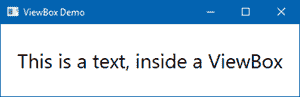

1.  现在调整窗口大小，你会看到文本会根据窗口的大小自动缩放：

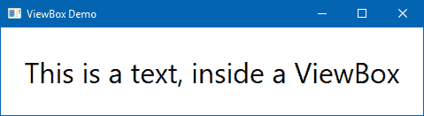

## 它是如何工作的...

`ViewBox`为你提供了一种根据屏幕分辨率自动调整窗口内容的方式。当你调整`ViewBox`大小时，它会自动调整内容的大小和相对位置，以适应屏幕。

在前面的示例中，窗口的大小设置为`400x120`。窗口有一个包含文本字符串的`TextBlock`控件，被包裹在一个`ViewBox`中。当你调整窗口大小时，内容也会通过应用缩放变换来调整大小。

但如果`ViewBox`窗口的宽高比不合适，你会在内容的左侧和右侧或顶部和底部看到空白区域。

## 还有更多...

`ViewBox`控件提供了两个属性来拉伸内容。这些是`Stretch`和`StretchDirection`。当你没有指定`ViewBox`的`Stretch`属性时，它使用`Stretch`的默认值，即`Uniform`。

当`Stretch`属性设置为`Uniform`，且`ViewBox`不匹配内容的宽高比时，它会在其顶部和底部或左侧和右侧添加白色边框。它可以是顶部和底部或左侧和右侧：

```cs
<Viewbox Stretch="Uniform"> 
    <TextBlock Text="This is a text, inside a ViewBox" 
     Margin="10"/> 
</Viewbox> 
```

当设置为`Fill`时，它会导致内容完全填充空间而不遵守宽高比。因此，你可能会在 UI 中看到扭曲：

```cs
<Viewbox Stretch="Fill"> 
    <TextBlock Text="This is a text, inside a ViewBox" 
     Margin="10"/> 
</Viewbox> 
```

当你将`Stretch`属性设置为`UniformToFill`时，它保持原始的宽高比并完全填充窗口。你不会在 UI 中看到任何扭曲：

```cs
<Viewbox Stretch="UniformToFill"> 
    <TextBlock Text="This is a text, inside a ViewBox" 
     Margin="10"/> 
</Viewbox> 
```

如果你不想调整内容的大小，将`Stretch`属性设置为`None`。当你将其设置为`None`，并调整窗口以放大时，内容不会缩放，并将保持其原始状态，周围有空白：

```cs
<Viewbox Stretch="None"> 
    <TextBlock Text="This is a text, inside a ViewBox" 
     Margin="10"/> 
</Viewbox> 
```

`ViewBox`的`StretchDirection`属性用于告诉`ViewBox`根据`Stretch`属性拉伸内容。当`Stretch`属性设置为`None`时，`StretchDirection`属性没有效果。

当`StretchDirection`设置为`UpOnly`或`DownOnly`时，内容将根据`ViewBox`的大小向上或向下调整大小。当设置为`Both`时，内容将在两个方向上调整大小。

# 创建标签布局

为了在窗口布局中容纳更多内容，通常使用标签式用户界面。它们允许用户在一个窗口中打开多个页面。例如，大多数最近的网络浏览器使用标签界面，允许用户在一个窗口中同时打开多个网页。

WPF 提供了`TabControl`来创建标签布局。在这个菜谱中，我们将学习标签界面的基础知识，通过一个简单的示例让你了解它是如何工作的。

## 准备中

要开始，请确保你已经打开了 Visual Studio IDE。现在创建一个基于可用 WPF 应用程序项目模板的新项目，命名为 `CH03.TabControlDemo`。

## 如何操作...

让我们创建 UI 接口以托管一个包含几个标签项的非常基本的标签控制。执行以下步骤：

1.  从解决方案资源管理器窗口中，打开 `MainWindow.xaml` 文件。

1.  在默认的 `Grid` 面板内，添加一个 `TabControl`，其中包含两个 `TabItem` 控件，如下面的代码所示：

```cs
<Grid> 
    <TabControl> 
        <TabItem Header="Tab 1"> 
            <TextBlock Text="You have selected 'Tab 1'" 
             FontSize="30" Margin="4"/> 
        </TabItem> 
        <TabItem Header="Tab 2"> 
            <TextBlock Text="You have selected 'Tab 2'" 
             FontSize="30" Margin="4"/> 
        </TabItem> 
    </TabControl> 
</Grid>
```

1.  现在运行此应用程序，你将看到以下 UI，其中包含两个标签页：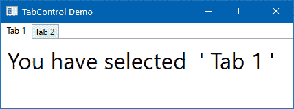

1.  关闭应用程序并返回到 XAML 编辑器，在 `TabControl` 内添加另一个 `TabItem`。让我们更改标题的模板以包含除纯文本之外的 UI 元素。在第二个标签之后复制以下 XAML：

```cs
<TabItem> 
    <TabItem.Header> 
        <StackPanel Orientation="Horizontal"> 
            <Ellipse Width="10" Height="10" 
              Fill="Green" Margin="0 1 8 0"/> 
            <TextBlock Text="Tab 3"/> 
        </StackPanel> 
    </TabItem.Header> 
    <Border Background="ForestGreen" 
            Margin="4"> 
        <TextBlock Text="You have selected 'Tab 3'" 
             FontSize="30" Foreground="White"/> 
    </Border> 
</TabItem> 
```

1.  现在再次运行应用程序，并导航到第三个标签页。你将在屏幕上看到以下 UI：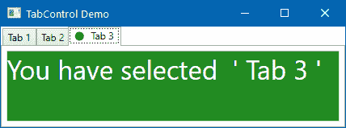

## 它是如何工作的...

`TabControl` 从 `Selector` 继承，为你提供了一个 `ItemsControl` 来托管它内部的元素。你只能托管 `TabItem` 控件，实际上它们是 `HeaderedContentControl`，为每个项目提供了一个 `Header`。

`Header` 属性是对象类型，这将允许你在其中放置任何内容，无论是纯文本还是不同的 UI 元素。

在前面的例子中，前两个 `TabItem` 控件包含作为标题的纯文本，而第三个 `TabItem` 包含许多不同的 `UIElement` 以给其标题一个定制的样式。当你从一个标签页切换到另一个标签页时，你会看到其关联的内容，你可以通过其 `Content` 属性以编程方式访问。

# 在面板中动态添加/删除元素

到目前为止，我们已经看到了如何在 `Panel` 控件中添加静态元素/内容。但这并不总是有用的，尤其是在你从后端检索数据并在 UI 中填充，或者根据用户交互动态填充时。

本食谱将讨论这个主题。由于所有面板在添加/删除元素时表现相似，只是在定位上略有不同，我们将通过一个简单的 `Canvas` 来演示。

## 准备工作

开始编码之前，让我们首先创建一个 WPF 应用程序项目。打开 Visual Studio 并创建一个名为 `CH03.DynamicPanelDemo` 的新项目。

## 如何操作...

让我们在窗口内添加一个 `Canvas` 面板，并在用户点击 `Canvas` 面板时在当前光标位置动态添加正方形。执行以下步骤：

1.  打开 `MainWindow.xaml` 页面，并将默认的 `Grid` 面板替换为 `Canvas`。

1.  给它起个名字。在我们的例子中，让我们将其命名为 `canvasPanel`。

1.  为画布面板设置背景并为其注册一个 `MouseLeftButtonDown` 事件。以下是完整的 XAML 代码，仅供参考：

```cs
<Window x:Class="CH03.DynamicPanelDemo.MainWindow" 
   xmlns=
        "http://schemas.microsoft.com/winfx/
        2006/xaml/presentation" 

        Title="Dynamic Panel Demo"  
        Height="300" Width="500"> 
    <Canvas x:Name="canvasPanel"  
            Background="LightGoldenrodYellow" 
            MouseLeftButtonDown="OnMouseLeftButtonDown"/> 
</Window> 
```

1.  现在打开其关联的代码后置文件 `MainWindow.xaml.cs` 并实现该事件。或者，你可以将光标放在事件名称上方并按 *F12* 生成事件并直接导航到它。

1.  在 `OnMouseLeftButtonDown` 事件实现内部，获取当前光标位置并将元素放置在画布上用户点击的相同位置。以下是代码实现：

```cs
private void OnMouseLeftButtonDown(object sender,  
 MouseButtonEventArgs e) 
{ 
    var mousePosition = e.GetPosition(canvasPanel); 
    var square = new Rectangle 
    { 
        Width = 50, 
        Height = 50, 
        Fill = new SolidColorBrush(Colors.Green), 
        Opacity = new Random().NextDouble() 
    }; 

    // set the position of the element 
    Canvas.SetLeft(square,  
     mousePosition.X - square.Width / 2); 
    Canvas.SetTop(square,  
     mousePosition.Y - square.Height / 2); 

    // add the element on the Canvas 
    canvasPanel.Children.Add(square); 
} 
```

1.  让我们运行应用程序。你会看到一个空白窗口，其背景颜色与我们在 `Canvas` 上设置的相同。

1.  随机点击 `Canvas` 区域，你会在屏幕上看到正方形弹出，位置与你左键点击 `Canvas` 的位置相同。UI 将如下所示：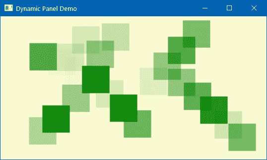

1.  要从正方形中删除元素，让我们在 XAML 中的 `Canvas` 面板中注册一个 `MouseRightButtonDown` 事件。关闭正在运行的应用程序，并将 `MainWindow.xaml` 页面的全部内容替换为以下内容：

```cs
<Window x:Class="CH03.DynamicPanelDemo.MainWindow" 
  xmlns=
   "http://schemas.microsoft.com/winfx/2006/xaml/presentation" 

    Title="Dynamic Panel Demo"  
    Height="300" Width="500"> 
    <Canvas x:Name="canvasPanel"  
            Background="LightGoldenrodYellow" 
            MouseLeftButtonDown="OnMouseLeftButtonDown" 
            MouseRightButtonDown="OnMouseRightButtonDown"/> 
</Window> 
```

1.  现在导航到 `MainWindow.xaml.cs` 文件以添加相关事件实现。在类内部添加以下代码片段：

```cs
private void OnMouseRightButtonDown(object sender,  
 MouseButtonEventArgs e) 
{ 
    if (e.Source is UIElement square) 
    { 
        canvasPanel.Children.Remove(square); 
    } 
} 
```

1.  再次运行应用程序，并在 `Canvas` 内随机点击以添加正方形。

1.  一旦正方形放置到位，右键点击它们以查看被点击的正方形从面板中消失。

## 它是如何工作的...

每个面板都暴露一个名为 `Children` 的属性，用于存储 `UIElement` 集合作为 `UIElementCollection`。要动态地向 `UIElementCollection` 添加一个元素，请使用其 `Add` 方法；要删除一个元素，请将其传递给其 `Remove` 方法。

在前面的示例中，当用户在 `Canvas` 上左键点击时，`e.GetPosition` 方法提供了相对于点击面板的点击坐标位置（`X`、`Y`）。`Canvas.SetLeft` 和 `Canvas.SetTop` 方法用于将创建的元素相对于面板定位，然后将其添加到面板中。

同样，要删除面板中的元素，请使用 `e.Source` 属性来检索用户右键点击的元素。如果它不是 `null`，则通过调用 `Remove` 方法将其从 `Canvas` 中删除。

## 更多...

坐标位置用于在 `Canvas` 面板中放置元素。当你想要在 `Grid` 中放置一个项目时，放置它时设置 `Row` 和 `Column`。对于 `StackPanel`、`WrapPanel` 和 `UniformGrid` 面板，你不需要指定任何其他属性，因为它们将自动堆叠。

以下示例展示了如何在 `Grid` 中动态添加一个元素，在由 `Row` 和 `Column` 索引指定的特定单元格位置：

```cs
// set the Row and Column to place the element 
Grid.SetRow(element, rowIndex); 
Grid.SetColumn(element, columnIndex); 

// add the element to the Grid 
gridPanel.Children.Add(element); 
```

如果你想要将元素跨越多行和多列，你可以通过调用 `Grid.SetRowSpan` 和 `Grid.SetColumnSpan` 方法来实现，如下面的代码所示：

```cs
Grid.SetRowSpan(element, noOfRowsToSpan); 
Grid.SetColumnSpan(element, noOfColumnsToSpan); 
```

# 实现拖放功能

当你想为用户提供丰富的体验时，你可能想使用拖拽和放置功能。你也许还希望在应用程序中添加拖拽功能以访问本地资源并将其上传到服务器。

在本教程中，我们将通过一个简单的示例学习 WPF 中拖拽实现的 basics。

## 准备工作

打开 Visual Studio 并创建一个名为 `CH03.DragAndDropDemo` 的新 WPF 应用程序。

## 如何实现...

让我们执行以下步骤，在窗口内创建一些元素，并从其中一个面板拖拽到另一个面板：

1.  首先，打开 `MainWindow.xaml` 并将现有的 `Grid` 替换为 `StackPanel`。设置其 `Orientation` 属性为 `Horizontal`。

1.  在其中添加两个 `WrapPanel` 并设置它们的 `Width`、`Margin`、`ItemHeight` 和 `ItemWidth` 属性。

1.  给这两个面板起个名字。让我们将第一个 wrap panel 命名为 `sourcePanel`，第二个 wrap panel 命名为 `targetPanel`。我们将在代码中使用这些名称来访问它们。

1.  在第一个 wrap panel 中添加一些标签。设置它们的 `Content`、`Background` 和其他文本格式化属性。以下是完整的标记代码：

```cs
<StackPanel Orientation="Horizontal"> 
    <WrapPanel x:Name="sourcePanel" 
               ItemHeight="60" ItemWidth="100" 
               Width="200" Margin="4" 
               Background="LightGoldenrodYellow"> 
        <Label Content="Item 1" 
               Background="Olive" Margin="4" 
               Foreground="White" FontSize="22" /> 
        <Label Content="Item 2" 
               Background="Olive" Margin="4" 
               Foreground="White" FontSize="22" /> 
        <Label Content="Item 3" 
               Background="Olive" Margin="4" 
               Foreground="White" FontSize="22" /> 
        <Label Content="Item 4" 
               Background="Olive" Margin="4" 
               Foreground="White" FontSize="22" /> 
        <Label Content="Item 5" 
               Background="Olive" Margin="4" 
               Foreground="White" FontSize="22" /> 
    </WrapPanel> 
    <WrapPanel x:Name="targetPanel" 
               ItemHeight="60" ItemWidth="100" 
               Width="200" Margin="4" 
               Background="OldLace"> 
    </WrapPanel> 
</StackPanel>
```

1.  如果你运行此应用程序，你将在屏幕上看到两个面板。如下面的截图所示，其中一个面板将包含五个标签（项目 1 - 项目 5），另一个将为空：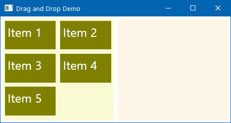

如果你现在从左侧面板拖拽任何元素并尝试将其放置到右侧面板，你会发现它不起作用。我们还没有添加拖拽支持。

1.  要将拖拽支持添加到第一个 wrap panel (`sourcePanel`)，在 XAML 中注册其 `MouseLeftButtonDown` 事件属性，如下所示：

```cs
<WrapPanel x:Name="sourcePanel" 
           ItemHeight="60" ItemWidth="100" 
           Width="200" Margin="4" 
           Background="LightGoldenrodYellow" 
           MouseLeftButtonDown="OnDrag"> 
```

1.  在 XAML 中注册的 `OnDrag` 事件需要在文件的代码后端实现。打开 `MainWindow.xaml.cs` 并添加以下事件实现，这将向 `sourcePanel` 添加拖拽支持：

```cs
private void OnDrag(object sender, MouseButtonEventArgs e) 
{ 
    if (e.Source is UIElement draggedItem) 
    { 
        DragDrop.DoDragDrop(draggedItem,  
                            draggedItem,  
                            DragDropEffects.Move); 
    } 
}
```

1.  现在我们需要启用第二个 wrap panel (`targetPanel`) 作为可放置的目标，并将其 `AllowDrop` 属性设置为 `True`。

1.  同时注册其 `Drop` 事件属性，以便我们可以执行 `drop` 操作。以下是第二个面板的完整标记：

```cs
<WrapPanel x:Name="targetPanel" 
            ItemHeight="60" ItemWidth="100" 
            Width="200" Margin="4" 
            Background="OldLace" 
            AllowDrop="True" 
            Drop="OnDrop"> 
    <!-- This is the DROP Target --> 
</WrapPanel> 
```

1.  现在我们需要实现 `OnDrop` 事件体以执行所需的 `drop` 操作。再次导航到 `MainWindow.xaml.cs` 并添加以下代码：

```cs
private void OnDrop(object sender, DragEventArgs e) 
{ 
    var draggedData = e.Data; 
    if (draggedData.GetData(draggedData.GetFormats()[0]) 
                            is UIElement droppedItem) 
    { 
        sourcePanel.Children.Remove(droppedItem); 
        targetPanel.Children.Add(droppedItem); 
    } 
} 
```

1.  现在我们运行应用程序。屏幕上会出现相同的界面，有两个面板。第一个面板（左侧）将包含一些元素。将光标置于其中一个元素上，点击它将其拖拽到另一个面板（右侧），并在那里释放。你会看到该元素将从第一个面板移除并添加到右侧面板，如下面的截图所示：

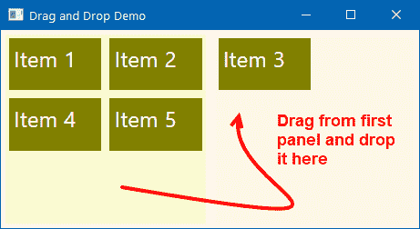

## 工作原理...

`AllowDrop="True"`属性将面板准备为启用拖放。当您通过点击元素开始拖动时，`OnDrag`事件中编写的`DragDrop.DoDragDrop`方法将启动拖放操作。它将第一个参数作为依赖对象的引用，即正在拖动的数据源。第二个参数是包含正在拖动数据的对象。最后一个参数是一个值，用于指定操作的最终效果（`DragDropEffects`）。

在前面的示例中，当元素被拖放到目标时，从`DragEventArgs`参数值检索到的拖动数据首先从源中移除，然后添加到目标。

## 还有更多...

根据您的拖放需求，您可以通过指定`DragDropEffects`枚举值的正确值来更改效果。效果可以分为六种类型：

+   **无**: 当指定时，目标将不接受任何数据，光标将变为不可用图标

+   **复制**: 当指定时，数据将被复制到目标，并且在目标上的`drop`操作期间，光标将看起来如下所示：

    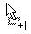

+   **移动**: 当指定时，源数据将被移动到目标。在`drop`操作期间，光标将变为以下样式：

    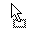

+   **链接**: 当指定时，源数据将与目标链接。在目标上的`drop`操作期间，光标将变为以下样式：

    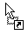

+   **滚动**: 当指定时，它定义了滚动是否即将在目标元素上开始或当前正在发生。

+   **全部**: 当指定时，数据在从源移除后将被复制并滚动到目标。
