与数据绑定一起工作

在本章中，我们将介绍以下食谱：

+   与 CLR 属性和 UI 通知一起工作

+   与依赖属性一起工作

+   与附加属性一起工作

+   将数据绑定到对象

+   将数据绑定到集合

+   元素到元素的数据绑定

+   在 `DataGrid` 控件中排序数据

+   在 `DataGrid` 控件中分组数据

+   在 `DataGrid` 控件中过滤数据

+   使用静态绑定

+   使用值转换器

+   使用多值转换器

# 简介

**数据绑定** 是一种在应用程序的 UI 和业务逻辑之间建立连接的技术，以便在它们之间实现适当的数据同步。虽然您可以直接从代码后端访问 UI 控件以更新其内容，但数据绑定由于其自动通知系统已成为更新 UI 层的首选方式。

要使数据绑定在 WPF 应用程序中工作，绑定双方都必须向对方提供更改通知。数据绑定的源属性可以是 .NET CLR 属性或依赖属性，但目标属性必须是依赖属性，如下所示：

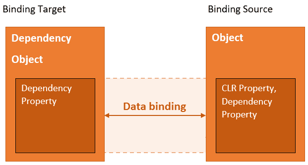

数据绑定通常在 XAML 中使用 `{Binding}` 标记扩展来完成。在本章中，我们将通过探索一些食谱来了解更多关于 WPF 数据绑定机制的信息。

# 与 CLR 属性和 UI 通知一起工作

CLR 属性只是围绕私有变量的包装，以暴露获取器和设置器来检索和分配变量的值。您可以在数据绑定中使用这些常规 CLR 属性，但默认情况下无法自动进行 UI 通知，除非您创建通知机制。

在本食谱中，我们将学习如何使用 CLR 属性进行数据绑定，然后学习如何从代码中触发通知以在值更改时自动更新 UI。

## 准备工作

要开始使用常规 CLR 属性进行数据绑定，请打开您的 Visual Studio IDE 并创建一个名为 `CH04.NotificationPropertiesDemo` 的新 WPF 应用程序项目。

## 如何做到这一点...

执行以下步骤以创建向 UI 发送通知的 CLR 属性：

1.  打开 `MainWindow.xaml` 文件并给窗口一个名字。例如，通过在 `Window` 标签中添加以下语法来命名当前窗口 `window`：`x:Name="window"`。

1.  现在将默认的 `Grid` 划分为几行和几列。将以下 XAML 标记复制到您的 `Grid` 面板中：

```cs
<Grid.ColumnDefinitions> 
    <ColumnDefinition Width="Auto"/> 
    <ColumnDefinition Width="15"/> 
    <ColumnDefinition Width="*"/> 
</Grid.ColumnDefinitions> 
<Grid.RowDefinitions> 
    <RowDefinition Height="Auto"/> 
    <RowDefinition Height="Auto"/> 
    <RowDefinition Height="10"/> 
    <RowDefinition Height="Auto"/> 
</Grid.RowDefinitions> 
```

1.  一旦网格被划分为行和列，让我们在它里面添加一些文本和按钮控件。将这些控件放置在适当的单元格中，如下面的代码所示：

```cs
<!-- Row 0 --> 
<TextBlock Text="Your department" 
           Grid.Row="0" Grid.Column="0"/> 
<TextBlock Text=":" 
           Grid.Row="0" Grid.Column="1" 
           HorizontalAlignment="Center"/> 
<TextBlock Text="{Binding Department, ElementName=window}" 
           Margin="0 2" 
           Grid.Row="0" Grid.Column="2"/> 

<!-- Row 1 --> 
<TextBlock Text="Your name" 
           Grid.Row="1" Grid.Column="0"/> 
<TextBlock Text=":" 
           Grid.Row="1" Grid.Column="1" 
           HorizontalAlignment="Center"/> 
<TextBox Text="{Binding PersonName, ElementName=window, Mode=TwoWay}" 
         Margin="0 2" 
         Grid.Row="1" Grid.Column="2"/> 

<!-- Row 3 --> 
<StackPanel Orientation="Horizontal" 
            HorizontalAlignment="Center" 
            Grid.Row="3" Grid.Column="0" 
            Grid.ColumnSpan="3"> 
    <Button Content="Submit" 
            Margin="4" Width="80" 
            Click="OnSubmit"/> 
    <Button Content="Reset" 
            Margin="4" Width="80" 
            Click="OnReset"/> 
</StackPanel> 
```

1.  现在打开 `MainWindow.xaml.cs` 文件背后的代码，并在其中添加两个名为 `Department` 和 `PersonName` 的 CLR 属性。第一个属性（`Department`）始终返回一个常量字符串，而第二个属性（`PersonName`）可以接受用户的值。以下是完整的代码：

```cs
public string Department { get { return "Software Engineering"; } } 

private string personName; 
public string PersonName 
{ 
    get { return personName; } 
    set { personName = value; } 
} 
```

1.  在代码后置类中添加以下事件实现：

```cs
private void OnSubmit(object sender, RoutedEventArgs e) 
{ 
    MessageBox.Show("Hello " + PersonName); 
} 

private void OnReset(object sender, RoutedEventArgs e) 
{ 
    PersonName = string.Empty; 
}
```

1.  现在构建并运行应用程序。如图所示，在 `TextBox` 中输入你的名字并点击提交按钮。系统会向用户显示一个包含输入名字的消息：

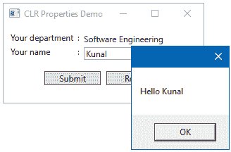

1.  现在，点击重置按钮并观察行为。尽管代码已经编写为使用空字符串设置属性，但 UI 没有被修改：


1.  要在关联属性发生变化时向 UI 发送通知，你需要实现 `System.ComponentModel` 命名空间中存在的 `INotifyPropertyChanged` 接口。打开 `MainWindow.xaml.cs` 文件，并添加如下定义的 `INotifyPropertyChanged` 接口：

```cs
public partial class MainWindow : Window, INotifyPropertyChanged
```

1.  你需要添加以下 `using` 命名空间声明来解决构建问题：

```cs
using System.ComponentModel; 
```

1.  在类内部添加以下 `PropertyChanged` 事件实现：

```cs
public event PropertyChangedEventHandler PropertyChanged; 
public void OnPropertyChanged(string propertyName) 
{ 
    //in C# 7.0 and above 
    PropertyChanged?.Invoke(this, new PropertyChangedEventArgs(propertyName)); 

    //prior to C# 7.0 
    //var handler = PropertyChanged; 
    //if (handler != null) 
    //{ 
    //    handler(this, new PropertyChangedEventArgs(propertyName)); 
    //} 
} 
```

1.  现在通知框架在属性值发生变化时更新 UI。修改现有的 `PersonName` 属性实现，以调用 `OnPropertyChanged` 事件，并按如下方式传递属性名：

```cs
private string personName; 
public string PersonName 
{ 
    get { return personName; } 
    set  
    {  
          personName = value;  
          OnPropertyChanged("PersonName");  
    } 
} 
```

如果你使用的是 C# 6 及以上版本，你可以通过使用 `nameof` 运算符来移除硬编码的字符串。

1.  再次构建并运行应用程序。在输入框中输入你的名字并点击提交按钮。你会看到一个消息框，其中提到了输入的名字。

1.  关闭消息框并点击重置按钮。你会看到 `TextBox` 中的文本被初始化为空字符串：


## 它是如何工作的...

在前面的示例中，`Department` 属性与 `TextBlock` 控件进行了数据绑定，因此相关的 `TextBlock` 显示了属性返回的文本。同样，`PersonName` 属性与 `TextBox` 控件进行了数据绑定。由于数据绑定已设置为 `TextBlock` 的 `Text` 属性（使用 `TwoWay` 模式），当用户在 UI 中更改它时，它会自动更新相关的属性。

因此，当你点击提交按钮时，`OnSubmit` 事件被触发，并且它直接读取 `PersonName` 属性，而不是通过访问 `TextBox` 控件的 `Text` 属性从 UI 中获取文本。

当你点击重置按钮时，`OnReset` 事件被触发，并将 `PersonName` 属性设置为空字符串。但是 UI 没有改变。这是因为 CLR 属性没有在值发生变化时自动更新 UI 的通知机制。

为了克服这一点，WPF 使用 `INotifyPropertyChanged` 接口，该接口定义了一个 `PropertyChanged` 事件，以自动将 UI 通知推送到 UI 线程以更新元素。在示例中，当你设置 `PersonName` 属性时，`OnPropertyChanged` 事件从属性 `setter` 触发，并通知 UI `PersonName` 已被修改。然后 UI 根据属性值设置值。

## 更多内容...

数据绑定可以是单向的（源 > 目标或目标 > 源）或双向的（源 < > 目标），称为 **模式**，并定义在四个类别中：

+   **一次性**: 这种类型的数据绑定模式会导致源属性初始化目标属性。绑定生成后，不会触发任何通知。你应该在源数据不发生变化的地方使用这种类型的数据绑定。

+   **单向**: 这种类型的绑定会导致源属性自动更新目标属性。这里不可能反向操作。例如，如果你想在 UI 中根据代码后端或业务逻辑中的某些条件显示标签/文本，你需要使用 `单向` 数据绑定，因为你不需要从 UI 更新属性。

+   **双向**: 这种类型的绑定是双向数据绑定，其中源属性和目标属性都可以发送更新通知。这适用于用户可以更改 UI 中显示的值的可编辑表单。例如，`TextBox` 控件的 `Text` 属性支持这种类型的数据绑定。

+   **单向到源**: 这是另一种单向数据绑定，它会导致目标属性更新源属性（`单向`绑定的反向）。在这里，UI 向上下文发送通知，如果上下文发生变化则不会生成通知。

这里有一个简单的图解，描述了各种数据绑定模式的工作原理：

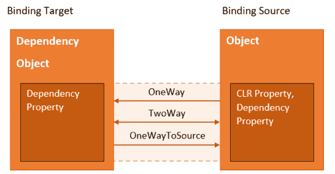

# 与依赖属性一起工作

WPF 提供了一组服务，可用于扩展 CLR 属性以提供额外的优势，例如在生态系统中提供自动 UI 通知。要实现依赖属性，类必须继承自 `DependencyObject` 类。

CLR 属性直接从类的私有成员读取，而依赖属性存储在基类提供的键值字典中。由于依赖属性仅在属性更改时存储属性，因此它使用的内存较少，访问速度更快。

要在 `.cs` 文件中轻松创建依赖属性，请使用 `propdp` 代码片段。在继承自 `DependencyObject` 的任何类文件中，输入 `propdp` 后跟 *TAB* 键以生成其结构。使用 *TAB* 键进行导航，并更改类型、名称、所有者和元数据详细信息。

在本食谱中，我们将学习如何使用依赖属性来自动通知 UI 属性值已更改，从而减少从`INotifyPropertyChanged`接口定义`PropertyChanged`事件的负担。

## 准备工作

让我们打开 Visual Studio IDE 并创建一个名为`CH04.DependencyPropertyDemo`的项目。确保您已选择 WPF 应用程序类型作为项目模板。我们将使用我们在上一个食谱中创建的相同示例。

## 如何操作...

执行以下步骤以创建依赖属性，将其绑定到 UI，并从代码中发送通知：

1.  从解决方案资源管理器中，打开`MainWindow.xaml`页面，并使用我们在上一个示例中使用的相同 UI 设计。复制以下 XAML 标记，并将其替换为`MainWindow.xaml`文件的内容：

```cs
<Window x:Class="CH04.DependencyPropertyDemo.MainWindow" 

        x:Name="window" 
        Title="Dependency Properties Demo" Height="150"  
        Width="300"> 
    <Grid Margin="10"> 
        <Grid.ColumnDefinitions> 
            <ColumnDefinition Width="Auto"/> 
            <ColumnDefinition Width="15"/> 
            <ColumnDefinition Width="*"/> 
        </Grid.ColumnDefinitions> 
        <Grid.RowDefinitions> 
            <RowDefinition Height="Auto"/> 
            <RowDefinition Height="Auto"/> 
            <RowDefinition Height="10"/> 
            <RowDefinition Height="Auto"/> 
        </Grid.RowDefinitions> 

        <!-- Row 0 --> 
        <TextBlock Text="Your department" 
                   Grid.Row="0" Grid.Column="0"/> 
        <TextBlock Text=":" 
                   Grid.Row="0" Grid.Column="1" 
                   HorizontalAlignment="Center"/> 
        <TextBlock Text="{Binding Department,  
                          ElementName=window}" 
                   Margin="0 2" 
                   Grid.Row="0" Grid.Column="2"/> 

        <!-- Row 1 --> 
        <TextBlock Text="Your name" 
                   Grid.Row="1" Grid.Column="0"/> 
        <TextBlock Text=":" 
                   Grid.Row="1" Grid.Column="1" 
                   HorizontalAlignment="Center"/> 
        <TextBox Text="{Binding PersonName,  
                        ElementName=window, Mode=TwoWay}" 
                 Margin="0 2" 
                 Grid.Row="1" Grid.Column="2"/> 

        <!-- Row 3 --> 
        <StackPanel Orientation="Horizontal" 
                    HorizontalAlignment="Center" 
                    Grid.Row="3" Grid.Column="0" 
                    Grid.ColumnSpan="3"> 
            <Button Content="Submit" 
                    Margin="4" Width="80" 
                    Click="OnSubmit"/> 
            <Button Content="Reset" 
                    Margin="4" Width="80" 
                    Click="OnReset"/> 
        </StackPanel> 
    </Grid> 
</Window> 
```

1.  现在打开代码隐藏文件，并在类内部添加以下 CLR 属性。由于这里的值始终是常量，我们不需要将其作为依赖属性：

```cs
public string Department  
{  
    get { return "Software Engineering"; }  
} 
```

1.  现在，在类内部，输入`propdp`并按*TAB*键两次。这将创建属性系统的结构。默认情况下，`int`将被突出显示。将其替换为`string`。

1.  再次按*TAB*键，将属性名称从`MyProperty`重命名为`PersonName`。

1.  再次按*TAB*键将焦点移至`Register`方法的`ownerclass`名称参数。将其重命名为拥有者的类名。在我们的情况下，它是`MainWindow`。

1.  再次按*TAB*键将焦点移至属性元数据。在这里，您可以设置属性的默认值。默认情况下，选择`0`（零）。将其更改为`string.Empty`。这是我们的依赖属性`PersonName`的完整实现：

```cs
public string PersonName 
{ 
    get { return (string)GetValue(PersonNameProperty); } 
    set { SetValue(PersonNameProperty, value); } 
} 

public static readonly DependencyProperty PersonNameProperty = 
    DependencyProperty.Register("PersonName",  
          typeof(string), typeof(MainWindow),  
          new PropertyMetadata(string.Empty)); 
```

1.  让我们在`MainWindow`类内部添加以下事件实现，用于提交和重置按钮：

```cs
private void OnSubmit(object sender, RoutedEventArgs e) 
{ 
    MessageBox.Show("Hello " + PersonName); 
} 

private void OnReset(object sender, RoutedEventArgs e) 
{ 
    PersonName = string.Empty; 
} 
```

1.  由于代码已更改，让我们构建并运行应用程序。您将在屏幕上看到应用程序窗口弹出。在提供的输入框中输入一个名称，然后点击提交。将显示消息框，包括输入的文本：

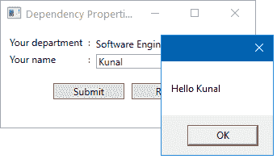

1.  点击重置按钮。这将清除输入框（`TextBox`控件）内的文本：


## 它是如何工作的...

在依赖属性中，获取器和设置器的工作方式不同。而不是从其私有字段（`CLR`属性）返回或设置值，依赖属性从其基类`DependencyObject`调用`GetValue(DependencyProperty)`或`SetValue(DependencyProperty, value)`。在我们的示例中，依赖属性的名称是`PersonNameProperty`。

`DependencyProperty`类的静态`Register`方法接受一些参数来创建`依赖`属性。它接受的第一个参数是属性的`实际名称`。第二个参数是属性的`类型`，第三个是`所有者类型`，基本上是`依赖`属性将要创建的类名。它接受的下一个参数是元数据信息，您可以在其中分配属性的默认值。以下是完整的代码：

```cs
public static readonly DependencyProperty PersonNameProperty = 
    DependencyProperty.Register("PersonName",  
                       typeof(string),  
                       typeof(MainWindow),  
                       new PropertyMetadata(string.Empty)); 
```

当您从 XAML 设置值时，通过提供与属性的绑定，它设置您可以从可访问位置选择的值。同样，当您从代码设置值时，它会自动通知 UI 已进行更改，并在 UI 中执行相同的更改。因此，它减少了实现`INotifyPropertyChanged`接口及其关联的`PropertyChanged`事件的开销。

## 更多内容...

`Register`方法的属性元数据可以接受一到三个参数。第一个是我们在前面看到的默认值。第二个是`PropertyChangedCallback`，当属性的值有效值更改时，属性系统会调用它。第三个是`CoerceValueCallback`，当属性系统对属性调用`System.Windows.DependencyObject.CoerceValue`方法时，会调用它。

大多数情况下，属性元数据使用一到两个参数创建，定义默认值和属性更改回调。让我们通过一个示例来学习如何编写它：

```cs
public string PersonName 
{ 
    get { return (string)GetValue(PersonNameProperty); } 
    set { SetValue(PersonNameProperty, value); } 
} 

public static readonly DependencyProperty PersonNameProperty = 
    DependencyProperty.Register("PersonName", typeof(string),   
    typeof(MainWindow), new PropertyMetadata(string.Empty,   
    OnPropertyChangedCallback)); 

private static void OnPropertyChangedCallback(DependencyObject d, DependencyPropertyChangedEventArgs e) 
{ 

} 
```

在这里，每当您更改属性的值时，都会触发`OnPropertyChangedCallback`事件。您可以根据事件触发进一步采取行动。您还可以通过访问`DependencyObject` "`d`"从回调事件中调用其他非静态成员。

您还可以在提交给属性系统之前验证依赖属性。`Register`方法的第五个参数接受一个委托，称为`ValidateValueCallback`。您可以实现它来验证`依赖`属性的有效值。如果值已正确验证，它将返回`true`；如果没有，它将被视为无效并返回`false`。

# 与附加属性一起工作

附加属性是一种`依赖`属性，旨在用作全局属性类型，并且可以在任何对象上设置。它没有传统的属性包装器，但仍可用于接收值更改的通知。与依赖属性不同，附加属性不是定义在它们被使用的同一类中。

使用附加属性的主要目的是允许不同的子元素指定父元素中定义的属性的唯一值。例如，您可以在 `Grid` 面板的任何子元素中使用 `Grid.Row`、`Grid.Column`。同样，`Canvas.Left`、`Canvas.Top` 附加属性用于 `Canvas` 面板的任何子元素。

在本食谱中，我们将学习如何创建一个 `Attached` 属性，并从不同的类中执行操作。

## 准备工作

首先，创建一个名为 `CH04.AttachedPropertyDemo` 的新项目，基于 WPF 应用程序项目类型。

## 如何操作...

现在，执行以下步骤以创建名为 `SelectOnFocus` 的 `Attached` 属性，并将其应用于 `TextBox` 控件，当启用时，将使用 *TAB* 键在焦点改变时选择文本：

1.  打开解决方案资源管理器，右键单击项目，然后通过以下步骤添加一个新类：在“添加”菜单中选择“类...”。给这个类命名为 `TextBoxExtensions`。

1.  打开 `TextBoxExtensions.cs` 文件，并在类文件中添加以下 `using` 命名空间：

```cs
using System.Windows; 
using System.Windows.Controls; 
```

1.  在类体内部，输入 `propa` 并按 *TAB* 键两次。这将创建附加依赖属性的架构，并将键盘焦点移动到 `property` 类型，默认为 `int`。将其更改为 `bool`。

1.  再次按 *TAB* 键选择 `MyProperty` 并将其重命名为 `SelectOnFocus`。

1.  再次按 *TAB* 键选择 `ownerclass` 并将其更改为 `TextBoxExtensions`。

1.  按 *TAB* 键设置属性元数据。将默认值设置为 `false`。将 `PropertyChangedCallback` 参数设置为 `OnSelectOnFocusChanged`。以下是完整的代码，包括回调事件：

```cs
public static bool GetSelectOnFocus(DependencyObject obj) 
{ 
    return (bool)obj.GetValue(SelectOnFocusProperty); 
} 

public static void SetSelectOnFocus(DependencyObject obj,  
 bool value) 
{ 
    obj.SetValue(SelectOnFocusProperty, value); 
} 

public static readonly DependencyProperty SelectOnFocusProperty
     = DependencyProperty.RegisterAttached("SelectOnFocus",  
       typeof(bool),  
       typeof(TextBoxExtensions),  
       new PropertyMetadata(false, OnSelectOnFocusChanged)); 

private static void OnSelectOnFocusChanged(DependencyObject d, DependencyPropertyChangedEventArgs e) 
{ 
    if (d is TextBox textBox) 
    { 
        textBox.GotFocus += (s, arg) => 
        { 
            textBox.SelectAll(); 
        }; 
    } 
} 
```

1.  现在打开 `MainWindow.xaml` 文件，将现有的 XAML 内容替换为以下内容：

```cs
<Window x:Class="CH04.AttachedPropertyDemo.MainWindow" 

        Title="Attached Property Demo"  
        Height="150" Width="340"> 
    <StackPanel Margin="15"> 
        <TextBox Text="Normal TextBox Control" 
                 Width="200" Height="30" 
                 Margin="4"/> 
        <TextBox Text="Select On Focus: Enabled" 
                 extensions:TextBoxExtensions.SelectOnFocus="True" 
                 Width="200" Height="30" 
                 Margin="4"/> 
    </StackPanel> 
</Window> 
```

1.  现在，构建并运行应用程序。

1.  专注于第一个文本框。默认情况下，它不会有任何选择。按 *TAB* 键将焦点移动到第二个文本框。文本框的全部文本将被突出显示。再次按 *TAB* 键将焦点移回第一个文本框。由于所提到的附加属性仅添加到第二个文本框，因此不会进行选择。

## 它是如何工作的...

通过调用 `DependencyProperty.Register` 方法注册依赖属性，而通过调用 `DependencyProperty.RegisterAttached` 方法注册附加属性。它接受四个参数——属性的真正名称、属性类型、所有者类型和属性元数据。

当您将属性设置为控件时，作为一个附加属性（在我们的例子中为 `extensions:TextBoxExtensions.SelectOnFocus="True"`），在 XAML 中，它将在实例加载期间将其注册到 WPF 属性系统，并触发在 `RegisterAttached` 方法中定义的 `PropertyChangedCallback`。在上面的例子中，将调用 `OnSelectOnFocusChanged` 事件，它将在关联的 `TextBox` 控件上注册 `GotFocus` 事件以执行文本选择。

与特定的控件如 `TextBox` 不同，您可以使用 `UIElement` 来泛化关联。这样，您可以通过在 XAML 中注册附加属性将其应用于任何控件。

# 对象数据绑定

到目前为止，我们已经学习了如何使用 `INotifyPropertyChanged` 接口创建 CLR 属性；我们还了解了一个具有简单数据类型的依赖属性。有许多情况下，您需要将某个类/模型的对象绑定到 UI 并显示其关联的属性。

在本食谱中，我们将学习如何进行对象数据绑定，以向用户展示和检索信息。

## 准备工作

让我们打开 Visual Studio 实例，创建一个名为 `CH04.ObjectBindingDemo` 的新项目。确保您选择了正确的 WPF 应用程序项目类型。

## 如何实现...

执行以下步骤以创建模型和依赖属性，并将数据绑定到 UI 控件，以便当底层数据发生变化时，它自动反映在 UI 中：

1.  首先，我们需要创建一个数据模型。从解决方案资源管理器中，右键单击项目并导航到菜单项添加 | 类... 创建一个名为 `Person.cs` 的类文件。

1.  将 `Person` 类的内容替换为以下三个属性：

```cs
public class Person 
{ 
    public string Name { get; set; } 
    public string Blog { get; set; } 
    public int Experience { get; set; } 
} 
```

1.  再次转到解决方案资源管理器，双击打开 `MainWindow.xaml.cs` 文件。创建一个名为 `PersonDetails` 的依赖属性，并将其数据类型设置为 `Person`。同时，将其默认值设置为 `null`，如下所示：

```cs
public Person PersonDetails 
{ 
    get { return (Person)GetValue(PersonDetailsProperty); } 
    set { SetValue(PersonDetailsProperty, value); } 
} 

public static readonly DependencyProperty PersonDetailsProperty =
```

```cs
    DependencyProperty.Register("PersonDetails",  
                       typeof(Person),  
                       typeof(MainWindow),  
                       new PropertyMetadata(null)); 
```

1.  在 `InitializeComponent()` 方法调用之后，在 `MainWindow` 类的构造函数内部，初始化 `PersonDetails` 属性并将其设置为所选类的 `DataContext`，如下所示：

```cs
PersonDetails = new Person 
{ 
    Name = "Kunal Chowdhury", 
    Blog = "http://www.kunal-chowdhury.com", 
    Experience = 10 
}; 

DataContext = PersonDetails; 
```

1.  现在，后端代码已经准备好了，让我们打开 `MainWindow.xaml` 文件来设计 UI 并使用我们的模型进行数据绑定。

1.  将现有的 `Grid` 面板替换为以下 XAML 标记：

```cs
<StackPanel Margin="10"> 
    <TextBlock Margin="0 0 0 20" 
               TextWrapping="Wrap"> 
        <Run Text="{Binding Name}"/> blogs at <Hyperlink NavigateUri="{Binding Blog}"><Run Text="{Binding Blog}"/></Hyperlink>, and has <Run Text="{Binding Experience}"/> years of experience. 
    </TextBlock> 
    <StackPanel Orientation="Horizontal"> 
        <TextBlock Text="Enter years of experience:"/> 
        <TextBox Text="{Binding Experience, Mode=TwoWay}" 
                 Margin="10 0" Width="50"/> 
    </StackPanel> 
</StackPanel>
```

1.  现在编译项目并运行应用程序。您将看到以下 UI：


## 它是如何工作的...

应用程序的 UI 有两个 `TextBlock` 控件来表示数据，以及一个 `TextBox` 来获取用户的输入。在第一个 `TextBlock` 控件中，我们使用了多个 `<Run/>` 命令来绑定来自 `Person` 类的数据值，以及其他静态文本和一个 `Hyperlink` 来创建链接。UI 类的数据绑定到 `DataContext`，在我们的例子中是 `PersonDetails`。绑定到 UI 的属性来自 `Person` 类，它是 `PersonDetails` 依赖属性的 数据类型。

`TextBox`控件绑定到`Experience`属性，该属性再次绑定到第一个`TextBlock`的第三个`Run`命令。因此，它在两个地方都显示`10`。现在将`TextBox`控件的值更改为`15`并按*TAB*键更改焦点。这将触发`TextBox`的`TextChanged`事件并修改名为`Experience`的底层属性。由于其性质，通知将自动发送到 UI，并且`TextBlock`控件将更新如下：


# 数据绑定到集合

正如我们学习了如何使用对象数据绑定在 UI 上显示单个对象，让我们从将数据对象集合绑定到 UI 以显示所有记录给用户开始。我们将在本食谱中讨论它。

## 准备工作

打开一个 Visual Studio 实例，创建一个名为`CH04.CollectionBindingDemo`的新项目。确保您使用 WPF 应用程序项目模板。

## 如何做...

执行以下步骤以创建集合数据模型并将其绑定到 UI，使用`DataGrid`控件：

1.  在解决方案资源管理器中，右键单击项目。从上下文菜单中，导航到添加 | 类... 创建一个名为`Employee.cs`的类文件。

1.  打开`Employee.cs`文件，并将类实现替换为以下代码：

```cs
public class Employee 
{ 
    public string FirstName { get; set; } 
    public string LastName { get; set; } 
    public string Department { get; set; } 
} 
```

1.  导航到`MainWindow.xaml.cs`文件，并在类中添加以下`using`语句以定义`ObservableCollection`：

```cs
using System.Collections.ObjectModel; 
```

1.  在`MainWindow`类的实现中，创建一个名为`Employees`的依赖属性，类型为`ObservableCollection<Employee>`，如下所示：

```cs
public ObservableCollection<Employee> Employees 
{ 
    get { return (ObservableCollection<Employee>)GetValue(EmployeesProperty); } 
    set { SetValue(EmployeesProperty, value); } 
} 

public static readonly DependencyProperty EmployeesProperty = 
    DependencyProperty.Register("Employees",  
             typeof(ObservableCollection<Employee>),  
             typeof(MainWindow),  
             new PropertyMetadata(null)); 
```

1.  现在，就在构造函数中`InitializeComponent()`方法调用之后，编写以下代码块：

```cs
Employees = new ObservableCollection<Employee> 
{ 
    new Employee 
    { 
        FirstName = "Kunal", LastName ="Chowdhury", 
        Department="Software Division" 
    }, 

    new Employee 
    { 
        FirstName = "Michael", LastName ="Washington", 
        Department="Software Division" 
    }, 

    new Employee 
    { 
        FirstName = "John", LastName ="Strokes", 
        Department="Finance Department" 
    }, 
}; 

dataGrid.ItemsSource = Employees; 
```

1.  现在打开`MainWindow.xaml`文件，并在默认的`Grid`面板内创建一个`DataGrid`控件。创建三个列并将它们的值绑定到`Employee`对象的`FirstName`、`LastName`和`Department`属性。确保将`DataGrid`的`AutoGenerateColumns`属性设置为`False`。以下是完整的 XAML 标记：

```cs
<Grid> 
    <DataGrid x:Name="dataGrid" 
              AutoGenerateColumns="False"> 
        <DataGrid.Columns> 
            <DataGridTextColumn Header="First Name"  
                     Binding="{Binding FirstName}"/> 
            <DataGridTextColumn Header="Last Name"  
                     Binding="{Binding LastName}"/> 
            <DataGridTextColumn Header="Department"  
                     Binding="{Binding Department}"/> 
        </DataGrid.Columns> 
    </DataGrid> 
</Grid>
```

1.  现在构建项目并运行应用程序。您将看到以下屏幕，以及`DataGrid`中的数据：

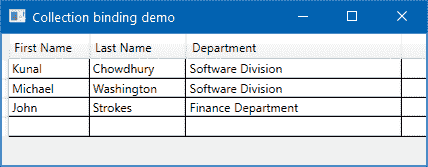

## 它是如何工作的...

当您将对象集合绑定到`DataGrid`时，它会为集合中每个对象创建数据网格行。列定义了对象公开的属性。

当`DataGrid`的`AutoGenerateColumns`属性设置为`True`（默认值）时，它会根据属性列表自动创建列。在这个例子中，我们将`AutoGenerateColumns`属性设置为`False`并显式定义了各个列。使用这种方法，您可以定义要显示或隐藏的列。一旦将集合设置到`DataGrid`的`ItemsSource`属性，它就会相应地填充行和列。

## 还有更多...

你也可以在 XAML 中定义绑定。为此，首先打开 `MainWindow.xaml.cs` 并删除行 `dataGrid.ItemsSource = Employees;`。现在，转到 `MainWindow.xaml` 文件并给窗口一个名字（`x:Name="window"`）。现在，设置 `DataGrid` 控件的 `ItemsSource` 属性，如此处所述：

```cs
<DataGrid ItemsSource="{Binding Employees, ElementName=window}" 
```

让我们再次运行应用程序，通过构建项目。你将在屏幕上看到相同的输出。

# 元素到元素的数据绑定

在最后几个教程中，我们学习了如何进行对象到元素的数据绑定。尽管这很常见，但你可能需要在同一 XAML 页面内进行元素到元素的数据绑定，以减少代码背后的额外代码行。在本教程中，我们将学习如何做到这一点。

## 准备工作

首先，启动你的 Visual Studio IDE 并创建一个新的 WPF 应用程序项目。将其命名为 `CH04.ElementToElementBindingDemo`。

## 如何做到这一点...

现在执行以下步骤以使用 `TextBlock` 和 `Slider` 控件设计 UI。然后我们将滑块控件的值绑定到 `TextBlock` 的 `FontSize` 属性：

1.  打开 `MainWindow.xaml` 页面，将默认的 `Grid` 面板替换为以下 XAML 标记：

```cs
<Grid> 
    <TextBlock FontSize="{Binding Value,  
     ElementName=fontSizeSlider}" 
               Margin="4" 
               HorizontalAlignment="Center" 
               VerticalAlignment="Center"> 
        <Run Text="Font Size:"/> 
        <Run Text="{Binding Value,  
               ElementName=fontSizeSlider}"/> 
    </TextBlock> 
    <Slider x:Name="fontSizeSlider"  
            Minimum="10" Maximum="40" Value="20" 
            LargeChange="5" 
            VerticalAlignment="Bottom" 
            Margin="10"/> 
</Grid> 
```

1.  现在构建项目并运行它。你将在屏幕上看到应用程序 UI，其中包含一个 `TextBlock` 和 `Slider` 控件。

1.  现在增加或减少滑块值，以查看 UI 中的变化，如图所示：

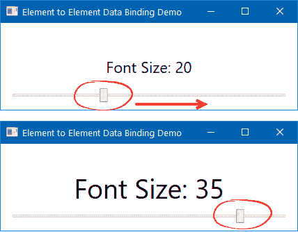

## 它是如何工作的...

当你拖动滑块的滑块时，它会增加或减少滑块控件（在我们的例子中为 `fontSizeSlider`）的值。`TextBlock` 控件的 `FontSize` 属性直接绑定到滑块的值。因此，当你拖动滑块时，根据值，它会增加或减少字体大小。

同样，`TextBlock` 有几个 `Run` 命令。其中一个 `Run` 命令的 `Text` 属性也绑定到滑块值，因此，你可以看到屏幕上的数字（滑块的当前值）作为字体大小。

# 在 DataGrid 控件中排序数据

`DataGrid` 控件用于以表格格式显示多个记录。行和列用于显示数据。除了其他常用功能外，WPF `DataGrid` 控件还提供默认的排序功能。你也可以自定义它以编程方式处理。在本教程中，我们将学习如何将排序功能添加到 `DataGrid` 并按需触发它。

## 准备工作

要开始本教程，打开你的 Visual Studio 编辑器并创建一个新的 WPF 应用程序项目，命名为 `CH04.DataGridSortDemo`。

## 如何做到这一点...

执行以下操作以创建数据模型、填充它并将其绑定到 UI 中的 `DataGrid`。稍后，添加一个 `CheckBox` 控件来自定义排序功能：

1.  首先，在解决方案资源管理器上右键单击，通过右键单击上下文菜单项添加 | 类...创建一个名为 `Employee.cs` 的新类文件，并在其中添加一些属性：

```cs
public class Employee 
{ 
    public string ID { get; set; } 
    public string FirstName { get; set; } 
    public string LastName { get; set; } 
    public string Department { get; set; } 
}
```

1.  打开`MainWindow.xaml.cs`文件，并添加一个类型为`ObservableCollection<Employee>`的依赖属性`Employees`。确保添加以下命名空间，`System.Collections.ObjectModel`和`System.ComponentModel`，以解决所需的类：

```cs
public ObservableCollection<Employee> Employees 
{ 
    get { return (ObservableCollection<Employee>) GetValue(EmployeesProperty); } 
    set { SetValue(EmployeesProperty, value); } 
} 

public static readonly DependencyProperty 
    EmployeesProperty =  
    DependencyProperty.Register("Employees",  
            typeof(ObservableCollection<Employee>),  
            typeof(MainWindow),  
            new PropertyMetadata(null)); 
```

1.  在`MainWindow`类的构造函数中，初始化`Employees`集合如下：

```cs
Employees = new ObservableCollection<Employee> 
{ 
    new Employee 
    { 
        ID = "EMP0001", 
        FirstName = "Kunal", LastName = "Chowdhury", 
        Department = "Software Division" 
    }, 

    new Employee 
    { 
        ID = "EMP0002", 
        FirstName = "Michael", LastName = "Washington", 
        Department = "Software Division" 
    }, 

    new Employee 
    { 
        ID = "EMP0003", 
        FirstName = "John", LastName = "Strokes", 
        Department = "Finance Department" 
    }, 

    new Employee 
    { 
        ID = "EMP0004", 
        FirstName = "Ramesh", LastName = "Shukla", 
        Department = "Finance Department" 
    } 
}; 
```

1.  现在打开`MainWindow.xaml`页面，将默认的`Grid`面板替换为`StackPanel`。在其内部添加一个`DataGrid`控件，并给它一个名字（比如说，`dataGrid`）。将其`AutoGenerateColumns`属性设置为`False`。

1.  创建四个类型为`DataGridTextColumn`的数据网格列，并使用从`Employee`模型公开的属性创建数据绑定。以下是 XAML 代码：

```cs
<StackPanel> 
    <DataGrid x:Name="dataGrid" 
      AutoGenerateColumns="False"> 
        <DataGrid.Columns> 
            <DataGridTextColumn Header="EMP ID"  
                     Binding="{Binding ID}"/> 
            <DataGridTextColumn Header="First Name"  
                     Binding="{Binding FirstName}"/> 
            <DataGridTextColumn Header="Last Name"  
                     Binding="{Binding LastName}"/> 
            <DataGridTextColumn Header="Department"  
                     Binding="{Binding Department}"/> 
        </DataGrid.Columns> 
    </DataGrid> 
</StackPanel> 
```

1.  现在，由于数据网格已经就位，将`Employees`集合分配给数据网格的`ItemsSource`属性。你可以在`MainWindow.xaml.cs`文件中这样做，就在`Employees`集合初始化之后：

```cs
dataGrid.ItemsSource = Employees;
```

1.  如果你现在运行应用程序，你将看到一个`DataGrid`控件，其中包含我们添加到集合中的记录。你将能够通过点击列标题来对记录进行排序，这是控件默认的功能：

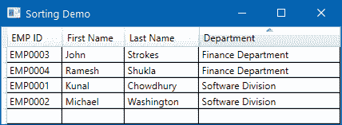

1.  现在，我们需要在 UI 中添加一个`CheckBox`控件来按需切换排序。让我们为`Department`列做这个。在`StackPanel`中，在`DataGrid`控件之后添加以下`CheckBox`：

```cs
<CheckBox x:Name="sortByDepartment" 
          Content="Sort by Department"  
          HorizontalAlignment="Right" 
          Margin="10" 
          Click="OnSortByDepartment"/> 
```

1.  再次导航到`MainWindow.xaml.cs`文件，并在类中添加以下事件：

```cs
private void OnSortByDepartment(object sender,  
 RoutedEventArgs e) 
{ 
    var cvs =   
    CollectionViewSource.GetDefaultView(dataGrid.ItemsSource); 
    if (cvs != null && cvs.CanSort) 
    { 
        cvs.SortDescriptions.Clear(); 

        if (sortByDepartment.IsChecked == true) 
        { 
            cvs.SortDescriptions.Add( 
                new SortDescription("Department",  
                ListSortDirection.Ascending)); 
        } 
    } 
}
```

1.  现在再次运行应用程序。你将看到一个新复选框，位于数据网格下方。切换选择（勾选状态）并观察 UI 上的行为：

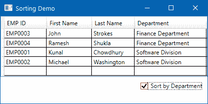

## 它是如何工作的...

一旦`OnSortByDepartment`事件被触发，它就会获取数据网格的默认视图，并将`SortDescription`添加到默认视图实例的`SortDescriptions`属性中。`SortDescription`将属性名称作为第一个参数。它定义了你想要添加排序功能的列。第二个参数是`ListSortDirection`，可以是`Ascending`或`Descending`。

这不仅限于单个`SortDescriptor`。根据你的需求，你可以添加更多。在任何时候，当你想要从应用的排序描述中重置视图时，你可以在视图中调用`SortDescriptions.Clear()`方法（在我们的例子中，它是`cvs`）。

# 在 DataGrid 控件中分组数据

`DataGrid`控件还允许你通过字段名对记录进行分组。在这个菜谱中，我们将学习如何使用`PropertyGroupDescription`实现这个功能。

## 准备工作

让我们从创建一个名为`CH04.DataGridGroupDemo`的新项目开始。确保在创建项目时选择 WPF 应用程序模板。

## 如何做到这一点...

执行以下步骤，在`DataGrid`中显示记录时创建分组：

1.  在项目中创建 `Employee` 模型类，并公开一些属性，就像我们在 *在 DataGrid 控件中排序数据* 菜单中分享的那样。

1.  在 `MainWindow.xaml.cs` 文件中创建相同的依赖属性（`Employees`，类型为 `ObservableCollection<Employee>`）并使用一些数据记录填充集合。

1.  现在，打开 `MainWindow.xaml` 文件，并添加属性 `x:Name="window"` 以给 `Window` 命名，这样我们就可以执行元素到元素的数据绑定。

1.  将默认的 `Grid` 面板替换为 `StackPanel`，并在其中添加一个 `DataGrid` 控件。

1.  将 `DataGrid` 的 `ItemsSource` 属性设置为绑定 `Employees` 集合，该集合从代码后端作为依赖属性公开：

```cs
ItemsSource="{Binding Employees, ElementName=window}" 
```

1.  将数据网格的 `AutoGenerateColumns` 设置为 `False`，因为我们打算手动添加列。

1.  如以下 XAML 片段所示，将四个列添加到数据网格中。

1.  还在 `DataGrid` 之后添加一个 `CheckBox` 控件，以便能够按部门名称对记录应用分组。以下是完整的 XAML 代码：

```cs
<StackPanel> 
    <DataGrid x:Name="dataGrid" 
              ItemsSource="{Binding Employees,  
                ElementName=window}" 
              AutoGenerateColumns="False"  
              CanUserAddRows="False"> 
        <DataGrid.Columns> 
            <DataGridTextColumn Header="EMP ID"  
                 Binding="{Binding ID}"/> 
            <DataGridTextColumn Header="First Name"  
                 Binding="{Binding FirstName}"/> 
            <DataGridTextColumn Header="Last Name"  
                 Binding="{Binding LastName}"/> 
            <DataGridTextColumn Header="Department"  
                 Binding="{Binding Department}"/> 
        </DataGrid.Columns> 
    </DataGrid> 
    <CheckBox x:Name="groupByDepartment" 
              Content="Group by Department"  
              HorizontalAlignment="Right" 
              Margin="10" 
              Click="OnGroupByDepartment"/> 
</StackPanel> 
```

1.  由于我们将在 `DataGrid` 记录上添加分组，我们需要设计分组样式。在 `DataGrid` 内部添加以下片段：

```cs
<DataGrid.GroupStyle> 
    <GroupStyle> 
        <GroupStyle.ContainerStyle> 
            <Style TargetType="{x:Type GroupItem}"> 
                <Setter Property="Margin" Value="0,0,0,5"/> 
                <Setter Property="Template"> 
                    <Setter.Value> 
                        <ControlTemplate TargetType="{x:Type 
                         GroupItem}"> 
                            <Expander IsExpanded="True"> 
                                <Expander.Header> 
                                    <TextBlock Text="{Binding   
                                     Path=Name}" 
                                     Margin="5,0,0,0"/> 
                                </Expander.Header> 
                                <Expander.Content> 
                                    <ItemsPresenter /> 
                                </Expander.Content> 
                            </Expander> 
                        </ControlTemplate> 
                    </Setter.Value> 
                </Setter> 
            </Style> 
        </GroupStyle.ContainerStyle> 
    </GroupStyle> 
</DataGrid.GroupStyle>
```

1.  现在，我们需要添加 `OnGroupByDepartment` 事件实现。打开 `MainWindow.xaml.cs` 并添加以下代码：

```cs
private void OnGroupByDepartment(object sender,  
 RoutedEventArgs e) 
{ 
    var cvs =  
    CollectionViewSource.GetDefaultView(dataGrid.ItemsSource); 
    if (cvs != null && cvs.CanGroup) 
    { 
        cvs.GroupDescriptions.Clear(); 

        if (groupByDepartment.IsChecked == true) 
        { 
            cvs.GroupDescriptions.Add( 
              new PropertyGroupDescription("Department")); 
        } 
    } 
} 
```

1.  现在运行应用程序。您将看到 UI 中包含一个带有一些记录的 `DataGrid`。

1.  点击复选框，选择按部门分组，并观察其行为：

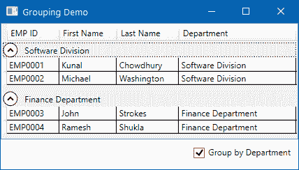

1.  取消选中复选框，将视图恢复到其原始状态。

## 它是如何工作的...

当您触发 `OnGroupByDepartment` 事件时，它检索 `DataGrid` 默认视图的实例并将分组描述应用到它上。分组基于传递给 `PropertyGroupDescription` 的属性名称，如下所示：

```cs
cvs.GroupDescriptions.Add( 
         new PropertyGroupDescription("Department")); 
```

根据这一点，分组样式应用于数据网格。模板包含一个名为要分组列名的 `Expander` 控件作为 `Header`：

```cs
<Expander IsExpanded="True"> 
    <Expander.Header> 
        <TextBlock Text="{Binding Path=Name}" Margin="5,0,0,0"/> 
    </Expander.Header> 
    <Expander.Content> 
        <ItemsPresenter /> 
    </Expander.Content> 
</Expander> 
```

现在，您可以展开或折叠组，并应用排序或过滤来深入数据。这有助于轻松找到正确的记录。

## 还有更多...

您还可以修改 `Expander Header` 以显示组内的记录数。`ItemCount` 属性可以用来显示记录数。修改 `Expander.Header`，如下所示，以自定义它：

```cs
<Expander.Header> 
    <StackPanel Orientation="Horizontal"> 
        <TextBlock Text="{Binding Path=Name}" Margin="5,0,0,0"/> 
        <StackPanel Orientation="Horizontal"> 
            <TextBlock Margin="5,0,0,0" 
                       Text="{Binding Path=ItemCount}"/> 
            <TextBlock Text=" Item(s)"/> 
        </StackPanel> 
    </StackPanel> 
</Expander.Header> 
```

现在重新构建并运行应用程序。一旦窗口加载，点击复选框按部门名称分组记录。观察展开器中的项目数量，如图所示：

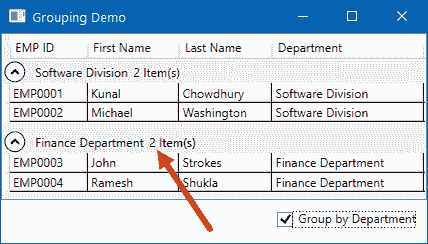

# 在 DataGrid 控件中过滤数据

当我们在 `DataGrid` 中显示大量记录时，用户通常很难在网格中搜索和找到特定的记录。在这种情况下，您可能希望提供额外的功能来过滤记录到特定的搜索词。

在本食谱中，我们将学习如何在 `DataGrid` 控件中添加一个搜索框以过滤记录。

## 准备工作

让我们在 Visual Studio IDE 中创建一个名为 `CH04.DataGridFilterDemo` 的 WPF 应用程序项目。

## 如何做...

现在执行以下步骤以添加附加到网格记录的搜索功能：

1.  一旦创建项目，在项目中添加一个新的 `Employee` 模型类并公开一些属性，就像我们在 *在 DataGrid 控件中排序数据* 食谱中分享的那样。

1.  在 `MainWindow.xaml.cs` 文件中创建相同的依赖属性（`Employees`，类型为 `ObservableCollection<Employee>`）并在集合中填充一些数据记录。

1.  现在打开 `MainWindow.xaml` 文件并添加属性 `x:Name="window"` 以给 `Window` 命名，这样我们就可以执行元素到元素的数据绑定。

1.  将默认的 `Grid` 面板替换为 `StackPanel`。

1.  现在在根 `StackPanel` 内插入以下水平的 `StackPanel`，包含一个 `TextBlock` 和一个 `TextBox`：

```cs
<StackPanel Orientation="Horizontal" 
            HorizontalAlignment="Right" 
            Margin="4 8"> 
    <TextBlock Text="Filter records: "/> 
    <TextBox x:Name="searchBox" Width="100" 
             TextChanged="OnFilterChanged"/> 
</StackPanel> 
```

1.  添加一个 `DataGrid` 控件，其中包含四个列。将 `AutoGenerateColumns` 设置为 `False` 并将 `ItemsSource` 属性的数据绑定到 `Employees` 集合（`ItemsSource="{Binding Employees, ElementName=window}"`）。以下是完整的代码供参考：

```cs
<DataGrid x:Name="dataGrid" 
          AutoGenerateColumns="False" 
          CanUserAddRows="False" 
          ItemsSource="{Binding Employees,  
           ElementName=window}"> 
    <DataGrid.Columns> 
        <DataGridTextColumn Header="EMP ID"  
             Binding="{Binding ID}"/> 
        <DataGridTextColumn Header="First Name"  
             Binding="{Binding FirstName}"/> 
        <DataGridTextColumn Header="Last Name"  
             Binding="{Binding LastName}"/> 
        <DataGridTextColumn Header="Department"  
             Binding="{Binding Department}"/> 
    </DataGrid.Columns> 
</DataGrid> 
```

1.  现在导航到 `MainWindow.xaml.cs` 文件，并添加以下代码块以实现 `OnFilterChanged` 事件，该事件在 `searchBox` 中任何文本更改时被触发：

```cs
private void OnFilterChanged(object sender,  
 TextChangedEventArgs e) 
{ 
    var cvs = 
    CollectionViewSource.GetDefaultView(dataGrid.ItemsSource); 
    if (cvs != null && cvs.CanFilter) 
    { 
        cvs.Filter = OnFilterApplied; 
    } 
} 

private bool OnFilterApplied(object obj) 
{ 
    if(obj is Employee emp) 
    { 
        var searchText = searchBox.Text.ToLower(); 
        return  
           emp.Department.ToLower().Contains(searchText) || 
           emp.FirstName.ToLower().Contains(searchText) || 
           emp.LastName.ToLower().Contains(searchText); 
    } 

    return false; 
}
```

1.  让我们构建项目并运行应用程序。你将在屏幕上看到以下 UI：

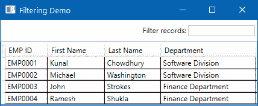

1.  现在通过在文本框中输入一些搜索词来过滤记录。让我们输入 `Finance` 作为关键词并查看行为：

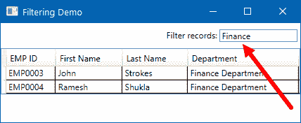

1.  如果你更改搜索词以从记录中执行以下操作，它将仅过滤出这些记录。

## 它是如何工作的...

当你输入一个搜索词时，它会触发事件 `OnFilterChanged` 并检索 `DataGrid` 的默认视图。它暴露了一个名为 `Filter` 的属性，这是一个谓词。在我们的例子中，我们在 `Filter` 属性上分配了谓词 `OnFilterApplied`，当被调用时，它会将术语与 `Department`、`FirstName`、`LastName` 进行比较，如果找到匹配项则返回 `true`。基于 `boolean` 值，它显示相应的记录。

# 使用静态绑定

通常，我们在应用程序中使用静态属性。随着 WPF 4.5 的推出，Microsoft 提供了在执行数据绑定时使用 XAML 标记中的静态属性的选择。在本食谱中，我们将学习如何创建此类绑定。这些绑定在后续的食谱中使用 Converters、Styles 和 Templates 时非常有用。

## 准备工作

让我们从创建一个名为 `CH04.StaticBindingDemo` 的新项目开始。打开你的 Visual Studio IDE 并选择 WPF 应用程序项目作为项目模板。

## 如何做...

一旦创建了项目，请执行以下步骤来学习静态绑定：

1.  打开 `MainWindow.xaml` 页面，并在 `Grid` 面板内添加一个 `Label`。给它一个背景颜色（比如说，`OrangeRed`），然后运行应用程序。这是我们最常用来在行内写入硬编码值的方式：

```cs
<Label Background="OrangeRed" 
       Content="Kunal Chowdhury" 
       FontSize="25" 
       Width="300" Height="60" 
       Padding="10" Margin="10"/> 
```

1.  现在，让我们将其更改为从系统定义的颜色设置背景颜色。为此，我们需要使用 `{x:Static}` 标记扩展来访问静态属性。以下是代码将如何更改：

```cs
<Label Background="{x:Static  
  SystemColors.ControlDarkBrush}" 
       Content="Kunal Chowdhury" 
       FontSize="25" 
       Width="300" Height="60" 
       Padding="10" Margin="10"/>
```

1.  你也可以访问在 XAML 页面内定义的本地资源，或者在集中定义的 `ResourceDictionary` 中定义的资源。让我们在同一页面的 `Window` 下定义一个颜色：

```cs
<Window.Resources> 
    <SolidColorBrush Color="GreenYellow"  
      x:Key="myBrush"/> 
</Window.Resources> 
```

1.  向标签添加一个 `Foreground` 属性，以分配其前景颜色。让我们将其绑定到我们之前定义的静态资源（`myBrush`）。以下是代码供参考：

```cs
<Label Background="{x:Static  
  SystemColors.ControlDarkBrush}" 
       Foreground="{StaticResource myBrush}" 
       Content="Kunal Chowdhury" 
       FontSize="25" 
       Width="300" Height="60" 
       Padding="10" Margin="10"/> 
```

1.  现在，让我们构建并运行应用程序。你将看到类似于以下截图的颜色，其中背景将具有浅灰色（基于设置到系统 `ControlDarkBrush` 的颜色），前景将具有黄绿色：

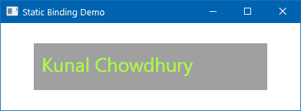

## 它是如何工作的...

标记扩展是一个从 `System.Windows.Markup.MarkupExtension` 派生的类，并实现了一个名为 `ProvideValue` 的单方法。在这个例子中，我们使用了由 `System.Windows.Markup.StaticExtension` 类实现的 `{x:Static}` 标记扩展，它允许你访问静态属性。

同样，`{StaticResource}` 用于访问在 XAML 中定义的资源（颜色、画刷、转换器等）。

# 使用值转换器

当你想在两个类型不兼容的属性之间进行数据绑定时，转换器非常有用。在这种情况下，你需要一段代码来在源和目标之间建立桥梁。这段代码被定义为 **值转换器**。

`IValueConverter` 接口用于创建值转换器，并包含两个名为 `Convert` 和 `ConvertBack` 的方法：

+   **Convert(...)**：当源更新目标对象时被调用

+   **ConvertBack(...)**：当目标对象更新源对象时被调用

在这个菜谱中，我们将学习如何创建值转换器并在数据绑定中使用它们。

## 准备工作

让我们从创建一个新的 WPF 项目开始。命名为 `CH04.ConverterDemo`。

## 如何做...

要开始值转换器，请执行以下步骤：

1.  从解决方案资源管理器中打开 `MainWindow.xaml` 文件。

1.  将现有的 `Grid` 替换为以下 XAML 标记，它包含一个 `CheckBox` 和一个 `Rectangle`，它们位于 `StackPanel` 内：

```cs
<StackPanel Orientation="Horizontal" 
            VerticalAlignment="Top" 
            Margin="20"> 
    <CheckBox x:Name="chkBox" 
              Content="Show/Hide Box"/> 
    <Rectangle Fill="Red" Margin="80 0 0 0" 
               Width="150" Height="50" 
               Visibility="{Binding IsChecked,  
                 ElementName=chkBox}"/> 
</StackPanel> 
```

1.  `Rectangle` 的 `Visibility` 属性与 `CheckBox` 控件的 `IsChecked` 属性之间存在数据绑定。如果你构建并运行应用程序，当你改变复选框的选中状态时，你将看到 UI 中没有明显的可见变化：

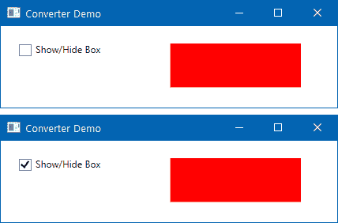

1.  由于`Visibility`属性不接受`boolean`值，因此`Rectangle`默认情况下始终可见。现在我们将添加转换器到它，这将自动将值从`bool`转换为`Visibility`。

1.  让我们在项目中创建一个新的类文件。将其命名为`BoolToVisibilityConverter`。

1.  打开`BoolToVisibilityConverter.cs`文件，并添加以下命名空间——`System`、`System.Globalization`、`System.Windows`和`System.Windows.Data`作为`using`语句。

1.  现在，将类标记为`public`并实现`IValueConverter`接口。

1.  在类内部添加以下两个代码块：

```cs
public object Convert(object value,  
                      Type targetType,  
                      object parameter,  
                      CultureInfo culture) 
{ 
    return value is bool val && val ? Visibility.Visible : 
    Visibility.Collapsed; 
} 

public object ConvertBack(object value,  
                          Type targetType,  
                          object parameter,  
                          CultureInfo culture) 
{ 
    throw new NotImplementedException(); 
} 
```

1.  现在，转到`MainWindow.xaml`文件，添加以下 XMLNS 命名空间，以便我们可以将转换器声明为窗口资源：

1.  在`Window`标签内，添加以下标记以声明我们创建的转换器：

```cs
<Window.Resources> 
    <converters:BoolToVisibilityConverter  
       x:Key="BoolToVisibilityConverter"/> 
</Window.Resources>
```

1.  现在，在`Rectangle`的`Visibility`属性的绑定语法中，将转换器关联为`StaticResource`，如下面的代码片段所示：

```cs
Visibility="{Binding IsChecked, ElementName=chkBox, Converter={StaticResource BoolToVisibilityConverter}}" 
```

1.  完成此操作后，构建项目并运行应用程序。

1.  默认情况下，复选框将处于未选中状态，矩形将不会在屏幕上可见。将复选框的状态更改为选中，观察矩形将变为可见。再次取消选中复选框将再次隐藏矩形：

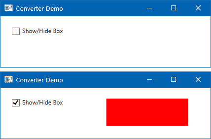

## 它是如何工作的...

使用值转换器（`IValueConverter`接口）将一个值转换为另一个值。这些值可以是相同类型或不同类型，但需要一些无法声明式实现的转换。由于它们是编写在代码中的，因此通常非常强大，因为它们具有更多的逻辑来控制功能。

转换器的实例通常在 XAML 页面上创建，并声明为资源。然后通过使用带有`Converter`属性的绑定表达式将其设置到控件上。

每当源属性发生变化时，转换器通过`Convert`方法返回不同的结果。在双向绑定模式下，会调用`ConvertBack`方法，其中源和目标被反转。在单向绑定中，不需要实现`ConvertBack`，通常我们将它的主体设置为返回一个异常，如下所示——`throw new NotImplementedException();`。

## 还有更多...

您可以通过使用转换器参数来扩展转换器的功能。让我们修改`Convert`方法，以利用名为`parameter`的参数并根据其值反转可见性。

要这样做，请打开`BoolToVisibilityConverter.cs`并修改类实现，如下面的代码片段所示：

```cs
public class BoolToVisibilityConverter : IValueConverter 
{ 
   public object Convert(object value,  
                         Type targetType,  
                         object parameter,  
                         CultureInfo culture) 
   { 
         var val = (bool) value; 
         if (parameter is string param &&  
             param.ToString().Equals("inverse")) { val = !val; } 

         return val ? Visibility.Visible: Visibility.Collapsed; 
   } 

   public object ConvertBack(object value,  
                             Type targetType,  
                             object parameter,  
                             CultureInfo culture) 
   { 
         throw new NotImplementedException(); 
   } 
} 
```

现在，打开`MainWindow.xaml`文件，并修改`Rectangle`的`Visibility`属性的绑定，使其具有`ConverterParameter=inverse`，如下所示：

```cs
<Rectangle Fill="Red" Margin="80 0 0 0" 
           Width="150" Height="50" 
           Visibility="{Binding IsChecked, ElementName=chkBox,  
           Converter={StaticResource BoolToVisibilityConverter},  
           ConverterParameter=inverse}"/> 
```

让我们构建并运行应用程序。您将看到，这次，当复选框未选中时，矩形将默认可见。现在将复选框的状态更改为选中，您将看到矩形在屏幕上变得可见：

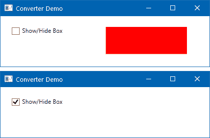

当然，您可以根据业务需求更改实现和 `ConverterParameter` 的值，并使用相同的转换器类在不同的条件下返回不同的值。

您还可以使用 .NET Framework 提供的 `BooleanToVisibilityConverter`。您可以在此处了解更多关于此转换器的信息：[`msdn.microsoft.com/en-us/library/system.windows.controls.booleantovisibilityconverter(v=vs.110).aspx`](https://msdn.microsoft.com/en-us/library/system.windows.controls.booleantovisibilityconverter(v=vs.110).aspx)。

# 使用多值转换器

当您想根据相同或不同类型的多值更改目标值时，您需要使用多绑定。这是通过使用多值转换器（`IMultiValueConverter` 接口）来完成的。

在这个菜谱中，我们将构建一个示例演示，学习如何使用多绑定和多值转换器。

## 准备工作

打开您的 Visual Studio IDE 并创建一个名为 `CH04.MultiValueConverterDemo` 的新项目，基于 WPF 应用程序项目模板。

## 如何做到这一点...

一旦创建项目，请按照以下步骤设计 UI 并在多个元素之间进行多绑定：

1.  从解决方案资源管理器中打开 `MainWindow.xaml` 页面。

1.  在默认的 `Grid` 面板内，创建一些行和列，以便我们可以将元素定位在特定的单元格中。让我们将 `Grid` 分为五行和三列：

```cs
<Grid.RowDefinitions> 
    <RowDefinition Height="Auto"/> 
    <RowDefinition Height="Auto"/> 
    <RowDefinition Height="Auto"/> 
    <RowDefinition Height="Auto"/> 
    <RowDefinition Height="*"/> 
</Grid.RowDefinitions> 
<Grid.ColumnDefinitions> 
    <ColumnDefinition/> 
    <ColumnDefinition Width="90"/> 
    <ColumnDefinition/> 
</Grid.ColumnDefinitions>
```

1.  在 `Grid` 面板内，插入以下 XAML 代码片段，在窗口内添加一些标签和输入框：

```cs
<TextBlock Text="Firstname:"  
           Grid.Column="0" Margin="2 0"/> 
<TextBlock Text="Middle:"  
           Grid.Column="1" Margin="2 0"/> 
<TextBlock Text="Lastname:"  
           Grid.Column="2" Margin="2 0"/> 
<TextBlock Text="Fullname:"  
           Grid.Row="2" Grid.ColumnSpan="3" 
           Margin="2 0"/> 

<TextBox x:Name="firstName" 
         Grid.Row="1" Grid.Column="0" 
         Margin="2 0"/> 
<TextBox x:Name="middleName" 
         Grid.Row="1" Grid.Column="1" 
         Margin="2 0"/> 
<TextBox x:Name="lastName" 
         Grid.Row="1" Grid.Column="2" 
         Margin="2 0"/> 
<TextBox x:Name="fullName" 
         Grid.Row="3" Grid.ColumnSpan="3" 
         Margin="2 0"> 

</TextBox> 
```

1.  构建项目并运行应用程序。您将在屏幕上看到四个输入框及其相关的标签，如下所示：


1.  让我们关闭应用程序并返回到解决方案资源管理器。在项目中创建一个名为 `FullNameConverter` 的新类。

1.  打开 `FullNameConverter.cs` 文件并在其上实现 `IMultiValueConverter`。

1.  在类文件中定义以下 `using` 命名空间—`System`、`System.Globalization` 和 `System.Windows.Data`。

1.  现在在类内部添加以下两个方法，这些方法实现了 `IMultiValueConverter` 接口中定义的方法：

```cs
public object Convert(object[] values, Type targetType, object parameter, CultureInfo culture) 
{ 
    return string.Format("{0} {1} {2}", values[0], values[1], 
    values[2]); 
} 

public object[] ConvertBack(object value, Type[] targetTypes, object parameter, CultureInfo culture) 
{ 
    return value.ToString().Split(' '); 
} 
```

1.  现在导航到 `MainWindow.xaml` 页面，并添加以下 XMLNS 命名空间，以便转换器可以从 XAML 标记中访问：

1.  现在将转换器添加到窗口资源中。为此，在 `Window` 标签内，添加以下标记以通过键名定义实例：

```cs
<Window.Resources> 
    <converters:FullNameConverter  
              x:Key="FullNameConverter"/> 
</Window.Resources> 
```

1.  现在，在 `fullName` 文本框的 `Text` 属性中，定义多绑定以将属性绑定到三个 `TextBox` 控件的 `Text` 属性。以下是代码：

```cs
<TextBox x:Name="fullName" 
         Grid.Row="3" 
         Grid.ColumnSpan="3" 
         Margin="2 0"> 
    <TextBox.Text> 
        <MultiBinding Converter="{StaticResource  
            FullNameConverter}"> 
            <Binding ElementName="firstName"  
                     Path="Text" Mode="TwoWay"/> 
            <Binding ElementName="middleName"  
                     Path="Text" Mode="TwoWay"/> 
            <Binding ElementName="lastName"  
                     Path="Text" Mode="TwoWay"/> 
        </MultiBinding> 
    </TextBox.Text> 
</TextBox> 
```

1.  一旦完成绑定，构建项目并运行应用程序。你将在屏幕上看到相同的用户界面。在`FirstName`、`Middle`和`Lastname`字段中输入一些字符串。观察`Fullname`字段中的值：


1.  同样，将`Fullname`字段更改为包含三个字符串。完成操作后按一下*TAB*键，并观察其他三个字段——`FirstName`、`Middle`和`Lastname`的值。

## 它是如何工作的...

当你在`MultiBinding`中使用类型为`IMultiValueConverter`的转换器时，它将`Binding`标签定义的值作为一个对象数组传递给`Convert`方法。在我们前面的例子中，我们将三个字符串值（`firstName`、`middleName`和`lastName`）传递给`Convert`方法。该方法然后将这些字符串连接起来形成一个单一的字符串，这就是`Fullname`字段的输出字符串，因为绑定是通过其`Text`属性进行的。

同样，当我们更改`Fullname`字段的值时，绑定转换器触发的`ConvertBack`方法返回了分割的字符串。根据绑定顺序，这些值自动分配到相应的字段——`FirstName`、`Middle`和`Lastname`。
